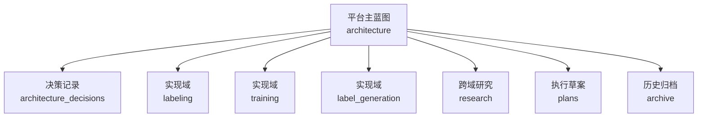

# 文档入口

> 日期：2026-06-08  
> 用途：说明当前文档层级、推荐阅读顺序，以及“平台架构”和“三大实现域”之间的关系。

## 1. 先理解这一版怎么读

当前文档改成了双重视角：

1. `docs/architecture/` 负责回答“平台整体为什么这样设计”。
2. `docs/domains/` 负责回答“后续代码和实现工作主要落在哪三个域里”。
3. `docs/research/` 负责保存跨域研究材料，包括原始调研文档和架构摘要版，不直接归属某一个实现域。
4. `docs/plans/`、`docs/archive/` 只提供执行草案或历史参考，不替代主设计。

三大实现域现在固定为：

- `labeling`：标注、review、工具适配、Case Package、标签导回。
- `training`：任务定义、Dataset Snapshot、训练适配器、模型产出。
- `label_generation`：候选标签生成、伪标签筛选、QC、回流治理。

其中第三个域不用 `pseudo_labeling` 命名，是因为它不只是“生成一个伪标签”，还负责候选标签到 `draft_label` / `accepted_pseudo_label` 的治理过程。

## 2. 推荐阅读顺序

| 顺序 | 文档 | 用途 |
| --- | --- | --- |
| 1 | `docs/architecture/platform_blueprint.md` | 平台主蓝图，先看全局闭环和三大域边界 |
| 2 | `docs/architecture/architecture_decisions.md` | 架构决策记录，解释为什么这样定 |
| 3 | `docs/meeting_minutes_2026-06-07.md` | 会议纪要，记录最新讨论和领导决策 |
| 4 | `docs/domains/labeling/README.md` | 标注域入口，说明 Case Package、Mimics 和标签导回怎么挂在一起 |
| 5 | `docs/domains/training/README.md` | 训练域入口，说明当前 nnUNet 管线在平台里的位置 |
| 6 | `docs/domains/label_generation/README.md` | 标签生成域入口，说明伪标签和候选标签如何回流 |
| 7 | `docs/research/README.md` | 跨域研究材料入口，供后续能力扩展参考 |
| 8 | `docs/plans/platform_implementation_plan_2026-10-30.md` | 2026-10-30 前的平台实施总计划、里程碑和验收清单 |
| 9 | `docs/plans/implementation_backlog.md` | 近期执行草案，方便后面落具体工作 |
| 10 | `docs/archive/annotation_workflow_early_design.md` | 早期标注设计，作为历史参考 |

## 3. 当前文档分层

## 4. 目录说明

| 目录 | 作用 |
| --- | --- |
| `docs/architecture/` | 平台级蓝图、架构决策、事实边界 |
| `docs/domains/labeling/` | 标注域文档，围绕人工 review 和工具适配 |
| `docs/domains/training/` | 训练域文档，围绕任务、快照、训练适配器 |
| `docs/domains/label_generation/` | 标签生成域文档，围绕候选标签、伪标签和回流 |
| `docs/research/` | 跨域研究材料，包含原始调研和摘要版，不直接归属于某一个实现域 |
| `docs/plans/` | 执行草案和近期 backlog |
| `docs/archive/` | 历史设计稿，不作为当前方案依据 |
| `docs/meeting_minutes_2026-06-07.md` | 会议纪要，作为设计调整的来源记录 |

## 5. 代码和实现入口

| 目录 | 当前角色 |
| --- | --- |
| `pipelines/nnunet/` | 当前可复用的 nnUNet 训练、推理、评估代码 |
| `adapters/mimics/` | Mimics 导入导出适配器落点，目前是 POC 骨架 |
| `adapters/nnunet/` | nnUNet Adapter 边界说明，训练核心仍在 `pipelines/nnunet/` |
| `adapters/fewshot/` | FewShot Adapter 落点，当前仅确认架构位置，实现后置 |
| `adapters/label_generation/` | 公开算法、内部模型、批量推理输出的适配器落点 |
| `scripts/` | Case Package 文件阶段的通用工具脚本 |

## 6. 维护原则

1. 平台设计以 `docs/architecture/platform_blueprint.md` 为准。
2. 三大实现域是当前最重要的实现定位入口，后续新增文档优先放入对应域。
3. 如果一个文档讨论跨域研究方向而不是具体实现职责，优先放在 `docs/research/`。
4. 如果一个文档同时涉及多个域且已经形成平台决策，优先放在 `docs/architecture/`，并在各域入口里链接它。
5. `docs/domains/labeling/` 不定义训练标签编号规则；训练编号规则以训练域和主蓝图为准。
6. `docs/domains/training/` 不定义人工 review 流程；review 契约以标注域为准。
7. `docs/domains/label_generation/` 不把候选标签直接视为真值，必须记录来源和准入策略。
8. Mimics 相关具体 API、版本号、系统要求等，只有在本机 POC 或官方文档核实后才能写成确定事实。
9. 执行计划可以有，但不能替代架构设计。
