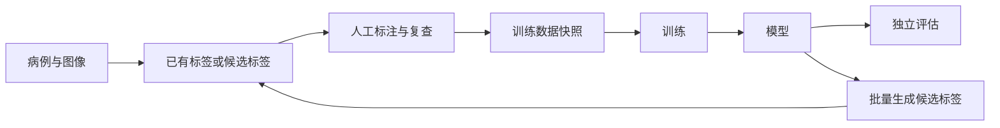

# 分割平台蓝图

> 版本：v1.0
> 日期：2026-06-13
> 状态：当前平台的总体设计，不是字段手册，也不是实施排期
> 阅读提示：本篇先讲人怎样完成工作，再解释平台内部怎样记录。固定用词见[常用词说明](../glossary.md)，字段示例见[核心数据与操作模型](platform_data_model.md)。

## 1. 这份蓝图回答什么

这份蓝图只回答六个问题：

1. 平台最终要解决什么问题？
2. 数据、标注、训练、评估和候选标签怎样连成闭环？
3. 为什么代码分为人工标注、模型训练和候选标签生成三个实现域？
4. 哪些规则是医学分割平台必须保留的安全底线？
5. Mimics、nnUNet 和外部算法怎样接入，而不成为平台本身？
6. 第一阶段做什么，哪些能力明确延后？

如果你只想理解平台全貌，读到第 5 章即可。准备实现时，再继续阅读后面的规则和阶段安排。

## 2. 平台目标

平台的最终目标是支持全身器官分割，但不要求一开始就用一个模型分割全身所有器官。

现实数据通常并不整齐：

- 有的检查只覆盖胸部，有的只覆盖腹部。
- 有的数据只标了肺，有的数据只标了肝胆。
- 同一病例中的不同器官可能来自人工标注、外部数据集或模型预测。
- 不同任务需要不同分辨率、不同标签编号和不同训练框架。

因此，平台必须允许同一批病例服务多个任务。例如，同一份腹部 CT 可以用于肝胆任务、肾脏任务、低分辨率粗分割任务，后续也可以用于全身模型任务。

平台真正要管理的不是某个工具，而是这些关系：

```text
病例
-> 图像
-> 标签及其来源
-> 某次训练实际采用的数据
-> 训练出的模型
-> 模型评估结果
-> 模型生成的新候选标签
```

nnUNet、Mimics、MONAI、TotalSegmentator 或其他工具都只是这条流程中的执行工具。

## 3. 一个病例怎样走完整流程

下面用一份“带部分肝胆标签的腹部 CT”说明完整流程。

1. **导入数据**
   平台读取 DICOM 或转换后的医学图像，按患者、检查和序列分组。平台记录文件校验值、图像空间信息和来源。

2. **登记已有标签**
   数据集自带的肝标签登记为“外部来源标签”。模型生成的胆囊标签登记为“候选标签”。两者不会因为放在同一个文件中就失去各自来源。

3. **创建人工标注任务**
   平台生成病例包，说明标注者需要检查肝和胆囊。标注者可以保存中间进度；只有明确提交完成后，平台才把通过检查的结果登记为新的“人工确认标签”。

4. **创建训练数据快照**
   训练者选择“肝胆任务”和数据范围。平台按照本次规则选择可用标签，固定训练集、验证集和测试集，并记录每个病例实际使用了哪个标签版本。

5. **导出并训练**
   nnUNet 工具适配器把训练数据快照转换为 nnUNet 需要的目录和整数标签。现有训练管线继续负责预处理、训练和预测。

6. **登记模型**
   训练完成后，平台记录模型使用了哪个数据快照、代码和配置，权重放在哪里，以及模型目前允许做什么。

7. **独立评估**
   模型在没有进入训练的独立病例上评估。平台检查患者是否泄漏、参考标签是否由该模型或其上游模型产生，然后保存一份不可修改的评估记录。

8. **生成下一轮候选标签**
   模型对新病例批量推理。每个输出先登记为候选标签，并保留模型版本、参数和质量检查结果。候选标签可以送人工修正，也可以在下一次创建训练数据快照时按规则选择。

这个例子就是平台的最小闭环。后续 Web 界面和流程调度器只是把这些动作做成按钮，不改变底层规则。



### 3.1 平台底层是对象图，不是一条线性流水线

上一节按常见顺序讲，是为了让读者先理解最小闭环；它不表示每批数据都必须按同一条直线走完。平台真正冻结的是 Registry 中的对象和对象关系：

```text
Case / Image Artifact
-> Review Task 或 Candidate Generation Job
-> Label Artifact
-> Dataset Snapshot
-> Model Record
-> Candidate Label
```

因此，允许出现以下非线性情况：

| 情况 | 合法做法 | 当前阶段边界 |
| --- | --- | --- |
| 同一批图像分给不同工具 | 同一 Image Artifact 可创建多个 Review Task，分别交给 Mimics、Slicer 或其他工具适配器 | 阶段 A 以病例包和 review package 表达分支，不引入通用 DAG 调度器 |
| 同一病例不同器官分给不同人 | 每个标注者产出独立 Label Artifact；后续用受控合并动作生成新的 active Label Artifact | 自动仲裁和多标签合并工具仍是后续项；不要在同一 `.mcs` 中多人混写 |
| QC 失败后返修 | Review Task 回到 `in_progress`，标注者修正后再次提交 | 已支持 Mimics finalize 失败回环 |
| Snapshot 阶段发现标签或划分问题 | 划分问题修正 split plan 后重建 Snapshot；标签问题创建 follow-up review | 当前没有“一键从 Snapshot finding 创建返修任务”的命令 |
| 图像已有可信外部标签 | 用 `sp label register` 直接登记为 `source_label`，Snapshot 的 `label_policy` 决定是否采用 | 阶段 A 支持单文件注册和空间检查；复杂批量标签接入仍建议先走 dataset description 或 custom importer |

阶段 A 的原则是：**不要先实现复杂编排引擎，但必须让 Registry 能表达分支、回环和多版本来源。** 脚本可以按顺序运行，数据模型不能被顺序绑死。

## 4. 三大实现域

目录按工程责任分为三个实现域。它们共同完成一条流程，不是三个独立平台。

| 实现域 | 主要工作 | 从哪里开始 | 产出什么 |
| --- | --- | --- | --- |
| `labeling`（人工标注与复查） | 准备病例包、调用标注工具、保存进度、提交、复查和导回 | 已登记的图像和可选草稿标签 | 新的人工确认标签或待复查结果 |
| `training`（模型训练） | 固定训练数据、导出训练格式、运行训练和正式评估 | 训练数据快照 | 模型记录和评估记录 |
| `label_generation`（候选标签生成） | 调用内部模型或外部算法、检查输出、记录失败并回流 | 图像和一个明确的模型或算法来源 | 候选标签及其质量报告 |

### 4.1 为什么第三个域叫 `label_generation`

它不只“生成伪标签”。它还要：

- 记录是哪个模型或算法生成的。
- 把外部器官名称映射为平台统一名称。
- 检查图像和标签是否对齐。
- 记录空标签、异常体积和置信度等证据。
- 决定结果送人工复查、保留为候选，还是拒绝。

因此，“候选标签生成”比 `pseudo_labeling` 更准确。

### 4.2 域之间最容易混淆的边界

- 候选标签生成域可以建议“送人工复查”，但人工修正属于标注域。
- 候选标签生成域可以提供质量证据，但不能决定一份标签永远可以训练。
- 训练域在创建训练数据快照时决定本次训练采用哪些标签。
- 标注域只产出可追溯标签，不负责 nnUNet 内部使用哪个整数编号。

## 5. 操作者需要理解什么

平台不应要求标注者、训练者和评估者理解内部目录、文件校验值或标签编号。

| 角色 | 实际要做的事 | 不应要求其手工处理 |
| --- | --- | --- |
| 标注者 | 打开任务、修正、保存进度、提交完成、提交复查或报告阻塞 | 文件校验值、空间矩阵、标签文件拆分、生命周期字段 |
| 训练者 | 选择任务和数据范围、创建训练数据快照、启动训练 | 逐个挑选 mask 文件、手工重排标签编号 |
| 评估者 | 选择模型和独立评估集、启动评估、查看失败病例 | 权重路径拼接、患者泄漏脚本参数 |
| 平台管理员 | 配置数据来源、任务规则、工具适配器和使用限制 | 替其他角色逐病例修正文件路径 |

第一阶段可以由同一个人承担所有角色，也可以由这个人运行准备和收尾脚本。这里的角色划分用于明确职责，不要求立即建设账号、权限或审批系统。

服务化后，用户看到的主要动作应保持稳定：

- 创建标注任务。
- 保存标注进度。
- 提交完成或提交复查。
- 创建训练数据快照。
- 启动训练。
- 启动正式评估。
- 批量生成候选标签。

## 6. 平台内部必须保留哪些记录

下面的名称是实现者需要维护的记录。它们不是要求普通用户学习的一套业务语言。

| 中文名称 | 英文规范名 | 解决的实际问题 |
| --- | --- | --- |
| 病例工作单元 | Case | 哪些图像和任务属于同一次工作上下文 |
| 图像记录 | Image Artifact | 图像文件在哪里、是否变化、空间信息是什么 |
| 标签记录 | Label Artifact | 标签对应哪张图、有哪些器官、来自哪里、当前版本是什么 |
| 标注或复查任务 | Review Task | 谁要处理哪些图像和器官，当前进度如何 |
| 资产登记册 | Data Registry | 去哪里查病例、标签、模型和运行记录 |
| 器官名称表 | Anatomy Vocabulary | 不同数据集对同一器官使用不同名称时怎样统一 |
| 任务标签编号表 | TaskLabelMap | 某个训练任务中各器官使用哪个整数编号 |
| 训练数据快照 | Dataset Snapshot | 某次训练到底用了哪些病例、标签版本和划分 |
| 模型记录 | Model Record | 模型如何训练、权重在哪里、允许做什么 |
| 评估记录 | Evaluation Record | 模型在某个独立评估集上的一次正式结果 |
| 候选标签生成批次 | Candidate Generation Job | 一次批量推理处理了哪些病例，哪些成功或失败 |
| 工具适配器 | Adapter | 怎样把平台数据转换给 Mimics、nnUNet 或外部算法 |

第一阶段，这些记录可以是 JSON/YAML 清单文件和普通目录，不需要先做数据库。

## 7. 标签怎样设计

### 7.1 器官名称和训练编号是两件事

平台需要一套统一器官名称，例如：

```yaml
liver:
  display_name: Liver
  aliases: [hepatic]

kidney_left:
  display_name: Left kidney
  aliases: [left_kidney]
```

这套名称表只回答“这是哪个器官”。

每个训练任务还要有自己的标签编号。例如肝胆任务可以写成：

```yaml
task_id: CT5_Liver
labels:
  background: 0
  gallbladder: 1
  liver: 2
```

这张表只回答“在本次训练中，这个器官用哪个整数表示”。

同一器官在不同任务中可以使用不同编号。现有 `ModelMap.toml` 已经具备这种任务级编号能力，因此平台不需要为统一器官名称而重写 nnUNet 训练核心。

### 7.2 同一病例可以服务多个任务

图像和标签只需在资产登记册中登记一次。肝胆任务、肺任务或粗分割任务分别创建自己的训练数据快照。

同一病例可以进入多个任务，但必须防止患者泄漏：

- 同一患者的不同检查不能同时出现在训练集和正式评估集。
- 评估多个局部模型组成的全身系统时，评估患者不能出现在任何一个成员模型的训练数据中。

### 7.3 标签生命周期只说明“它是什么”

第一阶段保留五种底层状态：

| 状态 | 含义 |
| --- | --- |
| `source_label` | 外部数据集自带的标签 |
| `candidate_label` | 模型、外部算法或规则脚本生成的候选标签 |
| `draft_label` | 准备给人工修正但尚未明确完成的草稿 |
| `verified_label` | 人工明确提交完成，且平台检查通过的新版本 |
| `rejected_label` | 已明确拒绝使用，但保留记录 |

“高质量伪标签被某次训练采用”不是第六种生命周期状态。平台仍把它记录为 `candidate_label`，只在对应训练数据快照中写明“本次采用”。

`accepted_pseudo_label` 最多作为界面上的说明文字，不能成为文件名、底层状态或来源字段。

### 7.4 训练是否采用标签，由本次快照决定

一份标签的来源不能直接等同于质量。

- 公认数据集的原始标签可以保持 `source_label`，无需先改成人工确认标签。
- 模型候选标签即使质量很高，仍保持 `candidate_label`。
- 人工确认标签通常可以训练，但仍可能受到任务范围或许可限制。

创建训练数据快照时，平台按照本次标签准入规则检查：

- 允许哪些生命周期状态。
- 允许哪些数据集、模型或外部算法来源。
- 图像和标签是否对齐。
- 必要的质量证据是否存在。
- 数据许可和用途是否允许。

缺少必要证据时默认不采用，不能静默放行。

### 7.5 没有标签不等于器官不存在

平台必须区分三种情况：

| 情况 | 含义 | 训练时怎样处理 |
| --- | --- | --- |
| `uncovered` | 图像没有扫描到该器官 | 该病例不能为这个器官提供监督 |
| `missing_label` | 图像覆盖了器官，但没有标注 | 不能自动写成背景 |
| `confirmed_absent` | 图像覆盖了相应区域，并确认器官不存在 | 可以按任务规则作为负样本 |

第一阶段的 nnUNet 工具适配器采用保守策略：多类任务中只要当前目标器官缺少标注，就排除该病例，不让现有转换脚本把缺失器官静默写成背景。只有未来明确实现部分标签损失或体素级忽略区域时，才采用更细的处理。

### 7.6 多模型输出怎样合并

任务标签编号表用于训练；合并输出编号表（Combine Map）用于把多个局部模型结果放进一份全身 mask。

例如，肝在肝胆训练任务中可以是编号 2，在 CT 全身合并结果中可以是编号 37。两者用途不同，不构成冲突。

CT 和 MR 可以有各自的合并输出编号，不能强行从器官名称表派生一个全平台唯一编号。第一阶段沿用确定性的覆盖顺序：按配置依次写入，后写入的结果覆盖先写入的结果，并记录发生重叠的体素数量。基于概率图的冲突仲裁延后。

## 8. 不能省掉的安全规则

### 8.1 图像和标签必须真正对齐

图像和标签的数组大小相同，不代表它们在医学坐标中对齐。平台要检查：

- 体素数组大小 `shape`
- 体素间距 `spacing`
- 图像原点 `origin`
- 图像方向 `direction`
- 体素坐标到物理坐标的变换 `affine` 或等价信息
- 是否做过重采样、裁剪或方向调整

任何工具改变了这些信息，都必须生成新文件记录，并保存变换过程。导入、人工标注导回、候选标签回流、训练导出和评估前都要检查。无法证明对齐时，默认阻断。

### 8.2 标签来源和旧版本不能被覆盖

人工修正、质量修复和状态提升都创建新的标签版本。旧文件可以标记为已被替代，但不能覆盖删除。

训练数据快照引用具体标签版本和文件校验值，因此：

- 标签后来被修正，不会改变已经完成的训练事实。
- 想使用新标签时，创建新的训练数据快照。
- 如果某个标签后来发现有问题，可以反查哪些模型使用过它。

### 8.3 数据治理和使用限制必须随数据传播

平台区分两个区域：

- **受控原始区**：可以保存受限制的原始 DICOM。
- **工作区**：只保存完成规定去标识检查的数据，并使用平台生成的病例和图像标识。

患者关联键只用于把同一患者的检查放入同一防泄漏分组，不代表数据已经完成去标识。去标识状态未确认时，数据不能发给标注者、训练服务器或外部工具。

数据和模型还要记录训练、商业使用、再分发和衍生模型发布等限制。多个来源合并时采用最严格结果；任何来源禁止或仍需确认，合并结果就不能直接发布。

### 8.4 训练和评估必须防止两类泄漏

正式评估同时检查：

1. **患者泄漏**：评估患者不能出现在训练数据中。
2. **标签来源泄漏**：评估参考标签不能由待评估模型、它的上游模型或同一伪标签链生成。

标签来源泄漏依据每个标签 segment 的生成血统（`lineage.contributing_generators`，即历史上贡献过像素的全部生成器的传递闭包）判断，而不是只看当前来源。人工修正候选标签后，该字段必须继续保留上游生成器，否则被修正过的伪标签会被误当作独立参考。具体字段见[平台数据模型](platform_data_model.md) 5.5。

正式评估结果保存在独立、不可修改的评估记录中。训练过程中的验证指标可以留在模型记录中，但不能代替独立评估。

### 8.5 质量检查是证据，不是标签状态

质量检查（Quality Control，QC）包括：

| 检查层面 | 检查内容 | 失败后怎样处理 |
| --- | --- | --- |
| 文件和空间 | 文件能否读取，图像与标签是否对齐，标签值是否合法 | 阻断，修复后生成新文件版本 |
| 标签内容 | 是否为空、是否越界、体积是否异常、目标器官是否出现 | 记录问题，按任务规则送复查或拒绝 |
| 本次训练准入 | 来源、状态、质量证据、使用限制是否满足本次规则 | 不进入本次训练数据快照 |

通过质量检查不会把模型标签改成人工真值；人工标签也不会因为状态为 `verified_label` 就永久免检。

## 9. 五个关键操作

### 9.1 导入数据

所有来源都先经过导入脚本：

- 多患者、多检查或多序列 DICOM 目录。
- 单个 NIfTI 文件。
- MHD+RAW 文件组。
- 带显式读取参数的纯 RAW。
- 无标注数据。
- 部分器官标签数据。
- 人工金标准数据。
- 内部模型输出。
- TotalSegmentator、CADS 等外部算法输出。
- 标注工具导回结果。

导入脚本负责创建图像或标签记录，保存来源、文件校验值、空间信息、器官覆盖情况、去标识状态和使用限制。

平台不要求导入时把所有来源强制转换成同一种格式。每个独立三维体素网格创建一个 Image Artifact；原始文件保留不变，只有目标工具需要时才创建派生 NIfTI 或其他格式。

来源缺少患者、检查、模态或完整物理空间信息时，平台不填假值：

- 平台标识可以生成；
- 缺失模态写成 `UNKNOWN`；
- 空间信息按 `complete`、`partial` 或 `index_only` 记录；
- 标注、训练和正式评估分别判断能否使用；
- 患者关联可信度不足的数据不能用于宣称患者独立的正式评估。

详细分组、格式、文件组校验和信息缺失策略见[数据导入与规范化契约](data_ingestion_contract.md)。

### 9.2 人工标注与复查

第一阶段采用离线病例包：

1. 平台按患者、检查和序列整理图像。
2. 平台创建标注任务，并生成病例包。
3. 标注者在 Mimics 或其他工具中打开图像和草稿标签。
4. 标注者可以反复保存工作进度。
5. 标注者对一组目标选择“提交完成”“提交复查”或“报告阻塞”。
6. 平台只导回本次提交的目标，并检查空间、标签值、任务归属和来源。
7. 通过检查的目标创建新的人工确认标签版本；不确定目标进入待复查。

保存进度不等于提交完成。第一阶段允许同一人完成验证，但必须保留显式提交动作。

完整操作见[标注工作流](../domains/labeling/labeling_workflow.md)。

### 9.3 创建训练数据快照并训练

训练从训练数据快照开始，不直接读取散落文件夹。

快照固定：

- 任务和目标器官。
- 实际纳入的病例、图像和标签版本。
- 训练、验证和测试划分。
- 本次采用的标签准入规则和逐标签结果。
- 预处理意图，例如低分辨率粗分割的目标间距。
- 数据使用限制。

nnUNet 工具适配器随后：

- 检查任务标签编号从 0 开始、连续、无空缺；允许多个器官名映射到同一非零整数（有意合并，见 ADR-034）。
- 检查每个器官名称都存在于统一名称表。
- 检查训练集中每个目标类别至少出现一次。
- 排除会把缺失标签误写成背景的病例。
- 导出 `imagesTr`、`labelsTr`、`imagesTs`、`labelsTs` 和 `dataset.json`。
- 调用现有训练管线。
- 训练完成后创建模型记录。

#### 9.3.1 `TaskDefinition` 与结构化 `label_policy`

这里保留两项不同层级的设计，不应混为一个对象：

- `label_policy` 是每个训练数据快照的必需结构化内容。它明确本次训练允许哪些标签状态和来源、要求哪些质量证据，以及证据缺失时如何处理。
- `TaskDefinition` 是可选的复用模板，用于给同类训练任务提供目标器官、任务标签映射、默认准入策略和预处理意图。

阶段 A 不实现 `TaskDefinition` 的模板继承、版本解析或配置服务。创建快照时，操作者或脚本直接提供完整的 `label_policy`，平台完成校验后把解析结果冻结在快照中。

后续引入 `TaskDefinition` 时，它也只提供默认值。平台必须先把模板和本次覆盖项解析成完整策略，再写入新快照。训练适配器只读取快照，不在运行时读取模板；模板后续修改不能改变已有快照。

因此，训练可复现性的唯一依据始终是 Dataset Snapshot 内冻结的 resolved `label_policy`，而不是可变的任务模板。具体字段见 [平台数据模型](platform_data_model.md#78-taskdefinition-与训练数据快照)。

### 9.4 批量生成候选标签

一次批量运行必须创建“候选标签生成批次”记录，而不是只留下散落文件。

批次记录：

- 使用的模型或外部算法。
- 输入图像。
- 参数、代码或镜像版本。
- 标签名称映射。
- 每个病例成功、失败或跳过的结果。
- 每个成功输出的标签记录和质量报告。

已成功病例不会因重跑被覆盖。失败病例可以单独重试。一个病例失败不应让其他成功结果丢失。

### 9.5 正式评估

正式评估创建独立评估记录，至少包含：

- 被评估的模型或多模型组合。
- 独立评估数据快照。
- 评估代码和配置版本。
- 患者泄漏与标签来源检查结果。
- 逐器官指标。
- 失败病例。
- 评估报告文件及校验值。

同一个模型可以有多次评估记录，新结果不能覆盖旧结果。

## 10. 工具适配器的接入标准

工具适配器的目的不是让所有工具内部实现相同，而是让它们遵守稳定的输入输出边界。

### 10.1 标注工具适配器

必须能够：

- 接收已登记图像和可选草稿标签。
- 把平台器官名称映射到工具中的标签或 mask。
- 导回指定目标，而不是无差别导回所有内容。
- 保存工具产生的空间变化。
- 生成质量报告和新的标签版本。

### 10.2 训练工具适配器

必须：

- 只消费训练数据快照。
- 解释任务标签编号表。
- 记录真实预处理、训练配置和代码版本。
- 产出模型记录。

因此，未来可以接入不同于 nnUNet 的框架，但不能绕过数据登记册直接读取一批无法追溯的文件。

### 10.3 候选标签生成适配器

必须：

- 接收图像，以及明确的模型记录或外部算法说明。
- 把输出登记为候选标签。
- 记录算法版本、参数、标签映射和质量报告。
- 为批量运行创建可恢复的运行记录。

外部算法不能走“没有来源记录”的特殊路径。

### 10.4 少样本学习怎样接入

少样本学习首先是一种实验设置，不是一个统一训练框架。

- 低样本 nnUNet 继续使用 nnUNet 工具适配器。
- 支持集、查询集、样本数和随机种子先放在单独的实验协议文件中。
- 只有某个具体少样本方法完成复现，并形成稳定输入输出后，才为它增加专用工具适配器。

## 11. 当前代码能复用什么，必须补什么

当前训练代码主要位于 `pipelines/nnunet/`。

| 当前实现 | 可以复用 | 接入平台前必须补齐 |
| --- | --- | --- |
| `ModelMap.toml` | 任务级器官编号 | 由平台校验名称、编号连续性和任务范围 |
| `AutoSegmentationFramework.py` | 转换、预处理、训练、预测、评估的调用顺序 | 由工具适配器提供固定数据快照和真实元数据 |
| `Action1_ConvertLabeledToTrainData.py` | 逐器官 mask 合并和粗分割映射 | 阻止缺失 mask 被静默写成背景 |
| 当前数据划分 | 可用于临时实验 | 正式训练必须使用固定的患者级划分 |
| 当前 `dataset.json` 生成 | 目录结构可复用 | 数据集名称、描述和许可不能继续写死 |
| 当前评估脚本 | Dice 计算路径可复用 | Surface Dice 依赖和正式评估记录仍需补齐 |

因此，平台不重写 nnUNet 训练核心。第一步是在现有管线前后增加：

1. 数据导入和登记。
2. 训练数据快照。
3. nnUNet 工具适配器。
4. 模型和评估记录。

上述四项仍是架构层描述。具体要新增哪些 Python 包、命令、测试，工作量和依赖顺序见[阶段 A 开发执行说明](../plans/development_execution_guide.md)。

## 12. Mimics 的定位

Mimics Research 21.0 是优先验证的人工标注工具候选，不是平台核心，也不是已经确定的唯一工具。

官方资料可以确认：

- 可导入 DICOM，并在一个项目中管理多个图像集。
- 脚本可以获取当前活动图像、创建和编辑 Mask，并读取或写入 Mask 体素数据。
- 可通过命令行参数运行脚本。
- `.mcs` 项目文件可以保存图像集、Mask 和工作现场，适合作为中间进度文件。
- 内置 Python 属于 3.5 系列，适合调用 Mimics API，不适合承担平台主运行环境。

目前不能直接假设：

- 21.0 原生稳定支持 NIfTI 或 MHD/MHA 的完整导入导出。
- 可以通过 `set_voxel_buffer()` 任意创建图像；已确认的接口针对 Mask。
- 数组大小相同后复制空间矩阵就能保证对齐。
- `.mcs` 在任意机器、版本和许可环境中都能独立打开。

验证顺序应从最简单路径开始：

1. 先验证 Mimics 本身能否直接完成所需图像和标签交换。
2. 平台现代 Python 与 Mimics Python 3.5.2 始终隔离；直接标签路径不足时，再启用两者之间的逐器官体素文件桥。
3. 如果仍无法可靠证明空间一致性，保留更换标注工具适配器的能力。

完整调研见[Mimics 可行性](../domains/labeling/mimics_feasibility.md)，代码边界和标注者操作见[Mimics 适配器设计与开发流程](../domains/labeling/mimics_adapter_design.md)，实际验证步骤见[Mimics POC 计划](../domains/labeling/mimics_poc_plan.md)。

## 13. 分阶段建设

阶段名称描述架构成熟度，不表示必须把某一阶段全部做完后才能开始下一阶段。实现时优先跑通一条最小纵向闭环。

| 阶段 | 平台形态 | 完成标志 |
| --- | --- | --- |
| A. 文件包和基础记录 | 离线脚本、JSON/YAML 清单、病例包 | 病例、图像和标签能登记、往返标注并通过关键检查 |
| B. 数据登记册和训练快照 | 可查询的登记结构、不可修改的训练数据快照 | 同一数据能被多个任务复用，训练可以复现 |
| C. 训练工具适配 | nnUNet 工具适配器和模型记录 | 平台快照能稳定导出并训练 |
| D. 离线候选标签回流 | 批量运行记录、候选标签和质量报告 | 模型能为下一轮数据建设提供可追溯候选标签 |
| E. 服务化 | Web 界面、任务队列、权限和流程调度 | 用户不再直接运行底层脚本 |

首次可训练闭环至少需要 A-C 的最小能力。首次数据回流闭环还需要 D 的最小能力。

第一阶段明确延后的内容：

- Web 界面、任务队列和完整权限服务。
- 多人抢占、在线租约、超时回收和复杂仲裁。
- 复杂器官层级本体。
- 基于概率图的多模型冲突仲裁。
- 任务模板继承和通用工作流数据模型。
- 通用少样本工具适配器。

第一阶段不能延后的内容：

- 图像和标签空间一致性检查。
- 标签来源和版本记录。
- 缺失标签与背景的区分。
- 患者级训练和评估防泄漏。
- 去标识状态和使用限制。
- 不可修改的训练数据快照。

## 14. 已确定的设计

| 问题 | 当前决定 |
| --- | --- |
| 全身模型还是多模型 | 第一阶段沿用当前多个局部模型组合；后续再实验统一模型 |
| 第一阶段器官范围 | 以当前 v500 所有训练任务为起点，不人为缩小到单一器官 |
| 候选标签能否训练 | 可以，但来源仍是候选标签；是否采用只写入本次训练数据快照 |
| 外部权威数据集标签 | 保持外部来源状态，由本次训练规则明确允许 |
| 标注保存与提交 | 保存只保存进度；明确提交且检查通过后才创建人工确认标签 |
| 不确定标注 | 使用待复查任务，不增加新的标签生命周期状态 |
| 多序列病例 | 多个图像集地位平等；任务明确在哪个图像集上标哪些器官 |
| 已确认标签继续修改 | 允许，但创建新版本，不覆盖旧版本 |
| 多标注员 | 第一阶段使用任务分配和基础版本校验；在线租约后置 |
| 训练数据快照 | 创建后不修改；新标签或新规则必须创建新快照 |
| 正式评估 | 只使用独立参考标签，并检查患者和标签来源泄漏 |
| 模型运行状态 | 训练完成先登记；检查通过后才允许正式生成候选标签；受影响模型可隔离 |
| Mimics | 先做本机可行性验证，再决定是否作为主要标注工具 |

## 15. 仍需通过实验确定的问题

| 问题 | 影响环节 | 为什么现在不能直接定 |
| --- | --- | --- |
| 每个数据集和算法的具体许可结论 | 数据导入、模型训练和发布 | 必须逐来源核对许可文本和实际用途 |
| 候选标签的准入阈值 | 创建训练数据快照 | 不同器官和生成器需要不同的置信度、体积和抽检规则 |
| Mimics 是否成为主要标注工具 | 人工标注与复查 | 取决于 21.0 本机验证的空间一致性、导入导出和操作成本 |

这些问题不阻止第一阶段建立离线闭环，但会影响后续加固和验收。

## 16. 参考来源

- [nnU-Net dataset format](https://github.com/MIC-DKFZ/nnUNet/blob/master/documentation/dataset_format.md)
- [nnU-Net region-based training and ignore label](https://github.com/MIC-DKFZ/nnUNet/blob/master/documentation/region_based_training.md)
- [Mimics Research 21.0 本地 API 参考](../references/mimics/api_21/Mimics_API_Documentation.md)
- [MONAI Label](https://github.com/Project-MONAI/MONAILabel)
- [TotalSegmentator](https://github.com/wasserth/TotalSegmentator)
- [CADS 论文](https://arxiv.org/abs/2507.22953)
