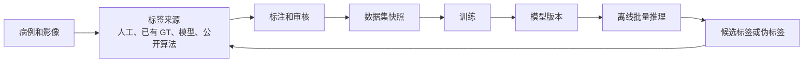
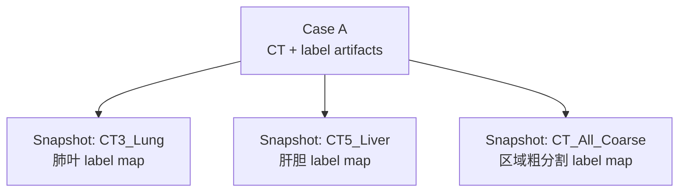
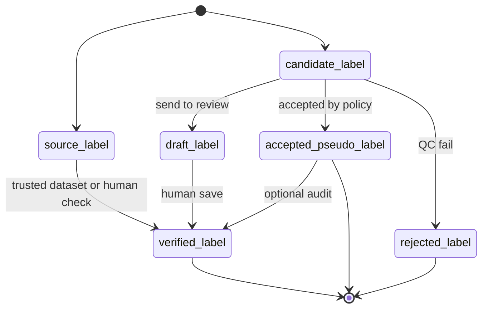
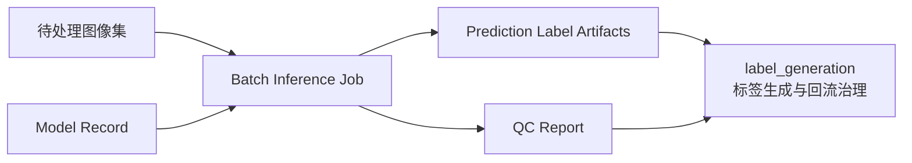

# 分割平台蓝图

> 版本：v0.4  
> 日期：2026-06-06  
> 状态：架构蓝图，不是实现计划  
> 事实边界：仓库事实来自当前代码和配置；外部事实来自文末来源；无法公开核实的内容一律标为“待 POC”。

## 1. 先读结论

这个平台的根本目标是支持全身器官分割，但训练任务不必一开始就是“一个模型分割全身所有器官”。真实数据会有不同扫描区域、不同模态、不同标注完整度，因此平台要允许同一批病例被组织成多个训练任务：例如肺叶任务、肝胆任务、椎体任务、粗分割任务，或者后续的全身模型任务。

当前最重要的架构决定是：平台中心不是某一个训练框架，也不是某一个标注软件，而是病例、图像、标签、训练任务和模型版本之间的关系。标注、训练、伪标签、离线推理都是围绕这些关系发生的。

标签设计采用：

- 统一器官名称：平台内部用同一套名字表达同一解剖结构。
- 任务级 label map：每个训练任务单独定义训练标签编号。
- 可选 combine map：用于把多个模型输出合成一个全身展示或导出 mask。

这不会要求立刻重写现有 nnUNet 训练管线。当前 `ModelMap.toml` 已经是任务级 label map 的雏形：每个模型内部从 1 开始编号，0 是背景，`CT_Combine` 和 `MR_Combine` 只用于合并结果，不用于训练。新平台应先在训练管线前面增加数据注册、数据集快照和 nnUNet 导出适配层。

伪标签可以直接进入训练，但不能悄悄混进训练集。平台必须记录它是人工确认标签、被质量策略接受的伪标签，还是待修正草稿。是否进入训练由任务策略决定。

Mimics 可以作为优先 POC 的标注工具候选，但不能直接被定为平台唯一底座。公开资料能确认它有医学图像分割、Python scripting、NIfTI/RT-DICOM 支持和 AI 分割增强；但我们真正需要的“草稿标签导入 -> 人工修正 -> 标签导出 -> 与原 CT 严格对齐”仍需用本机 Mimics 做 POC。

部署管线第一阶段按离线批量处理设计：输入病例包或数据集快照，输出预测标签和质量报告，再回流到标签来源层。

## 2. 平台要解决的问题

项目想要形成一个可迭代流程：



这个循环里最容易混乱的不是模型训练本身，而是“某个标签到底是什么、从哪里来、能不能训练、对应哪个任务的 label 编号”。如果这部分不清楚，后面接 Mimics、3D Slicer、nnUNet、MONAI、TotalSegmentator 或 CADS 都会变成临时脚本拼接。

平台第一阶段不需要把所有模块做成一个大服务。更稳的做法是先让模块可以通过文件包手动串联：本地 Windows 做标注，远程服务器做训练，离线批量推理生成候选标签。等数据契约稳定后，再考虑统一调度、Web UI 和任务队列。

## 3. 三大实现域

为了让后续文档和代码更容易定位，当前设计把实现层明确划成三个域，而不是把所有内容都混在“流程”这个词下面：

| 域名 | 主要职责 | 典型对象 |
| --- | --- | --- |
| `labeling` | 标注、review、工具适配、标签导回 | Case Package、Mimics、`verified_label` |
| `training` | 任务定义、快照导出、训练适配、模型产出 | TaskLabelMap、Dataset Snapshot、nnUNet Adapter、Model Record |
| `label_generation` | 候选标签生成、伪标签筛选、QC、回流治理 | `candidate_label`、`accepted_pseudo_label`、离线批量推理 |

这里故意不用 `annotation_pipeline / training_pipeline / pseudo_labeling` 这种强行对称的命名。原因是第三块并不是一条单纯的 pipeline，它更像一个“候选标签生成并回流治理”的实现域。目录命名上用 `label_generation`，语义更稳，也更利于后续落代码。

## 4. 当前仓库事实

当前训练代码主要在 `pipelines/nnunet/` 下。以下事实来自现有配置和代码：

| 位置 | 当前事实 | 对平台设计的含义 |
| --- | --- | --- |
| `ModelMap.toml` | 每个模型内部标签从 1 开始，0 是背景；`CT_Combine`/`MR_Combine` 不能用于训练 | 现有设计已经支持任务级 label map |
| `Config_CT_v500.toml` | `segment_list_name` 选择训练任务，`labeled_dataset` 指向已有标注数据集 | 训练入口依赖任务名和源数据集 |
| `AutoSegmentationFramework.py` | 读取 config 和 ModelMap，执行 convert、preprocess、train、predict、evaluation | 可以把它包成 nnUNet Adapter，而不是重写 |
| `Action1_ConvertLabeledToTrainData.py` | 将每个病例的 `segmentations/{organ}.nii.gz` 合成 nnUNet 的多标签 mask | 平台导出层只要产出兼容目录即可复用 |
| `Action1_ConvertLabeledToTrainData.py` | 支持多个器官映射到同一 label 的粗分割格式 | 粗分割任务可以自然表达 |
| `Action4_Predict.py` 和合并逻辑 | 可用 `class_map + combine_map` 将局部模型输出映射到合并 mask | 全身展示/后处理与训练 label map 应分开 |

因此，当前不应把“统一标签设计”理解为要推翻训练管线。更准确的改造边界是：

| 层级 | 是否要现在改 | 说明 |
| --- | --- | --- |
| nnUNet 训练核心 | 否 | 继续复用现有 convert/preprocess/train/predict |
| `ModelMap.toml` 手工维护 | 暂时保留 | 后续可由平台任务定义生成 |
| 数据来源和标签准入 | 需要新增设计 | 现有训练代码无法表达标签来源、审核状态、伪标签准入 |
| Dataset Snapshot | 需要新增设计 | 同一套数据要能服务多个训练任务，并冻结版本 |
| Adapter | 需要新增设计 | 把平台数据导出成当前 nnUNet 目录和配置 |

## 5. 核心概念

为了避免过度抽象，平台只保留少量必须概念。

| 概念 | 简单解释 | 为什么需要 |
| --- | --- | --- |
| Case | 一个病例或一次影像检查 | 追踪图像、标签、推理结果都要绑定到病例 |
| Image Artifact | 一个具体图像文件或 DICOM 序列 | 记录 shape、spacing、方向、hash，避免标签错位 |
| Label Artifact | 一个标签文件或一组 mask | 记录来源、状态、器官、空间信息和可训练性 |
| Anatomy Vocabulary | 平台统一器官名称表 | 解决同一器官在不同数据集叫法不一致 |
| TaskLabelMap | 某个训练任务的标签编号表 | 满足 nnUNet 等训练框架对 label 编号的要求 |
| Dataset Snapshot | 一次冻结的训练数据选择结果 | 保证训练可复现，避免数据悄悄变化 |
| Model Record | 一个训练出的模型版本 | 记录训练数据、任务、指标、权重路径和用途 |
| Tool Adapter | 标注/训练/推理工具适配层 | 让平台不绑定 Mimics 或 nnUNet |

## 6. 标签设计

### 6.1 统一器官名称不是统一训练编号

统一器官名称解决“这是什么结构”的问题。

任务级 label map 解决“这个结构在某个训练任务里是多少号”的问题。

两者不能混成一个东西。一个器官可以在不同任务里有不同编号，例如：

| 器官 | 肺叶任务 | 全身合并 mask | 说明 |
| --- | --- | --- | --- |
| `lung_upper_lobe_left` | 1 | 可能是另一个全局编号 | 训练任务内编号服务模型训练 |
| `liver` | 不出现 | 可能是另一个全局编号 | 同一病例可以用于别的任务 |
| `gallbladder` | 不出现 | 可能是另一个全局编号 | 不在当前任务目标中不是“缺失” |

nnUNet 官方数据格式要求分割标签是整数图，背景为 0，语义类别整数连续。现有 `ModelMap.toml` 的注释和内容也采用这个原则。因此平台应保留任务级编号，而不是设计一个全平台唯一训练 label id。

### 6.2 推荐的数据结构

```yaml
anatomy_vocabulary:
  liver:
    display_name: Liver
    aliases: [hepatic]
  gallbladder:
    display_name: Gallbladder
    aliases: []

task_label_map:
  task_id: CT5_Liver
  modality: CT
  labels:
    background: 0
    gallbladder: 1
    liver: 2

combine_map:
  map_id: CT_Combine
  labels:
    liver: 37
    gallbladder: 38
```

`anatomy_vocabulary` 是平台语义层；`task_label_map` 是训练层；`combine_map` 是展示、合并或导出层。

### 6.3 同一套数据能服务多个任务

同一个病例的图像和标签只在 Data Registry 中注册一次。不同训练任务通过 Dataset Snapshot 选择它们需要的病例、器官和标签状态。



需要注意：同一病例可以进入多个任务，但训练/验证/测试拆分必须按病例或患者级别冻结，不能让同一个患者在一个任务里训练、另一个相近评估任务里泄漏。

### 6.4 缺失标签不等于器官不存在

医学分割里常见三种情况：

| 情况 | 含义 | 平台应如何记录 |
| --- | --- | --- |
| 结构在扫描范围外 | 图像没有覆盖该器官 | `uncovered` |
| 图像覆盖但没有标注 | 不能当作背景训练 | `missing_label` |
| 图像覆盖且确认没有该结构 | 可以作为阴性信息 | `confirmed_absent` |

如果把“没有标签文件”直接当成背景，会让模型学习错误的负样本。训练导出时必须区分这些状态。

## 7. 标签状态和训练准入

用户定义的“金标准”是最终用于训练的标签，这可以来自人工确认，也可以来自高质量伪标签。为了避免混淆，文档里建议使用“训练准入标签”表达最终进入训练的标签，同时保留来源状态。

| 状态 | 解释 | 默认是否可训练 |
| --- | --- | --- |
| `source_label` | 数据集自带标签，尚未经过平台策略判断 | 由数据集质量决定 |
| `candidate_label` | 模型或公开算法生成的候选结果 | 默认否，但允许任务策略显式纳入 |
| `draft_label` | 给人工标注工具使用的初始分割 | 否 |
| `accepted_pseudo_label` | 经规则、指标或抽检接受的伪标签 | 由任务策略决定 |
| `verified_label` | 人工检查并保存的标签；第一阶段单人保存即 verified | 是 |
| `rejected_label` | 已判定不可用 | 否 |

注意：
- `allow_status` 可以包含任意标签状态，平台只为每个状态提供建议的默认值。
- 如果信任某个特定算法来源（如 TotalSegmentator），任务策略可以显式将 `candidate_label` 纳入 `allow_status`，同时用 `trusted_sources` 限定来源范围。
- 核心原则是 **provenance（来源追溯）永不造假**：标签的真实状态永远保留，通过训练准入策略来灵活控制"谁可以进训练"，而不是在状态流转中造假。

训练任务必须显式声明标签准入策略。平台默认允许 `accepted_pseudo_label` 进入训练，特定任务可通过 `label_policy` 排除。例如：

```yaml
label_policy:
  task_id: CT5_Liver
  # 默认允许 verified_label 和 accepted_pseudo_label 进入训练
  allow_status:
    - verified_label
    - accepted_pseudo_label
  accepted_pseudo_requires:
    qc_report: required
```

### 7.1 QC 不是一个单独标签状态

QC（Quality Control，质量控制）是标签进入后续流程前的检查，不是一个新的标签状态。第一阶段把 QC 分成三层：

| 层面 | 检查内容 | 不通过的后果 |
| --- | --- | --- |
| 空间/几何 QC | 文件可读、shape 一致、spacing/origin/direction/affine 可解释、标签值合法 | 通常直接拒绝；shape 一致但 affine 不一致时可尝试修复 |
| 标签内容 QC | 空标签、越界、器官覆盖、左右结构是否合理 | 记录问题，由任务策略决定是否拒绝 |
| 准入策略 QC | 标签状态、来源、任务规则是否允许进入训练 | 不满足时不进入当前 Dataset Snapshot |

`candidate_label` 不是天然低质量，`verified_label` 也不代表永远无误。平台真正要保证的是：每个标签的真实状态和来源不被改写，训练准入由 `label_policy` 显式决定。

## 8. 平台流程

### 8.1 数据进入平台

数据可能来自：

- 完全无标注数据集。
- 只有部分器官标签的数据集。
- 已有人工金标准数据集。
- 内部模型推理结果。
- TotalSegmentator、CADS 等公开算法或公开资源。
- 标注工具导出的修正结果。

所有数据进入平台后，都先变成 Image Artifact 或 Label Artifact，并记录来源、hash 和空间信息。数据许可和用途限制需要由平台治理层记录，但不归 `label_generation` 域负责裁决。

### 8.2 标签生成与回流治理

从实现划分看，第三个域命名为 `label_generation`；从生命周期看，它做的是“标签生成与回流治理”。



公开算法的输出不能直接当作平台真值。它先是 `candidate_label`，经过 label mapping、空间校验、质量规则或抽检后，有三个出口：进入人工修正的 `draft_label`、按任务策略接收的 `accepted_pseudo_label`、或被丢弃的 `rejected_label`。

### 8.3 标注和审核

第一阶段推荐使用文件包方式，不急着做服务化集成：

1. 平台导出 case package。
2. 人在 Mimics 或其他工具中打开图像和草稿标签。
3. 人工修正并保存。
4. 工具适配层导回标签。
5. 平台校验空间一致性、label 合法性和来源记录。
6. 通过后注册为 `verified_label`。

第一阶段单人保存即可定义为 `verified_label`。多人审核、仲裁、盲评可以后期加入，不应阻塞最小闭环。

### 8.4 训练

训练从 Dataset Snapshot 开始，而不是直接从散落文件夹开始。


nnUNet Adapter 的职责是：

- 根据 Dataset Snapshot 选择病例和标签。
- 根据 TaskLabelMap 生成 nnUNet 所需整数标签。
- 导出 `imagesTr`、`labelsTr`、`imagesTs`、`labelsTs` 和 `dataset.json`。
- 生成或引用当前训练配置。
- 训练完成后登记模型版本、指标、数据快照和配置。

这样以后加入 MONAI、Transformer 模型或少样本方法时，只需要增加新的 Adapter，不必改变病例和标签管理方式。**已确认：少样本学习（FewShot）为 training 域下与 nnUNet Adapter 平行的新 Adapter，共享同一个 Dataset Snapshot 数据契约，各自产出 Model Record。** 少样本方法需要先通过生产级实验协议验证（冻结评估集、多 N 值系统对比、跨扫描协议一致性），通过后才能从实验层升级为正式 Adapter。

### 8.5 离线批量推理

部署管线第一阶段按离线批量处理：



离线推理输出默认是 `candidate_label`。如果任务策略允许，并且 QC 或抽检通过，可以登记为 `accepted_pseudo_label`。否则进入人工审核。

## 9. Mimics 可行性

Mimics 当前最合理的定位是“优先 POC 的人工标注/修正工具”，不是平台核心。

公开资料能支持的判断：

| 能确认的点 | 证据级别 | 对平台的意义 |
| --- | --- | --- |
| Mimics Core 是医学图像分割和 3D 规划软件 | 官方产品页 | 可作为人工修正工具候选 |
| Mimics Core 官方页面提到 Mimics Medical 28.0 和 3-matic Medical 20.0 released 2025 | 官方产品页 | 可说明官方版本信息，不能代替本机版本和许可证核查 |
| Mimics 有 Python scripting 和自动化能力 | 官方 2025 更新页 | 有机会接入平台流程 |
| 2025 更新提到 NIfTI 和 RT-DICOM 导入导出 | 官方 2025 更新页 | 对 AI 管线互操作是正向信号 |
| 官方提到 AI-enabled segmentation | 官方 2025 更新页 | 可辅助人工标注，但不能替代质量策略 |
| 社区有 Mimics scripting 导出 NIfTI affine 问题讨论 | Materialise 社区 | 必须做空间一致性 POC |

不能写成已确定的点：

- 具体 Python API 函数名和签名。
- 多标签 NIfTI 是否能稳定导入为多个可编辑 mask。
- 导出标签是否在 shape、spacing、origin、direction、affine 上与原 CT 完全一致。
- 是否能无人工干预批量完成所有导入、命名、颜色、导出流程。
- 系统要求、版本号、论文引用数量等未由公开来源确认的具体说法。

如果现在就使用 Mimics，建议只承诺一个可检验流程：

1. 输入 DICOM 或 NIfTI 图像。
2. 导入草稿标签，必要时拆成逐器官 mask。
3. 人工修正。
4. 导出逐器官 mask 或单个多标签文件。
5. 平台脚本合并并校验空间一致性。
6. 校验通过后注册为 `verified_label`。

如果第 4-5 步不能稳定通过，Mimics 仍可作为人工查看和修正工具，但平台不应依赖它作为唯一标注底座。

## 10. 参考外部设计

| 工具/项目 | 可以学习的点 | 不应照搬的点 |
| --- | --- | --- |
| MONAI Label | server-client、模型辅助标注、3D Slicer/OHIF 等客户端思路 | 不要把平台直接做成 MONAI Label；它更像标注/主动学习框架 |
| 3D Slicer | 开源、插件生态、可集成 MONAI Label 和 TotalSegmentator | 上手成本较高，不一定适合作为主要生产标注工具 |
| TotalSegmentator | CT/MR 多结构分割，适合作为公开算法标签源 | 输出不能直接当最终训练标签 |
| CADS | 大规模全身 CT 数据和伪标签/质量控制思路 | 质量和任务适配仍要单独判断；许可问题由平台治理层处理 |
| nnU-Net | 强基线训练框架，数据格式清晰 | 不应成为平台唯一训练框架 |

## 11. 分阶段架构，不是详细计划

这里不是排期，只是说明架构成熟顺序。

| 阶段 | 平台形态 | 做到什么才算这一层成立 |
| --- | --- | --- |
| A. 文件包闭环 | 手动导入导出，离线脚本校验 | 一个病例能从候选标签到人工保存，再进入训练快照 |
| B. 注册中心和快照 | Data Registry、Label Registry、Dataset Snapshot | 同一套数据能被多个任务复用，训练可复现 |
| C. Adapter 稳定 | nnUNet Adapter 先跑通，预留 MONAI/其他模型 Adapter | 训练框架可替换但数据契约不变 |
| D. 离线批量推理 | 模型版本 + 批量任务 + 候选标签回流 | 训练结果能生成下一轮标签来源 |
| E. 统一调度 | Web UI、任务队列、权限、审计 | 在数据契约稳定后再做 |

不建议一开始就以 Orchestrator、FastAPI、Celery 或 Web UI 作为主轴。它们是后期的调度和交互层，不是平台成立的前提。

## 12. 已决定和仍待讨论的问题

以下问题中，部分已经过讨论形成方向，部分仍需后续确认。

### 12.1 已决定

| 问题 | 决定 | 说明 |
|------|------|------|
| 训练准入 | **默认允许 `accepted_pseudo_label` 进入训练**，具体取决于器官、任务和模型。默认允许 + 特定排除，而非默认禁止。 | 不应设立"逐器官审批"的高门槛；由 `label_policy` 的 `allow_status` 字段控制 |
| 评估准入 | 暂不作为第一阶段架构决策 | 会议中判断“现在考虑太早”；后续评估设计再单独收敛 |
| 模型拆分 | 第一阶段保持多模型组合（现有 CT1-16、MR1-8 方案），后期再实验统一模型 | 多模型方案已验证可行 |
| 第一阶段器官范围 | 第一阶段就是 v500 训练的所有模型，涵盖全身多处器官 | 不需要缩小范围，现有 ModelMap 就是起点 |
| Mimics POC | 先做好 Mimics 使用方式和集成方案的调研准备，再启动 POC | 见 `docs/domains/labeling/mimics_feasibility.md` |

### 12.2 仍待讨论

| 问题 | 为什么还不能定 |
|------|----------------|
| 扫描范围 | 平台如何记录器官不在扫描范围内，避免误当背景？ |
| 数据许可 | 公开算法或公开数据生成的标签是否允许用于产品训练或对外发布模型？ |
| 正式评估准入 | 正式评估是否只允许 `verified_label`，以及内部迭代评估是否允许 `accepted_pseudo_label`？ |

## 13. 参考来源

- [nnU-Net dataset format](https://github.com/MIC-DKFZ/nnUNet/blob/master/documentation/dataset_format.md)
- [Materialise Mimics 2025 Product Update](https://www.materialise.com/en/healthcare/mimics/whats-new)
- [Materialise Mimics Core](https://www.materialise.com/en/healthcare/mimics/mimics-core)
- [Materialise community: DICOM to NIfTI via Mimics scripting affine issue](https://community.materialise.com/t/dicom-to-nifti-format-using-mimics-scripting-problem-with-affine-transformation-matrix/438)
- [MONAI Label GitHub repository](https://github.com/project-monai/monailabel)
- [TotalSegmentator GitHub repository](https://github.com/wasserth/totalsegmentator)
- [CADS arXiv paper](https://arxiv.org/abs/2507.22953)
- [CADS Hugging Face dataset page](https://huggingface.co/datasets/mrmrx/CADS-dataset)
