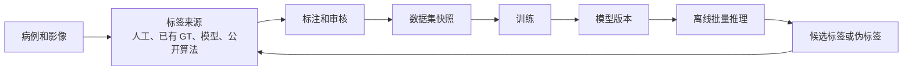
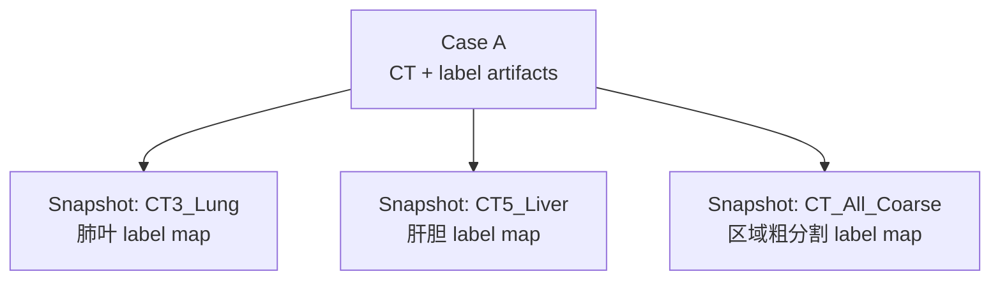
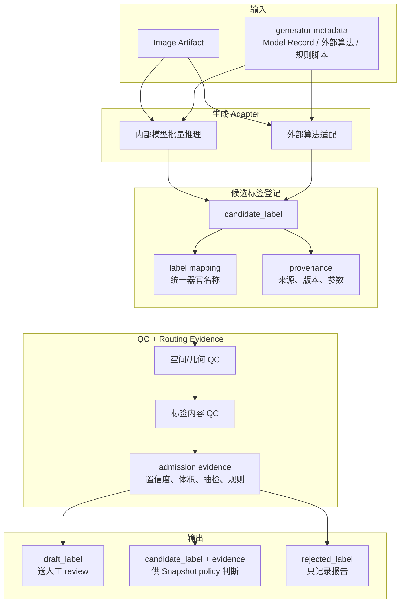
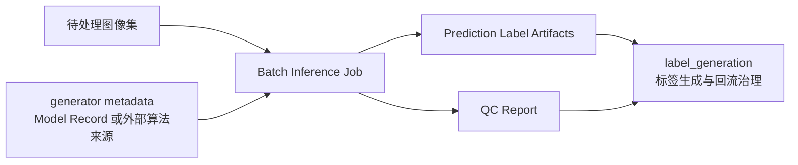

# 分割平台蓝图

> 版本：v0.6  
> 日期：2026-06-10  
> 状态：架构蓝图，不是实现计划  
> 事实边界：仓库事实来自当前代码和配置；外部事实来自文末来源；无法公开核实的内容一律标为“待 POC”。

## 1. 先读结论

这个平台的根本目标是支持全身器官分割，但训练任务不必一开始就是“一个模型分割全身所有器官”。真实数据会有不同扫描区域、不同模态、不同标注完整度，因此平台要允许同一批病例被组织成多个训练任务：例如肺叶任务、肝胆任务、椎体任务、粗分割任务，或者后续的全身模型任务。

当前最重要的架构决定是：平台中心不是某一个训练框架，也不是某一个标注软件，而是病例、图像、标签、训练任务和模型版本之间的关系。标注、训练、伪标签、离线推理都是围绕这些关系发生的。

另一个同等重要的目标是操作内化：平台搭好规则后，标注者、训练者和评估者应通过平台动作完成流程，而不是直接理解底层脚本、目录结构、label id 和 Adapter 细节。三大实现域不是最终用户界面；未来 Orchestrator 和 Web UI 应编排平台动作，例如“生成 review 任务”“创建训练快照”“启动批量推理”“查看模型评估”。更完整的操作层设计见 `docs/architecture/platform_operational_model.md`。

标签设计采用：

- 统一器官名称：平台内部用同一套名字表达同一解剖结构。
- 任务级 label map：每个训练任务单独定义训练标签编号。
- 可选 combine map：用于把多个模型输出合成一个全身展示或导出 mask。

这不会要求立刻重写现有 nnUNet 训练管线。当前 `ModelMap.toml` 已经是任务级 label map 的雏形：每个模型内部从 1 开始编号，0 是背景，`CT_Combine` 和 `MR_Combine` 只用于合并结果，不用于训练。新平台应先在训练管线前面增加数据注册、数据集快照和 nnUNet 导出适配层。

伪标签可以直接进入训练，但不能通过改名伪装成真值。平台底层只记录它的来源、生命周期状态、QC 证据和准入决策；是否进入训练由 Dataset Snapshot 创建时的 `label_policy` 冻结副本决定。UI 可以显示“accepted pseudo”，但这只是某个任务下的准入结果，不是全局标签状态。

Mimics 可以作为优先 POC 的标注工具候选，但不能直接被定为平台唯一底座。公开资料能确认它有医学图像分割、Python scripting、NIfTI/RT-DICOM 支持和 AI 分割增强；但我们真正需要的“草稿标签导入 -> 人工修正 -> 标签导出 -> 与原 CT 严格对齐”仍需用本机 Mimics 做 POC。

部署管线第一阶段按离线批量处理设计：输入病例包或数据集快照，输出预测标签和质量报告，再回流到标签来源层。

## 2. 平台要解决的问题

项目想要形成一个可迭代流程：



这个循环里最容易混乱的不是模型训练本身，而是“某个标签到底是什么、从哪里来、能不能训练、对应哪个任务的 label 编号”。如果这部分不清楚，后面接 Mimics、3D Slicer、nnUNet、MONAI、TotalSegmentator 或 CADS 都会变成临时脚本拼接。

平台第一阶段不需要把所有模块做成一个大服务。更稳的做法是先让模块可以通过文件包手动串联：本地 Windows 做标注，远程服务器做训练，离线批量推理生成候选标签。等数据契约稳定后，再考虑统一调度、Web UI 和任务队列。

## 3. 三大实现域

为了让后续文档和代码更容易定位，当前设计把实现层明确划成三个域，而不是把所有内容都混在“流程”这个词下面：

| 域名 | 主要职责 | 典型对象 |
| --- | --- | --- |
| `labeling` | 标注、review、工具适配、标签导回 | Case Package、Mimics、`verified_label` |
| `training` | 任务定义、快照导出、训练适配、模型产出 | TaskLabelMap、Dataset Snapshot、nnUNet Adapter、Model Record |
| `label_generation` | 候选标签生成、来源登记、QC 证据、送审或准入建议 | `candidate_label`、QC Report、离线批量推理 |

这里故意不用 `annotation_pipeline / training_pipeline / pseudo_labeling` 这种强行对称的命名。原因是第三块并不是一条单纯的 pipeline，它更像一个“候选标签生成并回流治理”的实现域。目录命名上用 `label_generation`，语义更稳，也更利于后续落代码。

三大域解决的是工程责任，不是操作者要直接面对的界面。平台服务化后，用户应该看到更稳定的 Workflow Action：

| Workflow Action | 底层会调用 | 用户不需要关心 |
| --- | --- | --- |
| 创建 review 任务 | Data Registry、Case Package、labeling Adapter、preflight QC | mask 拆分、hash、Mimics 脚本、review label id |
| 创建 Dataset Snapshot | Data Registry、TaskLabelMap、`label_policy` 冻结副本、split 策略 | 每个标签文件在哪里、状态如何逐条过滤 |
| 启动训练 | Dataset Snapshot、training Adapter、现有 nnUNet 管线 | nnUNet 目录结构、训练 label id 转换 |
| 批量生成候选标签 | Model Record、label_generation Adapter、QC evidence | 模型权重路径、推理临时目录、候选标签证据细节 |
| 查看评估结果 | Model Record、评估报告、失败病例索引 | 评估脚本参数和中间文件 |

## 4. 当前仓库事实

当前训练代码主要在 `pipelines/nnunet/` 下。以下事实来自现有配置和代码：

| 位置 | 当前事实 | 对平台设计的含义 |
| --- | --- | --- |
| `ModelMap.toml` | 每个模型内部标签从 1 开始，0 是背景；`CT_Combine`/`MR_Combine` 不能用于训练 | 现有设计已经支持任务级 label map |
| `Config_CT_v500.toml` | `segment_list_name` 选择训练任务，`labeled_dataset` 指向已有标注数据集 | 训练入口依赖任务名和源数据集 |
| `AutoSegmentationFramework.py` | 读取 config 和 ModelMap，执行 convert、preprocess、train、predict、evaluation | 可以把它包成 nnUNet Adapter，而不是重写 |
| `Action1_ConvertLabeledToTrainData.py` | 将每个病例的 `segmentations/{organ}.nii.gz` 合成 nnUNet 的多标签 mask | 平台导出层只要产出兼容目录即可复用 |
| `Action1_ConvertLabeledToTrainData.py` | 支持多个器官映射到同一 label 的粗分割格式 | 粗分割任务可以自然表达 |
| `Action4_Predict.py` 和合并逻辑 | 可用 `class_map + combine_map` 将局部模型输出映射到合并 mask | 全身展示/后处理与训练 label map 应分开 |

因此，当前不应把“统一标签设计”理解为要推翻训练管线。更准确的改造边界是：

| 层级 | 是否要现在改 | 说明 |
| --- | --- | --- |
| nnUNet 训练核心 | 否 | 继续复用现有 convert/preprocess/train/predict |
| `ModelMap.toml` 手工维护 | 暂时保留 | 后续可由平台任务定义生成 |
| 数据来源和标签准入 | 需要新增设计 | 现有训练代码无法表达标签来源、审核状态、伪标签准入 |
| Dataset Snapshot | 需要新增设计 | 同一套数据要能服务多个训练任务，并冻结版本 |
| Adapter | 需要新增设计 | 把平台数据导出成当前 nnUNet 目录和配置 |

## 5. 核心概念

为了避免过度抽象，平台只保留少量必须概念。

| 概念 | 简单解释 | 为什么需要 |
| --- | --- | --- |
| Case | 一个病例或一次影像检查 | 追踪图像、标签、推理结果都要绑定到病例 |
| Image Artifact | 一个具体图像文件或 DICOM 序列 | 记录 shape、spacing、方向、hash，避免标签错位 |
| Label Artifact | 一个标签文件或一组 mask | 记录来源、生命周期状态、器官和空间信息 |
| Data Registry | 平台资产目录 | 统一登记 Case、Image、Label、Model、QC 报告和审计信息 |
| Anatomy Vocabulary | 平台统一器官名称表 | 解决同一器官在不同数据集叫法不一致 |
| TaskDefinition | 一个训练任务的配置模板 | 维护目标器官、TaskLabelMap、默认 `label_policy` 和预处理意图 |
| TaskLabelMap | 某个训练任务的标签编号表 | 满足 nnUNet 等训练框架对 label 编号的要求 |
| Dataset Snapshot | 一次冻结的训练数据选择结果 | 冻结任务、样本、split、准入策略和标签版本 |
| Model Record | 一个训练出的模型版本 | 记录训练数据、任务、指标、权重路径和用途 |
| Tool Adapter | 标注/训练/推理工具适配层 | 让平台不绑定 Mimics 或 nnUNet |
| Workflow Action | 面向操作者的一次平台动作 | 让 Web UI / Orchestrator 编排稳定动作，而不是暴露底层脚本 |

这些概念的最小记录形式见 `docs/architecture/platform_operational_model.md`。第一阶段可以先用 JSON/YAML manifest 和文件系统实现，后续再迁移到数据库和 Web UI。

第一阶段不必建立完整 Patient 表，但 Case manifest 必须保留 `patient_id_hash` 或 `leakage_group_id`。这样可以先解决同一患者多次检查跨 split 泄漏的问题；后续服务化时再把 Patient/Subject 提升为独立实体。

## 6. 标签设计

### 6.1 统一器官名称不是统一训练编号

统一器官名称解决“这是什么结构”的问题。

任务级 label map 解决“这个结构在某个训练任务里是多少号”的问题。

两者不能混成一个东西。一个器官可以在不同任务里有不同编号，例如：

| 器官 | 肺叶任务 | 全身合并 mask | 说明 |
| --- | --- | --- | --- |
| `lung_upper_lobe_left` | 1 | 可能是另一个全局编号 | 训练任务内编号服务模型训练 |
| `liver` | 不出现 | 可能是另一个全局编号 | 同一病例可以用于别的任务 |
| `gallbladder` | 不出现 | 可能是另一个全局编号 | 不在当前任务目标中不是“缺失” |

nnUNet 官方数据格式要求分割标签是整数图，背景为 0，语义类别整数连续。现有 `ModelMap.toml` 的注释和内容也采用这个原则。因此平台应保留任务级编号，而不是设计一个全平台唯一训练 label id。

### 6.2 推荐的数据结构

```yaml
anatomy_vocabulary:
  liver:
    display_name: Liver
    aliases: [hepatic]
    parent: abdomen
    laterality: none
    granularity: organ
    global_label_id: 37
  gallbladder:
    display_name: Gallbladder
    aliases: []
    parent: biliary_system
    laterality: none
    granularity: organ
    global_label_id: 38
  kidney_left:
    display_name: Left kidney
    aliases: []
    parent: kidney
    laterality: left
    paired_group: kidney
    granularity: organ
    global_label_id: 42

task_label_map:
  task_id: CT5_Liver
  modality: CT
  labels:
    background: 0
    gallbladder: 1
    liver: 2

combine_map:
  map_id: CT_Combine
  source: anatomy_vocabulary.global_label_id
  labels:
    liver: 37
    gallbladder: 38
```

`anatomy_vocabulary` 是平台语义层；`task_label_map` 是训练层；`combine_map` 是展示、合并或导出层。

`anatomy_vocabulary` 不能只是一张别名表。第一阶段至少要表达父子关系、左右偏侧性、粒度和稳定全局编号。这样才能支撑左右结构 QC、粗分割合并、肺叶/肺段或肝段这类层级结构，并避免把全身编号长期分散在多个手写表中。

`combine_map` 的用途要单独说明：它不是训练 label map。现有 v500 方案由多个局部模型组合形成全身结果，每个模型训练时都可以从 1 开始编号，因此不同模型的 label id 会重复。若要把肺、肝胆、椎体等多个模型输出合成一个全身 mask，就需要一个全局展示编号。训练时 `liver = 2`，全身合并展示时 `liver = 37`，这不是冲突，因为它们服务不同阶段。长期看，全局展示编号应从 Anatomy Vocabulary 的 `global_label_id` 派生；`combine_map` 只声明包含哪些结构。为了兼容现有 v500 编号，可以保留 `legacy_value_overrides`。

`combine_map` 只定义“结构 -> 全局展示编号”，不负责解决多个模型在同一体素上的冲突。冲突解决必须放在单独的 `combine_policy` 或后处理配置中，例如：

```yaml
combine_policy:
  policy_id: CT_Combine_Default
  conflict_strategy: priority_then_confidence
  priority:
    gallbladder: 90
    liver: 80
  tie_breaker: higher_probability
  on_unresolved_conflict: mark_conflict_and_keep_empty
  log_conflict_voxels: true
```

默认原则是确定性合并、显式记录冲突，不允许静默覆盖。若没有概率图，使用器官优先级；若有概率图，优先级相同才用置信度。

### 6.3 同一套数据能服务多个任务

同一个病例的图像和标签只在 Data Registry 中注册一次。不同训练任务通过 Dataset Snapshot 选择它们需要的病例、器官和标签状态。



需要注意：同一病例可以进入多个任务，但训练/验证/测试拆分必须按病例或患者级别冻结，不能让同一个患者在一个任务里训练、另一个相近评估任务里泄漏。

Split 的归属是 Dataset Snapshot。可以有全局 `SplitPlan` 作为模板，但每个 Snapshot 必须保存或引用当时使用的 split 版本、`leakage_group_id` 和生成参数。同一病例可以进入多个任务；问题不在“跨任务复用”，而在“用 A 任务训练出的模型评估 B 任务时是否发生同患者泄漏”。第一阶段用训练 Snapshot 与评估 Snapshot 的 `leakage_group_id` 交集做检查即可，复杂模型 lineage 分析后续再做。

### 6.4 缺失标签不等于器官不存在

医学分割里常见三种情况：

| 情况 | 含义 | 平台应如何记录 |
| --- | --- | --- |
| 结构在扫描范围外 | 图像没有覆盖该器官 | `uncovered` |
| 图像覆盖但没有标注 | 不能当作背景训练 | `missing_label` |
| 图像覆盖且确认没有该结构 | 可以作为阴性信息 | `confirmed_absent` |

如果把“没有标签文件”直接当成背景，会让模型学习错误的负样本。训练导出时必须区分这些状态。

这个区分发生在两步：

1. 数据导入 Registry 时，记录扫描范围和器官标签覆盖状态。
2. Dataset Snapshot 创建时，决定某个 case 的某个器官是否能作为当前任务监督，不能把 `missing_label` 自动导出成背景。

训练导出默认采用保守策略：

- 对单器官或逐器官任务：某 case 对某器官是 `missing_label` 时，该 case 不参与该器官监督。
- 对 nnUNet 标准多类任务：如果缺失的是当前任务目标器官，默认排除整个 case，不导入 `labelsTr`，避免把缺失器官写成背景。
- 只有当某个 Adapter 明确支持 ignore mask / partial-label loss，并在 Model Record 中记录实现方式时，才允许对缺失器官体素做 loss mask。

因此第一阶段 nnUNet Adapter 的默认实现不是“给 missing_label 体素做 loss mask”，而是“在 Snapshot/export 阶段排除不完整监督”。这会牺牲部分数据量，但能避免把未标注器官误当负样本。

## 7. 标签状态、证据和训练准入

这里做一个收敛决策：**标签生命周期状态不等于训练准入状态**。Label Artifact 只记录“这个标签是什么、从哪里来、处于什么生命周期”；是否能进入某次训练，由 Dataset Snapshot 创建时的 `label_policy` 决定并冻结。

### 7.1 生命周期状态

第一阶段只保留 5 个底层状态：

| 状态 | 解释 | 是否直接代表可训练 |
| --- | --- | --- |
| `source_label` | 外部数据集自带标签 | 否；由 `label_policy` 判断 |
| `candidate_label` | 模型、公开算法或规则脚本生成的候选标签 | 否；由 QC 证据和 `label_policy` 判断 |
| `draft_label` | 准备给人工修正的草稿标签 | 否 |
| `verified_label` | 人工检查并保存的标签；第一阶段单人保存即 verified | 通常可训练，但仍受任务策略和 license 限制 |
| `rejected_label` | 已判定不可用，保留审计记录 | 否 |

不再把 `accepted_pseudo_label` 作为核心状态。它可以作为 UI 展示词，表示“某个 `candidate_label` 在某个任务/Snapshot 策略下被接受为训练输入”，但底层仍保持 `candidate_label + source + qc_metrics + admission_decision`。这样不会把伪标签来源改写成半真值。

标签状态主要由平台维护，不要求标注者或训练者逐条手工填写：

| 场景 | 平台记录 |
| --- | --- |
| 外部数据集导入 | `source_label` + dataset provenance |
| 模型或公开算法输出 | `candidate_label` + generator/model provenance |
| 候选标签准备给人修正 | `draft_label` + parent candidate |
| 标注者保存并提交 | 新版本 `verified_label` + reviewer provenance |
| QC 或人工明确拒绝 | `rejected_label` + rejection reason |
| 高质量伪标签被某任务接受 | 保持 `candidate_label`，追加 admission decision |

### 7.2 训练准入由 Snapshot 冻结

`label_policy` 的归属收敛为两层：

1. `TaskDefinition` 维护默认 `label_policy` 模板。
2. `Dataset Snapshot` 创建时保存一份 resolved copy，训练复现永远以 Snapshot 内冻结副本为准。

任务策略后续修改，不影响旧 Snapshot。若希望使用新策略，必须创建新 Snapshot。

```yaml
label_policy:
  policy_id: CT5_Liver_v1
  allow_lifecycle_status:
    - verified_label
    - source_label
    - candidate_label
  source_label_requires:
    trusted_datasets: [BTCV:v1, AMOS:v2]
  candidate_label_requires:
    trusted_generators:
      - TotalSegmentator:v2
      - model_CT5_Liver_001
    qc:
      geometry: pass
      min_confidence: 0.85
      max_volume_zscore: 3.0
    human_spot_check: optional
```

对 BTCV、AMOS 等公认公开数据集，平台不要求必须人工重审后改成 `verified_label`。更合理的做法是保留 `source_label` 状态，并由任务级 `label_policy` 显式允许可信数据集版本进入训练。

如果同一个腹部标签里肝来自人工、肾来自算法，不需要拆成多个大文件才能记录状态。推荐在一个 Label Artifact 内按 segment 记录生命周期状态、来源和准入决策：

```yaml
segments:
  liver:
    lifecycle_status: verified_label
    source: manual_review
  kidney_left:
    lifecycle_status: candidate_label
    source: TotalSegmentator:v2
    qc_reports: [qc_002]
    admission_decisions:
      - task_id: CT_Kidney
        policy_id: CT_Kidney_v1
        result: accepted
        decided_at_snapshot: snap_CT_Kidney_001
```

训练者通常只选择任务和数据范围；平台用 Snapshot 内的 policy 按 segment 过滤。Label Artifact 的整体状态不参与训练准入，整体只维护生命周期摘要，例如 `active`、`superseded`、`rejected_file` 或 UI 派生的 `mixed_segments`。

物理文件格式允许两种：

1. 单个多标签 NIfTI：segment 通过 `value` 指向 label id。
2. 逐器官独立 mask 组：segment 通过 `path` 指向该器官二值 mask。

平台内部不强制二选一；Adapter 必须声明自己接受哪种格式，必要时由导出层转换。Mimics POC 阶段优先逐器官 mask 是工具交换策略，不是平台唯一数据模型。

标签采用追加式管理。`draft_label -> verified_label`、人工修正、QC 修复都创建新的 `label_id` 或新文件 hash，并记录 `parent_label_id` 和操作人；旧文件保留，可标记为 `superseded`，但不能覆盖写。第一阶段不做完整版本图，只保证不可覆盖和可追溯。Snapshot 引用的是具体 `label_id/hash`，因此已有 Snapshot 不受后续修正影响。

### 7.3 平台级空间一致性契约

空间一致性不是 Mimics 专属风险，而是平台级 P0 契约。任何 Label Artifact 都必须绑定一个 `geometry_ref`，通常是对应 Image Artifact。平台必须记录并校验：

- shape。
- spacing。
- origin。
- direction。
- affine 或等价坐标变换。
- 是否发生过 resample、crop、orientation normalize。

强制规则：

1. shape 相同但 affine / origin / direction 不一致，不能静默进入训练。
2. Adapter 如果重采样或改方向，必须生成新的 artifact 或 Export Record，并记录变换。
3. 导入、标注导回、候选标签回流、训练导出、评估前都必须跑 geometry QC。
4. 几何不一致的标签默认阻断；只有明确记录修复方式和 QC 结果后才能继续。

### 7.4 QC 不是一个单独标签状态

QC（Quality Control，质量控制）是证据，不是状态。第一阶段把 QC 分成三层：

| 层面 | 检查内容 | 不通过的后果 |
| --- | --- | --- |
| 空间/几何 QC | 文件可读、shape 一致、spacing/origin/direction/affine 可解释、标签值合法 | 默认拒绝或阻断；修复后生成新 artifact/hash |
| 标签内容 QC | 空标签、越界、器官覆盖、左右结构是否合理 | 记录问题，由任务策略决定是否允许进入 Snapshot |
| 准入策略 QC | 生命周期状态、来源、QC 证据、license、任务规则是否允许训练 | 不满足时不进入当前 Dataset Snapshot |

`candidate_label` 不是天然低质量，`verified_label` 也不代表永远无误。平台真正要保证的是：来源和证据不被改写，训练准入由 Snapshot 内冻结的 `label_policy` 显式决定。

## 8. 平台流程

### 8.1 数据进入平台

数据可能来自：

- 完全无标注数据集。
- 只有部分器官标签的数据集。
- 已有人工金标准数据集。
- 内部模型推理结果。
- TotalSegmentator、CADS 等公开算法或公开资源。
- 标注工具导出的修正结果。

所有数据进入平台后，都先通过 ingest/import 变成 Image Artifact 或 Label Artifact，并记录来源、hash、空间信息和 `usage_constraints`。第一阶段可以由导入脚本和 Registry manifest 保证；服务化后由 Data Registry API 保证。平台第一阶段不做复杂法律裁决，但不能丢失许可和用途限制；Snapshot、Model Record 和回流标签都要继承输入链上的限制。

### 8.2 Registry、Snapshot、Model Record 的边界

Data Registry、Dataset Snapshot 和 Model Record 都是抽象概念，但不能只停留在名词层面。第一阶段可以用 JSON/YAML 文件实现，后续再迁移到数据库。

| 对象 | 负责什么 | 不负责什么 |
| --- | --- | --- |
| Data Registry | 登记 Case、Image Artifact、Label Artifact、QC 报告、来源、hash、审计记录 | 不直接决定某个训练任务用哪些标签 |
| Dataset Snapshot | 冻结一次训练视图：任务、病例、标签 segment、split、TaskLabelMap、resolved `label_policy`、预处理配置引用、usage constraints | 不亲自执行 resample、crop、normalization |
| Model Record | 登记训练结果：Snapshot、框架、代码版本、配置、权重、指标、使用边界和继承限制 | 不修改训练数据历史 |

coarse 任务的低分辨率配置应记录在 Dataset Snapshot 或它引用的 preprocess profile 中，例如目标 spacing、插值方式和导出 profile。真正的 resample 应在 training Adapter 或 nnUNet preprocessing 阶段执行，执行后的实际参数和模型指标写回 Model Record。

Dataset Snapshot 的冻结语义是：冻结引用列表、hash、split、resolved `label_policy`、准入决策、usage constraints 和预处理意图；默认不复制实际影像数据。Snapshot 是 immutable manifest，一旦创建不再修改。如果某个 Label Artifact 后续被修正或重新验证，会生成新的 `label_id/hash`；旧 Snapshot 仍指向旧标签。若要使用新标签或新策略，必须创建新 Snapshot。第一阶段可以额外 materialize 一份导出目录作为缓存，但缓存不是 Snapshot 的真相来源。

FewShot Adapter 共享 Dataset Snapshot 数据契约，但第一阶段不把 few-shot episode 写进主 Snapshot schema。更轻量的做法是：Snapshot 冻结 eligible pool、validation/test；实验性的 `fewshot_protocol.yaml` 作为 sidecar 记录 support/query episode、shot 数、重复次数和随机种子，并随 Model Record 保存。这样 FewShot 不需要绕过 Snapshot，也不会污染传统 train/val/test 定义。

### 8.3 Adapter 接入标准

Adapter 的目标不是把所有工具抽象成同一种内部实现，而是保证输入输出契约稳定。

| Adapter 类型 | 接入标准 |
| --- | --- |
| 数据导入 / labeling | 任意来源数据集必须先转成 Image Artifact 和 Label Artifact；如果进入人工 review，再生成 Case Package |
| training | 输入必须是 Dataset Snapshot；必须解释 TaskLabelMap；必须记录实际预处理和训练配置；必须产出 Model Record |
| label_generation | 输入来自 Image Artifact 和 `generator metadata`；输出登记为 `candidate_label`；必须提供来源、label mapping、QC 报告和可选准入建议 |

因此，一个不同于 nnUNet 的训练框架可以加入 `training` 域，但它必须消费 Snapshot 并产出 Model Record。一个已有分割算法或伪标签策略也可以加入 `label_generation`，但它不能直接把输出伪装成 `verified_label`，也不能直接决定全局可训练性。

第一阶段不需要把外部算法建成完整核心表，但必须有轻量 `generator metadata`，可以是 Label Artifact 的 `source.generator` 字段或一个 `generator.yaml`。它记录算法/模型名称、版本、参数、权重或镜像、license 状态、适用范围和调用方式。平台自己训练出的模型用 Model Record 作为来源；TotalSegmentator、CADS、脚本规则、外部 Docker/CLI 算法用 `generator metadata` 作为来源。`label_generation` 不应存在“无来源记录”的特殊路径。

### 8.4 标签生成与回流治理

从实现划分看，第三个域命名为 `label_generation`；从生命周期看，它做的是“标签生成与回流治理”。



公开算法的输出不能直接当作平台真值。它先是 `candidate_label`，经过 label mapping、空间校验、质量规则或抽检后，有三个出口：进入人工修正的 `draft_label`、保留为带 QC 证据的 `candidate_label` 供 Snapshot policy 判断、或被标记为 `rejected_label`。公开算法必须写入 `generator metadata`；平台自己训练出的模型则通过 Model Record 作为来源进入此流程。

### 8.5 标注和审核

第一阶段推荐使用文件包方式，不急着做服务化集成：

1. 平台导出 case package。
2. 人在 Mimics 或其他工具中打开图像和草稿标签。
3. 人工修正并保存。
4. 工具适配层导回标签。
5. 平台校验空间一致性、label 合法性和来源记录。
6. 通过后注册为 `verified_label`。

第一阶段单人保存即可定义为 `verified_label`。多人审核、仲裁、盲评可以后期加入，不应阻塞最小闭环。

### 8.6 训练

训练从 Dataset Snapshot 开始，而不是直接从散落文件夹开始。


nnUNet Adapter 的职责是：

- 根据 Dataset Snapshot 选择病例和标签。
- 根据 TaskLabelMap 生成 nnUNet 所需整数标签。
- 导出 `imagesTr`、`labelsTr`、`imagesTs`、`labelsTs` 和 `dataset.json`。
- 生成或引用当前训练配置。
- 训练完成后登记模型版本、指标、数据快照和配置。

训练导出前必须执行 materialization validation：

- TaskLabelMap 必须从 0 开始、整数连续、无重复。
- 每个 label key 必须存在于 Anatomy Vocabulary。
- Snapshot 过滤后，训练集中每个目标类别必须至少出现一次；全空类别默认 fail fast。
- 如果任务明确允许空类别或分阶段补齐，必须显式 override，并写入 Export Record 和 Model Record。
- 导出层如果重映射 label id，必须记录原始 segment、任务 label id 和导出值的映射。

这样以后加入 MONAI、Transformer 模型或少样本方法时，只需要增加新的 Adapter，不必改变病例和标签管理方式。**少样本学习（FewShot）先作为 training 域下的实验 Adapter：共享 Dataset Snapshot 的 eligible pool 和评估集，用 sidecar `fewshot_protocol.yaml` 记录 support/query episode，并产出 Model Record。** 少样本方法需要先通过生产级实验协议验证（冻结评估集、多 N 值系统对比、跨扫描协议一致性），通过后才能从实验层升级为正式 Adapter。

### 8.7 离线批量推理

部署管线第一阶段按离线批量处理：



离线推理输出默认是 `candidate_label`。如果 QC 或抽检通过，平台追加 admission evidence；真正是否进入训练，在创建 Dataset Snapshot 时由冻结的 `label_policy` 判断。UI 可以把“当前任务下会被接受的 candidate”显示为 accepted pseudo，但底层状态不改变。

## 9. Mimics 可行性

Mimics 当前最合理的定位是“优先 POC 的人工标注/修正工具”，不是平台核心。

公开资料能支持的判断：

| 能确认的点 | 证据级别 | 对平台的意义 |
| --- | --- | --- |
| Mimics Core 是医学图像分割和 3D 规划软件 | 官方产品页 | 可作为人工修正工具候选 |
| Mimics Core 官方页面提到 Mimics Medical 28.0 和 3-matic Medical 20.0 released 2025 | 官方产品页 | 可说明官方版本信息，不能代替本机版本和许可证核查 |
| Mimics 有 Python scripting 和自动化能力 | 官方 2025 更新页 | 有机会接入平台流程 |
| 2025 更新提到 NIfTI 和 RT-DICOM 导入导出 | 官方 2025 更新页 | 对 AI 管线互操作是正向信号 |
| 官方提到 AI-enabled segmentation | 官方 2025 更新页 | 可辅助人工标注，但不能替代质量策略 |
| 社区有 Mimics scripting 导出 NIfTI affine 问题讨论 | Materialise 社区 | 必须做空间一致性 POC |

不能写成已确定的点：

- 具体 Python API 函数名和签名。
- 多标签 NIfTI 是否能稳定导入为多个可编辑 mask。
- 导出标签是否在 shape、spacing、origin、direction、affine 上与原 CT 完全一致。
- 是否能无人工干预批量完成所有导入、命名、颜色、导出流程。
- 系统要求、版本号、论文引用数量等未由公开来源确认的具体说法。

如果现在就使用 Mimics，建议只承诺一个可检验流程：

1. 输入 DICOM 或 NIfTI 图像。
2. 导入草稿标签，必要时拆成逐器官 mask。
3. 人工修正。
4. 导出逐器官 mask 或单个多标签文件。
5. 平台脚本合并并校验空间一致性。
6. 校验通过后注册为 `verified_label`。

如果第 4-5 步不能稳定通过，Mimics 仍可作为人工查看和修正工具，但平台不应依赖它作为唯一标注底座。

拿到 Mimics 软件和 license 后，POC 应分两类验证：

| 验证类别 | 要确认的问题 |
| --- | --- |
| Mimics 本身功能 | DICOM/NIfTI 导入是否稳定；多标签或逐器官 mask 是否可编辑；人工修正体验是否可接受；导出文件是否可读；shape 和空间信息是否可解释 |
| 脚本联动能力 | license 是否允许 Python scripting；脚本能否创建 mask、设置名称和颜色、读取/导出 mask；是否能减少人工导入导出步骤 |

“必要时拆成逐器官 mask”的目的不是增加复杂度，而是降低工具解释风险。单个多标签 NIfTI 依赖 Mimics 正确理解 label id、名称、颜色和多类别编辑；逐器官 mask 更容易在工具内编辑，也更容易在导回后定位哪个器官错位、丢失或为空。平台可在导回时再合并成训练需要的多标签文件。

## 10. 参考外部设计

| 工具/项目 | 可以学习的点 | 不应照搬的点 |
| --- | --- | --- |
| MONAI Label | server-client、模型辅助标注、3D Slicer/OHIF 等客户端思路 | 不要把平台直接做成 MONAI Label；它更像标注/主动学习框架 |
| 3D Slicer | 开源、插件生态、可集成 MONAI Label 和 TotalSegmentator | 上手成本较高，不一定适合作为主要生产标注工具 |
| TotalSegmentator | CT/MR 多结构分割，适合作为公开算法标签源 | 输出不能直接当最终训练标签 |
| CADS | 大规模全身 CT 数据和伪标签/质量控制思路 | 质量和任务适配仍要单独判断；许可问题由平台治理层处理 |
| nnU-Net | 强基线训练框架，数据格式清晰 | 不应成为平台唯一训练框架 |

## 11. 分阶段架构，不是详细计划

这里不是排期，只是说明架构成熟顺序。

| 阶段 | 平台形态 | 做到什么才算这一层成立 |
| --- | --- | --- |
| A. 文件包闭环 | 手动导入导出，离线脚本校验 | 一个病例能从候选标签到人工保存，再进入训练快照 |
| B. 注册中心和快照 | Data Registry、Label Registry、Dataset Snapshot | 同一套数据能被多个任务复用，训练可复现 |
| C. Adapter 稳定 | nnUNet Adapter 先跑通，预留 MONAI/其他模型 Adapter | 训练框架可替换但数据契约不变 |
| D. 离线批量推理 | 模型版本 + 批量任务 + 候选标签回流 | 训练结果能生成下一轮标签来源 |
| E. 统一调度 | Web UI、任务队列、权限、审计 | 在数据契约稳定后再做 |

不建议一开始就以 Orchestrator、FastAPI、Celery 或 Web UI 作为主轴。它们是后期的调度和交互层，不是平台成立的前提。

A 阶段到 B 阶段不是推倒重来。A 阶段的 manifest 应按 Registry/Snapshot/Model Record 的字段设计，B 阶段数据库只是把这些 manifest ingest 成可查询索引：

1. A 阶段每个 Case、Image Artifact、Label Artifact、QC Report、Snapshot、Model Record 都生成稳定 id 和 hash。
2. B 阶段提供 `import_manifest` 迁移脚本，把 A 阶段 manifest 写入 SQLite/PostgreSQL。
3. 影像和标签文件不必复制，DB 记录 storage URI、hash 和版本。
4. 迁移后生成 migration report，列出缺字段、hash 不匹配、重复 id 和无法解析的来源。
5. A 阶段导出的 nnUNet 目录只作为 materialized export，可复现依据仍然是 Snapshot manifest。

因此 A 阶段产物可以继续在 B 阶段使用，前提是 A 阶段就避免只写临时路径和手工说明。

A 阶段还必须有最小治理：

- 每个 manifest 顶层必须有 `schema_version`。
- manifest 优先由脚本生成，人工只改任务模板、词表和少量策略配置。
- Registry manifest 建议按 case/artifact 拆小文件，并用 git 管理变更。
- 同一批 Registry 写入采用单写者原则，避免多人同时手工改同一个 manifest。
- 文件 hash、manifest hash、schema version 和生成工具版本都要进入审计记录。

第一阶段应提供统一 `validate` 命令，把错误挡在训练和 Mimics 之前：

```bash
sp validate vocabulary anatomy_vocabulary.yaml
sp validate registry registry/
sp validate task-map task_label_maps/CT5_Liver.yaml
sp validate snapshot snapshots/snap_CT5_Liver_001.yaml
sp validate export nnunet_exports/CT5_Liver_001/
```

`validate` 至少检查 schema、词表引用、label 编号连续性、空间一致性、split 泄漏、usage constraints、缺失标签策略和导出后空类别。

## 12. 已决定和仍待讨论的问题

以下问题中，部分已经过讨论形成方向，部分仍需后续确认。

### 12.1 已决定

| 问题 | 决定 | 说明 |
|------|------|------|
| 训练准入 | 不设 `accepted_pseudo_label` 为核心状态；高质量伪标签保持 `candidate_label`，由 Snapshot 内冻结的 `label_policy` 动态接受 | provenance 不被改写，训练准入仍然灵活 |
| 评估准入 | 暂不作为第一阶段架构决策 | 会议中判断“现在考虑太早”；后续评估设计再单独收敛 |
| 模型拆分 | 第一阶段保持多模型组合（现有 CT1-16、MR1-8 方案），后期再实验统一模型 | 多模型方案已验证可行 |
| 第一阶段器官范围 | 第一阶段就是 v500 训练的所有模型，涵盖全身多处器官 | 不需要缩小范围，现有 ModelMap 就是起点 |
| Mimics POC | 先做好 Mimics 使用方式和集成方案的调研准备，再启动 POC | 见 `docs/domains/labeling/mimics_feasibility.md` |
| Snapshot 不可变 | Snapshot 冻结引用、版本、hash、split 和策略；标签修正后创建新 Snapshot | 保证训练可复现 |
| Case 防泄漏 | Case manifest 必须有 `patient_id_hash` 或 `leakage_group_id` | 防止同一患者多次检查跨训练/评估 |
| label_generation 来源 | 外部算法也要写入 `generator metadata` | 不允许无来源候选标签 |
| 空间一致性 | geometry contract 是平台级 gate，不是 Mimics 专属问题 | 防止标签静默错位进入训练 |
| 阶段 A 治理 | manifest 必须有 `schema_version`，并提供 `validate` 命令 | 文件包阶段也要可迁移、可检查 |
| 使用限制 | 第一阶段必须记录并传播 `usage_constraints` | 具体法律裁决可后置，但限制不能在回流链中丢失 |

### 12.2 仍待讨论

| 问题 | 影响哪一步 | 为什么还不能定 |
|------|----------------|----------------|
| 具体 license 裁决 | 数据导入、Model Record、模型发布 | 哪些公开算法或公开数据允许商业训练、发布衍生模型，需要逐来源确认 |
| 正式评估准入 | 评估集冻结、Model Record 指标 | 正式评估是否只允许 `verified_label`，以及内部迭代评估是否允许 candidate evidence |
| candidate admission 阈值 | Dataset Snapshot 创建 | 需要按器官、任务和生成器沉淀置信度、体积异常、抽检比例等规则 |

## 13. 参考来源

- [nnU-Net dataset format](https://github.com/MIC-DKFZ/nnUNet/blob/master/documentation/dataset_format.md)
- [Materialise Mimics 2025 Product Update](https://www.materialise.com/en/healthcare/mimics/whats-new)
- [Materialise Mimics Core](https://www.materialise.com/en/healthcare/mimics/mimics-core)
- [Materialise community: DICOM to NIfTI via Mimics scripting affine issue](https://community.materialise.com/t/dicom-to-nifti-format-using-mimics-scripting-problem-with-affine-transformation-matrix/438)
- [MONAI Label GitHub repository](https://github.com/project-monai/monailabel)
- [TotalSegmentator GitHub repository](https://github.com/wasserth/totalsegmentator)
- [CADS arXiv paper](https://arxiv.org/abs/2507.22953)
- [CADS Hugging Face dataset page](https://huggingface.co/datasets/mrmrx/CADS-dataset)
