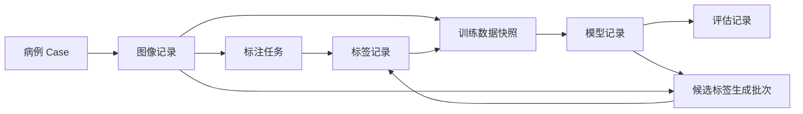

# 平台核心数据与操作模型

> 日期：2026-06-13
> 状态：当前设计的字段和操作说明
> 阅读前提：先读[平台蓝图](platform_blueprint.md)。固定用词见[常用词说明](../glossary.md)。

## 1. 怎样阅读这份文档

平台蓝图解释“为什么这样设计”。这份文档解释“实现时要保存哪些记录，以及这些记录在什么时候创建”。

第一次阅读时，不需要从头记住所有字段。先看下面的关系和创建时机，再按开发任务查对应章节。

字段、类型和取值的权威定义已沉淀为机器可读的 JSON Schema，见 [`registry/schemas/`](../../registry/schemas/)。本文档用示例解释设计，schema 规定确切形状；两者不一致时以 schema 为准。



| 记录 | 何时创建 | 谁创建 | 创建后能否修改 |
| --- | --- | --- | --- |
| 病例和图像记录 | 数据导入时 | 导入脚本 | 元数据修正应留下审计记录；文件变化要创建新版本 |
| 标签记录 | 导入标签、模型生成标签或人工提交时 | 导入脚本、候选生成脚本或标注导回脚本 | 不覆盖旧版本；修正后创建新版本 |
| 标注任务 | 准备人工标注或复查时 | 平台操作者或后续服务 | 可以更新进度；提交所依据的基础标签版本不能被悄悄替换 |
| 训练数据快照 | 启动一次可复现训练前 | 训练者通过平台动作创建 | 不能修改 |
| 模型记录 | 训练完成时 | 训练工具适配器 | 训练事实不改写；运行状态只追加变化历史 |
| 评估记录 | 一次正式评估完成时 | 评估流程 | 不能修改 |
| 候选标签生成批次 | 一次批量推理开始时 | 候选标签生成流程 | 可追加逐病例结果和重试次数，不能覆盖已成功结果 |

## 2. 用户动作和内部记录怎样对应

当前单人研发阶段可以由一个人运行多个脚本。后续服务化后，Web 界面或流程调度器调用同样的动作。

| 用户动作 | 平台内部发生什么 |
| --- | --- |
| 导入数据 | 创建病例、图像记录和可选的外部来源标签记录 |
| 创建标注任务 | 选择图像和基础标签，生成标注任务与病例包 |
| 保存标注进度 | 更新工作文件和任务进度，不创建新的正式标签版本 |
| 提交完成 | 导回指定目标，检查通过后创建新的人工确认标签版本 |
| 提交复查 | 保存草稿和不确定说明，任务进入待复查 |
| 创建训练数据快照 | 固定病例、标签版本、数据划分和本次标签准入结果 |
| 启动训练 | 工具适配器导出训练目录，调用框架并创建模型记录 |
| 启动正式评估 | 检查泄漏和参考标签来源，创建评估记录 |
| 批量生成候选标签 | 创建运行批次，逐病例登记成功、失败和候选标签 |

平台应自动维护文件校验值、空间信息、标签编号转换和生命周期字段。用户只作医学判断、任务选择和异常裁决。

## 3. 资产登记册（Data Registry）

### 3.1 它是什么

资产登记册是平台的“可查询目录”。它告诉平台有哪些病例、图像、标签、模型和运行记录，以及这些记录之间怎样关联。

第一阶段可以用文件夹和 JSON/YAML 清单实现，不要求先做数据库。

```text
registry/
  schemas/
  cases/
  images/
  labels/
  review_tasks/
  snapshots/
  models/
  evaluations/
  generation_jobs/
  generators/
  qc_reports/
```

### 3.2 它负责什么

- 通过稳定标识查找病例、图像、标签和模型。
- 保存文件位置、文件校验值和版本。
- 保存标签来自数据集、人工、模型还是外部算法。
- 保存图像和标签的空间信息。
- 保存去标识状态和数据使用限制。
- 支持按器官、模态、来源、状态和任务查询。
- 支持反查某个问题标签影响了哪些训练数据快照和模型。

### 3.3 它不负责什么

- 不直接决定某次训练采用哪些标签。
- 不亲自运行重采样、训练或推理。
- 不把模型候选标签改名为人工真值。
- 不要求第一阶段拥有数据库、后台服务或权限系统。

### 3.4 字段写法约定

- 文件校验值统一用名为 `hash` 的字段，值写成 `sha256:<64 位十六进制>`；同一份记录内不要混用 `hash` 和 `sha256` 两种字段名。
- 病例包契约 v0.5 出于历史原因使用 `sha256` 字段名，由 `check_case_package.py` 兼容，本批不改名；新增的 registry 记录一律遵循上一条。
- 标识字段（`*_id`）只使用字母、数字、`.`、`_`、`-`。

## 4. 病例和图像记录

### 4.1 病例（Case）

病例是一次标注、训练或评估所需的工作上下文。它可以包含同一检查中的一个或多个序列。

多个序列没有默认主次关系。某个序列是否要标注哪些器官，由标注任务明确说明。

病例清单至少要保存：

- `case_id`：平台病例标识。
- `leakage_group_id`：防止同一患者或相关检查跨训练集与评估集。
- `leakage_group_basis`：当前防泄漏分组使用患者伪名、来源 subject、study、case 还是未知批次。
- `leakage_group_confidence`：分组可信度，取 `high`、`medium` 或 `low`。
- `study_id`：平台中的检查标识。
- `image_ids`：病例包含的图像记录。
- `data_governance`：去标识配置和检查状态。

`patient_id_hash` 和 `study_instance_uid_hash` 只有在受控来源能可靠生成时才保存；它们不是病例包 v0.5 的必填字段，也不能作为去标识完成证明。

来源没有患者或检查标识时，`case_id` 和 `study_id` 可以由平台生成。此时不能假装患者关联已经解决：必须降低 `leakage_group_confidence`。低可信度数据仍可标注，也可以全部用于训练，但不能被随机拆成正式训练集和测试集后宣称患者无泄漏。

```json
{
  "schema_version": "case_manifest.v1",
  "case_id": "case_001",
  "leakage_group_id": "subject_group_001",
  "leakage_group_basis": "patient_pseudonym",
  "leakage_group_confidence": "high",
  "study_id": "study_pseudo_001",
  "patient_id_hash": "hmac-sha256:...",
  "modality": "CT",
  "image_ids": ["img_001", "img_002"],
  "data_governance": {
    "source_zone": "restricted_raw",
    "deidentification_status": "verified",
    "profile": "internal_dicom_profile_v1",
    "profile_version": "1.0",
    "direct_identifiers_allowed": false
  }
}
```

示例中的 `modality` 为可选的主模态，仅作展示；权威模态以每个图像记录的 `modality` 为准，因为一个病例可以包含多模态序列（例如 PET/CT）。

### 4.2 图像记录（Image Artifact）

图像记录表示一个独立的三维体素网格。它可以来自一个 DICOM 序列、一个 NIfTI 文件、一个 MHD+RAW 文件组或带显式读取参数的纯 RAW。

平台采用“一份体素网格一个 Image Artifact”：

- 同一检查中的平扫和增强序列分别登记；
- PET 和 CT 分别登记；
- 多个序列没有默认主次关系；
- 4D 文件进入当前三维分割流程前要拆成多个三维记录。

不同来源格式、目录层级和元数据缺失的完整规则见[数据导入与规范化契约](data_ingestion_contract.md)。

```json
{
  "schema_version": "image_artifact.v1",
  "image_id": "img_001",
  "case_id": "case_001",
  "modality": "CT",
  "format": "nifti",
  "path": "images/case_001/ct.nii.gz",
  "hash": "sha256:...",
  "hash_scope": "file",
  "pixel_type": "int16",
  "shape": [512, 512, 300],
  "spacing": [0.8, 0.8, 1.0],
  "origin": [0.0, 0.0, 0.0],
  "direction": [1, 0, 0, 0, 1, 0, 0, 0, 1],
  "geometry_status": "complete",
  "geometry_evidence": {
    "coordinate_system": "LPS",
    "shape": "header",
    "spacing": "header",
    "origin": "header",
    "direction": "header",
    "assumptions": []
  },
  "anatomy_coverage": {
    "source": "manual_import_review",
    "organs": {
      "liver": "covered",
      "kidney_left": "covered",
      "adrenal_left": "uncertain"
    }
  },
  "source": {
    "type": "imported_dataset",
    "name": "internal_abdomen_set",
    "import_batch": "import_20260615_001",
    "source_layout": {
      "subject": "subject_001",
      "study": "study_001",
      "series": "venous",
      "relative_path": "subject_001/venous.nii.gz"
    },
    "reader": {
      "name": "SimpleITK",
      "version": "record_at_runtime"
    }
  },
  "usability": {
    "annotation": "allowed",
    "training": "allowed",
    "evaluation": "allowed",
    "reasons": []
  }
}
```

存储字段的含义：

| 字段 | 说明 |
| --- | --- |
| `format` | `dicom_series`、`nifti`、`metaimage`、`raw_binary` 或 `other` |
| `path` | 主入口，可以是单文件或 DICOM 目录 |
| `companion_paths` | MHD 引用的 RAW、sidecar 等伴随文件 |
| `hash_scope` | `file` 表示单文件摘要；`bundle_manifest` 表示稳定文件组摘要 |
| `pixel_type` | 实际读取后的像素类型；不能靠扩展名猜测 |

几何完整度：

| `geometry_status` | 必须已知 | 允许的限制 |
| --- | --- | --- |
| `complete` | shape、spacing、origin、direction | 可以运行完整物理空间检查 |
| `partial` | shape 和部分可信空间字段 | 部分标注或训练可用，需记录假设 |
| `index_only` | shape 和数组顺序 | 只能证明索引空间，不能声称物理坐标正确 |

shape 和解码所需的像素参数必须已知，否则不能创建可用的 Image Artifact。spacing、origin 或 direction 无法获得时不得填假值；确需使用人工假设时，把字段证据写成 `assumed`，并在 `usability.reasons` 中说明。

`usability` 分别判断：

- `annotation`：能否进入标注工具；
- `training`：能否进入训练快照；
- `evaluation`：能否进入正式评估。

每项取 `allowed`、`allowed_with_assumptions` 或 `blocked`。图像和标签只在数组索引空间对齐时，可以允许标注或特定训练，但通常应阻止依赖真实物理距离的正式评估。

格式转换、重定向、裁剪或重采样不覆盖原记录，而是创建新的 Image Artifact，并通过 `derived_from_image_id` 和转换信息指向上游。

`anatomy_coverage` 只记录当前导入范围或任务关心的器官，不要求第一阶段建立完整的全身覆盖知识库。

允许值：

- `covered`：图像覆盖该器官所在区域。
- `uncovered`：图像没有覆盖该器官。
- `uncertain`：暂时无法可靠判断。

缺少记录时按 `uncertain` 处理。只有 `covered` 才能进一步把某器官标为“缺少标注”或“确认不存在”。

## 5. 标签记录（Label Artifact）

### 5.1 它是什么

标签记录表示一份多标签文件或一组逐器官 mask，以及其中每个器官标签的来源、状态、空间关系和版本。

同一份多标签文件可以包含不同来源的器官。例如肝来自人工，左肾来自模型。平台不要求仅为记录来源就把文件拆开。

```json
{
  "schema_version": "label_artifact.v1",
  "label_id": "lbl_001",
  "case_id": "case_001",
  "image_id": "img_001",
  "path": "labels/case_001/label.nii.gz",
  "format": "multilabel_nifti",
  "hash": "sha256:...",
  "hash_scope": "file",
  "pixel_type": "uint8",
  "geometry_ref": "img_001",
  "geometry": {
    "shape": [512, 512, 300],
    "spacing": [0.8, 0.8, 1.0],
    "origin": [0.0, 0.0, 0.0],
    "direction": [1, 0, 0, 0, 1, 0, 0, 0, 1],
    "geometry_status": "complete",
    "geometry_evidence": {
      "shape": "header",
      "spacing": "header",
      "origin": "header",
      "direction": "header",
      "assumptions": []
    },
    "alignment_checked": true,
    "alignment_basis": "physical_space"
  },
  "artifact_lifecycle": "active",
  "parent_label_id": null,
  "segments": [
    {
      "organ": "liver",
      "value": 2,
      "lifecycle_status": "verified_label",
      "source": {
        "type": "manual_review",
        "review_id": "review_case001_v1"
      },
      "lineage": {
        "derived_from_label_ids": ["lbl_000"],
        "contributing_generators": ["totalsegmentator_v2"]
      },
      "qc_report_id": "qc_001"
    },
    {
      "organ": "kidney_left",
      "value": 3,
      "lifecycle_status": "candidate_label",
      "source": {
        "type": "external_algorithm",
        "generator_id": "totalsegmentator_v2"
      },
      "lineage": {
        "derived_from_label_ids": [],
        "contributing_generators": ["totalsegmentator_v2"]
      },
      "qc_report_id": "qc_002"
    }
  ]
}
```

标签记录除 `geometry_ref` 外，还要保存自身实测的 shape、几何完整度、字段证据和对齐依据。`geometry_ref` 只表示“声明与哪幅图像对齐”，不能替代实际检查。

- 图像和标签都有完整空间信息时，`alignment_basis` 使用 `physical_space`。
- 只能证明 shape 和数组索引对应时，使用 `index_space`，标签的 `geometry_status` 可以是 `partial` 或 `index_only`。
- 没有运行对齐检查时，`alignment_checked=false` 且 `alignment_basis=none`，不能进入训练快照。

这样可以允许来源元数据不完整但数组严格配对的数据进入受限流程，同时不会把索引空间对齐伪装成物理空间对齐。

### 5.2 文件可以怎样保存

| 物理形式 | 怎样找到器官 | 常见用途 |
| --- | --- | --- |
| 一份多标签 NIfTI | `value` 指向整数标签值 | nnUNet 训练导出、全身合并结果 |
| 一份多标签 MHD+RAW | `value` 指向整数标签值，`companion_paths` 保存 RAW | 外部数据集、ITK 工具交换 |
| 一份多标签 RAW+读取参数 | `value` 指向整数标签值 | 历史数据导入；必须有完整解码参数 |
| 多份逐器官二值 mask | 每个 segment 保存自己的 `path` | Mimics 编辑、逐器官导出和异常定位 |

平台登记层支持这些来源形式。具体工具适配器必须说明自己接受哪种形式，需要时由导出步骤转换。MHD+RAW、纯 RAW 和逐器官目录使用 `hash_scope=bundle_manifest`，不能只校验其中一个文件。

### 5.3 标签状态属于每个器官

一个文件中可以同时有人工确认器官和模型候选器官，因此训练准入不能只看“整个文件状态”。

每个 segment 保存：

- 器官名称。
- 文件中的整数值或独立 mask 路径。
- 生命周期状态。
- 来源（`source`，本次直接产生它的标注或算法）。
- 生成血统（`lineage`，历史上贡献过像素的全部模型或算法，见 5.5）。
- 对应质量报告。

整个标签记录只维护文件版本状态，例如 `active`、`superseded` 或 `rejected_file`。界面可以把混合来源文件显示为“包含多种状态”，但这个摘要不参与训练判断。

### 5.4 标签怎样修订

标签修改采用追加版本：

1. 人工修正、质量修复或重新确认时创建新的 `label_id` 或版本。
2. 新版本通过 `parent_label_id` 指向上一版本（文件级修订指针）。
3. 旧版本保留，可标记为 `superseded`。
4. 任何已有训练数据快照仍引用旧版本，不随新版本变化。
5. 人工修正候选标签或外部来源标签时，新 segment 的 `source.type` 变为 `manual_review`，但 `lineage.contributing_generators` 必须继承被修正版本里的全部生成器，不能因为“现在是人工标签”就清空。

### 5.5 来源、修订指针和生成血统是三件事

平台容易把三个不同的东西混在一起，必须分开记录：

| 字段 | 层级 | 回答的问题 | 谁读取 |
| --- | --- | --- | --- |
| `source` | 每个 segment | 本次是哪一步直接产生了它（这次人工提交、这次算法运行） | 界面、训练准入 |
| `parent_label_id` | 整个文件 | 这份文件是从哪一份文件版本改过来的 | 版本回溯、审计 |
| `lineage.contributing_generators` | 每个 segment | 历史上有哪些模型或算法的像素进入过这个器官（含人工修正之前） | 正式评估的标签来源泄漏检查 |

为什么生成血统必须按 segment 保存：

- 一份文件可以混合来源（肝来自人工、左肾来自模型），文件级 `parent_label_id` 无法表达每个器官各自的血统。
- 人工修正会把 `source.type` 改成 `manual_review`。如果不单独保留 `contributing_generators`，“这块肝其实源自 TotalSegmentator”这条信息就会丢失。
- 正式评估要求“参考标签不能由待评估模型、它的上游模型或同一伪标签链生成”（见[平台蓝图](platform_blueprint.md) 8.4、ADR-018）。只有沿 `contributing_generators` 取并集，才能机械判断一份标签是否被某个模型间接污染。

`contributing_generators` 是一个传递闭包：

- 候选标签初次生成时，它等于该生成器自身。
- 任何模型输出或人工修正继承它时，把上游生成器并入，不删除。
- 模型记录的 `model_id` 与外部算法说明的 `generator_id` 都算生成器标识。
- 纯人工从零标注、且未参考任何算法输出的 segment，该列表为空。

## 6. 标注任务（Review Task）

### 6.1 它解决什么问题

标注任务说明：

- 谁需要处理这个病例。
- 在哪个图像序列上处理哪些器官。
- 以哪个基础标签版本开始。
- 哪些目标已经完成、待复查或被阻塞。
- 工作进度文件放在哪里。

它不替代标签记录。任务管理“工作过程”，标签记录管理“正式数据版本”。

### 6.2 目标组是最小提交单位

同一病例可能有多个图像序列，也可能有多组互不依赖的器官。标注任务使用 `target_id` 把需要一起提交的目标组成一组。

```json
{
  "schema_version": "review_task.v1",
  "review_id": "review_case001_v2",
  "case_id": "case_001",
  "assignee": "annotator_03",
  "status": "needs_review",
  "checkpoint": "working/review_case001_v2.mcs",
  "targets": [
    {
      "target_id": "target_noncontrast_abdomen",
      "image_id": "img_001",
      "organs": ["liver", "gallbladder"],
      "base_label_id": "lbl_001",
      "base_label_hash": "sha256:...",
      "status": "needs_review"
    },
    {
      "target_id": "target_arterial_liver",
      "image_id": "img_002",
      "organs": ["liver"],
      "base_label_id": "lbl_002",
      "base_label_hash": "sha256:...",
      "status": "completed"
    }
  ]
}
```

阶段 A 使用五种任务状态：

- `ready`
- `in_progress`
- `needs_review`
- `completed`
- `blocked`

一个目标组中的器官一起提交完成或一起进入复查，不做组内部分晋级。不同目标组可以独立完成，因此一个不确定组不会阻塞同一病例中其他已完成组。

保存 `.mcs` 或其他工作文件只更新进度。明确提交且检查通过后，平台才创建新的人工确认标签版本。

## 7. 训练数据快照（Dataset Snapshot）

### 7.1 它是什么

训练数据快照是“一次训练实际使用的数据清单”。它不是原始数据副本，也不是 nnUNet 导出目录。

快照创建后不再修改。它固定：

- 训练任务和目标器官。
- 任务标签编号表。
- 病例、图像、标签 segment、版本和文件校验值。
- 训练、验证和测试划分。
- 本次完整标签准入规则。
- 每个标签的采用或拒绝结果。
- 预处理意图。
- 输入数据继承的使用限制。

### 7.2 它不负责什么

训练数据快照不亲自执行：

- 重采样。
- 裁剪。
- 强度归一化。
- nnUNet 预处理。
- 模型训练。

它只记录“这次训练希望怎样处理”。工具适配器和训练框架执行实际处理，并把最终参数写入模型记录或导出记录。

### 7.3 示例

```yaml
schema_version: dataset_snapshot.v1
snapshot_id: snap_CT5_Liver_20260720_001
task_id: CT5_Liver
created_by: trainer_a
created_at: "2026-07-20T10:00:00+08:00"

task_label_map:
  background: 0
  gallbladder: 1
  liver: 2

label_policy:
  allow_lifecycle_status:
    - verified_label
    - source_label
    - candidate_label
  source_label_requires:
    trusted_datasets: [BTCV:v1, AMOS:v2]
  candidate_label_requires:
    trusted_generators:
      - TotalSegmentator:v2
    qc:
      geometry: pass
      min_confidence: 0.85
      on_confidence_unavailable: require_human_review

split:
  leakage_key: leakage_group_id
  source_split_plan: split_abdomen_v1
  # 权威划分在每个 case 的 split + leakage_group_id 上，不在此重复 train/val/test 列表

cases:
  - case_id: case_001
    image_id: img_001
    split: train
    leakage_group_id: subject_group_001
    leakage_group_basis: patient_pseudonym
    leakage_group_confidence: high
    segments:
      - organ: liver
        label_id: lbl_001
        label_hash: "sha256:..."
        lifecycle_status: verified_label
        admission_result: accepted
      - organ: gallbladder
        label_id: lbl_003
        label_hash: "sha256:..."
        lifecycle_status: candidate_label
        admission_result: accepted

preprocess_profile:
  name: native_resolution

usage_constraints:
  model_training: allowed_with_policy
  commercial_use: needs_review
  redistribution: forbidden
```

### 7.4 标签准入只写在快照中

标签记录保存来源和生命周期状态。某次训练是否采用它，只写入这次训练数据快照。

这样可以避免两处同时保存同一决定：

- 同一个候选标签可以被任务 A 采用，被任务 B 拒绝。
- 任务规则变化不会改写原始标签。
- 旧训练仍能还原当时的准入规则。

### 7.5 数据划分怎样保存

训练、验证和测试划分属于快照。为避免双写矛盾，划分的**唯一权威表达**是 `cases` 列表里每个病例自带的 `split`、`leakage_group_id`、`leakage_group_basis` 和 `leakage_group_confidence`；`split` 顶层对象只保留 `leakage_key` 和可选的 `source_split_plan` 等元数据，不再重复保存 train/val/test 病例列表。

每个病例必须冻结当时的防泄漏分组和可信度，这样快照无需读取外部登记册即可独立重现泄漏检查。快照可以引用一个可复用的划分计划，但解析后的真实分组以冻结在病例行中的值为准。

同一病例可以用于不同训练任务。正式评估时，平台必须把评估集与模型训练快照中冻结的 `leakage_group_id` 比较。

`leakage_group_confidence=low` 的病例不能进入宣称患者独立的正式验证集或测试集。它们仍可全部放入训练集，或进入明确标注限制的探索性实验。

如果评估的是多个局部模型组成的全身系统，要把所有成员模型的训练病例合并后再检查。

### 7.6 低分辨率粗分割怎样记录

快照记录预处理意图：

```yaml
preprocess_profile:
  name: coarse_low_resolution
  target_spacing: [3.0, 3.0, 3.0]
  interpolation:
    image: linear
    label: nearest
```

实际重采样由训练工具适配器或 nnUNet 预处理执行。模型记录保存最终采用的参数。

### 7.7 少样本实验怎样记录

少样本训练暂不扩展主快照格式。快照固定可用病例池和最终验证/测试集，单独的实验协议文件保存支持集、查询集、样本数、重复次数和随机种子。

```yaml
fewshot_protocol:
  shot_unit: case
  repeats: 5
  support_pool: train
  query: val
  final_test: test
  shots_per_anatomy:
    liver: [1, 3, 5, 10]
  seed: 20260610
```

每次实际抽取的病例必须随模型记录保存，不能只存在训练脚本的随机过程里。

### 7.8 `TaskDefinition` 与训练数据快照

`TaskDefinition` 是后续阶段可引入的复用配置模板，不是一次训练的事实记录。它可以包含：

- `task_id` 和目标器官；
- `task_label_map`；
- 默认的结构化 `label_policy`；
- 默认预处理意图。

阶段 A 不需要建立模板继承或解析服务。创建 Dataset Snapshot 时，调用方直接提交完整策略，平台校验后将 resolved `label_policy` 冻结到快照。

后续如果增加 `TaskDefinition`，创建快照时按以下顺序处理：

1. 读取指定版本的任务模板。
2. 合并本次显式覆盖项。
3. 校验器生成一份字段完整、没有继承关系的 resolved policy。
4. 将 resolved policy 和可选的模板版本引用写入新快照。
5. 训练适配器只消费快照中的 resolved policy。

`TaskDefinition` 可以修改或发布新版本，但不能改变已有快照。快照中的结构化策略才是训练复现和审计的唯一依据。

## 8. 模型、评估和候选标签生成记录

### 8.1 模型记录（Model Record）

模型记录说明一个模型怎样训练出来、权重在哪里、适用于什么范围，以及当前允许执行什么操作。

```yaml
schema_version: model_record.v1
model_id: model_CT5_Liver_001
task_id: CT5_Liver
framework: nnUNet
adapter: adapters/nnunet
snapshot_id: snap_CT5_Liver_20260720_001
code_version: git:abc123
config:
  nnunet_dataset_id: Dataset501
  folds: [0, 1, 2, 3, 4]
weights:
  path: models/model_CT5_Liver_001/
metrics:
  validation:
    dice_mean: 0.91
operational_status: candidate_generation_allowed
status_history:
  - status: registered
    at: "2026-07-21T09:00:00+08:00"
    evidence: training_completed
  - status: candidate_generation_allowed
    at: "2026-07-22T10:00:00+08:00"
    evidence: reports/model_candidate_check_001.json
usage_constraints:
  model_training: allowed_with_policy
  commercial_use: needs_review
  redistribution: forbidden
limitations:
  - "只验证过 CT 腹部任务"
```

第一阶段只需要三种运行状态：

| 状态 | 含义 |
| --- | --- |
| `registered` | 已登记，可以做开发调试，但不能直接启动正式候选标签批次 |
| `candidate_generation_allowed` | 基础检查和使用限制检查通过，可以生成正式候选标签 |
| `quarantined` | 来源、标签、许可或质量出现问题，暂时禁止继续使用 |

状态变化追加到 `status_history`。训练事实和旧状态事件不能覆盖。

### 8.2 评估记录（Evaluation Record）

每次正式评估创建一份独立记录。同一模型可以在不同数据集和代码版本上多次评估，新结果不覆盖旧结果。

```yaml
schema_version: evaluation_record.v1
evaluation_id: eval_CT5_Liver_independent_001
subject:
  kind: model
  model_ids: [model_CT5_Liver_001]
evaluation_snapshot_id: snap_CT5_Liver_holdout_001
code_version: git:def456
config:
  metrics: [dice, surface_dice_3mm]
  postprocess_profile: default
checks:
  patient_leakage: pass
  label_lineage: pass
  reference_kind: independent_reference
metrics:
  liver:
    dice_mean: 0.89
    surface_dice_3mm_mean: 0.84
failed_case_ids: [case_019]
report:
  path: reports/eval_CT5_Liver_independent_001.json
  hash: "sha256:..."
created_at: "2026-08-20T10:00:00+08:00"
```

正式评估必须满足：

1. 评估病例不在任何相关模型的训练数据中。
2. 评估标签不是由待评估模型、它的上游模型或同一伪标签链生成。

第 2 点的判断依据是评估标签每个 segment 的 `lineage.contributing_generators`：把相关模型及其上游模型的标识取出，若与任一评估标签的生成血统相交，则 `label_lineage` 检查不通过。只看当前 `source` 不够，因为人工修正过的伪标签 `source.type` 已变成 `manual_review`。

内部调试可以计算候选指标，但不能写入正式评估记录。

### 8.3 候选标签生成批次（Candidate Generation Job）

这是一批离线推理的运行记录，不是长期任务队列。

```yaml
schema_version: candidate_generation_job.v1
job_id: genjob_CT5_20260901_001
generator:
  type: model_record
  id: model_CT5_Liver_001
adapter: adapters/label_generation/internal_model
input_image_ids: [img_101, img_102, img_103]
target_organs: [liver]
parameters:
  checkpoint: final
  tta: false
label_mapping: mappings/CT5_to_anatomy.yaml
idempotency_key: "sha256:generator+inputs+parameters+mapping"
status: completed_with_errors
items:
  - image_id: img_101
    status: succeeded
    attempt: 1
    output_label_ids: [lbl_candidate_101]
  - image_id: img_102
    status: failed
    attempt: 2
    error_report: reports/genjob_CT5_001_img102.json
  - image_id: img_103
    status: skipped
    reason: existing_success_for_idempotency_key
```

运行规则：

1. 相同模型、输入、参数和标签映射得到相同的幂等键。
2. 已成功病例再次运行时默认跳过，不能覆盖已有结果。
3. 失败病例可以单独重试，并增加 `attempt`。
4. 一部分病例失败时，批次可以标记为 `completed_with_errors`。
5. 运行记录只说明生成结果，不决定这些候选标签是否进入训练。

### 8.4 外部算法说明（generator metadata）

平台自己训练的模型使用模型记录作为来源。TotalSegmentator、CADS、规则脚本或外部命令行工具没有平台模型记录，因此需要一份轻量的算法说明。

```yaml
schema_version: generator_metadata.v1
generator_id: totalsegmentator_v2
type: external_algorithm
name: TotalSegmentator
version: "v2.x"
runtime:
  kind: cli
  command_template: "TotalSegmentator -i {image} -o {output}"
license:
  status: needs_review
usage_constraints:
  model_training: needs_policy
  commercial_use: needs_review
  redistribution: forbidden
inputs:
  modality: CT
outputs:
  label_mapping: mappings/totalsegmentator_to_anatomy.yaml
```

外部算法不能走“无来源记录”的特殊路径。

## 9. 工具适配器（Adapter）

工具适配器负责格式转换和工具调用，不负责重新定义平台规则。

### 9.1 人工标注工具适配器

最低要求：

1. 接收图像记录、可选基础标签和标注任务。
2. 使用平台器官名称与工具内名称的映射。
3. 导回明确提交的目标组。
4. 记录工具造成的重采样或方向变化。
5. 产出新标签记录和质量报告。

### 9.2 训练工具适配器

最低要求：

1. 输入必须是训练数据快照。
2. 解释任务标签编号表。
3. 在导出前处理缺失标签、空类别和患者划分检查。
4. 记录实际预处理、训练配置和代码版本。
5. 产出模型记录。

### 9.3 候选标签生成工具适配器

最低要求：

1. 输入是图像记录和明确的模型或外部算法来源。
2. 输出先登记为候选标签。
3. 保存标签名称映射、参数和质量报告。
4. 批量运行创建候选标签生成批次。
5. 支持逐病例失败和重试。

## 10. 质量检查在什么时候运行

质量检查不是某一个域独占的功能。它在数据跨越关键边界时运行。

| 时机 | 自动检查什么 | 失败后谁处理 |
| --- | --- | --- |
| 数据导入 | 文件可读、去标识状态、文件校验值、空间信息、标签值和器官覆盖 | 平台操作者修正来源或导入规则后重试 |
| 病例包生成前 | 包是否完整、基础标签版本、图像与草稿标签是否对齐 | 阻止发给标注者，修复后重新生成 |
| 标注提交后 | 提交目标、文件版本、空间一致性、标签值和空标签 | 工具问题由平台操作者处理；医学不确定进入复查 |
| 训练数据快照创建时 | 标签来源、状态、质量证据、使用限制、缺失标签和患者划分 | 调整规则或数据后创建新快照 |
| 训练目录导出时 | 标签编号、空类别、缺失标签处理和 `dataset.json` | 阻止启动训练 |
| 候选标签生成后 | 空间、空标签、异常体积、置信度和重复结果 | 成功项登记；失败项单独重试或送复查 |
| 正式评估前 | 患者泄漏、标签来源泄漏和指标实现是否可用 | 阻止生成正式评估记录 |

质量报告是追加记录。修复后的文件创建新版本并重新检查，旧报告不覆盖。

## 11. 缺失标签怎样落到训练导出

训练导出不能把“没有 mask 文件”直接解释为背景。

| 状态 | 第一阶段默认处理 |
| --- | --- |
| `uncovered` | 该病例不为这个器官提供监督 |
| `missing_label` | 不作为背景；多类任务默认排除该病例 |
| `confirmed_absent` | 图像覆盖确认无误时，可按任务规则作为负样本 |
| 有可采用标签 | 按任务标签编号表写入训练 mask |

当前 nnUNet 转换脚本遇到缺失器官 mask 时会跳过该器官，输出中的对应体素仍是背景 0。工具适配器必须在调用该脚本前完成检查和排除。

只有未来明确实现体素级有效监督区域、忽略标签和相应损失函数时，才使用部分标签训练。

## 12. 使用限制怎样合并

数据、标签、快照和模型都可能继承多个来源的使用限制。

合并规则按字段执行：

1. 所有来源都允许，结果才是允许。
2. 任一来源禁止，结果就是禁止。
3. 任一来源未知、待确认或互相冲突，结果就是待确认，并阻止发布。
4. 合并结果之外，还要保留每个原始来源的限制，便于审计。

历史训练数据快照、模型记录和评估记录不因后续许可变化而改写。平台追加影响报告，并将受影响模型标记为 `quarantined` 或待影响复核。

## 13. 第一阶段统一校验入口

第一阶段即使采用文件和命令行，也要提供统一校验命令。当前已实现的入口覆盖病例包、Registry 单记录、标签索引和快照；更细的 task-map/export 校验仍在后续阶段。

```bash
sp package validate dataset_package/cases/case_001
sp registry validate registry/images/img_001.json --schema image_artifact.schema.json
sp registry rebuild-index registry/
sp snapshot validate registry/snapshots/snap_CT5_Liver_001.json
```

最低检查内容：

| 对象 | 必须检查 |
| --- | --- |
| 器官名称表 | 名称唯一、显示名称存在、别名不冲突 |
| 任务标签编号表 | 从 0 连续、无空缺、器官名称存在；允许多名映射到同一非零整数（有意合并，见 ADR-034） |
| 资产登记册 | 格式版本、标识、文件校验值、去标识状态和使用限制 |
| 标签记录 | 目标图像存在、空间一致、标签值合法、来源完整、生成血统完整 |
| 训练数据快照 | 患者无泄漏、规则已固定、候选标签证据完整、缺失标签处理明确 |
| nnUNet 导出 | 每个类别非全空、标签值合法、`dataset.json` 与任务编号一致 |

当前仓库已经实现病例包 v0.5 的提交前检查：

```bash
python scripts/check_case_package.py /path/to/case_package
```

## 14. 最小端到端示例

```text
导入一批肝胆 CT
-> 创建病例、图像和已有标签记录
-> 检查去标识、空间信息和标签值
-> 创建人工标注任务和病例包
-> 标注者保存进度或明确提交
-> 导回并创建新的标签版本
-> 创建 CT5_Liver 训练数据快照
-> 检查患者划分、标签准入和缺失标签
-> nnUNet 工具适配器导出训练目录
-> 运行现有 nnUNet 管线
-> 创建模型记录
-> 在独立评估快照上创建评估记录
-> 批量生成候选标签
-> 候选标签进入下一轮人工复查或训练数据快照选择
```

## 15. 这份文档不再重复的内容

- 三大实现域为什么这样划分：见[平台蓝图](platform_blueprint.md)。
- 标注者逐步操作和异常处理：见[标注工作流](../domains/labeling/labeling_workflow.md)。
- 病例包的准确文件结构：见[病例包契约](../domains/labeling/case_package_contract.md)。
- Mimics 21.0 的 API 和验证步骤：见[Mimics 技术参考](../domains/labeling/mimics_reference.md)和[Mimics POC 计划](../domains/labeling/mimics_poc_plan.md)。
- 现有 nnUNet 管线每个脚本的行为：见[nnUNet 管线参考](../domains/training/nnunet_pipeline_reference.md)。
