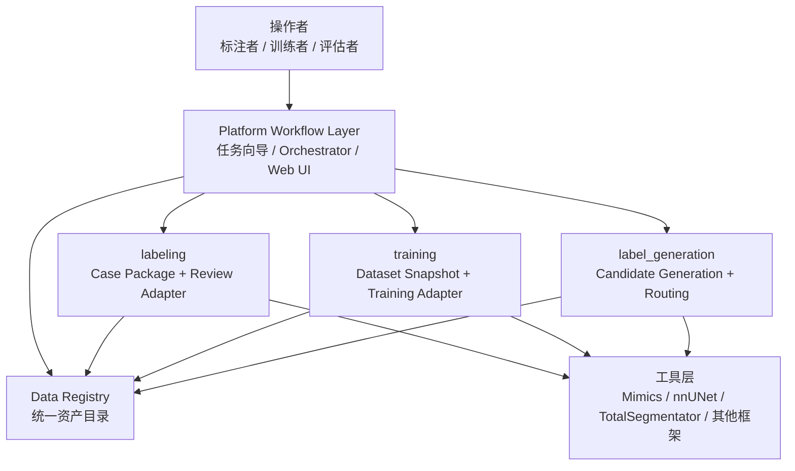

# 平台操作模型

> 日期：2026-06-09  
> 状态：架构补充文档；回答“平台搭好后，操作者如何不关心底层代码也能走完整流程”。  
> 主设计仍以 `docs/architecture/platform_blueprint.md` 为准。

## 1. 结论

当前架构已经具备服务化的基础，但还缺一个明确的操作层设计。

三大实现域解决的是代码和责任边界；真正让标注者、训练者、评估者不关心底层细节的，是更上层的 **Platform Workflow Layer**：



因此平台后续服务化时，不应该让用户直接操作脚本、目录或 YAML。用户看到的是少量稳定动作：

| 用户角色 | 平台动作 | 用户不应关心 |
| --- | --- | --- |
| 标注者 | 打开待 review 病例、修正、保存、提交 | mask 拆分、label id、hash、几何头修复、Mimics 内部脚本 |
| 训练者 | 选择任务、选择数据范围、生成 Snapshot、启动训练 | nnUNet 目录结构、label id 转换、哪些标签状态能训练 |
| 评估者 | 选择模型、选择评估集、查看指标和失败病例 | 模型权重路径、推理临时目录、评估脚本参数 |
| 平台管理员 | 配置数据源、任务规则、Adapter、准入策略 | 单个病例的手工路径 |

这意味着当前架构还需要补齐四类对象的设计形式：Data Registry、Dataset Snapshot、Model Record、Workflow Action。

## 2. 操作内化目标

平台内化不是把所有脚本藏起来，而是把底层规则固化为可复用动作。

### 2.1 第一阶段

第一阶段可以是命令行和文件包，但必须已经模拟未来 Web UI 的动作边界。

例如未来 Web UI 的“生成标注任务”按钮，在第一阶段对应：

```bash
python scripts/package_case.py ...
python scripts/check_case_package.py ...
python scripts/hash_package.py ...
```

但用户文档不应要求标注者理解这些脚本。标注者只需要知道：

1. 打开哪个病例包。
2. 修正哪些结构。
3. 保存并导出。
4. 把导出包交回平台。

### 2.2 服务化阶段

服务化后，Orchestrator 和 Web UI 只编排 Workflow Action，不直接写业务规则。

```text
Create Review Task
  -> select Image Artifact
  -> select candidate/draft label
  -> build Case Package
  -> run preflight QC
  -> open Tool Adapter

Create Training Snapshot
  -> select task
  -> query eligible labels
  -> apply label_policy
  -> freeze split
  -> export through training adapter

Run Batch Inference
  -> select Model Record
  -> select Image Artifact set
  -> run inference adapter
  -> register candidate labels
  -> route by QC/policy
```

## 3. Data Registry 设计

Data Registry 是平台的资产目录。它不是一开始必须做成数据库，但它的记录结构要先设计清楚。

### 3.1 它负责什么

| 功能 | 说明 |
| --- | --- |
| 资产登记 | 登记 Case、Image Artifact、Label Artifact、Model Record |
| 去重和一致性 | 用 hash、shape、spacing、origin、direction、affine 识别重复或不一致 |
| 来源追溯 | 记录数据集来源、人工来源、模型来源、导入批次、工具版本 |
| 标签状态维护 | 记录标签状态、每个结构的来源和训练准入证据 |
| 查询 | 支持按任务、器官、状态、来源、扫描范围查找可用数据 |
| 审计 | 记录谁在什么时候导入、修改、接受、拒绝、用于训练 |
| 导出 | 为 Case Package、Dataset Snapshot、评估集和批量推理提供稳定输入 |

### 3.2 最小实现形式

第一阶段可以先用文件系统加 manifest：

```text
registry/
  cases/
    case_001.json
  images/
    image_001.json
  labels/
    label_001.json
  models/
    model_001.json
  qc_reports/
    qc_001.json
```

后续再迁移到 SQLite/PostgreSQL。只要字段稳定，存储后端可以换。

### 3.3 Image Artifact 示例

```json
{
  "image_id": "img_001",
  "case_id": "case_001",
  "modality": "CT",
  "path": "images/case_001/ct.nii.gz",
  "hash": "sha256:...",
  "shape": [512, 512, 300],
  "spacing": [0.8, 0.8, 1.0],
  "origin": [0.0, 0.0, 0.0],
  "direction": [1, 0, 0, 0, 1, 0, 0, 0, 1],
  "source": {
    "type": "imported_dataset",
    "name": "internal_abdomen_set",
    "import_batch": "2026-06-15"
  }
}
```

### 3.4 Label Artifact 示例

Label Artifact 可以是单个多标签文件，也可以是一组逐器官 mask。关键不是文件形式，而是每个结构的状态要能追溯。

```json
{
  "label_id": "lbl_001",
  "case_id": "case_001",
  "image_id": "img_001",
  "path": "labels/case_001/label.nii.gz",
  "format": "multilabel_nifti",
  "hash": "sha256:...",
  "geometry_ref": "img_001",
  "segments": [
    {
      "organ": "liver",
      "value": 2,
      "status": "verified_label",
      "source": "manual_review",
      "review_tool": "Mimics",
      "qc_report": "qc_001"
    },
    {
      "organ": "kidney_left",
      "value": 3,
      "status": "accepted_pseudo_label",
      "source": "TotalSegmentator",
      "qc_report": "qc_002"
    }
  ]
}
```

这回答了一个关键问题：**不需要为每个器官都单独保存一个庞大的状态文件**。可以一个 Label Artifact 里按 segment 记录状态。腹部数据集中肝来自人工、肾来自算法，是允许的；训练准入时按 segment 级状态和 task policy 过滤。

## 4. Dataset Snapshot 设计

Dataset Snapshot 是一次训练视图的冻结结果。它不等于原始数据拷贝，也不等于 nnUNet 导出目录。

### 4.1 它负责什么

| 功能 | 说明 |
| --- | --- |
| 固定任务 | 记录 task_id、目标器官、TaskLabelMap |
| 固定样本 | 记录纳入哪些 case/image/label segment |
| 固定 split | 记录 train/val/test 或 fold 划分 |
| 固定准入策略 | 记录 `allow_status`、`trusted_sources`、排除规则 |
| 固定输入版本 | 记录每个 image/label 的 hash 和 registry id |
| 固定导出意图 | 记录希望导出给哪个 Adapter，例如 nnUNet |
| 固定预处理配置引用 | 记录 spacing、patch size、低分辨率 coarse 任务等配置的来源 |

### 4.2 它不负责什么

Snapshot 不应亲自执行 resample、crop、normalization 或 nnUNet preprocess。

更合理的边界是：

1. Snapshot 记录任务需要的预处理意图和配置引用。
2. Adapter 根据 Snapshot 导出训练框架需要的目录。
3. 训练框架或 Adapter 执行实际 resample/preprocess。
4. 执行结果和实际参数写回 Model Record 或 Export Record。

这样 coarse 任务可以表达为：

```yaml
snapshot_id: snap_ct_coarse_001
task_id: CT_All_Coarse
task_label_map: task_label_maps/CT_All_Coarse.yaml
preprocess_profile:
  name: coarse_low_resolution
  target_spacing: [3.0, 3.0, 3.0]
  interpolation:
    image: linear
    label: nearest
adapter_target:
  type: nnunet
  export_profile: low_resolution_coarse
```

Snapshot 关心的是“这次训练视图承诺用低分辨率 coarse 配置”；真正 resample 在 nnUNet Adapter 或 nnUNet preprocessing 中执行。

### 4.3 Snapshot 示例

```yaml
snapshot_id: snap_CT5_Liver_20260720_001
task_id: CT5_Liver
created_by: trainer_a
created_at: "2026-07-20T10:00:00+08:00"

label_policy:
  allow_status:
    - verified_label
    - accepted_pseudo_label
  trusted_sources:
    - manual_review
    - TotalSegmentator:liver

task_label_map:
  background: 0
  gallbladder: 1
  liver: 2

cases:
  train:
    - case_id: case_001
      image_id: img_001
      segments:
        - organ: liver
          label_id: lbl_001
          segment_status: verified_label
        - organ: gallbladder
          label_id: lbl_001
          segment_status: accepted_pseudo_label
  val:
    - case_id: case_010
      image_id: img_010
      segments:
        - organ: liver
          label_id: lbl_010
          segment_status: verified_label
```

## 5. Model Record 设计

Model Record 是训练结果的登记表。它让评估者和下一轮 label_generation 能知道模型从哪里来、能用于什么、不能用于什么。

### 5.1 它负责什么

| 功能 | 说明 |
| --- | --- |
| 训练追溯 | 记录 Snapshot、训练框架、代码版本、配置 |
| 权重登记 | 记录模型权重、fold、ensemble、checkpoint |
| 指标登记 | 记录 Dice、Surface Dice、失败病例、评估集 |
| 使用边界 | 记录适用模态、器官、扫描范围、禁止用途 |
| 回流入口 | 作为 label_generation 批量推理的输入模型 |

### 5.2 示例

```yaml
model_id: model_CT5_Liver_001
task_id: CT5_Liver
framework: nnUNet
adapter: adapters/nnunet
snapshot_id: snap_CT5_Liver_20260720_001
code_version: git:abc123
config:
  nnunet_dataset_id: Dataset501
  folds: [0, 1, 2, 3, 4]
weights:
  path: models/model_CT5_Liver_001/
metrics:
  validation:
    dice_mean: 0.91
    surface_dice_mean: 0.86
usage:
  allowed_for_candidate_generation: true
  allowed_for_formal_evaluation: false
limitations:
  - "只验证过 CT 腹部任务"
```

## 6. Adapter 标准

Adapter 的标准不是“所有工具都长得一样”，而是“对平台暴露同样的输入输出契约”。

### 6.1 labeling Adapter 标准

任意来源数据集或标注工具要进入 labeling 域，最低标准是能转成：

1. Image Artifact。
2. Label Artifact 或空标签入口。
3. anatomy vocabulary 映射。
4. review label map 映射。
5. provenance。
6. geometry/QC 报告。

因此，一个任意来源数据集不是“直接统一到 labeling 域”，而是先经过 **ingest/import**，登记为平台 Artifact，再按需要生成 Case Package 给 labeling 域 review。

### 6.2 training Adapter 标准

不同于 nnUNet 的训练框架可以加入 training 域。标准是：

1. 输入必须是 Dataset Snapshot。
2. 不能直接读取散落原始文件绕过 Registry。
3. 必须声明自己如何解释 TaskLabelMap。
4. 必须记录实际预处理、训练配置和代码版本。
5. 必须产出 Model Record。

如果某个算法不是训练框架，而只是用现成模型推理生成标签，它更可能属于 `label_generation`，不是 `training`。

### 6.3 label_generation Adapter 标准

label_generation 可以自定义接入已有算法，也可以替换伪标签生成策略。标准是：

1. 输入是 Image Artifact 集合或 Model Record。
2. 输出必须登记为 `candidate_label`，不能直接伪装成 `verified_label`。
3. 必须提供 label mapping。
4. 必须提供 QC 报告。
5. 必须交给 routing policy 决定进入 `draft_label`、`accepted_pseudo_label` 或 `rejected_label`。

## 7. QC 在哪里发生

QC 不是单个域独占，而是每个关键边界上的 gate。

| 位置 | 触发时机 | 主要 QC | 人是否介入 |
| --- | --- | --- | --- |
| 数据导入 Registry | 新数据进入平台 | 文件可读、hash、空间元数据、label value 合法 | 只处理异常 |
| Case Package 生成前 | 发给标注者前 | 包完整性、配置 hash、草稿标签几何 | 一般不介入 |
| Review 导回 | 标注者提交后 | shape、spacing、origin、direction、label id、空标签 | 异常时由平台管理员或标注者处理 |
| Snapshot 创建 | 训练前 | 标签状态、来源、扫描范围、任务 label map、split 泄漏 | 训练者选择策略，平台自动检查 |
| 批量推理后 | candidate 生成后 | 几何、内容、置信度/规则、异常体积 | 低置信或异常进入人工 review |
| 评估前 | 评估集冻结前 | 评估标签状态、来源、是否泄漏 | 评估者确认策略 |

目标是让人工只处理“医学判断”和“异常裁决”，不要人工做 hash、路径、label id、几何头这类机械检查。

## 8. 缺失标签在哪里区分

“缺失标签不等于器官不存在”主要在两个地方生效：

1. **数据导入/登记时**：Registry 要记录某个器官是 `uncovered`、`missing_label`、还是 `confirmed_absent`。
2. **Dataset Snapshot 创建时**：训练导出必须按这些状态决定某个 voxel 是否能作为背景学习。

训练导出时不能简单说“没有 liver 标签，所以 liver 是背景”。更稳的逻辑是：

| 状态 | Snapshot 处理 |
| --- | --- |
| `uncovered` | 该器官不参与这个 case 的训练监督 |
| `missing_label` | 不当作背景；该结构在该 case 中不提供监督 |
| `confirmed_absent` | 可作为阴性信息进入任务，前提是任务支持 |
| 有可准入标签 | 按 TaskLabelMap 写入训练 mask |

## 9. 状态维护会不会太重

如果要求每个器官、每个文件、每次操作都手工维护状态，确实会臃肿。

推荐做法是：

1. 平台自动生成大多数状态。
2. 人只在少数节点做确认。
3. 状态按 segment 记录，但 UI 聚合展示。

例如：

| 场景 | 状态如何生成 |
| --- | --- |
| 外部数据集导入 | 默认 `source_label`，来源为 dataset import |
| 模型推理输出 | 默认 `candidate_label`，来源为 Model Record 或公开算法 |
| 生成给人修的草稿 | 平台从 candidate 转成 `draft_label` |
| 标注者保存并提交 | 第一阶段自动登记为 `verified_label` |
| 规则接受高质量伪标签 | routing policy 自动登记为 `accepted_pseudo_label` |
| QC 明确失败 | 自动登记为 `rejected_label` |

腹部数据集中肝来自人工、肾来自算法时，平台只需要在同一个 Label Artifact 的 segments 里分别记录：

```yaml
segments:
  liver:
    status: verified_label
    source: manual_review
  kidney_left:
    status: accepted_pseudo_label
    source: TotalSegmentator
```

训练者在 UI 里不需要逐条编辑这些状态，只需要选择任务策略：

```yaml
allow_status: [verified_label, accepted_pseudo_label]
exclude_sources:
  - low_quality_public_dataset_x
```

## 10. combine map 的含义

`combine_map` 不是训练 label map。它用于把多个模型输出合成一个全身展示或导出结果。

典型场景：

1. 现有 v500 可能由多个局部模型组成，例如肺、肝胆、椎体、粗分割等。
2. 每个模型训练时的 label id 都从 1 开始，彼此会重复。
3. 如果要把多个模型输出放进同一个全身 mask，就需要一个全局展示编号。

例子：

```yaml
task_label_map:
  task_id: CT5_Liver
  labels:
    background: 0
    gallbladder: 1
    liver: 2

combine_map:
  map_id: CT_Combine
  labels:
    liver: 37
    gallbladder: 38
```

训练时 liver 可以是 2；全身合并展示时 liver 可以是 37。这不是冲突，因为两者服务不同目的。

## 11. Mimics 拿到软件和 license 后做什么

拿到 Mimics 后，不要先写完整 Adapter。先做 8 个验证。

### 11.1 验证 Mimics 本身功能

| 验证 | 要回答的问题 |
| --- | --- |
| 图像导入 | DICOM 和 NIfTI 哪个稳定？方向和 spacing 是否正确？ |
| 草稿显示 | 多标签 NIfTI 能否稳定显示为可编辑结构？如果不能，逐器官 mask 是否可行？ |
| 人工编辑 | 标注者能否自然修正、保存、撤销、查看 3D/2D？ |
| 标签导出 | 能导出单个多标签 NIfTI，还是只能导出逐器官 mask？ |
| 空间往返 | 导出标签和原图 shape 是否一致？affine/spacing 是否可解释？ |

### 11.2 验证脚本联动能力

| 验证 | 要回答的问题 |
| --- | --- |
| Python 脚本入口 | license 是否允许运行 Python scripting？ |
| 批量创建 mask | 脚本能否根据平台 mask 文件创建 Mimics Mask？ |
| 命名和颜色 | 脚本能否自动设置 mask 名称和颜色？ |
| 读取 mask buffer | 脚本能否把 Mimics mask 转成数组或导出文件？ |
| 无 GUI 批量 | 是否能减少人工导入导出，还是必须人工点选？ |

### 11.3 为什么必要时拆成逐器官 mask

拆成逐器官 mask 是为了降低工具解释风险。

单个多标签 NIfTI 依赖工具正确理解 label id、颜色、名称和多类别编辑。很多标注工具内部更自然的对象是“一个器官一个 mask”。拆开后：

1. 每个 mask 名称就是器官 key。
2. 人工更容易隐藏、显示、编辑某个器官。
3. 导出后更容易判断哪个器官出错。
4. 平台可以用 `review_label_map.yaml` 再合并回多标签文件。

这不是平台最终必须永远使用的格式，而是 POC 阶段更稳的交换策略。

## 12. 仍待讨论问题的影响

| 问题 | 影响哪一步 | 如果不解决会怎样 |
| --- | --- | --- |
| 扫描范围如何记录 | Registry 导入、Snapshot 创建 | 可能把扫描范围外器官误当背景训练 |
| 数据许可如何记录 | 数据导入、Model Record、模型发布 | 可能训练出不能对外使用的模型 |
| 正式评估准入 | 评估集冻结、Model Record 指标 | 内部迭代指标和正式验收指标可能混在一起 |
| `accepted_pseudo_label` 默认排除规则 | Snapshot 创建 | 高质量伪标签能训练，但排除边界不清 |
| Mimics 是否主工具 | labeling Adapter | 影响自动化程度和标注员工作方式 |

这些问题不阻塞第一阶段文件闭环，但会影响 8-10 月的平台加固和验收标准。
