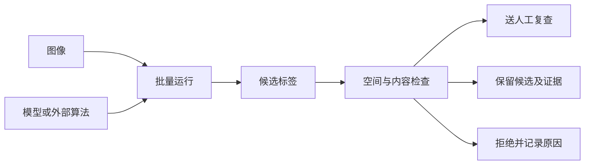

# 候选标签生成域

> 日期：2026-06-13
> 状态：当前候选标签生成域入口。平台总体设计以[平台蓝图](../../architecture/platform_blueprint.md)为准。

## 1. 这个域负责什么

`label_generation` 负责用模型、外部算法或规则脚本生成候选标签，并把结果安全地送回平台。

它包括：

- 调用平台模型或外部算法。
- 把外部标签名称映射为平台统一器官名称。
- 检查图像和标签是否对齐。
- 检查空标签、异常体积和其他质量问题。
- 记录每个候选标签来自哪个模型、算法版本和参数。
- 把结果送人工复查、保留为候选或拒绝。
- 记录批量运行中的逐病例成功、失败和重试。

它不负责：

- 人工修正标签。
- 把算法输出直接登记为人工确认标签。
- 决定候选标签在所有训练任务中都可使用。

## 2. 标准流程



生成结果有三个出口：

| 结果 | 下一步 |
| --- | --- |
| 需要人工判断 | 转成标注草稿，进入人工标注与复查域 |
| 质量证据完整 | 继续保持候选标签，供创建训练数据快照时判断是否采用 |
| 明确不可用 | 登记为拒绝标签，并保存原因 |

质量检查通过不会改变标签来源。TotalSegmentator 或内部模型输出仍然是候选标签。

## 3. 一次批量运行必须记录什么

每次离线批量推理都要创建候选标签生成批次，至少保存：

- 批次标识和格式版本。
- 使用的模型记录或外部算法说明。
- 输入图像列表。
- 工具适配器、参数、代码或镜像版本。
- 标签名称映射。
- 用于识别重复运行的幂等键。
- 每个病例的成功、失败或跳过状态。
- 成功病例产生的标签记录。
- 失败报告和重试次数。

运行规则：

1. 已成功结果不能因重跑被覆盖。
2. 同一运行条件下，已成功病例默认跳过。
3. 失败病例可以单独重试。
4. 一个病例失败不影响其他成功病例登记。
5. 批次记录生成事实，不保存训练准入结论。

字段示例见[核心数据与操作模型](../../architecture/platform_data_model.md)。

## 4. 内部模型和外部算法怎样区分

- 平台训练出的模型使用模型记录说明来源。
- TotalSegmentator、CADS、规则脚本或外部命令行工具使用一份外部算法说明。

外部算法说明至少包含名称、版本、调用方式、参数记录要求、标签名称映射和使用限制。平台不允许没有来源信息的候选标签进入资产登记册。

正式候选标签批次只能使用状态为 `candidate_generation_allowed` 的平台模型。刚训练完成但尚未检查的模型只允许开发调试；被隔离的模型必须阻止运行。

## 5. 和其他域怎样协作

- 需要人工修正的候选标签进入人工标注与复查域。
- 人工提交后的新标签回到资产登记册。
- 训练域在创建训练数据快照时决定本次是否采用候选标签。
- 本域可以提供“建议送审”或“质量证据完整”，但不创建全局训练许可状态。

## 6. 工具或算法怎样接入

一个新的模型、算法或伪标签策略要接入本域，必须：

1. 接收平台图像记录。
2. 有明确的模型记录或外部算法说明。
3. 把输出先登记为候选标签。
4. 保存版本、参数、器官名称映射和质量报告。
5. 批量运行支持逐病例失败和重试。

## 7. 当前实现位置

| 位置 | 当前用途 |
| --- | --- |
| `adapters/label_generation/` | 候选标签生成工具适配器的实现根目录，目前只有边界说明 |
| [CADS 参考](cads_reference.md) | 说明大规模全身标签建设对本平台的启发和不能照搬的部分 |
| [平台数据模型](../../architecture/platform_data_model.md) | 候选标签生成批次、外部算法说明和标签记录字段 |

后续可按真实工具建立子目录，例如：

```text
adapters/label_generation/
  internal_model/
  totalsegmentator/
```
