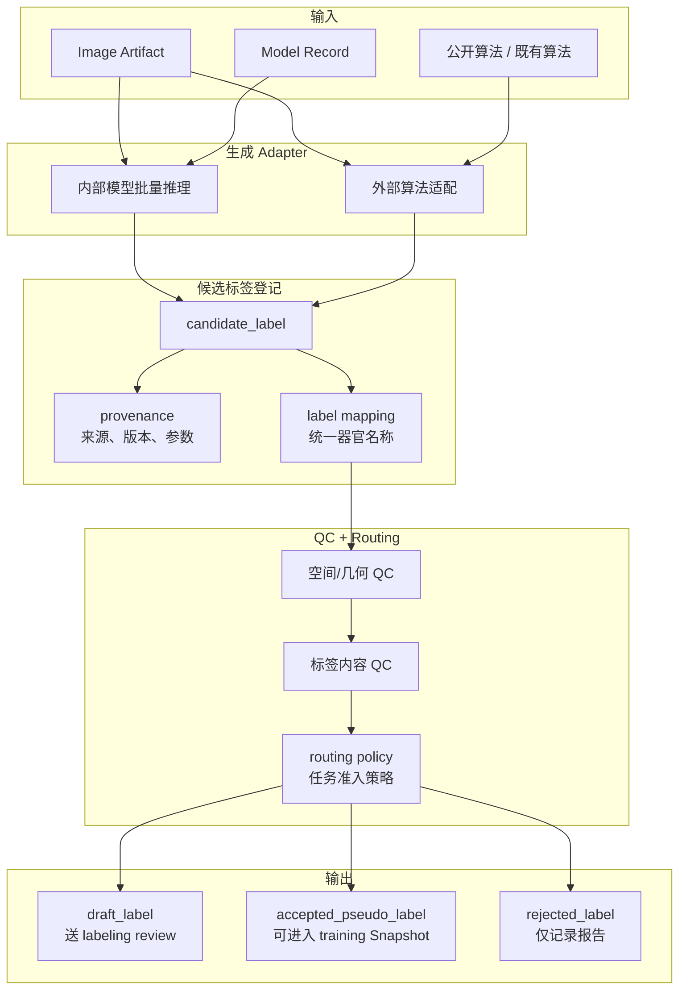

# 标签生成域文档入口

> 日期：2026-06-07  
> 状态：标签生成域导航；平台总体设计以 `docs/architecture/platform_blueprint.md` 为准。

## 1. 为什么不用 `pseudo_labeling`

这个域如果叫 `pseudo_labeling`，会让人以为它只是在做一件事：生成伪标签。

但现有设计里，它实际负责的是更完整的一段链路：

- 用内部模型或公开算法生成候选标签
- 做 label mapping、空间校验和质量筛选
- 决定候选结果进入 `draft_label`、`accepted_pseudo_label` 还是 `rejected_label`
- 把结果回流到标注域或训练域

所以这里最终命名为 `label_generation`。这个名字既保留“生成”这个起点，也容纳后续的治理和回流。

## 2. 关键文档

| 文档 | 当前用途 |
| --- | --- |
| `docs/domains/label_generation/cads_reference.md` | CADS 对大规模候选标签建设和全身分割数据组织的启发 |
| `docs/domains/label_generation/cads_fact_check.md` | CADS 相关事实核查记录 |
| `docs/architecture/platform_blueprint.md` | 定义候选标签状态、训练准入和回流关系 |

## 3. 和其他域的边界

- 和 `labeling` 的边界：`label_generation` 产出候选标签和准入判断，`labeling` 负责人工修订和导回。
- 和 `training` 的边界：训练域消费已经被允许进入任务快照的标签，但不负责定义候选标签的抽检和接受策略。
- 和平台治理的边界：数据许可、产品用途、对外发布限制需要被记录，但不由 `label_generation` 域裁决。

## 4. 标准流程



输出分三类：

| 输出 | 去哪里 | 说明 |
| --- | --- | --- |
| `draft_label` | `labeling` | 给人工修正，不直接训练 |
| `accepted_pseudo_label` | `training` | 按任务策略进入 Dataset Snapshot |
| `rejected_label` | 只记录报告 | 不进入训练，也不送人工，除非人工重新拉起 |

## 5. QC 分层

| 层面 | 检查什么 | 默认处理 |
| --- | --- | --- |
| 空间/几何 QC | 文件可读、shape 一致、affine/spacing/origin/direction 可解释 | shape 不一致拒绝；几何头不一致但 shape 一致时可修复 |
| 标签内容 QC | 空标签、越界、目标器官是否出现、异常体积 | 记录问题，按任务策略决定是否进入人工或拒绝 |
| 准入策略 QC | 状态、来源、任务规则是否允许进入训练 | 只影响是否进入 Dataset Snapshot |

QC 只负责给出证据和路由建议，不负责把标签状态改成更“好看”。例如 TotalSegmentator 输出即使通过 QC，来源仍然应记录为模型/公开算法输出。

## 6. 当前实现落点

当前仓库已经建立 `adapters/label_generation/` 作为标签生成工具的适配器落点。后续凡是下面这些实现，都应优先归到这一域：

- 公开算法适配
- 批量推理生成候选标签
- 伪标签质量报告
- `candidate_label -> draft_label / accepted_pseudo_label` 的规则脚本
- 不同伪标签生成策略或 routing policy 的替换
  
可以先从这些文件开始：

```text
adapters/label_generation/
  README.md
  totalsegmentator/
  internal_model/
```

这样以后你想找“伪标签到底在哪里实现”，不会再被迫在标注和训练之间来回猜。

## 7. 接入标准

label_generation 可以接入已有算法，也可以替换伪标签生成策略，但必须满足四个标准：

1. 输入来自 Image Artifact 或 Model Record。
2. 输出先登记为 `candidate_label`，不能直接伪装成 `verified_label`。
3. 必须提供来源、参数、版本、label mapping 和 QC 报告。
4. 最终去向由 routing policy 决定，而不是由算法自己决定。
