# Mimics Tutorial

# Tutorials

Below, you can find a selection of tutorials to guide you through example workflows utilizing some of the tools that Mimics provides.

<table><tr><td>Chapter</td><td>Description</td></tr><tr><td>Chapter 1: Import</td><td>Tutorial that shows how you can import images in Mimics</td></tr><tr><td>Chapter 2: Mimi</td><td>Tutorial that shows how to do a basic segmentation and 3D calculation.</td></tr><tr><td>Chapter 3: Simon</td><td>Tutorial that shows some advanced segmentation functions to remove artifacts.</td></tr><tr><td>Chapter 4: Smart expand</td><td>Tutorial that shows how to apply the smart expand to segment a liver.</td></tr><tr><td>Chapter 5: Hip</td><td>Tutorial that shows how to use the Analyze module.</td></tr><tr><td>Chapter 6: Obturator</td><td>Tutorial that shows how to make a mold of a cavity by segmenting the Soft tissue around the cavity.</td></tr><tr><td>Chapter 7: Manual Import</td><td>Tutorial that shows how to use the manual import function.</td></tr><tr><td>Chapter 8: FEA Tutorial</td><td>Tutorial that shows how to use the FEA module.</td></tr><tr><td>Chapter 9: Simulation Tutorial</td><td>Tutorial that shows how to use the Simulation module.</td></tr><tr><td>Chapter 10: CFD Tutorial</td><td>Tutorial that shows how to use the FEA module for linking to CFD.</td></tr><tr><td>Chapter 11: Non-manifold Assemblies</td><td>Tutorial that shows how to combine two meshes.</td></tr></table>

Note: In Mimics you have the possibility to use both Hounsfield and Grey Values. This is very important when setting a threshold and when you use the Profile Line function. To switch between these two possibilities, go to Edit > Preferences, General tab and select the Pixel unit you want to use. Most tutorials need one or more modules of Mimics (STL+, RP Slice, Analysis, Simulation or FEA). If you wish to try that section of the tutorial and you don't have the required module(s) installed, an evaluation period of that module can be obtained on request.

# Datasets

If you have chosen to install the demo files during the Mimics installation procedure, the files used in this tutorial will be put in the MedData folder.

# Import

The goal in the first part of this chapter is to teach you how to import images and convert them into a Mimics project. The second part will illustrate how to organize the images in the project you made.

In this tutorial we will discuss three topics:

How to do an Automatic Import   
How to organize images   
How to do a Semi-Automatic Import

Note: There are 3 ways to import images, depending on their format: 1. automatic import, when the format of the files is known to Mimics - import in strict mode, which strictly complies to the DICOM 3.0 standard - non-strict mode, which doesn't enforce DICOM tags to be conformant with the DICOM 3.0 standard 2. semi-automatic, e.g. Bitmap or Tiff images 3. manual import (Import Raw Images), when the file type is unknown and you need to specify some parameters manually

# Automatic import

To start the Import wizard, first select File and then choose New Project Wizard. In the File Browser window, you can select where the images to be imported can be found (STEP 1).

Browse to the MedData folder and select the folder called "DICOM\_Mandible" in the File browser. The list of files will be displayed in the Filename column and all the files will be automatically selected. Click on one of the files and press CTRL+A to select all files in that folder. Click the Next button.

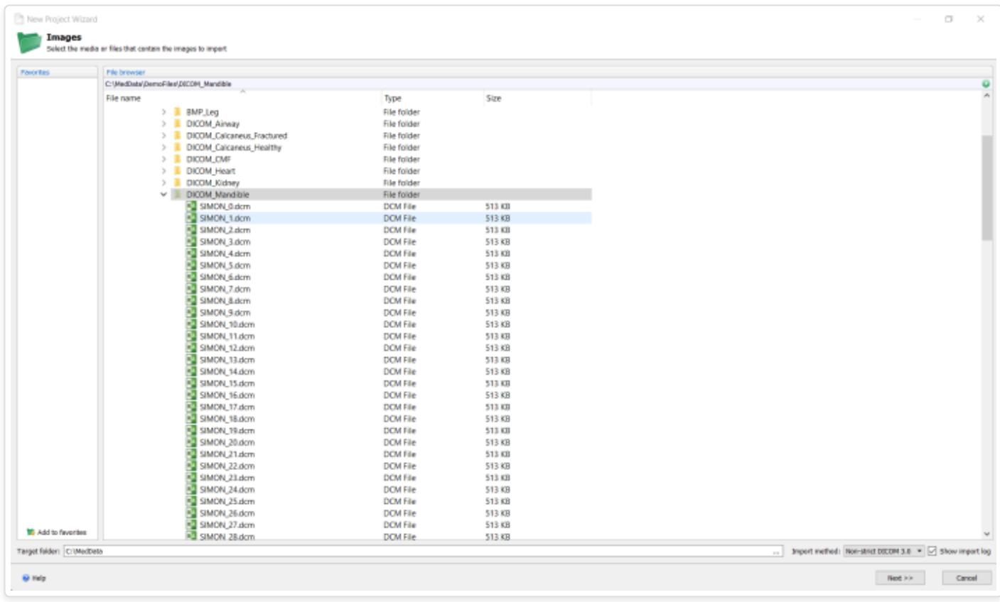

text_image

New Project Wizard
Images
Select the media or files that contain the images to import
Favorites
File browser
C:\MedData\DemoFiles\DICOM_Mandible
File name
Type Size
BMP_Leg File folder
DICOM_Airway File folder
DICOM_Calcaneus_Fractured File folder
DICOM_Calcaneus_Healthy File folder
DICOM_CMF File folder
DICOM_Heart File folder
DICOM_Kidney File folder
DICOM_Mandible File folder
SIMON_0.dcm DCM File $13 KB
SIMON_1.dcm DCM File $13 KB
SIMON_2.dcm DCM File $13 KB
SIMON_3.dcm DCM File $13 KB
SIMON_4.dcm DCM File $13 KB
SIMON_5.dcm DCM File $13 KB
SIMON_6.dcm DCM File $13 KB
SIMON_7.dcm DCM File $13 KB
SIMON_8.dcm DCM File $13 KB
SIMON_9.dcm DCM File $13 KB
SIMON_10.dcm DCM File $13 KB
SIMON_11.dcm DCM File $13 KB
SIMON_12.dcm DCM File $13 KB
SIMON_13.dcm DCM File $13 KB
SIMON_14.dcm DCM File $13 KB
SIMON_15.dcm DCM File $13 KB
SIMON_16.dcm DCM File $13 KB
SIMON_17.dcm DCM File $13 KB
SIMON_18.dcm DCM File $13 KB
SIMON_19.dcm DCM File $13 KB
SIMON_20.dcm DCM File $13 KB
SIMON_21.dcm DCM File $13 KB
SIMON_22.dcm DCM File $13 KB
SIMON_23.dcm DCM File $13 KB
SIMON_24.dcm DCM File $13 KB
SIMON_25.dcm DCM File $13 KB
SIMON_26.dcm DCM File $13 KB
SIMON_27.dcm DCM File $13 KB
SIMON 28.dcm DCM File $13 KB
Add to favorites
Target folder: C:\MedData
Import method: Non-shird DICOM 3.6 Show import log
Help Next >> Cancel

An Import log window will show details of the import, including the recognized formats of the file (see the general help files for a list of known formats).

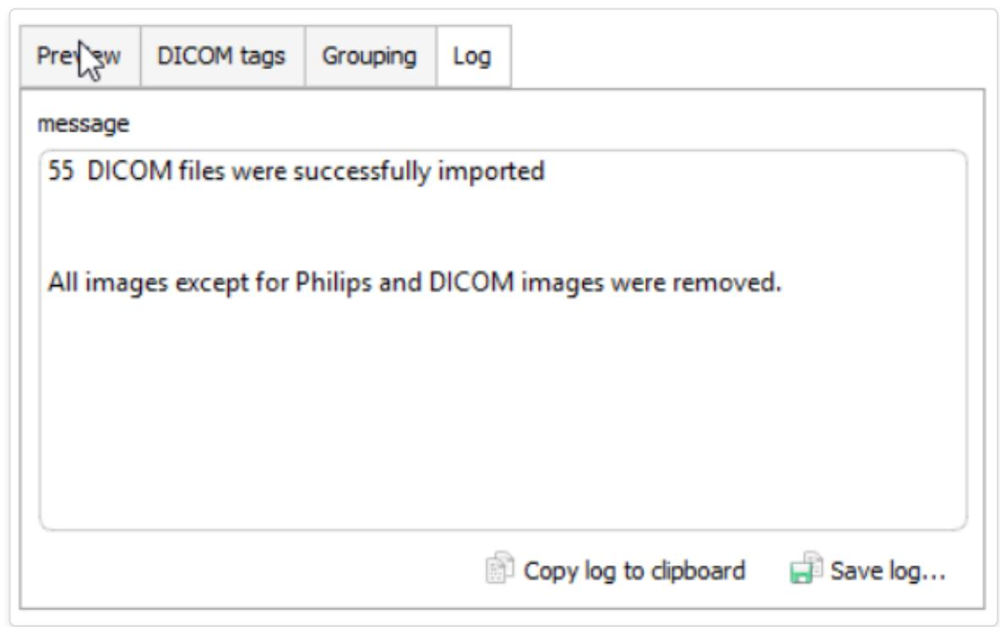

text_image

Preview DICOM tags Grouping Log
message
55 DICOM files were successfully imported
All images except for Philips and DICOM images were removed.
Copy log to clipboard Save log...

Note: In this case the file type is recognized, but in some cases the message log tells you that one or more images are of an unknown file type. If this happens, you have to perform a manual import (see Import Raw Images).

Click Next to proceed to the Studies page. This is the second step of the New Project Wizard, in which you need to select the studies to be converted. The study you have just imported is already selected by default.

In this window some information about the project can be found, such as the number of images, pixel size, patient name, orientation parameters, etc. You can also compress your studies to cut off unwanted regions like Air. For this case, we will chose Lossless Compression.

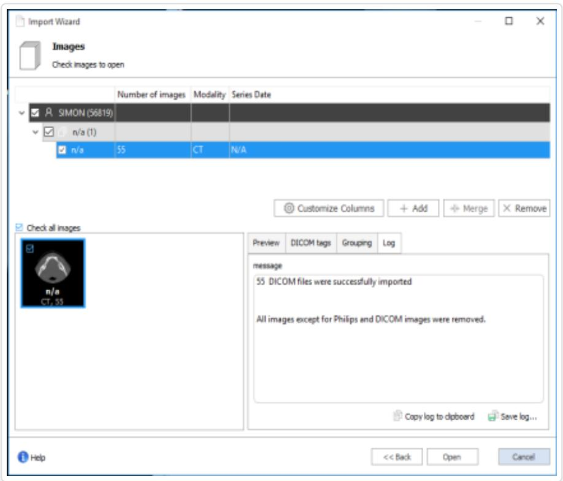

text_image

Import Wizard
Images
Check images to open
Number of images Modality Series Date
SIMON (56819)
n/a (1)
n/a 55 CT N/A
Customize Columns + Add + Merge × Remove
Check all images
Preview DICOM tags Grouping Log
message
55 DICOM files were successfully imported
All images except for Philips and DICOM images were removed.
Copy log to clipboard Save log...
Help << Back Open Cancel

Click Open and you will see a progress bar. After the images are successfully imported, you will see a Check Orientation window where you can check and change the orientations of the imported study. Here, the orientation strings L and R stand for Left and Right, A and P stand for Anterior and Posterior, and T and B stand for Top and Bottom respectively. To change the orientation, click on one of the letters and chose the correct orientation from the list. Note that all the other orientation strings are updated automatically.

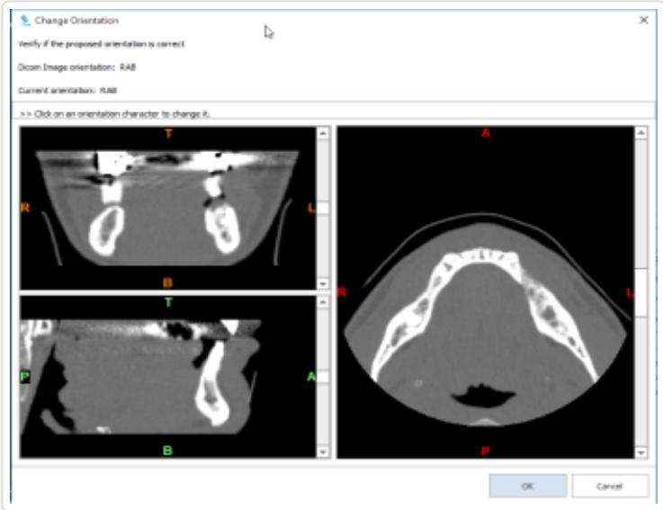

text_image

Change Orientation
Verify if the proposed orientation is correct
Dicom Image orientation: RAB
Current orientation: RAB
>> Click on an orientation character to change it.
T
R
L
B
A
T
R
L
P
A
B
P
OK	Cancel

If some orientation is not defined in the DICOMs, you will see an X mark, indicating a missing orientation. You can click on the X mark and assign an orientation to it.

If the orientation of the images is correct, click OK and your Mimics project will open. Now you can process your images using the tools explained in the tutorials Simon and Smart Expand (Threshold, Region Growing, Edit, etc.)

# Organizing images

Once you have opened your project, you can decide to exclude some images if they are not good or if you don't need all of them. For example, we can decide to delete the images of the project Simon.mcs that don't include parts of mandible or that don't contain any information.

To access the Organize Images window, go to Image and then choose Organize Images.

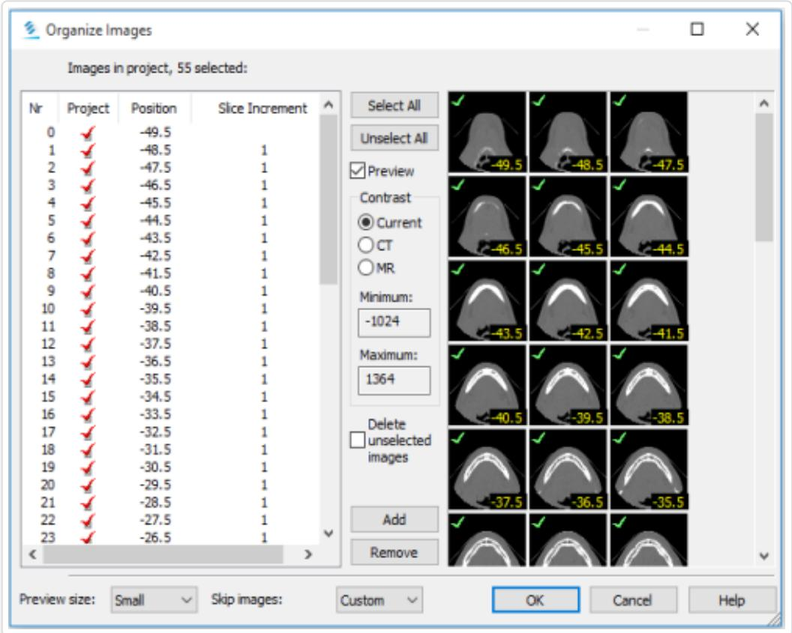

text_image

Organize Images
Images in project, 55 selected:
Nr	Project	Position	Slice Increment
0	✓	-49.5
1	✓	-48.5	1
2	✓	-47.5	1
3	✓	-46.5	1
4	✓	-45.5	1
5	✓	-44.5	1
6	✓	-43.5	1
7	✓	-42.5	1
8	✓	-41.5	1
9	✓	-40.5	1
10	✓	-39.5	1
11	✓	-38.5	1
12	✓	-37.5	1
13	✓	-36.5	1
14	✓	-35.5	1
15	✓	-34.5	1
16	✓	-33.5	1
17	✓	-32.5	1
18	✓	-31.5	1
19	✓	-30.5	1
20	✓	-29.5	1
21	✓	-28.5	1
22	✓	-27.5	1
23	✓	-26.5	1
Select All
Unselect All
Preview
Contrast
● Current
○ CT
○ MR
Minimum:
-1024
Maximum:
1364
Delete
□ unselected
images
Add
Remove
Preview size: Small	Skip images:	Custom	OK	Cancel	Help

You can get a better look at the images by changing the preview size to Medium or Large by selecting the respective size from the Preview size dropdown box.

If you look at the images you will notice that the ones that correspond to table positions -9.5 and -8.5 do not contain any information about mandible. So you can click on these two images to unselect them, the green mark will disappear and the image will be unchecked in the list on the left.

You may also notice that the image at table position -0.5 is the last one that contains information about the mandible. Right-click on the image at position -0.5 and choose Unselect after this. All the consecutive images will be unselected also.

Press OK and scroll through the axial images to check if the correct ones are visible in the project, you should not see the images which were unselected.

You can now save your Mimics project with the name "Organizing Images.mcs" by going to File and then Save As. After you have done this you can make a segmentation following the next tutorial (Simon).

# Semi-automatic import

Now we will try to import the Bitmap images, you can find the dataset in the folder "BMP\_Leg" in your MedData directory. Select File > New Project Wizard and browse to the C:\MedData\DemoFiles\BMP\_Leg directory. Click on one of the images in BMP\_Leg folder and press Ctrl+A on your keyboard to select all files in it. Press the Next button and the Import Log will be displayed. Click Next to see the Images Properties dialog.

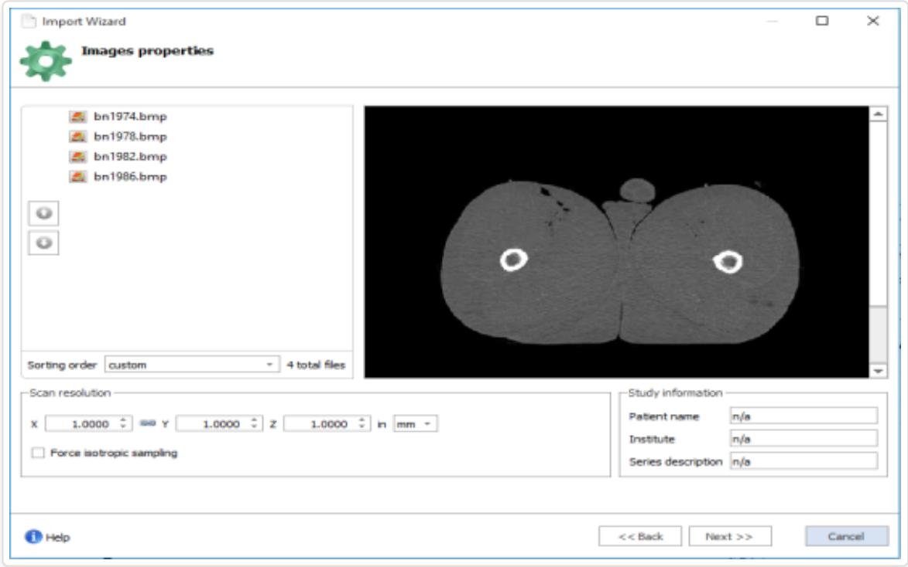

text_image

Import Wizard
Images properties
bn1974.bmp
bn1978.bmp
bn1982.bmp
bn1986.bmp
Sorting order custom - 4 total files
Scan resolution
X 1.0000 Y 1.0000 Z 1.0000 in mm -
Force isotropic sampling
Study information
Patient name n/a
Institute n/a
Series description n/a
<< Back Next >> Cancel

Here you can preview your images and order them according to your preferences. You can also check if the scan resolution is correctly read. Uncheck force isotropic sampling checkbox and change the Z direction to 1. You can also change the dimensions of your images. This information will be typically provided by the radiologist who took the scan. Correct values should be entered here to ensure correct dimensions of the volumes and the Parts that will be created further on. Leave it in mm scale for this case and click Next.

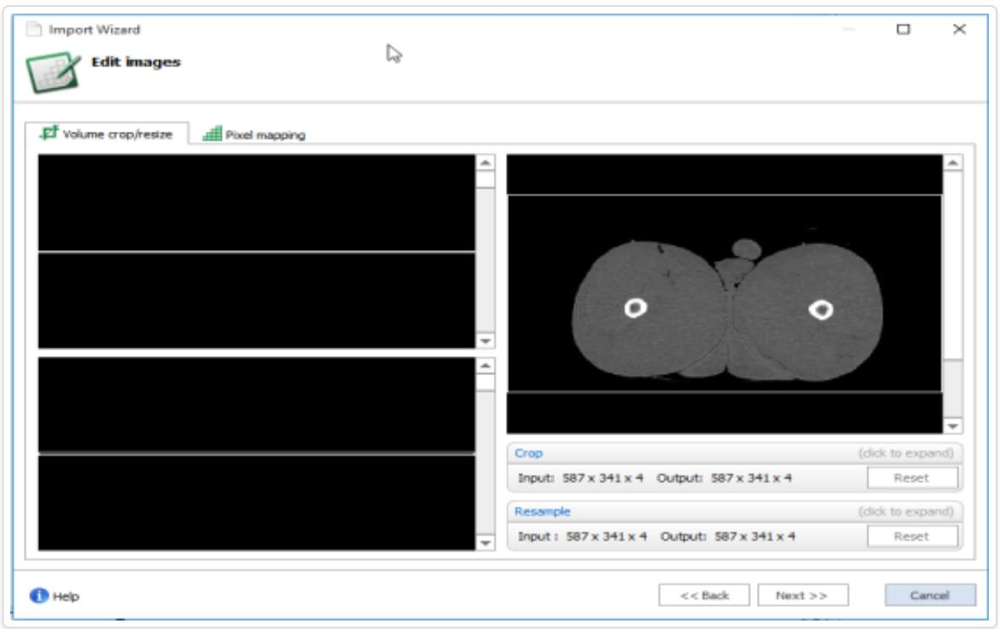

text_image

Import Wizard
Edit images
Volume crop/resize
Pixel mapping
Crop
(dick to expand)
Input: 587 x 341 x 4 Output: 587 x 341 x 4 Reset
Resample
(dick to expand)
Input: 587 x 341 x 4 Output: 587 x 341 x 4 Reset
<< Back Next >> Cancel

In the Edit Images dialog, you have the option to crop the images or resample them. For this example, we will leave the values as is and click Next.

Now you should be able to set the orientation parameters as described in the previous paragraph and calculate a good 3D.

# Mimi

In this tutorial we will show you some basic features of Mimics. The topics that will be discussed are:

Opening the Project   
Windowing   
Thresholding   
Region Growing   
Creating a 3D representation   
Displaying a 3D representation   
View of the end result

# Opening the project

From the File menu, select Open (Ctrl+O). The Open dialog box shows all projects in the working directory. Double click on the Mimi.mcs file (Mimics project file).

All images are loaded and displayed in three views. The view on the right shows the images as they are exported by the scanner (xy-view or axial view). The upper left corner is a reslice of these images in the xz-direction (xz-view or coronal view) and the bottom left is a reslice in the yz-direction (yz-view or sagittal view). The different colors of the intersecting lines refer to the colors of the contour lines of each view so every line refers to the slice in the corresponding view. You can easily navigate through the images by clicking on any point of the CT images in any view: the intersecting lines will move crossing each other in the point you clicked and all the views will be updated showing the corresponding slices.

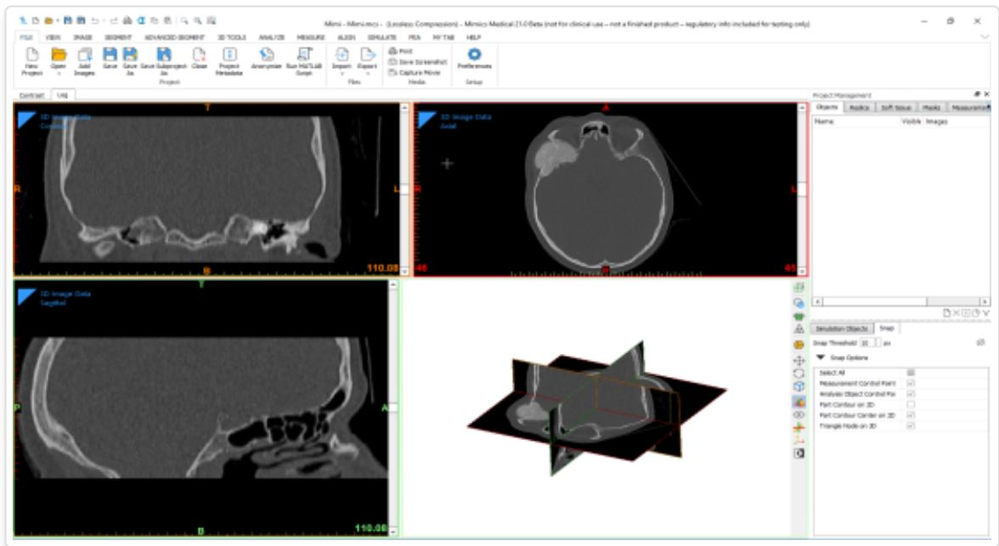

text_image

Mini - MiniLency - (1)realise Compassion - Minics Medical 21.0 Beta (not for clinical use - not a finished product - regulatory info included for testing only)
File Edit Image Segment Advanced Segment 3D TOOLS ANALYSIS MEASURE ALISON EDAUATE REA MY TIM HELP
Fano Project Open Image Save Save Save Subgenject Close Project Metadata Anonymase Sun HUTLAB Script Import Export Print Store ID: MetaNet Capture Pro Movie Preferences Group
Document Link
3D Image Data
Control
110.00
3D Image Data
Ziaol
45
3D Image Data
Cagittal
110.00
Project Management
Objects Realize Soft Issue Masks Measurement
Name Visible Images
Simulation Objects Snap
Snap Threshold 3D px
Snap Options
Select All
Measurement Control Plant
Analysis Object Control Path
First Contour on 3D
First Contour Center on 3D
Triangle Node on 3D

If you need to change the orientation of a view, go to Image > Change Orientation. This will open a window in which you can change the orientation parameters simply by clicking on it with the right mouse button (see Import).

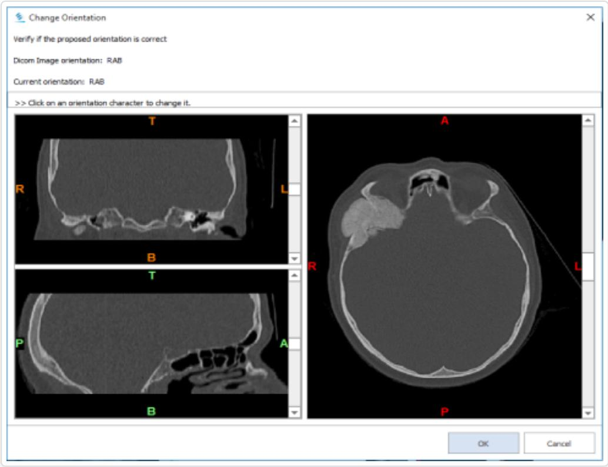

text_image

Change Orientation
Verify if the proposed orientation is correct
Dicom Image orientation: RAB
Current orientation: RAB
>> Click on an orientation character to change it.
T
R
B
L
A
R
T
P
A
B
P
OK	Cancel

In the Mimics window, you will see several indicators, intersection lines, tick marks etc. To deactivate an indicator, go to View > Indicators in the Menu Toolbar, and toggle them off.

In the right border of the window you will see a slider that allows you to scroll through the images from the active view.

In our current project (Mimi), all images are correct. If, however, you have an image set from which you want to remove some images, go to Image > Organize Images. There you can add or remove images

(see Import).

# Windowing

First of all, we have to adjust the contrast of the images displayed in the different views. Contrast enhancement is a very good tool for selecting parts with different intensities, e.g. bone vs. brain tumor. This action can be performed at any time.

You can change the contrast in the corresponding tab of the Project management. The contrast tab shows the histogram of the project with a line representing the "window". The gray values or Hounsfield units below the start point of the line will be displayed in black. All gray values above the end point of the line will be displayed in white. The gray values in between the window will be mapped on a shade of gray. You can change the window size by clicking your left mouse on one of the points and dragging it to its new location. To move the window select the line and drag it to its new position. You can also choose one of the predefined "windows" by selecting the appropriate scale from the menu on the bottom of the tab.

The following steps will describe the necessary actions to achieve a nice segmentation mask. A segmentation mask is a collection of pixels of interest that constitute an object you wish to work on. One can create several - dependent or independent - masks, each displayed with their own identifying color. Usually several masks will be needed to obtain a final segmentation object that contains the information that is needed.

# Thresholding

Thresholding means that the segmentation object (visualized by a colored mask) will contain only those pixels of the image with a value higher than or equal to the threshold value. Sometimes an upper and lower threshold is needed; the segmentation mask contains all pixels between these two values.

For example: A low threshold value makes it possible to select the Soft tissue of the scanned patient. With a high threshold, only the very dense parts remain selected. Using both an upper and a lower threshold is needed when the nerve channel needs to be selected. Defining a good threshold value also depends on the purpose of the model. If you just want a nice looking model, a lower threshold value is recommended since it will result in a model with fewer holes. On the other hand, when the model serves for modeling prostheses a higher threshold value is preferred.

Click the Threshold button

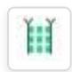

To change the threshold value, press the left mouse button on a slider in the Threshold Toolbar and move the slider by moving the mouse (while still holding the left mouse button).

Some tips for selecting an adequate threshold value:

Look at different images. You can change images of any view by: - using the arrow keys, the page up and page down keys - using the slider on the right in the window border - moving the slice indicators

Click the Draw Profile Line button

In the axial view draw a line over the bone as shown below. To draw this line, click the left mouse button in the soft tissue to indicate the starting point, move the mouse over the bone click. Along this line an intensity profile is generated. The straight horizontal lines represent your current threshold value. Click on Start Thresholding and drag the lower straight-line up/down to set a good threshold. If you want a good visualization model, select a threshold slightly above the intensity plateau of the soft tissue. If your model will serve for modeling prostheses, place the line between the soft tissue plateau and the top value of the bone. If a proper threshold is set, click on End Thresholding to save the current value.

Profile line drawing   
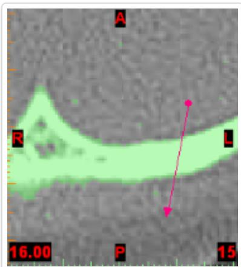

text_image

A
R
L
16.00 P 15

Profile dialog   
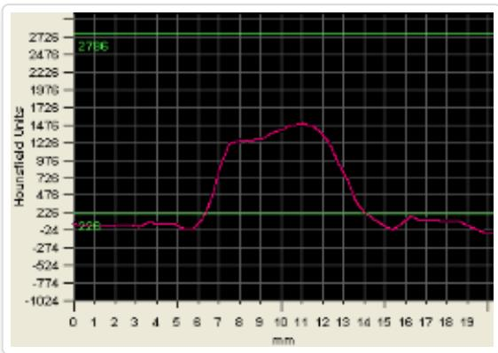

line

| mm | Hounfield Units |
|----|-----------------|
| 0  | -225            |
| 1  | -225            |
| 2  | -225            |
| 3  | -225            |
| 4  | -225            |
| 5  | -225            |
| 6  | -225            |
| 7  | 1228            |
| 8  | 1228            |
| 9  | 1228            |
| 10 | 1228            |
| 11 | 1476            |
| 12 | 1476            |
| 13 | 1228            |
| 14 | 728             |
| 15 | -724            |
| 16 | -724            |
| 17 | -724            |
| 18 | -724            |
| 19 | -724            |

Zoom in on a part you're interested in. First, from the pull-down menu next to the zoom button, select Box. Click the Zoom button

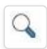

: the mouse is displayed as a loupe. Click the left mouse button on the image and drag for creating a zoom rectangle, release for zooming. To return to the whole image, click the Fit to screen button

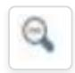

A good threshold value for Mimi is about 270 (Hounsfield scale). The threshold value is displayed in the Min. box of the Threshold toolbar. To end thresholding, click the Apply button.

After the thresholding operation a green mask will be created. In a project you can have different masks but you can use the segmentation tools only on the active mask. To choose the active mask, select it in the mask tab in the project management. In case the project management isn't active, select the project management button

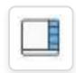

in the main toolbar.

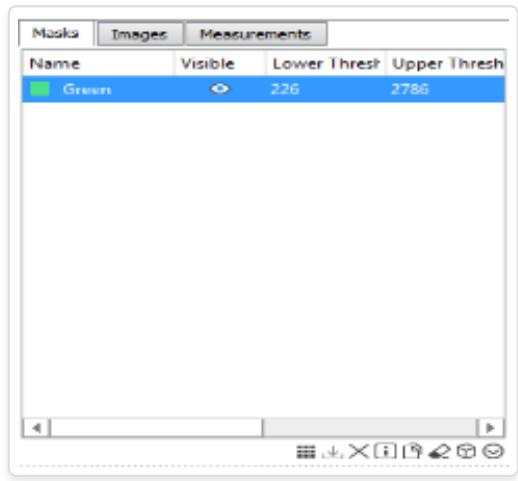

text_image

Masks Images Measurements
Name Visible Lower Thresh Upper Thresh
Green 226 2786

You can also hide any mask by clicking on the eye of the corresponding color.

# Region growing

The region growing tool makes it possible to split the segmentation created by thresholding into several objects and to remove floating pixels.

Click the Region grow button

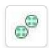

or press Ctrl + R. The mouse is now cross-shaped and the Region Growing window is on the screen.

Select the Source (= Green) and Target mask (= New Mask). Click the left mouse button on one point in the green area of the object of interest (which is a part of the current segmentation object, i.e. part of the skull). The program starts to calculate the new segmentation, all points in the current segmentation object that are connected to the marked point will be used to form a new mask. The new segmentation is colored yellow.

Click the Close button to close the Region growing window.

To make this new mask active, select "Yellow" in the Visualization toolbar. Clicking on the green glasses will hide the green mask. Clicking the button again will make the green mask visible.

Check the mask on different images. When we check the images, we see that everything looks fine. It's time to build a 3D representation.

Note: Thresholding needs to be done before region growing, since all previous work is lost after changing the threshold value.

# Creating a 3D representation

In the mask tab you see all created masks listed with their respective threshold. The names of these masks are Green and Yellow. Selecting one mask will make it active.

Now, you still know that the Yellow mask contains the skull, but after a month, when you reload a project, it might be difficult to know in which mask your end result was stored. Therefore, it is advisable to rename the mask (in Project Management, Masks tab). Click on the name Yellow so that it becomes editable; replace Yellow with a more telling name like "skull".

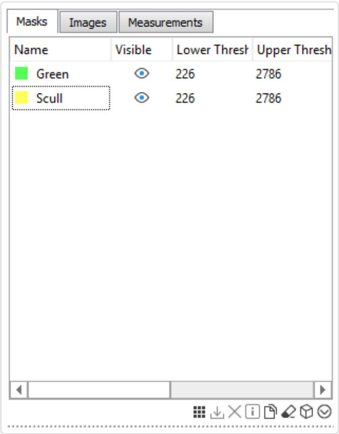

text_image

Masks Images Measurements
Name Visible Lower Thresh Upper Thresh
Green 226 2786
Scull 226 2786

Click on the Calculate Part button

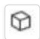

The Calculate 3D Models dialog box is displayed. Here you can select from which masks you want to calculate the 3D model. To select multiple masks hold the Ctrl key while selecting the other masks. In this case select "skull" and press the Calculate button to generate a Part.

You can set the visualization quality of your model. This is only the visualization on the screen; this parameter does not have any impact on the model that you will actually build on a RP machine!!! Of course, the lower the quality, the less time the program needs to calculate the 3D image and the less memory is needed to load the 3D image afterwards.

# Displaying a 3D representation

In the vertical 3D toolbar on the right, you can set the visibility of the different calculated 3Ds. This can also be done in the Project Management's 3D Objects Tab, by clicking on the glasses.

Once the 3D image is loaded, different operations are available:

rotate the model with the button

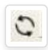

on the right of the 3D window or moving the mouse pressing the right button;

select different standard views, like Top, Front, Bottom, by clicking on the button

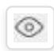

on the right of the window;

zoom with the Zoom buttons or Pan with the

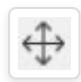

change the color of your model by clicking the right mouse button and selecting the option "Color";

The transparency of the model can be changed. To do so, push the Toggle Transparency button

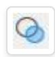

To change the background color, go to File > Preferences > Visualization and select the color you prefer.

# View of end result

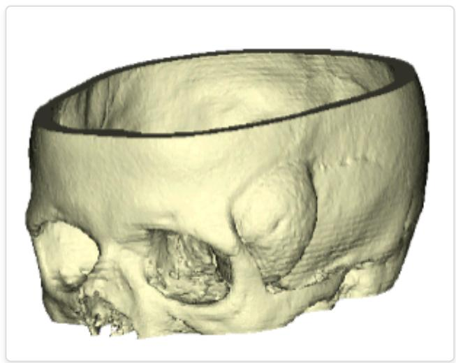

natural_image

3D rendered skull model with visible cranial and orbital structures (no text or labels)

# Simon

The Simon case is an example of a dental segmentation. The mandible of the patient was partially edentulous and needed a prosthesis. First, a scan prosthesis was made that resembled the new teeth to be implanted. The patient had this prosthesis at the correct position in his mouth during the CT scan. Because scan prostheses are made out of barium sulfate, an opaque material, they are clearly visible in a CT image. The result is that you see both the bone and the prosthesis in one image, well positioned against each other. Such a procedure with a scan prosthesis gives better esthetic results and the surgeon is able to make a better planning.

The images in the Simon project are CT scans of the jaw together with the scan prostheses. It will be your job to do the segmentation of the mandible and the prosthesis.

The topics that will be discussed are:

Opening the Project   
Preparation of the data   
Windowing   
Thresholding   
Region growing   
Editing   
Artifacts   
Multiple particles

Scan prosthesis   
Boolean Operations   
View of the end result

# Opening the project

In the File menu, select Open (Ctrl+O). Double click the Simon.mcs file.

# Windowing

For correct windowing see the windowing procedures in "Mimi".

# Thresholding

Go to an axial image where the mandible (without the teeth) is visible (for example, at position -30.50). Press the Profile line button and draw a line over the bone. The figure below shows a profile line and the corresponding profile dialog box. Press Start thresholding and drag the threshold line to a value of about 538 (Hounsfield scale). End the thresholding and save your settings. Close the dialog box.

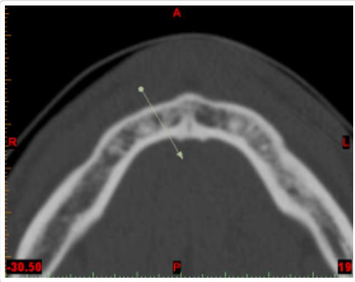

natural_image

Medical CT scan cross-section of a human head showing anatomical structures with measurement markers (no text or symbols present)

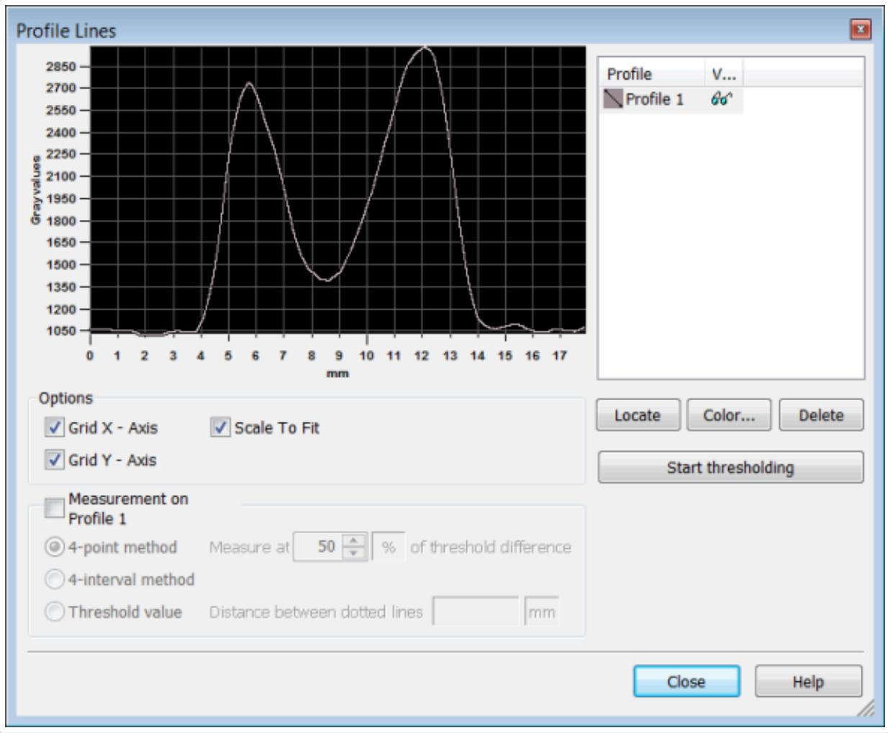

line

| Distance (mm) | Gray Value |
| ------------- | ---------- |
| 0             | 1050       |
| 1             | 1050       |
| 2             | 1050       |
| 3             | 1050       |
| 4             | 1050       |
| 5             | 2100       |
| 6             | 2700       |
| 7             | 2400       |
| 8             | 1500       |
| 9             | 1350       |
| 10            | 1900       |
| 11            | 2600       |
| 12            | 2850       |
| 13            | 2500       |
| 14            | 1500       |
| 15            | 1050       |
| 16            | 1050       |
| 17            | 1050       |

Profile line over the bone (upper image) and the corresponding profile dialog box

# Region growing

Press the Region Growing button

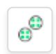

and click on the bone of the skull to start the region growing. The skull is now added to a new mask. Click on the Project Management icon

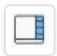

. In the Masks tab, double click the name of the mask and change it to "skull". Make the previous mask invisible (make sure the skull mask is active before making the first mask invisible).

# Editing - Thresholding

Separating maxilla and mandible

To separate the mandible from the maxilla, we have to disconnect them manually. Therefore we erase a layer from the active mask somewhere between the mandible and the maxilla. Then we perform a region growing on the mandible. The result is that both mandible and maxilla will be in a different mask and thus separated.

Look at the sagittal image and place the horizontal indicator between the maxilla and the mandible. Note that it will not be possible to separate them correctly in every image, so we have to find the best possible position.

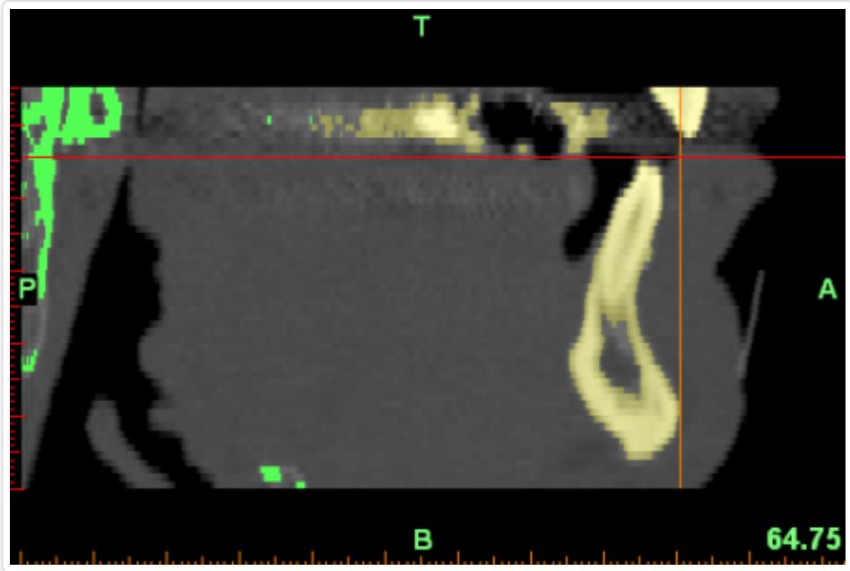

text_image

T
P
A
B 64.75

In the corresponding axial image all pixels have to be removed from the active mask. The position of the axial image corresponding to the position of the horizontal indicator in the figure above, is -4.50. Go to this image and press the Edit masks button

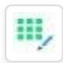

. Select the Erase mode, choose a big square as type of cursor and remove all pixels from the active mask. Make sure you don't forget any! Go to a lower image in the data set and do a region growing of the mandible (do not activate the Leave Original Mask option). Now you have two masks, one for the mandible and another for the maxilla.

Note: In the region growing toolbar, if you activate the Leave Original Mask option, the pixels selected with region growing will be put into a new mask, but they will also remain in the original mask. If the result of the region growing is not satisfying, you still have the complete original mask and you can start over. If this option is not activated, the pixels selected during region growing are removed from the original mask. In this case you can't do the region growing again from the same original mask.

Change in the Project Management the name of the two masks to "mandible" and "maxilla" respectively. In figure below, these two masks are shown and the red line in between indicates the layer that was removed from the active mask.

But be careful! As it was not possible to perform complete separation between mandible and maxilla, therefore, we will still have to edit the images and make sure that all the pixels that belong to the mandible are really in the mandible mask.

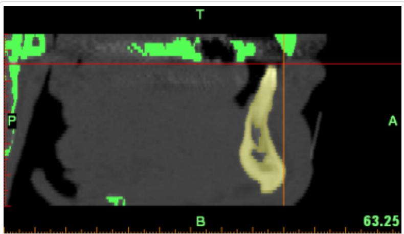

natural_image

Medical CT scan cross-section of abdominal region showing anatomical structures (no visible text or labels)

Scroll through the coronal images and check if every pixel that belongs to the mandible is in the proper mask. Do you notice at position 64.50 that some pixels (at the left side in the image) from the maxilla are wrongly put in the mask of the mandible?

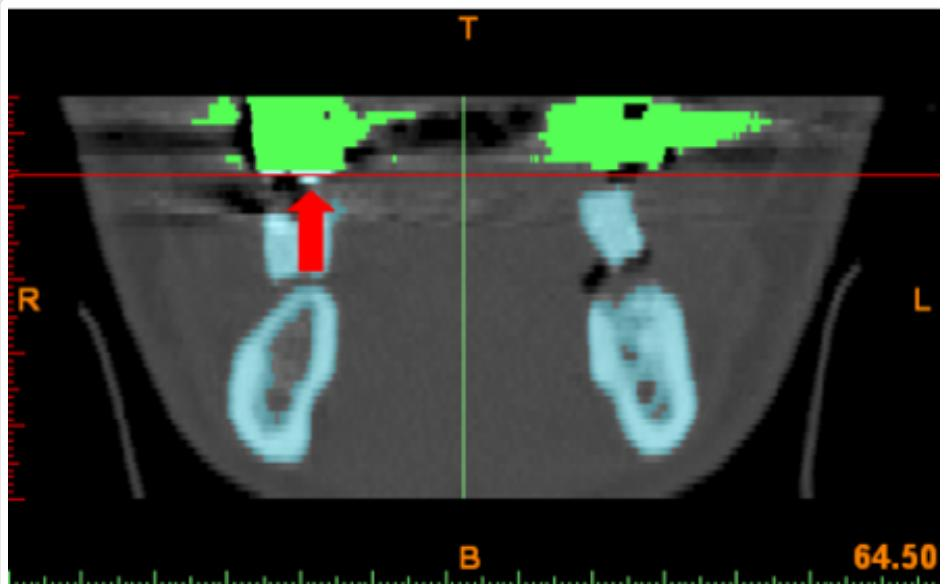

text_image

T
R
L
B
64.50

Move both indicators until their point of intersection indicates the wrong pixels (figure above). It concerns two layers of pixels, belonging to a tooth of the maxilla. In the two corresponding axial images (position -6,50 and -5,50), erase the tooth from the mask of the mandible. You cannot be mistaken, because that tooth is also indicated with the point of intersection of the indicators (figure below). If the two layers of pixels are shown in gray values in the coronal image, you can be sure you erased the whole tooth from the mandible mask. If not, move the indicators again in the coronal image so their intersection points to the wrongly colored pixels. In the axial image, remove the pixels that are indicated by the indicators from the active mask.

Note: you can still access the 1-click navigation function by pressing the SHIFT button while you are editing. You can then click with your left mouse button on the point you want to navigate to.

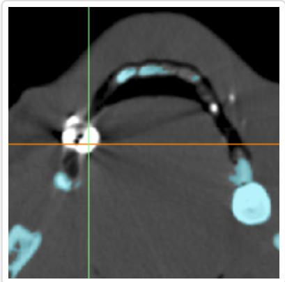

natural_image

Medical CT scan cross-section of the neck region showing anatomical structures with no visible text or labels

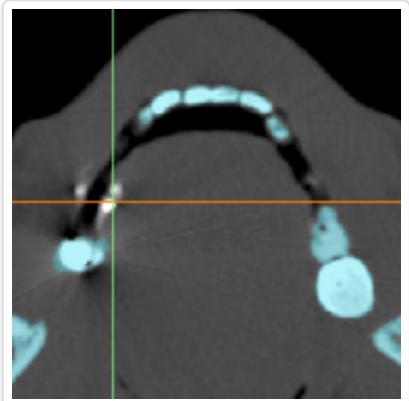

natural_image

Medical CT scan cross-section of a human jaw with highlighted dental implants (no text or labels visible)

Axial images (position: left -5,50, right -6,50): the indicators point out the tooth that does not belong to the mandible mask.

In the sagittal image at position 87.25 (or the coronal image at position 43.25) another collection of badly masked pixels is visible. But now it's the opposite situation! Three layers of pixels that belong to the mandible are not in the mandible mask. Two layers belong to the maxilla mask and the other layer is the one we erased in the beginning to make the disconnection. Again, mark these pixels with the indicators as it is done in the figure below. In the corresponding axial images (at positions -4.50 and -3.50 and -2.50) the pixels (of a tooth) should be added to the mandible mask. We will make use of a local threshold to do this. To make this threshold clear, a short intermezzo is inserted below.

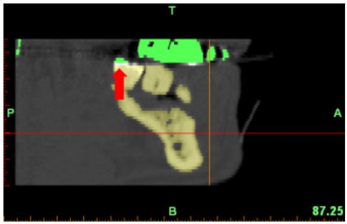

natural_image

Medical CT scan image showing internal anatomical structures with red arrow indicating a specific region (no text or symbols present)

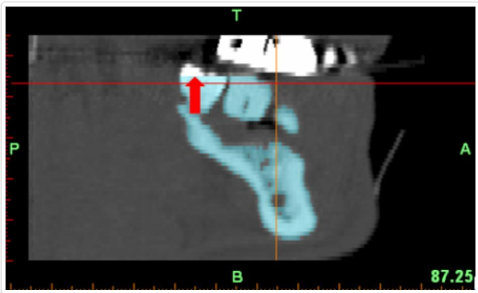

text_image

T
P
A
B
87.25

Indicators point to pixels that should belong to the mandible mask (sagittal view).

Local threshold: In the obturator case it is mentioned that there are three modes to choose from in the Edit toolbar i.e. draw, erase, and threshold. The threshold mode (Ctrl + T) is used to set a local threshold. This means that if you apply a local threshold in a particular area of one image, this threshold doesn't apply to the other images in the project. Remark that the threshold we've set in the beginning of this case was global and it applied to every image in the dataset.

When you activate this mode, the box with the two default threshold values is shown on your screen. To set a different local threshold, press one of the two arrow buttons and double click on a threshold value. After you changed the value, press Enter. When you move the square over the image while pressing the left mouse button, every pixel that comes to lie within the square and has a threshold in the threshold range you just set, will be added to the active mask. On the other hand, all the pixels that already belonged to the active mask and that don't have a gray value within the range will be removed from the mask.

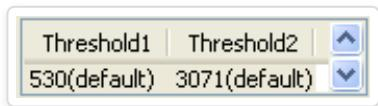

text_image

Threshold1 Threshold2
530(default) 3071(default)

The local threshold range

For the moment we don't have to change the threshold values, but it will be used later on in this case to remove artifacts out of the image.

Maybe you now wonder why we will add the pixels of the teeth that belong to the mandible with this local threshold method and not with the draw mode we will use in the obturator case. With the draw mode, can't you also add pixels to a mask? Yes, that's true, but there is a difference! With the draw mode you add every pixel you touch with your cursor. With the threshold mode you do the same, but there is one more condition before they are really added: their HU values must lie in the range shown in the box. In this case, it's much safer to add pixels by taking into account their gray values. Our segmentation will be more accurate.

Press Ctrl + T. The Edit toolbar shows up and the threshold mode is already selected. Choose a circle as type of cursor and make it more or less the same size as a tooth. Make sure that the mandible mask is the active mask. Press the left mouse button and go over the tooth with your cursor. Make sure you got the tooth completely. You can check this very easily by looking at the sagittal or coronal image: if the wrongly masked layers now have the color of the mandible mask it's alright, otherwise you've forgotten some pixels. Suppose you added too much pixels, just press E (or select the Erase mode with your mouse) and erase them. If you repeat the thresholding in the necessary axial images (see before to know their positions) you should have a sagittal image like in the figure below. Now we can say that the whole mandible is in the mandible mask.

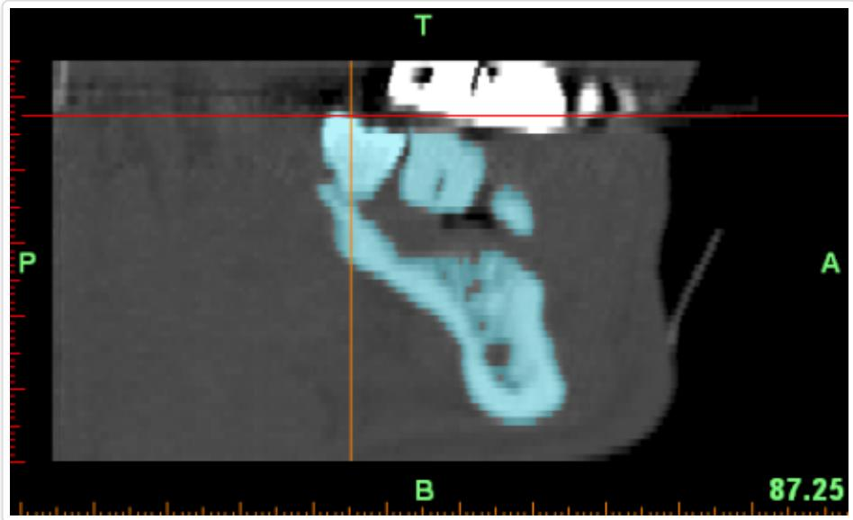

text_image

T
P
A
B
87.25

Sagittal image after local thresholding

# Artifacts

The images still don't look nice, because of all the artifacts. We are going to get rid of them by again performing a local threshold, but not the default one like we just used to add the pixels.

To enter the Edit mode, press Ctrl + T. The threshold mode is already selected. Click on the top arrow of the threshold range box and double click the threshold 1 value. Change this value to 3000 (if you are working in Hounsfield Units) and press Enter. Because the Hounsfield Units of the artifacts are lower than the ones of the teeth. Go with your cursor over the artifacts and notice that they disappear. Why do we use this high local threshold? Because the HU values of the artifacts are lower than the ones of the teeth. So by setting a very high threshold the artifacts will be removed from the mask because their gray values are not in the range. Moreover, if you accidentally go with your cursor over the teeth, their pixels will remain in the mask, except for the edges (their HU are lower). If you removed the edges from the mask, don't panic. Set the threshold range back to the default one by clicking once on the lowest arrow and move your cursor over the tooth again to restore the edges. So, this is the way you should work. Scroll through the axial images and remove all the artifacts from the mask of the mandible.

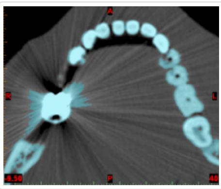

natural_image

Medical CT scan image showing a dental arch with labeled points A, R, L and scale markers (9.50, 48), no textual content beyond labels.

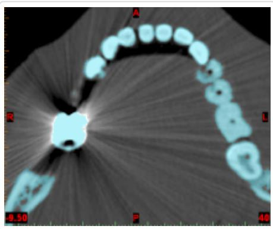

natural_image

Medical CT scan image showing a curved anatomical structure with labeled points (A, R, P, L) and a scale bar (9.50), no readable text or symbols beyond labels.

The artifacts in the left image are removed with a local threshold. The right image shows the result

# Multiple particles

Let's calculate the 3D image of the mandible. Press the Calculate 3D button and select the mandible mask to be calculated (choose low quality). You get the message that the mask consists out of multiple parts. Answer "Yes".

Mimics Medical 21.0.0.289

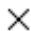

The mask 'Green' exists out of multiple parts. Continue?

Don't ask this question again

No

Visualize the 3D by pressing the 3D button. Rotate the model and remark that there are little particles floating around the mandible due to which you got the message about the multiple parts. The particles are due to the editing you've done to remove the artifacts. To avoid this you have to do a region growing before calculating the 3D. Press the 3D view button again to get back the sagittal image. Press the Region grow button and click into the mandible. Change the name of this new mask to "Total mandible". Now calculate and visualize the 3D model of the final mandible. You can delete the first 3D (with the particles) listed in the 3D tab of the Project Management.

# Scan prosthesis

Can you distinguish between the natural teeth and the scan prostheses in the 3D model of the mandible? It's quite simple; the natural teeth are connected to the bone, while the scan prostheses are not. There are 3 teeth of the scan prostheses at the patient's left side and one at his right side. In the figure below, the scan prosthesis (axial view) is marked with rectangles.

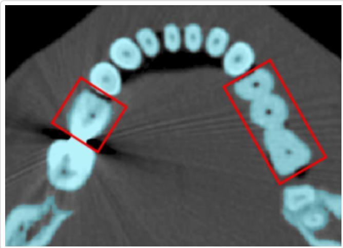

natural_image

Dental X-ray image showing teeth and jawbone structure with highlighted regions (no text or symbols)

Axial image indicating the prosthesis in the boxes.

We would like to have the mandible without the prosthesis and the prosthesis itself into two different masks. There are two ways to achieve this. The first one is to proceed with the segmentation of the final mandible and to remove the prosthesis from the active mask. The second option is to perform a segmentation of the prosthesis. We opt for the latter. We will do a region growing of the prosthesis twice, once at either side. But, we first have to make sure that the prosthesis is completely disconnected from the natural teeth. The intention is to remove (from the final mandible mask) the pixels surrounding the prosthesis and the pixels connected to the prosthesis. The goal is to get the prosthesis nicely isolated in every image. Keep the following advice into account: remove enough pixels in the surrounding of the prosthesis, because sometimes in 2D it looks like there is no connection, but there is still one in 3D. So a 3D model can be very tricky!

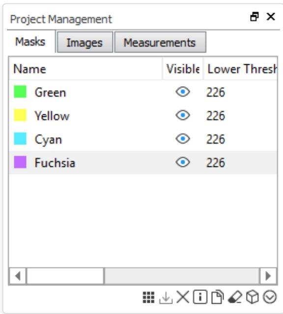

text_image

Project Management
Masks Images Measurements
Name Visible Lower Thresh
Green 226
Yellow 226
Cyan 226
Fuchsia 226

Project Management – Masks tab

Make the mask of the final mandible active and press the Duplicate

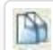

button in the Masks tab of the Project Management window. This way a backup mask is created that we can use to do the segmentation of the prosthesis, while the original Final mandible mask is left unchanged. The original one will be used later on to perform Boolean operations. Proceed with this backup mask (if you don't like the color, press the Color button in the masks tab and choose the color you like). Scroll through the axial images and remove (enough!) pixels surrounding the prosthesis from the active mask. In the figure below it is shown for the axial image at position -11,50.

If you think you disconnected the prosthesis completely, press the Region Growing button. Make sure your target mask is a new mask (if not, select "new mask" from the drop down list) and that you activate the Leave Original Mask option. This last option is very important!

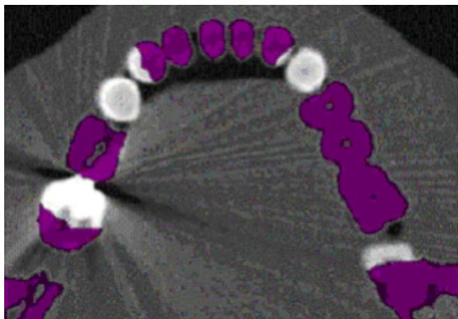

natural_image

Dental X-ray image showing upper and lower teeth with purple and white dental implants (no text or labels)

The prosthesis is disconnected in this layer.

Click on the left or the right prosthesis. If you disconnected the prosthesis entirely, only the prosthesis should be shown in the color of the target mask. If this is not the case, make the previous mask active again, delete the last mask in the list (generated for the region growing) and remove more surrounding pixels from the backup mask. Also in the layers where you don't see the prosthesis it can be useful to remove some pixels belonging to the teeth next to the prosthesis. Repeat these actions for the prosthesis at the other side. Give the masks of both prostheses proper names.

# Boolean Operations

Let's examine what we've obtained so far: the final mandible (with prosthesis), the left prosthesis and the right prosthesis in three different masks. That's nice, but we said earlier that we would like to have the mandible without prosthesis. We can achieve this with some Boolean operations. Press the Boolean operations button

. Let's use the following calculation:

Mandible without prosthesis = total mandible – left prosthesis – right prosthesis

Follow the steps below:

Mask A: final mandible   
Operation: minus   
Mask B: left prosthesis   
Result: new mask (called mask C for reference)

After these options are set, press the Apply button.

Mask A: mask C (obtained in the first step)   
Operation: minus   
Mask B: right prosthesis   
Result: new mask

After these options are set, press the Apply button.

Press the Close button. The last mask (the one that should be active now) contains the pixels of the mandible without the prosthesis. Calculate and view the 3D of this mask. Show also the left and right prosthesis. The other 3Ds can be set invisible. You should have a model that looks like this one.

# View of end result

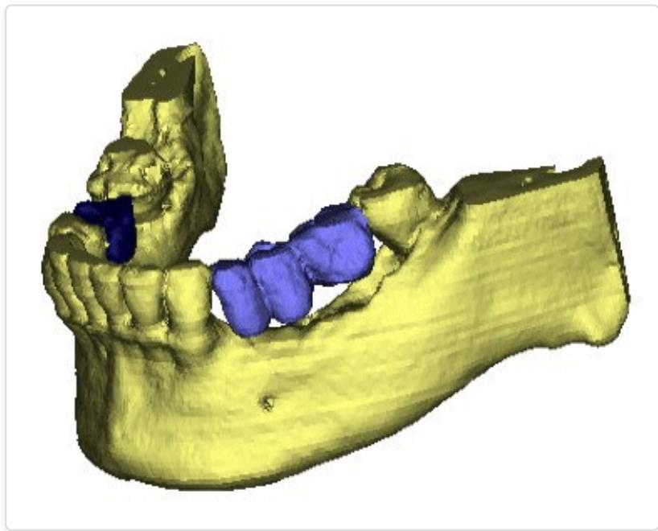

natural_image

3D rendered model of a human jaw with blue dental implant (no text or labels)

# Smart Expand

In the Smart Expand tutorial we will explain how Smart Expand can be applied to segment a liver. The Smart expand tool dilates a rough initial mask until it meets gray value gradients in the images and limit itself to the gradients. In other words, it stops expanding when it finds an edge in the image. The region of operation can be limited by setting the maximum expand distance.

# Opening the project

Open the project Liver.mcs. The project is a CT scan of the liver.

# Creating the source mask

The smart expand tool needs a source mask from which it grows. The growth is limited to the boundaries or gray value gradients in the images.

To create a source mask, first create an empty mask. This can be done by clicking on the New mask button in Project Management tab.

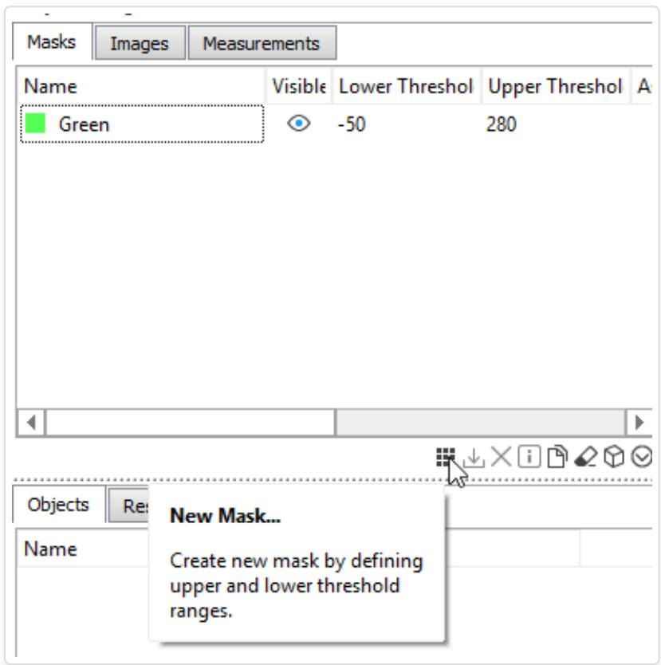

text_image

Masks Images Measurements
Name Visible Lower Threshol Upper Threshol A
Green -50 280
New Mask...
Create new mask by defining upper and lower threshold ranges.

When you click the New button, the threshold window will open. The threshold will not be used during the segmentation process, but it is used when calculating the 3D model. A good selected threshold will result in a better looking 3D. In this case we will use a minimum threshold of -50 and a maximum threshold of 280.

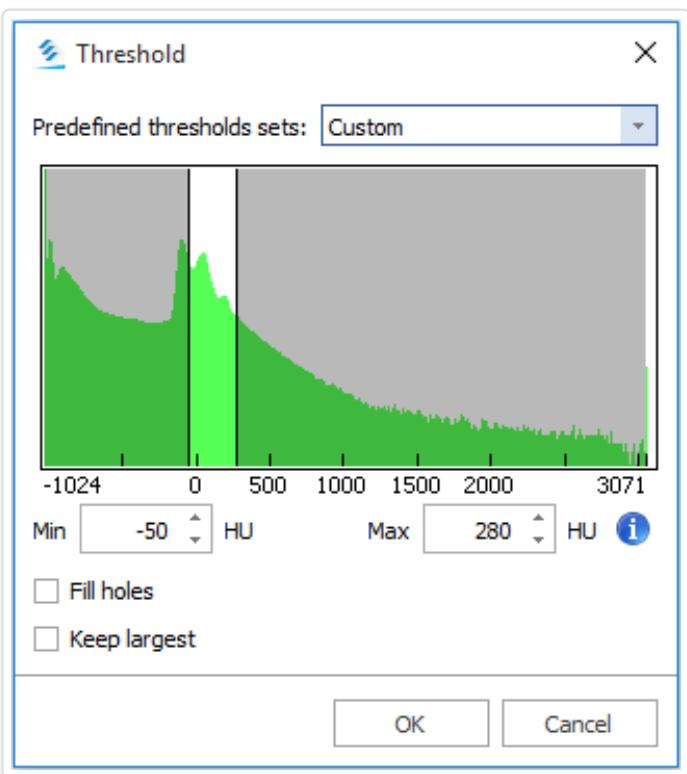

area

| Threshold Range | Frequency |
| --------------- | --------- |
| -1024 to 0      | High      |
| 0 to 500        | Medium    |
| 500 to 1000     | Low       |
| 1000 to 1500    | Very Low  |
| 1500 to 2000    | Very Low  |
| 2000 to 3071    | Very Low  |

Next, select the just created mask and click on "Clear Mask" button in the project management, see below. This will clear the mask you have selected. Now you have an empty mask and we will edit this to create the input for the Smart Expand tool.

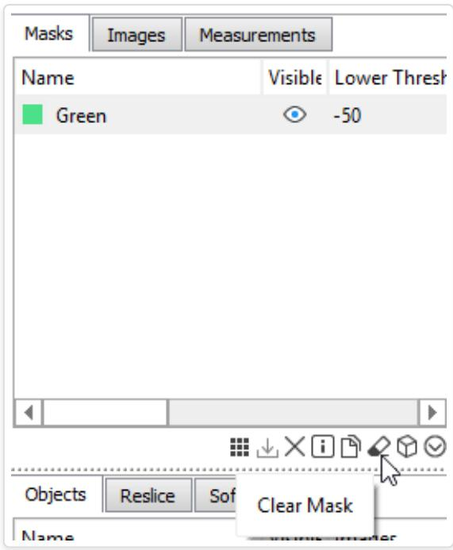

text_image

Masks Images Measurements
Name Visible Lower Thresh
Green -50
Clear Mask
Objects Reslice Sof
Name name imater

# Initialize the source mask

To initialize the source mask, we will roughly indicate the source mask on several slices. When drawing the mask it is important to only select the liver and not any neighboring anatomy.

Go to the Edit masks tool in segmentation toolbar and select the Draw option (Alternatively, press Control on your keyboard and hold while pressing D to go to this option directly.) We will now go to the Full screen mode on the Axial slices and start to draw in the interior of the liver as shown below. We should paint only the inside of the liver.

Start from Slice 100.00 and use Page down key to go 10 slices down. Repeat the process till slice 265.00.

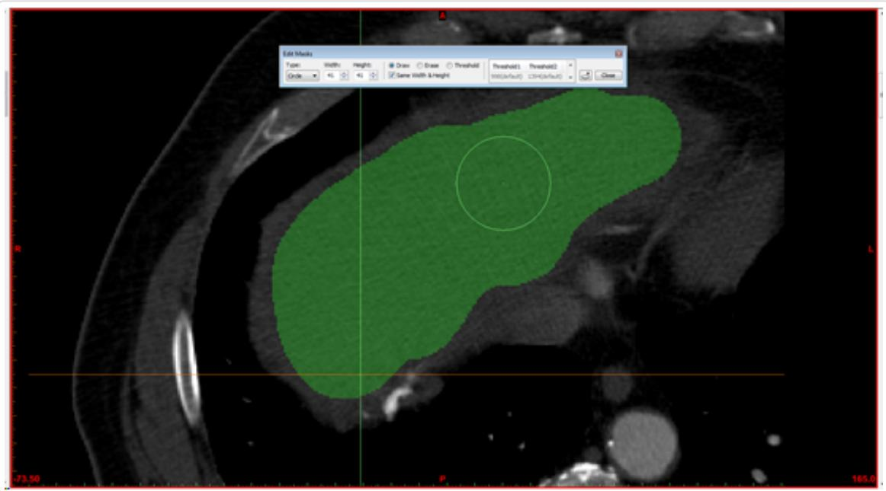

text_image

Edit Marks
Type Width Height Draw Draw Threshold Filter1 Filter2
Circle 45 Same Width & Height Wt( default) Cm( default)
Close
-73.50 P 165.0

The results should look somewhat like shown.

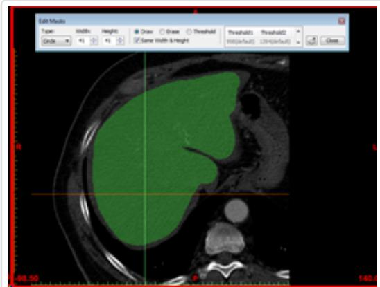

text_image

Edit Mode
Type: Width Height Draw Grave Threshold Threshold1 Threshold2
Circle 41 42 Same width & height 900(3x3/4) 250(3x3/4)
Close
R
-88.50 P 140

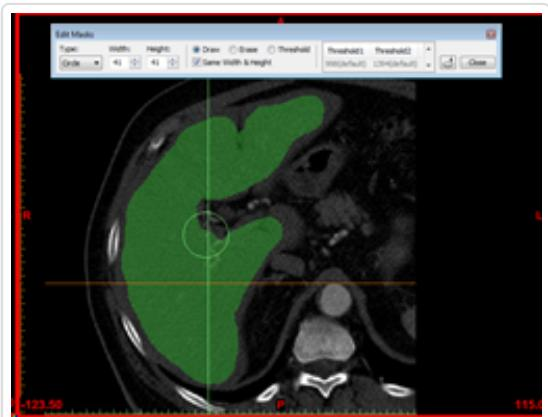

text_image

Edit Mask
Type: Width Height Draw Draw Threshold
Circle 41 42 Same Width & height Threshold1 Threshold2
WBS(0.0000) 2.0000(0.0000)
Close
-123.50 P 115

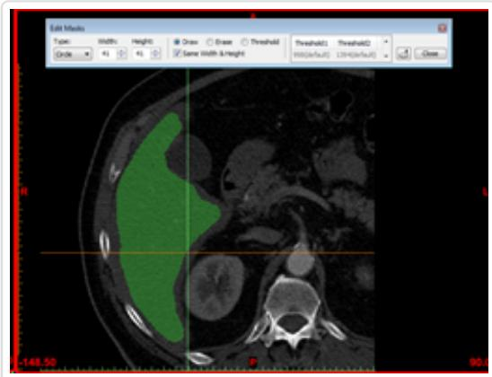

text_image

Edit Modus
Type: Width Height Draw Grase Threshold Threshold1 Threshold2
Circle 41 42 Same width & height 100(0.0x1/0) 130(0.0x1/0)
Close
-148.50 P 90

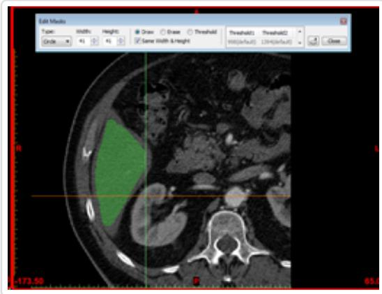

text_image

Edit Marks
Type Width Height Draw Draw Threshold Threshold1 Threshold2
Circle 45 45 Same width & height 900(3x3x3) 130(3x3x3)
Close
-173.50
65

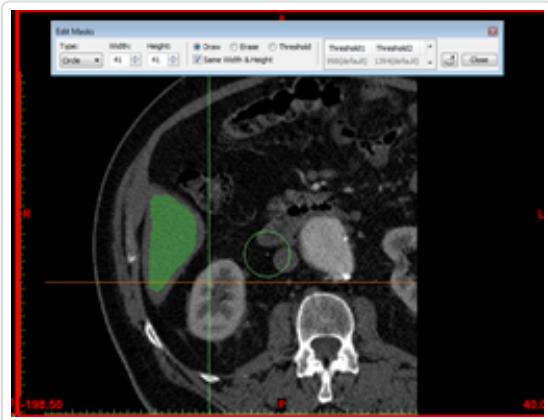

text_image

Edit Models
Type Width Heights Draw Draw Threshold Threshold1 Threshold2
Circle 41 45 Same width & height 0.0000000000000000000000000000000000000000000000000000000000000000000000000000000000
R
-198.50 P 42

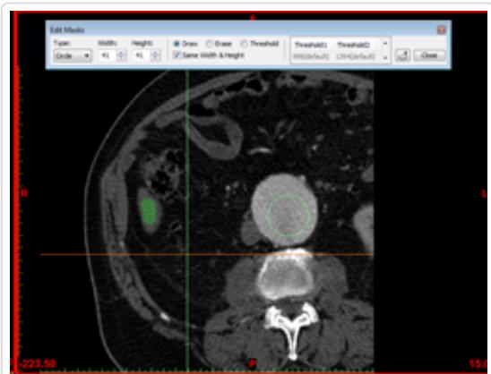

text_image

Edit Media
Type: Width Height Draw Draw Threshold Threshold1 Threshold2
Circle 41 42 Same width & height 900(3x3/4) 150(3x3/4)
Close
-223.50 15

Next, we will repeat the process for Sagittal slices. We'll start at slice number 48.2383 and go 10 slices up like before using Page up. Repeat the process till slice 230.2695. The mask will look somewhat like this:

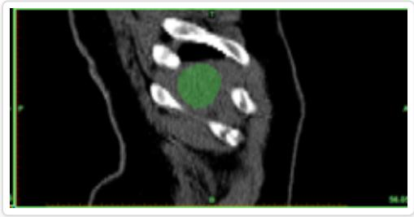

natural_image

Medical CT scan cross-section of the neck region showing anatomical structures (no visible text or labels)

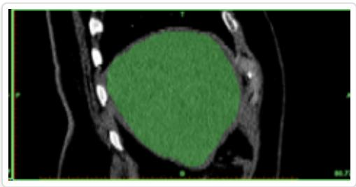

natural_image

Medical CT scan cross-section of the thoracic cavity showing green-stained internal organs (no text or labels visible)

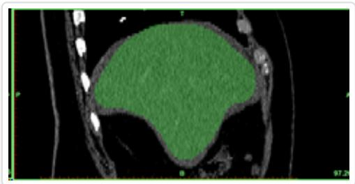

natural_image

Medical CT scan cross-section of the thoracic cavity showing green tissue (no text or labels visible)

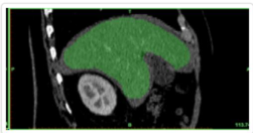

natural_image

Medical CT scan cross-section of abdominal region showing green vascular structure (no text or labels visible)

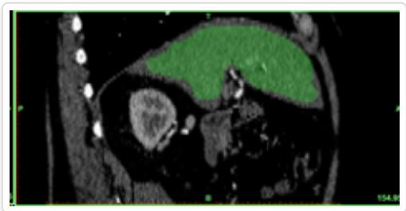

natural_image

Medical CT scan cross-section showing internal organs with green highlighted areas (no text or labels visible)

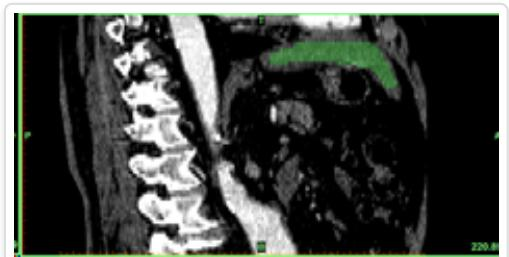

natural_image

Medical CT scan cross-section showing spinal column and surrounding soft tissue (no visible text or labels)

Once complete, look at the coronal view and you will see a grid like mask.

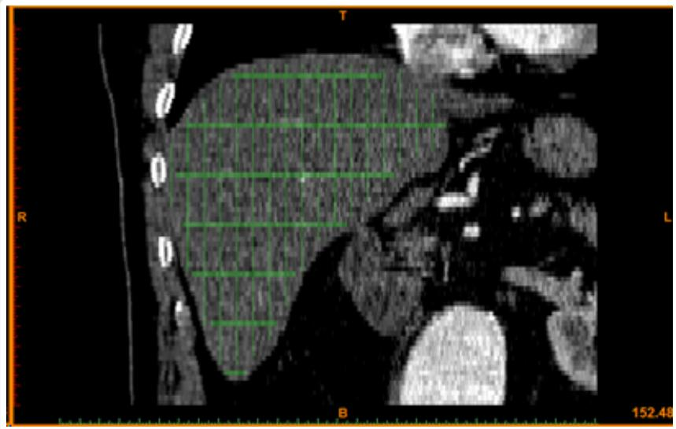

text_image

T
R
L
B
152.48

# Launch Smart Expand

Launch the Smart Expand tool from the Segmentation toolbar by pressing the

icon.

In the Source Mask field, choose the mask you just created and confirm target mask field is set to New Mask. Since we made slices with maximum distance of 10 slices, we can set the Maximum Expand Distance field to be 10 pixels. Click Apply and let the algorithm run.

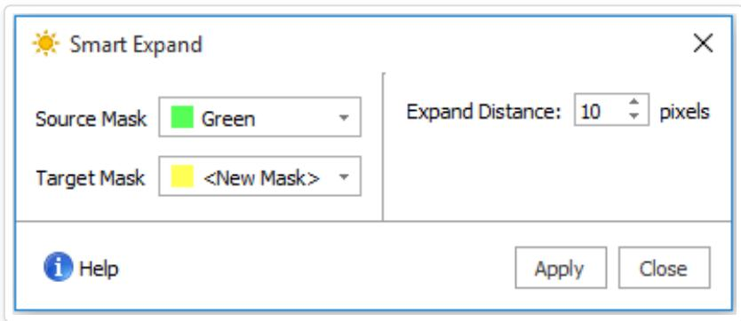

text_image

Smart Expand
Source Mask Green
Target Mask <New Mask>
Expand Distance: 10 pixels
i Help Apply Close

After the algorithm finishes, the result should be a full mask.

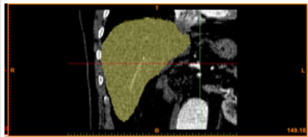

natural_image

Medical CT scan image showing a cross-sectional view of the liver with measurement lines (no visible text or labels)

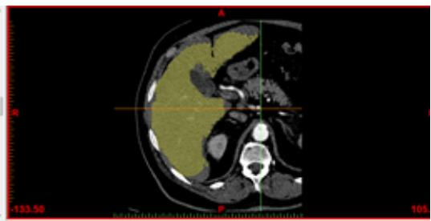

natural_image

Cross-sectional CT scan of the abdomen showing liver, spleen, and surrounding organs (no text or labels visible)

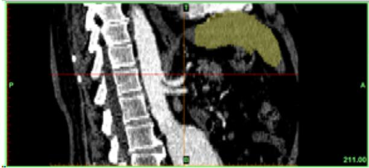

natural_image

Medical CT scan cross-section of the abdominal region showing vertebrae, spine, and liver with measurement markers (no text or symbols present)

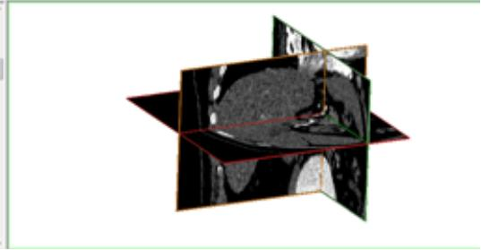

natural_image

3D medical scan showing internal organ structure with highlighted regions (no text or labels visible)

Run the Smart Expand tool again, to obtain a better result.

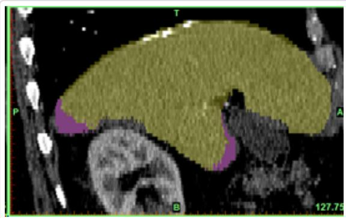

natural_image

Medical CT scan image showing internal organ structure with labeled points A, B, P and a value of 127.75 (no textual annotations beyond labels)

# Smooth mask

The result of Smart Expand will typically show spikes. Click on Smooth Mask in the segmentation toolbar to obtain a smoother result. By clicking multiple times on Smooth Mask you will smooth more.

# Calculate 3D

Click on the Calculate 3D button.

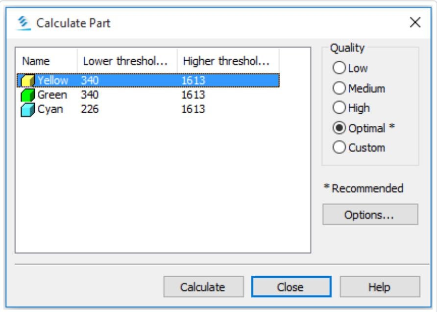

text_image

Calculate Part
Name	Lower threshold...	Higher threshold...
Yellow	340	1613
Green	340	1613
Cyan	226	1613
Quality
○ Low
○ Medium
○ High
● Optimal *
○ Custom
* Recommended
Options...
Calculate	Close	Help

The Calculate 3D Dialog box is displayed. Here select Custom and click on options. In the custom dialog select triangle reduction and smoothing.

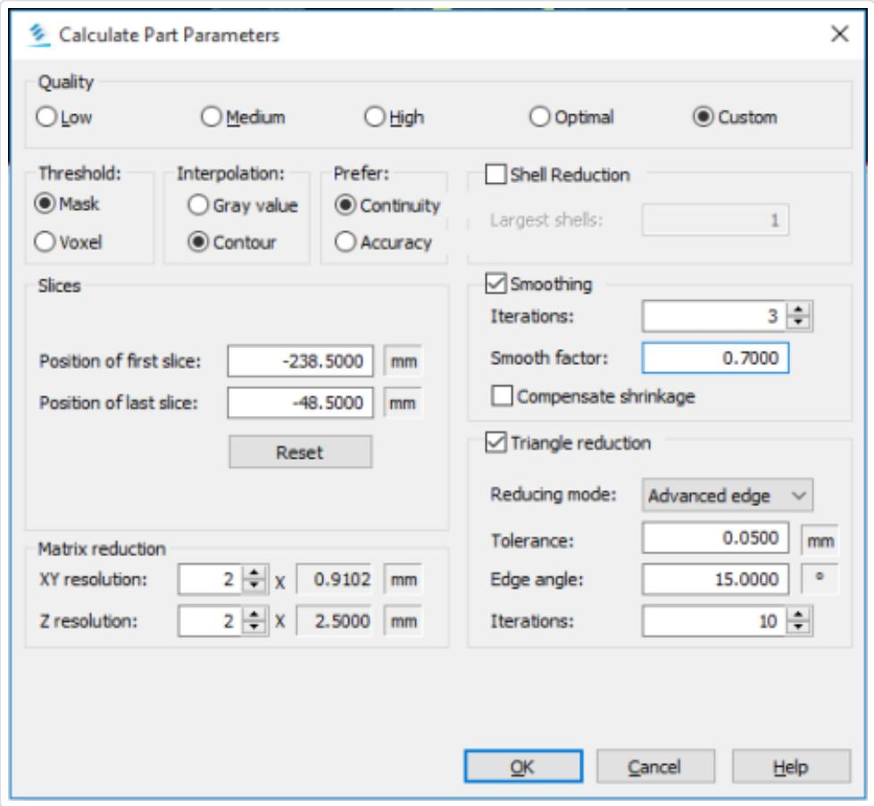

text_image

Calculate Part Parameters
Quality
○ Low ○ Medium ○ High ○ Optimal ● Custom
Threshold:
● Mask
○ Voxel
Interpolation:
○ Gray value
● Contour
Prefer:
● Continuity
○ Accuracy
□ Shell Reduction
Largest shells: 1
Slices
Position of first slice: -238.5000 mm
Position of last slice: -48.5000 mm
Reset
✓ Smoothing
Iterations: 3
Smooth factor: 0.7000
□ Compensate shrinkage
✓ Triangle reduction
Reducing mode: Advanced edge
Tolerance: 0.0500 mm
Edge angle: 15.0000 °
Iterations: 10
Matrix reduction
XY resolution: 2 X 0.9102 mm
Z resolution: 2 X 2.5000 mm
OK Cancel Help

Click OK, followed by clicking calculate. A 3D model of the liver will be visualized in the 3D view.

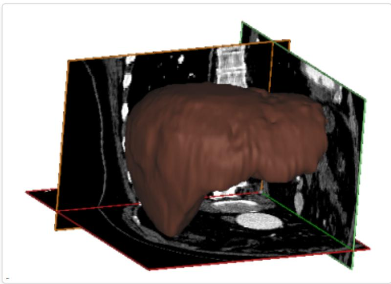

natural_image

3D medical scan showing a human anatomical structure with colored measurement lines (no text or symbols)

# Hip

In this tutorial we will discuss some of the possibilities of the Analysis module. To finish this tutorial you need to have a license for the Analysis module.

The topics that will be discussed are:

Opening the Project   
Preparation of the data   
Thresholding   
Region growing   
Calculation of the Polylines   
Patching of the contours   
Creation of Analysis objects   
Visualization possibilities

# Opening the project

The objective for this part is the creation of a file ready to use in all CAD-systems supporting the IGESinterface. The part of the "Hip" we'll focus on is the right femur of the patient (left in the images). In this IGES-file a basic reference system calculated on the data as well as a partial modeling of the outer contours using freeform surfaces will be present.

It is strongly advised to first follow the tutorial Simon to obtain the necessary skills for segmentation and image processing.

In the File menu, select Open (Ctrl+O). The Open dialog box shows all projects in the working directory. Double click the Hip.mcs file (Mimics project file).

# Thresholding

A good minimum threshold value for this case is 1235 (Gray Values) or 211 (Hounsfield values). Set this threshold in your base mask and apply it. The procedure is explained in detail in Simon.

# Region growing

We want to make a model of the right femur (left in the image set). Therefore use the following steps:

Click the Region Growing button or press Ctrl + R.   
Set the Source to Green (if this is your base mask) and Target to New Mask. Check the Multiple layer box.   
Click the left mouse button on one point of the right femur (left on the images). The right femur has now been grown into a new mask (Normally if you have started fresh the femur will be in the yellow mask now).

To calculate your 3D, go to Project Management, Masks tab, select the yellow mask and press the Calculate 3D button. The yellow mask will be automatically selected in the Calculate 3D window, but you need to set the Quality to High and press the Calculate button.

You can find more details about this in Simon.

# Calculation of the Polylines

Go to the Project Management.

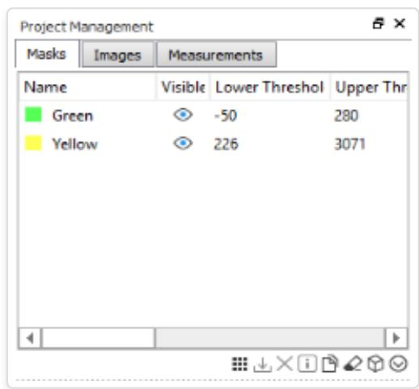

text_image

Project Management
Masks Images Measurements
Name Visible Lower Threshol Upper Thr
Green -50 280
Yellow 226 3071

# Project Management - Masks tab

Select the yellow mask and click on the action button, select the Calculate Polyline option from the action list. The Create Polylines dialog box appears with the Yellow mask already checked; click OK. The borders of your yellow mask will be calculated and displayed as a polyline in both 2D and 3D images.

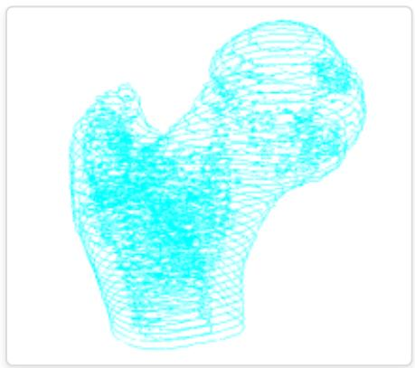

natural_image

3D wireframe model of a human torso (no text or symbols)

# 3D view of the polylines

You can also calculate polylines by clicking the

button in the segmentation toolbar.

# Patching of contours

Since we are only interested in the outer contours, we need to select these out and grow them to a new set of polylines.

Go to layer -523 and zoom in on the right femur in the 2D image (xy plane).

Click the Polyline Growing button

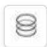

in the Analyze toolbar.

Set all parameters as displayed in the image below: i.e. the set to start from, the set that will contain the grown polylines. In order to select a polyline, you need to draw a rectangle over it or simply click on its contour. Hold the left mouse button down, drag it and then release the left mouse button.

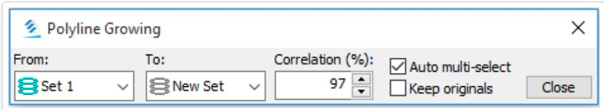

text_image

Polyline Growing
From:
Set 1
To:
New Set
Correlation (%):
97
✓ Auto multi-select
□ Keep originals
Close

# Before

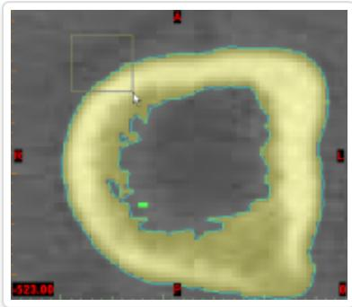

natural_image

Grayscale aerial or satellite image showing a dark central region surrounded by a yellow irregular outline, with no visible text or symbols.

# After

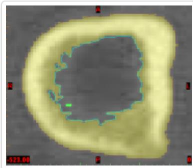

natural_image

Thermal or emission imaging view of a dark, irregularly shaped object with a blue outline, surrounded by a yellow-orange gradient background (no text or symbols)

The growing of the polylines stopped at layer -513 because of a small extension on the bone. This needs to be removed in layers -513 and -511. Afterwards, the polylines need to be updated and then we can proceed with the polyline growing:

Click the Edit masks button and go to the Erase mode or press Ctrl + E   
Make sure that the Yellow mask is Active   
Erase the extension on the bone

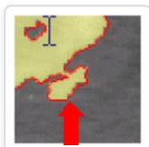

Press the Ctrl + U key or the Update Polylines button in the Edit toolbar   
Repeat this for the following images.

Scroll back to image -513 and click the Grow Polylines button. Set "selection 2" as the target polyline and use 96 % as matching parameter. Select the polyline.

Scroll to image -485 (figure below).

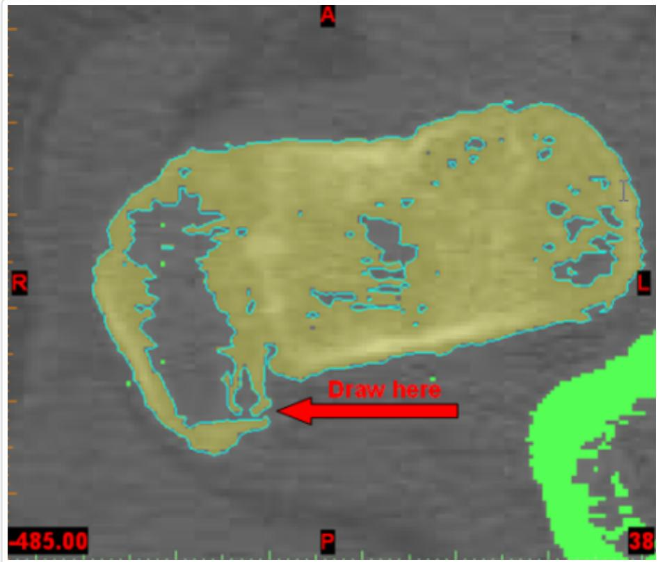

text_image

A
R
L
Draw here
-485.00
P
38

Image -485 of the Hip

At this slice you see a cavity in the contour. If you want to restore this with editing, keep in mind that it will be the yellow contours that will be updated, so we need to remove the pink polyline first.

Do a Polyline Growing from Selection 1 to a New Set; be sure to turn Auto Multi-Select off. You can delete this set by selecting it in the Project management and then pressing the Delete button.

Lose the cavity by drawing in the mask and updating the polyline (Ctrl + U).

Similar editing and updating of the polylines needs to be done on slices: -483 till -479, -475, -471 (on the femur head). Don't forget to update for every image.

When all corrections have been made, the polyline growing can continue.

Go back to layer -485 and perform the Polyline Growing (from Set 1 to Selection 2, matching parameter 95 %, Auto Multi-Select on)

Once all the editing is performed properly, all layers until -477 will be stored in Selection 2.

The femur head and the greater trochanter will be grown into new selection sets. The end result should look like the figure below.

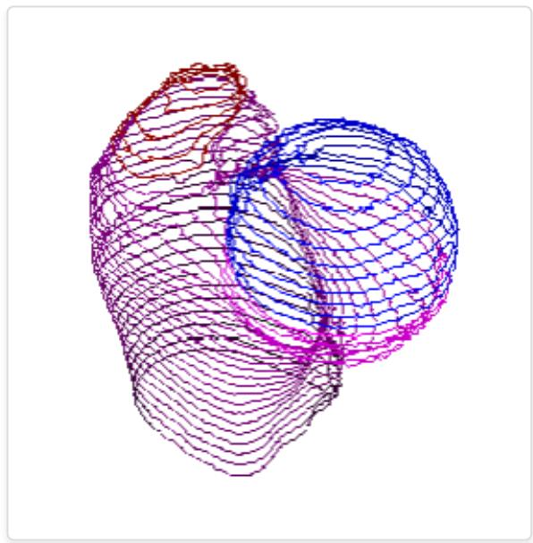

natural_image

3D wireframe model of a conical structure with two colored spheres (red and blue) connected by lines, no text or symbols present.

Polyline sets

# Creation of Analysis objects

On the great trochanter and on the lower part of the femur we will fit a Free Form Surface, on the femur head, we will fit a sphere.

In the Project Management on the Polylines tab, you will find a button Fit Surface. Choose Selection 2 and press the Fit Surface button. The following dialog box will appear.

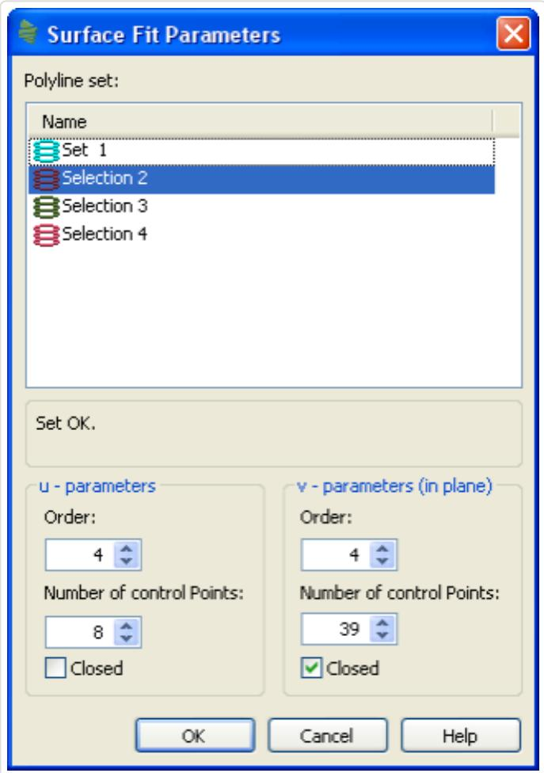

text_image

Surface Fit Parameters
Polyline set:
Name
Set 1
Selection 2
Selection 3
Selection 4
Set OK.
u - parameters
Order:
4
Number of control Points:
8
Closed
v - parameters (in plane)
Order:
4
Number of control Points:
39
Closed
OK	Cancel	Help

# Surface Fit Parameters

You can accept these default values and a Free Form Surface will be fitted on Selection 2.

Note: Some caution in increasing the number of control points is advised. The basis of a B-spline is a polynomial and a polynomial has the tendency to wave. So, if the number of points is too high, the fit on the polyline will become worse.

Repeat this set on Selection 4.

The Free Form Surfaces are visible in 3D as a shaded surface and in 2D you will see a cross-section on every layer of this Free Form Surface.

To fit a Sphere on Selection 3, go to the Analyze menu and select Sphere > Fit on Polylines. Choose the correct polyline set.

The result of all these fittings should look like following figures:

Fitted objects   
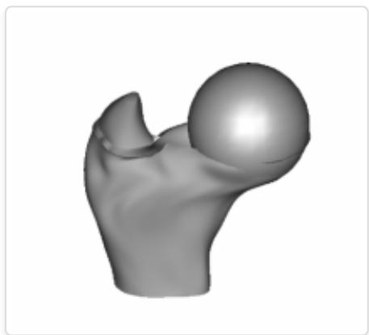

natural_image

3D rendered grayscale image of a human hand and wrist joint (no text or symbols)

Imported STL   
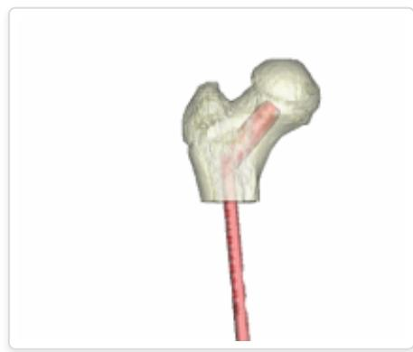

natural_image

3D medical illustration of a hip joint with a red surgical instrument inserted (no text or labels)

# Visualization possibilities

When a prosthesis is designed, the STL file can be loaded in Mimics. One can rotate and move this prosthesis to obtain the best fit of the prosthesis onto the femur and check the design related to the bone structures.

You can import an STL file in the Project Management from STLs tab. Click the Load STL... button. Browse to the MedData folder and select the prosthesis.stl. The STL file will be visible both in 2D (as cross-sections) and in 3D.

To adjust the position of the STL file, click the Move button to move the STL file or the Rotate button to rotate it. Both actions can be performed in 2D as well as in 3D.

# Obturator

In the previous cases we have segmented bone structures, whereas in this project we are going to make a soft tissue model. An interesting application is the modeling of the soft tissue around the cavity of the mouth. Such a model can be used as a mold for obturator prostheses. In the case study following this introduction we will do just that.

How are we going to model this soft tissue? Since we are only interested in the area around the cavity, we need to limit the model to the region of interest. By erasing one layer from the active mask in every direction, the cavity and the soft tissue around it will be separated from the rest of the image. This way the region of interest is captured in a 3D box delimited by the removed layers. Next we perform a region growing that starts in the region of interest. Because this region is separated from the active mask, only this area will be put into a new mask after the region growing is done. From the new mask a 3D model can be calculated which will contain just the cavity of the mouth and the soft tissue surrounding it.

The topics that will be discussed in this tutorial are:

Case Study   
Preparation of the data   
Windowing   
Orientation   
Thresholding   
Editing   
Region growing   
View of the end result

# Obturator prosthesis for oncologic patients

Case presented by Dr. L.L. Visch from Daniel den Hoed Kliniek Rotterdam.

The first picture shows the cavity in the mouth of the patient after resection of a tumor. In order to protect the tissue weakened by irradiation and to be able to breathe and eat normally, this hole needs to be filled by an implant.

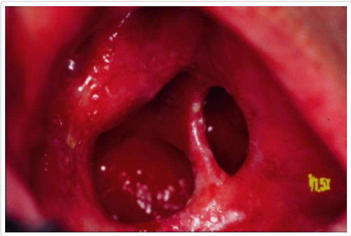

natural_image

Close-up medical image of a human esophageal cavity showing mucosal tissue and a central lumen (no text or symbols visible)

A CT-scan of the patient was made. The soft tissue around the cavity, clearly visible on the scans, was modeled. This model served as a direct mold for the implant.

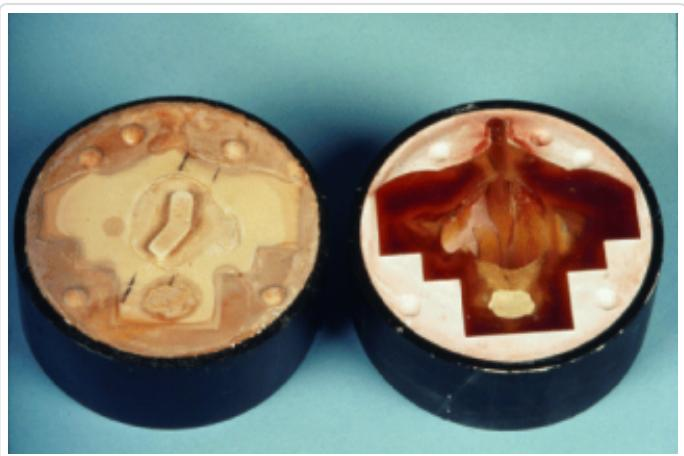

natural_image

Two circular objects with embedded biological or mechanical patterns, one showing a cross-sectional view and the other a detailed internal structure (no text or symbols visible)

The implant, called an obturator prosthesis, was cast from the mold in a bio-compatible silicone.

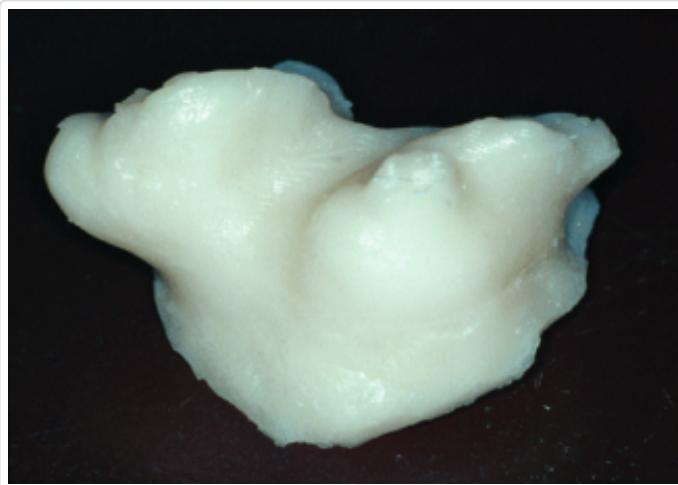

natural_image

Close-up of a white, irregularly shaped object with blue edges against a dark background (no text or symbols visible)

Absolutely no surgery was needed to implant the obturator prosthesis. As the silicone prosthesis is plastic deformable, it can be implanted very easily.

The prosthesis fits the cavity much better than ever could have been achieved by using conventional impression techniques. These traditional techniques produce a master of the obturator prosthesis by making an impression of the cavity in a deformable plastic material.

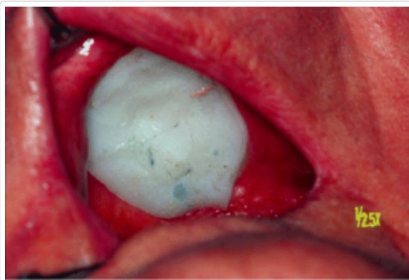

natural_image

Close-up medical image of a human oral cavity showing a white tooth and surrounding tissue (no text or symbols visible)

The prostheses cast from such masters are always less accurate because of the presence of undercuts (the impression technique is not sensitive to local internal broadening of the cavity) and can severely damage the sensitive and vulnerable surrounding tissue.

The soft prosthesis is fixed by means of magnets on a hard dental implant. This makes it possible to take it out for inspection and to replace it afterwards.

# Preparation of the data

In the File menu, select Open (ctrl+O) or click the button

. Double click the obturator.mcs project.

# Windowing

For correct windowing see the windowing procedures in "Mimi".

# Orientation

When the project is loaded, a Change Orientation window pops up.

In the axial image you see the orientation strings L and R, which stand for Left and Right respectively. In the coronal and sagittal image several Xs are displayed instead of the orientation strings. Move the mouse cursor to the top X in the sagittal or coronal image. The cursor is changed to a hand and when you right-click, a menu appears with all possible orientation strings. Select "Top". Remark that all other orientation strings are completed automatically.

Do the same to set the Anterior-Posterior orientation parameter looking at the image displayed.

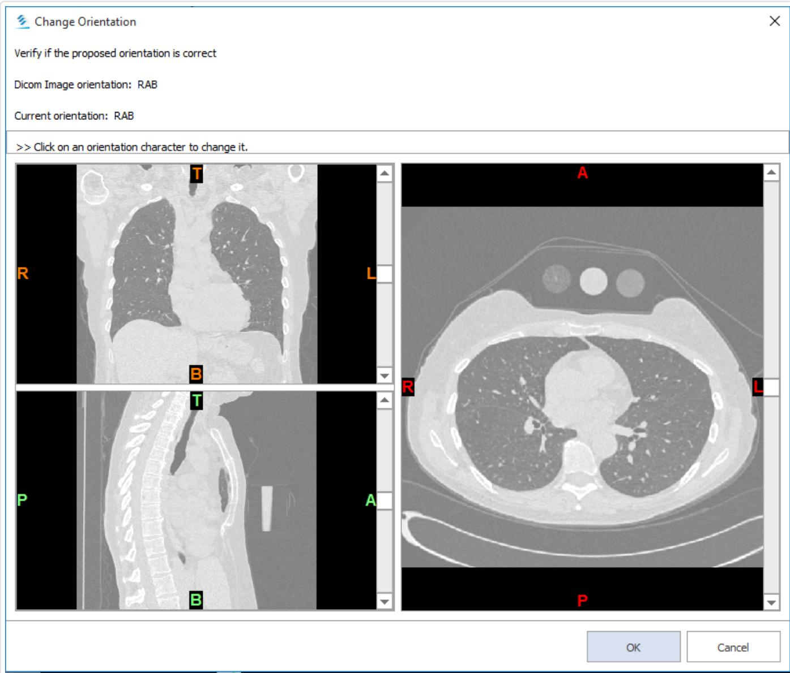

text_image

Change Orientation
Verify if the proposed orientation is correct
Dicom Image orientation: RAB
Current orientation: RAB
>> Click on an orientation character to change it.
R
T
L
B
A
R
L
P
T
A
B
P
OK	Cancel

You can always change your orientation parameters, going to Image > Change Orientation.

# Thresholding

A reliable way to define an appropriate threshold is to make use of a profile line (see "Mimi"). Press the Profile line button

and draw a line in the axial image over the cavity.

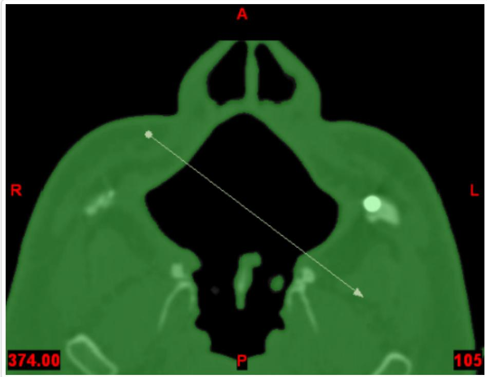

text_image

A
R
L
374.00
P
105

Profile line over the cavity of the mouth

See the figure above (axial image on position 374) to have an idea where to place the profile line. You get a profile like shown in the image below. You can clearly see the transition from the soft tissue to the cavity. Press the Start thresholding button. To visualize all the soft tissue in the mask, drag the lowest threshold line to the value -44 (Hounsfield scale). Press again the End thresholding button and answer "Yes" to the question whether you want to save the threshold value or not. Close the window.

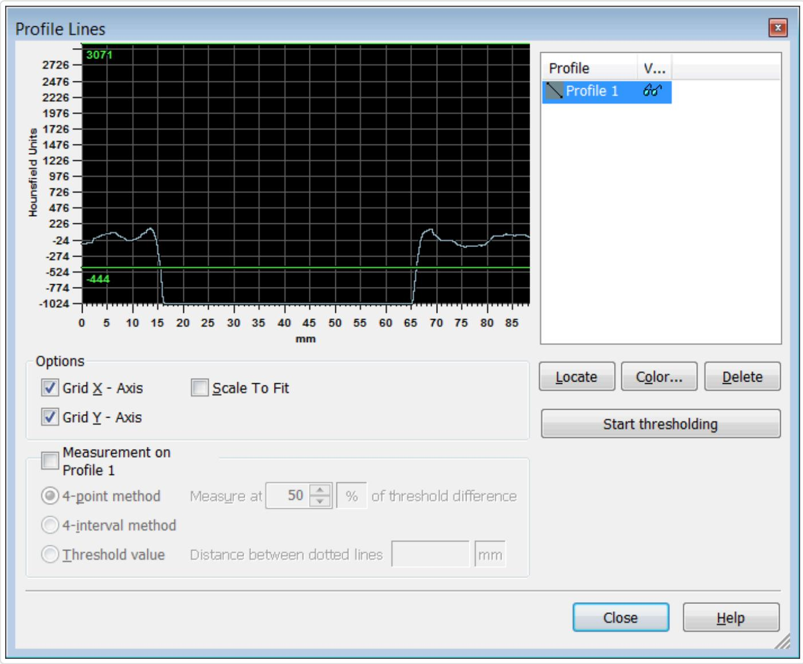

line

| Metric               | Value |
| -------------------- | ----- |
| Hounsfield Units     | 3071  |
| Hounsfield Units     | -444  |
| Measurement on Profile 1 | Grid X - Axis |
| Measurement on Profile 1 | Scale To Fit |
| Measurement on Profile 1 | Grid Y - Axis |
| Measurement on Profile 1 | Measurement on Profile 1 |
| Measurement on Profile 1 | 4-point method Measure at 50 % of threshold difference |
| Measurement on Profile 1 | 4-interval method |
| Measurement on Profile 1 | Threshold value Distance between dotted lines |
| Profile 1            | 60°   |

# Editing

In the axial image, go to position 387.00. Press the Edit masks button

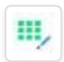

. The edit toolbar is displayed on your screen. Your cursor has become a little square. If not, go to Type and select a square from the drop down list. Notice that the length and the width of the square are displayed and can also be altered. The easiest way to change the size is to press the control key and your left mouse button simultaneously and to move to the right/left to make the square bigger/smaller.

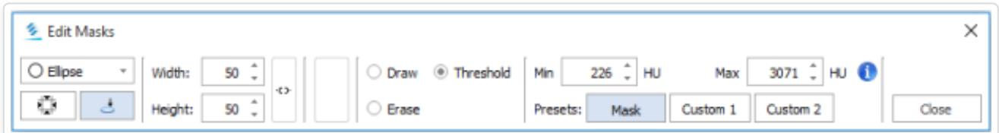

text_image

Edit Masks
Ellipse Width: 50 <>
Height: 50
Draw Threshold Min 226 HU Max 3071 HU
Erase Presets: Mask Custom 1 Custom 2 Close

The three modes available are listed below. To make a mode active, just click in the little circle on the left of the mode or press the first letter of the desired mode. When the edit mode is not yet selected and you use the shortcuts between parentheses below, the edit toolbar appears and the associated mode is activated.

Draw (Ctrl + D): Every pixel that lies within the shape of your cursor, while pressing the left mouse button, will get the color of your active mask. In other words, you add pixels to the active mask by going over the pixels with the square.   
Erase (Ctrl + E): This mode is the opposite of the draw mode. You remove all the pixels from the active mask by moving the square (keeping the left mouse button pressed) over the pixels in the image.   
Threshold (Ctrl + T): This mode is used to set a local threshold. This means that if you apply a local threshold in a particular area of one image, this threshold doesn't apply to other images in the project. Remark that the threshold we've set in the beginning of this case was global and it applied to every image in the dataset.

When you activate this mode, a box with the two default threshold values is displayed on your screen. To set a local threshold, press one of the two arrow buttons and double click on a threshold value. After you have changed the value, press Enter. When moving the square over the image while pressing the left mouse button, every pixel that comes to lie within the square and has a threshold within the threshold range you set, will be added to the active mask. On the other hand, all the pixels that were already part of the active mask and that don't have a gray value within the range will be removed from that mask.

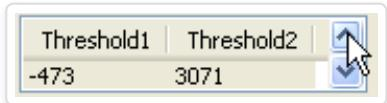

text_image

Threshold1 Threshold2
-473 3071

For the current case we are only going to use the draw and the erase mode. In the Simon case we already illustrated the threshold mode.

Working on the axial image in position 387 activate the Erase mode (Ctrl + E) and set a very large square (for example, 200 by 200). Press your left mouse button and wipe off all the color in the image. Be sure not to forget any pixels! Close the Edit toolbar.

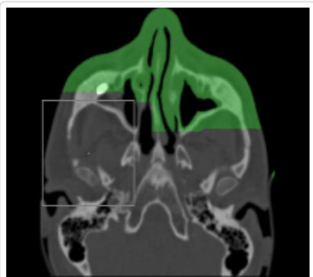

natural_image

Medical CT scan cross-section of a human head showing cranial and sinus structures (no text or labels visible)

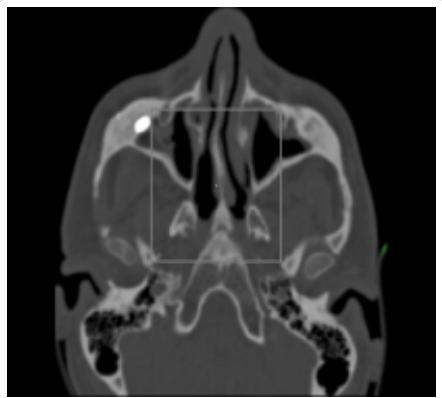

natural_image

Medical CT scan cross-section of a human skull showing cranial structures (no text or labels visible)

Notice in the sagittal image that one layer is shown in gray values. In the figure below, the sagittal image is displayed and the arrow points to the layer that has been removed from the active mask (the slice indicator is moved down to see this).

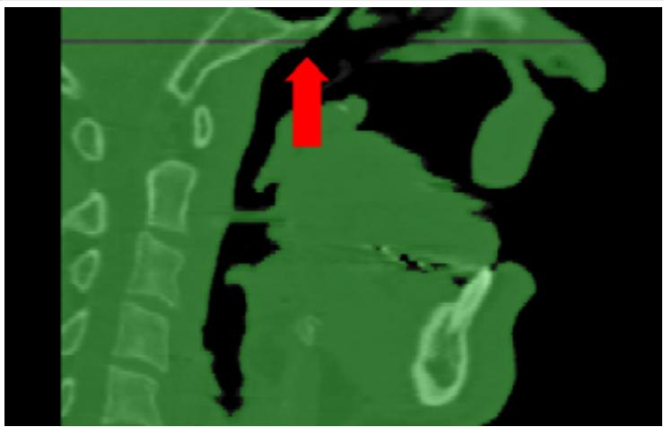

natural_image

Medical CT scan image showing green anatomical structures with a red arrow pointing to a specific region (no text or labels visible)

To see the result of erasing the mask in one layer, we will now perform a region growing

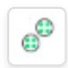

. Select the axial image at a position lower than 387.00 (= the position of the image we removed from the active mask). Press the Region Growing button, a window will be displayed on the screen.

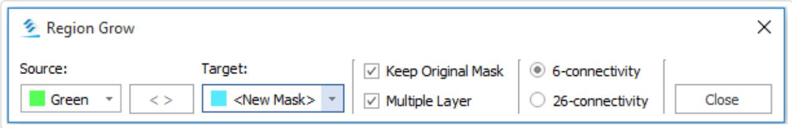

text_image

Region Grow
Source:	Target:	✓ Keep Original Mask	● 6-connectivity
Green	< >	<New Mask>	✓ Multiple Layer	○ 26-connectivity	Close

Check both the Multiple Layer and Leave Original Mask checkboxes and click on an arbitrary position in the active mask. You see that all the images at a position lower than 387.00 are put into a new mask (yellow mask in figure below). Close the region growing toolbar.

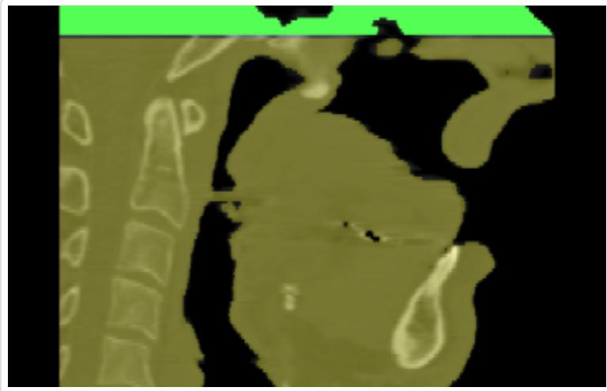

natural_image

Medical CT scan cross-section showing vertebral alignment in bone tissue (no text or labels visible)

Why are the images above this position not included into the new mask? As you already know, a region growing looks for pixels that are connected to each other and puts them into a new mask. But, because we have disconnected the lower images from the higher ones, we have limited the area of the region growing. This will be the trick we will use to get our region of interest into a separate mask.

How will we proceed? In the same way as above, we are going to erase a complete layer from the active mask on every side so that our region of interest is completely surrounded by these removed slices. After we perform a region growing within that region, we should have the oral cavity and the surrounding tissue in one mask, like we wanted.

Activate the axial image. Go to position 362.00 and press Ctrl +E (or press the Edit masks button and select the Erase mode). Make a big square and erase all the pixels from the active mask. Take a look at the sagittal image. Two horizontal lines are shown in gray values. The top and the bottom of our box are now defined.

To set the left and right boundaries of the box, you have to remove two layers from the mask in the sagittal image. Try to visualize the situation and make sure you understand why we will now operate in the sagittal image. Erase all pixels from the active mask at position 126.49 (left boundary) and 42.05 (right boundary) in the sagittal image. In the axial image two vertical lines in gray values are visible.

To close our box, a separation still has to be made on the posterior side. Activate the coronal image and remove all pixels from the active mask at position 76.61. In the axial image the removed layer is visible. Setting a boundary on the anterior side is not necessary. In figure 5-10 you can see the boundaries of the mouth cavity on the yellow mask.

# Region growing

Now that the box is delimited by the layers removed from the active mask, a region growing can be performed to get the obturator into a new mask. Go to an axial image that has a position between 362.00 and 387.00. This is to make sure that the starting pixel for the region growing lies within the region of interest. Press the Region grow button and click in the axial image within the box.

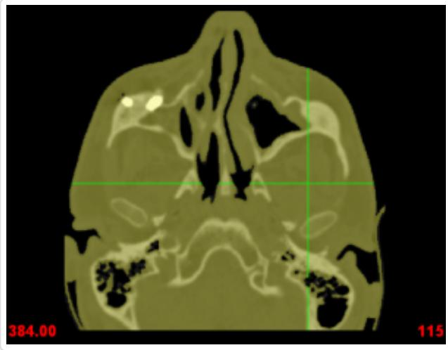

natural_image

Cross-sectional CT scan of the human head showing cranial structures and soft tissue (no text or labels visible)

Boundaries of the mouth cavity in the axial image.

The mouth cavity is now within a new mask. In the figure below you clearly see the mouth cavity within the active (blue) mask from the axial and the sagittal viewpoint.

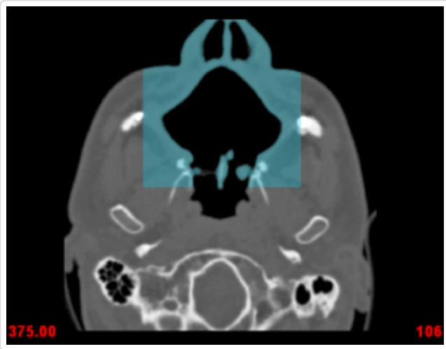

natural_image

Medical CT scan cross-section of the neck region showing anatomical structures (no text or labels visible)

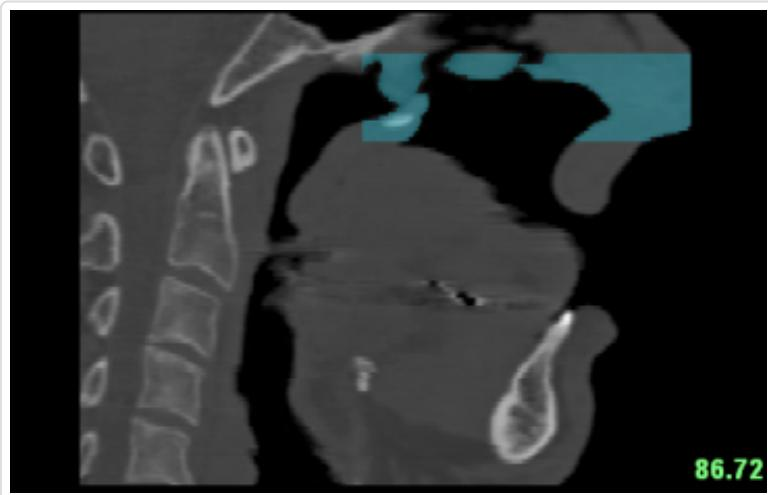

natural_image

Medical CT scan image showing vertebral alignment and bone structure (no text or labels visible)

Axial and sagittal view of the mouth cavity

Because we disconnected the pixels of the mouth cavity from the other pixels in the original mask, the region growing was confined to the region of interest.

Press the Calculate Part button

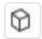

and select the mask of the mouth cavity. Choose custom quality and press the Calculate button. The processing of the 3D model is started.

On the right of the Part you see a toolbar and a button where you can select some predefined viewpoints for your 3D model

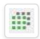

. If you press the bottom view you should obtain a model as shown in the figure below. You can also enable transparency using the

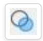

button.

# View of end result

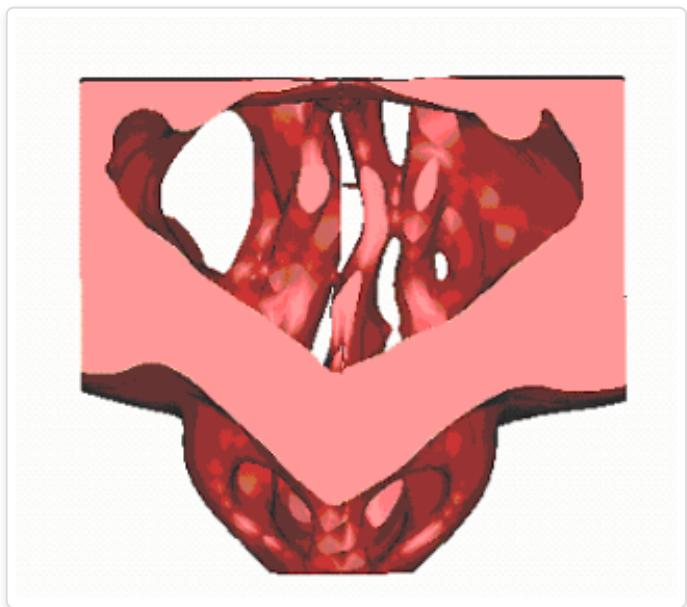

natural_image

3D medical scan showing a cross-section of the human skull (no text or labels visible)

# Import Raw Images

In this case we will show you how you can use the manual import function to import any image data you want. The topics that will be discussed in this tutorial are:

Raw Import   
Edit images

# Import images

Select New Project Wizard from the File menu. In the New Project Wizard select all the images at "MedData\DemoFiles\RAW\_Images" directory and click Next.

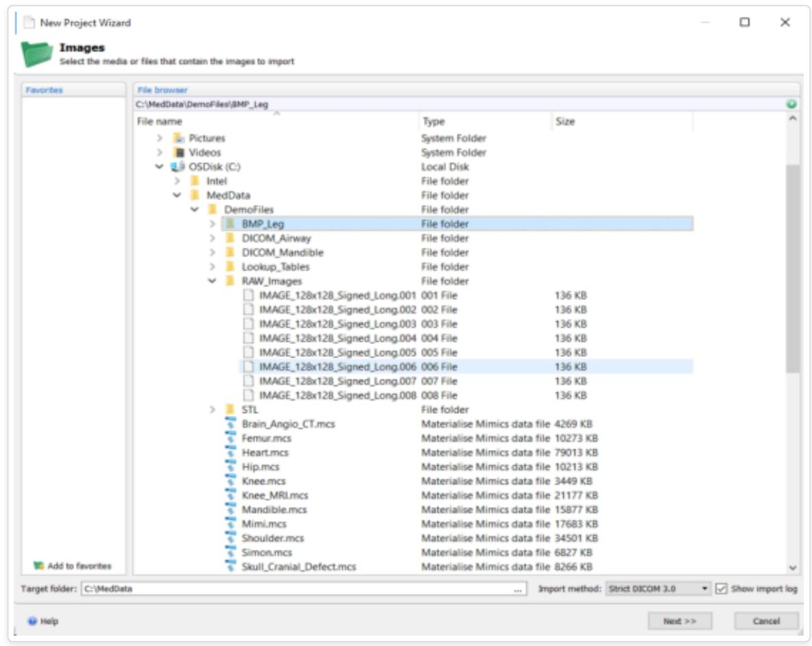

text_image

New Project Wizard
Images
Select the media or files that contain the images to import
Favorites
File browser
C:\MedData\DemoFiles\BMP_Leg
File name	Type	Size
>Pictures	System Folder
>Videos	System Folder
✓ OSDisk (C:)	Local Disk
>Intel	File folder
✓MedData	File folder
✓DemoFiles	File folder
>BMP_Leg	File folder
>DICOM_Airway	File folder
>DICOM_Mandible	File folder
>Lookup_Tables	File folder
✓RAW_Images	File folder
□ IMAGE_128x128_Signed_Long.001	001 File	136 KB
□ IMAGE_128x128_Signed_Long.002	002 File	136 KB
□ IMAGE_128x128_Signed_Long.003	003 File	136 KB
□ IMAGE_128x128_Signed_Long.004	004 File	136 KB
□ IMAGE_128x128_Signed_Long.005	005 File	136 KB
□ IMAGE_128x128_Signed_Long.006	006 File	136 KB
□ IMAGE_128x128_Signed_Long.007	007 File	136 KB
□ IMAGE_128x128_Signed_Long.008	008 File	136 KB
>STL	File folder
Brain_Angio_CT.mcs(Materialise Mimics data file 4269 KB
Femur.mcs.Materialise Mimics data file 10273 KB
Heart.mcs.Materialise Mimics data file 79013 KB
Hip.mcs.Materialise Mimics data file 10213 KB
Knee.mcs.Materialise Mimics data file 3449 KB
Knee_MRLmcs.Materialise Mimics data file 21177 KB
Mandible.mcs.Materialise Mimics data file 15877 KB
Mimi.mcs.Materialise Mimics data file 17683 KB
Shoulder.mcs.Materialise Mimics data file 34501 KB
Simon.mcs.Materialise Mimics data file 6827 KB
Skull_Cranial_Defect.mcs.Materialise Mimics data file 8266 KB
Add to favorites
Target folder: C:\MedData	....Import method: Strict DICOM 3.0	Show import log
Help	Next >>	Cancel

If the images are in Raw format, the New Project Wizard will automatically take you to the following steps. You can also force raw import by selecting the Raw import option from the dropdown list at the bottom right of the dialog. If this option is selected, Mimics will import all images as RAW images. When you press the Next button, you will see that the files are recognized as "unknown files" in the "Import log" window. Click Next to go to the Raw image properties window.

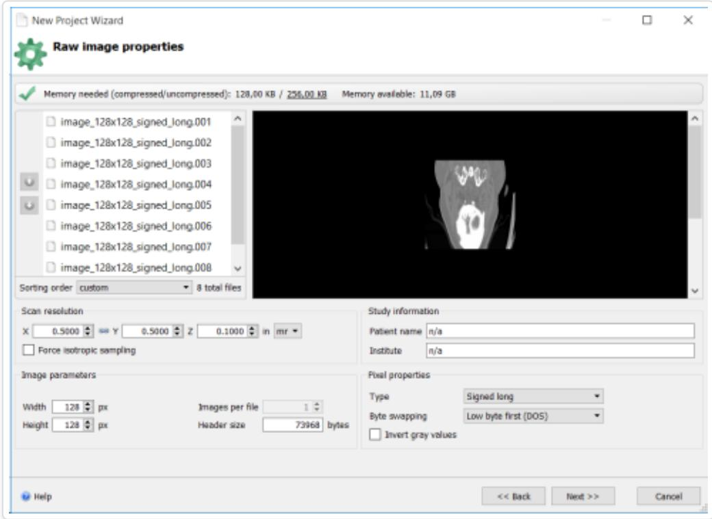

text_image

New Project Wizard
Raw image properties
✓ Memory needed (compressed/uncompressed): 128,00 KB / 256,00 KB     Memory available: 11,09 GB
image_128x128_signed_long.001
image_128x128_signed_long.002
image_128x128_signed_long.003
image_128x128_signed_long.004
image_128x128_signed_long.005
image_128x128_signed_long.006
image_128x128_signed_long.007
image_128x128_signed_long.008
Sorting order   custom    8 total files
Scan resolution
X      0.5000    Y      0.5000    Z      0.1000    in    mr
Force isotropic sampling
Image parameters
Width    128    px        Images per file    1
Height    128    px        Header size    73968 bytes
Study information
Patient name    n/a
Institute    n/a
Pixel properties
Type      Signed long
Byte swapping    Low byte first (DOS)
Invert gray values
<< Back    Next >>    Cancel

In the Raw image properties window you will have to enter the parameters of the scan, namely, the Scan resolution, the Image parameters and the Pixel properties. This information is usually provided along with the scan by the radiologist. For this case, the Scan resolution is 0.5 X 0.5 X 1 mm and the Image parameters are 128 X 128 pixels. The pixel values are in Signed Long format with Low byte order Byte swapping. When you have entered the correct parameters, you can preview the images and Next button will be activated.

Following is some more explanation on the parameters.

# Scan resolution

Here the sizes of the pixels have to be entered. For this example, each pixel are 0.5mm in X-direction, 0.5mm in Y-direction and 1mm in Z-direction. If the image slices are taken axially, then Z-direction would be equivalent to slice distance.

# Image parameters

The file header size is calculated automatically, based on the file size, the resolution of the images and the pixel type.

Typically a file contains both a file header and the image itself (in some rare cases also a footer is present). The file header can contain information about pixel size, patient data, etc. The image is a matrix of pixels. The horizontal (or vertical) image size is equal to the number of pixels in that direction.

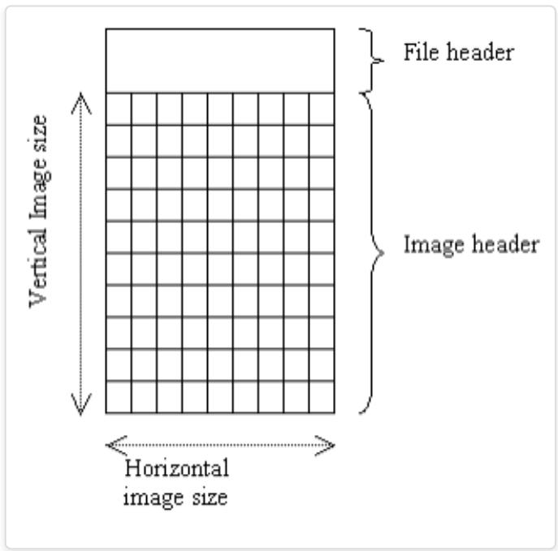

text_image

Vertical Image size
Horizontal image size
File header
Image header

The number of pixels in vertical and horizontal section is the height and the width of the images. Common sizes of images are: 256 \* 256, 512 \* 512 and 1024 \* 1024. In this example, the images have a resolution of 256\*256.

# Pixel properties

The number of bytes per pixel depends on the type of the pixel. Some examples of pixel types and their respective sizes (note that these types can be either signed or unsigned, however, this does not affect their size):

Byte: 1 byte   
Short: 2 bytes   
Long: 4 bytes   
Float: 4 bytes

If you fill these values in, you will see that Mimics will set the file header size to 8432 bytes.

Byte swapping determines the order in which the images are read. You can try different options for byte swapping parameter and preview the images. For this case, when High byte first is chose, there are local distortions all over the image, because the data is read in the wrong order.

For this example, the pixel type is Signed Short and Low Byte First for the parameter Byte Swapping.

# Study information

Here you may fill in an appropriate name for the patient name. This will be the name that is used for your project.

# Edit images

If the images look good in the preview, click the Next button in the Raw image properties window. In the Edit images window, you may crop or resample the images.

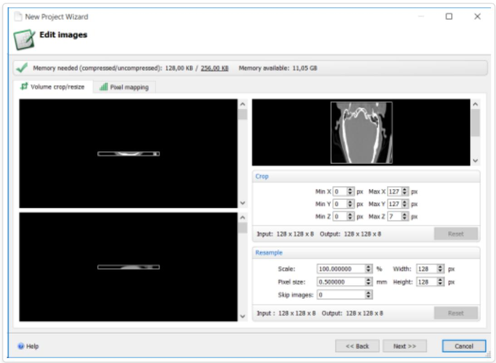

text_image

New Project Wizard
Edit images
✓ Memory needed (compressed/uncompressed): 128,00 KB / 256,00 KB     Memory available: 11,05 GB
Volume crop/resize      Pixel mapping
Crop
Min X 0 px Max X 127 px
Min Y 0 px Max Y 127 px
Min Z 0 px Max Z 7 px
Input: 128 x 128 x 8 Output: 128 x 128 x 8 Reset
Resample
Scale: 100.000000 % Width: 128 px
Pixel size: 0.500000 mm Height: 128 px
Skip images: 0
Input: 128 x 128 x 8 Output: 128 x 128 x 8 Reset
Help    << Back   Next >>   Cancel

Click on the Pixel Mapping tab to view the histogram of the pixels. Here you can also map the pixel gray values to a custom range by moving the sliders from the ends of the histogram. For this case, the imported pixel gray values will be mapped to a 16 bit gray value range, as shown here.

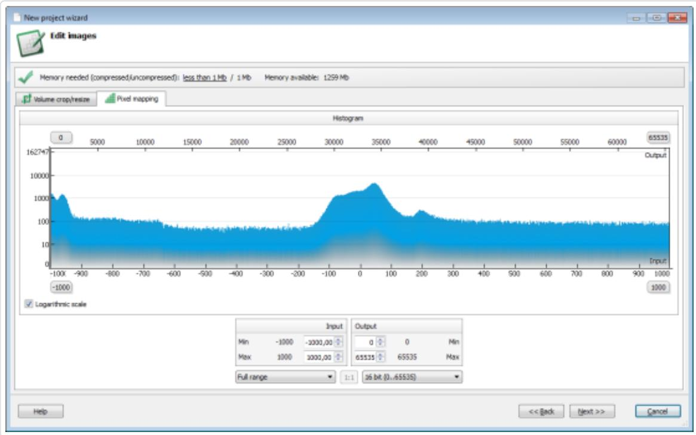

line

| Input | Output |
|-------|--------|
| Min   | 0      |
| Max   | 1000   |
| Full range | 65535 |
| 1:1   | 36 bit (0..65535) |

Click Next and then you will see the familiar Check orientation window, where you can set the orientation into the Mimics project.

# Simulation

In the Simulation Tutorial we will explain some of the functions that are available in the Simulation module. We will start with a dataset of a skull with a hole in it and explain how to do the segmentation, how to calculate the 3D, how to cut, split and reposition a custom implant. The Simulation module has to be licensed to be able to conclude this tutorial.

The topics that will be discussed in this tutorial are:

Opening the Project   
Windowing   
Thresholding   
Region Growing   
Calculating a 3D   
Cutting   
Splitting   
Mirroring

Repositioning

# Opening the project

In the File menu, select Open (Ctrl+O). Browse to the directory where you have installed the extra Tutorial Files and double click the Skull\_with\_hole.mcs file.

# Windowing

For correct windowing see the windowing procedures in "Mimi".

# Thresholding

Go to an axial image where the skull is visible. Press the Profile line button and draw a line over the bone. The figure below shows a profile line and the corresponding profile dialog box. Press Start thresholding and drag the threshold line to a value of about 1250 (Gray value scale). End the thresholding and save your settings. Close the dialog box.

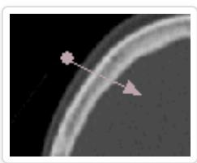

natural_image

Close-up of a curved, textured surface with two small pink arrows pointing to specific regions (no text or symbols)

line

| Distance (mm) | Gray Value |
| ------------- | ---------- |
| 4             | 0          |
| 5             | 1000       |
| 6             | 900        |
| 7             | 800        |
| 8             | 1000       |
| 9             | 1500       |
| 10            | 2800       |
| 11            | 2000       |
| 12            | 2500       |
| 13            | 2600       |
| 14            | 1500       |
| 15            | 1000       |
| 16            | 1000       |
| 17            | 1000       |
| 18            | 1000       |
| 19            | 1000       |
| 20            | 1000       |
| 21            | 1000       |

Profile line over the bone (upper image) and the corresponding profile dialog box

# Region Growing

Now we will use the region growing tool to separate the skull from the artifacts and noise in the images:

Click the Region Growing button or press Ctrl + R.   
Set the Source to Green (if this is your base mask) and Target to New Mask. Check the Multiple layer box.

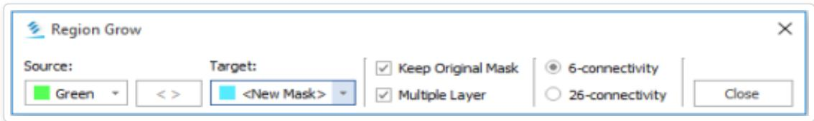

text_image

Region Grow
Source:
Green
Target:
<New Mask>
✓ Keep Original Mask
✓ Multiple Layer
○ 6-connectivity
○ 26-connectivity
Close

Click the left mouse button on one point of the skull. The skull has now been grown into a new mask.

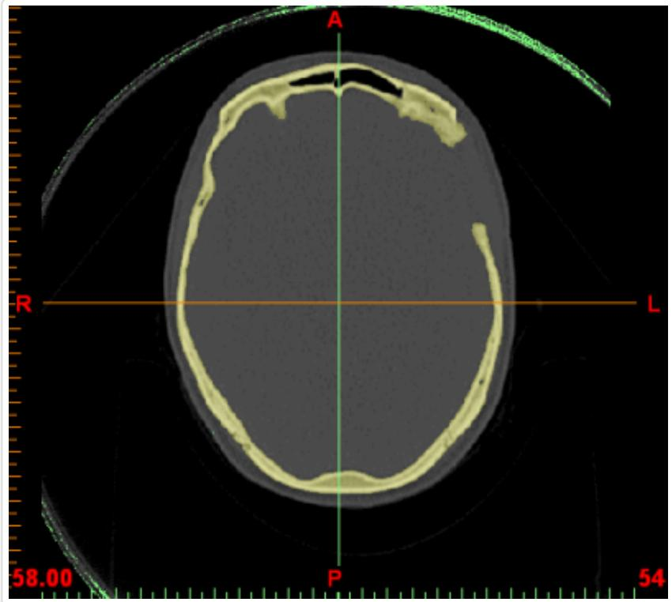

natural_image

Cross-sectional CT scan of a human brain showing anatomical structures (no text or labels visible)

# Calculating a 3D

Go to the Project Management by clicking its icon

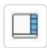

and choose the Masks tab.

You'll see all created masks listed with their respective threshold. Selecting one mask will make it active and it will appear in the Active Mask field in the visualization toolbar automatically. It is possible to hide/show a mask by clicking on the glasses.

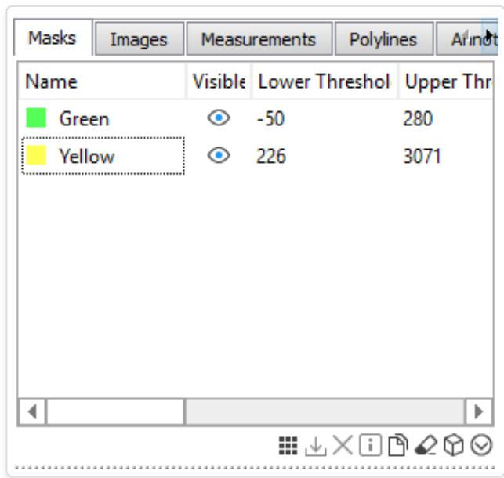

text_image

Masks Images Measurements Polylines A/ind
Name Visible Lower Threshol Upper Thr
Green -50 280
Yellow 226 3071

Click on the Calculate Part button.

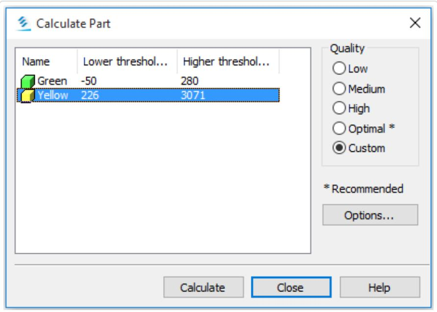

text_image

Calculate Part
Name	Lower threshold...	Higher threshold...
Green	-50	280
Yellow	226	3071
Quality
○ Low
○ Medium
○ High
○ Optimal *
● Custom
* Recommended
Options...
Calculate	Close	Help

The Calculate 3D Dialog box is displayed. Here you can mark (with a green dot in the column called "Selected") which masks you want to visualize and calculate the 3D by clicking on the Calculate button.

Select the "Skull" mask if it is not already selected and click on the Calculate button.

# Cutting

After the calculation of the 3D you will see a 3D representation of the Skull mask. To be able to make a cut that fits well, make the skull transparent by clicking on the

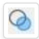

button and choose to view the skull from the Right view. Now you can pan and zoom so you can see the hole clearly.

Skull transparent   
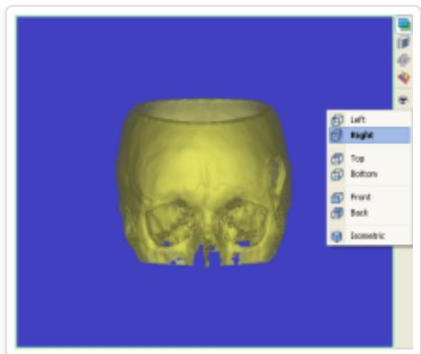

natural_image

3D rendered human skull model with a context menu in the corner (no text or symbols on the model itself)

Skull zoomed   
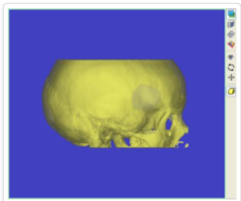

natural_image

3D rendered human skull model in yellow against a blue background (no text or symbols)

If you then zoom and pan, you can clearly view the hole in the skull through the intact side.

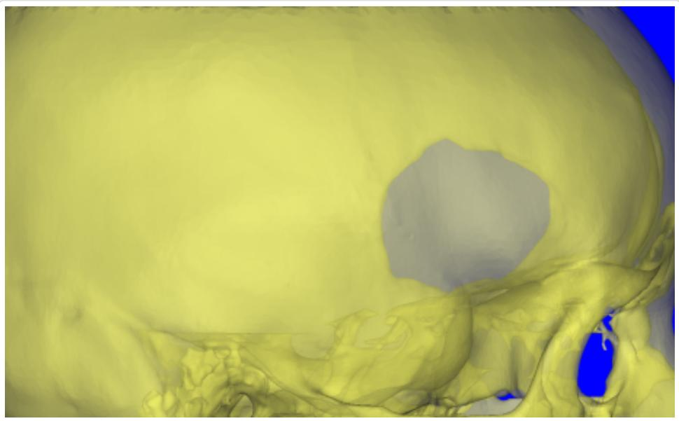

natural_image

3D rendered medical scan of a human skull with visible bone and soft tissue (no text or labels)

This way we can easily draw around this hole. To do this use Cut with Polyplane option, go to 3D Tools > Cut > With Polyplane in the menu. You will see following dialog:

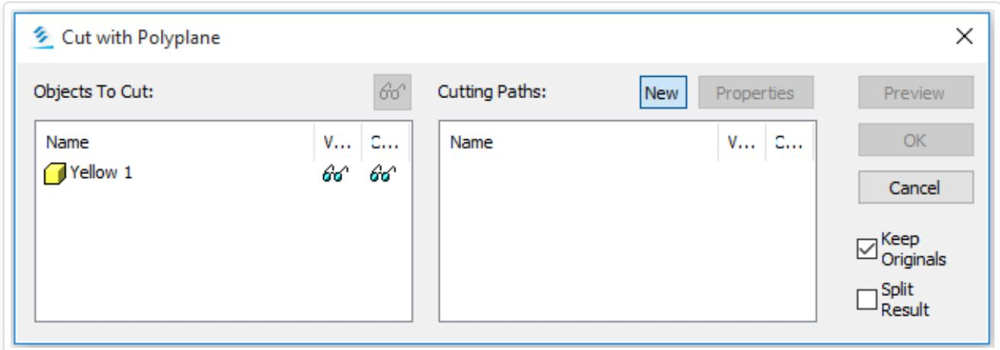

text_image

Cut with Polyplane
Objects To Cut:
Name	V...	C...
Yellow 1		Cutting Paths:	New	Properties	Preview
Name	V...	C...
		OK
	Cancel
✓ Keep
Originals
□ Split
Result

Select the 3D from the skull in the Objects to Cut list. The New button is already enabled so we can immediately start drawing a cutting path. Do this by clicking several times with your left mouse button around the hole like below. To end the drawing, double click with your left mouse button.

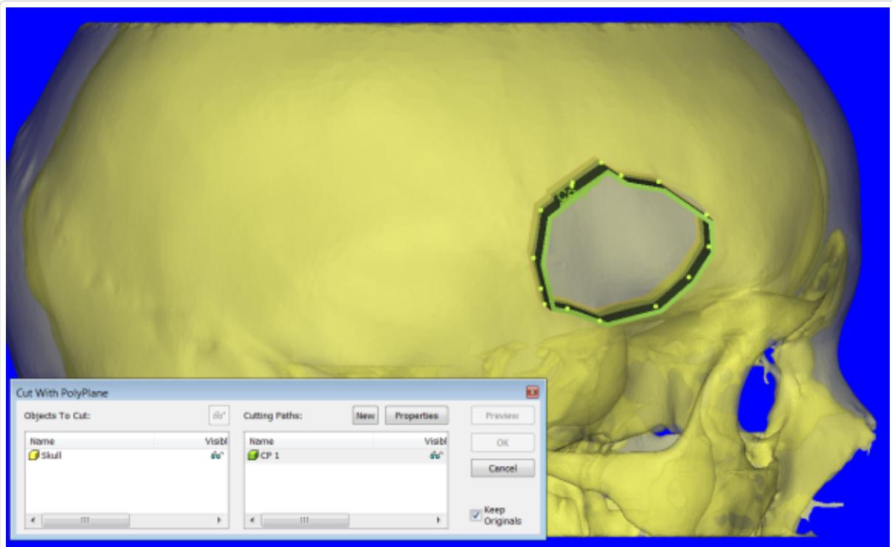

text_image

Cut With PolyPlane
Objects To Cut:
Name	Visible
Skull	Visible
Cutting Paths: New Properties Preview
Name	Visible
CP 1	Visible
OK	Cancel
Keep
Originals

You can see that a cutting path has been added to the cutting path list. You can now make the 3D opaque again by clicking on the

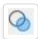

button. You can then rotate the 3D to determine if the cut went through the whole skull or not:

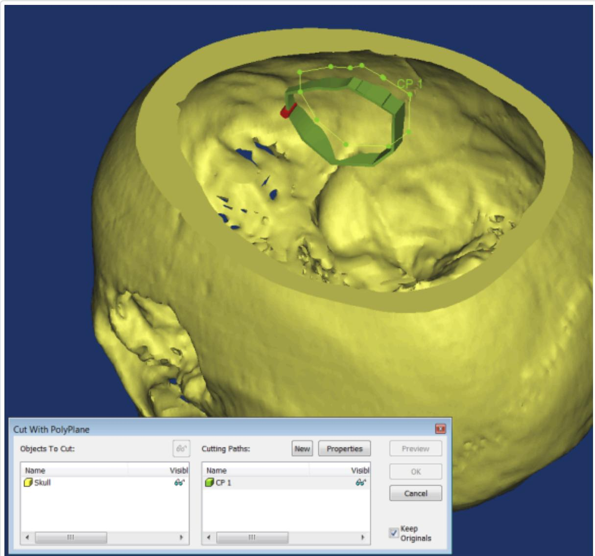

text_image

CP.1
Cut With PolyPlane
Objects To Cut:
Name	Visible
Skull
Cutting Paths:	New	Properties	Preview
Name	Visible
CP 1
OK
Cancel
Keep
Originals

As you can see, it would be best if we adjust the depth of the cutting path. You can do this by clicking on the Properties button while the cutting path is selected. This will open the cutting path properties dialog:

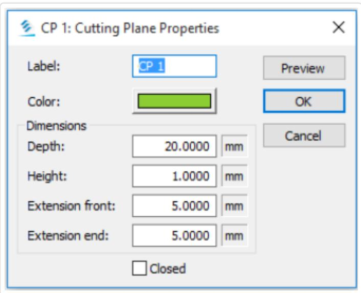

text_image

CP 1: Cutting Plane Properties
Label: CP 1
Color:
Dimensions
Depth: 20.0000 mm
Height: 1.0000 mm
Extension front: 5.0000 mm
Extension end: 5.0000 mm
Closed
Preview
OK
Cancel

Adjust the Depth of the cutting path from 20.0mm to 30.0mm and enable the Closed checkbox (this will close the cutting path). Click on Preview to view the result. When you are happy with the result, close the Cutting Path Properties by clicking on the OK button. Enable the Keep Originals checkbox (since we want to keep the original 3D) and finish the cut by clicking on the OK button of the Cut with Polyplane tool.

You can see in the 3D objects list that a new 3D object was added.

# Splitting

The next step is to split the two cut parts of the newly generated 3D. To do this, go to 3D Tools > Split in the menu.

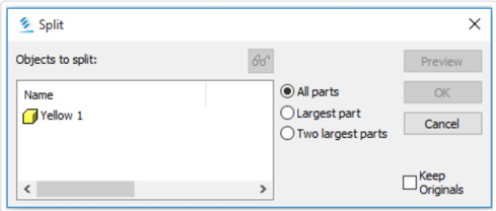

text_image

Split
Objects to split:
Name
Yellow 1
<
>
Preview
All parts
Largest part
Two largest parts
OK
Cancel
Keep
Originals

Select the freeform object, choose to keep all parts and disable the Keep Originals checkbox. You can then click on Preview to preview the split and then on OK to apply the split.

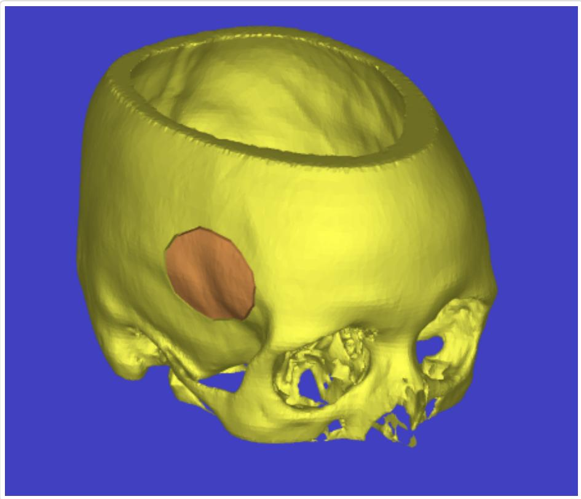

natural_image

3D rendered human skull model with a highlighted orange area, set against a solid blue background (no text or symbols)

As you can see, two different objects were created and have been given a different color.

You can make the largest part invisible since we will only need the small part to fix the defect in the skull.

# Mirroring

To mirror the part to the other side of the 3D, we will need a mirror plane. The Mimics simulation module generates a default sagittal plane, but we will have to adjust this plane a bit to make sure it's suitable for this dataset.

To do this, go to the Simulation Layout (by pressing F5 or by going to the View menu, choose Layouts and then Simulation Layout). Then make the original skull visible and go to Simulate > Measure and Analyse in the menu.

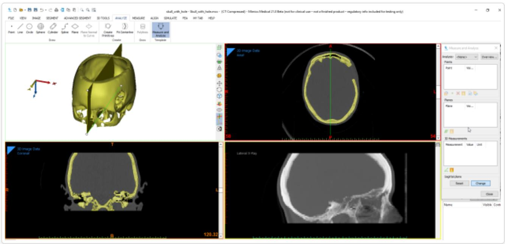

text_image

skull_with_hole - Skull_with_hole.mus - (CT Compressed) - 10mm x 10.0x Medical Z1.0 Beta (post for clinical user - not a finished product - regulatory info included for dealing only)
PAGE VIEW IMAGE SEGMENT ADVANCED SEGMENT 3D TOOLS ANALYZ MEASURE ALIGN SIMULATE PEN HIT TAB HELP
Paint Line Circle Sphere Cylinder Spine Plane Plane Internal to Curve Create Image Dimensions Polyframes Measure and Analyte Template
X
A
B
3D Image Data Axial
58
54
3D Image Data Coronal
T
Lateral X-Ray
129.32
Measures and Analysis
Analyzer <clone> Overwrite...
Plants
Point Vol...
Names
Plane Vol...
3D Measurements
Measurement Value Unit
Segment parameters
Reset Change
Close
Name Visible Costs

You can see in the right dialog that you can change the Sagittal Plane. Click on the Change button and adjust the Sagittal plane (by dragging the white points with your left mouse button) in the axial images to make sure the sagittal plane goes through the center of the nose.

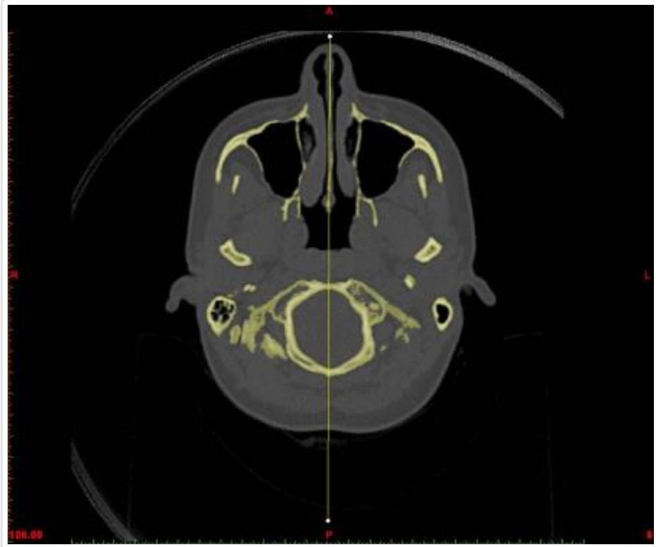

natural_image

Cross-sectional CT scan of the human head showing cranial and orbital structures (no text or labels visible)

After this, close the Measure and Analyse tool by going to the Simulation Menu and choosing Measure and Analyse again. Then mirror the part by going to the Simulation Menu, from the 3D Tools select Mirror. Select the correct part and mirror plane and disable the Keep Originals checkbox and click on the OK button to apply the mirroring.

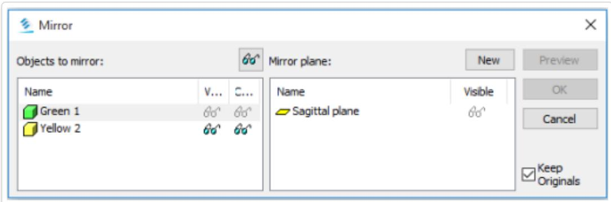

text_image

Mirror
Objects to mirror:
Name	V...	C...
Green 1		00^	00^
Yellow 2		00^	00^
Mirror plane:
Name	Visible
Sagittal plane	00^
Preview
OK
Cancel
Keep
Originals

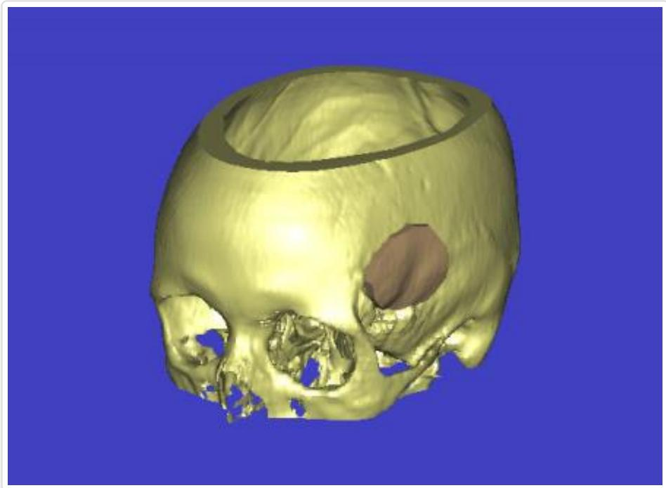

natural_image

3D rendered human skull model with highlighted internal organ, set against a solid blue background (no text or symbols)

As you can see, the part is mirrored, but not correctly positioned. We will reposition this part in the next section of the help.

# Repositioning

To reposition the part, go to Align > Reposition in the menu. This will open following dialog:

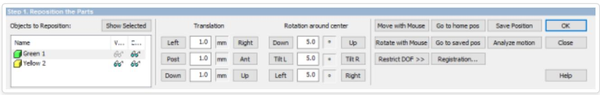

text_image

Step 1. Reposition the Parts
Objects to Reposition: Show Selected
Name V... C...
Green 1 Yellow 2
Translation Rotation around center
Left 1.0 mm Right Down 5.0 ° Up
Post 1.0 mm Ant Tilt L 5.0 ° Tilt R
Down 1.0 mm Up Left 5.0 ° Right
Move with Mouse Go to home pos Save Position OK
Rotate with Mouse Go to saved pos Analyze motion Close
Restrict DOF >> Registration...
Help

Select the Mirrored part and start the repositioning. The easiest way to do this, is to first reposition the part with the mouse and then do some fine-tuning with the parametric translation and rotation tools.

Click on the Move with Mouse button and reposition the part. You can translate the part by dragging the center point with your left mouse button and rotate the part by dragging the corners of the selection box with your left mouse button. Keep in mind that you can also reposition in the 2D views, this makes it easier to get a good fit. During repositioning it is also possible to scroll through the axial images to make sure the fit is optimal on all slices.

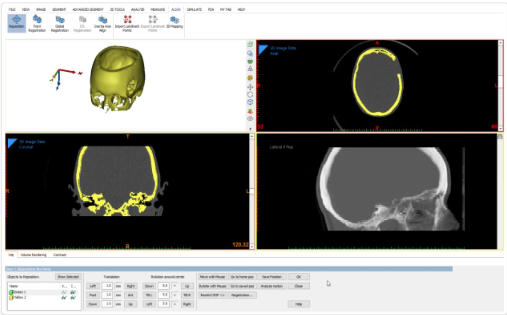

text_image

FILE VIEW IMAGE SESSMENT ADVANCED SESSMENT 3D TOOLS ANALYZE MEASURE ALG
Reposition Font Registration Global Registration STL Registration Inertia Axis Align Import Landmark Export Landmark Paints 3D Mapping
3D Image Data
Axial
A
L
62 R
60
3D Image Data
Coronal
T
L
120.32
Lng Volume Rendering Contract
Step 5. Reconciliation the Parts
Objects is Repositionn Shrs Selected
Name V... L...
Green 1 da' da'
Yellow 2 da' da'
Transfetien Rotation around center
Left 3.0 mm Right Down 8.8 + Up
Post 3.0 mm And 10.0 8.8 + 10.0
Down 3.0 mm Up Left 5.8 + Right
Move with Mouse Go to home pass Save Position OK
Rotate with Mouse Go to saved pass Analyze motion Close
Residual DCP >> Registration ...
Help

When you are happy with the fit, you can click on the Analyze Motion button to see the final translation and rotation of the part.

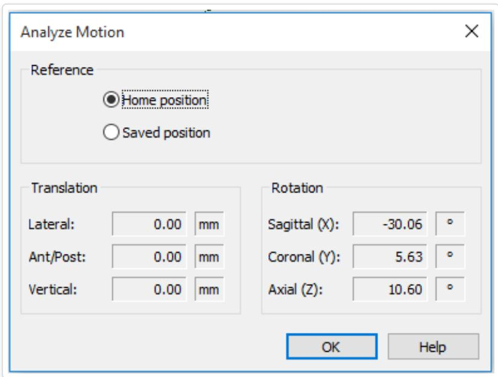

text_image

Analyze Motion
Reference
Home position
Saved position
Translation
Lateral: 0.00 mm
Ant/Post: 0.00 mm
Vertical: 0.00 mm
Rotation
Sagittal (X): -30.06 °
Coronal (Y): 5.63 °
Axial (Z): 10.60 °
OK Help

To apply the reposition, click on the OK button. You can then export the part and the skull to STL files and continue working on the custom implant in your design software.

# FEA

In the FEA Tutorial we will explain the work-flow for making a FEA analysis on a model of the Femur. We will start with a dataset of a Femur and explain how to do the segmentation, how to calculate the Part, how to remesh the Part and how to assign materials to the Part. The FEA and STL+ module have to be licensed to be able to conclude this tutorial.

The topics that will be discussed in this tutorial are:

Opening the Project   
Calculating a Part   
Remeshing the Part   
Creating the volume mesh based on the remeshed Part   
Material Assignment   
Exporting the Volumetric Mesh

# Opening the project

In the File menu, select Open (Ctrl+O). Browse to the directory where you have installed the extra Tutorial Files and double click the Femur.mcs file.

# Calculating a Part

There is already a Yellow2 mask available in this dataset that will be used to calculate a Part. In the Calculate Part dialog select the High quality setting and click on calculate.

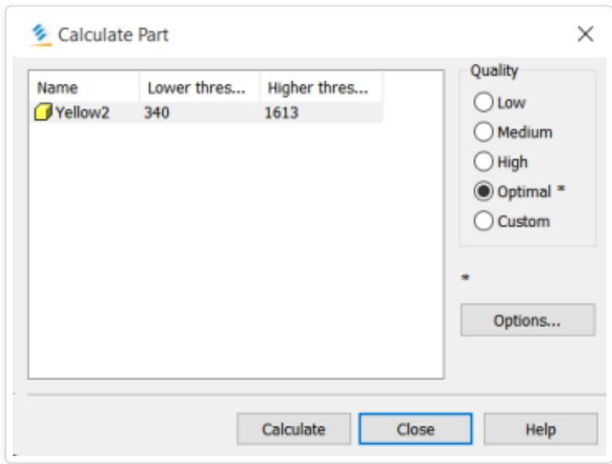

text_image

Calculate Part
Name	Lower thres...	Higher thres...
Yellow2	340	1613
Quality
○ Low
○ Medium
○ High
● Optimal *
○ Custom
*
Options...
Calculate	Close	Help

# Remeshing the Part

In this step the Part needs to be remeshed to be optimal for FEA purposes. You will notice that there are two Parts, select the Yellow 2 part. The FemurShaft model will be used in the non-manifold assembly tutorial. To export the Part to 3-matic, go to the FEA -> Remesh in the menu. This will bring up the following dialog:

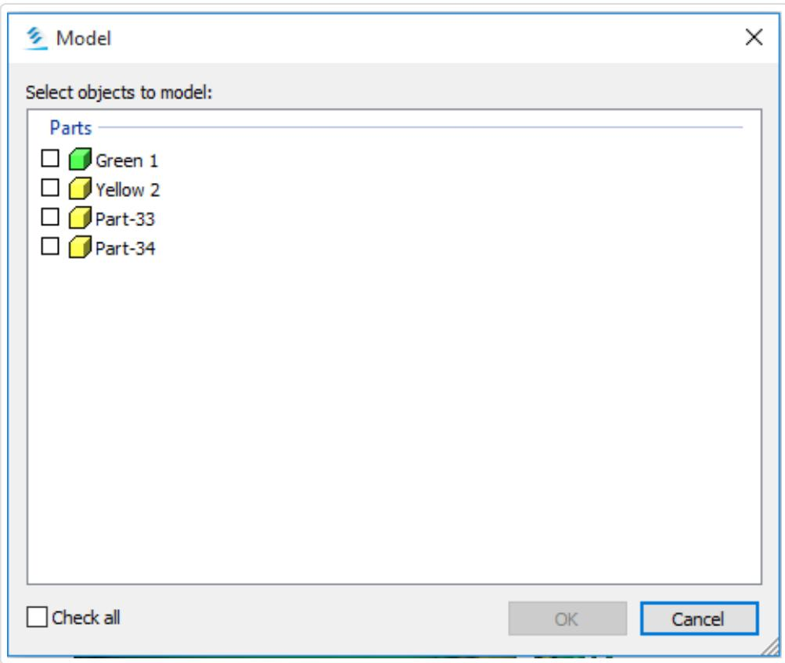

text_image

Model
Select objects to model:
Parts
Green 1
Yellow 2
Part-33
Part-34
Check all
OK	Cancel

Select the Yellow 2 Part and click on OK.

To get the optimal result it is common to follow the next steps in 3-matic:

Define shape parameters

Inspect the quality of the surface mesh   
Reduce the details of the anatomical part   
Remesh the surface elements   
Generate the volume mesh   
Visualize volume elements   
Analyze Mesh quality

For details on how to get the optimal mesh for your Part see the Chapter 5: Remesh of the Tutorials in 3-matic. You can find it under Help -> Tutorial... in 3-matic.

When you are satisfied with the quality of the mesh copy your object by selecting your object and pressing Ctrl+C on your keyboard. Open your Mimics window and paste your object there by pressing Ctrl+V. The volume mesh will be available in the FEA mesh tab in the project management section. These meshes can then be exported to your FEA software.

# Material Assignment

When you have created a volumetric mesh from your remeshed object, you can perform the material assignment in Mimics. You can see the mesh listed in the FEA mesh tab.

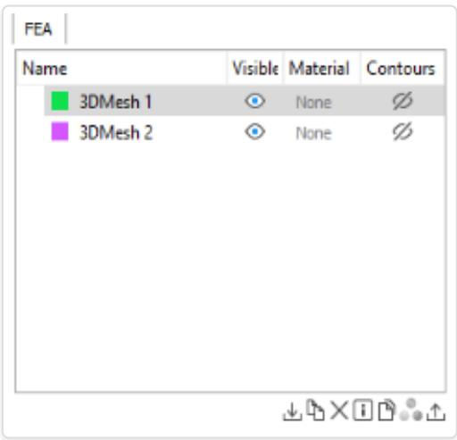

text_image

FEA
Name	Visible	Material	Contours
3DMesh 1	None	Ø
3DMesh 2	None	Ø

Note: We will use gray values for this tutorial, so if you are working in Hounsfield units, please change this by going to the Edit menu, choose Preferences and change the Pixel Unit in the General tab.

With the FEA mesh of the Femur selected, click on the Materials button. Mimics will display a message that the gray values for this mesh have to be calculated before you can do a material assignment. Choose "Yes" to continue. After the calculation you will see following dialog box:

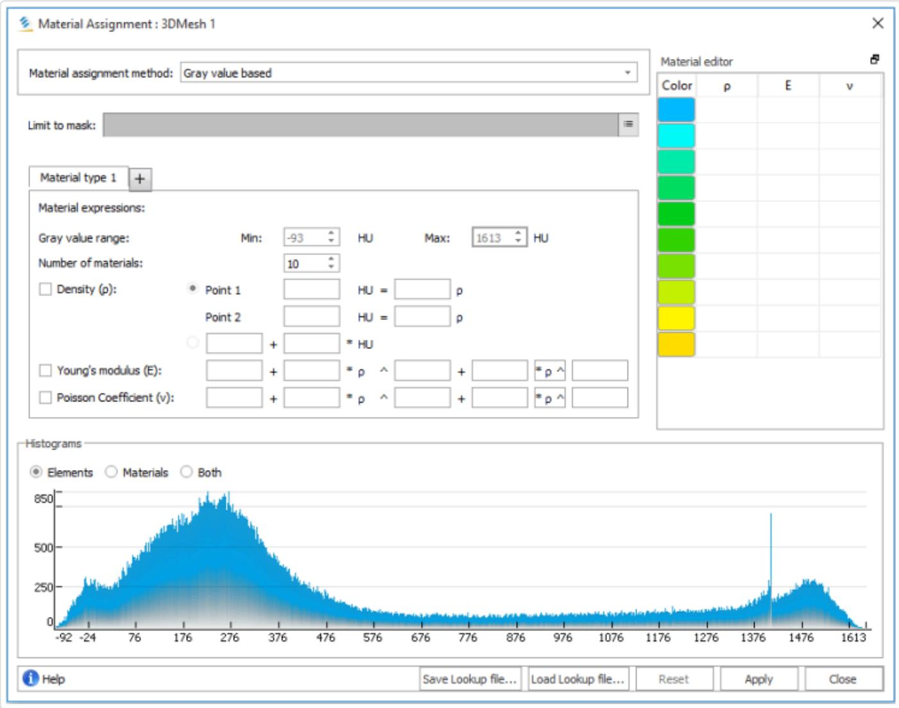

histogram

| Point | Value |
|-------|-------|
| Point 1 | -93 |
| Point 2 | 10 |
| +     | * HU |
| +     | * ρ   |
| +     | * ρ   |
| +     | * ρ   |

Mimics shows for each gray value the amount of elements that were assigned that particular value. We will then convert this gray value to material properties. In this tutorial we will use the uniform method.

STEP A: If the Gray value based method is not selected, click on the radio button next to Uniform.

STEP B: Enter the number of materials in the edit box. We will use 10 materials for this tutorial. The FEA module will now divide the range of gray values that occur in the volume mesh into 10 equally sized intervals that each represents a material. You can see this discretization by choosing the Materials histogram. Select Limit to Mask: Green 2. The limit assignment to mask intercepts the deviation in the boundary elements due to the partial volume effect. As boundary voxels typically represent multiple tissues by excluding these voxels, the material assignment will become more accurate.

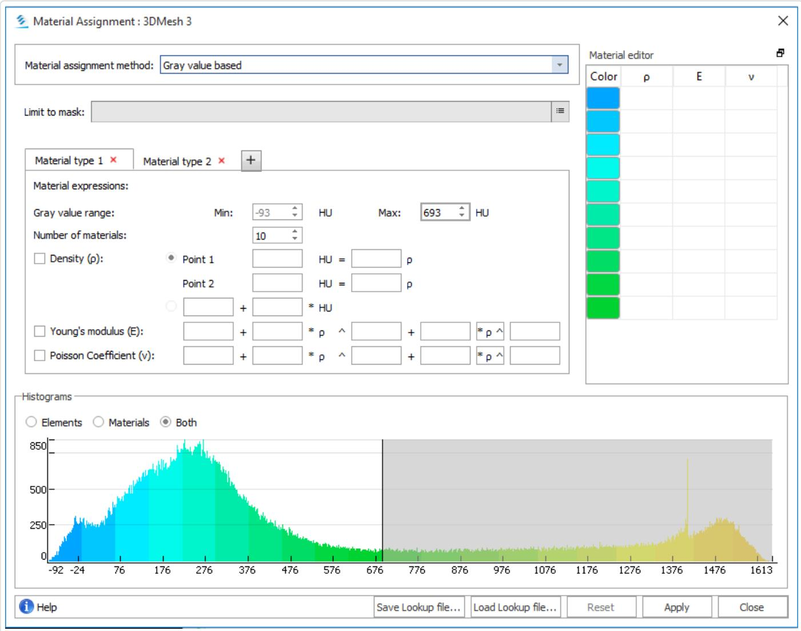

STEP C: Enter a density expression to convert the gray value of each material to a density. For this tutorial we will use following expression: Density = -13.4 + 1017 \* Gray value.

STEP D: Choose to write out only the Young's modulus material properties in the exported file by deselecting the selection boxes before Density and Poisson Coefficient. We will use following expression for the Young's modulus: E-Modulus = -388.8 + 5925 \* Density.

STEP E: Check the values for the materials that will be assigned in the material editor:

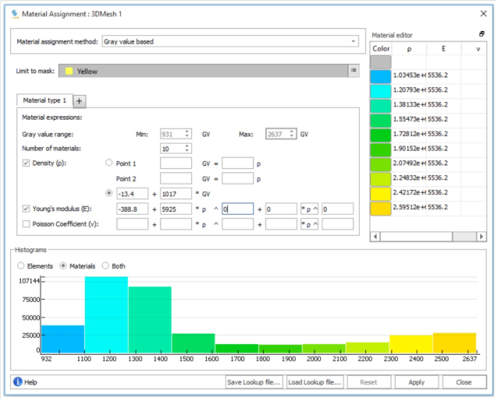

bar

| Material Type | Element Count | Material Count |
| :--- | :--- | :--- |
| Gray value range | 931 | 2637 |
| Density (ρ) | -13.4 | 1017 |
| Point 1 |  | p |
| Point 2 |  | p |
| Young's modulus (E) | -388.8 | 5925 |
| Poisson Coefficient (v) |  | p^0 |
| Black Bar Height | 107144 | 107144 |
| White Bar Height | 75000 | 75000 |
| Green Bar Height | 25000 | 25000 |
| Light Green Bar Height | 15000 | 15000 |
| Yellow Bar Height | 5000 | 5000 |
| Grey Bar Height | 3000 | 3000 |
| Black Bar Width | 1000 | 1000 |
| White Bar Width | 500 | 500 |
| Green Bar Width | 250 | 250 |
| Light Green Bar Width | 150 | 150 |
| Yellow Bar Width | 100 | 100 |
| Grey Bar Width: Black Bar Height = 107144
Black Bar Width: Black Bar Height = 107144
Gray Bar Width: Gray Value based
Limit to mask: Yellow
Material Editor
Color ρ E v
1.03453e+5536.2
1.20793e+5536.2
1.38133e+5536.2
1.55473e+5536.2
1.72812e+5536.2
1.90152e+5536.2
2.07492e+5536.2
2.24832e+5536.2
2.42172e+5536.2
2.59512e+5536.2

STEP F: Press the Apply button to assign the materials to the FEA mesh. The elements of the FEA mesh will be colored according to their materials:

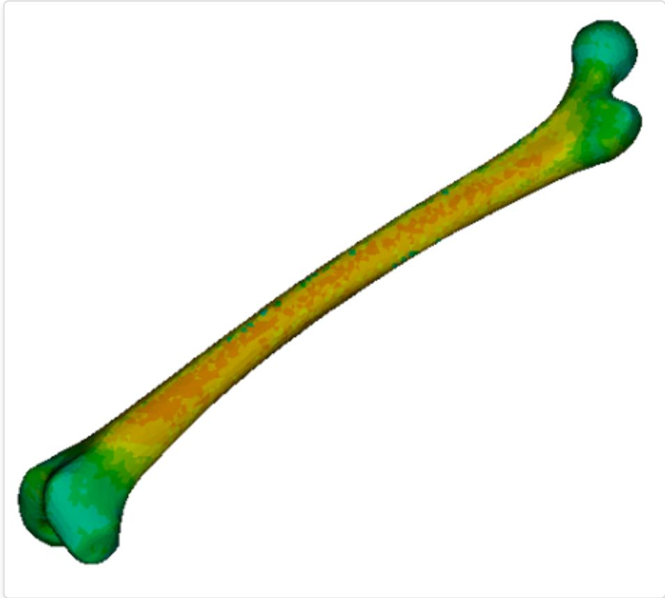

natural_image

3D rendered image of a long bone with color-coded stress or density visualization (no text or symbols)

This volumetric mesh can then be exported together with the material assignment (in this case only the E-Modulus).

Note: It is also possible to use different expressions for different ranges or different masks material assignment. For more detail on this check the section on Material Assignment using Lookup Files.

# Exporting the Volumetric Mesh

The volumetric mesh, together with the material assignment can be exported to ANSYS, Patran Neutral, and Abaqus files and can then be used to do FEA analysis on the mesh. To export the mesh go to the File menu and choose Export. Then go to the FEA tab, add the correct mesh to the export list, choose the required format and export directory and click on the OK button.

text_image

Export
Export:
Part | Imported Part | Mesh | Materials |
Name
3DMesh 1
Output Directory:
D:\MedData_med\DemoFiles
Output Format:
Neutral Files (.out)
Part/STL/Mesh
Output Filename
Export
Add
Remove
Edit
OK
Cancel
Help

# CFD

For a CFD Tutorial see the Chapter 5: Remesh of the Tutorials in 3-matic. You can find it under Help - > Tutorial... in 3-matic.

In the CFD Tutorial a typical remesh workflow it is described:

Importing the images   
Segmentation   
Calculation of a Part   
Remeshing the Part

Optimisation of the mesh

Materials assignment

# Non-Manifold Assembly

The non-manifold assembly Tutorial explains step by step how to obtain matching surfaces between the bone and an implant. First we will register the femoral head prosthesis on the Femur. Secondly we will use the cutting tools of the simulation module to perform an ostectomy of the femoral head. In 3- matic we will combine both the femur shaft and the implant to ensure perfectly coinciding nodes between them. The Simulation and FEA module have to be licensed to be able to conclude this tutorial. In case you do not have the simulation module you can skip the Ostectomy of the femoral head and still perform the remeshing part of the tutorial.

The topics that will be discussed in this tutorial are:

Opening the Project   
Calculating a Part   
Registration of the implant   
Ostectomy of the femoral head   
Remeshing the femur and implant   
Creating a volume mesh   
Exporting the remeshed Parts

# Opening the project

In the File menu, select Open (Ctrl+O). Browse to the directory where you have installed the extra Tutorial Files and double click the Femur.mcs file.

# Calculating a Part

There is already a yellow mask available in this dataset that will be used to calculate a Part. Select the Yellow mask and click on the Calculate Part icon in the Masks toolbar. In the Calculate Part dialog select the High quality setting and click on Calculate.

# Import the STL

Select STL by going to File > Import > STL in the menu. From the STL folder load the Implant.stl.

# Point registration

The Point registration will be used to bring the implant nearer to the Femur. Indicate a start points on the STL and their corresponding end point on a 3D model or in the 2D views. Mimics will then calculate the transformation matrix that should be applied to have the best fit between the start and end points and applies the transformation matrix on the selected STLs.

Go to Align > Point Registration in the menu. Click on Add point, add a start point on the top of the implant head and put the corresponding end point on the femur head. Place a second set of points on the end of the implant neck and in the middle of the Greater Trochanter top. Position the last set of points on the end of the prosthesis and place the corresponding end point in the middle of the femur shaft in the sagittal view.

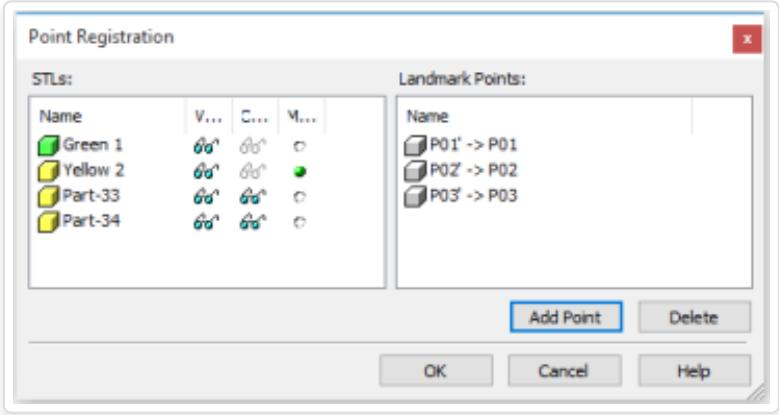

text_image

Point Registration
STLs:
Name	V...	C...	V...
Green 1		○	○
Yellow 2		○	○	●
Part-33		○	○	○
Part-34		○	○	○
Landmark Points:
Name
P01' -> P01
P02' -> P02
P03' -> P03
Add Point	Delete
OK	Cancel	Help

# Points 1

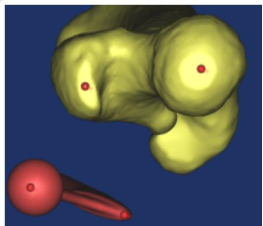

natural_image

3D rendered molecular surface with red and yellow highlights against blue background (no text or symbols)

# Points 2

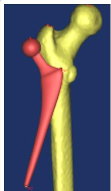

natural_image

3D rendered model of a human femur joint with red and yellow color-coded regions against a blue background (no text or symbols)

# Points 3

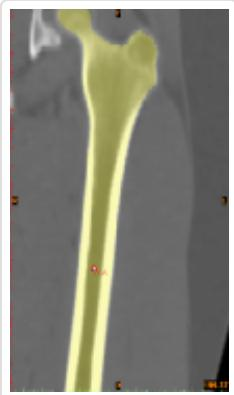

natural_image

X-ray image of a human femur with visible bone structure (no text or labels)

# Reposition the implant

The position of the implant can be fine tuned using the reposition tools. In the STL tab right click on the implant and select the move tool

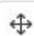

. In the move dialog select Move along inertia axis from the dropdown box. By grabbing one of the arrows you can move the implant in the direction of the selected arrow.

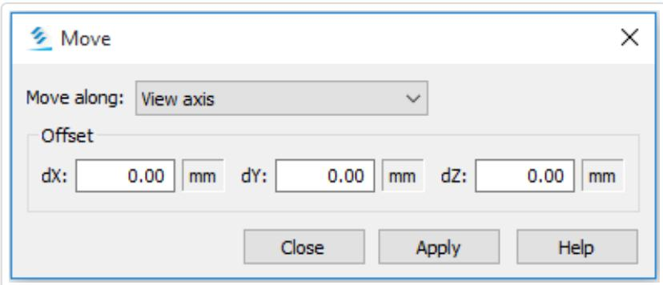

text_image

Move
Move along: View axis
Offset
dX: 0.00 mm dY: 0.00 mm dZ: 0.00 mm
Close Apply Help

# Move step1

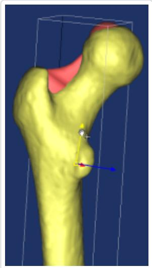

natural_image

3D rendered model of a human hip joint with colored measurement markers (no text or symbols)

# Move step2

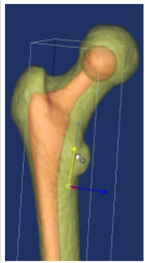

natural_image

3D rendered human femur model with colored measurement axes (no text or labels)

# Move step3

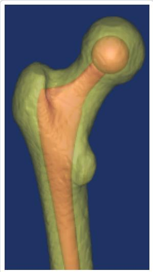

natural_image

3D rendered model of a human femur with green and orange color mapping, no text or symbols present

The position of the implant can be verified in both, 2D and 3D views. To visualize the implant in 2D enable the contours by selecting the eye in the contour column of the Objects tab.

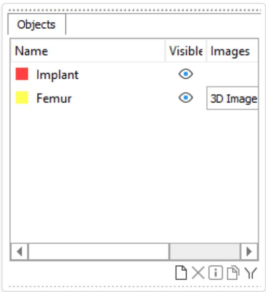

text_image

Objects
Name	Visible	Images
Implant
Femur	3D Image

To make the implant visible in the 3D view enable the transparency from the 3D toolbar

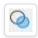

# Ostectomy of the femoral head

To remove the femoral head we will use the polyplane cut from the 3D Tools menu. Go to 3D Tools > Cut > With Polyplane

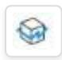

in the menu. In the simulation dialog select the 3D model of the bone, Yellow. To perform the cut click once on the top of the femoral neck, turn the 3D and double click on the bottom. This will create a cutting plane as shown in the images below:

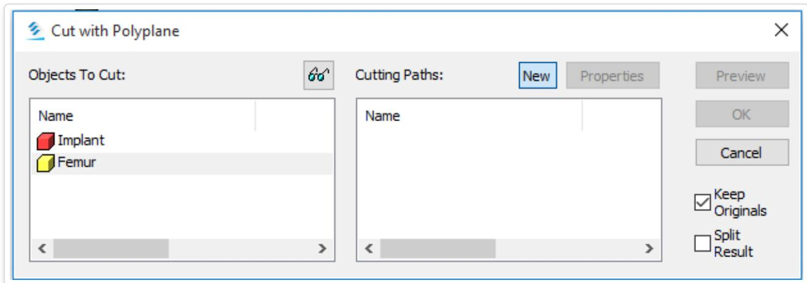

text_image

Cut with Polyplane
Objects To Cut:
Name
Implant
Femur
Cutting Paths:
New Properties Preview
OK Cancel
Keep Originals
Split Result

Cut top

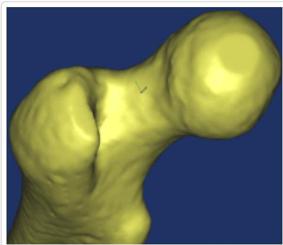

natural_image

3D rendered yellow anatomical structure against blue background, no visible text or symbols

Cut bottom   
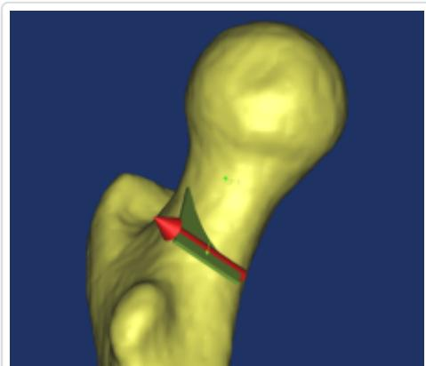

natural_image

3D rendered model of a human femur with highlighted joint area (no text or symbols)

The orientation of the cut can still be modified. Hover over the center of the red arrow, when the cursor changes into the reposition icon

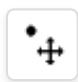

, hold the left mouse button. By moving the mouse you can change the orientation of the cutting plane.

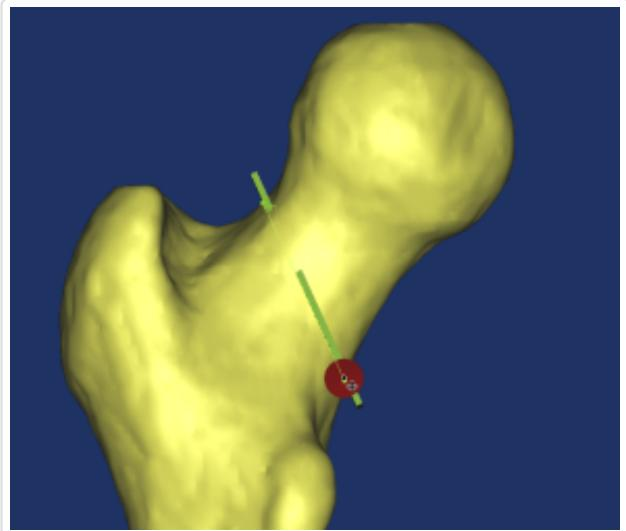

natural_image

3D rendered anatomical model of a bone structure with green measurement lines and a red circular marker (no text or symbols)

Hold the left mouse button to change the orientation of the cutting plane

To finalize the cut the cutting plane should go completely through the bone. Therefore the depth needs to be increased. In the cut with PolyPlane dialog click on properties. In the properties dialog change the depth to 50 mm.

Depth increase dialog   
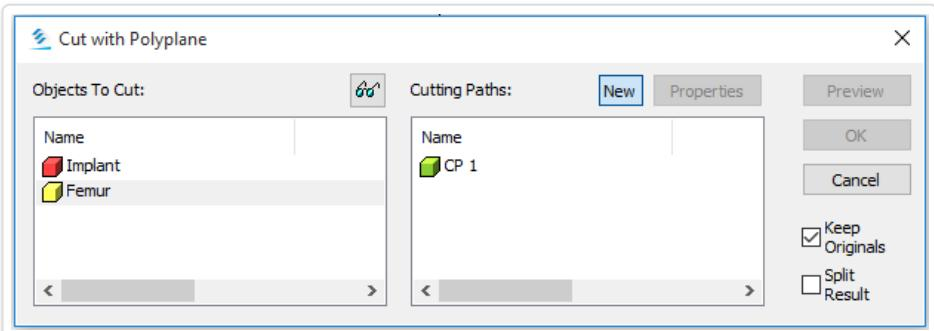

text_image

Cut with Polyplane
Objects To Cut:
Name
Implant
Femur
< >
Cutting Paths:
New Properties Preview OK Cancel Keep Originals Split Result

Depth increased

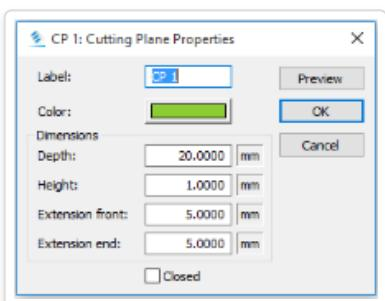

text_image

CP 1: Cutting Plane Properties
Label:
Color:
Dimensions
Depth:
20.0000 mm
Height:
1.0000 mm
Extension front:
5.0000 mm
Extension end:
5.0000 mm
Closed
Preview
OK
Cancel

Click on OK to finish the cut.

The cut will create a new 3D model, PolyplanCut-Yellow. To split this model, go to 3D Tools > Split in the menu. In the Split dialog select the PolyplaneCut-yellow 3D model and select largest part. In this way you will only preserve the shaft of the femur.

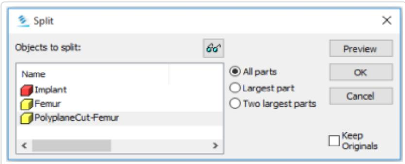

text_image

Split
Objects to split:
Name
Implant
Femur
PolyplaneCut-Femur
< >
All parts
Largest part
Two largest parts
Preview
OK
Cancel
Keep
Originals

# Before split

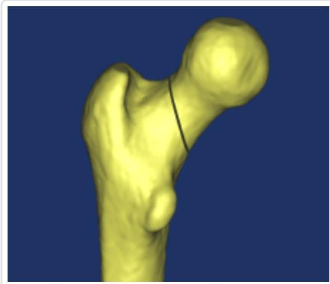

natural_image

3D rendered yellow bone model against a solid blue background (no text or symbols)

# After split

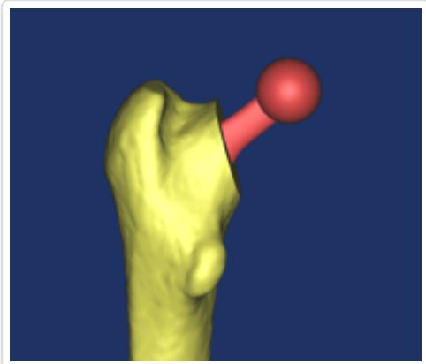

natural_image

3D rendered illustration of a joint with a red sphere attached to the femur (no text or symbols)

# Remesh of the femur and implant

The femur and the implant now have to be remeshed in 3-matic. To do this, go to the FEA -> Remesh in the menu. This will bring up the following dialog:

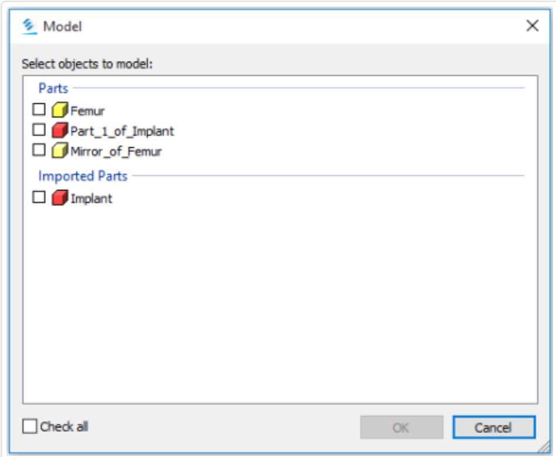

text_image

Model
Select objects to model:
Parts
Femur
Part_1_of_Implant
Mirror_of_Femur
Imported Parts
Implant
Check all
OK
Cancel

Select both the implant and the shaft of the femur and click on OK.

In this step the Parts need to be remeshed to be optimal for FEA purposes. To get the optimal result it is common to follow the next steps in 3-matic:

Create Non Manifold Assembly   
Define shape parameters

Inspect the quality of the surface mesh   
Reduce the details of the anatomical part   
Remesh the surface elements   
Generate the volume mesh   
Visualize volume elements   
Analyze Mesh quality

For details on how to get the optimal mesh for your Part see the Chapter 5: Remesh of the Tutorials in 3-matic. You can find it under Help -> Tutorial... in 3-matic.

When you are satisfied with the quality of the mesh copy your object by selecting your object and pressing Ctrl+C on your keyboard. Open your Mimics window and paste your object there by pressing Ctrl+V. The volume mesh will be available in the FEA mesh tab in the project management section. These meshes can then be exported to your FEA software.

# Exporting the Volume mesh

Now you can export the volume mesh from Mimics to a Patran neutral, Abaqus, or ANSYS file. To do this go to the File->Export menu and choose the correct format to export the mesh. Select the FEA meshes and click Add. To export, click OK.

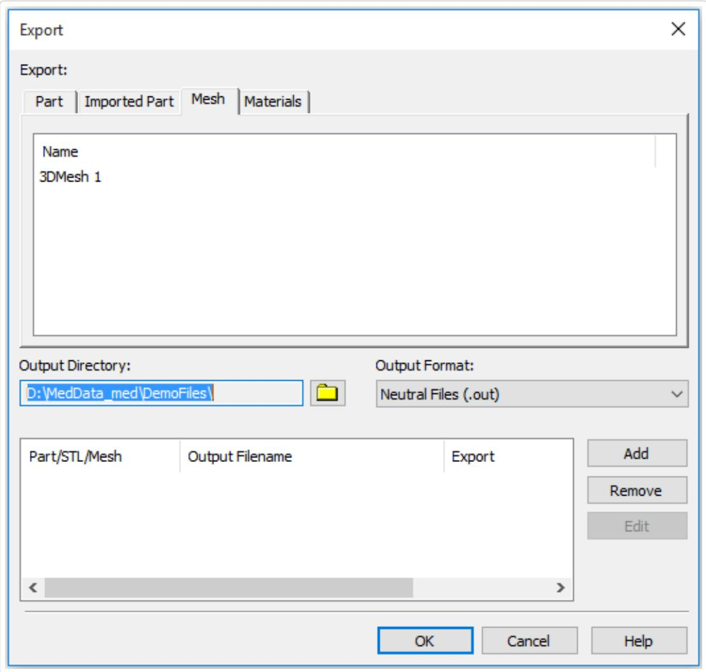

text_image

Export
Export:
Part	Imported Part	Mesh	Materials
Name
3DMesh 1
Output Directory:
D:\MedData_med\DemoFiles
Output Format:
Neutral Files (.out)
Part/STL/Mesh	Output Filename	Export
Add
Remove
Edit
OK	Cancel	Help

