# Mimics Research 21.0 Scripting Guide
> 本文档由 HTML 帮助页面自动转换生成，内容与原始网页完全一致，仅格式从 HTML 变为 Markdown。

---
## 目录

### Introduction

- Introduction
- Python Installation
- Mimics IDE
- Scripting in Mimics Quick Start Guide

### Mimics API

- mimics module
- mimics.analyze module
- mimics.cineloop module
- mimics.data module
- mimics.dialogs module
- mimics.dicom module
- mimics.events module
- mimics.fea module
- mimics.file module
- mimics.image module
- mimics.logging module
- mimics.measure module
- mimics.segment module
- mimics.simulate module
- mimics.tools module
- mimics.view module

### API Change Log

- API Change Log

### External IDE

- External IDE Introduction
- Using an External IDE
- Get Autocomplete in External IDEs
- Installation Guide for rpyc and PyQt5
- Eclipse and Pydev
- JetBrains PyCharm
- Microsoft Visual Studio

### Tutorials

- Automatic Import of DICOM Images
- Semi-automatic Import of Standard Images
- Skull Segmentation
- Femur Segmentation
- Landmarks and Measurements in the Shoulder
- Preparation for Fluoroscopy
- CT Heart Landmarking and Segmentation
- Access to Part Triangles and Points
- Switch between Mimics and 3-matic
- Working with Metadata
- 4D Heart Cineloop in Parts

---


---

# 1. Introduction


For a general introduction about Mimics, please refer to Mimics Reference guide under **Help** -> **Manual**.


Mimics supports Python scripting. For many of the available Mimics features, a Python API is now included in Mimics. You can write your own Python scripts, using those Mimics features that are available via scripting. This allows you to automate your workflows. Mimics comes with a pre-installed Python interpreter and includes a script editor and a scripting console.


---

# 2. Python installation


To be able to use scripting in Mimics, **Python 3.5** needs to be installed. Mimics comes with support for installing Python 3.5.2. Extra packages and libraries such as NumPy or SciPy can be used too but are not preinstalled. The user can install them manually.


Please follow the steps below to get access to Mimics scripting.


## 2.1. Installing Python 3.5


If Python 3.5 is not already installed in your system, the recommended installation method is to use the Mimics installation wizard. Python installation will be done automatically as part of the Mimics installation.


If you already have Python 3.5 installed, then you can choose the Python interpreter of your preference in Mimics, such as Anaconda or others, but make sure to use Python version 3.5.


## 2.2. Configuring Mimics for scripting


In the menu **File** -> **Preferences** -> **Scripting** make sure that the path to the Python intepreter is set correctly. If you installed Python using the Mimics installation wizard, then the path should be set correctly automatically. If you installed Python separately, then you can manually set the path to the local directory that contains the Python installation.


The default Scripting library path is set by default in `\..\MedData\Scripts`. In that location you can find all the tutorial scripts that are included in the installer. You can set the path to the scripting directory of your preference. Any scripts present in the specified folder are automatically registered in the menu **Script** -> **Scripting Library**.


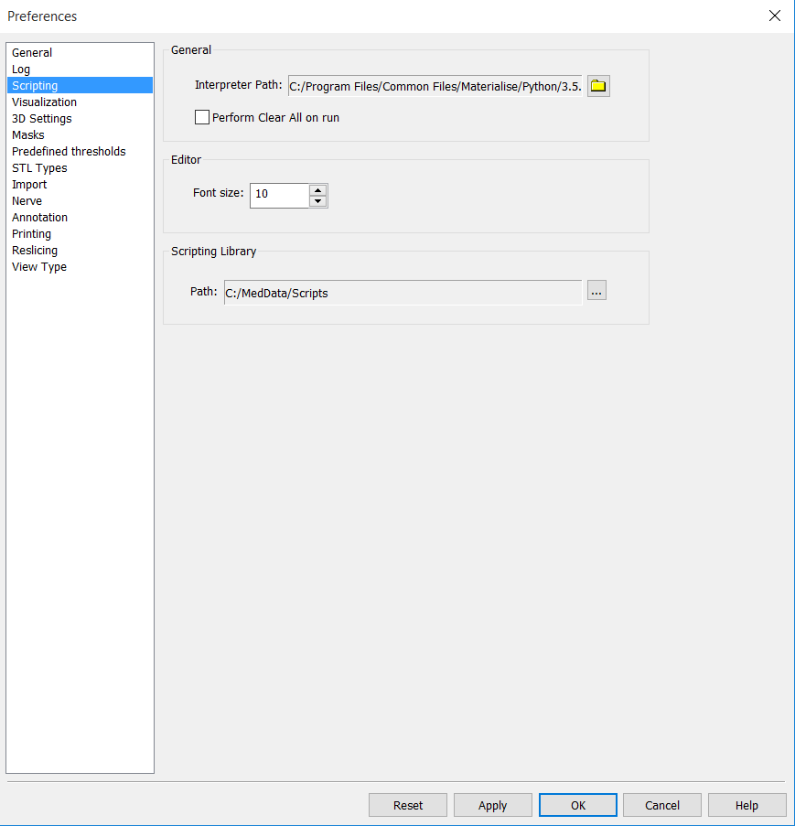


## 2.3. Installing extra packages (optional)


If desired, install additional Python packages or libraries such as NumPy or SciPy. If you already have installed a Python 3.5 version that contains the external Python libraries of your preference, please follow the instructions above to set as default this Python interpreter.


If you only have available the Mimics built-in Python installation, then it is recommended to install a full version of Python 3.5 in order to use external libraries. You can find a full version of Python 3.5 in the following location: [https://www.python.org/downloads/](https://www.python.org/downloads/) . To install external Python packages you can use the **pip** library, which is the recommended tool from Python Packaging Authority (PyPA) for installing Python packages. If you install a full version of Python 3.5, the pip library is included in the installation folder.


Below you can find a simple example of how to install NumPy and PyQt. First, launch the Windows command line (**cmd**) and use the **cd** command to change the directory to the one that contains the **pip.exe** file. This is located in a subfolder of the Python 3.5 installation location. Then type the following:


```bash
pip install numpy
pip install PyQt5

```


NumPy and PyQt5 are now normally installed to your system. For more information please visit the following page: [https://packaging.python.org/installing/](https://packaging.python.org/installing/) .


---

# 3. Mimics IDE


Mimics IDE is the environment that provides comprehensive facilites to Mimics users to develop scripts. Mimics IDE consists of an **Editor**, a **Console** and a **Scripting Library**.


## 3.1. Editor


Mimics comes with a built-in editor. The editor can be accessed via the Mimics menu: **Script** -> **Toggle Editor**. The editor will open in a separate window.


In the editor you can create a new project via the  button. To save a project click the  or  button. To open an existing project click the  button.
In the left panel of the editor window, the user can view all the scripts present in the selected folder. Clicking on a script will open it in the editor. To run the script, click the  button or press F5 or CTRL-R. To access the help page of the Mimics API click to the 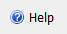 button.


## 3.2. Python console


An alternative method for executing Python commands is via the built-in Python console in Mimics. You can show or hide the console via the Mimics menu: **Script** -> **Toggle Console**.


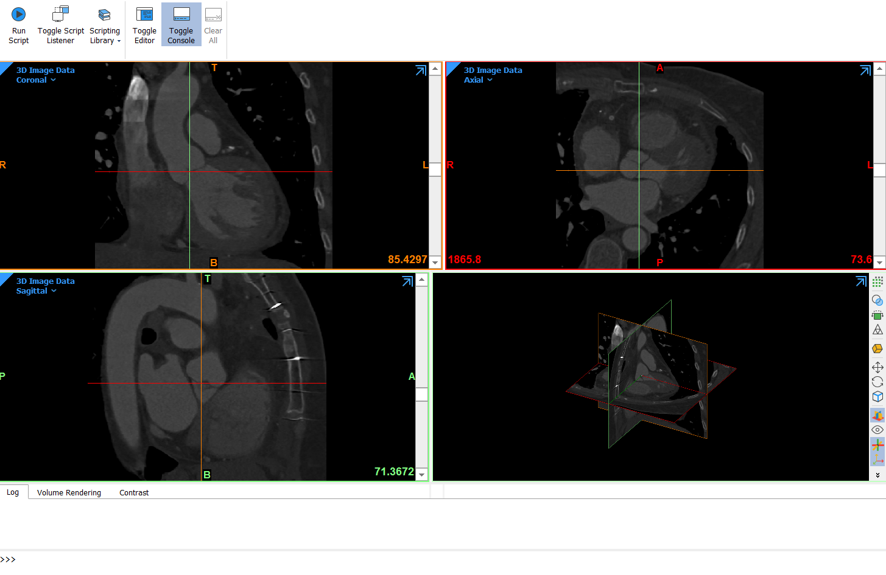


## 3.3. Scripting Library


A third way method for executing Python scripts is via the Mimics menu **Script** -> **Scripting Library**.


As explained earlier, you can specify a path to a particular script directory via **File** -> **Preferences** -> **Scripting** in Mimics. Any scripts present in the specified folder will automatically be registered under the Scripting Library. It is then possible to execute such scripts with a single click. This is the ideal method for users who need to execute a script without needing to see or modify the script. (You need to restart Mimics for the changes to become effective.)


## 3.4. External IDE


Mimics is compatible with with external Integrated Development Environments (IDE). You can run your script from an external IDE. For more information see the section External IDE of the scripting guide.


---

# 4. Scripting in Mimics Quick Start Guide


## 4.1. Show/hide Editor and Console


To show or hide the Mimics Editor or Console, click on the menu **Script** and select **Toggle Editor** or **Toggle Console**.


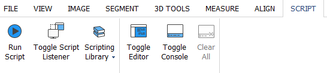


## 4.2. Run a script


There are several ways to run a script.


A first method is via the Mimics Editor. Click on the menu **Script** and **Toggle Editor**. In the window of the editor, click on the button  to browse to your script. After selecting the script, it will appear in the Editor window. Click on the button  (or press F5 or CTRL-R) to execute it.


A second method is via the **Run Script** button in the **Script** menu. This allows you to select your script and run it.


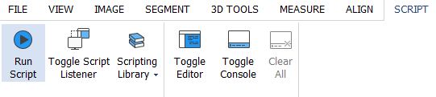


A third method to run a script is via **Scripting Library**. Please note that you need to configure your scripting preferences in order to make scripts visible in the **Scripting Library** menu. For details see Section 2.2 of the Introduction. Once you have configured your preferences, scripts will appear in the **Scripting Library** and you can run the scripts with a single click.


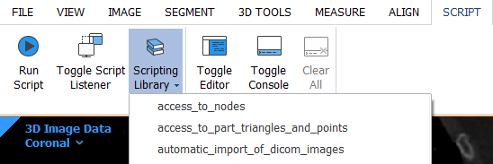


## 4.3. Execute Mimics and scripts from Windows Command Prompt (CMD)


You can run Mimics and scripts from the Windows Command Prompt (cmd). You can find the available options in the cmd by typing **-h** or **-help** as a parameter in cmd (see below). The options and examples are shown in Mimics Medical 20.0 but they apply in Research as well by replacing the word Medical with Research.


```bash
cd "C:\Program Files\Materialise\Mimics Medical 21.0"

MimicsMedical.exe - h

MimicsMedical.exe - help

```


The available options and their description are shown below:


```bash
MimicsMedical.exe [-help] [-background_mode] [-kill] [-save_log <filename.txt>] [-run_script <script_name.py [args]>]

-h, -help                Display this help
-b, -background_mode     Runs the application without GUI (in the background). Quits the application after task completion
-k, -kill                Quits the application after task completion
-save_log <filename.txt> Saves all logger messages to a file specified
-r, -run_script          Runs a python script.
script_name.py           Name of the python script to run
[args]                   Optional parameters to pass into the python script.  They can be accessed using sys.argv[n]

```


**Example:**


In folder `\..\MedData\Scripts` there is a copy of the tutorials. To run the import_dicom.py file from Windows command prompt, type the following (it is assumed that Mimics is installed in C: drive for this example.):


```bash
cd "C:\Program Files\Materialise\Mimics Medical 21.0"

MimicsMedical.exe -b -run_script "C:\MedData\Scripts\import_dicom.py"

```


**Note:** It is recommended to include the full path in ” ”.


## 4.4. Clean variables and workspace


In general, a namespace uniquely identifies a set of names so that there is no ambiguity when objects having different origins but identical names are combined. In essence, a namespace in Python is a mapping of every name you have defined to corresponding objects. Different namespaces can co-exist at a given time but are completely isolated. A namespace containing all the built-in names is created when you start the Python interpreter and exists as long you don’t exit.


The Mimics Editor and Mimics console have a shared namespace. Consequently, when you execute a script from the Editor which creates certain Python variables, these variables will be accessible from the Mimics Console too, and vice versa. This allows for easy experimentation and debugging while writing scripts. Scripts that run via Run Script use the same shared namespace with Console and Editor. In contrast, scripts that are executed from the Scripting Library are executed in each run in their own namespace, which is not shared with other namespaces like Editor and Console. This is to allow for clean execution of your scripts.


There are several ways to clean the namespaces if desired. You can clean the namespace shared between Editor and Console by clicking on the **Script** menu and **Clear All** (see image below).


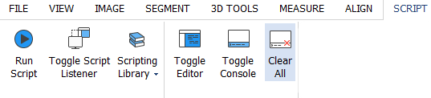


Another way to clean the namespace of Editor and Console is to right-click on the Console in Mimics and select **Clear All** as shown below.


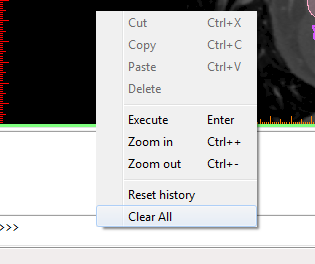


Alternatively, you can clean the namespaces implicitly prior to running scripts from any execution source. This option applies only for the namespace created by the run from Editor, Console or Run script. This setting is accessible from the menu **Edit** in **Preferences** (see image below).


## 4.5. Getting started with the Mimics API


Python interaction with Mimics is done via the Mimics Application Programming Interface (API). Via this API, it is possible to call many of the regular Mimics features (segmentation, measurements, etc), access the objects in a Mimics project, etc. A complete overview of the API can be found in the “Mimics API” section. Below we explain the basic concept by means of a simple example.


The required module is called **mimics**. This module comes as part of the Mimics installation, and is imported automatically when using Mimics (so there is no need to import it explicitly when executing a Python script within Mimics). Accessing the Mimics API is done via this module, as illustrated below.


## 4.6. Using the Mimics API


Like many programming languages, Python supports Object Oriented Programming. This is the basis of the Mimics API as well: each object is an instance of a class. Dot notation is used as the way to say to an instance to use one of the functions or properties of the class it belongs to. For instance, the method *create_mask* can be called to create a new object of type *mimics.Mask* as follows.


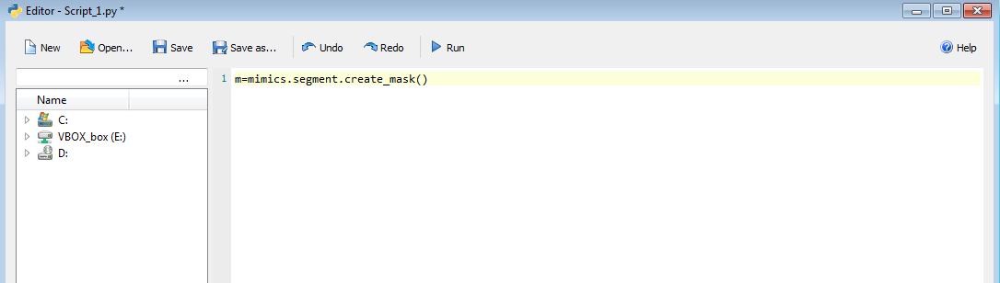


The Mimics API is organized into submodules, reflecting the structure of the regular Mimics menus. For instance, there are submodules *mimics.file*, *mimics.segment*, *mimics.analyze*, etc. In addition, the Mimics API includes several other useful modules and classes as listed in the “Mimics API” section.


You can use *Ctrl* + *Space* to get autocomplete. Note that autocomplete works for names of methods, arguments, variables, etc. To confirm the selection of the module (i.e: mimics.segment), functionality (i.e: mimics.segment.threshold()) or argument ((i.e: mimics.segment.threshold(mask=))) you can use *Tab* or *Enter*.


## 4.7. Working with Hounsfield and Grayvalues pixel units


In the regular Mimics UI you can choose to work with Hounsfield units or gray values. You can modify the setting in the **Preferences** in the **File** menu (in the tab **General**). The Mimics API, however, works **only** with gray values (i.e., all API methods that work with thresholds etc assume that the unit is gray values), regardless of your preference setting. If you need to work with Hounsfield units, there are two Mimics APIs that will assist you: HU2GV converts from Hounsfield Units (HU) to Gray Values (GV), and GV2HU does vice versa. Below is an example.


```python
# Values in HU
low_hu = 240
high_hu = 3071

# Convert values to GV
low_gv = mimics.segment.HU2GV(low_hu)
high_gv = mimics.segment.HU2GV(high_hu)

# Use the tool with the converted values
mimics.segment.threshold(mask=m,threshold_min=low_gv,threshold_max=high_gv)

```


## 4.8. Access to Mimics objects


A frequently used class is *mimics.data*, which allows you to access most of the types of Mimics objects that are present in the Mimics project management tab (masks, parts, measurements, planes, points, reslice views, etc).


Below are some examples on how to access parts and masks in the project *Heart.mcs* that is included in the installation of Mimics (MedData folder). This project contains three masks with names LA, LV and Aorta, and the respective parts.


To access the first mask of the project:


```python
# First mask of the project
mask1 = mimics.data.masks[0]
print(mask1.name)

```


To access the mask with name LA:


```python
# Mask LA
mask1 = mimics.data.masks.find("LA")
print(mask1.name)

```


In the above example there is only one matching mask (one mask with the name “LA”). When there are multiple matching results, *find* will return only one result, but the Mimics API also has a similar method *filter* that returns all matches. Note that *find* and *filter* also support regular expressions.


To assign the part with name Aorta to a variable:


```python
# Find part Aorta
mask1 = mimics.data.parts.find("Aorta")
print(mask1)

```


To delete the mask LV:


```python
# Delete LV mask
lv = mimics.data.masks.find("LV")
mimics.data.masks.delete(lv)

```


To duplicate all the masks and parts:


```python
# Duplicate all the masks and parts of the opened project
for m in mimics.data.masks:
       mimics.data.masks.duplicate(m)

for p in mimics.data.parts:
       mimics.data.parts.duplicate(p)

```


To explore which Mimics objects are accessible with Mimics API you can type *mimics.data.* in the Editor or Console. Autocomplete will show the full list of types of objects that are availabe in the data container.


## 4.9. Access to the properties of Mimics objects


Most of the Mimics objects can be accessed with scripting and are reprented as a class in Mimics API. In Python attribute reference is the most common understood action. Consequently to refer to the properties of a Mimics object you can simply refer to the attributes of the instance of the class that the Mimics object is assigned to. See the examples below:


```python
# The first mask that is included in the mask container is assigned to variable m
m = mimics.data.masks[0]

# To access the attributes of this instance of mimics.segment.Mask class use the dot notation.
# That way you can access properties of the Mimics mask that is assigned to variable m. See below:
print(m.average_value)
c = m.color
n = m.number_of_pixels
b = m.get_voxel_buffer()

# To get a list of the valid attributes(built-in and special) for that object, type the following:
print(dir(m))

```


## 4.10. Activate Mimics tools with Python


Using the Mimics API you can not only perform most of the operations in Mimics via API calls but you can also launch or ‘activate’ some of the regular Mimics tools with their regular graphical user interface. For example, thresholding is an operation that can be performed in the following two ways. The first is to perform thresholding as part of a script without interaction with the user. All the parameters required are defined in the script:


```python
# Thresholding without user interaction
m = mimics.data.masks[0]
l_t = 100
h_t = 3000
mimics.segment.threshold(mask=m,threshold_min=l_t, threshold_max=h_t)

```


The second way is by activating the thresholding tool. You can interactively choose the low and the high threshold that will be applied to the chosen mask (see the image below). The script will continue after you confirm your choice.


```python
# Thresholding with user interaction
m = mimics.data.masks[0]
mimics.segment.activate_thresholding(mask=m)

```


**Note:** Currently, only a limited number of selected tools have such an ‘activate’ API.


## 4.11. Display and suppress dialog boxes


In the previous section it was briefly explained that there are some tools that can be activated with scripting and require interaction with the user. Using the Mimics API you can additionaly create your own dialog boxes or even suppress those that automatically appear in Mimics (e.g. change orientation of DICOM images). Below you can find an example on how to suppress some of the built in dialog boxes of Mimics with predefined answers.


```python
# Set predefined answers to suppress some of the built in dialog boxes
mimics.dialogs.set_predefined_answer("CannotConvertProject", "Yes")
mimics.dialogs.set_predefined_answer("ProjectHasNotValidCS", "Yes")
mimics.dialogs.set_predefined_answer("ChangeOrientation", "default")
mimics.dialogs.set_predefined_answer("FixImagesPositioning", "Yes")
mimics.dialogs.set_predefined_answer("SaveChangedProject", "No")


# Code that imports DICOM images
# ...
# ...

```


In the Mimics API there is the possibility to create your own dialog boxes that can give you customised interaction with the script. Below you can find an example on how to create a dialog box with some predefined list of possible answers.


```python
# Create customised dialog boxes with scripting
# ...
# Code that performs an operation
# ...
sel = mimics.dialogs.question_box(message="Please indicate the region to continue", buttons="LA;LV;Aorta", title= "Region Selection")
# ...

```


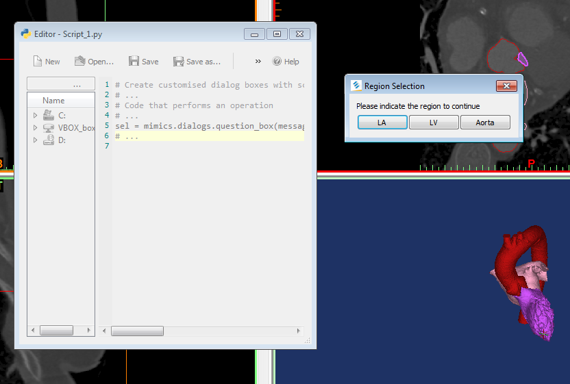


---

# mimics module


***class*`mimics.``BoundingBox2d`**

Bases: `object`


2D bounding box, dedicated for the screen coordinates.


**`height`**

| Type: | typing.SupportsFloat |
| --- | --- |


**`origin`**

| Type: | typing.Tuple[typing.SupportsFloat, typing.SupportsFloat] |
| --- | --- |


**`width`**

| Type: | typing.SupportsFloat |
| --- | --- |


***class*`mimics.``BoundingBox3d`(*origin=[0, 0, 0], first_vector=[0, 0, 0], second_vector=[0, 0, 0], third_vector=[0, 0, 0]*)**

Bases: `object`


3D bounding box, dedicated for the spatial coordinates.


**`first_vector`**

| Type: | typing.Union[typing.Tuple[typing.SupportsFloat, typing.SupportsFloat, typing.SupportsFloat], mimics.analyze.Point] |
| --- | --- |


**`origin`**

| Type: | typing.Union[typing.Tuple[typing.SupportsFloat, typing.SupportsFloat, typing.SupportsFloat], mimics.analyze.Point] |
| --- | --- |


**`second_vector`**

| Type: | typing.Union[typing.Tuple[typing.SupportsFloat, typing.SupportsFloat, typing.SupportsFloat], mimics.analyze.Point] |
| --- | --- |


**`third_vector`**

| Type: | typing.Union[typing.Tuple[typing.SupportsFloat, typing.SupportsFloat, typing.SupportsFloat], mimics.analyze.Point] |
| --- | --- |


***class*`mimics.``DataContainer`**

Bases: `object`


Flat container which contains all application objects.


**`delete`(*objects*)**

Removes the object.


| Parameters: | **objects** (*typing.Union**[**typing.Iterable**[**mimics.Object**]**,**mimics.Object**,**mimics.DataContainer**]*) – Objects to be deleted. |
| --- | --- |


**`duplicate`(*object*)**

Duplicates the object.


| Parameters: | **object** (*mimics.Object*) – Object to be duplicated. |
| --- | --- |
| Returns: | A copy of the defined object. |
| Return type: | mimics.Object |
| Exceptions: | RuntimeError |


**`filter`(*expression*, *regex=False*)**

Filters container`s elements.


| Parameters: | - **expression** (*str*) – Expression matching the name of the object.
- **regex** (*bool*) – (optional) Defines whether expression is a regular expression or not. Default value is false. |
| --- | --- |
| Returns: | A list of objects names of which correspond to the regular expression shall be returned. In case of no object with such name an empty list should be returned. |
| Return type: | typing.List[mimics.Object] |
| Exceptions: | ValueError |


**`find`(*name*, *regex=False*)**

Finds the object by name.


| Parameters: | - **name** (*str*) – Object’s name.
- **regex** (*bool*) – (optional) Defines whether name is regular expression or not. Default value is false. |
| --- | --- |
| Returns: | If exactly one object in the container has the defined name, the object shall be returned. If more than one object in the container has the defined name, only the first of these objects shall be returned. In case of no object in the container has the defined name, the built-in Python constant None shall be returned. |
| Return type: | mimics.Object |
| Exceptions: | ValueError |


**`move_objects`(*target_index_position*, *objects*)**

Changes native objects order.


| Parameters: | - **target_index_position** (*int*) – new container position for first of the provided objects
- **objects** (*typing.Union**[**typing.Iterable**[**mimics.Object**]**,**mimics.Object**,**mimics.DataContainer**]*) – Objects to be reordered. |
| --- | --- |


***class*`mimics.``DataContainerBase`**

Bases: `object`


Flat container which contains all application objects.


**`filter`(*expression*, *regex=False*)**

Filters container`s element.


| Parameters: | - **expression** (*str*) – Expression matching the name of the object
- **regex** (*bool*) – (optional) Defines whether expression is a regular expression or not. Default value is false. |
| --- | --- |
| Returns: | A list of objects names of which correspond to the regular expression shall be returned. In case of no object with such name an empty list should be returned. |
| Return type: | typing.List[mimics.Object] |
| Exceptions: | ValueError |


**`find`(*name*, *regex=False*)**

Finds the object by name.


| Parameters: | - **name** (*str*) – Object`s name.
- **regex** (*bool*) – (optional) Defines whether name is regular expression or not. Default value is false. |
| --- | --- |
| Returns: | If exactly one object in the container has the defined name, the object shall be returned. If more than one object in the container has the defined name, only the first of these objects shall be returned. In case of no object in the container has the defined name, the built-in Python constant None shall be returned. |
| Return type: | mimics.Object |
| Exceptions: | ValueError |


***class*`mimics.``DicomTag`**

Bases: `object`


The DICOM tag class.


**`children`**

| Type: | typing.Union[typing.Tuple[typing.Dict[typing.Tuple[int, int], mimics.DicomTag]], NoneType] |
| --- | --- |


**`description`**

| Type: | <class ‘str’> |
| --- | --- |


**`length`**

| Type: | <class ‘int’> |
| --- | --- |


**`value`**

| Type: | <class ‘str’> |
| --- | --- |


**`vr`**

| Type: | <class ‘str’> |
| --- | --- |


***class*`mimics.``ImageData`**

Bases: `object`


Image data is a matrix of voxels.


**`get_dicom_tags`(*image_index=None*)**

Returns the DICOM tags dictionary of this image data except from the tags of the image pixels information. In order to get the pixel information of images mimics.ImageData.get_voxel_buffer API can be used. Each time a  new instance of dictionary is returned, consequently to achieve better performance of API assign it first to a variable (cached).


| Parameters: | **image_index** (*int*) – (optional) Index of image in image set |
| --- | --- |
| Returns: | DICOM tags for this image data |
| Return type: | typing.Dict[typing.Tuple[int, int], mimics.DicomTag] |


**`get_grey_value`(*point_coordinates*)**

Calculates grey value in the defined coordinates in image data.


| Parameters: | **point_coordinates** (*typing.Tuple**[**typing.SupportsFloat**,**typing.SupportsFloat**,**typing.SupportsFloat**]*) – Point coordinates in project units. |
| --- | --- |
| Returns: | Grey value of image |
| Return type: | int |
| Example: |  |


```python
active_image = mimics.data.images.get_active()

while True: #should be changed to any meaningful condition
    print("Click on the views (on the image on 2D or on the surface on 3D view")
    click = mimics.indicate_coordinate(show_message_box=False)
    print("You have clicked on {} in mm of the World Coordinate System".format(click))

    # get_grey_value method is good for low performance pixel buffer access
    gv = active_image.get_grey_value(click)
    print("Slow but convenient access via single purpose function: GV of the active image at this point: {}".format(gv))

```


**`get_image_information`()**

Returns information about this image data.


| Returns: | Image information for this image data |
| --- | --- |
| Return type: | mimics.ImageInformation |


**`get_voxel_buffer`()**

Returns a 3D image copy as 16-bit 3D array of grey value.


| Returns: | 16-bit 3D array of grey value. |
| --- | --- |
| Return type: | memoryview |
| Example: |  |


```python
active_image = mimics.data.images.get_active()
voxels = active_image.get_voxel_buffer()

while True: #should be changed to any meaningful condition
    print("Click on the views (on the image on 2D or on the surface on 3D view")
    click = mimics.indicate_coordinate(show_message_box=False)
    print("You have clicked on {} in mm of the World Coordinate System".format(click))

    # get_voxel_buffer method is useful to access a bunch of points in high-performance way
    try:
        index = active_image.get_voxel_indexes(click)
    except ValueError:
        print("You have clicked outside of the image!")
        continue
    print("Index of pixel of the active image at this point: {}".format(index))
    assert 0 <= index[0] < active_image.logical_dimensions[0]
    assert 0 <= index[1] < active_image.logical_dimensions[1]
    assert 0 <= index[2] < active_image.logical_dimensions[2]
    gv = voxels[index]
    print("High performance access via memory view: GV of active image at this point: {}".format(gv))

    # just as an exercise - let's take the next diagonal pixel in the same XY plane
    try:
        gv = voxels[index[0]+1, index[1]+1, index[2]]
        print("GV of the active image at the next XY diagonal point: {}".format(gv))
    except IndexError:
        print("The  next XY diagonal point is out of the image!")

```


**`get_voxel_center`(*index_of_voxel*)**

Calculates coordinates of the voxel center.


| Parameters: | **index_of_voxel** (*typing.Tuple**[**int**,**int**,**int**]*) – Voxel index in the image data. |
| --- | --- |
| Returns: | Voxel center’s coordinates. |
| Return type: | typing.Tuple[float, float, float] |


**`get_voxel_indexes`(*point_coordinates*)**

Calculates voxel indexes in image data.


| Parameters: | **point_coordinates** (*typing.Tuple**[**typing.SupportsFloat**,**typing.SupportsFloat**,**typing.SupportsFloat**]*) – Point inside of voxel. |
| --- | --- |
| Returns: | Voxel coordinates. |
| Return type: | typing.Tuple[int, int, int] |


**`linked_objects`**

| Type: | typing.List<~T>[mimics.Object] |
| --- | --- |


**`logical_dimensions`**

| Type: | typing.Sequence[typing.SupportsInt] |
| --- | --- |


**`logical_slice_distance`**

| Type: | typing.SupportsFloat |
| --- | --- |


**`physical_dimensions`**

| Type: | typing.Sequence[typing.SupportsInt] |
| --- | --- |


**`pixel_size`**

| Type: | typing.SupportsFloat |
| --- | --- |


***exception*`mimics.``ImageFileWritingError`(*message*)**

Bases: `Exception`


***class*`mimics.``ImageInformation`**

Bases: `object`


Information about specific image data.


***class*`mimics.``ImagesContainer`**

Bases: `object`


Flat container which contains all image data objects.


**`delete`(*objects*)**

Removes the object.


| Parameters: | **objects** (*typing.Union**[**typing.Iterable**[**mimics.Object**]**,**mimics.Object**,**mimics.DataContainer**]*) – Objects to be deleted. |
| --- | --- |


**`filter`(*expression*, *regex=False*)**

Filters container`s elements.


| Parameters: | - **expression** (*str*) – Expression matching the name of the object.
- **regex** (*bool*) – (optional) Defines whether expression is a regular expression or not. Default value is false. |
| --- | --- |
| Returns: | A list of objects names of which correspond to the regular expression shall be returned. In case of no object with such name an empty list should be returned. |
| Return type: | typing.List[mimics.Object] |
| Exceptions: | ValueError |


**`find`(*name*, *regex=False*)**

Finds the object by name.


| Parameters: | - **name** (*str*) – Object’s name.
- **regex** (*bool*) – (optional) Defines whether name is regular expression or not. Default value is false. |
| --- | --- |
| Returns: | If exactly one object in the container has the defined name, the object shall be returned. If more than one object in the container has the defined name, only the first of these objects shall be returned. In case of no object in the container has the defined name, the built-in Python constant None shall be returned. |
| Return type: | mimics.Object |
| Exceptions: | ValueError |


**`get_active`()**

Returns Active Image Data.


| Returns: | mimics.ImageData |
| --- | --- |
| Return type: | mimics.ImageData |


**`set_active`(*image*)**

Changes Active Image Data.


| Parameters: | **image** (*mimics.ImageData*) – Image that will be set as active one |
| --- | --- |
| Returns: | Returns true if the operation was successful. |
| Return type: | bool |
| Exceptions: | TypeError |


***exception*`mimics.``InvalidArgumentType`(*message*)**

Bases: `mimics.UncheckedException`


***class*`mimics.``Layouts`**

Bases: `object`


Container with string attributes that can be used as an input for mimics.view.set_layout API.


***class*`mimics.``LayoutsContainer`**

Bases: `object`


List of available layouts.


***exception*`mimics.``LicenseError`(*message*)**

Bases: `mimics.UncheckedException`


***class*`mimics.``Metadata`**

Bases: `object`


Container which contains metadata for specific object.


**`create`(*name*, *value*)**

Creates new metadata item with provided name and value.


| Parameters: | - **name** (*str*) – Metadata item`s name.
- **value** (*str*) – Metadata item`s value. |
| --- | --- |


**`delete`(*items*)**

Deletes first metadata item with provided name if it exists.


| Parameters: | **items** (*typing.Union**[**typing.Iterable**[**mimics.MetadataItem**]**,**mimics.Metadata**,**mimics.MetadataItem**,**str**]*) – Metadata items to be deleted. |
| --- | --- |


**`filter`(*expression*, *regex=False*)**

Filters container`s elements.


| Parameters: | - **expression** (*str*) – Expression matching the name of the metadata item
- **regex** (*bool*) – (optional) Defines whether expression is a regular expression or not. Default value is false. |
| --- | --- |
| Returns: | A list of metadata item names of which correspond to the regular expression shall be returned. In case of no object with such name an empty list should be returned. |
| Return type: | typing.List[mimics.MetadataItem] |
| Exceptions: | ValueError |


**`find`(*name*, *regex=False*)**

Finds the metadata item by name.


| Parameters: | - **name** (*str*) – Metadata item`s name.
- **regex** (*bool*) – (optional) Defines whether name is regular expression or not. Default value is false. |
| --- | --- |
| Returns: | If exactly one metadata item in the container has the defined name, the item shall be returned. If more than one metadata item in the container has the defined name, only the first one shall be returned. In case of no metadata item in the container has the defined name, the built-in Python constant None shall be returned. |
| Return type: | mimics.MetadataItem |
| Exceptions: | ValueError |


***class*`mimics.``MetadataItem`**

Bases: `object`


Metadata items has name and value.


***class*`mimics.``NotSpecifiedType`**

Bases: `object`


Used by some methods as default argument


***class*`mimics.``Object`**

Bases: `object`


Object is a general term to describe a structure in Mimics. It contains common properties for all child classes.


**`color`**

| Type: | typing.Tuple[typing.SupportsFloat, typing.SupportsFloat, typing.SupportsFloat] |
| --- | --- |


**`guid`**

| Type: | <class ‘str’> |
| --- | --- |


**`image`**

| Type: | typing.Union[mimics.ImageData, NoneType] |
| --- | --- |


**`metadata`**

| Type: | <class ‘mimics.Metadata’> |
| --- | --- |


**`name`**

| Type: | <class ‘str’> |
| --- | --- |


**`selected`**

| Type: | <class ‘bool’> |
| --- | --- |


**`visible`**

| Type: | <class ‘bool’> |
| --- | --- |


***class*`mimics.``Part`**

Bases: `mimics.Object`


A Part is a 3D object.


**`contours_visible`**

| Type: | <class ‘bool’> |
| --- | --- |


**`dimension_delta`**

| Type: | typing.Union[typing.Tuple[typing.SupportsFloat, typing.SupportsFloat, typing.SupportsFloat], mimics.analyze.Point] |
| --- | --- |


**`dimension_max`**

| Type: | typing.Union[typing.Tuple[typing.SupportsFloat, typing.SupportsFloat, typing.SupportsFloat], mimics.analyze.Point] |
| --- | --- |


**`dimension_min`**

| Type: | typing.Union[typing.Tuple[typing.SupportsFloat, typing.SupportsFloat, typing.SupportsFloat], mimics.analyze.Point] |
| --- | --- |


**`get_triangles`()**

Returns triangles surface - tuple of vertices (3D coordinates) and triangles (combination of vertices that creates it).


| Returns: | Tuple of two memoryviews of floats. |
| --- | --- |
| Return type: | typing.Tuple[memoryview, memoryview] |
| Exceptions: | ValueError |


**`number_of_points`**

| Type: | <class ‘int’> |
| --- | --- |


**`number_of_triangles`**

| Type: | <class ‘int’> |
| --- | --- |


**`photo_visible`**

| Type: | <class ‘bool’> |
| --- | --- |


**`quality`**

| Type: | <class ‘str’> |
| --- | --- |


**`surface_area`**

| Type: | typing.SupportsFloat |
| --- | --- |


**`transparency`**

| Type: | typing.SupportsFloat |
| --- | --- |


**`triangles_visible`**

| Type: | <class ‘bool’> |
| --- | --- |


**`type`**

| Type: | <class ‘str’> |
| --- | --- |


**`volume`**

| Type: | typing.SupportsFloat |
| --- | --- |


***exception*`mimics.``ProjectNotLoaded`(*message*)**

Bases: `Exception`


***class*`mimics.``Transaction`**

Bases: `object`


Transaction is a context manager, that allows to unite separate operations into the one transaction.


**`commit`()**

Commits all included operations.


**`rollback`()**

Rollbacks all included operations.


***exception*`mimics.``UncheckedException`(*message*)**

Bases: `Exception`


***exception*`mimics.``UserInterrupted`(*message*)**

Bases: `Exception`


***class*`mimics.``ViewsContainer`**

Bases: `object`


Flat container which contains all views.


**`filter`(*expression=None*, *image_data=<mimics.NotSpecifiedType object>*, *reslice_plane=<mimics.NotSpecifiedType object>*, *regex=False*)**

Filters container`s elements.


| Parameters: | - **expression** (*typing.Union**[**str**,**mimics.NotSpecifiedType**]*) – (optional) Expression matching the name of the view.
- **image_data** (*typing.Union**[**mimics.ImageData**,**None**,**mimics.NotSpecifiedType**]*) – (optional) Image data related to the view.
- **reslice_plane** (*typing.Union**[**mimics.view.Reslice**,**None**,**mimics.NotSpecifiedType**]*) – (optional) Reslice plane related to the view.
- **regex** (*bool*) – (optional) Defines whether expression is a regular expression or not. Default value is false. |
| --- | --- |
| Returns: | A list of objects names of which correspond to the regular expression shall be returned. In case of no object with such name an empty list should be returned. |
| Return type: | typing.List[mimics.view.View] |
| Exceptions: | KeyError, ValueError |


**`find`(*name=<mimics.NotSpecifiedType object>*, *image_data=<mimics.NotSpecifiedType object>*, *reslice_plane=<mimics.NotSpecifiedType object>*, *regex=False*)**

Finds the object by name.


| Parameters: | - **name** (*typing.Union**[**str**,**mimics.NotSpecifiedType**]*) – (optional) View`s name.
- **image_data** (*typing.Union**[**mimics.ImageData**,**None**,**mimics.NotSpecifiedType**]*) – (optional) Image data related to the view.
- **reslice_plane** (*typing.Union**[**mimics.view.Reslice**,**None**,**mimics.NotSpecifiedType**]*) – (optional) Reslice plane related to the view.
- **regex** (*bool*) – (optional) Defines whether name is regular expression or not. Default value is false. |
| --- | --- |
| Returns: | If exactly one object in the container has the defined name, the object shall be returned. If more than one object in the container has the defined name, only the first of these objects shall be returned. In case of no object in the container has the defined name, the built-in Python constant None shall be returned. |
| Return type: | mimics.view.View |
| Exceptions: | KeyError, ValueError |


**`mimics.``cancel_active_tool`()**

Cancels active tool or measurement.


**`mimics.``disable_modules_reload`()**

Disables modules reload.


**`mimics.``disable_update_gui`()**

Disables UI updates.


**`mimics.``enable_modules_reload`()**

Enables modules reload.


**`mimics.``enable_update_gui`()**

Returns true if UI updates are enabled now and false otherwise.


**`mimics.``get_dicom_tags`()**

Returns the DICOM tags dictionary of the study except from the tags of the image pixels information. In order to get the pixel information of images mimics.ImageData.get_voxel_buffer API can be used. Each time a  new instance of dictionary is returned, consequently to achieve better performance of API assign it first to a variable (cached).


| Returns: | DICOM tags of the currently opened project for active image data |
| --- | --- |
| Return type: | typing.Dict[typing.Tuple[int, int], mimics.DicomTag] |
| Example: |  |


```python
# Getting dicom tags in order to cache them in a variable (for speed)
tags = mimics.get_dicom_tags()

# Getting tag value by its group and id
t = tags[0x0028, 0x0010]
print("{}: {}".format(t.description, t.value))

# If you want to iterate over all tags (not accessing their child tags) you can use
# standard Python dict iteration
for k, v in tags.items():
    print(hex(k[0]), hex(k[1]), ":", v.value)


# If a tag contains a list of values you can iterate it like a list
lst = tags[0x0008, 0x1032]
for elem in lst:
    print(len(elem), type(elem), elem)

# As you will notice, some DICOM tag element are just plain tag/value pairs.
# Others though can contain nested tags, so in general DICOM is a tree-like structure.
# E.g. patients name usually lies in a single tag `(0x10, 0x10)`.
# Per-frame Functional Groups Sequence `(0x5200, 0x9230)`, on the other hand
# contains a sequence of nested DICOM Tag elements.
# To access them please use `.children` on the tag object
#(`.children` is set to `None` in case no nested tags are present)

child_tags = tags[0x5200, 0x9230].children
for k, v in child_tags.items():
    print(hex(k[0]), hex(k[1]), ":", v.value)

```


**`mimics.``get_version`()**

Shows current Mimics version.


**`mimics.``indicate_coordinate`(*message='Please indicate coordinate'*, *show_message_box=True*, *confirm=True*, *title=None*)**

Displays a dialog which asks the user to create a point.


| Parameters: | - **message** (*str*) – (optional) Dialog description.
- **show_message_box** (*bool*) – (optional) Defines whether message box should be shown or not. If false then all other parameters are ignored.
- **confirm** (*bool*) – (optional) If true, it displays the OK button and waits for the user to click it to confirm the object placement.
- **title** (*str*) – (optional) Title of the dialog. |
| --- | --- |
| Returns: | Coordinates that can be used for point creation. |
| Return type: | typing.Tuple[float, float, float] |
| Example: |  |


```python
tit = 'Point 1'
msg = 'Please indicate coordinates of Point 1'
coords = mimics.indicate_coordinate(title=tit,message=msg)

```


**`mimics.``is_update_gui_enabled`()**

Returns true if UI updates are enabled now and false otherwise.


| Returns: | state |
| --- | --- |
| Return type: | bool |


**`mimics.``move_object`(*entity*, *offset*)**

Translates an object along x,y,z direction.


| Parameters: | - **entity** (*mimics.Object*) – The object to be moved.
- **offset** (*typing.Tuple**[**typing.SupportsFloat**,**typing.SupportsFloat**,**typing.SupportsFloat**]*) – Offset from the original position in x, y, z direction. |
| --- | --- |
| Example: |  |


```python
obj = mimics.data.parts[0]
vec = (0,0,10)
mimics.move_object(entity=obj ,offset=vec)

```


**`mimics.``not_reloading_modules`()**

Provides access to the list of user-defined modules that should not be reloaded. If any user-defined module that is imported to a script should not be reloaded while script execution then its name (same as in the ‘import’ statement) should be appended to the given list)


| Returns: | The list of names of user-defined modules that should not be reloaded. |
| --- | --- |
| Return type: | typing.Iterable[str] |


**`mimics.``rotate_object_around_axis`(*entity*, *axis*, *angle*, *rotation_origin*)**

Rotates an object around X, Y or Z axis.


| Parameters: | - **entity** (*mimics.Object*) – The object to rotate.
- **axis** (*typing.Tuple**[**typing.SupportsFloat**,**typing.SupportsFloat**,**typing.SupportsFloat**]*) – Direction of the axis of the rotation.
- **angle** (*typing.SupportsFloat*) – Angle of the rotation (in degrees)
- **rotation_origin** (*typing.Tuple**[**typing.SupportsFloat**,**typing.SupportsFloat**,**typing.SupportsFloat**]*) – Center of the rotation. |
| --- | --- |
| Example: |  |


```python
obj = mimics.data.parts[0]
vec = (0,0,1)
ang_deg = 180
origin = (0,0,0)
mimics.rotate_object_around_axis(entity = obj, axis = vec, angle = ang_deg , rotation_origin=origin)

```


**`mimics.``rotate_object_around_inertia_axis`(*entity*, *angles*, *rotation_origin*)**

Rotates a part around its inertia axis.


| Parameters: | - **entity** (*mimics.Part*) – The Part to rotate.
- **angles** (*typing.Tuple**[**typing.SupportsFloat**,**typing.SupportsFloat**,**typing.SupportsFloat**]*) – An (x,y,z) tuple with values representing the angles along each major axis (in degrees)
- **rotation_origin** (*typing.Tuple**[**typing.SupportsFloat**,**typing.SupportsFloat**,**typing.SupportsFloat**]*) – Center of the rotation. |
| --- | --- |
| Example: |  |


```python
obj = mimics.data.parts[0]
ang_deg = 10
origin = (0,0,0)
mimics.rotate_object_around_inertia_axis(entity = obj, angles = (0,0,ang_deg), rotation_origin=origin)

```


**`mimics.``rotate_object_around_views`(*entity*, *angles*, *rotation_origin*)**

Rotates an object with the defined angles.


| Parameters: | - **entity** (*mimics.Object*) – The object to rotate.
- **angles** (*typing.Tuple**[**typing.SupportsFloat**,**typing.SupportsFloat**,**typing.SupportsFloat**]*) – An (x,y,z) tuple with values representing the angles along each major axis (in degrees)
- **rotation_origin** (*typing.Tuple**[**typing.SupportsFloat**,**typing.SupportsFloat**,**typing.SupportsFloat**]*) – Center of the rotation. |
| --- | --- |
| Example: |  |


```python
obj = mimics.data.parts[0]
ang_deg = 90
origin = (0,0,0)
mimics.rotate_object_around_views(entity=obj, angles=(0,0,ang_deg), rotation_origin=origin)

```


**`mimics.``toggle_script_listener`()**

Toggles script listener for third-party IDE.


| Exceptions: | RuntimeError |
| --- | --- |


**`mimics.``update_gui`()**

Processes all posted messages in the message queue


---

# mimics.analyze module


***class*`mimics.analyze.``Centerline`**

Bases: `mimics.Object`


Centerline object is a centerline of a Part which is represented as a tree structure of splines which are fitted to the Part as channels.


**`show_branching_points`**

| Type: | <class ‘bool’> |
| --- | --- |


***class*`mimics.analyze.``Circle`**

Bases: `mimics.Object`


Circle is an analysis object based on center, radius and direction.


**`center`**

| Type: | typing.Union[typing.Tuple[typing.SupportsFloat, typing.SupportsFloat, typing.SupportsFloat], mimics.analyze.Point] |
| --- | --- |


**`normal`**

| Type: | typing.Union[typing.Tuple[typing.SupportsFloat, typing.SupportsFloat, typing.SupportsFloat], mimics.analyze.Point] |
| --- | --- |


**`radius`**

| Type: | typing.SupportsFloat |
| --- | --- |


***class*`mimics.analyze.``Cylinder`**

Bases: `mimics.Object`


Cylinder is an analysis object based on two points, length and radius.


**`direction`**

| Type: | typing.Union[typing.Tuple[typing.SupportsFloat, typing.SupportsFloat, typing.SupportsFloat], mimics.analyze.Point] |
| --- | --- |


**`height`**

| Type: | typing.SupportsFloat |
| --- | --- |


**`point1`**

| Type: | typing.Union[typing.Tuple[typing.SupportsFloat, typing.SupportsFloat, typing.SupportsFloat], mimics.analyze.Point] |
| --- | --- |


**`point2`**

| Type: | typing.Union[typing.Tuple[typing.SupportsFloat, typing.SupportsFloat, typing.SupportsFloat], mimics.analyze.Point] |
| --- | --- |


**`radius`**

| Type: | typing.SupportsFloat |
| --- | --- |


**`transparency`**

| Type: | typing.SupportsFloat |
| --- | --- |


***class*`mimics.analyze.``Line`**

Bases: `mimics.Object`


Line is an analysis object based on two points.


**`direction`**

| Type: | typing.Union[typing.Tuple[typing.SupportsFloat, typing.SupportsFloat, typing.SupportsFloat], mimics.analyze.Point] |
| --- | --- |


**`length`**

| Type: | typing.SupportsFloat |
| --- | --- |


**`point1`**

| Type: | typing.Union[typing.Tuple[typing.SupportsFloat, typing.SupportsFloat, typing.SupportsFloat], mimics.analyze.Point] |
| --- | --- |


**`point2`**

| Type: | typing.Union[typing.Tuple[typing.SupportsFloat, typing.SupportsFloat, typing.SupportsFloat], mimics.analyze.Point] |
| --- | --- |


***class*`mimics.analyze.``Plane`**

Bases: `mimics.Object`


Plane is an analysis object based on the defined origin and normal.


**`delta_x`**

| Type: | typing.SupportsFloat |
| --- | --- |


**`delta_y`**

| Type: | typing.SupportsFloat |
| --- | --- |


**`height`**

| Type: | typing.SupportsFloat |
| --- | --- |


**`normal`**

| Type: | typing.Union[typing.Tuple[typing.SupportsFloat, typing.SupportsFloat, typing.SupportsFloat], mimics.analyze.Point] |
| --- | --- |


**`origin`**

| Type: | typing.Union[typing.Tuple[typing.SupportsFloat, typing.SupportsFloat, typing.SupportsFloat], mimics.analyze.Point] |
| --- | --- |


**`point1`**

| Type: | typing.Union[typing.Tuple[typing.SupportsFloat, typing.SupportsFloat, typing.SupportsFloat], mimics.analyze.Point] |
| --- | --- |


**`point2`**

| Type: | typing.Union[typing.Tuple[typing.SupportsFloat, typing.SupportsFloat, typing.SupportsFloat], mimics.analyze.Point] |
| --- | --- |


**`point3`**

| Type: | typing.Union[typing.Tuple[typing.SupportsFloat, typing.SupportsFloat, typing.SupportsFloat], mimics.analyze.Point] |
| --- | --- |


**`transparency`**

| Type: | typing.SupportsFloat |
| --- | --- |


**`width`**

| Type: | typing.SupportsFloat |
| --- | --- |


**`x_axis`**

| Type: | typing.Union[typing.Tuple[typing.SupportsFloat, typing.SupportsFloat, typing.SupportsFloat], mimics.analyze.Point] |
| --- | --- |


**`y_axis`**

| Type: | typing.Union[typing.Tuple[typing.SupportsFloat, typing.SupportsFloat, typing.SupportsFloat], mimics.analyze.Point] |
| --- | --- |


**`z_axis`**

| Type: | typing.Union[typing.Tuple[typing.SupportsFloat, typing.SupportsFloat, typing.SupportsFloat], mimics.analyze.Point] |
| --- | --- |


***class*`mimics.analyze.``Point`**

Bases: `mimics.Object`


Point is an analysis object based on the defined coordinates.


**`coordinates`**

| Type: | typing.Union[typing.Tuple[typing.SupportsFloat, typing.SupportsFloat, typing.SupportsFloat], mimics.analyze.Point] |
| --- | --- |


**`x`**

| Type: | <class ‘float’> |
| --- | --- |


**`y`**

| Type: | <class ‘float’> |
| --- | --- |


**`z`**

| Type: | <class ‘float’> |
| --- | --- |


***class*`mimics.analyze.``Sphere`**

Bases: `mimics.Object`


Sphere is an analysis object based on center and radius.


**`center`**

| Type: | typing.Union[typing.Tuple[typing.SupportsFloat, typing.SupportsFloat, typing.SupportsFloat], mimics.analyze.Point] |
| --- | --- |


**`radius`**

| Type: | typing.SupportsFloat |
| --- | --- |


**`transparency`**

| Type: | typing.SupportsFloat |
| --- | --- |


***class*`mimics.analyze.``Spline`**

Bases: `mimics.Object`


Spline is an analysis object defined by control points. Can be closed or opened.


**`closed`**

| Type: | <class ‘bool’> |
| --- | --- |


**`diameter`**

| Type: | typing.SupportsFloat |
| --- | --- |


**`geometry_points`**

| Type: | typing.Sequence[typing.Union[typing.Tuple[typing.SupportsFloat, typing.SupportsFloat, typing.SupportsFloat], mimics.analyze.Point]] |
| --- | --- |


**`length`**

| Type: | typing.SupportsFloat |
| --- | --- |


**`opaque_on_images`**

| Type: | <class ‘bool’> |
| --- | --- |


**`order`**

| Type: | <class ‘int’> |
| --- | --- |


**`points`**

| Type: | typing.Sequence[typing.Union[typing.Tuple[typing.SupportsFloat, typing.SupportsFloat, typing.SupportsFloat], mimics.analyze.Point]] |
| --- | --- |


**`project_on_slices`**

| Type: | <class ‘bool’> |
| --- | --- |


**`mimics.analyze.``create_circle_center_normal_radius`(*center*, *normal*, *radius*, *name=None*, *color=None*)**

Creates a circle. Center, normal and radius are required.


| Parameters: | - **center** (*typing.Tuple**[**typing.SupportsFloat**,**typing.SupportsFloat**,**typing.SupportsFloat**]*) – Coordinates of the center point of the circle.
- **normal** (*typing.Tuple**[**typing.SupportsFloat**,**typing.SupportsFloat**,**typing.SupportsFloat**]*) – Normal of the circle.
- **radius** (*typing.SupportsFloat*) – Radius of the circle.
- **name** (*str*) – (optional) Defines the name of the new circle. If not present, a default name will be set.
- **color** (*ThreeItemsIterable**[**typing.SupportsFloat**,**typing.SupportsFloat**,**typing.SupportsFloat**]*) – (optional) Defines the color of the new circle. If not present, a default color will be set. |
| --- | --- |
| Returns: | A circle. |
| Return type: | mimics.analyze.Circle |
| Exceptions: | ValueError |
| Example: |  |


```python
c = (10,10,10)
n = (-1,0,0)
r = 5.0
mimics.analyze.create_circle_center_normal_radius(center=c, normal=n, radius=r)

```


**`mimics.analyze.``create_circle_points`(*point1*, *point2*, *point3*, *name=None*, *color=None*)**

Creates a circle. Three points are required.


| Parameters: | - **point1** (*typing.Tuple**[**typing.SupportsFloat**,**typing.SupportsFloat**,**typing.SupportsFloat**]*) – Coordinates of the first point.
- **point2** (*typing.Tuple**[**typing.SupportsFloat**,**typing.SupportsFloat**,**typing.SupportsFloat**]*) – Coordinates of the second point.
- **point3** (*typing.Tuple**[**typing.SupportsFloat**,**typing.SupportsFloat**,**typing.SupportsFloat**]*) – Coordinates of the third point.
- **name** (*str*) – (optional) Defines the name of the new circle. If not present, a default name will be set.
- **color** (*ThreeItemsIterable**[**typing.SupportsFloat**,**typing.SupportsFloat**,**typing.SupportsFloat**]*) – (optional) Defines the color of the new circle. If not present, a default color will be set. |
| --- | --- |
| Returns: | A circle. |
| Return type: | mimics.analyze.Circle |
| Exceptions: | ValueError |
| Example: |  |


```python
p1 = (6,7,8)
p2 = (3.4,5,16)
p3 = (1,1,1)
mimics.analyze.create_circle_points(point1=p1, point2=p2, point3=p3)

```


**`mimics.analyze.``create_closest_point`(*point*, *object*, *name=None*, *color=None*)**

Creates a point as the closest point from the defined point to the defined object: line, part, plane.


| Parameters: | - **point** (*typing.Tuple**[**typing.SupportsFloat**,**typing.SupportsFloat**,**typing.SupportsFloat**]*) – Coordinates of the point.
- **object** (*typing.Union**[**mimics.Part**,**mimics.analyze.Line**,**mimics.analyze.Plane**]*) – Object: line, part or plane.
- **name** (*str*) – (optional) Defines the name of the new point. If not present, a default name will be set.
- **color** (*ThreeItemsIterable**[**typing.SupportsFloat**,**typing.SupportsFloat**,**typing.SupportsFloat**]*) – (optional) Defines the color of the new point. If not present, a default color will be set. |
| --- | --- |
| Returns: | A point. |
| Return type: | mimics.analyze.Point |
| Exceptions: | ValueError |
| Example: |  |


```python
obj = mimics.data.parts[0]
p = mimics.data.points[0]
cl = mimics.analyze.create_closest_point(point=p, object=obj)

```


**`mimics.analyze.``create_cylinder_fit_to_surface`(*part*, *name=None*, *color=None*)**

Creates a cylinder fit to surface (part).


| Parameters: | - **part** (*mimics.Part*) – Part for the cylinder to be fit into.
- **name** (*str*) – (optional) Defines the name of the new cylinder. If not present, a default name will be set.
- **color** (*ThreeItemsIterable**[**typing.SupportsFloat**,**typing.SupportsFloat**,**typing.SupportsFloat**]*) – (optional) Defines the color of the new cylinder. If not present, a default color will be set. |
| --- | --- |
| Returns: | A cylinder. |
| Return type: | mimics.analyze.Cylinder |
| Exceptions: | ValueError |
| Example: |  |


```python
p = mimics.data.parts[0]
mimics.analyze.create_cylinder_fit_to_surface(part = p)

```


**`mimics.analyze.``create_cylinder_points`(*point1*, *point2*, *point3*, *name=None*, *color=None*)**

Creates a cylinder. Three points are required.


| Parameters: | - **point1** (*typing.Tuple**[**typing.SupportsFloat**,**typing.SupportsFloat**,**typing.SupportsFloat**]*) – Coordinates of the first point.
- **point2** (*typing.Tuple**[**typing.SupportsFloat**,**typing.SupportsFloat**,**typing.SupportsFloat**]*) – Coordinates of the second point.
- **point3** (*typing.Tuple**[**typing.SupportsFloat**,**typing.SupportsFloat**,**typing.SupportsFloat**]*) – Coordinates of the third point.
- **name** (*str*) – (optional) Defines the name of the new cylinder. If not present, a default name will be set.
- **color** (*ThreeItemsIterable**[**typing.SupportsFloat**,**typing.SupportsFloat**,**typing.SupportsFloat**]*) – (optional) Defines the color of the new cylinder. If not present, a default color will be set. |
| --- | --- |
| Returns: | A cylinder. |
| Return type: | mimics.analyze.Cylinder |
| Exceptions: | ValueError |
| Example: |  |


```python
p1 = (0,0,0)
p2 = (0,0,50)
p3 = (400,0,0)
mimics.analyze.create_cylinder_points(point1=p1, point2=p2, point3=p3)

```


**`mimics.analyze.``create_cylinder_points_radius`(*point1*, *point2*, *radius*, *name=None*, *color=None*)**

Creates a cylinder. Two points and radius are required.


| Parameters: | - **point1** (*typing.Tuple**[**typing.SupportsFloat**,**typing.SupportsFloat**,**typing.SupportsFloat**]*) – Coordinates of the first point.
- **point2** (*typing.Tuple**[**typing.SupportsFloat**,**typing.SupportsFloat**,**typing.SupportsFloat**]*) – Coordinates of the second point.
- **radius** (*typing.SupportsFloat*) – Radius of the cylinder.
- **name** (*str*) – (optional) Defines the name of the new cylinder. If not present, a default name will be set.
- **color** (*ThreeItemsIterable**[**typing.SupportsFloat**,**typing.SupportsFloat**,**typing.SupportsFloat**]*) – (optional) Defines the color of the new cylinder. If not present, a default color will be set. |
| --- | --- |
| Returns: | A cylinder. |
| Return type: | mimics.analyze.Cylinder |
| Exceptions: | ValueError |
| Example: |  |


```python
p1 = (0,0,0)
p2 = (1,1,5)
r = 40.0
mimics.analyze.create_cylinder_points_radius(point1=p1, point2=p2 ,radius=r)

```


**`mimics.analyze.``create_line`(*point1*, *point2*, *name=None*, *color=None*)**

Creates a line. Two points are required.


| Parameters: | - **point1** (*typing.Tuple**[**typing.SupportsFloat**,**typing.SupportsFloat**,**typing.SupportsFloat**]*) – Coordinates of the first point.
- **point2** (*typing.Tuple**[**typing.SupportsFloat**,**typing.SupportsFloat**,**typing.SupportsFloat**]*) – Coordinates of the second point.
- **name** (*str*) – (optional) Defines the name of the new line. If not present, a default name will be set.
- **color** (*ThreeItemsIterable**[**typing.SupportsFloat**,**typing.SupportsFloat**,**typing.SupportsFloat**]*) – (optional) Defines the color of the new line. If not present, a default color will be set. |
| --- | --- |
| Returns: | A line. |
| Return type: | mimics.analyze.Line |
| Exceptions: | ValueError |
| Example: |  |


```python
p1 = (1,2.4,36)
p2 = (8,8,98)
mimics.analyze.create_line(point1=p1, point2=p2)

```


**`mimics.analyze.``create_line_as_planes_intersection`(*plane1*, *plane2*, *name=None*, *color=None*)**

Creates a line as intersection of two planes.


| Parameters: | - **plane1** (*mimics.analyze.Plane*) – The first plane.
- **plane2** (*mimics.analyze.Plane*) – The second plane.
- **name** (*str*) – (optional) Defines the name of the new line. If not present, a default name will be set.
- **color** (*ThreeItemsIterable**[**typing.SupportsFloat**,**typing.SupportsFloat**,**typing.SupportsFloat**]*) – (optional) Defines the color of the new line. If not present, a default color will be set. |
| --- | --- |
| Returns: | A line. |
| Return type: | mimics.analyze.Line |
| Exceptions: | ValueError |
| Example: |  |


```python
pl1 = mimics.data.planes[0]
pl2 = mimics.data.planes.duplicate(pl1)
pl2.origin = (0,0,0)
pl2.normal = (0,0,1)
mimics.analyze.create_line_as_planes_intersection(plane1 = pl1, plane2 = pl2)

```


**`mimics.analyze.``create_line_fit_to_surface`(*part*, *name=None*, *color=None*)**

Creates a line by fitting it to a surface (part).


| Parameters: | - **part** (*mimics.Part*) – The Part.
- **name** (*str*) – (optional) Defines the name of the new line. If not present, a default name will be set.
- **color** (*ThreeItemsIterable**[**typing.SupportsFloat**,**typing.SupportsFloat**,**typing.SupportsFloat**]*) – (optional) Defines the color of the new line. If not present, a default color will be set. |
| --- | --- |
| Returns: | A line. |
| Return type: | mimics.analyze.Line |
| Exceptions: | ValueError |
| Example: |  |


```python
p = mimics.data.parts[0]
mimics.analyze.create_line_fit_to_surface(part = p)

```


**`mimics.analyze.``create_line_origin_direction_length`(*origin*, *direction*, *length*, *name=None*, *color=None*)**

Creates a line. Origin, direction and length are required.


| Parameters: | - **origin** (*typing.Tuple**[**typing.SupportsFloat**,**typing.SupportsFloat**,**typing.SupportsFloat**]*) – Coordinates of the origin point of the line.
- **direction** (*typing.Tuple**[**typing.SupportsFloat**,**typing.SupportsFloat**,**typing.SupportsFloat**]*) – Direction of the line.
- **length** (*typing.SupportsFloat*) – Length of the line.
- **name** (*str*) – (optional) Defines the name of the new line. If not present, a default name will be set.
- **color** (*ThreeItemsIterable**[**typing.SupportsFloat**,**typing.SupportsFloat**,**typing.SupportsFloat**]*) – (optional) Defines the color of the new line. If not present, a default color will be set. |
| --- | --- |
| Returns: | A line. |
| Return type: | mimics.analyze.Line |
| Exceptions: | ValueError |
| Example: |  |


```python
o = (10,10,10)
d = (-1,0,0)
l = 50.0
mimics.analyze.create_line_origin_direction_length(origin=o, direction=d, length=l)

```


**`mimics.analyze.``create_lines_inertia_axes`(*part*)**

Creates three lines through the inertia axes of a part.


| Parameters: | **part** (*mimics.Part*) – The Part. |
| --- | --- |
| Returns: | X,Y,Z inertia axes lines. |
| Return type: | typing.List[mimics.analyze.Line] |
| Example: |  |


```python
p = mimics.data.parts[0]
mimics.analyze.create_lines_inertia_axes(part=p)

```


**`mimics.analyze.``create_midpoint`(*point1*, *point2*, *name=None*, *color=None*)**

Creates a point as a midpoint of two points.


| Parameters: | - **point1** (*typing.Tuple**[**typing.SupportsFloat**,**typing.SupportsFloat**,**typing.SupportsFloat**]*) – Coordinates of the first point.
- **point2** (*typing.Tuple**[**typing.SupportsFloat**,**typing.SupportsFloat**,**typing.SupportsFloat**]*) – Coordinates of the second point.
- **name** (*str*) – (optional) Defines the label of the new point. If not present, a default label will be set.
- **color** (*ThreeItemsIterable**[**typing.SupportsFloat**,**typing.SupportsFloat**,**typing.SupportsFloat**]*) – (optional) Defines the color of the new point. If not present, a default color will be set. |
| --- | --- |
| Returns: | A point. |
| Return type: | mimics.analyze.Point |
| Exceptions: | ValueError |
| Example: |  |


```python
coordinates1 = (3,5,7)
coordinates2 = (5,9,11)
mimics.analyze.create_midpoint(point1=coordinates1, point2=coordinates2)

```


**`mimics.analyze.``create_plane_fit_to_surface`(*part*, *name=None*, *color=None*)**

Creates a plane by fitting it to a surface (part).


| Parameters: | - **part** (*mimics.Part*) – The Part.
- **name** (*str*) – (optional) Defines the name of the new plane. If not present, a default name will be set.
- **color** (*ThreeItemsIterable**[**typing.SupportsFloat**,**typing.SupportsFloat**,**typing.SupportsFloat**]*) – (optional) Defines the color of the new plane. If not present, a default color will be set. |
| --- | --- |
| Returns: | A plane. |
| Return type: | mimics.analyze.Plane |
| Exceptions: | ValueError |
| Example: |  |


```python
p = mimics.data.parts[0]
mimics.analyze.create_plane_fit_to_surface(part = p)

```


**`mimics.analyze.``create_plane_origin_and_normal`(*origin*, *normal*, *name=None*, *color=None*)**

Creates a plane.The origin and normal are required.


| Parameters: | - **origin** (*typing.Tuple**[**typing.SupportsFloat**,**typing.SupportsFloat**,**typing.SupportsFloat**]*) – Origin of the plane.
- **normal** (*typing.Tuple**[**typing.SupportsFloat**,**typing.SupportsFloat**,**typing.SupportsFloat**]*) – Normal of the plane.
- **name** (*str*) – (optional) Defines the name of the new plane. If not present, a default name will be set.
- **color** (*ThreeItemsIterable**[**typing.SupportsFloat**,**typing.SupportsFloat**,**typing.SupportsFloat**]*) – (optional) Defines the color of the new plane. If not present, a default color will be set. |
| --- | --- |
| Returns: | returns Plane |
| Return type: | mimics.analyze.Plane |
| Exceptions: | ValueError |
| Example: |  |


```python
o = (-108.75,7.08,9.45)
d = (-86.54,-17.59,9.45)
mimics.analyze.create_plane_origin_and_normal(origin=o, normal=d)

```


**`mimics.analyze.``create_plane_points`(*point1*, *point2*, *point3*, *name=None*, *color=None*)**

Creates a plane. Three points are required.


| Parameters: | - **point1** (*typing.Tuple**[**typing.SupportsFloat**,**typing.SupportsFloat**,**typing.SupportsFloat**]*) – Coordinates of the first point.
- **point2** (*typing.Tuple**[**typing.SupportsFloat**,**typing.SupportsFloat**,**typing.SupportsFloat**]*) – Coordinates of the second point.
- **point3** (*typing.Tuple**[**typing.SupportsFloat**,**typing.SupportsFloat**,**typing.SupportsFloat**]*) – Coordinates of the third point.
- **name** (*str*) – (optional) Defines the name of the new plane. If not present, a default name will be set.
- **color** (*ThreeItemsIterable**[**typing.SupportsFloat**,**typing.SupportsFloat**,**typing.SupportsFloat**]*) – (optional) Defines the color of the new plane. If not present, a default color will be set. |
| --- | --- |
| Returns: | A plane. |
| Return type: | mimics.analyze.Plane |
| Exceptions: | ValueError |
| Example: |  |


```python
p1 = (-108.75,7.08,9.45)
p2 = (-86.54,-17.59,9.45)
p3 = (-28.32,-29.93,-8)
mimics.analyze.create_plane_points(point1=p1, point2=p2, point3=p3)

```


**`mimics.analyze.``create_point`(*point*, *name=None*, *color=None*)**

Creates a point by indicating its coordinates.


| Parameters: | - **point** (*typing.Union**[**TMimicsPoint**,**typing.Dict**[**int**,**typing.SupportsFloat**]**]*) – The x, y, z coordinates of the point.
- **name** (*str*) – (optional) Defines the name of the new point. If not present, a default name will be set.
- **color** (*ThreeItemsIterable**[**typing.SupportsFloat**,**typing.SupportsFloat**,**typing.SupportsFloat**]*) – (optional) Defines the color of the new point. If not present, a default color will be set. |
| --- | --- |
| Returns: | A point. |
| Return type: | mimics.analyze.Point |
| Exceptions: | ValueError |
| Example: |  |


```python
coordinates = (3,5,7)
mimics.analyze.create_point(point=coordinates)

```


**`mimics.analyze.``create_point_as_line_and_plane_intersection`(*line*, *plane*, *name=None*, *color=None*)**

Creates a point as intersection of a line and a plane.


| Parameters: | - **line** (*mimics.analyze.Line*) – The line.
- **plane** (*mimics.analyze.Plane*) – The plane.
- **name** (*str*) – (optional) Defines the name of the new point. If not present, a default name will be set.
- **color** (*ThreeItemsIterable**[**typing.SupportsFloat**,**typing.SupportsFloat**,**typing.SupportsFloat**]*) – (optional) Defines the color of the new point. If not present, a default color will be set. |
| --- | --- |
| Returns: | A point. |
| Return type: | mimics.analyze.Point |
| Exceptions: | ValueError |
| Example: |  |


```python
ln = mimics.data.lines[0]
pl = mimics.data.planes[0]
mimics.analyze.create_point_as_line_and_plane_intersection(line=ln, plane=pl)

```


**`mimics.analyze.``create_point_as_lines_intersection`(*line1*, *line2*, *name=None*, *color=None*)**

Creates a point as intersection of two lines.


| Parameters: | - **line1** (*mimics.analyze.Line*) – The first line.
- **line2** (*mimics.analyze.Line*) – The second line.
- **name** (*str*) – (optional) Defines the name of the new point. If not present, a default name will be set.
- **color** (*ThreeItemsIterable**[**typing.SupportsFloat**,**typing.SupportsFloat**,**typing.SupportsFloat**]*) – (optional) Defines the color of the new point. If not present, a default color will be set. |
| --- | --- |
| Returns: | A point. |
| Return type: | mimics.analyze.Point |
| Exceptions: | ValueError |
| Example: |  |


```python
ln1 = mimics.data.lines[0]
mid = ((ln1.point1[0]+ln1.point2[0])/2,(ln1.point1[1]+ln1.point2[1])/2,(ln1.point1[2]+ln1.point2[2])/2)
ln2 = mimics.data.lines.duplicate(ln1)
ln2.point1 = (mid[0]-25,mid[1],mid[2])
ln2.point1 = (mid[0]+25,mid[1],mid[2])
mimics.analyze.create_point_as_lines_intersection(line1=ln1, line2=ln2)

```


**`mimics.analyze.``create_point_center_of_gravity`(*part*, *name=None*, *color=None*)**

Creates a point as the center of gravity point of a part.


| Parameters: | - **part** (*mimics.Part*) – The Part.
- **name** (*str*) – (optional) Defines the name of the new point. If not present, a default name will be set.
- **color** (*ThreeItemsIterable**[**typing.SupportsFloat**,**typing.SupportsFloat**,**typing.SupportsFloat**]*) – (optional) Defines the color of the new point. If not present, a default color will be set. |
| --- | --- |
| Returns: | A point. |
| Return type: | mimics.analyze.Point |
| Exceptions: | ValueError |
| Example: |  |


```python
p = mimics.data.parts[0]
cof = mimics.analyze.create_point_center_of_gravity(part=p)

```


**`mimics.analyze.``create_projected_points`(*point*, *direction*, *object*, *project_through*, *color=None*)**

Creates points projected on Part in given direction.


| Parameters: | - **point** (*typing.Tuple**[**typing.SupportsFloat**,**typing.SupportsFloat**,**typing.SupportsFloat**]*) – The point to project.
- **direction** (*typing.Tuple**[**typing.SupportsFloat**,**typing.SupportsFloat**,**typing.SupportsFloat**]*) – The projection direction (vector).
- **object** (*mimics.Part*) – The object for the point to be projected on.
- **project_through** (*bool*) – Flag that indicates whether projection goes through Part or not
- **color** (*ThreeItemsIterable**[**typing.SupportsFloat**,**typing.SupportsFloat**,**typing.SupportsFloat**]*) – (optional) Defines the color of the new point. If not present, a default color will be set. |
| --- | --- |
| Returns: | objects. |
| Return type: | typing.Iterable[mimics.analyze.Point] |
| Exceptions: | ValueError |
| Example: |  |


```python
pt = mimics.data.points[0]
d = (-0.185911, -0.948227, -0.257493)
part = mimics.data.parts[0]
mimics.analyze.create_projected_points(point=pt, direction=d, object=part, project_through=True)

```


**`mimics.analyze.``create_sphere_center_radius`(*center*, *radius*, *name=None*, *color=None*)**

Creates a sphere. Center and radius are required.


| Parameters: | - **center** (*typing.Tuple**[**typing.SupportsFloat**,**typing.SupportsFloat**,**typing.SupportsFloat**]*) – Center of the sphere.
- **radius** (*typing.SupportsFloat*) – Radius of the sphere.
- **name** (*str*) – (optional) Defines the name of the new sphere. If not present, a default name will be set.
- **color** (*ThreeItemsIterable**[**typing.SupportsFloat**,**typing.SupportsFloat**,**typing.SupportsFloat**]*) – (optional) Defines the color of the new sphere. If not present, a default color will be set. |
| --- | --- |
| Returns: | A sphere. |
| Return type: | mimics.analyze.Sphere |
| Exceptions: | ValueError |
| Example: |  |


```python
c = (3,4,5)
r = 50.0
sph=mimics.analyze.create_sphere_center_radius(center=c, radius=r)

```


**`mimics.analyze.``create_sphere_fit_to_surface`(*part*, *name=None*, *color=None*)**

Creates a sphere by fitting it to a surface (part).


| Parameters: | - **part** (*mimics.Part*) – The Part.
- **name** (*str*) – (optional) Defines the name of the new sphere. If not present, a default name will be set.
- **color** (*ThreeItemsIterable**[**typing.SupportsFloat**,**typing.SupportsFloat**,**typing.SupportsFloat**]*) – (optional) Defines the color of the new sphere. If not present, a default color will be set. |
| --- | --- |
| Returns: | A sphere. |
| Return type: | mimics.analyze.Sphere |
| Exceptions: | ValueError |
| Example: |  |


```python
p = mimics.data.parts[0]
mimics.analyze.create_sphere_fit_to_surface(part = p)

```


**`mimics.analyze.``create_sphere_points`(*point1*, *point2*, *point3*, *point4*, *name=None*, *color=None*)**

Creates a sphere. Four points are required.


| Parameters: | - **point1** (*typing.Tuple**[**typing.SupportsFloat**,**typing.SupportsFloat**,**typing.SupportsFloat**]*) – Coordinates of the first point.
- **point2** (*typing.Tuple**[**typing.SupportsFloat**,**typing.SupportsFloat**,**typing.SupportsFloat**]*) – Coordinates of the second point.
- **point3** (*typing.Tuple**[**typing.SupportsFloat**,**typing.SupportsFloat**,**typing.SupportsFloat**]*) – Coordinates of the third point.
- **point4** (*typing.Tuple**[**typing.SupportsFloat**,**typing.SupportsFloat**,**typing.SupportsFloat**]*) – Coordinates of the fourth point.
- **name** (*str*) – (optional) Defines the name of the new sphere. If not present, a default name will be set.
- **color** (*ThreeItemsIterable**[**typing.SupportsFloat**,**typing.SupportsFloat**,**typing.SupportsFloat**]*) – (optional) Defines the color of the new sphere. If not present, a default color will be set. |
| --- | --- |
| Returns: | A sphere. |
| Return type: | mimics.analyze.Sphere |
| Exceptions: | ValueError |
| Example: |  |


```python
p1 = (2,5.7,3)
p2 = (3,4,5)
p3 = (0.8,3.45,7.62)
p4 = (9,10,14)
sph = mimics.analyze.create_sphere_points(point1=p1, point2=p2, point3=p3, point4=p4)

```


**`mimics.analyze.``create_spline`(*points*, *closed=False*, *diameter=None*, *name=None*, *color=None*)**

Creates a spline. At least two points are required.


| Parameters: | - **points** (*typing.Sequence**[**TMimicsPoint**]*) – Coordinates of the points.
- **closed** (*bool*) – (optional) State of the spline: closed or not closed.
- **diameter** (*typing.SupportsFloat*) – (optional) Diameter of the spline. If the input value is ‘None’ diameter is selected according to the pixel size of the project.
- **name** (*str*) – (optional) Defines the name of the new spline. If not present, a default name will be set.
- **color** (*ThreeItemsIterable**[**typing.SupportsFloat**,**typing.SupportsFloat**,**typing.SupportsFloat**]*) – (optional) Defines the color of the new spline. If not present, a default color will be set. |
| --- | --- |
| Returns: | A spline object. |
| Return type: | mimics.analyze.Spline |
| Exceptions: | ValueError |
| Example: |  |


```python
point_1 = (-108.75,7.08,9.45)
point_2 = (-86.54,-17.59,9.45)
point_3 = (-28.32,-29.93,9.45)
point_4 = (12.14,-24.50,9.45)
point_5 = (35.82,14.48,9.45)
mimics.analyze.create_spline(points=[point_1,point_2,point_3,point_4,point_5], closed=False)

```


**`mimics.analyze.``create_spline_project_on_plane`(*spline*, *plane*, *name=None*, *color=None*)**

Projects the spline to a plane and creates a new spline.


| Parameters: | - **spline** (*mimics.analyze.Spline*) – The Spline to project.
- **plane** (*mimics.analyze.Plane*) – The plane.
- **name** (*str*) – (optional) Defines the name of the new spline. If not present, a default name will be set.
- **color** (*ThreeItemsIterable**[**typing.SupportsFloat**,**typing.SupportsFloat**,**typing.SupportsFloat**]*) – (optional) Defines the color of the new spline. If not present, a default color will be set. |
| --- | --- |
| Returns: | A spline. |
| Return type: | mimics.analyze.Spline |
| Exceptions: | ValueError |
| Example: |  |


```python
point_1 = (-108.75,7.08,9.45)
point_2 = (-86.54,-17.59,9.45)
point_3 = (-28.32,-29.93,9.45)
point_4 = (12.14,-24.50,9.45)
point_5 = (35.82,14.48,9.45)
spl = mimics.analyze.create_spline(points=[point_1,point_2,point_3,point_4,point_5], closed=False)
plane_pnt1 = (0,0,0)
plane_pnt2 = (200,0,0)
plane_pnt3 = (0,0,200)
pl = mimics.analyze.create_plane_points(plane_pnt1, plane_pnt2, plane_pnt3)
sp = mimics.analyze.create_spline_project_on_plane(spline=spl, plane=pl)

```


**`mimics.analyze.``edit_point`(*point*, *message='Please edit the point'*, *title=None*)**

Displays a dialog which asks the user to edit a specific point.


| Parameters: | - **point** (*mimics.analyze.Point*) – Point to be edited.
- **message** (*str*) – (optional) Description of the dialog.
- **title** (*str*) – (optional) Title of the dialog. |
| --- | --- |
| Returns: | A Point. |
| Return type: | mimics.analyze.Point |
| Example: |  |


```python
p = mimics.data.points[0]
msg = "Please edit the point"
t = "Edit Point"
mimics.analyze.edit_point(point=p, message=msg, title=t)

```


**`mimics.analyze.``edit_spline`(*spline*, *message='Please edit the spline.'*, *title=None*)**

Displays a dialog for spline editing, activates cursor for the selected spline editing.


| Parameters: | - **spline** (*mimics.analyze.Spline*) – Spline to be edited.
- **message** (*str*) – (optional) Description of the dialog.
- **title** (*str*) – (optional) Title of the dialog. |
| --- | --- |
| Returns: | Spline object. |
| Return type: | mimics.analyze.Spline |
| Example: |  |


```python
p1 = (0,0,0)
p2 = (100,0,0)
p3 = (0,100,0)
sp = mimics.analyze.create_spline([p1,p2,p3],closed=True)
mimics.analyze.edit_spline(sp)

```


**`mimics.analyze.``find_closest_point`(*object*, *point*)**

Finds closest point from the defined point to the defined object: part, spline, centerline.


| Parameters: | - **object** (*typing.Union**[**mimics.analyze.Centerline**,**mimics.Part**,**mimics.analyze.Spline**]*) – Object: centerline, spline or part.
- **point** (*typing.Tuple**[**typing.SupportsFloat**,**typing.SupportsFloat**,**typing.SupportsFloat**]*) – Coordinates of the point. |
| --- | --- |
| Returns: | Coordinates of the closest point. |
| Return type: | typing.Tuple[typing.SupportsFloat, typing.SupportsFloat, typing.SupportsFloat] |
| Example: |  |


```python
obj = mimics.data.parts[0]
p = mimics.data.points[0]
cl = mimics.analyze.find_closest_point(object=obj, point=p)

```


**`mimics.analyze.``indicate_plane_origin_and_normal`(*message='Please indicate point on the curve that will define plane.'*, *show_message_box=True*, *confirm=True*, *title=None*)**

Displays a dialog which asks the user to indicate a plane by selecting origin point on a curve (spline or centerline). Normal is automatically calculated based on a curve. Plane adjustment is possible by moving  the origin point.


| Parameters: | - **message** (*str*) – (optional) Description of the dialog.
- **show_message_box** (*bool*) – (optional) Defines whether message box should be shown or not. If false then all other parameters are ignored.
- **confirm** (*bool*) – (optional) If true it displays the OK button and waits for user to click it to confirm the object placement.
- **title** (*str*) – (optional) Title of hte dialog. |
| --- | --- |
| Returns: | Plane object. |
| Return type: | mimics.analyze.Plane |
| Example: |  |


```python
mimics.analyze.indicate_plane_origin_and_normal(message='Please indicate point on the curve that will define plane.')

```


**`mimics.analyze.``indicate_plane_points`(*message='Please indicate three points that will define plane.'*, *show_message_box=True*, *confirm=True*, *title=None*)**

Displays a dialog which asks the user to indicate a plane by indicating three points. Plane adjustment is possible by moving the control points.


| Parameters: | - **message** (*str*) – (optional) Description of the dialog.
- **show_message_box** (*bool*) – (optional) Defines whether message box should be shown or not. If false then all other parameters are ignored.
- **confirm** (*bool*) – (optional) If true it displays the OK button and waits for user to click it to confirm the object placement.
- **title** (*str*) – (optional) Title of the dialog. |
| --- | --- |
| Returns: | Plane object. |
| Return type: | mimics.analyze.Plane |
| Example: |  |


```python
tit = 'Plane 1'
msg = 'Please indicate three points that will define plane.'
plane = mimics.analyze.indicate_plane_points(title=tit, message=msg)

```


**`mimics.analyze.``indicate_point`(*message='Please indicate point'*, *show_message_box=True*, *confirm=True*, *title=None*)**

Displays a dialog which asks the user to indicate a point.


| Parameters: | - **message** (*str*) – (optional) Description of the dialog.
- **show_message_box** (*bool*) – (optional) Defines whether message box should be shown or not. If false then all other parameters are ignored.
- **confirm** (*bool*) – (optional) If true it displays the OK button and waits for user to click it to confirm the object placement.
- **title** (*str*) – (optional) Title of the dialog. |
| --- | --- |
| Returns: | A Point. |
| Return type: | mimics.analyze.Point |
| Example: |  |


```python
msg = "Please indicate the point"
t = "Indicate Point"
pnt = mimics.analyze.indicate_point(message=msg, title=t, confirm=True, show_message_box=True)

```


**`mimics.analyze.``indicate_sphere`(*message='Please indicate four points that will define sphere.'*, *show_message_box=True*, *confirm=True*, *title=None*)**

Displays a dialog which asks the user to indicate a sphere by indicating four points. Sphere adjustment is possible by moving of the control point.


| Parameters: | - **message** (*str*) – (optional) Description of the dialog.
- **show_message_box** (*bool*) – (optional) Defines whether message box should be shown or not. If false then all other parameters are ignored.
- **confirm** (*bool*) – (optional) If true it displays the OK button and waits for user to click it to confirm the object placement.
- **title** (*str*) – (optional) Title of the dialog. |
| --- | --- |
| Returns: | Sphere object. |
| Return type: | mimics.analyze.Sphere |
| Example: |  |


```python
t = "Indicate sphere"
sph = mimics.analyze.indicate_sphere(title=t, confirm=False)

```


**`mimics.analyze.``indicate_spline`(*message='Please indicate points that will define the spline.'*, *show_message_box=True*, *confirm=True*, *title=None*)**

Displays a dialog which asks the user to indicate a spline.


| Parameters: | - **message** (*str*) – (optional) Description of the dialog.
- **show_message_box** (*bool*) – (optional) Defines whether message box should be shown or not. If false then all other parameters are ignored.
- **confirm** (*bool*) – (optional) If true it displays the OK button and waits for user to click it to confirm the object placement.
- **title** (*str*) – (optional) Title of the dialog. |
| --- | --- |
| Returns: | Spline Object. |
| Return type: | mimics.analyze.Spline |
| Example: |  |


```python
t = 'Spline A'
sp = mimics.analyze.indicate_spline(title=t)

```


**`mimics.analyze.``project_point`(*object*, *point*, *direction*)**

Projects a defined point to the defined object with a defined direction vector and returns projection points sorted by distance from the projected point.


| Parameters: | - **object** (*mimics.Part*) – The object (mimics.Part) for the point to be projected on.
- **point** (*typing.Tuple**[**typing.SupportsFloat**,**typing.SupportsFloat**,**typing.SupportsFloat**]*) – The point to project.
- **direction** (*typing.Tuple**[**typing.SupportsFloat**,**typing.SupportsFloat**,**typing.SupportsFloat**]*) – The direction (vector) of the point projection. |
| --- | --- |
| Returns: | Coordinates of projection points on the object sorted by distance. |
| Return type: | typing.Iterable[TMimicsPoint] |
| Example: |  |


```python
obj = mimics.data.parts[0]
p = mimics.data.points[0]
d = (0,0,1)
cl = mimics.analyze.project_point(object=obj, point=p, direction=d)

```


**`mimics.analyze.``set_plane_orientation_x`(*plane*, *direction*)**

Rotates the Plane to make its x_axis align with the given direction.


| Parameters: | - **plane** (*mimics.analyze.Plane*) – Plane to rotate.
- **direction** (*typing.Tuple**[**typing.SupportsFloat**,**typing.SupportsFloat**,**typing.SupportsFloat**]*) – Direction for the x_axis of the Plane to be aligned with. |
| --- | --- |
| Example: |  |


```python
#create a plane on axial slice for this example
pl = mimics.data.planes[0]
d = (0,10,0)
mimics.analyze.set_plane_orientation_x(pl,d)

```


**`mimics.analyze.``set_plane_orientation_y`(*plane*, *direction*)**

Rotates the Plane to make its y_axis align with the given direction.


| Parameters: | - **plane** (*mimics.analyze.Plane*) – Plane to rotate.
- **direction** (*typing.Tuple**[**typing.SupportsFloat**,**typing.SupportsFloat**,**typing.SupportsFloat**]*) – Direction for the y_axis of the Plane to be aligned with. |
| --- | --- |
| Example: |  |


```python
#create a plane on coronal slice for this example
pl = mimics.data.planes[0]
d = (10,0,0)
mimics.analyze.set_plane_orientation_y(pl,d)

```


---

# mimics.cineloop module


***class*`mimics.cineloop.``CineLoopPlayer`**

Bases: `object`


The cine_loop_control_panel object.


**`close`()**

Close cineloop mode


| Returns: | Result |
| --- | --- |
| Return type: | bool |


**`loop`**

| Type: | <class ‘bool’> |
| --- | --- |


**`next`()**

The next image of cineloop


| Returns: | Result |
| --- | --- |
| Return type: | bool |


**`pause`()**

Pause playng the cineloop


| Returns: | Result |
| --- | --- |
| Return type: | bool |


**`play`(*play_for=0*)**

Start playng the cineloop


| Parameters: | **play_for** (*int*) – (optional) Positive integers - number of seconds to play, otherwise - play until stopped |
| --- | --- |
| Returns: | Result |
| Return type: | bool |


**`previous`()**

The previous image of cineloop


| Returns: | Result |
| --- | --- |
| Return type: | bool |


**`speed`**

| Type: | <class ‘int’> |
| --- | --- |


---

# mimics.data module


**`mimics.data.``analytical_primitives`**

Container for all the analytical primitives (e.g: mimics.analyze.Point, mimics.analyze.Sphere, mimics.analyze.Line, etc).


**`mimics.data.``angle_measurements`**

Container for the mimics.measure.Angle objects.


**`mimics.data.``area_measurements`**

Container for mimics.measure.Area objects.


**`mimics.data.``centerline_measurements`**

Container for all the centerline measurements (e.g: mimics.measure.CenterlineBestFitDiameter, mimics.measure.CenterlineCircumference, mimics.measure.CenterlineMaximalDiameter).


**`mimics.data.``centerlines`**

Container for the mimics.analyze.Centerline objects.


**`mimics.data.``circles`**

Container for the mimics.analyze.Circle objects.


**`mimics.data.``cylinders`**

Container for the mimics.analyze.Cylinder objects.


**`mimics.data.``diameter_measurements`**

Container for the mimics.measure.Diameter objects.


**`mimics.data.``distance_measurements`**

Container for the mimics.measure.Distance objects.


**`mimics.data.``fluoroscopy_views`**

Container for the mimics.view.Fluoroscopy objects.


**`mimics.data.``images`**

Container for the mimics.ImageData objects.


**`mimics.data.``lines`**

Container for the mimics.analyze.Line objects.


**`mimics.data.``masks`**

Container for the mimics.segment.Mask objects.


**`mimics.data.``measurements`**

Container for all the measurements objects (e.g, mimics.measure.Area, mimics.measure.Distance, etc).


**`mimics.data.``meshes`**

Container for the mimics.fea.SubvolumeMesh and mimics.fea.VolumeMesh objects.


**`mimics.data.``metadata`**

Container for the mimics.MetadataItem objects.


**`mimics.data.``objects`**

Container for all the mimics.Object objects including images, parts, measurements, analytical primitives, fluoroscopy and respliced planes, etc.


**`mimics.data.``parts`**

Container for the mimics.Part objects.


**`mimics.data.``planes`**

Container for the mimics.analyze.Plane objects.


**`mimics.data.``points`**

Container for the mimics.analyze.Point objects.


**`mimics.data.``position_difference_measurements`**

Container for the mimics.measure.PositionDifference objects.


**`mimics.data.``reslice_planes`**

Container for the mimics.view.Reslice objects.


**`mimics.data.``spheres`**

Container for the mimics.analyze.Sphere objects.


**`mimics.data.``splines`**

Container for the mimics.analyze.Spline objects.


**`mimics.data.``view`**

Container for the active mimics.view.View objects.


---

# mimics.dialogs module


**`mimics.dialogs.``has_predefined_answer`(*dialog_id*)**

Checks if there exists a predefined answer for pop up dialog.


For the complete list of dialog IDs and possible answers see the help for the mimics.dialog.set_predefined_answer function.


| Parameters: | **dialog_id** (*str*) – Defines the dialog id. |
| --- | --- |
| Returns: | Returns true if there is a predefined answer to the specified dialog or false otherwise. |
| Return type: | bool |
| Example: |  |


```python
d_id = "ProjectHasNotValidCS"
ans = "Yes"
mimics.dialogs.set_predefined_answer(dialog_id=d_id, answer=ans)

################################################################
d_id = mimics.dialogs.dialog_id.NOT_VALID_CS_IN_PROJECT
ans = mimics.dialogs.answer.Yes
mimics.dialogs.set_predefined_answer(dialog_id=d_id, answer=ans)

```


**`mimics.dialogs.``message_box`(*message*, *title=None*, *ui_blocking=True*)**

Displays a plain message box.


| Parameters: | - **message** (*str*) – Message text in the box.
- **title** (*str*) – (optional) Title of the dialog.
- **ui_blocking** (*bool*) – (optional) True if the message box should block UI or false otherwise. |
| --- | --- |
| Example: |  |


```python
msg = "This is an example."
mimics.dialogs.message_box(msg,ui_blocking=True)

```


**`mimics.dialogs.``question_box`(*message*, *buttons='Yes; No'*, *title=None*, *ui_blocking=True*)**

Displays a customized dialog box.


| Parameters: | - **message** (*str*) – Question text in the box.
- **buttons** (*str*) – (optional) Name of the buttons.
- **title** (*str*) – (optional) Title of the dialog.
- **ui_blocking** (*bool*) – (optional) True if the question box should block UI or false otherwise. |
| --- | --- |
| Example: |  |


```python
msg = "Do you want to proceed?"
btns = "Yes;No"
t = "Question Box"
ans = mimics.dialogs.question_box(message=msg, buttons=btns, title=t)

```


**`mimics.dialogs.``reset_predefined_answer`(*dialog_id*)**

Reset predefined answers to pop up dialogs.


For the complete list of dialog IDs see the help for the mimics.dialog.set_predefined_answer function.


| Parameters: | **dialog_id** (*str*) – Defines the dialog id. |
| --- | --- |
| Example: |  |


```python
d_id = "ProjectHasNotValidCS"
ans = "Yes"
mimics.dialogs.set_predefined_answer(dialog_id=d_id, answer=ans)

################################################################
d_id = mimics.dialogs.dialog_id.NOT_VALID_CS_IN_PROJECT
ans = mimics.dialogs.answer.Yes
mimics.dialogs.set_predefined_answer(dialog_id=d_id, answer=ans)

```


**`mimics.dialogs.``set_predefined_answer`(*dialog_id*, *answer*)**

Sets predefined answers to pop up dialogs. The following dialog_id and answer combinations are possible:


dialog_id: OpenAutosavedDocument, answers: Yes, No. A backup of the project was found on disk. Would you like to load this project?


dialog_id: ProjectHasNotValidCS, answers: Yes, No. The project was created in an older version of Mimics. The coordinate system does not relate to the DICOM patient position. Do you want to continue?


dialog_id: CannotConvertProject, answers: Yes, No. The project was created in an older version of Mimics. The project cannot be converted to the DICOM patient coordinate system, the objects will remain in the Mimics DICOM coordinate system. Do you want to continue?


dialog_id: FixImagesPositioning, answers: Yes, No. Images are positioned in a wrong way. Do you want to fix it?


dialog_id: DeleteCprDependentObjects, answers: Yes, No. While modifying the properties of the resliced object, the depending objects will be invalidated. Do you want to delete them?


dialog_id: RendererSwitchWarning, answers: Ok. Mimics could not switch to the selected 3D renderer. As a safety measure Mimics has switched to software rendering.


dialog_id: ChangeOrientation, answers: ‘default’, ‘RAT’, ‘RAB’, etc. Set the orientation of the imported project.


dialog_id: ExcludedImagesWarning, answers: Ok. The following image files will be excluded from the active image set because they collide with other image files on the same position or for another reason stated in the list. You can go to File / Organize Images to select the correct image file for the given positions.


dialog_id: SaveDocumentBeforeReslice, answers: Yes, No. The document has been modified. Should it be saved before reslicing?


dialog_id: SelectPixelSize, answers: ‘X’, ‘Y’. The imported project contains rectangular pixels. Only projects with square pixels are supported. Please specify the correct side.


dialog_id: EditionCompatibiltyMedicalDialog, answers: Ok, Cancel. Project modified by Mimics Research or Unknown is opened by Mimics Medical. Do you want to continue?


dialog_id: EditionCompatibiltyResearchDialog, answers: Ok. Mimics Medical project is opened by Mimics Research


dialog_id: ContinueWithOutdatedDataModel, answers: Yes, No. The open project was created or modified in a version of Mimics which is no longer supported. Do you want to continue?


dialog_id: SaveChangedProjectWhenLicenseLost, answers: Yes, No. It seems that the license is lost. The application will be closed. Do you want to save the project first?


dialog_id: LicenseLostInformationDialog, answers: Ok. It seems that the license is lost. The application will be closed.


dialog_id: TryRecoverBaseLicenseWhenLost, answers: Yes, No. It seems you lost your license. Do you want to try to recapture your license.


dialog_id: EnablePromptUserAboutPotentialLosses


dialog_id: SaveChangedProject, answers: Yes, No. Do you want to save the project before exit?


dialog_id: LoadingErrorWarning


dialog_id: IncompatibleVersion


dialog_id: DiskSpaceWarning, answers: Yes, No


dialog_id: MGXPassword, answer: Provide the password for the MGX encrypted file.


dialog_id: ContinueWithOutdatedProject, answers: Yes, No


dialog_id: PBS.ProceedWithVariableSliceDistance, answers: Yes, No. The project has variable spacing between slices. PBS may take long to run and need more memory than in other projects. It is recommended to reslice your project. Do you want to proceed with PBS?


| Parameters: | - **dialog_id** (*str*) – Defines the dialog id.
- **answer** (*str*) – Defines the answer to the dialog. |
| --- | --- |
| Exceptions: | ValueError |
| Example: |  |


```python
d_id = "ProjectHasNotValidCS"
ans = "Yes"
mimics.dialogs.set_predefined_answer(dialog_id=d_id, answer=ans)

################################################################
d_id = mimics.dialogs.dialog_id.NOT_VALID_CS_IN_PROJECT
ans = mimics.dialogs.answer.Yes
mimics.dialogs.set_predefined_answer(dialog_id=d_id, answer=ans)

```


---

# mimics.dicom module


**`mimics.dicom.``anonymize_file`(*filename*, *retain_attributes=[]*)**

Removes patient’s information from specified DICOM file. If some DICOM File Meta Element tags are absent [0002, XXXX] they will appear, except [0002, 0100] and [0002, 0102].


| Parameters: | - **filename** (*str*) – Full path to the DICOM file to anonymize.
- **retain_attributes** (*typing.Iterable**[**str**]*) – (optional) Anonymize attributes. |
| --- | --- |
| Example: |  |


```python
dicom = 'C:\MedData\DemoFiles\DICOM_Airway\J_50230713_0.dcm'
attrs = ["RETAIN_SAFE_PRIVATE_OPTION", "CLEAN_DESC_OPTION"]
mimics.dicom.anonymize_file(filename = dicom, retain_attributes = attrs)

```


**`mimics.dicom.``modify_tag`(*filename*, *tagpath*, *value*)**

Modifies tag value in the specified DICOM file. Mimics supports modification of DICOM tags with the following value representations (VR): CS, DA, DS, FD, FL, IS, LO, PN, SH, SL, SS, TM, UL, US. We recommend to not use this API to modify DICOM tags with value representation OB, tags with group ID 0002, and tags with tag ID 0000. Caution should be taken when modifying tags with value representation SQ, to not create internal inconsistencies.


| Parameters: | - **filename** (*str*) – Full path to the file
- **tagpath** (*typing.Iterable*) – Tag to anonymize
- **value** (*str*) – New value |
| --- | --- |
| Exceptions: | ValueError |
| Example: |  |


```python
#It is highly recommended to copy the original DICOM before modifying it
f = r'C:\MedData\DemoFiles\DICOM_Heart\C_36052635_0000.dcm'

patient_name_tag = [(0x0010, 0x0010)] # hexadecimal
new_name = "Doe John"
mimics.dicom.modify_tag(filename=f, tagpath=patient_name_tag, value=new_name)

patient_birth_tag = [(16,48)] #decimal
new_birth_date = "19641128"
mimics.dicom.modify_tag(filename=f, tagpath=patient_birth_tag, value=new_birth_date)

```


---

# mimics.events module


***class*`mimics.events.``Subscription`(*notification_name*, *notification_type*, *callback*)**

Bases: `object`


RAII object that unsubscribes from notification when removed.


**`unsubscribe`()**

Unsubscribes from notification.


**`mimics.events.``subscribe`(*notification_name*, *callback*, *notification_type='after'*)**

Subscribes to the notification. Currently availale notifications: ‘doc_opened’, ‘doc_closed’, ‘obj_deleted’, ‘obj_changed’, ‘timer’


| Parameters: | - **notification_name** (*str*) – Name of the notification.
- **callback** (*collections.abc.Callable*) – Callback that will be trigerred when notification is thrown.
- **notification_type** (*str*) – (optional) (Optional)-Defines whether callback should be triggered before or after the operation. |
| --- | --- |
| Returns: | RAII object that removest the subscription when deleted |
| Return type: | mimics.events.Subscription |
| Exceptions: | ValueError |
| Example: |  |


```python
def on_object_deleted(obj):
    try:
        print("Object: {}:{}".format(type(obj), obj.name))
    except BaseException as ex:
        print("Exception occured: {}".format(ex))
    return obj.name


ch = mimics.events.subscribe("obj_deleted",on_object_deleted)

```


**`mimics.events.``unsubscribe_all`()**

Unsubscribes from all notifications.


---

# mimics.fea module


***class*`mimics.fea.``AbaqusSingleOutputExportOptions`(*mesh*, *export_volume*, *export_surface*, *element_type=None*)**

Bases: `object`


Options structure for abaqus single output text format.


**`element_type`**

| Type: | typing.Union[str, NoneType] |
| --- | --- |


**`export_surface`**

| Type: | <class ‘bool’> |
| --- | --- |


**`export_volume`**

| Type: | <class ‘bool’> |
| --- | --- |


**`mesh`**

| Type: | <class ‘mimics.fea.VolumeMesh’> |
| --- | --- |


***class*`mimics.fea.``SubvolumeMesh`**

Bases: `mimics.Object`


A part of a volume mesh based on voxels.


**`contour_visible`**

| Type: | <class ‘bool’> |
| --- | --- |


**`material_assigned`**

| Type: | <class ‘bool’> |
| --- | --- |


**`material_visible`**

| Type: | <class ‘bool’> |
| --- | --- |


**`number_of_elements`**

| Type: | <class ‘int’> |
| --- | --- |


**`number_of_nodes`**

| Type: | <class ‘int’> |
| --- | --- |


***class*`mimics.fea.``VolumeMesh`**

Bases: `mimics.Object`


A volume mesh based on voxels.


**`contour_visible`**

| Type: | <class ‘bool’> |
| --- | --- |


**`material_assigned`**

| Type: | <class ‘bool’> |
| --- | --- |


**`material_visible`**

| Type: | <class ‘bool’> |
| --- | --- |


**`number_of_elements`**

| Type: | <class ‘int’> |
| --- | --- |


**`number_of_nodes`**

| Type: | <class ‘int’> |
| --- | --- |


**`number_of_subvolumes`**

| Type: | <class ‘int’> |
| --- | --- |


**`subvolumes`**

| Type: | typing.List<~T>[mimics.fea.SubvolumeMesh] |
| --- | --- |


**`mimics.fea.``assign_material_from_lookup`(*volume_mesh*, *lookup_file*)**

Assigns material to the selected volume mesh or its subvolumes according to the parameteres from lookup file. Note that most FEA software does not allow to enter a density with a negative value.


| Parameters: | - **volume_mesh** (*mimics.fea.VolumeMesh*) – A volume mesh.
- **lookup_file** (*str*) – Path to the desired lookup file. |
| --- | --- |
| Example: |  |


```python
vol_mesh = mimics.data.meshes[0]
look_up_file = r"C:\MedData\DemoFiles\Lookup_Tables\lookup_table.xml"
mimics.fea.assign_material_from_lookup(vol_mesh,look_up_file)
print(vol_mesh.material_assigned)

```


---

# mimics.file module


***class*`mimics.file.``ConfiguredImageFile`**

Bases: `object`


An image file object with defined condiguration and ready for import.


**`filename`**

| Type: | <class ‘str’> |
| --- | --- |


**`get_voxel_buffer`()**

Returns memory view for image buffer as floats.


**`height`**

| Type: | <class ‘int’> |
| --- | --- |


**`origin`**

| Type: | typing.Union[typing.Tuple[typing.SupportsFloat, typing.SupportsFloat, typing.SupportsFloat], mimics.analyze.Point] |
| --- | --- |


**`pixel_size`**

| Type: | typing.Tuple[typing.SupportsFloat, typing.SupportsFloat] |
| --- | --- |


**`slice_thickness`**

| Type: | <class ‘float’> |
| --- | --- |


**`type`**

| Type: | <class ‘str’> |
| --- | --- |


**`width`**

| Type: | <class ‘int’> |
| --- | --- |


***class*`mimics.file.``ImageFile`**

Bases: `object`


An image file object with defined format.


**`filename`**

| Type: | <class ‘str’> |
| --- | --- |


**`type`**

| Type: | <class ‘str’> |
| --- | --- |


***class*`mimics.file.``ImageSetData`**

Bases: `object`


The ImageSetData is an object describing a set of images.


***class*`mimics.file.``Study`**

Bases: `object`


The Study object.


**`get_dicom_tags`(*i_image_index=None*)**

Returns the DICOM tags dictionary of the study except from the tags of the image pixels information. In order to get the pixel information of images mimics.file.ConfiguredImageFile.get_voxel_buffer API can be used. Each time a  new instance of dictionary is returned, consequently to achieve better performance of API assign it first to a variable (cached). Work with the object returned like you would with the result of mimics.get_dicom_tags()


| Parameters: | **i_image_index** (*int*) – (optional) index of image in image set |
| --- | --- |
| Returns: | Dictionary with the current study DICOM tags |
| Return type: | typing.Dict[typing.Tuple[int, int], mimics.DicomTag] |


**`get_images`()**

Gets images of the study. These images are sorted by table position tag in the ascending order.


| Returns: | ConfiguredImageFile objects |
| --- | --- |
| Return type: | typing.List[mimics.file.ConfiguredImageFile] |


**`get_scouts`()**

Gets the reference images (scouts) of the study.


| Returns: | ConfiguredImageFile objects |
| --- | --- |
| Return type: | typing.List[mimics.file.ConfiguredImageFile] |


**`get_study_str`(*include_id*)**

Gets the study description string.


| Parameters: | **include_id** (*bool*) – If True the study ID is included into study description string. |
| --- | --- |
| Returns: | Study description string. |
| Return type: | str |


**`mimics.file.``activate_cineloop`(*play_for=0*, *blocking=True*)**

Returns an instance of a class that enables cineloop operations.


| Parameters: | - **play_for** (*int*) – (optional) Positive integers - number of seconds to play, otherwise - play until stopped
- **blocking** (*bool*) – (optional) Forces CineLoop calls to be synchronous (True) or asynchronous (False) |
| --- | --- |
| Returns: | Cineloop controller instance. |
| Return type: | mimics.cineloop.CineLoopPlayer |


**`mimics.file.``add_images_to_project`(*imagedata*)**

Adds the defined sets of images to the opened Mimics project.


| Parameters: | **imagedata** (*typing.List**[**mimics.file.ImageSetData**]*) – |
| --- | --- |
| Exceptions: | ValueError |
| Example: |  |


```python
import os
input_dir = r"C:\MedData\DemoFiles\DICOM_Heart"
target_path = r"C:\MedData\DemoFiles"
input_path = []
for root, _, files in os.walk(input_dir):
    input_path.extend(os.path.join(root, f) for f in files)

image_objs = mimics.file.test_images(filenames=input_path, force_raw_import=False)
print(len(image_objs))

conf_images = mimics.file.configure_dicom_images(imagefiles=image_objs)
print(len(conf_images))

studies = mimics.file.split_images_into_studies(configured_imagefiles=conf_images,
                                                patient_name_grouping=True,
                                                series_description_grouping=True,
                                                study_description_grouping=True)
print(len(studies))

image_data = mimics.file.load_series_into_memory(studies=[studies[0]])

f = r"C:\MedData\DemoFiles\Mandible.mcs"
mimics.file.open_project(filename=f)

mimics.file.add_images_to_project(imagedata=image_data)

```


**`mimics.file.``anonymize_active_image`(*retain_attributes=[]*)**

Removes patient’s information from currently active image.


| Parameters: | **retain_attributes** (*typing.Iterable**[**str**]*) – (optional) Attributes that define the anonymization. |
| --- | --- |
| Example: |  |


```python
attrs = ["RETAIN_SAFE_PRIVATE_OPTION", "CLEAN_DESC_OPTION"]
mimics.file.anonymize_active_image(retain_attributes = attrs)

```


**`mimics.file.``close_project`()**

Closes currently open Mimics project.


| Exceptions: | mimics.UserInterrupted |
| --- | --- |


**`mimics.file.``configure_dicom_images`(*imagefiles*, *phillips_medium_type='Disk'*)**

Applies additional parameters required for DICOM images.


| Parameters: | - **imagefiles** (*typing.List**[**mimics.file.ImageFile**]*) – The input mimics.file.ImageFile objects.
- **phillips_medium_type** (*str*) – (optional) Only images from specific Phillips scanners are applicable. The different medium types are Disk and Tape. |
| --- | --- |
| Returns: | mimics.file.ConfiguredImageFile objects ready for import. Non-DICOM images are ignored. |
| Return type: | typing.List[mimics.file.ConfiguredImageFile] |
| Example: |  |


```python
input_dir = r"C:\MedData\DemoFiles\DICOM_Heart"
target_path = r"C:\MedData\DemoFiles"
input_path = []
for root, _, files in os.walk(input_dir):
    input_path.extend(os.path.join(root, f) for f in files)

image_objs = mimics.file.test_images(filenames=input_path, force_raw_import=False)
print(len(image_objs))

conf_images = mimics.file.configure_dicom_images(imagefiles=image_objs)
print(len(conf_images))

```


**`mimics.file.``configure_standard_images`(*imagefiles*, *xy_resolution*, *z_resolution*, *units='mm'*, *patient_name='n/a'*, *institute='n/a'*)**

Applies additional parameters required for standard images.


| Parameters: | - **imagefiles** (*typing.List**[**mimics.file.ImageFile**]*) – The input mimics.file.ImageFile objects. Order of images defines the order of slices in the project.
- **xy_resolution** (*typing.SupportsFloat*) – The scan resolution of the project along the x, y direction can be entered with a precision of 4 decimals
- **z_resolution** (*typing.SupportsFloat*) – The scan resolution of the project along the z direction can be entered with a precision of 4 decimals
- **units** (*str*) –

(optional) If a project is created with a pixel resolution of less than 0.01, some measurements might be rounded. Therefore it is recommended to select the optimal unit during import. A project will be created with the defined unit and will retain this unit after creation. To create a project with a different unit, import the images and select the desired unit. 3D models, CAD objects and masks will be appropriately rescaled when copied from one Mimics project to another project with different units.


**The different units are:**

- mm :: Project will be created in millimetres.
- um :: Project will be created in micrometres.
- nm :: Project will be created in nanometres.
- **patient_name** (*str*) – (optional) Patient Name that is relevant to the project.
- **institute** (*str*) – (optional) Institute Name that is relevant to the project. |
| --- | --- |
| Returns: | mimics.file.ConfiguredImageFile objects ready for import. Non-standard images are ignored. |
| Return type: | typing.List[mimics.file.ConfiguredImageFile] |
| Example: |  |


```python
input_dir = r"C:\MedData\DemoFiles\BMP_Leg"
target_path = r"C:\MedData\DemoFiles"
input_path = []
for root, _, files in os.walk(input_dir):
    input_path.extend(os.path.join(root, f) for f in files)

image_objs = mimics.file.test_images(filenames=input_path, force_raw_import=False)
print(len(image_objs))

conf_images = mimics.file.configure_standard_images(imagefiles=image_objs, xy_resolution=1, z_resolution=1)
print(len(conf_images))

```


**`mimics.file.``convert_dicom_images_to_mcs`(*source_folder*, *target_folder*, *image_center_grouping=False*, *patient_name_grouping=True*, *series_description_grouping=True*, *study_description_grouping=True*)**

Creates projects from the DICOM images.


| Parameters: | - **source_folder** (*str*) – Full path of the input image files.
- **target_folder** (*str*) – Full path of the target folder. New projects are created in this location.
- ***** (*None*) – None
- **image_center_grouping** (*bool*) – (optional) Groups images into studies by Image Center.
- **patient_name_grouping** (*bool*) – (optional) Groups images into studies by Patient Name.
- **series_description_grouping** (*bool*) – (optional) Groups images into studies by Series Description.
- **study_description_grouping** (*bool*) – (optional) Groups images into studies by Study Description. |
| --- | --- |
| Returns: | Full paths of the created projects. |
| Return type: | typing.List[str] |
| Exceptions: | RuntimeError, FileNotFoundError |
| Example: |  |


```python
source = r"C:\MedData\DemoFiles\DICOM_Heart"
target = r"C:\MedData\DemoFiles"
projects = mimics.file.convert_dicom_images_to_mcs(source_folder=source, target_folder=target)

```


**`mimics.file.``delete_with_metadata`(*name*, *value=None*)**

Deletes all objects that contain a metadata item with the defined name and value.


| Parameters: | - **name** (*str*) – Metadata item`s name.
- **value** (*str*) – (optional) Metadata item`s optional value. |
| --- | --- |
| Example: |  |


```python
f = r"C:\MedData\DemoFiles\Heart.mcs"
mimics.file.open_project(filename=f)

p = mimics.analyze.create_point([0,0,0])
p.metadata.create(name="test",value="1")

d = mimics.measure.create_distance_measurement([1,1,1], [3,5,7])
d.metadata.create(name="test",value="2")

print(mimics.file.delete_with_metadata(name = "test"))

```


**`mimics.file.``exit`()**

Closes the Mimics application.


**`mimics.file.``export_dicom`(*path*, *filename_prefix*)**

Exports slices of active Image to DICOM format with superimposed information of the visible segmentation masks or the contours of visible objects on them.


| Parameters: | - **path** (*str*) – Full path to the output directory.
- **filename_prefix** (*str*) – Exported DICOM file name will consist of the defined prefix and index. |
| --- | --- |
| Example: |  |


```python
path = r"C:\MedData\DemoFiles"
prfx = "Mim"
mimics.file.export_dicom(path=path, filename_prefix=prfx)

```


**`mimics.file.``export_mesh_to_abaqus`(*volume_mesh*, *filename*, *scale_factor=1.0*, *create_assembly=False*, *export_surfaces=False*, *export_volumes=True*, *element_type=None*)**

Exports volumetric mesh to Abaqus file format (.inp).


| Parameters: | - **volume_mesh** (*mimics.fea.VolumeMesh*) – Volume mesh name.
- **filename** (*str*) – Path of the exported file.
- ***** (*None*) – None
- **scale_factor** (*typing.SupportsFloat*) – (optional) Scale in which volumetric mesh will be exported.
- **create_assembly** (*bool*) – (optional) If true, assembly and instances will be created to the exported parts and they will be visible under the “Assembly” and “Instances” tag in Abaqus.
- **export_surfaces** (*bool*) – (optional) If true, exports surfaces of volumetric mesh elements.
- **export_volumes** (*bool*) – (optional) If true, exports volumes of elements.
- **element_type** (*str*) – (optional) Abaqus element. Each Abaqus element is only applicable for particular type of volumetric mesh: C3D4 and its variations - 4-node linear tetrahedron, C3D6 - 6-node linear triangular prism, C3D8 - 8-node linear brick, C3D10 and its variations - 10-node quadratic tetrahedron. |
| --- | --- |
| Example: |  |


```python
mesh = mimics.data.meshes[0]
path = r"C:\MedData\DemoFiles\my_mesh.inp"
mimics.file.export_mesh_to_abaqus(volume_mesh=mesh, filename=path)

```


**`mimics.file.``export_mesh_to_abaqus_as_single_output`(*export_options*, *filename*, *create_assembly=False*)**

Exports multiple volumetric meshes to Abaqus file format (.inp).


| Parameters: | - **export_options** (*typing.Iterable**[**mimics.fea.AbaqusSingleOutputExportOptions**]*) – mimics.fea.AbaqusSingleOutputExportOptions structure that defines parameters for export.
- **filename** (*str*) – Path of the exported file.
- **create_assembly** (*bool*) – (optional) If true, assembly and instances will be created to the exported parts and they will be visible under the “Assembly” and “Instances” tag in Abaqus. |
| --- | --- |
| Example: |  |


```python
exp_options = []
mesh = mimics.data.meshes[0]
eo = mimics.fea.AbaqusSingleOutputExportOptions(mesh, export_volume = True, export_surface = True, element_type = 'C3D4')
exp_options.append(eo)

path = r"C:\MedData\DemoFiles\my_mesh.inp"

mimics.file.export_mesh_to_abaqus_as_single_output(export_options=exp_options, filename=path, create_assembly=True)

```


**`mimics.file.``export_mesh_to_ansys`(*volume_mesh*, *filename*, *export_surfaces=False*, *export_volumes=True*, *element_type=None*)**

Exports a volumetric mesh to Ansys preprocessor file.


| Parameters: | - **volume_mesh** (*mimics.fea.VolumeMesh*) – Volume mesh name.
- **filename** (*str*) – Path of the exported file.
- ***** (*None*) – None
- **export_surfaces** (*bool*) – (optional) If true, exports surfaces of volumetric mesh elements.
- **export_volumes** (*bool*) – (optional) If true, exports volumes of elements.
- **element_type** (*str*) – (optional) Ansys element. Each Ansys element is only applicable for particular type of volumetric mesh: SOLID72, SOLID185 - linear tetrahedron, SOLID187, SOLID92 - 10-node quadratic tetrahedron and SOLID185 - 8-node linear brick. |
| --- | --- |
| Example: |  |


```python
mesh = mimics.data.meshes[0]
path = r"C:\MedData\DemoFiles\my_mesh.cdb"
mimics.file.export_mesh_to_ansys(volume_mesh=mesh, filename=path)

```


**`mimics.file.``export_mesh_to_colored_stl`(*volume_mesh*, *filename*)**

Exports a volumetric mesh to colored STL files format (.stl).


| Parameters: | - **volume_mesh** (*mimics.fea.VolumeMesh*) – Volume mesh name.
- **filename** (*str*) – Path of the exported file. |
| --- | --- |
| Example: |  |


```python
mesh = mimics.data.meshes[0]
path = r"C:\MedData\DemoFiles\my_mesh.stl"
mimics.file.export_mesh_to_colored_stl(volume_mesh=mesh, filename=path)

```


**`mimics.file.``export_mesh_to_comsol`(*volume_mesh*, *filename*, *scale_factor=1.0*, *export_surfaces=False*, *export_volumes=True*)**

Exports a volumetric mesh to Comsol files format (.mphtxt).


| Parameters: | - **volume_mesh** (*mimics.fea.VolumeMesh*) – Volume mesh name.
- **filename** (*str*) – Path of the exported file.
- ***** (*None*) – None
- **scale_factor** (*typing.SupportsFloat*) – (optional) Scale in which volumetric mesh will be exported.
- **export_surfaces** (*bool*) – (optional) If true, exports surfaces of volumetric mesh elements.
- **export_volumes** (*bool*) – (optional) If true, exports volumes of elements. |
| --- | --- |
| Example: |  |


```python
mesh = mimics.data.meshes[3]
path = r"C:\MedData\DemoFiles\my_mesh.mphtxt"
mimics.file.export_mesh_to_comsol(volume_mesh=mesh, filename=path)

```


**`mimics.file.``export_mesh_to_fluent`(*volume_mesh*, *filename*, *export_surfaces=False*, *export_volumes=True*)**

Exports a volumetric mesh to Fluent files format (.msh).


| Parameters: | - **volume_mesh** (*mimics.fea.VolumeMesh*) – Volume mesh name.
- **filename** (*str*) – Path of the exported file.
- ***** (*None*) – None
- **export_surfaces** (*bool*) – (optional) If true, exports surfaces of volumetric mesh elements.
- **export_volumes** (*bool*) – (optional) If true, exports volumes of elements. |
| --- | --- |
| Example: |  |


```python
mesh = mimics.data.meshes[2]
path = r"C:\MedData\DemoFiles\my_mesh.msh"
mimics.file.export_mesh_to_fluent(volume_mesh=mesh, filename=path)

```


**`mimics.file.``export_mesh_to_material_properties_files`(*volume_mesh*, *filename*)**

Exports a volumetric mesh to material properties files format (.csv).


| Parameters: | - **volume_mesh** (*mimics.fea.VolumeMesh*) – Volume mesh name.
- **filename** (*str*) – Path of the exported file. |
| --- | --- |
| Example: |  |


```python
mesh = mimics.data.meshes[0]
path = r"C:\MedData\DemoFiles\my_mesh.csv"
mimics.file.export_mesh_to_material_properties_files(volume_mesh=mesh, filename=path)

```


**`mimics.file.``export_mesh_to_nastran_bulk`(*volume_mesh*, *filename*, *export_surfaces=False*, *export_volumes=True*)**

Exports a volumetric mesh to Nastran Bulk files format (.nas) or (.bdf).


| Parameters: | - **volume_mesh** (*mimics.fea.VolumeMesh*) – Volume mesh name.
- **filename** (*str*) – Path of the exported file.
- ***** (*None*) – None
- **export_surfaces** (*bool*) – (optional) If true, exports surfaces of volumetric mesh elements.
- **export_volumes** (*bool*) – (optional) If true, exports volumes of elements. |
| --- | --- |
| Example: |  |


```python
mesh = mimics.data.meshes[1]
path = r"C:\MedData\DemoFiles\my_mesh.nas"
mimics.file.export_mesh_to_nastran_bulk(volume_mesh=mesh, filename=path)

```


**`mimics.file.``export_mesh_to_nastran_free_field`(*volume_mesh*, *filename*, *export_surfaces=False*, *export_volumes=True*)**

Exports a volumetric mesh to Nastran Free Field file format (.nas).


| Parameters: | - **volume_mesh** (*mimics.fea.VolumeMesh*) – Volume mesh name.
- **filename** (*str*) – Path of the exported file.
- ***** (*None*) – None
- **export_surfaces** (*bool*) – (optional) If true, exports surfaces of volumetric mesh elements.
- **export_volumes** (*bool*) – (optional) If true, exports volumes of elements. |
| --- | --- |
| Example: |  |


```python
mesh = mimics.data.meshes[0]
path = r"C:\MedData\DemoFiles\my_mesh.nas"
mimics.file.export_mesh_to_nastran_free_field(volume_mesh=mesh, filename=path)

```


**`mimics.file.``export_mesh_to_neutral`(*volume_mesh*, *filename*, *export_surfaces=False*, *export_volumes=True*)**

Exports a volumetric mesh to Neutral files format (.out).


| Parameters: | - **volume_mesh** (*mimics.fea.VolumeMesh*) – Volume mesh name.
- **filename** (*str*) – Path of the exported file.
- ***** (*None*) – None
- **export_surfaces** (*bool*) – (optional) If true, exports surfaces of volumetric mesh elements.
- **export_volumes** (*bool*) – (optional) If true, exports volumes of elements. |
| --- | --- |
| Example: |  |


```python
m = mimics.data.meshes[0]
f = r"C:\MedData\mymesh.out"
mimics.file.export_mesh_to_neutral(m,f)

```


**`mimics.file.``export_part`(*object_to_convert*, *file_name*, *output_format='STL'*, *scale_factor=1*)**

Exports a Part as a Binary STL or ASCII STL file.


| Parameters: | - **object_to_convert** (*mimics.Part*) – The Part to be exported.
- **file_name** (*str*) – Name and absolute path of the output STL file.
- **output_format** (*str*) – (optional) Format of the exported STL: Binary STL or ASCII STL File.
- **scale_factor** (*typing.SupportsFloat*) – (optional) The scale factor that is applied to the object that is exported. The default value is 1. |
| --- | --- |
| Exceptions: | PermissionError, ValueError |
| Example: |  |


```python
obj = mimics.data.parts[0]
out_path = r"C:\MedData\DemoFiles\my_object.stl"
mimics.file.export_part(object_to_convert=obj, file_name=out_path)

```


**`mimics.file.``export_txt`(*filename*, *objects*)**

Allows to export a text file various Mimics objects.


| Parameters: | - **filename** (*str*) – Path to file you want to save.
- **objects** (*typing.Union**[**mimics.Object**,**GenericObjectIterable**]*) – Objects to be exported to txt. |
| --- | --- |
| Exceptions: | ValueError |
| Example: |  |


```python
f1 = r"C:\MedData\DemoFiles\point.txt"
mimics.file.export_txt(filename=f1, objects = mimics.data.points)

f2 = r"C:\MedData\DemoFiles\measurements.txt"
angle = mimics.data.angle_measurements[0]
area = mimics.data.area_measurements[0]
mimics.file.export_txt(filename=f1, objects = [angle, area])

```


**`mimics.file.``export_view`(*filename*, *view*, *camera_settings=None*, *image_width=None*, *image_height=None*, *image_type='autodetect'*)**

Exports view with current screen resolution if no width and height parameters passed. 2D or 3D views can be exported.


| Parameters: | - **filename** (*str*) – Path to file you want to save.
- **view** (*mimics.view.View*) – View that should be exported
- **camera_settings** (*mimics.view.CameraSettings*) – (optional) Camera settings that will be applied to the exported view
- **image_width** (*int*) – (optional) Image file width.
- **image_height** (*int*) – (optional) Image file height.
- **image_type** (*str*) – (optional) Image file extention. |
| --- | --- |
| Returns: | Transformation from world CS to Image pixels CS |
| Return type: | mimics.view.ViewToImageTransform |
| Exceptions: | RuntimeError |
| Example: |  |


```python
f = r"C:\MedData\DemoFiles\my_image.jpeg"
v_axial = mimics.data.views["Axial"]
i_t = 'jpeg'
mimics.file.export_view(filename=f, view=v_axial, image_type=i_t)

```


**`mimics.file.``filter_with_metadata`(*name*, *value=None*)**

Returns all objects that contain a metadata item with the defined name and value.


| Parameters: | - **name** (*str*) – Metadata item`s name.
- **value** (*str*) – (optional) Metadata item`s optional value. |
| --- | --- |
| Returns: | List of matching objects. |
| Return type: | typing.List[mimics.Object] |
| Example: |  |


```python
f = r"C:\MedData\DemoFiles\Heart.mcs"
mimics.file.open_project(filename=f)

p = mimics.analyze.create_point([0,0,0])
p.metadata.create(name="test",value="1")

d = mimics.measure.create_distance_measurement([1,1,1], [3,5,7])
d.metadata.create(name="test",value="2")

print(mimics.file.filter_with_metadata(name = "test"))

```


**`mimics.file.``find_with_metadata`(*name*, *value=None*)**

Find first object that contains a metadata item with the defined name and value.


| Parameters: | - **name** (*str*) – Metadata item`s name.
- **value** (*str*) – (optional) Metadata item`s optional value. |
| --- | --- |
| Returns: | Matching object. |
| Return type: | mimics.Object |
| Example: |  |


```python
f = r"C:\MedData\DemoFiles\Heart.mcs"
mimics.file.open_project(filename=f)

p = mimics.analyze.create_point([0,0,0])
p.metadata.create(name="test",value="1")

d = mimics.measure.create_distance_measurement([1,1,1], [3,5,7])
d.metadata.create(name="test",value="2")

print(mimics.file.find_with_metadata(name = "test"))

```


**`mimics.file.``get_application_path`()**

Returns the path to the application executable file.


| Returns: | The path to an .exe file |
| --- | --- |
| Return type: | TFilenameToRead |


**`mimics.file.``get_path_to_3matic`()**

Returns the path to 3-matic installation directory.


| Returns: | Path to 3-matic installation directory. |
| --- | --- |
| Return type: | str |
| Example: |  |


```python
path = mimics.file.get_path_to_3matic()

```


**`mimics.file.``get_project_information`()**

Returns an instance of a class with image data information.


| Returns: | Information about currently active image data. |
| --- | --- |
| Return type: | mimics.ImageInformation |


**`mimics.file.``import_3matic_project`(*filename*)**

Imports a 3-matic project into the current project, including Parts, volume meshes, polylines and primitives. Note that a 3-matic project can be imported only if a project is opened.


| Parameters: | **filename** (*str*) – Path of the desired 3-matic project. |
| --- | --- |
| Returns: | Supported objects in Mimics. |
| Return type: | typing.List[mimics.Object] |
| Exceptions: | FileNotFoundError |
| Example: |  |


```python
f = r"C:\Program Files\Materialise-matic Research 12.0 (x64)\DemoFiles\Aorta.mxp"
mimics.file.import_3matic_project(filename=f)

```


**`mimics.file.``import_dicom_images`(*source_folder*, *image_center_grouping=False*, *patient_name_grouping=True*, *series_description_grouping=True*, *study_description_grouping=True*)**

Reads the images applying the parameters set in the signature. Opens the images in the currect Mimics instance.


| Parameters: | - **source_folder** (*str*) – Full path of the input image files.
- ***** (*None*) – None
- **image_center_grouping** (*bool*) – (optional) Groups images into studies by Image Center.
- **patient_name_grouping** (*bool*) – (optional) Groups images into studies by Patient Name.
- **series_description_grouping** (*bool*) – (optional) Groups images into studies by Series Description.
- **study_description_grouping** (*bool*) – (optional) Groups images into studies by Study Description. |
| --- | --- |
| Exceptions: | RuntimeError, FileNotFoundError |
| Example: |  |


```python
source = r"C:\MedData\DemoFiles\DICOM_Heart"
mimics.file.import_dicom_images(source_folder=source)

```


**`mimics.file.``import_mesh_file`(*filename*)**

Imports a volumetric mesh file into the current project. Note that a volumetric mesh can be imported only if a project is opened.


| Parameters: | **filename** (*str*) – Path of the desired volumetric mesh. Following formats can be imported: patran Neutral File (.out), Anaqus File (.inp), Nastran File (.bdf, .nas), Ansys File (.cdb, .inp) |
| --- | --- |
| Returns: | VolumeMesh or Part object. |
| Return type: | mimics.Object |
| Exceptions: | ValueError |
| Example: |  |


```python
m = mimics.data.meshes[0]
f = r"C:\MedData\mymesh.out"
mimics.file.export_mesh_to_neutral(m,f)
mimics.file.import_mesh_file(f)

```


**`mimics.file.``import_mimics_project`(*filename*)**

Imports a Mimics project into the current project, including Parts, volume meshes, polylines and primitives. Note that a Mimics project can be imported only if a project is opened.


| Parameters: | **filename** (*str*) – Path of the desired Mimics project. |
| --- | --- |
| Returns: | Supported objects in Mimics. |
| Return type: | typing.List[mimics.Object] |
| Exceptions: | FileNotFoundError |
| Example: |  |


```python
f = r"‪C:\MedData\DemoFiles\Femur.mcs"
mimics.file.import_mimics_project(filename=f)

```


**`mimics.file.``import_standard_images`(*source_folder*, *xy_resolution*, *z_resolution*, *units='mm'*, *patient_name='n/a'*, *institute='n/a'*)**

Reads BMP, TIFF or JPEG images and opens it in the current Mimics instance. The properties of these images are recognized automatically and only the information about the data set has to be filled (e.g. patient name, pixel size and slice increment).


| Parameters: | - **source_folder** (*str*) – Full path of the input image files. Input files are sorted alphabetically using natural string comparison.
- **xy_resolution** (*typing.SupportsFloat*) – The scan resolution of the project along the x, y direction can be entered with a precision of 4 decimals
- **z_resolution** (*typing.SupportsFloat*) – The scan resolution of the project along the z direction can be entered with a precision of 4 decimals
- **units** (*str*) –

(optional) If a project is created with a pixel resolution of less than 0.01, some measurements might be rounded. Therefore it is recommended to select the optimal unit during import. A project will be created with the defined unit and will retain this unit after creation. To create a project with a different unit, import the images and select the desired unit. 3D models, CAD objects and masks will be appropriately rescaled when copied from one Mimics project to another project with different units.


**The different units are:**

- mm :: Project will be created in millimetres.
- um :: Project will be created in micrometres.
- nm :: Project will be created in nanometres.
- **patient_name** (*str*) – (optional) Patient Name that is relevant to the project.
- **institute** (*str*) – (optional) Institute Name that is relevant to the project. |
| --- | --- |
| Example: |  |


```python
source = r"C:\MedData\DemoFiles\BMP_Leg"
xy_res = 1
z_res = 1
mimics.file.import_standard_images(source_folder=source, xy_resolution=xy_res, z_resolution=z_res)

```


**`mimics.file.``import_stl`(*filename*)**

Imports an STL or an MGX file into the project. Note that an STL or an MGX file can be loaded only if a project is opened.


| Parameters: | **filename** (*str*) – Path of the desired STL file. |
| --- | --- |
| Returns: | The created object. |
| Return type: | mimics.Part |
| Exceptions: | RuntimeError, FileNotFoundError |
| Example: |  |


```python
f = r"C:\MedData\DemoFiles\STL\Femoral_stem.stl"
mimics.file.import_stl(filename=f)

```


**`mimics.file.``is_project_loaded`()**

Checks whether Mimics project is loaded.


| Returns: | True if Mimics project is loaded or false otherwise. |
| --- | --- |
| Return type: | bool |


**`mimics.file.``is_project_modified`()**

Checks if Mimics project was modified since it was loaded or saved.


| Returns: | True if Mimics project was modified or false otherwise. |
| --- | --- |
| Return type: | bool |


**`mimics.file.``load_series_into_memory`(*studies*, *pixel_processing='RESLICE_MIN'*)**

Creates projects from the studies.


| Parameters: | - **studies** (*typing.List**[**mimics.file.Study**]*) – The input Study objects.
- **pixel_processing** (*str*) –

(optional) Defines how non-square pixels should be processed.


**The different pixel processing options are:**

- RESLICE_MIN :: The project will be resliced by using the minimum pixel dimension.
- RESIZE_MIN :: The project will not be resliced. The minimum pixel dimension is used to resize rectangular pixels to square.
- RESIZE_MAX :: The project will not be resliced. The maximum pixel dimension is used to resize rectangular pixels to square. |
| --- | --- |
| Returns: | Full paths of the created projects. |
| Return type: | typing.List[mimics.file.ImageSetData] |
| Example: |  |


```python
import os
input_dir = r"C:\MedData\DemoFiles\DICOM_Heart"
target_path = r"C:\MedData\DemoFiles"
input_path = []
for root, _, files in os.walk(input_dir):
    input_path.extend(os.path.join(root, f) for f in files)

image_objs = mimics.file.test_images(filenames=input_path, force_raw_import=False)
print(len(image_objs))

conf_images = mimics.file.configure_dicom_images(imagefiles=image_objs)
print(len(conf_images))

studies = mimics.file.split_images_into_studies(configured_imagefiles=conf_images,
                                                patient_name_grouping=True,
                                                series_description_grouping=True,
                                                study_description_grouping=True)
print(len(studies))

mimics.file.load_series_into_memory(studies=[studies[0]])

```


**`mimics.file.``merge_studies`(*studies*)**

Merges multiple studies if possible.


| Parameters: | **studies** (*typing.List**[**mimics.file.Study**]*) – Study objects. |
| --- | --- |
| Returns: | Merged studies. |
| Return type: | typing.List[mimics.file.Study] |
| Example: |  |


```python
input_dir = r"C:\MedData\DemoFiles\DICOM_Heart"
target_path = r"C:\MedData\DemoFiles"
input_path = []
for root, _, files in os.walk(input_dir):
    input_path.extend(os.path.join(root, f) for f in files)

image_objs = mimics.file.test_images(filenames=input_path, force_raw_import=False)
print(len(image_objs))

conf_images = mimics.file.configure_dicom_images(imagefiles=image_objs)
print(len(conf_images))

studies = mimics.file.split_images_into_studies(configured_imagefiles=conf_images,
                                                patient_name_grouping=True,
                                                series_description_grouping=True,
                                                study_description_grouping=True)
print(len(studies))
print(studies)

if len(studies)>1:
    studies = mimics.file.merge_studies(studies=studies)


mimics.file.load_series_into_memory(studies=studies)

```


**`mimics.file.``modify_tag_in_active_image`(*tagpath*, *value*, *dicom_index=None*)**

Modifies tag value in loaded document. Mimics supports modification of DICOM tags with the following value representations (VR): CS, DA, DS, FD, FL, IS, LO, PN, SH, SL, SS, TM, UL, US. We recommend to not use this API to modify DICOM tags with value representation OB, tags with group ID 0002, and tags with tag ID 0000. Caution should be taken when modifying tags with value representation SQ, to not create internal inconsistencies.


| Parameters: | - **tagpath** (*typing.Iterable*) – Tag to anonymize
- **value** (*str*) – New value
- **dicom_index** (*typing.Optional**[**int**]*) – (optional) DICOM index |
| --- | --- |
| Exceptions: | ValueError |
| Example: |  |


```python
patient_name_tag = [(0x0010, 0x0010)] # hexadecimal
new_name = "John Doe"
mimics.file.modify_tag_in_active_image(tagpath=patient_name_tag, value=new_name)

patient_birth_tag = [(16,48)] #decimal
new_birth_date = "19641128"
mimics.file.modify_tag_in_active_image(tagpath=patient_birth_tag, value=new_birth_date)

#setting tag in exact dicom
new_birth_date = "20000101"
index = 3
mimics.file.modify_tag_in_active_image(tagpath=patient_name_tag, value=new_name, dicom_index=index)

```


**`mimics.file.``open_images_as_project`(*imagedata*)**

Creates a new Mimics project from the defined set of images. The project is not saved.


| Parameters: | **imagedata** (*typing.List**[**mimics.file.ImageSetData**]*) – |
| --- | --- |
| Exceptions: | ValueError |
| Example: |  |


```python
import os
input_dir = r"C:\MedData\DemoFiles\DICOM_Heart"
target_path = r"C:\MedData\DemoFiles"
input_path = []
for root, _, files in os.walk(input_dir):
    input_path.extend(os.path.join(root, f) for f in files)

image_objs = mimics.file.test_images(filenames=input_path, force_raw_import=False)
print(len(image_objs))

conf_images = mimics.file.configure_dicom_images(imagefiles=image_objs)
print(len(conf_images))

studies = mimics.file.split_images_into_studies(configured_imagefiles=conf_images,
                                                patient_name_grouping=True,
                                                series_description_grouping=True,
                                                study_description_grouping=True)
print(len(studies))

image_data = mimics.file.load_series_into_memory(studies=[studies[0]])
mimics.file.open_images_as_project(imagedata=image_data)

```


**`mimics.file.``open_project`(*filename*)**

Opens Mimics project.


| Parameters: | **filename** (*str*) – Name and path (absolute or relative to the current working directory) of the project file (*.mcs, *.mxp). |
| --- | --- |
| Example: |  |


```python
f = r"C:\MedData\DemoFiles\Heart.mcs"
mimics.file.open_project(filename=f)

```


**`mimics.file.``save_project`(*filename=None*, *save_as_type=None*, *save_image_compression_as_jpeg=None*, *serialization_backend=None*)**

Saves currently open Mimics project.


| Parameters: | - **filename** (*str*) – (optional) Name and path (absolute or relative to the current working directory) of the project file *.mcs
- **save_as_type** (*str*) – (optional) Allows to save the project in different types:
* Mimics Project Files :: Saves the project in the DICOM patient coordinate system. Starting from Mimics 18.0, the internal file format has been changed to facilitate creation of projects from large datasets. There is no longer a file size limitation as opposed to the 4GB limitation in previous versions of Mimics. Projects created in Mimics 18.0 and later will be saved in the new format and can contain multiple image sets.
* Mimics 14.0-15.0 Project File :: Mimics 14-15 Project File Save the project according to the old DICOM patient coordinate system. The images will be shifted with half a slice increment.
* Mimics 16.0-20.0 Project File :: Saves the project in the DICOM patient coordinate system. In case the Mimics file contains more than one image sets at the time of saving in this file format, only the currently active image set and the objects linked to it will be saved.
- **save_image_compression_as_jpeg** (*str*) –

(optional) When saving a project, it is possible to compress the images in the project with a lossy JPEG compression. This way the size of the project is reduced.


**It is possible to choose between three quality presets:**

- High Quality - Low Compression.
- Medium Quality - Medium compression.
- Low Quality - High compression.


The higher the compression factor is, the smaller the files become, but the worse the image quality in the result.
- **serialization_backend** (*str*) – (optional) Allows to save the project in different serialization backends:
* zip ::  .zip format that was used for serialization of previous (<18.0) versions of Mimics. Has techical 4GB file size limitation.
* sql_lite :: Modern database format without 4GB file size limitation of previous versions of Mimics. It is not possible to open such projects in old versions of Mimics. |
| --- | --- |
| Exceptions: | RuntimeError, PermissionError |
| Example: |  |


```python
f = r"C:\MedData\my_project.mcs"
t = "Mimics Project Files"
mimics.file.save_project(filename=f, save_as_type=t)

```


**`mimics.file.``save_screenshot`(*filename*, *image_type='autodetect'*)**

Saves a screenshot of the entire window. All information present on the screen is shown in the screenshot image.


| Parameters: | - **filename** (*str*) – Name and path (absolute or relative to the current working directory) of the output screenshot file.
- **image_type** (*str*) – (optional) Image file extention. |
| --- | --- |
| Exceptions: | RuntimeError |
| Example: |  |


```python
f = r"C:\MedData\DemoFiles\my_screenshot.bmp"
mimics.file.save_screenshot(filename=f)

```


**`mimics.file.``save_subproject`(*filename*, *images*)**

Creates and saves a new Mimics (sub)project with selected objects. Images are not included.


| Parameters: | - **filename** (*str*) – Path and name of the new Mimics (sub)project file.
- **images** (*typing.List**[**mimics.ImageData**]*) – Image sets to be included in the saved subproject. Mimics automatically includes all the objects that are linked to the selected ISs and all the objects that are not linked to any ISs in the saved file. |
| --- | --- |
| Exceptions: | RuntimeError, ValueError |
| Example: |  |


```python
target = r"C:\MedData\DemoFiles\Subproject.mcs"
im = [mimics.data.images[0]]
mimics.file.save_subproject(filename=target, images=im)

```


**`mimics.file.``split_images_into_studies`(*configured_imagefiles*, *image_center_grouping=False*, *patient_name_grouping=True*, *phase_grouping=True*, *protocol_name_grouping=True*, *series_description_grouping=True*, *study_description_grouping=True*)**

Groups images into Studies.


| Parameters: | - **configured_imagefiles** (*typing.List**[**mimics.file.ConfiguredImageFile**]*) – mimics.file.ConfiguredImageFile objects ready for import.
- ***** (*None*) – None
- **image_center_grouping** (*bool*) – (optional) Groups images into studies by Image Center.
- **patient_name_grouping** (*bool*) – (optional) Groups images into studies by Patient Name.
- **phase_grouping** (*bool*) – (optional) Groups images into studies by Phase.
- **protocol_name_grouping** (*bool*) – (optional) Groups images into studies by Protocol Name.
- **series_description_grouping** (*bool*) – (optional) Groups images into studies by Series Description.
- **study_description_grouping** (*bool*) – (optional) Groups images into studies by Study Description. |
| --- | --- |
| Returns: | Studies grouped by the defined criteria. |
| Return type: | typing.List[mimics.file.Study] |
| Example: |  |


```python
input_dir = r"C:\MedData\DemoFiles\DICOM_Heart"
target_path = r"C:\MedData\DemoFiles"
input_path = []
for root, _, files in os.walk(input_dir):
    input_path.extend(os.path.join(root, f) for f in files)

image_objs = mimics.file.test_images(filenames=input_path, force_raw_import=False)
print(len(image_objs))

conf_images = mimics.file.configure_dicom_images(imagefiles=image_objs)
print(len(conf_images))

studies = mimics.file.split_images_into_studies(configured_imagefiles=conf_images,
                                                patient_name_grouping=True,
                                                series_description_grouping=True,
                                                study_description_grouping=True)
print(len(studies))
print(studies)

```


**`mimics.file.``test_images`(*filenames*, *force_raw_import=False*)**

Performs a test to investigate the input files format.


| Parameters: | - **filenames** (*typing.List**[**TFilenameToRead**]*) – Paths and names of input files.
- **force_raw_import** (*bool*) – (optional) Defines the rules of import method:
* False :: Import any images, including DICOM images that are not compatible with DICOM 3.0 standard.
* True :: Ignore any automatic format check. |
| --- | --- |
| Returns: | mimics.file.ImageFile objects with file format defined by the strictness method. |
| Return type: | typing.List[mimics.file.ImageFile] |
| Example: |  |


```python
input_dir = r"C:\MedData\DemoFiles\DICOM_Heart"
target_path = r"C:\MedData\DemoFiles"
input_path = []
for root, _, files in os.walk(input_dir):
    input_path.extend(os.path.join(root, f) for f in files)

image_objs=mimics.file.test_images(filenames=input_path, force_raw_import=False)
print(len(image_objs))

```


---

# mimics.image module


***class*`mimics.image.``BinomialBlurFilter`**

Bases: `mimics.image.Filter`


Blurring filters are traditionally used to remove noise from images, by attenuating high spatial frequencies. The Binomial blur filter computes a nearest neighbor average along each dimension.


**`number_of_iterations`**

| Type: | <class ‘int’> |
| --- | --- |


***class*`mimics.image.``CurvatureFlowFilter`**

Bases: `mimics.image.Filter`


The Curvature flow filter performs an edge-preserving smoothing on the images. The iso-contours of the images are viewed as level sets, where the pixels with a particular gray value form one level set. The diffusion speed is proportional to the curvature of the contours. Therefore, areas of high curvature will diffuse faster than areas with low curvature. Hence, small jagged noise artifacts disappear quickly, while large scale artifacts evolve slowly, thereby preserving sharp boundaries between objects.


**`number_of_iterations`**

| Type: | <class ‘int’> |
| --- | --- |


**`time_step`**

| Type: | <class ‘float’> |
| --- | --- |


***class*`mimics.image.``DiscreteGaussianFilter`**

Bases: `object`


The Discrete Gaussian filter computes the convolution of the image with a Gaussian kernel for calculating the transformation to apply to each voxel. This filter is used typically to smooth and reduce the image detail, preserving the edges for low variances..


**`gaussian_variance`**

| Type: | <class ‘float’> |
| --- | --- |


**`max_kernel_width`**

| Type: | <class ‘int’> |
| --- | --- |


***class*`mimics.image.``Filter`**

Bases: `object`


Filter is a general object for the image filters.


***class*`mimics.image.``GradientMagnitudeFilter`**

Bases: `mimics.image.Filter`


The magnitude of the image gradient is extensively used in image analysis, mainly to help in the determination of object contours and the separation of homogenous regions. The gradient magnitude filter computes the magnitude of the image gradient at each pixel location. This filter does not apply any smoothing to the image before computing the gradients. The results can, therefore, be sensitive to noise.


***class*`mimics.image.``MeanFilter`**

Bases: `mimics.image.Filter`


The mean filter is commonly used for simple image noise reduction. Each output pixel is computed by finding the statistical mean of the gray-level values surrounding the corresponding input pixel. Note that this filter is sensitive to the presence of outliers in the neighborhood and does not preserve the image edges.


**`radius`**

| Type: | <class ‘int’> |
| --- | --- |


***class*`mimics.image.``MedianFilter`**

Bases: `mimics.image.Filter`


The median filter is particularly useful to reduce speckle noise and salt and pepper noise. Its edge-preserve nature makes it useful in cases where edge blurring is undesirable. This filter computes the value of each output pixel as the statistical median of the neighborhood of values around the corresponding input pixel.


**`radius`**

| Type: | <class ‘int’> |
| --- | --- |


**`mimics.image.``apply_filters`(*filters*)**

Applies the filters to the image set and turns on the visualization of the filtered images .


| Parameters: | **filters** (*typing.List**[**mimics.image.Filter**]*) – List of filters which should be applied to the image set. |
| --- | --- |
| Example: |  |


```python
f1 = mimics.image.BinomialBlurFilter()
f2 = mimics.image.MedianFilter()
mimics.image.apply_filters([f1,f2])

```


**`mimics.image.``hide_filtered_images`()**

Turns off filtered images visualization.


**`mimics.image.``reslice_project`(*start_point*, *end_point*, *rotation_angle*, *image_width*, *image_height*, *slice_distance*, *pixel_size*, *update_image_data_coordinate_system*)**

Exports a resliced version of the current project.


| Parameters: | - **start_point** (*typing.Tuple**[**typing.SupportsFloat**,**typing.SupportsFloat**,**typing.SupportsFloat**]*) – Start point of the reslicing.
- **end_point** (*typing.Tuple**[**typing.SupportsFloat**,**typing.SupportsFloat**,**typing.SupportsFloat**]*) – End point of the reslicing.
- **rotation_angle** (*int*) – Rotation angle of the bounding box around the axis defined by the start and end points.
- **image_width** (*typing.SupportsFloat*) – The width of the images in the resliced project.
- **image_height** (*typing.SupportsFloat*) – The height of the images in the resliced project.
- **slice_distance** (*typing.SupportsFloat*) – The slice increment of the resliced project.
- **pixel_size** (*typing.SupportsFloat*) – The pixel size of the resliced project.
- **update_image_data_coordinate_system** (*bool*) – If true, the origin of the coordinate system will be updated to the upper left corner of the first image in the stack, with the axes along the main directions of the image stack. |
| --- | --- |
| Example: |  |


```python
sp = (1,1,1)
ep = (200,200,200)
ang = 90
i_w = 500
i_h = 500
sd = 0.5
ps = 0.1
mimics.image.reslice_project(start_point=sp,
                                  end_point=ep,
                                  rotation_angle=ang,
                                  image_width=i_w,
                                  image_height=i_h,
                                  slice_distance=sd,
                                  pixel_size=ps,
                                  update_image_data_coordinate_system=False
                                 )

```


**`mimics.image.``reslice_project_bbox`(*corner_point*, *x_axis*, *y_axis*, *z_axis*, *slice_distance*, *pixel_size*, *update_image_data_coordinate_system*)**

Exports a resliced version of the current project using the given bounding box.


| Parameters: | - **corner_point** (*typing.Tuple**[**typing.SupportsFloat**,**typing.SupportsFloat**,**typing.SupportsFloat**]*) – Corner point of the bounding box.
- **x_axis** (*typing.Tuple**[**typing.SupportsFloat**,**typing.SupportsFloat**,**typing.SupportsFloat**]*) – Vector that defines the length and the direction of the cropping box in x-axis. E.g (5,0,0).
- **y_axis** (*typing.Tuple**[**typing.SupportsFloat**,**typing.SupportsFloat**,**typing.SupportsFloat**]*) – Vector that defines the length and the direction of the cropping box in y-axis. E.g (0,3.2,0).
- **z_axis** (*typing.Tuple**[**typing.SupportsFloat**,**typing.SupportsFloat**,**typing.SupportsFloat**]*) – Vector that defines the length and the direction of the cropping box in z-axis. E.g (0,0,7).
- **slice_distance** (*typing.SupportsFloat*) – The slice increment of the resliced project.
- **pixel_size** (*typing.SupportsFloat*) – The pixel size of the resliced project.
- **update_image_data_coordinate_system** (*bool*) – If true, the origin of the coordinate system will be updated to the upper left corner of the first image in the stack, with the axes along the main directions of the image stack. |
| --- | --- |
| Example: |  |


```python
cp = (1,1,1)
x = (5,0,0)
y = (0,3.2,0)
z = (0,0,1)
sd = 0.5
ps = 0.1
mimics.image.reslice_project_bbox(corner_point=cp,
                                  x_axis=x,
                                  y_axis=y,
                                  z_axis=z,
                                  slice_distance=sd,
                                  pixel_size=ps,
                                  update_image_data_coordinate_system=False
                                 )

```


**`mimics.image.``show_filtered_images`()**

Turns on filtered images visualization. Filters will be reapplied to the image set so this operation may take a few minutes.


---

# mimics.logging module


**`mimics.logging.``get_logging_level`()**

Returns Mimics logging level.


| Returns: | Logging level |
| --- | --- |
| Return type: | int |
| Exceptions: | ValueError |
| Example: |  |


```python
import logging

level = mimics.logging.get_logging_level()
logging.getLogger().setLevel(level)

```


**`mimics.logging.``log_system_message`(*level*, *message*, *kwargs={}*)**

Allows to redirect log message to Mimics system log.


It is possible to redirect all messages from any logging.Logger to Mimics system log via logging.Logger instance with name ‘mimics.system’.


| Parameters: | - **level** (*int*) – Logging level.
- **message** (*str*) – Message to be logged.
- **kwargs** (*typing.Dict**[**str**,**str**]*) – (optional) kwargs |
| --- | --- |
| Exceptions: | ValueError |
| Example: |  |


```python
import logging

# print single log message to Mimics system log
mimics.logging.log_system_message(level=logging.DEBUG, message="debug message")
mimics.logging.log_system_message(level=logging.INFO, message="info message")
mimics.logging.log_system_message(level=logging.WARNING, message="warning message")
mimics.logging.log_system_message(level=logging.ERROR, message="error message")

# redirect all log messages from example_logger to Mimics system log
ms_logger = logging.getLogger("mimics.system")

example_logger = logging.getLogger("example")
example_logger.setLevel(logging.DEBUG)
example_logger.addHandler(ms_logger)
example_logger.debug("test message")
example_logger.info("test message")
example_logger.warning("test message")
example_logger.error("test message")

```


**`mimics.logging.``log_user_message`(*level*, *message*, *kwargs={}*)**

Allows to redirect log message to Mimics user log.


It is possible to redirect all messages from any logging.Logger to Mimics user log via logging.Logger instance with name ‘mimics.user’.


| Parameters: | - **level** (*int*) – Logging level.
- **message** (*str*) – Message to be logged.
- **kwargs** (*typing.Dict**[**str**,**str**]*) – (optional) kwargs |
| --- | --- |
| Exceptions: | ValueError |
| Example: |  |


```python
import logging

# print single log message to Mimics user log
mimics.logging.log_user_message(level=logging.DEBUG, message="debug message")
mimics.logging.log_user_message(level=logging.INFO, message="info message")
mimics.logging.log_user_message(level=logging.WARNING, message="warning message")
mimics.logging.log_user_message(level=logging.ERROR, message="error message")

# redirect all log messages from example_logger to Mimics user log
ms_logger = logging.getLogger("mimics.user")

example_logger = logging.getLogger("example")
example_logger.setLevel(logging.DEBUG)
example_logger.addHandler(ms_logger)
example_logger.debug("test message")
example_logger.info("test message")
example_logger.warning("test message")
example_logger.error("test message")

```


---

# mimics.measure module


***class*`mimics.measure.``Angle`**

Bases: `mimics.Object`


Angle measurement.


**`center`**

| Type: | typing.Union[typing.Tuple[typing.SupportsFloat, typing.SupportsFloat, typing.SupportsFloat], mimics.analyze.Point] |
| --- | --- |


**`get_reslice_object`()**

Reslice plane that measurement is attached to.


| Returns: | Referenced reslice plane. |
| --- | --- |
| Return type: | mimics.view.Reslice |


**`part_of_center`**

| Type: | typing.Union[mimics.Part, NoneType] |
| --- | --- |


**`part_of_point1`**

| Type: | typing.Union[mimics.Part, NoneType] |
| --- | --- |


**`part_of_point2`**

| Type: | typing.Union[mimics.Part, NoneType] |
| --- | --- |


**`point1`**

| Type: | typing.Union[typing.Tuple[typing.SupportsFloat, typing.SupportsFloat, typing.SupportsFloat], mimics.analyze.Point] |
| --- | --- |


**`point2`**

| Type: | typing.Union[typing.Tuple[typing.SupportsFloat, typing.SupportsFloat, typing.SupportsFloat], mimics.analyze.Point] |
| --- | --- |


**`set_reslice_object`(*reslice_object=None*)**

Measurement will be attached to the defined reslice plane.


| Parameters: | **reslice_object** (*mimics.view.Reslice*) – (optional) Reslice plane for the measurement to be attached. |
| --- | --- |


**`value`**

| Type: | typing.SupportsFloat |
| --- | --- |


***class*`mimics.measure.``Area`**

Bases: `mimics.Object`


Area measurement.


**`area`**

| Type: | typing.SupportsFloat |
| --- | --- |


**`centroid`**

| Type: | typing.Union[typing.Tuple[typing.SupportsFloat, typing.SupportsFloat, typing.SupportsFloat], mimics.analyze.Point] |
| --- | --- |


**`da`**

| Type: | typing.SupportsFloat |
| --- | --- |


**`dp`**

| Type: | typing.SupportsFloat |
| --- | --- |


**`geometry_points`**

| Type: | typing.Sequence[typing.Union[typing.Tuple[typing.SupportsFloat, typing.SupportsFloat, typing.SupportsFloat], mimics.analyze.Point]] |
| --- | --- |


**`get_reslice_object`()**

Reslice plane that measurement is attached to.


| Returns: | Referenced reslice plane. |
| --- | --- |
| Return type: | mimics.view.Reslice |


**`l_perpendicular`**

| Type: | typing.SupportsFloat |
| --- | --- |


**`lmax`**

| Type: | typing.SupportsFloat |
| --- | --- |


**`perimeter`**

| Type: | typing.SupportsFloat |
| --- | --- |


**`points`**

| Type: | typing.Sequence[typing.Union[typing.Tuple[typing.SupportsFloat, typing.SupportsFloat, typing.SupportsFloat], mimics.analyze.Point]] |
| --- | --- |


**`set_reslice_object`(*reslice_object=None*)**

Measurement will be attached to the defined reslice plane.


| Parameters: | **reslice_object** (*mimics.view.Reslice*) – (optional) Reslice plane for the measurement to be attached. |
| --- | --- |


***class*`mimics.measure.``CenterlineBestFitDiameter`**

Bases: `mimics.Object`


The diameter of the circle that fits the best in a control point. The center of the circle lies on the centerline.


**`centerline`**

| Type: | <class ‘mimics.analyze.Centerline’> |
| --- | --- |


**`point`**

| Type: | typing.Union[typing.Tuple[typing.SupportsFloat, typing.SupportsFloat, typing.SupportsFloat], mimics.analyze.Point] |
| --- | --- |


**`value`**

| Type: | typing.SupportsFloat |
| --- | --- |


***class*`mimics.measure.``CenterlineCircumference`**

Bases: `mimics.Object`


The perimeter of a contour in a control point. The control point of the measurement lies on the centerline.


**`centerline`**

| Type: | <class ‘mimics.analyze.Centerline’> |
| --- | --- |


**`point`**

| Type: | typing.Union[typing.Tuple[typing.SupportsFloat, typing.SupportsFloat, typing.SupportsFloat], mimics.analyze.Point] |
| --- | --- |


**`value`**

| Type: | typing.SupportsFloat |
| --- | --- |


***class*`mimics.measure.``CenterlineCurvature`**

Bases: `mimics.Object`


The curvature measurement at the defined point.  The control point of the measurement lies on the centerline.


**`centerline`**

| Type: | <class ‘mimics.analyze.Centerline’> |
| --- | --- |


**`point`**

| Type: | typing.Union[typing.Tuple[typing.SupportsFloat, typing.SupportsFloat, typing.SupportsFloat], mimics.analyze.Point] |
| --- | --- |


**`value`**

| Type: | typing.SupportsFloat |
| --- | --- |


***class*`mimics.measure.``CenterlineEllipticity`**

Bases: `mimics.Object`


The ellipticity of the best fit ellipse in a contour in a control point. The control point of the measurement lies on the centerline. The center of the ellipse and the control point can be different.


**`centerline`**

| Type: | <class ‘mimics.analyze.Centerline’> |
| --- | --- |


**`point`**

| Type: | typing.Union[typing.Tuple[typing.SupportsFloat, typing.SupportsFloat, typing.SupportsFloat], mimics.analyze.Point] |
| --- | --- |


**`radius_major`**

| Type: | typing.SupportsFloat |
| --- | --- |


**`radius_minor`**

| Type: | typing.SupportsFloat |
| --- | --- |


**`value`**

| Type: | typing.SupportsFloat |
| --- | --- |


***class*`mimics.measure.``CenterlineHydraulicDiameter`**

Bases: `mimics.Object`


The hydraulic diameter of the contour in a control point. The hydraulic diameter is defined as : 4*(surface X-section area) / (circumference of the X-section). The control point of the measurement lies on the centerline.


**`centerline`**

| Type: | <class ‘mimics.analyze.Centerline’> |
| --- | --- |


**`point`**

| Type: | typing.Union[typing.Tuple[typing.SupportsFloat, typing.SupportsFloat, typing.SupportsFloat], mimics.analyze.Point] |
| --- | --- |


**`value`**

| Type: | typing.SupportsFloat |
| --- | --- |


***class*`mimics.measure.``CenterlineHydraulicRatio`**

Bases: `mimics.Object`


The hydraulic ratio of a contour in a control point. Hydraulic ratio is defined as the ratio of the hydraulic diameter to the subscribing diameter of the X-section. The control point of the measurement lies on the centerline.


**`centerline`**

| Type: | <class ‘mimics.analyze.Centerline’> |
| --- | --- |


**`point`**

| Type: | typing.Union[typing.Tuple[typing.SupportsFloat, typing.SupportsFloat, typing.SupportsFloat], mimics.analyze.Point] |
| --- | --- |


**`value`**

| Type: | typing.SupportsFloat |
| --- | --- |


***class*`mimics.measure.``CenterlineMaximalDiameter`**

Bases: `mimics.Object`


The diameter of the subscribing circle in a control point. The control point of the measurement lies on the centerline.


**`centerline`**

| Type: | <class ‘mimics.analyze.Centerline’> |
| --- | --- |


**`point`**

| Type: | typing.Union[typing.Tuple[typing.SupportsFloat, typing.SupportsFloat, typing.SupportsFloat], mimics.analyze.Point] |
| --- | --- |


**`value`**

| Type: | typing.SupportsFloat |
| --- | --- |


***class*`mimics.measure.``CenterlineMinimalDiameter`**

Bases: `mimics.Object`


The diameter of the inscribing circle in a control point. The control point of the measurement lies on the centerline.


**`centerline`**

| Type: | <class ‘mimics.analyze.Centerline’> |
| --- | --- |


**`point`**

| Type: | typing.Union[typing.Tuple[typing.SupportsFloat, typing.SupportsFloat, typing.SupportsFloat], mimics.analyze.Point] |
| --- | --- |


**`value`**

| Type: | typing.SupportsFloat |
| --- | --- |


***class*`mimics.measure.``CenterlineSectionalArea`**

Bases: `mimics.Object`


The area of the contour in a control point. The control point of the measurement lies on the centerline.


**`centerline`**

| Type: | <class ‘mimics.analyze.Centerline’> |
| --- | --- |


**`point`**

| Type: | typing.Union[typing.Tuple[typing.SupportsFloat, typing.SupportsFloat, typing.SupportsFloat], mimics.analyze.Point] |
| --- | --- |


**`value`**

| Type: | typing.SupportsFloat |
| --- | --- |


***class*`mimics.measure.``CenterlineTortuosity`**

Bases: `mimics.Object`


The tortuosity between two points on the centerline. The tortuosity is defined as: T= 1 - (linear distance / distance along the branch). The control points of the measurement lie on the centerline.


**`centerline`**

| Type: | <class ‘mimics.analyze.Centerline’> |
| --- | --- |


**`point1`**

| Type: | typing.Union[typing.Tuple[typing.SupportsFloat, typing.SupportsFloat, typing.SupportsFloat], mimics.analyze.Point] |
| --- | --- |


**`point2`**

| Type: | typing.Union[typing.Tuple[typing.SupportsFloat, typing.SupportsFloat, typing.SupportsFloat], mimics.analyze.Point] |
| --- | --- |


**`value`**

| Type: | typing.SupportsFloat |
| --- | --- |


***class*`mimics.measure.``Diameter`**

Bases: `mimics.Object`


Diameter measurement.


**`center_point`**

| Type: | typing.Union[typing.Tuple[typing.SupportsFloat, typing.SupportsFloat, typing.SupportsFloat], mimics.analyze.Point] |
| --- | --- |


**`normal`**

| Type: | typing.Union[typing.Tuple[typing.SupportsFloat, typing.SupportsFloat, typing.SupportsFloat], mimics.analyze.Point] |
| --- | --- |


**`part_of_point1`**

| Type: | <class ‘mimics.Part’> |
| --- | --- |


**`part_of_point2`**

| Type: | <class ‘mimics.Part’> |
| --- | --- |


**`part_of_point3`**

| Type: | <class ‘mimics.Part’> |
| --- | --- |


**`point1`**

| Type: | typing.Union[typing.Tuple[typing.SupportsFloat, typing.SupportsFloat, typing.SupportsFloat], mimics.analyze.Point] |
| --- | --- |


**`point2`**

| Type: | typing.Union[typing.Tuple[typing.SupportsFloat, typing.SupportsFloat, typing.SupportsFloat], mimics.analyze.Point] |
| --- | --- |


**`point3`**

| Type: | typing.Union[typing.Tuple[typing.SupportsFloat, typing.SupportsFloat, typing.SupportsFloat], mimics.analyze.Point] |
| --- | --- |


**`value`**

| Type: | typing.SupportsFloat |
| --- | --- |


***class*`mimics.measure.``Distance`**

Bases: `mimics.Object`


Distance measurement.


**`get_reslice_object`()**

Reslice plane that measurement is attached to.


| Returns: | Referenced reslice plane. |
| --- | --- |
| Return type: | typing.Optional[mimics.view.Reslice] |


**`part_of_point1`**

| Type: | typing.Union[mimics.Part, NoneType] |
| --- | --- |


**`part_of_point2`**

| Type: | typing.Union[mimics.Part, NoneType] |
| --- | --- |


**`point1`**

| Type: | typing.Union[typing.Tuple[typing.SupportsFloat, typing.SupportsFloat, typing.SupportsFloat], mimics.analyze.Point] |
| --- | --- |


**`point2`**

| Type: | typing.Union[typing.Tuple[typing.SupportsFloat, typing.SupportsFloat, typing.SupportsFloat], mimics.analyze.Point] |
| --- | --- |


**`set_reslice_object`(*reslice_object=None*)**

Measurement will be attached to the defined reslice plane.


| Parameters: | **reslice_object** (*mimics.view.Reslice*) – (optional) Reslice plane for the measurement to be attached. |
| --- | --- |


**`value`**

| Type: | typing.SupportsFloat |
| --- | --- |


***class*`mimics.measure.``DistanceOverCenterline`**

Bases: `mimics.Object`


The shortest distance between two points along the centerline. The control points of the measurement lie on the centerline.


**`centerline`**

| Type: | <class ‘mimics.analyze.Centerline’> |
| --- | --- |


**`point1`**

| Type: | typing.Union[typing.Tuple[typing.SupportsFloat, typing.SupportsFloat, typing.SupportsFloat], mimics.analyze.Point] |
| --- | --- |


**`point2`**

| Type: | typing.Union[typing.Tuple[typing.SupportsFloat, typing.SupportsFloat, typing.SupportsFloat], mimics.analyze.Point] |
| --- | --- |


**`value`**

| Type: | typing.SupportsFloat |
| --- | --- |


***class*`mimics.measure.``MeasurementValue`**

Bases: `object`


An object with particular measurement.


**`unit`**

| Type: | <class ‘str’> |
| --- | --- |


**`value`**

| Type: | typing.Union[typing.Tuple[typing.SupportsFloat, typing.SupportsFloat, typing.SupportsFloat], mimics.analyze.Point] |
| --- | --- |


**`value_name`**

| Type: | <class ‘str’> |
| --- | --- |


***class*`mimics.measure.``PositionDifference`**

Bases: `mimics.Object`


The spatial position difference between two geometrically identical Parts. The translation and rotation of the inertial coordinate systems are represented.


**`first_object`**

| Type: | <class ‘mimics.Part’> |
| --- | --- |


**`rotation`**

| Type: | typing.Union[typing.Tuple[typing.SupportsFloat, typing.SupportsFloat, typing.SupportsFloat], mimics.analyze.Point] |
| --- | --- |


**`second_object`**

| Type: | <class ‘mimics.Part’> |
| --- | --- |


**`total_translation`**

| Type: | typing.SupportsFloat |
| --- | --- |


**`translation`**

| Type: | typing.Union[typing.Tuple[typing.SupportsFloat, typing.SupportsFloat, typing.SupportsFloat], mimics.analyze.Point] |
| --- | --- |


***class*`mimics.measure.``Triad`**

Bases: `mimics.Object`


The tangent, normal and binormal vectors in a point that lies on the centerline. Color of the tangent, normal, and binormal vectors is yellow, green, and blue respectively.


**`binormal`**

| Type: | typing.Union[typing.Tuple[typing.SupportsFloat, typing.SupportsFloat, typing.SupportsFloat], mimics.analyze.Point] |
| --- | --- |


**`centerline`**

| Type: | <class ‘mimics.analyze.Centerline’> |
| --- | --- |


**`normal`**

| Type: | typing.Union[typing.Tuple[typing.SupportsFloat, typing.SupportsFloat, typing.SupportsFloat], mimics.analyze.Point] |
| --- | --- |


**`point`**

| Type: | typing.Union[typing.Tuple[typing.SupportsFloat, typing.SupportsFloat, typing.SupportsFloat], mimics.analyze.Point] |
| --- | --- |


**`tangent`**

| Type: | typing.Union[typing.Tuple[typing.SupportsFloat, typing.SupportsFloat, typing.SupportsFloat], mimics.analyze.Point] |
| --- | --- |


**`mimics.measure.``calculate_position_difference`(*part1*, *part2*)**

Calculates the spatial position difference between two geometrically identical Parts.


| Parameters: | - **part1** (*mimics.Part*) – The reference Part.
- **part2** (*mimics.Part*) – The target Part. |
| --- | --- |
| Returns: | The position difference of two parts. |
| Return type: | mimics.measure.PositionDifference |
| Example: |  |


```python
p1 = mimics.data.parts[0]
p2 = mimics.data.parts[1]

dif = mimics.measure.calculate_position_difference(part1=p1, part2=p2)
print(dif)

```


**`mimics.measure.``calculate_translation`(*part1*, *part2*)**

Calculates the translation of the inertial coordinate systems of two geometrically identical Parts.


| Parameters: | - **part1** (*mimics.Part*) – The reference Part.
- **part2** (*mimics.Part*) – The target Part. |
| --- | --- |
| Returns: | The translation between two parts. |
| Return type: | typing.Tuple[float, float, float] |
| Example: |  |


```python
p1 = mimics.data.parts[0]
p2 = mimics.data.parts[1]

dif = mimics.measure.calculate_translation(part1=p1, part2=p2)
print(dif)

```


**`mimics.measure.``create_angle_measurement`(*point1*, *point2*, *point3*, *part_of_point1=None*, *part_of_point2=None*, *part_of_point3=None*)**

Creates an angle measurement. Three points are required.


| Parameters: | - **point1** (*typing.Tuple**[**typing.SupportsFloat**,**typing.SupportsFloat**,**typing.SupportsFloat**]*) – Coordinates of the first point.
- **point2** (*typing.Tuple**[**typing.SupportsFloat**,**typing.SupportsFloat**,**typing.SupportsFloat**]*) – Coordinates of the second point.
- **point3** (*typing.Tuple**[**typing.SupportsFloat**,**typing.SupportsFloat**,**typing.SupportsFloat**]*) – Coordinates of the third point.
- **part_of_point1** (*mimics.Part*) – (optional) Part of the first point.
- **part_of_point2** (*mimics.Part*) – (optional) Part of the second point.
- **part_of_point3** (*mimics.Part*) – (optional) Part of the third point. |
| --- | --- |
| Returns: | Angle Measurement object. |
| Return type: | mimics.measure.Angle |
| Exceptions: | ValueError |
| Example: |  |


```python
p1 = (100,0,0)
p2 = (0,0,0)
p3 = (0,100,0)

ang = mimics.measure.create_angle_measurement(point1=p1, point2=p2, point3=p3)
print(ang)

```


**`mimics.measure.``create_area_measurement`(*points*, *normal=None*, *reslice_object=None*, *snap=True*)**

Creates an area measurement. At least three points are required.


| Parameters: | - **points** (*typing.Sequence**[**TMimicsPoint**]*) – Coordinates of the points.
- **normal** (*typing.Tuple**[**typing.SupportsFloat**,**typing.SupportsFloat**,**typing.SupportsFloat**]*) – (optional) Normal to project the points on.
- **reslice_object** (*mimics.view.Reslice*) – (optional) Reslice plane that measurement is attached to.
- **snap** (*bool*) – (optional) Indicates whether the connecting lines should be snapped to the image gradient. |
| --- | --- |
| Returns: | Area Measurement object. |
| Return type: | mimics.measure.Area |
| Exceptions: | ValueError |
| Example: |  |


```python
p1 = (100,0,0)
p2 = (0,0,0)
p3 = (0,100,0)
p4 = (100,100,0)
l = [p1, p2, p3, p4]
area = mimics.measure.create_area_measurement(points=l)
print(area)

```


**`mimics.measure.``create_best_fit_diameter_measurement`(*centerline*, *point*)**

Creates a diameter of the circle that fits the best in a control point.


| Parameters: | - **centerline** (*mimics.analyze.Centerline*) – The Centerline.
- **point** (*typing.Tuple**[**typing.SupportsFloat**,**typing.SupportsFloat**,**typing.SupportsFloat**]*) – A point of the centerline where the measurement is created. |
| --- | --- |
| Returns: | Best Fit Diameter Centerline measurement |
| Return type: | mimics.measure.CenterlineBestFitDiameter |
| Example: |  |


```python
cntrln = mimics.data.centerlines[0]
pnt = [27.177012, 8.756953, -28.053557]
mimics.measure.create_best_fit_diameter_measurement(centerline=cntrln, point=pnt)

```


**`mimics.measure.``create_circumference_measurement`(*centerline*, *point*)**

Creates a perimeter of a contour in a control point.


| Parameters: | - **centerline** (*mimics.analyze.Centerline*) – The Centerline.
- **point** (*typing.Tuple**[**typing.SupportsFloat**,**typing.SupportsFloat**,**typing.SupportsFloat**]*) – A point of the centerline where the measurement is created. |
| --- | --- |
| Returns: | Circumference measurement on Centerline |
| Return type: | mimics.measure.CenterlineCircumference |
| Example: |  |


```python
cntrln = mimics.data.centerlines[0]
pnt = [27.177012, 8.756953, -28.053557]
mimics.measure.create_circumference_measurement(centerline=cntrln, point=pnt)

```


**`mimics.measure.``create_curvature_measurement`(*centerline*, *point*)**

Creates a curvature measurement in a control point.


| Parameters: | - **centerline** (*mimics.analyze.Centerline*) – The Centerline.
- **point** (*typing.Tuple**[**typing.SupportsFloat**,**typing.SupportsFloat**,**typing.SupportsFloat**]*) – A point of the centerline where the measurement is created. |
| --- | --- |
| Returns: | Curvature measurement on Centerline |
| Return type: | mimics.measure.CenterlineCurvature |
| Example: |  |


```python
cntrln = mimics.data.centerlines[0]
pnt = [27.177012, 8.756953, -28.053557]
mimics.measure.create_curvature_measurement(centerline=cntrln, point=pnt)

```


**`mimics.measure.``create_diameter_measurement`(*point1*, *point2*, *point3*, *part_of_point1=None*, *part_of_point2=None*, *part_of_point3=None*)**

Creates a diameter measurement. Three points are required.


| Parameters: | - **point1** (*typing.Tuple**[**typing.SupportsFloat**,**typing.SupportsFloat**,**typing.SupportsFloat**]*) – Coordinates of the first point.
- **point2** (*typing.Tuple**[**typing.SupportsFloat**,**typing.SupportsFloat**,**typing.SupportsFloat**]*) – Coordinates of the second point.
- **point3** (*typing.Tuple**[**typing.SupportsFloat**,**typing.SupportsFloat**,**typing.SupportsFloat**]*) – Coordinates of the third point.
- **part_of_point1** (*typing.Optional**[**mimics.Part**]*) – (optional) Part of the first point.
- **part_of_point2** (*typing.Optional**[**mimics.Part**]*) – (optional) Part of the second point.
- **part_of_point3** (*typing.Optional**[**mimics.Part**]*) – (optional) Part of the third point. |
| --- | --- |
| Returns: | Diameter Measurement object. |
| Return type: | mimics.measure.Diameter |
| Example: |  |


```python
p1 = (100,0,0)
p2 = (0,0,0)
p3 = (0,100,0)

ang = mimics.measure.create_diameter_measurement(point1=p1, point2=p2, point3=p3)
print(ang)

```


**`mimics.measure.``create_distance_measurement`(*point1*, *point2*, *part_of_point1=None*, *part_of_point2=None*)**

Creates a distance measurement. Two points are required.


| Parameters: | - **point1** (*typing.Tuple**[**typing.SupportsFloat**,**typing.SupportsFloat**,**typing.SupportsFloat**]*) – Coordinates of the first point.
- **point2** (*typing.Tuple**[**typing.SupportsFloat**,**typing.SupportsFloat**,**typing.SupportsFloat**]*) – Coordinates of the second point.
- **part_of_point1** (*mimics.Part*) – (optional) Part of the first point.
- **part_of_point2** (*mimics.Part*) – (optional) Part of the second point. |
| --- | --- |
| Returns: | Distance Measurement object. |
| Return type: | mimics.measure.Distance |
| Example: |  |


```python
p1 = (100,0,0)
p2 = (0,0,0)
dis = mimics.measure.create_distance_measurement(point1=p1, point2=p2)
print(dis)

```


**`mimics.measure.``create_distance_over_centerline_measurement`(*centerline*, *point1*, *point2*)**

Creates a shortest distance between two points along the centerline.


| Parameters: | - **centerline** (*mimics.analyze.Centerline*) – The Centerline.
- **point1** (*typing.Tuple**[**typing.SupportsFloat**,**typing.SupportsFloat**,**typing.SupportsFloat**]*) – Coordinates of the first point.
- **point2** (*typing.Tuple**[**typing.SupportsFloat**,**typing.SupportsFloat**,**typing.SupportsFloat**]*) – Coordinates of the second point. |
| --- | --- |
| Returns: | Distance Over Centerline measurement on Centerline |
| Return type: | mimics.measure.DistanceOverCenterline |
| Example: |  |


```python
cntrln = mimics.data.centerlines[0]
pnt1 = [27.449587, 9.486663, -27.842714]
pnt2 = [33.300992, 13.586411, -30.170290]

mimics.measure.create_distance_over_centerline_measurement(centerline=cntrln, point1=pnt1, point2=pnt2)

```


**`mimics.measure.``create_ellipticity_measurement`(*centerline*, *point*)**

Creates an ellipticity of the best fit ellipse in a contour in a control point.


| Parameters: | - **centerline** (*mimics.analyze.Centerline*) – The Centerline.
- **point** (*typing.Tuple**[**typing.SupportsFloat**,**typing.SupportsFloat**,**typing.SupportsFloat**]*) – A point of the centerline where the measurement is created. |
| --- | --- |
| Returns: | Ellipticity measurement on Centerline |
| Return type: | mimics.measure.CenterlineEllipticity |
| Example: |  |


```python
cntrln = mimics.data.centerlines[0]
pnt = [27.177012, 8.756953, -28.053557]
mimics.measure.create_ellipticity_measurement(centerline=cntrln, point=pnt)

```


**`mimics.measure.``create_hydraulic_diameter_measurement`(*centerline*, *point*)**

Creates a hydraulic diameter of the contour in a control point.


| Parameters: | - **centerline** (*mimics.analyze.Centerline*) – The Centerline.
- **point** (*typing.Tuple**[**typing.SupportsFloat**,**typing.SupportsFloat**,**typing.SupportsFloat**]*) – A point of the centerline where the measurement is created. |
| --- | --- |
| Returns: | Hydraulic Diameter measurement on Centerline |
| Return type: | mimics.measure.CenterlineHydraulicDiameter |
| Example: |  |


```python
cntrln = mimics.data.centerlines[0]
pnt = [27.177012, 8.756953, -28.053557]
mimics.measure.create_hydraulic_diameter_measurement(centerline=cntrln, point=pnt)

```


**`mimics.measure.``create_hydraulic_ratio_measurement`(*centerline*, *point*)**

Creates a hydraulic ratio of a contour in a control point.


| Parameters: | - **centerline** (*mimics.analyze.Centerline*) – The Centerline.
- **point** (*typing.Tuple**[**typing.SupportsFloat**,**typing.SupportsFloat**,**typing.SupportsFloat**]*) – A point of the centerline where the measurement is created. |
| --- | --- |
| Returns: | Hydraulic Ratio measurement on Centerline |
| Return type: | mimics.measure.CenterlineHydraulicRatio |
| Example: |  |


```python
cntrln = mimics.data.centerlines[0]
pnt = [27.177012, 8.756953, -28.053557]
mimics.measure.create_hydraulic_ratio_measurement(centerline=cntrln, point=pnt)

```


**`mimics.measure.``create_maximal_diameter_measurement`(*centerline*, *point*)**

Creates a diameter of the subscribing circle in a control point.


| Parameters: | - **centerline** (*mimics.analyze.Centerline*) – The Centerline.
- **point** (*typing.Tuple**[**typing.SupportsFloat**,**typing.SupportsFloat**,**typing.SupportsFloat**]*) – A point of the centerline where the measurement is created. |
| --- | --- |
| Returns: | Maximal Diameter measurement on Centerline |
| Return type: | mimics.measure.CenterlineMaximalDiameter |
| Example: |  |


```python
cntrln = mimics.data.centerlines[0]
pnt = [27.177012, 8.756953, -28.053557]
mimics.measure.create_maximal_diameter_measurement(centerline=cntrln, point=pnt)

```


**`mimics.measure.``create_minimal_diameter_measurement`(*centerline*, *point*)**

Creates a diameter of the inscribing circle in a control point.


| Parameters: | - **centerline** (*mimics.analyze.Centerline*) – The Centerline.
- **point** (*typing.Tuple**[**typing.SupportsFloat**,**typing.SupportsFloat**,**typing.SupportsFloat**]*) – A point of the centerline where the measurement is created. |
| --- | --- |
| Returns: | Minimal Diameter measurement on Centerline |
| Return type: | mimics.measure.CenterlineMinimalDiameter |
| Example: |  |


```python
cntrln = mimics.data.centerlines[0]
pnt = [27.177012, 8.756953, -28.053557]
mimics.measure.create_minimal_diameter_measurement(centerline=cntrln, point=pnt)

```


**`mimics.measure.``create_sectional_area_measurement`(*centerline*, *point*)**

Creates an area of the contour in a control point.


| Parameters: | - **centerline** (*mimics.analyze.Centerline*) – The Centerline.
- **point** (*typing.Tuple**[**typing.SupportsFloat**,**typing.SupportsFloat**,**typing.SupportsFloat**]*) – A point of the centerline where the measurement is created. |
| --- | --- |
| Returns: | Sectional Area measurement on Centerline |
| Return type: | mimics.measure.CenterlineSectionalArea |
| Example: |  |


```python
cntrln = mimics.data.centerlines[0]
pnt = [27.177012, 8.756953, -28.053557]
mimics.measure.create_sectional_area_measurement(centerline=cntrln, point=pnt)

```


**`mimics.measure.``create_tortuosity_measurement`(*centerline*, *point1*, *point2*)**

Creates a tortuosity between two points on the centerline.


| Parameters: | - **centerline** (*mimics.analyze.Centerline*) – The Centerline.
- **point1** (*typing.Tuple**[**typing.SupportsFloat**,**typing.SupportsFloat**,**typing.SupportsFloat**]*) – Coordinates of the first point.
- **point2** (*typing.Tuple**[**typing.SupportsFloat**,**typing.SupportsFloat**,**typing.SupportsFloat**]*) – Coordinates of the second point. |
| --- | --- |
| Returns: | Tortuosity measurement on Centerline |
| Return type: | mimics.measure.CenterlineTortuosity |
| Example: |  |


```python
cntrln = mimics.data.centerlines[0]
pnt1 = [27.449587, 9.486663, -27.842714]
pnt2 = [33.300992, 13.586411, -30.170290]

mimics.measure.create_tortuosity_measurement(centerline=cntrln, point1=pnt1, point2=pnt2)

```


**`mimics.measure.``create_triad_measurement`(*centerline*, *point*)**

Creates a tangent, normal and binormal vectors in a point that lies on the centerline.


| Parameters: | - **centerline** (*mimics.analyze.Centerline*) – The Centerline.
- **point** (*typing.Tuple**[**typing.SupportsFloat**,**typing.SupportsFloat**,**typing.SupportsFloat**]*) – A point of the centerline where the measurement is created. |
| --- | --- |
| Returns: | Triad measurement on Centerline |
| Return type: | mimics.measure.Triad |
| Exceptions: | ValueError |
| Example: |  |


```python
cntrln = mimics.data.centerlines[0]
pnt = [27.177012, 8.756953, -28.053557]
mimics.measure.create_triad_measurement(centerline=cntrln, point=pnt)

```


**`mimics.measure.``get_bounding_box`(*objects, first_axis=[1, 0, 0], second_axis=[0, 1, 0]*)**

Calculates a bounding box for the defined object(s).


| Parameters: | - **objects** (*typing.Union**[**mimics.Object**,**GenericObjectIterable**]*) – Object(s) for which the common bounding box needs to be calculated.
- **first_axis** (*typing.Tuple**[**typing.SupportsFloat**,**typing.SupportsFloat**,**typing.SupportsFloat**]*) – (optional) First axis of the resulting bounding box.
- **second_axis** (*typing.Tuple**[**typing.SupportsFloat**,**typing.SupportsFloat**,**typing.SupportsFloat**]*) – (optional) Second axis of the resulting bounding box. |
| --- | --- |
| Returns: | Bounding box object. |
| Return type: | mimics.BoundingBox3d |
| Exceptions: | ValueError |
| Example: |  |


```python
obj = mimics.data.parts[0]
bbox = mimics.measure.get_bounding_box(obj)
print(bbox)

```


**`mimics.measure.``get_label_position`(*measurement*, *view*)**

Returns the placement of the measurement label on the specified view.


| Parameters: | - **measurement** (*mimics.Object*) – Measurement with the label.
- **view** (*mimics.view.View*) – View to work with. |
| --- | --- |
| Returns: | Bounding box object that defines the placement. |
| Return type: | mimics.BoundingBox2d |
| Example: |  |


```python
p1 = (100,0,0)
p2 = (0,0,0)
p3 = (0,100,0)
p4 = (100,100,0)
l = [p1, p2, p3, p4]
area = mimics.measure.create_area_measurement(points=l)
meas = mimics.data.area_measurements[0]
v = "3D"
mimics.measure.get_label_position(measurement=meas, view=mimics.data.views[v])
print(v)

```


**`mimics.measure.``indicate_angle_measurement`(*message='Please indicate three points for angle measurement.'*, *show_message_box=True*, *confirm=True*, *title=None*)**

Displays a dialog which asks the user to indicate points for the angle measurement.


| Parameters: | - **message** (*str*) – (optional) Description of the dialog.
- **show_message_box** (*bool*) – (optional) Defines whether the message box should be shown or not. If false then all other parameters are ignored
- **confirm** (*bool*) – (optional) If true, it displays the OK button and waits for the user to click it to confirm object placement.
- **title** (*str*) – (optional) Title of the dialog. |
| --- | --- |
| Returns: | Angle Measurement. |
| Return type: | mimics.measure.Angle |
| Example: |  |


```python
tit = 'Point 1'
msg = 'Please indicate Angle 1'
cnfrm = False
ang = mimics.measure.indicate_angle_measurement(title=tit,message=msg, confirm=cnfrm)

```


**`mimics.measure.``indicate_area_measurement`(*message='Please indicate points for the area measurement.'*, *show_message_box=True*, *confirm=True*, *title=None*)**

Displays a dialog which asks the user to indicate points for the area measurement.


| Parameters: | - **message** (*str*) – (optional) Description of the dialog.
- **show_message_box** (*bool*) – (optional) Defines whether the message box should be shown or not. If false then all other parameters are ignored
- **confirm** (*bool*) – (optional) If true, it displays the OK button and waits for the user to click it to confirm object placement.
- **title** (*str*) – (optional) Title of the dialog. |
| --- | --- |
| Returns: | Area Measurement object. |
| Return type: | mimics.measure.Area |
| Example: |  |


```python
tit = 'Point 1'
msg = 'Please indicate Area 1'
cnfrm = False
area = mimics.measure.indicate_area_measurement(title=tit,message=msg, confirm=cnfrm)

```


**`mimics.measure.``indicate_diameter_measurement`(*message='Please indicate three points for diameter measurement.'*, *show_message_box=True*, *confirm=True*, *title=None*)**

Displays a dialog which asks the user to indicate points for the diameter measurement.


| Parameters: | - **message** (*str*) – (optional) Description of the dialog.
- **show_message_box** (*bool*) – (optional) Defines whether the message box should be shown or not. If false then all other parameters are ignored
- **confirm** (*bool*) – (optional) If true, it displays the OK button and waits for the user to click it to confirm object placement.
- **title** (*str*) – (optional) Title of the dialog. |
| --- | --- |
| Returns: | Diameter Measurement. |
| Return type: | mimics.measure.Diameter |
| Example: |  |


```python
tit = 'Point 1'
msg = 'Please indicate Diameter 1'
cnfrm = False
dm = mimics.measure.indicate_diameter_measurement(title=tit,message=msg, confirm=cnfrm)

```


**`mimics.measure.``indicate_distance_measurement`(*message='Please indicate two points for distance measurement.'*, *show_message_box=True*, *confirm=True*, *title=None*)**

Displays a dialog which asks the user to indicate points for the distance measurement.


| Parameters: | - **message** (*str*) – (optional) Description of the dialog.
- **show_message_box** (*bool*) – (optional) Defines whether the message box should be shown or not. If false then all other parameters are ignored
- **confirm** (*bool*) – (optional) If true, it displays the OK button and waits for the user to click it to confirm object placement.
- **title** (*str*) – (optional) Title of the dialog. |
| --- | --- |
| Returns: | Distance Measurement. |
| Return type: | mimics.measure.Distance |
| Example: |  |


```python
tit = 'Point 1'
msg = 'Please indicate Distance 1'
cnfrm = False
dis = mimics.measure.indicate_distance_measurement(title=tit,message=msg, confirm=cnfrm)

```


**`mimics.measure.``set_label_position`(*measurement*, *view*, *origin*)**

Modifies the placement of the measurement label on the specified view.


| Parameters: | - **measurement** (*mimics.Object*) – Measurement with the label.
- **view** (*mimics.view.View*) – View to work with.
- **origin** (*TMimicsPoint2d*) – 2D coordinates of the origin of the new position of the measurement label. |
| --- | --- |
| Example: |  |


```python
p1 = (100,100,100)
p2 = (150,100,65)
m1 = mimics.measure.create_distance_measurement(p1,p2)
v = mimics.data.views[0]
mimics.measure.set_label_position(m1,v,(20,0))

```


---

# mimics.segment module


**`mimics.segment.``GV2HU`(*gv*)**

Converts value expressed in pixel gray values to value expressed in Hounsfield units.


| Parameters: | **gv** (*int*) – Value expressed in pixel grey values. |
| --- | --- |
| Example: |  |


```python
gv = 0
hu = mimics.segment.GV2HU(gv)
print(hu)

```


**`mimics.segment.``HU2GV`(*hv*)**

Converts value expressed in Hounsfield units to value expressed in pixel gray values.


| Parameters: | **hv** (*int*) – Value expressed in Hounsfield units. |
| --- | --- |
| Example: |  |


```python
hu = 3000
gv = mimics.segment.HU2GV(hu)
print(gv)

```


***class*`mimics.segment.``Mask`**

Bases: `mimics.Object`


A mask is a collection of pixels on which all actions (editing, region growing, ..) and calculations (3D calculations, Part, ..) are based.


**`average_value`**

| Type: | <class ‘float’> |
| --- | --- |


**`clear`()**

Clears the mask.


**`get_voxel_buffer`()**

Returns mask copy as 3D array of bool.


| Returns: | Memoryview of bool |
| --- | --- |
| Return type: | memoryview |
| Example: |  |


```python
mask = mimics.segment.create_mask()
mask.name = "Example"
mask.threshold_low = 0
mask.threshold_high = 1
mask.clear()

#Draw main diagonal
vp = mask.get_voxel_buffer()
for i in range(min(vp.shape)):
    vp[i, i, i] = True
mask.set_voxel_buffer(vp)

#Draw pixel on mask on click
while True: #should be changed to any meaningful condition
    click = mimics.indicate_coordinate(confirm=False)
    image3d = mimics.data.images[0]
    click = image3d.get_voxel_indexes(click)

    vb = mask.get_voxel_buffer()
    vb[click[0], click[1], click[2]] = True
    mask.set_voxel_buffer(vb)

```


**`maximum_value`**

| Type: | <class ‘int’> |
| --- | --- |


**`minimum_value`**

Minimum grey value


| Type: | <class ‘int’> |
| --- | --- |


**`number_of_pixels`**

| Type: | <class ‘int’> |
| --- | --- |


**`set_voxel_buffer`(*pixels*)**

Sets mask pixels from memoryview of bool.


| Parameters: | **pixels** (*memoryview*) – Memoryview object |
| --- | --- |
| Exceptions: | ValueError |
| Example: |  |


```python
from PIL import Image, ImageDraw, ImageFont
import numpy as np

font=ImageFont.truetype("arialbd", 50)
mask = mimics.segment.create_mask();
mask.threshold_low = 0
mask.threshold_high = 1
mask.name = "Example"

vb = np.asarray(mask.get_voxel_buffer())
image3d = mimics.data.images[0]

while True: #should be changed to any meaningful condition
    click = mimics.indicate_coordinate(confirm=False)

    click = image3d.get_voxel_indexes(click)
    p = click[1], click[0]

    # create a PIL image on give slice from existing mask
    img_rgb = Image.fromarray(vb[:, :, click[2]].astype(int))

    # draw text
    draw = ImageDraw.Draw(img_rgb)
    draw.text(p, "☺", font=font, fill='red')
    del draw; import gc; gc.collect()

    img_data = np.asarray(img_rgb)
    thresholded = img_data != 0

    c = click[2]
    vb[:, :, c] = thresholded
    if c+1 < vb.shape[2]:
        vb[:, :, c+1] = thresholded
    if c >= 1:
        vb[:, :, c-1] = thresholded

mask.set_voxel_buffer(vb)

```


**`std`**

| Type: | typing.SupportsFloat |
| --- | --- |


**`threshold_high`**

| Type: | <class ‘int’> |
| --- | --- |


**`threshold_low`**

| Type: | <class ‘int’> |
| --- | --- |


**`volume`**

| Type: | typing.SupportsFloat |
| --- | --- |


***class*`mimics.segment.``PartCalculationParameters`**

Bases: `object`


Provides access and stores all STL settings.


**`compensate_smooth_shrinkage`**

| Type: | <class ‘bool’> |
| --- | --- |


**`first_slice_position`**

| Type: | typing.SupportsFloat |
| --- | --- |


**`interpolation_method`**

| Type: | <class ‘str’> |
| --- | --- |


**`last_slice_position`**

| Type: | typing.SupportsFloat |
| --- | --- |


**`matrix_reduction_xy`**

| Type: | <class ‘int’> |
| --- | --- |


**`matrix_reduction_z`**

| Type: | <class ‘int’> |
| --- | --- |


**`number_of_largest_shells`**

| Type: | <class ‘int’> |
| --- | --- |


**`prefer_continuity`**

| Type: | <class ‘bool’> |
| --- | --- |


**`quality`**

| Type: | <class ‘str’> |
| --- | --- |


**`shell_reduction`**

| Type: | <class ‘bool’> |
| --- | --- |


**`smooth_factor`**

| Type: | typing.SupportsFloat |
| --- | --- |


**`smooth_iterations`**

| Type: | <class ‘int’> |
| --- | --- |


**`smoothing`**

| Type: | <class ‘bool’> |
| --- | --- |


**`threshold_method`**

| Type: | <class ‘str’> |
| --- | --- |


**`triangle_reduction`**

| Type: | <class ‘bool’> |
| --- | --- |


**`triangle_reduction_angle`**

| Type: | typing.SupportsFloat |
| --- | --- |


**`triangle_reduction_iterations`**

| Type: | <class ‘int’> |
| --- | --- |


**`triangle_reduction_mode`**

| Type: | <class ‘str’> |
| --- | --- |


**`triangle_reduction_tolerance`**

| Type: | typing.SupportsFloat |
| --- | --- |


**`used_for_export`**

| Type: | <class ‘bool’> |
| --- | --- |


**`mimics.segment.``activate_edit_mask`(*mask*, *edit_type=None*, *edit_mode=None*)**

Activates Edit Masks tool.


| Parameters: | - **mask** (*mimics.segment.Mask*) – The input mask to be edited.
- **edit_type** (*str*) – (optional) Type of Mask edit. Allowed values: ‘Ellipse’, ‘Rectangle’, ‘Lasso’, ‘FloodFill’, ‘LiveWire’. If ‘None’ is given then the previous type is taken.
- **edit_mode** (*str*) – (optional) Mode of Mask edit. Allowed values: ‘Draw’, ‘Erase’, ‘Threshold’. If ‘None’ is given then the previous mode is taken. |
| --- | --- |
| Returns: | The edited mask. |
| Return type: | mimics.segment.Mask |
| Example: |  |


```python
m = mimics.data.masks[0]
mimics.segment.activate_edit_mask(m,"Lasso","Draw")

```


**`mimics.segment.``activate_interpolate3d`()**

Activates Interpolate 3D tool.


| Returns: | Interpolated mask. |
| --- | --- |
| Return type: | mimics.segment.Mask |
| Example: |  |


```python
m = mimics.data.masks[1]
m.selected = True
mimics.segment.activate_interpolate3d()

```


**`mimics.segment.``activate_region_grow`(*input_mask=None*, *target_mask=None*, *keep_original_mask=True*, *multiple_layer=True*, *connectivity='6-connectivity'*)**

Activates Region Grow tool.


| Parameters: | - **input_mask** (*mimics.segment.Mask*) – (optional) The input mask.
- **target_mask** (*mimics.segment.Mask*) – (optional) The target mask.
- ***** (*None*) – None
- **keep_original_mask** (*bool*) – (optional) Determines if the original mask is preserved. If true, no changes are applied to the original mask.
- **multiple_layer** (*bool*) – (optional) Specifies if the operation is performed in single- or multi- slices. If true, the operation is performed as multi-slice 3D.
- **connectivity** (*typing.Optional**[**typing.Union**[**str**,**int**]**]*) –

(optional) Defines if the operation is performed slice by slice or in 3D.


If ‘6’ is selected, the operation investigates the neighbouring pixels slice by slice.


If ‘26’ is selected, the operation investigates the neighbouring pixels in the 3D space. The influence along Z-direction depends on the pixel size (XY) to slice increment (Z) ratio. |
| --- | --- |
| Returns: | Returns a modified result mask. All points in the current segmentation that are connected to the defined point will be moved to the target mask. |
| Return type: | mimics.segment.Mask |
| Example: |  |


```python
m = mimics.data.masks[0]
mimics.segment.activate_region_grow(m,connectivity="26-connectivity")

```


**`mimics.segment.``activate_thresholding`(*lower_threshold=None*, *upper_threshold=None*, *fill_holes=False*, *keep_largest=False*, *mask=None*)**

Activates Threshold mask tool.


| Parameters: | - **lower_threshold** (*int*) – (optional) Lower threshold for the mask to be set.
- **upper_threshold** (*int*) – (optional) Upper threshold for the mask to be set.
- ***** (*None*) – None
- **fill_holes** (*bool*) – (optional) If true, it fills the holes in the mask.
- **keep_largest** (*bool*) – (optional) If true, it keeps the largest part of the mask if there are several disconnected parts.
- **mask** (*mimics.segment.Mask*) – (optional) The input mask. |
| --- | --- |
| Returns: | Thresholded mask. |
| Return type: | mimics.segment.Mask |
| Example: |  |


```python
mimics.segment.activate_thresholding(lower_threshold=350,fill_holes=True)

```


**`mimics.segment.``boolean_operations`(*mask_a*, *mask_b*, *operation='Minus'*)**

Subtracts, unites or intersects two input masks.


**The threshold limits of the resulting mask will be updated according to the values of the masks A and B and the operation applied:**

- Subtraction (Minus) :: Threshold value = Threshold value mask A.
- Unite :: Lower threshold = min (low mask A, low mask B)). Higher threshold = max (high mask A, high mask B))
- Intersect :: Lower threshold = max (low mask A, low mask B)). Higher threshold = min (high mask A, high mask B)).


| Parameters: | - **mask_a** (*mimics.segment.Mask*) – The mask to be altered.
- **mask_b** (*mimics.segment.Mask*) – The mask to be used for mask_a modification.
- **operation** – (optional) The different boolean operations are: |
| --- | --- |


Minus :: mask_b area (pixels) will be subtracted from mask_a area.


Unite :: mask_a and mask_b areas will be added.


Intersect :: Only common area of mask_a and mask_b will be left.
:type operation: str


| Returns: | Modified mask. |
| --- | --- |
| Return type: | mimics.segment.Mask |
| Example: |  |


```python
m1 = mimics.data.masks[0]
m2 = mimics.data.masks[1]
op = "Unite"
m = mimics.segment.boolean_operations(mask_a=m1, mask_b=m2, operation=op)

```


**`mimics.segment.``calculate_ct_heart`(*threshold_min*, *threshold_max*, *bounding_box=None*, *seed_points=[]*)**

Segments masks of the heart chambers based on CT data. Threshold range and bounding box are required. Seed points can be additionally indicated.


| Parameters: | - **threshold_min** (*int*) – The minimum value of the threshold. Value range: [1,65535]
- **threshold_max** (*int*) – The maximum value of the threshold. Value range: [1,65535]
- **bounding_box** (*mimics.BoundingBox3d*) – (optional) Cropping box that includes the region of interest (ROI).
- **seed_points** (*CustomObjectTypeIterable**[**mimics.analyze.Sphere**]*) – (optional) Seed points that define particular heart chamber: LA, LV, RA, RV, Aorta, PA, Other. Represented by the analysis sphere and its radius. Should be an iterable of mimics.analyze.Sphere objects. |
| --- | --- |
| Returns: | Creates masks that cover the heart chambers according to the defined parameters. |
| Return type: | typing.Iterable[mimics.segment.Mask] |
| Example: |  |


```python
thres = mimics.segment.activate_thresholding()
sph = mimics.data.spheres
mimics.segment.calculate_ct_heart(thres.threshold_low,thres.threshold_high,seed_points=sph)

```


**`mimics.segment.``calculate_ct_heart_from_mask`(*mask*, *seed_points*)**

Recalculates masks of the heart chambers based on CT data and defined seed points.


| Parameters: | - **mask** (*mimics.segment.Mask*) – The mask to calculate the heart chambers from.
- **seed_points** (*CustomObjectTypeIterable**[**mimics.analyze.Sphere**]*) – Seed points that define particular heart chamber: LA, LV, RA, RV, Aorta, PA, Other. Represented by the analysis sphere and its radius. Should be an iterable of mimics.analyze.Sphere objects. |
| --- | --- |
| Returns: | Creates masks that cover the heart chambers according to the defined parameters. |
| Return type: | typing.Iterable[mimics.segment.Mask] |
| Example: |  |


```python
thres = mimics.segment.activate_thresholding()
sph = mimics.data.spheres
mimics.segment.calculate_ct_heart_from_mask(thres,seed_points=sph)

```


**`mimics.segment.``calculate_heterogeneity`(*percentage1*, *percentage2*)**

Calculates the heterogeneity between two percentages (the percentages typically indicate the percentage low attenuation):


Heterogenity(%) = abs(percentage1 - percentage2)


| Parameters: | - **percentage1** (*typing.SupportsFloat*) – First percentage.
- **percentage2** (*typing.SupportsFloat*) – Second percentage. |
| --- | --- |
| Returns: | Heterogeneity |
| Return type: | float |
| Example: |  |


```python
p1 = 30
p2 = 45
het = mimics.segment.calculate_heterogeneity(p1,p2)

```


**`mimics.segment.``calculate_mask_from_part`(*part*, *target_mask=None*)**

Creates a mask from a Part. The area defined by the contours of the part on each slice of the project is filled to create a mask.


| Parameters: | - **part** (*mimics.Part*) – The Part used to create the mask.
- **target_mask** (*mimics.segment.Mask*) – (optional) The output mask. If None, a new mask will be created. |
| --- | --- |
| Returns: | Result mask. |
| Return type: | mimics.segment.Mask |
| Example: |  |


```python
p = mimics.data.parts[0]
m = mimics.segment.calculate_mask_from_part(part=p)

```


**`mimics.segment.``calculate_part`(*mask*, *quality='Optimal'*)**

Calculate a Part with the defined quality. All quality aspects are grouped in the predefined Low, Medium and High settings. The Custom setting is user defined. Especially for technical CT applications (and all high resolution scans), it is recommended to study the 3D generation parameters and to define practical custom settings.


| Parameters: | - **mask** (*mimics.segment.Mask*) – Defines the mask from which a Part should be calculated.
- **quality** – (optional) The different quality options are: |
| --- | --- |


Low :: shortest calculation time but really rough part representation.


Medium :: short calculation time, but the dimensions of the 3D will not be accurate because of the matrix reduction that is applied on the images!


High :: still do a matrix reduction in the XY plane but can give in some situations a smoother and better looking 3D.


Optimal :: most accurate result.
:type quality: str


| Returns: | Part which corresponds to the input mask and generation quality. |
| --- | --- |
| Return type: | mimics.Part |
| Exceptions: | PermissionError, ValueError |
| Example: |  |


```python
m = mimics.data.masks[0]
q = "High"
p = mimics.segment.calculate_part(mask=m, quality=q)

```


**`mimics.segment.``calculate_part_custom`(*mask*, *parameters*)**

Part which corresponds to the input mask and generation quality.


| Parameters: | - **mask** (*mimics.segment.Mask*) – Defines the mask from which a Part should be calculated.
- **parameters** (*mimics.segment.PartCalculationParameters*) – The custom parameters needed for the part calculation. |
| --- | --- |
| Returns: | A part which corresponds to input mask and to custom settings |
| Return type: | mimics.Part |
| Exceptions: | PermissionError, ValueError |
| Example: |  |


```python
par = mimics.segment.create_part_calculation_parameters()

par.used_for_export = True
par.quality = 'Custom'
par.interpolation_method = 'Contour'
par.shell_reduction = True
par.triangle_reduction = False
par.smoothing = True
par.smooth_factor = 0.8
par.compensate_smooth_shrinkage = False
par.matrix_reduction_xy = 1
par.matrix_reduction_z = 1

m = mimics.data.masks[1]
p = mimics.segment.calculate_part_custom(mask=m, parameters=par)

```


**`mimics.segment.``calculate_percentage_low_attenuation`(*mask*, *threshold*)**

Calculates the percentage low attenuation of a mask with the defined threshold:


Percentage Low Attenuation (%) = (Vol_low/Vol_total) * 100%,


where Vol_total is the volume of the mask, and Vol_low is the volume of the mask below or equal to the given threshold.


| Parameters: | - **mask** (*mimics.segment.Mask*) – Input mask for the calculation.
- **threshold** (*int*) – Gray value threshold. |
| --- | --- |
| Returns: | Attenuation |
| Return type: | float |
| Example: |  |


```python
mask = mimics.data.masks[0]
t = mask.minimum_value + 2
att = mimics.segment.calculate_percentage_low_attenuation(mask,t)

```


**`mimics.segment.``cavity_fill`(*fill_cavity_of*, *point*, *slice_type*, *multiple_layer=True*)**

Fills internal gaps of the selected mask.


| Parameters: | - **fill_cavity_of** (*mimics.segment.Mask*) – Input mask.
- **point** (*typing.Tuple**[**typing.SupportsFloat**,**typing.SupportsFloat**,**typing.SupportsFloat**]*) – Point placed on the cavity to fill in the mask.
- **slice_type** (*str*) – Specifies the orientation of the slices (Axial, Coronal or Sagittal)
- **multiple_layer** (*bool*) – (optional) The operation can be performed on one single slice (multiple_layer is false) or in 3D on all slices (multiple_layer is true) |
| --- | --- |
| Returns: | Mask with filled in cavities. |
| Return type: | mimics.segment.Mask |
| Exceptions: | ValueError |
| Example: |  |


```python
m = mimics.data.masks[0]
p = (0, 0, 0)
st = "Axial"
mimics.segment.cavity_fill(fill_cavity_of=m, point=p, slice_type=st)

```


**`mimics.segment.``create_mask`(*buffer=None*)**

Creates an empty mask. Creates mask using mask data stored in the buffer if input buffer is given.


| Parameters: | **buffer** (*memoryview*) – (optional) Memoryview object with the stored mask data inside. |
| --- | --- |
| Returns: | New mask. |
| Return type: | mimics.segment.Mask |


**`mimics.segment.``create_part`(*vertices*, *triangles*)**

Creates a new Part using given vertices and triangles.


| Parameters: | - **vertices** (*memoryview*) – Memoryview of floats with the stored vertices coordinates data inside.
- **triangles** (*memoryview*) – Memoryview of floats with the stored triangles (combination of vertices that creates it) data inside. |
| --- | --- |
| Returns: | Part which corresponds to the defined parameters. |
| Return type: | mimics.Part |
| Example: |  |


```python
import numpy as np
p = mimics.data.parts[0]
v,t = p.get_triangles()
v = np.array(v)
t = np.array(t)
for i in range(len(v)):
    v[i] = v[i]+100
mimics.segment.create_part(v,t)

```


**`mimics.segment.``create_part_calculation_parameters`()**

Creates the Part custom calculation parameters corresponding to ‘Optimal’ quality preset. Properties can be modified to adjust the Part calculation parameters.


| Returns: | Part Calculation Parameters object. |
| --- | --- |
| Return type: | mimics.segment.PartCalculationParameters |
| Example: |  |


```python
par = mimics.segment.create_part_calculation_parameters()

par.used_for_export = True
par.quality = 'Custom'
par.interpolation_method = 'Contour'
par.shell_reduction = True
par.triangle_reduction = False
par.smoothing = True
par.smooth_factor = 0.8
par.compensate_smooth_shrinkage = False
par.matrix_reduction_xy = 1
par.matrix_reduction_z = 1

```


**`mimics.segment.``crop_mask`(*mask*, *bounding_box*)**

Crops a mask. This tool allows the user to select a region of interest and restrict the segmentation to it. When cropping a mask, everything outside the region of interest is erased.


| Parameters: | - **mask** (*mimics.segment.Mask*) – Mask to be cropped.
- **bounding_box** (*mimics.BoundingBox3d*) – Cropping box that includes the region of interest. |
| --- | --- |
| Returns: | Cropped mask. |
| Return type: | mimics.segment.Mask |
| Exceptions: | ValueError |
| Example: |  |


```python
m = mimics.data.masks[0]
bbox = mimics.measure.get_bounding_box(m)
bbox.first_vector = (bbox.first_vector[0]/2, 0, 0)
bbox.second_vector = (0, bbox.second_vector[1]/2, 0)
bbox.third_vector = (0, 0, bbox.third_vector[2] / 2)

mimics.segment.crop_mask(mask=m, bounding_box=bbox)

```


**`mimics.segment.``fill_holes`(*mask*)**

Fills the holes in a mask.


| Parameters: | **mask** (*mimics.segment.Mask*) – Input mask with the holes to be filled. |
| --- | --- |
| Returns: | Mask with filled holes. |
| Return type: | mimics.segment.Mask |
| Example: |  |


```python
m = mimics.data.masks[0]
mimics.segment.fill_holes(mask=m)

```


**`mimics.segment.``keep_largest`(*mask*)**

Keeps the largest part of the mask if there are several disconnected parts.


| Parameters: | **mask** (*mimics.segment.Mask*) – Input mask with several disconnected parts. |
| --- | --- |
| Returns: | Mask with a single part. |
| Return type: | mimics.segment.Mask |
| Example: |  |


```python
m = mimics.data.masks[0]
mimics.segment.keep_largest(mask=m)

```


**`mimics.segment.``locate_mask`(*mask*)**

Allows to find some (arbitrary) pixel which corresponds to the given mask.


| Parameters: | **mask** (*mimics.segment.Mask*) – Mask which coordinates needs to be found. |
| --- | --- |
| Returns: | Coordinates of some pixel which belongs to defined mask |
| Return type: | typing.Tuple[float, float, float] |
| Exceptions: | ValueError |
| Example: |  |


```python
m = mimics.data.masks[0]
coo = mimics.segment.locate_mask(mask=m)

```


**`mimics.segment.``morphology_operations`(*input_mask*, *operation='Erode'*, *number_of_pixels=1*, *connectivity=8*, *target_mask_name=None*, *limited_to_mask=None*)**

Performs morphology operations on the mask. It operates the input mask and the result is copied to the target mask.


| Parameters: | - **input_mask** (*mimics.segment.Mask*) – Mask to be altered.
- **operation** (*str*) – (optional) The different morphology operations are:
* Erode :: The operation removes pixels from the edges.
* Dilate :: The operation adds pixels to the edges.
* Open :: The operation performs first an erosion, followed by a dilation. Small edges will be removed or opened.
* Close :: The operation performs first a dilation, followed by an erosion. Small cavities will be closed.
- **number_of_pixels** (*int*) – (optional) The amount of the layers of pixels removed or added in one operation.
- **connectivity** (*typing.Optional**[**typing.Union**[**str**,**int**]**]*) –

(optional) Defines if the operation is performed slice by slice or in 3D.


If ‘8’ is selected, the operation investigates the neighbouring pixels slice by slice.


If ‘26’ is selected, the operation investigates the neighbouring pixels in the 3D space. The influence along Z-direction depends on the pixel size (XY) to slice increment (Z) ratio.
- **target_mask_name** (*str*) – (optional) The target mask name.
- **limited_to_mask** (*mimics.segment.Mask*) – (optional) Limits the effect of the operation based on another mask. This prevents an end-result from being larger or smaller than required. |
| --- | --- |
| Returns: | Mask which lower and upper threshold boundaries are taken from the input mask. |
| Return type: | mimics.segment.Mask |
| Exceptions: | ValueError |
| Example: |  |


```python
m = mimics.data.masks[0]
op = "Dilate"
px = 3
mimics.segment.morphology_operations(input_mask=m, operation=op, number_of_pixels=px)

```


**`mimics.segment.``region_grow`(*input_mask*, *target_mask*, *point*, *slice_type*, *keep_original_mask=True*, *multiple_layer=True*, *connectivity='6-connectivity'*)**

Makes it possible to split the mask and to remove floating pixels.


| Parameters: | - **input_mask** (*mimics.segment.Mask*) – The input mask.
- **target_mask** (*typing.Optional**[**mimics.segment.Mask**]*) – The target_mask can be a new or an existing mask. If it is an existing mask, the selected region will be added to the mask.
- **point** (*typing.Tuple**[**typing.SupportsFloat**,**typing.SupportsFloat**,**typing.SupportsFloat**]*) – Point placed at the object to be kept in the target mask.
- **slice_type** (*str*) – Specifies the orientation of the slices (Axial, Coronal or Sagittal)
- **keep_original_mask** (*bool*) – (optional) Determines if the original mask is preserved. If true, no changes are applied to the original mask.
- **multiple_layer** (*bool*) – (optional) Specifies if the operation is performed in single- or multi- slices. If true, the operation is performed as multi-slice 3D.
- **connectivity** (*typing.Optional**[**typing.Union**[**str**,**int**]**]*) –

(optional) Defines if the operation is performed slice by slice or in 3D.


If ‘6’ is selected, the operation investigates the neighbouring pixels slice by slice.


If ‘26’ is selected, the operation investigates the neighbouring pixels in the 3D space. The influence along Z-direction depends on the pixel size (XY) to slice increment (Z) ratio. |
| --- | --- |
| Returns: | All points in the current segmentation that are connected to the defined point will be moved to the target mask. |
| Return type: | mimics.segment.Mask |
| Exceptions: | ValueError |
| Example: |  |


```python
mask1 = mimics.data.masks[0]
mimics.segment.region_grow(input_mask=mask1,
                            target_mask=None,
                            point=mimics.segment.locate_mask(mask1),
                            slice_type="Axial")

```


**`mimics.segment.``segment_airway`(*point_1*, *point_2*, *noise_filter=False*, *leakage_detection=2*, *post_processing=True*)**

Segments semi-automatically the airway track on inspiration or expiration scans. By indicating the start of the trachea the user initiates the airway segmentation process. The outputs of the tool are a mask and 3D model of the segmented airway.


During the segmentation process it is important to investigate the segmentation for leakages. Leakages occur in regions where the contrast between the airway and the airway wall decreases, in such regions the segmentation can leak into the pulmonary parenchyma and subsequently lung tissue gets erroneously marked as airway.


The segmentation process will preview the segmentation result in 2D and 3D. Leakages can be removed by placing a leakage indicator on the 3D preview or afterwards by post-processing the mask using edit mask tools.


The Segment Airways tool allows semi-automatically segmentation of the airway by indicating the trachea.


| Parameters: | - **point_1** (*typing.Tuple**[**typing.SupportsFloat**,**typing.SupportsFloat**,**typing.SupportsFloat**]*) – Origin point of the trachea.
- **point_2** (*typing.Tuple**[**typing.SupportsFloat**,**typing.SupportsFloat**,**typing.SupportsFloat**]*) – Point that indicates the direction of the trachea.
- **noise_filter** (*bool*) – (optional) It is used if the operation fails to start or many branches are missing. If true, the noise filter is on.
- **leakage_detection** (*int*) –

(optional) Leakages occur in regions where the contrast between the airway and the airway wall decreases, in such regions the segmentation can leak into the pulmonary parenchyma and subsequently lung tissue gets erroneously marked as airway.


Weak detection (0 value) will result in most branches found, the result will contain most leakages. Strong detections (4 value) will result in a shorter airway and less leakages.
- **post_processing** (*bool*) – (optional) If true, it performs post-operation processing to the Part to improve the quality of the triangles while it maintains the essential characteristics of the airway. |
| --- | --- |
| Returns: | Mask and 3D Model(Part) of the airway. |
| Return type: | typing.Tuple[mimics.segment.Mask, mimics.Part] |
| Exceptions: | RuntimeError, ValueError |
| Example: |  |


```python
pnts=[]
pnts = [mimics.analyze.indicate_point() for i in range(2)]
p1 = pnts[0]
p2 = pnts[1]
mimics.segment.segment_airway(point_1=p1, point_2=p2)

```


**`mimics.segment.``segment_lung_lobes`(*right_lung*, *left_lung*)**

Detects fissures and cuts lungs into lobes.


| Parameters: | - **right_lung** (*mimics.Part*) – Right lung Part.
- **left_lung** (*mimics.Part*) – Left lung Part. |
| --- | --- |
| Returns: | Parts of the lung lobes in the following order: left upper, left lower, right upper, right middle, right lower. |
| Return type: | typing.Tuple[mimics.Part, mimics.Part, mimics.Part, mimics.Part, mimics.Part] |
| Example: |  |


```python
lngs = mimics.segment.segment_lungs()
rl = lngs[0]
ll = lngs[1]
mimics.segment.segment_lung_lobes(right_lung=rl, left_lung=ll)

```


**`mimics.segment.``segment_lungs`()**

Detects the lungs.


| Returns: | Parts of the lungs in the following order: right lung, left lung. |
| --- | --- |
| Return type: | typing.Tuple[mimics.Part, mimics.Part] |
| Example: |  |


```python
lngs = mimics.segment.segment_lungs()
rl = lngs[0]
ll = lngs[1]

```


**`mimics.segment.``smart_fill_global`(*mask*, *hole_closing_distance=2*)**

Automatically fills the opened and closed holes. A new mask is created in the end of the operation.


| Parameters: | - **mask** (*mimics.segment.Mask*) – Mask to be filled.
- **hole_closing_distance** (*int*) – (optional) Parameter that defines the size of the holes that will be closed. Defined in voxels. |
| --- | --- |
| Returns: | Filled mask. |
| Return type: | mimics.segment.Mask |
| Exceptions: | ValueError |
| Example: |  |


```python
m = mimics.data.masks[0]
hcd = 2
mimics.segment.smart_fill_global(mask = m, hole_closing_distance = hcd)

```


**`mimics.segment.``smooth_mask`(*mask*)**

Smooths a mask. It filters outliers resulting from manual segmentation while preserving important boundaries.


| Parameters: | **mask** (*mimics.segment.Mask*) – Mask to be smoothed. |
| --- | --- |
| Returns: | Smoothed mask. |
| Return type: | mimics.segment.Mask |
| Exceptions: | MemoryError, ValueError |
| Example: |  |


```python
m = mimics.data.masks[0]
mimics.segment.smooth_mask(mask=m)

```


**`mimics.segment.``split_mask`(*selection*, *region_a_mask*, *region_b_mask*)**

Splits a single mask into two separate masks. This tool allows easy and quick separation of anatomical parts e.g. heart from the surrounding rib cage or separating talus and calcaneus in the foot. Two masks with the region of interest have to be created and used as an input for splitting the selected mask.


| Parameters: | - **selection** (*mimics.segment.Mask*) – The original mask.
- **region_a_mask** (*mimics.segment.Mask*) – Existing mask that contains marked regions that need to be separated from others. region_a_mask has a priority over region_b_mask.
- **region_b_mask** (*mimics.segment.Mask*) – Existing mask that contains marked regions that need to be separated from others. region_a_mask has a priority over region_b_mask. |
| --- | --- |
| Returns: | Two masks created from the selection mask. |
| Return type: | typing.Tuple[mimics.segment.Mask, mimics.segment.Mask] |
| Example: |  |


```python
m_or = mimics.data.masks[0]
s_m = [mimics.segment.create_mask() for i in range(2)]
reg_m = [mimics.segment.activate_edit_mask(s_m[i],"Lasso","Draw") for i in range(2)]
mimics.segment.split_mask(selection=m_or, region_a_mask=reg_m[0], region_b_mask=reg_m[1])

```


**`mimics.segment.``threshold`(*mask*, *threshold_min*, *threshold_max*, *bounding_box=None*)**

Sets the threshold of the active mask. It can be defined based on a low and a high limit. The mask contains pixels  with a value between both threshold limits.


Note: The upper and lower threshold limits are limited to the maximum and minimum intensity in the project.


| Parameters: | - **mask** (*mimics.segment.Mask*) – Mask to be thresholded.
- **threshold_min** (*int*) – The minimum value of the threshold. Value range: [1,65535]
- **threshold_max** (*int*) – The maximum value of the threshold. Value range: [1,65535]
- **bounding_box** (*mimics.BoundingBox3d*) – (optional) Bounding box that includes the region of interest. |
| --- | --- |
| Returns: | Input mask updated according to defined limits. |
| Return type: | mimics.segment.Mask |
| Exceptions: | ValueError |
| Example: |  |


```python
m = mimics.data.masks[0]
l_t = 100
h_t = 3000
mimics.segment.threshold(mask=m,threshold_min=l_t, threshold_max=h_t )

```


---

# mimics.simulate module


**`mimics.simulate.``boolean_3d`(*object_list1*, *object_list2*, *operation='Unite'*, *keep_originals=True*)**

Boolean operation between Parts, STLs or Analysis Spheres and Cylinders. Can be performed between two or more objects.


| Parameters: | - **object_list1** (*GenericObjectIterable*) – Object(s) to be used first for the boolean operation.
- **object_list2** (*GenericObjectIterable*) – Object(s) to be used second for the boolean operation.
- **operation** (*str*) – (optional) Boolean operation name.
- **keep_originals** (*bool*) – (optional) If true, it keeps original Parts unchanged. |
| --- | --- |
| Returns: | Part that is the result of boolean operation. |
| Return type: | mimics.Part |
| Exceptions: | ValueError |
| Example: |  |


```python
p1 = mimics.data.parts[0]
p2 = mimics.data.parts[1]
p3 = mimics.data.parts[2]
mimics.simulate.boolean_3d([p1],[p2,p3],"Unite")

```


**`mimics.simulate.``boolean_3d_intersect`(*object1*, *object2*, *keep_originals=True*)**

Boolean intersect operation between Parts, STLs or Analysis Spheres and Cylinders. Can be performed between two or more objects.


| Parameters: | - **object1** (*mimics.Object*) – Object of the first group to be used for the boolean operation.
- **object2** (*mimics.Object*) – Object of the second group to be used for the boolean operation.
- **keep_originals** (*bool*) – (optional) If true, it keeps original Parts unchanged. |
| --- | --- |
| Returns: | Part that is the result of boolean intersect operation. |
| Return type: | mimics.Part |
| Exceptions: | ValueError |
| Example: |  |


```python
p1 = mimics.data.parts[0]
p2 = mimics.data.parts[1]
res = mimics.simulate.boolean_3d_intersect(object1=p1, object2=p2)

```


**`mimics.simulate.``boolean_3d_minus`(*object1*, *object2*, *keep_originals=True*)**

Boolean minus operation between Parts, STLs or Analysis Spheres and Cylinders. Can be performed between two or more objects.


| Parameters: | - **object1** (*mimics.Object*) – Object of the first group to be used for boolean operation.
- **object2** (*mimics.Object*) – Object of the second group to be used for boolean operation.
- **keep_originals** (*bool*) – (optional) If true, it keeps original Parts unchanged. |
| --- | --- |
| Returns: | Part that is the result of boolean minus operation. |
| Return type: | mimics.Part |
| Exceptions: | ValueError |
| Example: |  |


```python
p1 = mimics.data.parts[0]
p2 = mimics.data.parts[1]
res = mimics.simulate.boolean_3d_minus(object1=p1, object2=p2)

```


**`mimics.simulate.``boolean_3d_unite`(*object1*, *object2*, *keep_originals=True*)**

Boolean unite operation between Parts, STLs or Analysis Spheres and Cylinders. Can be performed between two or more objects.


| Parameters: | - **object1** (*mimics.Object*) – Object to be used first for the boolean operation.
- **object2** (*mimics.Object*) – Object to be used second for the boolean operation.
- **keep_originals** (*bool*) – (optional) If true, it keeps original Parts unchanged. |
| --- | --- |
| Returns: | Part that is the result of boolean unite operation. |
| Return type: | mimics.Part |
| Exceptions: | ValueError |
| Example: |  |


```python
p1 = mimics.data.parts[0]
p2 = mimics.data.parts[1]
res = mimics.simulate.boolean_3d_unite(object1=p1, object2=p2)

```


---

# mimics.tools module


**`mimics.tools.``calculate_part_contours_on_plane`(*part*, *origin*, *normal*)**

Calculates countour points of the intersection between the defined Part and a plane defined by the given origin and normal.


| Parameters: | - **part** (*mimics.Part*) – The Part.
- **origin** (*typing.Tuple**[**typing.SupportsFloat**,**typing.SupportsFloat**,**typing.SupportsFloat**]*) – Origin of the intersecting plane.
- **normal** (*typing.Tuple**[**typing.SupportsFloat**,**typing.SupportsFloat**,**typing.SupportsFloat**]*) – Normal of the intersecting plane. |
| --- | --- |
| Returns: | Countour points. |
| Return type: | typing.List[typing.List[typing.Tuple[float, float, float]]] |
| Example: |  |


```python
p = mimics.data.parts[0]
pl = mimics.data.planes[0]
cntr = mimics.tools.calculate_part_contours_on_plane(part=p,
                                                    origin=pl.origin,
                                                    normal=pl.normal)

```


**`mimics.tools.``cut_with_plane`(*parts*, *plane*, *plane_thickness=None*, *keep_originals=True*, *split_result=False*)**

Cuts one or more Parts with a plane.


| Parameters: | - **parts** (*typing.Iterable**[**mimics.Part**]*) – Parts to cut.
- **plane** (*mimics.analyze.Plane*) – Plane that will be used for cutting.
- **plane_thickness** (*typing.SupportsFloat*) – (optional) Thickness of a cutting parallelepiped. If not specified, cutting will be performed with an infinite analytical plane.
- **keep_originals** (*bool*) – (optional) If true, hides the original Parts but does not delete them.
- **split_result** (*bool*) – (optional) If true, will split each of resulting Parts after cutting. |
| --- | --- |
| Returns: | List of Parts that is the result of cutting and splitting operations. |
| Return type: | typing.List[mimics.Part] |
| Exceptions: | ValueError |
| Example: |  |


```python
part0 = mimics.data.parts[0]
part1 = mimics.data.parts[1]
plane = mimics.data.planes[0]
mimics.tools.cut_with_plane([part0, part1], plane)

```


**`mimics.tools.``hollow`(*objects_to_hollow*, *hollow_inside=True*, *thickness=1.5*, *keep_originals=True*)**

Hollows parts.


| Parameters: | - **objects_to_hollow** (*typing.Iterable**[**mimics.Part**]*) – Parts to hollow.
- **hollow_inside** (*bool*) – (optional) Hollowing direction: inside if True, outside if False.
- **thickness** (*typing.SupportsFloat*) – (optional) Wall thickness for hollowing operation.
- **keep_originals** (*bool*) – (optional) If True, hides the original Parts but does not delete them. |
| --- | --- |
| Returns: | List of Parts that is the result of hollowing operation. |
| Return type: | typing.List[mimics.Part] |
| Exceptions: | ValueError |
| Example: |  |


```python
part0 = mimics.data.parts[0]
part1 = mimics.data.parts[1]
mimics.tools.hollow([part0, part1], True, 2.0)

```


**`mimics.tools.``smooth`(*object_to_smooth*, *smooth_factor*, *iterations=1*, *compensate_shrinkage=False*, *keep_originals=False*)**

Performs smoothing of the Part. The result of smoothing operation is put in the Part’s list.


| Parameters: | - **object_to_smooth** (*mimics.Part*) – Part to be smoothed.
- **smooth_factor** (*typing.SupportsFloat*) – Determines how much smoothing is performed. Value range: [0, 1].
- **iterations** (*int*) – (optional) Specifies the number of the iterations that are performed. Value range: [1, 500]
- **compensate_shrinkage** (*bool*) – (optional) Determines the shrinkage of the object due to the smoothing. If true, the shrinkage of the object is countered.
- **keep_originals** (*bool*) – (optional) Determines if the original objects are preserved. If true, the original objects are kept, otherwise they are deleted. |
| --- | --- |
| Returns: | A smoothed Part. |
| Return type: | mimics.Part |
| Exceptions: | ValueError |
| Example: |  |


```python
p = mimics.data.parts[0]
sf = 0.6
it = 10
mimics.tools.smooth(object_to_smooth=p, smooth_factor=sf, iterations=it)

```


**`mimics.tools.``wrap`(*object_to_wrap*, *smallest_detail=None*, *gap_closing_distance=None*, *dilate_result=False*, *protect_thin_walls=False*, *keep_originals=True*)**

Creates a wrapping surface of the selected object.


This tool is particularly useful for medical parts, to filter small inclusions or close small holes. Furthermore, the function is a useful tool towards Finite Element Analysis, where an enveloping surface is needed.


| Parameters: | - **object_to_wrap** (*mimics.Part*) – Part to be wrapped.
- **smallest_detail** (*typing.SupportsFloat*) – (optional) Corresponds to the size of the triangles of the new surface. Value range: [0.01, 10000]. If None, the default value is project’s pixel size multiplied by 2.
- **gap_closing_distance** (*typing.SupportsFloat*) – (optional) Determines the size of gaps that will be wrapped away via the operation. Value range: [0.01, 10000]. If None, the default value is project’s pixel size.
- **dilate_result** (*bool*) – (optional) If true, the result after wrapping will be dilated such that the pixels around the extremities of the mask are included.
- **protect_thin_walls** (*bool*) – (optional) Specifies the protection of the thin walls. If true, thin walls are preserved resulting to a slightly thicker model than the original one. If false, thin walls are not protected. Depending on the smallest detail it is possible that the walls with a thickness within the same range are collapsed.
- **keep_originals** (*bool*) – (optional) Determines if the original objects are preserved. If true, the original objects are kept, otherwise they are deleted. |
| --- | --- |
| Returns: | A wrapped Part. |
| Return type: | mimics.Part |
| Exceptions: | MemoryError, ValueError |
| Example: |  |


```python
p = mimics.data.parts[0]
sd = 0.6
gcd = 0.6
mimics.tools.wrap(object_to_wrap=p, smallest_detail=sd, gap_closing_distance=gcd)

```


---

# mimics.view module


***class*`mimics.view.``Camera`**

Bases: `object`


Camera object allows to operate with camera alignment, rotation and zooming. It can be received via mimics.views.View object.


Camera contains properties that defines current camera position (See mimics.views.CameraSetting object for more details, it can be obtained via get_settings function call). All properties can be modified to change the Camera’s position.

**`get_settings`()**

Allows to access current camera settings and modify them. Modifying returned object does not lead to mimics.views.View object change.


| Returns: | Camera settings |
| --- | --- |
| Return type: | mimics.view.CameraSettings |


**`rotate`(*angles*)**

Calculates the rotation of the camera.


| Parameters: | **angles** (*typing.Tuple**[**typing.SupportsFloat**,**typing.SupportsFloat**,**typing.SupportsFloat**]*) – Rotation angles. |
| --- | --- |


**`set_settings`(*camera_settings*)**

Applies passed settings to the camera that leads to mimics.views.View object change.


| Parameters: | **camera_settings** (*mimics.view.CameraSettings*) – Camera settings to be applied. |
| --- | --- |
| Exceptions: | ValueError |


**`up_vector`**

| Type: | typing.Union[typing.Tuple[typing.SupportsFloat, typing.SupportsFloat, typing.SupportsFloat], mimics.analyze.Point] |
| --- | --- |


**`view_center`**

| Type: | typing.Union[typing.Tuple[typing.SupportsFloat, typing.SupportsFloat, typing.SupportsFloat], mimics.analyze.Point] |
| --- | --- |


**`view_vector`**

| Type: | typing.Union[typing.Tuple[typing.SupportsFloat, typing.SupportsFloat, typing.SupportsFloat], mimics.analyze.Point] |
| --- | --- |


**`zoom_factor`**

| Type: | typing.SupportsFloat |
| --- | --- |


**`zoom_point`**

| Type: | typing.Union[typing.Tuple[typing.SupportsFloat, typing.SupportsFloat, typing.SupportsFloat], mimics.analyze.Point] |
| --- | --- |


**`zoom_to_bounding_box`(*bounding_box*)**

Zooms to the defined bounding box.


| Parameters: | **bounding_box** (*mimics.BoundingBox3d*) – Bounding box |
| --- | --- |
| Exceptions: | ValueError |


***class*`mimics.view.``CameraSettings`**

Bases: `object`


CameraSettings allows to operate with camera alignment, rotation and zooming. It can be modified via up_vector, view_vector, view_center and zoom_factor.


Properties:


up_vector and view_vector defines the rotation of the View. up_vector is aligned with Y-axis(top to bottom) of the window. view_vector is an eye vector, this vector is orthogonal to the screen and directed from the user. If passed vectors are not orthogonal, up_vector is set as orthogonal to view_vector in the plane determined by up and view vectors


view_center allows to set camera center - it is a 3D point that is moved to the center of the window.


zoom_factor is a ratio to default window zooming. Default zooming is selected as a bounding box of all visible objects inscribed in the window. Default zoom factor equals 1.


zoom_point is a 3D point that preserves its position after zooming.


**`up_vector`**

| Type: | typing.Union[typing.Tuple[typing.SupportsFloat, typing.SupportsFloat, typing.SupportsFloat], mimics.analyze.Point] |
| --- | --- |


**`view_center`**

| Type: | typing.Union[typing.Tuple[typing.SupportsFloat, typing.SupportsFloat, typing.SupportsFloat], mimics.analyze.Point] |
| --- | --- |


**`view_vector`**

| Type: | typing.Union[typing.Tuple[typing.SupportsFloat, typing.SupportsFloat, typing.SupportsFloat], mimics.analyze.Point] |
| --- | --- |


**`zoom_factor`**

| Type: | typing.SupportsFloat |
| --- | --- |


**`zoom_point`**

| Type: | typing.Union[typing.Tuple[typing.SupportsFloat, typing.SupportsFloat, typing.SupportsFloat], mimics.analyze.Point] |
| --- | --- |


**`zoom_to_bounding_box`(*bbox*, *zoom_factor=1.0*, *zoom_center=None*)**

Zooming to the required zoom point in the required bounding box with the required zoom factor. This method updates view_center property according to the bounding box center.


| Parameters: | - **bbox** (*mimics.BoundingBox3d*) – Bounding box.
- **zoom_factor** (*typing.SupportsFloat*) – (optional) Zoom factor with regard to bounding box. If the value is ‘1’ bounding box is fully inscribed into view.
- **zoom_center** (*typing.Tuple**[**typing.SupportsFloat**,**typing.SupportsFloat**,**typing.SupportsFloat**]*) – (optional) Point to zoom into. |
| --- | --- |
| Exceptions: | ValueError |


***class*`mimics.view.``Fluoroscopy`**

Bases: `mimics.Object`


Fluoroscopy view visualizes the region of interest in different view angles.


**`attenuation_coefficient`**

| Type: | typing.SupportsFloat |
| --- | --- |


**`cran_caud_angle`**

The Cranial & Caudal angle. Positive values correspond to Cranial angle, negative values correspond to Caudal angle.


| Type: | typing.SupportsFloat |
| --- | --- |


**`distance_source_to_detector`**

| Type: | typing.SupportsFloat |
| --- | --- |


**`distance_source_to_patient`**

| Type: | typing.SupportsFloat |
| --- | --- |


**`lao_rao_angle`**

The LAO & RAO angle. Positive values correspond to RAO angle, negative values correspond to LAO angle.


| Type: | typing.SupportsFloat |
| --- | --- |


**`normalize_contrast`**

| Type: | <class ‘bool’> |
| --- | --- |


**`set_origin_to_projection_of`(*point*)**

| Parameters: | **point** (*typing.Tuple**[**typing.SupportsFloat**,**typing.SupportsFloat**,**typing.SupportsFloat**]*) – |
| --- | --- |


**`simulate`(*objects_contrast*, *quality*)**

Simulates fluoroscopy of the given objects from the current position.


| Parameters: | - **objects_contrast** (*typing.Iterable**[**typing.Tuple**[**mimics.Object**,**typing.SupportsFloat**]**]*) – Visible objects and their contrast.
- **quality** (*str*) – Quality (low or high) of the result image. |
| --- | --- |


***class*`mimics.view.``Reslice`**

Bases: `mimics.Object`


Reslice view visualizes the images in a selected direction.


**`height`**

| Type: | typing.SupportsFloat |
| --- | --- |


**`normal`**

| Type: | typing.Union[typing.Tuple[typing.SupportsFloat, typing.SupportsFloat, typing.SupportsFloat], mimics.analyze.Point] |
| --- | --- |


**`origin`**

| Type: | typing.Union[typing.Tuple[typing.SupportsFloat, typing.SupportsFloat, typing.SupportsFloat], mimics.analyze.Point] |
| --- | --- |


**`reslice_step`**

| Type: | typing.SupportsFloat |
| --- | --- |


**`rotate_xyz`**

| Type: | typing.Union[typing.Tuple[typing.SupportsFloat, typing.SupportsFloat, typing.SupportsFloat], mimics.analyze.Point] |
| --- | --- |


**`width`**

| Type: | typing.SupportsFloat |
| --- | --- |


***class*`mimics.view.``View`**

Bases: `object`


An object describing view in Mimics’s layouts. (Coronal, Axial, Sagittal, 3D etc.)


**`base_object`**

| Type: | <class ‘mimics.Object’> |
| --- | --- |


**`get_camera`()**

Returns mimics.view.View object that allows to operate with camera alignment.


| Exceptions: | RuntimeError |
| --- | --- |


**`height`**

| Type: | <class ‘int’> |
| --- | --- |


**`image_data`**

| Type: | <class ‘mimics.ImageData’> |
| --- | --- |


**`type`**

| Type: | <class ‘str’> |
| --- | --- |


**`width`**

| Type: | <class ‘int’> |
| --- | --- |


***class*`mimics.view.``ViewToImageTransform`**

Bases: `object`


**`transform`(*point*)**

Transforms the input 3d point to a point on the image.


| Parameters: | **point** (*typing.Tuple**[**typing.SupportsFloat**,**typing.SupportsFloat**,**typing.SupportsFloat**]*) – Point to be transformed. |
| --- | --- |
| Returns: | 2D point. |
| Return type: | typing.Tuple[typing.SupportsFloat, typing.SupportsFloat] |


**`mimics.view.``clear_log`()**

Clears the log.


**`mimics.view.``convert_3d_coordinates_to_2d`(*point*)**

Converts 3D coordinates to 2D in a Fluoroscopy simulation view. A Fluoroscopy view should be visible.


| Parameters: | **point** (*typing.Tuple**[**typing.SupportsFloat**,**typing.SupportsFloat**,**typing.SupportsFloat**]*) – Coordinates of the point. |
| --- | --- |
| Returns: | A converted point coordinates. |
| Return type: | mimics.analyze.Point |
| Exceptions: | RuntimeError |
| Example: |  |


```python
fluoro = mimics.data.fluoroscopy_views[0]
fluoro.visible = True
sim = fluoro.simulate(objects_contrast=[],quality="High")
p = mimics.data.points[0]
conv_p = mimics.view.convert_3d_coordinates_to_2d(point=p)
fluoro.visible = False

```


**`mimics.view.``create_fluoroscopy_view_default`()**

Creates a Fluoroscopy view. Default plane will be used.


| Returns: | A Fluoroscopy view. |
| --- | --- |
| Return type: | mimics.view.Fluoroscopy |


**`mimics.view.``create_fluoroscopy_view_with_analyze_plane`(*plane*)**

Creates a Fluoroscopy view. Analysis plane is required.


| Parameters: | **plane** (*mimics.analyze.Plane*) – A plane to generate a Fluoroscopy view from it. |
| --- | --- |
| Returns: | A Fluoroscopy view. |
| Return type: | mimics.view.Fluoroscopy |
| Example: |  |


```python
pln = mimics.data.planes[0]
fl = mimics.view.create_fluoroscopy_view_with_analyze_plane(plane=pln)

```


**`mimics.view.``create_fluoroscopy_view_with_reslice_plane`(*plane*)**

Creates a fluoroscopy view. Reslice plane is required.


| Parameters: | **plane** (*mimics.view.Reslice*) – A plane to generate a Fluoroscopy view from it. |
| --- | --- |
| Returns: | A fluoroscopy view. |
| Return type: | mimics.view.Fluoroscopy |
| Example: |  |


```python
pln = mimics.data.reslice_planes[0]
fl = mimics.view.create_fluoroscopy_view_with_reslice_plane(plane=pln)

```


**`mimics.view.``create_resliced_view_with_plane`(*plane*)**

Reslices the stack of images along a specified plane. As a result, three orthogonal views are obtained with original view parallel to the selected plane.


| Parameters: | **plane** (*mimics.analyze.Plane*) – The reference plane. |
| --- | --- |
| Returns: | Reslice plane. |
| Return type: | mimics.view.Reslice |
| Example: |  |


```python
pln = mimics.data.planes[0]
fl = mimics.view.create_resliced_view_with_plane(plane=pln)

```


**`mimics.view.``create_view_to_image_transform`(*view*, *camera_settings=None*, *image_width=None*, *image_height=None*)**

Calculates the transformation of a view from the patient’s coordinate system to the screen coordinate system (image pixels). If image_width or image_height are None then width and height are taken as screen resolution size. The transformation can be used to transform a point from the patient’s coordinate system to the screen (image) coordinate system.


| Parameters: | - **view** (*mimics.view.View*) – View for transform calculation.
- **camera_settings** (*mimics.view.CameraSettings*) – (optional) Camera settings for transform calculation.
- **image_width** (*int*) – (optional) View width.
- **image_height** (*int*) – (optional) View height. |
| --- | --- |
| Returns: | Transformation of a view from the patient’s coordinate system to the image pixel coordinate system. |
| Return type: | mimics.view.ViewToImageTransform |
| Exceptions: | RuntimeError |
| Example: |  |


```python
pnt = mimics.indicate_coordinate()
v = mimics.data.views.find("3D")
if v:
    tr = mimics.view.create_view_to_image_transform(v)
    tr_pnt = tr.transform(pnt)
    print("Coordinates of the clicked point:",pnt)
    print("Coordinates of the transformed point:",tr_pnt)

```


**`mimics.view.``disable_mask_3d_preview`()**

Disables the mask 3D preview.


**`mimics.view.``disable_overlay`()**

Disables overlay.


**`mimics.view.``disable_transparency`()**

Turns off the transparency of the Parts.


**`mimics.view.``enable_mask_3d_preview`()**

Enables the mask 3D preview.


**`mimics.view.``enable_overlay`()**

Enables overlay.


**`mimics.view.``enable_transparency`()**

Turns on the transparency of the Parts.


**`mimics.view.``export_fluoroscopy_with_objects`(*filename*, *objects*, *image_type='autodetect'*)**

Exports Fluoroscopy Simulated view. Defined objects are shown above all the objects.


| Parameters: | - **filename** (*str*) – Path to the file to export the image.
- **objects** (*typing.Iterable**[**typing.Union**[**mimics.analyze.Point**,**mimics.analyze.Spline**]**]*) – Objects(mimics.analyze.Point and mimics.analyze.Spline) that should be shown above the other visible objects on Fluoroscopy Simulated image.
- **image_type** (*str*) – (optional) Image file extention. |
| --- | --- |
| Example: |  |


```python
path = r"C:\MedData\my_file.png"
objs = [p for p in mimics.data.points]
f = mimics.view.create_fluoroscopy_view_default()
f.simulate(objects_contrast = [], quality = 'High')
mimics.view.export_fluoroscopy_with_objects(filename=path, objects=objs)

```


**`mimics.view.``get_camera`(*view*)**

Gets current camera of a selected view.


| Parameters: | **view** (*mimics.view.View*) – View to get the camera for. |
| --- | --- |
| Returns: | Camera of a selected view. |
| Return type: | mimics.view.Camera |
| Exceptions: | RuntimeError |
| Example: |  |


```python
views = mimics.data.views
cmr = mimics.view.get_camera(views[0])
print(dir(cmr))

```


**`mimics.view.``hide_log_panel`()**

Hides the log panel.


**`mimics.view.``hide_reference_planes`()**

Turns off the visualization of the  reference planes.


**`mimics.view.``is_maximized`(*view*)**

Returns true if the defined view is maximized to full screen or false otherwise.


| Parameters: | **view** (*mimics.view.View*) – View that should be checked. |
| --- | --- |
| Example: |  |


```python
v = mimics.data.views.find("Axial")
if v:
    maxmzed = mimics.view.is_maximized(v)
    print(maxmzed)

```


**`mimics.view.``is_overlay_enabled`()**

Returns if overlay is enabled.


| Returns: | boolean |
| --- | --- |
| Return type: | bool |


**`mimics.view.``maximize_view`(*view_type*)**

Maximizes defined view to fullscreen.


| Parameters: | **view_type** (*mimics.view.View*) – View that should be maximized. |
| --- | --- |
| Example: |  |


```python
v = mimics.data.views
mimics.view.maximize_view(v[0])

```


**`mimics.view.``navigate_to`(*point*)**

Navigates to a certain position in the image dataset by defining a point. All images are immediately updated to show the defined point.


| Parameters: | **point** (*typing.Tuple**[**typing.SupportsFloat**,**typing.SupportsFloat**,**typing.SupportsFloat**]*) – Coordinates of the point to which navigation should be done. |
| --- | --- |
| Example: |  |


```python
p = mimics.data.points[0]
mimics.view.navigate_to(p)

```


**`mimics.view.``project_point_on_fluoroscopy_plane`(*point*)**

Projects a point on the active Fluoroscopy view (plane).


| Parameters: | **point** (*typing.Tuple**[**typing.SupportsFloat**,**typing.SupportsFloat**,**typing.SupportsFloat**]*) – Coordinates of the point to be projected. |
| --- | --- |
| Returns: | A projected point. |
| Return type: | mimics.analyze.Point |
| Example: |  |


```python
p = mimics.data.points[0]
f = mimics.data.fluoroscopy_views[0]
f.visible = True
print(p.coordinates)
pp = mimics.view.project_point_on_fluoroscopy_plane(p)
print(pp)

```


**`mimics.view.``restore_view`()**

Returns the view to the default viewport settings of the user.


**`mimics.view.``set_contrast`(*lower_point=None*, *upper_point=None*)**

Changes the contrast.


| Parameters: | - **lower_point** (*typing.Tuple**[**typing.SupportsInt**,**typing.SupportsFloat**]*) – (optional) Lower contrast point.
- **upper_point** (*typing.Tuple**[**typing.SupportsInt**,**typing.SupportsFloat**]*) – (optional) Upper contrast point. |
| --- | --- |
| Example: |  |


```python
low = mimics.indicate_coordinate(confirm=False)
upper = mimics.indicate_coordinate(confirm=False)
mimics.view.set_contrast(low,upper)

```


**`mimics.view.``set_layout`(*layout_name*, *images=None*, *reslices=None*)**

Changes the layout. If the defined value is equal to the current layout - it will be recalculated.


| Parameters: | - **layout_name** (*str*) – Name of the layout. Attributes of mimics.Layouts can be passed as the layout_name argument, e.g. mimics.Layouts.Layout3D
- ***** (*None*) – None
- **images** (*typing.Union**[**mimics.Object**,**typing.Iterable**[**mimics.Object**]**,**None**]*) – (optional) Images. They depends on the layout
- **reslices** (*typing.Union**[**mimics.Object**,**typing.Iterable**[**mimics.Object**]**,**None**]*) – (optional) Reslices. They depends on the layout |
| --- | --- |
| Exceptions: | ValueError |
| Example: |  |


```python
l = mimics.Layouts.Layout3D
im = images=mimics.data.images[0]
mimics.view.set_layout(layout_name=l, images=im)

```


**`mimics.view.``show_log_panel`()**

Shows the log panel.


**`mimics.view.``show_reference_planes`()**

Turns on the visualization of the  reference planes.


---

# API Change Log


Records of notable changes including new APIs, removed APIs and list of modified APIs (compared with Mimics 20) can be found in  `Mimics Change Log`.


---

# 1. Introduction


Mimics is compatible with external Integrated Development Environments (IDE). This new functionality allows users to write, run and debug scripts through external IDEs like PyCharm, Eclipse and Visual Studio.


External IDEs facilitates users to:


- Manage complex scripts with multiple files
- Edit and refactor code
- Manage the package and the environment


---

# 4. Using an External IDE


Users are now able to run and debug scripts via an External IDE with the proper configurations described below:
It is accessible via Script menu-> Toggle Script Listener.


Once activated a logger message will appear “Mimics script listener is active” as seen below. This indicates that the previously configured connection to the external IDE is active and scripts can be run and debugged.


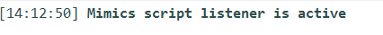


Once the work with the external IDE is complete you can then toggle the listener off which will close the connection between the IDE and Mimics. This will produce a logger message shown in the log panel “Mimics script listener is stopped”.


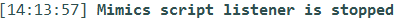


---

# 3. Get autocomplete in external IDEs


To get autocomplete functionality similar to the one of Mimics console and editor to external editors you can follow the steps below depending on the Python interpreter that you use to script.


**Step 1**:
A .whl file is included in the installer of Mimics. This file is located in the installation directory: `\..\..\Materialise\Mimics Medical 21.0\Help\API`. Locate the file and copy the full path to it.


**Step 2**:
Run the Windows Command Line (CMD) as Administrator


-If you are using the Python 3.5.2 interpreter that is included in the installer of Mimics to script in your external editors, you can follow the next steps:


**Step 3**:
Change the directory to the location of the preinstalled Mimics interpreter e.g: `C:\Program Files\Common Files\Materialise\Python\3.5.2`. To change your directory:


```bash
cd "C:\Program Files\Common Files\Materialise\Python\3.5.2"

```


**Step 4**:
To install the contents of the . whl file, execute the following command in the cmd session that is open:


```bash
python -m pip install <full path to the .whl file that is copied in Step 1>

```


-If you are using a complete installation of Python 3.5 (separately installed) as an interpreter in your external editor, see the instructions in Section 2.3 of this scripting guide. To get and install the contents of the .whl file you have to type the following in your Windows Command Line (CMD):


**Step 3**:


```bash
pip install <full path to the .whl file that is copied in Step 1>

```


**Note:** It is recommended to include the full path in ” ”.


The autocomplete functionality is now available in your external editor. Make sure that you use the correct interpreter in your external editor to get Mimics autocomplete.


**Known issues**


- Materialise does not guarantee the correct functionality of the API functions that are used as context managers. An example of a context manager is the `mimics.disabled_gui_update()`. Context managers allow you to allocate and release resources precisely when you want to. The most widely used example of context managers is the `with()` statement. While using Mimics with an External IDE you can use the equivalent code instead.


```python
try:
  # commands

except:

  # commands

finally:

  # commands

```


- Materialise does not guarantee the correct functionality of the returned type memoryview. For details about the functions that return the memoryview type see the documentation of Mimics API (e.g: method `get_voxel_buffer()` of the class `mimics.segment.Mask()`)


---

# 2. Installation guide for RPyC


To establish communication between Mimics and an external IDE the first step is to install the **RPyC** Python package.
If you choose to work with the built in Python interpreter, the package is already included in the installer and consequently the setup is ready.
In case you want to use a compatible Python interpreter of your preference then the RPyC package needs to be installed separately for this interpreter. For instructions on how to install an external Python package see the section 2.3 of the introduction section of this guide.


Once the package is installed successfully, you will need to configure your external IDE settings to work. In the following sections you can find  an examples of how to connect to a commonly used external IDE for script development. This however does NOT indicate any official support or endorsement in regards to it’s compatibility with Mimics.


---

# Eclipse & Pydev


To setup Eclipse to work via external IDE please follow the steps below:


1. Ensure you install 3-matic with scripting capabilities, and there is a **trimatic** package sub-folder in 3-matic’s installation folder.
2. Install rpyc and PyQt5 packages (refer:Section 3)
3. **Install Eclipse:**

- Install the latest Java runtime environment ( Windows x64 Offline)
[https://java.com/en/download/manual.jsp](https://java.com/en/download/manual.jsp)
- Install Eclipse IDE for Java Developers:
[https://www.eclipse.org/downloads/download.php?file=/oomph/epp/oxygen/R/eclipse-inst-win64.exe](https://www.eclipse.org/downloads/download.php?file=/oomph/epp/oxygen/R/eclipse-inst-win64.exe)
4. **Download PyDev Certificate**

- Instructions to install PyDev are in the following link:
http://www.pydev.org/manual_101_install.html
- Download the certificate:
[http://www.pydev.org/pydev_certificate.cer](http://www.pydev.org/pydev_certificate.cer)
- Copy the “pydev_certificate” to this location  C:\Program Files\Java\jre1.8.0_161
(Remark: the latter **161 number** depends on your JRE version)


- Ensure to run command prompt as an administrator (press the windows button, in search type cmd, right click cmd.exe -> run as administrator)
- Execute:
cd C:\Program Files\Java\jre1.8.0_161


(remark: **161 number** depends on version)


- Execute:
bin\keytool.exe -import -file pydev_certificate.cer -keystore


5. Install PyDev Certificate


- Launch Eclipse,
- Help -> Install new software
- **On the top right click on “Add…” and enter the site with**

       Name: “Pydev”
       Location: [http://www.pydev.org/updates](http://www.pydev.org/updates)


- Press OK and wait for Eclipse to get the information.
- Select the checkbox of PyDev
- Unselect “Contact all update sites during install to find required software”
- Press Next >. Press Next.
- During installation you may be prompted to select that you trust the installed certificate. Accept this.
- Restart the application before proceeding to the next step
6. Add Python Interpreter


- Launch Eclipse,
- **Window > Preferences > PyDev > Interpreters > Python Interpreter**


1. To select the Python interpreter for the project


- Launch Eclipse,
- **File > New > Project > PyDev > PyDev Project : under “Interpreter”** , you selecte the Python interpreter previously configured.


1. Once a project is created, right click the project and access the properties.


- Select PyDev - PYTHONPATH
- Tab : External Libraries.
- Add a source folder and browse to the folder where 3-matic is installed: C:\Program Files\Materialise\3-matic Research 13.0(x64)Beta.


Disclaimer: All external IDEs mentioned in this chapter are property of their respective owners.


---

# 5. JetBrains PyCharm and Mimics


In this section the main steps that you need to follow to ensure the correct communication between Mimics and an external IDE are demonstrated. PyCharm will be used as an example but the steps are common for others. For more details about the setup of each IDE please see the documentation that is provided together with the IDE of your preference.


For PyCharm, follow the next steps:


1. Install RPyC package if you use a Python interpreter of your preference. This package is already installed for the built-in Python interpreter. For details see the section 2 of the External IDE.
2. Install the latest version of PyCharm Community


[https://www.jetbrains.com/pycharm/download/#section=windows](https://www.jetbrains.com/pycharm/download/#section=windows)
3. Launch PyCharm, click on **File** -> **Settings**. Expand the section “Project :” and make sure that the desired interpreter is selected in the subsection “Project Interpreter”.
4. Restart or force refresh PyCharm. Activate “Toggle Script Listener” in Mimics. Ensure that you start your script with “import mimics” and you can now run and debug your python scripts from PyCharm.


Disclaimer: All external IDEs mentioned in this section of the scripting guide are property of their respective owners.


---

# Microsoft Visual Studio - PTVS


To setup Microsoft Visual Studio to work via external IDE please follow the steps below:


1. Ensure you install 3-matic with scripting capabilities, and there is a **trimatic** package sub-folder in 3-matic’s installation folder.
2. Install rpyc and PyQt5 packages (refer:Section 3)
3. Launch Visual Studios and install Python Tools for Visual Studio (PTVS). This is readily available for Visual Studio 2015 onwards; for Visual Studio 2013 and older please download and install PTVS manually.


- Click on **Solution Explorer** –> **File** –> **New** –> **Project**
- Install Python Tools for Visual Studio (PVTS)


1. Click on **Solution Explorer** –> **File** –> **New** –> **Project** and select Python Application.


1. The next step is to set up the python environment. This can be accomplished by clicking **Tools** –> **Options** –> **Python Tools** –> **Environment Options**. Add a new environment by setting the path to the python.exe. This location should reflect the python to which the packages rpyc and PyQt5 have been installed.


1. Click on **Solution Explorer**, and right-click on **Search Paths**, and select **Add Folder to Search Path...**
2. Browse to the location where 3-matic is installed and click **Select Folder**. For example “C:\Program Files\Materialise\3-matic Research 13.0 (x64) Beta”
3. It is recommended that you relaunch the application


Disclaimer: All external IDEs mentioned in this chapter are property of their respective owners.


---

# 1. Automatic import of DICOM images


Using the Mimics API, the user can automate the import of DICOM images. As input, we assume there is a directory containing DICOM images (this could be a single study, or multiple studies). By using `mimics.file.import_dicom_images()` with the default parameters, the DICOM files are imported.


```python
input_dir=r"C:\MedData\DemoFiles\DICOM_Airway"
mimics.dialogs.set_predefined_answer("ChangeOrientation", "default")
mimics.file.import_dicom_images(source_folder=input_dir)

```


By default, upon opening the project Mimics will display a dialog box asking for confirmation of the orientation of the images. If desired, this dialog can be suppressed by setting a predefined answer for it.


The last step is to anonymize the active image set in Mimics. Use `mimics.file.anonymize_project()` to anonymize the project.


```python
mimics.file.anonymize_active_image()

```


---

# 2. Semi-automatic import of standard images


The user can automate the import of Bitmap or JPEG images. As input, we assume there is a directory containing all images.
The scan resolution in x, y, and z dimensions is required as input to ensure correct dimensions of the volumes and 3D objects. This information is typically provided by the radiologist who performed the scan. Use `mimics.file.import_standard_images()` with the parameters mentioned above.


```python
      input_dir=r"C:\MedData\DemoFiles\BMP_Leg"
mimics.dialogs.set_predefined_answer(mimics.dialogs.dialog_id.CHANGE_ORIENTATION, "RAB")
mimics.file.import_standard_images(source_folder=input_dir,xy_resolution=1,z_resolution=1,patient_name="MimMat")

```


By default, Mimics will display a dialog box asking for confirmation of the orientation of the images. If desired, this dialog can be suppressed by setting a predefined answer for it. For instance, we could select the orientation RAB as mentioned above. By default the `mimics.file.import_standard_images()` will open Mimics and show the images. Note that the Mimics project is not saved.


---

# 3. Skull segmentation


In this tutorial some basic segmentation features of Mimics are presented using the project Mimi.mcs, as available in `C:\MedData\DemoFiles`. The first step is to open the project using `mimics.file.open_project()`. All the previously open projects will be closed.


```python
      # Open the project
      input_dir = r'C:\MedData\DemoFiles\Mimi.mcs'
mimics.file.open_project(input_dir)

```


To perform thresholding, an empty mask is created first using `mimics.segment.create_mask()` and is renamed to *Bone*.


```python
# Create an empty mask
mask_a = mimics.segment.create_mask()
mask_a.name = "Bone"

```


The next step is to perform Thresholding with `mimics.segment.thresholding()` and save the result in the mask *Bone* that is previously created. The minimum and the maximum threshold values need to be supplied as input. Note that the Mimics Python API currently always uses gray values (not Hounsfield units).


```python
# Perform thresholding with selected min and max values
mimics.segment.threshold(mask=mask_a,threshold_min=1250,threshold_max=2800) # thresholds are set in gray values

```


The next step is to perform Region Growing. First a new point is created on the anatomical part that will be the input for the Region Growing operation. In the below example, a new mask is created and the original mask is preserved. The new mask is renamed to *Segmented Skull*. Next, the point is deleted since it was needed only for the Region Growing operation. In case you don’t have a license for the Analyze module, a mimics.Point object cannot be created. In this case it is recommended to use `mimics.segment.activate_region_grow()` instead of the `mimics.segment.region_grow()` API.


```python
# Create a point that will be used fot the region growing operation
point_1 = mimics.analyze.indicate_point(title="Region growing point",message= "Please indicate a point on the part of interest")
point_2 = point_1.coordinates
point_2 = tuple(point_2)
# Region growing. The original mask is preserved
mask_b = mimics.segment.region_grow(point=point_2,input_mask=mask_a,target_mask=None,slice_type="Axial",keep_original_mask=True)
mask_b.name = "Segmented skull"

```


Calculation of the 3D part and exporting it as STL is the following step. Using `mimics.segment.calculate_part()` and  `mimics.file.export_stl()` the part is calculated with the given quality and afterwards exported as an STL. The name and location where it will be saved should be specified.


```python
#Calculation of the 3D part
part_a = mimics.segment.calculate_part(mask=mimics.data.masks.find("Segmented skull"),quality="High")
# Export the STL
mimics.file.export_part(object_to_convert=part_a,file_name=r"C:\MedData\skull_of_Mimi.stl")

```


The final step for this tutorial is to save the project and exit Mimics


```python
# Save the project and exit
mimics.file.save_project()
mimics.file.exit()

```


---

# 4. Femur segmentation


In this tutorial basic operations to the lower limb are illustrated. The right femur and the pelvis are segmented and basic operations are performed to the masks and the 3D parts.


First, the project Hip.mcs is opened from `C:\MedData\DemoFiles` and thresholding is performed. (More basic explanation on segmentation functionality can be found in the tutorial on Skull segmentation.).


```python
# Open the project
mimics.file.open_project(r'C:\MedData\DemoFiles\Hip.mcs')
 # Create an empty mask
mask_a = mimics.segment.create_mask()
mask_a.name = "Lower limb"
# Perform thresholding with selected min and max values
mimics.segment.threshold(mask=mask_a,threshold_min=1250,threshold_max=2650) # thresholds are set in gray values

```


To fill holes in the active mask, use `mimics.segment.fill_holes()`.


```python
#Fill holes in the segmentation mask
mimics.segment.fill_holes(mask_a)

```


The next step is to perform Region Growing and segment the right femur. (Basic explanation on Region Growing can be found in the tutorial on Skull segmentation.)


```python
# Create a point that will be used fot the region growing operation
point_1 = mimics.analyze.indicate_point(title="Region growing point",message= "Please indicate a point on the part of interest")
# Region growing. The original mask is preserved
mask_b = mimics.segment.region_grow(point=point_1,input_mask=mask_a,target_mask=None,slice_type="Axial",keep_original_mask=True)
#mimics.data.points.delete(point_1)
mask_b.name = "Segmented right femur"

```


The segmented right femur mask is renamed to *Segmented right femur*. In case pelvis and left femur need to be obtained in a separate mask, the Boolean Operation *Minus* can be performed. A new mask is created and is then renamed to *Pelvis and left femur*.


```python
# Perform the boolean operation ""Minus"" to take the anatomy of interest".
mask_c = mimics.segment.boolean_operations(mask_a=mimics.data.masks.find("Lower limb"), mask_b=mimics.data.masks.find("Segmented right femur"), operation="Minus")
mask_c.name ="Pelvis and left femur"

```


The final step is to smooth the parts, export them to STL files, save the project and exit Mimics. For the smoothing operation, a smoothing factor of 0.6 is selected and the original parts are preserved.


```python
#Calculation of the 3D parts
part_a = mimics.segment.calculate_part(mask=mimics.data.masks.find("Segmented right femur"),quality="High")
part_b = mimics.segment.calculate_part(mask=mimics.data.masks.find("Pelvis and left femur"),quality="High")
# Smooth 3D parts
objects = mimics.data.parts
for part in objects:
    part.visible = False
    smoothed_part = mimics.tools.smooth(object_to_smooth=part,smooth_factor=0.6,keep_originals=True)
    smoothed_part.visible = True
    # Export the STL
    mimics.file.export_part(object_to_convert=smoothed_part,file_name="C:\MedData\\" + smoothed_part.name + ".stl")
# Save the project and exit
mimics.file.save_project()
mimics.file.exit()

```


---

# 5. Landmarks and measurements in the shoulder


In this tutorial some basic segmentation, landmarking and measurements operations are illustrated on the project Shoulder.mcs from `C:\MedData\DemoFiles`. The first step is to open the project and perform thresholding, region growing  and calculation of the 3D part. (More explanation on those steps can be found in the tutorials on Skull segmentation and Femur segmentation.)


```python
# Open the project
mimics.file.open_project(r'C:\MedData\DemoFiles\Shoulder.mcs')
 # Create an empty mask
mask_a = mimics.segment.create_mask()
# Perform thresholding with selected min and max values
mimics.segment.threshold(mask=mask_a,threshold_min=1250,threshold_max=2800) # thresholds are set in gray values
mask_a.name = "Shoulder"
# Create a point that will be used fot the region growing operation
point_1 = mimics.analyze.indicate_point(title="Region growing point",message= "Please indicate a point on the part of interest")
# Region growing. The original mask is preserved
mask_b = mimics.segment.region_grow(point=point_1,input_mask=mask_a,target_mask=None,slice_type="Axial",keep_original_mask=True)
mimics.data.points.delete(point_1)
mask_b.name = "Segmented shoulder"
#Calculation of the 3D part
part = mimics.segment.calculate_part(mask=mimics.data.masks.find("Segmented shoulder"),quality="High")

```


The next step is to indicate the landmarks in the area of interest on the shoulder. Two points are selected on the scapula and one point on the humerus. Using  `mimics.analyze.indicate_point()` the user can indicate the points in the place of interest. In this tutorial the points on the scapula are indicated first and the point on the humerus follows.


```python
# Set the anatomical landmarks of the shoulder
anatomical_landmarks = ["Acromion","Coracoid process","Humerus"]
for point in anatomical_landmarks:
    p = mimics.analyze.indicate_point(title=point,message= "Please indicate a point on the {}".format(point))
    p.name = point

```


The following step is to calculate the distance between the points on the scapula and the point on the humerus. For each distance to be measured, the points in the data container are found, the measurement is created using `mimics.measure.create_distance()` and is renamed.


```python
# Create distance measurement between coracoid & acromion and humerus
m = mimics.measure.create_distance_measurement(point1=mimics.data.points.find("Acromion").coordinates,point2=mimics.data.points.find("Humerus").coordinates)
m.name = "Acromion-Humerus"
m = mimics.measure.create_distance_measurement(point1=mimics.data.points.find("Coracoid process").coordinates,point2=mimics.data.points.find("Humerus").coordinates)
m.name = "Coracoid process-Humerus"

```


Finally, the angle defined by those 3 landmarks (with the point on the Humerus as centerpoint of the angle) is calculated using `mimics.measure.create_angle()`. The final step is to save the project and exit Mimics.


```python
# Create Angle measurement between  the three landmarks in the shoulder area
mimics.measure.create_angle_measurement(point1=mimics.data.points.find("Acromion").coordinates,point2=mimics.data.points.find("Humerus").coordinates,point3=mimics.data.points.find("Coracoid process").coordinates)
# Save the project and exit
mimics.file.save_project()
mimics.file.exit()

```


---

# 6. Preparation for fluoroscopy


Using the Mimics API you can control a set of functionalities that are contained in the view module of Mimics. This tutorial shows how to control the visibility of different objects in the project, how to activate/deactivate the 3D Mask preview in the 3D viewport, and how to prepare your project for fluoroscopy simulation.


For this tutorial the Mimics project Heart.mcs from `C:\MedData\DemoFiles` will be used. As a first a step, the project is opened in Mimics.


```python
# Open Heart.mcs project
input_dir=r'C:\MedData\DemoFiles\Heart.mcs'
mimics.file.open_project(input_dir)

```


The project by default contains masks and 3D parts for the following anatomies: LA, LV and Aorta. The following piece the code shows the hidden masks and selects all the masks.


```python
# Show and select the masks
for m in mimics.data.masks:
    if not m.visible:
        m.visible = True
    m.selected = True

```


The parts that are already present are deleted in the following step. Immediately afterwards the Mask 3D Preview is activated and you can inspect the result of the segmentation.


```python
# Delete the parts
for p in mimics.data.parts:
    mimics.data.parts.delete(p)

# Activate 3D preview
mimics.view.enable_mask_3d_preview()
mimics.dialogs.question_box(message="Please inspect the heart segmentation",buttons='OK')

```


The following step calculates parts for each of the segmentation masks. All the changes after the manual editing of the masks will be applied in the parts. All the parts are calculated with Optimal quality and they are set to visible. Additionally the Mask 3D Preview is disabled.


```python
# Create 3D parts
for m in mimics.data.masks:
    p = mimics.segment.calculate_part(mask=m, quality='Optimal')
      p.name = m.name
    p.visible = True

# Step: Disable 3D preview
mimics.view.disable_mask_3d_preview()

```


The following step is the preparation for fluoroscopy simulation. The objects that will be visualised in simulation are prepared with custom contrast. A fluoroscopy view is also created.


```python
# Preparation for fluoroscopy
visualised_objects = []
contrast = 0.7
for p in mimics.data.parts:
    visualised_objects.append((p,contrast))
# Activate fluoroscopy
f = mimics.view.create_fluoroscopy_view_default()

```


The final step is to activate the fluoroscopy simulation and apply all the setting that are defined in the preparation step above. For the simulation, High quality is selected.


```python
# Activate simulation
sim_quality = "High"
f.simulate(objects_contrast=visualised_objects, quality=sim_quality)

```


---

# 7. CT Heart landmarking and segmentation


Note: To run the following tutorial the NumPy library should be installed. To install external Python libraries, see the Section 2.3 of the Introduction.


For this tutorial the Mimics project Heart.mcs from `C:\MedData\DemoFiles` will be used.


The tutorial shows how to prepare for applying the CT heart segmentation tool. A series of function calls is created and controls the script. One function is created for each operation that will be performed. The main operations are thresholding, landmarking, calculation of CT heart segmentation masks and calculation of 3D parts. Appropriate naming is used for the respective functions.


```python
# Main part of code that controls the script
# Open Heart.mcs project
input_dir = r'C:\MedData\DemoFiles\Heart.mcs'
mimics.file.open_project(input_dir)
# Function for the thresholding
activate_thresholding()
for l in LANDMARKS:
      # Function for the landmarking
      indicate_landmark(LANDMARKS.index(l))
# Function for the ct heart
calc_ct_heart()
#Function for the creation of the 3d parts
create_3d_parts()

```


On the top of the script the required libraries must be imported and the required constants must be declared.


```python
      # Import the numpy library that is useful for some operations
try:
    import numpy as np
except ImportError as ie:
    print("================================================================")
    print("=== The 3rd party Python package 'numpy' is not installed! ===")
    print("=== To install it, use 'pip install numpy' in your cmd!    ===")
    print("================================================================")
    raise
      # Define a shortcut
      md = mimics.data
      # Constants declaration
      MASK = "Threshold"
      LANDMARKS = ("RA", "RA",
                   "LA", "LA",
                   "LV", "LV",
                   "RV", "RV",
                   "Aorta", "Aorta",
                   "Pulmonary Artery", "Pulmonary Artery",
                   )
      SEED_RADIUS = dict(RA=10.0,
                         LA=10.0,
                         LV=10.0,
                         RV=10.0,
                         Aorta=8.0,
                         Pulmonary=8.0,
                        )

      SEED_COLOR = dict(RA=(0, 255, 255),
                        LA=(255, 0, 255),
                        LV=(255, 205, 205),
                        RV=(145, 112, 255),
                        Aorta=(255, 0, 0),
                        Pulmonary=(0, 0, 255),
                        )

      MASKS = ("RA", "LA", "LV", "RV", "Aorta", "Pulmonary Artery")

```


The first function that is called after opening the Heart.mcs project is activate_thresholding(). This launches the thresholding tool where you can select the desired thresholds and modify the crop box. Furthermore the newly created mask is renamed.


```python
def activate_thresholding():
    m = mimics.segment.activate_thresholding()
    m.name  = MASK
    return

```


After the thresholding, there is a *for* loop that calls the function indicate_landmark() for each landmark, as they are declared in the constants. During each call of this function, the user clicks and select the position of the landmark. The indicator of the intersection lines navigates to the location of the selected coordinates and finally a sphere is selected in that position. The name, the radius and the color of each sphere is defined and controlled by the constants that are defined in the top of the script.  See the indicate_landmark() function below.


```python
def indicate_landmark(pid: int):
    pdef = LANDMARKS[pid]
    name = pdef
    try:
        coords = mimics.indicate_coordinate(message="Indicate {} ".format(pdef),confirm=False, show_message_box=True)
    except InterruptedError:
        return False

    mimics.view.navigate_to(coords)
    pnt = mimics.analyze.create_sphere_center_radius(coords, SEED_RADIUS[pdef.split()[0]])
    pnt.name = pdef
    pnt.color = tuple(np.array(SEED_COLOR[pdef.split()[0]]) / 255)
    return

```


The following function that is called is the calc_ct_heart() that performs the segmentation of the different anatomical parts of the heart. After the segmentation masks are created, the colors of the spheres are assigned to the masks respectively. For the calc_ct_heart() function see the code below.


```python
def calc_ct_heart():
    thres = md.masks.find(MASK)
    seeds = []
    for p in md.spheres:
       if p.name in LANDMARKS:
           seeds.append(p)
    mimics.segment.calculate_ct_heart_from_mask(thres, seed_points=seeds)
    for p in md.masks:
       if p.name in MASKS:
                 p.color = tuple(np.array(SEED_COLOR[p.name.split()[0]])/255)
    return

```


The last function that is called is the create_3d_parts(). This function creates parts from the masks that are the result of the segmentation and assigns the correct name to them.


```python
def create_3d_parts():
      for p in md.masks:
            if p.name in LANDMARKS:
                  par = mimics.segment.calculate_part(p,"Medium")
                  par.name = p.name
      return

```


To summarize, the sequence of the functions that is presented performs the required actions to segment the anatomy from a CT heart dataset. Masks and 3D parts with correct naming and color are created as output.


---

# 8. Access to Part Triangles and Points


Note: To run the following tutorial the NumPy library should be installed. To install external Python libraries, see the Section 2.3 of the Introduction.


The Mimics API also supports low-level data access to images, masks and 3D parts (or STLs). This tutorial shows how to access the nodes (points) and triangles of a part. The Mimics project Heart.mcs from `C:\MedData\DemoFiles` will be used. As a first a  step, the project will be loaded in Mimics.


```python
      # Import the required libraries
try:
    import numpy as np  # First need to install numpy package for Python. Type pip install numpy in your cmd
except ImportError as ie:
    print("================================================================")
    print("=== The 3rd party Python package 'numpy' is not installed! ===")
    print("=== To install it, use 'pip install numpy' in your cmd!    ===")
    print("================================================================")
    raise
      # Open Heart.mcs project
      input_dir=r'C:\MedData\DemoFiles\Heart.mcs'
      mimics.file.open_project(input_dir)

```


Next, get the relevant part.


```python
# Get the LV part
p = mimics.data.parts.find("LV")

```


To access the nodes and triangles of this part and read them as NumPy arrays, see the code below.


```python
if p is not None:
# Get a copy of nodes and triangles
        nodes,triangles = p.get_triangles()
# Read them with numpy
        nodes = np.asarray(nodes)
        print(len(nodes))
        triangles = np.asarray(triangles)

```


Next we try to find the node that has the biggest distance from the origin of the World Coordinate System (WCS).


```python
# Find the node that is the furthest from the WCS origin
        mx = []
        for m in nodes:
                mx.append(np.linalg.norm(m))
        i_mx = mx.index(max(mx))

```


In the following step the closest node to the WCS is calculated.


```python
# Find the node that is the closest to the WCS
        mn = []
        for m in nodes:
                mn.append(np.linalg.norm(m))
        i_mn = mn.index(min(mn))

```


As a last step the distance between those two nodes (points) will be calculated.


```python
# Calculate the distance
        d = mimics.measure.create_distance_measurement(list(nodes[i_mx]),list(nodes[i_mn]))
else:
        print("The part LV could not be found.")

```


---

# 9. Switch between Mimics and 3-matic


Many workflows require the use of multiple tools from Mimics and 3-matic. With scripting is possible to automate such workflows and use tools from both software packages. This tutorial shows how to continue the workflow in 3-matic while working in Mimics. The results of 3-matic are returned to Mimics and the script continues in Mimics. You can have the scripts of 3-matic and Mimics in different *.py files or in the same file. For this tutorial a single-file script approach is selected. The Mimics project Heart.mcs from `C:\MedData\DemoFiles` is used. 3-matic is used for some advanced operations that are not available in Mimics, consequently there is no 3-matic project loaded.


Since there is only one script used that contains both Mimics and 3-matic part, as a first step we need to check in which software the script runs:


```python
# One script is used for both Mimics and 3-matic.
# For that reason we have to check if we are in Mimics or in 3-matic
try:
    import trimatic
except:
    in_3matic = False
else:
    in_3matic = True
SHARED_OBJ = "Union"

```


Next, the Mimics part is presented. The selected Mimics project is opened and the masks of interest (LA, LV and Aorta) are located.


```python
#If True we are in Mimics
if not in_3matic:
    # import required modules
    import os
    import subprocess
    # Open Heart.mcs Mimics project
    path = r"C:\MedData\DemoFiles\Heart.mcs"
    mimics.file.open_project(path)
    # Find the masks of interest
    masks_names = ["LA","LV", "Aorta"]
    masks = []
    for m in masks_names:
        mask = mimics.data.masks.find(m)
        if mask:
            print("Mask "+ m +" is present.")
            masks.append(mask)

```


In the next step the masks are united to one, using boolean operations, and the Part of the union is created. The Part is exported as STL in the directory where the *.py file of the script is located (use of the special purpose attribute __file__). Furthermore a *.txt file is created where basic log functionality is kept. This *.txt file is also used to transfer required information between Mimics and 3-matic.


```python
# Unite masks
if len(masks) == 3:
    un1 = mimics.segment.boolean_operations(masks[0],masks[1],"Unite")
    union = mimics.segment.boolean_operations(un1,masks[2],"Unite")
    union.name  = SHARED_OBJ
    # Create the Part of the Union mask
    union_part = mimics.segment.calculate_part(union)
    union_part.name = SHARED_OBJ
    #Export the Union Part in the location of the script
    root_path_of_script = os.path.split(os.path.abspath(__file__))[0]
    path_of_stl = os.path.join(root_path_of_script,union_part.name + ".stl")
    mimics.file.export_part(union_part,path_of_stl)
    with open(os.path.join(os.path.split(__file__)[0],"my_temp.txt"),"w") as f:
        f.write(path_of_stl)
        f.write("File is created!\n")

```


As it is mentioned in the introduction of this tutorial, 3-matic is launched from the Mimics part of the script. To achieve this, a built-in Python module called subprocess is used. This module is used in general to activate new processes, connect to their input, output and error pipes and obtain their return codes. In this tutorial the Popen constructor of the subprocess module is used. Please note that this is not the only way to perform the following step. After 3-matic is launched, the script that runs in Mimics will wait until the activated subprocess of 3-matic returns it’s result code.


```python
#Prepare to run 3-matic
trimatic = mimics.file.get_path_to_3matic()
command = trimatic
args = ("-run_script", __file__, path_of_stl,f.name)
process = subprocess.Popen((command,) + args, shell=False, stdout=subprocess.PIPE)
process.wait()

```


When the child 3-matic subprocess ends, then the Mimics script will continue. The script reads from the *.txt file the paths of two STL files that are exported from 3-matic (see below for the scripting part of 3-matic) and it loads them to Mimics. Additionally the *.txt file that is used for information transfer purposes, is deleted.


```python
    with open(f.name,"r")as f:
        lines = f.readlines()
    os.remove(f.name)
    for i in range(2):
        mimics.file.import_stl(lines[i+1].strip())
else:
    print("Please check if a mask is missing! Three masks are required.")

```


This it the end of the Mimics part of the script. The 3-matic part follows. The first step is to read the arguments that are passed from Mimics to 3-matic through the subprocess. The arguments are the path of the exported STL file (Union.stl) and the full path of the *.txt file. Next, a plane is fitted to the imported part (Union) and it is used to cut the part. As a result, two parts are created that are exported in the directory of the *.py file. The full path of the exported parts is written in the *.txt file. Those paths are read from Mimics to import the STLs in Mimics as it is explained above.


```python
#If True we are in 3-matic
else:
    import sys
    path_of_stl = sys.argv[1]
    f = sys.argv[2]
    trimatic.import_part_stl(path_of_stl)
    part = trimatic.find_parts(SHARED_OBJ)
    if part:
        plane = trimatic.create_plane_fit(part[0])
        cut_parts = trimatic.cut(part[0],plane)
        exp = trimatic.export_stl_ascii(cut_parts,os.path.split(os.path.abspath(__file__))[0])
        with open(f,"a") as f:
            f.write(exp[0]+"\n")
            f.write(exp[1])
        print("To continue please close 3-matic!")

```


Please note that you have to close 3-matic after it finishes the operations to terminate the subprocess and continue.


---

# 10. Working with Metadata


Many workflows require the use of multiple tools from Mimics and 3-matic and the transfer of data between both products. With scripting it is possible to automate such workflows and use tools from both software packages. This tutorial shows how to continue the workflow in 3-matic while working in Mimics. Emphasis is put to the metadata that are attached to objects in Mimics and they are kept in 3-matic. More metadata are added in 3-matic. For this tutorial a single-file script approach is selected. The Mimics project Heart.mcs from `C:\MedData\DemoFiles` is used. An empty 3-matic project is used and the Mimics project is imported.


As a first step the required Python libraries are imported and the metadata templates that will be used in Mimics and 3-matic are defined. The template of Mimics contains information about the patient and the study and additionally a field for notes. The template of 3-matic is used to keep record of the processing of the parts. The templates are filled in with information from a non existing patient used for this tutorial.


```python
# import required modules
from collections import OrderedDict as od
import os
import sys
import subprocess
TEMPLATE = od([
            ("Patient" , ""),
            ("Study" , ""),
            ("Notes","")
            ])
TEMPLATE_3_MATIC = od([
            ("Processed" , "False")
            ])
################################
PATIENT_A = od([
            ("Patient" , "Mat patient"),
            ("Study" , "CT Heart scan"),
            ("Notes","")
            ])
################################
MIMICS_FILE_PATH = r"C:\MedData\DemoFiles"
MIMICS_FILE_NAME = "Heart.mcs"
PARTS_OF_INTEREST = ["LA", "LV", "Aorta"]
################################

```


Since there is a single script approach used that contains both Mimics and 3-matic part, as a first step we need to check in which software the script runs:


```python
# One script is used for this tutorial for both Mimics and 3-matic.
# For that reason we have to check if we are in Mimics or in 3-matic
in_mimics = False
try:
    import mimics
    if mimics.get_version():
        in_mimics = True
except:
    pass

```


Next, the Mimics part is presented. The selected Mimics project is opened and all the potentially existing metadata linked to part will be deleted. In this tutorial we are interested in the parts LA, LV and Aorta that exist in the loaded Mimics project. Those parts are grouped in a list so they can be easily used later.


```python
if in_mimics:
    parts = []
    # Open Mimics project
    mimics.file.open_project(os.path.join(MIMICS_FILE_PATH, MIMICS_FILE_NAME))
    # For this exercise we will remove all the metadata from the Mimics project
    for p in mimics.data.parts:
        for md in p.metadata:
            p.metadata.delete(md.name)
    # Group the required parts
    mdp = mimics.data.parts
    for p in PARTS_OF_INTEREST:
        parts.append(mdp[p])

```


In the next step the template of the metadata that is defined in the beginning of this script is attached to all the parts that are listed above. Additionally the template is filled with  patient information that is provided in the beginning of the script.


```python
# Assign the template as metadata to all the parts of interest
l = list(TEMPLATE.items())
for p in parts:
    for i in range(len(TEMPLATE)):
        p.metadata.create(l[i][0],l[i][1])
# Fill the metadata template
patient_a = list(PATIENT_A.items())
for p in parts:
    for i in range(len(PATIENT_A)):
        p.metadata[l[i][0]].value = patient_a[i][1]

```


Slightly before switching to 3-matic the Mimics project is saved. As it is mentioned in the introduction of this tutorial, 3-matic is launched from the Mimics part of the script. To achieve this, a built-in Python module called subprocess is used. This module is used in general to activate new processes, connect to their input, output and error pipes and obtain their return codes. In this tutorial the Popen constructor of the subprocess module is used.


```python
# Save Mimics project
mimics.file.save_project()
#Prepare to run 3-matic
trimatic = mimics.file.get_path_to_3matic()
command = trimatic
args = ("-run_script", __file__)
process = subprocess.Popen((command,) + args, shell=False, stdout=subprocess.PIPE)

```


This it the end of the Mimics part of the script. The 3-matic part follows. The first step is to import the Mimics project. Similar to what happened to Mimics, the parts of interest are grouped for further use.


```python
else:
    parts = []

    trimatic.import_project(os.path.join(MIMICS_FILE_PATH, MIMICS_FILE_NAME))
    # Group the required parts
    tp = trimatic.get_parts()
    for p in tp:
        if p.name in PARTS_OF_INTEREST:
            parts.append(p)

```


As a next step, the metadata template that will be used in 3-matic will be attached to the Parts imported in 3-matic. After that, all the parts will be smoothed. The metadata will be preserved during the smoothing operation.


```python
# Assign the template as metadata elements to all the parts of interest
l3m = list(TEMPLATE_3_MATIC.items())
for p in parts:
    for i in range(len(TEMPLATE_3_MATIC)):
        mdata = p.get_metadata()
        mdata.create(l3m[i][0],l3m[i][1])
# Smooth all the imported parts
trimatic.smooth(entities = parts)

```


As a last step the metadata of the Parts in 3-matic will be updated. More specifically the section Notes that was added via the Mimics template and the section Processed that was added in 3-matic will be filled.


```python
# Add the info that the parts are smoothed and processed
l = list(TEMPLATE.items())
for p in parts:
    mdata = p.get_metadata()
    notes = mdata.find(l[2][0],l[2][1])
    if notes:
        notes.value = "Part is smoothed with default values"
    processed = mdata.find(l3m[0][0],l3m[0][1])
    if processed:
        processed.value = "True"

```


---

# 11. 4D heart cineloop in parts


The heart is a moving tissue and often one image set is produced for each phase of the cardiac cycle. To visualise the motion of the heart in the 2D slices you can use the Cineloop tool of Mimics. You can access it via View menu -> Cineloop.


This script will help you to create the cineloop for the Parts that correspond to the segmentated anatomy of the different phases of the cardiac cycle.


Before you start the script you need to segment the phases of the cardiac cycle and create parts out of the masks. Make sure that you name the parts that represent the same anatomy with the same name. For example the part that represents the Aorta in all the phases should have the same name everywhere in order to be taken into account from the script. In case you want to run the script immediately after the segmentation (only the masks are present) set the CALCULATE_PARTS_FROM_MASKS variable to True. This action will create automatically the Parts from the Masks and will link them in the respective image sets. Additionally, correct names and colors will be set. After you get the Parts calculated, save the project and set the CALCULATE_PARTS_FROM_MASKS to False. Afterwards you can create the video again from different viewing angles of your choice without calculating again the Parts from the Masks.


The output of this script is a video that shows the motion of the heart accross the cardiac cycle in a specific angle of your choice.


**Before you run the script:**


- Segment the image sets that you want to be visualised the 4D Parts Cineloop.
- Make sure that you have installed the required packages to run this script. To create the video a special Python package, Open CV, is required. You can find more information about the package in the following link:
[https://pypi.org/project/opencv-python/](https://pypi.org/project/opencv-python/)


For instructions on how to install a Python package, please refer to Section 2.3 of the Introduction of this guide.


- Check the configuration part of the script below and modify if needed the parameters:


```python
# Here is the configuration area of the script.
# List the names of the anatomy of the Left Heart that you want to visualise in the video.
# In the provided script it is assumed that Left Atrium is LA, Left Ventricle is LV and Aorta is Aorta
LEFT_HEART = ["LA", "LV", "Aorta"]
# List the names of the anatomy of the Right Heart that you want to visualise in the video.
# In the provided script it is assumed that Right Atrium is RA, Right Ventricle is RV and Pulmonary Artery is PA
RIGHT_HEART = ["RA", "RV", "PA"]
# Here you select with part of the heart to visualise in the video.
HEART = LEFT_HEART + RIGHT_HEART
# The name (prefix) of the folder where the screenshots and the video will be saved. The suffix of the folder is the
# name of the Mimics file from where you run the script.
TARGET_FOLDER_NAME = "Output"
# Name of the file of the output video
VIDEO_NAME = "Cineloop_in_parts"
#Frames per second of the video. You can change this value to make the heart beating faster or slower.
FRAMES = 12
# If you want to visualise a logo in your video, the logo should be placed in the same folder as the script.
# If you do not want a logo to be visualised, just leave the script empty. Example: LOGO = ""
LOGO = "mat_logo.jpg"
# To calculate first the 3D Parts from the segmentation masks, set the value of the variable below to True.
# In case you have the Parts already calculated, you can leave it to False
CALCULATE_PARTS_FROM_MASKS = False

```


- Last action before running the script is to set up your 3D view since it is the view of the interest for this script. Visualise the parts that belong to one cardiac phase and position them in the 3D view in the way that you want to be visualised in the video. Mimics will apply the same visualisation position to all the parts that belong to different phases. You do not need to make visible a specific combination of parts before you run the script.
- As a last step you need to run the script and get the results. To run the script click on the Script menu -> Run Script. Select the file in your local directory and confirm your selection.


**Output of the script:**


The output of the scripts is:


- A folder where all the created files are stored. This folder is created in the same level as the script and it is named Output.
- The Output folder contains screenshots of the parts tht are visualised for each cardiac phase. Those screenshots are used to create the video.
- A log file where you can see details about which cardiac phases and which part are visualised in the video. This file is also stored in the level of the script.