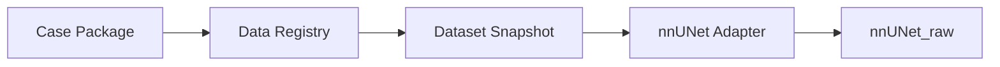

# Case Package 契约草案 v0.1

> 日期：2026-06-06  
> 状态：草案；用于标注工具和平台之间的离线文件交换  
> 关键原则：包内 label id 服务人工 review 和文件交换，不等同于 nnUNet 训练 label id。

## 1. 这个契约解决什么

早期平台不需要马上做统一服务。Case Package 用来支持这种现实场景：

- 标注在 Windows 本地完成。
- 训练在远程服务器完成。
- 标注工具可能是 Mimics，也可能是 3D Slicer 或其他工具。
- 人工和脚本需要通过文件夹交换数据。

Case Package 的目标是让每个病例包可以被复制、打开、修正、导回和校验。

## 2. 推荐目录结构

```text
case_package/
  manifest.json
  images/
    image.nii.gz
    dicom/
  labels/
    draft_label.nii.gz
    accepted_pseudo_label.nii.gz
    verified_label.nii.gz
    masks/
      liver.nii.gz
      gallbladder.nii.gz
  config/
    anatomy_vocabulary.yaml
    review_label_map.yaml
    task_label_maps.yaml
  reports/
    geometry_check.json
    review_report.json
  provenance/
    source_labels.json
    tool_export.json
```

不是每个文件都必须存在。最小包只需要图像、manifest、`anatomy_vocabulary.yaml`、`review_label_map.yaml`，以及一个标签输入或空标签入口。训练用的 `task_label_maps.yaml` 可以随任务快照生成，也可以在包里引用。

## 3. 三种 label map

为了避免后续混乱，Case Package 里明确区分三种 map。

| 名称 | 用途 | 是否用于 nnUNet 训练 |
| --- | --- | --- |
| `anatomy_vocabulary.yaml` | 统一器官名称 | 间接使用 |
| `review_label_map.yaml` | 标注工具或多标签 review 文件中的 label id | 否 |
| `task_label_maps.yaml` | 各训练任务的 label id | 是 |

示例：

```yaml
anatomy_vocabulary:
  liver:
    display_name: Liver
  gallbladder:
    display_name: Gallbladder

review_label_map:
  label_file: labels/draft_label.nii.gz
  labels:
    liver: 10
    gallbladder: 11

task_label_maps:
  CT5_Liver:
    labels:
      background: 0
      gallbladder: 1
      liver: 2
```

同一个 `liver` 在 review 文件里可以是 10，在 `CT5_Liver` 训练任务里可以是 2，在全身合并 mask 里又可以是另一个编号。这不是冲突，而是不同层级的编号。

## 4. Manifest 必填信息

```json
{
  "package_id": "pkg_20260606_case001",
  "case_id": "case001",
  "created_at": "2026-06-06T10:00:00+08:00",
  "modality": "CT",
  "image": {
    "primary_path": "images/image.nii.gz",
    "dicom_path": "images/dicom",
    "sha256": "TO_BE_FILLED",
    "shape": [512, 512, 300],
    "spacing": [0.8, 0.8, 1.0],
    "orientation_note": "recorded by exporter"
  },
  "label_policy": {
    "default_trainable_status": ["verified_label"],
    "allow_accepted_pseudo": false
  },
  "review": {
    "tool": "mimics",
    "single_user_save_as_verified": true
  }
}
```

`shape`、`spacing` 和方向信息必须由导出脚本写入，导回时用于校验。

## 5. 标签状态

| 状态 | 文件示例 | 说明 | 默认训练准入 |
| --- | --- | --- | --- |
| `candidate_label` | `labels/candidate_label.nii.gz` | 模型或公开算法输出 | 否 |
| `draft_label` | `labels/draft_label.nii.gz` | 给人工修正的初始标签 | 否 |
| `accepted_pseudo_label` | `labels/accepted_pseudo_label.nii.gz` | 经策略接受的伪标签 | 由策略决定 |
| `verified_label` | `labels/verified_label.nii.gz` | 人工保存确认标签 | 是 |
| `rejected_label` | 可只记录在报告中 | 已判定不可用 | 否 |

第一阶段单人保存即可记为 `verified_label`。后续如果要双人审核，可以在 `review_report.json` 中增加 reviewer 和 arbitration 字段，不需要改变目录结构。

## 6. 导入标注工具

标注工具 Adapter 需要读取：

- `manifest.json`
- `images/image.nii.gz` 或 `images/dicom/`
- `labels/draft_label.nii.gz` 或 `labels/masks/*.nii.gz`
- `config/anatomy_vocabulary.yaml`
- `config/review_label_map.yaml`

Adapter 可以自由决定如何把平台标签转成工具内部对象。例如 Mimics 可能更适合逐器官 mask；3D Slicer 可能可以读取单个多标签 labelmap。平台不关心工具内部形式，只关心导回结果是否符合契约。

## 7. 导回平台

导回时至少产出：

```text
labels/verified_label.nii.gz
reports/geometry_check.json
reports/review_report.json
provenance/tool_export.json
```

如果工具只能导出逐器官 mask，可以先放入：

```text
labels/masks/
  liver.nii.gz
  gallbladder.nii.gz
```

再由平台合并为 `verified_label.nii.gz`。合并时必须使用 `review_label_map.yaml` 或新的导出 map，不允许按文件名顺序随意编号。

## 8. 校验规则

| 校验项 | 失败级别 | 说明 |
| --- | --- | --- |
| 图像文件 hash 与 manifest 不一致 | error | 包可能被改动或错配 |
| 导回标签 shape 不一致 | error | 不能入库 |
| spacing/origin/direction/affine 不一致 | error | 不能直接训练 |
| label id 不在 map 中 | error | 可能有工具导出残留标签 |
| 必需器官缺失 | warning 或 error | 由任务决定 |
| 只有 draft 没有 verified | warning | 不能作为人工确认标签入库 |

## 9. 与 nnUNet 的关系

nnUNet 不直接读取 Case Package。平台先把 Case Package 导回 Data Registry，再由 Dataset Snapshot 选择病例和标签，最后通过 nnUNet Adapter 导出当前训练管线需要的目录。



这能保证同一病例包可以服务多个训练任务，而不是被某个任务的 label id 永久绑定。

## 10. 共用配置的存储策略

### 10.1 问题

一个 Case Package 对应一个病例。但 `anatomy_vocabulary.yaml`、`review_label_map.yaml` 这类配置是跨病例通用的。如果每个病例包都存一份完整副本，会有冗余和版本不一致的风险。但在离线文件包阶段，又不能要求标注员联网访问中央配置。

### 10.2 分阶段策略

| 阶段 | 形态 | 共用配置存储方式 | 一致性保证 |
|------|------|-----------------|-----------|
| A. 文件包闭环（当前） | 离线文件夹 | 每个 Case Package 内复制一份完整副本 | `manifest.json` 记录配置文件的 SHA-256 hash，导回时校验 |
| B. 注册中心 + 快照（后期） | Data Registry + 在线查询 | 配置集中存储在 Registry 的 `shared/` 目录，病例记录引用路径而非副本 | Registry 作为唯一主本，包导出时按需打包 |

### 10.3 文件包阶段：自包含 + hash 校验

```text
case_package_case001/
  config/
    anatomy_vocabulary.yaml    ← 副本（与 case002、case003 内容相同）
    review_label_map.yaml      ← 副本（与 case002、case003 内容相同）
  manifest.json                ← 含各配置文件的 SHA-256

case_package_case002/
  config/
    anatomy_vocabulary.yaml    ← 同一个文件的副本
    review_label_map.yaml      ← 同一个文件的副本
  manifest.json
```

冗余是刻意接受的代价，换来的是：
- 标注员打开一个包，不需要联网找任何外部文件。
- 导回时通过 `manifest.json` 中的 hash 比对，发现配置文件是否被误改或版本不匹配。

### 10.4 平台注册层：集中管理 + 引用

Data Registry 建好后，共用配置只存一份，病例记录引用它：

```text
Data Registry/
  shared/
    anatomy_vocabulary.yaml        ← 唯一主本
    review_label_map.yaml          ← 唯一主本

  cases/
    case001/
      image.nii.gz                 ← 病例独有数据
      labels/
        ...
      config_ref: "shared/anatomy_vocabulary.yaml"  ← 只存引用
    case002/
      ...
```

当需要导出 Case Package 给标注员时，平台从 Registry 中拉取引用指向的配置文件，打包进包内。这样既保持了 Registry 层面的集中管理，又不破坏 Case Package 的自包含性。

### 10.5 `task_label_maps.yaml` 的归属

`task_label_maps.yaml` 与具体训练任务绑定，而不是与病例绑定。同一个病例可能同时参与 `CT3_Lung`（肺叶任务）和 `CT5_Liver`（肝胆任务），在不同任务里使用不同的标签编号。

因此 `task_label_maps.yaml` 的合理归宿是 **Dataset Snapshot（数据集快照）层**，而非每个 Case Package 中：

- Case Package 内只需包含 `anatomy_vocabulary.yaml`（器官名称）和 `review_label_map.yaml`（标注工具编号）。
- 训练任务标签编号由 nnUNet Adapter 在导出时根据任务定义生成，不在标注环节引入。

## 11. 当前未定

| 问题 | 暂定处理 |
| --- | --- |
| 是否强制包含 DICOM | Mimics POC 后决定；建议 POC 阶段同时保留 DICOM 和 NIfTI |
| `accepted_pseudo_label` 是否放入同一个包 | 可以放，但必须有 `label_policy` 和 QC 报告 |
| 多人审核如何表示 | 后期扩展 `review_report.json` |
| 是否支持多个图像序列 | 后期扩展 `images[]`，当前先单主图像 |
