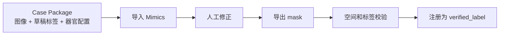

# Mimics 可行性评估

> 日期：2026-06-06（初版）；2026-06-07（更新：Web 调研补充）  
> 状态：架构调研结论 + Web 调研补充；最终判断仍依赖本机 Mimics POC  
> 结论一句话：Mimics 可以作为优先 POC 的人工标注/修正工具，但不能在 POC 前写成平台唯一底座。

## 1. 评估问题

平台真正关心的不是“Mimics 是否强大”，而是它能否稳定完成下面这个闭环：

如果这个闭环稳定，Mimics 可以成为第一阶段主标注工具。如果闭环不稳定，Mimics 仍可作为人工查看/修正工具，但平台需要保留其他工具适配方案。

## 2. 当前结论

| 使用方式 | 建议 | 理由 |
| --- | --- | --- |
| 作为优先 POC 工具 | 推荐 | 你已经有工具，且 Mimics 的医学图像交互能力强 |
| 作为第一阶段唯一标注工具 | 暂不建议 | 导入导出、空间一致性、脚本能力还未用本机版本验证 |
| 作为平台核心架构依赖 | 不建议 | 平台应依赖数据契约，而不是依赖某个商业工具 |
| 作为人工修正工具 | 推荐验证 | 这与 Mimics 的优势最匹配 |

## 3. 已核实的公开事实

| 事实 | 来源 | 可信度 | 文档中可怎么写 |
| --- | --- | --- | --- |
| Materialise Mimics 是医学图像分割和 3D 规划相关软件 | Materialise Mimics Core 官方资料 | 高 | Mimics 可作为人工分割/修正工具候选 |
| Materialise Mimics Core 页面提到 Mimics Medical 28.0 和 3-matic Medical 20.0 released 2025 | Materialise Mimics Core 官方资料 | 高 | 可以说明官方当前医疗版信息，但不能替代本机版本、许可证和模块核查 |
| 2025 Mimics 更新提到 NIfTI 和 RT-DICOM 导入导出 | Materialise 2025 update | 高 | NIfTI/RT-DICOM 支持是正向信号 |
| 2025 Mimics 更新提到 15+ Python API 操作和 Python 兼容性增强 | Materialise 2025 update | 高 | 有自动化接入可能 |
| 2025 Mimics 更新提到 AI-enabled segmentation | Materialise 2025 update | 高 | 可作为辅助能力，但不等于标签可直接训练 |
| Materialise 社区存在 Mimics scripting 导出 NIfTI affine/orientation 问题讨论 | Materialise community | 中 | 必须把空间一致性列为 POC 重点 |

## 4. 不能写成事实或必须限定的内容

下面这些说法要么公开证据不足，要么需要限定到“官方页面”或“本机 POC”：

| 说法 | 处理方式 |
| --- | --- |
| “本项目可直接使用 Mimics v28 / Mimics Medical 28.0” | 官方页面提到 Mimics Medical 28.0；本项目实际可用版本、许可证和模块仍需本机确认 |
| “20,000+ 论文引用” | 删除，除非找到 Materialise 官方或可复核来源 |
| 具体 Python 函数名和参数，例如 `import_dicom_images()`、`get_voxel_buffer()` | 只能写成示意或待本机脚本环境确认 |
| “多标签 NIfTI 可以稳定导入并保留 label id” | 改成 POC 项 |
| “导出 NIfTI 一定与原 CT affine 完全一致” | 改成高风险验证项 |
| “系统要求表” | 只有官方当前页面或本机安装文档确认后才能写 |

## 5. POC 必测项

| 编号 | 必测项 | 通过标准 |
| --- | --- | --- |
| M1 | 图像导入 | DICOM 或 NIfTI 能打开，方向和 spacing 正确 |
| M2 | 草稿标签导入 | 至少一种方式能把平台草稿标签变成 Mimics 可编辑 mask |
| M3 | 人工修正 | 修正后的 mask 名称、颜色、结构关系可管理 |
| M4 | 标签导出 | 能导出逐器官 mask 或单个多标签文件 |
| M5 | 空间一致性 | 导出标签与原图 shape 一致；spacing/origin/direction/affine 不一致时必须能被平台检测和修复 |
| M6 | label 映射 | 导出的 mask 能按平台器官名称映射回统一名称 |
| M7 | 批量可重复 | 至少能用脚本或稳定操作步骤处理多个病例 |

其中 M5 是最关键的门槛，但要分清硬故障和可修复问题。shape 不一致通常说明标签和图像已经不是同一体素网格，不能直接进入闭环；spacing/origin/direction/affine 不一致仍然危险，但第一阶段可以由平台侧 `check_geometry.py` 检测，并在确认 shape 一致时把图像几何头信息同步给 mask。

## 6. 如果现在就要使用 Mimics

可以采用保守流程：

1. 平台导出 `case_package/`，包含图像、草稿标签、器官配置和 manifest。
2. 优先用 DICOM 导入 Mimics；NIfTI 导入作为并行测试。
3. 草稿标签先拆成逐器官 mask，降低多标签 NIfTI 解释风险。
4. 人工在 Mimics 里修正。
5. 导出逐器官 mask。
6. 平台外部脚本合并为 `verified_label.nii.gz`。
7. 平台用原始 CT 作为参考做几何校验。

这个流程不优雅，但比一开始依赖未验证的全自动脚本更稳。

## 7. 失败分支

| 失败点 | 后果 | 可选处理 |
| --- | --- | --- |
| NIfTI 图像导入方向不稳定 | 标签与训练图像可能错位 | 改用 DICOM 作为 review package 主格式 |
| 草稿标签不能稳定导入 | 无法模型辅助标注 | 用截图/参考标签辅助人工，或换 3D Slicer/ITK-SNAP |
| 导出只能逐器官 mask | 文件多，但可接受 | 平台合并为多标签 mask |
| 导出 affine 不一致 | 不能直接入库 | shape 一致时可由平台复制图像几何头信息并抽检；shape 不一致时停用该路径 |
| Python API 不足 | 自动化程度下降 | 保留手动步骤，先跑通小闭环 |

## 8. 与其他工具的关系

| 工具 | 适合角色 | 对 Mimics 的补充 |
| --- | --- | --- |
| 3D Slicer | 开源标注、插件集成、MONAI Label/TotalSegmentator 生态 | 如果 Mimics 导入导出不稳，可作为备选 |
| MONAI Label | 模型辅助标注和主动学习参考架构 | 可学习 server-client 思路，不一定直接采用 |
| ITK-SNAP | 简单稳定的医学图像标签编辑 | 可作为轻量校验工具 |
| TotalSegmentator | 公开算法标签源 | 生成草稿标签或候选标签 |

## 9. 推荐结论

短期：用 Mimics 做 3-5 个病例 POC，重点验证导入导出和几何一致性。

中期：无论 Mimics 是否通过，都保持 Tool Adapter 设计。平台只依赖 case package 和 label artifact，不依赖 Mimics 内部工程文件。

长期：如果 Mimics POC 通过，可以把它作为主人工标注工具；如果没有通过，改为辅助工具或替换为 3D Slicer/其他工具。

## 10. 2026-06-07 Web 调研补充：Affine 问题与 API 现状

### 10.1 Affine 问题已证实

Materialise 社区（2021 年）有用户报告通过 Python scripting 导出 mask 为 NIfTI 时，因 DICOM 到 NIfTI 的 affine 坐标系变换计算错误，导致导出的 mask 在 ITK-SNAP 中**三轴视图全部对调**：原矢状面显示在轴位、原轴位显示在冠状位、原冠状位需要顺时针旋转 90 度。

根本原因是 DICOM 的患者坐标系（LPS+：左/后/上为正）与 NIfTI 的患者坐标系（RAS+：右/前/上为正）不同。用户在 Python 脚本中手动计算 affine 矩阵时，极易犯错。

更关键的是：用户尝试用 `nibabel.load(dicom_path).affine` 读取 Mimics 导出的 DICOM 的 affine，再套用到 mask 上，**结果仍然不正确**。这说明 Mimics 内部的几何表示与外部标准之间可能存在额外的差异。

### 10.2 但 Mimics 2025 更新带来了关键变化

| 变化 | 影响 |
|------|------|
| NIfTI 导入/导出已成为**官方正式功能**（不再是脚本 hack） | 如果使用 GUI 原生导出而非 Python scripting 手动构造 affine，affine 问题可能已解决 |
| 15+ 新 Python API 操作 | 官方路径的导出 API 可能比手写 nibabel 更可靠 |
| Python 版本兼容性更新 | 现代 Python（≥3.8）可用 |
| AI-enabled segmentation 内建 | 可作为辅助标注能力 |

关键判断：**使用 Mimics 官方的 NIfTI 导出功能（GUI 或官方 API），与使用 Python scripting 手动构造 NIfTI affine 的风险完全不同。** 前者可能是稳定的，后者是已知有风险的。

### 10.3 M5 的修订评估

原 M5（空间往返一致性）的风险分级应细化为：

| 场景 | 风险 | 建议 |
|------|:--:|------|
| Mimics GUI 原生 NIfTI 导出 | 中等 | 需 POC 验证，但官方支持是强信号 |
| Python scripting 手写 affine 导出 | **高** | **不建议**此路径，社区有已证实的方向错误案例 |
| 平台侧 post-import 用脚本矫正 | 低 | 无论导出结果如何，平台侧 `check_geometry.py` 可将图像 affine 抄写到 mask 上作为保底 |

### 10.4 M5 的底线重新定义

**M5 的硬底线是 shape 一致**（不可修复）。affine/origin/direction 不一致**可被平台检测和修复**（用 nibabel 将图像的 affine header 复制到 mask），因此不应该把 M5 整体定为 POC 硬门槛。

修订后的 M5 判定标准：
- Shape 一致 → 通过（即使 affine 有偏差，平台可自动修复）
- Shape 不一致 → 硬故障，Mimics 路径不可用

### 10.5 调研来源

- [Materialise Community: DICOM to NIfTI affine issue (2021)](https://community.materialise.com/t/dicom-to-nifti-format-using-mimics-scripting-problem-with-affine-transformation-matrix/438)
- [Materialise Mimics 2025 Product Update](https://www.materialise.com/en/healthcare/mimics/whats-new)
- [MIS Scripting Forum](https://community.materialise.com/c/mis-scripting-forum/5)
- [GitHub: mimics_3matic_Python_scripting examples](https://github.com/fahimehazari/mimics_3matic_Python_scripting)

## 11. 来源

- [Materialise Mimics 2025 Product Update](https://www.materialise.com/en/healthcare/mimics/whats-new)
- [Materialise Mimics Core](https://www.materialise.com/en/healthcare/mimics/mimics-core)
- [Materialise community: DICOM to NIfTI via Mimics scripting affine issue](https://community.materialise.com/t/dicom-to-nifti-format-using-mimics-scripting-problem-with-affine-transformation-matrix/438)
