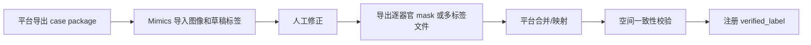

# Mimics 标注工具调研摘记

> 日期：2026-06-06  
> 状态：参考摘记，不是主蓝图  
> 主结论请看 `docs/domains/labeling/mimics_feasibility.md`。

## 1. 结论

Mimics 值得作为第一批 POC 工具，因为你已经有这个工具，而且它面向医学图像分割和 3D 规划，人工修正体验通常会比通用开源工具更接近真实工作流。

但目前不能把 Mimics 写成已经满足平台全部需求。公开资料能支持高层能力和官方版本信息，不能支持所有具体脚本 API、许可证状态、本机模块可用性和 NIfTI 往返稳定性的细节。平台文档里应把 Mimics 视为 Tool Adapter 的一个候选实现，而不是平台核心。

## 2. 已核实能力

| 能力 | 公开来源支持 | 平台含义 |
| --- | --- | --- |
| 医学图像分割和 3D 规划 | Materialise Mimics Core 官方资料 | 可作为人工标注/修正工具候选 |
| Mimics Medical 28.0 / 3-matic Medical 20.0 released 2025 | Materialise Mimics Core 官方资料 | 只能说明官方当前医疗版信息；本机版本、许可证和模块仍需确认 |
| Python scripting / API 增强 | Materialise 2025 update | 有机会自动化部分流程 |
| NIfTI 和 RT-DICOM 导入导出 | Materialise 2025 update | 对 AI 管线互操作有帮助 |
| AI-enabled segmentation | Materialise 2025 update | 可作为辅助标签来源，但仍需质量策略 |

## 3. 待验证能力

| 待验证项 | 为什么重要 |
| --- | --- |
| 多标签 NIfTI 导入后能否变成可编辑的多个 mask | 决定草稿标签导入方式 |
| 逐器官 mask 导出是否稳定 | 决定最保守的回流方案 |
| 导出 NIfTI 的 shape、spacing、origin、direction、affine 是否与原图一致 | 决定能否直接进入训练数据 |
| Python scripting 能否批量导入、命名、上色、导出 | 决定自动化程度 |
| 工具内 mask 名称能否稳定映射到平台统一器官名称 | 决定导回是否可靠 |

## 4. 推荐 POC 流程

POC 不需要一次验证所有器官。建议选 3-5 个病例，覆盖：

- 一个胸部或肺部任务。
- 一个腹部任务，例如肝胆。
- 一个包含骨结构的任务。
- 至少一个有草稿标签的病例。
- 至少一个无标签、从零修正的病例。

## 5. 不应再使用的表述

以下表述在公开核查中证据不足，后续文档不应继续使用：

| 原表述 | 建议改法 |
| --- | --- |
| “本项目可直接使用 Mimics v28 / Mimics Medical 28.0” | “官方页面提到 Mimics Medical 28.0；本机版本、许可证和可用模块待确认” |
| “20,000+ 论文引用” | 删除，除非找到可复核来源 |
| “完整 Python API” | “具备 Python scripting/API 增强，但具体能力待本机验证” |
| 具体函数名示例作为可运行代码 | 改为伪代码或放入 POC 记录 |
| “NIfTI 往返无需担心” | 改为“空间一致性是最高风险项” |

## 6. 推荐文件交换方式

第一阶段不要假设 Mimics 能完美读写单个多标签 NIfTI。推荐保守方案：

1. 平台导出图像和逐器官草稿 mask。
2. Mimics 中人工修正。
3. Mimics 导出逐器官 mask。
4. 平台按器官名称合并为 `verified_label.nii.gz`。
5. 平台做几何校验，校验通过后入库。

如果 POC 证明单个多标签 NIfTI 导入导出稳定，再升级为更简洁的单文件方案。

## 7. 来源

- [Materialise Mimics 2025 Product Update](https://www.materialise.com/en/healthcare/mimics/whats-new)
- [Materialise Mimics Core](https://www.materialise.com/en/healthcare/mimics/mimics-core)
- [Materialise community: DICOM to NIfTI via Mimics scripting affine issue](https://community.materialise.com/t/dicom-to-nifti-format-using-mimics-scripting-problem-with-affine-transformation-matrix/438)
