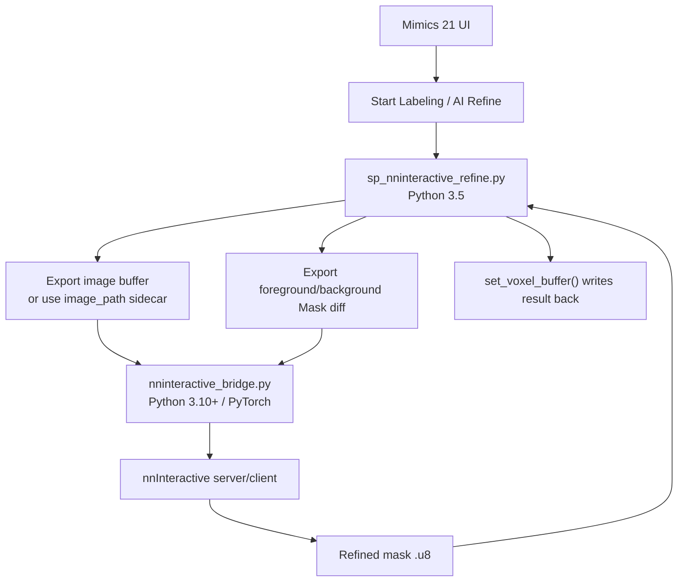

# nnInteractive in Mimics 21: 可行性、边界和验证方案

## 1. 结论

在 Mimics Research 21 中引入 nnInteractive 是可行的，但正确架构不是“把 nnInteractive 直接装进 Mimics Python 里运行”。

Mimics 21 的脚本层适合做三件事：

1. 让标注者在 Mimics 里打开病例、编辑 Mask、保存和提交。
2. 读取/写回 Mimics Mask 的 voxel buffer。
3. 在需要 AI 精修时，把图像 buffer、前景/背景交互 buffer 和轴映射交给外部 Python 推理环境。

nnInteractive 推理必须在外部 Python 3.10+ 环境中运行。Mimics 21 内置或配置的 Python 3.5 不能承担 PyTorch/nnInteractive 推理环境。

当前实现收敛为一个 MVP：

- 标注者只在 Mimics 中点击 **AI Refine**。
- 交互载体使用 Mimics Mask 的增量变化。
- 新增像素表示 foreground prompt。
- 擦除像素表示 background prompt。
- 外部 bridge 调用 nnInteractive remote session，结果写回当前 Mask。

这条路径先验证 scribble/diff 交互。point、box、lasso 可以在 bridge 层表达，但不应在 Mimics UI 中承诺为已生产可用，除非完成对应的 Mimics 交互采集验证。

## 2. 官方能力与 Mimics 能力的对应关系

nnInteractive 官方 API 支持正/负 point、bbox、scribble、lasso 交互，并提供 Python API 与 server-client 模式。Mimics 21 API 则提供 Mask、ImageData、point/line/spline 等对象访问，以及 `get_voxel_buffer()` / `set_voxel_buffer()` 这类 buffer 级接口。

两者可以对接，但不是一一映射：

| nnInteractive 交互 | Mimics 21 中的可行采集方式 | 当前状态 | 说明 |
| --- | --- | --- | --- |
| Foreground point | `indicate_coordinate()` 或小球/小 Mask | 待验证 | API 能取点坐标，但需要完成坐标到 voxel index、image set 绑定和多点管理。 |
| Background point | 同上，另加负交互语义 | 待验证 | 需要 UI 让标注者明确“这是背景点”。 |
| Bounding box | 从一个粗略 ROI Mask 的 bbox 派生 | 可扩展 | Mimics API 没有确认暴露原生 3D box prompt 事件；用 Mask bbox 更稳。 |
| Scribble | 标注者在目标 Mask 上新增/擦除少量像素 | 当前 MVP | 新增像素=foreground，擦除像素=background。 |
| Lasso | 如果 Mimics lasso 最终修改 Mask，则可作为 Mask prompt | 待验证 | 当前不捕获 lasso polygon，只读取 lasso 修改后的 Mask buffer。 |
| Line | 可用 line/spline 对象或细 Mask rasterize | 待验证 | nnInteractive 语义上更接近 scribble；实现前需要明确 line 是否转成 voxel prompt。 |

因此，Mimics 集成不应设计成“完整复刻 nnInteractive 所有交互控件”。更稳的设计是：

1. 第一阶段只做 **Mask edit diff -> scribble prompt**。
2. 第二阶段验证 point 和 bbox。
3. 第三阶段再考虑 lasso/line/spline 的专门交互。

## 3. 为什么使用 Mask diff 作为 MVP

Mimics 原生标注动作已经围绕 Mask 展开。让标注者额外进入另一套 point/box/lasso 对话框，会增加操作负担，也会引入坐标绑定风险。

Mask diff 的语义简单：

1. 打开病例后，脚本自动保存每个受管 Mask 的 AI baseline。
2. 标注者在一个目标 Mask 上新增一小块区域，表示“这里应该属于器官”。
3. 标注者在一个目标 Mask 上擦除一小块区域，表示“这里不应该属于器官”。
4. 点击 **AI Refine**。
5. 脚本自动找出相对 baseline 发生变化的 Mask。
6. 外部 bridge 把 foreground/background diff 转成 nnInteractive scribble 交互。
7. 结果写回同一个 Mimics Mask，并刷新 baseline。

这个方案的优点：

- 标注者不需要理解 nnInteractive 的 prompt 类型。
- 前景/背景区分来自“新增/擦除”，不用额外弹窗。
- 多器官任务中不会误用最大 Mask；脚本按实际变化选择目标。
- DICOM/.mcs-only 病例也能工作，因为脚本可以从 Mimics 当前 image set 导出 raw image buffer。

限制：

- 标注者一次应只编辑一个器官再点 **AI Refine**；如果多个 Mask 同时变化，脚本会要求选择一个。
- 当前不承诺原生 point/box/lasso UI。
- 需要完成 Windows Mimics 21 实机验证：图像灰度、轴映射、Mask 往返、server 调用和结果写回。

## 4. 运行架构



Mimics 内部 Python 只负责 I/O 和用户动作；外部 Python 负责深度学习推理。

## 5. Python 环境策略

| 环境 | Python | 作用 | 是否给标注者操作 |
| --- | --- | --- | --- |
| Mimics 脚本环境 | 3.5.x | 打开病例、读写 Mask、调用 bridge | 否 |
| 平台环境 `.venv` | 3.10+ | `sp` CLI、Registry、病例包、finalize | 否 |
| nnInteractive 环境 `nninteractive_env` | 3.10+ | PyTorch + nnInteractive 推理 | 否 |

不建议把 nnInteractive 依赖装入平台 `.venv`。PyTorch/CUDA/nnInteractive 是重依赖，独立环境更容易重建和迁移，也不会污染平台工具链。

同时必须明确：Python venv 不是跨平台可迁移物。不能在 macOS 上创建 `nninteractive_env` 后直接复制到 Windows Mimics 工作站运行。可选方式只有两种：

1. 在 Windows Mimics 工作站联网运行一次 `python scripts/setup_nninteractive_env.py`。
2. 在另一台同架构 Windows 机器上制作离线 Windows bundle，再复制到 Mimics 工作站。

如果目标是 Mimics 机器不联网、不下载、不手动配置，应采用第二种方式。这个仓库可以提供脚本和清单，但最终 bundle 必须在 Windows 上构建。

## 6. 硬件要求

官方 nnInteractive 基于 PyTorch 推理，实际交互体验依赖 GPU。工程建议如下：

| 项 | 建议 |
| --- | --- |
| GPU | NVIDIA GPU，CUDA 版 PyTorch 可用 |
| VRAM | 8 GB 可做小/中等体积验证；12-16 GB 更适合常规 CT 交互 |
| RAM | 32 GB 起步 |
| 系统 | Windows 10/11 64-bit |
| 磁盘 | 需要预留数 GB 到十余 GB，取决于 PyTorch wheel、缓存和模型权重 |

CPU 推理可作为排错路径，不应作为真实交互标注体验的默认方案。

## 7. 当前代码入口

Mimics 侧：

- `adapters/mimics/runtime_py35/sp_review_console.py`
- `adapters/mimics/runtime_py35/sp_nninteractive_refine.py`

外部推理侧：

- `src/segplatform/adapters/mimics/nninteractive_bridge.py`
- `scripts/setup_nninteractive_env.py`

Console 中的按钮应面向标注者显示为 **AI Refine**。文档和代码可以保留 nnInteractive 作为技术实现名，但不应要求标注者理解这个名称。

## 8. 标注者工作流

1. 打开 Mimics。
2. 运行 **Start Labeling**。
3. 选择 **Open Case**。
4. 正常编辑目标器官 Mask。
5. 需要 AI 精修时，在一个目标 Mask 上新增或擦除一小块区域。
6. 运行 **Start Labeling -> AI Refine**。
7. 等待结果写回当前 Mask。
8. 如果结果仍不满意，继续新增/擦除少量区域并再次 **AI Refine**。
9. 完成后仍按原流程 **Complete / Needs Review / Report Problem**。

标注者不需要：

- 启动 nnInteractive server。
- 选择 Python 解释器。
- 查找模型权重路径。
- 导出 NIfTI 或 Mask 文件。
- 运行命令行。

## 9. 管理员验证步骤

### 9.1 安装环境

在 Windows 机器上：

```powershell
cd D:\SegmentationPlatform
python scripts\setup_nninteractive_env.py --cuda cu124 --device cuda:0
```

如果工作站不能联网，应先在可联网 Windows 机器上构建离线 bundle，再复制到目标机。不要从 macOS/Linux 复制 venv 到 Windows。

### 9.2 检查 Python 包和权重

```powershell
D:\SegmentationPlatform\nninteractive_env\Scripts\python.exe -c "import nnInteractive; print('nnInteractive OK')"
dir D:\SegmentationPlatform\nninteractive_env\models\nnInteractive_v1.0
```

### 9.3 Mimics 端功能验证

1. 打开一个已通过 Mimics Gate 的 review。
2. 确认 **Start Labeling** 可以打开病例。
3. 在一个目标 Mask 上新增少量前景。
4. 运行 **AI Refine**。
5. 确认首次调用能够启动外部推理。
6. 确认结果写回同一个 Mask。
7. 擦除一小块错误区域，再次运行 **AI Refine**，确认 background prompt 生效。
8. 保存并提交，确认 finalize 的空间/QC 校验仍通过。

### 9.4 必须记录的 Gate 结果

| Gate | 通过标准 |
| --- | --- |
| NNI-01 环境 | Windows 上能 import nnInteractive，PyTorch 能识别 GPU |
| NNI-02 权重 | 模型目录完整，bridge 能找到权重 |
| NNI-03 图像 | DICOM/.mcs-only 病例能导出 image buffer 并完成推理 |
| NNI-04 交互 | foreground 新增和 background 擦除都能影响结果 |
| NNI-05 往返 | 结果写回 Mimics 后，submit/finalize 仍保持空间一致 |

未通过这些 Gate 前，不应把 nnInteractive 作为正式标注能力发布。

## 10. 当前不应承诺的内容

- 不承诺 Mimics 原生 point/box/lasso UI 已经完整接入。
- 不承诺所有 GPU 显存配置都能流畅交互。
- 不承诺非 Windows 构建的 `nninteractive_env` 可以迁移到 Windows。
- 不承诺 nnInteractive 输出可以直接替代人工审核。
- 不承诺商业用途合规；模型权重许可需要按实际来源单独确认。

## 11. 后续扩展

1. Point prompt：用 `indicate_coordinate()` 采集点，映射到 image voxel index，传给 `add_point_interaction()`。
2. Box prompt：允许标注者创建一个临时 ROI Mask，bridge 用其非零 bbox 调 `add_bbox_interaction()`。
3. Lasso prompt：验证 Mimics lasso 是否能稳定修改临时 Mask；如果可以，用该 Mask 的 2D crop 调 `add_lasso_interaction()`。
4. Offline bundle：补充 Windows wheelhouse、模型权重 hash 清单和离线安装脚本，满足无联网部署。
