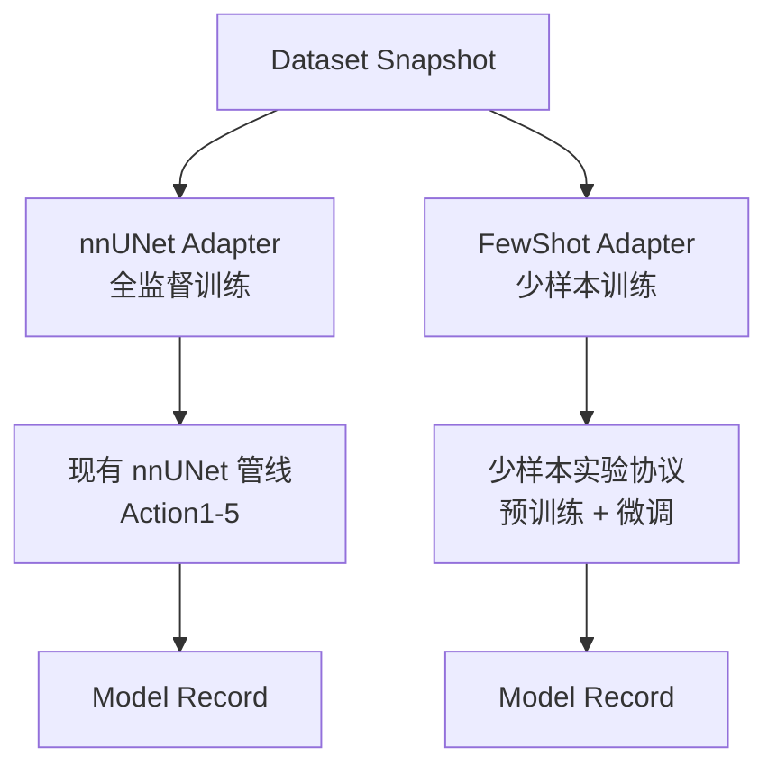

# 训练域文档入口

> 日期：2026-06-07  
> 状态：训练相关文档导航；平台总体设计以 `docs/architecture/platform_blueprint.md` 为准。

## 1. 当前定位

`training` 是“任务如何消费标签并产出模型”的实现域。

`pipelines/nnunet/` 是现有可复用训练管线。平台蓝图中提到的 `nnUNet Adapter`，第一阶段应尽量复用这里的转换、预处理、训练、预测和评估逻辑。

这部分文档不负责定义平台级标签治理。标签来源、训练准入、Dataset Snapshot、Mimics 标注闭环等概念应看 `docs/architecture/platform_blueprint.md` 和 `docs/domains/labeling/case_package_contract.md`。

## 2. 文档分层

| 文档 | 当前用途 |
| --- | --- |
| `docs/domains/training/nnunet_pipeline_reference.md` | 现有 nnUNet 训练与推理管线说明 |
| `docs/research/digests/*.md` | 跨域研究摘要，帮助理解后续能力边界 |
| `docs/research/originals/*.md` | 原始研究材料，供追溯最初调研内容 |
| `pipelines/nnunet/ModelMap.toml` | 当前任务级 label map 的事实来源 |
| `pipelines/nnunet/Config_*.toml` | 当前训练配置样例 |
| `pipelines/nnunet/*.py` | 可复用的转换、训练、预测和评估实现 |

## 3. 和平台蓝图的关系

平台不会把 nnUNet 写死为唯一训练框架。更合适的关系是：**Dataset Snapshot 对接多个并行 Adapter，每个 Adapter 对应一种训练方法**。



**Adapter 层级结构**：nnUNet Adapter 和 FewShot Adapter 是 training 域下的两个平行 Adapter，共享同一个 Dataset Snapshot 数据契约，各自产出 Model Record。

```
adapters/
  nnunet/                         ← nnUNet Adapter 边界说明
  fewshot/                         ← 少样本 Adapter（设计已确认，待实现）
    experiment_protocol.py         ← 离线实验协议
    finetune_adapter.py            ← 预训练 + 微调

pipelines/
  nnunet/                          ← 当前可复用训练核心
```

后续接 MONAI、Transformer 时同样新增 Adapter，不改变数据契约。

## 4. 训练框架接入标准

不同于 nnUNet 的训练框架或算法可以加入 `training` 域，但标准不是“能训练模型”这么宽，而是必须服从平台数据契约：

1. 输入必须是 Dataset Snapshot，不能绕过 Registry 直接读散落文件。
2. 必须声明如何解释 TaskLabelMap，以及是否需要额外 task 配置。
3. 必须记录实际预处理和训练配置，例如 resample spacing、patch size、fold、随机种子。
4. 必须产出 Model Record，记录 Snapshot、代码版本、权重路径、指标和使用边界。
5. 如果只是用已有模型批量推理生成标签，默认归入 `label_generation`，不是 `training`。

因此 nnUNet、MONAI、FewShot 都可以作为 training Adapter；TotalSegmentator 这类直接生成候选标签的工具，通常先作为 label_generation Adapter。

## 5. 当前实现落点

- 当前主代码在 `pipelines/nnunet/`（nnUNet Adapter 的实际实现）
- FewShot Adapter 已确认架构位置，但实现后置——需等 Data Registry、Dataset Snapshot 和冻结评估集建好后才能做生产级验证
- `docs/research/digests/few_shot_learning_digest.md` 记录了少样本学习与平台的集成边界
- 训练域只关心”如何把任务快照变成模型”，不负责人工标注和候选标签治理

## 6. 为什么 research 不再放这里

像 TTA、持续学习、小样本学习这类研究，会同时影响训练、标签生成、病例选择和标签治理。

它们不是训练域的直接子模块，而是跨域参考材料。因此研究笔记已移到 `docs/research/`。

**例外**：当某个研究方向经过生产级验证准入后，可以从研究层升级为 training 域的正式 Adapter。FewShot Adapter 已明确了这一升级路径。
