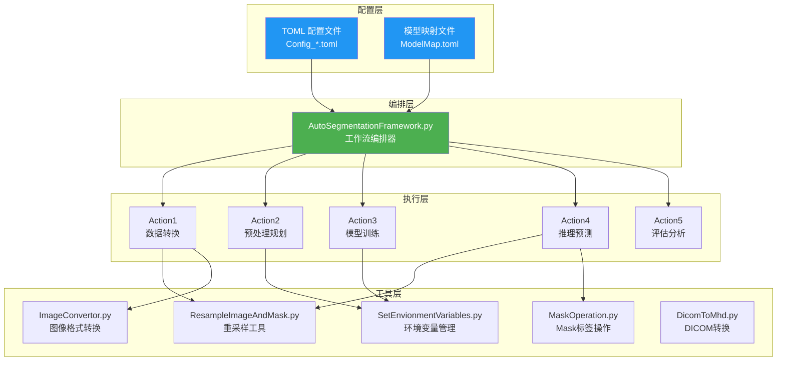
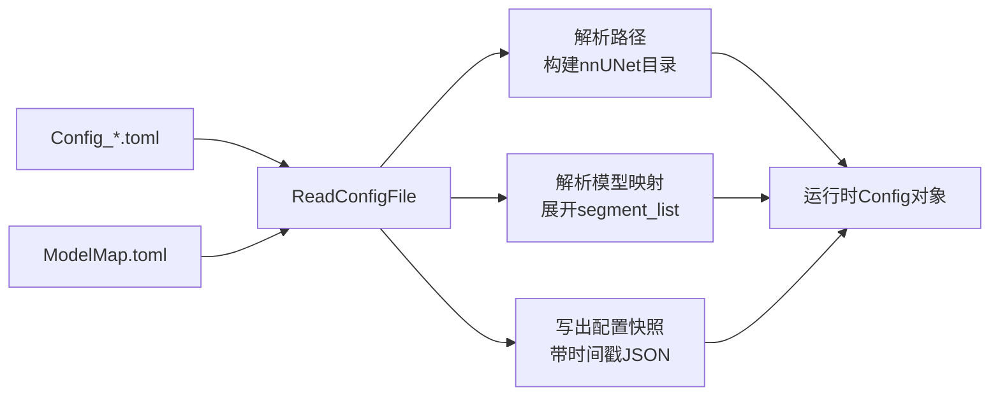
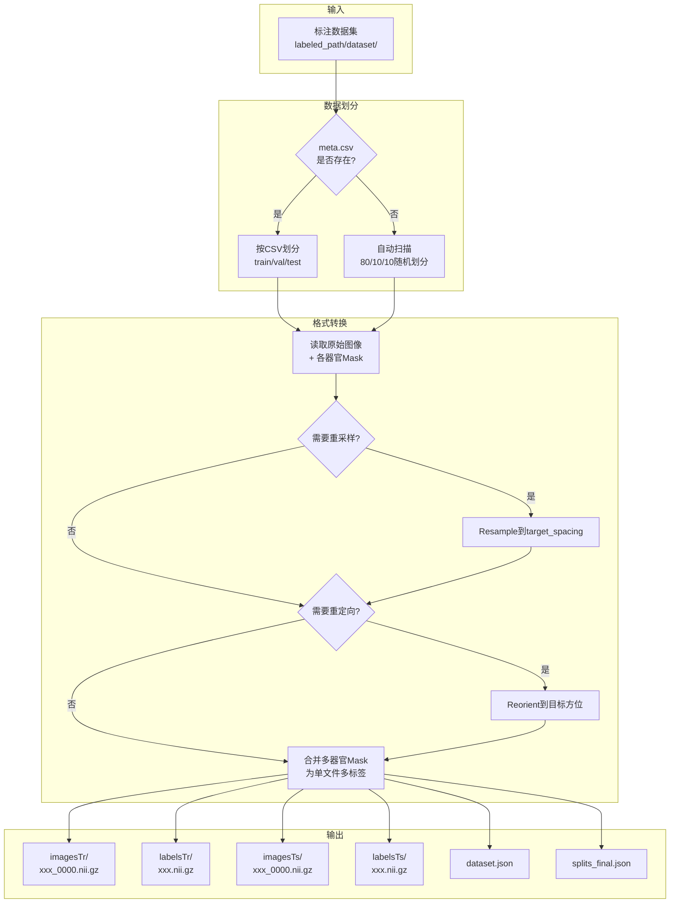
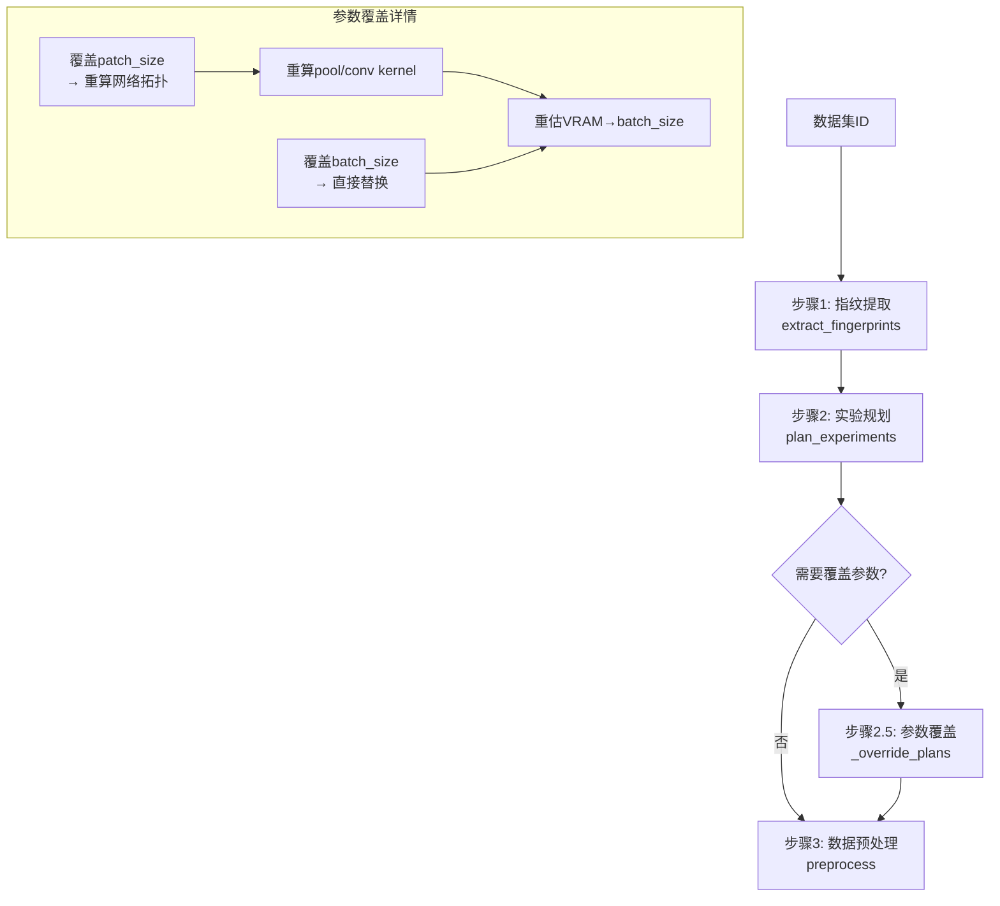
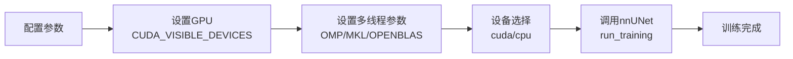
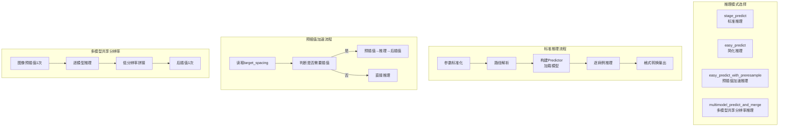
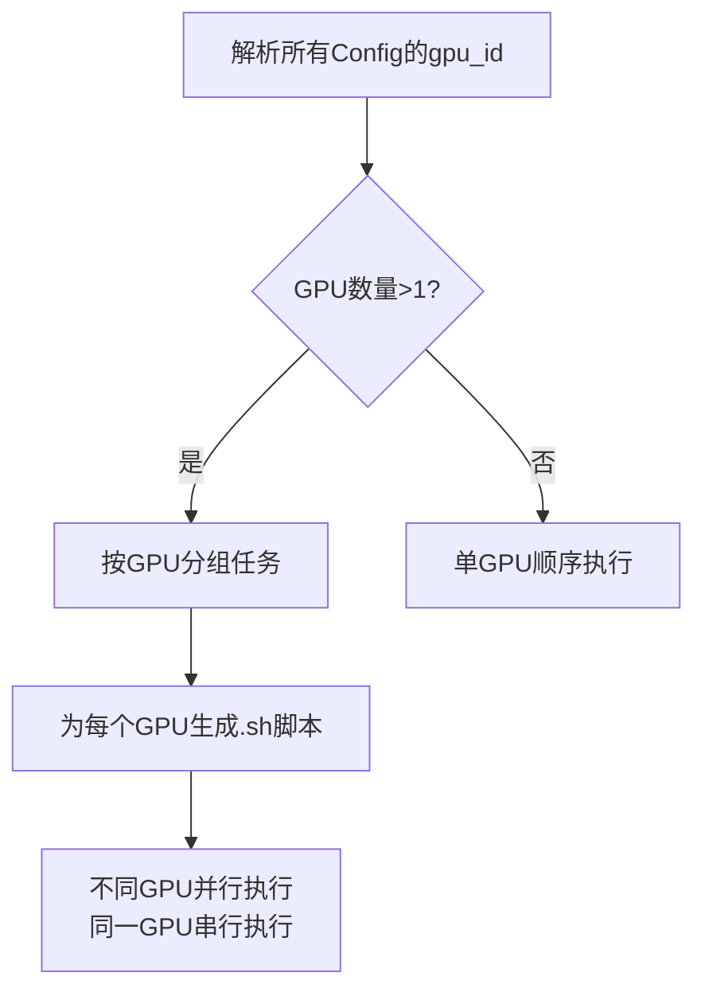

# 医学图像分割训练管线 — 架构与流程设计文档

> 状态说明：这是现有 nnUNet 训练管线的代码级说明，适合作为 `nnUNet Adapter` 的参考材料。平台总体设计以 `docs/architecture/platform_blueprint.md` 为准；本文不定义平台级标签治理、Dataset Snapshot 或 Mimics 流程。

> 本文档基于 `docs/domains/training` 中的训练说明和 `pipelines/nnunet/` 下的现有代码，说明当前 nnUNet 训练与推理管线的模块职责、数据流转和关键实现细节。

---

## 1. 系统总览

### 1.1 设计目标

本训练管线基于 [nnUNetv2](https://github.com/MIC-DKFZ/nnUNet) 框架，构建了一套**端到端的医学图像分割解决方案**，覆盖从标注数据转换、预处理、训练、推理到评估的完整生命周期。核心设计理念：

- **配置驱动**：通过 TOML 配置文件管理所有参数，避免硬编码，支持多模型、多模态灵活组合
- **模块化架构**：5 个 Action 模块各司其职，通过 Framework 编排调度
- **多 GPU 并行**：自动生成 GPU 分配脚本，支持多模型跨 GPU 并行训练
- **工程化推理路径**：预插值、显存记录、跨平台适配（Windows/Linux）

### 1.2 整体架构图



### 1.3 文件清单与职责

| 文件 | 职责 | 核心功能 |
|------|------|----------|
| `AutoSegmentationFramework.py` | 工作流编排器 | 配置解析、流程调度、多GPU脚本生成 |
| `Action1_ConvertLabeledToTrainData.py` | 数据转换 | 标注数据→nnUNet格式、重采样、方位重定向、标签合并 |
| `Action2_PlanAndPreprocess.py` | 预处理规划 | 指纹提取、实验规划、参数覆盖、数据预处理 |
| `Action3_Train.py` | 模型训练 | GPU设置、nnUNet训练调度 |
| `Action4_Predict.py` | 推理预测 | 多种推理模式、预插值加速、显存监控、跨平台适配 |
| `Action5_Evaluation.py` | 评估分析 | Dice/Surface Dice计算、多模型聚合、报告生成 |
| `ResampleImageAndMask.py` | 重采样工具 | 图像/Mask重采样、GPU加速插值 |
| `SetEnvionmentVariables.py` | 环境管理 | Shell配置文件读写、环境变量设置 |
| `ImageConvertor.py` | 图像转换 | VOI裁剪、格式转换、Spacing修正 |
| `MaskOperation.py` | Mask操作 | 标签重映射、形态学操作 |
| `DicomToMhd.py` | DICOM转换 | DICOM序列→MHD/NIfTI格式转换 |
| `Config_*.toml` | 配置文件 | 训练参数、路径、GPU分配等全部配置 |
| `ModelMap.toml` | 模型映射 | 各模型分割类别与标签值定义 |

---

## 2. 配置体系

### 2.1 配置文件结构

系统采用 **TOML 格式** 的配置文件，每个训练任务对应一个独立的 `.toml` 文件，实现配置与代码解耦。

```toml
[COMMON]           # 通用设置：模态（CT/MR）
[PATHS]            # 路径设置：标注数据、训练数据、nnUNet环境
[MODEL]            # 模型设置：数据集名称、分割列表、模型映射
[GPU]              # GPU设置：GPU编号分配
[PREPROCESS]       # 预处理设置：分辨率、Patch大小、Batch大小、方位
[TRAIN]            # 训练设置：Epoch、Fold、Trainer、Plans
[PREDICT]          # 预测设置：TTA、统计开关
[EVALUATION]       # 评估设置：目录、聚合开关
```

### 2.2 配置加载流程



**关键逻辑**：

1. **模型映射展开**：从 `ModelMap.toml` 中根据 `segment_list_name` 查找对应的分割类别列表，支持**扁平格式**（`{organ: label}`）和**分组格式**（`{group: {label, organs}}`）
2. **路径自动构建**：根据 `labeled_path` + `labeled_dataset` 生成数据集路径，自动创建 nnUNet 所需的三级目录（`nnUNet_raw`、`nnUNet_preprocessed`、`nnUNet_results`）
3. **配置快照**：每次运行时将完整配置以 JSON 形式保存到训练输出目录，带时间戳，便于回溯

### 2.3 ModelMap 设计

`ModelMap.toml` 是整个系统的**分割类别字典**，定义了每个子模型负责的器官及其标签值：

```toml
# 扁平格式 — 每个器官独立标签
[CT1_Head]
brain = 1
skull = 2

# 分组格式 — 多个器官共享同一标签（粗分割）
[CT_All_Coarse]
head  = { label = 1, organs = ["brain", "skull"] }
chest = { label = 2, organs = ["heart", "aorta", ...] }
```

**设计要点**：
- 每个子模型的标签值**独立从 1 开始**编号（nnUNet 要求）
- `CT_Combine` / `MR_Combine` 定义了拼接为完整 Mask 时的统一标签值（避免冲突）
- 支持同一器官在不同模型中使用不同标签值

---

## 3. 五阶段流水线详解

### 3.1 Action1：数据转换（ConvertLabeledToTrainData）

**职责**：将标注数据从原始目录结构转换为 nnUNet 标准训练格式。



**核心功能详解**：

#### 3.1.1 数据集划分
- 优先读取 `meta.csv`（含 `split` 列），支持精确控制训练/验证/测试集
- 若无 `meta.csv`，自动扫描子文件夹并按 80%/10%/10% 随机划分
- 若验证集为空，自动从训练集末尾取 10% 补充

#### 3.1.2 重采样（Resample）
- 使用 `scipy.ndimage.zoom` 进行体素重采样
- 图像使用**三线性插值**（order=1），Mask 使用**最近邻插值**（order=0）
- 重采样后自动构建新的 affine 矩阵，保持空间信息一致

#### 3.1.3 方位重定向（Reorient）
- 支持 MHD/ITK-SNAP 约定的三位方位码（如 `RAI`、`LPS`）
- **仅通过轴置换和翻转**实现，不做插值，**原始体素值完全不变**
- 内部处理了 MHD 约定与 nibabel 约定的差异（每个字母取反）
- 通过 SVD 正交化 affine 矩阵，避免方向余弦不正交导致的读取错误

#### 3.1.4 多器官标签合并
- 将每个器官的独立 Mask 文件合并为单个多标签 Mask
- 后写入的器官覆盖先写入的（按 `class_map` 顺序）
- 支持**并行加载**（`resample_and_combine_labels_fast`），使用 `ThreadPoolExecutor` 加速

#### 3.1.5 元数据生成
- `dataset.json`：包含模态、标签映射、文件格式等 nnUNet 必需信息
- `splits_final.json`：训练/验证集划分，确保可复现

---

### 3.2 Action2：预处理规划（PlanAndPreprocess）

**职责**：执行 nnUNet 的数据指纹提取、实验规划和预处理，并支持手动覆盖关键参数。



**核心功能详解**：

#### 3.2.1 三步预处理流程
1. **指纹提取**（`extract_fingerprints`）：扫描数据集，统计图像尺寸、间距分布、强度范围等特征
2. **实验规划**（`plan_experiments`）：根据指纹自动规划 target_spacing、patch_size、网络拓扑等
3. **数据预处理**（`preprocess`）：按规划对训练数据进行重采样、归一化等操作

#### 3.2.2 参数覆盖机制
这是本管线的重要扩展，允许用户在 nnUNet 自动规划的基础上手动调整关键参数：

| 参数 | 覆盖方式 | 影响 |
|------|----------|------|
| `target_spacing` | 传入 `plan_experiments` 的 `overwrite_target_spacing` | 影响重采样目标分辨率 |
| `patch_size` | 修改 `plans.json` 中的 `patch_size` + 重算网络拓扑 | 影响感受野和显存占用 |
| `batch_size` | 直接覆盖 `plans.json` 中的 `batch_size` | 影响训练速度和显存占用 |

**patch_size 覆盖的自动调整**：
- 自动向上取整为 $2^{n}$ 的整数倍（满足池化约束）
- 使用 `get_pool_and_conv_props` 重新计算池化核大小、卷积核大小、网络层数
- 自动估算 VRAM 占用并重算 batch_size
- 用户指定的 batch_size 优先级最高，覆盖自动估算值

---

### 3.3 Action3：模型训练（Train）

**职责**：封装 nnUNet 训练流程，管理 GPU 设备和多线程参数。



**关键参数**：

| 参数 | 说明 | 默认值 |
|------|------|--------|
| `dataset_id` | 数据集ID或名称 | 必填 |
| `configuration` | 训练配置 | `3d_fullres` |
| `fold` | 交叉验证折数 | `0` |
| `trainer` | Trainer类名 | `nnUNetTrainerNoMirroring` |
| `plans` | Plans标识符 | `nnUNetPlans` |
| `num_gpus` | GPU数量（>1启用DDP） | `1` |
| `gpu_id` | 指定GPU编号 | 自动检测 |

**设计要点**：
- 延迟导入 nnUNet 模块，避免 worker 进程重复加载 DLL
- CPU 模式下自动设置多线程数 = CPU 核心数
- GPU 模式下设置线程数 = 1（避免 GPU 调度开销）

---

### 3.4 Action4：推理预测（Predict）

**职责**：提供多种推理模式，支持离线批量推理和后续部署验证。



**四种推理模式对比**：

| 模式 | 适用场景 | 分辨率处理 | 速度 | 内存 |
|------|----------|-----------|------|------|
| `stage_predict` | 训练后验证 | nnUNet内部处理 | 标准 | 标准 |
| `easy_predict` | 单模型快速推理 | nnUNet内部处理 | 标准 | 标准 |
| `easy_predict_with_preresample` | 离线批量推理/部署验证 | 外部预插值+后插值 | 通常更快，需按数据实测 | 较低 |
| `multimodel_predict_and_merge` | 多模型全量推理 | 共享1次插值 | **最优** | 逐模型释放 |

#### 3.4.1 预插值加速原理

nnUNet 内部使用 `skimage` 的 order=3 插值，速度极慢（单例约 90s）。预插值方案：

1. **预插值**：将输入图像快速下采样到模型训练分辨率（`scipy.zoom` order=1，约 1s）
2. **推理**：nnUNet 检测到输入已是目标分辨率，跳过内部重采样
3. **后插值**：将预测 Mask 上采样回原始分辨率

支持三种 Mask 上采样模式：
- `torch_gpu`：PyTorch GPU 三线性插值（**推荐**，< 1s，光滑边界）
- `nearest`：最近邻插值（极快，但边界有锯齿）
- `smooth`：CPU One-Hot + 线性插值 + ArgMax（光滑但较慢）

#### 3.4.2 多模型共享分辨率推理

模拟 C++ 生产部署流程，优化多模型推理性能：

```
传统方式（workflow3）：
  图像 → [插值→模型1→回插] → [插值→模型2→回插] → ... → 原始分辨率拼接
  N个模型 = N次图像插值 + N次Mask回插

优化方式（workflow4）：
  图像 → 插值1次 → [模型1→模型2→...] → 低分辨率拼接 → 回插1次
  N个模型 = 1次图像插值 + 1次Mask回插
```

#### 3.4.3 跨平台适配

| 平台 | 推理策略 | 原因 |
|------|----------|------|
| Linux | `predict_from_files` 多进程 | fork 模式开销小，可并行预处理/后处理 |
| Windows | `predict_single_npy_array` 单线程 | spawn 模式创建子进程需重新导入 torch/nnunet，每例多 10-15s |

#### 3.4.4 显存监控

`GPUMemoryMonitor` 基于 `pynvml` + `psutil` 实现进程级显存监控：
- 后台线程以可配置间隔（默认 0.1s）采样显存
- 记录峰值（peak）、低谷（valley）、波动（diff）
- 非 NVIDIA 环境自动降级为全零记录

#### 3.4.5 内存管理

针对 nnUNet 的内存泄漏问题，实现了完善的清理机制：
- 清理 `compute_gaussian` 模块级 GPU 缓存
- 清理 `ConfigurationManager` / `PlansManager` 的 `@lru_cache`（打破循环引用）
- 网络权重从 GPU 移到 CPU 后删除
- 释放 `list_of_parameters`（每个 fold 的完整权重副本）
- 强制 GC + `torch.cuda.empty_cache()`

---

### 3.5 Action5：评估分析（Evaluation）

**职责**：计算分割质量指标，生成多格式评估报告。

```mermaid
flowchart TB
    subgraph 输入
        GT[金标准Mask<br/>labelsTs/]
        PRED[预测Mask<br/>labelsTs_predicted/]
        CMAP[类别映射<br/>class_map]
    end

    subgraph 指标计算
        CALC[逐病例逐ROI计算]
        DICE[Dice Score<br/>2|A∩B|/(|A|+|B|)]
        SD[Surface Dice@3mm<br/>表面距离容忍度]
    end

    subgraph 结果输出
        CSV1[详细结果CSV<br/>每病例每ROI一行]
        CSV2[汇总统计CSV<br/>每ROI均值/标准差/中位数]
        JSON[完整结构化JSON]
        TXT[可读文本报告]
    end

    GT --> CALC
    PRED --> CALC
    CMAP --> CALC
    CALC --> DICE
    CALC --> SD
    DICE --> CSV1
    SD --> CSV1
    CSV1 --> CSV2
    CSV1 --> JSON
    CSV2 --> TXT
```

**评估状态分类**：

| 状态 | 含义 | Dice | Surface Dice |
|------|------|------|-------------|
| `success` | 金标准有该ROI，预测也检测到 | 正常计算 | 正常计算 |
| `FN_only` | 金标准有该ROI，预测完全缺失 | 0.0 | 0.0 |
| `not_present` | 金标准中不存在该ROI | None | None |

**多模型聚合**：
- `aggregate_model_evaluations`：合并多个模型的评估结果
- `aggregate_by_subject`：按病例汇总每个模型的表现
- 支持加权平均 Dice（以 `pred_voxels + gt_voxels` 为权重）

---

## 4. 工作流编排

### 4.1 四种工作流

`AutoSegmentationFramework.py` 提供了四种预定义工作流：

```mermaid
flowchart TB
    subgraph Workflow1[Workflow1: 单配置训练]
        W1A[ReadConfig] --> W1B[SetEnv]
        W1B --> W1C[ConvertData]
        W1C --> W1D[Preprocess]
        W1D --> W1E[生成GPU脚本<br/>训练+预测]
    end

    subgraph Workflow2[Workflow2: 多配置批量训练]
        W2A[读取多个Config] --> W2B[SetEnv]
        W2B --> W2C[ConvertData]
        W2C --> W2D[Preprocess]
        W2D --> W2E[多GPU并行<br/>训练+预测]
    end

    subgraph Workflow3[Workflow3: 独立推理+拼接]
        W3A[逐模型推理<br/>各模型独立插值] --> W3B[combine_multimask_to_one<br/>原始分辨率拼接]
    end

    subgraph Workflow4[Workflow4: 共享分辨率推理]
        W4A[图像插值1次] --> W4B[多模型依次推理]
        W4B --> W4C[低分辨率拼接]
        W4C --> W4D[回插1次]
    end
```



| 工作流 | 用途 | 特点 |
|--------|------|------|
| Workflow1 | 单配置训练 | 适用于参数相同的多个模型一起训练 |
| Workflow2 | 多配置批量训练 | 不同配置的模型分配到不同GPU并行训练 |
| Workflow3 | 独立推理+拼接 | 各模型可使用不同分辨率，灵活但较慢 |
| Workflow4 | 共享分辨率推理 | 模拟C++部署流程，性能最优 |

### 4.2 多GPU调度策略



**GPU分配规则**：
- `gpu_id = 0`：所有数据集在同一 GPU 上顺序训练/预测
- `gpu_id = [0, 1, 0, 1]`：列表长度须与 `train_dataset` 一致，每个元素指定对应数据集的 GPU
- 不同 GPU 上的任务**并行执行**，同一 GPU 上的多个任务**串行执行**（避免显存冲突）

生成的 `.sh` 脚本示例：
```bash
#!/bin/bash
# gpu0.sh —— 自动生成的 GPU 0 训练和预测脚本
set -e

# ── 训练 ──
CUDA_VISIBLE_DEVICES=0 nnUNetv2_train 101 3d_fullres 0 -tr nnUNetTrainerNoMirroring -p nnUNetPlans

# ── 预测 ──
cd /path/to/nnUNet_raw/Dataset101_xxx
CUDA_VISIBLE_DEVICES=0 nnUNetv2_predict -i imagesTs -o labelsTs_predicted ...
```

---

## 5. 数据流转全景

```mermaid
flowchart LR
    subgraph 标注数据
        L1[原始DICOM] -->|DicomToMhd| L2[MHD/NIfTI]
        L2 --> L3[标注目录<br/>patient/ct.nii.gz<br/>patient/segmentations/organ.nii.gz]
    end

    subgraph Action1输出
        L3 -->|Convert| A1O[nnUNet_raw/DatasetXXX/<br/>imagesTr/xxx_0000.nii.gz<br/>labelsTr/xxx.nii.gz<br/>imagesTs/xxx_0000.nii.gz<br/>labelsTs/xxx.nii.gz<br/>dataset.json<br/>splits_final.json]
    end

    subgraph Action2输出
        A1O -->|Plan&Preprocess| A2O[nnUNet_preprocessed/DatasetXXX/<br/>nnUNetPlans.json<br/>预处理后的.npy数据]
    end

    subgraph Action3输出
        A2O -->|Train| A3O[nnUNet_results/DatasetXXX/<br/>Trainer__Plans__Config/<br/>fold_0/checkpoint_final.pth<br/>fold_0/checkpoint_best.pth<br/>plans.json<br/>dataset.json]
    end

    subgraph Action4输出
        A3O -->|Predict| A4O[labelsTs_predicted/<br/>xxx.nii.gz]
    end

    subgraph Action5输出
        A4O -->|Evaluate| A5O[evaluation/<br/>detailed.csv<br/>summary.csv<br/>full.json<br/>report.txt]
    end
```



---

## 6. 关键技术细节

### 6.1 方位约定处理

本管线需要处理两种方位约定的差异：

| 约定 | 来源 | 字母含义 | 示例 |
|------|------|----------|------|
| MHD/ITK-SNAP | SimpleITK/MHD文件 | 低索引端方向 | RAI = x从R→L |
| nibabel | NIfTI文件 | 正方向（递增方向） | LPS = x从L→P→S |

转换规则：**每个字母取反**（R↔L, A↔P, S↔I），因此 MHD 的 `RAI` 等价于 nibabel 的 `LPS`。

### 6.2 Affine 正交化

nibabel 的 affine → quaternion → affine 往返转换可能引入微小误差，导致 SimpleITK/ITK-SNAP 因方向余弦不正交而拒绝读取。解决方案：

1. 从 3×3 子矩阵提取 spacing（列范数）
2. 归一化得到方向余弦矩阵
3. 通过 SVD 寻找最近正交矩阵
4. 乘回 spacing 重建旋转/缩放部分

### 6.3 分组格式 Class Map

支持两种 class_map 格式，适配不同分割粒度：

**扁平格式**（细粒度分割）：
```python
{"brain": 1, "skull": 2, "heart": 3}
```

**分组格式**（粗分割/区域定位）：
```python
{
    "head":  {"label": 1, "organs": ["brain", "skull"]},
    "chest": {"label": 2, "organs": ["heart", "aorta"]}
}
```

分组格式在 `dataset.json` 中仅保留每个 label 值对应的第一个器官名称，避免 nnUNet planner 误认为有 100+ 个输出通道。

### 6.4 NIfTI Header 修复

部分 NIfTI 文件的 qform/sform 不一致，导致读取错误。管线在两个环节进行修复：
- **数据转换时**：使用 nibabel 重写 header，同步 qform/sform
- **推理输出时**：对预测结果同样进行 header 修复

### 6.5 延迟导入策略

所有 nnUNet 相关的 import 均采用**延迟导入**（在函数内部 import），原因：
- 避免 multiprocessing worker 进程重新执行脚本时触发重量级 DLL 加载
- Windows 的 spawn 模式下，每个子进程都会重新执行脚本，延迟导入可节省 10-15s/进程

---

## 7. 典型使用场景

### 7.1 场景一：从零开始训练新模型

```python
# 1. 准备配置文件（复制 Config_Template.toml 并修改）
# 2. 准备 ModelMap.toml（定义分割类别）
# 3. 运行完整训练流程
from AutoSegmentationFramework import workflow1_nnUnet_train_and_predict
workflow1_nnUnet_train_and_predict()

# 4. 训练完成后评估
from AutoSegmentationFramework import ReadConfigFile, evaluation
config = ReadConfigFile("Config_CT_v500.toml")
evaluation(config)
```

### 7.2 场景二：多配置多GPU并行训练

```python
from AutoSegmentationFramework import workflow2_nnUnet_train_and_predict_batch
workflow2_nnUnet_train_and_predict_batch()
# 自动生成 gpu0.sh, gpu1.sh 等脚本
# 在不同终端分别运行
```

### 7.3 场景三：离线批量推理

```python
from Action4_Predict import easy_predict_with_preresample

easy_predict_with_preresample(
    model_folder="/path/to/model",
    input_path="/path/to/images",
    output_path="/path/to/output",
    enable_stats=True,  # 记录耗时和显存
)
```

### 7.4 场景四：多模型全量分割

```python
from AutoSegmentationFramework import workflow4_shared_spacing_predict_and_merge
workflow4_shared_spacing_predict_and_merge()
# 图像仅插值1次 → 多模型依次推理 → 低分辨率拼接 → 回插1次
```

---

## 8. 目录结构约定

```
train_path/
├── train_project/                          # 训练项目目录
│   ├── nnUNet_raw/                         # 原始训练数据
│   │   ├── Dataset101_CT1_Head/
│   │   │   ├── imagesTr/                   # 训练图像 (_0000.nii.gz)
│   │   │   ├── labelsTr/                   # 训练标签 (.nii.gz)
│   │   │   ├── imagesTs/                   # 测试图像
│   │   │   ├── labelsTs/                   # 测试标签（金标准）
│   │   │   ├── labelsTs_predicted/         # 预测结果
│   │   │   ├── evaluation/                 # 评估结果
│   │   │   ├── dataset.json
│   │   │   └── splits_final.json
│   │   ├── Dataset102_CT2_Chest/
│   │   └── ...
│   ├── nnUNet_preprocessed/                # 预处理数据
│   │   ├── Dataset101_CT1_Head/
│   │   │   ├── nnUNetPlans.json
│   │   │   └── ...
│   │   └── ...
│   └── nnUNet_results/                     # 训练结果
│       ├── Dataset101_CT1_Head/
│       │   └── nnUNetTrainerNoMirroring__nnUNetPlans__3d_fullres/
│       │       ├── fold_0/
│       │       │   ├── checkpoint_final.pth
│       │       │   └── checkpoint_best.pth
│       │       ├── plans.json
│       │       └── dataset.json
│       └── ...
└── config_Dataset101_CT1_Head_20240101_120000.json  # 配置快照
```

---

## 9. 依赖与兼容性

### 9.1 核心依赖

| 包 | 用途 | 版本要求 |
|----|------|----------|
| nnunetv2 | 分割框架核心 | ≥ 2.x |
| nibabel | NIfTI读写 | - |
| SimpleITK | 医学图像IO | - |
| numpy | 数值计算 | - |
| scipy | 重采样插值 | - |
| torch | 深度学习框架 | GPU版 |
| pandas | 评估数据处理 | - |
| tqdm | 进度条 | - |
| p_tqdm | 并行进度条 | - |
| tomllib/tomli | TOML配置解析 | Python ≥ 3.11 内置 |

### 9.2 可选依赖

| 包 | 用途 | 安装条件 |
|----|------|----------|
| pynvml | 显存监控 | 需要 NVIDIA GPU |
| psutil | 进程内存监控 | 统计功能启用时 |
| pydicom | DICOM读取 | 使用 DicomToMhd 时 |

### 9.3 平台兼容性

| 特性 | Linux | Windows |
|------|-------|---------|
| 多进程推理 | ✅ fork模式 | ❌ 改用单线程 |
| GPU训练 | ✅ | ✅ |
| Shell脚本生成 | ✅ | ❌ 需手动执行 |
| 显存监控 | ✅ pynvml | ✅ pynvml |

---

## 10. 总结

本训练管线围绕 nnUNetv2 构建了一套配置驱动、模块化的医学图像训练与推理流程，适合作为平台的 `nnUNet Adapter` 参考。核心能力包括：

1. **灵活的配置体系**：TOML 配置 + ModelMap 映射，支持多模型、多模态、多粒度分割
2. **完善的预处理控制**：支持手动覆盖 spacing/patch_size/batch_size，自动重算网络拓扑
3. **离线批量推理支持**：预插值、多模型共享分辨率、跨平台适配；速度收益需要按数据实测
4. **全面的评估体系**：Dice + Surface Dice、多模型聚合、多格式报告
5. **多GPU并行训练**：自动生成调度脚本，不同GPU并行、同GPU串行
6. **健壮的工程实践**：延迟导入、内存管理、Header修复、Affine正交化
