# “⼩样本分割模型⾃适应”调研⽂献记录

# 1. 背景与问题

医学影像数据的获取和标注⾯临着独特的瓶颈：

a. ⾼质量的标注需要极⾼的成本（3D场景尤甚）；  
b. ⻓尾效应，如罕⻅病灶或特定亚型的病例数据极其稀缺；  
d. ⽤⼾的个性化需求，⽐如对⽬标边界划定的；

c. 普遍存在的数据域偏移，即由于扫描设备、成像协议、造影剂剂量以及患者种群差异导致的图像分布差异；

由于这些问题的存在，当前AI算法的开发仍⾯临诸多挑战。本次预研的主题是”⼩样本下的分割模型⾃适应“，即能仅通过少量标注样本减低研发负荷，或提升算法的适应性。希望探索可⾏的⽅案，从技术⻆度缓解当前算法开发所⾯临的问题。具体：

<table><tr><td></td><td>场景</td><td>实例</td><td>期望</td></tr><tr><td>1</td><td>数据或标注资源有限</td><td>1. 标注困难(MR冠脉)2. 特殊类型数据少(MRP脑室病变占位情况下的CSF分割异常)</td><td>在少样本的情况快速更新模型,加快产品迭代速度;</td></tr><tr><td>2</td><td>模型自更新(Fenix 2.0后处理立项需求)</td><td>1. 自动算法在少数情况下效果不佳,需用户介入编辑;2. 用户对分割标准的个性化偏好;</td><td>根据用户手动修改的结果,自动学习并更新自动化算法模型或参数,自动提升算法准确性及适配性(端侧或边侧);</td></tr></table>

# 2. 基于标注⽰例的⼩样本⾃适应

场景：基于少量标注的⽬标域样本，能在不调整预训练模型的情况下，使模型适应不同的⽬标域数据或任务。

该部分内容参考了以下⼏篇综述性⽂献以及部⻔同事此前对少样本学习的调研报告：

[1] Dissanayake T, George Y, Mahapatra D, et al. Few-Shot Learning for Medical Image Segmentation: A Review and Comparative Study[J]. ACM Computing Surveys, 2026, 58(1): 11. https://doi.org/10.1145/3746224.

[2] Bougourzia F, Hadid A. Recent advances in medical imaging segmentation: a survey[J]. Medical Image Analysis, 2025.   
[3] Pachetti E, Colantonio S. A systematic review of few-shot learning in medical imaging[J]. Artificial intelligence in medicine, 2024: 102949.   
[4]MR智能扫描项⽬ 少样本学习-技术调研报告 （2025上半年）

# 2.1 基于度量学习与原型⽹络

在处理不同下游任务（如不同的分割⽬标）时，原型⽹络（PrototypicalNetworks）及其变体构成了⼩样本（Few-shot）医学图像分割的⽅法主流。其核⼼思想是将分割问题转化为像素级的度量学习问题，即计算查询图像（Queryset）像素与⽀持集（Supportset）原型之间的相似度。

# 2.1.1 基础框架

1. 核⼼思想：基于少量⽀持图像⽰例，在特征空间内（通过⽹络映射），构建相应分割类别的特征模板（原型向量），结合某种匹配机制（如每个点的特征余弦相似度），来预测查询图像的分割掩码。如PANet（Wang et al., 2019）。


<details>
<summary>flowchart</summary>

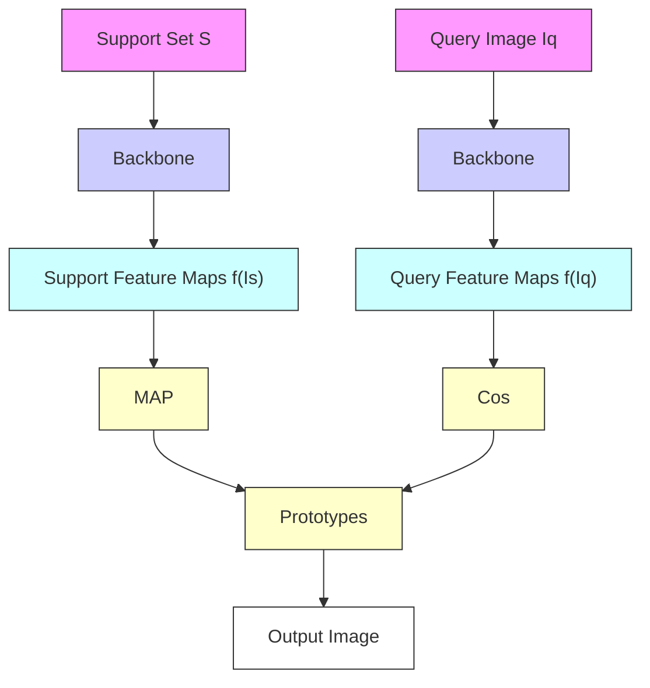
</details>

2. 实现过程：基于元学习（Meta-Learning）的训练范式，整个数据集包括多个episode（⼀个n-wayk-shot任务）。每个episode都包含⽀持集和查询集，样本量若⼲（少量）。在训练集中，每个episode中的样本（⽀持集+查询集）都包含分割标签⽤于计算损失，训练的⽬标是让⽹络学会提取可度量、类内紧凑、类间可分的特征。测试阶段则将模型⽤于新的episode，此时少量有标签样本构成了测试集中的⽀持集，其余⽆标签样本则为查询集。部署时需要提供由⽀持集⽣成的类别原型向量。

参考论⽂：Wang K , Liew J H , Zou Y ,et al.PANet: Few-Shot Image Semantic Segmentation with Prototype Alignment[J].IEEE, 2019.DOI:10.1109/ICCV.2019.00929. (ICCV, 2019)


<details>
<summary>flowchart</summary>

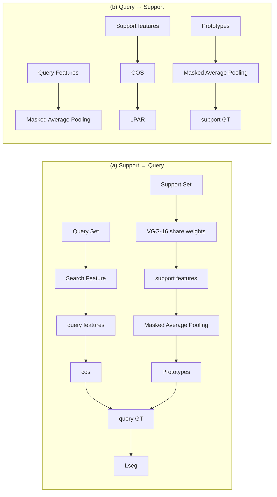
</details>

PANet (Wang et al., 2020)的训练过程（2-way 1-shot）

# 3. 细节澄清：

a. episode指代不同的分割任务，但每个episode的差异不仅来⾃类别，也来⾃样本图像本⾝。因此即使类别相同，只要图像不同，就属于不同的episode；  
b. ⼀般要求训练集与测试集的分割类别数⽬（n-way）⼀致。⽐如测试⽬标只分割⼀类前景，那么训练集中的episode也只分割⼀类；  
c. 基于学术⽬标，元学习范式通常要求训练集与测试集中的分割类别互斥。但在⼯程实践中为了提升效果，可不遵从此原则。另外，学术上专注于1\~5shot的任务，⼯程实践中应该可以更多；  
d. 模型可以拓展到新的分割类别，也能兼容训练集中已有的分割类别。  
e. ⼤多使⽤ResNet系列模型，参数规模不⼤；

# 4. 关键技术点与差异性：不同的原型向量构建⽅式以及特征匹配⽅式。

# 5. 潜在问题：

a. 测试效果受⽀持集样本质量影响；  
b. 类内不⼀致（Intra-class）：同⼀类别内的样本在特征空间中分布不够紧凑，或者说与该类的原型（prototype）差异较⼤、⼀致性差。⽐如分割⽬标体在不同图像中形态表征不同，基于不同⽀持集分割查询图像的结果偏差⼤。  
c. 类间不⼀致（Inter-class）：不同类别在图像中或特征空间中的相似性。⽐如⽀持集样本少，估计的原型偏差⼤，导致类间混淆，模型将相似的类别错分。

Inter-class inconsistency   


<details>
<summary>text_image</summary>

Support
Spleen
LK
</details>


<details>
<summary>natural_image</summary>

Medical scan image showing abdominal organs with a red highlighted region, labeled 'Support GT' (no other text or symbols)
</details>


<details>
<summary>natural_image</summary>

Medical scan image showing abdominal organs with red highlighted areas (no text or symbols)
</details>


<details>
<summary>text_image</summary>

Query
Spleen
LK
</details>


<details>
<summary>natural_image</summary>

Medical scan image showing abdominal organs with a red highlighted area (no text or symbols present)
</details>


<details>
<summary>natural_image</summary>

Medical scan image showing internal organs with a red highlighted region, labeled 'Query prection' (no other text or symbols)
</details>

Intra-class inconsistency   


<details>
<summary>text_image</summary>

Support 1
Liver
</details>


<details>
<summary>text_image</summary>

Query GT
Liver
</details>


<details>
<summary>natural_image</summary>

Medical scan image showing a highlighted blue region in the upper left, labeled 'Query prection' (no other text or symbols)
</details>


<details>
<summary>text_image</summary>

Support 2
Liver
</details>


<details>
<summary>text_image</summary>

Query GT
Liver
</details>


<details>
<summary>natural_image</summary>

Medical scan image showing a highlighted region in cyan against a dark background, labeled 'Query prection' (no other text or symbols)
</details>

# 2.1.2 在医学图像分割中的应⽤

# 2.1.2.1 PONet：使⽤查询图像优化原型特征

参考论⽂：Wang S , Yu X , Chi J ,et al.PONet: Prototype optimization network for few-shot medical image segmentation[J].Neurocomputing, 2025, 652(000):16.DOI:10.1016/j.neucom.2025.131113.

Code: https://github.com/WANGSIQII/FSS/tree/main

1. ⽅法核⼼：原型⽹络的改进，缓解类内不⼀致和类间不⼀致的问题。

a. 边界原型对⽐学习（BPCL）：

i. 对于⽀持集图像，通过SLIC算法分割超像素（将图像划分为⼀组感知上⼀致、形状紧凑、⼤⼩均匀的⼩区域），基于超像素图将标签掩码分解为三个部分：前景区域mask、临近前景边界的背景区域mask、⾮临近边界的背景mask。再结合⽀持图像的编码特征⽣成三类原型；  
ii. 构建对⽐学习范式：将边界背景区域原型作为锚点，前景原型作为负样本，⾮边界背景原型作为正样本。最⼩化锚点与正样本的距离，最⼤化其与负样本的距离；另外，边界背景区域和⾮边界背景区域原型将合并作为背景原型⽤于后续步骤；

$$
\mathcal {L} _ {\text { contrast }} = \sum_ {n = 1} ^ {K _ {2}} \max \left(L _ {2} \left(\boldsymbol {p} _ {n} ^ {\mathrm{b} - \mathrm{a}}, \boldsymbol {P} _ {\text { positive }}\right) - L _ {2} \left(\boldsymbol {p} _ {n} ^ {\mathrm{b} - \mathrm{a}}, \boldsymbol {P} _ {\text { negative }}\right) + M, 0\right)
$$

b. 查询引导的原型优化（QGPO）：

i. ⽀持集的前景原型与背景原型分别与查询图像特征进⾏相似性匹配，分别⽣成相应区域掩码，再通过加权得到前景掩码，⽽后结合查询图像特征⽣成查询图像原型；  
ii. 通过Bias-alleviationMamba模块从⽀持集原型中滤除与查询图像⽆关的信息；


<details>
<summary>flowchart</summary>

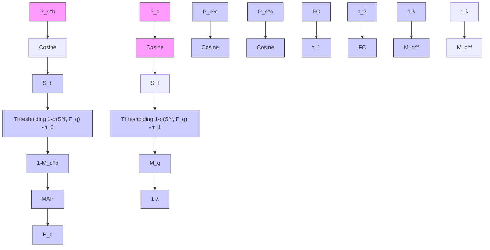
</details>


<details>
<summary>flowchart</summary>

```mermaid
graph TD
    A["QPG"] --> B["GAP"]
    B --> C["P_s^f"]
    C --> D["Bias-alleviation Mamba"]
    D --> E["Softmax"]
    E --> F["Mamba"]
    F --> G["×3"]
    H["Linear Lateral"] --> I["x1"]
    I --> J["x2"]
    J --> K["+"]
    K --> L["Linear"]
    L --> M["x3"]
    N["P_q"] --> O["P_s^f"]
    O --> P["S_0.96, 0.52, 0.75, 0.96, 0.75, 0.96"]
    P --> Q["Softmax"]
    Q --> R["×"]
    R --> S["Mamba"]
    S --> T["×3"]
    U["P_s"] --> V["..."]
    V --> W["..."]
    W --> X["..."]
    X --> Y["..."]
    Y --> Z["..."]
    Z --> AA["..."]
    AA --> AB["..."]
    AB --> AC["..."]
    AC --> AD["..."]
    AD --> AE["..."]
    AE --> AF["..."]
    AF --> AG["..."]
    AG --> AH["..."]
    AH --> AI["..."]
    AI --> AJ["..."]
    AJ --> AK["..."]
    AK --> AL["..."]
    AL --> AM["..."]
    AM --> AN["..."]
    AN --> AO["..."]
    AO --> AP["..."]
    AP --> AQ["..."]
    AQ --> AR["..."]
    AR --> AS["..."]
    AS --> AT["..."]
    AT --> AU["..."]
    AU --> AV["..."]
    AV --> AW["..."]
    AW --> AX["..."]
    AX --> AY["..."]
    AY --> AZ["..."]
    AZ --> BA["..."]
    BA --> BB["..."]
    BB --> BC["..."]
    BC --> BD["..."]
    BD --> BE["..."]
    BE --> BF["..."]
    BF --> BG["..."]
    BG --> BH["..."]
    BH --> BI["..."]
    BI --> BJ["..."]
    BJ --> BK["..."]
    BK --> BL["..."]
    BL --> BM["..."]
    BM --> BN["..."]
    BN --> BO["..."]
    BO --> BP["..."]
    BP --> BQ["..."]
    BQ --> BR["..."]
    BR --> BS["..."]
    BS --> BT["..."]
    BT --> BU["..."]
    BU --> BV["..."]
    BV --> BW["..."]
    BW --> BX["..."]
    BX --> BY["..."]
    BY --> BZ["..."]
```
</details>


<details>
<summary>flowchart</summary>

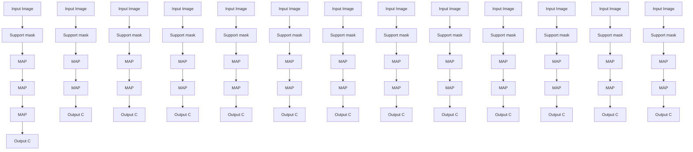
</details>


<details>
<summary>text_image</summary>

Element-wise multiplication
Matrix multiplication
Element-wise addition
Concatenation
SiLu activation
MAP Masked average pooling
Cos Cosine
LN Layer normalization
Linear Linear layer
Convld 1d Convolution
</details>


<details>
<summary>flowchart</summary>

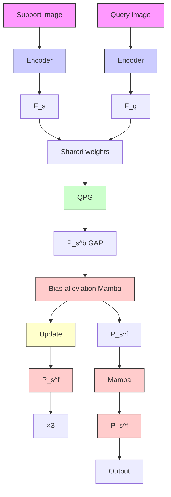
</details>


<details>
<summary>flowchart</summary>

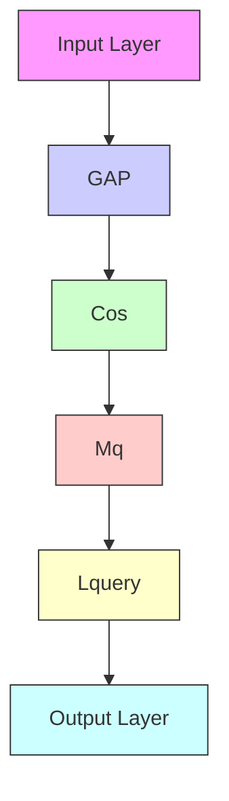
</details>

# 2. 实验效果：

a. 数据集：腹部MRI（20个Volume，平均每个36个slice），腹部CT（30个Volume），⼼脏MRI（35个Volume，平均每个13个slice）  
b. 使⽤ResNet-50作为编码器（MS-COCO数据集预训练），1-way 1-shot训练，batchsize为1，限制50k次迭代；  
c. 两种训练⽅式设置：

▪ Setting1：相似域内的测试；训练集与测试集的图像来源于同⼀个域，但是测试集的分割任务并不包含在训练集中；换⾔之，在训练阶段，模型实际上⻅过测试集中的分割⽬标，但这些分割⽬标并没有被标注和训练。⽐如说，训练集是T1腹部图像的肾脏分割、肝脏分割，⽽测试集是T1腹部图像的胰腺分割。  
▪ Setting2：跨域测试；训练集与测试集的图像来源于不同域。换⾔之，测试集中的分割⽬标不会出现在训练集的图像前景/背景区域。

d. 在Setting 1的情况下，结果Dice通常显著优于Setting 2，各器官dice⼤多超过0.8。但在⼼脏磁共振数据中，⼼肌dice偏低（67）。

Table 2   
Experimental comparison results on the Abd-MRI and Abd-CT datasets. 

<table><tr><td rowspan="2">Setting</td><td rowspan="2">Method</td><td rowspan="2">Source</td><td rowspan="2">Year</td><td colspan="5">Abd MRI</td><td colspan="5">Abd-CT</td></tr><tr><td>LK</td><td>RK</td><td>Spleen</td><td>Liver</td><td>mDSC</td><td>mRF1</td><td>LK</td><td>RK</td><td>Spleen</td><td>Liver</td></tr><tr><td rowspan="16">1</td><td>SSL-ALPNPer [19]</td><td>TMI</td><td>2022</td><td>81,92</td><td>85,18</td><td>72,18</td><td>76,10</td><td>78,84</td><td>65,26</td><td>72,36</td><td>71,81</td><td>70,96</td><td>78,29</td></tr><tr><td>SR&amp;CL [42]</td><td>MICCAI</td><td>2022</td><td>79,34</td><td>87,42</td><td>76,01</td><td>80,23</td><td>80,77</td><td>67,35</td><td>73,45</td><td>71,22</td><td>73,41</td><td>76,66</td></tr><tr><td>ADNet + + [20]</td><td>MIA</td><td>2023</td><td>86,80</td><td>86,62</td><td>75,69</td><td>74,85</td><td>80,99</td><td>66,35</td><td>53,47</td><td>50,29</td><td>65,76</td><td>74,24</td></tr><tr><td>Q-Net [43]</td><td>IstellLys</td><td>2023</td><td>78,36</td><td>87,98</td><td>75,99</td><td>81,74</td><td>81,02</td><td>68,22</td><td>76,89</td><td>71,87</td><td>76,31</td><td>77,08</td></tr><tr><td>CRAPNet [17]</td><td>WAC</td><td>2023</td><td>81,92</td><td>86,42</td><td>74,32</td><td>74,86</td><td>79,76</td><td>77,63</td><td>74,69</td><td>71,18</td><td>70,74</td><td>75,43</td></tr><tr><td>CAT [18]</td><td>MICCAI</td><td>2023</td><td>74,01</td><td>78,90</td><td>68,83</td><td>78,98</td><td>75,18</td><td>64,36</td><td>63,36</td><td>60,05</td><td>67,65</td><td>75,31</td></tr><tr><td>RPT [44]</td><td>MICCAI</td><td>2023</td><td>81,83</td><td>88,73</td><td>76,37</td><td>82,59</td><td>82,38</td><td>70,77</td><td>76,52</td><td>80,57</td><td>72,38</td><td>81,32</td></tr><tr><td>PFDMN [45]</td><td>CMG</td><td>2014</td><td>77,48</td><td>83,35</td><td>72,33</td><td>73,55</td><td>76,15</td><td>65,88</td><td>70,54</td><td>70,48</td><td>69,52</td><td>70,96</td></tr><tr><td>DPGAPNet [46]</td><td>TIM</td><td>2024</td><td>85,84</td><td>86,99</td><td>79,62</td><td>81,31</td><td>83,70</td><td>75,45</td><td>82,67</td><td>79,56</td><td>83,28</td><td>65,59</td></tr><tr><td>CGNet [41]</td><td>CMG</td><td>2025</td><td>80,43</td><td>82,69</td><td>76,33</td><td>77,31</td><td>79,19</td><td>70,62</td><td>75,26</td><td>70,38</td><td>73,35</td><td>73,02</td></tr><tr><td>PGRNet [47]</td><td>TMI</td><td>2025</td><td>81,44</td><td>87,44</td><td>81,72</td><td>83,27</td><td>83,47</td><td>74,96</td><td>74,23</td><td>79,88</td><td>72,09</td><td>82,48</td></tr><tr><td>VCT [48]</td><td>Neuro</td><td>2025</td><td>80,57</td><td>84,82</td><td>77,38</td><td>78,95</td><td>80,40</td><td>70,63</td><td>78,66</td><td>76,38</td><td>76,60</td><td>78,52</td></tr><tr><td>BIASAM [49]</td><td>ISPL</td><td>2025</td><td>82,35</td><td>83,50</td><td>76,89</td><td>78,82</td><td>80,39</td><td>72,21</td><td>76,58</td><td>75,36</td><td>76,21</td><td>77,35</td></tr><tr><td>MSAG-SAM [50]</td><td>JBHI</td><td>2025</td><td>84,36</td><td>86,58</td><td>77,65</td><td>82,30</td><td>82,73</td><td>74,36</td><td>76,85</td><td>77,16</td><td>78,09</td><td>77,82</td></tr><tr><td>U-Net [23]</td><td>MICCAI</td><td>2015</td><td>80,64</td><td>83,35</td><td>75,39</td><td>75,22</td><td>78,40</td><td>71,35</td><td>76,31</td><td>76,45</td><td>76,36</td><td>78,25</td></tr><tr><td>ISONet [60]</td><td>ESWA</td><td>2025</td><td>81,28</td><td>84,52</td><td>76,58</td><td>78,63</td><td>80,25</td><td>71,67</td><td>77,25</td><td>76,85</td><td>74,44</td><td>76,85</td></tr><tr><td></td><td>Ours</td><td>–</td><td></td><td>88,66</td><td>90,26</td><td>80,32</td><td>84,60</td><td>85,96</td><td>77,49</td><td>80,65</td><td>80,89</td><td>79,19</td><td>83,63</td></tr><tr><td rowspan="16">2</td><td>SSL-ALPNPer[19]</td><td>TMI</td><td>2022</td><td>73,63</td><td>78,39</td><td>67,02</td><td>73,05</td><td>73,02</td><td>61,22</td><td>63,34</td><td>54,82</td><td>60,25</td><td>73,65</td></tr><tr><td>SR&amp;CL [42]</td><td>MICCAI</td><td>2022</td><td>77,07</td><td>84,24</td><td>73,73</td><td>75,55</td><td>77,65</td><td>72,41</td><td>67,39</td><td>63,37</td><td>67,36</td><td>73,63</td></tr><tr><td>ADNet + + [20]</td><td>MIA</td><td>2023</td><td>76,25</td><td>77,82</td><td>69,88</td><td>70,65</td><td>73,65</td><td>67,21</td><td>45,62</td><td>45,36</td><td>61,76</td><td>68,42</td></tr><tr><td>Q-Net [43]</td><td>IstellLys</td><td>2023</td><td>64,82</td><td>65,94</td><td>65,37</td><td>78,48</td><td>68,59</td><td>60,88</td><td>65,02</td><td>51,47</td><td>63,38</td><td>77,07</td></tr><tr><td>CRAPNet [17]</td><td>WACY</td><td>2023</td><td>74,66</td><td>82,77</td><td>70,82</td><td>73,82</td><td>75,52</td><td>68,58</td><td>70,91</td><td>67,33</td><td>70,17</td><td>70,45</td></tr><tr><td>CAT [18]</td><td>MICCAI</td><td>2023</td><td>75,31</td><td>83,23</td><td>67,31</td><td>75,02</td><td>75,22</td><td>70,31</td><td>68,82</td><td>64,56</td><td>66,02</td><td>80,51</td></tr><tr><td>RPT [44]</td><td>MICCAI</td><td>2023</td><td>74,51</td><td>86,73</td><td>75,80</td><td>81,09</td><td>79,53</td><td>72,52</td><td>72,36</td><td>67,54</td><td>71,95</td><td>74,13</td></tr><tr><td>PFDMN [45]</td><td>CMG</td><td>2014</td><td>72,11</td><td>74,35</td><td>68,25</td><td>79,31</td><td>71,05</td><td>66,35</td><td>66,25</td><td>69,35</td><td>65,30</td><td>65,34</td></tr><tr><td>DPGAPNet [46]</td><td>TIM</td><td>2024</td><td>73,76</td><td>75,96</td><td>74,10</td><td>69,21</td><td>73,72</td><td>68,21</td><td>74,10</td><td>68,06</td><td>65,91</td><td>65,56</td></tr><tr><td>CGNet [41]</td><td>CMG</td><td>2025</td><td>76,38</td><td>77,25</td><td>74,36</td><td>72,09</td><td>75,02</td><td>69,28</td><td>70,23</td><td>66,36</td><td>69,39</td><td>70,82</td></tr><tr><td>PZGA-SAM [47]</td><td>TMI</td><td>2025</td><td>77,35</td><td>81,25</td><td>73,58</td><td>78,48</td><td>77,66</td><td>69,58</td><td>69,71</td><td>67,88</td><td>68,36</td><td>75,35</td></tr><tr><td>VIT-CAPS [48]</td><td>Neuro</td><td>2025</td><td>74,05</td><td>79,36</td><td>74,21</td><td>75,06</td><td>75,81</td><td>70,88</td><td>73,48</td><td>69,14</td><td>67,25</td><td>70,21</td></tr><tr><td>BIASAM [49]</td><td>ISPL</td><td>2025</td><td>73,55</td><td>77,43</td><td>72,80</td><td>73,98</td><td>74,44</td><td>67,59</td><td>70,66</td><td>68,17</td><td>67,89</td><td>73,16</td></tr><tr><td>MSAG-SAM [50]</td><td>JBHI</td><td>2025</td><td>76,82</td><td>82,58</td><td>73,55</td><td>79,09</td><td>78,01</td><td>72,43</td><td>70,85</td><td>69,16</td><td>70,38</td><td>75,08</td></tr><tr><td>U-Net [23]</td><td>MICCAI</td><td>2015</td><td>74,53</td><td>76,31</td><td>68,13</td><td>70,02</td><td>72,40</td><td>66,36</td><td>66,31</td><td>66,31</td><td>69,27</td><td>71,29</td></tr><tr><td>ISONet [60]</td><td>ESWA</td><td>2025</td><td>73,06</td><td>76,58</td><td>71,33</td><td>72,33</td><td>73,33</td><td>66,21</td><td>69,33</td><td>67,39</td><td>68,21</td><td>70,25</td></tr><tr><td></td><td>Ours</td><td></td><td></td><td>78,83</td><td>87,23</td><td>76,62</td><td>81,66</td><td>81,83</td><td>75,53</td><td>76,21</td><td>72,12</td><td>74,53</td><td>77,56</td></tr></table>

\*Best results are shown inbold,suboptimalresultsare indicaedbyahorzontaline.

Table 3   
Experimental comparison results on the Card-MRI dataset 

<table><tr><td rowspan="2">Setting</td><td rowspan="2">Method</td><td rowspan="2">Source</td><td rowspan="2">Year</td><td colspan="5">Card-MRI</td></tr><tr><td>LV-BP</td><td>LV-MYO</td><td>RV</td><td>mDSC</td><td>mBF1</td></tr><tr><td rowspan="16">1</td><td>SSL-ALPNet [19]</td><td>TMI</td><td>2022</td><td>83.99</td><td>66.74</td><td>79.96</td><td>76.90</td><td>68.35</td></tr><tr><td>SR&amp;CL [42]</td><td>MICCAI</td><td>2022</td><td>84.74</td><td>65.83</td><td>78.41</td><td>76.32</td><td>69.22</td></tr><tr><td>ADNet + + [20]</td><td>MIA</td><td>2023</td><td>82.79</td><td>58.67</td><td>67.57</td><td>69.68</td><td>64.43</td></tr><tr><td>Q-Net [43]</td><td>IntelliSys</td><td>2023</td><td>90.25</td><td>65.92</td><td>78.19</td><td>78.15</td><td>71.69</td></tr><tr><td>CRAPNet [17]</td><td>WACV</td><td>2023</td><td>83.02</td><td>65.48</td><td>78.27</td><td>75.59</td><td>69.08</td></tr><tr><td>CAT [18]</td><td>MICCAI</td><td>2023</td><td>90.54</td><td>66.85</td><td>79.71</td><td>79.03</td><td>73.36</td></tr><tr><td>RPT [44]</td><td>MICCAI</td><td>2023</td><td>89.57</td><td>66.82</td><td>80.17</td><td>78.85</td><td>74.66</td></tr><tr><td>PFMNet [45]</td><td>CMIG</td><td>2024</td><td>86.35</td><td>61.58</td><td>74.38</td><td>74.10</td><td>69.31</td></tr><tr><td>DGPANet [46]</td><td>TIM</td><td>2024</td><td>89.82</td><td>67.62</td><td>80.09</td><td>79.18</td><td>74.13</td></tr><tr><td>CGNet [41]</td><td>CMIG</td><td>2025</td><td>87.82</td><td>64.28</td><td>75.33</td><td>75.81</td><td>68.19</td></tr><tr><td>PGRNet [47]</td><td>TMI</td><td>2025</td><td>88.52</td><td>62.59</td><td>77.47</td><td>76.52</td><td>70.22</td></tr><tr><td>ViT-CAPS [48]</td><td>Neuro.</td><td>2025</td><td>86.53</td><td>60.86</td><td>76.57</td><td>74.65</td><td>67.39</td></tr><tr><td>BiASAM [49]</td><td>ISPL</td><td>2025</td><td>88.12</td><td>63.59</td><td>77.23</td><td>76.31</td><td>70.28</td></tr><tr><td>MASG-SAM [50]</td><td>JBHI</td><td>2025</td><td>89.35</td><td>65.93</td><td>78.88</td><td>78.05</td><td>73.36</td></tr><tr><td>U-Net [23]</td><td>MICCAI</td><td>2015</td><td>84.28</td><td>61.39</td><td>75.48</td><td>73.71</td><td>67.77</td></tr><tr><td>ISONet [60]</td><td>ESWA</td><td>2025</td><td>86.86</td><td>61.83</td><td>75.85</td><td>74.84</td><td>65.25</td></tr><tr><td></td><td>Ours</td><td>-</td><td>-</td><td>91.44</td><td>67.85</td><td>80.65</td><td>79.98</td><td>75.45</td></tr></table>

\* Best results are shown in bold, suboptimal results are indicated by a horizontal line.

# 3. ⽅法特性：

a. 论⽂呈现的效果很好，但其⽅法受超参数影响较⼤。⽐如超像素块的个数，设置从10\~200，器官分割Dice最⼤偏差超过4。  
b. shot越⼤，效果越好（必然）。但5 shot的效果已经⾜够好。

Table 7 DSC scores for different shot setings. 

<table><tr><td>Setting</td><td>LK</td><td>RK</td><td>Spleen</td><td>Liver</td><td>mDSC</td></tr><tr><td>1-shot</td><td>88.66</td><td>90.26</td><td>80.32</td><td>84.60</td><td> $85.96 \pm 2.64$ </td></tr><tr><td>5-shot</td><td>91.32</td><td>92.43</td><td>84.18</td><td>87.43</td><td> $88.84 \pm 2.43$ </td></tr><tr><td>10-shot</td><td>91.38</td><td>92.46</td><td>84.20</td><td>87.45</td><td> $88.87 \pm 2.73$ </td></tr><tr><td>30-shot</td><td>91.39</td><td>92.45</td><td>84.22</td><td>87.46</td><td> $88.88 \pm 2.38$ </td></tr></table>

# 2.1.2.2 PFMNet：基于原型特征的⼩样本域⾃适应

参考论⽂：Runze Wang and Guoyan Zheng. 2024. PFMNet: Prototype-based feature mapping network for few-shot domain adaptation in medical image segmentation. Computerized Medical Imaging and Graphics, 2024, 102406.DOI:https://doi.org/10.1016/j.compmedimag.2024.102406

# Code: Not Available

1. ⽅法核⼼：区别于基于元学习框架的原型⽹络，论⽂聚焦于⼩样本域⾃适应（DomainAdaption），解决数据域偏移（Domain Shift）的问题。

a. 适应场景是有⼤量标注的源域（Source Domain）样本和少量标注的⽬标域(Target Domain)样本的情况。  
b. 基于编码-解码的分割架构。在编码器末端添加原型特征（Ψ）的学习机制PFM。M为原型特征映射矩阵，通过Φ与Ψ（可学习）计算得到，作⽤是将⽬标域特征原型与源域做匹配；  
c. PFM模块也会将⽬标域的特征转换到源域，实现特征层⾯的域⾃适应；转换后的特征经过解码器输出对⽬标域图像的分割结果；


<details>
<summary>flowchart</summary>

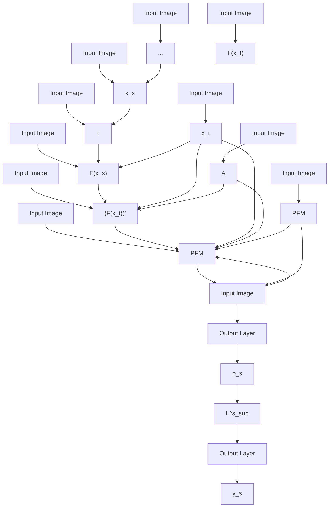
</details>


<details>
<summary>flowchart</summary>

```mermaid
graph TD
    A["F(x_t)"] -->|AvgPool| B["Φ"]
    C["F(x_t)"] --> D["M"]
    E["(F(x_t))"]' --> D
    B --> F["Ψ"]
    D --> F
    F --> G["cos"]
    G --> H["L_reg^s"]
    H <--> I["p̃_s"]
    I <--> J["..."]
    J --> K["ŷ_s"]
    L["F(x_s)"] --> G
    M["F(x_t)"] --> D
```
</details>

# 2. 实验效果

a. 在三类分割任务上验证⽅法效果，每个任务中⽬标域标注样本量≤20，剩余⽤于验证/测试：

i. 眼底图像分割：REFUGE数据集中的1200张图像构成源域数据，RIM-One数据集中的159张图像构成⽬标域数据；  
ii. ⼼脏结构分割：832张CT⼼脏图像构成源域数据，528张MR⼼脏图像构成⽬标域数据；  
iii. 结肠息⾁分割：CVC-612和Kvasir数据集重点1612张图像构成源域数据，CVC-300数据集中的60张图像构成⽬标域数据；

b. 与其它SOTA域⾃适应⽅法对⽐效果，包括⽆监督域⾃适应⽅法FDA、Advent，以及⼩样本域⾃适应⽅法Polyformer、PixDA；相较于不做域⾃适应（源域训练后直接⽤于⽬标域），论⽂中的⽅法在三类任务中的效果显著。标注5例，dice超过0.83；标注20例，dice超过0.87，优于其它对⽐⽅法。  
c. 编码器为ResNet101，解码器为ASPP（Atrous Spatial Pyramid Pooling）。训练参数量47M，显存占⽤11G、每次迭代耗时0.23s。（256x256的2D图像输⼊，3090显卡）


Source

Source-Only

FDA

Advent

Polyformer

PixDA

Ours

Table 3 Quantitative comparison of our method with the source-only setup and other SOTA methods. 

<table><tr><td rowspan="2">Shot</td><td rowspan="2">Methods</td><td colspan="3">Optic disc/cup segmentation</td><td colspan="4">Cardiac structure segmentation</td><td rowspan="2">Polyp segmentation</td></tr><tr><td>Disc</td><td>Cup</td><td>Mean</td><td>LV</td><td>MYO</td><td>RV</td><td>Mean</td></tr><tr><td></td><td>Source-only</td><td>83.68 ± 9.84</td><td>73.25 ± 18.81</td><td>78.47 ± 12.90</td><td>81.13 ± 11.64</td><td>44.30 ± 16.22</td><td>79.26 ± 11.51</td><td>68.23 ± 10.25</td><td>77.61 ± 22.80</td></tr><tr><td rowspan="5">5-shot</td><td>FDA (Yang and Soatto, 2020)</td><td>87.73 ± 3.56</td><td>73.95 ± 15.38</td><td>80.84 ± 8.29</td><td>87.82 ± 9.63</td><td>64.13 ± 13.56</td><td>83.53 ± 7.85</td><td>78.49 ± 8.07</td><td>84.74 ± 17.69</td></tr><tr><td>Advent (Vu et al., 2019)</td><td>86.01 ± 3.69</td><td>75.49 ± 14.10</td><td>80.75 ± 8.09</td><td>87.47 ± 9.39</td><td>62.55 ± 15.71</td><td>83.84 ± 7.94</td><td>77.95 ± 8.54</td><td>82.71 ± 18.49</td></tr><tr><td>Polyformer (Li et al., 2021)</td><td>93.58 ± 5.89</td><td>73.41 ± 23.69</td><td>83.50 ± 13.84</td><td>84.72 ± 11.17</td><td>69.75 ± 9.60</td><td>79.68 ± 10.22</td><td>78.05 ± 8.55</td><td>84.26 ± 20.56</td></tr><tr><td>PixDA (Tavera et al., 2022)</td><td>86.64 ± 4.17</td><td>75.78 ± 13.43</td><td>81.21 ± 7.77</td><td>90.06 ± 10.08</td><td>71.33 ± 12.84</td><td>86.02 ± 7.93</td><td>82.47 ± 8.13</td><td>88.51 ± 8.70</td></tr><tr><td>Ours</td><td>91.05 ± 9.08</td><td>79.34 ± 13.10</td><td>85.19 ± 9.35</td><td>90.89 ± 9.68</td><td>72.89 ± 11.71</td><td>87.21 ± 7.84</td><td>83.67 ± 8.20</td><td>91.68 ± 4.56</td></tr><tr><td rowspan="5">10-shot</td><td>FDA (Yang and Soatto, 2020)</td><td>87.12 ± 5.16</td><td>73.17 ± 18.74</td><td>80.14 ± 10.97</td><td>86.16 ± 10.39</td><td>63.35 ± 14.63</td><td>83.79 ± 8.17</td><td>77.77 ± 8.80</td><td>82.29 ± 19.85</td></tr><tr><td>Advent (Vu et al., 2019)</td><td>86.67 ± 3.98</td><td>76.90 ± 13.05</td><td>81.79 ± 7.46</td><td>86.40 ± 10.63</td><td>63.49 ± 15.34</td><td>83.12 ± 8.35</td><td>77.67 ± 9.43</td><td>78.83 ± 24.01</td></tr><tr><td>Polyformer (Li et al., 2021)</td><td>90.57 ± 14.98</td><td>77.61 ± 21.71</td><td>84.09 ± 17.69</td><td>87.76 ± 11.91</td><td>74.17 ± 9.70</td><td>82.90 ± 10.35</td><td>81.61 ± 9.09</td><td>86.17 ± 14.12</td></tr><tr><td>PixDA (Tavera et al., 2022)</td><td>90.31 ± 4.54</td><td>78.18 ± 12.01</td><td>84.25 ± 6.85</td><td>91.19 ± 9.96</td><td>76.19 ± 11.49</td><td>87.86 ± 7.41</td><td>85.08 ± 7.89</td><td>91.31 ± 6.16</td></tr><tr><td>Ours</td><td>94.13 ± 2.89</td><td>82.03 ± 10.06</td><td>88.08 ± 5.27</td><td>91.74 ± 9.27</td><td>78.15 ± 9.78</td><td>88.76 ± 7.78</td><td>86.21 ± 7.79</td><td>92.95 ± 3.07</td></tr><tr><td rowspan="5">15-shot</td><td>FDA (Yang and Soatto, 2020)</td><td>86.27 ± 3.81</td><td>76.95 ± 13.19</td><td>81.61 ± 7.44</td><td>86.86 ± 10.36</td><td>64.43 ± 13.14</td><td>82.96 ± 8.79</td><td>78.08 ± 8.82</td><td>81.54 ± 19.62</td></tr><tr><td>Advent (Vu et al., 2019)</td><td>85.98 ± 3.91</td><td>75.77 ± 14.15</td><td>80.88 ± 7.92</td><td>87.34 ± 9.89</td><td>64.84 ± 11.70</td><td>82.69 ± 8.77</td><td>78.29 ± 8.01</td><td>79.62 ± 17.98</td></tr><tr><td>Polyformer (Li et al., 2021)</td><td>93.34 ± 5.68</td><td>80.53 ± 14.34</td><td>86.93 ± 9.20</td><td>88.52 ± 11.35</td><td>74.85 ± 9.65</td><td>83.14 ± 10.60</td><td>82.17 ± 8.99</td><td>89.24 ± 11.42</td></tr><tr><td>PixDA (Tavera et al., 2022)</td><td>89.41 ± 4.30</td><td>78.65 ± 11.59</td><td>84.03 ± 6.46</td><td>91.68 ± 10.04</td><td>78.37 ± 10.80</td><td>88.49 ± 7.67</td><td>86.18 ± 7.96</td><td>89.45 ± 15.83</td></tr><tr><td>Ours</td><td>94.87 ± 2.90</td><td>81.64 ± 10.07</td><td>88.25 ± 5.38</td><td>91.84 ± 9.78</td><td>79.90 ± 10.37</td><td>88.85 ± 8.20</td><td>86.87 ± 8.62</td><td>93.51 ± 2.03</td></tr><tr><td rowspan="5">20-shot</td><td>FDA (Yang and Soatto, 2020)</td><td>87.11 ± 3.42</td><td>76.11 ± 13.90</td><td>81.61 ± 7.57</td><td>86.80 ± 9.24</td><td>62.49 ± 12.77</td><td>83.92 ± 8.26</td><td>77.74 ± 7.77</td><td>78.67 ± 19.65</td></tr><tr><td>Advent (Vu et al., 2019)</td><td>87.90 ± 3.92</td><td>75.37 ± 13.67</td><td>81.63 ± 7.60</td><td>87.12 ± 10.19</td><td>64.12 ± 11.97</td><td>83.13 ± 8.38</td><td>78.12 ± 8.10</td><td>78.99 ± 23.33</td></tr><tr><td>Polyformer (Li et al., 2021)</td><td>93.88 ± 6.05</td><td>80.46 ± 15.85</td><td>87.17 ± 10.23</td><td>89.03 ± 11.21</td><td>75.39 ± 9.70</td><td>84.12 ± 9.61</td><td>82.85 ± 8.62</td><td>89.22 ± 10.07</td></tr><tr><td>PixDA (Tavera et al., 2022)</td><td>90.41 ± 4.61</td><td>79.88 ± 10.52</td><td>85.14 ± 5.98</td><td>91.92 ± 10.41</td><td>79.56 ± 10.21</td><td>89.46 ± 6.91</td><td>86.98 ± 7.91</td><td>92.30 ± 3.28</td></tr><tr><td>Ours</td><td>95.35 ± 2.42</td><td>82.37 ± 9.82</td><td>88.86 ± 5.11</td><td>92.36 ± 9.91</td><td>80.71 ± 9.82</td><td>89.82 ± 7.45</td><td>87.63 ± 7.95</td><td>93.59 ± 2.98</td></tr></table>

Table 5 Efficiency comparison between our method and other SOTA methods. 

<table><tr><td>Method</td><td>Parameters (M)</td><td>GPU memory (MB)</td><td>Times (s)</td></tr><tr><td>FDA (Yang and Soatto, 2020)</td><td>45.6</td><td>11651</td><td>0.48</td></tr><tr><td>Advent (Vu et al., 2019)</td><td>45.6</td><td>11651</td><td>0.27</td></tr><tr><td>Polyformer (Li et al., 2021)</td><td>52.8</td><td>18637</td><td>0.20</td></tr><tr><td>PixDA (Tavera et al., 2022)</td><td>45.7</td><td>11705</td><td>0.59</td></tr><tr><td>Ours</td><td>47.0</td><td>11559</td><td>0.23</td></tr></table>

训练资源占⽤⽐较（256\*256的2D图像输⼊，3090显卡）

# 3. ⽅法特性：

a. 源域与⽬标域分割⽬标⼀致，训练后模型对源域和⽬标域数据都适应；  
b. 适合于研发阶段某类型数据特别少的情况下（如罕⻅疾病等数据资源稀缺），拓展模型兼容性；  
c. 域⾃适应效果显著，在跨模态（CT、MR⼼脏分割）场景下，10shot便使得dice＞0.86；

# 2.1.2.3 ProtoSAM：结合DinoV2与原型学习的SAM提⽰词构建

参考论⽂：Ayzenberg L , Giryes R , Greenspan H .ProtoSAM for automated one shot medical image segmentation using foundational models[J].Scientific Reports, 2025, 15(1).DOI:10.1038/s41598-025-06643-0.

Code：https://github.com/levayz/ProtoSAM/

结合原型⽹络和SAM实现全⾃动的1-shot医学图像分割。

• 基于DinoV2的原型⽹络：先根据查询图像通过DinoV2编码器获取类别特征原型，从⽽进⼀步获得查询图像的粗分割结果；  
• ⾃动提⽰词⽣成：基于粗分割结果，依据置信度评分个连通域筛选构造Bbox、⽬标中⼼点、最⾼置信点的提⽰；  
SAM分割：接受查询图像与相应提⽰词输出最终分割结果；  
• EFT编码器微调（可选）：采⽤⾃监督的⽅式，使⽤LoRA微调DinoV2编码器；


<details>
<summary>flowchart</summary>

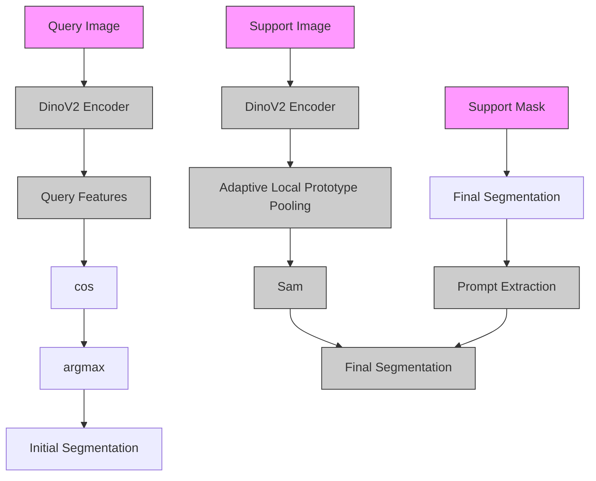
</details>

Fig.1: ProtoSAM Framework: A DINOv2 encoder derives features from query and support images. Foreground and background prototypes are crafted from support features and masked through the ALP module. Initial segmentation is achieved by comparing these prototypes with query features using cosine simi-larity. The system extracts prompts from an initial prediction to guide the SAM model for enhanced segmentation. 

<table><tr><td rowspan="2">Method</td><td></td><td>LK</td><td>RK</td><td>Spleen</td><td>Liver</td><td>Mean</td></tr><tr><td>SSL</td><td>MRI / CT</td><td>MRI / CT</td><td>MRI / CT</td><td>MRI / CT</td><td>MRI / CT</td></tr><tr><td colspan="7">Few-Shot</td></tr><tr><td> $SSL-ALPNet^9$ </td><td>✓</td><td>73.63±4.60 / 63.34±9.33</td><td>78.39±5.51 / 54.82±11.7</td><td>67.02±7.98 / 60.25±6.67</td><td>73.05±3.49 / 73.65±3.61</td><td>73.02±6.01 / 63.02±7.97</td></tr><tr><td> $SSL-ALPNet+BP^{10}$ </td><td>✓</td><td>78.77 / 66.04</td><td>83.44 / 62.14</td><td>70.02 / 68.39</td><td>75.01 / 73.90</td><td>76.81 / 67.62</td></tr><tr><td> $CRAP-Net^{11}$ </td><td>✓</td><td>74.66 / 70.91</td><td>82.77 / 67.33</td><td>73.82 / 70.17</td><td>70.82 / 70.45</td><td>73.82 / 69.72</td></tr><tr><td> $CRTPNet^{12}$ </td><td>✓</td><td>76.74 / 66.37</td><td>80.15 / 61.05</td><td>70.07 / 67.92</td><td>73.36 / 73.88</td><td>75.08 / 67.31</td></tr><tr><td> $SSL-DINOv2^{13}$ </td><td>✓</td><td>75.06±11.61 / 69.96±11.61</td><td>80.21±2.14 / 66.40±12.99</td><td>71.86±10.30 / 73.00±6.49</td><td>73.50±5.95 / 76.40±3.89</td><td>75.16±2.14 / 71.44±6.49</td></tr><tr><td> $SSL-DINOv2+CCA^{13}$ </td><td>✓</td><td>81.43±13.84 / 66.40±13.84</td><td>84.40±4.07 / 69.96±13.65</td><td>73.30±10.27 / 74.60±6.58</td><td>74.20±5.46 / 81.67±4.41</td><td>78.43±4.07 / 73.16±6.58</td></tr><tr><td> $PerSAM^{33}$ </td><td>✘</td><td>35.72 / 23.89</td><td>40.27 / 25.85</td><td>41.53 / 22.31</td><td>14.96 / 25.98</td><td>33.12 / 24.51</td></tr><tr><td>PerSAM-modified</td><td>✘</td><td>53.76±7.41 / 45.05±11.48</td><td>62.30±6.33/43.29±12.13</td><td>68.65±10.46 / 57.36±10.27</td><td>64.38±10.66 / 80.75±1.56</td><td>62.27±6.26 / 56.61±17.27</td></tr><tr><td> $AutoSAM^{17}$ </td><td>✘</td><td>61.07 / 43.20</td><td>64.46 / 38.77</td><td>69.03 / 54.50</td><td>68.10 / 70.68</td><td>65.66 / 51.79</td></tr><tr><td>ProtoMedSAM</td><td>✘</td><td>69.97±4.97 / 66.08±9.45</td><td>77.16±3.92 / 67.15±6.01</td><td>69.68±8.38 / 60.53±2.94</td><td>71.99±6.12 / 78.64±3.03</td><td>72.20±4.44 / 68.10±4.44</td></tr><tr><td>ProtoSAM-base</td><td>✘</td><td>70.47±3.93 / 67.54±8.33</td><td>79.03±3.06 / 64.52±7.85</td><td>69.56±7.87 / 57.99±3.40</td><td>69.88±4.89 / 77.56±2.50</td><td>72.23±3.93 / 66.90±8.33</td></tr><tr><td>ProtoSAM</td><td>✘</td><td>73.11±3.98 / 70.63±12.04</td><td>86.27±3.29 / 71.59±10.27</td><td>82.46±6.41 / 68.97±5.20</td><td>81.36±5.68 / 86.21±6.22</td><td>80.80±5.54 / 74.55±7.98</td></tr><tr><td>ProtoSAM+EFT-SP</td><td>✓</td><td>87.16±1.60 / 75.72±16.69</td><td>89.23±2.11 / 71.33±15.96</td><td>80.28±8.02 / 83.05±3.24</td><td>79.07±4.35 / 86.33± 4.21</td><td>83.94±5.01 / 79.11±6.82</td></tr><tr><td>ProtoSAM+EFT-SAM</td><td>✓</td><td>86.15±1.43 / 73.88±24.30</td><td>90.02±2.68 / 70.64±15.22</td><td>82.76±7.06 / 84.33±4.91</td><td>77.54±3.77 / 87.63±2.97</td><td>84.12±5.29 / 79.12±8.14</td></tr><tr><td colspan="7">Requires User Interaction</td></tr><tr><td> $SAM (best mask)^4$ </td><td>✘</td><td>77.32±4.54 / 85.21±3.29</td><td>80.75±3.85 / 85.36±2.63</td><td>66.37±4.25 / 76.56±4.44</td><td>27.61±6.61 / 69.58±1.39</td><td>63.01±1.39 / 79.18±3.29</td></tr><tr><td colspan="7">Supervised</td></tr><tr><td> $nnUNET-2D^{37}$ </td><td></td><td>92.50±0.22 / 83.92±2.54</td><td>93.15±1.53 / 81.47±8.29</td><td>86.25±9.30 / 90.65±4.66</td><td>89.34±10.43 / 93.98±4.00</td><td>90.31±7.04 / 87.50±6.94</td></tr><tr><td>SWIN UNETR $^{34}$ </td><td></td><td>-/95.6</td><td>-/95.8</td><td>-/97.6</td><td>-/98.5</td><td>-/96.88</td></tr><tr><td>MS-Dual-Guided $^{38}$ </td><td></td><td>88.01±6.16/-</td><td>87.96±6.46/-</td><td>78.61±18.69/-</td><td>92.46±2.82/-</td><td>86.75±5.05/-</td></tr></table>

Table 2. MRI/CT 1-Shot Results (in Dice score) on abdominal images.

# 2.1.2.4 DSPNet：⾼保真度的原型提取

参考论⽂：Tang S, Yan S, Qi X, et al. Few-shot medical image segmentation with high-fidelity prototypes. vol. 100 (2025): 103412. doi:10.1016/j.media.2024.103412

Code：https://github.com/tntek/DSPNet（含模型权重）

1. 核⼼⼯作：针对医学影像异质纹理复杂、前景背景边界模糊的特点，解决少样本分割中传统原型学习因池化操作丢失局部细节、原型区分性不⾜的问题。


<details>
<summary>flowchart</summary>

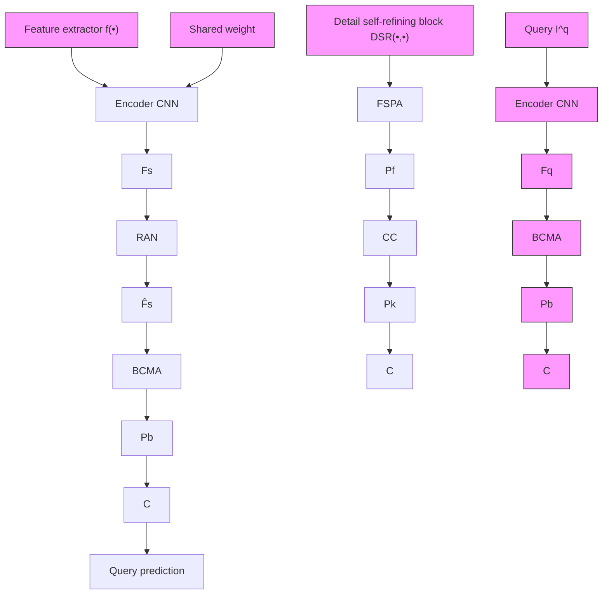
</details>

ig2: Ovef I and query image Iinto deep features Fs and $F _ { q }$ respectively; after that, the prototypes are generated by the detail self-refining block $P _ { k } = \mathrm { D S R } ( F _ { s } , F _ { q } , \mathbf { \vec { M } } _ { s } ) ;$ ; finally, theqerya $F _ { s } , \bar { F } _ { q }$ tofilterrreedsotckdpototede

a. 相似性注意⼒⽹络（RAN）：融合⽀持集与查询集特征，过滤⽆关信息，⽣成校准后的⽀持图像特征（前⾯PONet也⽤到了类似的思想）


<details>
<summary>flowchart</summary>

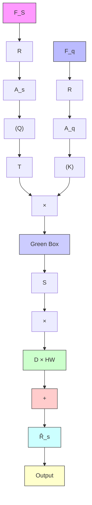
</details>

Fig. 3: Architecture of Resemblance Attention Network.

b. 前景语义原型注意⼒（FSPA）：构造⾼保真前景原型，保留全局类别语义和局部细节

在⽀持特征上做超像素聚类，得到N个细节原型，每个对应前景内⼀个局部语义⽚段；  
▪ 计算每个细节原型与⽀持特征间的相似度，得到⼀组相似度图，再通过注意⼒⽣成增强后的前景特征图

▪ 最后通过mask平均池化⽣成前景原型；


<details>
<summary>flowchart</summary>

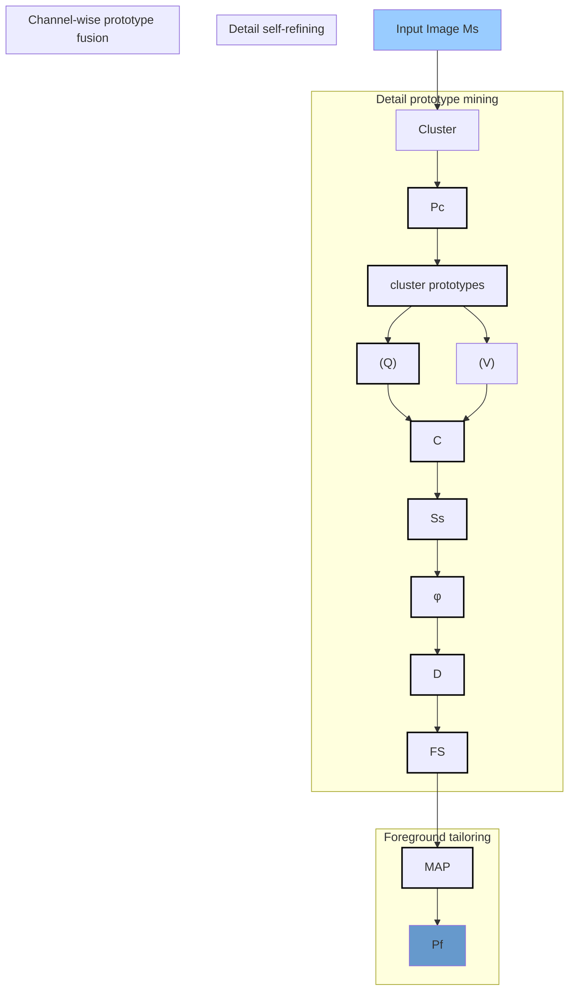
</details>


<details>
<summary>flowchart</summary>

```mermaid
graph TD
    subgraph (b)
        A["Input Layer Pc"] --> B["Ki"]
        A --> C["Kl"]
        B --> D["KD"]
        C --> D
        D --> E["φ(Ss)"]
        E --> F["Kl"]
        F --> G["Kd"]
        G --> H["Output Layer F̄s^D"]
        H --> I["F̄s^D"]
        I --> J["F̄s^i"]
    end
    subgraph (c)
        K["Input Layer Ks"] --> L["Ki"]
        K --> M["Kl"]
        L --> N["Kd"]
        M --> N
        N --> O["Output Layer F̄s^D"]
        O --> P["F̄s^i"]
    end
```
</details>

Fig. 4: FSPA illustration. (a) shows FSPA architecture where both cosine similarity computation @ and channel-wise prototype fusion @ are implemented in a one-dimensional convolution manner. For @, the cluster prototypes $P _ { c }$ serves as convolution filters individually. Regarding O, the channel-wise convolution fillers are generated from $P _ { c }$ by channel-dimensional slicing (see (b)), whilst the prototype fusion over probability maps $\phi ( S _ { s } )$ is demonstrated in (c).

c. 背景通道结构多头注意⼒（BCMA）：从通道维度挖掘结构信息实现背景原型的精修


<details>
<summary>flowchart</summary>

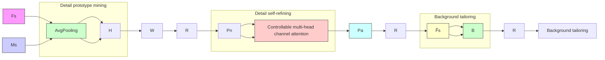
</details>


<details>
<summary>flowchart</summary>

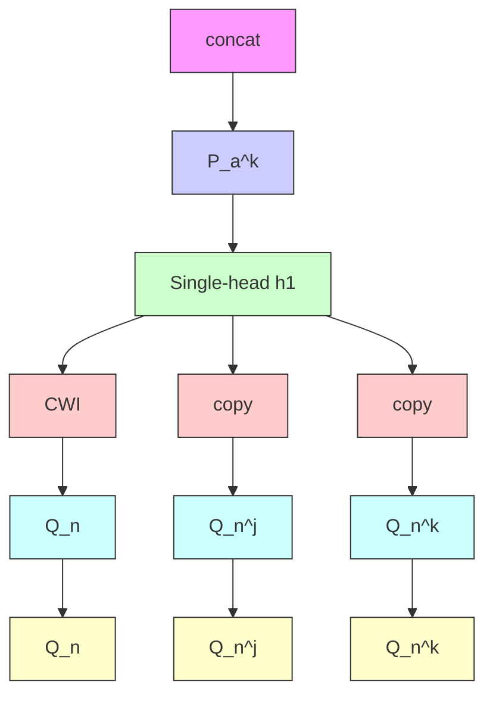
</details>


<details>
<summary>flowchart</summary>

```mermaid
graph LR
    subgraph "(c)"
        Qn^j["Q_n^j"] -->|(K)| C["C"]
        Qn["Q_n"] -->|(K)| C
        C --> φ[φ]
        φ --> wc["w_c"]
        wc --> dot1["•"]
        dot1 --> wl["w_l"]
        wl --> 1["1 + βw_l"]
    end

    subgraph "(v)"
        Pn^k["P_n^k"] -->|(V)| X["×"]
    end

    C --> φ
    φ --> dot1
    dot1 --> r["r"]
    r --> Global["Global exploration"]
    Global --> aj["a_j'"]
    aj --> X
    x --> Pa["P_a^{k,j}"]
    h_j["h_j"] -.-> w_i["w_i"]
    w_i -.-> m_w["m_w Incorporation unit"]
    m_w -.-> dot1
    dot1 -.-> w_l
    w_l -.-> 1
    1 -.-> r
    r -.-> Global
    style C fill:#f9f,stroke:#333
    style φ fill:#ccf,stroke:#333
    style dot1 fill:#cfc,stroke:#333
    style w_l fill:#fcc,stroke:#333
    style r fill:#cff,stroke:#333
    style Global fill:#ffc,stroke:#333
    style aj fill:#fcc,stroke:#333
```
</details>


<details>
<summary>text_image</summary>

Pre-set sparse vector ←— Initializing ← Channel-wise slicing ⚠ Learnable Ⓑ Background prototypes selection
CWI: Channel-wise inputing ● Product ⬆ Softmax Ⓡ Reshape ✕ Matrix multi Ⓒ Cosine similarity
</details>

Fig.5lstr.to $P _ { n }$ to $P _ { a }$ by incorporating the channel-specific structural information. Taking $P _ { n } ^ { k }$ as an example, (b) presents its detail self-refining to corresponding high-fidelity prototype $P _ { a } ^ { k }$ whose j-th element $P _ { a } ^ { k , j }$ is generated by attention head $h _ { j } .$ . (c) elaborates $h _ { j }$ where sparse channel-aware regulation block generate control factor (r to modulate global channel structural information of the j-th channel $( a _ { j } )$ that is learnt by global exploration block.

# 2. 实验效果

a. 数据集：ABD-MRI、ABD-CT、CMR  
b. 参数设置：1-way 1-shot， $2 5 6 ^ { \star } 2 5 6$ 输⼊⼤⼩，ResNet-101作为特征提取器（MSCOCO预训练），Nvidia TITAN V训练4.5h；  
c. 结果：在两种settings（⽬标存在于训练集的背景区域、完全没⻅过⽬标）下效果普遍优于其它原型学习⽅法。

Table 1: Expsiebate di 

<table><tr><td rowspan="2">Settings</td><td rowspan="2">Method</td><td colspan="5">ABD-MRI</td><td colspan="5">ABD-CT</td></tr><tr><td>Liver</td><td>R.kidney</td><td>L.kidney</td><td>Spleen</td><td>Mean</td><td>Liver</td><td>R.kidney</td><td>L.kidney</td><td>Spleen</td><td>Mean</td></tr><tr><td rowspan="5">Setting-1</td><td>SE-Net (Roy et al., 2020)</td><td>29.02</td><td>47.96</td><td>45.78</td><td>47.30</td><td>42.51</td><td>35.42</td><td>12.51</td><td>24.42</td><td>43.66</td><td>29.00</td></tr><tr><td>PANet (Wang et al., 2019)</td><td>47.37</td><td>30.41</td><td>34.96</td><td>27.73</td><td>35.11</td><td>60.86</td><td>50.42</td><td>56.52</td><td>55.72</td><td>57.88</td></tr><tr><td>SSL-ALPNet (Ouyang et al., 2020)</td><td>70.49</td><td>79.86</td><td>81.25</td><td>64.49</td><td>74.02</td><td>67.29</td><td>72.62</td><td>76.35</td><td>70.11</td><td>71.59</td></tr><tr><td>Q-Net (Shen et al., 2023)</td><td>73.54</td><td>84.41</td><td>68.36</td><td>76.69</td><td>75.75</td><td>68.65</td><td>55.63</td><td>69.39</td><td>56.82</td><td>62.63</td></tr><tr><td>CAT-Net (Lin et al., 2023)</td><td>73.01</td><td>79.54</td><td>73.11</td><td>69.31</td><td>73.74</td><td>66.24</td><td>47.83</td><td>69.09</td><td>66.98</td><td>62.54</td></tr><tr><td></td><td>DSPNet (our)</td><td>75.06</td><td>85.37</td><td>81.88</td><td>70.93</td><td>78.31</td><td>69.32</td><td>74.54</td><td>78.01</td><td>69.31</td><td>72.79</td></tr><tr><td rowspan="5">Setting-2</td><td>SE-Net (Roy et al., 2020)</td><td>27.43</td><td>61.32</td><td>62.11</td><td>51.80</td><td>50.66</td><td>0.27</td><td>14.34</td><td>32.83</td><td>0.23</td><td>11.91</td></tr><tr><td>PANet (Wang et al., 2019)</td><td>69.37</td><td>66.94</td><td>63.17</td><td>61.25</td><td>65.68</td><td>61.71</td><td>34.69</td><td>37.58</td><td>43.73</td><td>44.42</td></tr><tr><td>SSL-ALPNet (Ouyang et al., 2020)</td><td>69.46</td><td>62.34</td><td>75.49</td><td>69.02</td><td>69.08</td><td>66.21</td><td>64.68</td><td>58.66</td><td>66.69</td><td>64.06</td></tr><tr><td>Q-Net (Shen et al., 2023)</td><td>82.97</td><td>51.81</td><td>70.39</td><td>57.74</td><td>65.73</td><td>64.44</td><td>41.75</td><td>66.21</td><td>37.87</td><td>52.57</td></tr><tr><td>CAT-Net (Lin et al., 2023)</td><td>74.09</td><td>63.51</td><td>70.56</td><td>67.02</td><td>68.79</td><td>52.53</td><td>46.87</td><td>65.01</td><td>46.73</td><td>52.79</td></tr><tr><td></td><td>DSPNet (our)</td><td>78.56</td><td>82.01</td><td>76.47</td><td>68.27</td><td>76.33</td><td>69.16</td><td>63.55</td><td>68.46</td><td>66.48</td><td>66.17</td></tr></table>

Table2:Expereults (ceeotaembsddateedotiel 

<table><tr><td>Settings</td><td>Method</td><td>RV</td><td>LV-MYO</td><td>LV-BP</td><td>Mean</td></tr><tr><td rowspan="5">Setting-1</td><td>SE-Net (Roy et al., 2020)</td><td>12.86</td><td>58.04</td><td>25.18</td><td>32.03</td></tr><tr><td>PANet (Wang et al., 2019)</td><td>57.13</td><td>72.77</td><td>44.76</td><td>58.20</td></tr><tr><td>SSL-ALPNet (Ouyang et al., 2020)</td><td>77.59</td><td>63.29</td><td>85.36</td><td>75.41</td></tr><tr><td>Q-Net (Shen et al., 2023)</td><td>67.99</td><td>52.09</td><td>86.21</td><td>68.76</td></tr><tr><td>CAT-Net (Lin et al., 2023)</td><td>69.37</td><td>48.81</td><td>81.33</td><td>66.51</td></tr><tr><td></td><td>DSPNet (our)</td><td>79.73</td><td>64.91</td><td>87.75</td><td>77.46</td></tr></table>

近来原型学习的相关研究主要聚焦于改进原型特征的提取⽅式，模型普遍复杂度⾼，且超参数较多，存在⼀定的实⽤⻔槛。

# 2.1.2.5 FSMIS

参考论⽂：Cheng, Z., Wang, S., Xin, T., Zhou, T., Zhang, H., & Shao, L. (2024). Few-Shot Medical Image Segmentation via Generating Multiple Representative Descriptors. , (6), 2202‒2214. https://doi.org/10.1109/TMI.2024.3358295

Code：https://github.com/zmcheng9/GMRD（含模型权重）


<details>
<summary>natural_image</summary>

Illustration of a padlock with ribbon-like bands, symbolizing secure security or security (no text or symbols)
</details>

# 附件不支持下载


<details>
<summary>natural_image</summary>

Illustration of a padlock with ribbon-like bands, symbolizing security or encryption (no text or symbols)
</details>

# 附件不支持下载

# 2.1.2.6 PGRNet

参考论⽂：Huang W , Hu J , Xiao J ,et al.Prototype-Guided Graph Reasoning Network for Few-Shot Medical Image Segmentation[J]. IEEE Transactions on Medical Imaging, 2025, 44(2):761- 773.DOI:10.1109/TMI.2024.3459943.

Code：https://github.com/Fhujinwu/PGRNet


<details>
<summary>natural_image</summary>

Illustration of a padlock with a keyhole, surrounded by blue and teal ribbon elements (no text or symbols)
</details>

# 附件不支持下载


<details>
<summary>natural_image</summary>

Illustration of a padlock with ribbon accents, no text or symbols present
</details>

# 附件不支持下载

# 2.2 上下⽂学习（In-Contex Learning，ICL）

上下⽂学习最早在GPT-3等模型中被引⼊，利⽤提供的少量⽰例作为输⼊，使模型能够适应新的任务。该范式已被引⼊视觉模型中，近年来在医学图像领域也引起了更多关注。此范式下的模型常称为“Universal Models”。

# 2.2.1 基础框架（以视觉模型为例）

给模型⼀组⽀持样本（supportset）=图像+掩膜作为“上下⽂”，模型在推理时根据这些参考⽰例直接推断新图像的分割结果，⽽不进⾏或⼏乎不进⾏参数微调。训练⽬标是让模型学会如何根据上下⽂来做预测（有条件的预测）。


<details>
<summary>flowchart</summary>

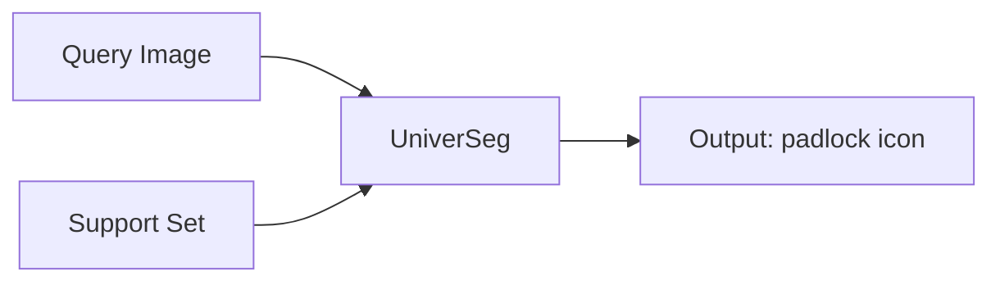
</details>

1. ⽅法特点：

a. 测试阶段与原型学习类似，需提供少量带标注的查询图像作为上下⽂信息；  
b. 可以使⽤⼤模型基座，参数量较原型学习⼤很多，但可能适应性更⼴；  
c. 可以根据现场⽤⼾提供的上下⽂信息做个性化适配；

2. 潜在问题：

a. 效果受查询图像质量影响；  
b. 上下⽂图像数量可能影响效率，或来带资源压⼒；  
c. 效果存在瓶颈，增⼤标注量亦⽆法改善；

# 2.2.2 在医学图像分割中的应⽤

# 2.2.2.1 基于视觉⼤模型

# 2.2.2.1.1 SegGPT（⾃然图像为主，2D）

参考论⽂：Wang X, Zhang X, Cao Y, et al. Seggpt: Segmenting everything in context[J]. arXiv preprint arXiv:2304.03284, 2023. (CVPR, 2023)

Code: https://github.com/baaivision/Painter

https://github.com/SteveImmanuel/SegGPT-FineTune

https://github.com/SteveImmanuel/OEM-Few-Shot-Learnable-

Prompt/tree/1335420b65cdfe2acbca0d2ec338b5a08cc2020e（遥感领域复现版本，多了更多细节）

1. ⽅法核⼼：基于上下⽂学习（In-ContextLearning,ICL）的通⽤分割模型。其将所有分割任务视为”带上下⽂的图像到颜⾊掩码的映射“，实现单模型适配多类图像/视频分割任务，突破传统专⽤模型的任务局限性。

a. 输⼊与输出：将⽰例图像（images）和对应mask作为上下⽂信息，与查询图像⼀并输⼊；输出查询图像的分割结果，形式是三通道的RGB图像，不同颜⾊对应不同分割类别；  
b. 训练策略：类似于MAE，输⼊图像与视觉任务输出图像（如分割mask转换为RGB图像）转换为patchembedding，然后对输出图像进⾏掩码，再使⽤VIT对其进⾏重建、计算loss。模型在⼤量“⽰例-⽬标”对上训练，学会从上下⽂⽰例中推断分割规则；

i. 随机颜⾊映射：训练时为每个样本动态⽣成临时颜⾊-⽬标映射表，同⼀分割⽬标（如“猫”）每次训练随机分配不同RGB值，打破“固定颜⾊=固定标签”的绑定，强制模型依赖图像内容与上下⽂关联学习。

ii. 上下⽂集成策略：推理时⽀持多⽰例辅助，提出空间集成（⽹格拼接⽰例并缩放）与特征集成（注意⼒层后平均查询图像特征），前者适⽤于低分辨率场景，后者⽆信息损失，为核⼼策略。

iii. 上下⽂调优：冻结模型参数，仅优化可学习图像张量（任务提⽰），实现特定数据集、场景或对象的定制化适配，⽆需修改模型架构。

◦ 推理阶段：不更新任何参数，仅靠拼接的上下⽂完成新任务。


<details>
<summary>flowchart</summary>


</details>

# 2. 实验效果：

a. 训练数据集：涵盖语义、实例、⼈体部位、医学影像（视⽹膜⾎管）、航拍图等多类数据集，包括 ADE20K、COCO、PASCAL VOC、Cityscapes 等，按不同权重采样（如 COCO 实例占22%，医学影像占6%），⽆需⼿动合并标签。  
b. 架构：采⽤ViT-L（参数量307M），batchsize为2048，迭代9k次；  
c. 结果：少样本语义分割任务，域内（COCO-20i/PASCAL-5i）中，少样本设置下mIoU达67.9/89.8，超越 FPTrans 等专⽤⼩样本分割模型；域外（FSS-1000）未训练仍达 85.6/89.3mIoU，接近专⽤模型⽔平

<table><tr><td rowspan="2">method</td><td rowspan="2">venue</td><td colspan="2">COCO-20 $^{i}$ </td><td colspan="2">PASCAL-5 $^{i}$ </td></tr><tr><td>one-shot</td><td>few-shot</td><td>one-shot</td><td>few-shot</td></tr><tr><td colspan="6">specialist model</td></tr><tr><td>HSNet [35]</td><td rowspan="2">ICCV&#x27;21</td><td>41.2</td><td>49.5</td><td>66.2</td><td>70.4</td></tr><tr><td>HSNet*</td><td>41.7</td><td>50.7</td><td>68.7</td><td>73.8</td></tr><tr><td>VAT [19]</td><td rowspan="2">ECCV&#x27;22</td><td>41.3</td><td>47.9</td><td>67.9</td><td>72.0</td></tr><tr><td>VAT*</td><td>42.9</td><td>49.4</td><td>72.4</td><td>76.3</td></tr><tr><td>FPTrans [53]</td><td rowspan="2">NeurIPS&#x27;22</td><td>47.0</td><td>58.9</td><td>68.8</td><td>78.0</td></tr><tr><td>FPTrans*</td><td>56.5</td><td>65.5</td><td>77.7</td><td>83.2</td></tr><tr><td colspan="6">generalist model</td></tr><tr><td>Painter</td><td>CVPR&#x27;23</td><td>32.8</td><td>32.6</td><td>64.5</td><td>64.6</td></tr><tr><td>SegGPT</td><td>this work</td><td>56.1</td><td>67.9</td><td>83.2</td><td>89.8</td></tr></table>

Table 1: Quantitative results on COCO-20 and PASCAL-5 of example-based semantic segmentation. \* indicates that the categories in training cover the categories in testing.

# 3. ⽅法特性：

a. 推理阶段与原型学习类似，需要提供少量含标签的⽀持图像（上下⽂）；  
b. 通⽤性很⾼，不局限于固定分割类别；  
c. 2D模型，参数量相对较少（307M）  
d. 随机颜⾊映射增加训练难度，在标注数据充⾜的域内任务（如ADE20K语义分割、COCO全景分割）中，性能略逊于Painter等通⽤模型及Mask2Former等专⽤模型


MR智能扫描项⽬已基于SegGPT做过⼀版可⾏性验证：

背景：为实现全⾃动化扫描的⽬标，要在各种扫描场景下基于定位像提取3D定位框。然⽽以往基于专家模型的研发路线在实际应⽤中仍⾯临诸多挑战：

a. ⼩众场景覆盖不全；  
b. 个性化需求⽆法满⾜；  
c. 异常场景适应差；

⽅法：基于SegGPT框架，内部构建定位像数据集，使⽤8w+图像训练（2D），≤10shot便可获得理想结果；

限制：特殊病例、疑难杂症等情况下的扫描定位不在⽀持范围内；

效果：分布内数据准确率≥95%，分布外数据85%-90%

资源与效率：TensorRT fp16，显存占⽤5-6G，推理数⼗毫秒；

预期：在每个现场由⽤⼾提供⽀持图像（上下⽂）；后续扩展到纯3D模型；

# 2.2.2.1.2 MVG（SegGPT在医学图像上的拓展，2D）

参考论⽂：Ren S, Huang X, Li X, et al. Medical Vision Generalist: Unifying Medical Imaging Tasks in Context[J]. arXiv preprint arXiv:2406.05565, 2024. (2025 ICLR)

Code: https://github.com/OliverRensu/MVG（仅代码）

1. ⽅法核⼼：医学影像领域的通⽤视觉⼤模型，在统⼀的图像到图像⽣成框架（即给定⽬标图像与上下⽂样本对，来⽣成⽬标输出图像的条件⽣成问题）下通过上下⽂学习同时解决分割、模态转换、去噪、修补。

a. 模型架构：

▪ 编码器：标准ViT（patch embedding和多个Transformer blocks）；  
解码器：两个卷积层构成的输出头，接受ViT的输出作为输⼊；

b. In-Context Generation机制

i. 输⼊/输出统⼀：单通道着⾊，统⼀多个任务的输出格式

对于分割任务：通过三种策略把原始labelmap转换为单通道”颜⾊索引图 6

Binarycolorization：把多类问题拆成⼆分类任务，输出⼆值图；  
• Pre-definedcolorization：每个数据集分配⼀段颜⾊区间，不同数据集的同名类别不强制共享颜⾊，避免跨数据集冲突；  
随机着⾊：训练时随机为语义分配颜⾊，但在同⼀iteration内保持上下⽂标签与查询图像标签之间颜⾊⼀致（效果最优）

对于跨模态转换/去噪/修复任务，直接把输出当作灰度图像处理，不做类别索引映射；

# c. 训练范式：MIM与⾃回归

i. Masked Image Modeling（MIM）：随机掩盖掉⼀部分patch，模型需要在ViT+解码器下重建被掩盖的区域；（在分割任务上表现不如⾃回归）  
ii. ⾃回归训练：将上下⽂图像、上下⽂标签、查询图像、查询图像标签都视为序列中的元素。给模型输⼊序列中的部分元素来预测下⼀个元素；

分割任务全部采⽤⾃回归的⽅式训练，其它任务中90%的iteration采⽤MIM，10%采⽤⾃回归。


<details>
<summary>flowchart</summary>

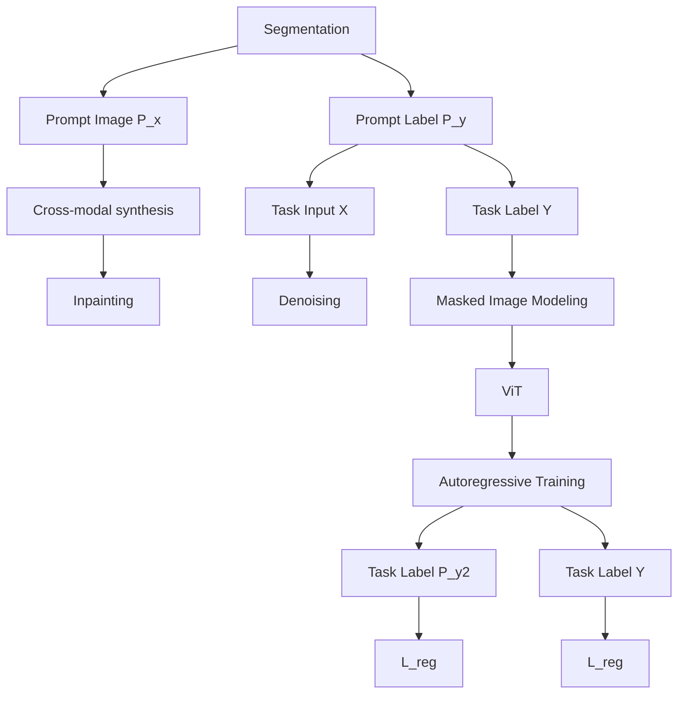
</details>

Figure 3: Method overview. Left: Four types of medical tasks (i.e., segmentation, cros-modal synthesis, inpainting, and denoising) are unified as a universal image-to-image generation task with in-context learning. Right: We adopt mask image modeling and auto-regressive training for in-context generation.

# 2. 实验效果

a. 数据集：13个医学影像数据集，包括CT/MR/XR/US模态，涵盖腹部、盆腔、脑、胸部

<table><tr><td>Region</td><td>Dataset</td><td>Modality</td><td>#Training</td><td>#Testing</td><td>Task</td></tr><tr><td>Abdomen</td><td>AMOS [3]</td><td>CT</td><td>240</td><td>120</td><td>Segmentation</td></tr><tr><td>Abdomen</td><td>WORD [4]</td><td>CT</td><td>100</td><td>20</td><td>Segmentation</td></tr><tr><td>Abdomen</td><td>BTCV [47]</td><td>CT</td><td>21</td><td>9</td><td>Segmentation</td></tr><tr><td>Abdomen</td><td>AMOS [3]</td><td>MRI</td><td>60</td><td>50</td><td>Segmentation</td></tr><tr><td>Pelvis</td><td>MicroSegNet [48]</td><td>Micro-US</td><td>55</td><td>20</td><td>Segmentation</td></tr><tr><td>Pelvis</td><td>PROMISE [49]</td><td>MRI</td><td>50</td><td>30</td><td>Segmentation</td></tr><tr><td>Brain</td><td>BraTS-GLI [50]</td><td>MRI</td><td>1251</td><td>219</td><td>Cross-modal synthesis</td></tr><tr><td>Brain</td><td>BraTS-Local [50]</td><td>MRI</td><td>1000</td><td>251</td><td>Inpainting</td></tr><tr><td>Chest</td><td>Low dose [51]</td><td>CT</td><td>200</td><td>59</td><td>Denoising</td></tr><tr><td>Chest</td><td>Defect Detection [52]</td><td>Xray</td><td>15</td><td>6</td><td>Segmentation</td></tr><tr><td>Chest</td><td>ACDC [53]</td><td>MRI</td><td>100</td><td>50</td><td>Segmentation</td></tr><tr><td>Chest</td><td>LA [54]</td><td>MRI</td><td>81</td><td>20</td><td>Segmentation</td></tr></table>

Table 1: Datasets overview. Our MVG is trained and evaluated on 13 diferent datasets covering four major human body regions (i.e., Abdomen, Pelvis, Brain, Chest). #Training/Testing refers to the number of samples for training and testing.

b. 参数设置：先重采样到512\*521，再随机crop到448\*448，8张A5000训练，训练与推理仅使⽤ ⼀个上下⽂图像；Smooth L1 Loss   
c. 效果：优于UniverSeg、Painter这样的上下⽂学习模型。在分布内数据上较专家模型仍有差距。

<table><tr><td>Method</td><td>AMOS CT</td><td>WORD</td><td>BTCV</td><td>AMOS MRI</td><td>MicroSegNet</td><td>PROMISE</td><td>Chest Defect</td><td>ACDC</td><td>LA</td></tr><tr><td colspan="10">Specialists</td></tr><tr><td>ResNet-18</td><td>0.55</td><td>0.50</td><td>0.51</td><td>0.53</td><td>0.67</td><td>0.75</td><td>0.62</td><td>0.69</td><td>0.68</td></tr><tr><td>UNet</td><td>0.81</td><td>0.83</td><td>0.82</td><td>0.81</td><td>0.90</td><td>0.91</td><td>0.89</td><td>0.86</td><td>0.83</td></tr><tr><td>VNet</td><td>0.70</td><td>0.75</td><td>0.72</td><td>0.73</td><td>0.90</td><td>0.89</td><td>0.86</td><td>0.87</td><td>0.84</td></tr><tr><td>TranUNet</td><td>0.80</td><td>0.82</td><td>0.84</td><td>0.82</td><td>0.94</td><td>0.90</td><td>0.88</td><td>0.88</td><td>0.84</td></tr><tr><td>nnUNet</td><td>0.87</td><td>0.90</td><td>0.91</td><td>0.88</td><td>0.97</td><td>0.93</td><td>0.90</td><td>0.90</td><td>0.89</td></tr><tr><td colspan="10">Generalists</td></tr><tr><td>UniverSeg*</td><td>0.20</td><td>0.29</td><td>0.37</td><td>0.25</td><td>0.71</td><td>0.55</td><td>0.55</td><td>0.54</td><td>0.57</td></tr><tr><td>Painter</td><td>0.52</td><td>0.48</td><td>0.45</td><td>0.51</td><td>0.69</td><td>0.68</td><td>0.50</td><td>0.52</td><td>0.55</td></tr><tr><td>LVM</td><td>0.12</td><td>0.14</td><td>0.10</td><td>0.15</td><td>0.36</td><td>0.30</td><td>0.10</td><td>0.12</td><td>0.13</td></tr><tr><td>MVG</td><td>0.73</td><td>0.74</td><td>0.73</td><td>0.74</td><td>0.91</td><td>0.85</td><td>0.79</td><td>0.85</td><td>0.81</td></tr></table>

Table 2: Quantitative evaluation in segmentation tasks. Compared to other generalists, our method achieves state-of-the-art performance with solid improvements. \*: We inference the official weights with the 64 in-context samples from training set.

# 2.2.2.1.3 增强检索上下⽂的少样本学习（SAM 2+DINOv2）

参考论⽂：L. Zhao, X. Chen, E. Z. Chen, Y. Liu, T. Chen and S. Sun, "Retrieval-Augmented Few-Shot Medical Image Segmentation With Foundation Models," in IEEE Transactions on Neural Networks and Learning Systems, vol. 36, no. 10, pp. 17693-17701, Oct. 2025, doi: 10.1109/TNNLS.2025.3568479.

Code: Not Available

（a)  


<details>
<summary>flowchart</summary>

```mermaid
graph TD
    A["DINOv2"] --> B["DINO Embedding"]
    B --> C["Retrieval Module"]
    C --> D["Queried Images"]
    D --> E["Masks"]
    E --> F["Image Encoder"]
    F --> G["Image Encoder"]
    G --> H["Memory Encoder"]
    H --> I["Memory Bank"]
    I --> J["Memory Attention"]
    K["Input Images"] --> F
    L["Shared"] <--> F
```
</details>

(b)   


<details>
<summary>flowchart</summary>

```mermaid
graph LR
    A["Limited Annotated Data"] --> B["DINOv2"]
    B --> C["Faiss index"]
```
</details>

Fig.2.Overvfetriea-umetedFeStdcalageegetatio Wfo(a)Teegetatiopelisartsituti proceedthrouhOfordmbdng,flodbyquengsiamasadcoespngasschreecdaddio bankThemeomechathefotfeok tosteaoiehefeoask (b)Te procsoedtiate

# 1. ⽤DINOv2检索相似的标签图像

以DINOv2(ViT-14-small)为特征提取器，对少量标注医学影像提取384维语义嵌⼊特征，通过FAISS库构建带L2距离归⼀化的相似性检索索引；对待分割⽬标影像，同步提取DINOv2特征并检索索引中最相似的标注样本（含影像与分割掩码），为后续分割提供上下⽂与解剖结构参考。

# 2. 基于SAM2的⼩样本分割⽹络

a. 记忆编码：将检索到的相似样本经SAM2的图像编码器提取多尺度特征，结合分割掩码经记忆编码器下采样融合，⽣成紧凑的记忆表征并存⼊记忆库。  
b. 记忆注意⼒融合：⽬标影像经图像编码器提取特征后，通过SAM2的堆叠Transformer记忆注意⼒模块，先对⽬标特征做⾃注意⼒，再与记忆库中的表征做交叉注意⼒，实现相似样本的解剖信息与⽬标影像特征的深度融合。  
c. 掩码解码：融合后的特征输⼊SAM2的掩码解码器，结合编码器的跳连连接（借鉴U-Net结构，保留⾼分辨率细节），⽣成最终的医学图像分割掩码，全程⽆需外部点/框提⽰。

# 3. 性能

a. 1/4/16个检索样本，单切⽚总耗时52.96/170.94/515.2ms;

<table><tr><td rowspan="2">Settings</td><td rowspan="2">Methods</td><td colspan="3">ACDC</td><td>CMR T1-Map</td><td rowspan="2">Fluoroscopy Image</td></tr><tr><td>RV</td><td>Myo</td><td>LV</td><td>Myo</td></tr><tr><td rowspan="2">Full Data</td><td>U-Net</td><td>0.8743</td><td>0.8785</td><td>0.9473</td><td>0.8700</td><td>0.6539</td></tr><tr><td>SwinUNETR</td><td>0.7623</td><td>0.8346</td><td>0.9198</td><td>0.8769</td><td>0.6058</td></tr><tr><td rowspan="3">Limited Data (50 slices)</td><td>U-Net</td><td>0.1996</td><td>0.4794</td><td>0.5938</td><td>0.7792</td><td>0.5760</td></tr><tr><td>SwinUNETR</td><td>0.2792</td><td>0.4202</td><td>0.4542</td><td>0.8147</td><td>0.5558</td></tr><tr><td>Ours</td><td>0.6729</td><td>0.7757</td><td>0.8472</td><td>0.8238</td><td>0.7029</td></tr></table>

<table><tr><td>Methods</td><td>LK</td><td>RK</td><td>Spl.</td><td>Liv.</td><td>Avg.</td></tr><tr><td>PA-Net [7]</td><td>0.4771</td><td>0.4795</td><td>0.5873</td><td>0.6499</td><td>0.5485</td></tr><tr><td>ALP-Net [8]</td><td>0.7363</td><td>0.7839</td><td>0.6702</td><td>0.7305</td><td>0.7302</td></tr><tr><td>AD-Net [9]</td><td>0.7189</td><td>0.7602</td><td>0.6584</td><td>0.7603</td><td>0.7270</td></tr><tr><td>Q-Net [10]</td><td>0.7405</td><td>0.7752</td><td>0.6743</td><td>0.7871</td><td>0.7443</td></tr><tr><td>CAT-Net [11]</td><td>0.7401</td><td>0.7890</td><td>0.6883</td><td>0.7898</td><td>0.7518</td></tr><tr><td>Ours</td><td>0.7779</td><td>0.8581</td><td>0.7586</td><td>0.8793</td><td>0.8185</td></tr></table>


<details>
<summary>line</summary>

|        | RV    | Myo   | LV    |
| ------ | ----- | ----- | ----- |
| #2     | 0.38  | 0.54  | 0.55  |
| #4     | 0.49  | 0.64  | 0.68  |
| #8     | 0.65  | 0.75  | 0.82  |
| #16    | 0.67  | 0.77  | 0.85  |
| #32    | 0.69  | 0.76  | 0.86  |
</details>

Fig.4.Segmentation performance on the ACDC dataset with different numbers of queried images, measured by Dice similarity coefficient (DSC) for the right ventricle (RV), myocardium (Myo), and left ventricle (LV).

# 2.2.2.2 基于CNN架构

# 2.2.2.2.1 UniverSeg（2D）

参考论⽂：Butoi V I , Ortiz J J G , Ma T ,et al.UniverSeg: Universal Medical Image Segmentation[J].IEEE, 2023.DOI:10.1109/ICCV51070.2023.01960. (ICCV，2023)

Code：https://github.com/JJGO/UniverSeg

1. ⽅法核⼼：提出CrossBlock机制，结合类似UNet的编码器-解码器结构，实现⽀持集（标注⽰例）与查询图（待分割图像）的信息交互，⽆需针对新任务调整参数。

a. ⽀持集中的图像-标签样本对按通道拼接后输⼊，与查询图像通过CrossBlock模块进⾏信息交互；  
b. CrossBlock：将查询图像（或特征图）与每个⽀持图像样本对（或特征图）分别进⾏通道拼接，再通过共享的卷积层⽣成新的查询图像特征图与⽀持图像特征图，随后按相似的规则进⼊下⼀个stage处理，最终根据预测结果与查询集标签计算loss；  
c. 由于卷积模块参数共享（即对于任意查询图像样本的卷积操作⼀致），因此可以⽀持任意数量的⽀持集样本量；


<details>
<summary>flowchart</summary>

```mermaid
graph TD
    subgraph Input
        X_t["X^t"]
        X_t --> X2["X^2"]
        X2 --> X3["X^3"]
        X3 --> X4["X^4"]
        X4 --> X5["X^5"]
        X5 --> X6["X^6"]
        X6 --> X7["X^7"]
        X7 --> X8["X^8"]
        X8 --> X9["X^9"]
        X9 --> X10["X^10"]
        X10 --> X11["X^11"]
        X11 --> X12["X^12"]
        X12 --> X13["X^13"]
        X13 --> X14["X^14"]
        X14 --> X15["X^15"]
        X15 --> X16["X^16"]
        X16 --> X17["X^17"]
        X17 --> X18["X^18"]
        X18 --> X19["X^19"]
        X19 --> X20["X^20"]
        X20 --> X21["X^21"]
        X21 --> X22["X^22"]
        X22 --> X23["X^23"]
        X23 --> X24["X^24"]
        X24 --> X25["X^25"]
        X25 --> X26["X^26"]
        X26 --> X27["X^27"]
        X27 --> X28["X^28"]
        X28 --> X29["X^29"]
        X29 --> X30["X^30"]
        X30 --> X31["X^31"]
        X31 --> X32["X^32"]
        X32 --> X33["X^33"]
        X33 --> X34["X^34"]
        X34 --> X35["X^35"]
        X35 --> X36["X^36"]
        X36 --> X37["X^37"]
        X37 --> X38["X^38"]
        X38 --> X39["X^39"]
        X39 --> X40["X^40"]
        X40 --> X41["X^41"]
        X41 --> X42["X^42"]
        X42 --> X43["X^43"]
        X43 --> X44["X^44"]
        X44 --> X45["X^45"]
        X45 --> X46["X^46"]
        X46 --> X47["X^47"]
        X47 --> X48["X^48"]
        X48 --> X49["X^49"]
        X49 --> X50["X^50"]
        X50 --> Y["ŷ"]
    end
    subgraph Output
        QueryPath["Query Path"] --> SupportPath["Support Path"] --> DownSample["Down-Sample"] --> UpSample["Up-Sample"] --> CrossBlock["CrossBlock"]
    end
    style Input fill:#f9f,stroke:#333
    style Output fill:#bbf,stroke:#f66
```
</details>


<details>
<summary>flowchart</summary>

```mermaid
graph TD
    subgraph Human_Layer
        A["Human Image"] --> B["C1"]
        C["Brain scans"] --> B
        D["Brain scans"] --> B
        E["Brain scans"] --> B
        F["Brain scans"] --> B
    end

    subgraph V_Ag
        G["Avg"] --> H["C2"]
        H --> I["C2"]
        I --> J["C2"]
        J --> K["C2"]
        K --> L["C2"]
    end

    subgraph V_V_Ag
        M["u"] --> N["C1"]
        O["V"] --> P["C1"]
        Q["u' "] --> R["C2"]
        S["v'"] --> T["C2"]
        U["v'"] --> V
    end

    style Human_Layer fill:#f9f,stroke:#333
    style V_Ag fill:#ccf,stroke:#333
    style V_V_Ag fill:#cfc,stroke:#333
```
</details>

Figure 3: A UniverSeg network (left) takes as input a query image and a support set of image and label-maps (pairwise concatenated in the channel dimension)and employs multi-scale CrossBlock features. A CrossBlock (right) takes as input representations of the query u and support set $V = \{ v _ { i } \}$ , and interacts u with each support entry $v _ { i }$ to produce u' and V'.

# 2. 实验效果

a. MegaMedical数据集：整合 53 个公开医学分割数据集，覆盖 26 个医学领域（如腹部、胸部、⼤脑、视⽹膜、⽩细胞、脊柱等）和16种成像模态（CT、MRI、X光、显微镜影像等），样本量超过2w；  
b. 测试⽅法：6个未参与训练的数据集⽤于测试，其中20%作为公共测试集。剩余60%和20%分别作为训练集和调优集，⽤于训练nnUNet或抽取⽀持集（对于每个分割类别单独训练⼀个nnUnet，17个类别，就有17个nnUnet专家模型，其在测试集上的表现视为模型效果上限）；测试UniverSeg和其它⼩样本学习⽅法时，随机抽取5次⽀持集后取平均结果；  
c. 模型参数量仅1.18M，与PANet等⼩样本学习⽅法⽐较，效果更优（默认64张⽀持图像训练/推理）。增加⽀持图像数量可改善效果，但收益并⾮线性增⻓；

<table><tr><td>Model</td><td>#Params</td><td>Runtime ms</td></tr><tr><td>PANet</td><td>14.71</td><td> $240.0 \pm 1.8$ </td></tr><tr><td>ALPNet</td><td>43.02</td><td> $527.7 \pm 8.7$ </td></tr><tr><td>SENet</td><td>0.92</td><td> $4.1 \pm 0.8$ </td></tr><tr><td>UniverSeg (ours)</td><td>1.18</td><td> $142.0 \pm 0.4$ </td></tr><tr><td>nnUNet (sup.)</td><td> $17 \times 1.87$ </td><td> $17 \times 1.4 \cdot 10^{7}$ </td></tr></table>

<table><tr><td>ACDC</td><td>PanDental</td><td>SCD</td><td>STARE</td><td>SpineWeb</td><td>WBC</td><td>All (avg.)</td></tr><tr><td> $34.6 \pm 2.4$ </td><td> $72.9 \pm 0.8$ </td><td> $53.4 \pm 3.0$ </td><td> $17.8 \pm 1.9$ </td><td> $31.6 \pm 4.6$ </td><td> $76.2 \pm 1.1$ </td><td> $47.8 \pm 1.1$ </td></tr><tr><td> $27.8 \pm 4.3$ </td><td> $67.7 \pm 0.8$ </td><td> $58.9 \pm 3.4$ </td><td> $20.1 \pm 3.2$ </td><td> $21.8 \pm 0.4$ </td><td> $54.7 \pm 1.6$ </td><td> $41.8 \pm 1.3$ </td></tr><tr><td> $40.1 \pm 2.0$ </td><td> $81.1 \pm 0.9$ </td><td> $55.4 \pm 3.3$ </td><td> $35.2 \pm 2.2$ </td><td> $18.3 \pm 4.0$ </td><td> $70.8 \pm 1.3$ </td><td> $50.1 \pm 1.3$ </td></tr><tr><td> $70.9 \pm 2.9$ </td><td> $87.5 \pm 0.9$ </td><td> $69.0 \pm 2.9$ </td><td> $48.1 \pm 2.0$ </td><td> $64.6 \pm 5.4$ </td><td> $90.6 \pm 1.1$ </td><td> $71.8 \pm 0.9$ </td></tr><tr><td> $82.5 \pm 2.3$ </td><td> $92.9 \pm 1.1$ </td><td> $75.0 \pm 3.4$ </td><td> $65.5 \pm 1.1$ </td><td> $91.2 \pm 2.3$ </td><td> $95.1 \pm 0.7$ </td><td> $84.4 \pm 1.0$ </td></tr></table>


<details>
<summary>line</summary>

| Model Support Size | Ensemble | No Ensemble |
| ------------------ | -------- | ----------- |
| 1                  | 56       | 53          |
| 2                  | 60       | 57          |
| 4                  | 66       | 63          |
| 8                  | 69       | 66          |
| 16                 | 71       | 70          |
| 32                 | 72       | 71          |
| 64                 | 73       | 72          |
</details>

Figure 7: Effects of support size. Relationship between models trained at certain support sizes and their average held-out Dice score. Results improve with higher support size, with ensembling consistently helping.


<details>
<summary>boxplot</summary>

| Size of Support Example Pool | WBC Test Dice Score | PanDental Test Dice Score |
| ----------------------------- | ------------------- | ------------------------- |
| 1                             | 55                  | 58                        |
| 2                             | 60                  | 62                        |
| 4                             | 75                  | 70                        |
| 8                             | 85                  | 78                        |
| 16                            | 88                  | 80                        |
| 32                            | 90                  | 82                        |
| 64                            | 91                  | 83                        |
</details>

Figure 8: Effect of available data at inference. UniverSeg predictions using a limited $d _ { \mathrm { s u p p o r t } }$ example pool on the held-out WBC and PanDental datasets. For each size, we perform 100 repetitions using different random subsets.

# 2.2.2.2.2 Tyche（2D，多结果输出的不确定性估计）

参考论⽂：Rakic M , Wong H E , Ortiz J J G ,et al.Tyche: Stochastic In-Context Learning for Medical Image Segmentation[J].IEEE, 2024.DOI:10.1109/CVPR52733.2024.01061. (CVPR, 2024)

Code：https://github.com/mariannerakic/tyche/

1. ⽅法核⼼：基于UniverSeg的改进。针对临床上分割标注不唯⼀的现实问题，构建了⼀种带有不确定性估计的上下⽂学习范式，输⼊⽬标图像与少量标注⽰例（上下⽂集），即可输出⼀组多样化的分割候选，适配未⻅任务且捕捉标注不确定性。既可以通过训练设计的SetBlock机制实现（Tyche-TS），也可以基于已有上下⽂学习模型（如Universeg）并结合测试时增强（TTA）实现（Tyche-IS）。

# Tyche-TS：训练阶段通过SetBlock机制实现多个候选结果的预测

a. SetBlock机制：对查询图像施加K种不同程度的噪声扰动后，与上下⽂图像集⼀并输⼊。对K个候选图像集（K个带扰动的查询图像）像取平均，并与⽀持图像集通过CrossBlock做特征交互，让候选图像信息与上下⽂特征对⻬，输出更新后的候选均值特征与上下⽂特征集。⽽后将候选均值特征与候选图像集再通过CrossBlock获得更新的候选特征集。

$$
\hat {y} _ {k} ^ {t} = f _ {\theta} (x ^ {t}, z _ {k}, \mathcal {S} ^ {t}).
$$

b. Loss设计：对于⼀个查询图像会存在多个专家标注的结果，⽽模型最终会输出K个预测结果。在每次迭代中随机选取⼀个标注来模拟真实场景中”⽆唯⼀正确答案“的情况。仅对预测结果中与标签最相近的结果计算损失，⿎励模型⽣成多样化的候选结果（⽽⾮趋同于均值）。


<details>
<summary>flowchart</summary>

```mermaid
graph LR
    A["Stochastic Query {x^t, z_k}^{K}_{k=1}"] --> B["SetBlock"]
    C["Context {x^t_j, y^t_j}^{S}_{j=1}"] --> B
    B --> D["SetBlock"]
    D --> E["SetBlock"]
    E --> F["SetBlock"]
    F --> G["SetBlock"]
    G --> H["SetBlock"]
    H --> I["SetBlock"]
    I --> J["Predictions ŷi"]
```
</details>

$\left( x _ { j } ^ { t } , y _ { j } ^ { t } \right) _ { j = 1 } ^ { S } ,$ $\{ z _ { k } \} _ { k = 1 } ^ { K }$ enable interactions between the context set and the target segmen-tation candidates.


<details>
<summary>flowchart</summary>

```mermaid
graph TD
    A["Candidates U = {u_k}^K"] --> B["mean"]
    C["Context V = {v_j}^S"] --> D["mean"]
    B --> E["CrossBlock 1: interacts context representation with mean candidate representation"]
    D --> F["m'"]
    E --> G["V'"]
    F --> G
    G --> H["U'"]
    I["CrossBlock 2: interacts candidate set with mean interaction representation"] --> J["U'"]
```
</details>

Figure 4. SetBlock Mechanism. SetBlock enables interactions be-tween the set of features from the context set and the set of features from the prediction candidates. It outputs two sets of features, one for the context and one for the prediction candidates.

# Tyche-IS：通过测试时增强实现多个候选结果的预测

a. IC-TTA：直接复⽤预训练的上下⽂学习模型（UniverSeg），在测试阶段对⽬标图像和上下⽂图像同时增强K次，模型可得到K个不同的推理结果。增强⽅式仅使⽤强度变换（加噪、模糊、像素强度反转），不使⽤⼏何变换。

# 2. 实验效果

a. 数据集：将所有数据集分为分布内（I.D.）和分布外（O.D.）。训练仅⽤I.D.开发集，I.D.验证集调参，O.D.验证集选模型，最终在O.D.测试集报告结果，确保模型对未⻅过的任务泛化。

i. 单标注数据集：基于MegaMedical集合（73个数据集），O.D.测试集包含ACDC、PanDental、SCD 等 5 个任务，覆盖⼼脏 cine-MRI、⽛科 X 射线等多模态；  
ii. 多标注数据集：I.D.⽤Qubiq的4个数据集（脑⽣⻓、胰腺病变等），O.D.测试集包含LIDC-IDRI（肺结节 CT，12 位专家中随机 4 位标注）、Hippocampus（海⻢体 MRI）等 5个任务，突出专家标注分歧。

b. 对⽐⽅法：上下⽂学习⽅法（UniverSeg、公开版SegGPT等）、概率分割模型（ProbabilisticUNet、PhiSeg等，全监督训练作为效果上限）、交互式分割⽅法（本地微调版SAM、SAM-Med2D）；  
c. 关键实验参数：16组上下⽂图像、训练时扰动次数K=8，GPU V100；  
d. 在分布外单标注数据集和多标注数据集上的表现均明显优于其它上下⽂学习与交互式分割⽅法，与全监督模型效果相近（甚⾄超出）：


<details>
<summary>bar</summary>

| Model | Best candidate Dice Score |
| :--- | :--- |
| SAM-Med2D | 0.46 |
| FT SAM | 0.55 |
| SENet | 0.55 |
| SegGPT Model | 0.53 |
| UvS | 0.75 |
| Tyche-IS | 0.81 |
| Tyche-TS | 0.80 |
The chart includes a dashed line labeled 'ProbaUNet' and a solid line labeled 'PhiSeg', which are shown as horizontal reference lines at approximately 0.80 and 0.81 respectively. The y-axis is labeled 'Best candidate Dice Score'. Error bars indicate variability in each measurement.
</details>

Figure 7. Best candidate Dice Score for single annotator data aggregated per task. Tyche outperforms the in-context and in-teractive segmentation benchmarks, and approaches the stochastic upper bounds. Error bars represent the 95% confidence interval. 

<table><tr><td colspan="2">Max Dice (↑)</td><td>Hippocampus</td><td>LIDC-IDRI</td><td>Prostate Task 1</td><td>Prostate Task 2</td><td>STARE</td></tr><tr><td rowspan="3">In-Context</td><td>UniverSeg</td><td>0.84 ± 0.01</td><td>0.67 ± 0.01</td><td>0.91 ± 0.01</td><td>0.88 ± 0.03</td><td>0.51 ± 0.02</td></tr><tr><td>SegGPT</td><td>0.10 ± 0.01</td><td>0.68 ± 0.01</td><td>0.94 ± 0.01</td><td>0.89 ± 0.03</td><td>0.02 ± 0.01</td></tr><tr><td>SENet</td><td>0.68 ± 0.01</td><td>0.00 ± 0.00</td><td>0.83 ± 0.02</td><td>0.83 ± 0.02</td><td>0.30 ± 0.03</td></tr><tr><td rowspan="2">Interactive</td><td>SAM</td><td>0.71 ± 0.01</td><td>0.55 ± 0.01</td><td>0.90 ± 0.01</td><td>0.85 ± 0.03</td><td>0.50 ± 0.03</td></tr><tr><td>SAM-Med2d</td><td>0.52 ± 0.01</td><td>0.42 ± 0.01</td><td>0.62 ± 0.04</td><td>0.64 ± 0.06</td><td>0.21 ± 0.03</td></tr><tr><td rowspan="2">I-C &amp; Stochastic (Ours)</td><td>Tyche-IS</td><td>0.87 ± 0.01</td><td>0.90 ± 0.00</td><td>0.94 ± 0.01</td><td>0.91 ± 0.01</td><td>0.52 ± 0.03</td></tr><tr><td>Tyche-TS</td><td>0.88 ± 0.01</td><td>0.91 ± 0.00</td><td>0.95 ± 0.01</td><td>0.93 ± 0.01</td><td>0.60 ± 0.02</td></tr><tr><td rowspan="3">Stochastic Upper Bound</td><td>PhiSeg</td><td>0.88 ± 0.00</td><td>0.91 ± 0.00</td><td>0.93 ± 0.01</td><td>0.91 ± 0.02</td><td>0.15 ± 0.01</td></tr><tr><td>ProbaUNet</td><td>0.91 ± 0.00</td><td>0.86 ± 0.01</td><td>0.95 ± 0.00</td><td>0.91 ± 0.03</td><td>0.59 ± 0.02</td></tr><tr><td>CIMD</td><td>0.84 ± 0.01</td><td>0.92 ± 0.00</td><td>0.93 ± 0.01</td><td>0.87 ± 0.02</td><td>0.41 ± 0.04</td></tr></table>

Table 3. Best canddate Dice score fordiferet models withacontextsizeof16for in-contextmetodsandanumberofpredictions set to 8. Higher is better. Tyche outperforms interactive and in-context baselines,and matches stochastic upper bounds.


<details>
<summary>bar</summary>

| Dataset     | Prediction Number 1 | Prediction Number 3 | Prediction Number 5 | Prediction Number 8 | Prediction Number 16 |
| ----------- | ------------------- | ------------------- | ------------------- | ------------------- | -------------------- |
| LIDC-IDRI   | 0.64                | 0.87                | 0.91                | 0.92                | 0.93                 |
| Hippo       | 0.83                | 0.88                | 0.89                | 0.89                | 0.89                 |
| Prostate    | 0.91                | 0.92                | 0.93                | 0.94                | 0.94                 |
| STARE       | 0.55                | 0.59                | 0.60                | 0.61                | 0.61                 |
| ACDC        | 0.58                | 0.65                | 0.66                | 0.67                | 0.67                 |
| PanDental   | 0.85                | 0.86                | 0.87                | 0.87                | 0.87                 |
| SCD         | 0.68                | 0.74                | 0.75                | 0.76                | 0.77                 |
| SpineWeb    | 0.52                | 0.58                | 0.59                | 0.60                | 0.61                 |
| WBC         | 0.90                | 0.91                | 0.92                | 0.93                | 0.93                 |
</details>

Figure 8. Best candidate Dice Score as the number of candidate prediction increases. The largest improvements are usually obtained for a small number of predictions. The error bars repre-sent the 95% confidence interval.

不同候选图像数量K对结果的影响


<details>
<summary>bar</summary>

| Dataset | Context 1 | Context 2 | Context 4 | Context 8 | Context 16 | Context 32 | Context 64 |
| :--- | :--- | :--- | :--- | :--- | :--- | :--- | :--- |
| LIDC-IDRI | 0.68 | 0.70 | 0.75 | 0.80 | 0.85 | 0.87 | 0.88 |
| Hippo | 0.55 | 0.72 | 0.80 | 0.85 | 0.90 | 0.92 | 0.93 |
| Prostate | 0.72 | 0.85 | 0.90 | 0.95 | 0.98 | 0.99 | 1.00 |
| STARE | 0.35 | 0.40 | 0.45 | 0.50 | 0.55 | 0.58 | 0.60 |
| ACDC | 0.45 | 0.55 | 0.60 | 0.65 | 0.70 | 0.72 | 0.73 |
| PanDental | 0.75 | 0.82 | 0.87 | 0.92 | 0.96 | 0.98 | 1.00 |
| SCD | 0.48 | 0.60 | 0.65 | 0.70 | 0.75 | 0.77 | 0.78 |
| SpineWeb | 0.32 | 0.45 | 0.50 | 0.55 | 0.60 | 0.62 | 0.63 |
| WBC | 0.65 | 0.80 | 0.85 | 0.90 | 0.95 | 0.97 | 1.00 |
</details>

Figure 9. Best candidate Dice Score per dataset as context size increases. A context size of 16 is already large enough to obtain a reasonable best candidate Dice. The error bars represent the 95% confidence interval.

不同上下⽂图像数量对结果的影响

<table><tr><td></td><td>Inference Time (ms)</td><td>Parameters</td></tr><tr><td>UniverSeg</td><td>96.62 ± 0.61</td><td>1.2M</td></tr><tr><td>SegGPT</td><td>2857.19 ± 4.38</td><td>370M</td></tr><tr><td>SENet</td><td>14.91 ± 0.21</td><td>0.89M</td></tr><tr><td>FT-SAM</td><td>1036.75 ± 4.61</td><td>94M</td></tr><tr><td>SAM-Med2D</td><td>188.8 ± 7.58</td><td>91M</td></tr><tr><td>PhiSeg</td><td>11.35 ± 0.672</td><td>21.1M</td></tr><tr><td>ProbaUNet</td><td>8.44 ± 0.46</td><td>5M</td></tr><tr><td>CIDM</td><td> $1.7 \times 10^{5} \pm 2748$ </td><td>85.6M</td></tr><tr><td>Tyche-IS</td><td>128.57 ± 2.626</td><td>1.2M</td></tr><tr><td>Tyche-TS</td><td>18.09 ± 0.61</td><td>1.7M</td></tr></table>

Table 5. Inference Runtime and Model Parameters for 8 predictions and a context size of 16.

# 2.2.2.2.3 Neuroverse3D（多任务3D神经影像通⽤模型）

参考论⽂：Hu J , Ye C , Yang Y ,et al.Neuroverse3D: Developing In-Context Learning Universal Model for Neuroimaging in 3D[J]. 2025. (ICCV, 2025)

Code：https://github.com/jiesihu/Neuroverse3D

# 1. 研究背景

◦ 2D ICL⽅法如SegGPT、UniverSeg只能逐切⽚处理3D数据，效率低、效果差；  
◦ 3D数据规格⼤，上下⽂图像多会占⽤较⼤显存资源、推理慢；

2. ⽅法核⼼：构建⼀个专⻔⾯向神经影像的3D通⽤ICL模型，能在显存可控的前提下，⽤任意多的上下⽂样本，同时完成3D分割+去噪+inpainting+模态变换等多个任务，并在精度上接近全监督专家模型。

a. 双UNet分⽀，在编码和解码阶段实现上下⽂图像与⽬标图像的信息交互

▪ ⽬标分⽀：对⽬标图像编码，在解码器的每个阶段融合上下⽂分⽀中的解码信息；  
上下⽂分⽀：对上下⽂图像编码，在编码器的每个阶段融合⽬标分⽀中的编码信息；

b. ⾃适应上下⽂序列并⾏处理机制：多上下⽂情况下分批次并⾏处理，多个批次的上下⽂特征取平均


<details>
<summary>flowchart</summary>

```mermaid
graph TD
    A["Target Image x"] --> B["Encoder"]
    B --> C["Decoder"]
    C --> D["Prediction ŷ"]
    E["Multi-contexts Sj"] --> F["Context Branch"]
    F --> G["Skip Connection"]
    G --> H["Parallel"]
    H --> I["Sequential"]
    I --> J["Target to-Context Fusion"]
    I --> K["Context-to-Target Fusion"]
    style A fill:#cce5ff,stroke:#333
    style B fill:#cce5ff,stroke:#333
    style C fill:#cce5ff,stroke:#333
    style D fill:#cce5ff,stroke:#333
    style E fill:#cce5ff,stroke:#333
    style F fill:#cce5ff,stroke:#333
    style G fill:#cce5ff,stroke:#333
    style H fill:#cce5ff,stroke:#333
    style I fill:#cce5ff,stroke:#333
    style J fill:#cce5ff,stroke:#333
    style K fill:#cce5ff,stroke:#333
```
</details>


<details>
<summary>flowchart</summary>

```mermaid
graph TD
    subgraph Target-to-Context Fusion
        A["Concat"] --> B["1×1×1 Conv"]
        C["Concat"] --> D["1×1×1 Conv"]
        E["Concat"] --> F["1×1×1 Conv"]
        G["Concat"] --> H["1×1×1 Conv"]
        I["Concat"] --> J["1×1×1 Conv"]
        K["Concat"] --> L["1×1×1 Conv"]
        M["Concat"] --> N["1×1×1 Conv"]
        O["Concat"] --> P["1×1×1 Conv"]
        Q["Concat"] --> R["1×1×1 Conv"]
        S["Concat"] --> T["1×1×1 Conv"]
        U["Concat"] --> V["1×1×1 Conv"]
        W["Concat"] --> X["1×1×1 Conv"]
        Y["Concat"] --> Z["1×1×1 Conv"]
        AA["Concat"] --> AB["1×1×1 Conv"]
        AC["Concat"] --> AD["1×1×1 Conv"]
        AE["Concat"] --> AF["1×1×1 Conv"]
        AG["Concat"] --> AH["1×1×1 Conv"]
        AI["Concat"] --> AJ["1×1×1 Conv"]
        AK["Concat"] --> AL["1×1×1 Conv"]
        AM["Concat"] --> AN["1×1×1 Conv"]
        AO["Concat"] --> AP["1×1×1 Conv"]
        AQ["Concat"] --> AR["1×1×1 Conv"]
        AS["Concat"] --> AT["1×1×1 Conv"]
        AU["Concat"] --> AV["1×1×1 Conv"]
        AW["Concat"] --> AX["1×1×1 Conv"]
        AY["Concat 1"] --> Z
        AZ["Concat 2"] --> Z
        BA["Concat 3"] --> Z
        BB["Concat 4"] --> Z
        BC["Fusion"] --> AD
        BD["Fusion"] --> AF
        BE["Fusion"] --> AG
        BF["Fusion"] --> AH
        BG["Fusion"] --> AI
    end
    style Target-to-Context Fusion fill:#f9f,stroke:#333
    style Context-to-Context Fusion fill:#bbf,stroke:#333
```
</details>

# 3. 实验效果

a. 数据集：19 个神经影像数据集，共43674个3D扫描，模态包括：T1, T2, FLAIR, MRA, DWI,ADC, CT 等；

<table><tr><td>Type for use</td><td>Dataset</td><td>Task</td><td># Scans</td><td># Masks</td><td>Modality</td></tr><tr><td rowspan="15">Training and Validation Set</td><td>TopCow[56]</td><td>Seg., Gen.</td><td>90</td><td>90</td><td>MRA</td></tr><tr><td>CAS2023[4]</td><td>Seg., Gen.</td><td>100</td><td>100</td><td>MRA</td></tr><tr><td>ISLES2022[23]</td><td>Gen., Mod.</td><td>750</td><td>0</td><td>DWI, ADC, FLAIR</td></tr><tr><td>ATLAS[37]</td><td>Seg., Gen.</td><td>655</td><td>655</td><td>T1w</td></tr><tr><td>IXI[3]</td><td>Gen., Mod.</td><td>2268</td><td>0</td><td>T1, T2, MRA, PD</td></tr><tr><td>ICH Unlabeled[16]</td><td>Gen.</td><td>2000</td><td>0</td><td>CT</td></tr><tr><td>ADHD[1]</td><td>Gen.</td><td>950</td><td>0</td><td>T1</td></tr><tr><td>ADNI[33]</td><td>Gen., Mod.</td><td>9923</td><td>0</td><td>T1</td></tr><tr><td>CMI[5]</td><td>Gen.</td><td>5146</td><td>0</td><td>T1</td></tr><tr><td>GSP[25]</td><td>Gen.</td><td>2616</td><td>0</td><td>T1</td></tr><tr><td>HAB[18]</td><td>Seg., Gen.</td><td>460</td><td>460</td><td>T1</td></tr><tr><td>NIMH[47]</td><td>Seg., Gen.</td><td>248</td><td>248</td><td>T1</td></tr><tr><td>OASIS[44]</td><td>Gen.</td><td>3916</td><td>828</td><td>T1</td></tr><tr><td>UKBiobank[50]</td><td>Seg., Gen.</td><td>4000</td><td>2000</td><td>T1, T2</td></tr><tr><td>BraTS[46]</td><td>Seg., Gen., Mod.</td><td>5004</td><td>1251</td><td>FLAIR, T1, T1CE, T2</td></tr><tr><td rowspan="4">Held-out Set</td><td>WMH[35]</td><td>Mod.</td><td>120</td><td>0</td><td>T1, FLAIR</td></tr><tr><td>CCNP[41]</td><td>Gen.</td><td>1580</td><td>0</td><td>T1</td></tr><tr><td>FCON1000[2]</td><td>Seg., Gen.</td><td>1096</td><td>1096</td><td>T1</td></tr><tr><td>PPMI[45]</td><td>Gen.</td><td>2752</td><td>0</td><td>T1</td></tr><tr><td></td><td>Total</td><td>Seg., Gen., Mod.</td><td>43674</td><td>6728</td><td>T1, T2, FLAIR, MRA, DWI, ADC, PD, CT</td></tr></table>

b. 训练策略：单个模型多任务训练，包括分割（⼆值分割）、去噪、偏置场校正、修复、模态转换、颅⻣剥离、超分等；

c. 参数设置：重采样到1mm的分辨率后rescale到128\*128\*128输⼊，基于Smooth-L1构建损失函数；前期训练固定上下⽂数量为3，后期数量随机（≤8）；在8张V100上训练了8天；  
d. 性能表现：在held-out数据集上效果明显优于UniverSeg和SegGPT，逼近全监督专家模型。在充分利⽤显存的情况下，可实现⾼效的3D数据处理（并⾏处理8个上下⽂，占⽤24G显存，推理耗时1.01s）；


Painter   
SegGPT   
UniverSeq   
Nueralizer   
Task-specific (Few-Shot   
Neuroverse3D   
Task-specific   
(Fully Supervised)

Figure 4.Performancecomparisoof Neuroverse3Dwithother models onheld-out datasets,underacontext sizeof8.This includes ICL modelstraiederoages (UivSeg[2],euralier4]),odels tadoaturaliages (inter[5],SegG),ds specific models infew-shotadfullysupervisedsetigs.TheDicecoeffcient isusedforsgmentationtasks,andPSNRforgeeration tasks.   


<details>
<summary>line</summary>

| Context Size | Red Line | Gray Line | Blue Line | Brown Line | Green Line |
| ------------ | -------- | --------- | --------- | ---------- | ---------- |
| 1            | 0.82     | 0.71      | 0.45      | 0.48       | 0.43       |
| 2            | 0.85     | 0.78      | 0.47      | 0.51       | 0.44       |
| 4            | 0.87     | 0.81      | 0.48      | 0.54       | 0.45       |
| 8            | 0.88     | 0.83      | 0.49      | 0.56       | 0.46       |
| 16           | 0.89     | 0.84      | 0.50      | 0.57       | 0.47       |
| 32           | 0.89     | 0.85      | 0.51      | 0.57       | 0.48       |
| 64           | 0.89     | 0.85      | 0.51      | 0.57       | 0.48       |
</details>


<details>
<summary>line</summary>

| Context Size | Red Line | Blue Dashed Line | Gray Line | Olive Line |
| ------------ | -------- | ---------------- | --------- | ---------- |
| 1            | 29.5     | 24.0             | 22.0      | 20.0       |
| 2            | 30.0     | 26.0             | 22.5      | 20.5       |
| 4            | 30.0     | 27.0             | 23.0      | 21.0       |
| 8            | 30.0     | 28.0             | 23.5      | 21.5       |
| 16           | 30.0     | 29.0             | 24.0      | 22.0       |
| 32           | 30.0     | 30.0             | 24.5      | 22.5       |
| 64           | 30.0     | 31.0             | 25.0      | 23.0       |
</details>

Neuroverse3D   
UniverSeg   
Neuroverse3D-unseen   
Neuralizer   
× Painter   
SegGPT   
\_-Few-Shot   
Task-Specific (Fully Supervised)

  
Figure 7. Time and memory consumption for different context sizes and mini-context sizes l on an NVIDIA V1O0 GPU during inference.

<table><tr><td></td><td>Inference Time (s)</td><td>Context (pair)</td><td>Parameters (M)</td></tr><tr><td>Neuroverse3D</td><td>1.01</td><td>8 3D</td><td>70.85</td></tr><tr><td>Neuralizer [14]</td><td>4.96</td><td>32 2D</td><td>1.27</td></tr><tr><td>UniverSeg [12]</td><td>8.36</td><td>64 2D</td><td>1.18</td></tr><tr><td>Painter [51]</td><td>31.35</td><td>1 2D</td><td>307.72</td></tr><tr><td>SegGPT [52]</td><td>184.89</td><td>8 2D</td><td>307.72</td></tr></table>

1个3D Volume（128个2D slice）的处理时间

# 2.2.2.2.4 Medverse（多任务3D医学图像通⽤模型）

参考论⽂：Hu J , Cao J , Yang Y ,et al.Medverse: A Universal Model for Full-Resolution 3D Medical Image Segmentation, Transformation and Enhancement[J]. 2025.

Code：https://github.com/jiesihu/Medverse（仅有推理代码和模型权重）

# 1. 背景：

◦ 现有ICL模型只做2D或低分辨率的3D分割，难以兼顾全局解剖⼀致性和局部⾼保真细节；  
◦ ⼤多数仅聚焦于分割，很少有模型能在相同框架内同时处理其它任务；

2. ⽅法核⼼：Neuroverse3D的进阶版。提出NA-ICL机制，将3D视觉任务看成⼀个逐尺度的⾃回归⽣成过程，实现由粗到精细的分阶段预测；另外，相较Neuroverse3D，引⼊注意⼒机制优化了上下⽂特征融合⽅式。

a. 初始阶段预测：得到低分辨率下的全局预测结果

输⼊：将⽬标图像和上下⽂图像resize到统⼀的⼩尺⼨（如 128\*128\*128）；  
▪ ⽬标分⽀与上下⽂分⽀并⾏：

多个⽰例图像输⼊上下⽂分⽀（3DUNet）并⾏处理；  
• ⽬标分⽀（3DUNet）处理⽬标图像

▪ 不同分⽀间特征融合：

• 编码阶段：⽬标图像的编码特征作为Key和Value，上下⽂⽰例特征作为Query，通过设计的BAM注意⼒机制，将查询特征融合到上下⽂分⽀；  
• 解码阶段：将上下⽂特征作为Key和Value，⽬标图像特征作为Query，通过设计的BAM注意⼒机制将上下⽂特征再融合到⽬标分⽀；

b. 后续阶段预测：逐尺度预测⾃回归

▪ 尺度升级：将⽬标图像、上下⽂图像、上⼀阶段的预测结果（⾃回归上下⽂）统⼀上采样两倍（即256\*256\*256）；  
patch拆分：将上采样后的图像拆分为多个128\*128\*128的⼩块；  
▪ 三分⽀协同处理：新增“⾃回归上下⽂分⽀”（与上下⽂分⽀共享权重，额外添加了⼀个可学习的embedding）

• 编码阶段：将⽬标图像特征作为Key/Value，分别融合到“上下⽂分⽀”和“⾃回归上下⽂分⽀”；  
• 编码阶段：上下⽂分⽀+⾃回归上下⽂分⽀的特征作为Key/Value，再融合到查询分⽀；  
• 所有patch处理完成后合并得到当前尺度下的整体预测结果，将其作为下⼀阶段的⾃回归上下⽂，重复上述过程直到输出完整分辨率下的预测结果。

(a) Model Architectu   


<details>
<summary>flowchart</summary>

```mermaid
graph TD
    A["Autoregressive Context A^(t)"] --> B["Expand"]
    C["Target Image x^(t)"] --> D["Adaptive Parallel-Sequential Processing"]
    E["Semantic Context S^(t)"] --> D
    B --> F["Share Weights"]
    D --> F
    F --> G["Output ŷ^(t)"]
    style A fill:#f9f,stroke:#333
    style C fill:#f9f,stroke:#333
    style E fill:#f9f,stroke:#333
    style B fill:#ccf,stroke:#333
    style D fill:#ccf,stroke:#333
    style F fill:#ccf,stroke:#333
    style G fill:#cfc,stroke:#333
```
</details>

(b) Inference Pipeline of Next-Scale Autoregressive In-Context Learning Framework   


<details>
<summary>flowchart</summary>

```mermaid
graph LR
    A["Target Image x⁽¹⁾"] --> B["Medverse"]
    C["Semantic Context S⁽¹⁾"] --> B
    B --> D["Low-Resolution Prediction ŷ⁽¹⁾"]
    E["Crop & Up Sample ×2"] --> D
    D --> F["Autoregressive Context Aᵢ⁽¹⁾"]
    G["Target Image xᵢ⁽²⁾"] --> F
    H["Semantic Context Sᵢ⁽²⁾"] --> F
    F --> I["Medverse"]
    J["Fine-Grained Prediction ŷᵢ⁽²⁾"] --> I
    I --> K["After Sliding Window ŷ⁽²⁾"]
    L["Step t = 1"] --> M["..."]
    N["Step t = 2"] --> O["..."]
```
</details>


<details>
<summary>flowchart</summary>

```mermaid
graph LR
    A["Context Feature"] -->|k,v| B["B"]
    A -->|q| C["M"]
    B --> D["C"]
    C --> D
    D --> E["1×1×1 Conv."]
    E --> F["+"]
    F --> G["Output"]
    style A fill:#f9f,stroke:#333
    style G fill:#bbf,stroke:#333
```
</details>


<details>
<summary>flowchart</summary>

```mermaid
graph LR
    A["AR Context"] --> B["C"]
    B --> C["B"]
    C --> D["A"]
    D --> E["M"]
    E --> F["C"]
    F --> G["1×1×1 Conv."]
    G --> H["+"]
    I["Target Feature"] --> J["q"]
    J --> K["k,v"]
    K --> L["B"]
    L --> M["A"]
    M --> N["M"]
    N --> O["C"]
    O --> P["1×1×1 Conv."]
    P --> Q["+"]
    style A fill:#f9f,stroke:#333
    style I fill:#f9f,stroke:#333
    style J fill:#ccf,stroke:#333
    style K fill:#ccf,stroke:#333
    style L fill:#cfc,stroke:#333
    style M fill:#cfc,stroke:#333
    style N fill:#cfc,stroke:#333
    style O fill:#cfc,stroke:#333
    style P fill:#fcc,stroke:#333
```
</details>


<details>
<summary>flowchart</summary>

```mermaid
graph TD
    A["q"] --> B["C×H'×W'×D'"]
    C["k, v"] --> D["(B = p³, N = H'W'D'/p³)"]
    B --> E["C×N×p×p×p"]
    D --> F["C×p×p×p"]
    E --> G["Mean"]
    F --> H["Mean"]
    G --> I["Flatten"]
    H --> J["Flatten"]
    I --> K["Position Embedding"]
    J --> L["Autoregressive Embedding"]
    K --> M["Attention Map B×B"]
    L --> N["Key B×C"]
    M --> O["Value B×(CN)"]
    N --> P["B×(CN)"]
    O --> Q["B×(CN)"]
    P --> R["B×(CN)"]
    style A fill:#f9f,stroke:#333
    style C fill:#f9f,stroke:#333
    style B fill:#ccf,stroke:#333
    style D fill:#ccf,stroke:#333
    style E fill:#cfc,stroke:#333
    style F fill:#cfc,stroke:#333
    style G fill:#fcc,stroke:#333
    style H fill:#fcc,stroke:#333
    style I fill:#cff,stroke:#333
    style J fill:#cff,stroke:#333
    style K fill:#ffc,stroke:#333
    style L fill:#ffc,stroke:#333
    style M fill:#ffc,stroke:#333
    style N fill:#ffc,stroke:#333
    style O fill:#ffc,stroke:#333
    style P fill:#ffc,stroke:#333
    style Q fill:#ffc,stroke:#333
    style R fill:#ffc,stroke:#333
```
</details>

Figure 3: Ilustration of fusion modules and the blockwise cross-attention module.

# 3. 实验效果

a. 数据集：保留了Neuroverse3D中所⽤的⼤部分数据集，并扩充了更多体部扫描数据集

<table><tr><td>Type for use</td><td>Dataset</td><td>Organ</td><td>Task</td><td># Scans</td><td># Masks</td><td>Modality</td></tr><tr><td rowspan="22">Training and Validation Set</td><td>TopCow (Yang et al. 2023)</td><td>Brain</td><td>Seg., Enh.</td><td>90</td><td>90</td><td>MRA</td></tr><tr><td>CAS2023 (CAS 2023)</td><td>Brain</td><td>Seg., Enh.</td><td>100</td><td>100</td><td>MRA</td></tr><tr><td>ISLES2022 (Hernandez Petzsche et al. 2022)</td><td>Brain</td><td>Enh., Tran.</td><td>750</td><td>0</td><td>DWI, ADC, FLAIR</td></tr><tr><td>ATLAS (Liew et al. 2022)</td><td>Brain</td><td>Seg., Enh.</td><td>655</td><td>655</td><td>T1w</td></tr><tr><td>IXI (IXI 2015)</td><td>Brain</td><td>Enh., Tran.</td><td>2268</td><td>0</td><td>T1, T2, MRA, PD</td></tr><tr><td>ICH Unlabeled (Flanders et al. 2020)</td><td>Brain</td><td>Enh.</td><td>2000</td><td>0</td><td>CT</td></tr><tr><td>ADHD (ADHD 2011)</td><td>Brain</td><td>Seg., Enh., Tran.</td><td>950</td><td>200</td><td>T1</td></tr><tr><td>ADNI (Jack Jr et al. 2008)</td><td>Brain</td><td>Seg., Enh., Tran.</td><td>9923</td><td>200</td><td>T1</td></tr><tr><td>CMI (Alexander et al. 2017)</td><td>Brain</td><td>Seg., Enh., Tran.</td><td>5146</td><td>200</td><td>T1</td></tr><tr><td>GSP (Holmes et al. 2015)</td><td>Brain</td><td>Seg., Enh., Tran.</td><td>2616</td><td>200</td><td>T1</td></tr><tr><td>HAB (Gera et al. 2023)</td><td>Brain</td><td>Seg., Enh., Tran.</td><td>460</td><td>460</td><td>T1</td></tr><tr><td>NIMH (Nugent et al. 2022)</td><td>Brain</td><td>Seg., Enh., Tran.</td><td>248</td><td>248</td><td>T1</td></tr><tr><td>OASIS (Marcus et al. 2007)</td><td>Brain</td><td>Seg., Enh., Tran.</td><td>3916</td><td>828</td><td>T1</td></tr><tr><td>UKBiobank (Sudlow et al. 2015)</td><td>Brain</td><td>Seg., Enh.</td><td>4000</td><td>2000</td><td>T1, T2</td></tr><tr><td>BraTS (Menze et al. 2014)</td><td>Brain</td><td>Seg., Enh., Tran.</td><td>5004</td><td>1251</td><td>FLAIR, T1, T1CE, T2</td></tr><tr><td>WMH (Kuijf et al. 2019)</td><td>Brain</td><td>Enh., Tran.</td><td>120</td><td>0</td><td>T1, FLAIR</td></tr><tr><td>PROMISE12 (Litjens et al. 2014)</td><td>Prostate</td><td>Seg., Enh.</td><td>50</td><td>50</td><td>T2</td></tr><tr><td>CAS (Zeng et al. 2023)</td><td>Cardiac</td><td>Seg., Enh.</td><td>190</td><td>190</td><td>CTA</td></tr><tr><td>AMOS22 (Ji et al. 2022)</td><td>Abdomen</td><td>Seg., Enh.</td><td>360</td><td>360</td><td>CT</td></tr><tr><td>RAOS (Luo et al. 2024)</td><td>Abdomen</td><td>Seg., Enh.</td><td>317</td><td>317</td><td>CT</td></tr><tr><td>TotalSeg (Wasserthal et al. 2023)</td><td>Abdomen</td><td>Seg., Enh.</td><td>87</td><td>87</td><td>CT</td></tr><tr><td>MSD (Antonelli et al. 2022)</td><td>Lung, Cardiac</td><td>Seg., Enh.</td><td>83</td><td>83</td><td>CT</td></tr><tr><td rowspan="5">Held-out Set</td><td>PPMI (Marek et al. 2011)</td><td>Brain</td><td>Seg., Enh., Tran.</td><td>220</td><td>220</td><td>T1</td></tr><tr><td>FLARE22 (Ma et al. 2024b)</td><td>Abdomen</td><td>Seg., Enh.</td><td>50</td><td>50</td><td>CT</td></tr><tr><td>Nasal (Zhang et al. 2024)</td><td>Nasal</td><td>Seg., Enh.</td><td>130</td><td>130</td><td>CT</td></tr><tr><td>Mice (Rosenhain et al. 2018)</td><td>Body</td><td>Seg., Enh.</td><td>40</td><td>40</td><td>CT</td></tr><tr><td>ADNI(Jack Jr et al. 2008)</td><td>Brain</td><td>Seg., Enh.</td><td>589</td><td>589</td><td>PET</td></tr><tr><td></td><td>Total</td><td>Brain, Lung, Abdomen, Cardiac Prostate, Nasal</td><td>Seg., Enh., Tran.</td><td>40362</td><td>8548</td><td>T1, T2, FLAIR, MRA, DWI, ADC, PD, CT, PET</td></tr></table>

b. 参数设置：输⼊⼤⼩128\*128\*128，其它策略、设置基本与Neuroverse3D⼀致。在两张 A100上训练8天  
c. 性能表现：很有竞争⼒，优于⼀众ICL⽅法（基于各⾃官⽅公开的模型权重）。在未⻅中⼼数据上效果更逼近专家模型。在未⻅器官、物种、模态上表现优异。

<table><tr><td rowspan="2">Methods</td><td rowspan="2">Fine-Tuning Free</td><td colspan="6">Unseen Center</td><td colspan="3">Unseen Organ</td><td rowspan="2">Unseen Species Mice Lung</td><td rowspan="2">Unseen Modality PET Lateral Ventricle</td><td rowspan="2">Average</td></tr><tr><td>Cerebral Cortex</td><td>Hippocampus</td><td>Thalamus</td><td>Liver</td><td>Spleen</td><td>Kidney Left</td><td>Maxillary Sinus</td><td>Nasal Cavity</td><td>Nasal Pharynx</td></tr><tr><td colspan="14">Fully Supervised Task-Specific Models (Upper Bound)</td></tr><tr><td>nnUNet</td><td>✘</td><td>90.30</td><td>90.99</td><td>93.89</td><td>98.46</td><td>96.60</td><td>96.06</td><td>94.07</td><td>91.63</td><td>94.63</td><td>94.49</td><td>84.26</td><td>93.22</td></tr><tr><td>3D-Unet</td><td>✘</td><td>88.55</td><td>89.73</td><td>92.88</td><td>96.41</td><td>96.52</td><td>91.10</td><td>90.13</td><td>89.02</td><td>92.64</td><td>94.21</td><td>82.35</td><td>91.23</td></tr><tr><td>Swin-UNETR</td><td>✘</td><td>89.78</td><td>89.38</td><td>92.92</td><td>96.49</td><td>94.45</td><td>94.88</td><td>94.79</td><td>89.08</td><td>93.65</td><td>93.21</td><td>82.11</td><td>91.88</td></tr><tr><td colspan="14">Few-Shot Task-Specific Models</td></tr><tr><td>3D-Unet</td><td>✘</td><td>87.90</td><td>86.66</td><td>90.56</td><td>94.95</td><td>81.74</td><td>81.29</td><td>86.77</td><td>86.99</td><td>90.05</td><td>91.89</td><td>75.95</td><td>86.80</td></tr><tr><td>Swin-UNETR</td><td>✘</td><td>87.62</td><td>86.30</td><td>91.15</td><td>94.66</td><td>88.64</td><td>87.82</td><td>87.99</td><td>84.96</td><td>89.46</td><td>91.40</td><td>74.40</td><td>87.67</td></tr><tr><td colspan="14">ICL Models</td></tr><tr><td>SegGPT</td><td>✓</td><td>45.38</td><td>28.41</td><td>19.56</td><td>68.07</td><td>39.02</td><td>36.15</td><td>46.35</td><td>52.79</td><td>37.25</td><td>43.30</td><td>42.22</td><td>41.68</td></tr><tr><td>Neuralizer</td><td>✓</td><td>69.20</td><td>57.49</td><td>45.11</td><td>73.54</td><td>52.12</td><td>62.71</td><td>75.77</td><td>64.79</td><td>73.65</td><td>70.48</td><td>51.83</td><td>63.34</td></tr><tr><td>UniverSeg</td><td>✓</td><td>68.79</td><td>59.90</td><td>47.57</td><td>81.10</td><td>57.79</td><td>56.76</td><td>80.12</td><td>75.78</td><td>72.64</td><td>65.77</td><td>48.90</td><td>65.01</td></tr><tr><td>SegGPT*</td><td>✓</td><td>50.83</td><td>34.30</td><td>50.47</td><td>79.12</td><td>57.96</td><td>69.44</td><td>64.68</td><td>31.86</td><td>56.38</td><td>72.33</td><td>42.54</td><td>55.45</td></tr><tr><td>Neuralizer*</td><td>✓</td><td>76.96</td><td>65.70</td><td>82.79</td><td>59.45</td><td>62.69</td><td>71.58</td><td>83.64</td><td>66.81</td><td>83.12</td><td>78.36</td><td>48.26</td><td>70.85</td></tr><tr><td>UniverSeg*</td><td>✓</td><td>73.25</td><td>78.16</td><td>84.57</td><td>87.44</td><td>82.23</td><td>87.82</td><td>89.79</td><td>77.86</td><td>88.57</td><td>90.28</td><td>73.37</td><td>83.03</td></tr><tr><td>Neuroverse3D</td><td>✓</td><td>85.69</td><td>83.98</td><td>89.98</td><td>93.67</td><td>82.66</td><td>75.75</td><td>78.08</td><td>74.66</td><td>87.23</td><td>80.55</td><td>59.83</td><td>81.10</td></tr><tr><td>Medverse</td><td>✓</td><td>87.30</td><td>82.12</td><td>87.65</td><td>95.90</td><td>91.05</td><td>95.31</td><td>92.63</td><td>78.15</td><td>87.13</td><td>92.21</td><td>70.48</td><td>87.27</td></tr></table>


<details>
<summary>line</summary>

| Context Size | Dice (Blue Solid) | Dice (Orange Dash) | Dice (Green Dash) | Dice (Cyan Dash) |
| ------------ | ----------------- | ------------------ | ----------------- | ---------------- |
| 1            | 82                | 75                 | 60                | 58               |
| 2            | 86                | 79                 | 63                | 60               |
| 4            | 87                | 81                 | 65                | 62               |
| 8            | 88                | 82                 | 66                | 64               |
| 16           | 89                | 83                 | 67                | 65               |
</details>


<details>
<summary>line</summary>

| Context Size | PSNR (Red Line) | PSNR (Blue Dashed Line) | PSNR (Orange Dashed Line) | PSNR (Cyan Dashed Line) |
| ------------ | --------------- | ----------------------- | ------------------------- | ----------------------- |
| 1            | 29.5            | 25.0                    | 24.5                      | 22.0                    |
| 2            | 29.5            | 25.5                    | 25.0                      | 22.5                    |
| 4            | 29.5            | 25.8                    | 25.5                      | 23.0                    |
| 8            | 29.5            | 25.8                    | 25.5                      | 23.0                    |
| 16           | 29.5            | 25.8                    | 25.5                      | 23.0                    |
</details>


<details>
<summary>line</summary>

| Context Size | PSNR (Red Line) | PSNR (Blue Dashed Line) | PSNR (Orange Dashed Line) |
| ------------ | --------------- | ----------------------- | ------------------------- |
| 1            | 34.0            | 28.5                    | 27.0                      |
| 2            | 34.0            | 29.0                    | 27.5                      |
| 4            | 34.0            | 29.5                    | 28.0                      |
| 8            | 34.0            | 29.8                    | 28.2                      |
| 16           | 34.0            | 29.8                    | 28.2                      |
</details>


<details>
<summary>text_image</summary>

Medverse
-▲-
UniverSeg --- SegGPT
Neuroverse3D
-×-
Neuralizer —— 3D U-Net (Fully Supervised)
</details>

Figure 6: Performance comparison of ICL models under varying 3D context sizes.

<table><tr><td></td><td>Inference Time (s)</td><td>Context (pair)</td><td>Parameters (M)</td></tr><tr><td>Medverse</td><td>1.16</td><td>8 3D</td><td>71.05</td></tr><tr><td>Medverse w/o NA-ICL</td><td>0.97</td><td>8 3D</td><td>71.05</td></tr><tr><td>Neuroverse3D (Hu et al. 2025)</td><td>1.01</td><td>8 3D</td><td>70.85</td></tr><tr><td>Neuralizer (Czolbe and Dalca 2023)</td><td>4.96</td><td>32 2D</td><td>1.27</td></tr><tr><td>UniverSeg (Butoi et al. 2023)</td><td>8.36</td><td>64 2D</td><td>1.18</td></tr><tr><td>Painter (Wang et al. 2023a)</td><td>31.35</td><td>1 2D</td><td>307.72</td></tr><tr><td>SegGPT (Wang et al. 2023b)</td><td>184.89</td><td>8 2D</td><td>307.72</td></tr></table>

Table 8: Inference time for a single 128 × 128 × 128 3D image patch on a V100 GPU along with corrsponding model configurations.For Medverse, this includes the processing of both semantic and autoregressivecontexts， whereas Medverse W/o NA-ICLexcludes the autoregressivecontext.For 2Dcomparison methods, weadopttheoptimalcontextsetings reported in their respective papers and process the 3D image by splitting it into 128 individual 2D slices.

在以上⽅法中，训练均使⽤的是⼆值分割标签。那么在测试推理阶段，每次模型的前向过程输出也是⼀个⼆值分割掩码。如果测试⽬标是多类别分割任务，在不修改⽹络、不重新训练的前提下，需要为每个前景类单独构造上下⽂集，⽽后对同⼀张查询图像分别做多次前向推理。理论上也可以将SegGPT中的训练⽅式嵌⼊进来（所有分割都输出RGB预测结果，不同类别对应不同颜⾊）。

# 2.2.2.2.5 Iris（3D医学图像分割）

参考论⽂：Gao Y , Liu D , Li Z ,et al.Show and Segment: Universal Medical Image Segmentation via In-Context Learning[C]//2025.DOI:10.1109/CVPR52734.2025.01940. (CVPR 2025)

Code：https://github.com/mister-weeden/et-al-Masapeta-Dhakal-Ravula-Zhang（⾮官⽅）

1. ⽅法核⼼：针对3D医学图像分割的上下⽂学习，只通过少量上下⽂，在不微调或极少微调的前提下适配新分割任务，缩⼩与专家模型间的性能差距；

a. 任务编码模块：将上下⽂编码⽣成相应分割任务的embedding，再将其⽤于引导对查询图像的分割。

前景特征编码：将上下⽂图像特征上采样到原图分辨率，再通过mask平均池化获得⾼分辨率的前景embedding（保留⼩结构和边界细节）；  
▪ 上下⽂特征编码：对上下⽂图像特征做PixelShuffle（将空间维度还原到原始分辨率并缩减通道维度），再将处理后的特征与分割mask拼接，通过1x1x1卷积与Unshuffle回复到原特征分辨率，得到与mask的融合特征，最后将融合特征与⼀组可学习的查询token做⾃注意⼒+交叉注意⼒，得到上下⽂embedding；  
▪ 将前景与上下⽂embedding拼接。对于多类别分割任务，先对每个类别⽣成⼀份 embedding后再拼接；

b. 掩码解码模块：

将查询图像通过相同的编码器提取图像特征；  
▪ 将查询图像特征与任务embedding中的每个类别embedding做交叉注意⼒，获得更新后的查询图像特征与任务embedding，再通过解码器⽣成多类别的分割mask；


<details>
<summary>flowchart</summary>

```mermaid
graph TD
    A["Training Samples"] --> B["x_q"]
    B --> C["Image Encoder"]
    C --> D["F_q"]
    D --> E["Mask Decoder"]
    E --> F["\hat{y}_q"]
    F --> G["L_seg"]
    
    H["Random Sample"] --> I["y_s"]
    I --> J["×"]
    J --> K["Upsample"]
    K --> L["F_s"]
    L --> M["Pixel Shuffle"]
    M --> N["[F'_s, y_s"]]
    N --> O["Merge & Pixel Unshuffle"]
    O --> P["\hat{F}_s"]
    P --> Q["Cross-Attention"]
    
    R["Task Encoding T"] --> S["Pool"]
    S --> T["[T_f, T_c"]]
    T --> U["Self-Attention"]
    T --> V["Cross-Attention"]
```
</details>

c. 训练策略：多episode训练。在每个episode中，先根据上下⽂图像（⽀持集）获取任务embedding，在利⽤查询图像与embedding获得分割结果，计算loss；训练中会对多类别标签随机丢失部分类别，并将每个分割类别拆解成单独的⼆值分割任务以获取相应的任务embedding，以增强鲁棒性；

d. 推理⽅式

▪ One-shot推理：仅⼀个上下⽂图像，编码⼀次⽣成唯⼀的任务embedding，⽽后对⼤批量查询图像做推理；  
▪ 上下⽂集成推理：多个上下⽂图像获得平均的embedding，⽽后对⼤批量查询图像做推理；

▪ 对象级上下⽂检索：在多类别分割中，有上下⽂图像时，先随机选择⼀个上下⽂图像获得查询图像每个类别的粗分割结果，再将查询图像与粗分割mask输⼊编码器获得相应embedding，并与由所有上下⽂图像⽣成的每个类别的embedding库计算相似性。对于每个类别，再使⽤相似性最⾼的embedding重新推理得到最终分割结果；  
▪ 上下⽂微调：当⽬标任务分布偏移较⼤时，可以固定⽹络参数，仅微调任务embedding来使降低分割损失。微调后保存embedding直接预测查询图像；  
类别embedding记忆库：在训练过程中维护⼀个记忆库，保存每个类别的平均任务embedding，通过EMA⽅式更新。若⽬标类别存在于记忆库中，可直接使⽤相应的embedding，⽽⽆需使⽤上下⽂图像；


<details>
<summary>flowchart</summary>

```mermaid
graph TD
    A["Test Images"] --> B["Iris"]
    C["Statistics x_s y_s"] --> D["Predictions"]
    B --> D
    style B fill:#f9f,stroke:#333
    style D fill:#ccf,stroke:#333
```
</details>


<details>
<summary>flowchart</summary>

```mermaid
graph TD
    A["Image"] --> B["Iris"]
    B --> C["Image"]
    D["Test Images"] --> E["T"]
    F["Predictions"] --> G["AVG"]
    H["x_s y_s"] --> I["T"]
    I --> J["Output Image"]
```
</details>


<details>
<summary>flowchart</summary>

```mermaid
graph TD
    A["Test Image"] --> B["Iris"]
    C["Initial Prediction"] --> B
    B --> D["Final Prediction"]
    E["n×"] --> F["Retrieve"]
    G["n×"] --> F
    F --> H["Task Embedding Pool"]
    I["Query"] --> H
    H --> J["Final Prediction"]
    style H fill:#f9f,stroke:#333
```
</details>


<details>
<summary>flowchart</summary>

```mermaid
graph TD
    A["Test Images"] --> B["Iris"]
    C["Predictions"] --> B
    B --> D["Inference"]
    D --> E["x_s"]
    E --> F["Iris"]
    F --> G["Predictions"]
    G --> H["y_s"]
    H --> I["Loss"]
    I --> F
    style A fill:#f9f,stroke:#333
    style C fill:#f9f,stroke:#333
    style D fill:#ccf,stroke:#333
    style E fill:#cfc,stroke:#333
    style F fill:#fcf,stroke:#333
    style G fill:#cff,stroke:#333
    style H fill:#ffc,stroke:#333
    style I fill:#fcc,stroke:#333
```
</details>

Figure 3. Iris's flexible inference strategies. The red arrows indi-cates gradient backpropagation.

# 2. 实验效果

a. 数据集：

<table><tr><td>Dataset</td><td>Body Region</td><td>Modality</td><td>Clinical Target</td><td>#Cls</td><td>Size</td></tr><tr><td>AMOS CT [21]</td><td>Abdomen</td><td>CT</td><td>Organs</td><td>15</td><td>300</td></tr><tr><td>AMOS MR [21]</td><td>Abdomen</td><td>MRI</td><td>Organs</td><td>13</td><td>60</td></tr><tr><td>AutoPET [15]</td><td>Whole body</td><td>PET</td><td>Lesions</td><td>1</td><td>1014</td></tr><tr><td>BCV [25]</td><td>Abdomen</td><td>CT</td><td>Organs</td><td>13</td><td>30</td></tr><tr><td>Brain [41]</td><td>Brain</td><td>T1 MRI</td><td>Structures</td><td>3</td><td>213</td></tr><tr><td>CHAOS [22]</td><td>Abdomen</td><td>T1 &amp; T2 MRI</td><td>Organs</td><td>4</td><td>60</td></tr><tr><td>KiTS [18]</td><td>Abdomen</td><td>CT</td><td>Kidney &amp; Tumor</td><td>2</td><td>210</td></tr><tr><td>LiTS [3]</td><td>Abdomen</td><td>CT</td><td>Liver &amp; Tumor</td><td>2</td><td>131</td></tr><tr><td>M&amp;Ms [6]</td><td>Cardiac</td><td>cineMRI</td><td>Structures</td><td>3</td><td>320</td></tr><tr><td>StructSeg H&amp;N [26]</td><td>Head &amp; Neck</td><td>CT</td><td>Organs</td><td>22</td><td>50</td></tr><tr><td>StrustSeg Tho[26]</td><td>Thorax</td><td>CT</td><td>Organs</td><td>6</td><td>50</td></tr><tr><td>CSI-wat [16]</td><td>Spine</td><td>MR-wat</td><td>InterVer Disc</td><td>1</td><td>16</td></tr><tr><td>ACDC [2]</td><td>Cardiac</td><td>cineMRI</td><td>Structures</td><td>3</td><td>100</td></tr><tr><td>SegTHOR [24]</td><td>Thorax</td><td>CT</td><td>Organs</td><td>3</td><td>40</td></tr><tr><td>CSI-inn [16]</td><td>Spine</td><td>MR-inn</td><td>InterVer Disc</td><td>1</td><td>16</td></tr><tr><td>CSI-opp [16] [16]</td><td>Spine</td><td>MR-opp</td><td>InterVer Disc</td><td>1</td><td>16</td></tr><tr><td>CSI-fat [16]</td><td>Spine</td><td>MR-fat</td><td>InterVer Disc</td><td>1</td><td>16</td></tr><tr><td>MSD Pancreas [1]</td><td>Abdomen</td><td>CT</td><td>Pancreas Tumor</td><td>1</td><td>281</td></tr><tr><td>Pelvic [31]</td><td>Pelvic</td><td>CT</td><td>Bones</td><td>4</td><td>103</td></tr></table>

b. 训练参数：基于Residual 3D Unet ，128x128x128⼤⼩patch输⼊，1-way 1-shot，batchsize=32，A100；

c. 性能指标：很有竞争⼒，优于UniverSeg、Tyche、SegGPT、SAM-Med等⼀众⼩样本⽅法（基于相同数据集重新训练），达到SOTA。在分布内数据集上的Dice指标逼近甚⾄超过专家模型（nnUNet）。

Table 1. Comparison of segmentation performance acrossdiferent in-disrbution datasets. Values represent mean Dice scores (%). 

<table><tr><td rowspan="2">Method</td><td colspan="12">Dataset</td><td rowspan="2">AVG</td></tr><tr><td>AMOS CT</td><td>AMOS MR</td><td>Auto PET</td><td>BCV</td><td>Brain</td><td>CHAOS</td><td>KiTS Tumor</td><td>LiTS Tumor</td><td>MnM</td><td>StructSeg H&amp;N</td><td>StructSeg Tho</td><td>CSI-Wat</td></tr><tr><td colspan="14">Task-specific Model (Upper Bound)</td></tr><tr><td>nnUNet</td><td>88.67</td><td>85.42</td><td>67.21</td><td>83.38</td><td>94.12</td><td>91.13</td><td>81.72</td><td>63.11</td><td>85.59</td><td>78.17</td><td>88.53</td><td>91.11</td><td>83.18</td></tr><tr><td colspan="14">Multi-task Universal Model (Upper Bound)</td></tr><tr><td>Clip-driven</td><td>88.95</td><td>86.41</td><td>70.01</td><td>85.03</td><td>95.06</td><td>91.71</td><td>82.73</td><td>65.43</td><td>86.12</td><td>78.44</td><td>89.27</td><td>90.98</td><td>84.18</td></tr><tr><td>UniSeg</td><td>89.11</td><td>86.58</td><td>70.09</td><td>85.42</td><td>95.29</td><td>91.83</td><td>82.99</td><td>65.87</td><td>86.29</td><td>78.72</td><td>89.42</td><td>91.23</td><td>84.40</td></tr><tr><td>Multi-Talent</td><td>89.15</td><td>86.58</td><td>70.89</td><td>85.20</td><td>95.77</td><td>91.38</td><td>82.32</td><td>65.53</td><td>86.30</td><td>80.09</td><td>89.09</td><td>91.32</td><td>84.47</td></tr><tr><td colspan="14">Positional Prompt</td></tr><tr><td>SAM</td><td>22.23</td><td>17.82</td><td>20.10</td><td>23.34</td><td>20.51</td><td>20.01</td><td>18.21</td><td>12.08</td><td>10.23</td><td>17.23</td><td>24.81</td><td>13.20</td><td>17.97</td></tr><tr><td>SAM-Med 2D</td><td>50.12</td><td>48.66</td><td>38.03</td><td>50.32</td><td>35.28</td><td>50.32</td><td>30.23</td><td>23.27</td><td>40.33</td><td>39.32</td><td>63.87</td><td>34.87</td><td>40.58</td></tr><tr><td>SAM-Med 3D</td><td>79.19</td><td>76.18</td><td>67.14</td><td>79.89</td><td>42.29</td><td>84.79</td><td>79.32</td><td>32.93</td><td>52.67</td><td>68.83</td><td>83.56</td><td>74.23</td><td>68.42</td></tr><tr><td colspan="14">In-Context</td></tr><tr><td>SegGPT</td><td>45.37</td><td>51.78</td><td>48.29</td><td>49.78</td><td>85.27</td><td>63.72</td><td>40.78</td><td>35.98</td><td>74.12</td><td>40.28</td><td>67.28</td><td>85.59</td><td>57.35</td></tr><tr><td>UniverSeg</td><td>57.24</td><td>52.43</td><td>47.23</td><td>45.26</td><td>87.76</td><td>60.46</td><td>45.72</td><td>36.21</td><td>75.24</td><td>42.98</td><td>66.95</td><td>86.68</td><td>58.68</td></tr><tr><td>Tyche-IS</td><td>59.57</td><td>54.78</td><td>50.98</td><td>47.67</td><td>89.28</td><td>62.73</td><td>49.27</td><td>37.02</td><td>78.92</td><td>45.33</td><td>69.89</td><td>88.99</td><td>61.20</td></tr><tr><td>Iris (ours)</td><td>89.56</td><td>86.70</td><td>70.02</td><td>85.73</td><td>96.04</td><td>91.85</td><td>81.54</td><td>65.02</td><td>86.08</td><td>80.36</td><td>89.42</td><td>91.97</td><td>84.52</td></tr></table>

Table 2.Out-o-distrbutioncompasononeldutdatasets,cdinggeneralzationcapabilityad pefomaneonnsenclase.Values represent mean Dice scores (%). All in-context models use one-shot inference. 

<table><tr><td rowspan="2">Method</td><td colspan="5">Generalization</td><td colspan="2">Unseen Classes</td></tr><tr><td>ACDC</td><td>SegTHOR</td><td>CSI-inn</td><td>CSI-opp</td><td>CSI-fat</td><td>MSD Pancreas</td><td>Pelvic</td></tr><tr><td colspan="8">Supervised Upper Bound</td></tr><tr><td>nnUNet</td><td>90.97</td><td>89.78</td><td>91.23</td><td>91.04</td><td>90.13</td><td>54.56</td><td>94.73</td></tr><tr><td colspan="8">Task-specific Model</td></tr><tr><td>nnUNet-generalize</td><td>82.06</td><td>76.92</td><td>55.24</td><td>85.19</td><td>0.23</td><td>-</td><td>-</td></tr><tr><td colspan="8">Multi-task Universal Model</td></tr><tr><td>CLIP-driven</td><td>84.72</td><td>78.23</td><td>59.73</td><td>86.73</td><td>1.47</td><td>-</td><td>-</td></tr><tr><td>UniSeg</td><td>84.98</td><td>78.56</td><td>60.02</td><td>86.13</td><td>1.52</td><td>-</td><td>-</td></tr><tr><td>Multi-Talent</td><td>83.79</td><td>78.45</td><td>58.29</td><td>87.01</td><td>1.95</td><td>-</td><td>-</td></tr><tr><td colspan="8">Positional Prompt</td></tr><tr><td>SAM-Med2D</td><td>42.23</td><td>52.37</td><td>29.23</td><td>32.71</td><td>10.91</td><td>10.37</td><td>35.71</td></tr><tr><td>SAM-Med3D</td><td>51.49</td><td>68.97</td><td>45.32</td><td>68.72</td><td>23.93</td><td>15.83</td><td>53.61</td></tr><tr><td colspan="8">In-context</td></tr><tr><td>SegGPT</td><td>73.82</td><td>60.98</td><td>59.87</td><td>77.62</td><td>35.27</td><td>10.67</td><td>55.92</td></tr><tr><td>UniverSeg</td><td>72.43</td><td>54.75</td><td>63.48</td><td>85.32</td><td>52.48</td><td>10.28</td><td>57.81</td></tr><tr><td>Tyche-IS</td><td>74.91</td><td>56.75</td><td>64.23</td><td>87.13</td><td>55.75</td><td>11.97</td><td>61.92</td></tr><tr><td>Iris (ours)</td><td>86.45</td><td>82.77</td><td>64.44</td><td>89.13</td><td>47.78</td><td>28.28</td><td>69.03</td></tr></table>

Table 3. Comparison of computational complexity. Empirical measurements of computation on one NVIDIA A100 GPU. We inference with 10 query images and one reference image from AMOS CT dataset with 15 classes. The image size is processed to $1 2 8 \times 1 2 8 \times 1 2 8$ for inference. 

<table><tr><td>Method</td><td>Inference Time (s)</td><td>Memory (GB)</td><td>Parameters (M)</td></tr><tr><td>UniverSeg-1</td><td>659.4</td><td>2.1</td><td>1.2</td></tr><tr><td>UniverSeg-128</td><td>1030.2</td><td>12.1</td><td>1.2</td></tr><tr><td>SAM-Med2D</td><td>648.4</td><td>1.8</td><td>91.1</td></tr><tr><td>SAM-Med3D</td><td>15.2</td><td>2.9</td><td>100.5</td></tr><tr><td>Iris (Ours)</td><td>2.0</td><td>7.4</td><td>69.4</td></tr></table>


<details>
<summary>line</summary>

| Percentage of Context Sample Used (%) | Context Ensemble | Image-Level Retrieve | Object-Level Retrieve | In-Context Tuning |
| ------------------------------------- | ---------------- | -------------------- | --------------------- | ----------------- |
| 1                                     | 67.0             | 67.5                 | 69.0                  | 64.0              |
| 5                                     | 68.0             | 68.5                 | 71.0                  | 67.0              |
| 10                                    | 69.0             | 69.5                 | 73.0                  | 68.5              |
| 20                                    | 70.0             | 70.5                 | 73.0                  | 71.5              |
| 40                                    | 70.5             | 71.0                 | 72.5                  | 73.0              |
| 60                                    | 71.0             | 71.5                 | 72.5                  | 74.5              |
| 80                                    | 71.5             | 72.0                 | 72.0                  | 75.5              |
| 100                                   | 72.0             | 72.5                 | 72.0                  | 75.5              |
</details>

Figure 4. Analysis of different inference strategies.


<details>
<summary>line</summary>

| Number of Tasks | Unseen Classes Dice (%) |
| --------------- | ----------------------- |
| 0               | 0                       |
| 5               | 2                       |
| 10              | 8                       |
| 15              | 5                       |
| 20              | 6                       |
| 25              | 24                      |
| 30              | 25                      |
| 35              | 32                      |
| 40              | 36                      |
| 45              | 38                      |
| 50              | 41                      |
| 55              | 43                      |
| 60              | 45                      |
| 65              | 47                      |
| 70              | 48                      |
| 75              | 49                      |
| 80              | 49                      |
| 85              | 49                      |
</details>


<details>
<summary>line</summary>

| Number of Queries | OOD Dice(%) |
| ----------------- | ----------- |
| 1                 | 65.5        |
| 5                 | 66.4        |
| 10                | 67.0        |
| 20                | 67.0        |
| 50                | 67.0        |
</details>

Figure 6. Left: Number of tasks used for training V.s. Performance on unseen classes. Right: Ablation on the number of queries.


Iris的学习范式跟原型⽹络较为相似。它继承了原型学习”从少量⽰例中抽取典型表⽰“的思想，但在实现上通过前景编码+上下⽂编码+交叉注意⼒，把原型从“⼀个简单的类中⼼向量”，升级成了⼀个可以驱动体素级3D分割的、更加丰富的任务条件表征。

# 2.2.3 ICL模型的优化⼿段

# 2.2.3.1 SynthICL（结合仿真数据的ICL训练增强）

参考论⽂：Hu J , Yang Y , Ye Z ,et al. Towards Robust In-Context Learning for Medical Image Segmentation via Data Synthesis. https://arxiv.org/abs/2509.19711

Code：https://github.com/jiesihu/Neuroverse3D（只有数据集，没有数据⽣成代码）

训练任务的多样性对ICL模型的域泛化能⼒⾄关重要。在标注数据资源有限的情况下，Neuroverse3D作者团队提出了SynthICL数据合成框架以改善Neuroverse3D上下⽂模型的效果。


<details>
<summary>text_image</summary>

(a) Anatomical Container
Position
Restriction
Mcontainer
</details>

(b) Stochastic Organ Layout Blueprint B 

<table><tr><td>Pseudo-Organ</td><td>Position</td><td>Rotation</td><td>Scale</td><td>Morphological</td><td>Operation</td></tr><tr><td>1 Kidney</td><td>(40, 55, 89)</td><td>32°</td><td>0.92</td><td>Erosion</td><td>(iter. 1)</td></tr><tr><td>2 Cortex</td><td>(95, 64, 71)</td><td>154°</td><td>1.29</td><td>Opening</td><td>(iter. 3)</td></tr><tr><td>3 Aorta</td><td>(56, 34, 41)</td><td>23°</td><td>0.63</td><td>Dilation</td><td>(iter. 2)</td></tr><tr><td>4 Rib</td><td>(73, 58, 90)</td><td>13°</td><td>0.74</td><td>Closing</td><td>(iter. 3)</td></tr><tr><td>⋮</td><td>⋮</td><td>⋮</td><td>⋮</td><td>⋮</td><td></td></tr></table>


<details>
<summary>text_image</summary>

(c) Anatomical Shape Pool A
Body
Patient 1 Patient 2 ... Patient 1 Brain ... Patient 2 ...
Randomly Sample from Different Patients
</details>


<details>
<summary>natural_image</summary>

3D rendered object with irregular surface and grayscale shading, labeled 'Image I₁' at bottom (no other text or symbols)
</details>


<details>
<summary>text_image</summary>

Label Map S₂
</details>


<details>
<summary>text_image</summary>

...
Label Map S_N
</details>

Table 1. Segmentation performance of ICL models trained on different datasets across multiple held-out domains in terms of the Dice coefficient (%).Abbreviations: Ctx (Cerebral Cortex), Hip (Hippocampus)，Tha (Thalamus), Liv (Liver), Kid (Kidney), Spl (Spleen), MS (Maxilary Sinus), NC (Nasal Cavity), NPx (Nasopharynx), Lu (Lung), Pan (Pancreas). 

<table><tr><td rowspan="2">Training Dataset</td><td colspan="3">Brain [11]</td><td colspan="3">Abdomen [12]</td><td colspan="3">Nasal [13]</td><td colspan="2">Mice [14]</td><td rowspan="2">Average</td><td rowspan="2">Improvement</td></tr><tr><td>Ctx</td><td>Hip</td><td>Tha</td><td>Liv</td><td>Kid</td><td>Spl</td><td>MS</td><td>NC</td><td>NPx</td><td>Lu</td><td>Pan</td></tr><tr><td>UniverSeg-Synth [1]</td><td>54.01</td><td>56.75</td><td>77.70</td><td>88.70</td><td>53.52</td><td>69.15</td><td>89.73</td><td>70.98</td><td>88.13</td><td>77.24</td><td>34.85</td><td>69.16</td><td>-</td></tr><tr><td>SynthICL-D (Ours)</td><td>81.25</td><td>72.75</td><td>82.20</td><td>90.89</td><td>88.68</td><td>84.58</td><td>94.06</td><td>80.71</td><td>89.59</td><td>89.90</td><td>69.30</td><td>83.99</td><td>+14.83</td></tr><tr><td>Brain [5]</td><td>89.72</td><td>84.12</td><td>88.46</td><td>89.02</td><td>69.34</td><td>77.74</td><td>80.65</td><td>75.01</td><td>84.41</td><td>80.46</td><td>62.95</td><td>80.23</td><td>-</td></tr><tr><td>+ UniverSeg-Synth [1]</td><td>89.55</td><td>84.88</td><td>88.88</td><td>92.50</td><td>75.72</td><td>79.88</td><td>82.94</td><td>76.01</td><td>86.97</td><td>85.42</td><td>66.74</td><td>82.68</td><td>+2.45</td></tr><tr><td>+ SynthICL-D (Ours)</td><td>89.68</td><td>83.52</td><td>88.25</td><td>93.04</td><td>84.64</td><td>86.56</td><td>90.87</td><td>79.10</td><td>88.62</td><td>88.81</td><td>70.80</td><td>85.81</td><td>+5.58</td></tr><tr><td>Abdomen [15, 16]</td><td>0.88</td><td>2.56</td><td>0.41</td><td>77.79</td><td>85.37</td><td>56.16</td><td>23.83</td><td>0.03</td><td>0.84</td><td>0.05</td><td>1.74</td><td>22.70</td><td>-</td></tr><tr><td>+ UniverSeg-Synth [1]</td><td>54.14</td><td>57.99</td><td>77.60</td><td>91.01</td><td>90.72</td><td>80.44</td><td>87.64</td><td>72.81</td><td>80.20</td><td>76.93</td><td>38.15</td><td>73.15</td><td>+50.45</td></tr><tr><td>+ SynthICL-D (Ours)</td><td>82.66</td><td>69.64</td><td>81.38</td><td>95.59</td><td>92.25</td><td>91.54</td><td>94.33</td><td>81.61</td><td>90.03</td><td>92.68</td><td>71.42</td><td>85.74</td><td>+63.04</td></tr><tr><td>Brain [5]+Abdomen [15, 16]</td><td>89.16</td><td>83.48</td><td>88.75</td><td>93.91</td><td>88.08</td><td>86.86</td><td>85.88</td><td>74.98</td><td>83.73</td><td>83.51</td><td>64.35</td><td>83.88</td><td>-</td></tr><tr><td>+ UniverSeg-Synth [1]</td><td>89.67</td><td>83.49</td><td>88.56</td><td>94.89</td><td>95.00</td><td>87.27</td><td>91.55</td><td>76.56</td><td>88.16</td><td>81.60</td><td>66.79</td><td>85.78</td><td>+1.90</td></tr><tr><td>+ SynthICL-D (Ours)</td><td>89.46</td><td>84.14</td><td>88.52</td><td>95.39</td><td>92.70</td><td>92.03</td><td>94.56</td><td>81.63</td><td>89.67</td><td>89.64</td><td>77.79</td><td>88.68</td><td>+4.80</td></tr></table>

# 2.2.3.2 CCV（通过循环上下⽂验证框架微调图像Prompt）

参考论⽂：Hu S , Liao Z , Zhen L ,et al.Cycle Context Verification for In-Context Medical ImageSegmentation[J]. 2025.（MICCAI，2025）

Code：Not Available

类似⼀种测试时增强⼿段：

1. 先基于挑选的上下⽂图像获得查询图像的粗分割结果（挑选⽅法可以是随机，也可以是相关⽂献中的⽅法）；

2. 将查询图像与相应粗分割结果作为上下⽂，将原上下问题图像作为查询图像获得相应分割结果。计算结果Dice Loss；  
3. 给原查询图像施加⼀组可学习的prompt（与图像⼀样⼤，初始为0），根据上述损失更新；


<details>
<summary>flowchart</summary>

```mermaid
graph TD
    A["Context Pool"] --> B["Context Selection Method"]
    B --> C["Context Input"]
    C --> D["Context Segmentation Model"]
    D --> E["Output"]
    E --> F["Context Input"]
    F --> G["Context Verification"]
    G --> H["Context Verification Framework"]
    
    subgraph Context Enhancement
        I["x_t"] --> J["f(·)"]
        J --> K["×N"]
        L["x_n"] --> M["S"]
        N["×N"] --> O["Output"]
        P["Query Input"] --> Q["x̂_t"]
    end
    
    subgraph ICL-Based Prediction
        R["M"] --> S["ICL Segmentation Model"]
        T["Output"] --> U["ŷ_t^p"]
    end
    
    V["Context Selection"] --> W["Context Enhancement"]
    W --> X["Context Verification"]
    X --> Y["ICL-Based Prediction"]
    
    subgraph Cycle Context Verification
        Z["Context Verification"] --> AA["Context Selection"]
        AA --> AB["Context Enhancement"]
        AB --> AC["Context Verification Framework"]
    end
    
    style A fill:#f9f,stroke:#333
    style B fill:#ccf,stroke:#333
    style C fill:#cfc,stroke:#333
    style D fill:#fcc,stroke:#333
    style E fill:#cff,stroke:#333
    style F fill:#ffc,stroke:#333
    style G fill:#cfc,stroke:#333
    style H fill:#fcc,stroke:#333
    style I fill:#fff,stroke:#333
    style J fill:#fff,stroke:#333
    style K fill:#fff,stroke:#333
    style L fill:#fff,stroke:#333
    style M fill:#fff,stroke:#333
    style N fill:#fff,stroke:#333
    style O fill:#fff,stroke:#333
    style P fill:#fff,stroke:#333
    style Q fill:#fff,stroke:#333
    style R fill:#fff,stroke:#333
    style S fill:#fff,stroke:#333
    style T fill:#fff,stroke:#333
    style U fill:#fff,stroke:#333
    style V fill:#fff,stroke:#333
    style W fill:#fff,stroke:#333
    style X fill:#fff,stroke:#333
    style Y fill:#fff,stroke:#333
    style Z fill:#fff,stroke:#333
```
</details>

Fig.1: Diagram of the proposed CCV framework. The symbol ① denotes the ad-dition of the query-specific prompt to the query image. The red arrows represent the cycle data flow.

Table 1: The DSC (%) of the competing methods and those equipped with CCV. 

<table><tr><td> $\mathcal{M}$ </td><td>Methods</td><td>BUS</td><td>CQE</td><td>GLS</td><td>NPP</td><td>OCT</td><td>ROC</td><td>ROD</td><td>USC</td><td>Average</td></tr><tr><td rowspan="8">UniverSeg [4]</td><td>RS</td><td>47.49</td><td>87.21</td><td>60.50</td><td>28.84</td><td>34.97</td><td>57.72</td><td>77.83</td><td>80.79</td><td>59.42</td></tr><tr><td>RS+CCV</td><td>50.99</td><td>87.79</td><td>60.71</td><td>33.52</td><td>38.63</td><td>60.26</td><td>79.65</td><td>81.92</td><td>61.68↑2.26</td></tr><tr><td>VPR [31]</td><td>54.13</td><td>90.68</td><td>60.06</td><td>32.34</td><td>44.72</td><td>61.25</td><td>78.76</td><td>83.91</td><td>63.23</td></tr><tr><td>VPR+CCV</td><td>57.28</td><td>91.11</td><td>62.82</td><td>36.38</td><td>47.73</td><td>63.39</td><td>80.27</td><td>85.22</td><td>65.53↑2.30</td></tr><tr><td>DualSC [8]</td><td>53.64</td><td>88.60</td><td>62.29</td><td>34.47</td><td>46.34</td><td>62.10</td><td>79.30</td><td>84.07</td><td>63.85</td></tr><tr><td>DualSC+CCV</td><td>57.58</td><td>91.11</td><td>62.91</td><td>36.84</td><td>48.03</td><td>63.66</td><td>80.44</td><td>85.11</td><td>65.71↑1.86</td></tr><tr><td>InMeMo [30]</td><td>48.01</td><td>86.73</td><td>61.98</td><td>28.56</td><td>34.53</td><td>54.41</td><td>79.33</td><td>81.27</td><td>59.35</td></tr><tr><td>InMeMo+CCV</td><td>51.67</td><td>87.34</td><td>62.15</td><td>31.53</td><td>37.34</td><td>58.01</td><td>80.11</td><td>82.37</td><td>61.32↑1.97</td></tr><tr><td rowspan="8">SegGPT [26]</td><td>RS</td><td>42.05</td><td>91.00</td><td>76.66</td><td>59.89</td><td>35.85</td><td>67.28</td><td>91.38</td><td>80.88</td><td>68.12</td></tr><tr><td>RS+CCV</td><td>46.26</td><td>91.79</td><td>80.76</td><td>64.96</td><td>37.67</td><td>71.12</td><td>92.46</td><td>84.13</td><td>71.14↑3.02</td></tr><tr><td>VPR [31]</td><td>55.92</td><td>93.44</td><td>85.09</td><td>68.29</td><td>58.26</td><td>68.06</td><td>91.91</td><td>82.64</td><td>75.45</td></tr><tr><td>VPR+CCV</td><td>60.71</td><td>93.85</td><td>86.46</td><td>72.04</td><td>59.32</td><td>72.13</td><td>92.59</td><td>85.54</td><td>77.83↑2.38</td></tr><tr><td>DualSC [8]</td><td>57.43</td><td>93.55</td><td>85.94</td><td>68.97</td><td>53.54</td><td>70.92</td><td>92.00</td><td>83.23</td><td>75.70</td></tr><tr><td>DualSC+CCV</td><td>60.79</td><td>93.88</td><td>86.73</td><td>71.58</td><td>60.64</td><td>72.19</td><td>92.62</td><td>85.38</td><td>77.98↑2.28</td></tr><tr><td>InMeMo [30]</td><td>59.68</td><td>95.37</td><td>81.85</td><td>63.50</td><td>46.42</td><td>78.75</td><td>93.22</td><td>82.83</td><td>75.20</td></tr><tr><td>InMeMo+CCV</td><td>61.77</td><td>95.57</td><td>83.09</td><td>66.26</td><td>46.85</td><td>82.18</td><td>94.03</td><td>86.20</td><td>76.99↑1.79</td></tr></table>

# 3. ⼩样本下的参数微调

场景：基于少量⽬标域样本，对预训练模型做少量调整，以改善其在⽬标域数据或任务上的表现。

<table><tr><td>setting</td><td>source data</td><td>target data</td><td>train loss</td><td>test loss</td></tr><tr><td>fine-tuning</td><td>-</td><td> $x^{t}, y^{t}$ </td><td> $L(x^{t}, y^{t})$ </td><td>-</td></tr><tr><td>domain adaptation</td><td> $x^{s}, y^{s}$ </td><td> $x^{t}$ </td><td> $L(x^{s}, y^{s}) + L(x^{s}, x^{t})$ </td><td>-</td></tr><tr><td>test-time training</td><td> $x^{s}, y^{s}$ </td><td> $x^{t}$ </td><td> $L(x^{s}, y^{s}) + L(x^{s})$ </td><td> $L(x^{t})$ </td></tr><tr><td>fully test-time adaptation</td><td>-</td><td> $x^{t}$ </td><td>-</td><td> $L(x^{t})$ </td></tr></table>

# 3.1 参数⾼效微调（PEFT）

常⽤于⼤模型的微调以适应不同的下游任务。在尽量不改动或少改动预训练⼤模型参数的前提下，让模型适配新任务、新数据或新域，只引⼊极少量可训练参数（通常是原模型的0.1%‒5%）。代表性的⽅法有LoRA（Low-Rank Adaption）、Adapter、SSF（Scale-Shift Features）。其中，LoRA凭借其训练参数少、⽆推理延迟等优势逐渐成为PEFT中最主流的⽅法。该⽅法最初⽤于LLM的参数微调，后续被拓展⾄SAM分割模型中。近两年也有研究将其⽤于端侧CNN⼩模型的微调任务。虽然此类技术的出发点在于优化参数更新过程，⽐如减少计算量、避免过拟合，让预训练模型快速适配新任务（⽆论样本多少）。但实际常和“少量样本适配预训练模型”绑定：本质上，⼩样本学习是⽬标，参数微调是可⽤的⼿段。⼀般经验：

. PEFT的收益随着数据量的减少和模型规模的增加⽽增加；  
• 因为可训练的参数量少，在数据量少的情况下效果会优于全量微调（后者易过拟合），⽽在数据充分时不如全量微调；

微调后模型对源域数据的适应性下降（除⾮针对不同的下游任务保留相应的微调模块）；

参考论⽂：Dutt R, Ericsson L, Sanchez P, et al. Parameter-Efficient Fine-Tuning for Medical Image Analysis: The Missed Opportunity [EB/OL]. (2023-05-14). https://arxiv.org/abs/2305.08252, arXiv:2305.08252v4 [cs.CV].

<table><tr><td>Encoder</td><td>MethodDataset</td><td>Full FT</td><td>Linear Probing</td><td>Attention Tuning</td><td>BitFiT</td><td>LoRA</td><td>SSF</td><td>Adaptformer</td><td>LayerNorm Tuning</td></tr><tr><td rowspan="6">ViT Base</td><td>BreastUS (584)</td><td>0.82±1.2</td><td>0.79±0.7</td><td>0.93±1.4</td><td>0.97±1.3</td><td>0.94±0.6</td><td>0.95±0.9</td><td>0.95±0.7</td><td>0.88±1.1</td></tr><tr><td>FitzPatrick (5,809)</td><td>0.80±1.3</td><td>0.74±0.6</td><td>0.76±1.3</td><td>0.71±1.6</td><td>0.82±1.4</td><td>0.77±0.7</td><td>0.72±1.1</td><td>0.73±1.2</td></tr><tr><td>HAM10000 (7,511)</td><td>0.91±1.4</td><td>0.72±0.5</td><td>0.86±1.2</td><td>0.87±1.8</td><td>0.91±1.3</td><td>0.88±0.8</td><td>0.76±1.2</td><td>0.85±1.3</td></tr><tr><td>SMDG (9,852)</td><td>0.80±1.6</td><td>0.60±0.6</td><td>0.84±1.8</td><td>0.66±1.4</td><td>0.86±1.5</td><td>0.85±0.9</td><td>0.60±1.3</td><td>0.80±1.4</td></tr><tr><td>Pneumonia (20,412)</td><td>0.87±1.7</td><td>0.86±0.4</td><td>0.85±1.1</td><td>0.87±1.2</td><td>0.86±0.8</td><td>0.88±1.0</td><td>0.83±0.9</td><td>0.87±1.7</td></tr><tr><td>Average F1 Score</td><td>0.84</td><td>0.74</td><td>0.85</td><td>0.82</td><td>0.88</td><td>0.87</td><td>0.77</td><td>0.83</td></tr><tr><td rowspan="6">ViT Large</td><td>BreastUS (584)</td><td>0.84±1.8</td><td>0.73±0.7</td><td>0.86±1.3</td><td>0.95±1.4</td><td>0.93±1.3</td><td>0.92±1.8</td><td>0.95±1.1</td><td>0.88±1.4</td></tr><tr><td>FitzPatrick (5,809)</td><td>0.82±1.4</td><td>0.74±0.5</td><td>0.77±1.2</td><td>0.74±1.5</td><td>0.82±1.9</td><td>0.80±1.3</td><td>0.72±1.2</td><td>0.78±1.3</td></tr><tr><td>HAM10000 (7,511)</td><td>0.90±1.6</td><td>0.82±0.8</td><td>0.88±1.4</td><td>0.86±1.1</td><td>0.89±1.5</td><td>0.88±1.7</td><td>0.74±1.0</td><td>0.87±1.7</td></tr><tr><td>SMDG (9,852)</td><td>0.81±1.5</td><td>0.77±0.6</td><td>0.84±1.5</td><td>0.83±1.9</td><td>0.83±1.2</td><td>0.87±1.2</td><td>0.63±1.3</td><td>0.85±1.5</td></tr><tr><td>Pneumonia (20,412)</td><td>0.80±1.8</td><td>0.78±0.9</td><td>0.81±1.5</td><td>0.80±1.4</td><td>0.82±1.1</td><td>0.80±1.0</td><td>0.78±1.4</td><td>0.80±1.6</td></tr><tr><td>Average F1 Score</td><td>0.83</td><td>0.77</td><td>0.83</td><td>0.84</td><td>0.86</td><td>0.85</td><td>0.76</td><td>0.84</td></tr><tr><td rowspan="6">ViT Huge</td><td>BreastUS (584)</td><td>0.92±1.8</td><td>0.67±0.9</td><td>0.89±1.5</td><td>0.96±1.2</td><td>0.86±1.8</td><td>0.96±1.1</td><td>0.93±1.0</td><td>0.92±1.4</td></tr><tr><td>FitzPatrick (5,809)</td><td>0.69±1.3</td><td>0.72±0.6</td><td>0.70±1.3</td><td>0.72±1.2</td><td>0.78±1.5</td><td>0.73±1.1</td><td>0.72±1.4</td><td>0.72±0.8</td></tr><tr><td>HAM10000 (7,511)</td><td>0.74±1.7</td><td>0.74±0.7</td><td>0.77±1.5</td><td>0.71±1.4</td><td>0.87±1.1</td><td>0.70±0.7</td><td>0.73±1.0</td><td>0.72±1.7</td></tr><tr><td>SMDG (9,852)</td><td>0.73±1.5</td><td>0.64±1.1</td><td>0.72±1.4</td><td>0.64±0.9</td><td>0.83±1.7</td><td>0.67±1.1</td><td>0.64±1.2</td><td>0.67±1.3</td></tr><tr><td>Pneumonia (20,412)</td><td>0.78±1.6</td><td>0.76±1.3</td><td>0.78±0.9</td><td>0.79±1.5</td><td>0.81±1.7</td><td>0.79±1.1</td><td>0.78±1.1</td><td>0.78±1.2</td></tr><tr><td>Average F1 Score</td><td>0.77</td><td>0.71</td><td>0.77</td><td>0.76</td><td>0.83</td><td>0.77</td><td>0.76</td><td>0.76</td></tr><tr><td colspan="2">Combined Average Rank</td><td>4.1</td><td>6.7</td><td>4.5</td><td>4.5</td><td>2.4</td><td>3.1</td><td>6.0</td><td>4.7</td></tr></table>

Rank：⽅法效果的排名。整体上LoRA最优

<table><tr><td>Encoder</td><td>Full FT</td><td>Linear Probing</td><td>Attention Tuning</td><td>BitFit</td><td>LoRA</td><td>SSF</td><td>Adaptformer</td><td>LayerNorm Tuning</td></tr><tr><td>ViT Base</td><td>87.2 M</td><td>3.8 - 7.2 K</td><td>28.5 M</td><td>0.1 M</td><td>0.6 M</td><td>0.2 M</td><td>0.1 M</td><td>0.04 M</td></tr><tr><td>ViT Large</td><td>303 M</td><td>3.8 - 7.2 K</td><td>100 M</td><td>0.2 M</td><td>1.5 M</td><td>0.5 M</td><td>0.3 M</td><td>0.1 M</td></tr><tr><td>ViT Huge</td><td>630 M</td><td>3.8 - 7.2 K</td><td>210 M</td><td>0.4 M</td><td>2.6 M</td><td>0.9 M</td><td>0.5 M</td><td>0.2 M</td></tr></table>

Table 6: Table presenting the trainable parameter count for each PEFT method and ViT variant (Base/ Large/ Huge)

# 3.1.1 Adapter

在原模型中插⼊⼀些可训练的⼩模块，微调阶段仅更新该部分参数，⽽保持原模型不变。增加的模块通常较为轻量（⽐如1X1卷积），整体微调的参数规模不⼤。会引⼊（少量）额外的推理开销。

参考论⽂：Li W H , Liu X , Bilen H .Cross-domain Few-shot Learning with Task-specific Adapters[J].2022 IEEE/CVF Conference on Computer Vision and Pattern Recognition (CVPR), 2022:7151-7160.DOI:10.1109/cvpr52688.2022.00702.

Code：https://github.com/VICO-UoE/URL


<details>
<summary>flowchart</summary>

```mermaid
graph TD
    A["Support Set"] --> B["block1"]
    A --> C["block2"]
    A --> D["..."]
    A --> E["block4"]
    B --> F["module1"]
    C --> G["module2"]
    D --> H["module1"]
    E --> I["module2"]
    F --> J["3x3"]
    G --> K["rα"]
    H --> L["BN"]
    I --> M["ReLU"]
    J --> N["3x3"]
    K --> O["rα"]
    L --> P["BN"]
    M --> Q["ReLU"]
    N --> R["rα"]
    O --> S["+"]
    P --> S
    Q --> S
    R --> T["Aβ"]
    S --> U["Task adaptation in Meta-test."]
    T --> V["Support set Features"]
    V --> W["class Centroids"]
    W --> X["prediction"]
    X --> Y["cos"]
    Y --> Z["Query Feature"]
    Z --> AA["Task adaptation in Meta-test."]
    
    subgraph "Different options for rα"
        AB["h"] --> AC["3x3"]
        AC --> AD["rα ∘ fφl(h)"]
        AD --> AE["rα ∘ fφl(h)"]
        AF["h"] --> AG["3x3"]
        AG --> AH["rα ∘ fφl(h)"]
        AI["h"] --> AJ["× α"]
        AK["h"] --> AL["α ⊙ α"]
        AM["h"] --> AN["α × α"]
        AO["h"] --> AP["α ⊙ α"]
        AQ["h"] --> AR["α × α"]
        AS["h"] --> AT["α ⊙ α"]
        AU["h"] --> AV["α × α"]
        AW["h"] --> AX["α × α"]
        AY["h"] --> AZ["α × α"]
        BA["h"] --> BB["α × α"]
        BC["h"] --> BD["α × α"]
        BE["h"] --> BF["α × α"]
        BG["h"] --> BH["α × α"]
        BI["h"] --> BJ["α × α"]
        BK["h"] --> BL["α × α"]
        BM["h"] --> BN["α × α"]
        BO["h"] --> BP["α × α"]
        BQ["h"] --> BR["α × α"]
        BS["h"] --> BT["α × α"]
        BU["h"] --> BV["α × α"]
        BW["h"] --> BX["α × α"]
        BY["h"] --> BZ["α × α"]
        CA["h"] --> CB["α × α"]
        CC["h"] --> CD["α × α"]
        DE["h"] --> DF["α × α"]
        DG["h"] --> DH["α × α"]
        DI["h"] --> DJ["α × α"]
        DK["h"] --> DL["α × α"]
        DM["h"] --> DN["α × α"]
        DO["h"] --> DOB["α × α"]
        DP["h"] --> DPB["α × α"]
        DR["h"] --> DRB["α × α"]
        DS["h"] --> DSB["α × α"]
        DU["h"] --> DV["α × α"]
        DW["h"] --> DWB["α × α"]
        DX["h"] --> DXB["α × α"]
        DB["h"] --> DBB["α × α"]
        DBD["h"] --> DBE["α × α"]
        DBE["h"] --> DBF["α × α"]
        DBF["h"] --> DBG["α × α"]
        DBG["h"] --> DBH["α × α"]
        DBH["h"] --> DBI["α × α"]
        DBI["h"] --> DBJ["α × α"]
        DBJ["h"] --> DBK["α × α"]
        DBK["h"] --> DBL["α × α"]
        DBL["h"] --> DBM["α × α"]
        DBM["h"] --> DBN["α × α"]
        DBN["h"] --> DBO["h"]
    end
```
</details>

Figure 2.Ilstratiofourasadaptatoforrosoinfetng.Iet-tstsge (a),ouretdfstasatric transformationTatoeachlayer,whereQcanbeconstructedby(b)aseralor(c)aresidual topologyTeycanbeparameterized withmatrix multiplication(d)orchanel-wisesaling (e).Wefoundthat (c)is tebestconfiguration with matrix parameterzation whichsfurther improved byatachingainear transformationAβ totheendof thenetwork. Weadapthenetworkforagiventask byoptimizingQand Aβ onafew labeled images fromthesupport set, hn mapquery images to the task-specific space and asign themtothenearestclassenter.

# 3.1.2 SSF（Scale-Shift Features）

给模型每层的输出施加⼀对可学习参数γ和β，进⾏线性变化。γ和β的参数量与每层特征的通道数对应。微调后，可以把线性变换重参数化回原层，使得推理⽆任何额外计算/显存开销。

参考论⽂：Lian D, Zhou D, Feng J, et al. Scaling & Shifting Your Features: A New Baseline for Efficient Model Tuning [EB/OL]. (2022-10-17). https://arxiv.org/abs/2210.08823, arXiv:2210.08823v3 [cs.CV].（NeurIPS 2022）

Code：https://github.com/dongzelian/SSF


<details>
<summary>flowchart</summary>

```mermaid
graph LR
    subgraph (a) Training
        A["OP₁"] --> B["SSF-ADA"]
        B --> C["..."]
        C --> D["OPᵢ"]
        D --> E["SSF-ADA"]
        E --> F["..."]
        F --> G["OPₖ"]
        G --> H["SSF-ADA"]
        H --> I["Head Layer"]
    end

    subgraph (b) Pre-trained model & Inference
        J["OP₁"] --> K["..."]
        K --> L["OPᵢ"]
        L --> M["..."]
        M --> N["OPₖ"]
        N --> O["Head Layer"]
    end

    subgraph (c) SSF-ADA
        P["Input"] --> Q["×"]
        Q --> R["Shift"]
        R --> S["β"]
        S --> T["Output"]
    end

    style (a) Training fill:#f9f,stroke:#333
    style (b) Pre-trained model & Inference fill:#bbf,stroke:#333
    style (c) SSF-ADA fill:#dfd,stroke:#333
```
</details>

Figure 2: The overall pipeline of SSF. (a) Training pipeline via SSF, where an OP means an operation, e.g., MSA, MLP or LN. (b) A pre-trained model or inference pipeline. (c) Our SSF-ADA.

# 3.1.3 LoRA

# 3.1.3.1 LoRA基础

# 3.1.3.1.1 LoRA：⼤语⾔模型PEFT新范式

参考论⽂：Hu E J, Shen Y L, Wallis P, et al. LoRA: Low-Rank Adaptation of Large Language Models [EB/OL]. (2021-06-17). https://arxiv.org/abs/2106.09685, arXiv:2106.09685v2. (ICLR 2022)

Code：https://github.com/microsoft/LoRA

固定原有模型参数W ∈ R d×d $W \in \mathbb { R } ^ { d \times d }$ ，训练低秩权重矩阵B和A，（ $( B \in \mathbb { R } ^ { d \times r }$ 和 $A \in \mathbb { R } ^ { r \times d } \ )$ ），其中A随机初始化（⾼斯分布），B初始化为0。⼀般情况下秩r<<d，因此训练更新的参数量远⼩于全量微调。训练完成后，低秩矩阵中的参数可以与原模型中的参数合并 $( \boldsymbol { W } ^ { \prime } = \boldsymbol { W } + \boldsymbol { B } \boldsymbol { A } )$ ，不影响推理效率。在基于Transformer架构的⼤语⾔模型中，低秩适配可作⽤于self-attention的Q、K、V、O权重矩阵。⽂中也提到，LoRA理论上可⽤于深度学习模型中的任意“denselayers”


<details>
<summary>flowchart</summary>

```mermaid
graph TD
    h["Input h"] -->|+| Weight1["Pretrained Weights W ∈ ℝ^{d×d}"]
    Weight1 -->|r| A["A = N(0, σ²)"]
    A -->|d| Output["x"]
    style Weight1 fill:#4CAF50,stroke:#388E3C
    style A fill:#FFD700,stroke:#388E3C
```
</details>

LoRA中的参数化过程。固定原模型参数不变，仅训练参数矩阵A和B。⼀般情况下秩r<<d.

LoRA中的正向计算过程： $h = W _ { 0 } x + \Delta W x = W _ { 0 } x + B A x$

对于Transformer架构，LoRA⼀般作⽤于编码器。对于不同的LoRA类⽅法，关键点在于：1）权重的拆解⽅式；2）LoRA在模型中的嵌⼊位置；3）秩的选择。另外，有研究提到，微调矩阵B相⽐矩阵A会更加有效。与整体微调A和B相⽐，使⽤⼀个固定的随机初始化的矩阵A⽽仅微调B也能得到近似的效果。

Jiacheng Zhu, Kristjan Greenewald, Kimia Nadjahi, et. al. Asymmetry in low-rank adapters of foundation models. arXiv preprint arXiv:2402.16842, 2024

# 各种变体：

参考论⽂：LoRA+: Efficient Low Rank Adaptation of Large Models.

https://arxiv.org/abs/2402.12354

<table><tr><td></td><td>LoRA</td><td>LoRA+</td></tr><tr><td>Parameterization</td><td colspan="2">Pretrained Weights
W ∈ R^{n×n} + B × A</td></tr><tr><td>Training</td><td>A ← A - η × G_A
B ← B - η × G_B</td><td>A ← A - η × G_A
B ← B - λη × G_B
λ ≫ 1</td></tr></table>

Figure 1.The key difference between standard LoRA and $\mathbf { L o R A + }$ is in how learning rates are set (the matrices $G _ { A }$ and $G _ { B }$ are ‘effective’ gradients from AdamW) With standard LoRA, the learning rate is the same for A and B, which provably leads to suboptimal learning when embedding dimension is large. In $\mathbf { L o R A + }$ , we set the learning rate of B to be 入× that of A, where $\lambda \gg 1$ is fixed. We later provide guidelines on how to set 入.

参考论⽂：Meng X , Dai D , Luo W ,et al.PeriodicLoRA: Breaking the Low-Rank Bottleneck in LoRA Optimization[J]. 2024.


<details>
<summary>flowchart</summary>

```mermaid
graph TD
    A["Input Flow A"] --> B["Pretrained Weights W"]
    B --> A
    style A fill:#f9f,stroke:#333
    style B fill:#ccf,stroke:#333
    subgraph LoRA
        direction LR
        A1["Light flame"] --> A2["A"]
        A2 --> B2["B"]
        B2 --> C["Output"]
    end
```
</details>


<details>
<summary>flowchart</summary>

```mermaid
graph TD
    A["Single Training Stage"] --> B["LoRA Unloading × N"]
    B --> C["Forward"]
    B --> D["Unload"]
    B --> E["Reset"]
    C --> F["×(1-μ)"]
    D --> G["×(1-μ)"]
    E --> H["+μᵣ^αBA"]
    F --> I["B"]
    G --> J["A"]
    H --> K["W"]
    I --> L["PLoRA"]
    J --> L
    K --> L
```
</details>

Figure 1: Compared to LoRA, the proposed PLoRA structure is outlined. In LoRA training, only matrices A and B are updated while the model weights are frozen (signified by blue). The trained matrices A and B are then used to update the model weights after completing alltraining. While in the PLoRA approach, after each mini-batch training, the weights of matrices A and B in LoRA are transferred to update the model weights and reset themselves before continuing training. This cycle repeats N times within one epoch. In the figure,light orange represents learning ability on a mini-batch basis, while orange represents cumulative learning ability up to the currnt moment.

# 3.1.3.1.2 Conv-LoRA：⽤于SAM的参数微调

参考论⽂：Zhong Z H, Tang Z Q, He T, et al. Convolution Meets LoRA: Parameter Efficient Finetuning for Segment Anything Model [EB/OL]. (2024-01-31). https://arxiv.org/abs/2401.17868, arXiv:2401.17868. (ICLR 2024)

Code：https://github.com/autogluon/autogluon/tree/master/examples/automm/Conv-LoRA

该论⽂聚焦于 Segment Anything Model（SAM）在特定领域语义分割任务中（医学、遥感图像）的性能瓶颈（1.SAM的图像编码器采⽤纯ViT架构，缺乏视觉任务所需的特定归纳偏置，不利于密集预测任务；2.预训练阶段仅聚焦前景-背景⼆值掩码分割，导致模型难以捕捉多类别语义分割所需的⾼层语义信息），提出了⼀种参数⾼效微调⽅法 Conv-LoRA，通过融合卷积操作与低秩适配（LoRA），强化模型的视觉局部先验并恢复⾼层语义学习能⼒，在多领域基准测试中实现了性能提升。具体来说，原始LoRA模块是“线性降维——>线性升维“的链路，⽽Conv-LoRA则是“线性降维——>MoE调度的多尺度卷积——>线性升维”的链路。MoE-Conv模块的⽬标是让模型根据输⼊图像的实际情况，⾃动选择最合适的尺度来做卷积，既保证分割精度，⼜不增加太多计算成本。Conv-LoRA作⽤于编码器中的参数，因此在训练阶段，模型编码器的⼤部分参数（Q、K、V）是固定的，仅需训练Conv-LoRA中的参数并微调解码器。


<details>
<summary>flowchart</summary>

```mermaid
graph TD
    A["Pretrained Weights"] --> B["⊕"]
    B --> C["Dec."]
    C --> D["MoE-Conv"]
    D --> E["Enc."]
    E --> A
```
</details>

(b) Conv-LoRA


<details>
<summary>flowchart</summary>

```mermaid
graph TD
    subgraph Input Layer
        A["0.5x interpolate"] --> B["3x3 Conv"]
        B --> C["2x interpolate"]
    end

    subgraph Output Layer
        D["Expert 1"] --> E["×"]
        F["Expert 2"] --> E
        G["Expert 3"] --> H["×"]
        I["Gating"] --> J["+"]
        K["G(x)₁"] --> E
        L["G(x)₃"] --> H
        M["..."] --> H
        N["Expert n"] --> H
    end

    style Input Layer fill:#f9f,stroke:#333
    style Output Layer fill:#bbf,stroke:#333
    style Input Layer fill:#dfd,stroke:#333
    style Output Layer fill:#dfd,stroke:#333
```
</details>

MoE-Conv模块。让模型根据输⼊图像的实际情况，⾃动选择最合适的尺度来做卷积，既保证分割精度，⼜不增加太多计算成本

<table><tr><td rowspan="3">Method</td><td rowspan="3">#Params (M) / Ratio (%)</td><td colspan="6">Medical</td><td colspan="4">Natural Images</td><td colspan="2">Agriculture</td><td colspan="2">Remote Sensing</td></tr><tr><td colspan="2">Kvasir</td><td colspan="2">CVC-612</td><td colspan="2">ISIC 2017</td><td colspan="3">CAMO</td><td>SBU</td><td colspan="2">Leaf</td><td colspan="2">Road</td></tr><tr><td> $S_{\alpha} \uparrow$ </td><td> $E_{\phi} \uparrow$ </td><td> $S_{\alpha} \uparrow$ </td><td> $E_{\phi} \uparrow$ </td><td>Jac ↑</td><td>Dice ↑</td><td> $S_{\alpha} \uparrow$ </td><td> $E_{\phi} \uparrow$ </td><td> $F_{\beta}^{\omega} \uparrow$ </td><td>BER ↓</td><td>IoU ↑</td><td>Dice ↑</td><td>IoU ↑</td><td>Dice ↑</td></tr><tr><td>Domain Specific</td><td>* / 100%</td><td>90.9</td><td>94.4</td><td>92.6</td><td>95.5</td><td>80.1</td><td>87.5</td><td>80.8</td><td>85.8</td><td>73.1</td><td>3.56</td><td>62.3</td><td>74.1</td><td>59.1</td><td>73.0</td></tr><tr><td>SAM trained from scratch</td><td>641.09 / 100%</td><td>78.5</td><td>82.4</td><td>85.9</td><td>91.6</td><td>73.8</td><td>82.5</td><td>61.9</td><td>67.0</td><td>40.5</td><td>5.53</td><td>52.1</td><td>65.5</td><td>55.6</td><td>71.1</td></tr><tr><td>decoder-only</td><td>3.51 / 0.55%</td><td>86.5</td><td>89.5</td><td>85.5</td><td>89.9</td><td>69.7</td><td>79.5</td><td>78.5</td><td>83.1</td><td>69.8</td><td>14.58</td><td>50.8</td><td>63.8</td><td>48.6</td><td>65.1</td></tr><tr><td>BitFit</td><td>3.96 / 0.62%</td><td>90.8 ± 0.37</td><td>93.8 ± 0.98</td><td>89.0 ± 0.40</td><td>91.6 ± 0.98</td><td>76.4 ± 0.43</td><td>84.7 ± 0.35</td><td>86.8 ± 0.33</td><td>90.7 ± 0.28</td><td>81.5 ± 0.19</td><td>3.16 ± 0.128</td><td>71.4 ± 1.15</td><td>81.7 ± 1.01</td><td>60.6 ± 0.15</td><td>75.2 ± 0.11</td></tr><tr><td>Adapter</td><td>3.92 / 0.61%</td><td>91.2 ± 0.23</td><td>94.0 ± 0.16</td><td>89.3 ± 0.43</td><td>92.0 ± 0.63</td><td>76.7 ± 0.66</td><td>85.0 ± 0.36</td><td>87.7 ± 0.10</td><td>91.3 ± 0.40</td><td>82.8 ± 0.35</td><td>2.84 ± 0.093</td><td>72.1 ± 0.47</td><td>82.4 ± 0.36</td><td>61.5 ± 0.11</td><td>75.9 ± 0.12</td></tr><tr><td>VPT</td><td>4.00 / 0.62%</td><td>91.5 ± 0.23</td><td>94.3 ± 0.06</td><td>91.0 ± 0.94</td><td>93.7 ± 1.41</td><td>76.9 ± 0.94</td><td>85.1 ± 0.75</td><td>87.4 ± 0.60</td><td>91.4 ± 0.68</td><td>82.1 ± 0.75</td><td>2.70 ± 0.055</td><td>73.6 ± 0.26</td><td>83.8 ± 0.26</td><td>60.2 ± 1.87</td><td>74.9 ± 1.50</td></tr><tr><td>LST</td><td>11.49 / 1.77%</td><td>89.7 ± 0.25</td><td>93.3 ± 0.57</td><td>89.4 ± 0.37</td><td>92.4 ± 0.54</td><td>76.4 ± 1.05</td><td>84.9 ± 0.79</td><td>83.3 ± 0.28</td><td>88.0 ± 0.23</td><td>77.1 ± 0.02</td><td>3.18 ± 0.012</td><td>70.2 ± 0.87</td><td>81.1 ± 0.82</td><td>60.2 ± 0.26</td><td>74.9 ± 0.22</td></tr><tr><td>SAM-Adapter</td><td>3.98 / 0.62%</td><td>89.6 ± 0.24</td><td>92.5 ± 0.10</td><td>89.6 ± 0.22</td><td>92.4 ± 1.06</td><td>76.1 ± 0.45</td><td>84.6 ± 0.37</td><td>85.6 ± 0.26</td><td>89.6 ± 0.55</td><td>79.8 ± 0.89</td><td>3.14 ± 0.063</td><td>71.4 ± 0.20</td><td>82.1 ± 0.10</td><td>60.6 ± 0.06</td><td>75.2 ± 0.04</td></tr><tr><td>SSF</td><td>4.42 / 0.69%</td><td>91.3 ± 0.87</td><td>93.9 ± 1.49</td><td>89.6 ± 0.37</td><td>91.9 ± 0.79</td><td>76.6 ± 0.19</td><td>85.0 ± 0.14</td><td>87.5 ± 0.11</td><td>91.4 ± 0.16</td><td>82.6 ± 0.12</td><td>3.19 ± 0.046</td><td>71.5 ± 0.63</td><td>81.8 ± 0.44</td><td>61.6 ± 0.03</td><td>76.0 ± 0.02</td></tr><tr><td>LoRA</td><td>4.00 / 0.62%</td><td>91.2 ± 0.28</td><td>93.8 ± 0.22</td><td>90.7 ± 0.04</td><td>92.5 ± 0.41</td><td>76.6 ± 0.23</td><td>84.9 ± 0.22</td><td>88.0 ± 0.24</td><td>91.9 ± 0.42</td><td>82.8 ± 0.16</td><td>2.74 ± 0.079</td><td>73.7 ± 0.20</td><td>83.6 ± 0.13</td><td>62.2 ± 0.21</td><td>76.5 ± 0.18</td></tr><tr><td>Conv-LoRA</td><td>4.02 / 0.63%</td><td>92.0 ± 0.15</td><td>94.7 ± 0.16</td><td>91.3 ± 0.69</td><td>94.0 ± 0.78</td><td>77.6 ± 0.57</td><td>85.7 ± 0.36</td><td>88.3 ± 0.40</td><td>92.4 ± 0.31</td><td>84.0 ± 0.34</td><td>2.54 ± 0.081</td><td>74.5 ± 0.39</td><td>84.3 ± 0.34</td><td>62.6 ± 0.36</td><td>76.8 ± 0.27</td></tr></table>

不同微调⽅法下SAM在⼆值掩码分割任务上的性能⽐较。其中对于LoRA和Conv-LoRA，设置r=3。在多类别分割任务中，增⼤r可提升性能，参数量也随之增加（r=24，参数量达7.44M）

# 3.1.3.1.3 LoRA-C：LoRA在CNN架构下的拓展

参考论⽂：Ding C T, Cao X, Xie J H, et al. LoRA-C: Parameter-Efficient Fine-Tuning of Robust CNN for IoT Devices [EB/OL]. (2024-10-22). https://arxiv.org/abs/2410.16954, arXiv:2410.16954v2.

Code：https://github.com/alexyyds2024/lora-C

1. 背景：IoT设备⼴泛部署于⼾外，受环境因素影响，处理的图像数据易存在损坏或⻛格差异。CNN是IoT设备中处理视觉任务的主流模型，但受限的设备端资源难以⽀撑模型的全量微调以实现数据⾃适应。该论⽂聚焦物联⽹（IoT）设备场景下卷积神经⽹络的参数⾼效微调与鲁棒性优化，提出了基于LoRA的 CNN 微调⽅法 LoRA-C。

2. ⽅法：该⽅法采⽤卷积层级别的低秩适配，在每个冻结的卷积层（输⼊输出层除外）添加LoRA-C分⽀。原模型在云端训练完成并下发⾄IoT设备，设备端根据本地数据微调LoRA-C分⽀参数（冻结主⼲参数），推理时将分⽀参数与主⼲参数融合，不增加推理延迟。


<details>
<summary>flowchart</summary>

```mermaid
graph TD
    A["Pre-trained Weights W₀ ∈ ℝᶜᵒᵘᵗˣᶜⁱⁿˣᵏˣᵏ"] --> B["kernel₁"]
    A --> C["kernel₂"]
    A --> D["kernelᵢ"]
    B --> E["Reshape(c_out, c_in, k, k)"]
    C --> E
    D --> E
    E --> F["c_out × k"]
    E --> G["B = 0"]
    E --> H["r × k"]
    E --> I["A = U(-b, b)"]
    I --> J["c_in × k"]
    J --> K["channel = c_in"]
    L["channel = c_out"] --> M["+"]
    N["channel = c_in"] --> O["+"]
    P["2026年6月12日14:05"] --> Q
```
</details>

LoRA-C：卷积层级别的低秩近似


<details>
<summary>line</summary>

| Number of Training Data | CNN   | LoRA-C |
| ----------------------- | ----- | ------ |
| 10000                   | 87.8  | 89.5   |
| 20000                   | 91.9  | 93.0   |
| 30000                   | 93.8  | 94.1   |
| 40000                   | 94.4  | 94.5   |
| 50000                   | 95.3  | 95.7   |
</details>

在不同数据量下，LoRA-C微调与标准CNN从零训练的性能⽐较

LoRA-C中的正向过程： $h = ( W _ { 0 } + \alpha B A ) * x$

3. 实验效果：在 CIFAR-10、CIFAR-100（标准数据集）及 CIFAR-10-C（损坏数据集）、Icons-50（⻛格差异数据集）上开展实验，以 ResNet-18/34/50/101 为基线模型（ImageNet预训练）。LoRA-C在各数据集上均优于全量参数微调与从零训练，在有限训练数据、数据损坏、⻛格差异场景下均展现出强鲁棒性，且更新参数量较全参数微调减少99%以上，适配IoT设备资源约束。另外⽂中观察发现，超参数α与r的⽐值为2时，LoRA-C在标准数据和损坏数据上通常能达到最佳性能。且当模型较⼩时，推荐将秩的⼤⼩与卷积核⼤⼩绑定，即r'=rk。

<table><tr><td rowspan="2">Models</td><td rowspan="2">#P</td><td colspan="4">CIFAR-10</td><td colspan="4">CIFAR-100</td></tr><tr><td>#P (LoRA-C.)</td><td>Acc. (SCR/FT)</td><td>Acc. (LoRA-C.)</td><td> $\Delta_{Acc}(\uparrow)$ </td><td>#P (LoRA-C.)</td><td>Acc. (SCR/FT)</td><td>Acc. (LoRA-C.)</td><td> $\Delta_{Acc}(\uparrow)$ </td></tr><tr><td>ResNet-18</td><td>11.23</td><td>4.26</td><td>95.45/94.96</td><td>95.69</td><td>0.24</td><td>4.26</td><td>76.88/76.55</td><td>79.93</td><td>3.05</td></tr><tr><td>ResNet-34</td><td>21.29</td><td>0.29</td><td>95.08/95.48</td><td>96.06</td><td>0.98</td><td>2.16</td><td>78.38/78.12</td><td>82.49</td><td>4.11</td></tr><tr><td>ResNet-50</td><td>23.52</td><td>3.61</td><td>95.34/95.70</td><td>96.59</td><td>1.25</td><td>2.26</td><td>77.69/78.68</td><td>82.98</td><td>5.29</td></tr><tr><td>ResNet-101</td><td>42.51</td><td>1.95</td><td>95.77/95.25</td><td>97.10</td><td>1.33</td><td>4.49</td><td>79.64/78.65</td><td>84.52</td><td>4.88</td></tr></table>

从零训练、全量微调与LoRA-C在标准数据集上的性能⽐较


<details>
<summary>line</summary>

| α   | Standard CNN | LoRA-C |
| --- | ------------ | ------ |
| 1   |              | 95.0   |
| 2   |              | 94.5   |
| 4   | 95.0         | 96.0   |
| 8   |              | 92.0   |
| 16  |              | 92.0   |
| 32  |              | 92.0   |
| 64  |              | 93.0   |
| 128 |              | 92.0   |
</details>


<details>
<summary>line</summary>

| α | Standard CNN (%) | LoRA-C (%) |
|---|---|---|
| 1 | 93.5 | 93.5 |
| 2 | 94.8 | 94.8 |
| 4 | 95.2 | 95.2 |
| 8 | 95.0 | 96.0 |
| 16 | 93.2 | 93.2 |
| 32 | 93.5 | 93.5 |
| 64 | 93.7 | 93.7 |
| 128 | 93.0 | 93.0 |
</details>


<details>
<summary>line</summary>

| α   | Standard CNN | LoRA-C |
| --- | ------------ | ------ |
| 1   | 92.0         | 92.0   |
| 2   | 94.0         | 94.0   |
| 4   | 95.0         | 95.0   |
| 8   | 95.5         | 95.5   |
| 16  | 95.5         | 95.5   |
| 32  | 93.5         | 93.5   |
| 64  | 93.0         | 93.0   |
| 128 | 93.0         | 93.0   |
</details>


<details>
<summary>line</summary>

| α   | Standard CNN | LoRA-C |
| --- | ------------ | ------ |
| 1   | 90.0         | 90.0   |
| 2   | 92.0         | 92.0   |
| 4   | 94.0         | 94.0   |
| 8   | 95.0         | 95.0   |
| 16  | 95.5         | 95.5   |
| 32  | 95.0         | 95.0   |
| 64  | 94.5         | 94.5   |
| 128 | 93.5         | 93.5   |
</details>


<details>
<summary>line</summary>

| α   | Standard CNN | LoRA-C |
| --- | ------------ | ------ |
| 1   | -            | 88.0   |
| 2   | -            | 91.5   |
| 4   | -            | 92.0   |
| 8   | -            | 93.5   |
| 16  | -            | 94.5   |
| 32  | -            | 95.0   |
| 64  | 95.0         | 95.5   |
| 128 | -            | 93.5   |
</details>


<details>
<summary>line</summary>

| α   | Standard CNN | LoRA-C |
| --- | ------------ | ------ |
| 1   |              | 83     |
| 2   |              | 90     |
| 4   |              | 92     |
| 8   |              | 92     |
| 16  |              | 94     |
| 32  |              | 95     |
| 64  |              | 96     |
| 128 | 96           |        |
</details>

不同α与r组合下，LoRA-C在CIFAR-10上的表现


<details>
<summary>line</summary>

| α   | Standard CNN | LoRA-C |
| --- | ------------ | ------ |
| 1   | -            | 79.0   |
| 2   | -            | 78.5   |
| 4   | 78.0         | 80.0   |
| 8   | -            | 68.0   |
| 16  | -            | 67.5   |
| 32  | -            | 66.5   |
| 64  | -            | 67.0   |
| 128 | -            | 67.5   |
</details>


<details>
<summary>line</summary>

| α | Standard CNN (%) | LoRA-C (%) |
|---|---|---|
| 1 | 78.5 | 78.2 |
| 2 | 79.0 | 79.3 |
| 4 | 78.3 | 80.6 |
| 8 | 80.5 | 80.4 |
| 16 | 74.0 | 73.5 |
| 32 | 72.0 | 72.0 |
| 64 | 72.0 | 72.0 |
| 128 | 72.0 | 72.0 |
</details>


<details>
<summary>line</summary>

| c   | Standard CNN | LoRA-C |
| --- | ------------ | ------ |
| 1   |              | 75     |
| 2   |              | 76     |
| 4   |              | 79     |
| 8   | 78           | 81     |
| 16  |              | 80     |
| 32  |              | 77     |
| 64  |              | 74     |
| 128 |              | 74     |
</details>


<details>
<summary>line</summary>

| α   | Standard CNN | LoRA-C |
| --- | ------------ | ------ |
| 1   |              | 75.0   |
| 2   |              | 77.0   |
| 4   |              | 76.0   |
| 8   |              | 80.0   |
| 16  |              | 80.5   |
| 32  | 78.0         | 82.0   |
| 64  |              | 77.0   |
| 128 |              | 75.0   |
</details>


<details>
<summary>line</summary>

| α   | Standard CNN | LoRA-C |
| --- | ------------ | ------ |
| 1   | -            | 72     |
| 2   | -            | 74     |
| 4   | -            | 76     |
| 8   | -            | 78     |
| 16  | -            | 79     |
| 32  | -            | 80     |
| 64  | 78           | 80     |
| 128 | -            | 78     |
</details>


<details>
<summary>line</summary>

| α   | Standard CNN | LoRA-C |
| --- | ------------ | ------ |
| 1   | -            | 68     |
| 2   | -            | 73     |
| 4   | -            | 71     |
| 8   | -            | 78     |
| 16  | -            | 75     |
| 32  | -            | 79     |
| 64  | -            | 81     |
| 128 | 79           | 82     |
</details>

不同α与r组合下，LoRA-C在CIFAR-100上的表现

# 3.1.3.1.4 LoRA-Edge：更契合卷积层的低秩适配⽅式

参考论⽂：Kwak H, Lee K, Lee J J, et al. LoRA-Edge: Tensor-Train-Assisted LoRA for Practical CNN Fine-Tuning on Edge Devices [EB/OL]. (2025-11-05). https://arxiv.org/abs/2511.03765, arXiv:2511.03765v2.

# Code: Not Available

1. 背景：边缘AI应⽤（如⼈体活动识别HAR）中，⽤⼾⾏为差异、传感器部署变化等因素易引发域偏移，需通过在设备端微调模型维持精度。全量微调需更新所有参数，与边缘设备的资源约束冲突。⽽现有 PEFT ⽅法存在局限：Bias-Tuning/BN-Tuning 精度不⾜，Adapter 类⽅法增加推理开销，LoRA及其适配CNN的变体（如LoRA-C）需扁平化卷积张量，导致参数随核尺⼨平⽅增⻓，训练负担过重。该论⽂提出⼀种⾯向边缘设备的 CNN 参数⾼效微调（PEFT）⽅法 LoRA-Edge，核⼼是通过Tensor-TrainSVD（TT-SVD）辅助的低秩适配技术，解决边缘场景下CNN模型因域偏移导致的精度衰减问题，同时满⾜内存、算⼒与能耗约束。

# 2. ⽅法：

◦ TT-SVD初始化：对预训练CNN的卷积层权重张量直接执⾏TT-SVD（详⻅附录），分解为序列式3D核⼼模块，保留卷积层的通道与空间维度结构，避免矩阵扁平化导致的信息丢失。  
◦ 选择性核⼼训练：仅训练最靠近输出端的核⼼模块（G⁽¹⁾），其余核⼼固定不变；通过零初始化G⁽¹⁾使辅助路径初始时失效，避免输出突变，同时降低训练参数规模。  
◦ 后训练融合：微调完成后，通过"模式-1收缩"重构更新后的权重张量，与原始⻣⼲⽹络权重融合，推理阶段⽆额外计算与内存开销，保持与原模型⼀致的部署特性。


<details>
<summary>flowchart</summary>

```mermaid
graph LR
    A["Input Feature Map"] --> B["LoRA-Edge Module Weight"]
    B --> C["Output Feature Map"]
    subgraph InputFeature
        D["Green Grid"]
        E["Light Green Grid"]
        F["Light Green Grid"]
        G["Light Green Grid"]
        H["Light Green Grid"]
        I["Light Green Grid"]
    end

    subgraph Conv2DWeight
        J["Wℓ = {Wℓ⁽¹⁾, Wℓ⁽²⁾, Wℓ⁽³⁾, ..., Wℓ⁽Cout⁾}"]
        K["Wℓ⁽¹⁾"] --> L["Wℓ⁽¹⁾"]
        M["Wℓ⁽²⁾"] --> N["Wℓ⁽²⁾"]
        O["Wℓ⁽³⁾"] --> P["Wℓ⁽³⁾"]
        Q["Wℓ⁽Cout⁾"] --> R["Wℓ⁽Cout⁾"]
    end

    subgraph LoRA-EdgeModuleWeight
        S["Gℓ⁽⁴⁾"] --> T["X₁ Gℓ⁽³⁾"] --> U["X₁ Gℓ⁽²⁾"] --> V["X₁ Gℓ⁽¹⁾"]
    end

    subgraph OutputFeature
        W["Yellow Grid"]
        X["Orange Grid"]
        Y["Light Orange Grid"]
        Z["Light Orange Grid"]
        AA["Light Orange Grid"]
    end

    J --> K
    K --> L
    L --> M
    M --> N
    N --> O
    O --> P
    P --> Q
    Q --> R
    R --> S
    S --> T
    T --> U
    U --> V
    V --> X
    X --> Y
    Y --> Z
    Z --> AA
    AA --> AB["Output Feature Map"]

    style InputFeature fill:#f9f,stroke:#333
    style Conv2DWeight fill:#ccf,stroke:#333
    style LoRA-EdgeModuleWeight fill:#cfc,stroke:#333
    style OutputFeature fill:#fcc,stroke:#333
```
</details>

在LoRA-Edge模块中，只有靠近输出端的核⼼模块需要训练（初始值为0）

# 3. 实验

◦ 数据集：采⽤ 4 个 HAR 公开数据集（Opportunity、DSADS、RealWorld、RealDisp），覆盖⽤⼾差异、位置变化、传感器部署偏移等典型域偏移场景。  
◦ 实验设置：⻣⼲⽹络模型涵盖 Conv1D（CALANet）和 Conv2D（MobileNet、T-ResNet）两类主流 CNN 架构。采⽤ LOSO（Leave-One-Subject-Out）、LOLO（Leave-One-Location-Out）等跨域评估协议，以宏F1分数为核⼼指标，所有⽅法限制50步训练以模拟边缘设备约束。使⽤ NVIDIA Jetson Orin Nano 边缘设备测试收敛速度。  
◦ 核⼼结果：

LoRA-Edge仅更新全量微调参数的1.49%，与全量微调的精度差距最⼤不超过4.7%，显著优于 Bias-Tuning、BN-Tuning、LoRA-C 等基线⽅法。  
▪ 在 Jetson Orin Nano 上，达到全量微调 85%/90% 精度的速度较基线⽅法快 1.4\~3.8 倍，平均1秒内即可达标。  
▪ 在不同⻣⼲⽹络与数据集上表现⼀致，标准偏差⼩于同类PEFT⽅法，适配性强；混淆矩阵显⽰其对多数活动类别识别准确率超95%，仅少数相似活动存在轻微混淆。

<table><tr><td rowspan="2">Dataset</td><td>Method</td><td>Zero-shot</td><td>Full-FT</td><td colspan="2">Bias-Tuning</td><td colspan="2">BN-Tuning</td><td colspan="2">LoRA-C</td><td colspan="2">LoRA-Edge</td></tr><tr><td>Model</td><td>F1-score (%)</td><td>F1-score (%)</td><td>F1-score (%)</td><td>Tr. Param. (%)</td><td>F1-score (%)</td><td>Tr. Param. (%)</td><td>F1-score (%)</td><td>Tr. Param. (%)</td><td>F1-score (%)</td><td>Tr. Param. (%)</td></tr><tr><td rowspan="3">Opportunity</td><td>T-ResNet</td><td>58.3 ± 1.8</td><td>90.7 ± 2.5</td><td>84.8 ± 2.3</td><td>0.49</td><td>87.2 ± 2.5</td><td>0.56</td><td>88.4 ± 3.8</td><td>1.10</td><td>89.9 ± 2.2</td><td>0.41</td></tr><tr><td>MobileNet</td><td>63.7 ± 6.9</td><td>90.6 ± 1.5</td><td>85.7 ± 2.3</td><td>1.16</td><td>86.8 ± 2.4</td><td>1.15</td><td>87.6 ± 2.4</td><td>2.77</td><td>88.1 ± 0.9</td><td>1.15</td></tr><tr><td>CALANet</td><td>52.5 ± 9.1</td><td>87.8 ± 1.6</td><td>68.9 ± 4.3</td><td>0.20</td><td>70.5 ± 3.8</td><td>0.16</td><td>-</td><td>-</td><td>83.1 ± 0.4</td><td>0.24</td></tr><tr><td rowspan="3">DSADS</td><td>T-ResNet</td><td>81.4 ± 8.6</td><td>99.4 ± 0.6</td><td>98.9 ± 1.2</td><td>0.51</td><td>99.2 ± 1.1</td><td>0.57</td><td>98.5 ± 1.6</td><td>1.08</td><td>99.3 ± 0.6</td><td>0.43</td></tr><tr><td>MobileNet</td><td>79.5 ± 10.6</td><td>99.5 ± 0.3</td><td>98.8 ± 0.5</td><td>1.32</td><td>99.3 ± 0.5</td><td>1.31</td><td>98.8 ± 0.6</td><td>2.93</td><td>99.1 ± 0.4</td><td>1.31</td></tr><tr><td>CALANet</td><td>80.3 ± 8.6</td><td>99.1 ± 0.3</td><td>98.5 ± 1.3</td><td>0.21</td><td>98.3 ± 1.3</td><td>0.17</td><td>-</td><td>-</td><td>99.0 ± 0.6</td><td>0.24</td></tr><tr><td rowspan="3">RealWorld</td><td>T-ResNet</td><td>44.9 ± 8.7</td><td>93.7 ± 2.8</td><td>84.5 ± 4.3</td><td>0.52</td><td>88.5 ± 4.0</td><td>0.58</td><td>87.8 ± 4.1</td><td>1.06</td><td>89.5 ± 0.6</td><td>0.45</td></tr><tr><td>MobileNet</td><td>33.5 ± 7.8</td><td>92.1 ± 2.3</td><td>28.7 ± 3.0</td><td>1.50</td><td>87.9 ± 1.9</td><td>1.49</td><td>87.7 ± 3.1</td><td>3.17</td><td>89.8 ± 2.0</td><td>1.49</td></tr><tr><td>CALANet</td><td>52.1 ± 8.4</td><td>93.5 ± 4.4</td><td>86.4 ± 6.9</td><td>0.05</td><td>87.6 ± 7.2</td><td>0.05</td><td>-</td><td>-</td><td>91.4 ± 4.7</td><td>0.06</td></tr><tr><td rowspan="3">RealDisp</td><td>T-ResNet</td><td>24.89</td><td>96.2</td><td>78.9</td><td>0.48</td><td>89.6</td><td>0.55</td><td>94.0</td><td>1.11</td><td>94.8</td><td>0.40</td></tr><tr><td>MobileNet</td><td>37.28</td><td>96.1</td><td>82.7</td><td>1.08</td><td>85.2</td><td>1.07</td><td>89.3</td><td>2.64</td><td>93.6</td><td>1.07</td></tr><tr><td>CALANet</td><td>62.59</td><td>97.8</td><td>88.6</td><td>0.09</td><td>87.5</td><td>0.08</td><td>-</td><td>-</td><td>95.6</td><td>0.11</td></tr></table>

  
(a) MobileNet.

  
(b) T-ResNet.   
Fig. 5: Confusion matrices of LoRA-Edge on Opportunity.


<details>
<summary>bar</summary>

| Model      | Bias-Tuning | BN-Tuning | LoRA-C | LoRA-Edge (ours) |
| ---------- | ----------- | --------- | ------ | ---------------- |
| T-ResNet   | 4000        | 1500      | 2000   | 1000             |
| MobileNet  | 2000        | 1500      | 2000   | 1000             |
| CALANET    | 1000        | 1000      | 1000   | 500              |
</details>

(a) 85% of Full-FT   


<details>
<summary>bar</summary>

| Model      | Bias-Tuning | BN-Tuning | LoRA-C | LoRA-Edge (ours) |
| ---------- | ----------- | --------- | ------ | ---------------- |
| T-ResNet   | 6000        | 2000      | 2000   | 1500             |
| MobileNet  | 3500        | 2500      | 2500   | 1000             |
| CALANET    | 1000        | 1000      | 1000   | 500              |
</details>

(b) 90% of Full-FT   
Fig. 6: Convergence time of PEFT methods on the Jetson Orin Nano at 85% and 90% of Full-FT.

# 3.1.3.2 在医学图像任务迁移中的应⽤

# 3.1.3.2.1 CP-LoRA：基于Unet的相关性医学图像分割任务的迁移

参考论⽂：Minoccheri C, Hodgman M, Ma H Y, et al. LoRA-based methods on Unet for transfer learning in Subarachnoid Hematoma Segmentation [EB/OL]. (2025-08-03).

https://arxiv.org/abs/2508.01772, arXiv:2508.01772v3.

Code：https://github.com/Minoch/LoRA-based-methods-SAH-segmentation

1. 背景：动脉瘤性蛛⽹膜下腔出⾎（SAH）的标注数据稀缺，基于CT图像⼿动标注困难。⽽创伤性脑损伤（TBI）⾎肿更为常⻅，且易于标注。迁移学习作为利⽤相关任务数据解决⽬标任务数据匮乏的有效⼿段，期望能基于LoRA的微调策略实现从TBI数据到SAH数据分割的任务适应。本⽂提出了CP-LoRA与DoRA-C⽅法⽤于微调Unet以分割SAH，并与已有的LoRA-C和convLoRA⽅法作⽐较。

# 2. ⽅法：

◦ 提出CP-LoRA：基于张量典型多元分解，将权重更新表⽰为多个秩为1的张量的和，相⽐convLoRA和LoRA-C显著减少可训练参数；  
◦ 提出DoRA系列变体：包括DoRA-C、convDoRA、CP-DORA，通过将权重矩阵分解为幅度向量和⽅向矩阵并独⽴更新，增强权重更新的表达能⼒和稳定性；

# 3. 实验

◦ 预训练与微调：⾸先利⽤124例多中⼼TBI患者的脑部CT扫描数据对Unet模型进⾏预训练，随后基于30例密歇根⼤学健康系统的SAH患者CT数据，采⽤3折交叉验证进⾏微调（20个epoch）。

◦ 对⽐⽅法：将所提⽅法与现有LoRA⽅法（convLoRA、LoRA-C）及传统微调策略（针对多视⻆Unet的浅层、深层、编码模块、解码模块及全模型微调）进⾏性能⽐较。

# ◦ 关键结果：

▪ ⽆微调模型的平均Dice系数仅为 $0 . 4 1 0 { \scriptstyle \pm 0 . 2 6 }$ ，所有微调策略均显著优于⽆微调。传统微调中，解码模块微调表现最佳，平均Dice系数为0.527±0.20，且对⼤体积出⾎（>100mL）的分割性能最优 $\left( \mathsf { D i c e { = } } 0 . 6 8 3 \pm 0 . 1 0 \right)$ ），但对⼩体积出⾎（<25mL）的分割效果较差$( \mathsf { D i c e { = } } 0 . 2 0 0 { \pm } 0 . 0 1 )$ ）   
▪ 所有LoRA/DoRA⽅法均优于传统微调策略，CP-LoRA在性能与现有LoRA⽅法相当的情况下，可训练参数减少30%-40%；

<table><tr><td>Blood Volume</td><td>(0, 25]</td><td>(25, 50]</td><td>(50, 100]</td><td>(100, 300]</td><td>All</td></tr><tr><td>Number of Patients</td><td>2</td><td>12</td><td>7</td><td>9</td><td>30</td></tr><tr><td>None</td><td>0.107 (0.08)</td><td>0.247 (0.23)</td><td>0.495 (0.17)</td><td>0.629 (0.13)</td><td>0.410 (0.26)</td></tr><tr><td>Shallow</td><td>0.259 (0.10)</td><td>0.386 (0.21)</td><td>0.59 (0.15)</td><td>0.681 (0.11)</td><td>0.514 (0.22)</td></tr><tr><td>Deep</td><td>0.129 (0.01)</td><td>0.377 (0.22)</td><td>0.554 (0.18)</td><td>0.678 (0.10)</td><td>0.492 (0.23)</td></tr><tr><td>Encoding</td><td>0.212 (0.12)</td><td>0.359 (0.22)</td><td>0.546 (0.18)</td><td>0.658 (0.11)</td><td>0.483 (0.22)</td></tr><tr><td>Decoding</td><td>0.200 (0.01)</td><td>0.437 (0.19)</td><td>0.575 (0.15)</td><td>0.683 (0.10)</td><td>0.527 (0.20)</td></tr><tr><td>All</td><td>0.166 (0.01)</td><td>0.399 (0.21)</td><td>0.579 (0.17)</td><td>0.673 (0.12)</td><td>0.508 (0.22)</td></tr></table>

传统微调⽅式的效果对⽐。整体⽽⾔，微调解码器效果最佳

<table><tr><td>Blood Volume</td><td>(0, 25]</td><td>(25, 50]</td><td>(50, 100]</td><td>(100, 300]</td><td>All</td></tr><tr><td>Number of Patients</td><td>2</td><td>12</td><td>7</td><td>9</td><td>30</td></tr><tr><td>DoRA-C (64)</td><td>0.361 (0.09)</td><td>0.496 (0.18)</td><td>0.621 (0.13)</td><td>0.682 (0.09)</td><td>0.572 (0.17)</td></tr><tr><td>CP-DoRA (8)</td><td>0.256 (0.05)</td><td>0.470 (0.20)</td><td>0.620 (0.13)</td><td>0.677 (0.10)</td><td>0.553 (0.19)</td></tr><tr><td>CP-LoRA (64)</td><td>0.258 (0.02)</td><td>0.480 (0.19)</td><td>0.623 (0.14)</td><td>0.683 (0.09)</td><td>0.559 (0.19)</td></tr><tr><td>LoRA-C (64)</td><td>0.238 (0.01)</td><td>0.447 (0.21)</td><td>0.618 (0.14)</td><td>0.69 (0.10)</td><td>0.546 (0.21)</td></tr><tr><td>convDoRA (64)</td><td>0.280 (0.04)</td><td>0.468 (0.19)</td><td>0.623 (0.13)</td><td>0.694 (0.08)</td><td>0.559 (0.19)</td></tr><tr><td>convLoRA (96)</td><td>0.227 (0.06)</td><td>0.483 (0.18)</td><td>0.617 (0.16)</td><td>0.685 (0.11)</td><td>0.558 (0.19)</td></tr></table>

不同LoRA微调⽅式的效果对⽐

# 3.1.3.2.2 convLoRA and AdaBN：对不同⼚商场强MRI图像分割的⽆监督域⾃适应

参考论⽂：Aleem S, Dietlmeier J, Arazo E, et al. ConvLoRA and AdaBN based Domain Adaptation via Self-Training [EB/OL]. (2024-02-07). https://arxiv.org/abs/2402.04964, arXiv:2402.04964v1.

Code: https://github.com/aleemsidra/ConvLoRA

1. 核⼼⼯作：针对多⽬标⽆监督域⾃适应（MTDA）在医学影像分割中“多域适配成本⾼、参数冗余”的问题，提出融合ConvLoRA与AdaBN的⾃训练框架：

◦ 设计ConvLoRA适配器：将LLMs中的LoRA思想适配⾄CNN，通过低秩分解在卷积层注⼊少量可训练参数，冻结预训练模型核⼼权重；  
◦ 集成AdaBN：动态计算⽬标域专属批次统计量，替代传统BN以缓解域偏移；

◦ 基于⾃训练机制：以U-Net为⻣⼲，结合早期分割头（ESH），利⽤伪标签微调ConvLoRA参数（只作⽤在编码器），实现多⽬标域⾼效适配。


<details>
<summary>flowchart</summary>

```mermaid
graph TD
    A["Input Layer"] --> B["ESH"]
    B --> C["Pre-trained Conv Weight Matrix"]
    C --> D["Shared Layers Between ESH_r(Φ_src)"]
    D --> E["Back-propagation"]
    F["Source Layer"] --> G["ESH"]
    G --> H["Cross-entropy Loss"]
    H --> I["Pre-trained Conv Weight Matrix"]
    I --> J["Shared Layers Between ESH_r(Φ_src)"]
    J --> K["Back-propagation"]
    L["Source Layer"] --> M["ESH"]
    M --> N["Cross-entropy Loss"]
    N --> O["Pre-trained Conv Weight Matrix"]
    O --> P["Shared Layers Between ESH_r(Φ_src)"]
    P --> Q["Back-propagation"]
    R["Source Layer"] --> S["ESH"]
    S --> T["Cross-entropy Loss"]
    T --> U["Pre-trained Conv Weight Matrix"]
    U --> V["Shared Layers Between ESH_r(Φ_src)"]
    V --> W["Back-propagation"]
    X["Source Layer"] --> Y["ESH"]
    Y --> Z["Cross-entropy Loss"]
    Z --> AA["Pre-trained Conv Weight Matrix"]
    AA --> AB["Shared Layers Between ESH_r(Φ_src)"]
    AB --> AC["Back-propagation"]
```
</details>


<details>
<summary>flowchart</summary>

```mermaid
graph LR
    A["Source domain"] --> B["Base Model"]
    B --> C["Output"]
```
</details>


<details>
<summary>flowchart</summary>

```mermaid
graph LR
    A["Source domain"] --> B["Block"]
    B --> C["ESH"]
    C --> D["Red arrow labeled 'ESTH(src)', red arrow labeled 'GT_src', red arrow labeled 'CE_src'"]
    D --> E["Ground"]
```
</details>


<details>
<summary>flowchart</summary>

```mermaid
graph TD
    A["Target domain"] --> B["ConvLoRA adapters injected"]
    C["ESH"] --> D["..."]
    D --> E["\hat{y}_{PL}"]
    E --> F["CE_tar"]
    G["\hat{y}_{ESH(tar)"] --> F]
    H["\uparrow"] --> I["Red arrow"]
```
</details>


<details>
<summary>flowchart</summary>

```mermaid
graph TD
    A["Z_in"] --> B["BN"]
    B --> C["Z_out"]
    D["μ_src, σ_src"] --> E["↑"]
    style A fill:#f9f,stroke:#333
    style B fill:#ccf,stroke:#333
    style C fill:#cfc,stroke:#333
    style D fill:#fcc,stroke:#333
    style E fill:#cff,stroke:#333
```
</details>


<details>
<summary>flowchart</summary>

```mermaid
graph TD
    A["Z_in"] --> B["AdaBN"]
    B --> C["Z_out"]
    D["μ_tar, σ_tar"] --> B
    B --> E["↑"]
    E --> B
```
</details>


<details>
<summary>flowchart</summary>

```mermaid
graph TD
    A["Input"] --> B["W_PT_CONV"]
    B --> C["y"]
    B --> D["x"]
    D --> E["+"]
    E --> F["y"]
```
</details>

第⼀阶段，固定原模型，在源域数据上训练ESH分⽀。第⼆阶段，固定原模型与ESH分⽀，在编码器中添加convLoRA，在⽬标域数据上将原模型的输出结果作为伪标签与ESH分⽀的输出计算损失，优化convLoRA中的参数。其中AdaBN会根据⽬标域数据计算BN的统计量

# 2. 关键效果：

在CC359脑部MRI脑分割任务中验证。以80套GE3.0T数据预训练模型，在每个⽬标域随机抽取10套做微调。微调后的模型在其它不同⼚商场强数据上的表现明显优于对⽐⽅法。微调过程中的可训练参数较基础模型减少99.8%（2430万→5.7万），较基线UDAS减少72.07%，且训练仅需5个epoch（在此之前需要20个epoch训练ESH）；

<table><tr><td>Target Domain</td><td>Source Model</td><td>Self-Training [27]</td><td>UDAS [28]</td><td>UDAS ConvLoRA (Ours)</td><td>ConvLoRA + AdaBN (Ours)</td></tr><tr><td>GE 1.5</td><td>0.734 ± 0.030</td><td>0.5304</td><td>0.7588</td><td>0.8368 ± 0.0386</td><td>0.8908 ± 0.0190</td></tr><tr><td>Philips 1.5</td><td>0.871 ± 0.021</td><td>0.7252</td><td>0.8460</td><td>0.8778 ± 0.0058</td><td>0.9143 ± 0.0121</td></tr><tr><td>Philips 3</td><td>0.618 ± 0.005</td><td>0.6623</td><td>0.6623</td><td>0.7195 ± 0.0094</td><td>0.8251 ± 0.019</td></tr><tr><td>Siemens 1.5</td><td>0.825 ± 0.031</td><td>0.6929</td><td>0.8245</td><td>0.8035 ± 0.0127</td><td>0.8923 ± 0.009</td></tr><tr><td>Siemens 3</td><td>0.843 ± 0.012</td><td>0.8918</td><td>0.8874</td><td>0.8494 ± 0.0026</td><td>0.8882 ± 0.006</td></tr></table>

Table 2. Ablation Study: Placement of ConvLoRA adapters and respective SDS, (Enc: Encoder). 

<table><tr><td>Target Domain</td><td>Enc. Block 1</td><td>Enc. Block 1-2</td><td>Enc. Block 1-3</td><td>Full Enc. Block</td><td>Full Enc. Block + AdaBN</td></tr><tr><td>GE 1.5</td><td>0.8368 ± 0.0386</td><td>0.8275 ± 0.0118</td><td>0.8081 ± 0.0103</td><td>0.8611 ± 0.044</td><td>0.8908 ± 0.019</td></tr><tr><td>Philips 1.5</td><td>0.8778 ± 0.0058</td><td>0.8329 ± 0.1029</td><td>0.84046 ± 0.0380</td><td>0.8910 ± 0.0270</td><td>0.9023 ± 0.010</td></tr><tr><td>Philips 3</td><td>0.7195 ± 0.0094</td><td>0.7388 ± 0.0223</td><td>0.74979 ± 0.0146</td><td>0.7653 ± 0.0060</td><td>0.8251 ± 0.019</td></tr><tr><td>Siemens 1.5</td><td>0.7195 ± 0.0094</td><td>0.8521 ± 0.0094</td><td>0.8610 ± 0.0284</td><td>0.8404 ± 0.0380</td><td>0.8923 ± 0.009</td></tr><tr><td>Siemens 3</td><td>0.8494 ± 0.0020</td><td>0.8560 ± 0.0171</td><td>0.8685 ± 0.0218</td><td>0.8584 ± 0.0139</td><td>0.8882 ± 0.006</td></tr></table>

微调整个编码器并配合AdaBN达到效果最优

# 3.1.3.2.3 LoRA-PT：从MR脑肿瘤分割到海⻢体分割的⼩样本迁移

参考论⽂：He G H, Cheng W G, Zhu H C, et al. LoRA-PT: Low-rank adapting UNETR for hippocampus segmentation using principal tensor singular values and vectors[J]. Artificial Intelligence in Medicine, 2025, 170: 103254. https://doi.org/10.1016/j.artmed.2025.103254.

Code: https://github.com/Cheng-wangang/LoRA-PT

1. 核⼼⼯作：针对海⻢体分割中“标注数据稀缺”“计算资源需求⾼”的核⼼问题，提出基于张量奇异值分解（t-SVD）的参数⾼效微调（PEFT）⽅法LoRA-PT，实现预训练UNETR模型向海⻢体分割任务的⾼效迁移：

◦ 张量化建模：将UNETR编码器12个Transformer层的参数矩阵按尺⼨分类以及合并，构建三个三阶张量（Wsa、Wup、Wdown），捕捉不同层间参数的强相关性。  
◦ t-SVD分解策略：对三阶张量执⾏t-SVD分解，拆分为主低秩张量（含主张量奇异值与向量）和残余张量，仅更新主低秩张量，冻结残余张量以减少计算量。  
◦ 微调机制：对编码器做低秩适配，通过张量积（t-product）增强层间信息交互，微调时不存储完整低秩张量，推理前重构并与残余张量融合，平衡精度与效率。解码器参数需参与训练更新。


<details>
<summary>flowchart</summary>

```mermaid
graph TD
    A["Norm"] --> B["Multi-Ilead Attention"]
    B --> C["×12"]
    C --> D["Norm"]
    D --> E["MLP"]
    E --> F["(a) Tensorization of UNETR"]
    F --> G["W_up"]
    G --> H["W_up"]
    H --> I["W_down"]
    I --> J["W_down"]
    J --> K["(b) t-SVD of tensors"]
    K --> L["U_up"]
    K --> M["S_up"]
    K --> N["V_up^T"]
    K --> O["U_down"]
    K --> P["S_down"]
    K --> Q["V_down^T"]
    L --> R["Principal Tensor, W_up^PT = U_up(:, 1:r,:)* S_up(1:r, 1:r,:)* V_up^T(:, 1:r,:)"]
    M --> S["Principal Tensor, W_up^PT = U_down(:, 1:r,:)* S_down(1:r, 1:r,:)* V_down^T(:, 1:r,:)"]
    N --> T["Principal Tensor, W_down^PT = U_down(:, 1:r,:)* S_down(1:r, 1:r,:)* V_down^T(:, 1:r,:)"]
    O --> U["Principal Tensor, W_down^PT = W_down - W_down^PT"]
    P --> V["Residual Tensor, W_down^PT = W_down - W_down^PT"]
    Q --> W["Residual Tensor, W_down^PT = W_down - W_down^PT"]
```
</details>

UNETR的⼤部分参数集中在编码器。微调时对LoRA模块和解码器中的参数做更新。

2. 关键效果：使⽤BraTS2021脑肿瘤多模态MRI数据集（1251例，包含T1、T2、FLAIR、增强T1）预训练UNETR模型，分别基于EADC-ADNI、LPBA40、HFH三⼤公开海⻢体数据集仅需验证，覆盖不同扫描设备、分辨率场景。将LoRA-PT与全量微调、Linear-Probing 及主流 PEFT ⽅法（LoRA、Adapter、SSF、LoTR、PISSA）作⽐较。仅使⽤5-10个样本微调便可达到较好的分割效果，优于其它⽅法。

Table 5.Comparison of trainable parameters,FLOPs of aditional modules, GPU memory usage, and training time per epoch across methods.△Mand △T denote the relative reductions in memory usage and training time compared to full tuning. Best results are shown in bold. 

<table><tr><td>Method</td><td>Trainable params (M)</td><td>Relative trainable params (%)</td><td>FLOPs of additional modules (M)</td><td>Memory (GB)</td><td>ΔM (%)</td><td>Training time per epoch (ms)</td><td>ΔT (%)</td></tr><tr><td>Full tuning</td><td>90.01</td><td>100</td><td>/</td><td>18.29</td><td>/</td><td>684</td><td>/</td></tr><tr><td>Linear-probing</td><td>59.35</td><td>65.94</td><td>/</td><td>16.42</td><td>-10.22</td><td>640</td><td>-6.43</td></tr><tr><td>LoRA</td><td>7.40</td><td>8.22</td><td>9.67</td><td>15.90</td><td>-13.07</td><td>562</td><td>-17.84</td></tr><tr><td>Adapter</td><td>7.99</td><td>8.88</td><td>13.52</td><td>16.08</td><td>-12.08</td><td>593</td><td>-13.30</td></tr><tr><td>SSF</td><td>2.88</td><td>3.20</td><td>104.60</td><td>15.60</td><td>-14.71</td><td>612</td><td>-10.53</td></tr><tr><td>LoTR</td><td>2.70</td><td>3.00</td><td>35.43</td><td>17.24</td><td>-5.74</td><td>602</td><td>-11.99</td></tr><tr><td>PISSA</td><td>2.97</td><td>3.30</td><td>28.39</td><td>12.96</td><td>-29.14</td><td>524</td><td>-23.39</td></tr><tr><td>LoRA-PT</td><td>2.84</td><td>3.16</td><td>15.93</td><td>11.15</td><td>-39.04</td><td>510</td><td>-25.44</td></tr></table>

不同微调⽅法效率对⽐

Table 3.Segmentation results on three hippocampus datasets,evaluated using Dice (%)and HD95 (mm) values.For eachdataset,fivesamples were randomlyselectedas thetraining set,andtheremaining samples were used fortesting. This process was repeated threetimes,and the results listed inthe table are the mean and standard deviation of the test data across all three repetitions, enhancing the reliability of the evaluation. 

<table><tr><td rowspan="2">Method</td><td colspan="2">EADC-ADNI</td><td colspan="2">LPBA40</td><td colspan="2">HFH</td></tr><tr><td>Dice↑</td><td>HD95↓</td><td>Dice↑</td><td>HD95↓</td><td>Dice↑</td><td>HD95↓</td></tr><tr><td>Full tuning</td><td>84.07±3.41*</td><td>5.24±1.97</td><td>81.61±3.39*</td><td>6.68±1.58</td><td>79.10±6.67#</td><td>5.81±1.73*</td></tr><tr><td>Linear-probing</td><td>83.40±3.63*</td><td>5.05±1.36</td><td>81.68±2.95*</td><td>6.75±1.47</td><td>80.08±3.60*</td><td>5.37±1.40*</td></tr><tr><td>LoRA</td><td>83.81±3.51*</td><td>5.22±1.74#</td><td>81.54±3.01*</td><td>6.82±1.60#</td><td>80.51±4.85</td><td>5.35±1.48</td></tr><tr><td>Adapter</td><td>84.13±3.81*</td><td>5.24±3.80</td><td>81.32±3.11*</td><td>6.79±1.49</td><td>79.67±6.97#</td><td>6.31±4.78#</td></tr><tr><td>SSF</td><td>83.63±3.73*</td><td>5.13±1.94</td><td>81.25±3.42*</td><td>6.82±1.46</td><td>80.23±5.58*</td><td>5.80±3.21*</td></tr><tr><td>LoTR</td><td>84.14±3.67*</td><td>5.09±1.66</td><td>81.68±3.14*</td><td>6.81±1.51</td><td>80.25±4.84*</td><td>5.56±2.58#</td></tr><tr><td>PISSA</td><td>83.65±3.58*</td><td>5.21±3.37</td><td>81.88±2.86*</td><td>6.82±1.61</td><td>79.22±7.57*</td><td>6.34±4.85*</td></tr><tr><td>LoRA-PT</td><td>84.64±3.11</td><td>5.09±1.52</td><td>82.33±3.21</td><td>6.66±1.65</td><td>81.44±3.60</td><td>5.06±1.76</td></tr></table>

对每个数据集仅使⽤5个样本微调，剩余样本测试

Table 4.Segmentation results on three hippocampus datasets,evaluated using Dice (%)and HD95 (mm)values.For each dataset,tensamples wererandomlyselected asthe training set,and theremainingsamples were used fortesting. This process was repeated three times,and the results listed in the tablearethe mean and standard deviation of the test data across all three repetitions, enhancing the reliability of the evaluation 

<table><tr><td rowspan="2">Method</td><td colspan="2">EADC-ADNI</td><td colspan="2">LPBA40</td><td colspan="2">HFH</td></tr><tr><td>Dice↑</td><td>HD95↓</td><td>Dice↑</td><td>HD95↓</td><td>Dice↑</td><td>HD95↓</td></tr><tr><td>Full tuning</td><td> $85.72 \pm 3.46^{*}$ </td><td> $5.01 \pm 2.90^{*}$ </td><td> $82.61 \pm 2.93^{*}$ </td><td> $6.28 \pm 1.80$ </td><td> $83.08 \pm 3.84$ </td><td> $5.21 \pm 1.47$ </td></tr><tr><td>Linear-probing</td><td> $85.22 \pm 3.20^{*}$ </td><td> $4.74 \pm 1.21^{*}$ </td><td> $82.52 \pm 2.92^{*}$ </td><td> $6.19 \pm 1.69$ </td><td> $82.86 \pm 4.02^{\#}$ </td><td> $5.19 \pm 1.59$ </td></tr><tr><td>LoRA</td><td> $85.67 \pm 2.88^{*}$ </td><td> $4.86 \pm 1.41^{*}$ </td><td> $82.78 \pm 2.55^{*}$ </td><td> $6.36 \pm 1.66$ </td><td> $82.39 \pm 4.10^{*}$ </td><td> $5.50 \pm 1.72^{*}$ </td></tr><tr><td>Adapter</td><td> $85.49 \pm 2.90^{*}$ </td><td> $4.83 \pm 1.28^{*}$ </td><td> $82.66 \pm 2.62^{*}$ </td><td> $6.29 \pm 1.66$ </td><td> $82.92 \pm 3.81$ </td><td> $5.23 \pm 1.91$ </td></tr><tr><td>SSF</td><td> $85.12 \pm 3.22^{*}$ </td><td> $4.90 \pm 1.37^{*}$ </td><td> $81.57 \pm 2.97^{*}$ </td><td> $6.58 \pm 1.59^{*}$ </td><td> $81.86 \pm 4.02^{*}$ </td><td> $5.24 \pm 1.70$ </td></tr><tr><td>LoTR</td><td> $85.45 \pm 3.22^{*}$ </td><td> $4.90 \pm 4.43^{\#}$ </td><td> $82.97 \pm 2.49^{\#}$ </td><td> $6.31 \pm 1.65$ </td><td> $82.96 \pm 4.52$ </td><td> $5.30 \pm 1.63$ </td></tr><tr><td>PISSA</td><td> $85.98 \pm 2.81^{*}$ </td><td> $4.68 \pm 1.26^{*}$ </td><td> $82.94 \pm 2.55$ </td><td> $6.22 \pm 1.69$ </td><td> $83.03 \pm 4.17^{\#}$ </td><td> $4.97 \pm 1.47$ </td></tr><tr><td>LoRA-PT</td><td> $86.16 \pm 2.83$ </td><td> $4.59 \pm 1.32$ </td><td> $83.33 \pm 2.71$ </td><td> $6.09 \pm 1.59$ </td><td> $83.42 \pm 3.98$ </td><td> $5.02 \pm 1.65$ </td></tr></table>

对每个数据集仅使⽤10个样本微调，剩余样本测试


<details>
<summary>scatter</summary>

| Method           | Training Memory (GB) | Training Time (ms/epoch) |
| ---------------- | -------------------- | ------------------------ |
| Full tuning      | 18.5                 | 680                      |
| Linear-probing   | 16.5                 | 640                      |
| LoRA             | 16.0                 | 560                      |
| LoRA-PT(ours)    | 11.0                 | 510                      |
| SSF              | 15.5                 | 610                      |
| LoRA             | 15.8                 | 560                      |
| LoTR             | 17.2                 | 600                      |
| Adapter          | 16.0                 | 590                      |
| PISSA            | 13.0                 | 520                      |
</details>

训练参数量与效率对⽐


<details>
<summary>line</summary>

| Number of training samples | Full  | Linear | LoRA  | Adapter | SSF   | LoTR  | PISSA | LoRA-PT |
| -------------------------- | ----- | ------ | ----- | ------- | ----- | ----- | ----- | ------- |
| 5                          | 83.8  | 83.5   | 84.3  | 84.2    | 83.7  | 84.1  | 84.3  | 84.5    |
| 10                         | 84.7  | 84.9   | 85.1  | 85.0    | 84.9  | 85.9  | 85.0  | 86.5    |
| 20                         | 87.3  | 87.2   | 87.3  | 87.3    | 86.9  | 86.7  | 87.2  | 87.3    |
| 40                         | 87.8  | 87.6   | 87.7  | 87.6    | 87.5  | 87.5  | 87.6  | 87.7    |
</details>

不同微调样本量下的效果⽐较

Table 9. Impact of pretraining with different MRI modalities on LoRA-PT hippocampal segmentation performance on the EADC-ADNI dataset. Five and ten samples were randomly selected as the training set, and results were evaluated using Dice (%) and HD95 (mm) values (mean±std). 

<table><tr><td rowspan="2">Modality</td><td colspan="2">Five training samples</td><td colspan="2">Ten training samples</td></tr><tr><td>Dice↑</td><td>HD95↓</td><td>Dice↑</td><td>HD95↓</td></tr><tr><td>T1</td><td>77.97±5.25</td><td>6.96±4.79</td><td>85.37±3.35</td><td>5.92±5.91</td></tr><tr><td>T2</td><td>75.71±7.06</td><td>7.00±5.50</td><td>84.07±5.54</td><td>5.45±4.53</td></tr><tr><td>FLAIR</td><td>78.54±5.50</td><td>6.91±5.35</td><td>84.61±4.78</td><td>5.51±4.76</td></tr><tr><td>T1ce</td><td>84.47±3.40</td><td>5.31±1.51</td><td>86.50±2.46</td><td>4.44±1.23</td></tr></table>

⽤不同模态数据做预训练的影响。最终的预测⽬标是T1加权图，结果发现使⽤增强T1预训练最好。但随着参与微调数据的增多，差距缩⼩

# 3. 局限性

a. t-SVD⽅法会引⼊额外的计算量，模型越⼤该问题越显著  
b. 当前⽅法仅⽀持三阶张量，对于CNN中更⾼阶的张量不适⽤   
c. 缺乏⾃动化选择秩的策略，应⽤新数据集或任务时灵活性不⾜

d. 模型在不同MRI扫描仪、患者群体间的泛化能⼒有限，易受领域偏移影响

# 3.1.4 DGST：动态梯度稀疏化训练

参考论⽂：Luo Z , Gao Z , Liao W ,et al.Dynamic Gradient Sparsification Training for Few-Shot Fine-tuning of CT Lymph Node Segmentation Foundation Model[J]. 2025.（MICCAI 2025）

Code：https://github.com/HiLab-git/LN-Seg-FM

1. 核⼼⼯作：现有的⼩样本参数微调⽅可能过度限制模型的灵活性（⽐如仅微调固定的参数⼦集，静态选择了要更新的参数），全量微调⼜容易过拟合。该论⽂提出了⼀种动态参选更新的⼩样本微调⽅法，在每次迭代中仅更新筛选出的对loss影响⼤的参数，其余保持不变。

a. 梯度计算：在微调的每轮迭代中，计算所有模型参数的梯度，反映各参数对当前任务损失的影响程度；  
b. 动态筛选重要性参数：在每个卷积核与转置卷积核中，选取梯度绝对值最⾼的Top-γ参数，同时纳⼊偏差参数与归⼀化参数，组成待更新的稀疏参数集；  
c. ⾃适应更新：仅对筛选出的关键参数进⾏梯度下降更新，其余参数保持不变；


<details>
<summary>flowchart</summary>

```mermaid
graph LR
    A["3k+ HN CT\n3D Volumes"] --> B["36k+ Visible\nLymph Nodes"]
    B --> C["nnUNet\nM_F"]
    C --> D["Transferring"]
    D --> E["D_d\nM_F"]
    E --> F["DGST\nCompute G^N\nM_D\nNorm & Bias\nOthers\nOptimize P_S^N"]
    F --> G["Compute DGST\nCompute G^N\nM_D\nNorm & Bias\nOthers\nOptimize P_S^N"]
```
</details>

(b) Few-shot Fine-tuning to Downstream Task

(a) Pre-training of Foundation Model   


<details>
<summary>flowchart</summary>

```mermaid
graph LR
    A["...P₀"] --> B["..."]
    B --> C["..."]
    C --> D["..."]
    D --> E["..."]
    E --> F["..."]
    F --> G["..."]
    G --> H["..."]
    H --> I["..."]
    I --> J["..."]
    J --> K["..."]
    K --> L["..."]
    L --> M["..."]
    M --> N["..."]
    N --> O["..."]
    O --> P["..."]
    P --> Q["..."]
    Q --> R["..."]
    R --> S["..."]
    S --> T["..."]
    T --> U["..."]
    U --> V["..."]
    V --> W["..."]
    W --> X["..."]
    X --> Y["..."]
    Y --> Z["..."]
    Z --> AA["..."]
    AA --> AB["..."]
    AB --> AC["..."]
    AC --> AD["..."]
    AD --> AE["..."]
    AE --> AF["..."]
    AF --> AG["..."]
    AG --> AH["..."]
    AH --> AI["..."]
    AI --> AJ["..."]
    AJ --> AK["..."]
    AK --> AL["..."]
    AL --> AM["..."]
    AM --> AN["..."]
    AN --> AO["..."]
    AO --> AP["..."]
    AP --> AQ["..."]
    AQ --> AR["..."]
    AR --> AS["..."]
    AS --> AT["..."]
    AT --> AU["..."]
    AU --> AV["..."]
    AV --> AW["..."]
    AW --> AX["..."]
    AX --> AY["..."]
    AY --> AZ["..."]
    AZ --> BA["..."]
    BA --> BB["..."]
    BB --> BC["..."]
    BC --> BD["..."]
    BD --> BE["..."]
    BE --> BF["..."]
    BF --> BG["..."]
    BG --> BH["..."]
    BH --> BI["..."]
    BI --> BJ["..."]
    BJ --> BK["..."]
    BK --> BL["..."]
    BL --> BM["..."]
    BM --> BN["..."]
    BN --> BO["..."]
    BO --> BP["..."]
    BP --> BQ["..."]
    BQ --> BR["..."]
    BR --> BS["..."]
    BS --> BT["..."]
    BT --> BU["..."]
    BU --> BV["..."]
    BV --> BW["..."]
    BW --> BX["..."]
    BX --> BY["..."]
    BY --> BZ["..."]
    BZ --> CA["..."]
    CA --> CB["..."]
    CB --> CC["..."]
    CC --> CD["..."]
    CD --> CE["..."]
    CE --> CF["..."]
    CF --> CG["..."]
    CG --> CH["..."]
    CH --> CI["..."]
    CI --> CJ["..."]
    CJ --> CK["..."]
    CK --> CR["..."]
    CR --> CS["..."]
    CS --> CT["..."]
    CT --> CU["..."]
    CU --> CV["..."]
    CV --> CW["..."]
    CW --> CX["..."]
    CX --> CY["..."]
    CY --> CZ["..."]
    CZ --> DA["..."]
    DA --> DB["..."]
    DB --> DC["..."]
    DC --> DD["..."]
    DD --> DE["..."]
    DE --> DF["..."]
    DF --> DG["..."]
    DG --> DH["..."]
    DH --> DI["..."]
    DI --> DJ["..."]
    DJ --> DK["..."]
```
</details>


<details>
<summary>flowchart</summary>

```mermaid
graph LR
    A["Iteration N + 1"] --> B["Argmax"]
    B --> C["G^{N+1}"]
    C --> D["P_S^{N+1}"]
    D --> E["..."]
    style A fill:#f9f,stroke:#333
    style B fill:#f9f,stroke:#333
    style C fill:#f9f,stroke:#333
    style D fill:#f9f,stroke:#333
    style E fill:#f9f,stroke:#333
```
</details>

(c) Dynamic Gradient Sparsification Training (DGST)   
Fig.1. (a) Pre-training of the foundation model using 3k+ HN CT volumes and 36k+ visible lymph node annotations. (b) Few-shot fine-tuning to downstream tasks by transferring the pre-trained model to new datasets via Dynamic Gradient Sparsification Training (DGST). (c) DGST methodology: At each iteration, the parameters $\mathcal { P } _ { O }$ are sparsified to $\mathcal { P } _ { S } ^ { N }$ using the current gradient $G ^ { N }$ for each kernel, and then optimized.

# 2. 实验效果

a. 数据集：

i. 基础数据集：头颈CT数据集RADCURE，含3346张头颈淋巴结标注图像；  
ii. ⽬标数据集1：头颈CT数据集SegRap2023，120张头颈淋巴结分割图像；  
iii. ⽬标数据集2：胸部CT数据集LNQ2023，120张胸部纵隔淋巴结分割；

# b. 参数设置：

i. 基于nnUNet-V2（3D）在基础数据集上预训练，分别使⽤少量⽬标数据集样本微调；  
ii. 输⼊⼤⼩80\*112\*224，预训练初始学习率0.01，训练2000轮。微调学习率设为0.001，训练50轮；  
iii. γ设为1（每个模块筛选的参数量）；

# c. 结果：

i. 与LoRA、Adapter等⽅法相⽐，在同域/跨域⼩样本微调任务中表现更优，在跨域微调任务中优势更显著。  
ii. γ增⼤，更新的参数增多，模型性能下降，最终逼近全量微调效果；

Table 1. Quantitative comparison of different few-shot fine-tuning methods on two datasets is presented, with results reported as mean ± standard deviation. The best and second-best results are highlighted in bold and underlined, respectively. 

<table><tr><td colspan="7">SegRap2023</td></tr><tr><td rowspan="2">Method</td><td colspan="2">3-shot</td><td colspan="2">5-shot</td><td colspan="2">10-shot</td></tr><tr><td>DSC(%)↑</td><td>NSD(%)↑</td><td>DSC(%)↑</td><td>NSD(%)↑</td><td>DSC(%)↑</td><td>NSD(%)↑</td></tr><tr><td>From scratch</td><td>46.68±14.46</td><td>39.10±13.86</td><td>56.52±9.48</td><td>48.15±7.74</td><td>58.56±10.44</td><td>50.98±8.30</td></tr><tr><td>Full</td><td>62.66±8.45</td><td>55.16±9.86</td><td>64.86±9.36</td><td>57.68±9.41</td><td>65.99±9.12</td><td>59.32±8.21</td></tr><tr><td>LinearProb [2]</td><td>59.31±11.13</td><td>50.48±10.70</td><td>58.95±11.43</td><td>50.05±10.59</td><td>59.15±11.37</td><td>50.31±10.53</td></tr><tr><td>Bias [24]</td><td>63.48±9.07</td><td>55.04±9.27</td><td>66.42±8.68</td><td>58.83±7.88</td><td>67.35±8.72</td><td>59.96±7.90</td></tr><tr><td>Adapter [6]</td><td>62.97±8.92</td><td>54.41±9.74</td><td>66.77±8.51</td><td>59.35±7.69</td><td>67.04±8.80</td><td>59.69±8.35</td></tr><tr><td>Lora [7]</td><td>65.73±8.30</td><td>58.08±9.24</td><td>66.34±8.59</td><td>58.66±8.06</td><td>67.02±8.87</td><td>59.72±7.87</td></tr><tr><td>Affine-IN [4]</td><td>64.89±8.44</td><td>56.23±8.47</td><td>66.33±8.82</td><td>58.75±7.77</td><td>67.82±8.47</td><td>60.64±7.50</td></tr><tr><td>DGST(Ours)</td><td>65.05±8.07</td><td>57.09±7.18</td><td>67.36±8.45</td><td>60.25±7.62</td><td>68.44±8.59</td><td>61.97±7.21</td></tr><tr><td>All-shot</td><td colspan="6">69.20±9.06, 62.33±7.47 (96-shot, from scratch)</td></tr></table>

LNQ2023 

<table><tr><td rowspan="2">Method</td><td colspan="2">5-shot</td><td colspan="2">10-shot</td><td colspan="2">20-shot</td></tr><tr><td>DSC(%)↑</td><td>NSD(%)↑</td><td>DSC(%)↑</td><td>NSD(%)↑</td><td>DSC(%)↑</td><td>NSD(%)↑</td></tr><tr><td>From scratch</td><td>37.11±22.90</td><td>34.03±19.79</td><td>41.43±24.18</td><td>41.87±21.12</td><td>55.76±25.57</td><td>55.15±23.60</td></tr><tr><td>Full</td><td>49.09±21.88</td><td>48.72±19.06</td><td>53.68±24.25</td><td>54.09±22.06</td><td>62.47±23.44</td><td>63.00±21.94</td></tr><tr><td>LinearProb [2]</td><td>6.56±6.95</td><td>6.13±5.07</td><td>7.35±9.08</td><td>7.05±6.84</td><td>6.88±7.71</td><td>6.41±5.67</td></tr><tr><td>Bias [24]</td><td>44.51±22.24</td><td>40.99±18.94</td><td>51.62±23.68</td><td>48.56±20.82</td><td>53.43±21.98</td><td>50.09±20.15</td></tr><tr><td>Adapter [6]</td><td>46.99±23.51</td><td>43.43±20.71</td><td>51.79±23.78</td><td>48.46±22.30</td><td>57.13±22.48</td><td>54.48±20.58</td></tr><tr><td>Lora [7]</td><td>47.93±20.72</td><td>46.21±19.06</td><td>52.13±22.63</td><td>49.78±20.60</td><td>59.25±22.07</td><td>56.03±21.62</td></tr><tr><td>Affine-IN [4]</td><td>45.61±21.83</td><td>41.75±19.20</td><td>51.10±23.29</td><td>47.96±21.35</td><td>57.89±23.08</td><td>55.16±21.17</td></tr><tr><td>DGST(Ours)</td><td>50.94±22.41</td><td>48.76±19.86</td><td>54.94±24.36</td><td>55.24±22.11</td><td>63.82±21.69</td><td>63.84±20.31</td></tr><tr><td>All-shot</td><td colspan="6">67.12±18.65, 67.30±18.56 (96-shot, from scratch)</td></tr></table>

Table 2. Ablation study on diferent parameter sparsification strategies for the few-shot fine-tuning of our LN segmentation foundation model. Full: Full parameters fine-tuning; Bias+Norm: Tuning on bias and normalization parameters; DRST: Dynamic Random Sparsification Training; SGST: Static Gradient Sparsification Training. 

<table><tr><td rowspan="3">Method</td><td colspan="4">SegRap2023</td><td colspan="4">LNQ2023</td><td rowspan="3">Iteration Duration</td></tr><tr><td colspan="2">3-shot</td><td colspan="2">10-shot</td><td colspan="2">5-shot</td><td colspan="2">20-shot</td></tr><tr><td>DSC(%)</td><td>NSD(%)</td><td>DSC(%)</td><td>NSD(%)</td><td>DSC(%)</td><td>NSD(%)</td><td>DSC(%)</td><td>NSD(%)</td></tr><tr><td>Full</td><td>62.66±8.45</td><td>55.16±9.86</td><td>65.99±9.12</td><td>59.32±8.21</td><td>49.09±21.88</td><td>48.72±19.06</td><td>62.47±23.44</td><td>63.00±21.94</td><td>0.2085s</td></tr><tr><td>Encoder Only</td><td>59.33±11.13</td><td>50.48±10.69</td><td>59.23±11.34</td><td>50.37±10.53</td><td>6.49±6.86</td><td>6.03±5.02</td><td>6.92±7.72</td><td>6.43±5.66</td><td>0.0880s</td></tr><tr><td>Decoder Only</td><td>59.08±10.81</td><td>51.12±11.28</td><td>64.24±9.96</td><td>57.37±8.45</td><td>46.97±24.15</td><td>45.21±21.52</td><td>59.68±22.24</td><td>58.88±20.17</td><td>0.1605s</td></tr><tr><td>Bias+Norm</td><td>64.21±9.08</td><td>55.79±9.17</td><td>67.26±8.24</td><td>60.21±7.63</td><td>45.91±21.27</td><td>41.82±19.34</td><td>56.12±21.32</td><td>54.19±20.13</td><td>0.1534s</td></tr><tr><td>DRST</td><td>65.61±8.53</td><td>57.64±8.30</td><td>67.59±8.93</td><td>60.20±7.83</td><td>43.56±21.12</td><td>40.44±18.05</td><td>52.19±22.13</td><td>48.93±20.91</td><td>0.2193s</td></tr><tr><td>SGST</td><td>64.58±7.99</td><td>56.84±8.40</td><td>67.78±8.65</td><td>61.01±6.89</td><td>48.25±21.40</td><td>46.44±19.01</td><td>60.28±25.18</td><td>60.02±23.70</td><td>0.2197s</td></tr><tr><td>DGST</td><td>65.05±8.07</td><td>57.09±7.18</td><td>68.44±8.59</td><td>61.97±7.21</td><td>50.94±22.41</td><td>48.76±19.86</td><td>63.82±21.69</td><td>63.84±20.31</td><td>0.2813s</td></tr></table>


<details>
<summary>line</summary>

| Different γ in SegRap 2023 | DSC(%) | Full DSC(%) | NSD(%) | Full NSD(%) |
| -------------------------- | ------ | ----------- | ------ | ----------- |
| 1                          | 68.5   | 66.0        | 67.0   | 59.0        |
| 2                          | 68.2   | 66.0        | 66.5   | 59.0        |
| 3                          | 67.8   | 66.0        | 66.0   | 59.0        |
| 5                          | 67.0   | 66.0        | 65.0   | 59.0        |
| 10                         | 66.0   | 66.0        | 64.0   | 59.0        |
</details>


<details>
<summary>line</summary>

| Different γ in LNQ 2023 | DSC   | Full DSC | NSD   | Full NSD |
| ------------------------ | ----- | -------- | ----- | -------- |
| 1                        | 64.0  | 62.5     | 64.0  | 63.0     |
| 2                        | 63.8  | 62.5     | 63.5  | 63.0     |
| 3                        | 63.2  | 62.5     | 63.2  | 63.0     |
| 5                        | 62.8  | 62.5     | 63.2  | 63.0     |
| 10                       | 62.5  | 62.5     | 62.8  | 63.0     |
</details>

Fig.3. Sensitivity analysis of hyperparameter γ

虽然论⽂中DGST⽅法的效果⽐LoRA、Adapter更优，在跨域任务上表现更好。但后者在可扩展性、增量学习上的优势是DGST所不具备的。

# 3.2 预训练模型与数据扩增

# 3.2.1 Spark3D（基于3D nnUNet的MAE预训练+微调）

参考论⽂：Wald T , Ulrich C , Lukyanenko S ,et al.Revisiting MAE pre-training for 3D medical image segmentation[C]//2024.DOI:10.1109/CVPR52734.2025.00489. (CVPR, 2025，nnUNet团队)

Code：https://github.com/MIC-DKFZ/nnssl（提供了基于OpenMind脑部3D MRI数据集的nnUNet预训练权重）

1. 核⼼⼯作：⾃监督训练在3D医学影像⾥主要受三个限制：

◦ 预训练数据集规模过⼩  
◦ 使⽤的架构过时或不适合3D医学影像  
评估不充分

本⽂旨在对这三部分进⾏标准化改进来使MAE预训练适应3D医学影像病变分割，显著提升3D-CNN分割模型的性能。

# 2. 数据集

a. 预训练数据集：3D脑部MRI数据集，该数据集来⾃超过44个中⼼，10多种不同MR扫描仪，包含超过9000名患者，约44000张MRI扫描（最后剩余39168张）。保留T1、T2、T1 FLAIR和T2FLAIR四个序列的图像。剔除任意轴向FOV<50mm或Spacing>6.5mm的图像。  
b. 开发数据集：

多发性硬化（MS）病变数据集：MSFLAIR（T2W）  
▪ 脑转移肿瘤数据集：Brain Mets（T1、T2F）  
海⻢体数据集：Hippocampus （T1W）  
▪ 卒中后病变数据集：Atlas22（T1W）  
⽿道内和⽿道外前庭神经鞘瘤肿瘤数据集：CrossModa（T1W）

训练：验证：测试=64：16：20

c. 测试数据集：8个数据集包含颈动脉⾎管壁、⻛险器官（OAR）的分割、缺⾎性卒中病变、前⼝咽癌和转移性淋巴结、尼⽇利亚胶质⺟细胞瘤和⾼级别胶质瘤成像、脑动脉瘤及其周围脑组织等等。⽤来评估当训练微调后模型分割其他⽬标结构时，学习的表征的功效。

# 3. 为适配CNN⽽对MAE⽅法的调整

a. 掩码策略：在3DCNN的瓶颈层随机采样[5x5x5]的掩码区域（动态随机⽐率60%\~90%），再上采样到输⼊的[160x160x160]体素尺⼨，形成[32x32x32]的⾮重叠掩码块，避免掩码区域杂乱破坏3D空间结构；  
b. 稀疏卷积+归⼀化约束：卷积后重新标记掩码区域，避免掩码的零值扩散；归⼀化层仅计算⾮掩码区域的统计值，防⽌零值拉偏特征分布；  
c. 掩码令牌（MaskToken）：不⽤零值填充掩码区域，⽽是⽤可学习的掩码令牌替代，降低模型的重建难度，让解码器更易学习；  
d. 致密化卷积：在编码器和解码器之间，对除最⾼分辨率外的所有特征图做[3x3x3]卷积，把稀疏的掩码特征图转化为致密特征，适配解码器的3D重建需求。

# 4. 实验结果

a. 在开发数据集上验证微调策略：

冻结编码器权重是有害的  
▪ 应该适当减少学习率  
建议使⽤Warm-up

Table 3.Fine-tuning maters. Wecomparevarious combinations of weight transfer andfine-tuning schedules.Transfer:DTraserall weights,Transferencoder weightsonly. Warm-UpandFine-tuning:Onlydecoder weightsadaptedduring fie-tuning,Encoder and decoder weights adapted during fine-tuning. †: nU-Net default (Dynamic planning.) 

<table><tr><td>Transfer</td><td>1. Warm-Up</td><td>2. Warm-Up</td><td>Fine-tuning</td><td>Max. LR</td><td>D1</td><td>D2</td><td>D3</td><td>D4</td><td>D5</td><td>Avg</td></tr><tr><td></td><td>-</td><td>-</td><td></td><td>1e-2</td><td>45.56</td><td>72.26</td><td>88.80</td><td>60.44</td><td>82.61</td><td> $69.93^‡$ </td></tr><tr><td></td><td>-</td><td>-</td><td></td><td>1e-2</td><td>49.37</td><td>69.13</td><td>88.78</td><td>60.74</td><td>81.33</td><td>69.87</td></tr><tr><td></td><td>-</td><td>-</td><td></td><td>1e-2</td><td>50.37</td><td>70.64</td><td>88.61</td><td>61.51</td><td>81.91</td><td>70.61</td></tr><tr><td></td><td>-</td><td>-</td><td></td><td>1e-3</td><td>49.98</td><td>71.04</td><td>88.68</td><td>61.45</td><td>82.12</td><td>70.65</td></tr><tr><td></td><td>-</td><td></td><td></td><td>1e-2</td><td>49.84</td><td>72.56</td><td>88.45</td><td>62.16</td><td>81.75</td><td>70.95</td></tr><tr><td></td><td>-</td><td></td><td></td><td>1e-3</td><td>51.54</td><td>72.74</td><td>88.85</td><td>62.44</td><td>82.33</td><td> $\underline{71.58}$ </td></tr><tr><td></td><td>-</td><td></td><td></td><td>1e-4</td><td>50.66</td><td>72.98</td><td>88.68</td><td>62.73</td><td>82.09</td><td>71.43</td></tr><tr><td></td><td>-</td><td>-</td><td></td><td>1e-2</td><td>50.81</td><td>68.55</td><td>88.52</td><td>60.73</td><td>80.77</td><td>69.87</td></tr><tr><td></td><td>-</td><td>-</td><td></td><td>1e-3</td><td>50.11</td><td>73.90</td><td>88.58</td><td>61.82</td><td>81.48</td><td>71.18</td></tr><tr><td></td><td>-</td><td></td><td></td><td>1e-2</td><td>51.39</td><td>72.06</td><td>88.65</td><td>61.70</td><td>81.78</td><td>71.12</td></tr><tr><td></td><td>-</td><td></td><td></td><td>1e-3</td><td>51.04</td><td>72.72</td><td>88.91</td><td>62.84</td><td>81.19</td><td>71.34</td></tr><tr><td></td><td></td><td></td><td></td><td>1e-2</td><td>48.81</td><td>72.92</td><td>88.84</td><td>62.46</td><td>82.04</td><td>71.02</td></tr><tr><td></td><td></td><td></td><td></td><td>1e-3</td><td>51.42</td><td>72.84</td><td>89.09</td><td>63.30</td><td>82.15</td><td> $\underline{71.76}$ </td></tr><tr><td></td><td></td><td></td><td></td><td>1e-4</td><td>50.13</td><td>72.26</td><td>88.72</td><td>61.70</td><td>81.93</td><td>70.95</td></tr></table>

# b. 与其它⽅法的⽐较

No Dyn. 从零开始的默认nnUNet   
▪ NoFixed从零开始的nnUNet，但设定与预训练⼀致的训练plan和预处理  
VoCo、VF、MG其它⾃监督预训练⽅法，保持相同的预训练设置与模型规模；

# 实验发现使⽤MAE预训练的nnUNet模型较原始nnUNet可提升Dice三个点；

(c) Development performance: When comparing our final S3D model against the baseline methods, trained equally, S3D exceeds all baselines on the development datasets.

<table><tr><td>Pre-training</td><td>D1</td><td>D2</td><td>D3</td><td>D4</td><td>D5</td><td>Avg. D1-D5</td></tr><tr><td>No Dyn.</td><td>45.56</td><td>72.26</td><td>88.80</td><td>60.44</td><td>82.61</td><td>69.93</td></tr><tr><td>No Fixed</td><td>49.37</td><td>69.13</td><td>88.78</td><td>60.74</td><td>81.33</td><td>69.87</td></tr><tr><td>VoCo</td><td>50.35</td><td>67.20</td><td>88.22</td><td>57.82</td><td>80.29</td><td>68.77</td></tr><tr><td>VF</td><td>49.93</td><td>69.58</td><td>88.83</td><td>61.75</td><td>81.48</td><td>70.31</td></tr><tr><td>MG</td><td>50.50</td><td>71.14</td><td>88.83</td><td>63.29</td><td>82.15</td><td>71.18</td></tr><tr><td>S3D (ours)</td><td>51.49</td><td>74.01</td><td>88.83</td><td>62.39</td><td>81.54</td><td>71.65</td></tr><tr><td>SSL Method</td><td>No (Dyn.)</td><td>No (Fix.)</td><td>VoCo</td><td>VF</td><td>MG</td><td>S3D</td></tr><tr><td>Dataset</td><td colspan="6">Dice Similarity Coefficient (DSC)</td></tr><tr><td>MS FLAIR (D1)</td><td>57.81</td><td>59.82</td><td>59.70</td><td>59.29</td><td>58.64</td><td>60.35</td></tr><tr><td>Brain Mets (D2)</td><td>63.66</td><td>56.53</td><td>56.25</td><td>61.01</td><td>65.39</td><td>65.24</td></tr><tr><td>Hippocampus (D3)</td><td>89.18</td><td>89.24</td><td>88.78</td><td>89.03</td><td>89.38</td><td>89.60</td></tr><tr><td>Atlas22 (D4)</td><td>63.28</td><td>65.52</td><td>62.97</td><td>65.76</td><td>65.93</td><td>66.95</td></tr><tr><td>CrossModa (D5)</td><td>85.64</td><td>83.44</td><td>83.07</td><td>84.24</td><td>83.91</td><td>84.08</td></tr><tr><td>Cosmos22 (D6)</td><td>60.28</td><td>78.17</td><td>77.40</td><td>80.09</td><td>79.67</td><td>80.00</td></tr><tr><td>ISLES22 (D7)</td><td>77.94</td><td>79.44</td><td>78.14</td><td>78.96</td><td>78.85</td><td>79.70</td></tr><tr><td>Hanseg (D8)</td><td>59.00</td><td>61.85</td><td>57.47</td><td>61.49</td><td>62.52</td><td>62.11</td></tr><tr><td>HNTS-MRG24 (D9)</td><td>66.73</td><td>65.90</td><td>67.65</td><td>63.34</td><td>68.00</td><td>68.62</td></tr><tr><td>BRATS24 Africa (D10)</td><td>93.07</td><td>92.51</td><td>91.97</td><td>92.16</td><td>92.36</td><td>92.19</td></tr><tr><td>T2 Aneurysms (D11)</td><td>46.76</td><td>41.97</td><td>40.16</td><td>44.96</td><td>45.48</td><td>47.26</td></tr><tr><td>Avg. DSC</td><td>69.40</td><td>70.40</td><td>69.41</td><td>70.94</td><td>71.83</td><td>72.37</td></tr><tr><td>Avg. Rank</td><td>4.64</td><td>4.55</td><td>6.27</td><td>4.36</td><td>3.18</td><td>2.00</td></tr></table>

仅使⽤40套数据微调，即可逼近使⽤全量数据从零训练的效果。

Table 6. Forty images with SSL are almost as good as all data from-scratch! The pre-trained S3D model almost reaches the performance of the model trained from-scratch with only 4O train-ing cases, with the exception of D4. Overall train/val/test dataset size was 38/10/12 for D1, 67/17/21 for D2, 166/42/52 for D3, 419/105/131 for D4, 134/34/42 for D5. Results in the table are reported on the validation set. full: Uses all train samples of the dataset. \* D1 has only 38 training cases for the train split.

<table><tr><td>SSL Method</td><td>N Train</td><td>D1</td><td>D2</td><td>D3</td><td>D4</td><td>D5</td><td>Avg. D1-D5</td></tr><tr><td rowspan="5">Scratch</td><td>10</td><td>40.78</td><td>43.52</td><td>84.94</td><td>44.11</td><td>76.66</td><td>58.00</td></tr><tr><td>20</td><td>44.46</td><td>59.46</td><td>86.75</td><td>46.33</td><td>78.67</td><td>63.13</td></tr><tr><td>30</td><td>45.42</td><td>64.20</td><td>87.14</td><td>48.22</td><td>78.47</td><td>64.69</td></tr><tr><td>40</td><td>49.37*</td><td>60.13</td><td>87.59</td><td>50.43</td><td>78.37</td><td>65.18</td></tr><tr><td>full</td><td>49.37</td><td>69.13</td><td>88.78</td><td>60.74</td><td>81.33</td><td>69.87</td></tr><tr><td rowspan="5">S3D (ours)</td><td>10</td><td>43.48</td><td>48.44</td><td>84.12</td><td>41.51</td><td>77.70</td><td>59.05</td></tr><tr><td>20</td><td>46.58</td><td>65.30</td><td>86.61</td><td>45.50</td><td>79.52</td><td>64.70</td></tr><tr><td>30</td><td>48.12</td><td>68.41</td><td>86.77</td><td>51.62</td><td>78.88</td><td>66.76</td></tr><tr><td>40</td><td>51.49*</td><td>72.91</td><td>87.46</td><td>53.05</td><td>80.82</td><td>69.15</td></tr><tr><td>full</td><td>51.49</td><td>74.01</td><td>88.83</td><td>62.39</td><td>81.54</td><td>71.65</td></tr></table>

15%的微调步数可获得98%的微调性能

<table><tr><td>FT Iterations</td><td>D1</td><td>D2</td><td>D3</td><td>D4</td><td>D5</td><td>Avg. D1-D5</td></tr><tr><td>25k</td><td>50.85</td><td>73.99</td><td>88.51</td><td>55.49</td><td>46.00</td><td>62.97</td></tr><tr><td>37.5k</td><td>51.69</td><td>74.03</td><td>88.85</td><td>60.22</td><td>81.68</td><td>71.29</td></tr><tr><td>50k</td><td>51.13</td><td>73.53</td><td>88.93</td><td>60.14</td><td>81.92</td><td>71.13</td></tr><tr><td>75k</td><td>51.41</td><td>72.80</td><td>89.08</td><td>63.14</td><td>81.83</td><td>71.65</td></tr><tr><td>150k</td><td>50.95</td><td>71.28</td><td>88.96</td><td>62.51</td><td>81.92</td><td>71.13</td></tr><tr><td>275k</td><td>53.10</td><td>71.24</td><td>89.14</td><td>63.55</td><td>82.53</td><td>71.91</td></tr></table>

# 3.2.2 VoCo V2 （3D CT数据⾃监督预训练）

参考论⽂：L. Wu, J. Zhuang and H. Chen, "Large-Scale 3D Medical Image Pre-Training With Geometric Context Priors," in        , vol. 48, no. 3, pp. 3801-3818, March 2026, doi: 10.1109/TPAMI.2025.3639593.

Code：https://github.com/Luffy03/Large-Scale-Medical（提供了基于PreCT-160K数据集的多个预训练模型）

We provide various models for downstream tasks. For nnUNet, please refer to nnunet trainer

· 'SSL\_head' represents trained by Self-supervised pre-training.   
'Omni' represents trained by Omni-supervised pre-training.

<table><tr><td>Model</td><td>Params</td><td>Checkpoint</td></tr><tr><td>VoComni_nnunet</td><td>31M</td><td>Download</td></tr><tr><td>VoCo_B_SSL_head</td><td>53M</td><td>Download</td></tr><tr><td>VoCo_L_SSL_head</td><td>206M</td><td>Download</td></tr><tr><td>VoCo_H_SSL_head</td><td>818M</td><td>Download</td></tr><tr><td>VoComni_B</td><td>72M</td><td>Download</td></tr><tr><td>VoComni_L</td><td>290M</td><td>Download</td></tr><tr><td>VoComni_H</td><td>1.2B</td><td>Download</td></tr></table>

根据随机裁剪的Patch与原图patch的重叠情况构建⾃监督训练的正负样本：


<details>
<summary>flowchart</summary>

```mermaid
graph TD
    A["input volume"] --> B["posterior images: stomach, pancreas, vein, aorta, cava"]
    B --> C{overlap proportions as position labels}
    C --> D["position labels y: 0 to 15"]
    D --> E["Supervision: 0.0 to 0.3"]
    E --> F["Volume Contrast ←"]
    F --> G["position encoding: base crops q"]
    G --> H["output: 0 to 15"]
```
</details>

Fig.3.Generate position labels by geometric context priors. A pair of random crop k and base crop q are assigned as positive if they share overlap areas, otherwise as negative. We calculate the overlap proportions as position labels y, e.g., y1, y2, Y5, Y6 are assigned as 0.2,0.3,0.2,0.3, respectively.   


<details>
<summary>flowchart</summary>

```mermaid
graph TD
    A["input volume"] --> B["model"]
    B --> C["student projector"]
    C --> D["Volume Contrast"]
    D --> E["similarity s"]
    E --> F["position labels y"]
    F --> G["stop gradient"]
    G --> H["teacher projector"]
    H --> I["stop gradient"]
    I --> J["stop gradient"]
    J --> K["Volume Contrast"]
    K --> L["similarity s"]
    L --> M["position labels y"]
    M --> N["stop gradient"]
    N --> O["stop gradient"]
    O --> P["Volume Contrast"]
    P --> Q["similarity s"]
    Q --> R["position labels y"]
    R --> S["stop gradient"]
    S --> T["Volume Contrast"]
    
    subgraph Contextual Position Prediction
        U["random crop k"] --> V["model"]
        W["positive base crops qpos"] --> X["pst"]
        Y["negative base crops qneg"] --> Z["pst"]
        U --> AA["training block"]
        V --> AB["training block"]
        X --> AC["training block"]
        Y --> AD["training block"]
        Z --> AE["training block"]
    end
    
    subgraph Intra-Volume Contrast
        AF["Trainable"] --> AG["pst"]
        AH["Frozen"] --> AI["pst"]
        AJ["pack"] --> AK["pst"]
        AL["pull"] --> AM["pst"]
        AN["push"] --> AO["pst"]
        AP["qneg"] --> AQ["pst"]
        AR["qpos"] --> AS["pst"]
        AT["position labels sup."] --> AU["pst"]
        AV["position labels sup."] --> AW["pst"]
        AX["position labels sup."] --> AY["pst"]
        AZ["position labels sup."] --> BA["pst"]
        BB["pull"] --> BC["pst"]
        BD["push"] --> BE["pst"]
        BF["qneg"] --> BG["pst"]
        BH["qpos"] --> BI["pst"]
        BJ["qneg"] --> BK["pst"]
    end
    
    style A fill:#f9f,stroke:#333
    style B fill:#ccf,stroke:#333
    style C fill:#cfc,stroke:#333
    style D fill:#fcc,stroke:#333
    style E fill:#cff,stroke:#333
    style F fill:#ffc,stroke:#333
    style G fill:#ffc,stroke:#333
    style H fill:#ffc,stroke:#333
    style I fill:#ffc,stroke:#333
    style J fill:#ffc,stroke:#333
    style K fill:#ffc,stroke:#333
    style L fill:#ffc,stroke:#333
    style M fill:#ffc,stroke:#333
    style N fill:#ffc,stroke:#333
    style O fill:#ffc,stroke:#333
    style P fill:#ffc,stroke:#333
    style Q fill:#ffc,stroke:#333
    style R fill:#ffc,stroke:#333
    style S fill:#ffc,stroke:#333
    style T fill:#ffc,stroke:#333
    style U fill:#ffc,stroke:#333
    style V fill:#ffc,stroke:#333
    style W fill:#ffc,stroke:#333
    style X fill:#ffc,stroke:#333
    style Y fill:#ffc,stroke:#333
    style Z fill:#ffc,stroke:#333
    style AA fill:#ffc,stroke:#333
    style AB fill:#ffc,stroke:#333
    style AC fill:#ffc,stroke:#333
    style AD fill:#ffc,stroke:#333
    style AE fill:#ffc,stroke:#333
    style AF fill:#fff,stroke:#000
    style AG fill:#fff,stroke:#000
    style AH fill:#fff,stroke:#000
    style AI fill:#fff,stroke:#000
    style AJ fill:#fff,stroke:#000
    style AK fill:#fff,stroke:#000
    style AL fill:#fff,stroke:#000
    style AM fill:#fff,stroke:#000
    style AN fill:#fff,stroke:#000
    style AO fill:#fff,stroke:#000
    style AP fill:#fff,stroke:#000
    style AQ fill:#fff,stroke:#000
    style AR fill:#fff,stroke:#000
```
</details>

Fig.4Oeassycropkandbsealppdlldecoltdaael projectoriroaedroteixpoer)alldsd predictsimilaitys2),eresisupervsedypositlbesy).(b)Weusethepstbes tosupervsethetravolueasto $k , q _ { p o s } .$ , and qneg, where $k , q _ { p o s } ,$ , and qneg are from the same volume. (c) We extract random crop $k _ { A }$ and base crops qB from different volumes $V _ { A }$ and $V _ { B }$ for inter-volume contrast.

构建了⼤规模的医学视觉（3DCT）预训练数据集PreCT-160K：

<table><tr><td rowspan="2">Dataset</td><td rowspan="2">Anatomical Region</td><td colspan="2">Pre-training Scale</td><td rowspan="2">Number of Volumes</td></tr><tr><td>10K</td><td>160K</td></tr><tr><td>BTCV [81]</td><td>Abdomen</td><td>√</td><td>√</td><td>24</td></tr><tr><td>FLARE23 [82]</td><td>Abdomen</td><td>√</td><td>√</td><td>4000</td></tr><tr><td>TCIA-COVID19 [83]</td><td>Chest</td><td>√</td><td>√</td><td>722</td></tr><tr><td>LIDC [84]</td><td>Chest</td><td>√</td><td>√</td><td>1018</td></tr><tr><td>HNSCC [85]</td><td>Head/Neck</td><td>√</td><td>√</td><td>1071</td></tr><tr><td>STOIC 2021 [86]</td><td>Chest, Abdomen</td><td>√</td><td>√</td><td>2000</td></tr><tr><td>TotalSegmentator [87]</td><td>104 Anatomic Structures</td><td>√</td><td>√</td><td>1203</td></tr><tr><td>WORD [88]</td><td>Abdomen</td><td></td><td>√</td><td>120</td></tr><tr><td>AMOS22 [89]</td><td>Abdomen</td><td rowspan="2">V1</td><td>√</td><td>300</td></tr><tr><td>DeepLesion [90]</td><td>Abdomen</td><td>√</td><td>1618</td></tr><tr><td>PANORAMA [91]</td><td>Abdomen</td><td></td><td>√</td><td>2238</td></tr><tr><td>AbdomenAtlas [28]</td><td>Abdomen</td><td></td><td>√</td><td>3359</td></tr><tr><td>OPC-Radiomics [92]</td><td>Head/Neck</td><td></td><td>√</td><td>606</td></tr><tr><td>HeadNeckCT [93]</td><td>Head/Neck</td><td></td><td>√</td><td>504</td></tr><tr><td>Qin-Headneck [94]</td><td>Head/Neck</td><td></td><td>√</td><td>892</td></tr><tr><td>TCGA-HNSC [95]</td><td>Head/Neck</td><td></td><td>√</td><td>1274</td></tr><tr><td>KiTS [96]</td><td>Abdomen</td><td></td><td>√</td><td>391</td></tr><tr><td>MSD-10-Datasets</td><td>Chest, Abdomen</td><td></td><td>√</td><td>756</td></tr><tr><td>CT COLONOGRAPHY [97]</td><td>Chest, Abdomen</td><td></td><td>√</td><td>1730</td></tr><tr><td>MELA [98]</td><td>Chest, Abdomen</td><td></td><td>√</td><td>770</td></tr><tr><td>CT-RATE [99]</td><td>Chest, Abdomen</td><td></td><td>√</td><td>47149</td></tr><tr><td>StonyBrookChestCT [100]</td><td>Chest</td><td></td><td>√</td><td>2316</td></tr><tr><td>NLST [101]</td><td>Chest</td><td></td><td>√</td><td>84830</td></tr><tr><td>Total</td><td></td><td></td><td></td><td>158891</td></tr></table>

以及含分割标签的VoComni数据集（20k）以⽀持全监督/半监督/⾃监督混合预训练：

Algorithm 1: Omni-Supervised Pre-Training. 

<table><tr><td>Data: Labeled segmentation data:  $(X_L, Y_L)$ . Unlabeled data:  $X_U$ </td></tr></table>

Result: Pre-trained model M 

<table><tr><td colspan="2">1: First stage:</td></tr><tr><td colspan="2">2: Fully-supervised training M←(XL,YL);</td></tr><tr><td colspan="2">3: Self-supervised training M←XU[LSSL(9)];</td></tr><tr><td colspan="2">4: Second stage:</td></tr><tr><td colspan="2">5: Generate pseudo labels YU←(M,XU);</td></tr><tr><td colspan="2">6: Semi-supervised training M←(XL,YL,XU,YU);</td></tr><tr><td colspan="2">7: Self-supervised training M←XU[LSSL(9)];</td></tr></table>

TABLE XIII   
EVALUATION OF SELF- AND SEMI-SUPERVISED LEARNING. WE REPORT THE DOWNSTREAM RESULTS OF VOCO-B ON TOTAL. [87], BTCV [81], CCI [122], OASIS [129], AND CTRG [146]. 

<table><tr><td colspan="2">Self</td><td rowspan="2">Semi</td><td rowspan="2">Total</td><td rowspan="2">BTCV</td><td rowspan="2">CCII</td><td rowspan="2">OAS.</td><td rowspan="2">CTRG</td></tr><tr><td>intra</td><td>inter</td></tr><tr><td>✗</td><td>✗</td><td>✗</td><td>80.97</td><td>82.79</td><td>91.04</td><td>81.79</td><td>58.90</td></tr><tr><td>√</td><td>✗</td><td>✗</td><td>81.38</td><td>84.51</td><td>92.85</td><td>82.34</td><td>59.37</td></tr><tr><td>√</td><td>√</td><td>✗</td><td>82.07</td><td>85.42</td><td>93.64</td><td>82.49</td><td>60.23</td></tr><tr><td>✗</td><td>✗</td><td>√</td><td>84.02</td><td>85.37</td><td>91.98</td><td>82.12</td><td>59.13</td></tr><tr><td>√</td><td>√</td><td>√</td><td>84.84</td><td>86.64</td><td>93.80</td><td>84.43</td><td>60.45</td></tr></table>

• 在7个经典分割数据集上，VoCo⽐⽆预训练基线平均提升3.12%DSC，⽐现有SOTA⽅法SuPreM 平均提升 2%+ DSC；在 24 个器官 / 肿瘤分割任务上平均提升 4.42% DSC，在 MSD 10 任务分割上平均提升2.98%DSC；  
在28个未⻅过的数据集上，VoCo⽐基线平均提升3.53%DSC；在13个跨模态（CT→MRI）任务上平均提升3.52%DSC，远超其他医疗预训练⽅法；  
在18个少于50例标注的数据集上微调，VoCo的性能提升幅度显著⾼于其他⽅法  
• 在BTCV、TotalSegmentator等任务上，VoCo预训练的模型仅需少量训练轮次就能达到从头训练模型的最⾼性能，⼤幅节省计算成本；

• 在 nnUNet 和 SwinUNETR 两⼤⻣⼲上均实现性能提升，其中 SwinUNETR 的提升幅度（+3.34%DSC）⾼于 nnUNet（+1.98% DSC）。


<details>
<summary>bar</summary>

| Model   | Value  |
| ------- | ------ |
| Swin-B  | 83.21  |
| SuPreM  | 84.59  |
| VoCo    | 87.52  |
</details>


<details>
<summary>bar</summary>

| Model   | Value  |
| ------- | ------ |
| Swin-B  | 64.26  |
| SuPreM  | 65.32  |
| VoCo    | 69.04  |
</details>


<details>
<summary>bar</summary>

Chest Region (15 tasks, Seg., Cls., VL)
| Model | Score |
|---|---|
| Swin-B | 71.87 |
| SuPreM | 73.03 |
| VoCo | 75.21 |
</details>


<details>
<summary>bar</summary>

| Model   | Transfer to Unseen datasets |
| ------- | --------------------------- |
| Swin-B  | 72.89                       |
| SuPreM  | 73.86                       |
| VoCo    | 76.43                       |
</details>


<details>
<summary>bar</summary>

| Model   | Value  |
| ------- | ------ |
| Swin-B  | 74.17  |
| SuPreM  | 75.27  |
| VoCo    | 77.79  |
</details>


<details>
<summary>bar</summary>

Label-efficient Segmentation (18 tasks)
| Model | Value |
|---|---|
| Swin-B | 78.02 |
| SuPreM | 80.57 |
| VoCo | 83.29 |
</details>

Fig. 6. Overall comparisons. Swin-B denotes using the randomly initialized SwinUNETR [133] as the backbone.Both SuPreM [25] and VoCo use Swin-B[133] as backbones for pre-training. Given the significant representation of chest datasets within our benchmark, we present the enhancement outcomes across 15 chest analysis tasks. 

<table><tr><td>Method</td><td>Ab1k [2]</td><td>WHS [104]</td><td>AVT [105]</td><td>CHAOS [106]</td><td>Sliver. [107]</td><td>IR. [108]</td><td>KiTS [96]</td><td>Kipa. [110]</td></tr><tr><td>nnUNet [49]</td><td>85.74</td><td>88.72</td><td>50.19</td><td>94.53</td><td>94.87</td><td>51.26</td><td>78.92</td><td>88.99</td></tr><tr><td>Swin-B [133]</td><td>85.76</td><td>89.11</td><td>46.76</td><td>94.10</td><td>94.96</td><td>57.19</td><td>78.61</td><td>85.18</td></tr><tr><td>SwinUNETR [17]</td><td>86.32</td><td>89.06</td><td>46.18</td><td>94.98</td><td>94.67</td><td>55.69</td><td>76.82</td><td>85.14</td></tr><tr><td>SuPrem [25]</td><td>86.40</td><td>90.88</td><td>58.85</td><td>96.42</td><td>96.72</td><td>68.48</td><td>78.38</td><td>85.76</td></tr><tr><td>VoCo (nnUNet)</td><td>86.75</td><td>89.53</td><td>58.23</td><td>96.01</td><td>95.98</td><td>60.84</td><td>80.80</td><td>90.31</td></tr><tr><td>VoCo (Swin-B)</td><td>87.77</td><td>91.22</td><td>69.64</td><td>96.68</td><td>97.75</td><td>74.27</td><td>80.81</td><td>87.54</td></tr><tr><td> $\triangle (nnUNet)$ </td><td>↑1.01</td><td>↑0.81</td><td>↑8.04</td><td>↑1.48</td><td>↑1.11</td><td>↑9.58</td><td>↑1.88</td><td>↑1.32</td></tr><tr><td> $\triangle (Swin-B)$ </td><td>↑2.01</td><td>↑2.11</td><td>↑22.88</td><td>↑2.58</td><td>↑1.79</td><td>↑17.08</td><td>↑2.20</td><td>↑2.36</td></tr><tr><td>Method</td><td>Panc. [111]</td><td>PANO. [106]</td><td>Segthor [113]</td><td>BHSD [114]</td><td>Struct. [115]</td><td>Verse. [116]</td><td>COVID. [118]</td><td>FUMPE [119]</td></tr><tr><td>nnUNet [49]</td><td>84.68</td><td>78.06</td><td>88.15</td><td>35.02</td><td>70.60</td><td>65.13</td><td>62.42</td><td>48.62</td></tr><tr><td>Swin-B [133]</td><td>84.38</td><td>78.40</td><td>87.90</td><td>36.40</td><td>76.42</td><td>62.01</td><td>63.91</td><td>50.31</td></tr><tr><td>SwinUNETR [17]</td><td>84.53</td><td>78.34</td><td>87.23</td><td>35.97</td><td>53.36</td><td>87.33</td><td>65.90</td><td>51.72</td></tr><tr><td>SuPrem [25]</td><td>85.19</td><td>79.92</td><td>89.70</td><td>32.82</td><td>59.85</td><td>89.54</td><td>63.29</td><td>51.98</td></tr><tr><td>VoCo (nnUNet)</td><td>87.59</td><td>79.52</td><td>88.82</td><td>37.04</td><td>72.74</td><td>67.82</td><td>65.35</td><td>49.50</td></tr><tr><td>VoCo (Swin-B)</td><td>86.57</td><td>80.13</td><td>90.17</td><td>38.38</td><td>75.58</td><td>63.72</td><td>68.72</td><td>55.32</td></tr><tr><td> $\triangle (nnUNet)$ </td><td>↑2.91</td><td>↑1.48</td><td>↑1.46</td><td>↑2.02</td><td>↑2.15</td><td>↑2.69</td><td>↑2.93</td><td>↑0.89</td></tr><tr><td> $\triangle (Swin-B)$ </td><td>↑2.19</td><td>↑1.73</td><td>↑2.38</td><td>↑1.98</td><td>↓1.14</td><td>↑1.71</td><td>↑4.82</td><td>↑5.01</td></tr><tr><td>Method</td><td>Parse. [120]</td><td>AIIB. [121]</td><td>Auto. [124]</td><td>AM-MR. [89]</td><td>WHS-MR [104]</td><td>ACDC [125]</td><td>At-MR [126]</td><td>BraTs. [127]</td></tr><tr><td>nnUNet [49]</td><td>80.55</td><td>88.72</td><td>35.84</td><td>72.56</td><td>85.36</td><td>92.12</td><td>63.23</td><td>91.02</td></tr><tr><td>Swin-B [133]</td><td>82.78</td><td>89.09</td><td>25.25</td><td>72.46</td><td>86.13</td><td>87.22</td><td>60.40</td><td>89.05</td></tr><tr><td>SwinUNETR [17]</td><td>81.66</td><td>89.05</td><td>22.09</td><td>72.89</td><td>86.29</td><td>89.47</td><td>60.51</td><td>87.33</td></tr><tr><td>SuPrem [25]</td><td>82.88</td><td>89.96</td><td>24.68</td><td>75.69</td><td>85.79</td><td>89.10</td><td>64.64</td><td>89.54</td></tr><tr><td>VoCo (nnUNet)</td><td>81.60</td><td>90.12</td><td>33.02</td><td>74.38</td><td>86.26</td><td>92.41</td><td>68.19</td><td>90.51</td></tr><tr><td>VoCo (Swin-B)</td><td>83.87</td><td>90.44</td><td>32.61</td><td>79.24</td><td>87.71</td><td>89.51</td><td>69.80</td><td>90.23</td></tr><tr><td> $\triangle (nnUNet)$ </td><td>↑1.11</td><td>↑1.41</td><td>↓2.82</td><td>↑1.82</td><td>↑0.90</td><td>↑0.29</td><td>↑4.96</td><td>↓0.51</td></tr><tr><td> $\triangle (Swin-B)$ </td><td>↑1.10</td><td>↑1.35</td><td>↑7.36</td><td>↑6.78</td><td>↑1.58</td><td>↑2.28</td><td>↑9.40</td><td>↑1.18</td></tr></table>


ig8Aeestta] SS models]s). and standarddevatin(S)ues across1owstreamtasks[2],[81],82],[87],[8],[89],[99],[2],[9]   


Fig.7.Effcient finetuning. Analysis on BTCV [81], SegThor [113], and To-talSegmentator [87], where SegThor [113] is unseen in pre-training. Compared with the randomly initialized backbone Swin-B [133], VoCo achieves higher accuracy within fewer training epochs.   


<details>
<summary>line</summary>

| Scale | VoCo-H | VoCo-L | VoCo-B |
|-------|--------|--------|--------|
| 0     | 83.0   | 82.0   | 81.0   |
| 10K   | 85.8   | 84.8   | 84.0   |
| 160K  | 86.2   | 85.2   | 84.8   |
</details>

Fig.9.Data scaling law. We scale up the data from 10 K to 160 K and report the DSC (%) of TotalSegmentator [87].

# 3.2.3 Triad (3D MRI数据⾃监督预训练)

参考论⽂：Wang, S., Safari, M., Li, Q., Chang, C. W., Lj Qiu, R., Roper, J., Yu, D. S., & Yang, X. (2026). Vision foundation model for 3D magnetic resonance imaging segmentation, classification, and registration.   , , 103992. Advance online publication.

https://doi.org/10.1016/j.media.2026.103992

Code：https://github.com/wangshansong1/Triad


<details>
<summary>natural_image</summary>

Illustration of a padlock with ribbon-like design (no text or symbols)
</details>

# 附件不支持下载


<details>
<summary>natural_image</summary>

Illustration of a padlock with ribbon-like design (no text or symbols)
</details>

# 附件不支持下载

分布内数据的肿瘤分割

# 3.2.4 CT-FM（3D CT数据⾃监督预训练）

参考论⽂：https://arxiv.org/abs/2501.09001

Code：https://github.com/project-lighter/CT-FM


<details>
<summary>natural_image</summary>

Illustration of a padlock with ribbon-like design (no text or symbols)
</details>

# 附件不支持下载


<details>
<summary>natural_image</summary>

Illustration of a padlock with ribbon-like design (no text or symbols)
</details>

# 附件不支持下载

# 3.2.5 MIS-FM（3D CT数据⾃监督预训练）

参考论⽂：Guotai Wang, Jia Fu,Jianghao Wu, Xiangde Luo, Yubo Zhou, Xinglong Liu, Kang Li, Jingsheng Lin, Baiyong Sheng, Shaoting Zhang, Volume Fusion-based Self-Supervised Pretraining for 3D Medical Image Segmentation. IEEE TIP, vol. 34, pp. 6041-6052, 2025


<details>
<summary>natural_image</summary>

Illustration of a padlock with ribbon-like bands, symbolizing security or security (no text or symbols)
</details>

# 附件不支持下载


<details>
<summary>natural_image</summary>

Illustration of a padlock with ribbon-like design (no text or symbols)
</details>

# 附件不支持下载


<details>
<summary>natural_image</summary>

Illustration of a padlock with a keyhole, surrounded by blue and teal ribbon elements (no text or symbols)
</details>

# 附件不支持下载

# 3.2.6 Anatomix（合成数据⽣成+⾃监督预训练）

参考论⽂：Dey N , Billot B , Wong H E ,et al.Learning General-Purpose Biomedical Volume Representations using Randomized Synthesis[J]. 2024. https://arxiv.org/abs/2411.02372. (ICLR, 2025)

Code: https://github.com/neel-dey/anatomix（包含3D UNet预训练权重）


<details>
<summary>natural_image</summary>

Illustration of a padlock with ribbon-like design (no text or symbols)
</details>

# 附件不支持下载


<details>
<summary>natural_image</summary>

Illustration of a padlock with ribbon-like design (no text or symbols)
</details>

# 附件不支持下载


<details>
<summary>natural_image</summary>

Illustration of a padlock with ribbon-like design (no text or symbols)
</details>

# 附件不支持下载

# 3.2.7 DRDM（基于Diffusion-Model的合成数据扩增）

参考论⽂：Zheng, J., Mo, Y., Sun, Y., Li, J., Wu, F., Wang, Z., Vincent, T., & Papież, B. W. (2026). Deformation-Recovery diffusion model (DRDM): Instance deformation for image manipulation and synthesis. , 110, 103987. https://doi.org/10.1016/j.media.2026.103987

Code：https://github.com/jianqingzheng/def\_diff\_rec（⽆预训练模型）

为⼩样本分割任务提供了⼀种有效的数据扩增⽅式。可能训练较慢


<details>
<summary>natural_image</summary>

Illustration of a padlock with abstract blue and teal ribbon elements (no text or symbols)
</details>

# 附件不支持下载


<details>
<summary>natural_image</summary>

Illustration of a padlock with ribbon-like bands, no text or symbols present
</details>

# 附件不支持下载

# 3.2.8 SuPreM（3D CT数据全监督预训练）

参考论⽂： Li W , Yuille A , Zhou Z .How Well Do Supervised 3D Models Transfer to Medical Imaging Tasks?[J]. 2024. (ICLR, 2024)

Code: https://github.com/MrGiovanni/SuPreM


<details>
<summary>natural_image</summary>

Illustration of a padlock with abstract ribbon-like design (no text or symbols)
</details>

# 附件不支持下载


<details>
<summary>natural_image</summary>

Illustration of a padlock with ribbon-like bands (no text or symbols)
</details>

# 附件不支持下载

# 3.2.9 VISTA 3D（3D CT数据）


<details>
<summary>natural_image</summary>

Illustration of a padlock with ribbon-like bands (no text or symbols)
</details>

# 附件不支持下载

# 3.3 测试时⾃适应（Test-Time Adaption，TTA）

当模型已经在源域训练完毕、部署到新环境后，只利⽤⽆标注的测试数据，在推理阶段对模型或其“运⾏状态”做轻量调整，以缓解域偏移带来的性能下降。

# 关键使⽤场景：

不再访问源域训练数据；  
◦ ⽬标域测试样本没有标签；  
◦ 通常要求不改变或极少改变主⼲⽹络权重，以避免灾难性遗忘，并⽅便在多域间切换。

# 局限性：

主要⽤于相同任务下、不同数据集间的域⾃适应；  
◦ 普遍会增加⼀定的推理耗时，有的⽅法还会涉及到少量参数的迭代更新。但针对⽬标域数据完成⾃适应后可保存相应的更新参数，在处理后续同域的其它数据时，⽆需再做⾃适应；  
◦ 由于不依赖⽬标域标签的⽅法性质，在严重域偏移的情况（⽐如跨模态、跨任务）下效果提升有限或不适⽤；

TTA相关研究汇总：https://github.com/tim-learn/awesome-test-time-adaptation/tree/main

# 3.3.1 统计量⾃适应

分割⽹络中往往⼤量使⽤BN/IN这样的归⼀化操作，其中的统计量直接控制通道级的特征分布，对于对⻬源域-⽬标域⾮常关键。对此，⼀种简单的处理⽅法是在推理时⽤⽬标域当前batch/volume的统计量来更新BN中的runningmean/var，从⽽快速对⻬特征分布，即AdaBN。也可以通过最⼩化熵来优化BN中的可学习参数，即TENT⽅法。另外，也有⽅法从专⽤⽹络的编码特征中获取⽬标域的特征信息来调整归⼀化层。BN公式：

$$
z = \gamma \left(\frac {\bar {X} - \mu (X)}{\sigma (X)}\right) + \beta
$$

参考论⽂：Valanarasu J M J , Guo P , Vs V ,et al.On-the-Fly Test-time Adaptation for Medical Image Segmentation[J]. 2022.DOI:10.48550/arXiv.2203.05574.

Code：https://github.com/jeya-maria-jose/On-The-Fly-Adaptation

1. ⽅法核⼼：在⼤量数据上预训练⼀个⾃编码器，将其中的编码器（DPG）部分拿来⽤于提取输⼊图像的域编码（DomainCode，⼀维特征向量），提取其均值与标准差参与分割⽹络中BN/IN层的计算。


<details>
<summary>flowchart</summary>

```mermaid
graph TD
    A["Input"] --> B["Conv block"]
    B --> C["Adaptive Instance Norm"]
    C --> D["Domain Prior Generator"]
    D --> E["Domain Code"]
    E --> F["Adapted Output"]
    F --> G["Output"]
    H["DPG"] --> C
    H --> D
    H --> E
    style A fill:#cce5ff,stroke:#333
    style F fill:#ffcccc,stroke:#333
    style G fill:#ffcccc,stroke:#333
```
</details>

Figure 2: Overview of Adaptive UNet framework.

归⼀化层计算公式：

$$
f _ {z} = \gamma \left(\sigma (f _ {y}) \left(\frac {f _ {x} - \mu (f _ {x})}{\sigma (f _ {x})}\right) + \mu (f _ {y})\right) + \beta
$$

# 2. 实验效果

a. 数据集：BraTS2019数据集，包括FLAIR、T1、Tice、T2此种成像序列。3D脑肿瘤分割任务，验证模型在不同序列数据间的任务迁移效果。使⽤KaggleMRI和IXI数据集预训练DPG。  
b. 实验结果：在T1/Tice间（⻛格较为相似）的域适应效果显著。但在T1/T2、T1/FLAIR这种差异明显的序列上失效。

Table 3: Results for 3D Domain shifts. Numbers correspond to dice score reported in the following order: WT/TC/ET. WT = Whole Tumor, TC = Tumor Core, ET = Enhancing Tumor. 

<table><tr><td>Type</td><td>Method</td><td>T1 -&gt;T1ce</td><td>T1ce -&gt;T1</td><td>FLAIR -&gt;T1ce</td></tr><tr><td>Source-Training</td><td>Direct Testing</td><td>48.74/52.35/36.48</td><td>59.25/33.78/9.02</td><td>24.35/39.51/29.38</td></tr><tr><td rowspan="4">Test-Time Adaptation (One-shot)</td><td>SDA (He et al., 2020)</td><td>10.89/48.98/29.47</td><td>12.03/6.52/2.25</td><td>13.37/16.72/7.62</td></tr><tr><td>TENT (Wang et al., 2021)</td><td>57.41/55.31/39.79</td><td>68.25/46.99/6.61</td><td>24.33/41.95/22.90</td></tr><tr><td>RN+CR (Hu et al., 2021)</td><td>55.21/54.62/38.21</td><td>67.56/47.21/5.52</td><td>24.31/41.85/22.82</td></tr><tr><td>(Karani et al., 2021)</td><td>58.65/57.21/38.49</td><td>67.82/47.67/6.00</td><td>24.46/41.90/29.61</td></tr><tr><td rowspan="4">Test-Time Adaptation (Ten-shot)</td><td>SDA (He et al., 2020)</td><td>14.21/52.65/32.34</td><td>8.91/2.96/10.82</td><td>14.01/28.11/13.88</td></tr><tr><td>TENT (Wang et al., 2021)</td><td>55.47/52.89/39.17</td><td>66.23/42.52/12.14</td><td>19.96/36.25/22.50</td></tr><tr><td>RN+CR (Hu et al., 2021)</td><td>57.30/54.68/40.01</td><td>60.82/42.87/12.11</td><td>19.39/33.96/17.09</td></tr><tr><td>(Karani et al., 2021)</td><td>58.94/57.61/38.67</td><td>68.01/47.94/6.02</td><td>24.55/41.99/29.82</td></tr><tr><td>On-the-Fly Adaptation (Zero-shot)</td><td>Adaptive UNet (Ours)</td><td>60.66/58.73/39.30</td><td>65.08/48.09/8.78</td><td>24.86/42.27/29.20</td></tr><tr><td rowspan="2">Target-Training</td><td>Uni-Modal Oracle</td><td>73.49/74.54/67.97</td><td>70.88/56.60/26.70</td><td>73.49/74.54/67.97</td></tr><tr><td>Multi-Modal Oracle</td><td colspan="3">91.06/70.09/78.97</td></tr></table>

这⾥one-shot和ten-shot指的是测试阶段模型会看过所有测试数据并完成⾄少⼀次参数更新

Table 5: Limitations. Numbers correspond to dice score reported in the following order: WT/TC/ET. WT = Whole Tumor, TC = Tumor Core, ET = Enhancing Tumor. 

<table><tr><td>Type</td><td>Method</td><td>T1 -&gt;T2</td><td>T1 -&gt;FLAIR</td><td>FLAIR -&gt;T1</td></tr><tr><td>Source-Training</td><td>Direct Testing</td><td>10.58/14.61/7.81</td><td>13.32/34.57/19.90</td><td>10.84/20.02/23.71</td></tr><tr><td rowspan="4">Test-Time Adaptation (One-shot)</td><td>SDA (He et al., 2020)</td><td>3.15/2.16/1.94</td><td>2.03/1.80/1.55</td><td>3.37/2.84/1.61</td></tr><tr><td>TENT (Wang et al., 2021)</td><td>8.27/8.40/4.37</td><td>12.94/26.79/13.64</td><td>11.13/19.83/5.03</td></tr><tr><td>RN+CR (Hu et al., 2021)</td><td>8.10/8.21/4.78</td><td>12.54/25.55/13.19</td><td>10.64/18.88/4.76</td></tr><tr><td>(Karani et al., 2021)</td><td>8.59/9.00/5.18</td><td>15.88/29.51/13.55</td><td>10.44/19.50/4.84</td></tr><tr><td rowspan="4">Test-Time Adaptation (Ten-shot)</td><td>SDA (He et al., 2020)</td><td>3.18/2.24/2.05</td><td>2.18/2.01/1.88</td><td>3.11/2.80/1.52</td></tr><tr><td>TENT (Wang et al., 2021)</td><td>8.39/8.48/4.30</td><td>13.10/27.02/13.60</td><td>11.8/19.55/4.94</td></tr><tr><td>RN+CR (Hu et al., 2021)</td><td>8.11/8.25/4.75</td><td>12.68/25.71/13.18</td><td>10.10/18.91/4.57</td></tr><tr><td>(Karani et al., 2021)</td><td>8.62/8.92/5.24</td><td>15.59/29.56/11.52</td><td>10.58/19.58/4.88</td></tr><tr><td>On-the-Fly Adaptation (Zero-shot)</td><td>Adaptive UNet (Ours)</td><td>6.54/5.02/2.72</td><td>9.01/17.72/8.22</td><td>8.47/14.69/6.09</td></tr><tr><td rowspan="2">Target-Training</td><td>Uni-Modal Oracle</td><td>83.21/33.73/62.08</td><td>88.19/31.45/61.70</td><td>72.54/28.77/58.37</td></tr><tr><td>Multi-Modal Oracle</td><td colspan="3">91.06/70.09/78.97</td></tr></table>

# 3.3.2 隐变量优化（Latent Refinement）

# 3.3.2.1 根据梯度更新隐变量

参考论⽂：Chen K , Luo X , Qin T ,et al.Test-time Adaptation for Foundation Medical Segmentation Model without Parametric Updates[J]. 2025.（ICCV, 2025）

# Code：Not Available

1. ⽅法核⼼：⼀套针对MedSAM等基础医学分割模型的TTA框架，不改变模型参数，仅优化图像的潜在表⽰。显著提升多中⼼/多prompt扰动条件下的分割性能，且计算开销远低于现有TTA⽅法。


<details>
<summary>flowchart</summary>

```mermaid
graph TD
    A["Image X"] -->|Prompt| B["Image Encoder"]
    B --> C["Image Embedding"]
    C --> D["Z⁰"]
    D --> E["Mask Decoder"]
    E --> F["P(Y|Z) ∈ L_EM Entropy Minimization Loss"]
    F --> G["Mask Decoder"]
    G --> H["Final Results"]
    
    I["Infer Initial Embeddings (Only Once)"] --> J["Distribution-Approximated Latent CRF Loss"]
    J --> K["P(Z|X) ∈ LDAL-CRF"]
    K --> L["Image Embedding"]
    L --> M["Z⁰"]
    M --> N["Mask Decoder"]
    N --> O["P(Y|Z) ∈ L_EM Entropy Minimization Loss"]
    
    P["Iterate Z⁰"] --> Q["Update Rule"]
    Q --> R["∂(LDAL-CRF + λL_EM)/∂Z^{m-1}"]
    
    S["Activated with updates"] --> T["Frozen without updates"]
    
    U["Final Inference"] --> V["Z*"]
    V --> W["Prompt Embedding"]
    
    X["Distribution-Approximated Latent CRF Loss"] --> Y["Intensity Vectors of Receptive Field"]
    Y --> Z["x_i^x_i^x_j^x_j^x_j^x_j^x_j^x_j^x_j^x_j^x_j^x_j^x_j^x_j^x_j^x_j^x_j^x_j^x_j^x_j^x_j^x_j^x_j^x_j^x_j^x_j^x_j^x_j^x_j^x_j^x_j^x_j^x_j^x_j^x_j^x_j"]
    Z --> AA["FDM"]
    AA --> AB["RKHS H'"]
    AB --> AC["L(DAL-CRF)"]
    AC --> AD["MMD"]
    AD --> AE["C'"]
    AE --> AF["Normalization"]
    AF --> AG["L2 Distance"]
    
    subgraph Final Results
        AH["Final Results"]
        AI["Image X"] --> AJ["Prompt Encoder"]
        AJ --> AK["Prompt Embedding"]
        AL["Mask Decoder"] --> AM["Mask Decoder"]
        AM --> AN["Final Results"]
    end
```
</details>

Figure1.The frameworkofthe proposed method,including initial embedding inference,TTAvia latentrefement,andfial inference phases. Distribution-approximated latent CRF loss is visualized, where the loss between $\mathbf { z } _ { i }$ and $\mathbf { z } _ { j }$ is computed.

<table><tr><td rowspan="2">Update Type</td><td rowspan="2">Method</td><td colspan="5">Dice Coefficient ↑</td><td colspan="5">Average Surface Distance ↓</td></tr><tr><td>D1</td><td>D2</td><td>D3</td><td>D4</td><td>Avg.</td><td>D1</td><td>D2</td><td>D3</td><td>D4</td><td>Avg.</td></tr><tr><td>Looseness prompts</td><td>Direct Inference</td><td>90.99</td><td>87.16</td><td>87.06</td><td>84.72</td><td>87.48</td><td>9.48</td><td>7.51</td><td>8.74</td><td>7.62</td><td>8.33</td></tr><tr><td rowspan="4">Normalization update</td><td>TENT (ICLR&#x27;21)</td><td>91.27</td><td>85.40</td><td>85.06</td><td>81.84</td><td>85.89</td><td>9.09</td><td>8.70</td><td>10.05</td><td>8.88</td><td>9.18</td></tr><tr><td>InTEnt (CVPR&#x27;24)</td><td>91.36</td><td>87.43</td><td>87.47</td><td>86.13</td><td>87.60</td><td>8.80</td><td>7.51</td><td>8.26</td><td>7.66</td><td>8.06</td></tr><tr><td>GraTa (AAAI&#x27;25)</td><td>90.89</td><td>87.00</td><td>86.95</td><td>84.64</td><td>87.37</td><td>9.48</td><td>7.54</td><td>8.80</td><td>7.65</td><td>8.37</td></tr><tr><td>PASS (TMI&#x27;24)</td><td>80.86</td><td>79.63</td><td>82.03</td><td>84.02</td><td>81.63</td><td>20.40</td><td>12.22</td><td>11.69</td><td>7.97</td><td>13.07</td></tr><tr><td rowspan="2">Full updates</td><td>MEMO (NeurIPS&#x27;22)</td><td>87.26</td><td>85.48</td><td>86.42</td><td>84.47</td><td>85.91</td><td>12.45</td><td>8.27</td><td>9.15</td><td>7.76</td><td>9.40</td></tr><tr><td>CRF-SOD (CVPR&#x27;23)</td><td>89.57</td><td>84.01</td><td>84.80</td><td>82.58</td><td>85.24</td><td>10.54</td><td>8.99</td><td>10.18</td><td>8.64</td><td>9.58</td></tr><tr><td>Latent updates</td><td>Ours</td><td>89.35</td><td>88.73</td><td>89.83</td><td>88.18</td><td>89.02</td><td>11.40</td><td>6.69</td><td>6.92</td><td>6.07</td><td>7.77</td></tr><tr><td>Shrinkage prompts</td><td>Direct Inference</td><td>81.05</td><td>67.60</td><td>72.10</td><td>68.57</td><td>72.33</td><td>18.51</td><td>17.61</td><td>17.76</td><td>14.92</td><td>17.20</td></tr><tr><td rowspan="4">Normalization update</td><td>TENT (ICLR&#x27;21)</td><td>80.22</td><td>65.17</td><td>69.25</td><td>62.10</td><td>69.18</td><td>18.85</td><td>19.26</td><td>19.39</td><td>17.58</td><td>18.77</td></tr><tr><td>InTEnt (CVPR&#x27;24)</td><td>82.72</td><td>70.06</td><td>74.50</td><td>73.49</td><td>75.19</td><td>16.86</td><td>15.28</td><td>16.13</td><td>13.87</td><td>15.53</td></tr><tr><td>GraTa (AAAI&#x27;25)</td><td>80.87</td><td>67.32</td><td>71.94</td><td>68.46</td><td>72.15</td><td>17.27</td><td>16.54</td><td>16.53</td><td>14.52</td><td>16.21</td></tr><tr><td>PASS (TMI&#x27;24)</td><td>66.81</td><td>58.66</td><td>63.31</td><td>56.78</td><td>61.39</td><td>32.39</td><td>22.89</td><td>22.74</td><td>20.19</td><td>24.55</td></tr><tr><td rowspan="2">Full updates</td><td>MEMO (NeurIPS&#x27;22)</td><td>81.02</td><td>67.54</td><td>72.10</td><td>68.84</td><td>72.37</td><td>18.52</td><td>17.76</td><td>17.77</td><td>14.78</td><td>17.20</td></tr><tr><td>CRF-SOD (CVPR&#x27;23)</td><td>81.84</td><td>69.26</td><td>74.73</td><td>72.08</td><td>74.48</td><td>19.27</td><td>18.83</td><td>18.63</td><td>14.73</td><td>17.86</td></tr><tr><td>Latent updates</td><td>Ours</td><td>83.07</td><td>73.72</td><td>78.54</td><td>75.77</td><td>77.77</td><td>16.74</td><td>14.38</td><td>13.72</td><td>11.26</td><td>14.02</td></tr><tr><td>Perfectness prompts</td><td>Direct Inference</td><td>87.58</td><td>80.25</td><td>81.32</td><td>78.46</td><td>81.90</td><td>12.76</td><td>11.21</td><td>12.27</td><td>10.24</td><td>11.62</td></tr><tr><td rowspan="4">Normalization update</td><td>TENT (ICLR&#x27;21)</td><td>87.60</td><td>77.98</td><td>78.18</td><td>72.99</td><td>79.18</td><td>12.83</td><td>12.21</td><td>13.92</td><td>12.69</td><td>12.91</td></tr><tr><td>InTEnt (CVPR&#x27;24)</td><td>86.54</td><td>84.25</td><td>85.17</td><td>81.65</td><td>84.40</td><td>10.98</td><td>9.23</td><td>9.85</td><td>8.95</td><td>9.75</td></tr><tr><td>GraTa (AAAI&#x27;25)</td><td>87.39</td><td>79.97</td><td>81.14</td><td>78.36</td><td>81.71</td><td>12.96</td><td>11.38</td><td>12.38</td><td>10.29</td><td>11.75</td></tr><tr><td>PASS (TMI&#x27;24)</td><td>74.59</td><td>69.86</td><td>73.88</td><td>71.34</td><td>72.41</td><td>25.53</td><td>17.32</td><td>16.58</td><td>13.85</td><td>18.32</td></tr><tr><td rowspan="2">Full updates</td><td>MEMO (NeurIPS&#x27;22)</td><td>87.39</td><td>80.18</td><td>81.32</td><td>78.49</td><td>81.84</td><td>12.97</td><td>11.24</td><td>12.27</td><td>10.23</td><td>11.67</td></tr><tr><td>CRF-SOD (CVPR&#x27;23)</td><td>86.07</td><td>77.22</td><td>79.10</td><td>76.24</td><td>79.65</td><td>13.96</td><td>12.59</td><td>13.63</td><td>11.2</td><td>12.84</td></tr><tr><td>Latent updates</td><td>Ours</td><td>86.85</td><td>85.11</td><td>86.72</td><td>84.49</td><td>85.79</td><td>13.73</td><td>8.63</td><td>8.79</td><td>7.48</td><td>9.65</td></tr></table>

Table 2. Quantitative comparison of TTA results on fundus image OC segmentation betwee diferent methods.The best and second-bestresultsare shownintheboldandtheunderline,respectively.Forloose prompts, wereport heaverage oftwoloosenes ratios.For shrinkage prompts, we report the average of two shrinkage ratios.Full results canbe found in the Appendix.

# 3.3.2.2 隐变量特征检索与融合

参考论⽂：Wu J, Liu X, Wang G, Zhang S. SicTTA: Single image continual test time adaptation for medical image segmentation.   . 2026;108:103859.

doi:10.1016/j.media.2025.103859

Code：https://github.com/HiLab-git/SicTTA

相关解读：https://mp.weixin.qq.com/s/5G-eoKZ8P1nzyjNx0Pqovg

1. ⽅法核⼼：已有的优化归⼀化统计量的TTA⽅法通常依赖⼤batch size，在单张图像时表现不稳定。该研究针对单图像、持续性输⼊的医学图像分割场景提供了⼀个稳定有效的TTA框架。论⽂的核⼼出发点在于：在⽬标域的测试图像中，存在⼀部分源友好⽬标图像（Source-Friendly Target，SFT）。这些SFT图像的特征分布介于源域和主要⽬标域之间，更接近源域分布的边界情况。源模型在这些SFT图像上能产⽣相对可靠的预测结果。因此，SFT图像可以作为“桥梁”，帮助模型适应其他⾮SFT图像。

a. 基于类紧凑密度的SFT图像过滤（CCD）

提出⼀种⽆监督的度量标准类紧凑密度，⽤于评估单张测试图像的分割质量（不确定性）。CCD通过计算预测结果中类间相似性矩阵的熵来实现：熵值越低，说明预测的类间区分度越⾼，分割质量越好，该图像越可能是SFT图像。  
▪ 维护⼀个固定⼤⼩的SFT图像池、特征池和CCD值池，采⽤先进先出策略进⾏更新，以适应持续变化的数据流。

b. 源对⻬批次增强（SABE）

▪ 对于当前的测试图像，根据特征相似性从SFT池中找出最相似的K张图像。  
▪ 将这K张SFT图像与当前测试图像组合成⼀个增强批次，并计算该批次的归⼀化统计量（均值和⽅差）。  
这样做避免了单图像统计量的不稳定性，提供了更鲁棒的归⼀化信息。

c. 相似性驱动的特征融合（SFF）

▪ 将当前测试图像的特征与Top-KSFT图像的特征进⾏加权融合，权重由它们的余弦相似度决定。  
融合后的特征更贴近SFT图像的特征分布，从⽽与源模型的知识更好地对⻬，提升分割精度。


<details>
<summary>flowchart</summary>

```mermaid
graph TD
    A["Domain t"] --> B["Test batch (a single image)"]
    C["Domain t+1"] --> B
    B --> D["x"]
    D --> E["z"]
    E --> F["p"]
    F --> G["d = CCD(p × p^T)"]
    G --> H{if d < Qs(α)}
    H --> I["image pool"]
    H --> J["feature pool"]
    I --> K["+"]
    J --> K
    K --> L["z"]
    M["⊕: Feature fusion"] --> N["Top K SFT images"]
    M --> O["Source model with test statistics"]
    N --> P["Replace"]
    O --> P
    P --> Q["fused feature z̄"]
    Q --> R["Output of SFT images"]
    R --> S["Final prediction ȳ"]
    T["B. Source-Aligned Batch Enhancement (SABE) and Similarity-driven Feature Fusion (SFF) for final prediction"]
```
</details>

Fig2.OverviaeeesicdCsaceittif (SFT) mages,thenaplySource-Aligned Batch Enhancement SABE)andSimilarity-driven FeatureFusion (SFF)for the final prediction.

# 2. 实验效果

# a. 数据集：

# i. 眼底图像分割

• 源域：Drishti-GS (100张图像)和RIM-ONE (159张图像)   
• ⽬标域：REFUGE挑战赛的训练集和验证集(共400张图像)

# ii. ⼼室分割

. 源域：Siemens⼼脏MRI   
. ⽬标域：Philips、GE、Canon⼼脏MRI

b. 参数设置：2D UNet，输⼊⼤⼩320\*320，batch size设为1，SFT池⼤⼩为40，K为5，SFT⼊选阈值为10%（CCD最低的10%的图像）。

c. 实验结果：在单张图像上域适应效果显著，推理时间0.06s（2080Ti），占⽤显存4.95G（除去SFT图像和特征池，占2.63G）。对于其它TTA⽅法，增⼤batchsize也可提升效果，但仍不如本⽂⽅法。

# d. 局限性：

i. 在测试的初始阶段，由于SFT池还没有构建完全，此时的域适应效果不佳（如图4）,可以考虑通过热启动来改善。  
ii. TTA（包括该⽅法）主要⽤于相同模态下跨扫描设备、采集协议、种群的场景。对于更⼤程度的域偏移（⽐如跨模态），使⽤有监督的微调或域⾃适应更合适。

Table 2

ComparisonftTusestleasaexptsudihe of1l existing method.

<table><tr><td rowspan="3">Method</td><td colspan="4">Domain C</td><td colspan="4">Domain D</td><td rowspan="2" colspan="2">Average</td></tr><tr><td colspan="2">Dice (%) ↑</td><td colspan="2">ASSD (mm) ↓</td><td colspan="2">Dice (%) ↑</td><td colspan="2">ASSD (mm) ↓</td></tr><tr><td>OD</td><td>OC</td><td>OD</td><td>OC</td><td>OD</td><td>OC</td><td>OD</td><td>OC</td><td>Dice (%) ↑</td><td>ASSD ↓</td></tr><tr><td>Source only</td><td>72.99±11.45</td><td>75.98±10.88</td><td>7.32±1.42</td><td>6.41±2.41</td><td>69.50±8.75</td><td>69.61±15.82</td><td>6.97±1.89</td><td>6.42±2.45</td><td>72.02</td><td>6.78</td></tr><tr><td>PTBN (Nado et al., 2020)</td><td>74.37±11.58</td><td>78.03±10.28</td><td>7.11±1.83</td><td>6.15±2.53</td><td>64.92±12.60</td><td>65.57±20.73</td><td>9.37±1.58</td><td>8.11±1.79</td><td>70.72</td><td>7.68</td></tr><tr><td>TENT (Wang et al., 2021)</td><td>73.22±10.56</td><td>74.18±9.58</td><td>7.48±1.58</td><td>6.91±2.38</td><td>69.59±7.86</td><td>70.95±11.35</td><td>6.81±1.51</td><td>6.24±2.17</td><td>71.98</td><td>6.86</td></tr><tr><td>MT (Tarvainen and Valpola, 2017)</td><td>74.44±11.64</td><td>77.57±10.62</td><td>6.93±1.71</td><td>6.08±2.43</td><td>68.95±13.24</td><td>75.17±14.53</td><td>7.58±2.51</td><td>6.11±2.92</td><td>74.03</td><td>6.67</td></tr><tr><td>CoTTA (Wang et al., 2022)</td><td>74.72±10.94</td><td>78.25±9.51</td><td>7.02±1.76</td><td>6.10±2.50</td><td>71.19±11.30</td><td>73.88±14.61</td><td>8.11±2.45</td><td>6.82±2.94</td><td>74.51</td><td>7.01</td></tr><tr><td>SAR (Niu et al., 2023)</td><td>74.33±11.51</td><td>77.97±10.19</td><td>7.13±1.82</td><td>6.16±2.54</td><td>66.51±12.19</td><td>67.62±19.73</td><td>9.09±1.86</td><td>7.81±2.85</td><td>71.60</td><td>7.54</td></tr><tr><td>InTEnt (Dong et al., 2024)</td><td>73.43±11.26</td><td>76.24±10.59</td><td>7.23±1.41</td><td>6.37±2.40</td><td>70.01±8.59</td><td>70.59±15.33</td><td>6.84±1.89</td><td>6.24±2.41</td><td>72.57</td><td>6.67</td></tr><tr><td>VPTTA (Chen et al., 2024)</td><td>77.90±11.25</td><td>78.00±9.64</td><td>6.75±2.13</td><td>6.17±2.46</td><td>65.98±12.82</td><td>68.79±18.10</td><td>9.10±1.93</td><td>7.52±2.92</td><td>72.67</td><td>7.38</td></tr><tr><td>PTBN° (Nado et al., 2020)</td><td>75.78±10.79</td><td>78.91±10.42</td><td>5.20±1.27</td><td>4.86±2.24</td><td>69.88±9.87</td><td>73.71±15.92</td><td>8.30±2.29</td><td>6.50±3.08</td><td>74.57</td><td>6.21</td></tr><tr><td>CoTTA° (Wang et al., 2022)</td><td>75.77±10.76</td><td>78.95±10.36</td><td>5.17±1.22</td><td>4.85±2.22</td><td>70.97±9.74</td><td>74.54±15.76</td><td>8.13±2.41</td><td>5.97±2.96</td><td>75.05</td><td>6.03</td></tr><tr><td>SAR° (Niu et al., 2023)</td><td>75.04±11.28</td><td>78.95±9.84</td><td>6.70±1.46</td><td>5.75±2.46</td><td>70.11±9.74</td><td>73.84±15.84</td><td>8.25±2.30</td><td>6.43±3.07</td><td>74.49</td><td>6.78</td></tr><tr><td>SicTTA (Ours)</td><td>79.12±11.40†</td><td>82.56±8.95†</td><td>5.64±1.70†</td><td>4.98±2.51†</td><td>78.50±9.00†</td><td>80.77±10.78†</td><td>4.99±2.02†</td><td>4.43±2.24†</td><td>80.24†</td><td>5.01†</td></tr></table>

Table 3

Comparisotdsfresoe%alta oduted (p-value < 0.05) over the best existing method.

<table><tr><td rowspan="2">Method</td><td colspan="3">Domain B</td><td colspan="3">Domain C</td><td colspan="3">Domain D</td><td rowspan="2">Average</td></tr><tr><td>LV</td><td>MYO</td><td>RV</td><td>LV</td><td>MYO</td><td>RV</td><td>LV</td><td>MYO</td><td>RV</td></tr><tr><td>Source only</td><td> ${80.89} \pm {23.46}$ </td><td> ${66.81} \pm {20.29}$ </td><td> ${67.47} \pm {35.35}$ </td><td> ${75.56} \pm {27.18}$ </td><td> ${56.99} \pm {23.46}$ </td><td> ${60.54} \pm {37.16}$ </td><td> ${83.84} \pm {22.72}$ </td><td> ${69.36} \pm {21.35}$ </td><td> ${64.51} \pm {37.40}$ </td><td>69.73</td></tr><tr><td>PTBN (Nado et al., 2020)</td><td> ${81.15} \pm {23.89}$ </td><td> ${73.81} \pm {16.09}$ </td><td> ${61.95} \pm {35.99}$ </td><td> ${79.28} \pm {24.20}$ </td><td> ${70.36} \pm {18.07}$ </td><td> ${59.12} \pm {36.49}$ </td><td> ${80.96} \pm {24.82}$ </td><td> ${71.08} \pm {19.98}$ </td><td> ${61.05} \pm {36.16}$ </td><td>71.24</td></tr><tr><td>TENT (Wang et al., 2021)</td><td> ${84.64} \pm {19.90}$ </td><td> ${71.92} \pm {14.52}$ </td><td> ${51.70} \pm {36.41}$ </td><td> ${77.30} \pm {24.33}$ </td><td> ${21.84} \pm {22.60}$ </td><td> ${18.33} \pm {38.18}$ </td><td> ${30.83} \pm {31.94}$ </td><td> ${0.77} \pm {7.80}$ </td><td> ${17.24} \pm {37.77}$ </td><td>49.65</td></tr><tr><td>MT (Tarvainen and Valpola, 2017)</td><td> ${73.14} \pm {27.04}$ </td><td> ${66.58} \pm {19.12}$ </td><td> ${59.32} \pm {36.45}$ </td><td> ${64.63} \pm {27.29}$ </td><td> ${59.09} \pm {19.81}$ </td><td> ${51.37} \pm {35.24}$ </td><td> ${69.42} \pm {29.47}$ </td><td> ${62.42} \pm {21.66}$ </td><td> ${55.86} \pm {35.71}$ </td><td>63.22</td></tr><tr><td>CoTTA (Wang et al., 2022)</td><td> ${77.40} \pm {25.69}$ </td><td> ${69.74} \pm {18.17}$ </td><td> ${57.84} \pm {36.48}$ </td><td> ${75.23} \pm {25.70}$ </td><td> ${63.12} \pm {19.76}$ </td><td> ${50.06} \pm {34.75}$ </td><td> ${79.40} \pm {25.71}$ </td><td> ${63.74} \pm {21.43}$ </td><td> ${53.08} \pm {35.41}$ </td><td>66.10</td></tr><tr><td>SAR (Niu et al., 2023)</td><td> ${83.92} \pm {20.86}$ </td><td> ${74.73} \pm {15.66}$ </td><td> ${68.37} \pm {34.77}$ </td><td> ${82.23} \pm {21.14}$ </td><td> ${71.49} \pm {17.23}$ </td><td> ${65.59} \pm {35.47}$ </td><td> ${84.53} \pm {20.83}$ </td><td> ${72.40} \pm {19.35}$ </td><td> ${66.61} \pm {35.91}$ </td><td>74.68</td></tr><tr><td>InTEnt (Dong et al., 2024)</td><td> ${81.34} \pm {23.01}$ </td><td> ${67.77} \pm {19.77}$ </td><td> ${67.85} \pm {35.08}$ </td><td> ${76.51} \pm {26.53}$ </td><td> ${58.66} \pm {22.81}$ </td><td> ${61.20} \pm {36.84}$ </td><td> ${84.07} \pm {22.39}$ </td><td> ${69.84} \pm {21.12}$ </td><td> ${65.05} \pm {37.13}$ </td><td>70.43</td></tr><tr><td>VPTTA (Chen et al., 2024)</td><td> ${82.97} \pm {21.52}$ </td><td> ${73.18} \pm {16.36}$ </td><td> ${65.46} \pm {35.80}$ </td><td> ${81.04} \pm {22.65}$ </td><td> ${68.53} \pm {18.73}$ </td><td> ${63.22} \pm {36.23}$ </td><td> ${83.74} \pm {21.93}$ </td><td> ${70.35} \pm {20.26}$ </td><td> ${63.94} \pm {36.94}$ </td><td>72.76</td></tr><tr><td>PTBN° (Nado et al., 2020)</td><td> ${84.06} \pm {21.15}$ </td><td> ${75.03} \pm {15.51}$ </td><td> ${68.65} \pm {34.75}$ </td><td> ${82.47} \pm {21.22}$ </td><td> ${72.02} \pm {16.56}$ </td><td> ${64.28} \pm {36.14}$ </td><td> ${84.54} \pm {21.29}$ </td><td> ${72.50} \pm {19.33}$ </td><td> ${65.83} \pm {36.27}$ </td><td>74.70</td></tr><tr><td>CoTTA° (Wang et al., 2022)</td><td> ${84.53} \pm {20.96}$ </td><td> ${76.00} \pm {15.03}$ </td><td> ${70.67} \pm {34.44}$ </td><td> ${83.97} \pm {19.74}$ </td><td> ${74.07} \pm {15.42}$ </td><td> ${68.42} \pm {34.90}$ </td><td> ${85.45} \pm {20.49}$ </td><td> ${74.49} \pm {17.61}$ </td><td> ${72.43} \pm {33.36}$ </td><td>76.68</td></tr><tr><td>SAR° (Niu et al., 2023)</td><td> ${84.13} \pm {21.10}$ </td><td> ${75.01} \pm {15.65}$ </td><td> ${68.65} \pm {34.76}$ </td><td> ${82.59} \pm {21.12}$ </td><td> ${72.05} \pm {16.70}$ </td><td> ${64.53} \pm {36.11}$ </td><td> ${84.53} \pm {21.34}$ </td><td> ${72.49} \pm {19.43}$ </td><td> ${65.69} \pm {36.41}$ </td><td>74.74</td></tr><tr><td>SicTTA (Ours)</td><td> ${86.67} \pm {17.32}^{ \dagger }$ </td><td> ${78.14} \pm {12.03}^{ \dagger }$ </td><td> ${72.58} \pm {32.93}^{ \dagger }$ </td><td> ${85.45} \pm {17.97}^{ \dagger }$ </td><td> ${73.78} \pm {16.37}^{ \dagger }$ </td><td> ${69.23} \pm {34.83}^{ \dagger }$ </td><td> ${86.71} \pm {17.99}^{ \dagger }$ </td><td> ${74.78} \pm {16.52}^{ \dagger }$ </td><td> ${70.43} \pm {34.42}^{ \dagger }$ </td><td> ${77.88}^{ \dagger }$ </td></tr></table>


<details>
<summary>line</summary>

| Test image index | Source | CoTTA | SicTTA |
| ---------------- | ------ | ----- | ------ |
| 1                | 72.5   | 73.0  | 72.0   |
| 100              | 72.0   | 78.0  | 80.0   |
| 200              | 75.0   | 77.0  | 80.0   |
| 300              | 74.0   | 79.0  | 82.0   |
| 400              | 65.0   | 71.0  | 78.0   |
</details>

Fig.4. Comparison of performance evolution of different single image TTA methods on the Fundus dataset with target domain C. The values are averaged on each 20 images in later stages for smoothing.

# 3.3.3 能量模型（Energy Model）

参考论⽂：[1] Zhang X , Hong B W , Park H ,et al.Progressive Test Time Energy Adaptation for Medical Image Segmentation[J]. 2025. (ICCV, 2025)

1. ⽅法核⼼：先在源域数据上训练⼀个区域级形状能量模型（shape energy model），⽤于区分局部分割形状的解剖合理性。部署时冻结分割模型的⼤部分参数和能量模型，每处理⼀批⽬标域数据，通过最⼩化能量损失来渐进式更新分割模型中的极少量参数（主要是归⼀化相关参数），让预测结果的形状往”低能量、合理解剖“的⽅向收敛，从⽽实现分布外数据的⾃适应。

a. 区域形状能量模型（Shape Energy Model）

输⼊：来⾃分割模型fθ的预测概率图（one-hot编码+softmax）；  
▪ 输出：⼀个K\*K⼤⼩的能量图，每个元素对应原图上的⼀个h\*w⼤⼩的patch。能量值越低，说明patch内的分割形状越像源域⾥⻅过的正常解剖；  
▪ 模型结构：⼀个轻量的卷积⽹络，其作⽤可视为⼀个图像局部区域判别器，判断各个区域的预测形状是否是合理的分布内解剖；  
▪ 训练⽅式：⽤源域分割模型fθ的预测结果和标签作为”合理形状“的样本，相应patch区域即为正样本；再通过施加空间变换和扰动来（FGSM⽅法）⽣成”错误形状“的样本，扰动区域即为负样本。  
▪ 优点：相较全局能量模型，patch级的能量模型对于局部偏差更敏感，且计算更⾼效；

b. 渐进式测试时能量⾃适应（Progressive Test-Time Energy Adaptation）

i. 对于⽬标域图像，⾸先使⽤固定参数的分割模型fθ给出初始预测结果；  
ii. 将初始预测结果输⼊能量模型获得patch级的能量图；  
iii. 将输出的能量图与能量模板（⽐如全为0）计算损失，对BN参数进⾏梯度更新；  
iv. 基于上述过程进⾏迭代（论⽂中仅迭代10次）；

Given $f _ { \theta } ( \cdot )$ trained on source data $( I _ { s } , S _ { s } ) \in \mathcal { D } _ { s }$   


<details>
<summary>flowchart</summary>

```mermaid
graph LR
    A["Image I_s"] --> B["Segmentation model f_θ"]
    B --> C["Predictions Ŝ_s"]
```
</details>

(a) Training $g _ { \phi } ( \cdot )$ on source data $( I _ { s } , S _ { s } ) \in \mathcal { D } _ { s }$   


<details>
<summary>flowchart</summary>

```mermaid
graph LR
    A["Curate perturbation"] --> B["Perturbed prediction S̃_s"]
    B --> C["Energy model g_φ"]
    C --> D["K × K Energy map"]
```
</details>

(b) Progressive test time adaptation on target data $\boldsymbol { I } _ { t } \in \mathcal { D } _ { t }$   


<details>
<summary>flowchart</summary>

```mermaid
graph LR
    A["Image I_t"] --> B["Segmentation model f_θ"]
    B --> C["Adapted prediction Ŝ_t"]
    C --> D["Energy model g_φ"]
    D --> E["K × K Energy map"]
    E --> F["Reference energy 0_{K×K}"]
    F --> G["Update"]
    G --> B
    style A fill:#f9f,stroke:#333
    style G fill:#bbf,stroke:#333
```
</details>

Figure 2. Overview. We assume a segmentation model $f _ { 0 } ( \cdot )$ is pretrained on a source dataset. (a) The energy model $g _ { \phi } ( \cdot )$ is trained to estimate patchwise energy values,using binary reference energy labels based onthe mismatch between perturbed predictions $\hat { Y } _ { s }$ and ground truth shape Ys on the source dataset. (b) During adaptation, the trained energy model $g _ { \phi } ( \cdot )$ ) is applied to predictions on the test-time distribution, and the BatchNorm layers of $f _ { 0 } ( \cdot )$ are updated iteratively to match with uniform low energy as target.

# 2. 实验效果

a. 数据集：8个2D医学图像分割数据集，包括⼼脏MRI、脊髓MRI和肺部XR图像。设计了三种迁移场景：

i. ⼼脏域内跨数据集迁移：ACDC、LVQuant、MyoPS、M&M  
ii. 多站点脊髓MRI数据集迁移：GMSC中不同中⼼数据之间的相互适应  
iii. 胸部XR跨地区、设备数据的迁移：CHN、MCU、JSRT

b. 实验设置：

分割模型：UNet、MedNeXt、SwinUNETR，输⼊⼤⼩256\*256  
▪ 能量模型：4个卷积层，kernel\_size=5，stride=2，patch size设为16，默认batch size为4，测试时参数迭代10次。

c. 实验效果：

i. 基本优于其它TTA⽅法，且较原模型效果提升显著。能对初始分割结果做很好的修正，分割结果更贴近实际解剖；  
ii. 若源域与⽬标域⻛格偏差太⼤（两腔⼼-->四腔⼼），⽅法效果可能不佳；

<table><tr><td rowspan="3" colspan="2"></td><td colspan="4">ACDC [2] → LVQuant [51]</td><td colspan="4">ACDC [2] → MyoPS [23]</td><td colspan="4">ACDC [2] → M&amp;M [3]</td><td rowspan="3">Avg. Rank</td></tr><tr><td colspan="2">LV</td><td colspan="2">Myo</td><td colspan="2">LV</td><td colspan="2">Myo</td><td colspan="2">LV</td><td colspan="2">Myo</td></tr><tr><td>DSC ↑</td><td>ASD ↓</td><td>DSC ↑</td><td>ASD ↓</td><td>DSC ↑</td><td>ASD ↓</td><td>DSC ↑</td><td>ASD ↓</td><td>DSC ↑</td><td>ASD ↓</td><td>DSC ↑</td><td>ASD ↓</td></tr><tr><td rowspan="5">UNet</td><td>Pretrained [36]</td><td>58.98</td><td>24.40</td><td>42.52</td><td>19.37</td><td>85.69</td><td>2.99</td><td>72.91</td><td>2.26</td><td>47.69</td><td>24.11</td><td>41.19</td><td>15.89</td><td>4.33</td></tr><tr><td>TENT [47]</td><td>65.78</td><td>15.37</td><td>51.57</td><td>12.78</td><td>85.63</td><td>2.94</td><td>73.49</td><td>3.24</td><td>57.01</td><td>21.15</td><td>48.26</td><td>19.99</td><td>2.92</td></tr><tr><td>CoTTA [48]</td><td>64.58</td><td>17.69</td><td>50.52</td><td>13.80</td><td>85.64</td><td>2.96</td><td>73.47</td><td>3.24</td><td>52.98</td><td>27.55</td><td>46.72</td><td>24.65</td><td>3.67</td></tr><tr><td>TEA [53]</td><td>67.96</td><td>16.42</td><td>54.10</td><td>11.17</td><td>85.88</td><td>3.21</td><td>73.98</td><td>2.86</td><td>52.83</td><td>38.43</td><td>48.06</td><td>29.32</td><td>2.92</td></tr><tr><td>Ours</td><td>76.93</td><td>8.77</td><td>59.43</td><td>11.68</td><td>86.06</td><td>2.93</td><td>78.89</td><td>1.91</td><td>61.84</td><td>19.28</td><td>53.13</td><td>15.88</td><td>1.08</td></tr><tr><td rowspan="5">MedNeXt</td><td>Pretrained [37]</td><td>57.55</td><td>8.67</td><td>42.26</td><td>4.80</td><td>84.39</td><td>3.39</td><td>75.77</td><td>2.07</td><td>78.43</td><td>5.48</td><td>61.06</td><td>2.95</td><td>4.67</td></tr><tr><td>TENT [47]</td><td>75.10</td><td>6.10</td><td>54.91</td><td>3.97</td><td>84.48</td><td>3.35</td><td>75.92</td><td>2.04</td><td>83.18</td><td>4.53</td><td>67.56</td><td>2.70</td><td>2.83</td></tr><tr><td>CoTTA [48]</td><td>74.57</td><td>6.32</td><td>54.85</td><td>3.93</td><td>84.46</td><td>3.36</td><td>75.95</td><td>2.03</td><td>82.90</td><td>4.83</td><td>67.93</td><td>2.89</td><td>3.25</td></tr><tr><td>TEA [53]</td><td>75.85</td><td>5.96</td><td>55.32</td><td>3.88</td><td>84.12</td><td>3.44</td><td>75.25</td><td>2.07</td><td>83.53</td><td>4.64</td><td>67.84</td><td>2.77</td><td>3.17</td></tr><tr><td>Ours</td><td>76.22</td><td>5.29</td><td>57.29</td><td>3.70</td><td>84.78</td><td>3.28</td><td>76.44</td><td>1.98</td><td>83.82</td><td>4.11</td><td>68.40</td><td>2.49</td><td>1.00</td></tr><tr><td rowspan="5">SwinUNETR</td><td>Pretrained [13]</td><td>68.44</td><td>5.92</td><td>47.64</td><td>4.20</td><td>84.84</td><td>3.26</td><td>76.35</td><td>1.99</td><td>81.92</td><td>3.52</td><td>61.83</td><td>3.03</td><td>4.25</td></tr><tr><td>TENT [47]</td><td>74.06</td><td>6.64</td><td>54.15</td><td>4.18</td><td>85.06</td><td>3.20</td><td>77.38</td><td>1.98</td><td>83.27</td><td>4.02</td><td>67.26</td><td>3.59</td><td>4.08</td></tr><tr><td>CoTTA [48]</td><td>73.41</td><td>6.38</td><td>54.19</td><td>4.19</td><td>85.18</td><td>3.19</td><td>77.72</td><td>1.91</td><td>83.43</td><td>3.87</td><td>67.61</td><td>3.47</td><td>2.92</td></tr><tr><td>TEA [53]</td><td>74.32</td><td>5.99</td><td>54.73</td><td>4.11</td><td>85.04</td><td>3.19</td><td>77.79</td><td>1.91</td><td>83.93</td><td>3.90</td><td>68.60</td><td>3.58</td><td>2.33</td></tr><tr><td>Ours</td><td>76.05</td><td>5.79</td><td>54.22</td><td>3.98</td><td>85.22</td><td>3.17</td><td>77.87</td><td>1.90</td><td>83.80</td><td>3.13</td><td>68.15</td><td>2.66</td><td>1.25</td></tr></table>

Table 1.Quantitativecomparisons of adapted predictions based oncontour-based mtrics, using ACDCas the source dataset.Metrics reported include DSC (%)and ASD (px).The best method is highlighted in bold,and the second best is underlined.

<table><tr><td></td><td>1 $\mapsto$ 2</td><td>1 $\mapsto$ 3</td><td>1 $\mapsto$ 4</td><td>4 $\mapsto$ 1</td><td>4 $\mapsto$ 2</td><td>4 $\mapsto$ 3</td><td>Avg.</td></tr><tr><td>TENT [47]</td><td>70.5</td><td>16.8</td><td>57.4</td><td>87.0</td><td>67.9</td><td>72.9</td><td>62.1</td></tr><tr><td>SAR [31]</td><td>72.1</td><td>17.5</td><td>59.9</td><td>85.1</td><td>66.6</td><td>72.7</td><td>62.3</td></tr><tr><td>FSeg [15]</td><td>70.5</td><td>16.9</td><td>57.4</td><td>87.0</td><td>67.9</td><td>72.7</td><td>62.1</td></tr><tr><td>MEMO [54]</td><td>69.9</td><td>17.0</td><td>56.4</td><td>86.8</td><td>67.0</td><td>72.5</td><td>61.6</td></tr><tr><td>CoTTA [48]</td><td>66.1</td><td>63.3</td><td>92.1</td><td>95.0</td><td>54.7</td><td>86.7</td><td>76.4</td></tr><tr><td>TEA [53]</td><td>68.4</td><td>66.5</td><td>92.4</td><td>94.9</td><td>54.7</td><td>86.7</td><td>77.3</td></tr><tr><td>InTENT [5]</td><td>86.6</td><td>28.7</td><td>71.4</td><td>83.3</td><td>79.2</td><td>75.0</td><td>70.7</td></tr><tr><td>Ours</td><td>73.6</td><td>77.7</td><td>95.3</td><td>95.1</td><td>56.2</td><td>87.2</td><td>80.9</td></tr></table>

Table 3. Quantitative comparisons of adapted predictions for spinal cord MRI segmentation, with sites 1 and 4 in GMSC as the source dataset. Reported metrics include DSC (%).

<table><tr><td rowspan="2">Iterations (i)</td><td colspan="2">LV</td><td colspan="2">Myo</td></tr><tr><td>DSC ↑</td><td>ASD ↓</td><td>DSC ↑</td><td>ASD ↓</td></tr><tr><td>i = 1</td><td>64.85</td><td>16.26</td><td>51.20</td><td>13.81</td></tr><tr><td>i = 3</td><td>74.05</td><td>10.68</td><td>57.83</td><td>9.48</td></tr><tr><td>i = 5</td><td>73.94</td><td>11.60</td><td>58.66</td><td>10.42</td></tr><tr><td>i = 10</td><td>76.93</td><td>8.77</td><td>59.43</td><td>11.68</td></tr></table>

Table 9. Effect of the number of iterations of the proposed method during test-time adaptation on the UNet architecture for the ACDC →LVQuant task. Evaluation metricsinclude the DSC(%) and ASD (px), with the best-performing results highlighted in bold.

<table><tr><td></td><td>CHN  $\mapsto$  MCU</td><td>CHN  $\mapsto$  JSRT</td><td>Avg.</td></tr><tr><td>TENT [47]</td><td>86.2</td><td>95.2</td><td>90.7</td></tr><tr><td>SAR [31]</td><td>85.5</td><td>95.0</td><td>90.3</td></tr><tr><td>FSeg [15]</td><td>86.2</td><td>95.2</td><td>90.7</td></tr><tr><td>MEMO [54]</td><td>85.0</td><td>95.1</td><td>90.1</td></tr><tr><td>CoTTA [48]</td><td>95.8</td><td>95.2</td><td>95.5</td></tr><tr><td>TEA [53]</td><td>95.7</td><td>95.5</td><td>95.6</td></tr><tr><td>InTENT [5]</td><td>95.5</td><td>96.3</td><td>95.9</td></tr><tr><td>Ours</td><td>96.1</td><td>96.3</td><td>96.2</td></tr></table>

Table 4. Quantitative comparisons of adapted predictions for chest X-ray lung segmentation, with CHN as the source dataset. Re-ported metrics include DSC (%).

<table><tr><td>Methods</td><td>UNet</td><td>MedNeXt</td><td>SwinUNETR</td></tr><tr><td>TENT</td><td>0.18 (-21.74%)</td><td>0.19 (-82.24%)</td><td>0.18 (-48.57%)</td></tr><tr><td>CoTTA</td><td>1.76 (+665.22%)</td><td>3.47 (+224.30%)</td><td>1.99 (+468.57%)</td></tr><tr><td>TEA</td><td>0.25 (+8.7%)</td><td>4.15 (+287.85%)</td><td>0.63 (+80.00%)</td></tr><tr><td>Ours</td><td>0.23</td><td>1.07</td><td>0.35</td></tr></table>

Table 10. Inference time per sample (in seconds) measured on a Single NVIDIA RTX 2080 Ti GPU with 11 GB memory.


<details>
<summary>other</summary>

| Dataset | Image | Ground Truth | Initial Prediction | TENT | CoTTA | TEA | Ours |
|---------|-------|--------------|--------------------|------|-------|-----|------|
| ACDC -> LVQuant | 14.03 | 42.62% | 77.38% | 77.38% | 76.73% | 77.64% | 75.97% |
| M&M -> MyoPS | 14.03 | 77.38% | 77.38% | 77.38% | 76.73% | 77.64% | 75.97% |
| GMSC 1 -> 4 | 14.03 | 93.96% | 93.96% | 93.96% | 94.42% | 93.91% | 85.23% |
| GMSC 4 -> 1 | 14.03 | 89.17% | 89.17% | 89.17% | 92.89% | 89.58% | 96.69% |
| CHN -> MCU | 14.03 | 80.96% | 80.96% | 80.96% | 79.09% | 74.36% | 97.06% |
| CHN -> JSRT | 14.03 | 93.98% | 93.98% | 93.98% | 91.69% | 90.68% | 96.62% |
</details>

相似分割⽬标，不同数据集间的迁移。该⽅法能对初始分割结果做很好的修正


<details>
<summary>scatter</summary>

| Case       | Method   | Avg. DSC (%) |
|------------|----------|--------------|
| Positive Case | Image    | 41.82        |
| Positive Case | Ground Truth | 44.67        |
| Positive Case | Initial Prediction | 66.19        |
| Positive Case | TENT     | 41.82        |
| Positive Case | CoTTA    | 57.71        |
| Positive Case | TEA      | 60.60        |
| Positive Case | Ours     | 59.40        |
| Negative Case | Image    | 75.65        |
| Negative Case | Ground Truth | 65.79        |
| Negative Case | Initial Prediction | 57.71        |
| Negative Case | TENT     | 60.60        |
| Negative Case | CoTTA    | 66.19        |
| Negative Case | TEA      | 59.40        |
</details>

Figure7.Qualitativeevaluationof adaptation performance onsourceandtarget datasets with misaligned semantics is presented.Our proposed approach is rainedona 2Dultrasound dataset from CAMUS and adapted to te CardiacUDA Site Gdataset Inthe toprow, we showcaseapositieexample were theinitialpredictionacuratelyidentifestherigtchambers.Coversely,tebotomowilstratesa negativecase retheitialpredicioicoectlyidetifs thcamberlocaios.Tese exampleshgightthealengesofsntic misalignment and the variability in adaptation outcomes.

⼼脏超声图像：两腔⼼-->四腔⼼。源域与⽬标域⻛格偏差太⼤，⽅法效果可能不佳

# 3.3.4 旁路参数调整

在主⼲⽹络之外插⼊极⼩的可学习模块（轻量卷积、Prompt token，Deformable Prompt等）。

参考论⽂：Kim H, Han G, Hwang D. Buffer layers for Test-Time Adaptation [EB/OL]. (2025-10-24).

https://arxiv.org/abs/2510.21271, arXiv:2510.21271v2 [cs.LG]（NeurIPS, 2025）

Code：https://github.com/hyeongyu-kim/Buffer\_TTA

1. ⽅法核⼼：在⽹络的靠前的特征提取阶段插⼊⼀些轻量的可学习模块（1\*1、3\*3卷积），在测试阶段通过最⼩化熵或⼀致性正则等TTA常⽤的优化⽅法更新参数。这些Bufferlayers也可以和BN中的参数同步更新，因此可以嵌⼊很多其它TTA⽅法中。


<details>
<summary>flowchart</summary>

```mermaid
graph LR
    subgraph_Conventional_TTA_Methods["Conventional TTA Methods"]
        A["Any pre-trained models"] --> B["Update Norm"]
        C["or"] --> D["Fine-tuning"]
    end

    subgraph_Buffer_TTA["Buffer TTA"]
        E["Conv2D"] --> F["Buffer Module"]
        G["ReLU"] --> H["Buffer Module"]
        I["BatchNorm2D"] --> J["Buffer Module"]
        K["Conv2D"] --> L["Buffer Module"]
        M["ReLU"] --> N["Buffer Module"]
        O["BatchNorm2D"] --> P["Buffer Module"]
    end

    style Conventional_TTA_Methods fill:#f9f,stroke:#333
    style Buffer_TTA fill:#bbf,stroke:#333
```
</details>

Figure 1: Overview of our test-time adaptation framework. Unlike prior methods that rely on updating normalization layers or fine-tuning the entire model, which require backpropagation and can suffer from instability under small batch sizes, or additive modules that require warm-up phases, our proposed Buffer layer enables direct test-time adaptation without any additional training. It operates on any type of objectives to mitigate domain shift, acting as a lightweight and modular adaptation unit that preserves the original model parameters and prevents catastrophic forgetting.

# 2. 实验效果：

a. 验证⽅法：分类任务，在其它基于BN的TTA⽅法中嵌⼊Bufferlayers，⽐较分类错误率；  
b. 效果：与其它基于BN的TTA⽅法相⽐，在⼩batchsize下效果更好，增⼤batchsize，效果进⼀步提升；  
c. 认识：

i. 在⼩batch size的情况下，buffer layer嵌⼊⽹络的early stage效果更好。在⼤batch size的情况下，buffer layer嵌⼊⽹络的early和middle stage效果更好；

Table 2: CIFAR10-W. Bests are in bold. Green background indicates performance improvement. 

<table><tr><td colspan="2">Dataset</td><td colspan="3">CIFAR10W</td></tr><tr><td>Method</td><td>BS</td><td>2</td><td>4</td><td>16</td></tr><tr><td>Source</td><td></td><td colspan="3">77.28</td></tr><tr><td rowspan="3">TENT [23]</td><td>@BN</td><td> $89.30 \pm 0.43$ </td><td> $84.72 \pm 1.09$ </td><td> $59.66 \pm 2.65$ </td></tr><tr><td>@Buffer</td><td> $64.14 \pm 0.40$ </td><td> $41.60 \pm 1.45$ </td><td> $30.30 \pm 0.26$ </td></tr><tr><td>@BN+Buffer</td><td> $88.02 \pm 1.25$ </td><td> $83.74 \pm 1.28$ </td><td> $57.56 \pm 2.84$ </td></tr><tr><td rowspan="3">EATA [17]</td><td>@BN</td><td> $68.94 \pm 1.06$ </td><td> $59.59 \pm 2.01$ </td><td> $39.71 \pm 0.86$ </td></tr><tr><td>@Buffer</td><td> $38.89 \pm 0.12$ </td><td> $36.02 \pm 0.42$ </td><td> $29.98 \pm 0.17$ </td></tr><tr><td>@BN+Buffer</td><td> $70.91 \pm 0.45$ </td><td> $59.53 \pm 1.01$ </td><td> $38.96 \pm 0.60$ </td></tr><tr><td rowspan="3">CMF [11]</td><td>@BN</td><td> $47.78 \pm 0.98$ </td><td> $35.65 \pm 0.12$ </td><td> $29.28 \pm 0.02$ </td></tr><tr><td>@Buffer</td><td> $41.27 \pm 0.33$ </td><td> $36.00 \pm 0.14$ </td><td> $30.63 \pm 0.24$ </td></tr><tr><td>@BN+Buffer</td><td> $62.90 \pm 2.42$ </td><td> $35.43 \pm 0.02$ </td><td> $29.22 \pm 0.12$ </td></tr><tr><td rowspan="3">DeYo [12]</td><td>@BN</td><td> $84.37 \pm 0.61$ </td><td> $63.22 \pm 0.67$ </td><td> $39.60 \pm 0.53$ </td></tr><tr><td>@Buffer</td><td> $46.96 \pm 1.48$ </td><td> $34.81 \pm 0.26$ </td><td> $28.30 \pm 0.14$ </td></tr><tr><td>@BN+Buffer</td><td> $81.96 \pm 0.51$ </td><td> $62.62 \pm 1.85$ </td><td> $39.05 \pm 0.40$ </td></tr><tr><td rowspan="3">SAR [18]</td><td>@BN</td><td> $42.26 \pm 0.09$ </td><td> $36.95 \pm 0.02$ </td><td> $30.73 \pm 0.02$ </td></tr><tr><td>@Buffer</td><td> $42.03 \pm 0.02$ </td><td> $37.00 \pm 0.02$ </td><td> $30.86 \pm 0.02$ </td></tr><tr><td>@BN+Buffer</td><td> $42.35 \pm 0.15$ </td><td> $36.81 \pm 0.09$ </td><td> $30.65 \pm 0.01$ </td></tr><tr><td rowspan="3">ROID [16]</td><td>@BN</td><td> $41.81 \pm 0.09$ </td><td> $36.24 \pm 0.04$ </td><td> $29.93 \pm 0.03$ </td></tr><tr><td>@Buffer</td><td> $41.90 \pm 0.14$ </td><td> $36.30 \pm 0.10$ </td><td> $30.06 \pm 0.07$ </td></tr><tr><td>@BN+Buffer</td><td> $41.77 \pm 0.03$ </td><td> $36.16 \pm 0.01$ </td><td> $29.89 \pm 0.02$ </td></tr></table>

Table 3: ImageNet-C. Bests are in bold. Green background indicates performance improvement. 

<table><tr><td colspan="2">Dataset</td><td colspan="6">ImageNet-C</td></tr><tr><td colspan="2">Models</td><td colspan="3">Res50(BN)</td><td colspan="3">Resv2_50(GN)</td></tr><tr><td colspan="2">Method | BS</td><td>2</td><td>4</td><td>16</td><td>2</td><td>4</td><td>16</td></tr><tr><td colspan="2">Source</td><td colspan="3">82.03</td><td colspan="3">72.80</td></tr><tr><td rowspan="3">TENT [23]</td><td>@BN</td><td>96.29±0.11</td><td>78.90±0.16</td><td>63.61±0.21</td><td>94.51±0.07</td><td>85.63±0.07</td><td>72.81±0.21</td></tr><tr><td>@Buffer</td><td>93.14±0.04</td><td>81.11±0.14</td><td>71.04±0.01</td><td>94.21±0.06</td><td>85.43±0.10</td><td>72.24±0.18</td></tr><tr><td>@BN+Buffer</td><td>96.15±0.13</td><td>78.66±0.13</td><td>63.48±0.15</td><td>94.55±0.07</td><td>85.49±0.12</td><td>72.30±0.33</td></tr><tr><td rowspan="3">EATA [17]</td><td>@BN</td><td>93.30±0.04</td><td>80.32±0.02</td><td>62.88±0.82</td><td>94.41±0.08</td><td>85.64±0.08</td><td>72.32±0.15</td></tr><tr><td>@Buffer</td><td>93.22±0.04</td><td>81.12±0.10</td><td>71.09±0.04</td><td>94.25±0.08</td><td>91.43±0.34</td><td>71.95±0.13</td></tr><tr><td>@BN+Buffer</td><td>93.28±0.04</td><td>80.28±0.05</td><td>62.16±0.11</td><td>94.44±0.03</td><td>85.43±0.34</td><td>70.83±0.15</td></tr><tr><td rowspan="3">CMF [11]</td><td>@BN</td><td>99.32±0.01</td><td>97.56±0.29</td><td>64.80±0.04</td><td>96.72±0.25</td><td>83.23±0.11</td><td>69.30±0.05</td></tr><tr><td>@Buffer</td><td>93.24±0.03</td><td>80.95±0.06</td><td>71.03±0.14</td><td>95.28±0.11</td><td>89.89±0.27</td><td>69.52±0.41</td></tr><tr><td>@BN+Buffer</td><td>99.35±0.06</td><td>97.89±0.31</td><td>64.46±0.05</td><td>97.45±0.07</td><td>82.01±0.40</td><td>65.51±0.03</td></tr><tr><td rowspan="3">DeYo [12]</td><td>@BN</td><td>93.29±0.04</td><td>81.51±0.29</td><td>64.86±0.74</td><td>94.44±0.08</td><td>85.55±0.10</td><td>70.98±0.15</td></tr><tr><td>@Buffer</td><td>93.23±0.03</td><td>81.11±0.08</td><td>70.81±0.22</td><td>94.24±0.07</td><td>85.57±0.17</td><td>73.84±0.82</td></tr><tr><td>@BN+Buffer</td><td>93.29±0.03</td><td>90.81±0.85</td><td>68.48±0.45</td><td>94.25±0.08</td><td>85.70±0.17</td><td>69.16±0.51</td></tr><tr><td rowspan="3">SAR [18]</td><td>@BN</td><td>93.31±0.04</td><td>81.07±0.10</td><td>66.59±0.32</td><td>94.34±0.05</td><td>85.67±0.12</td><td>72.91±0.25</td></tr><tr><td>@Buffer</td><td>93.25±0.04</td><td>81.03±0.06</td><td>71.09±0.05</td><td>94.25±0.06</td><td>85.45±0.13</td><td>72.60±0.09</td></tr><tr><td>@BN+Buffer</td><td>93.32±0.04</td><td>81.05±0.31</td><td>65.53±0.31</td><td>94.46±0.04</td><td>85.45±0.16</td><td>72.69±0.25</td></tr><tr><td rowspan="3">ROID [16]</td><td>@BN</td><td>97.22±1.74</td><td>87.88±0.63</td><td>61.51±0.18</td><td>94.68±0.38</td><td>85.07±0.08</td><td>70.70±0.07</td></tr><tr><td>@Buffer</td><td>93.27±0.03</td><td>81.18±0.09</td><td>70.56±0.15</td><td>94.32±0.05</td><td>86.48±0.09</td><td>69.59±0.23</td></tr><tr><td>@BN+Buffer</td><td>97.12±0.12</td><td>87.69±0.12</td><td>61.35±0.17</td><td>94.51±0.06</td><td>84.00±0.16</td><td>67.98±0.26</td></tr></table>


<details>
<summary>bar</summary>

| Method | Error (%) |
| ------ | --------- |
| TENT   | 10.4      |
| EATA   | 10.1      |
| SAR    | 12.9      |
| DeYo   | 10.0      |
| CMF    | 10.2      |
| ROID   | 10.1      |
</details>


<details>
<summary>bar</summary>

| Method | Error (%) |
| ------ | --------- |
| TENT   | 31.2      |
| EATA   | 31.3      |
| SAR    | 34.0      |
| DeYo   | 30.7      |
| CMF    | 30.8      |
| ROID   | 30.7      |
</details>

  
Baseline


<details>
<summary>bar</summary>

| Method | Error (%) |
| ------ | --------- |
| TENT   | 35.0      |
| EATA   | 27.5      |
| SAR    | 29.5      |
| DeYo   | 28.5      |
| CMF    | 28.0      |
| ROID   | 28.0      |
</details>

  
@ BN+Buffer


<details>
<summary>bar</summary>

| Method | Error (%) |
| ------ | --------- |
| TENT   | 67.0      |
| EATA   | 63.0      |
| SAR    | 66.0      |
| DeYo   | 62.0      |
| CMF    | 59.0      |
| ROID   | 59.0      |
</details>

# 3.3.5 基于原型库的TTA

参考论⽂：Wang W, Zhou J, Zhang C, Xing W, Fan S, Qu X. Prototype bank-driven test-time adaptation for medical ultrasound image segmentation.  . 2026;53(1):e70280. doi:10.1002/mp.70280（PBTTA）

Code：Not Available

# 1. ⽅法核⼼：

a. 动态统计融合模块（DSFM）：依据源域模型中已有的BN统计量与⽬标域数据统计量动态调整测试阶段BN中的统计量

$$
\mu = \lambda_ {B N} \mu_ {t} + (1 - \lambda_ {B N}) \mu_ {s}
$$

$$
\sigma^ {2} = \lambda_ {B N} \sigma_ {t} ^ {2} + (1 - \lambda_ {B N}) \sigma_ {s} ^ {2}
$$

b. 原型库引导的语义适应模块（PBSAM）：

i. 原型库构建：为每个语义类别维护⼀个动态更新的原型库，容量固定，先进先出。原型是该类别⾼置信度像素（⽐如Sigmoid输出>0.95）的特征向量的均值，代表该类别的典型特征；  
ii. 原型分类器：对于待分割的图像中的每个像素点，计算其特征向量与原型库中各类别原型的相似度（特征空间中的距离）。对topK个最相似的原型根据距离计算权重，通过加权形成⼀个基于原型的⾮参数分类器。

$$
w _ {p r o t o} = \lambda_ {p r o t o} w _ {b a n k} + (1 - \lambda_ {p r o t o}) w _ {i n s t a n c e}
$$

c. 双分类器融合：最终的分割结果由模型的参数化分类器（原模型已有的）和上述原型分类器的输出加权融合得到。

$$
w _ {f i n a l} = \lambda_ {f u s i o n} w _ {p r o t o} + (1 - \lambda_ {f u s i o n}) S i g m o i d (S)
$$


<details>
<summary>flowchart</summary>

```mermaid
graph TD
    A["Test Image"] --> B["Frozen backbone"]
    B --> C["Convolution"]
    B --> D["BatchNorm"]
    B --> E["Convolution"]
    B --> F["BatchNorm"]
    B --> G["..."]
    B --> H["Convolution"]
    B --> I["BatchNorm"]
    B --> J["Convolution"]
    B --> K["BatchNorm"]
    B --> L["BatchNorm"]
    C --> M["Classifier"]
    D --> M
    E --> M
    F --> M
    G --> M
    H --> M
    I --> M
    J --> M
    M --> N["Model Heatmap"]
    N --> O["Fusion Heatmap"]
    O --> P["Final Output"]
    P --> Q["Ground Truth"]
    R["Dynamic Statistics Fusion Module"] --> S["Prototype Bank-Guided Semantic Adaptation Module"]
    S --> T["Instance prototype guided classifier"]
    T --> U["Prototype Heatmap"]
    U --> V["Prototype Bank"]
    V --> W["K-nearest"]
    W --> X["Prototype Bank-guided classifier"]
    X --> Y["Instance Feature Vector"]
    Z["Source Statistics"] --> AA["Adaptive Statistics"]
    AA --> AB["Instance Statistics"]
    AC["μ = λμt + (1 - λ)μs, σ² = λσ²i + (1 - λ)σ²s"] --> AD["Dynamic Statistics Fusion Module"]
```
</details>

FIG URE 41 llustration of the proposed PBTTA.

# 2. 实验效果

a. 数据集：在两个任务上评估——超声乳腺肿瘤分割（UDIAT, BUSI, BUSBRA, STU, SYSU数据集）和超声甲状腺肿瘤分割（DDTI,TN3K,TNUS数据集）。  
b. 参数设置：2D UNet，384\*384⼤⼩输⼊，batch size设为1，λ\_BN、λ\_proto、λ\_fusion均为0.8，原型库⼤⼩为20，K为8  
c. 局限性：超参数多，影响⼤；依赖原型库质量。


<details>
<summary>text_image</summary>

Source Image
Test Image
GT
Source Only
Tent
CoTTA
SAR
DomainAdaptor
MedBN
DIGA
VPTTA
PBTTA
</details>

FIGUR5Visualizationofcross-domaintestingresultinbreasttumorsegmentationtask"Sourcemageisprovidedsolelytollstrate domaindiffrencsacrossdatastsoureOnldnotssultsitoutaTetodsapdandissortfogroudruthbes

TABLE 1Cross-domain testing result in breast tumor segmentation task. 

<table><tr><td rowspan="2">Methods</td><td colspan="3">BUSI→UDIAT</td><td colspan="3">UDIAT→BUSI</td><td colspan="3">BUSI→BUSBRA</td><td colspan="3">BUSBRA→BUSI</td><td colspan="3">UDIAT→BUSBRA</td><td colspan="3">BUSBRA→UDIAT</td><td colspan="3">Average</td></tr><tr><td>Dice</td><td>IoU</td><td>HD95</td><td>Dice</td><td>IoU</td><td>HD95</td><td>Dice</td><td>IoU</td><td>HD95</td><td>Dice</td><td>IoU</td><td>HD95</td><td>Dice</td><td>IoU</td><td>HD95</td><td>Dice</td><td>IoU</td><td>HD95</td><td>Dice</td><td>IoU</td><td>HD95</td></tr><tr><td>Source Only</td><td>56.17</td><td>48.27</td><td>107.01</td><td>52.58</td><td>41.79</td><td>116.50</td><td>47.25</td><td>38.15</td><td>142.66</td><td>50.84</td><td>40.02</td><td>96.72</td><td>27.39</td><td>21.60</td><td>260.81</td><td>64.44</td><td>54.98</td><td>61.45</td><td>49.78</td><td>40.80</td><td>130.86</td></tr><tr><td>Tent</td><td>64.84</td><td>54.26</td><td>76.90</td><td>56.18</td><td>46.43</td><td>72.68</td><td>61.40</td><td>51.20</td><td>75.88</td><td>59.68</td><td>48.09</td><td>78.80</td><td>37.76</td><td>29.94</td><td>211.31</td><td>71.37</td><td>60.62</td><td>61.41</td><td>58.54</td><td>48.42</td><td>96.16</td></tr><tr><td>CoTTA</td><td>68.09</td><td>57.36</td><td>66.71</td><td>48.29</td><td>36.58</td><td>91.07</td><td>52.01</td><td>39.07</td><td>114.57</td><td>59.75</td><td>47.20</td><td>82.32</td><td>41.43</td><td>29.98</td><td>124.58</td><td>70.45</td><td>59.28</td><td>59.43</td><td>56.67</td><td>44.91</td><td>89.78</td></tr><tr><td>SAR</td><td>64.57</td><td>52.95</td><td>87.78</td><td>60.12</td><td>49.72</td><td>69.28</td><td>64.12</td><td>52.05</td><td>74.47</td><td>59.39</td><td>47.72</td><td>77.74</td><td>58.40</td><td>47.29</td><td>68.35</td><td>71.09</td><td>60.28</td><td>71.21</td><td>62.95</td><td>51.65</td><td>74.80</td></tr><tr><td>DomainAdaptor</td><td>65.95</td><td>55.32</td><td>64.86</td><td>57.88</td><td>47.55</td><td>71.23</td><td>64.12</td><td>52.05</td><td>60.58</td><td>56.14</td><td>45.14</td><td>77.49</td><td>50.12</td><td>40.01</td><td>70.32</td><td>69.77</td><td>58.68</td><td>74.82</td><td>60.66</td><td>49.79</td><td>69.88</td></tr><tr><td>MedBN</td><td>61.86</td><td>49.02</td><td>70.18</td><td>51.39</td><td>39.24</td><td>127.04</td><td>59.74</td><td>48.99</td><td>78.56</td><td>58.67</td><td>47.25</td><td>80.79</td><td>48.29</td><td>37.60</td><td>126.70</td><td>66.52</td><td>55.17</td><td>88.49</td><td>57.74</td><td>46.21</td><td>95.29</td></tr><tr><td>DIGA</td><td>65.78</td><td>54.51</td><td>71.45</td><td>61.23</td><td>47.47</td><td>73.23</td><td>67.79</td><td>55.90</td><td>65.35</td><td>52.32</td><td>40.29</td><td>119.48</td><td>59.67</td><td>47.56</td><td>87.76</td><td>58.06</td><td>46.23</td><td>108.37</td><td>60.81</td><td>48.66</td><td>87.61</td></tr><tr><td>VPTTA</td><td>64.38</td><td>53.36</td><td>68.04</td><td>60.01</td><td>49.58</td><td>71.51</td><td>66.55</td><td>54.22</td><td>65.79</td><td>59.70</td><td>48.47</td><td>79.05</td><td>57.36</td><td>49.58</td><td>75.04</td><td>64.25</td><td>54.07</td><td>77.85</td><td>62.04</td><td>51.55</td><td>72.88</td></tr><tr><td>PBTTA</td><td>65.26</td><td>54.12</td><td>65.39</td><td>62.39</td><td>51.35</td><td>70.68</td><td>68.05</td><td>56.24</td><td>64.63</td><td>59.43</td><td>47.72</td><td>67.97</td><td>62.84</td><td>50.54</td><td>65.78</td><td>70.95</td><td>60.13</td><td>60.58</td><td>64.82</td><td>53.35</td><td>65.84</td></tr></table>

t Highlights indicate the best result.

TABLE 2Cross-domain testing result in thyroid tumor segmentation task. 

<table><tr><td rowspan="2">Methods</td><td colspan="3">DDTI→TN3K</td><td colspan="3">TN3K→DDTI</td><td colspan="3">DDTI→TNUS</td><td colspan="3">TNUS→DDTI</td><td colspan="3">TN3K→TNUS</td><td colspan="3">TNUS→TN3K</td><td colspan="3">Average</td></tr><tr><td>Dice</td><td>IoU</td><td>HD95</td><td>Dice</td><td>IoU</td><td>HD95</td><td>Dice</td><td>IoU</td><td>HD95</td><td>Dice</td><td>IoU</td><td>HD95</td><td>Dice</td><td>IoU</td><td>HD95</td><td>Dice</td><td>IoU</td><td>HD95</td><td>Dice</td><td>IoU</td><td>HD95</td></tr><tr><td>Source Only</td><td>48.45</td><td>36.18</td><td>88.65</td><td>53.51</td><td>42.72</td><td>78.66</td><td>34.27</td><td>24.24</td><td>131.83</td><td>59.42</td><td>46.10</td><td>62.15</td><td>45.60</td><td>35.42</td><td>108.82</td><td>50.15</td><td>38.51</td><td>79.92</td><td>48.57</td><td>37.20</td><td>91.67</td></tr><tr><td>Tent</td><td>42.93</td><td>32.19</td><td>109.71</td><td>54.71</td><td>42.93</td><td>75.38</td><td>30.09</td><td>21.92</td><td>160.22</td><td>63.96</td><td>50.99</td><td>42.38</td><td>40.24</td><td>31.84</td><td>153.69</td><td>54.13</td><td>43.18</td><td>83.62</td><td>47.68</td><td>37.01</td><td>104.17</td></tr><tr><td>CoTTA</td><td>37.47</td><td>26.39</td><td>127.95</td><td>59.60</td><td>45.20</td><td>64.58</td><td>32.25</td><td>21.96</td><td>148.39</td><td>62.01</td><td>47.83</td><td>55.69</td><td>37.04</td><td>25.11</td><td>167.34</td><td>38.39</td><td>26.82</td><td>115.32</td><td>44.46</td><td>32.22</td><td>113.21</td></tr><tr><td>SAR</td><td>50.77</td><td>37.64</td><td>83.88</td><td>61.38</td><td>48.53</td><td>52.77</td><td>44.21</td><td>31.93</td><td>105.35</td><td>64.93</td><td>51.46</td><td>47.09</td><td>54.26</td><td>41.37</td><td>82.91</td><td>57.95</td><td>45.66</td><td>61.74</td><td>55.58</td><td>42.77</td><td>72.29</td></tr><tr><td>DomainAdaptor</td><td>51.70</td><td>38.78</td><td>88.31</td><td>58.39</td><td>45.92</td><td>54.05</td><td>43.32</td><td>31.20</td><td>116.73</td><td>65.84</td><td>52.33</td><td>47.17</td><td>56.29</td><td>44.14</td><td>82.43</td><td>59.11</td><td>47.03</td><td>61.73</td><td>55.78</td><td>43.23</td><td>75.07</td></tr><tr><td>MedBN</td><td>51.13</td><td>38.60</td><td>86.88</td><td>56.19</td><td>43.59</td><td>65.85</td><td>41.18</td><td>29.71</td><td>111.53</td><td>20.72</td><td>14.74</td><td>260.48</td><td>46.55</td><td>35.62</td><td>106.42</td><td>33.14</td><td>24.77</td><td>189.74</td><td>41.49</td><td>31.17</td><td>136.82</td></tr><tr><td>DIGA</td><td>51.87</td><td>38.80</td><td>83.42</td><td>59.94</td><td>47.25</td><td>61.72</td><td>44.41</td><td>32.11</td><td>105.28</td><td>63.89</td><td>50.35</td><td>46.88</td><td>55.20</td><td>42.98</td><td>95.62</td><td>56.02</td><td>43.37</td><td>62.76</td><td>55.22</td><td>42.48</td><td>75.95</td></tr><tr><td>VPTTA</td><td>50.75</td><td>37.64</td><td>87.21</td><td>60.83</td><td>48.05</td><td>57.27</td><td>44.18</td><td>31.97</td><td>106.26</td><td>65.27</td><td>51.82</td><td>50.05</td><td>53.94</td><td>41.54</td><td>91.23</td><td>57.53</td><td>45.26</td><td>66.41</td><td>55.42</td><td>42.71</td><td>76.30</td></tr><tr><td>PBTTA</td><td>52.25</td><td>39.32</td><td>81.48</td><td>64.67</td><td>51.29</td><td>52.32</td><td>44.67</td><td>32.41</td><td>103.11</td><td>66.28</td><td>52.90</td><td>46.38</td><td>57.33</td><td>44.68</td><td>83.13</td><td>59.51</td><td>47.45</td><td>61.37</td><td>57.45</td><td>44.68</td><td>71.30</td></tr></table>

Note:Source Only:trained on thesource,tested onthe targetdomain directly.Highlights indicate the bestresult.

Average Dice in BUS segmentation tasks   


<details>
<summary>line</summary>

| Weights | λ_bn  | λ_proto | λ_fusion |
| ------- | ----- | ------- | -------- |
| 0.0     | 53.5  | 64.0    | 60.5     |
| 0.2     | 61.0  | 64.2    | 61.8     |
| 0.4     | 62.5  | 64.5    | 63.5     |
| 0.6     | 63.2  | 64.8    | 64.2     |
| 0.8     | 64.5  | 64.7    | 64.8     |
| 1.0     | 62.5  | 64.2    | 64.5     |
</details>

FIG URE 7Average dice of PBTTA under different fusion weight settings.

TABLE 7 Time and memory cost. 

<table><tr><td>Method</td><td>GPU Memory</td><td>Average time cost</td></tr><tr><td>Source Only</td><td>0.98G</td><td>9 ms</td></tr><tr><td>Tent</td><td>2.25G</td><td>55 ms</td></tr><tr><td>CoTTA</td><td>6.04G</td><td>494 ms</td></tr><tr><td>SAR</td><td>0.98G</td><td>81 ms</td></tr><tr><td>DomainAdaptor</td><td>5.25G</td><td>59 ms</td></tr><tr><td>MedBN</td><td>2.46G</td><td>42 ms</td></tr><tr><td>DIGA</td><td>1.02G</td><td>34 ms</td></tr><tr><td>VPTTA</td><td>2.34G</td><td>33 ms</td></tr><tr><td>PBTTA</td><td>1.68G</td><td>48 ms</td></tr></table>

# 3.4 域⾃适应（迁移学习）

https://uih.feishu.cn/minutes/obcn7me3qi4vy75sbzt7a2on（2024 MR冠脉研发对迁移学习的调研）


迁移学习⽂献调研总结-DXY-

LY(1).pptx

11.45MB


# 3.5 其它

# 3.5.1 nnSAM：嵌⼊SAM先验的nnUNet框架

参考论⽂：Li Y, Jing B, Li Z, Wang J, Zhang Y. Plug-and-play segment anything model improves nnUNet performance.  . 2025;52(2):899-912. doi:10.1002/mp.17481

Code: https://github.com/Kent0n-Li/nnSAM

1. 核⼼⼯作：在nnUNet中嵌⼊SAM编码器，提升模型在⼩样本训练情况下的性能表现。

a. SAM存在的问题：尽管SAM具备零样本分割能⼒，但其推理过程依赖于⼈机交互，使其仅为半⾃动化。  
b. nnUNet存在的问题：通常从零开始，需要⼤量领域特定训练数据才能获得良好的分割性能。  
c. 提出了nnSAM模型，结合了SAM强⼤的特征提取能⼒与nnUNet的数据中⼼⾃动配置能⼒，通过利⽤SAM通⽤图像编码器并将其集成到nnUNet架构中，nnSAM⽣成了强⼤的潜在空间表⽰，为提⾼分割精度奠定基础。此外，在稀缺训练数据情况下，给模型嵌⼊更多先验知识有助于提⾼分割性能。为此，还设计了⼀种基于⽔平集函数的曲率损失，使模型能够从有限标注数据中学习解剖形状先验。

2. ⽅法：

a. 具体⽽⾔，nnSAM由两个并⾏编码器组成：nnUNet编码器和SAM编码器。SAM编码器是⼀个在⼴泛的SA-1B分割数据集上预训练的视觉变换器（ViT）。来⾃两个编码器的嵌⼊被连接在⼀起，然后输⼊到nnUNet的解码器中。  
b. 解码器有两个输出层，⼀个是分割头，另⼀个是基于⽔平集的回归头。基于⽔平集的回归头是通过学习解剖形状的先验信息来提⾼分割的精度。该⽅法结合了⽔平集理论，主要⽤于捕捉⽬标物体的边界形状。  
c. 分割头使⽤交叉熵损失和DICE损失进⾏训练，⽽回归头则使⽤均⽅误差（MSE）损失和提出的曲率损失进⾏训练。SAM编码器作为即插即⽤插件，在训练过程中其参数保持冻结。因此，在训练过程中仅更新nnUNet编码器和解码器的权重。考虑到推理效率问题，实际使⽤Mobile-SAM（参数量为原始SAM的1/60）.


<details>
<summary>flowchart</summary>

```mermaid
graph TD
    A["Image"] --> B["SAM Image Encoder"]
    B --> C["Image Embedding"]
    C --> D["S"]
    D --> E["D1"]
    E --> F["D2"]
    F --> G["Dt-1"]
    G --> H["Dt"]
    H --> I["Predicted Curvature"]
    I --> J["Ground Truth Curvature"]
    J --> K["Lossc"]
    K --> L["Lossl"]
    L --> M["Losss"]
    M --> N["Lossc"]
    N --> O["Segmentation head"]
    O --> P["Regression head"]
    P --> Q["Down-sample"]
    Q --> R["Convolution"]
    R --> S["Up-sample"]
    S --> T["Skip-Connection"]
    T --> U["Feature Concatenation"]
    U --> V["Frozen (untrainable)"]
    V --> W["Segmentation head"]
    W --> X["Regression head"]
    X --> Y["Down-sample"]
    Y --> Z["Up-sample"]
    Z --> AA["Skip-Connection"]
    AA --> AB["Feature Concatenation"]
    AB --> AC["Frozen (untrainable)"]
    AC --> AD["Segmentation head"]
    AD --> AE["Regression head"]
```
</details>

FIGURE1Thearchitectureof nnSAM.nnSAMintegrates nnUNet's encoderwith the pre-trainedSAMencoder.Thecorespondingly concatenatedembeddingsareinputintonUNet'sdecoderwhichhas twooutputlayers:asegmentationheaderandalevelset-based regressionheaderTesegmentationheaderseresasthefinaloutput,whiletheregressionheaderasists themodelincapturingtheshape priors during the training process.SAM, Segment Anything Model.

3. 效果：在⼩样本下（≤20）性能明显优于nnUNet、SwinUNet等其它经典模型。

TABLE 1DICE and ASD of diferent MR brain white mater segmentation methods under various training sample sizes. 

<table><tr><td>Method</td><td>Metrics</td><td>5</td><td>10</td><td>15</td><td>20</td></tr><tr><td rowspan="2">UNet</td><td>DICE (%)</td><td>68.14 ± 22.91 (3.2E-35)</td><td>73.14 ± 11.95 (6.3E-26)</td><td>76.24 ± 14.12 (8.5E-29)</td><td>76.85 ± 12.29 (1.4E-43)</td></tr><tr><td>ASD (mm)</td><td>3.71 ± 3.54 (1.0E-56)</td><td>2.74 ± 2.82 (2.9E-59)</td><td>2.24 ± 2.59 (8.4E-50)</td><td>2.35 ± 2.98 (3.7E-59)</td></tr><tr><td rowspan="2">Attention UNet</td><td>DICE (%)</td><td>66.26 ± 23.28 (4.5E-48)</td><td>73.52 ± 16.10 (2.7E-25)</td><td>77.49 ± 11.62 (1.4E-21)</td><td>76.73 ± 13.10 (1.2E-43)</td></tr><tr><td>ASD (mm)</td><td>4.02 ± 3.89 (1.0E-59)</td><td>2.35 ± 2.44 (9.2E-42)</td><td>1.85 ± 2.75 (4.5E-31)</td><td>2.47 ± 2.68 (2.0E-62)</td></tr><tr><td rowspan="2">SwinUNet</td><td>DICE (%)</td><td>41.02 ± 21.47 (4.6E-67)</td><td>58.69 ± 14.01 (1.2E-58)</td><td>70.33 ± 13.06 (4.3E-50)</td><td>73.09 ± 12.32 (3.1E-53)</td></tr><tr><td>ASD (mm)</td><td>9.05 ± 6.56 (1.7E-66)</td><td>3.71 ± 2.80 (3.7E-64)</td><td>2.57 ± 2.13 (2.1E-65)</td><td>2.12 ± 1.90 (5.6E-62)</td></tr><tr><td rowspan="2">TransUNet</td><td>DICE (%)</td><td>65.18 ± 18.46 (1.2E-41)</td><td>72.43 ± 13.01 (2.4E-30)</td><td>74.30 ± 12.14 (1.9E-31)</td><td>77.66 ± 11.86 (1.1E-37)</td></tr><tr><td>ASD (mm)</td><td>3.42 ± 2.94 (2.1E-60)</td><td>2.26 ± 2.32 (7.2E-47)</td><td>1.93 ± 1.77 (5.7E-42)</td><td>1.68 ± 1.94 (1.6E-43)</td></tr><tr><td rowspan="2">AutoSAM</td><td>DICE (%)</td><td>68.28 ± 19.95 (1.5E-38)</td><td>74.11 ± 12.39 (3.5E-19)</td><td>77.47 ± 10.72 (4.7E-27)</td><td>77.44 ± 14.69 (9.2E-30)</td></tr><tr><td>ASD (mm)</td><td>3.67 ± 3.61 (1.0E-57)</td><td>2.08 ± 2.70 (1.1E-27)</td><td>1.90 ± 1.88 (1.9E-47)</td><td>1.69 ± 1.55 (1.3E-38)</td></tr><tr><td rowspan="2">nnUNet</td><td>DICE (%)</td><td>68.25 ± 25.66 (2.2E-41)</td><td>74.74 ± 21.53 (1.3E-11)</td><td>77.83 ± 17.32 (1.8E-33)</td><td>79.25 ± 17.24 (2.9E-14)</td></tr><tr><td>ASD (mm)</td><td>2.14 ± 3.21 (3.0E-03)</td><td>1.77 ± 1.61 (3.9E-23)</td><td>1.32 ± 1.07 (5.8E-07)</td><td>1.36 ± 1.63 (3.9E-02)</td></tr><tr><td rowspan="2">nnSAM</td><td>DICE (%)</td><td>74.55 ± 19.93</td><td>78.50 ± 14.08</td><td>80.82 ± 13.44</td><td>82.77 ± 10.12</td></tr><tr><td>ASD (mm)</td><td>2.06 ± 2.88</td><td>1.56 ± 1.98</td><td>1.23 ± 1.01</td><td>1.14 ± 1.03</td></tr></table>

Note:Treeefodsepret Abbreviations: ASD, average symmetric surface distance; SAM, Segment anything model.

TABLE 2DICE and ASD of different methods on CT heart substructure segmentation. 

<table><tr><td>Method</td><td>DICE (%)</td><td>ASD (mm)</td></tr><tr><td>UNet</td><td>89.74 ± 2.96 (1.4E-34)</td><td>5.96 ± 1.67 (1.4E-34)</td></tr><tr><td>Attention UNet</td><td>87.99 ± 4.25 (1.5E-34)</td><td>5.85 ± 1.78 (1.4E-34)</td></tr><tr><td>SwinUNet</td><td>82.2 ± 6.39 (1.4E-34)</td><td>4.23 ± 1.53 (1.5E-34)</td></tr><tr><td>TransUNet</td><td>89.43 ± 2.68 (1.4E-34)</td><td>2.41 ± 1.15 (5.7E-33)</td></tr><tr><td>AutoSAM</td><td>90.29 ± 3.1 (1.5E-34)</td><td>4.36 ± 1.41 (1.5E-34)</td></tr><tr><td>nnUNet</td><td>93.76 ± 2.95 (7.1E-05)</td><td>1.48 ± 0.65 (1.7E-14)</td></tr><tr><td>nnSAM</td><td>94.19 ± 1.51</td><td>1.36 ± 0.42</td></tr></table>

TABLE 4o6DICE and ASD of different methods on chest x-ray segmentation. 

<table><tr><td>Method</td><td>DICE (%)</td><td>ASD (mm)</td></tr><tr><td>UNet</td><td>88.28 ± 3.46 (7.8E-59)</td><td>3.61 ± 1.56 (1.0E-57)</td></tr><tr><td>Attention UNet</td><td>87.73 ± 4.2 (2.0E-57)</td><td>4.58 ± 2.42 (9.2E-54)</td></tr><tr><td>SwinUNet</td><td>79.9 ± 6.06 (7.4E-60)</td><td>3.83 ± 1.2 (2.3E-49)</td></tr><tr><td>TransUNet</td><td>87.5 ± 2.8 (2.0E-56)</td><td>2.89 ± 1.3 (2.3E-52)</td></tr><tr><td>AutoSAM</td><td>88.06 ± 3.26 (1.5E-56)</td><td>4.62 ± 1.52 (2.3E-52)</td></tr><tr><td>nnUNet</td><td>93.01 ± 2.41 (1.3E-42)</td><td>1.63 ± 0.57 (9.6E-18)</td></tr><tr><td>nnSAM</td><td>93.63 ± 1.49</td><td>1.47 ± 0.42</td></tr></table>

TABLE 3ija DICE and ASD of different methods on CT liver segmentation. 

<table><tr><td>Method</td><td>DICE (%)</td><td>ASD (mm)</td></tr><tr><td>UNet</td><td>82.4 ± 18.1 (2.7E-34)</td><td>6.4 ± 6.42 (5.6E-18)</td></tr><tr><td>Attention UNet</td><td>82.28 ± 17.22 (2.9E-37)</td><td>7.18 ± 6.87 (1.7E-25)</td></tr><tr><td>SwinUNet</td><td>74.47 ± 22.13 (1.4E-66)</td><td>8.0 ± 6.31 (4.8E-46)</td></tr><tr><td>TransUNet</td><td>74.97 ± 20.14 (4.1E-66)</td><td>8.5 ± 5.93 (5.7E-44)</td></tr><tr><td>AutoSAM</td><td>82.94 ± 16.56 (1.0E-31)</td><td>5.98 ± 4.82 (5.5E-24)</td></tr><tr><td>nnUNet</td><td>83.69 ± 26.32 (3.1E-03)</td><td>6.7 ± 15.66 (2.2E-02)</td></tr><tr><td>nnSAM</td><td>85.24 ± 23.74</td><td>6.18 ± 16.02</td></tr></table>

TABLE 5Ablation study on MR brain white matter segmentation. 

<table><tr><td>Method</td><td>DICE (%)</td><td>ASD (mm)</td></tr><tr><td>nnSAM (w/o nnUNet preprocessing)</td><td>80.46 ± 10.51</td><td>1.75 ± 2.20</td></tr><tr><td>nnSAM (w/o SAM)</td><td>81.10 ± 12.6</td><td>1.16 ± 1.24</td></tr><tr><td>nnSAM (w/o Reg head)</td><td>80.63 ± 13.46</td><td>1.34 ± 1.49</td></tr><tr><td>nnSAM (w/o Seg head)</td><td>77.11 ± 17.00</td><td>2.91 ± 3.16</td></tr><tr><td>nnSAM</td><td>82.77 ± 10.12</td><td>1.14 ± 1.03</td></tr></table>

Note: w/o: without.Bold values represent the best performers. Abbreviations: ASD， average symmetric surface distance; SAM， Segment Anything Model.

# 4. 局限性：

a. 基于⽔平集的曲率损失（形状监督）机制仅对形状规则、结构相对固定的器官/组织有效，对于形状多变、边界不规则的分割⽬标（如肿瘤）可能不适⽤；  
b. 在3D场景下，需先将图像逐切⽚输⼊SAM编码器，再融合成3D特征；

# 4. 持续学习（Continual/Lifelong/Incremental Learning）

持续学习（或终⾝学习、增量学习），是指在模型部署后，可以在任务或数据流不断变化的情况下学习新知识，同时尽量不忘记旧知识。相关⽅法⼤体可分为三类：


<details>
<summary>flowchart</summary>

```mermaid
graph TD
    A["Method/Approach"] --> B["Regularization"]
    A --> C["Replay"]
    A --> D["Dynamic"]
    B --> E["Parameter regularization"]
    B --> F["Distillation"]
    C --> G["Rehearsal"]
    C --> H["Pseudo rehearsal"]
```
</details>

• Replay-based：在训练新任务时，保留部分历史数据或特征（记忆库），使⽤新旧数据混合训练，以减轻灾难性遗忘。  
• Regularization：在loss中加⼊参数约束项，防⽌模型在新任务上训练时⼤幅改变对旧任务重要的参数。代表⽅法EWC、LWF。  
• DynamicModel：模型动态扩展与参数隔离。为每个新任务分配⼀部分独⽴参数（Adaper、LoRA等），通过⻔控选择机制在推理时选择合适的⼦⽹络。

依据⽂献中的实验结果，Replay-based类⽅法的效果通常更优。但其可能存在数据隐私与存储资源⽅⾯的⻛险问题。相关综述：

[1] Qazi M A , Hashmi A U R , Sanjeev S ,et al.Continual Learning in Medical Imaging: A Survey and Practical Analysis[J]. 2025. ACM Comput. Surv. https://doi.org/10.1145/3785663   
[2] Bruno P , Quarta A , Calimeri F .Continual Learning in Medicine: A Systematic Literature Review[J].Neural Processing Letters, 2025, 57(1).DOI:10.1007/s11063-024-11709-7.   
[3]其它同事的相关调研记录： 模型参数更新⽂献阅读笔记

# 4.1 Lifelong nnU-Net

参考论⽂：González, C., Ranem, A., Pinto Dos Santos, D., Othman, A., & Mukhopadhyay, A. (2023). Lifelong nnU-Net: a framework for standardized medical continual learning. Scientific reports, 13(1), 9381. https://doi.org/10.1038/s41598-023-34484-2

Code：https://github.com/MECLabTUDA/Lifelong-nnUNet

1. 核⼼⼯作：专⻔针对分割问题，基于nnUNet搭建了⼀个标准化医学影像持续学习训练和评估框架。

a. 底层结构：标准nnUNet，包括负责特征提取的UNet主体（编码-解码），以及任务头（输出头）  
b. ⽀持多头架构：

i. 多任务时，模型主体共享，每个任务独有⼀个输出头；

ii. 处理新任务时，会复制⼀个新输出头（从已有输出头复制或随机初始化）；


<details>
<summary>flowchart</summary>

```mermaid
graph TD
    A["Start: Lung Models"] --> B["Step 1: Device interaction"]
    B --> C["Step 2: Comparison between two groups"]
    C --> D["Step 3: Comparison between two groups"]
    D --> E["End: Reconciliation of Devices"]
```
</details>


<details>
<summary>flowchart</summary>

```mermaid
graph TD
    A["Left Lung"] --> B["Upward Inference"]
    C["Right Lung"] --> D["Upward Inference"]
    E["Left Lungs"] --> F["Downward Inference"]
    G["Right Lungs"] --> H["Downward Inference"]
```
</details>

Figure 11. During training, the shared body is sequentially modifed while the model head remains task-specific.During inference,the corresponding head is merged with the final state of the shared body to extract a prediction.

# c. 集成多种持续学习⽅法：

i. 顺序学习（Sequential Training）

• 各个任务按顺序逐⼀训练同⼀个模型；

ii. 重放训练（Rehearsal）

• ⽤⼀个⼩型记忆库存放旧任务样本，当训练新任务时，把⼀部分样本混⼊训练，从⽽减少遗忘；

iii. Elastic Weight Consolidation（EWC）

• 训练完每个任务后，估计每个参数对该任务的重要性（Fisher信息矩阵）。后续任务训练时，在loss⾥加⼊参数偏离原值的惩罚项；

iv. Learning Without Forgetting（LWF）

在训练新任务时，⽤旧模型给当前样本⽣成软标签，新模型要同时拟合新任务的GT和旧模型输出的软标签（？）；

v. Modeling the Background （MiB）

• 对于新任务中未⻅过的类别，先将其看作背景，然后通过软标签逐步调整（？）；

vi. Pseudo-labeling and LOcal Pod（PLOP）

通过伪标签+局部池化操作，在featuremap上强化旧类别结构；（？）

# d. 持续学习效果⾃动评估

i. ⾃动对每个任务的数据集做训练/验证/测试；

ii. 在任务序列中记录每次训练后，在所有旧任务上的性能，计算BWT/FWT等持续学习指标

# 2. 实验效果

# a. 数据集

1 前列腺分割：ISBI, I2CVB, UCL, DecathProst数据集。T2加权图像。

▪ 海⻢体分割：Harp、Dryad、DecathHip数据集。T1加权图像。  
⼼脏腔室分割：多中⼼、多⼚商（S、P）数据集。电影图像。

# b. 持续学习中的评价指标：

▪ BackwardTransfer（BWT）：反映在学完新任务后，旧任务性能的变化。>0表⽰学新任务能帮助旧任务，<0表⽰遗忘；

$$
\mathrm{BWT} = \frac {1}{T - 1} \sum_ {i = 2} ^ {T} \sum_ {j = 1} ^ {i - 1} \left(A _ {j} ^ {i} - A _ {i} ^ {i}\right)
$$

▪ ForwardTransfer（FWT）：反映在学新任务时，之前经验是否加速新任务学习。0表⽰有正向迁移；

# c. 关键结论：

i. 没有任何⽅法在这些设置下实现正向BWT（BWT>0），也就是在3D医学图像分割中还做不到越学越会；  
ii. Rehearsal⽅法的表现最好。遗忘最⼩，代价是需要保存历史样本，涉及到数据隐私和存储资源的问题；  
iii. EWC/MiB都能较好地降低部分旧任务遗忘，但对新任务的学习能⼒（可塑性）下降明显；  
iv. LwF/RW在分割任务中表现不佳。对旧任务保护有限，且新任务性能也受损；  
v. 多个输出头和单个输出头效果差距不⼤；

<table><tr><td rowspan="2"></td><td colspan="4">Prostate</td><td colspan="3">Hippocampus</td></tr><tr><td>UCL</td><td>I2CVB</td><td>ISBI</td><td>DecathProst</td><td>HarP</td><td>Dryad</td><td>DecathHip</td></tr><tr><td>Static</td><td>70.91 (± 6.02)</td><td>93.05 (± 0.29)</td><td>92.27 (± 0.26)</td><td>91.90 (± 0.36)</td><td>90.48 (± 1.71)</td><td>94.12 (± 0.05)</td><td>93.99 (± 0.45)</td></tr><tr><td>Seq.</td><td>85.16 (± 1.24)</td><td>21.04 (± 5.63)</td><td>93.09 (± 0.36)</td><td>91.91 (± 0.38)</td><td>20.20 (± 5.55)</td><td>57.19 (± 1.02)</td><td>90.92 (± 1.08)</td></tr><tr><td>EWC</td><td>86.87 (± 0.49)</td><td>58.53 (± 4.73)</td><td>88.43 (± 0.61)</td><td>87.79 (± 0.83)</td><td>88.01 (± 3.47)</td><td>86.09 (± 0.59)</td><td>31.93 (± 6.09)</td></tr><tr><td>LwF</td><td>85.30 (± 0.82)</td><td>22.89 (± 4.82)</td><td>92.37 (± 0.36)</td><td>91.48 (± 0.33)</td><td>3.90 (± 1.97)</td><td>46.00 (± 1.62)</td><td>90.85 (± 1.08)</td></tr><tr><td>MiB</td><td>86.31 (± 0.62)</td><td>48.87 (± 6.55)</td><td>92.96 (± 0.39)</td><td>92.11 (± 0.27)</td><td>82.45 (± 2.94)</td><td>85.27 (± 0.32)</td><td>20.75 (± 6.99)</td></tr><tr><td>RW</td><td>84.08 (± 1.66)</td><td>26.51 (± 6.13)</td><td>93.18 (± 0.32)</td><td>92.07 (± 0.41)</td><td>7.33 (± 3.77)</td><td>34.87 (± 1.86)</td><td>91.07 (± 1.03)</td></tr><tr><td>Reh.</td><td>85.94 (± 0.76)</td><td>90.64 (± 0.77)</td><td>93.39 (± 0.28)</td><td>91.55 (± 0.34)</td><td>88.17 (± 3.63)</td><td>92.07 (± 0.15)</td><td>91.16 (± 1.17)</td></tr></table>

Table 1. Continual learning performance as Dice coeficient. The first row shows the upper bound of training a model statically with alltraining data of the respective anatomy. We then se the performance of sequential training with and without (Seq.) several continual learning strategies (EWC, LwF, Reh., MiB and RW).The Dice performance is reported of the final model (after training with all tasks). The best-performing values are in [bold].

<table><tr><td rowspan="2"></td><td colspan="3">Siemens</td><td colspan="3">Philips</td></tr><tr><td>LV</td><td>MI</td><td>RV</td><td>LV</td><td>MI</td><td>RV</td></tr><tr><td>Seq.</td><td>80.5 (± 5.0)</td><td>68.5 (± 3.8)</td><td>64.8 (± 10.1)</td><td>96.1 (± 0.5)</td><td>87.0 (± 0.6)</td><td>93.2 (± 1.0)</td></tr><tr><td>EWC  $\lambda = 0.1$ </td><td>95.2 (± 0.7)</td><td>85.1 (± 1.2)</td><td>90.3 (± 1.5)</td><td>94.1 (± 0.4)</td><td>81.5 (± 1.6)</td><td>88.9 (± 1.3)</td></tr><tr><td>EWC  $\lambda = 0.2$ </td><td>95.4 (± 0.7)</td><td>85.1 (± 1.2)</td><td>89.9 (± 1.6)</td><td>94.5 (± 0.3)</td><td>81.7 (± 1.4)</td><td>89.9 (± 0.8)</td></tr><tr><td>EWC  $\lambda = 0.4$ </td><td>92.9 (± 2.7)</td><td>83.2 (± 2.3)</td><td>88.0 (± 2.5)</td><td>93.6 (± 1.0)</td><td>82.0 (± 1.8)</td><td>87.0 (± 3.2)</td></tr><tr><td>LwF T = 2</td><td>74.2 (± 7.8)</td><td>64.0 (± 4.7)</td><td>60.6 (± 10.7)</td><td>96.0 (± 0.7)</td><td>86.8 (± 0.8)</td><td>92.2 (± 1.3)</td></tr><tr><td>LwF T = 5</td><td>69.3 (± 11.4)</td><td>61.2 (± 9.5)</td><td>54.7 (± 11.1)</td><td>96.0 (± 0.3)</td><td>85.4 (± 0.8)</td><td>91.3 (± 0.7)</td></tr><tr><td>LwF T = 10</td><td>74.7 (± 9.7)</td><td>50.3 (± 6.9)</td><td>61.7 (± 11.2)</td><td>96.1 (± 0.3)</td><td>85.8 (± 0.6)</td><td>92.3 (± 0.8)</td></tr><tr><td>MiB  $\alpha = 0.8$ </td><td>94.5 (± 1.2)</td><td>85.1 (± 1.3)</td><td>90.5 (± 1.6)</td><td>94.9 (± 0.2)</td><td>83.3 (± 1.4)</td><td>90.6 (± 0.8)</td></tr><tr><td>MiB  $\alpha = 0.9$ </td><td>91.5 (± 2.0)</td><td>80.3 (± 1.7)</td><td>80.5 (± 5.3)</td><td>95.9 (± 0.6)</td><td>86.7 (± 0.9)</td><td>92.4 (± 1.5)</td></tr><tr><td>MiB  $\alpha = 1.0$ </td><td>92.7 (± 1.4)</td><td>84.1 (± 1.2)</td><td>88.4 (± 1.6)</td><td>94.5 (± 0.3)</td><td>83.0 (± 1.3)</td><td>89.9 (± 1.0)</td></tr><tr><td>RW  $\lambda = 0.4$ </td><td>82.8 (± 5.8)</td><td>71.0 (± 3.5)</td><td>67.3 (± 9.2)</td><td>96.1 (± 0.6)</td><td>86.7 (± 0.7)</td><td>93.1 (± 1.2)</td></tr><tr><td>RW  $\lambda = 0.8$ </td><td>74.8 (± 12.5)</td><td>67.4 (± 9.3)</td><td>69.6 (± 8.7)</td><td>96.1 (± 0.4)</td><td>85.8 (± 0.7)</td><td>91.6 (± 0.5)</td></tr><tr><td>RW  $\lambda = 1.0$ </td><td>74.8 (± 12.4)</td><td>65.4 (± 9.7)</td><td>71.1 (± 8.5)</td><td>96.0 (± 0.3)</td><td>85.4 (± 0.7)</td><td>91.7 (± 0.6)</td></tr><tr><td>Reh.</td><td>93.9 (± 0.9)</td><td>83.6 (± 1.2)</td><td>84.5 (± 4.5)</td><td>96.0 (± 0.7)</td><td>86.6 (± 1.0)</td><td>92.9 (± 1.3)</td></tr></table>

Table 2. Continual learning performance on the cardiac use case as Dice coeficient. We report the results of the last model state (after training with both tasks) for sequential training, four privacy-preserving continual learning methodologies, each for three different hyperparameter settings, and training with rehearsal. The best-performing values are in [bold].


Figure 2. Performance of models trained independently solely on one dataset. On the (lower left to upper right) diagonal we find the Dice coeffcient ofevaluating models on the test cases of the dataset used for training. In the remaining cels, we see how these models transfer to other datasets. For the cardiac data, we report the right ventricle segmentation performance.   
  
Figure 5. Four settings for training and constructing a model: allowing the model to adapt and keeping taskdependent heads (Plastic MH, pink) or sharing one head (Plastic LH,orange),freezing the body after the first task and keeping task-dependent heads (Frozen MH,light blue) or sharing one head (Frozen LH, green). The Dice is reported for three cardiac structures.

# 4.2 CLMS（⽆监督域⾃适应+持续学习）

参考论⽂：Li W , Zhang Y , Zhou H ,et al.CLMS: Bridging domain gaps in medical imaging segmentation with source-free continual learning for robust knowledge transfer and adaptation[J].Medical image analysis, 2025:100.DOI:10.1016/j.media.2024.103404.

Code：https://github.com/xie-lab/CLMS

1. 核⼼⼯作：在⽆源域数据和⽬标域标签的情况下实现模型跨域⾃适应，训练过程略复杂。（场景属于Source-free domain adaption，但⽤到了Replay-based持续学习⽅法来减轻模型遗忘）

a. 多尺度图像重建：将⽬标域图像patch或整图转换为⼀种隐式的规范形式（CanonicalForm）

·双生成器结构：

$G _ { t  c } \mathrm { : }$ 目标域→规范形式 $( x _ { p } ^ { c } = \big ( G _ { t  c } ( x _ { p } ^ { t } ) + x _ { p } ^ { t } \big ) / 2 )$   
$G _ { c  r }$ 规范形式→重建目标域图像 $( x _ { p } ^ { r } = ( G _ { c  r } ( x _ { p } ^ { c } ) + x _ { p } ^ { c } ) / 2 )$

改进TV损失 (Total Variation Loss):

·空间级损失 $\mathcal { L } _ { s p a t i a l }$ ：约束图像边缘连续性。  
·通道级损失 $\mathcal { L } _ { c h a n n e l }$ ：约束RGB通道间差异。

·重建损失： $\mathcal { L } _ { r e b u i l d } = \| x _ { p } ^ { r } - x _ { p } ^ { t } \|$

b. 持续学习模块：避免灾难性遗忘

·克隆模型 $( F ^ { C M } )$ ：初始化自源模型 $F ^ { S M }$ ，通过一致性损失微调。  
双约束机制：

·重建预测一致性：强制 $F ^ { C M }$ 对重建图像 $x ^ { r }$ 的预测与 $F ^ { S M }$ 对原始目标图像 $x ^ { t }$ 的预测一致 (交叉熵/Dice损失)。

·数据增强：使用公开医学图像增强泛化性，约束 $F ^ { C M }$ $F ^ { S M }$ 预测一致性。

c. ⻛格特征对⻬模块：将规范形式的⻛格与源域对⻬

Wasserstein距离对齐：约束规范图像 $\boldsymbol { x } _ { f } ^ { c }$ 的BN层统计量（均值 $\mu ,$ 、方差σ）与源模型一致：

$$
\mathcal {L} _ {\text { wasserstein }} = \sum_ {n = 1} ^ {K} \left(\| \mu_ {F M} ^ {n} - \mu_ {S M} ^ {n} \| _ {2} + \| \sigma_ {F M} ^ {n} - \sigma_ {S M} ^ {n} \| _ {2}\right)
$$

A Multi-scale image reconstruction   


<details>
<summary>flowchart</summary>

```mermaid
graph TD
    A["Input Layer x_p^t"] --> B["G_t→c"]
    C["Input Layer x_f^t"] --> B
    B --> D["G_c→r"]
    E["Input Layer x_p^c"] --> D
    D --> F["L_rebuild"]
    D --> G["L_identity"]
    H["Input Layer x_p^r"] --> F
    F --> I["G_c→r"]
    J["Input Layer x_f^r"] --> I
    I --> K["L Identity"]
    L["Output Layer x_p^r'"] --> K
    K --> M["Output Layer x_f^r'"]
    style A fill:#f9f,stroke:#333
    style C fill:#f9f,stroke:#333
    style H fill:#ccf,stroke:#333
    style J fill:#ccf,stroke:#333
    style L fill:#ccf,stroke:#333
    style M fill:#ccf,stroke:#333
```
</details>

Continual learning   


<details>
<summary>flowchart</summary>

```mermaid
graph LR
    A["x_f^r"] --> B["F_CM"]
    C["x_f^t"] --> D["F_SM"]
    B --> E["Output Image"]
    D --> F["Output Image"]
    style A fill:#f9f,stroke:#333
    style C fill:#f9f,stroke:#333
    style B fill:#ccf,stroke:#333
    style D fill:#ccf,stroke:#333
    style E fill:#dfd,stroke:#333
    style F fill:#dfd,stroke:#333
```
</details>


<details>
<summary>flowchart</summary>

```mermaid
graph LR
    A["x^aug"] --> B["Data augmentation"]
    B --> C["F^CM"]
    C --> D["Output"]
    E["x^aug"] --> F["Data augmentation"]
    F --> G["F^SM"]
    G --> H["Output"]
    D --> I["δmg"]
    H --> J["||"]
```
</details>


<details>
<summary>flowchart</summary>

```mermaid
graph TD
    A["Style feature alignment"] --> B["Convolution layer"]
    A --> C["Feature map (FM)"]
    A --> D["Frozen"]
    A --> E["Learnable"]
    B --> F["F^SM"]
    C --> G["σ_SM"]
    D --> H["μ_FM"]
    E --> I["σ_FM"]
    J["Inference of CLMS"] --> K["x_f^t"]
    K --> L["G_t→c"]
    L --> M["F_CM"]
    N["stop-gradient"] --> O["backpropagation"]
```
</details>

FigOeofsof fusigfoasealalidaallesassp reconstructedsdCbbleateeeltee targetiealosoal matchthestyleofeeiae.Efereceoftrasfosagetdatatoeoalftedyostrdels breviations: ttarget domain; c:canonical form; r: reconstruction; f: whole-level; p: patch-level; aug:augmentation $\mu _ { F M }$ and $\sigma _ { F M }$ represent the mean and standard deviation of the batch normalization layer of the feature maps computed using the canonical image xj; $\mu _ { \varsigma M }$ and $\sigma _ { S M }$ denote the running mean and the running standard deviation of the batch normalization layer of the source model.

# 2. 实验效果

# a. 数据集

前列腺MRI分割：NCI-ISBI13 + I2CVB（源域）、PROMISE12（⽬标域）  
结肠息⾁分割：CVC-ClinicDB（源域）、ETIS-Larib（⽬标域）  
▪ 眼底图像分割：私有多中⼼眼底数据集（PY/ZOC）

# b. 对⽐⽅法：SFDA⽅法、持续学习

Table 1   
|Benchmark results on prostate segmentation for target site 1. 

<table><tr><td rowspan="2">Method</td><td colspan="2">Train dataset</td><td colspan="5">Target site 1</td><td>Source site</td></tr><tr><td>Source image</td><td>Target label</td><td>Dice (95%CI)</td><td>AUPR (95%CI)</td><td>IOU (95%CI)</td><td>Sensitivity (95%CI)</td><td>Specificity (95%CI)</td><td>Dice (95%CI)</td></tr><tr><td>Source model</td><td>√</td><td>×</td><td>0.7651(0.666-0.864)</td><td>0.9016(0.830-0.974)</td><td>0.7027(0.607-0.798)</td><td>0.7434(0.642-0.844)</td><td>0.9987(0.998-0.999)</td><td>0.9085(0.900-0.917)</td></tr><tr><td> $FSM^1$ </td><td>×</td><td>×</td><td>0.8299(0.775-0.884)</td><td>0.9143(0.868-0.961)</td><td>0.7393(0.679-0.800)</td><td>0.8548(0.799-0.911)</td><td>0.9965(0.996-0.997)</td><td>0.7949(0.777-0.813)</td></tr><tr><td> $PAFA-CL^1$ </td><td>×</td><td>×</td><td>0.7347(0.650-0.820)</td><td>0.8194(0.733-0.906)</td><td>0.6421(0.557-0.727)</td><td>0.7901(0.705-0.875)</td><td>0.9889(0.983-0.994)</td><td>0.8488(0.834-0.864)</td></tr><tr><td> $TSF^1$ </td><td>×</td><td>×</td><td>0.7872(0.705-0.870)</td><td>0.8356(0.747-0.925)</td><td>0.7097(0.627-0.792)</td><td>0.8046(0.727-0.882)</td><td>0.9942(0.992-0.997)</td><td>0.8917(0.882-0.902)</td></tr><tr><td> $CROTS^2$ </td><td>×</td><td>×</td><td>0.7063(0.612-0.801)</td><td>0.7765(0.676-0.877)</td><td>0.6172(0.527-0.708)</td><td>0.6783(0.584-0.773)</td><td>0.9923(0.988-0.996)</td><td>0.8840(0.872-0.896)</td></tr><tr><td> $IAPC^2$ </td><td>×</td><td>×</td><td>0.8313(0.759-0.904)</td><td>0.8888(0.816-0.962)</td><td>0.7584(0.688-0.8290)</td><td>0.8244(0.749-0.900)</td><td>0.9979(0.997-0.998)</td><td>0.8986(0.890-0.907)</td></tr><tr><td>CLMS</td><td>×</td><td>×</td><td>0.8738(0.826-0.922)</td><td>0.9404(0.902-0.979)</td><td>0.8017(0.746-0.858)</td><td>0.8580(0.803-0.913)</td><td>0.9984(0.998-0.999)</td><td>0.9018(0.894-0.910)</td></tr><tr><td>LwF</td><td>×</td><td>√</td><td>0.8453(0.779-0.912)</td><td>0.9177(0.859-0.977)</td><td>0.7740(0.707-0.841)</td><td>0.8507(0.779-0.923)</td><td>0.9975(0.997-0.998)</td><td>0.8969(0.887-0.907)</td></tr><tr><td>iCaRL</td><td>√</td><td>√</td><td>0.8232(0.750-0.897)</td><td>0.9270(0.873-0.981)</td><td>0.7487(0.667-0.817)</td><td>0.8484(0.773-0.924)</td><td>0.9975(0.997-0.998)</td><td>0.9033(0.894-0.913)</td></tr><tr><td>Target model</td><td>×</td><td>√</td><td>0.8323(0.784-0.880)</td><td>0.9139(0.865-0.963)</td><td>0.7387(0.680-0.797)</td><td>0.8548(0.813-0.897)</td><td>0.9965(0.995-0.998)</td><td>0.5828(0.552-0.614)</td></tr></table>

\* 1: SFDA methods in medical imaging; 2: SFDA methods in natural imaging. The best and second-best performing results are highlighted with underlines below.

# 4.3 CLMU-Net（Replay-based）

参考论⽂：Sadegheih Y, Merhof D, Kumari P. Towards Modality-Agnostic Continual Domain-Incremental Brain Lesion Segmentation [EB/OL]. (2026-01-20).

https://arxiv.org/abs/2601.13927v1, arXiv:2601.13927v1 [eess.IV].

Code：https://github.com/xmindflow/CLMU-Net

1. 核⼼⼯作：增量学习+多模态3D脑病灶分割，不依赖数据集中特定的模态组合

a. 模态⽆关的输⼊层设计：在持续学习过程中，新的数据集可能拥有新的模态组合，模型仍然能统⼀处理。  
i. 通道膨胀：输⼊层的卷积通道数与此前参与训练的通道数对应，若有新的模态，则增加⼀个通道，对应卷积参数随机初始化。  
ii. 随机模态丢弃：训练时对当前样本可⽤模态数据随机置零，模拟模态组合变化的情况；

b. 域条件⽂本引导（DCTG）

i. 为每个病例构造⼀段简短的⽂本描述，并通过BioBERT编码；  
ii. 将⽂本编码投影到域视觉特征匹配的维度；

iii. 把UNet瓶颈层输出在空间维度展平并叠加相应的位置编码；  
iv. 将⽂本编码域特征编码进⾏多头注意⼒，将输出与原瓶颈层特征融合再传给解码器；


<details>
<summary>flowchart</summary>

```mermaid
graph TD
    A["Input Layer Inflation and RMD"] --> B["Text input"]
    B --> C["DCTG"]
    C --> D["Text-informed embedding"]
    D --> E["Segmentation Prediction"]
    E --> F["Output Image"]
    G["Total training data at training session t"] --> H["Buffer"]
    G --> I["Updated Buffer"]
    H --> J["Buffer selection after competing training session t"]
    I --> J
    J --> K["Representative samples (CC + LS)"]
    J --> L["Challenging samples (U + LC)"]
    K --> M["Select higher ranked samples from each criterion"]
    L --> M
    M --> N["Output Image"]
    style A fill:#f9f,stroke:#333
    style G fill:#f9f,stroke:#333
    style H fill:#ccf,stroke:#333
    style I fill:#ccf,stroke:#333
    style J fill:#cfc,stroke:#333
    style K fill:#fcc,stroke:#333
    style L fill:#fcc,stroke:#333
    style M fill:#ffc,stroke:#333
```
</details>


<details>
<summary>flowchart</summary>

```mermaid
graph TD
    A["Textual domain information"] --> B["BioBERT"]
    B --> C["Positional Embedding"]
    C --> D["Cross Attention"]
    D --> E["Projector"]
    E --> F["Output patch embedding enriched with global context"]
    F --> G["Projector"]
    G --> H["Projector"]
    H --> I["Cross Attention"]
    I --> J["Textual domain information"]
    K["Frozen parameters"] --> B
    L["Example Text Input: The patient has brain {multiple sclerosis lesions}. The patient was diagnosed using {four images: T1 and T1c and T2 and PD.}"] --> A
    M["Latent feature of the image patch from bottleneck layer"] --> E
    N["Q"] --> I
    O["K"] --> D
    P["V"] --> D
```
</details>

Figure 1: Overview of the CLMU-Net framework.   


<details>
<summary>flowchart</summary>

```mermaid
graph TD
    A["Dynamic maximum modality at each episode"] --> B["Channel Inflation"]
    B --> C["An example of RMD for EP 1"]
    C --> D["RMD on buffer samples from EP 2 onwards"]
    
    subgraph EP_1
        T1["T1"] & T2["T2"] & PD["T3"] --> T1_T1["×"]
        T2_T1["×"] --> T2_T2["×"]
        T3_T1["×"] --> T3_T2["×"]
    end
    
    subgraph EP_2
        T1_T1["T1"] & T2_T2["T2"] & PD_T3["T3"] --> T1_T1_T1["×"]
        T2_T2["T2"] & PD_T3["×"] --> T2_T2_T1["×"]
    end
    
    subgraph EP_t
        T1_T1["T1"] & T2_T2["T2"] & PD_T3["T3"] --> T1_T1_T1["×"]
        T2_T2["T2"] & PD_T3["×"] --> T2_T2_T1["×"]
        T3_T1["T1C"] & DWI["T3"] --> DWI_DWI["×"]
    end
    
    subgraph RMD
        T1_T1["T1"] & T2_T1["T2"] & PD_T4["T3"] --> T1_T1_T1["×"]
        T2_T1["T2"] & PD_T4["×"] --> T2_T1_T1["×"]
        T3_T1["T1C"] & DWI["T3"] --> DWI_DWI["×"]
    end
    
    style EP_1 fill:#f9f,stroke:#333
    style EP_2 fill:#f9f,stroke:#333
    style RMD fill:#ccf,stroke:#333
```
</details>

Figure 2: Modality-flexible design: varying episode-wise modalities (top), channel inflation for new modalities (middle), and RMD for modality-agnostic training (bottom).

c. 病变感知回放缓冲（Lesion-aware Replay Buffer)：在很⼩的Buffer预算下尽量减少遗忘；

设总缓冲预算为β(如10、20、30、40个病例)，模型按顺序见到任务 $D _ { 1 } , D _ { 2 } , \ldots , D _ { t }$ ，每个任务结束后要从当前任务里选出少量样本加入全局缓冲B\_global，用于后续任务训练时回放。

CLMU-Net的设计是：

既要选“代表性样本”(典型、置信度高、体积合适)，又要选“困难样本”(边界不清、病灶形态复杂）。

# 3.3.1代表性评分 R\_rep

# 1.置信度分数S\_conf(i):

·对病灶体素集合L(i)，只考虑预测概率>0.5的体素，把它们的概率平均;

# 2.病灶大小分数S\_size(i):

·病灶体素数量|L(i);

# 3.归一化后线性组合：

$$
R _ {\mathrm{rep}} (i) = (1 - \alpha) \hat {S} _ {\mathrm{conf}} (i) + \alpha \hat {S} _ {\mathrm{size}} (i), \quad \alpha = 0. 9
$$

·更偏向“有一定体积、预测较稳定的病灶”。

# 3.3.2困难度评分R\_diff

# 1.边界不确定性S\_unc(i):

·在病灶边界的9体素厚“边界带”内，对预测值接近0.5的区域计算平均偏离度;  
预测越接近0.5，说明模型越不确定。

# 2.病灶复杂性S\_comp(i):

· $S _ { \mathrm { c o m p } } ( i ) = C ( i ) ^ { 2 } / N ( i )$   
·C(i)：连通组件数，N(i)：病灶体素数;  
·组件多、体积小→形态更复杂。

# 3.组合得：

$$
R _ {\text { diff }} (i) = \gamma \tilde {S} _ {\text { unc }} (i) + (1 - \gamma) \tilde {S} _ {\text { comp }} (i), \quad \gamma = 0. 9
$$

更看重边界含糊且形态复杂的“难例”。

# 3.3.3缓冲管理

·每个任务t结束后，从当前任务数据中按R\_rep 和R\_diff选样本，加到 B\_t;  
·全局缓冲B\_global\_t=B\_global\_{t-1}UB\_t;   
·若总数超出β，则按近似平均原则控制每个任务的样本数≈β/t，优先删掉评分靠后的旧样本。

# 训练新任务时：

mini-batch 由：  
·当前任务数据+从B\_global采样的旧任务病例组成;   
·同时对两部分计算损失，回放旧任务经验，减轻遗忘。

# 2. 实验效果

a. 数据集：5个3D脑MRI数据集，模态与病种异质。每个数据集视为⼀个增量学习任务。

i. BRATS-Decathlon：脑肿瘤（T1, T1c, T2, FLAIR）  
ii. ATLAS：卒中（多为 T1）  
iii. MSSEG：多发性硬化（T1, FLAIR, T2, PD, T1c）  
iv. ISLES：急性卒中（DWI）  
v. WMH：⽩质⾼信号（FLAIR, T1）

按两种顺序执⾏增量学习任务：

▪ S1：BRATS → ATLAS → MSSEG → ISLES → WMH  
$\bullet \mathsf { S 2 } \colon \mathsf { M S S E G } \to \mathsf { B R A T S } \to \mathsf { I S L E S } \to \mathsf { W M H } \to \mathsf { A T L A S }$

b. 参数设置：128\*128\*128⼤⼩输⼊，batch size为2，每个任务缓存10个case。Nvidia H100，训练41h；

c. 结果：与当前Replay-based和⾮Replay-based⽅法⽐较，基本能达到最优效果。增⼤缓存⼤⼩ 可进⼀步提升性能。

Table 1: Performance comparison (best result, second best result in CL methods). 

<table><tr><td rowspan="2"></td><td rowspan="2">Method (hyperparameter)</td><td colspan="3">S1</td><td colspan="3">S2</td><td colspan="3">Mean</td></tr><tr><td>AVG↑</td><td>ILM↑</td><td>BWT↑</td><td>AVG↑</td><td>ILM↑</td><td>BWT↑</td><td>AVG↑</td><td>ILM↑</td><td>BWT↑</td></tr><tr><td rowspan="2">UB</td><td>Joint</td><td>67.62</td><td>-</td><td>-</td><td>67.96</td><td>-</td><td>-</td><td>67.79</td><td>-</td><td>-</td></tr><tr><td>Cumulative</td><td>62.37</td><td>67.40</td><td>-1.60</td><td>69.20</td><td>73.04</td><td>0.05</td><td>65.78</td><td>70.22</td><td>-0.78</td></tr><tr><td rowspan="2">LB</td><td>Naive</td><td>15.73</td><td>33.64</td><td>-54.14</td><td>23.43</td><td>37.36</td><td>-54.16</td><td>19.58</td><td>35.50</td><td>-54.15</td></tr><tr><td>FromScratchTraining</td><td>16.98</td><td>31.53</td><td>-57.03</td><td>14.07</td><td>26.42</td><td>-24.04</td><td>15.53</td><td>28.98</td><td>-40.53</td></tr><tr><td rowspan="8">Buffer-free CL</td><td>LFL</td><td>18.30</td><td>30.10</td><td>-53.53</td><td>11.16</td><td>31.08</td><td>-60.39</td><td>14.73</td><td>30.59</td><td>-56.96</td></tr><tr><td>MAS</td><td>37.67</td><td>50.28</td><td>-4.76</td><td>34.91</td><td>47.99</td><td>-6.53</td><td>36.29</td><td>49.14</td><td>-5.64</td></tr><tr><td>LwF</td><td>29.97</td><td>41.18</td><td>-45.15</td><td>18.16</td><td>36.05</td><td>-57.54</td><td>24.06</td><td>38.61</td><td>-51.34</td></tr><tr><td>SI</td><td>43.27</td><td>51.69</td><td>-25.07</td><td>13.32</td><td>36.83</td><td>-52.69</td><td>28.30</td><td>44.26</td><td>-38.88</td></tr><tr><td>EWC</td><td>26.48</td><td>39.04</td><td>-45.30</td><td>26.78</td><td>39.84</td><td>-52.89</td><td>26.63</td><td>39.44</td><td>-49.09</td></tr><tr><td>MiB</td><td>26.89</td><td>41.80</td><td>-45.06</td><td>24.39</td><td>38.35</td><td>-53.03</td><td>25.64</td><td>40.08</td><td>-49.05</td></tr><tr><td>TED</td><td>31.49</td><td>44.08</td><td>-40.86</td><td>25.76</td><td>37.63</td><td>-52.26</td><td>28.62</td><td>40.86</td><td>-46.56</td></tr><tr><td>BrainCL</td><td>54.31</td><td>56.46</td><td>-16.46</td><td>32.93</td><td>51.11</td><td>-27.28</td><td>43.62</td><td>53.78</td><td>-21.87</td></tr><tr><td rowspan="8">Buffer-based CL</td><td>GEM ( $\beta=10$ )</td><td>45.24</td><td>54.00</td><td>-24.09</td><td>36.24</td><td>48.69</td><td>-34.48</td><td>40.74</td><td>51.34</td><td>-29.28</td></tr><tr><td>MIR ( $\beta=10$ )</td><td>19.19</td><td>36.12</td><td>-51.02</td><td>19.68</td><td>35.17</td><td>-55.25</td><td>19.44</td><td>35.64</td><td>-53.14</td></tr><tr><td>GDumb ( $\beta=10$ )</td><td>29.42</td><td>36.14</td><td>-3.74</td><td>31.57</td><td>41.85</td><td>-11.00</td><td>30.50</td><td>39.00</td><td>-7.37</td></tr><tr><td>RCLP ( $\beta=10$ )</td><td>43.91</td><td>55.68</td><td>-22.23</td><td>19.72</td><td>46.19</td><td>-38.63</td><td>31.81</td><td>50.94</td><td>-30.43</td></tr><tr><td>ER ( $\beta=10$ )</td><td>49.56</td><td>58.57</td><td>-18.18</td><td>50.11</td><td>58.65</td><td>-24.12</td><td>49.84</td><td>58.61</td><td>-21.15</td></tr><tr><td>CLMU-Net ( $\beta=10$ )+DCTG</td><td>61.25</td><td>61.89</td><td>-10.44</td><td>54.22</td><td>65.67</td><td>-7.59</td><td>57.73</td><td>63.78</td><td>-9.02</td></tr><tr><td>CLMU-Net ( $\beta=10$ )+ILI</td><td>63.31</td><td>63.24</td><td>-11.08</td><td>54.53</td><td>66.21</td><td>-9.47</td><td>58.92</td><td>64.72</td><td>-10.28</td></tr><tr><td>CLMU-Net ( $\beta=10$ )+ILI+DCTG</td><td>63.15</td><td>64.40</td><td>-9.83</td><td>55.30</td><td>67.66</td><td>-8.63</td><td>59.22</td><td>66.03</td><td>-9.23</td></tr></table>


<details>
<summary>line</summary>

| β    | S1 ER | S1 Our | S2 ER | S2 Our |
| ---- | ----- | ------ | ----- | ------ |
| 10   | 50.0  | 63.0   | 50.0  | 58.0   |
| 20   | 58.0  | 64.0   | 48.0  | 58.0   |
| 30   | 59.0  | 63.0   | 58.0  | 65.0   |
| 40   | 59.0  | 67.0   | 61.0  | 67.0   |
</details>


<details>
<summary>line</summary>

| β    | Mean (S1, S2) ER | Mean (S1, S2) Our |
| ---- | ---------------- | ----------------- |
| 10   | 58.5             | 65.5              |
| 20   | 64.0             | 67.0              |
| 30   | 66.0             | 68.5              |
| 40   | 67.5             | 69.0              |
</details>

Figure 3: ER (dashed) vs. CLMU-Net (solid) across $\beta$ in S1, S2 (left/right: AVG/ILM).

# 4.4 CL-LoRA（Dynamic Model）

参考论⽂：He J , Duan Z , Zhu F .CL-LoRA: Continual Low-Rank Adaptation for Rehearsal-Free Class-Incremental Learning[C]//2025.DOI:10.1109/CVPR52734.2025.02843. (CVPR 2025)

Code：https://github.com/JiangpengHe/CL-LoRA

1. 核⼼⼯作：现有 PEFT-CIL通常为每个新任务/阶段创建⼀套全新的适配器。随着任务数量增加，这导致参数冗余。由于任务间适配器是相互独⽴的，这些⽅法未能有效利⽤和学习任务间的共享知识，限制了模型的性能和泛化能⼒。为了克服上述局限，该研究针对类别增量任务提出了 CL-LoRA（ContinuaL Low-Rank Adaptation）。其核⼼动机是通过引⼊⼀种双适配器（Dual-Adapter）架构，明确分离并处理跨任务的共享知识和任务独有的特定特征，同时通过特殊机制来防⽌知识遗忘和参数冗余。

a. 双适配器：

i. 任务共享LoRA：学习跨任务的共性知识。随机初始化⼀个固定的正交矩阵B，以及可学习的矩阵A。这样的LoRA模块作⽤于ViT⽹络的前l个block；  
ii. 任务特定LoRA：学习每个任务的特有差异。即常规的LoRA模块，作⽤于ViT⽹络的后N-l个block;


<details>
<summary>flowchart</summary>

```mermaid
graph LR
    subgraph_Class_IncrementalLearning["Class-Incremental Learning"]
        A["Task 2"] --> B["Block 1"]
        C["Task 1"] --> D["Block 1"]
        B --> E["Pre-trained frozen backbone"]
        D --> F["Pre-trained frozen backbone"]
        E --> G["Task-shared learnable modules"]
        F --> H["Task-shared learnable modules"]
        G --> I["Block N-1"]
        H --> J["Block N-1"]
        I --> K["Block N"]
        J --> L["Block N"]
    end
    style Class_IncrementalLearning fill:#f9f9f9,stroke-dasharray: 5 5
```
</details>

Figure 1. Overview of our dual-adapter architecture.The task-shared learnable modules are continuously updated to capture cross-task knowledge while task-specific modules preserve the unique characteristics of each individual task.

b. 早退出知识蒸馏（Early-ExitKD）：在不保存旧样本的情况下让共享LoRA记住旧任务分布。⽂中通过在共享段末端（第l个block）做蒸馏。分别提取任务t和任务t-1中，第l个block的CLStoken输出，经过softmax后计算蒸馏损失：

$$
\mathcal {L} _ {\mathrm{kd}} = \sum_ {i \in \mathcal {C} _ {t}} s _ {t - 1, i} ^ {\tau} \log (s _ {t, i} ^ {\tau})
$$

$$
s _ {t} ^ {\tau} = \text { Softmax } (h _ {\phi} ^ {t} (z _ {t} ^ {l} [ \mathrm{CLS} ]) / \tau)
$$

c. 梯度重分配：对共享LoRA中的矩阵A的蒸馏损失梯度做重要性加权，权重取决于矩阵A中各⾏向量的范数。

$$
\nabla_ {\mathbf {A} _ {s} ^ {t}} \mathcal {L} _ {\mathrm{kd}} ^ {*} = \nabla_ {\mathbf {A} _ {s} ^ {t}} \mathcal {L} _ {\mathrm{kd}} \odot \sigma (\{\| \mathbf {a} _ {s, j} ^ {t - 1} \| _ {2} \} _ {j = 1} ^ {d})
$$

d. Block级权重与正交约束：给任务特定LoRA模块添加可学习的缩放矩阵U，通过损失函数保持不同任务特定LoRA模块对应的缩放矩阵U之间的正交性，以减少不同任务间的特征⼲扰。

$$
\mathcal {L} _ {\mathrm{orth}} = \sum_ {i = 1} ^ {t - 1} \sum_ {j, k} \| (\mathbf {U} _ {t} ^ {\top} \mathbf {U} _ {i}) _ {j, k} \| _ {2}
$$

$$
\mathcal {L} = \mathcal {L} _ {\mathrm{ce}} + \lambda_ {1} \mathcal {L} _ {\mathrm{kd}} + \lambda_ {2} \mathcal {L} _ {\mathrm{orth}}
$$

# e. 原型分类器

▪ 训练阶段，⽤各任务训练集样本的[CLS]token最终特征取均值，得到每个类别的类原型；  
▪ 推理阶段，对测试样本计算每个任务特定LoRA的[CLS]token最终特征与相应类原型的余弦相似度，以相似度最⼤值作为最终分类结果。


<details>
<summary>flowchart</summary>

```mermaid
graph LR
    A["task t"] --> B["block 1,2...l"]
    B --> C["ΔLkd*"]
    C --> D["Gradient Reassignment"]
    D --> E["||As^{t-1}||"]
    E --> F["ΔLkd*"]
    F --> G["ΔLkd*"]
    G --> H["Back prop"]
    H --> I["Classifier hφ^t"]
    I --> J["Lce"]
    J --> K["Lkd"]
    K --> L["Early Exit"]
    L --> M["U_t"]
    M --> N["Lorth"]
    N --> O["task 1,..t-1"]
    O --> P["shijian ruan 2026年6月12日"]
    style A fill:#f9f,stroke:#333
    style I fill:#ff9,stroke:#333
```
</details>


<details>
<summary>flowchart</summary>

```mermaid
graph TD
    A["Input f_shared"] --> B["Hidden States W_q"]
    C["Input f_spec"] --> D["Hidden States W_k"]
    E["ViT block"] --> F["Hidden States W_v"]
    B --> G["Attention"]
    D --> G
    F --> G
    G --> H["Output"]
```
</details>

Figure 2. Overview of CL-LoRA for class-incremental learning. We insert shared adapters $\left( \mathbf { A } _ { s } , \mathbf { B } _ { s } \right)$ in the first l transformer blocks and task-specific adapters $\left( \mathbf { A } _ { t } , \mathbf { B } _ { t } \right)$ with learnable block weights Ut in the remaining blocks.To preserve cross-task knowledge, we apply knowledge distillation loss $\mathcal { L } _ { \mathrm { k d } }$ at the early exit point (l-th block) and reassign its gradient $\nabla _ { \mathbf { A } _ { s } ^ { t } } \mathcal { L } _ { \mathbf { k } \mathbf { d } }$ based on $L _ { 2 }$ weight norms of previous task's shared adapters $\| \mathbf { A } _ { s } ^ { t - 1 } \|$ to obtain $\nabla _ { \mathbf { A } _ { s } ^ { t } } \mathcal { L } _ { \mathbf { k } \mathbf { d } } ^ { * }$ . Meanwhile, orthogonality constraints ${ \mathcal { L } } _ { \mathrm { o r t h } }$ are imposed on block weights $\mathbf { U } _ { t }$ to capture unique knowledge. Both shared and specific LoRA are inserted into MHSA layers on query $( W _ { q } )$ and value $( W _ { v } )$ projection matrices.

# 2. 实验效果

a. 数据集：CIFAR-100（含100个类）、ImageNet-R，ImageNet-A（含200个类），VTAB（含50个类）。每个数据集中按固定的类别数划分为T个任务（⽐如CIFAR-100数据集中划分成了20个任务，每个任务含5个类别）

# b. 参数设置：

▪ ⽹络使⽤ViT-B/16，含12个transformer block，前6个block插⼊共享LoRA，后6个block插⼊任务特定LoRA；  
1 LoRA的秩设为10；  
λ1=5（KD损失权重），λ2=0.0001（正交约束损失权重）  
对⽐⽅法：多种⽆回放的类别增量学习⽅法作⽐较；

▪ 评价指标：平均准确率（每个任务训练结束后在所有已⻅类别上的准确率平均）、最终准确率（完成所有任务训练后在全部已⻅类别上的准确率）

# c. 结果：

i. 在ImageNet-R, ImageNet-A, VTAB这些难度较⾼、分布偏移明显的数据集上CL-LoRA能取得最优效果；  
ii. 在CIFAR-100数据集上，PanPAC⽅法最优，但其可训练参数量占原模型3.1%，远多于CL-LoRA的0.3%；  
iii. l的选择决定了共享LoRA和任务特定LoRA的插⼊位置，将影响可训练的参数量、推理效率与效果。⽂中设定l=6时可获得最佳效果。

<table><tr><td rowspan="2">Method</td><td rowspan="2">Params(%)</td><td colspan="2">CIFAR-100 [24]T=20</td><td colspan="2">ImageNet-R [16]T=40</td><td colspan="2">ImageNet-A [17]T=10</td><td colspan="2">VTAB [53]T=5</td></tr><tr><td> $A_T$ </td><td> $\overline{A}$ </td><td> $A_T$ </td><td> $\overline{A}$ </td><td> $A_T$ </td><td> $\overline{A}$ </td><td> $A_T$ </td><td> $\overline{A}$ </td></tr><tr><td>L2P [49]</td><td>0.2</td><td>79.51±0.67</td><td>85.50±1.23</td><td>60.62±1.12</td><td>65.82±0.71</td><td>37.62±1.89</td><td>39.81±1.36</td><td>76.41±2.26</td><td>78.96±1.62</td></tr><tr><td>DualPrompt [48]</td><td>0.5</td><td>80.44±1.38</td><td>86.96±1.98</td><td>61.73±0.93</td><td>67.41±0.30</td><td>47.45±0.96</td><td>56.43±2.33</td><td>80.94±2.87</td><td>82.51±3.49</td></tr><tr><td>CODA-Prompt [41]</td><td>4.6</td><td>81.36±0.88</td><td>88.17±0.61</td><td>63.93±0.82</td><td>70.39±0.49</td><td>51.61±0.63</td><td>60.70±0.94</td><td>89.49±0.42</td><td>92.27±0.61</td></tr><tr><td>LAE w/ LoRA [10]</td><td>0.8</td><td>79.67±1.06</td><td>85.17±1.53</td><td>57.04±1.13</td><td>67.55±1.22</td><td>54.28±0.94</td><td>63.25±2.21</td><td>76.00±8.21</td><td>82.24±2.45</td></tr><tr><td>APER [56]</td><td>1.4</td><td>83.26±0.52</td><td>89.09±0.56</td><td>67.13±0.63</td><td>74.05±0.30</td><td>56.60±1.81</td><td>65.53±1.16</td><td>84.99±0.06</td><td>88.27±0.16</td></tr><tr><td>RanPAC [34]</td><td>3.1</td><td>87.62±0.16</td><td>91.63±0.28</td><td>71.06±0.71</td><td>78.53±0.73</td><td>54.85±1.36</td><td>66.14±1.54</td><td>88.85±1.36</td><td>89.61±4.21</td></tr><tr><td>EASE [58]</td><td>1.4</td><td>85.71±0.76</td><td>90.96±0.83</td><td>71.43±0.18</td><td>78.04±0.67</td><td>59.25±0.88</td><td>68.92±2.06</td><td>92.85±0.88</td><td>93.01±0.33</td></tr><tr><td>O-LoRA [47]</td><td>0.4</td><td>81.26±0.68</td><td>89.63±0.61</td><td>63.19±0.26</td><td>72.52±0.29</td><td>47.53±0.84</td><td>55.02±0.74</td><td>86.98±0.89</td><td>87.22±1.21</td></tr><tr><td>InfLoRA [26]</td><td>0.3</td><td>80.97±0.74</td><td>88.84±0.90</td><td>64.51±1.25</td><td>73.22±1.12</td><td>47.04±0.90</td><td>56.91±1.27</td><td>87.16±1.17</td><td>88.83±0.94</td></tr><tr><td>CL-LoRA (Ours)</td><td>0.3</td><td>85.32±0.08</td><td>91.02±0.12</td><td>74.51±0.14</td><td>81.58±0.59</td><td>60.54±0.63</td><td>70.15±2.23</td><td>94.29±0.34</td><td>94.57±0.60</td></tr></table>

Table 1. The results of average (A) and final $( A _ { T } )$ accuracy (%) comparison on CIFAR-100, ImageNet-R, ImageNet-A and VTAB benchmarks withtotalnumberoftasks T.Wealsoreport he taable parameters (%)ofeach methodrelativetothepre-trainedbackbone. Allresults are averaged over 10 runs with mean ± standard deviation. Best and Second Best results are highlighted.


<details>
<summary>line</summary>

| Position | CIFAR (T=10) | CIFAR w/o FixB (T=10) | ImageNet-R (T=20) | ImageNet-R w/o FixB (T=20) |
| -------- | ------------ | --------------------- | ----------------- | --------------------------- |
| 0        | 85.0         | 83.0                  | 76.0              | 74.0                        |
| 2        | 86.0         | 84.0                  | 77.0              | 75.0                        |
| 4        | 87.0         | 85.0                  | 78.0              | 76.0                        |
| 6        | 88.0         | 86.0                  | 79.0              | 77.0                        |
| 8        | 87.0         | 85.0                  | 79.0              | 76.0                        |
| 10       | 86.0         | 84.0                  | 77.0              | 75.0                        |
| 12       | 84.0         | 71.0                  | 72.0              | 61.0                        |
</details>

Figure 3. Final step accuracy Ar (%) on CIFAR-100 $\begin{array} { l l } { ( T } & { = } \end{array}$ 10) and ImageNet-R $( T ~ = ~ 2 0 )$ by varying the position l ∈ {0,2,4, 6,8,10,12} to split task-shared and specific adapters. Shaded regions indicate ± standard deviation around the mean.


<details>
<summary>line</summary>

| Number of Tasks | Task-specific adapters only (ℓ = 0) | Our dual-adapter architecture (ℓ = 6) | Our dual-adapter architecture (ℓ = 8) | Our dual-adapter architecture (ℓ = 10) |
| --------------- | ----------------------------------- | ------------------------------------- | ------------------------------------- | -------------------------------------- |
| 1               | 12                                  | 12                                    | 12                                    | 12                                     |
| 5               | 75                                  | 50                                    | 37                                    | 25                                     |
| 10              | 150                                 | 100                                   | 75                                    | 40                                     |
| 15              | 225                                 | 150                                   | 125                                   | 55                                     |
| 20              | 250                                 | 200                                   | 175                                   | 70                                     |
</details>

Figure 4. Inference scalability comparison with varied position l.

<table><tr><td rowspan="2">MHSA Layer</td><td colspan="2">r = 1</td><td colspan="2">r = 5</td><td colspan="2">r = 10</td><td colspan="2">r = 20</td><td colspan="2">r = 64</td></tr><tr><td>CIFAR-100</td><td>ImageNet-R</td><td>CIFAR-100</td><td>ImageNet-R</td><td>CIFAR-100</td><td>ImageNet-R</td><td>CIFAR-100</td><td>ImageNet-R</td><td>CIFAR-100</td><td>ImageNet-R</td></tr><tr><td rowspan="2"> $W_v$ </td><td>90.52</td><td>81.23</td><td>90.72</td><td>83.65</td><td>90.85</td><td>83.48</td><td>90.09</td><td>83.70</td><td>90.68</td><td>82.42</td></tr><tr><td colspan="2"> $0.14 \times 10^5$ </td><td colspan="2"> $0.69 \times 10^5$ </td><td colspan="2"> $1.38 \times 10^5$ </td><td colspan="2"> $2.76 \times 10^5$ </td><td colspan="2"> $8.85 \times 10^5$ </td></tr><tr><td rowspan="2"> $W_k, W_v$ </td><td>90.45</td><td>82.97</td><td>90.86</td><td>84.44</td><td>91.09</td><td>84.93</td><td>91.17</td><td>84.76</td><td>91.07</td><td>83.34</td></tr><tr><td colspan="2"> $0.28 \times 10^5$ </td><td colspan="2"> $1.38 \times 10^5$ </td><td colspan="2"> $2.76 \times 10^5$ </td><td colspan="2"> $5.53 \times 10^5$ </td><td colspan="2"> $17.69 \times 10^5$ </td></tr><tr><td rowspan="2"> $W_q, W_v$ </td><td>90.48</td><td>82.03</td><td>90.91</td><td>84.95</td><td>91.02</td><td>84.77</td><td>91.28</td><td>84.68</td><td>91.30</td><td>83.67</td></tr><tr><td colspan="2"> $0.28 \times 10^5$ </td><td colspan="2"> $1.38 \times 10^5$ </td><td colspan="2"> $2.76 \times 10^5$ </td><td colspan="2"> $5.53 \times 10^5$ </td><td colspan="2"> $17.69 \times 10^5$ </td></tr><tr><td rowspan="2"> $W_q, W_k, W_v$ </td><td>90.28</td><td>82.21</td><td>90.24</td><td>84.55</td><td>90.66</td><td>84.92</td><td>91.33</td><td>84.69</td><td>90.64</td><td>82.82</td></tr><tr><td colspan="2"> $0.41 \times 10^5$ </td><td colspan="2"> $2.07 \times 10^5$ </td><td colspan="2"> $4.14 \times 10^5$ </td><td colspan="2"> $8.29 \times 10^5$ </td><td colspan="2"> $26.54 \times 10^5$ </td></tr></table>

Table 3.Resultsof various LoRA configurations for CIFAR-10(T=20)and ImageNet-R (T=20).For eachconfiguration,wereport average accuracy A (%) and the corresponding total number of trainable parameters.

秩的选择也很重要，涉及到性能与效率的平衡

# 4.5 Foundation model + LoRA（Dynamic Model）

参考论⽂：Few-Shot Continual Learning for 3D Brain MRI with Frozen Foundation Models

Code: Not Available

冻结预训练⻣⼲+为每个异质任务单独训练专属LoRA适配器+任务头，推理时按需加载对应插件，即可实现零遗忘。


<details>
<summary>flowchart</summary>

```mermaid
graph TD
    A["3D MRI BraTS / IXI"] --> B["Frozen Backbone fθ (UNet)"]
    B --> C["LoRA φ₁"]
    B --> D["LoRA φ₂"]
    C --> E["Head h₁"]
    D --> F["Head h₂"]
    E --> G["Seg mask"]
    F --> H["Age (yr)"]
    style A fill:#f9f,stroke:#333
    style B fill:#ccf,stroke:#333
    style C fill:#cfc,stroke:#333
    style D fill:#cfc,stroke:#333
    style E fill:#fcc,stroke:#333
    style F fill:#fcc,stroke:#333
    style G fill:#fff,stroke:#333
    style H fill:#fff,stroke:#333
```
</details>

Figure 1: Framework: frozen pretrained backbone $f _ { \theta }$ with task-specific LoRA adapters $\phi _ { k }$ and heads $h _ { k }$ . Gray = frozen; blue = trainable per task. At inference for T1 (resp. T2): backbone $+ \ \phi _ { 1 } + h _ { 1 } \ ( \mathrm { r e s p . } \ \phi _ { 2 } + h _ { 2 } )$

实验观察到，对于分割任务，将LoRA同时作⽤到编码器和解码器上微调效果会更好。

Table 3: LoRA placement ablation. $\mathrm { E n c + d e c } = \mathrm { e n c o d e r + d e c o d e r } .$ 

<table><tr><td>LoRA Config</td><td>T1 Dice↑</td><td>T2 MAE↓</td></tr><tr><td>Encoder-only</td><td>0.19</td><td>0.20</td></tr><tr><td>Encoder+decoder</td><td>0.50</td><td>0.20</td></tr></table>

# 4.6 UNEG（Dynamic Model）

参考论⽂：Camila Gonzalez, Nick Lemke, Amin Ranem, et al., 2025. What is Wrong with Continual Learning in Medical Image Segmentation? In Proceedings of the International

针对域增量学习的持续学习策略：

• 对每个数据域单独训练⼀个nnUNet模型⽤于分割⽬标；  
对每个数据域单独训练⼀个⾃编码器（相同nnUNet结构）；  
• 当处理新数据时，先输⼊各个⾃编码器⽐较重建结果，以进⾏数据域的识别，⽽后选择相应域的分割模型；


<details>
<summary>boxplot</summary>

| Method | Dice Range | Whiskers (Min-Max) |
|--------|------------|---------------------|
| Joint  | ~85-95     | ~80-95              |
| Seq.   | ~80-90     | ~75-95              |
| EWC    | ~80-90     | ~75-95              |
| LwF    | ~80-90     | ~75-95              |
| MiB    | ~80-90     | ~75-95              |
| UNEG   | ~80-90     | ~75-95              |
</details>

Figure 6. Dice scores of the final model state on test data from five prostate segmentation datasets.   
效果较常规增量学习⽅法更优，但仍⽐不上所有数据联合训练

# 4.7 EWC-LoRA

参考论⽂：Zheng Y , Zhang Y , Joost V D W ,et al.Revisiting Weight Regularization for Low-Rank Continual Learning[J]. 2026. https://arxiv.org/abs/2602.17559（ICLR, 2026）

Code：https://github.com/yaoyz96/low-rank-cl

# 5. 交互式学习

适合细粒度的个性化适配。即接受⽤⼾的反馈（修改、偏好选择）来调整后续的输出，实现“越⽤越好⽤”的⽬标。但现阶段研究均需要使⽤多标注者数据训练模型，除去公开数据集，要获取这样的数据标注资源⽐较困难。但也许可以通过数据增强来模拟多标注者？在Tyche中通过对查询图像以及上下⽂施加多次扰动，从⽽使模型输出多种不同⻛格的分割结果，感觉这样的思想可以嵌⼊进来。

# 5.1 SPA（交互式分割对⻬⽤⼾偏好）


<details>
<summary>flowchart</summary>

```mermaid
graph TD
    A["Uncertainty Model"] --> B["Predictions 1, 2, ..., N"]
    B --> C["Select"]
    C --> D["Prediction"]
```
</details>


<details>
<summary>flowchart</summary>

```mermaid
graph TD
    A["Interactive Model"] --> B["Prediction"]
    B --> C["Modify Pixel"]
    C --> D["Click"]
    D --> E["User Interface"]
```
</details>


<details>
<summary>flowchart</summary>

```mermaid
graph TD
    A["Start"] --> B["Predictions 1, 2, ..., N"]
    B --> C{Learn Preference}
    C --> D["Choice B"]
    C --> E["Multi-Choice"]
    D --> F["Recommend"]
    E --> G["Choice A"]
    E --> H["Choice B"]
    E --> I["Choice C"]
```
</details>

1. 核⼼⼯作：把“⽤⼾对不确定区域的偏好”显式建模成⼀个可学习的潜在分布，在测试时通过极少量交互快速对⻬，并能在后续病例上继续使⽤，从⽽实现真正意义上的⽤⼾偏好对⻬+交互式持续适应。

a. ⽤⼾偏好建模：把⽤⼾偏好抽象为⼀个潜在随机变量z，假设其服从⾼斯混合分布

$$
p _ {\theta} (z) = \sum_ {m = 1} ^ {M} \pi_ {m} \mathcal {N} (z \mid \mu_ {m}, \sigma_ {m} ^ {2})
$$

b. 偏好感知分割：在当前偏好分布pθ(z)下⽣成⼀组反映不确定性的分割结果，给予⽤⼾挑选

i. 通过SAM的图像编码器和prompt编码器分别得到输⼊图像x的特征 与⽤⼾交互结果的特征eu;  
ii. 从当前偏好分布pθ(z)中采样N个潜在向量 对于每个 将其与图像特征 融合（拼接+卷积），得到偏好感知特征  
iii. 使⽤SAM的mask解码器对每⼀个 + 输出⼀个分割预测   
iv. 对所有预测结果做某种聚类，得到⼀个整体“加权平均”的推荐分割结果；根据k-means聚类，找到k个差异明显的候选分割给⽤⼾选择；

c. 基于反馈的偏好适配：根据⽤⼾选择更新偏好分布

i. 将⽤⼾选择编码为特征   
ii. 将特征 输⼊⼀个⼩型⽹络（偏好分布⽣成器）获得更新后的⾼斯混合模型参数（⽤⼾偏好的分布模型）；

# d. 训练过程

i. 训练数据构建：每张图像有多个医⽣标注，每次迭代从多个标注中通过随机采样和加权组合来形成GT，因此⼀张图像在训练过程中会存在多种GT；

ii. TrainingLoop：双层循环。外层是模型参数迭代更新循环，内层是模拟⽤⼾交互的循环

# 步骤1：初始化参数与模拟初始用户交互

·对每张输入图像，先通过ViT提取通用图像特征ez；  
·随机从所有医生标注的共识区域选一个点，作为初始用户点提示（模拟医生第一次的粗略标注），用这个点生成初始的交互嵌入eu和初始偏好分布p(z);  
·初始化混合高斯分布的所有参数（πm、μm、σm），以及分割网络、交互编码器、偏好分布生成器的所有可训练参数。

# 步骤2：偏好感知分割，生成带偏好的分割结果

调用GenMask 函数，生成48个带不同偏好的分割预测，核心是从偏好分布采样潜变量，注入分割网络：

1.从当前偏好分布pe(z)采样48个潜变量zn(n=1－48);   
2.把每个潜变量zn和通用图像特征e拼接，经3层卷积+ReLU激活，生成偏好感知的图像 特征ezn;   
3.把ezn和当前交互嵌入eu输入SAM解码器，生成48个分割掩码yni  
4.对48个掩码求平均并二值化，得到聚合的推荐分割结果yap:yapp=10.5（(∑=1yn)   
5.用K-means聚类对48个分割掩码聚类，取4个聚类中心作为代表性候选分割结果rk(k=1－4）(模拟模型给医生的4个选择）。

# 步骤3：模拟用户选择，生成交互反馈嵌入

·从4个候选结果rk中，随机模拟医生的选择(基于标注数据的偏好，选最贴合某一类医生标注的候选结果），得到用户偏好的候选结果rui  
·把ru输入交互编码器（复用SAM的点+掩码提示编码器），生成L维的反馈嵌入特征eu(L=256），这个特征是“用户偏好"的数字化表达，也是后续更新偏好分布的依据

# 步骤4：更新偏好分布生成器的参数

这一步是训练的核心，目的是让模型学会“根据用户选择调整偏好分布"，核心是更新混合高斯分布的πm、μm、

1.把反馈嵌入特征eu输入偏好分布生成器（由6层全连接层构成的MLP）；  
2.第一组6层MLP：联合预测所有高斯分量的均值μm和方差0m；  
3.第二组6层MLP：单独预测所有高斯分量的权重πm；  
4.损失函数优化：

。对μm、gm：用交叉熵损失（LCE）优化，监督信号是“新分布生成的分割结果ygmm与训练伪真值y的匹配度"；

。对πm：用均方误差损失（LMSE）优化，监督信号是从GMM的E步（期望步）得到的真实权重πT（论文有解析解，能直接计算）；

5.用梯度下降更新偏好分布生成器的所有参数，得到更新后的偏好分布pg(z)。

# 步骤5：用新的偏好分布，更新分割网络与交互编码器

1.用更新后的偏好分布pg(z)，再次调用GenMask函数，生成新的聚合分割结果yfin；  
2.用交叉熵损失(LCE）分别优化偏好感知分割模块和交互编码模块的参数，监督信号是yfin与训练伪真值y的匹配度；  
3.核心且标：让分割网络能根据新的偏好分布，生成更贴合用户选择的分割结果，让交互编码器能更精准地捕捉用户选择的偏好特征，

# 步骤6：外层循环，重复迭代直到模型收敛

·对每一批图像，重复步骤2-5，完成6次模拟用户交互迭代(MAX\_USER\_ITERATIONS=6);  
·外层循环中，用Adam 优化器对三个模块的所有参数进行梯度下降更新，学习率按 StepLR策略调整；  
·持续迭代，直到模型满足两个条件：①分割结果的Dice分数不再提升；②偏好分布能根据用户选择快速收敛到某一类医生的标注偏好。


<details>
<summary>flowchart</summary>

```mermaid
graph TD
    A["Input x"] --> B["Image Encoder"]
    B --> C["Preference-aware Image Embeddings"]
    C --> D["Mask Decoder"]
    D --> E["N predictions"]
    E --> F["Aggregation"]
    F --> G["y_app^(j)"]
    G --> H["Representative Segmentation Candidates {r_k^(j)}^K_{k=1}"]
    H --> I["Choose Candidate r_u^(j)"]
    I --> J["Interaction Encoder"]
    J --> K["Preference Distribution Generator"]
    K --> L["Latent Variables {z_n^(j)}^N_{n=1}"]
    L --> B
    M["Preference-aware Segmentation"] --> N["Clustering"]
    N --> O["Approve"]
    P["Preference Adaption with Human Feedback"] --> Q["p_θ^(j)(z)"]
    Q --> R["Preference Distribution Generator"]
    R --> S["Interaction Embedding e_u^(j)"]
    S --> T["Interactions"]
    T --> U["Output"]
```
</details>

Figure 2. Overallframework of SPA. The inference process comprises oftwo steps: Preference-aware Segmentation and Preference Adaptationicktesegeact $e _ { u } ^ { ( j ) }$ , and latet ariables $\{ \mathbf { z _ { n } } ^ { ( j ) } \} _ { n = 1 } ^ { N }$ drawn from the preference distribution $p _ { \theta } ^ { ( j ) } ( z )$ to generate N segmentation predictions. These predictions are then combined into an aggregated preference-awareprediction $\mathbf { y _ { a p p } } ( j )$ Iftheuser is not satisfied with $\mathbf { y _ { a p p } } ( j )$ , SPA generates Krepresentativesegmentation candidates $\dot { \{ \mathbf { r _ { k } } ^ { ( j ) } \} } _ { k = 1 } ^ { K }$ intheadaptatosep.Teuserselects thepreeedsegmentaodidate $\mathbf { r _ { u } } ^ { \left( j \right) }$ .The preference disuibution is then updated to $p _ { \theta } ^ { ( j + 1 ) } ( z )$ basedtse

# 2. 实验效果

# a. 数据集

▪ REFUGE2（眼底图像视杯分割)，7位眼科医⽣标注；  
LIDC-IDRI（肺结节CT分割），多标注者对结界边界分歧较⼤；  
▪ QUBIQ系列任务（MRI脑肿瘤、前列腺、脑⽣⻓、CT肾脏），多个医⽣标注；

b. 参数设置：设置混合⾼斯模型包含16个⾼斯分量，每轮从偏好分布中采样48个点，最终提供4个候选分割，最多交互6轮

c. 实验效果：在7个不同任务上，3次迭代后的平均Dice达到约89.68%，显著优于其它分割模型/交互式分割⽅法。在相同精度要求下，SPA要求的交互次数最少（<5次）

Table 1. SPA Outperforms the SOTA in Dice Score (%). We compared deterministic,uncertainty-aware,and interactive models with Dice Score as the metric.SAM-series models useclicks forinteraction, while SAM-Uuses bounding boxes.SPA, with its multi-choice representativesegmentationcndidatemechansm,consistentlyoutperfors teothermodelsforthseventasks.-Iterad3-Iterdicate performance after one and three iterations, respectively. 

<table><tr><td>Methods</td><td>Category</td><td>1-Iter</td><td>3-Iter</td><td>REFUGE2</td><td>LIDC</td><td>BrainTumor</td><td>Prostate1</td><td>Prostate2</td><td>BrainGrowth</td><td>Kidney</td><td>Ave</td></tr><tr><td>UNet</td><td rowspan="3">Det</td><td>√</td><td></td><td>68.94</td><td>62.99</td><td>87.30</td><td>83.89</td><td>77.22</td><td>62.02</td><td>82.40</td><td>74.96</td></tr><tr><td>TransUNet</td><td>√</td><td></td><td>80.83</td><td>64.09</td><td>90.14</td><td>83.35</td><td>68.34</td><td>86.58</td><td>52.99</td><td>75.19</td></tr><tr><td>SwinUNet</td><td>√</td><td></td><td>78.67</td><td>59.45</td><td>91.23</td><td>82.02</td><td>74.19</td><td>74.88</td><td>69.41</td><td>75.69</td></tr><tr><td>Ensemble UNet</td><td rowspan="5">Unc</td><td>√</td><td></td><td>70.75</td><td>63.84</td><td>90.56</td><td>85.27</td><td>79.07</td><td>71.69</td><td>89.30</td><td>78.64</td></tr><tr><td>ProbUnet</td><td>√</td><td></td><td>68.93</td><td>48.52</td><td>89.02</td><td>72.13</td><td>66.84</td><td>75.59</td><td>75.73</td><td>70.96</td></tr><tr><td>LS-Unet</td><td>√</td><td></td><td>73.32</td><td>62.05</td><td>90.89</td><td>87.92</td><td>81.59</td><td>85.63</td><td>72.31</td><td>79.10</td></tr><tr><td>MH-Unet</td><td>√</td><td></td><td>72.33</td><td>62.60</td><td>86.74</td><td>87.03</td><td>75.61</td><td>83.54</td><td>73.44</td><td>77.32</td></tr><tr><td>MRNet</td><td>√</td><td></td><td>80.56</td><td>63.29</td><td>85.84</td><td>87.55</td><td>70.82</td><td>84.41</td><td>61.30</td><td>76.25</td></tr><tr><td>SAM</td><td rowspan="3">Int</td><td>√</td><td></td><td>82.59</td><td>66.68</td><td>91.55</td><td>92.82</td><td>77.04</td><td>86.63</td><td>85.72</td><td>83.29</td></tr><tr><td>MedSAM</td><td>√</td><td></td><td>82.34</td><td>68.42</td><td>92.67</td><td>89.69</td><td>74.70</td><td>85.91</td><td>78.02</td><td>81.68</td></tr><tr><td>MSA</td><td>√</td><td></td><td>83.03</td><td>66.88</td><td>88.16</td><td>89.06</td><td>68.94</td><td>80.62</td><td>25.29</td><td>71.71</td></tr><tr><td>SAM-U V1</td><td rowspan="3">Unc-Int</td><td>√</td><td></td><td>82.45</td><td>62.24</td><td>92.67</td><td>81.46</td><td>66.56</td><td>87.79</td><td>89.50</td><td>80.38</td></tr><tr><td>SAM-U V2</td><td>√</td><td></td><td>80.66</td><td>64.82</td><td>93.11</td><td>91.89</td><td>72.91</td><td>87.51</td><td>90.74</td><td>83.09</td></tr><tr><td>SPA</td><td>√</td><td></td><td>83.47</td><td>88.07</td><td>94.29</td><td>93.12</td><td>83.34</td><td>88.14</td><td>94.08</td><td>89.22</td></tr><tr><td>SAM</td><td rowspan="3">Int</td><td></td><td>√</td><td>82.61</td><td>66.71</td><td>92.14</td><td>92.72</td><td>77.54</td><td>86.58</td><td>90.43</td><td>84.10</td></tr><tr><td>MedSAM</td><td></td><td>√</td><td>82.13</td><td>68.45</td><td>93.26</td><td>90.05</td><td>73.81</td><td>86.09</td><td>79.88</td><td>81.95</td></tr><tr><td>MSA</td><td></td><td>√</td><td>83.08</td><td>66.87</td><td>91.25</td><td>90.22</td><td>71.34</td><td>81.87</td><td>46.76</td><td>75.91</td></tr><tr><td>SAM-U V1</td><td rowspan="3">Unc-Int</td><td></td><td>√</td><td>82.10</td><td>62.84</td><td>92.31</td><td>81.79</td><td>66.74</td><td>87.84</td><td>89.24</td><td>80.40</td></tr><tr><td>SAM-U V2</td><td></td><td>√</td><td>80.54</td><td>65.44</td><td>92.40</td><td>90.00</td><td>73.17</td><td>87.87</td><td>91.35</td><td>82.96</td></tr><tr><td>SPA</td><td></td><td>√</td><td>85.42</td><td>88.56</td><td>94.31</td><td>92.97</td><td>84.05</td><td>88.18</td><td>94.26</td><td>89.68</td></tr></table>

# 5.2 VerSe

参考论⽂：Guo B , Ye M , Gao Y ,et al.VerSe: Integrating Multiple Queries as Prompts for Versatile Cardiac MRI Segmentation[J]. 2024.

Code：https://github.com/bangwayne/Verse（含CMR分割的模型权重）

相⽐于⼀般交互式分割⽅法来说，它能⽀持以下三种分割模式：

1. 全⾃动分割：可提供完全⾃动的分割结果，⽆需交互。分割效果能逼近全监督专家模型；  
2. 半⾃动分割：在需要⽤⼾修正结果的情况下，⽤更少的交互次数即能达到⽬标效果。或者在相同交互次数的情况下能获得更好的分割效果；  
3. 纯交互式分割：在⽆初始⾃动分割结果的情况下，仅依赖⽤⼾点击实现分割。该功能在分布外数据上依然有效。


<details>
<summary>natural_image</summary>

Illustration of a padlock with ribbon-like design (no text or symbols)
</details>

# 附件不支持下载


<details>
<summary>natural_image</summary>

Illustration of a padlock with a keyhole, surrounded by blue and teal ribbon elements (no text or symbols)
</details>

# 附件不支持下载


<details>
<summary>natural_image</summary>

Illustration of a padlock with ribbon-like design (no text or symbols)
</details>

# 附件不支持下载

其它待整理论⽂

参考论⽂：Wu Y , Luo X , Xu Z ,et al.Diversified and Personalized Multi-rater Medical Image Segmentation[J].IEEE, 2024.DOI:10.1109/CVPR52733.2024.01090. (CVPR, 2024)

Code：https://github.com/ycwu1997/D-Persona

参考论⽂：Liu K , Gao S , Fu Y ,et al.Probabilistic Modeling of Multi-rater Medical Image Segmentation for Diversity and Personalization[J]. 2025. https://arxiv.org/abs/2512.00748

Code：https://github.com/AI4MOL/ProSeg

参考论⽂：Elgebaly A , Delopoulos N , Hrner-Rieber J ,et al.ProSona: Prompt-Guided Personalization for Multi-Expert Medical Image Segmentation[J]. 2025.

https://arxiv.org/abs/2511.08046

Code：https://github.com/albarqounilab/ProSona

参考论⽂：Zhang Y .Beyond Manual Annotation: A Human-AI Collaborative Framework for Medical Image Segmentation Using Only "Better or Worse" Expert Feedback[J]. 2025.

Code: Not Available

参考论⽂：Xu W , Liang Z , Anthony H ,et al.You Point, I Learn: Online Adaptation of Interactive Segmentation Models for Handling Distribution Shifts in Medical Imaging[J]. 2025.

Code: Not Available


<details>
<summary>flowchart</summary>

```mermaid
graph TD
    A["User Interaction/ click"] --> B["1st to 1th iterations (1 click/iter)"]
    B --> C["UnET"]
    C --> D["Per iteration process"]
    D --> E["After T clicks"]
    E --> F["Stored Data"]
    F --> G["1st Click (t = 1)"]
    G --> H["Final Mask PT(Pfinal) (t = T)"]
    H --> I["UnET"]
    I --> J["Post-Interaction Adaptation"]
    J --> K["Stage 1: Fine-tune with localization(1st) Click"]
    K --> L["DF Loss compared to PT"]
    L --> M["False Positive (FP)"]
    L --> N["False Negative (FN)"]
    M --> O["UnET"]
    N --> P["UnET"]
    Q["Pretraining"] --> R["Input Image I"]
    R --> S["Ground Truth PCT"]
    S --> T["Generate synthetic clicks"]
    T --> U["Click"]
    U --> V["Foreground map"]
    V --> W["Gfg"]
    W --> X["UNET"]
    X --> Y["Dice-Focal (DF) Loss compared to PT + CCG Loss"]
    Y --> Z["Output"]
    Z --> AA["DF Loss compared to PT + CCG Loss"]
    AA --> AB["Output"]
    subgraph "Mid-Interaction Adaptation (tth iteration, start at t=2)"
        AC["Prediction Pt-1 (t-1 iteration/clicks)"] --> AD["Clinician gives a new click ct"]
        AD --> AE["Update weights on new click"]
        AE --> AF["Initial Prediction PtInitial"]
        AF --> AG["DF Loss between Pt-1 and Pt+ CCG Loss only on new click"]
        AG --> AH["UnET"]
        AH --> AI["Prediction with updated weights"]
        AI --> AJ["Input to next iteration"]
    end
```
</details>

Figure 1: Method overview. For Pretraining, the model is trained with simulated clicks, provided as additional input channels besides the image. During Inference and adaptation, images arrive sequentially. For each image, the user iteratively provides T clicks to correct the segmentation, until the final prediction $P _ { \mathrm { { f i n a l } } } = P _ { T }$ is obtained. Mid-interaction adaptation: After each corrective click $c _ { t }$ , the model's output $P _ { t } ^ { \mathrm { i n i t i a l } }$ is used as pseudo-label compared with the pre-correction output $P _ { t - 1 }$ via the DF and CCG losses, to update model parameters. The updated model then produces refined output $P _ { t }$ , which is then shown to the user, ending iteration t. Post-interaction adaptation: Once the final corrected segmentation $P _ { T }$ is obtained, it is used as pseudo-label to first fine-tune the model using a localization click (Stage 1), and then to fine-tune using multiple correction clicks, generated from areas where the prediction of Stage 1 disagrees with $P _ { T }$ (Stage 2).

# 6. 分布外检测（Out-of-distribution Detection）

OOD检测是机器学习中识别与训练数据分布显著不同的输⼊样本任务，核⼼是让模型能判断”我是否⻅过/能可靠处理这个输⼊“，避免对未知数据给出错误且过度⾃信的预测。

通⽤部位识别-开发笔记

# 附录

# 1. TT-SVD

TT-SVD 是张量列⻋分解（Tensor-Train Decomposition, TTD） 的⼀种⾼效实现⽅式，专⻔⽤于⾼维张量的低秩近似分解。其核⼼⽬标是将⼀个d维⾼秩张量（如CNN卷积层的4维权重张量$W { \in } \mathsf { R } C o u t { \times } C i n { \times } k { \times } k )$ ）分解为⼀系列低维3D“核⼼模块（ $( { \mathsf { C o r e } } )$ ）”的乘积形式，且分解后通过核⼼模块的“模式收缩（ModeContraction）”可近似重构原始张量。

◦ 对于d维张量 $W { \in } \mathbb { R } n 1 { \times } n 2 { \times } \cdots { \times } n d .$ ，TT-SVD分解后得到d个3D核⼼模块$\{ G ( 1 ) , G ( 2 ) , . . . , G ( d ) \}$ ，每个核⼼模块的维度为 $G ( k ) \in \mathsf { R } r k - 1 \times n k \times r k \colon$ ：

▪ 为“TT秩（Tensor-TrainRank）”，是控制分解精度与参数规模的关键超参数（满⾜$n { = } r d { = } 1$ ，确保分解后可重构为原始维度）；  
▪ 为原始张量第k维的尺⼨（如卷积层张量中， $n 1 = C o u t , n 2 = C i n , n 3 = k , n 4 = k )$ ）。

TT-SVD通过“逐次奇异值分解（SVD）+秩截断”实现⾼维张量的分解，避免直接对⾼维张量操作带来的计算爆炸，具体步骤如下（以CNN中4维卷积权重张量为例）：

a. 张量维度展开（Unfolding）：对4维张量 $W { \in } \mathsf { R } C o u t { \times } C i n { \times } k { \times } k$ ，按“模式 $\mathsf { k } ^ { \dprime }$ 逐步展开为2D矩阵。例如，第⼀步展开模式1时，将张量重构为 ${ \sf R } ( C o u t ) \times ( C i n \times k \times k )$ 的矩阵（前⼀维为“模式1维度”，后⼀维为剩余所有维度的乘积）；  
b. 奇异值分解（SVD）与秩截断：对展开后的矩阵执⾏SVD分解（形式为 Σ ⊤），并根据预设的⽬标TT秩 进⾏截断，保留对张量特征贡献最⼤的前 个奇异值（其中$r t r u n c { = } m i n ( r T , n k )$ ， 为当前展开维度的最⼤可达秩，避免过拟合或冗余计算）；  
c. 核⼼模块重构：将截断后的左奇异矩阵 重构为第⼀个 3D 核⼼模块 $G ( 1 ) { \in } \mathbb { R } 1 \times C o u t { \times } r t r u n c$ （因 0=1），同时将Σ ⊤作为“残余张量”传⼊下⼀步；  
d. 迭代分解剩余维度：对残余张量重复“展开→SVD→截断→核⼼重构”流程，依次得到后续核川 $) \texttt j | \sumint \texttt j | \texttt j | \texttt j | \texttt j | \texttt j | \texttt j | \texttt j | \texttt j | \texttt j | \texttt j | \texttt j | \texttt j | \texttt j | \texttt j | \texttt j | \texttt j | \texttt j | \texttt j | \texttt j | \texttt j | \texttt j | \texttt j | \texttt j | \texttt j | \texttt j | \texttt j | \texttt j | \texttt j | \texttt j | \texttt j | \texttt j | \texttt j | \texttt j | \texttt j | \texttt j | \texttt j | \texttt j | \texttt j | \texttt j | \texttt j | \texttt j | \texttt j | \texttt j | \texttt j | \texttt j | \texttt j | \texttt j | \texttt j | \texttt j | \texttt j | \texttt j | \texttt j | \texttt j | \texttt j | \texttt j | \texttt j | \texttt j | \texttt j | \texttt j | \texttt j | \texttt j | \texttt j | \texttt j | \texttt j | \texttt j | \texttt j | \texttt j | \texttt j | \texttt j | \texttt j | \texttt j | \texttt j | \texttt j | \texttt j | \texttt j | \texttt j | \texttt j | \texttt j | \texttt j | \texttt j | \texttt j | \texttt j | \texttt j | \texttt j | \texttt j | \texttt j | \texttt j | \texttt j | \texttt j | \texttt j | \texttt j | \texttt j | \texttt j | \texttt j | \texttt j | \texttt j | \texttt j | \texttt j | \texttt j | \texttt j | \texttt j \texttt j | \texttt j | \texttt j | \texttt j | \texttt j \texttt j | \texttt j | \texttt j | \texttt j \texttt j | \texttt j | \texttt j | \texttt j \texttt j | \texttt j | \texttt j | \texttt j \texttt j | \texttt j | \texttt j | \texttt j \texttt j | \texttt j | \texttt j | \texttt j | \texttt j \texttt j | \texttt j | \texttt j | \texttt j | \texttt j | \texttt j | \texttt j \texttt j | \texttt j | \texttt j | \texttt j | \texttt j | \texttt j | \texttt j | \texttt j | \texttt j | \texttt j | \texttt j | \texttt j | \texttt j | \texttt j | \texttt j | \texttt j | \texttt j | | \texttt j | \texttt j | f \texttt j | f | f \texttt j | f | \texttt j | f \texttt j | f | f \texttt j | f | f \texttt j | f | f | f \texttt j | t \texttt j | t | t o p l | t o p l | t \texttt j | t o p l | t o p l | t o p l a p l a p l | m i f f | t i f f f f | t i f f f f f f f f f f i f f f i f i f f i f i m i m i n i m i n t i m i m i m m m m m m m m m m m m m m m m m m m m m m m m m m m m m m m m m m m m m m m m m m m m m m m m m m m m m m m m m m m m m m m m$   
e. 最终核⼼⽣成：最后⼀步分解时，⽆需截断（或按剩余秩⾃然截断），将残余张量直接重构为最后⼀个核⼼模块 $G ( 4 ) { \in } \mathsf { R r t r u n c } { \times } k { \times } 1 \ ( { \boxplus } r d { = } 1 )$ ）。

最终，4维卷积张量被分解为4个3D核⼼模块的乘积形式，原始张量可通过核⼼模块的“模式-1收缩（Mode-1 Contraction）” 近似重构： $W { \approx } G ( 1 ) \times 1 G ( 2 ) \times 1 G ( 3 ) \times 1 G ( 4 )$ 其中 $^ { 6 6 } \times 1 ^ { 9 9 }$ ”表⽰沿TT秩维度的逐元素乘积与求和，确保重构后张量维度与原始⼀致。

# 2. 其它参考材料

Gemini的建议：

⾯向⼩样本与个性化需求的医学影像分割⾃适应范式研究报告：从参数⾼效微调到⽤⼾偏好对⻬  
医疗影像分割中基于LoRA的微调策略：样本筛选、边界不确定性量化与个性化适应的深度研究报告  
⾯向⽤⼾特定边界偏好的分割模型⾼效适配与演进：⼀种避免灾难性遗忘的混合策略研究报告  
⾯向⼩样本与个性化需求的医学影像分割⾃适应范式研究报告：从参数⾼效微调到⽤⼾偏好对⻬  
医疗影像分割中基于LoRA的微调策略：样本筛选、边界不确定性量化与个性化适应的深度研究报告

# 讨论会记录

2026.3.6同步会议程

1. 近期调研进展、各类技术⽅向总览  
2. 调研报告框架（草稿）  
3. Fenix2.0后处理⽴项模型⾃更新相关问题

下周计划：完善调研报告数据：

# 两套⽅案：

1. ⼩样本不训练   
2. 医院⾃⼰的云，可以训练，可能有什么问题？（与⽬标⼀的场景相关了，只是在公司内部跟在医院云上训练会⾯临不同的问题）

提供⼤体算法架构，输⼊输出（需要什么，能提供什么）

过程中不确定的问题，哪些需要找其它⻆⾊聊的

⽤⼾标注样本⼊库准则？是算法层⾯判断，还是交给⽤⼾

# 2026.1.27同步会议程

1. 上下⽂学习⽅法澄清：

a. 适配医学图像的⾮Transformer类⽅法  
b. 3D⽅案，以及效果、性能、资源要求  
c. 可扩展性（不同的⽬标类别数等）

2. ⽬标、计划、⼯作收敛性

1）理想的⽅案应该有什么样的能⼒？

举例：训练了⼀个通⽤的3D分割模型，满⾜：

a. 在⼤部分应⽤场景中，基于少量样本⽰例就能获得满意的预测结果  
b. 某些情况下效果达不到要求，增加再多⽰例样本也⽆⽤（效果饱和），此时可以通过某种低成本的⽅式微调模型，但应避免模型遗忘

2）其它调研⽅向

在线持续学习、领域⾃适应（24年MR冠脉研发阶段做过尝试，未奏效）等，先初步了解，有⽤再深挖

# 要考虑的点：

梳理什么样的场景适⽤什么样的⽅法  
. 上下⽂⼊库质控、交互，库构建   
• ⼩样本难例阳性数据，上下⽂学习效果问题

专利相关：

奇康专利：少样本学习交互⼯作流、模型⾃更新（持续学习）

项⽬相关Timeline:

2.0后处理⽴项 6⽉份（越⽤越好⽤是重要feature）

# 2026.1.9同步会议程：

1. 同步阶段性的调研内容  
2. 讨论可⾏性验证与实际应⽤场景

⼏个问题：

• 之前尝试过MR冠脉使⽤迁移学习（CT冠脉），效果不明显  
• ⽬前Transformer类架构在分割任务中可能适配性仍不太好  
SegGPT、SAM等⼤模型仅⽀持2D，3D医学图像怎么适配、资源开销可能很⼤

Next：

. 完善调研内容（原型学习、上下⽂学习细节、域⾃适应，是否开源代码，聚焦分割任务）  
• ⽅案选择：  
. 场景选择：1.5T冠脉适配（TBD）