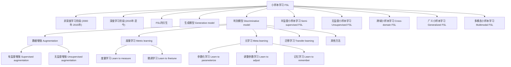
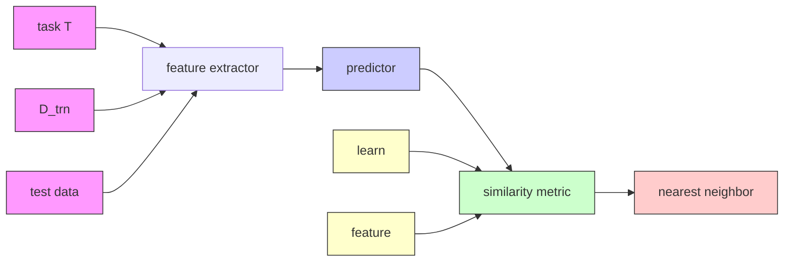
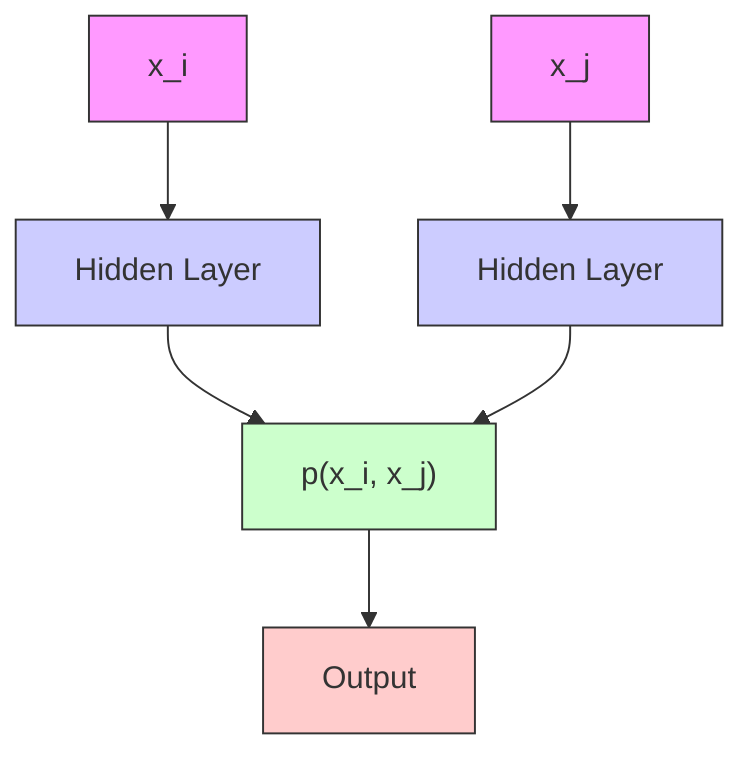
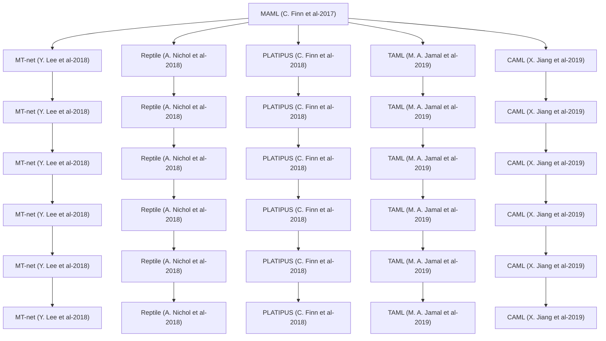
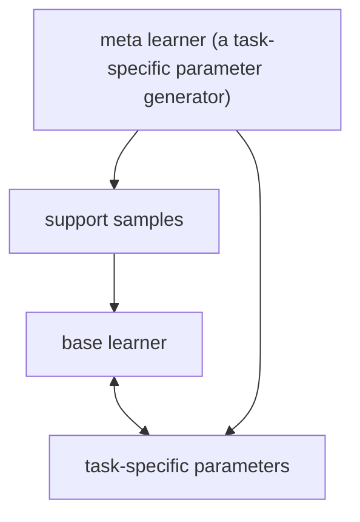
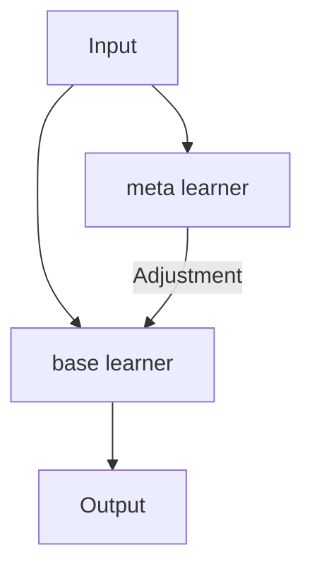
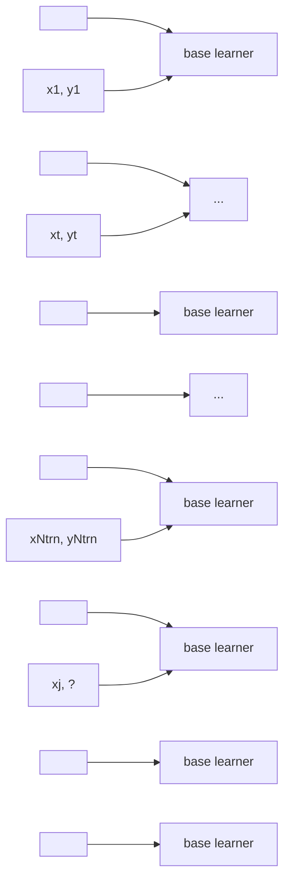

# ⼩样本学习技术调研

# 1. 介绍


基于⼩样本学习的⽬标检测

# 1.1 ⼩样本学习(Few-shot learning, FSL)

⼩样本学习(Few-shotlearning,FSL)是机器学习领域中⼀个重要的分⽀，其核⼼⽬标是通过较少的训练集实现模型的⾼效学习与泛化。这⼀技术的灵感源⾃⼈类的学习模式：⼈类能够在接触少量例⼦后迅速建⽴对新事物的认知，⽽传统机器学习通常需要⼤量的数据来保证模型的泛化能⼒。FSL旨在模仿⼈类的这种⾼效学习能⼒，从⽽在数据稀缺的场景下实现模型的有效训练和应⽤。

# 1.1.1 必要性和意义

• 降低模型训练的成本：医学领域的数据获取和标注成本都⾮常⾼昂，FSL不依赖⼤规模的训练数据，能够显著减少数据采集和标注的开销，从⽽降低模型训练的总体成本。  
• 提升模型动态适应⼒：在⾯对新任务或数据稀缺的场景时，FSL能够在仅有少量样本的情况下快速适应新任务，从⽽提升了模型在实际应⽤中的适应性和灵活性，加速了模型的实际部署的进程。  
推动⼈⼯智能的发展：缩⼩⼈类和⼈⼯智能的距离，为实现通⽤AI提供了可能。

# 1.1.2 困难与挑战

• 少量监督样本会使学习算法的函数搜索空间⼤，易导致过拟合，因为样本形成的约束少，难以压缩函数的冗余空间，增加了泛化误差。

# 1.2 ⼩样本学习的技术演进

# 1.2.1 ⾮深度学习时期（2000年-2015年）

核⼼思想：通过潜在变量建模数据分布 P (X∣Y ) ，结合⻉叶斯决策进⾏分类。  
. 代表⽅法：凝聚算法 (Congealing)，变分⻉叶斯框架 (Variational Bayesian framework, VBF)，⻉叶斯程序学习 (Bayesian Program Learning, BPL)等

• 凝聚算法[2]：最早研究如何从极少样本中学习的⽅法。  
. 变分⻉叶斯框架[3]：⾸次明确提出“单样本学习（one-shotlearning）”这⼀术语的研究。  
. ⻉叶斯程序学习[5]:突破传统⽣成模型限制，模拟⼈类认知的组合性与因果推理机制。

# 1.2.2 深度学习时期（2015年-⾄今）

• 核⼼思想：随着深度神经⽹络表征学习能⼒的突破，⼩样本学习研究重⼼从⽣成式建模转向判别式模型设计。  
• 代表⽅法：孪⽣卷积神经⽹络（SiameseCNN）的提出⾸次将深度学习融⼊到⼩样本学习问题的解决⽅案中。

该⽅法⽤于在成对样本上学习⼀种与类别⽆关的相似性度量，这标志着⼩样本学习新时代的开始，即深度学习阶段。SiameseCNN启发了度量学习与元学习两⼤主流技术路线，为后续Prototypical Networks、Matching Networks等⽅法奠定基础。

# 1.3 类型

⼩样本学习的技术类型可以分为⽣成模型和判别模型。


<details>
<summary>flowchart</summary>


</details>

<table><tr><td>Fields</td><td colspan="2">Subfields &amp; References</td></tr><tr><td rowspan="4">Computer Vision</td><td>image classification</td><td>general image classification (see Table 1,2,3,4,5,6,8, Fig. 13,16, multi-label classification [251, fine-grained recognition [119,129,130,243,247,252,253,254,255, hyperspectral image classification [256,257,3D object/model classification [148,251]</td></tr><tr><td>image segmentation</td><td>semantic segmentation [258,259,260,261,262,263,264,265,266, instance segmentation [267,267,268, texture segmentation [269,270, medical/biological image segmentation [271,272,273,274]</td></tr><tr><td>object detection</td><td>general objects [275,276,277,278, air vehicles [279, RGB-D objects [280]</td></tr><tr><td>other applications</td><td>image generation [37,48,69,252,281,282,283,284,285, image retrieval [111,286, gaze estimation [287, depth estimation [288, localization [289, scene graph prediction [290, image-based person re-identification [291,292, image colorization [293, color constancy [294]</td></tr><tr><td rowspan="3">Video</td><td>video classification</td><td>general video classification [176,233,295,296, gesture recognition [297,298, action recognition [119,299,300,301,302,303,304]</td></tr><tr><td>video detection</td><td>action localization [305,306,activity detection [307]</td></tr><tr><td>other applications</td><td>video prediction [156,308,video object segmentation [309,310,semantic indexing [311, video retargeting [312,video generation [313,video-based person re-identification [314, object tracking [315,motion capture [316]</td></tr><tr><td>Natural Language Processing</td><td>text classification [317,318,319,320,321,322,323,324,325,326,327,328, dialogue system [329,330,331, relation learning and knowledge graphs [332,333,334,335,336,word representation learning [337,338,339,340,341, named entity recognition [342,343,344,word prediction [49,162,163,natural language generation [345,346,347,348, information extraction [211],matchine translation [100],charge prediction [178],sequence labeling [349]</td><td></td></tr><tr><td>Audio&amp;Speech</td><td colspan="2">text-to-speech [356,357,358,359,acoustic/sound event detection [360,361,362,speech generation [350,363, keyword/command recognition [364,keyword spotting [365,human-fall detection [366],speaker recognition [367,</td></tr><tr><td>Reinforcement Learning&amp;Robotic</td><td colspan="2">imitation learning [368,369,370,371,372,373,374,375,376,locomotion [50,171,377,policy learning [246,306, visual navigation [50,137,144,171,378,robot manipulation [378,379,multi-armed bandits [171,tabular MDPs [171]</td></tr><tr><td>Data Analysis</td><td colspan="2">data regression [50,137,138,139,141,142,143,145,156,169,246,anomaly/error detection [380,381,382]</td></tr><tr><td>Cross-Field</td><td colspan="2">image captioning [383,visual question answering [383,384]</td></tr><tr><td>Other Applications</td><td colspan="2">disease prediction [212,385,386,387,388,389,390,biometrical recognition (e.g., palmprint [391,ear [205), drug discovery [392,spectrum classification [393,precision agriculture [394,internet security [395,mobile sensing [396]</td></tr></table>

# 1.4 ⼩样本的数据集结构

⼩样本的深度学习通常将数据集分为三个部分：训练集(Trainingset),⽀持集(Supportset),查询集(Query set)。

. 训练集：⽤于预训练学习模型的源数据集  
⽀持集：⽤于选出具有优良任务性能模型的模板域训练数据集（包含少量标记信息）  
查询集：⽤于验证训练模型准确率的⽬标域测试数据集。

# 2. ⼩样本学习的关键技术

# 2.1 ⽣成模型 (Generative model)


⼩样本学习⽅法通常⾯临数据与⽬标间概率关系不直观的问题，于是引⼊中间潜在变量来建⽴联系。⼏乎所有基于⽣成模型的⼩样本学习⽅法都遵循这⼀总体策略，即便它们在潜在变量的具体形式上有所不同。

以下⽅法从不同⻆度构建了潜在变量，除了神经统计学模型(2.1.7)之外的⽅法都诞⽣于⾮深度学习时期，并且⼤多数⽅法是根据特定的任务形式或数据形式量⾝定制的，缺乏对更⼀般情况的可扩展性。（早期的⼩样本学习没有形成统⼀的评价标准，因此⽆法直观⽐较。）

TABLE 1 Summary of different generative model based FSL approaches 

<table><tr><td>Approaches</td><td>Latent Variable</td><td>Task Type</td><td>Experimental Dataset</td><td>Remark</td></tr><tr><td>Congealing [29]</td><td>Transformation  $z_{tran}$ </td><td>Multi-class image classification</td><td>NIST Special Database 19 [57]</td><td>the founder of FSL/only applicable to simple digit or letter character grayscale images</td></tr><tr><td>VBF [31], [32], [33]</td><td>Parameters  $z_{para}$ </td><td>Binary image classification</td><td>Caltech 4 Data Set [31], [58], Caltech 101 Data Set [32], [33]</td><td>the first work to propose “one-shot learning” / hard to adapt to multi-class tasks</td></tr><tr><td>HB [59]</td><td>Superclass  $z_{sup}$ </td><td>Binary image classification</td><td>MNIST [60], MSR Cambridge dataset [59]</td><td>relies on the underlying hierarchical inter-class relationship/hard to adapt to multi-class tasks</td></tr><tr><td>BPL [34], [35], [36], [37]</td><td>Programs  $z_{prog}$ </td><td>Multi-class image classification, Image generation</td><td>Omniglot [37]</td><td>requires the dynamic stroke information and the production rules of image objects</td></tr><tr><td>Chopping [61]</td><td>Splits  $z_{spl}$ </td><td>Binary image classification</td><td>COIL-100 database [62], LATEX symbols [61]</td><td>like a probabilistic “ensemble” method/hard to adapt to multi-class tasks</td></tr><tr><td>CPM [63]</td><td>Reconstruction  $z_{rec}$ </td><td>Multi-class image classification</td><td>MNIST [60], USPS [64]</td><td>only applicable to simple digit or letter character grayscale images/does not need the auxiliary set  $D_A$ </td></tr><tr><td>Neural Statistician [65]</td><td>Statistics  $z_{stat}$ </td><td>Multi-class image classification, Image generation</td><td>MNIST [60], Omniglot [37], Youtube Faces database [66]</td><td>an extension of a variational autoencoder/ contains some deep neural networks</td></tr></table>

# 2.1.1 基于变换的建模 (Transformation)


通过对数据进⾏特定形式的改变或转换操作，从⽽在数据和⽬标之间建⽴联系。

Learning from one example through shared densities on transforms [2] (Congealing算法, 2004)

Congealing算法是⾸个尝试从单个样本学习的⽅法。假定每个数字类别都存在⼀个潜在图像。它假定每个数字类别都存在⼀个潜在图像。例如，对于数字“1”，有⼀个特定的潜在图像代表数字“1”的基本形态。该算法还假设不同类别间变换的概率密度是共享的，即变换概率与类别⽆关。这意味着⽆论对于数字“0”还是数字“9”，从其潜在图像⽣成观测图像时，发⽣某⼀特定变换（如旋转45度）的概率是⼀样的。Congealing算法仅适⽤于简单的数字或字⺟字符灰度图像。

# 2.1.2 参数化⽣成 (Parameters)


⽤于构建数据和⽬标之间的概率联系。将潜在变量设定为参数，意味着把数据⽣成过程看作是由⼀组参数所掌控。这些参数可以被理解为决定数据具体形态和特征的关键因素。

Learning Generative Visual Models from Few Training Examples: An Incremental Bayesian Approach Tested on 101 Object Categories [3] (VBF算法, 2007)

该算法借助概率模型，对RGB图像中是否存在特定物体这件事进⾏概率上的量化评估。其概率模型包含许多需要学习的参数，通过对这些参数的学习，实现对图像中物体存在概率的准确判断。

# 2.1.3 超类层次建模 (Superclass)


⽤于构建数据与类别之间的概率关系，加深理解数据结构。超类是⼀个⽐具体类别更宽泛且

具概括性的类别概念，从更宏观的层⾯看待具体类别之间的关系，挖掘它们的共性特征。

• One-shot learning with a hierarchical nonparametric Bayesian model [4] (层次⻉叶斯模型, 2011)

层次⻉叶斯模型通过超类关系构建，利⽤超类来整合同⼀超类下不同类别间的信息。该模型认为属于同⼀个超类的不同类别，在数据特征和分布上具有⼀定的共性，从⽽通过先验分布和条件数据分布来计算给定类别时数据的概率。这种⽅式有助于在复杂的分类任务中更好地捕捉类别间的共性与差异，提升模型的性能和泛化能⼒。

# 2.1.4 程序化⽣成 (Program)


为数据⽣成与分类提供了⼀种基于⽣成过程描述的建模⽅式。将潜在变量视为程序，意味着把数据的⽣成过程看作是由⼀系列特定的步骤或指令组成的程序执⾏结果，模拟数据⽣成的程序逻辑。程序是⼀种抽象概念，⽤于描述如何从初始状态逐步⽣成特定的数据实例，能够灵活地捕捉不同类别数据的复杂⽣成模式。

One shot learning of simple visual concepts [5] (BPL算法)

BPL算法利⽤⻉叶斯理论和⽅法，把字符对象从⽆到有的创建过程，以⼀种具有概率性质的程序形式来描述和理解。在图像⽣成任务⾥，程序可以是⼀系列指令，如先确定图形的轮廓形状，接着填充颜⾊，再添加纹理细节等，每⼀步都涉及特定的参数设置，这些指令和参数共同构成了程序。

与简单的参数化或固定变换不同，程序策略可以根据不同类别数据的特点，设计出⾼度定制化的⽣成步骤。

# 2.1.5 划分集成⽅法 (Splits)


通过对辅助集的多样化划分和多预测器的综合运⽤，提升了模型在分类等任务中的性能和对数据的理解能⼒。

• Pattern recognition from one example by chopping [6] (Chopping模型, 2005)

Chopping 模型对辅助集 进⾏多次随机划分。每次划分会将辅助集中的类别随机分成两部分，然后给其中⼀半的辅助类别分配标签1，另⼀半分配标签0。例如，某个数据集中有10个不同类别的图像，模型可能随机挑选5个类别，将这些类别的所有图像都标记为1，另外5个类别标记为0，针对每⼀种划分⽅式都训练⼀个预测其。这种随机划分⽅式引⼊了多样性，使得模型可以从不同⻆度学习数据特征。测试集中的图像，Chopping模型通过综合所有基于不同划分的特定预测器的预测结果，来做出最终的⻉叶斯后验决策。

# 2.1.6 结构重构模型 (Reconstruction)

利⽤特定⽅式对测试样本进⾏重新构建的过程。该过程有助于模型基于图像的补丁结构实现对测试样本的有效分类。

• One Shot Learning via Compositions of Meaningful Patches [7]

提出了⼀种组合补丁模型(CPM)，将训练集中每个类别的单个样本分割成⼀组组件，这些组件是构成字符图像的基本单元，它们可能是字符的局部笔画、形状⽚段等，将复杂的字符图像分解为相对简单且具有代表性的部分。假设同类字符图像共享相同的基于补丁的结构，利⽤与或图来重构测试集中的测试样本。

# 2.1.7 神经统计模型 (Statistics)

通过⽣成潜在空间中的统计量来深⼊理解数据的具体特征。具体⽽⾔，是对数据⽣成相应的统计量，以此描述数据的具体特征。

. Towards a Neural Statistician [8]

NeuralStatistician模型，运⽤深度⽹络⽣成统计量，这些统计量为每个训练集封装了⼀个⽣成模型。通过确定均值和⽅差，刻画潜在空间中数据点的分布情况，即定义了⼀个⾼斯分布。在数据⽣成任务中，基于该⾼斯分布对潜在变量进⾏采样，⽣成符合训练数据特征模式的数据实例；在分类任务中，依据输⼊数据与由潜在变量关联的⾼斯分布的匹配程度判定类别，从⽽实现⾼效的数据⽣成与分类。

# 2.2 判别模型 (Discriminative model)

基于判别模型的FSL⽅法尝试利⽤稀缺的训练集，直接为任务对后验概率进⾏建模，计算模型通常包含⼀个特征提取器和⼀个预测器。

由于训练集中的样本稀缺，仅使⽤训练集来拟合时很容易陷⼊过拟合。因此，现有的基于判别模型的FSL⽅法从不同⻆度寻求构建后验概率的⽅法。

# 2.2.1 数据增强（Data augmentation）

从辅助数据集中学习⼀个通⽤的数据增强函数，以增强训练集中的样本或样本特征。是⼀种直观的增加训练样本数量并提升数据多样性的⽅法。

数据增强和其他FSL方法并不冲突，作为即插即用的模块，经常和其他FSL算法一起使用。

基础的数据增强包括旋转、翻转、裁剪、平移和添加噪声等基本的图像处理⽅式。这些⽅式在⼩样本上难以让模型学到⾜够通⽤的特征，⽆法从根本上提升FSL模型的泛化能⼒。在深度学习时期，⼈们提出了更多专⻔为FSL定制的更复杂的数据增强⽅案，利⽤图像特征进⾏数据增强。

传统数据增强Image classification with deep convolutional neural networks (NIPS 2012)


<details>
<summary>flowchart</summary>

```mermaid
graph LR
    A["data"] --> B(feature extractor)
    B --> C["feature"]
    C --> D["side information"]
    D --> E["predictor"]
    E --> F["..."]
    F --> G["augmented features"]
    G --> C
    style G fill:#cccccc,stroke-dasharray: 5 5
    note1["Supervised Augmentation"]
    note2["Unsupervised Augmentation"]
    classDef process fill:#f9f9f9,stroke:#ccc,stroke-width:2px;
    classDef data fill:#e6f7ff,stroke:#333,stroke-width:2px;
    class A,B,C process;
    classDef prediction fill:#ffffff,stroke:#0000000;
    classDef error fill:none,stroke:none
    classDef predictor fill:none,stroke:none
    class B,C process;
    classDef edge fill:none,stroke:none
    classDef edge error
    classDef data fill:none,stroke:none
    classDef prediction
    classDef error
```
</details>

基于数据增强的FSL通⽤框架

• 有监督数据增强：据数据增强过程需依赖外部辅助信息。学习特征空间 $\Omega _ { f e }$ 和辅助信息空间 $\Omega _ { s i }$ 的映射关系作为增强函数。

• One-Shot Learning of Scene Locations via Feature Trajectory Transfer (特征轨迹转移, FFT, 2016) [9]

利⽤场景图⽚上的连续属性（如光照强度、天⽓状况等）来合成特征。它在辅助类别上学习⼀个线性轨迹映射，将属性映射到特征上。通过设置属性的数值，可以通过该映射合成许多特征，从⽽增强任务类的数据集。

AGA: Attribute Guided Augmentation (属性引导增强，AGA, 2016) [10]

构建了⼀个编解码⽹络结构，将样本特征映射到⼀个与输⼊特征属性强度不同的合成特征中。它在辅助类别上学习⼀个类不可知的特征转换模型，⽤⽬标类深度范围的物体特征作为输⼊，输出不同深度的合成特征。

Multi-level Semantic Feature Augmentation for One-shot Learning (双三⽹, Dual TriNet, 2018) [11]

利⽤编码器将特征空间映射到语义空间中对数据增强，再利⽤解码器将扩充后的语义信息还原到特征空间。

• Attribute-Based Synthetic Network (ABS-Net): Learning more from pseudo feature representations (ASB-Net, 2018) [12]

先在辅助数据集上学习属性，并建⽴属性库。对于给定的类别属性描述，在属性库中进⾏概率抽样，将属性映射到属于该类的伪特征上。

• Attribute-Based Transfer Learning for Object Categorization with Zero/One Training Example (AT, 2010)[13]

提出主题模型建模⽅案，对图像与属性之间的关系进⾏建模。将每张图视为包含多个属性的⽂档，每个属性由特征的概率分布表⽰。它在辅助数据集上进⾏参数估计，对于参数已知的概率分布，给定类别属性，可以⽣成⼤量特征。

# • ⽆监督数据增强：据数据增强过程不依赖外部辅助信息

Robust boosting for learning from few examples (GentleBoostKO, 2005) [14]

是早期⾮深度学习时期⼀种简单直接的FSL解决⽅案，它通过剔除(knockout)过程来合成特征。这种剔除操作是通过将⼀个特征在某⼀坐标处的元素替换为另⼀个特征在相同坐标处的元素来实现的。其关键理念是创建极少数样本的受损副本，以提⾼模型的鲁棒性。

• Low-shot Visual Recognition by Shrinking and Hallucinating Features (SH, 2017)[15]

提出类内变异可以跨类进⾏泛化的。与有监督增强不同，SH的类内变异隐藏在数据⾥，利⽤四元组形式的隐式变换类⽐从辅助集中获取。开创了表征学习（特征提取器）+⼩样本学习（分类器）这⼀基准算法。

• Delta-encoder: an effective sample synthesis method for few-shot object recognition (Δ-编 码器, 2018)[16]

也是通过辅助集提取可迁移的类内变异（称Δ），并将这种变异应⽤于新的任务类别，以便为任务类别合成新样本。Δ-编码器也基于潜在的四元组类⽐来转移，不同于SH使⽤简单的多重感知器处理四元组关系的具体映射，Δ-编码器开发了⼀种编码器-解码器⽹络。

• Low-Shot Learning from Imaginary Data (幻觉⽣成器Hallucinator, 2018) [17]

使⽤⼀个基于多层感知器的⽣成器为训练集中的训练样本增强特征。这个⽣成器被设计成⼀个即插即⽤的模块，可以集成到各种现成的元学习模块中。

• Low-shot Learning via Covariance-Preserving Adversarial Augmentation Networks (CP-ANN, 2018) [18]

通过基于⽣成对抗⽹络的集对集转换，少量的⽀持样本实现了特征增强，这种转换能在增强过程中保留辅助样本的协⽅差，这有助于保留样本间的统计关系。

• Data Augmentation Generative Adversarial Networks (DAGAN, 2018) [19]

将训练集中的样本作为输⼊，并通过条件⽣成对抗⽹络直接⽣成类内数据。这种⽅式聚焦于在类内⽣成更多数据，丰富类内数据的多样性。

• Image Deformation Meta-Networks for One-Shot Learning (IDeMe-Net, 2019) [20]

基于相似图像视觉融合能保留关键语义信息并助⼒确定分类器决策边界的理念，为少量⽀持样本⽣成变形图像，通过改变图像形态但保留关键语义，为分类提供更多信息。

TABLE2   
Summary of supervised (top part) or unsupervised (bottom part) augmentation based FSL approaches 

<table><tr><td>Approaches</td><td>Side Information</td><td>Mapping Direction</td><td>Mapping Module</td><td>Task Type</td><td>Experimental Dataset</td></tr><tr><td>FTT [72]</td><td>transient attributes (rainy, sunny, etc)</td><td> $\Omega_{si} \rightarrow \Omega_{fe}$ </td><td>linear model</td><td>scene location classification</td><td>Transient Attributes Database (TADB) [77], SUN Attributes Database (SADB) [78]</td></tr><tr><td>AGA [73]</td><td>attribute strength (depth, pose)</td><td> $\Omega_{fe} \xrightarrow{\Omega_{si}} \Omega_{fe}$ </td><td>encoder-decoder network (MLP)</td><td>2D/3D object classification</td><td>SUN RGB-D [79]</td></tr><tr><td>AT [42]</td><td>discrete attributes (black, fierce, etc)</td><td> $\Omega_{si} \rightarrow \Omega_{fe}$ </td><td>probabilisic distribution</td><td>image classification</td><td>Animals with Attributes (AwA) [80]</td></tr><tr><td>Dual TriNet [74], [75]</td><td>word vectors, discrete attributes</td><td> $\Omega_{fe} \rightarrow \Omega_{si} \rightarrow \Omega_{fe}$ </td><td>encoder-decoder network (CNN)</td><td>image classification</td><td>minilImageNet [49], Cifar-100 [81], CUB [82], Caltech-256 [83]</td></tr><tr><td>ABS-Net [76]</td><td>discrete attributes (ForColor, BackColor)</td><td> $\Omega_{si} \rightarrow \Omega_{fe}$ </td><td>probabilisic sampling</td><td>image classification</td><td>Colored MNIST [76]</td></tr><tr><td>GentleBoostKO [39]</td><td>-</td><td> $\Omega_{fe} \rightarrow \Omega_{fe}$ </td><td>knockout (feature element replacement)</td><td>binary image classification</td><td>Caltech datasets [84]</td></tr><tr><td>SH [85]</td><td>-</td><td> $\Omega_{fe} \rightarrow \Omega_{fe}$ </td><td>quadruplet-based MLP (3 features → 1 feature)</td><td>image classification</td><td>ImageNet1k [23]</td></tr><tr><td>Hallucinator [86]</td><td>-</td><td> $\Omega_{fe} \rightarrow \Omega_{fe}$ </td><td>MLP-based generator (1 features → 1 feature)</td><td>image classification</td><td>ImageNet1k [23]</td></tr><tr><td>CP-ANN [87]</td><td>-</td><td>latent space→ $\Omega_{fe}$ </td><td>GAN</td><td>image classification</td><td>ImageNet1k [23]</td></tr><tr><td>Δ-encoder [88]</td><td>-</td><td> $\Omega_{fe} \rightarrow \Omega_{fe}$ </td><td>encoder-decoder network (MLP) (3 features → 1 feature)</td><td>image classification</td><td>minilImageNet [49], Cifar-100 [81], CUB [82], Caltech-256 [83], AwA [80], aPascal&amp;aYahoo (APY) [89]</td></tr><tr><td>DAGAN [69]</td><td>-</td><td> $\Omega_{da} \rightarrow \Omega_{da}$ </td><td>GAN</td><td>image generation, image classification</td><td>Omniglot [37], EMNIST [90], VGG-Faces [91]</td></tr><tr><td>IDeMe-Net [92]</td><td>-</td><td> $\Omega_{da} \rightarrow \Omega_{da}$ </td><td>Deformation Sub-network (2 images → 1 images)</td><td>image classification</td><td>ImageNet1k [23], minilImageNet [49]</td></tr></table>

Note: the term in the colume of "Task Type" without “binary" all indicates multi-class classification.

# 2.2.2 度量学习（Metric learning）


利⽤辅助数据集构建相似性度量S(·,·)，基于这个度量，相似的样本对能够获得更⾼的相似性得分，不相似的样本对则获得较低的相似性得分。


<details>
<summary>flowchart</summary>


</details>

基于度量学习的FSL通⽤框架

相似度的度量形式多样，简单的有欧⽒距离等距离测量，复杂的有深度神经⽹络。

TABLE 3   
Summary of melric learning based FSL approaches 

<table><tr><td>Approaches</td><td>Similarity Metric  $S(\cdot,\cdot)$ </td><td>Metric Loss</td><td>Task Type</td><td>Experimental Dataset</td></tr><tr><td>CRM [38]</td><td> $d(x_i,x_j)$  (Mahalanobis distance)</td><td>hinge loss</td><td>image classification</td><td>Latin Character database [38]</td></tr><tr><td>KernelBoost [95]</td><td> $K(x_i,x_j)$  (kernel function)</td><td>exponential loss</td><td>image classification, image retrieval</td><td>UIC [96], MNIST [60], YaleB [97]</td></tr><tr><td>Siamese Nets [30]</td><td> $\mathbf{p}(x_i,x_j)$  (siamese CNN)</td><td>binary cross-entropy loss</td><td>image classification</td><td>Omniglot [37]</td></tr><tr><td>Triplet Ranking Nets [98]</td><td> $d(x_i,x_j)$  (Euclidean distance)</td><td>triple ranking loss</td><td>image classification</td><td>Omniglot [37], miniImageNet [49]</td></tr><tr><td>SRPN [99]</td><td> $\mathbf{p}(x_i,x_j)$  (GAN+siamese CNN)</td><td>adversarial loss</td><td>image classification</td><td>Omniglot [37], miniImageNet [49]</td></tr><tr><td>MM [100]</td><td> $d(x_i,x_j)$  (memory+dot product)</td><td>memory loss</td><td>image classification, translation</td><td>Omniglot [37], WMT14 [100]</td></tr><tr><td>AdaptHistLoss [101]</td><td> $d(x_i,x_j)$  (cosine distance)</td><td>histogram loss</td><td>image classification, translation</td><td>MNIST [60], Isolet of UIC [96], Omniglot [37], tinyImageNet [101]</td></tr></table>

• Object classification from a single example utilizing class relevance metrics (⻢⽒距离, CRM, 2004) [21]   
是⾮深度学习时期提出的FSL领域⽅法中，具有开创性意义的⼀项⼯作。使⽤⻢⽒距离，⼀种考虑了数据分布特性的距离度量⽅式，来衡量样本对之间的相似性。  
Learning a kernel function for classification with small training samples (KernelBoost, 2006) [22]

提出⼀种提升算法，将复杂的核函数构建任务分解为多个简单弱核函数的组合。每个弱核函数都基于⾼斯混合模型对数据进⾏建模，能够从不同⻆度捕捉数据的分布特征，多个弱核函数组合起来可以更全⾯地描述数据间的相似性。提升算法的思想是通过不断迭代，每次添加⼀个新的弱学习器（这⾥是弱核函数）来逐步提升整体模型的性能。

. Siamese neural networks for one-shot image recognition (孪⽣⽹络, Siamese Nets, 2016) [23]

是⾸个将深度神经⽹络进⼊到FSL任务中⽅法，它由⼀对孪⽣卷积神经⽹络组成，两个⽹络共享相同的权重，使得⽹络能够以相同的特征提取⽅式处理输⼊的样本对，从⽽保证了样本对中的两个样本有⼀致性和公平性，有助于学习样本之间的相似性。⽹络输⼊⼀组样本对，输出样本对的相似性。


<details>
<summary>flowchart</summary>


</details>

孪⽣⽹络的结构，两个神经⽹络共享权重

• Deep Triplet Ranking Networks for One-Shot Recognition (Triplet Ranking Nets, 2018) [24]由孪⽣⽹络拓展⽽来，从处理样本对扩展为处理三元组样本，能更全⾯的捕捉样本间的信息。提出⼀种三元排序损失，输⼊样本包含两个正向（positive）样本和⼀个负向（negative）样本，分别计算两两之间的相似度，最后计算⼀个三元分类损失。 使得在这个度量空间中，同⼀类别的样本之间这的距离更近，不同类别的样本之间的距离更远。

# 2.2.3 元学习（Meta learning）


⼀种跨任务学习策略，旨在从任务层⾯⽽⾮样本层⾯进⾏学习，学习与具体任务⽆关的通⽤学习系统，⽽⾮针对特定任务的模型。


<details>
<summary>flowchart</summary>

```mermaid
graph LR
    subgraph "meta-train"
        A["task 1"] --> B["task 2"]
        B --> C["task 3"]
        C --> D["task4"]
        D --> E["new task"]
    end

    subgraph "meta-test"
        F["task 1"] --> G["task 2"]
        G --> H["task 3"]
        H --> I["task4"]
        I --> J["new task"]
    end

    subgraph "meta-train" --> K["task 2"]
        K --> L["task 3"]
        L --> M["task4"]
        M --> N["new task"]
    end

    subgraph "meta-test"
        O["task 2"] --> P["task 3"]
        P --> Q["task4"]
        Q --> R["new task"]
    end

    style A fill:#f9f,stroke:#333
    style B fill:#f9f,stroke:#333
    style C fill:#f9f,stroke:#333
    style D fill:#f9f,stroke:#333
    style E fill:#f9f,stroke:#333
    style F fill:#f9f,stroke:#333
    style G fill:#f9f,stroke:#333
    style H fill:#f9f,stroke:#333
    style I fill:#f9f,stroke:#333
    style J fill:#f9f,stroke:#333
    style K fill:#f9f,stroke:#333
    style L fill:#f9f,stroke:#333
    style M fill:#f9f,stroke:#333
    style N fill:#f9f,stroke:#333
    style O fill:#f9f,stroke:#333
    style P fill:#f9f,stroke:#333
    style Q fill:#f9f,stroke:#333
    style R fill:#f9f,stroke:#333
    style S fill:#f9f,stroke:#333
    style T fill:#f9f,stroke:#333
    style U fill:#f9f,stroke:#333
    style V fill:#f9f,stroke:#333
    style W fill:#f9f,stroke:#333
    style X fill:#f9f,stroke:#333
    style Y fill:#f9f,stroke:#333
    style Z fill:#f9f,stroke:#333
```
</details>

基于元学习的FSL通⽤框架

元学习主张跨任务进⾏学习，通过学习多个任务去适应新任务，每个任务都会给定样本。元学习⽅法分两个阶段来处理FSL问题：元训练和元测试。元学习的⽬标是找到模型参数，使得在所有任务上的期望损失最⼩化。

• 元训练阶段：会⽤到许多基于辅助数据集构建的相互独⽴的有监督任务，⽬的是学习如何去适应未来相关的任务。训练阶段使⽤的数据集被称为⽀持集。  
• 元测试阶段：模型会在⼀个新的任务上进⾏测试，这个新任务的标签空间与元训练阶段所⻅到的标签空间是不相交的。测试阶段使⽤的数据被称为查询集。  
• 元学习⽬标：元学习的⽬标是找到模型参数θ ，使所有任务上的期望损失L(⋅; θ) 最⼩化，

也有⽂献将元学习的范式分为三类：

. 基于度量（学习测量）：构建任务⽆关的特征空间  
. 基于优化（学习微调）：优化模型初始点  
基于模型（学习权重/调整/记忆）：⽤神经⽹络学习更新过程

# 2.2.3.1 学习测量 (L2M)

学习测量⽅法本质上继承了度量学习的主要思想。然⽽，在实现层⾯上基于度量学习的FSL⽅法有所不同：L2M⽅法采⽤元学习策略来学习相似性度量，这种相似性度量期望能够在不同任务间进⾏迁移。L2M是基于元学习的FSL⽅法中的⼀个重要分⽀。

⚠ ：度量学习旨在学习⼀种合适的度量⽅式，使数据的相似性或差异性能更好反映其内在结构和语义信息，需要针对每个具体任务单独设计度量⽅式。L2M通过元学习来学习相似性度量，期望学到的度量不是只适⽤于某⼀个特定任务，⽽是可以在不同的⼩样本学习任务之间迁移使⽤。

• 优势：不会受到测试场景特定设置的限制，因为它们仅利⽤样本之间的相似性来进⾏最终推断，⽽不考虑类别数量以及每个类别中的⽀持样本数量（即与类别数/样本数⽆关）。  
劣势：跨域泛化差，训练与测试任务分布差异易导致度量失效；复杂数据中类原型可能重叠导致边界模糊。

• ⽅法：分别将⽀持样本和查询样本映射为特征，得到⽀持集的嵌⼊模型 $f ( \cdot ; \theta _ { f } )$ 和查询集的嵌⼊模型 $f ( \cdot ; \theta _ { g } )$ ，通过度量模块 $S ( f , g , \theta _ { S } )$ 衡量⽀持样本和查询样本之间的相似性，基于度量模块输出的相似性作为查询样本的最终预测概率。现有的L2M⽅法主要在嵌⼊模型、和度量模块的模型设计和选择上存在不同。

<table><tr><td>方法</td><td>嵌入网络</td><td>相似度函数</td><td>优化目标</td></tr><tr><td>原型网络 Prototypical Nets</td><td>CNN</td><td>欧几里得距离</td><td>Cross-entropy</td></tr><tr><td>匹配网络 Matching Nets</td><td>CNN+LSTM</td><td>注意力加权余弦相似度</td><td>Cross-entropy</td></tr><tr><td>关系网络 Relation Nets</td><td>CNN</td><td>可训练关系网络</td><td>均方误差MSE</td></tr></table>

如匹配网络、原型网络以及关系网络等几个具有里程碑意义的元学习方法都属于L2M。

Prototypical Networks for Few-shot Learning (Prototypical Nets, 2017) [25]   
每个类别在嵌⼊空间中对应⼀个原型，分类通过计算查询样本与类原型的欧⼏⾥得距离实现。  
. Matching Networks for One Shot Learning (Matching Nets, 2016) [26]

⾸个基于深度学习的L2M⽅法，嵌⼊⽹络是CNN和双向LSTM的组合，相似性度量采⽤注意⼒加权余弦相似度。

• Learning to Compare: Relation Network for Few-Shot Learning (Relation Nets, 2017) [27]

将⽀持样本和查询样本的特征进⾏拼接，使⽤CNN度量相似性。

```mermaid
graph TD
    A["Matching Nets (O. Vinyals et al-2016)"] -->|adopt a schedule sampling, strategy for model training, interaction between support and query during embedding process| B["Cross-Modulation Nets (H. Prol et al-2018)"]
    A -->|measure similarity by graph neural network| C["GNN (V. Garcia et al-2018)"]
    A -->|measure similarity by CNN| D["Relation Net (F. Sung et al-2018)"]
    E["Micro-set Learning (K. D. Tang et al-2010)"] -->|deep model| F["Prototypical Nets (J. Snell et al-2017)"]
    F -->|margin loss| G["mAP-Nets (E. Triantafillou et al-2017)"]
    F -->|ranking-based similarity metric| H["TADAM (B. N. Oreshkin et al-2018)"]
    F -->|metric scaling + task conditioning| I["AM3 (C. Xing et al-2019)"]
    F -->|merge scaling + cross-modal information| J["AAM (F. Hao et al-2019)"]
    F -->|aggregate compositional features to produce sample's embedding| K["CFA (P. Hu et al-2019)"]
    F -->|refine the query sample's embedding before inference| L["CTM (H. Li et al-2019)"]
    F -->|distinguish the different importance of support samples| M["Diversity with Cooperation (N. Dvornik et al-2019)"]
    F -->|perform relation computation on second-order features| N["SoSN (H. Zhang et al-2019)"]
    F -->|add a self-attention module before relation module| O["SARN (B. Hui et al-2019)"]
    F -->|select the task-relevant dimensions for features| P["CTM (H. Li et al-2019)"]
    B --> Q["SS Matching Net (L. Zhang et al-2019)"]
    C --> R["EGNN (J. Kim et al-2018)"]
    D --> S["CovaMNet (W. Li et al-2019)"]
    D --> T["DN4 (W. Li et al-2019)"]
    D --> U["a local descriptor based relation module"]
    D --> V["a covariance metric based relation module"]
    D --> W["a pairwise relation within a class + query conditioning"]
    D --> X["painwise relation within a class + query conditioning"]
    D --> Y["Deep Comparison Net (X. Zhang et al-2018)"]
    E --> Z["Micro-set Learning (K. D. Tang et al-2010)"]
    Z --> F
```


<details>
<summary>flowchart</summary>


</details>

不同L2M⽅法之间的发展关系

# 2.2.3.2 学习微调 (L2F)

学习微调⽅法使⽤任务的少量⽀持样本对基础学习器进⾏微调，学习⼀个模型初始参数 $\theta _ { m e t a }$ ，使得在新任务上经过少量的参数更新步骤就快速收敛。⼀般来说，学习微调⽅法都包含⼀个基础学习器和⼀个元学习器。基础学习器针对特定任务，将样本作为输⼊并输出预测概率，由更⾼级别的元学习器学习得到。元学习器：在⼀系列元训练任务上进⾏学习，⽬的是最⼤化基础学习器在所有任务上的综合泛化能⼒。

优势：适⽤于任意可以微调的模型架构；增量适应能⼒强。  
劣势：⼆阶导数计算导致计算开销⼤；内循环步数少可能导致⽋拟合。  
. ⽅法：⾸先在多个元训练任务上进⾏学习，调整元学习参数 $\theta _ { m e t a }$ ，使得元学习器能够学习到⼀种通⽤的学习策略或知识。当⾯对新任务时，基础学习器能够利⽤元学习器学到的知识，在少量⽀持样本上快速收敛。

两个具有里程碑意义的L2F方法是模型无关元学习和元学习器长短期记忆网络。

• Model-Agnostic Meta-Learning for Fast Adaptation of Deep Networks (模型⽆关元学习 MAML, 2017) [28]   
通过跨任务训练策略为基础学习器的参数寻找⼀个良好的参数初始化。这个初始化参数的选择⼗分关键，它决定了基础学习器在⾯对新任务时的学习速度和泛化能⼒。许多L2F⽅法都是MAML的变体。  
• Optimization as a model for few-shot learning ( Meta-Learner LSTM, 2019) [29]

通过⼀个基于LSTM的元学习器，将基础学习器针对每个⽀持样本的损失和梯度作为输⼊，这⾥的损失衡量了基础学习器预测与真实标签之间的差异。在这个框架⾥，基于LSTM的⽅法取代了传统的基于梯度的基础学习器参数优化⽅式，元学习器更新后的隐藏状态被⽤作基础学习器的更新参数。基础学习器使⽤这些更新后的参数，对下⼀个⽀持样本进⾏处理。


<details>
<summary>flowchart</summary>


</details>

MAML及其变体的发展关系

# 2.2.3.3 学习参数化 (L2P)


<details>
<summary>flowchart</summary>


</details>

学习参数化⽅法的通⽤架构

通过动态⽣成模型参数替代传统静态权重，使模型能够根据任务的⽀持集数据快速⽣成任务特定的参数。学习参数化⽅法⼀般同时包含基础学习器和元学习器。基础学习器负责对样本进⾏处理和预测，是直接作⽤于任务的模型部分；元学习器在其中起到关键的参数⽣成作⽤。在L2P⽅法中，两个学习器在每个任务内是同步训练的，并且元学习器本质上是⼀个特定于任务的参数⽣成器。

优势：⾼度灵活性，适配复杂模式；参数⽣成过程引⼊隐式正则化，可以减少过拟合。  
• 劣势：⽣成器和主⽹络联合优化的难度⼤；参数数量庞⼤计算代价⾼；⽣成参数的可解释性差。  
• ⽅法：其核⼼流程分为元训练和元测试两个阶段。元训练阶段将⽀持样本输⼊⾄基础学习器，基于⾃⾝参数对样本进⾏处理，进⽽得出损失值以及相应的梯度信息。元学习器以这些损失和梯度为依据，⽣成适配任务的特定参数，同时运⽤梯度下降算法对⾃⾝参数进⾏优化调整。元测试阶段⾯对新任务，将新任务的⽀持样本交由基础学习器进⾏初步处理，随后元学习器依据新任务的特性快速⽣成与之匹配的适配参数，⽤以即时更新基础学习器的参数状态。

. Learning feed-forward one-shot learners (Siamese Learnet, 2016) [30]

，使⽤孪⽣⽹络作为基础学习器，其中特别设计了⼀个具备动态特性的卷积层，该卷积层能够依据不同的任务需求灵活调整⾃⾝参数，以实现对多样化任务的适配。同时，引⼊⼀个单流孪⽣⽹络充当元学习器⽤于精准捕捉任务特征，基于所获取的信息为基础学习器中的动态卷积层⽣成与特定任务紧密契合的权重。

• LGM-Net: Learning to Generate Matching Networks for Few-Shot Learning ( 2019) [31]

⼀种先进的L2P⽅法， 。它开发了⼀个MetaNet模块作为元学习器，⽤于根据每个FSL任务中的少量⽀持样本，通过⼀个具有多元⾼斯采样的编码器-解码器模型，⽣成TargetNet模块（基础学习器）的权重。

• Learning to learn: Model regression networks for easy small sample learning (Regression Nets, 2017) [32]

，实现基础学习器权重从⼩样本模型到⼤样本模型的⼀种与任务⽆关的转换。将适⽤于⼩样本训练的权重转换为类似⼤样本训练后得到的权重，通过这种权重转换，即使在只有少量训练样本的情况下，基础学习器也能够获得更具通⽤性的权重。

# 2.2.3.4 学习调整 (L2A)


<details>
<summary>flowchart</summary>


</details>

学习调整⽅法的通⽤架构

针对特定样本，⾃适应地调整基础学习器中的计算流程或计算节点，以使该样本与基础学习器相互适配。其核⼼在于引⼊轻量级调整模块（如注意⼒机制、特征变换器），根据⽀持集信息对基础⽹络（如特征提取器）的中间层进⾏细粒度调整，⽽⾮直接⽣成完整参数或全局微调。L2A和L2P都借助元学习器来改变基础学习器，但是L2A对基础学习器只进⾏⼀些增量式的微调，不像L2P对基础学习器或其部分进⾏全⾯的参数化。另外，L2A⽅法的调整⼀般基于单个样本，⽽L2P的参数化是针对整个任务，因此L2A的改变更具精细粒度。

. 优势：计算开销⼩；兼容性强，可以与度量，微调等⽅法结合。  
• 劣势：模块设计复杂，⾯临模型参数数量庞⼤导致过拟合的⻛⻛险；多任务共享调整模块可能导致⼲扰。

• Meta Networks MetaNet, 2017) [33]

是⼀种基于动态权重调整的元学习⽅法。在基础学习器的各层级架构之上，额外部署了⼀层快速权重层。每个快速权重层的权重由外部元学习器根据输⼊样本⽣成。元学习器作为外部模块，根据输⼊样本动态⽣成每层快速权重层的参数，实时调整基础学习器的中间特征表⽰。  
• Rapid Adaptation with Conditionally Shifted Neurons (CSNs, 2017) [34]

选择调整基础学习器中每个隐藏节点的神经元状态，隐藏节点是神经⽹络中负责处理数据的部分。采⽤了⼀种独特的⽅式，即将记忆模块与基于注意⼒机制的记忆读取机制相结合，为基础学习器中的每个神经元激活前的状态⽣成特定的条件偏移。

# 2.2.3.5 学习记忆 (L2R)


<details>
<summary>flowchart</summary>


</details>

学习记忆⽅法的通⽤架构

将⼀个FSL任务的⽀持集建模为⼀个序列，把⽤于辅助模型学习的⽀持样本按照⼀定顺序排列，看成⼀个有序的组合。引⼊外部记忆模块存储关键样本或任务信息，并将少样本学习任务构建为⼀个序列学习任务，在这个任务中，查询样本需要与之前⻅过的信息（即⽀持样本）进⾏匹配。这类⽅法所采⽤的基础学习器通常需要包含⼀个时间序列⽹络，来处理为数不多的⽀持样本。

• 优势：通过记忆回放增强持续学习能⼒。  
• 劣势：固定⼤⼩记忆易导致信息溢出；⼤规模记忆搜索耗时；记忆中的⽆关样本会⼲扰预测。

⼀些具有代表性的少样本学习（FSL）⽅法，如 MANN、ARCs、SNAIL 和 APL。

Meta-Learning with Memory-Augmented Neural Networks (MANN, 2016) [35]

使⽤记忆增强型神经图灵机（NTM）来快速吸收⽀持样本，然后在查询样本到来时检索这些样本。NTM就像是⼀个具有强⼤记忆功能的模块，它可以快速“吸收”⽀持样本的信息并存储起来。当查询样本出现时，⼜能像从记忆库中检索东西⼀样，把之前存储的相关⽀持样本信息拿出来，帮助对查询样本进⾏处理。

Attentive Recurrent Comparators (ARCs, 2017) [36]

开发了基于注意⼒机制的RNN。注意⼒机制可以让模型在处理样本时，动态地关注样本的不同部分。通过这种⽅式，在⽐较样本时，模型能够更灵活地聚焦于样本中重要的特征，从⽽实现样本之间更有效的动态⽐较。

# 2.2.4 迁移学习 (Transfer learning)

将源领域的知识迁移到⽬标领域，直接利⽤预训练模型的通⽤特征提升⽬标任务的性能。源任务与⽬标任务需相似，依赖源领域的⼤规模数据，⽬标领域数据少但需与源领域分布相似。

⚠迁移学习和学习微调⽅式的区别：元任务之间可⽆关，模型学习跨任务的泛化能⼒（如从不同类别构建任务）。依赖源任务和⽬标任务领域相关（如⾃然图像到医学图像）。在多个元任务上训练，通过最⼩化跨任务损失优化模型的快速适应能⼒。

# 2.2.5 其他⽅法

# 3. ⼩样本学习的衍⽣

# 3.1 半监督⼩样本学习 (S-FSL)

在S-FSL中，训练集不仅包含带标签的⽀持样本，还包含⼀些未标注样本。这些未标注样本可能来⾃与任务相关的类别，也可能来⾃其他不相关的类别。⽆标签数据的加⼊，可以为模型提供更多的信息。这为模型提供了更多的信息，可以缓解模型的过拟合。

# 3.2 ⽆监督⼩样本学习 (U-FSL)

在U-FSL中，训练集是完全未标注的，这时模型需要依靠⾃⾝的能⼒，从这些⽆标签数据中挖掘出有价值的信息，例如数据的潜在结构、分布特征等。

# 3.3 跨域⼩样本学习 (C-FSL)

在普通的FSL任务中，样本数据⼀般来⾃同⼀数据域。当FSL任务来⾃⼀个全新的领域时，需使⽤在分布、特征等⽅⾯存在差异的域（源域和⽬标域）的数据集。

# 3.4 ⼴义⼩样本学习 (G-FSL)

普通的FSL很容易导致灾难性遗忘问题，⼤多数FSL模型是为对新任务中预定义的类别进⾏推理⽽训练的，但⽆法持续应⽤于辅助集中先前的类别。G-FSL希望模型能够在更⼴泛的标签空间上进⾏推理和预测，⽽不仅仅局限于特定的⼩样本任务中的标签集合。

# 3.5 多模态⼩样本学习 (M-FSL)

普通的FSL往往仅包含单⼀的任务模态，⽽M-FSL涉及来⾃额外模态的信息或数据。

. 跨模态匹配：图像-⽂本匹配（VSE）、语⾳-图像检索。  
• 多模态融合：融合词向量（AM3）、属性（CTM）、层次结构（CTM）增强表征。

# 4. 思考问题

# 4.1 多少算⼩样本？

在少样本学习领域，“少”并没有严格统⼀的标准，常根据研究任务和场景灵活界定：

• 常规分类任务中每个类别的样本数通常是1到10个

◦ 1-shot：每个类别仅1个样本  
◦ 5-shot：每个类别5个样本  
◦ Few-shot：每个类别2-5个样本

分类任务中的样本数量

多数论⽂会⽤5way-1shot和5way-5shot作为两个⽐较通⽤的⽐较标准。

<table><tr><td>Approaches</td><td>5-way 1-shot</td><td>5-way 5-shot</td><td>Approaches</td><td>5-way 1-shot</td><td>5-way 5-shot</td></tr><tr><td>Matching Nets [49]</td><td> $43.56 \pm 0.84$ </td><td> $55.31 \pm 0.73$ </td><td>Resnet PN [208]</td><td> $54.05 \pm 0.47$ </td><td> $70.92 \pm 0.66$ </td></tr><tr><td>Meta-Learner LSTM [51]</td><td> $43.44 \pm 0.77$ </td><td> $60.60 \pm 0.71$ </td><td>MetaHebb [163]</td><td> $56.84 \pm 0.52$ </td><td> $71.00 \pm 0.34$ </td></tr><tr><td>MAML [50]</td><td> $48.70 \pm 1.84$ </td><td> $63.11 \pm 0.92$ </td><td>STANet [250]</td><td> $58.35 \pm 0.57$ </td><td> $71.07 \pm 0.39$ </td></tr><tr><td>MACO [127]</td><td> $41.09 \pm -$ </td><td> $58.32 \pm -$ </td><td>CSNs [162]</td><td> $56.88 \pm 0.62$ </td><td> $71.94 \pm 0.57$ </td></tr><tr><td>Gauss (MAP pr.) HMC [201]</td><td> $50.00 \pm 0.50$ </td><td> $64.30 \pm 0.60$ </td><td>SalNet [205]</td><td> $57.45 \pm 0.88$ </td><td> $72.01 \pm 0.67$ </td></tr><tr><td>Meta-SGD [137]</td><td> $50.47 \pm 1.87$ </td><td> $64.03 \pm 0.94$ </td><td>Dynamic Nets [152]</td><td> $56.20 \pm 0.86$ </td><td> $72.81 \pm 0.62$ </td></tr><tr><td>Reptile [139]</td><td> $48.21 \pm 0.69$ </td><td> $66.00 \pm 0.62$ </td><td>Dual TriNet [74]</td><td> $58.12 \pm 1.37$ </td><td> $76.92 \pm 0.69$ </td></tr><tr><td>MetaNet [50]</td><td> $49.21 \pm 0.96$ </td><td>-</td><td>Acts2Params [153]</td><td> $59.60 \pm 0.41$ </td><td> $73.74 \pm 0.19$ </td></tr><tr><td>LLAMA [141]</td><td> $49.40 \pm 1.83$ </td><td>-</td><td>TADAM [114]</td><td> $58.50 \pm 0.30$ </td><td> $76.70 \pm 0.30$ </td></tr><tr><td>Prototypical Nets [54]</td><td> $49.42 \pm 0.78$ </td><td> $68.20 \pm 0.66$ </td><td>Deep Comparison Net [128]</td><td> $62.88 \pm 0.83$ </td><td> $75.84 \pm 0.65$ </td></tr><tr><td>IMP [210]</td><td> $49.60 \pm 0.80$ </td><td> $68.10 \pm 0.80$ </td><td>IDeMe-Net [92]</td><td> $59.14 \pm 0.86$ </td><td> $74.63 \pm 0.74$ </td></tr><tr><td>GNN [133]</td><td> $50.33 \pm 0.36$ </td><td> $66.41 \pm 0.63$ </td><td>K-tuplet Nets [120]</td><td> $58.30 \pm 0.84$ </td><td> $72.37 \pm 0.63$ </td></tr><tr><td>Triplet Ranking Nets [98]</td><td> $50.58 \pm -$ </td><td>-</td><td>Self-Jig [92]</td><td> $58.80 \pm 1.36$ </td><td> $76.71 \pm 0.72$ </td></tr><tr><td>mAP-Nets [111]</td><td> $50.32 \pm 0.80$ </td><td> $63.94 \pm 0.72$ </td><td>CAML [146]</td><td> $59.23 \pm 0.99$ </td><td> $72.35 \pm 0.71$ </td></tr><tr><td>Relation Net [55]</td><td> $50.44 \pm 0.82$ </td><td> $65.32 \pm 0.70$ </td><td>CFA [119]</td><td> $58.50 \pm 0.80$ </td><td> $76.60 \pm 0.60$ </td></tr><tr><td>Cross-Modulation Nets [123]</td><td> $50.94 \pm 0.61$ </td><td> $66.65 \pm 0.67$ </td><td>SoSN [131]</td><td> $59.22 \pm 0.91$ </td><td> $73.24 \pm 0.69$ </td></tr><tr><td>Hyper-Represent [202]</td><td> $50.54 \pm 0.85$ </td><td> $64.53 \pm 0.68$ </td><td>DAE [157]</td><td> $61.07 \pm 0.15$ </td><td> $76.75 \pm 0.11$ </td></tr><tr><td>CovaMNet [129]</td><td> $51.19 \pm 0.76$ </td><td> $67.65 \pm 0.63$ </td><td>LEO [145]</td><td> $61.76 \pm 0.08$ </td><td> $77.59 \pm 0.12$ </td></tr><tr><td>TAML [144]</td><td> $51.73 \pm 1.88$ </td><td> $66.05 \pm 0.85$ </td><td>AAM [118]</td><td> $62.24 \pm 0.20$ </td><td> $77.24 \pm 0.15$ </td></tr><tr><td>Large Margin [135]</td><td> $51.41 \pm 0.68$ </td><td> $67.81 \pm 0.64$ </td><td>MTL [149]</td><td> $61.20 \pm 1.80$ </td><td> $75.50 \pm 0.80$ </td></tr><tr><td>SARN [132]</td><td> $51.62 \pm 0.31$ </td><td> $66.16 \pm 0.51$ </td><td>EGNN [134]</td><td>-</td><td> $76.37 \pm -$ </td></tr><tr><td>MT-net [138]</td><td> $51.70 \pm 1.84$ </td><td>-</td><td>Principal Characteristic Nets [121]</td><td> $63.29 \pm 0.76$ </td><td> $77.08 \pm 0.68$ </td></tr><tr><td>MM-Net [124]</td><td> $53.37 \pm 0.48$ </td><td> $66.97 \pm 0.35$ </td><td>AM3 [116]</td><td> $65.30 \pm 0.49$ </td><td> $78.10 \pm 0.36$ </td></tr><tr><td>MetaGAN [177]</td><td> $52.71 \pm 0.64$ </td><td> $68.63 \pm 0.67$ </td><td>DC [204]</td><td> $62.53 \pm 0.19$ </td><td> $78.95 \pm 0.13$ </td></tr><tr><td>VERSA [158]</td><td> $53.40 \pm 1.82$ </td><td> $67.37 \pm 0.86$ </td><td>CC+rot [195]</td><td> $62.93 \pm 0.45$ </td><td> $79.87 \pm 0.33$ </td></tr><tr><td>BMAML [143]</td><td> $53.80 \pm 1.46$ </td><td>-</td><td>MetaOptNet [160]</td><td> $64.09 \pm 0.62$ </td><td> $80.00 \pm 0.45$ </td></tr><tr><td>SNAIL [171]</td><td> $55.71 \pm 0.99$ </td><td> $68.88 \pm 0.92$ </td><td>CTM [136]</td><td> $64.12 \pm 0.82$ </td><td> $80.51 \pm 0.13$ </td></tr><tr><td>DA-PN [224]</td><td> $50.56 \pm 0.85$ </td><td> $69.62 \pm 0.76$ </td><td>LGM-Net [56]</td><td> $69.13 \pm 0.35$ </td><td> $71.18 \pm 0.68$ </td></tr><tr><td>R2-D2 [159]</td><td> $51.90 \pm 0.20$ </td><td> $68.70 \pm 0.20$ </td><td>Diversity with Cooperation [122]</td><td> $63.73 \pm 0.62$ </td><td> $81.19 \pm 0.43$ </td></tr><tr><td>TPN [199]</td><td> $55.51 \pm -$ </td><td> $69.86 \pm -$ </td><td>FEAT [164]</td><td> $66.78 \pm -$ </td><td> $82.05 \pm -$ </td></tr><tr><td>SRPN [99]</td><td> $55.20 \pm -$ </td><td> $69.60 \pm -$ </td><td>SimpleShot [207]</td><td> $64.29 \pm 0.20$ </td><td> $81.50 \pm 0.14$ </td></tr><tr><td>Δ-encoder [88]</td><td> $59.90 \pm -$ </td><td> $69.70 \pm -$ </td><td>S2M2 [197]</td><td> $64.93 \pm 0.18$ </td><td> $83.18 \pm 0.11^{*}$ </td></tr><tr><td>DN4 [130]</td><td> $51.24 \pm 0.74$ </td><td> $71.02 \pm 0.64$ </td><td>LST [196]</td><td> $70.10 \pm 1.90^{*}$ </td><td> $78.70 \pm 0.80$ </td></tr></table>

# 目标检测任务中的样本数量

⽬标检测任务由于需同时完成分类和定位，样本需求略⾼于分类任务，但通常每个新类仅需10到30个标注样本。

MS-COCO数据集中⼀般是10/30-shot；PASCAL-VOS数据集中⼀般是1/2/3/4/10-shot

Table 4 Novel classes detection performance of four classical methods on MSCOCO in 10/30-shot case. 

<table><tr><td rowspan="2">分类</td><td rowspan="2">方法</td><td colspan="2">nAP</td><td colspan="2">nAP50</td><td colspan="2">nAP75</td><td colspan="2">nAPs</td><td colspan="2">nAPm</td><td colspan="2">nAPI</td></tr><tr><td>10 shot</td><td>30 shot</td><td>10 shot</td><td>30 shot</td><td>10 shot</td><td>30 shot</td><td>10 shot</td><td>30 shot</td><td>10 shot</td><td>30 shot</td><td>10 shot</td><td>30 shot</td></tr><tr><td rowspan="11">基于元学习的方法</td><td> $FSRW^{[30]}$ </td><td>5.6</td><td>9.1</td><td>12.3</td><td>19.0</td><td>4.6</td><td>7.6</td><td>0.9</td><td>0.8</td><td>3.5</td><td>4.9</td><td>10.5</td><td>16.8</td></tr><tr><td> $Meta-RCNN^{[31]}$ </td><td>8.7</td><td>12.4</td><td>19.1</td><td>25.3</td><td>6.6</td><td>10.8</td><td>2.3</td><td>2.8</td><td>7.7</td><td>11.6</td><td>14.0</td><td>19.0</td></tr><tr><td> $Meta FR-CNN^{[32]}$ </td><td>12.7</td><td>16.6</td><td>25.7</td><td>31.8</td><td>10.8</td><td>15.8</td><td>-</td><td>-</td><td>-</td><td>-</td><td>-</td><td>-</td></tr><tr><td> $SQMG^{[33]}$ </td><td>13.9</td><td>-</td><td>29.5</td><td>-</td><td>11.7</td><td>-</td><td>7.6</td><td>-</td><td>15.2</td><td>-</td><td>19.0</td><td>-</td></tr><tr><td> $DRL^{[34]}$ </td><td>10.9</td><td>15.0</td><td>25.2</td><td>31.7</td><td>7.0</td><td>11.8</td><td>3.6</td><td>4.8</td><td>11.2</td><td>15.9</td><td>16.0</td><td>23.1</td></tr><tr><td> $MetaDet^{[35]}$ </td><td>7.1</td><td>11.3</td><td>14.6</td><td>21.7</td><td>6.1</td><td>8.1</td><td>1.0</td><td>1.1</td><td>4.1</td><td>6.2</td><td>12.2</td><td>17.3</td></tr><tr><td> $Meta-DETR^{[36]}$ </td><td>19.0</td><td>22.2</td><td>30.5</td><td>35.0</td><td>19.7</td><td>22.8</td><td>-</td><td>-</td><td>-</td><td>-</td><td>-</td><td>-</td></tr><tr><td> $FSDetView^{[54]}$ </td><td>12.5</td><td>14.7</td><td>27.3</td><td>30.6</td><td>9.8</td><td>12.2</td><td>2.5</td><td>3.2</td><td>13.8</td><td>15.2</td><td>19.9</td><td>23.8</td></tr><tr><td> $DCNet^{[55]}$ </td><td>12.8</td><td>18.6</td><td>23.4</td><td>32.6</td><td>11.2</td><td>17.5</td><td>4.3</td><td>6.9</td><td>13.8</td><td>16.5</td><td>21.0</td><td>27.4</td></tr><tr><td> $DAnA^{[56]}$ </td><td>18.6</td><td>21.6</td><td>-</td><td>-</td><td>17.2</td><td>20.3</td><td>-</td><td>-</td><td>-</td><td>-</td><td>-</td><td>-</td></tr><tr><td> $QA-FewDet^{[57]}$ </td><td>11.6</td><td>16.5</td><td>23.9</td><td>31.9</td><td>9.8</td><td>15.5</td><td>-</td><td>-</td><td>-</td><td>-</td><td>-</td><td>-</td></tr><tr><td rowspan="10">基于迁移学习的方法</td><td> $LSTD^{[37]}$ </td><td>3.2</td><td>6.7</td><td>8.1</td><td>15.8</td><td></td><td></td><td></td><td></td><td></td><td></td><td></td><td></td></tr><tr><td> $TFA^{[38]}$ </td><td>10.0</td><td>13.7</td><td>19.1</td><td>24.9</td><td>9.3</td><td>13.4</td><td>4.5</td><td>5.9</td><td>8.8</td><td>12.2</td><td>15.8</td><td>21.3</td></tr><tr><td> $FSCE^{[39]}$ </td><td>11.9</td><td>16.4</td><td>-</td><td>-</td><td>10.5</td><td>16.2</td><td>-</td><td>-</td><td>-</td><td>-</td><td>-</td><td>-</td></tr><tr><td> $FSOD-SR^{[40]}$ </td><td>11.6</td><td>15.2</td><td>21.7</td><td>27.5</td><td>10.4</td><td>14.6</td><td>4.6</td><td>14.5</td><td>10.5</td><td>14.5</td><td>17.2</td><td>24.7</td></tr><tr><td> $SRR-FSD^{[41]}$ </td><td>11.3</td><td>14.7</td><td>23.0</td><td>29.2</td><td>9.8</td><td>13.5</td><td>-</td><td>-</td><td>-</td><td>-</td><td>-</td><td>-</td></tr><tr><td> $UniT^{[69]}$ </td><td>21.7</td><td>23.1</td><td>40.8</td><td>43.0</td><td>20.6</td><td>21.6</td><td>9.1</td><td>9.8</td><td>23.8</td><td>25.3</td><td>31.3</td><td>33.8</td></tr><tr><td> $cos-FRCN-C^{[70]}$ </td><td>11.3</td><td>15.1</td><td>20.3</td><td>29.4</td><td>-</td><td>-</td><td>-</td><td>-</td><td>-</td><td>-</td><td>-</td><td>-</td></tr><tr><td> $DeFRCN^{[72]}$ </td><td>16.8</td><td>21.2</td><td>-</td><td>-</td><td>-</td><td>-</td><td>-</td><td>-</td><td>-</td><td>-</td><td>-</td><td>-</td></tr><tr><td> $AttFDNet^{[74]}$ </td><td>12.9</td><td>16.3</td><td>19.5</td><td>24.6</td><td>13.9</td><td>17.3</td><td>-</td><td>-</td><td>-</td><td>-</td><td>-</td><td>-</td></tr><tr><td> $RR-CNN^{[76]}$ </td><td>10.5</td><td>13.8</td><td>-</td><td>-</td><td>-</td><td>-</td><td>-</td><td>-</td><td>-</td><td>-</td><td>-</td><td>-</td></tr></table>

Table 2 Few-shot detection performance on the PASCAL VOC novel set. 

<table><tr><td rowspan="2">分类</td><td rowspan="2">方法</td><td rowspan="2">检测框架</td><td rowspan="2">会议(期刊)/时间</td><td colspan="5">新类分割1</td><td colspan="5">新类分割2</td><td colspan="5">新类分割3</td></tr><tr><td>1</td><td>2</td><td>3</td><td>5</td><td>10</td><td>1</td><td>2</td><td>3</td><td>5</td><td>10</td><td>1</td><td>2</td><td>3</td><td>5</td><td>10</td></tr><tr><td rowspan="10">基于元学习的方法</td><td> $FSRW^{[30]}$ </td><td>YOLOv2</td><td>ICCV 19</td><td>14.8</td><td>15.5</td><td>26.7</td><td>33.9</td><td>47.2</td><td>15.7</td><td>15.3</td><td>22.7</td><td>30.1</td><td>40.5</td><td>21.3</td><td>25.6</td><td>28.4</td><td>42.8</td><td>45.9</td></tr><tr><td>Meta-RCNN[31]</td><td>FRCN R-101</td><td>ICCV 19</td><td>19.9</td><td>25.5</td><td>35.0</td><td>45.7</td><td>51.5</td><td>10.4</td><td>19.4</td><td>29.6</td><td>34.8</td><td>45.4</td><td>14.3</td><td>18.2</td><td>27.5</td><td>41.2</td><td>48.1</td></tr><tr><td>Meta FR-CNN[32]</td><td>FRCN R-50</td><td>AAAI 22</td><td>41.8</td><td>46.7</td><td>52.7</td><td>59.6</td><td>62.3</td><td>26.1</td><td>33.6</td><td>43.8</td><td>47.8</td><td>50.1</td><td>35.6</td><td>42.1</td><td>45.8</td><td>53.4</td><td>52.3</td></tr><tr><td> $SQMG^{[33]}$ </td><td>FRCN R-101</td><td>CVPR 21</td><td>48.6</td><td>51.1</td><td>52.0</td><td>53.7</td><td>54.3</td><td>41.6</td><td>45.4</td><td>45.8</td><td>46.3</td><td>48.0</td><td>46.1</td><td>51.7</td><td>52.6</td><td>54.1</td><td>55.0</td></tr><tr><td> $DRL^{[34]}$ </td><td>FRCN R-101</td><td>TMM 21</td><td>28.0</td><td>40.5</td><td>49.4</td><td>49.9</td><td>59.4</td><td>22.9</td><td>33.4</td><td>36.4</td><td>36.1</td><td>52.7</td><td>28.0</td><td>32.0</td><td>40.4</td><td>46.7</td><td>53.5</td></tr><tr><td> $MetaDet^{[35]}$ </td><td>FRCN V-16</td><td>ICCV 19</td><td>17.1</td><td>19.1</td><td>28.9</td><td>35.0</td><td>48.8</td><td>18.2</td><td>20.6</td><td>25.9</td><td>30.6</td><td>41.5</td><td>20.1</td><td>22.3</td><td>27.9</td><td>41.9</td><td>42.9</td></tr><tr><td>Meta-DETR[36]</td><td>DETR* R-101</td><td>TPAMI 22</td><td>40.6</td><td>51.4</td><td>58.0</td><td>59.2</td><td>63.6</td><td>37.0</td><td>36.6</td><td>43.7</td><td>49.1</td><td>54.6</td><td>41.6</td><td>45.9</td><td>52.7</td><td>58.9</td><td>60.6</td></tr><tr><td> $FSDetView^{[54]}$ </td><td>FRCN R-50</td><td>ECCV 20</td><td>24.2</td><td>35.3</td><td>42.2</td><td>49.1</td><td>57.4</td><td>21.6</td><td>24.6</td><td>31.9</td><td>37.0</td><td>45.7</td><td>21.2</td><td>30.0</td><td>37.2</td><td>43.8</td><td>49.6</td></tr><tr><td> $DCNet^{[55]}$ </td><td>FRCN R-101</td><td>CVPR 21</td><td>33.9</td><td>37.4</td><td>43.7</td><td>51.1</td><td>59.6</td><td>23.2</td><td>24.8</td><td>30.6</td><td>36.7</td><td>46.6</td><td>32.3</td><td>34.9</td><td>39.7</td><td>42.6</td><td>50.7</td></tr><tr><td>QA-FewDet[57]</td><td>FRCN R-101</td><td>ICCV 21</td><td>42.4</td><td>51.9</td><td>55.7</td><td>62.6</td><td>63.4</td><td>25.9</td><td>37.8</td><td>46.6</td><td>48.9</td><td>51.1</td><td>35.2</td><td>42.9</td><td>47.8</td><td>54.8</td><td>53.5</td></tr><tr><td rowspan="10">基于迁移学习的方法</td><td> $LSTD^{[37]}$ </td><td>FRCN V-16</td><td>AAAI 18</td><td>8.2</td><td>11.0</td><td>12.4</td><td>29.1</td><td>38.5</td><td>11.4</td><td>3.8</td><td>5.0</td><td>15.7</td><td>31.0</td><td>12.6</td><td>8.5</td><td>15.0</td><td>27.3</td><td>36.3</td></tr><tr><td> $TFA^{[38]}$ </td><td>FRCN R-101</td><td>ICML 20</td><td>39.8</td><td>36.1</td><td>44.7</td><td>55.7</td><td>56.0</td><td>23.5</td><td>26.9</td><td>34.1</td><td>35.1</td><td>39.1</td><td>30.8</td><td>34.8</td><td>42.8</td><td>49.5</td><td>49.8</td></tr><tr><td> $FSCE^{[39]}$ </td><td>FRCN R-101</td><td>CVPR 21</td><td>44.2</td><td>43.8</td><td>51.4</td><td>61.9</td><td>63.4</td><td>27.3</td><td>29.5</td><td>43.5</td><td>44.2</td><td>50.2</td><td>37.2</td><td>41.9</td><td>47.5</td><td>54.6</td><td>58.5</td></tr><tr><td> $FSOD-SR^{[40]}$ </td><td>FRCN R-50</td><td>PR 21</td><td>50.1</td><td>54.4</td><td>56.2</td><td>60.0</td><td>62.4</td><td>29.5</td><td>39.9</td><td>43.5</td><td>44.6</td><td>48.1</td><td>43.6</td><td>46.6</td><td>53.4</td><td>53.4</td><td>59.5</td></tr><tr><td> $SRR-FSD^{[41]}$ </td><td>FRCN R-101</td><td>CVPR 21</td><td>47.8</td><td>50.5</td><td>51.3</td><td>55.2</td><td>56.8</td><td>32.5</td><td>35.3</td><td>39.1</td><td>40.8</td><td>43.8</td><td>40.1</td><td>41.5</td><td>44.3</td><td>46.9</td><td>46.4</td></tr><tr><td> $UniT^{[69]}$ </td><td>FRCN R-101</td><td>CVPR 21</td><td>75.7</td><td>75.8</td><td>75.9</td><td>76.1</td><td>76.7</td><td>57.2</td><td>57.4</td><td>57.9</td><td>58.2</td><td>63.0</td><td>67.6</td><td>68.1</td><td>68.2</td><td>68.6</td><td>70.0</td></tr><tr><td> $cos-FRCN-C^{[70]}$ </td><td>FRCN R-50</td><td>CVPR 21</td><td>40.7</td><td>45.1</td><td>46.5</td><td>57.4</td><td>62.4</td><td>27.3</td><td>31.4</td><td>40.8</td><td>42.7</td><td>46.3</td><td>31.2</td><td>36.4</td><td>43.7</td><td>50.1</td><td>55.6</td></tr><tr><td> $DeFRCN^{[72]}$ </td><td>FRCN R-101</td><td>ICCV 21</td><td>53.6</td><td>57.5</td><td>61.5</td><td>64.1</td><td>60.8</td><td>30.1</td><td>38.1</td><td>47.0</td><td>53.3</td><td>47.9</td><td>48.4</td><td>50.9</td><td>52.3</td><td>54.9</td><td>57.4</td></tr><tr><td> $AttFDNet^{[74]}$ </td><td>SSD V-16</td><td>arXiv 20</td><td>29.6</td><td>34.9</td><td>35.1</td><td>-</td><td>-</td><td>16.0</td><td>20.7</td><td>22.1</td><td>-</td><td>-</td><td>22.6</td><td>29.1</td><td>32.0</td><td>-</td><td>-</td></tr><tr><td> $RR-CNN^{[76]}$ </td><td>FRCN R-101</td><td>CVPR 21</td><td>42.4</td><td>45.8</td><td>45.9</td><td>53.7</td><td>56.1</td><td>21.7</td><td>27.8</td><td>35.2</td><td>37.0</td><td>40.3</td><td>30.2</td><td>37.6</td><td>43.0</td><td>49.7</td><td>50.1</td></tr></table>

# 4.2 少样本性能的下限和上限。

下限要比同类算法尽可能高，上限要跟全监督的靠齐。

# • 基于传统全监督学习的leaderboard⽹站

Average Precision (AP %) 

<table><tr><td rowspan="2"></td><td>mean</td><td>aero plane</td><td>bicycle</td><td>bird</td><td>boat</td><td>bottle</td><td>bus</td><td>car</td><td>cat</td><td>chair</td><td>cow</td><td>dining table</td><td>dog</td><td>horse</td><td>motor bike</td><td>person</td><td>potted plant</td><td>sheep</td><td>sofa</td><td>train</td><td>tv/ monitor</td><td>submission date</td></tr><tr><td>▼</td><td>▽</td><td>▽</td><td>▽</td><td>▽</td><td>▽</td><td>▽</td><td>▽</td><td>▽</td><td>▽</td><td>▽</td><td>▽</td><td>▽</td><td>▽</td><td>▽</td><td>▽</td><td>▽</td><td>▽</td><td>▽</td><td>▽</td><td>▽</td><td>▽</td></tr><tr><td>NAS Yolo [?]</td><td>86.5</td><td>92.9</td><td>92.7</td><td>88.4</td><td>78.0</td><td>78.1</td><td>90.8</td><td>89.7</td><td>94.5</td><td>74.3</td><td>92.8</td><td>71.9</td><td>93.2</td><td>94.5</td><td>92.9</td><td>92.3</td><td>67.0</td><td>92.1</td><td>77.7</td><td>92.4</td><td>84.9</td><td>09-May-2020</td></tr><tr><td>Conical R-CNN [?]</td><td>85.8</td><td>92.9</td><td>91.1</td><td>85.5</td><td>79.5</td><td>75.6</td><td>87.0</td><td>88.7</td><td>95.3</td><td>71.2</td><td>89.8</td><td>72.8</td><td>94.4</td><td>93.1</td><td>92.8</td><td>92.2</td><td>71.0</td><td>90.7</td><td>78.5</td><td>92.1</td><td>82.2</td><td>29-Oct-2020</td></tr><tr><td>RTPnet [?]</td><td>84.4</td><td>92.0</td><td>89.6</td><td>86.8</td><td>75.3</td><td>74.0</td><td>87.1</td><td>88.5</td><td>95.6</td><td>67.3</td><td>90.4</td><td>68.1</td><td>94.4</td><td>91.8</td><td>91.8</td><td>91.6</td><td>69.3</td><td>90.5</td><td>73.7</td><td>90.7</td><td>79.9</td><td>23-Feb-2022</td></tr><tr><td>BOE_IOT_AIBD_method_improved [?]</td><td>83.8</td><td>90.4</td><td>90.0</td><td>82.8</td><td>77.4</td><td>76.8</td><td>89.5</td><td>85.9</td><td>93.3</td><td>73.0</td><td>86.7</td><td>68.4</td><td>92.7</td><td>92.5</td><td>90.6</td><td>90.3</td><td>69.1</td><td>84.1</td><td>73.3</td><td>90.3</td><td>78.9</td><td>27-Nov-2019</td></tr><tr><td>Improved yolo-v3 [?]</td><td>83.7</td><td>91.8</td><td>89.3</td><td>86.3</td><td>73.9</td><td>71.1</td><td>87.1</td><td>88.0</td><td>95.1</td><td>68.7</td><td>88.6</td><td>68.7</td><td>93.2</td><td>91.0</td><td>90.9</td><td>89.9</td><td>63.2</td><td>89.8</td><td>74.3</td><td>90.2</td><td>83.3</td><td>15-Nov-2019</td></tr><tr><td>Model_ori_1 [?]</td><td>83.3</td><td>92.3</td><td>89.6</td><td>85.0</td><td>76.3</td><td>78.1</td><td>86.2</td><td>89.0</td><td>91.1</td><td>68.5</td><td>86.3</td><td>66.3</td><td>91.0</td><td>91.5</td><td>90.2</td><td>91.6</td><td>67.0</td><td>86.7</td><td>71.2</td><td>88.7</td><td>78.5</td><td>28-Oct-2021</td></tr><tr><td>Stronger-yolo [?]</td><td>83.3</td><td>91.9</td><td>89.1</td><td>82.5</td><td>75.2</td><td>72.9</td><td>87.3</td><td>87.8</td><td>91.0</td><td>71.3</td><td>85.1</td><td>70.0</td><td>90.0</td><td>90.8</td><td>90.3</td><td>91.4</td><td>67.5</td><td>86.4</td><td>74.6</td><td>89.9</td><td>81.5</td><td>12-Jun-2019</td></tr><tr><td>SSOD_07_12_unlabel_07_12 [?]</td><td>82.6</td><td>91.0</td><td>88.8</td><td>84.2</td><td>71.8</td><td>71.4</td><td>87.0</td><td>88.0</td><td>94.0</td><td>65.7</td><td>86.6</td><td>66.8</td><td>93.0</td><td>90.4</td><td>90.8</td><td>90.3</td><td>63.2</td><td>88.2</td><td>72.7</td><td>90.5</td><td>78.2</td><td>22-Apr-2021</td></tr><tr><td>FCASA-detection [?]</td><td>82.4</td><td>90.9</td><td>87.2</td><td>83.8</td><td>72.3</td><td>72.0</td><td>86.3</td><td>87.7</td><td>90.2</td><td>69.8</td><td>85.1</td><td>71.2</td><td>89.7</td><td>90.0</td><td>89.3</td><td>90.6</td><td>61.1</td><td>85.3</td><td>75.1</td><td>89.5</td><td>80.1</td><td>05-Aug-2019</td></tr><tr><td>DOLO [?]</td><td>81.3</td><td>91.7</td><td>87.3</td><td>83.1</td><td>69.1</td><td>71.1</td><td>85.7</td><td>86.6</td><td>93.4</td><td>64.4</td><td>85.5</td><td>65.9</td><td>92.2</td><td>88.5</td><td>89.0</td><td>88.7</td><td>61.0</td><td>86.0</td><td>71.0</td><td>87.4</td><td>77.4</td><td>21-Sep-2018</td></tr></table>

# . 基于⼩样本学习的leaderboard ⽹站

PASCAL-VOC FSOD Leaderboard   
Edit this leaderboard 

<table><tr><td>Method</td><td>Venue</td><td>Year</td><td>Backbone</td><td>Detector</td><td>Paradigm</td><td>Setting</td><td>Set1 1/2/3/5/10-shot</td><td>Set2 1/2/3/5/10-shot</td><td>Set3 1/2/3/5/10-shot</td><td>Code</td></tr><tr><td>NIFE</td><td>CVPR</td><td>2023</td><td>R-101</td><td>Faster-RCNN</td><td>Fine-tuning</td><td>gFSOD</td><td>75.6 76.5 76.7 77.4 76.9</td><td>70.0 71.4 73.9 74.4 74.0</td><td>74.4 75.8 76.2 76.6 76.7</td><td>=</td></tr><tr><td>Retentive R-CNN</td><td>CVPR</td><td>2021</td><td>R-101</td><td>R-CNN</td><td>Fine-tuning</td><td>gFSOD</td><td>71.3 72.3 72.1 74.0 74.6</td><td>66.8 68.4 70.2 70.7 71.5</td><td>69.0 70.9 72.3 73.9 74.1</td><td>PyTorch</td></tr><tr><td>DiGeo</td><td>CVPR</td><td>2023</td><td>R-101</td><td>Faster-RCNN</td><td>Fine-tuning</td><td>gFSOD</td><td>69.7 70.6 72.4 75.4 76.1</td><td>67.5 68.4 71.4 71.6 73.6</td><td>68.6 70.9 72.9 74.4 75.0</td><td>PyTorch</td></tr><tr><td>MetaAug</td><td>CVPR</td><td>2023</td><td>R-101</td><td>Faster-RCNN</td><td>Fine-tuning</td><td>gFSOD</td><td>66.7 69.3 69.8 72.2 72.1</td><td>47.7 55.8 61.8 63.9 63.7</td><td>64.9 65.8 66.2 69.7 70.2</td><td>=</td></tr><tr><td>MFDC</td><td>ECCV</td><td>2022</td><td>R-101</td><td>Faster R-CNN</td><td>Fine-tuning</td><td>FSOD</td><td>63.4 66.3 67.7 69.4 68.1</td><td>42.1 46.5 53.4 55.3 53.8</td><td>56.1 58.3 59.0 62.2 63.7</td><td>PyTorch</td></tr><tr><td>Norm-VAE</td><td>CVPR</td><td>2023</td><td>R-101</td><td>Faster-RCNN</td><td>Fine-tuning</td><td>FSOD</td><td>62.1 64.9 67.8 69.2 67.5</td><td>39.9 46.8 54.4 54.2 53.6</td><td>58.2 60.3 61.0 64.0 65.5</td><td>=</td></tr><tr><td>MetaAug</td><td>CVPR</td><td>2023</td><td>R-101</td><td>Faster-RCNN</td><td>Fine-tuning</td><td>FSOD</td><td>58.4 62.4 63.2 67.6 67.7</td><td>34.0 43.1 51.0 53.6 54.0</td><td>55.1 56.6 57.3 62.6 63.7</td><td>=</td></tr><tr><td>KD-DeFRCN</td><td>ECCV</td><td>2022</td><td>R-101</td><td>Faster R-CNN</td><td>Fine-tuning</td><td>FSOD</td><td>58.2 62.5 65.1 68.2 67.4</td><td>37.6 45.6 52.0 54.6 53.2</td><td>53.8 57.7 58.0 62.4 62.2</td><td>-</td></tr><tr><td>VFA</td><td>AAAI</td><td>2023</td><td>R-101</td><td>Faster-RCNN</td><td>Fine-tuning</td><td>FSOD</td><td>57.7 64.6 64.7 67.2 67.4</td><td>41.4 46.2 51.1 51.8 51.6</td><td>48.9 54.8 56.6 59.0 58.9</td><td>PyTorch</td></tr><tr><td>DCFS</td><td>NeurIPS</td><td>2022</td><td>R-101</td><td>Faster-RCNN</td><td>Fine-tuning</td><td>FSOD</td><td>56.6 59.6 62.9 65.6 62.5</td><td>29.7 38.7 46.2 48.9 48.1</td><td>47.9 51.9 53.3 56.1 59.4</td><td>PyTorch</td></tr><tr><td>Label, Verify, Correct</td><td>CVPR</td><td>2022</td><td>R-101+DINO ViT-S</td><td>Faster R-CNN</td><td>Fine-tuning</td><td>FSOD</td><td>54.5 53.2 58.8 63.2 65.7</td><td>32.8 29.2 50.7 49.8 50.6</td><td>48.4 52.7 55.0 59.6 59.6</td><td>PyTorch</td></tr></table>

PASCAL-VOC数据集的⼩样本FSOD leaderboard

# 5. 衍⽣

基于⼩样本学习的⽬标检测

# 6. 参考⽂献

[1] A Survey on Machine Learning from Few Samples   
[2] Learning from one example through shared densities on transforms   
[3] Learning Generative Visual Models from Few Training Examples: An Incremental Bayesian Approach Tested on 101 Object Categories   
[4] One-shot learning with a hierarchical nonparametric Bayesian model   
[5] One shot learning of simple visual concepts   
[6] Pattern recognition from one example by chopping   
[7] One Shot Learning via Compositions of Meaningful Patches   
[8] Towards a Neural Statistician

[9] One-Shot Learning of Scene Locations via Feature Trajectory Transfer   
[10] AGA: Attribute Guided Augmentation   
[11] Multi-level Semantic Feature Augmentation for One-shot Learning   
[12] Attribute-Based Synthetic Network (ABS-Net): Learning more from pseudo feature representations   
[13] Attribute-Based Transfer Learning for Object Categorization with Zero/One Training Example   
[14] Robust boosting for learning from few examples   
[15] Low-shot Visual Recognition by Shrinking and Hallucinating Features   
[16] Delta-encoder: an effective sample synthesis method for few-shot object recognition   
[17] Low-Shot Learning from Imaginary Data   
[18] Low-shot Learning via Covariance-Preserving Adversarial Augmentation Networks   
[19] Data Augmentation Generative Adversarial Networks   
[20] Image Deformation Meta-Networks for One-Shot Learning   
[21] Object classification from a single example utilizing class relevance metrics   
[22] Learning a kernel function for classification with small training samples   
[23] Siamese neural networks for one-shot image recognition   
[24] Deep Triplet Ranking Networks for One-Shot Recognition   
[25] Prototypical Networks for Few-shot Learning   
[26] Matching Networks for One Shot Learning   
[27] Learning to Compare: Relation Network for Few-Shot Learning   
[28] Model-Agnostic Meta-Learning for Fast Adaptation of Deep Networks   
[29] Optimization as a model for few-shot learning   
[30] Learning feed-forward one-shot learners   
[31] LGM-Net: Learning to Generate Matching Networks for Few-Shot Learning   
[32] Learning to learn: Model regression networks for easy small sample learning   
[33] Meta Networks   
[34] Rapid Adaptation with Conditionally Shifted Neurons   
[35] Meta-Learning with Memory-Augmented Neural Networks   
[36] Attentive Recurrent Comparators