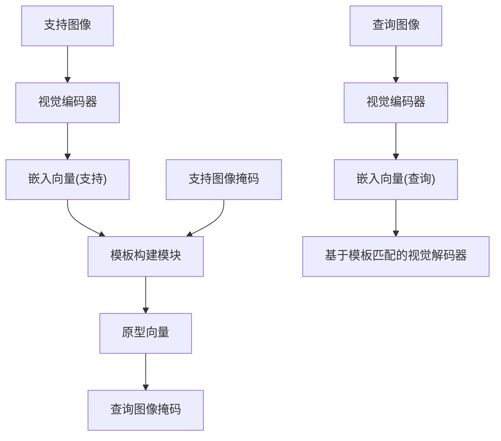
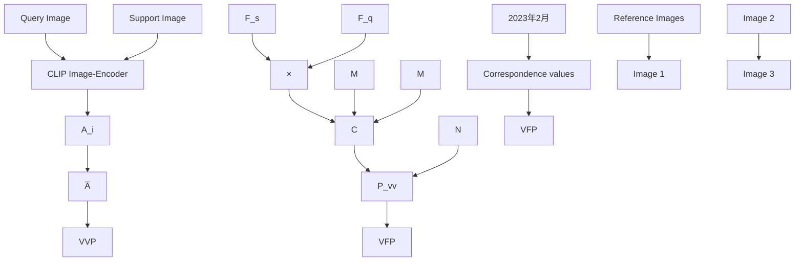
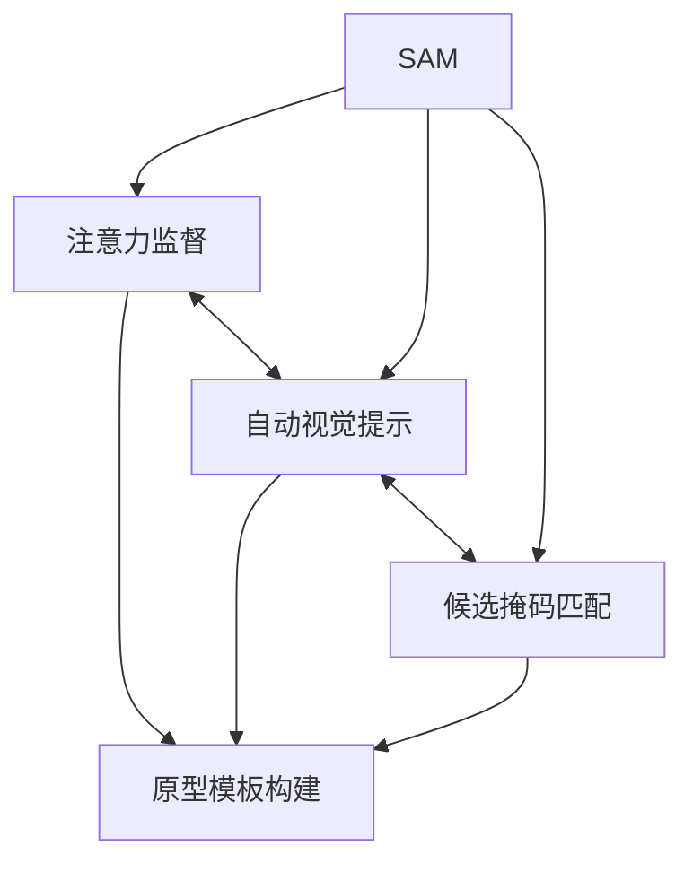
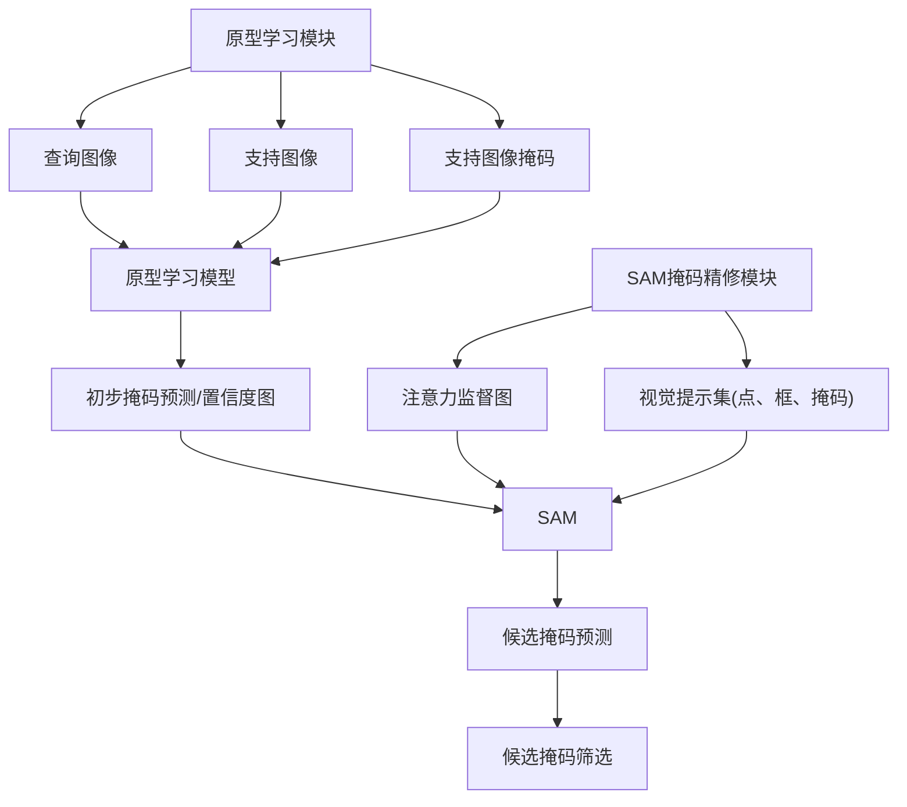
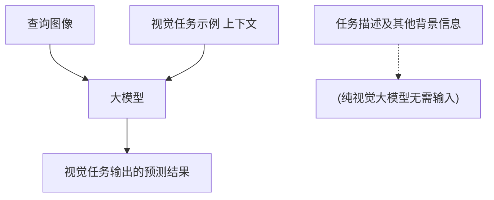
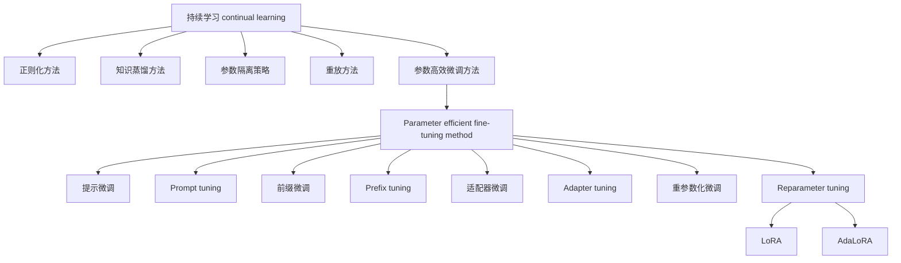

# 少样本学习-技术调研报告

• 当前调研主要涉及到的少样本学习范式包括微调、原型学习、上下⽂学习；  
. 通过元学习训练框架，采样多种少样本学习任务/⽰例学习任务（例如肾脏分割，颅脑分割等），对少样本学习范式进⾏训练；

◦ 例如，查询图像 + 分割⽰例作为输⼊，预测查询图像对应的mask，并与GT计算loss

◦ 对于微调范式，采样得到的少样本⽰例，需要通过微调内化到模型参数中。

其中，有基于CNN的基座模型，这类模型通常较为轻量化；也有基于transformer的基座模型，包括 CLIP，DINOv2，MAE，SAM，Vision language model (VLM)，Large vision model (LVM)，这⼀类模型的参数规模通常较⼤，遵循预训练加微调的训练策略。

基于当前已有调研，初步梳理少样本学习的技术效果：

• fewshot⼀般是多少shot? 增加shot，是否⼀定能达到全监督效果?

◦ 般是1\~16shot左右；根据UniverSeg的实验效果，16shot以上，分割效果提升不明显、进⼊平台期。

• 当前少样本学习到底是怎样的效果? 是否算是能达到及格线?

◦ dice值在80左右，不同任务上的效果波动较⼤，最低值在64，最⾼值可达到90；对定性结果进⾏评估，dice值70以上，分割效果还可以(主观评价)(参考原型学习的两个研究⽰例，及MVG)。

. 与全监督效果的⽐较?

◦ 参考MVG的对⽐结果，相较于全监督nnUNet，mIOU数值相差0.05\~0.15左右。

接下来，分别对不同的少样本学习范式和基座模型进⾏展开介绍：

# 技术框架1: 原型学习（Prototype learning）

flowchart

flowchart

• 基本技术框架：基于少量⽀持图像⽰例，在特征隐空间内，构建分割任务的特征模板(原型向量)，结合模板匹配机制，来预测查询图像的分割掩码。

0 可以采⽤不同基座模型：CNN架构、VIT架构  
◦ 通过元学习训练策略，采样多种少样本学习任务/⽰例学习任务（例如肾脏分割，颅脑分割等），对原型学习范式进⾏训练

常规训练：图像预测mask，并与GT计算loss

▪ 元学习训练：查询图像+分割⽰例作为输⼊，预测查询图像对应的mask，并与GT计算loss

• 通过元学习训练策略，采样多种少样本学习任务/⽰例学习任务（例如肾脏分割，颅脑分割等），对原型学习范式进⾏训练

• 不同⽅法之间的区别：

0 采⽤的基座模型不同  
◦ 构建特征模板、执⾏特征匹配的过程，存在差异化的设计。

• 技术评价

◦ 算法效果：

应⽤于⾃然图像：基于VIT的原型学习模型，在pascal-5i数据集上的mIOU能达到80左右（5shot），在Coco-20i数据集上能达到60左右（5 shot），属于相对SOTA⽔平。

应⽤于医学图像：在医学图像领域，dice值可达到80(<5 shot)。

• 在CT/MR模态下，⼤部分⼤器官分割的dice值能达到80左右（1 shot）；  
. 相对复杂的分割场景下，如前列腺MRI，dice值能达到 66（1 shot）。  
• 相较于相同/相似域内（模型⻅过类似图像、但没⻅过类似任务），跨域-少样本学习的效果确实会下降⼀些，dice值⼤概下降2-3个点左右。  
• 注意：在调研过程中发现，医学图像领域的原型学习⼤部分是基于CNN实现的(即使是最新论⽂)；⽽对于VIT加原型学习，更多的收敛到SAM加原型学习上。

◦ 参数规模和运算性能：即使是基于VIT架构的原型学习模型，参数规模都不算太⼤，没有超过1B，运算性能可控。

◦ 技术可⾏性⾼：

▪ ⽬前，有很多研究⼯作提出了基于医学图像预训练的基座模型，具有良好的研究基础；  
▪ 整体来说，模型规模并不算特别⼤，训练/微调的难度不⾼。⽤多种业务场景下的标注数据进⾏持续预训练/微调，构建专⽤的原型学习模型，可⽀持通过少量标注⾃定义创建的原型模板，实现少样本视觉识别。

思考：为什么Coco-20i数据集上的mIOU分值⽐pascal-5i的分值显著低?

主要原因是Coco数据集的训练域与测试域之间的跨度⼤，任务难度、挑战性更⼤。

具体来说，Coco数据集分割⽬标的类别更多、差异较⼤，图像背景复杂、⻛格变化⼤，存在不同细粒度的分割⽬标，甚⾄分割边界模糊度更⾼。

对于医学图像少样本学习任务：

⼀般情况下，医学图像的复杂度相对降低，域跨度相对较⼩；特别是对于⼀部分细粒度不⾼（⽬标体积较⼤、边缘轮廓清晰）的医学图像分割，少样本学习能够达到优秀⽔平。

另外，“跨域少样本学习性能下降”这⼀点也说明：在训练少样本学习范式时，要尽量构建⼀个丰富多样的、规模较⼤的元学习数据集，甚⾄采集更多与测试域相似的域内数据，提⾼少样本范式的域适应能⼒。

同时，选取⼀个好的医学图像基座模型也很关键。

# 基于CLIP的原型学习(Prototype learning)

参考论⽂名称：Wang J, Zhang B, Pang J, et al. Rethinking Prior Information Generation with CLIP for Few-Shot Segmentation[C]//Proceedings of the IEEE/CVF Conference on Computer Vision and Pattern Recognition. 2024: 3941-3951.

本⽂的总结：

◦ ⽅法上的创新：同时引⼊视觉模板先验信息和⽂本模板先验信息，⽤视觉-⽂本对⻬能⼒替代视觉先验表⽰，以捕获更可靠的指导并增强模型的泛化能⼒。具体来说，我们设计了两种⽆需训练的先验信息⽣成策略，试图利⽤对⽐语⾔-图像预训练模型（CLIP）的语义对⻬能⼒来定位⽬标类别。  
◦ 获得的效果：在PASCAL-5和COCO-20公开数据集上的实验表明，本⽂的⽅法取得了显著的性能提升，并达到了最新的最先进性能。

• 核⼼步骤：计算原型向量 （Prototype Vector）；代表某个类别在图像隐空间内的模板特征，可⽤于在⾼维隐空间中进⾏模板匹配。

◦ 视觉原型向量

natural_image

Illustration of a padlock with ribbon accents, no text or symbols present

# 附件不支持下载

⾸先，基于预训练后的VIT模型，完成⽀持图像在视觉隐空间内的编码，即提取⽀持图像的patch embedding 向量；  
▪ 然后在类别a掩码的前景区域内，计算embedding向量的平均值向量；或者，直接将类别a掩码加权后的embedding map作为原型向量，能表⽰更精细的局部区域模板信息。

◦ ⽂本原型向量：将类别描述⽂本编码为embedding向量，直接作为原型向量。

# • 推理流程

a. 图像编码和⽂本编码：给定⼀张⽀持图像和⼀张查询图像及⽬标类别名称，我们⾸先将查询图像和⽀持图像输⼊CLIP图像编码器，⽣成对应的视觉⽀持特征和查询特征。同时，⽬标类别名称⽤于构建两种⽂本提⽰，即⽬标提⽰和⾮⽬标提⽰，这些提⽰被输⼊CLIP⽂本编码器以⽣成两个⽂本嵌⼊。  
b. 执⾏初步⽂本原型匹配：将这两个⽂本嵌⼊与查询视觉特征输⼊视觉-⽂本先验(VTP,Vision-Texualprior)模块，通过对每个像素执⾏分类过程⽣成初始VTP信息。

i. 逐像素/patch的余弦相似度匹配

c. 执⾏初步视觉原型匹配：同时，将⽀持视觉特征与查询视觉特征输⼊视觉-视觉先验(VVP,Vision-Vision prior) 模块，通过像素级关系计算⽣成 VVP 信息。

i. 两两像素/patch之间的余弦相似度匹配，并取最⼤值。

d. 对⽂本原型匹配结果进⾏细化：接着，从CLIP模型中提取注意⼒图，将其输⼊到我们设计的先验信息细化 (PIR, Prior Information Refinement) 模块中，以构建⾼阶注意⼒矩阵，⽤于细化上述初始 VTP 信息。  
e. 最后，将VVP和细化后的VTP结合到⼀起，形成查询图像的初步掩码激活图，输⼊到解码器中，以⽣成查询图像的最终掩码预测。

natural_image

Illustration of a padlock with ribbon-like design (no text or symbols)

# 附件不支持下载

# . 训练流程

◦ 冻结CLIP编码器，仅对少样本学习模型进⾏训练   
训练⽅法：⼀种元学习训练范式；简单来说，

▪ 模型通过多个元学习任务进⾏优化，并在测试阶段评估模型性能。给定⼀个数据集 $D ,$ ，将其划分为训练集 train和测试集 test，其中训练集的类别集合 train与测试集的类别集合test 互不重叠 $( C \mathrm { t r a i n } \cap C \mathrm { t e s t } { = } \emptyset )$ )。模型需要将 train中有限标注数据的知识迁移到test。训练集和测试集均由⽀持集 和查询集 组成。⽀持集包含 个样本 $S =$ $\{ S 1 , S 2 , \cdots , S K \}$ ，每个样本包括图像和对应的掩码对 $\{ \ I s , M s \} _ { \ast }$ 。查询集包含  个样本 $Q =$ $\{ Q 1 , Q 2 , \cdots , Q N \}$ ，每个样本也包3括图像和掩码对 $\{ / q , M q \} _ { \mathrm { c } }$ 。在训练过程中，少样本模型通过训练集 train进⾏优化，即利⽤⽀持集 的指导对查询图像 进⾏预测。在推理过程中，使⽤测试集 test评估性能，此时模型不再被优化。

# • 以下为算法效果展⽰：

natural_image

Illustration of a padlock with ribbon, no text or symbols present

# 附件不支持下载

natural_image

Illustration of a padlock with ribbon straps (no text or symbols)

natural_image

Illustration of a padlock with ribbon loops (no text or symbols)

# 附件不支持下载附件不支持下载

? 模型参数规模：

◦ 本⽂的基础模型架构是resnet；视觉编码器和⽂本编码器均采⽤CLIP(⽂本编码器和视觉编码器VIT的参数规模均⼩于0.5B)。  
◦ 因此，模型规模不⼤，资源占⽤和运算性能估计都还不错。

# 基于预训练VIT的原型学习(Prototype learning)

参考论⽂名称：Zhou Z, Xu H M, Shu Y, et al. Unlocking the Potential of Pre-trained Vision Transformers for Few-Shot Semantic Segmentation through Relationship Descriptors[C]//Proceedings of the IEEE/CVF Conference on Computer Vision and Pattern Recognition. 2024: 3817-3827.

• 本⽂的总结：

◦ 主要贡献/创新点：以预训练VIT作为基础，引⼊关系描述符(⼀种类似于原型向量构建及初步匹配的⽅法)，从⽽构建⼀种新的少样本语义分割架构。  
◦ 在PASCAL-5和COCO-20公开数据集上达到了最新的最先进性能。

模型结构：模型结构由三部分组成：

◦ VITencoder：将查询图像和⽀持图像同时编码到相同的⾼维隐空间中

◦ Relationship Descriptor Generator：原型向量与查询embedding之间的初步关系运算/模板匹配运算，⽣成关系描述符RDvector  
▪ 具体运算过程⼤概是每个embedding分别与prototype计算相似度，然后在相似度的加权下计算embedding平均值；  
◦ Transformerbaseddecoder：以多个交叉注意⼒层、前馈⽹络层构成解码器，通过查询embedding与RDvector之间的交叉注意⼒运算(类似于模板匹配)，解码预测查询图像的掩码

natural_image

Illustration of a padlock with ribbon-like bands, no text or symbols present

# 附件不支持下载

图1整体训练框架  

natural_image

Illustration of a padlock with a keyhole, rendered in blue and teal ribbon (no text or symbols)

# 附件不支持下载

图2 RD Generator模块

# ? 推理流程

⽀持图像、查询图像变换到隐空间编码域  
◦ 基于⽀持图像及其掩码，计算各个类别的原型向量  
◦ 查询图像embedding分别与每个类别的prototype计算 RD vector；

◦ 以（关系描述符+原型）的线性映射embedding作为q向量，查询图像embedding作为k向量和v向量，进⾏交叉注意⼒运算；通过多层交叉注意⼒运算、前馈运算，解码计算mask  
▪ 假设有n个类别，则q向量⼀共n个，最终⽣成n个通道的输出mask

natural_image

Illustration of a padlock with a keyhole, surrounded by blue and teal ribbon elements (no text or symbols)

# 附件不支持下载

图3完整推理流程

# 主要应⽤场景

◦ 预定义⼀些常⽤类别的prototype，可实现全景图像分割；  
◦ 假设准备⼀些新的⽀持图像及其掩码⽰例，可实现few-shot segmentation

natural_image

Illustration of a padlock with a keyhole, surrounded by blue and teal ribbon elements (no text or symbols)

# 附件不支持下载

图4 某类别的Prototype 原型向量 与 该类别局部区域embedding之间的相似度map

• 以下为算法效果展⽰

natural_image

Illustration of a padlock with blue and teal ribbon accents, no text or symbols present

# 附件不支持下载

natural_image

Illustration of a padlock with ribbon-like design (no text or symbols)

# 附件不支持下载

# • 模型参数规模：

◦ 基础模型：基于ViT-B/16架构，参数量约为8600万(86M)；  
◦ RD⽣成器和解码器的参数量并未披露，但是因为整体设计⽐较轻量化，应该不会新增太多参数量。  
因此，模型规模不⼤，资源占⽤和运算性能估计都还不错。

参考论⽂名称：Jeong J, Zou Y, Kim T, et al. Winclip: Zero-/few-shot anomaly classification and segmentation[C]//Proceedings of the IEEE/CVF Conference on Computer Vision and Pattern Recognition. 2023: 19606-19616.

• 异常检测的原理：

◦ ⽂本级检测：

▪ 查询图像通过图像编码器⽣成特征向量；  
▪ "正常"、"异常"的⽂字表述(通常以模板的形式，⽐如物体-具体异常状态描述，如⼀颗[有缺⼝的][钉⼦])通过⽂本编码器⽣成特征向量；计算图像特征与"正常"/“异常”⽂本的相似度，根据阈值进⾏异常判定；

◦ 图像级检测：

▪ 构建原型模板：参考图像(正常图像)通过图像编码器⽣成patch embedding；  
▪ 对于查询图像的每个patch embedding，匹配到最相似的参考图像patch embedding向量，并计算最⼤相似度  
▪ 设置相似度阈值，根据每个patch的最⼤相似度，逐patch进⾏异常判定；

◦ 两种异常判定值进⾏加权求和。

• 可以⽣成接近像素级(猜测可能更接近patch级)的异常判定值，求和/取最⼤值，能够获取整体的异常判定值

natural_image

Illustration of a padlock with a keyhole, surrounded by blue and teal ribbon elements (no text or symbols)

# 附件不支持下载

natural_image

Illustration of a padlock with ribbon accents, no text or symbols present

# 附件不支持下载

natural_image

Illustration of a padlock with ribbon-like design (no text or symbols)

# 附件不支持下载

natural_image

Illustration of a padlock with ribbon-like design (no text or symbols)

# 附件不支持下载

• 潜在缺点和问题，及相关解决措施：

Yong Yang, Qiong Chen, Yuan Feng, and Tianlin Huang. Mianet: Aggregating unbiased instance and general information for few-shot semantic segmentation. In Proceedings of the IEEE/CVF Conference on Computer Vision and Pattern Recognition, pages 7131‒7140, 2023. 1, 2, 7

# 医学图像领域的原型学习研究举例1：多尺度原型构建和对⻬

参考论⽂名称：Wang S, Ding H, Zhao Y, et al. Aligned Patch Calibration Attention Network for Few-Shot Medical Image Segmentation[C]//2024 IEEE International Conference on Bioinformatics and Biomedicine (BIBM). IEEE, 2024: 3772-3777.

natural_image

Illustration of a padlock with blue ribbon accents, no text or symbols present

# 附件不支持下载

. 技术原理概述：

◦ 多尺度原型向量构建：在中阶特征层和⾼阶特征层分别构建原型模板，并融合；  
◦ 原型向量对⻬：基于查询图像的编码向量，对原型模板向量进⾏筛选、对⻬；

• 算法效果：

natural_image

Illustration of a padlock with ribbon-like design (no text or symbols)

# 附件不支持下载

natural_image

Illustration of a padlock with abstract ribbon-like design (no text or symbols)

# 附件不支持下载

在不同模态、不同部位的数据集上验证结果表明，dice值可达到80左右（1shot）

上述参与对⽐的⽅法，都是few-shot segmentation的⽅法

模型参数规模：ResNet-101作为基座，参数量约44.5M。

# 医学图像领域的原型学习研究举例2：构建多分⽀代表性描述

参考论⽂名称：Cheng Z, Wang S, Xin T, et al. Few-shot medical image segmentation via generating multiple representative descriptors[J]. IEEE Transactions on Medical Imaging, 2024.

• 训练数据量：100左右3Dvolumes(即使是将三个⽅位的图像分别作为训练集，且每个⽅位图像拆分为⾄少10个⽚层，2D图像数量⼤概3000，⽽且图像间的相似性较⾼)

• 元学习训练策略  
• 技术原理：

◦ 将模型拆分为两个分⽀，分别预测前景区域mask，背景区域mask  
◦ 构建前景原型模板和背景原型模板  
◦ 基于MLP，对原型模板进⾏特征映射，构建代表性描述向量Representative Descriptors

natural_image

Illustration of a padlock with ribbon-like bands, no text or symbols present

# 附件不支持下载

算法效果展⽰

natural_image

Illustration of a padlock with ribbon straps (no text or symbols)

natural_image

Illustration of a padlock with ribbon-like design (no text or symbols)

附件不支持下载 附件不支持下载

natural_image

Illustration of a padlock with blue ribbon accents (no text or symbols)

附件不支持下载

natural_image

Illustration of a padlock with ribbon-like design (no text or symbols)

# 附件不支持下载

natural_image

Illustration of a padlock with blue and teal ribbon accents (no text or symbols)

# 附件不支持下载

◦ Setting1：相似域内的测试；训练集与测试集的图像来源于同⼀个域，但是测试集的分割任务并不包含在训练集中；换⾔之，在训练阶段，模型实际上⻅过测试集中的分割⽬标，但这些分割⽬标并没有被标注和训练。⽐如说，训练集是T1腹部图像的肾脏分割、肝脏分割，⽽测试集是T1腹部图像的胰腺分割。  
◦ Setting2：跨域测试；训练集与测试集的图像来源于不同域。换⾔之，测试集中的分割⽬标不会出现在训练集的图像前景/背景区域。  
◦ 在Setting1条件下，⼤部分的⼤部位、CT/MR模态测试集上，dice值可达到80左右（1shot）；在Setting 2条件下，dice值会降低2-3个点左右  
◦ 前列腺器官结构可能相对复杂，分割结果会弱⼀些，dice值64左右（1shot）。  
◦ 上述参与对⽐的⽅法，都是few-shot segmentation的⽅法

. 模型参数规模：ResNet作为模型基座，参数量约11M

# 技术框架2：基于SAM的少样本学习

选⽤SAM来开发少样本学习范式的潜在原因和优势：SAM是⼀个⽐较好的基座模型

◦ SAM投⼊了⼤量预训练及全监督训练，具备良好的通⽤分割能⼒；  
◦ 模型结构易于改造，将SAM的⼿动提⽰编码器转换为⾃提⽰编码器，就可应⽤于不同的少样本学习范式。

# 1. 基于SAM实现少样本微调

# ◦ 技术框架介绍

▪ 将SAM的原始提⽰编码器修改为⾃提⽰编码器，不再⼿动输⼊视觉提⽰，⽽是让模型在少样本⽰例微调的过程中，隐式地学习视觉提⽰信息；  
▪ 由于⽀持图像⽰例⾮常有限，全量参数微调不可⾏，要尽可能减少微调参数量；⽐如使⽤Lora、adapter等微调技术，或只对输出头的极少量参数进⾏有限次数的迭代优化/微调；  
使⽤元学习策略，对少样本微调范式进⾏训练。

# 2. 基于SAM实现原型学习

# ◦ 技术框架：

▪ 通过分割⽰例构建原型模板，⾃适应⽣成SAM的视觉提⽰和注意⼒监督等。  
▪ 也基于元学习策略，对原型学习范式进⾏训练。

flowchart

基础框架

flowchart

具体实现过程举例

# . 技术评价

# ◦ 算法效果：

▪ 应⽤于医学图像：

? 基于5-10shot的分割数据，能达到接近80、甚⾄更⾼。尤其是⼀项在显微镜图像上的研究，Dice值可接近90(领先少样本训练的nnUNet，Dice 82)。（参考APL-SAM的实验结果）  
• 即使不经过域内数据训练，直接使⽤原始SAM2搭建少样本范式，dice值也能达到70-85（参考Rev-SAM2）

▪ 应⽤于⾃然图像：能够达到SOTA⽔平，与上述原型学习的结果类似(甚⾄在某些数据集上更加领先)。即使不经过域内数据训练、直接使⽤原始SAM搭建少样本范式，在某些数据集上也能达到80（mIOU）。（参考PerSAM）

这在⼀定程度上证明，SAM的基础分割能⼒，确实能对与SAM训练集接近的域内的少样本学习起到正向的作⽤。

◦ 模型参数规模和运算性能：与原始SAM规模、性能差异不⼤。  
◦ 技术可⾏性评估：

通过对SAM地改造，可以⾮常容易地适应各种少样本学习范式；  
▪ SAM在医学图像领域具有良好的研究基础，可选⽤⼀些医学图像微调后的SAM(MedSAM,MedSAM2d)作为起点。  
▪ SAM微调的技术难度可控。

参考论⽂名称：Leng T, Zhang Y, Han K, et al. Self-sampling meta SAM: enhancing few-shot medical image segmentation with meta-learning[C]//Proceedings of the IEEE/CVF Winter Conference on Applications of Computer Vision. 2024: 7925-7935.

• 总结：本⽂对SAM主⼲结构进⾏调整；采⽤少样本微调作为少样本学习范式，通过元学习框架对这种少样本学习的范式进⾏训练。  
• 模型结构调整：增加adapter(⽤于模型微调)；将显式的提⽰编码器转换为⾃采样提⽰编码器，不再需要⼿动输⼊提⽰。  
• 元学习：learn to learn；离线元学习流程分为两层循环（如Algorithm 2所⽰）。

◦ 外层循环（元更新）：采样拿到多个少样本学习任务，⽤于对少样本学习范式进⾏迭代训练；从器官分布 ( )中采样 个任务（器官），每个任务对应⼀个⽀持集 。通过在线优化器（Algorithm 1）对每个任务进⾏ 步梯度下降，更新适配参数′ ′。最终通过元损失的反向传播调整全局参数 ：

  
附件不支持下载

◦ 内层循环（任务适应）：在每个任务内部，使⽤⽀持集数据通过梯度下降调整参数，学习率 通过余弦退⽕动态调整，避免过拟合。

natural_image

Illustration of a padlock with blue and teal ribbon accents, no text or symbols present

# 附件不支持下载

natural_image

Illustration of a padlock with ribbon-like design (no text or symbols)

natural_image

Illustration of a padlock with blue ribbon accents, no text or symbols present

# 附件不支持下载 附件不支持下载

• 算法效果展⽰

natural_image

Illustration of a padlock with blue and teal ribbon accents (no text or symbols)

natural_image

Illustration of a padlock with blue and teal ribbon accents (no text or symbols)

# 附件不支持下载 附件不支持下载

natural_image

Illustration of a padlock with ribbon-like design (no text or symbols)

# 附件不支持下载

natural_image

Illustration of a padlock with blue and teal ribbon accents, no text or symbols present.

# 附件不支持下载

• 模型参数规模：SAM-VIT-B

natural_image

Illustration of a padlock with ribbon-like design (no text or symbols)

# 附件不支持下载

nnSAM: nnUNet微调训练框架 + SAM

参考论⽂名称：Li Y, Jing B, Feng X, et al. nnsam: Plug-and-play segment anything model improves nnunet performance[J]. arXiv preprint arXiv:2309.16967, 2023.

⽬的：通过结合SAM编码器部件，提⾼nnUNet在少样本训练情况下的性能。

◦ SAM存在的问题：尽管SAM具备零样本分割能⼒，但其推理过程依赖于⼈机交互，使其仅为半⾃动化。

◦ nnUNet存在的问题：通常从零开始，需要⼤量领域特定训练数据才能获得良好的分割性能。  
◦ 鉴于它们各⾃的优缺点，我们试图实施⼀种折中解决⽅案，以便在有限数量领域特定训练样本下实现精确、完全⾃动化的医学图像分割。

nnSAM结合了SAM强⼤的特征提取能⼒与nnUNet的数据中⼼⾃动配置能⼒，通过利⽤SAM通⽤图像编码器并将其⽆缝集成到nnUNet架构中，nnSAM⽣成了强⼤的潜在空间表⽰，为提⾼分割精度奠定基础。此外，在稀缺训练数据情况下，让模型学习更多先验知识有助于提⾼分割性能。为此，还设计了⼀种基于⽔平集函数和曲率计算的曲率损失，使模型能够从有限标注数据中学习解剖形状先验。

• 模型架构

◦ 所提出的nnSAM框架的架构如图1所⽰，该模型旨在结合nnUNet和SAM的优势。  
◦ 具体⽽⾔，nnSAM由两个并⾏编码器组成：nnUNet编码器和SAM编码器。SAM编码器是⼀个在⼴泛的SA-1B分割数据集上预训练的视觉变换器（ViT）。来⾃两个编码器的嵌⼊被连接在⼀起，然后输⼊到nnUNet的解码器中。  
◦ 解码器有两个输出层，⼀个是分割头，另⼀个是基于⽔平集的回归头。基于⽔平集的回归头是通过学习解剖形状的先验信息来提⾼分割的精度。该⽅法结合了⽔平集理论，主要⽤于捕捉⽬标物体的边界形状。  
◦ 分割头使⽤交叉熵损失和DICE损失进⾏训练，⽽回归头则使⽤均⽅误差（MSE）损失和提出的曲率损失进⾏训练。SAM编码器作为即插即⽤插件，在训练过程中其参数保持冻结。因此，在训练过程中仅更新nnUNet编码器和解码器的权重。

natural_image

Illustration of a padlock with ribbon-like design (no text or symbols)

# 附件不支持下载

natural_image

Illustration of a padlock with blue and teal bands, no text or symbols present

# 附件不支持下载

⽔平集函数；(a,b)代表位置坐标，d(a,b)表⽰从点(a,b)到最近

物体边界的最⼩距离

# • 以下为算法效果展⽰

natural_image

Illustration of a padlock with blue ribbon accents (no text or symbols)

附件不支持下载

natural_image

Illustration of a padlock with ribbon-like bands (no text or symbols)

# 附件不支持下载

natural_image

Illustration of a padlock with ribbon loops (no text or symbols)

附件不支持下载

natural_image

Illustration of a padlock with ribbon straps (no text or symbols)

附件不支持下载

natural_image

Illustration of a padlock with ribbon straps (no text or symbols)

附件不支持下载

natural_image

Illustration of a padlock with blue and teal ribbon accents (no text or symbols)

附件不支持下载

natural_image

Illustration of a padlock with blue and teal ribbon accents (no text or symbols)

附件不支持下载

natural_image

Illustration of a padlock with blue and teal ribbon accents (no text or symbols)

附件不支持下载

⽐nnUNet效果有⼀定提升。

# • 模型参数规模

模型基础架构：nnUNet和MobileSAM Encoder；

◦ MobileSAM的参数量是SAM的1/60；  
◦ nnUNet(2D)本⾝参数量⼤约40M左右；

# SAM作为单独的后处理模块

参考⽂献名称：Feng C B, Lai Q, Liu K, et al. Boosting Few-Shot Semantic Segmentation Via Segment Anything Model[J]. arXiv preprint arXiv:2401.09826, 2024.

natural_image

Illustration of a padlock with ribbon accents, no text or symbols present

# 附件不支持下载

图1完整推理流程

• SAM作为后处理模块，放置在few-shot segmentation (FSS) 模块后⾯，对掩码进⾏精修；当FSS模块输出⼀个存在些许误差的掩码后，可以⾃动创建视觉提⽰、并调⽤SAM，⽣成更加精细的掩码  
• 以下是算法效果展⽰

natural_image

Illustration of a padlock with ribbon-like bands, symbolizing security or security (no text or symbols)

附件不支持下载  

natural_image

Illustration of a padlock with ribbon-like design (no text or symbols)

附件不支持下载  

natural_image

Illustration of a padlock with ribbon-like bands (no text or symbols)

附件不支持下载附件不支持下载  

natural_image

Illustration of a padlock with blue and teal ribbon accents (no text or symbols)

# PerSAM：⾃动视觉提⽰，视觉注意⼒监督

参考论⽂名称：Zhang R, Jiang Z, Guo Z, et al. Personalize segment anything model with one shot. arXiv 2023[J]. arXiv preprint arXiv:2305.03048. (引⽤量194)

natural_image

Illustration of a padlock with ribbon-like bands (no text or symbols)

# 附件不支持下载

⽬标：可以根据⽤⼾提供的单个分割⽰例，实现one-shot segmentation。

# 模型结构及推理流程

natural_image

Illustration of a padlock with abstract ribbon-like elements (no text or symbols)

# 附件不支持下载

图模型结构及推理流程⽰意图

• 输⼊⽀持图像及其掩模、查询图像，⽣成查询图像的位置置信度图；（prototype learning）

• 提⽰点⽣成(位置先验信息)：基于置信度图，选取置信度最⾼的点作为正样本提⽰点，置信度最低的作为负样本提⽰点；  
• 置信度图的编码向量作为⾼级语义提⽰；（类似于mask prompt）  
• 基于置信度图，在解码器运⾏前，对查询图像特征向量进⾏注意⼒引导（即取softmax后，对输⼊查询向量进⾏逐像素相乘）

# 模型微调

natural_image

Illustration of a padlock with ribbon-like bands, symbolizing secure security (no text or symbols)

# 附件不支持下载

对SAM不同Scale的输出权重进⾏微调训练，减轻scale混乱度；  
• 潜在应⽤场景：基于PerSAM分割提取图像背景区域、并去除，有助于提升StableDiffusionDearmBooth微调的效果。

◦ DearmBooth微调：根据⽂本图像对的样本(特殊字符+类别⽂本+图像)，对SD进⾏⾃定义微调，创建特殊字符与样本图像⻛格之间的关系，从⽽定制化⽣成某种⻛格的图像。

# 算法效果展⽰

natural_image

Illustration of a padlock with ribbon-like design (no text or symbols)

# 附件不支持下载

• 三个表格结果的区别：第⼀个表展⽰了⽬标级别的分割(⽐如整个⻋、整个⼈等等)；第⼆个表是对视频⽬标的分割(以某⼀帧图像作为⽀持图像，对其他帧图像进⾏分割)；第三个表展⽰了细粒度更⾼的部件级分割效果。  
• 注意：本⽂的PerSAM直接集成原始SAM模型，没有使⽤领域内的数据进⾏训练/微调；⽽之前的⼀些⽅法(如原型学习)，都⽤领域内数据训练过。

. 总体结果：

始终优于Painter，并与SegGPT表现相当；  
◦ 对于采⽤领域内数据训练的模型（如HSNet），PerSAM-F仍表现相当、甚⾄能在某些数据集上取得相对更⾼的分数。这验证了该⽅法能够超越依赖特定领域数据训练的模型。

如PASCAL-Part；注意区分PASCAL-part和PASCAL-5i

◦ 扩展性验证：这些实验充分证明，我们的⽅法不仅适⽤于⽬标级别的分割，还可扩展到SAM的类别级和部件级个性化任务。例如，在部件分割任务中（如PASCAL-Part和PACO-Part）PerSAM-F展⽰了细粒度分割能⼒，成功区分物体的⼦部件（如椅⼦的靠背与扶⼿）

# 模型参数规模

PerSAM的基础架构是SAM，所修改的模块都⽐较轻量化，因此，参数规模与SAM基本⼀致。

# APL-SAM：⾃适应提⽰学习

参考论⽂名称：Shen Y, Wei Z, Liu C, et al. Adaptive Prompt Learning with SAM for Few-shot Scanning Probe Microscope Image Segmentation[J]. arXiv preprint arXiv:2410.12562, 2024.

• 本⽂所提出的少样本学习范式与原型学习架构类似，如图4所⽰：从分割⽰例中⾃适应学习视觉提⽰信息

⾸先，从⽀持图像、⽀持图像掩码中提取原型向量(⽂中的prompt)；  
◦ 将原型向量、查询图像嵌⼊共同输⼊到交叉注意⼒模块；  
◦ 这些查询图像嵌⼊与视觉提⽰/原型向量相互连接，并通过⾃注意⼒处理以吸收⽀持知识，然后通过交叉注意⼒将其转移到查询嵌⼊中，从⽽输出查询图像提⽰(Query Image Prompt)。

. 基于元学习框架，对少样本学习范式进⾏训练。

natural_image

Illustration of a padlock with abstract blue and teal ribbon elements (no text or symbols)

# 附件不支持下载

natural_image

Illustration of a padlock with keyhole, surrounded by blue and teal ribbon elements (no text or symbols)

# 附件不支持下载

natural_image

Illustration of a padlock with ribbon-like bands (no text or symbols)

# 附件不支持下载

• 以下为算法效果展⽰

natural_image

Illustration of a padlock with ribbon-like bands (no text or symbols)

# 附件不支持下载

natural_image

Illustration of a padlock with ribbon-like bands (no text or symbols)

# 附件不支持下载

根据本⽂算法结果，分割效果甚⾄强于nnUNet（5-10shot）

• 模型参数规模：采⽤SAM-VIT-B的基础架构，参数规模应该与原始SAM-VIT-B差不多。

# SAM-IF：均匀提⽰点采样，基于原型向量筛选候选掩码

参考论⽂名称：Zhou X, He W. SAM-IF: Leveraging SAM for Incremental Few-Shot Instance Segmentation[J]. arXiv preprint arXiv:2412.11034, 2024.

• 基于少量分割⽰例，构建余弦相似度分类器(原型模板)  
• 当输⼊⼀例新的查询图像时，⾸先，基于均匀采样的点提⽰，⽣成多个候选掩码；然后，⽤候选掩码与原型模板进⾏匹配，筛选出最终掩码。

natural_image

Illustration of a padlock with abstract ribbon-like elements (no text or symbols)

# 附件不支持下载

natural_image

Illustration of a padlock with ribbon-like bands, no text or symbols present

# 附件不支持下载

# RevSAM2：基于SAM2实现“类上下⽂学习”

参考论⽂名称：Bai Y, Yu Q, Yun B, et al. RevSAM2: Prompt SAM2 for Medical Image Segmentation via Reverse-Propagation without Fine-tuning. arXiv preprint arXiv:2409.04298, 2024.

# 技术关键原理

◦ 将2D⽀持分割⽰例作为提⽰信息（编码进记忆库MemoryBank），使⽤SAM2对3D查询图像集进⾏逐层分割；  
▪ 对于SAM2的记忆库，本⾝是⽤于视频分割场景，编码、记忆其他视频帧的图像分割⽰例。  
◦ 通过反向传播机制，对每⼀⽚层查询图像的分割结果进⾏评价：每⽚层查询图像的分割结果作为分割⽰例，反过来对⽀持集进⾏分割，然后计算与GT之间的Dice值。dice值最⾼的k个⽚层作为有效分割；  
◦ ⽤查询图像的有效分割作为提⽰信息，完成其余⽚层的分割。

natural_image

Illustration of a padlock with ribbon-like bands, symbolizing security or security (no text or symbols)

# 附件不支持下载

• 算法效果展⽰

natural_image

Illustration of a padlock with ribbon-like bands, no text or symbols present

# 附件不支持下载

natural_image

Illustration of a padlock with ribbon accents (no text or symbols)

# 附件不支持下载

natural_image

Illustration of a padlock with ribbon-like bands, no text or symbols present

natural_image

Illustration of a padlock with blue ribbon accents (no text or symbols)

# 附件不支持下载 附件不支持下载

域内测试dice值70-85；

跨域测试dice值下降了2-5个点。

# 技术框架3：上下⽂学习

flowchart

# 基本技术框架

◦ 将视觉任务⽰例(如分割⽰例)直接作为上下⽂信息，与查询图像⼀起，输⼊到模型中进⾏综合理解、推理，预测查询图像的“视觉回答”；⽆需构建显式的原型模板。  
◦ 以某⼀个在⼤量医学领域的图像⽂本对/视觉问答对上继续预训练、微调过的多模态⼤模型，作为基座，构建少样本学习任务，对⼤模型进⾏指令微调。

<table><tr><td>不同基座模型</td><td>多模态大模型(MLM)</td><td>视觉语言模型(VLM)</td><td>纯视觉大模型(LVM)</td></tr><tr><td>输入</td><td></td><td></td><td>视觉输入(图像,掩模)</td></tr><tr><td></td><td>文本+图像;视觉任务示例以图像的形式进行编码</td><td>文本(包含结构化文本)+图像;视觉任务示例以结构化文本的形式进行编码</td><td></td></tr><tr><td>输出</td><td>文本+图像;视觉任务输出以图像的形式进行解码</td><td>文字;视觉任务输出以结构化文本的形式进行输出</td><td>视觉输出</td></tr></table>

# • 基座模型

◦ 视觉语⾔模型 (Vision-Language Model, VLM)：可以⽀持多模态输⼊、理解，但⽣成的内容还是⽂字信息；

▪ 针对少样本学习，它是⼀个视觉任务；假设使⽤VLM，需要将⽂本回答转换为“视觉”回答；

◦ 纯视觉⼤模型 (Large Vision Model, LVM)：仅⽀持视觉理解、视觉内容⽣成

▪ 假设使⽤LVM，则⽆法注⼊语义信息；

◦ 多模态⼤模型 (Multimodal Large Model, MLM)：从理论上来说，属于“终极形态”，可⽀持多模态内容理解、多模态内容⽣成。

▪ 从模型基本架构上来说，与VLM的主要区别是增加了⼀个视觉解码器（需要微调训练），⽤于⽣成视觉回答。

◦ 也有⼀些研究，基于CNN实现较为轻量化的上下⽂学习。

# . 技术评价

◦ 模型参数规模和运算性能：

纯视觉⼤模型LVM：参数量基本不超过7B，SegGPT甚⾄仅307M；

▪ 对于多模态⼤模型、视觉语⾔模型，有很多种不同规模的基座模型，7B的有，超过70B的也有。

◦ 算法效果：总体来说，在医学图像领域，上下⽂学习的dice值也可达到80(<5shot)，甚⾄在某些数据集上能够达到85。

◦ 基于⼤模型的上下⽂学习，也是⼀个值得跟进和尝试的⽅向

算法效果表现确实亮眼；

可能有⼀些医学图像领域的⼤模型，作为良好的研究基础；

▪ 可能⼤模型微调的难度相对⾼⼀些，但是，这个技术⽅向与我们的⽬标（构建⼀个通⽤少样本范式）更加契合；

• 根据LLM⼤模型领域的先⾏经验，模型规模更⼤，虽然在某些具体任务上的效果表现可能⽐不上专家模型，但通⽤性肯定更强；

<table><tr><td></td><td>原型学习</td><td>上下文学习</td></tr><tr><td>基座模型</td><td>对于VIT-原型学习,有较多医学图像领域的VIT基座模型可供参考。</td><td>有较多的VIT、LLM的基座模型可供参考</td></tr><tr><td>参数规模</td><td>CNN架构的模型高度轻量化,如ResNet参数共计11M;VIT架构的模型参数规模相对大一些,如SAM 100M~0.7B。</td><td>纯视觉大模型LVM:在大模型中,规模相对较小(&lt;7B),SegGPT、MVG共计307M多模态大模型MLM:7B左右视觉语言模型VLM:基于LLM微调得到,7B~70B及以上</td></tr><tr><td>算法性能</td><td>资源占用小:模型规模相对较小,显存占用少,速度更快</td><td>资源占用较大:模型规模相对较大,显存占用与参数量相关,速度相对慢</td></tr><tr><td>算法指标</td><td colspan="2">从调研结果上看,这两种少样本技术方向都能获得具备竞争力的结果</td></tr><tr><td>优势</td><td>模型轻量化,计算资源占用较小;训练数据量小、更容易训练</td><td>模型能力强,域适应性强,通用性强;根据LLM大模型领域的先行经验,模型规模更大,虽然在某些具体任务上的效果表现可能比不上专家模型,但通用性肯定更强;</td></tr><tr><td>缺陷</td><td>CNN-原型学习的域适应性可能较差</td><td>计算资源占用较大,部署受限,预训练、微调数据量需求较大</td></tr></table>

# 基于CNN的上下⽂学习

# UniverSeg

参考论⽂名称：Butoi V I, Ortiz J J G, Ma T, et al. Universeg: Universal medical image segmentation[C]//Proceedings of the IEEE/CVF International Conference on Computer Vision. 2023: 21438-21451.

natural_image

Illustration of a padlock with ribbon-like design (no text or symbols)

附件不支持下载

natural_image

Illustration of a padlock with ribbon-like bands, no text or symbols present

附件不支持下载  
. 算法效果展⽰

natural_image

Illustration of a padlock with blue and teal ribbon accents (no text or symbols)

附件不支持下载

natural_image

Illustration of a padlock with ribbon loops, no text or symbols present

natural_image

Illustration of a padlock with blue ribbon accents (no text or symbols)

# 附件不支持下载 附件不支持下载

在当前模型试验中，当⽀持集超过16之后，对dice的提升效果显著降低。

# Tyche

参考论⽂名称：Rakic M, Wong H E, Ortiz J J G, et al. Tyche: Stochastic In-Context Learning for Medical Image Segmentation[C]//Proceedings of the IEEE/CVF Conference on Computer Vision and Pattern Recognition. 2024: 11159-11173. (本⼯作来⾃于 Broad Institute of MIT and Harvard)

⽬标：少样本图像分割，并度量模型不确定性

natural_image

Illustration of a padlock with blue and teal ribbon accents (no text or symbols)

附件不支持下载

natural_image

Illustration of a padlock with ribbon-like design (no text or symbols)

附件不支持下载

natural_image

Illustration of a padlock with ribbon-like design (no text or symbols)

natural_image

Illustration of a padlock with ribbon-like bands, symbolizing security or security (no text or symbols)

# 附件不支持下载 附件不支持下载

# 数据集构建

获取了接近20k扫描数据(具体如下表所⽰)；实际参与训练的数据量应该更多，因为在本⽂中，3D数据⾄少拆分2个⽚层(中⼼⽚层、任务核⼼⽚层)，3D数据的3个⽅位图像作为不同任务，同⼀图像上不同结构的分割作为不同的任务。

natural_image

Illustration of a padlock with blue and teal ribbon accents (no text or symbols)

附件不支持下载

# 训练流程:元学习训练

. 数据准备：准备⼀系列图像及其对应的掩码。  
查询图像选择：在训练过程中，从数据集中挑选出查询图像、其对应的⾦标准掩码，以及与查询图像相似度⾼的⽀持图像及其掩码。  
• 输⼊：将查询图像、多幅采样噪声图、⽀持图像及其掩码作为输⼊。  
输出：模型⽣成与查询图像对应的多个掩码，基于多幅噪声图。  
损失计算：从⽣成的掩码中挑选出与⾦标准Dice系数最⾼的掩码，进⾏损失计算。  
梯度回传与参数更新：通过反向传播算法更新模型参数，以优化分割性能。

# 推理流程

输⼊：在推理阶段，输⼊包括查询图像、多个随机噪声图、⽀持图像及其掩码。  
• 输出：模型⽣成多个不同的预测掩码。  
功能：⼀⽅⾯，能够实现对查询图像的分割；另⼀⽅⾯，能够度量模型的不确定性，通过对⽐多个输出结果来评估预测的稳定性和可靠性。

natural_image

Illustration of a padlock with ribbon-like design (no text or symbols)

附件不支持下载

natural_image

Illustration of a padlock with ribbon-like design (no text or symbols)

附件不支持下载

natural_image

Illustration of a padlock with blue and teal ribbon accents (no text or symbols)

# 附件不支持下载

基于O.D数据集，全监督训练的模型作为上限基准，其他少样本学习模型、交互式分割模型作为基准，对⽐分析模型效果：与全监督的分割效果接近(16shot，8predictions中取最⼤dice)。

# 模型参数规模

模型结构是⼀个改进的2DUNet结构，⾮常轻量化。

natural_image

Illustration of a padlock with ribbon-like design (no text or symbols)

# 附件不支持下载

# 基于视觉语⾔模型的上下⽂学习

参考论⽂名称：Zhu, Lanyun, et al. "LLaFS: When Large Language Models Meet Few-Shot Segmentation." . 2024.

natural_image

Illustration of a padlock with ribbon-like design (no text or symbols)

# 附件不支持下载

图原⽂摘要；关于“使⽤VLM去跨模态地处理视觉少样本学习任务"的原因：在⼤规模语料库上预训练的LLMs积累了⼤量先验知识，可以有效补充⽀持图像中不⾜的信息，从⽽实现更有效的少样本学习引导。

• 潜在原因：如上图原⽂所⽰，在⼤规模语料库上预训练的LLMs积累了⼤量先验知识，可以有效补充⽀持图像⽰例中不⾜的信息，从⽽实现更有效的少样本学习引导。  
• 算法流程梳理

◦ 1）输⼊由三部分组成，分别是查询图像、⽀持图像及其掩模、分割任务描述；  
◦ 2）查询图像和⽀持图像都通过Q former +全连接层转换为视觉tokens（与⽂本token对⻬）   
◦ 3）属性-坐标表的构建：将⽬标级的分割掩码转换为⼦部件级的分割掩码，提⾼分割细粒度，同时，注⼊更多的语义信息。

▪ ⽀持图像掩模的转换较复杂，掩模类别经过llm⽣成它的属性（⽐如狗的属性包括狗⽿朵，狗⿐⼦等）；通过这样的⽅式，能够将类别-掩模多边形坐标细分为属性-多边形坐标，⽐如狗⿐⼦-勾画狗⿐⼦区域的多边形顶点坐标；  
▪ 具体过程如下：⽤oversegmentation将掩模前景内的图像分割成superpixel区域（过度细分的区域）；基于clip，将属性⽂本与对应的superpixel区域匹配起来；最终⽣成 属性⽂本-区域的多边形坐标；

◦ 4）查询图像+⽀持图像的token，属性坐标表（作为分割⽰例）+任务描述，以上作为输⼊，通过llm预测查询图像的多边形顶点坐标。再通过精细化⽹络，将多边形掩模平滑处理为最终的mask

• 训练流程：

◦ 对q former和全连接层进⾏预训练，将视觉embedding对⻬到⽂本空间中

▪ 基于⼤量的图像-⽂本对(图像描述)

◦ 渐进式微调⽅法，逐渐增加任务难度

▪ 伪样本合成策略：随机划分伪前景-背景；前景区域⽤具有随机均值的⾼斯噪声填充；背景区域⾸先随机划分为多个⼦区域以模拟真实图像中的复杂背景，然后每个⼦区域⽤均值不同于前景噪声的⾼斯噪声填充。

微调-阶段⼀：使⽤伪样本进⾏第⼀阶段的微调

• 逐渐增加图像难度：通过控制不同填充噪声均值之间的差异，逐步增加⽀持和查询之间前景差异，同时减少每张图像内前景与背景之间的差异(边界模糊)。随着预训练进展，这使得LLM在执⾏少样本指导和划分前景-背景区域时更加困难。

• 逐渐增加轮廓点预测的难度：在微调初期，通过指令随机提供部分顶点坐标（如15个），让LLM预测剩余顶点坐标；随着训练进展，逐步减少提供顶点坐标数量，直⾄完全由模型预测16个顶点。

▪ 微调-阶段⼆：使⽤实际的少样本分割数据集，对LLM、全连接层、refinementnetwork进⾏元学习微调。

训练集数据量：pascal 5i 共计10582； Coco 20i 共计82783

natural_image

Illustration of a padlock with ribbon-like bands, symbolizing security or security (no text or symbols)

# 附件不支持下载

图整体流程⽰意图

natural_image

Illustration of a padlock with blue and teal ribbon accents, no text or symbols present.

natural_image

Illustration of a padlock with blue and teal ribbon accents (no text or symbols)

# 附件不支持下载 附件不支持下载

图构建属性-位置表  

natural_image

Illustration of a padlock with keyhole, surrounded by blue and teal ribbon elements (no text or symbols)

# 附件不支持下载

natural_image

Illustration of a padlock with ribbon-like design (no text or symbols)

# 附件不支持下载

图分割效果图  

natural_image

Illustration of a padlock with ribbon-like bands, symbolizing secure security or security (no text or symbols)

# 附件不支持下载

natural_image

Illustration of a padlock with ribbon accents, no text or symbols present

# 附件不支持下载

分割(边界轮廓点检测)；效果：显著优于两个经典的视觉⼤模型SegGPT/Painter，其中，LLM的使⽤及基座选择⾮常重要，会带来显著的效果提升；

少样本分割效果基本达到相对SOTA的⽔平。

# • 模型参数规模

◦ 基座模型是CodeLlama，参数量为7B。相对于原始Llama，它在⽣成结构化信息(如分割结果)⽅⾯具有更⾼的准确率。

# 基于视觉语⾔模型+智能体构建的上下⽂学习

参考论⽂名称：Meng T, Tao Y, Yin W. Few-Shot Classification & Segmentation Using Large Language Models Agent[J]. arXiv preprint arXiv:2311.12065, 2023.

# . 主要亮点：

◦ 只是构建了⼀个分割智能体，没有进⾏任何微调；

▪ 基于⽀持图像+掩码，GPT4V对查询图像执⾏⼀个⽬标检测任务，⽣成⽬标检测框，⽤于作为SAM的视觉提⽰；

0 Agent⾃我反思，对掩码进⾏迭代优化。

# • 整体结构和Agent运⾏流程：

◦ Cognition：输⼊是⽀持图像及其掩码和框、查询图像；调⽤GPT4V，基于⽀持图像+掩码+框，⽣成前景物体的⽂本描述（包含识别物体具体类别）；  
◦ Questing：继续调⽤GPT4V，基于⽀持图像⽂本描述、查询图像，⽣成查询框；  
◦ Segmentation：调⽤SAM，基于查询框，⽣成查询图像的掩码；  
◦ Judgement(Self-Reflection)：调⽤GPT4V，对整体输出结果进⾏⾃我反思(Agent)，假设输出的查询图像掩码不合格，则反思改进建议，并循坏运⾏、迭代改进。

natural_image

Illustration of a padlock with ribbon-like design (no text or symbols)

附件不支持下载  

natural_image

Illustration of a padlock with ribbon-like design (no text or symbols)

附件不支持下载

natural_image

Illustration of a padlock with ribbon-like design (no text or symbols)

附件不支持下载  
附件不支持下载  
图 cognition的视觉提⽰  
图 questing的视觉提⽰

natural_image

Illustration of a padlock with ribbon-like design (no text or symbols)

# 附件不支持下载

图 Agent运⾏流程⽰例  
• 算法效果展⽰  

natural_image

Illustration of a padlock with ribbon-like bands, no text or symbols present

# 附件不支持下载

从mIoU的数值来看，显著优于HSNet(作为基准模型之⼀，经常参与少样本学习模型效果对⽐；pascal-5i上，mIOU也能到70)，少样本分割效果应该还⾏。

模型参数规模：本⽂的基座模型是GPT-4V和SAM-VIT-H，参数规模⼤。

# 基于视觉语⾔模型实现“推理分割”

参考论⽂名称：Lai X, Tian Z, Chen Y, et al. Lisa: Reasoning segmentation via large language model[C]//Proceedings of the IEEE/CVF Conference on Computer Vision and Pattern Recognition. 2024: 9579-9589.

• ReasoningSegmentation（推理分割）的含义：该任务要求根据涉及复杂推理的隐含查询⽂本⽣成⼆值分割掩码。值得注意的是，查询⽂本不仅限于简单的引⽤（例如“橙⼦”），还包括更复杂的描述，这些描述涉及复杂的推理或世界知识（例如“富含维⽣素C的⻝物”）。为了完成这⼀任务，模型需要具备两个关键能⼒：1）结合图像对复杂且隐含的⽂本查询进⾏推理；2）⽣成分割掩码。

natural_image

Illustration of a padlock with ribbon-like bands, symbolizing security or security (no text or symbols)

# 附件不支持下载

# • 模型结构：

◦ 从隐含查询⽂本中分析出分割⽬标：输⼊查询图像和查询问题，使⽤视觉语⾔模型对查询问题进⾏分析，⽣成分割⽬标及其⽂本描述；  
◦ 提⽰分割：使⽤分割⽬标<SEG>作为提⽰（类似于⽂本提⽰），执⾏图像分割。

natural_image

Illustration of a padlock with blue and teal ribbon accents (no text or symbols)

# 附件不支持下载

基于纯视觉⼤模型的上下⽂学习：使⽤MAE策略进⾏训练

# Painter

参考论⽂名称：Wang X, Wang W, Cao Y, et al. Images speak in images: A generalist painter for incontext visual learning[C]//Proceedings of the IEEE/CVF Conference on Computer Vision and • 视觉任务的统⼀处理：全部统⼀为彩⾊图像⽣成任务

◦ 将分割、点定位、深度估计等不同的视觉任务，统⼀转换为三通道RGB图像，⽐如以RGB三通道作为⼀个三位数（进制基数有待确定，⽐如⼗进制、16进制等），然后将分割类别分别映射为RGB三位数。

• 训练：类似于MAE，输⼊图像与视觉任务输出图像（如分割mask转换为RGB图像）转换为patch embedding，然后对输出图像进⾏掩码，再使⽤vit对其进⾏重建、计算loss。

推理：⽰例 + 查询图像 + 待预测掩码，vit重建掩码区域内容。

natural_image

Illustration of a padlock with keyhole, surrounded by blue and teal ribbon elements (no text or symbols)

# 附件不支持下载

图Painter上下⽂学习的⽰意图

natural_image

Illustration of a padlock with abstract ribbon-like design (no text or symbols)

# 附件不支持下载

图⼀种类MAE的预训练流程

natural_image

Illustration of a padlock with abstract ribbon-like elements (no text or symbols)

# 附件不支持下载

图算法效果⽰意图

# SegGPT

参考论⽂：Wang X, Zhang X, Cao Y, et al. Seggpt: Segmenting everything in context[J]. arXiv preprint arXiv:2304.03284, 2023.

• 相较于Painter，专注于分割任务

natural_image

Illustration of a padlock with ribbon-like design (no text or symbols)

# 附件不支持下载

• 算法效果

natural_image

Illustration of a padlock with ribbon, no text or symbols present

# 附件不支持下载

效果表现⾮常好，达到SOTA，甚⾄⽐原型学习的效果更好。

. 模型参数规模：VIT-L，307M

# 基于纯视觉⼤模型的上下⽂学习：使⽤类GPT的训练策略

参考论⽂名称：Bai Y, Geng X, Mangalam K, et al. Sequential modeling enables scalable learning for large vision models[C]//Proceedings of the IEEE/CVF Conference on Computer Vision and Pattern Recognition. 2024: 22861-22872.

• 数据集：⽆标签图像/视频数据集，有标签图像数据集/视频数据集(标签包括分割、检测、姿态估计等)  
利⽤预训练的VQGAN，⽣成视觉token序列：

◦ 第⼀步，对于单幅图像，拆分为patch，然后每个patch转换为⼀个token，然后转换为离散化token(⽐如去256\*256图像，分成16\*16个16\*16⼤⼩的patch，转换为16\*16\*个128⻓度的token向量，在token表中查询，所有token转换为token表中能查到的token，实现离散化)；  
◦ 第⼆步，16幅图形成⼀个4098个token的视觉序列，⽐如16幅⽆标签图/连续视频帧、16幅图＋标注的序列(如图＋分割＋图＋分割)等

• 训练⾃回归transformer模型：类似于GPT，前⾯所有token预测下⼀个token并与⾦标准计算交叉熵损失

◦ ⽐如第⼀个token预测第⼆个token，与第⼆个token⾦标准计算损失；前两个token预测第三个，再计算损失；⼀个序列所有损失求和、平均，再回传

. 应⽤场景：

◦ 连续帧图像，预测下⼀帧；  
◦ 分割/点定位/点追踪⽰例作为上下⽂prompt，预测下⼀幅图的分割/点定位/点追踪；  
◦ 图像补全(甚⾄图形书读起，找规律画图)；  
◦ 根据给定图像序列，进⾏图像⽣成(如表情创造等)

natural_image

Illustration of a padlock with keyhole, surrounded by blue and teal ribbon elements (no text or symbols)

# 附件不支持下载

natural_image

Illustration of a padlock with abstract ribbon-like elements (no text or symbols)

# 附件不支持下载

算法效果展⽰

natural_image

Illustration of a padlock with ribbon-like design (no text or symbols)

# 附件不支持下载

natural_image

Illustration of a padlock with blue and teal ribbon accents, no text or symbols present.

附件不支持下载

natural_image

Illustration of a padlock with ribbon-like design (no text or symbols)

# 附件不支持下载

图幻觉现象在所难免

# . 技术挑战

◦ 不同视觉任务输出具有⼀定的变异性，例如语义分割、实例分割和全景分割所需的不同格式，使得纯视觉上下⽂学习存在⼀些挑战性。尽管取得了⼀些进展，但当前的性能会显著弱于专有模型，尤其是在像全景分割/多标签分割这样的困难任务上；  
◦ 此外，通过上下⽂学习在任意粒度级别执⾏分割的能⼒仍是⼀个未探索的领域。

▪ 细粒度指的是分割⽬标的规模，如⼤器官vs精细⼩器官。

◦ ⼤模型容易出现对象幻觉的问题，正如其他LLM所存在的问题⼀样。这⾥对象幻觉指的是模型⽣成包含与⽬标图像不⼀致或甚⾄不存在于⽬标图像中的对象的不当描述或标题。

▪ 因此，未来基于多模态语⾔模型的视觉任务研究，需要严格评估其模型的对象幻觉，并将这个问题考虑纳⼊视觉任务模型的发展中。

◦ 结合实际业务场景，需要实际评估⼤模型的部署可⾏性及部署效率，持续调研部署效率优化相关的研究。

# . 模型参数规模

纯视觉⼤模型的研究尚处前沿，它使⽤的模型规模与GPT-3等⼤语⾔模型相⽐要⼩得多，这可能是限制它性能的关键因素。

natural_image

Illustration of a padlock with blue and teal ribbon accents (no text or symbols)

# 附件不支持下载

图 纯视觉⼤模型的模型规模举例；来源于：Bai Y, Geng X, Mangalam K, et al. Sequential modeling enables scalable learning for large vision models[C]//Proceedings of the IEEE/CVF Conference on Computer Vision and Pattern Recognition. 2024: 22861-22872.

# 医学图像领域的纯视觉⼤模型-上下⽂学习

• 参考论⽂名称：Ren S, Huang X, Li X, et al. Medical Vision Generalist: Unifying Medical Imaging Tasks in Context[J]. arXiv preprint arXiv:2406.05565, 2024.(2025 ICLR)   
• 本⽂算法参考了⾃然图像领域的纯视觉⼤模型Painter和SegGPT(参数量<1B)   
• 技术原理简介

# 数据集构建

规模与多样性：13个公开数据集；250万2D图像（具体数据分布如下图Table1所⽰，共计28173volumes，每个volume平均贡献约88个⽚层）；覆盖CT/MRI/X射线/微超声4种模态；涉及腹部/⻣盆/脑部/胸部4⼤解剖区域

任务覆盖：分割（9个数据集）；跨模态合成（BraTS-GLI）；脑部修复（BraTS-Local）；低剂量去噪（LoDo）；病灶检测（DeepLesion）

预处理规范：CT图像统⼀窗位[-100,200]HU；图像尺⼨标准化为512×512→随机裁剪448×448；包含分布外测试集（MSD）验证泛化能⼒

# 基座模型

MedicalMIM：通过MAE⽅法，在医学图像数据集上预训练的VIT。

# 训练过程

任务统⼀：将分割/跨模态合成/修复/去噪等任务统⼀为图像⽣成问题，输⼊输出均标准化为单通道灰度图像格式；尤其是分割任务，将不同分割类别映射为不同灰度值。

混合训练策略：

分割任务：100%采⽤⾃回归训练（保留全局上下⽂）

其他任务：90%掩码图像建模（MAE，局部细节优化）+10%⾃回归训练

输⼊构造：拼接提⽰图像-标签对与任务输⼊-标签形成训练序列（图3）

natural_image

Illustration of a padlock with ribbon-like design (no text or symbols)

# 附件不支持下载

natural_image

Illustration of a padlock with ribbon-like bands (no text or symbols)

# 附件不支持下载

natural_image

Illustration of a padlock with ribbon-like design (no text or symbols)

# 附件不支持下载

• 算法效果展⽰

natural_image

Illustration of a padlock with abstract ribbon-like design (no text or symbols)

# 附件不支持下载

natural_image

Illustration of a padlock with a keyhole, wrapped around its blue and teal ribbon (no text or symbols)

附件不支持下载  

natural_image

Illustration of a padlock with blue and teal ribbon accents, no text or symbols present

附件不支持下载

natural_image

Illustration of a padlock with keyhole, surrounded by blue and teal ribbon elements (no text or symbols)

# 附件不支持下载

natural_image

Illustration of a padlock with ribbon-like bands, symbolizing secure security or security (no text or symbols)

# 附件不支持下载

# 附件不支持下载

整体测试效果完全领先其他视觉⼤模型；

分割任务上，可取得80左右的mIOU值(1 shot)；相较于全监督nnUNet，mIOU数值相差0.05\~0.15左右。

训练集越⼤、效果越好，表现出scaling law(Fig 5)；医学图像预训练带来的增益⾮常明显(Table 6)。

• 模型参数规模：

# 基于多模态⼤模型的上下⽂学习

参考论⽂名称：Sheng D , Chen D , Tan Z ,et al.Towards More Unified In-context Visual Understanding[J].IEEE, 2023.DOI:10.1109/CVPR52733.2024.01269.

• 多模态embedding构建：

◦ 1）视觉量化：构建视觉初始embedding；在本⽂中，使⽤预训练好的VQGAN⽣成视觉embedding；  
◦ 2）⽂本量化：构建⽂本初始embedding；在本⽂中，使⽤GPT-2；  
◦ 3）统⼀嵌⼊：通过⼀个全连接层，将多模态embeddings对⻬到相同语义空间中。注意，在视觉embedding和⽂本embedding之间，⽤特殊标记符分隔开。

• 模型结构：类GPT的decoder-only结构；其中增加了MOE层，通过路由机制提升多任务学习的效果；输出视觉embedding、⽂本embedding；然后分别使⽤视觉解码器和⽂本解码器，解码⽣成图像和⽂本。

• 模型训练loss：(视觉+⽂本)建模loss，类似于GPT等llm，输⼊已有的视觉+⽂本embedding，预测下⼀个embedding。

natural_image

Illustration of a padlock with blue and teal ribbon accents (no text or symbols)

附件不支持下载

natural_image

Illustration of a padlock with ribbon-like bands, symbolizing security or security (no text or symbols)

附件不支持下载

natural_image

Illustration of a padlock with abstract ribbon-like elements, no text or symbols present.

# 附件不支持下载

• 算法效果展⽰

natural_image

Illustration of a padlock with ribbon-like design (no text or symbols)

# 附件不支持下载

上下⽂视觉理解任务上表现良好，上下⽂分割任务上，不如SegGPT(⼀种纯视觉⼤模型，如后⽂所⽰)

. 模型参数规模：309M

# 基于多模态⼤模型的上下⽂学习SegICL（2D）：应⽤于医学图像

参考论⽂名称：Shen L, Shang F, Yang Y, et al. SegICL: A Universal In-context Learning Framework for Enhanced Segmentation in Medical Imaging[J]. arXiv preprint arXiv:2403.16578, 2024.

• ⽬标：实现医学图像分割和医学图像描述，特别是在处理超出分布（OOD）任务时，能够在没有重新训练的情况下进⾏有效的分割。  
• 背景/与其他⽅法的对⽐：

◦ 少样本学习(⼩模型)的通⽤性/域适应性还是相对较弱；  
多模态ICL在分割等细粒度较⾼任务上的尝试还尚处前沿

• 本⽂构建了⼀个多模态⼤模型，⽀持输⼊图像和⽂本，并将其映射和编码到相同的隐空间。该模型通过⽂本解码器和图像解码器分别解码⽣成图像和⽂本。  
• 其中，图像解码器使⽤StableDiffusion模型，确保⽣成的图像质量，并利⽤条件向量进⾏⾼效的图像⽣成。SegICL框架通过结合⽂本指令和少量图像-掩膜对，显著提⾼了在OOD任务上的性能，并展⽰了与主流模型相当的分割能⼒。

natural_image

Illustration of a padlock with ribbon-like design (no text or symbols)

# 附件不支持下载

图推理流程⽰意图  

natural_image

Illustration of a padlock with ribbon-like design (no text or symbols)

# 附件不支持下载

图模型结构⽰意图

natural_image

Illustration of a padlock with ribbon-like design (no text or symbols)

# 附件不支持下载

# • 数据集构建和微调训练流程

◦ 构建⽂本引导分割的指令微调数据集:

▪ 结构化⽂本：分割任务描述；分割对象描述  
▪ 图像及其mask

◦ 构建少样本-上下⽂学习的指令微调数据集：

▪ 结构化⽂本：少样本分割任务描述；(分割对象描述)  
▪ ⽀持⽰例集：⽀持图像及其mask  
▪ 查询图像及其mask

o 微调训练的基座模型：

▪ 多模态编码器：视觉语⾔模型Qwen-7B  
▪ 图像解码器：扩散模型SD1.5B

◦ 正向传播过程及loss构建：

▪ 正向传播过程：结构化⽂本、图像及mask作为初始输⼊，编码到相同embedding空间，输⼊到LLM进⾏图像理解、⽂本理解；输出特征隐向量  
• 对于⽂本隐向量，经过⽂本解码头⽣成⽂本回答对于视觉隐向量，经过MLP先映射成为mask条件向量，与采样得到的⾼斯噪声⼀起作为输⼊，执⾏去噪、⽣成最终的查询预测mask

▪ Loss构建过程：LLM经MLP映射⽣成的mask条件向量与GTmask经过条件编码器处理后的 条件向量进⾏对⻬loss；扩散模型(图像解码器)的⽣成loss，

• 算法效果展⽰

natural_image

Illustration of a padlock with ribbon-like bands, no text or symbols present

# 附件不支持下载

natural_image

Illustration of a padlock with ribbon-like bands, no text or symbols present

# 附件不支持下载

natural_image

Illustration of a padlock with a keyhole, wrapped around its blue ribbon (no text or symbols)

# 附件不支持下载

OOD数据集测试效果

natural_image

Illustration of a padlock with ribbon-like bands, symbolizing secure security or security (no text or symbols)

# 附件不支持下载

In-Distribution数据集测试效果

在MRI少样本学习测试集上，Dice可达到85.13 (3 shot)

• 模型参数规模：

多模态编码器：基于Qwen-7B微调得到；  
图像解码器：SD1.5B；

# 基于Diffusion model的上下⽂学习

参考论⽂名称：Wang Z, Jiang Y, Lu Y, et al. In-context learning unlocked for diffusion models[J]. Advances in Neural Information Processing Systems, 2023, 36: 8542-8562.

• 视觉＋语⾔上下⽂的格式：⽂本提⽰(主要提供任务描述的⽂本上下⽂信息)，图像⽰例(图像任务的输⼊输出⽰例，如图像+分割掩码)，查询图像；  
. 具体模型结构设计：使⽤ControlNet模型结构；

◦ ⽂本上下⽂通过⽂本编码器 + 交叉注意⼒ 引⼊到diffusion model中；  
◦ ⽰例图像对通过concat+堆叠卷积处理后，输⼊到controlnet中；查询图像通过另⼀组堆叠卷积处理后，输⼊到controlnet中。

• 模型训练：构建6个任务，分别是深度估计、纹理估计、分割，以及上⾯三个任务的反任务，即深度图⽣成图像等。基于这六个任务的数据，对ControlNet进⾏微调。

natural_image

Illustration of a padlock with ribbon-like design (no text or symbols)

# 附件不支持下载

natural_image

Illustration of a padlock with ribbon-like bands (no text or symbols)

附件不支持下载

natural_image

Illustration of a padlock with blue and teal ribbon accents (no text or symbols)

付作件不支持下载

natural_image

Illustration of a padlock with a keyhole, surrounded by blue and teal ribbon elements (no text or symbols)

附件不支持下载

natural_image

Illustration of a padlock with a keyhole, surrounded by blue and teal ribbon elements (no text or symbols)

# 附件不支持下载

# Diffusion model ⽤于实现 ⽀持图像⽰例扩增

参考论⽂名称：Tan W, Chen S, Yan B. Diffss: Diffusion model for few-shot semantic segmentation[J]. arXiv preprint arXiv:2307.00773, 2023.

ControlNet预训练：

◦ ⾸先，预训练⼀个ControlNet模型，该模型具备强⼤的⽣成能⼒，能够根据输⼊条件⽣成⾼质量的图像。  
◦ 在此基础上，利⽤ControlNet，以单幅⽀持图像及其对应的掩码作为条件，⽣成多个辅助⽀持图像。  
◦ 这些⽣成的⽀持图像与原始⽀持图像共享相同的语义掩码，但在内容、背景和外观上存在显著变化，从⽽帮助FSS模型捕捉更多的前景特征和类内多样性。

• ⽤于增强FSS(Few-Shot Segmentation)的效果：接下来，将原始⽀持图像与新⽣成的辅助⽀持图像⼀起作为输⼊，传递给FSS模型，以对查询图像进⾏分割。通过这种⽅式，FSS模型能够利⽤更丰富的辅助信息，从⽽提⾼对查询图像中⽬标对象的分割精度。此外，这种⽅法不仅适⽤于K-shot设置，还可以扩展到X-shot设置，甚⾄实现零-shot分割，进⼀步增强了模型在不同任务中的适⽤性和灵活性。

natural_image

Illustration of a padlock with ribbon-like design (no text or symbols)

# 附件不支持下载

natural_image

Illustration of a padlock with ribbon-like design (no text or symbols)

# 附件不支持下载

natural_image

Illustration of a padlock with blue and teal ribbon accents, symbolizing security or security (no text or symbols present)

# 附件不支持下载

# few shot learning leaderboard

# 结论

? SOTA in the few shot learning leaderboard

◦ few shot segmentation leaderboard：SegGPT，⼀种基于纯视觉⼤模型的上下⽂学习范式，以元学习策略进⾏训练，可取得SOTA性能。

◦ few shot object detection leaderboard：FM-FSOD，⼀种基于视觉语⾔模型的上下⽂学习范式，以元学习加迁移学习策略进⾏训练，可取得SOTA性能。

• 在具体模型/少样本学习范式上，基于⼤模型的上下⽂学习，可取得SOTA性能。  
与元学习相⽐，迁移学习也是⼀种常⽤的少样本学习范式（FSOD中的NIFF；FSS中的nnSAM）

◦ 但是，对于迁移学习，需要⽤少样本进⾏微调，由于新类和基类数据样本极不平衡，新类样本极其有限，因此微调后的模型依然会偏向基类，在新类上的效果会显著下降。

▪ 迁移学习的⽅法（如少样本⽬标检测中的NIFF），可以在G-FSOD（⼴义少样本⽬标检测）中，取得SOTA效果，在基类上表现良好，在新类上的效果具备竞争⼒、但会差⼀些。（轻量化模型的SOTA）

• 元学习训练策略，可以显著提升模型在新类上的泛化性能；将⼆者（迁移学习和元学习）结合使⽤，能够获得新类别/基类别上的SOTA性能。

关于上述元学习和迁移学习的对⽐分析、讨论，请参考few shot object detection leaderboard中，FM-FSOD模型、DeDETR模型的相关介绍

# few shot segmentation leaderboard

https://paperswithcode.com/sota/few-shot-semantic-segmentation-on-pascal-5i-1

https://paperswithcode.com/task/few-shot-image-segmentation

SegGPT（视觉基础模型）达到SOTA性能。

natural_image

Illustration of a padlock with ribbon-like design (no text or symbols)

natural_image

Illustration of a padlock with ribbon accents (no text or symbols)

# 附件不支持下载 附件不支持下载

natural_image

Illustration of a padlock with ribbon-like design (no text or symbols)

natural_image

Illustration of a padlock with blue ribbon accents (no text or symbols)

# 附件不支持下载 附件不支持下载

# few shot object detection leaderboard

• ⽬的：分别调研少样本分割和少样本⽬标检测的leaderboard、相关SOTA⽅法，并对⽐两种场景下的少样本学习范式。

参考论⽂名称(综述)：Chudasama V, Sarkar H, Wasnik P, et al. Beyond few-shot object detection:A detailed survey[J]. arXiv preprint arXiv:2408.14249, 2024. （2024.6）

根据综述内容可知，FM-FSOD（多模态⼤模型）是⽬前少样本⽬标检测领域的SOTA算法。

natural_image

Illustration of a padlock with ribbon-like design (no text or symbols)

# 附件不支持下载

# FM-FSOD

参考论⽂名称：Han G, Lim S N. Few-shot object detection with foundation models[C]//Proceedings of the IEEE/CVF Conference on Computer Vision and Pattern Recognition. 2024: 28608-28618.

基类数据：在离线训练过程中，构建的训练数据集，它们所包含的类别被称为基类，每个基类包含充⾜的数据量。

新类数据：在线少样本学习过程中，由⽤⼾现场提供的少量数据“fewshot”，且类别不属于基类。

natural_image

Illustration of a padlock with ribbon-like design (no text or symbols)

# 附件不支持下载

natural_image

Illustration of a padlock with ribbon straps (no text or symbols)

# 附件不支持下载

# 模型结构

• 视觉编码器：查询图像编码到embedding隐空间；⽀持图像(前景区域)构建隐空间内的visualprototype。  
• DETR提⽰框⽣成器：通过交叉注意⼒机制，参考视觉原型模板，对查询图像的潜在提⽰框进⾏预测。  
LLM：基于⽬标检测⽰例的上下⽂，对查询图像上的提⽰框进⾏类别预测

# 基座模型及参数规模

DINOv2 ViT-S/B/L：20M / 90M / 300M

Deformable DETR：50M左右

Vicuna-7B：⼀个7B的视觉语⾔模型(LLAMA2微调获得)

# 数据集

natural_image

Illustration of a padlock with ribbon-like design (no text or symbols)

附件不支持下载

# 训练过程：⼀种迁移学习加元学习的训练策略

• 第⼀阶段预训练：基于基类训练数据，对Deformable DETR（box proposal generation）进⾏传统有监督训练。

◦ 冻结DINOv2，仅对基于D-DETR结构的proposal generation模块进⾏预训练

• 第⼆阶段元训练：基于基类训练数据，构建查询集-⽀持集，对D-DETR、LLM进⾏元学习策略的训练(少量参数的微调)，驱动模型去学习由少量⽀持集进⾏查询预测的范式，换⾔之，即少样本学习范式

◦ 60way30-shot：每次采样包含60个类别的30个数据作为⽰例，去构建查询-⽀持集。  
◦ 更新LLM的少量参数(分类头+两个全连接层，⽤于视觉embedding对⻬到⽂本空间)，更新DETR的参数

第三阶段少样本微调：通过新类数据加基类数据，对模型进⾏混合微调。

◦ 基于新类数据加下采样的基类数据(⽐如，假设混合⽐例10:1，新类数据30例，则从基类数据采样3例)，对D-DETR进⾏微调；  
◦ 基于基类数据加数据增量后的新类数据(本⽂采⽤重复采样的⽅式，⽐如⼀个epoch中，每⼀个新类数据重复使⽤3次)，对LLM进⾏微调。

▪ LLM微调需要更多的训练数据。

# 算法结果展⽰

natural_image

Illustration of a padlock with ribbon-like bands, symbolizing secure security or security (no text or symbols)

# 附件不支持下载

natural_image

Illustration of a padlock with ribbon-like bands (no text or symbols)

附件不支持下载

natural_image

Illustration of a padlock with ribbon-like bands, symbolizing security or security (no text or symbols)

附件不支持下载

natural_image

Illustration of a padlock with ribbon-like design (no text or symbols)

# 附件不支持下载

在PASCAL-VOC和MSCOCO数据集上，相较于NIFF，本⽂⽅法FM-FSOD在基类和新类上的表现显著更强；如上⽂Table 1-Table 3所⽰；

如Table4消融实验所⽰，当去除LLM，模型仅包含DINOv2VIT-B和D-DETR(这表⽰模型变得轻量化)时，在MSCOCO数据集、新类(nAP)上的表现，依然领先于NIFF（FM-FSOD 25.4 vs NIFF 19.1）；在基类上，⼆者表现差不多。

# 3D少样本学习调研

# 基于多模态⼤模型的上下⽂学习M3D（3D）：应⽤于医学图像

• 参考论⽂名称：Bai F, Du Y, Huang T, et al. M3d: Advancing 3d medical image analysis with multi-modal large language models[J]. arXiv preprint arXiv:2404.00578, 2024.   
• 数据集构建

◦ 图像+⽂本→⽂本指令微调数据集

◦ 图像+mak/Box+⽂本指令微调数据集：

⾃动⽣成：图像+mask+⽬标对象⽂本标签  
1 ⾃动⽣成：图像+mask+⽬标对象描述  
▪ ⼈为⽣成：图像+mask+⽬标对象⽂本标签

该数据集总规模达到780K多模态数据，是⽬前最⼤的3D医学多模态数据集，覆盖8类任务（包括3D上下⽂/参考分割），相较于先前最⼤的RP3D数据集规模提升135%。

natural_image

Illustration of a padlock with blue and teal ribbon accents, no text or symbols present

# 附件不支持下载

natural_image

Illustration of a padlock with blue and teal ribbon accents, symbolizing security or security (no text or symbols present)

# 附件不支持下载

natural_image

Illustration of a padlock with ribbon-like bands, no text or symbols present

# 附件不支持下载

# • 训练流程

◦ 3D医学视觉编码器预训练  
◦ 3D 空间池化(多模态对⻬模块) 的指令微调：使⽤ 图像 + ⽂本 → ⽂本  
◦ 视觉编码器、3D感知器、LLM和分割模块指令微调

natural_image

Illustration of a padlock with a keyhole, surrounded by blue and teal ribbon elements (no text or symbols)

# 附件不支持下载

# • 算法效果展⽰

对于开放度较⾼的回答，⽐如⽣成报告描述、看图回答问题，效果都不佳；BLEU和ROUGE等参数都⽐较低。

natural_image

Illustration of a padlock with ribbon-like design (no text or symbols)

# 附件不支持下载

natural_image

Illustration of a padlock with ribbon handles (no text or symbols)

# 附件不支持下载

视觉定位(⽣成结构化⽂本)的效果稍好⼀些，但IOU依然不⾜以到及格线(REG任务49.66)。

natural_image

Illustration of a padlock with blue and teal ribbon accents (no text or symbols)

# 附件不支持下载

natural_image

Illustration of a padlock with ribbon-like design (no text or symbols)

# 附件不支持下载

对于分割测试结果，Dice值60-80左右。

natural_image

Illustration of a padlock with abstract ribbon-like elements (no text or symbols)

# 附件不支持下载

但是没有专⻔评测上下⽂学习的效果。

• 参数规模： 7-10 B；基座模型是LLAMA-2-7B  
? 2D VIT和3D VIT运算量对⽐

natural_image

Illustration of a padlock with ribbon-like design (no text or symbols)

# 附件不支持下载

Transformer⾃注意⼒的计算复杂度为O(N²d)；N表⽰patch嵌⼊数量，d为嵌⼊维度；因此，3DVIT的计算复杂度是2DVIT的100倍。

在本⽂中，⽤3D空间池化层对初始3Dpatch嵌⼊数量进⾏压缩。

# 基于3DUNet的3D视觉上下⽂学习MedVerse（3D）：应⽤于医学图像

# ⼀、与SegGPT的关系

• 与SegGPT的本质关联：核⼼范式⼀致，均基于“上下⽂⽰例+查询图像”的in-contextlearning，通过多任务训练实现通⽤任务适配（分割、去噪、模态转换等）。  
• 核⼼差异：1）适配场景：针对3D医学图像（⽽⾮2D⾃然图像）；2）模型架构：引⼊三分⽀3DU-Net+⾃回归机制，⽀持全分辨率输出；3）上下⽂处理：⽀持动态上下⽂⻓度（1-8个⽰例），⽽⾮固定⻓度为1。

# ⼆、推理流程（下-上尺度⾃回归迭代）

整体遵循 “粗尺度全局推理→多轮细尺度滑窗优化” 的 next-scale autoregressive 逻辑，核⼼是通过⾃回归上下⽂传递全局信息，避免滑窗伪影：

# 预处理与初始设置

输⼊：查询图像（3D体数据）、上下⽂⽰例集（多组3D图像-标签对）；  
. 模型固定输⼊块⼤⼩：128×128×128；  
• ⾃回归步数计算：根据原始图像分辨率与128的⽐值确定，每步分辨率翻倍（如128→256→512…直⾄原始分辨率）。

# 第⼀轮推理（低尺度全局上下⽂学习）

• 尺度调整：将查询图像、所有上下⽂⽰例集统⼀缩放到最⼩尺度（如128×128×128），确保全局覆盖；

# • 双分⽀并⾏推理：

◦ 上下⽂分⽀：多个⽰例集在batch维度并⾏输⼊3DU-Net，执⾏常规Encoder（下采样卷积）+ Decoder（上采样卷积）；  
◦ 查询分⽀：查询图像输⼊相同结构的 3D U-Net，同步执⾏ Encoder+Decoder；

# • 跨分⽀特征融合：

◦ Encoder阶段：查询图像特征作为Key和Value，上下⽂⽰例特征作为Query，通过类Transformer⾃注意⼒运算，将查询特征聚合到上下⽂分⽀；  
◦ Decoder阶段：反向操作——上下⽂⽰例特征作为Key和Value，查询特征作为Query，通过⾃注意⼒将上下⽂指导聚合回查询分⽀；

输出：得到低尺度下的全局预测结果（如分割掩码、去噪后图像等）。

# 第⼆轮及后续推理（⾼尺度滑窗 + ⾃回归上下⽂融合）

• 尺度升级：将查询图像、上下⽂⽰例集、上⼀轮预测结果（⾃回归上下⽂）统⼀上采样翻倍（如128→256×256×256）；  
滑窗拆分：上采样后的图像超过128×128×128，拆分为多个不重叠/重叠块（如256×256×256 拆分为 4 个 128×128×128 块）；  
. 三分⽀协同推理：新增“⾃回归上下⽂分⽀”（与上下⽂分⽀共享权重，通过嵌⼊区分特征），流程如下：

◦ 每个图像块单独输⼊三分⽀3DU-Net；  
◦ Encoder阶段：查询特征作为Key/Value，同时聚合到“上下⽂分⽀”和“⾃回归上下⽂分⽀”；  
◦ Decoder阶段：上下⽂分⽀+⾃回归上下⽂分⽀的特征作为Key/Value，聚合回查询分⽀，融合全局信息（⾃回归上下⽂）和任务指导（⽰例上下⽂）；

• 块结果聚合：所有块推理完成后，拼接得到当前尺度的完整预测结果，作为下⼀轮的⾃回归上下⽂。

# 终⽌条件

重复上述“上采样→滑窗→三分⽀融合→聚合”步骤，直⾄预测结果分辨率与原始查询图像⼀致，输出最终结果（分割、去噪、模态转换等）。

natural_image

Illustration of a padlock with ribbon-like design (no text or symbols)

附件不支持下载

natural_image

Illustration of a padlock with ribbon-like bands, no text or symbols present

附件不支持下载

natural_image

Illustration of a padlock with ribbon-like design (no text or symbols)

附件不支持下载

natural_image

Illustration of a padlock with blue and teal bands, no text or symbols present

附件不支持下载

# 三、训练过程

• 多任务训练：与SegGPT⼀致，覆盖分割、去噪、偏置场校正、模态转换、颅⻣剥离等任务；  
• 动态上下⽂⻓度：训练时随机采样上下⽂⽰例集⻓度（1-8个），⽽⾮固定为1，提升模型对不同上下⽂规模的适配性；  
• 训练策略：采⽤教师强制（teacher forcing），⾃回归上下⽂⽤下采样 2-4 倍的真实标签替代，避免模型过度依赖不完美的中间预测；  
• 数据增强：包括图像层⾯（仿射变换、弹性变形、强度缩放等）和任务层⾯（掩码反转、随机腐蚀/膨胀、合成噪声等），提升泛化能⼒。

# 四、数据集和实验结果

natural_image

Illustration of a padlock with ribbon-like design (no text or symbols)

# 附件不支持下载

natural_image

Illustration of a padlock with ribbon-like design (no text or symbols)

# 附件不支持下载

natural_image

Illustration of a padlock with abstract ribbon-like design (no text or symbols)

# 附件不支持下载

# 下⼀步计划

• 下⼀步可以持续调研⼀些医学图像领域的基座⼤模型、少样本学习技术

◦ 推荐参考综述论⽂：Pachetti E, Colantonio S. A systematic review of few-shot learning in medical imaging[J]. Artificial intelligence in medicine, 2024: 102949.

https://scholar.google.com.hk/scholar? cites=6584157451068012904&as\_sdt=2005&sciodt=0,5&hl=zh-CN   
• https://scholar.google.com.hk/scholar? cites=2672283459296608720&as\_sdt=2005&sciodt=0,5&hl=zh-CN

# 持续学习与模型微调技术

# MONAILABEL：⼀种医学图像分割模型的典型主动学习⽅法

参考论⽂名：MONAI Label: A framework for AI-assisted Interactive Labeling of 3D Medical Images

natural_image

Illustration of a padlock with keyhole, surrounded by blue and teal ribbon elements (no text or symbols)

# 附件不支持下载

对输出结果进⾏不确定性评估，将不确定性⾼得case分配给⽤⼾进⾏⼈⼯标注

⾃动数据处理

⾃动模型训练

Prompt-Based Tuning of Transformer Models for Multi-Center Medical Image Segmentation of Head and Neck Cancer

natural_image

Illustration of a padlock with ribbon-like bands, symbolizing security or security (no text or symbols)

# 附件不支持下载

natural_image

Illustration of a padlock with a keyhole, wrapped around its blue and teal ribbon (no text or symbols)

# 附件不支持下载

natural_image

Illustration of a padlock with ribbon handles (no text or symbols)

# 附件不支持下载

以上实验都是在100左右的数据量条件下完成。

相较于不做微调，做了微调肯定会提⾼分割效果；参数⾼效微调VPT与全量微调效果差不多。

DVPT: Dynamic Visual Prompt Tuning of Large Pre-trained Models for Medical Image Analysis

natural_image

Illustration of a padlock with ribbon-like bands (no text or symbols)

# 附件不支持下载

natural_image

Illustration of a padlock with ribbon-like bands, no text or symbols present

# 附件不支持下载

Polyp微调数据量：1000

Skin：900

ACDC：80

Synapse：20

数据量⽐较有限的情况下(参考Synapse/ACDC数据集测试效果)，VIT微调后的效果不算太好，显著弱于UNet全监督训练的效果。

数据量⽐较多的情况下(参考Skin、Polyp)，VIT微调后的效果达到相对最佳。

# Exploring Visual Prompt Tuning for Demographic Adaptation in Foundation Models for Medical Imaging

natural_image

Illustration of a padlock with keyhole, surrounded by blue and teal ribbon elements (no text or symbols)

# 附件不支持下载

x光⽚数据量共计600758；Asian⼈群数据量为34228，约占总数据集5.7%，较为有限。

Asian⼈群这个数据规模情况下，参数⾼效微调VPT与全量微调效果相当；弱于所有数据集-全量微调的效果。

# Adapter-Enhanced Semantic Prompting for Continual Learning

参考论⽂名称：Yin B, Zhao J, Jiang H, et al. Adapter-Enhanced Semantic Prompting for Continual Learning[J]. arXiv preprint arXiv:2412.11074, 2024.

• 持续学习（CL）的概念：⾸先，有⼀个基座模型，这个模型是在⼤量数据上做过预训练；对于不断积累的新任务数据，CL⽅法允许模型逐渐学习新的知识，但同时避免发⽣对已有知识的灾难性遗忘。  
• CL相关研究简介

◦ 正则化⽅法：通过施加约束来防⽌可能擦除先前学习内容的重⼤变化，从⽽保护关键参数  
◦ 知识蒸馏：新模型在训练时，会⽤旧模型进⾏知识蒸馏，从⽽促进新旧模型之间的平稳过渡   
参数隔离策略：？？？  
◦ 重放⽅法(Rehearsalmethods)：在训练新模型时，混合旧任务的部分⽰例数据，避免遗忘。虽然有效，但这些⽅法需要额外的内存，并可能存在数据隐私问题。  
◦ 参数⾼效微调⽅法(PEFT)：

1 提⽰微调 Prompt tuning   
▪ 适配器微调 adapter   
LORA

flowchart

• 原理

◦ 对于每⼀个新任务/新场景，构建⼀系列特有微调参数，包括：⼀把“钥匙”key(隐空间向量)，⽂本提⽰，视觉提⽰，adapter参数，分类头；  
◦ 推理流程：

▪ 当输⼊⼀幅图像时，先⽤预训练VIT进⾏编码、并提取隐空间向量；  
▪ 在提⽰库prompt pool中与每⼀个key分别进⾏余弦相似度运算，匹配得出最相似的key；  
▪ 然后加载这个key对应的⽂本/视觉提⽰向量、adapter参数，最终执⾏推理。

◦ 训练流程

冻结⼤模型的所有参数；  
新增⼀组微调参数[key、⽂本提⽰、视觉提⽰、adapter、分类头]   
基于新任务数据，仅对上述新增参数进⾏微调

natural_image

Illustration of a padlock with blue and teal ribbon accents (no text or symbols)

# 附件不支持下载

natural_image

Illustration of a padlock with ribbon-like bands, symbolizing secure security or security (no text or symbols)

# 附件不支持下载

natural_image

Illustration of a padlock with ribbon accents, no text or symbols present

# 附件不支持下载

# Dual-Modality Guided Prompt for Continual Learning of Large Multimodal Models

参考论⽂名：Zeng F, Zhu F, Guo H, et al. Dual-Modality Guided Prompt for Continual Learning ofLarge Multimodal Models[J].（2025 ICLR）

• 多模态⼤模型的参数⾼效微调⽅法主要包括：适配器学习、提⽰学习和LoRA

◦ 它们分别通过块内并⾏连接、输⼊嵌⼊的前缀和低秩分解更新模型。主流⽅法采⽤LoRA以降低 ⼤模型训练成本

• 持续学习CL的主要⽅法

◦ 正则化⽅法  
◦ 重放⽅法

数据安全和隐私问题

◦ 参数⾼效微调

LLM领域的持续学习研究⼯作：Progressive Prompts，Pop等  
▪ 多模态⼤模型LMM领域的持续学习研究：CoIN

• CoIN提出了多模态持续学习基准并应⽤MoELoRA，实验结果中，发现在新任务上性能显著下降，表明LoRA可能并⾮多模态持续学习的最佳解决⽅案。

持续学习任务的定义

◦ ⼤型多模态模型（LMMs）的持续学习旨在解决动态环境下顺序学习多任务时的知识遗忘问题。假设LMM (⋅)已在⼤规模视觉-⽂本数据上预训练以对⻬图像-⽂本特征。给定 个任务$\{ \mathsf { T } 1 , \cdots , \mathsf { T } \eta$ ，每个任务对应多模态数据集 $\mathsf { D } t { = } \{ X v , X \mathsf { i n s t r u c t } , y \} ( \mathrm { t } , \mathrm { i } )$ （其中 $X V , X \mathsf { i n s t r u c t } , y$ 分别表⽰第 个数据集中第 个样本的图像、⽂本指令和真实标签）。持续学习的⽬标是顺序微调$f \theta ( \cdot )$ ，使其在适应新任务T 的同时保留对所有先前任务T< 的知识。

算法原理

◦ 对于每⼀个新任务/新场景，构建⼀个特有视觉提⽰Prompt   
◦ 推理过程：

对于输⼊的图像和⽂本，先使⽤CLIP编码、转换为特征隐空间向量；  
▪ 对于图像/⽂本隐空间向量，分别计算与每⼀个视觉提⽰prompt之间的余弦相似度；  
▪ 筛选出k个相似度最⾼的prompt，与视觉embedding、⽂本embedding连在⼀起，输⼊LLM。

◦ 训练流程

基于新任务的多模态指令数据集，对模型进⾏指令微调。

natural_image

Illustration of a padlock with ribbon-like bands, no text or symbols present

# 附件不支持下载

natural_image

Illustration of a padlock with ribbon-like design (no text or symbols)

# 附件不支持下载

Table1：其中，ContinualT和CAA指标是在多个数据集上完成所有持续学习后的结果。相较于全量微调、MoELoRA，结果表现显著提升。

natural_image

Illustration of a padlock with ribbon accents (no text or symbols)

# 附件不支持下载

Table2：进⾏多个stage的持续学习，并展⽰每个stage的测试结果；B表⽰遗忘率(当前准确率与预期准确率/准确率上限之间的差值)；可以发现，遗忘率与全量微调/MoELoRA相⽐，显著降低。

natural_image

Illustration of a padlock with blue and teal ribbon accents, no text or symbols present

# 附件不支持下载

# 100%⾃动定位-持续学习的思考问题

1. 持续收集⽤⼾使⽤过程中的数据，那么所需收集的数据量上限是多少？ ⽐如收集到多少例数据、并微调完成后，旧不再需要收集、也不再需要持续学习？

按照基于CNN的EasyScan算法开发经验，100例左右能够获得⽐较稳定的⾃动定位结果；

在⼀些⼤模型微调研究中，使⽤100例左右的数据进⾏模型微调，在专⼀任务上的表现可取得显著提升。

因此，我初步认为，可将数据收集分为两个阶段：在第⼀阶段，收集所有数据，直到达到100例左右；第⼆阶段，继续收集异常数据，及⽤⼾修正过的数据。

2. 如何对⼤模型持在线/持续学习的过程进⾏监控？ ⽐如，监控持续学习是否提升任务表现效果？以及，监控持续学习是否达到最佳⽔平、即可以停⽌持续学习。  
3. 如何设置数据筛选机制，避免将“有歧义”的数据纳⼊到⽰例数据库中，从⽽对⽰例数据库造成“污染”呢？

歧义数据的定义：1）对于存在结构异常或病变的定位像数据，导致定位⽅式显著改变；2）对于其他⽤⼾的定位数据，可能与当前数据库中的定位习惯差异较⼤。

对于歧义数据的情况1，考虑通过图像相似度匹配，对结构异常或病变的定位像数据进⾏筛选。⽐如使⽤原型学习技术，⽤⽰例数据库中的图像构建原型向量，与输⼊图像进⾏相似度匹配，筛选出相似度较低的异常数据。

# ⼤模型-⻓上下⽂的处理⽅式调研

# 特别提⽰

： • 本⽂主要参考了⼀篇综述论⽂：Zhou T, Zhang F, Chang B, et al. Image Segmentation in Foundation Model Era: A Survey. arXiv 2024[J]. arXiv preprint arXiv:2408.12957.   
• 本⽂主要从技术框架、技术评价(效果评价，技术优缺点，参考综述论⽂的discussion)这两⽅⾯，对少样本学习的各个技术⽅向进⾏详细介绍。