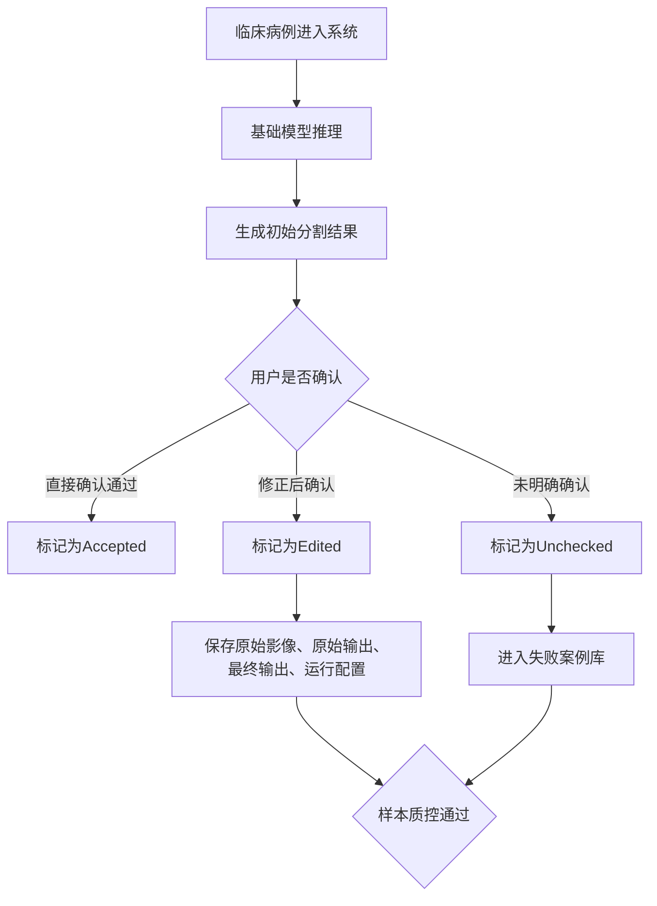
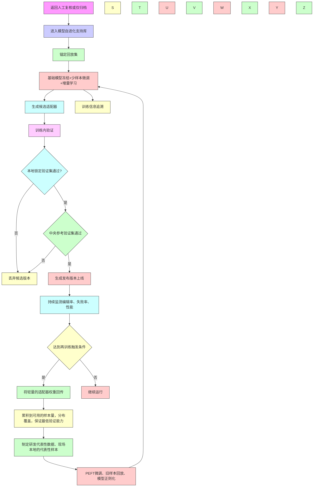
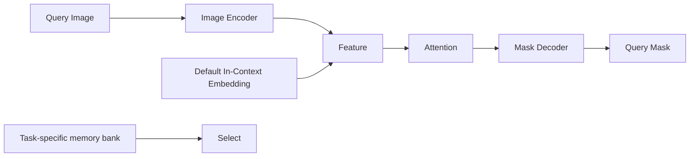
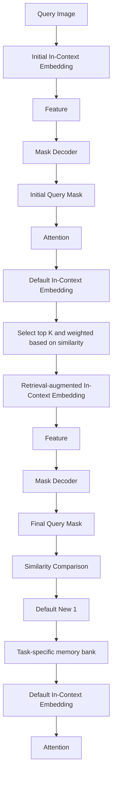
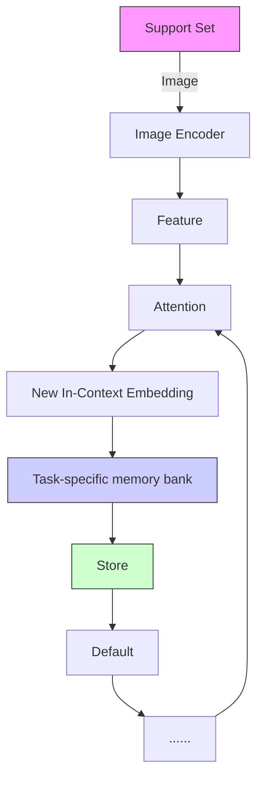
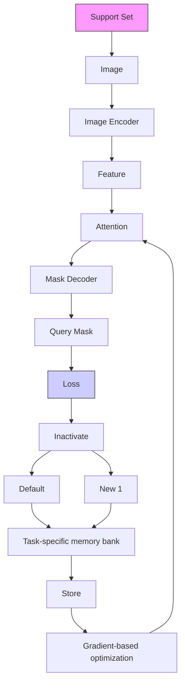
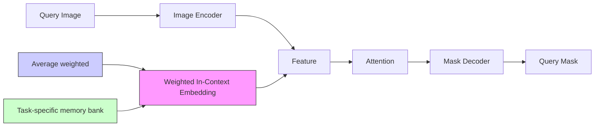
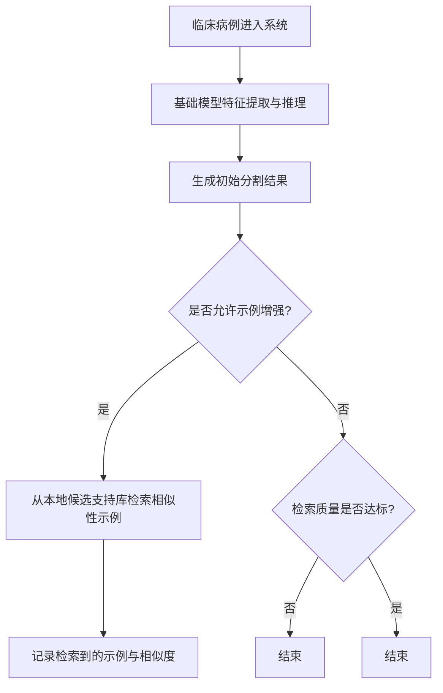
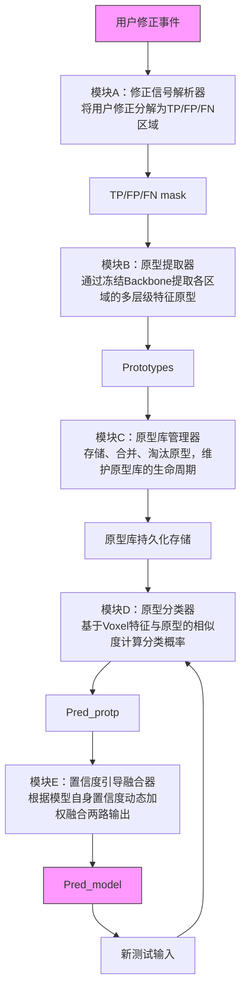

# 算法预研：少样本下的分割模型⾃适应

# 1. 背景

医学影像数据的获取和标注⾯临着独特的瓶颈：

a. ⾼质量的标注需要极⾼的成本（3D场景尤甚）；  
b. ⻓尾效应，如罕⻅病灶或特定亚型的病例数据极其稀缺；  
d. ⽤⼾的个性化需求，⽐如对⽬标边界划定的；

c. 普遍存在的数据域偏移，即由于扫描设备、成像协议、造影剂剂量以及患者种群差异导致的图像分布差异；

过往AI算法的研发⼤都遵循“穷举式”链路，即针对每个单⼀场景实施“数据收集―标注―训练―部署”的⼯作流。由于以上问题的存在，当前开发模式下的AI算法研发仍⾯临诸多挑战。本次预研的主题是”少样本下的分割模型⾃适应“，即能仅通过相对少量的标注样本减低研发负荷，或在资源有限的情况下提升算法的适应性。希望探索可⾏的⽅案，从技术⻆度缓解当前算法开发所⾯临的问题。具体：

<table><tr><td></td><td>目标</td><td>场景拆解举例</td><td>期望</td><td>收益</td><td>备注</td></tr><tr><td>1</td><td>少样本快速迭代</td><td>1. 标注困难(MR冠脉)2. 特殊类型数据少(MRP脑室病变占位情况下的CSF分割异常)</td><td>在少样本的情况快速更新模型,加快产品迭代速度;</td><td>减轻数据获取、标注、训练代价,研发提效</td><td rowspan="2">这两个目标在技术层面或存在高度耦合,但限制条件不一</td></tr><tr><td>2</td><td>模型自进化(Fenix 2.0后处理立项需求)</td><td>1. 自动算法在少数情况下效果不佳,需用户介入编辑;2. 用户对标准的个人偏好判断;</td><td>“系统支持根据用户手动修改结果,自动学习并更新自动化算法模型或参数,自动提升算法准确性及适配性(端侧或边侧)”</td><td>服务于下一代产品需求</td></tr></table>

# 2. 技术全景概览

# 2.1 潜在技术⽅向总览

原型学习（Prototype Learning）  
? 上下⽂学习（In-Context Learning，ICL）

⾼效参数微调(Parameter-Efficient Fine-Tuning，PEFT)   
• 测试时⾃适应（Test Time Adaption，TTA）  
持续学习（Continual Learning）

# 参考⽂献信息详⻅⽂献调研记录：

“⼩样本分割模型⾃适应”调研⽂献记录   
⼩样本分割模型⾃适应调研⽂献列表

<table><tr><td>技术方向</td><td>常规使用条件</td><td>核心机制</td><td>方法特性</td><td>优势</td><td>局限</td><td>代表方法</td></tr><tr><td>原型学习</td><td rowspan="2">少量标注后(通常1-16shot),模型直接适配新类别/新数据域任务,无需更新参数</td><td>通过支持集(标注示例)构建类别原型,将查询集图像特征与原型进行度量匹配(像素级分类)</td><td>模型:通常较为轻量(ResNet),推理可使用预先生成的类别原型;训练:基于元学习训练框架,相关研究训练数据规模不大;</td><td rowspan="2">标注成本低;无需微调模型主干;原型学习的模型训练相对轻量;分布内数据分割效果可逼近全监督专家模型;可泛化到未见类别,上下文学习的通用性或更强;</td><td rowspan="2">分布外数据分割效果较全监督专家模型有差距(参考Medverse的结果,Dice差距在2~10%)模型效果与标注量不是线性相关,存在一定效果瓶颈(参考UniverSeg中上下文超过16即接近效果饱和);分割结果受提供的标注示例影响;</td><td>PONet、DSPNet。大多是2D方法,学术上偏好于1-shot任务。近来的发展趋势主要在于优化原型的构建方式,提高原型质量。普遍操作复杂,且会引入额外超参数。</td></tr><tr><td>上下文学习(ICL)</td><td>基于上下文(标注)示例的条件学习范式</td><td>模型:ViT、类UNet等。推理使用预先提供的标注示例;训练:基于元学习训练框架,数据集尽可能丰富多样;</td><td>2D:SegGPT、MVG、UniverSeg、Tyche3D:Iris、Neuroverse3D、Medverse3D方法较少,同时处理多个上下文可能面临资源效率问题。</td></tr><tr><td>少样本参数微调</td><td>在已有基座模型的情况下,使用少量标签样本微调模型以适应目标域。</td><td>仅微调模型中的少部分参数,以较低的训练代价逼近全量微调的效果</td><td>模型:ViT/CNN不限;·训练:仅训练少量新增参数或调整基座模型中的部分参数;</td><td>训练高效;·少量标注下不易过拟合;·可用作专属适配”插件“用于增量学习;</td><td>·域偏移严重的情况下需要微调更多参数;·数据充分情况下效果可能不如全量微调;·超参数设置(新增参数的嵌入位置、LoRA的秩等);</td><td>LoRA、Adapter、SSF、DGST。从微调效果上看,DGST最佳,天然适配CNN。但若考虑可扩展性,则LoRA更合适。基座模型可以是在相关性任务中训练的模型,也可以是基于海量数据预训练得到的模型。(参考Spark3D和VoCo V2的结果,经过自监督预训练的模型可将dice提升3左右)</td></tr><tr><td>测试时自适应(TTA)</td><td>在不访问源域数据且不使用目标域标签的情况下改善由域偏移导致的模型性能退化。适合在模型部署后在线调整以适应新域</td><td>根据目标域数据特征无监督微调模型中的部分参数,以适应新域</td><td>·模型:通常要求模型含归一化层;·训练:在推理阶段直接根据目标域数据更新模型统计量,或是基于无监督损失对模型做几步更新;</td><td>·不依赖目标域标签;·仅对模型做轻量调整,可在线完成;</td><td>·域偏移严重的情况下不适用(比如跨模态);·部分方法依赖较大的batch来获取稳定的统计量;·会增加一定的推理耗时;</td><td>AdaBN、TENT、SicTTA相关研究主要用于相同模态下跨扫描设备、采集协议、种群的域适应场景。</td></tr><tr><td>持续/增量/终身学习</td><td>在任务或数据流不断变化的情况下(任务/数据/类别增量)拓展模型的适应能力。重点在于减少模型遗忘</td><td>历史数据重放(Repla-based)、模型正则化(Regularization)、动态模型扩展(DynamicModel)</td><td>视方法而定</td><td>视方法而定</td><td>·当前各类方法都会导致模型遗忘;·Replay-based方法通常效果更优(参考lifelong-nu-Net中的实验比较),但需要使用存储的历史数据参与训练;</td><td>Lifelong nnU-Net、CLMU-Net、CL-LoRA</td></tr></table>

# 2.2 “⽬标×技术”交叉映射表

<table><tr><td>技术方向</td><td>少样本快速迭代</td><td>模型自进化</td></tr><tr><td>原型学习</td><td>√</td><td>○</td></tr><tr><td>上下文学习</td><td>√</td><td>○</td></tr><tr><td>PEFT</td><td>√</td><td>○shijian.ruan 2026年06月12日 14:03</td></tr><tr><td>TTA</td><td>○</td><td>○</td></tr><tr><td>持续学习</td><td>○</td><td>○</td></tr></table>

# 3. 针对少样本快速迭代的技术路线

# 3.1 路线1：少样本零微调推理

# 3.1.1 ⽅案概况

基于few-shotlearning领域最常⻅的⽅法——原型学习，或近⼏年从LLM领域发展⽽来的上下⽂学习。两者在训练策略、使⽤⽅式等⽅⾯多有相似之处。从宏观层⾯概括，两者的任务模式就是"ShowandSegment“，即在展⽰少量标注样本的情况下，模型即可⽤于处理相同域的其它数据。在该范式下，部署时仅需提供⼀个模型便可⽀持多个（甚⾄所有）分割任务。


<details>
<summary>natural_image</summary>

Illustration of a padlock with blue and teal ribbon accents (no text or symbols)
</details>

# 附件不支持下载

原型学习（PANet）：在特征空间将每个像素点分类（类别原型匹配）实现预测


<details>
<summary>natural_image</summary>

Illustration of a padlock with blue and teal ribbon straps (no text or symbols)
</details>

# 附件不支持下载

上下⽂学习（UniverSeg）：在特征空间融合⽬标任务的语义信息以辅助预测

<table><tr><td></td><td>原型学习</td><td>上下文学习</td></tr><tr><td>方法逻辑</td><td></td><td></td></tr><tr><td></td><td>学习并固化类别级的特征中心(原型),基于“特征-原型”的相似度匹配完成任务,核心是“类别表征对齐”</td><td>学习任务级的条件式推理规则,基于输入的上下文示例动态理解任务目标,核心是“从示例中习得任务逻辑”</td></tr><tr><td>数据依赖特性</td><td>依赖训练阶段的基础类别数据构建原型空间,同分布的少样本类别适配性强,零样本场景能力有限</td><td>(相对)不依赖训练阶段见过的目标类别/任务,可完全依赖推理时输入的上下文示例,零样本/跨任务场景能力强</td></tr><tr><td>模型架构</td><td>架构相对简洁、模块化(编码器+原型构建与相似性度量+解码器),易与现有CNN、ViT结合。已有研究常使用中等规模CNN(ResNet-50、101)</td><td>架构更复杂与灵活(任务编码、上下文注意力),在表达能力与任务统一性上更强(跨任务、跨模态)</td></tr><tr><td>参数规模</td><td>参数量和显存占用相对较小,主要参数集中在编码器backbone,更适合资源受限环境(ResNet-50 25.6M, ResNet-101 44.6M)</td><td>参数规模视方法而定,更大的模型或能带来更强的任务表达与泛化能力(SegGPT 307M,UniverSeg 1.18M)。资源要求与上下文数量正相关。</td></tr><tr><td>优势</td><td>数据和资源要求规模不大,实现更轻量</td><td>通用性更佳。可在单一模型下覆盖多种解剖和模态,并在分布外任务上能获得较高Dice</td></tr><tr><td>缺陷</td><td>域适应性有限,且基于低分辨率特征图的原型分类会导致对目标边界的区分不够精细</td><td>资源和实现成本(数据量)相对更高</td></tr></table>

# 3.1.2 实现⽅式

# 3.1.2.1 训练⽅式

基于元学习训练范式。训练集由多个episode构成，每个episode就是⼀个训练样本，⽤于计算损失。对于原型学习来说，训练的⽬标是让⽹络学会提取可度量、类内紧凑、类间可分的特征，即原型（向量）。对于上下⽂学习来说，训练过程可视为基于标注⽰例的条件学习过程。

• Episode：表⽰⼀个n-wayk-shot任务（n表⽰类别，k表⽰每个类别的样本量），该任务包括⼀个⽀持集和查询集。只要⽀持集和查询集中的图像与其它episode不同，就可以视为新的episode。  
⽀持集（Supportset）：即少量标注样本构成的数据集  
• 查询集（Queryset）：即⽬标待分割图像

# 3.1.2.2 数据规模

结合近⼏年的研究来看，原型学习的实验设计通常更加轻量，训练数据规模不⼤，学术层⾯更关注1-shot任务（单张⽀持图像）。⽽上下⽂学习的数据规模要⼤得多，训练和推理阶段都不局限于固定的⽀持图像数量，模型的域泛化能⼒更强。

<table><tr><td>方法</td><td>技术类别</td><td>模型架构</td><td>数据规格</td><td>模态</td><td>扫描部位</td><td>任务</td><td>数据量</td></tr><tr><td>Iris (2025)</td><td>上下文学习</td><td>类UNet</td><td>3D</td><td>CT、MRI、PET</td><td>脑部、腹部、心脏、头颈、脊柱、胸腔</td><td>分割</td><td>3K</td></tr><tr><td>Medverse (2025)</td><td>上下文学习</td><td>双UNet</td><td>3D</td><td>CT、MRI、PET</td><td>脑部、腹部、心脏、前列腺</td><td>分割、模态转换、图像增强</td><td>40K(8K为分割样本)</td></tr><tr><td>MVG (2025)</td><td>上下文学习</td><td>ViT</td><td>2D</td><td>CT、MR、US、XR</td><td>脑部、盆腔、腹部、心脏</td><td>分割、模态转换、图像增强</td><td>4K</td></tr><tr><td>UniverSeg (2023)</td><td>上下文学习</td><td>类UNet</td><td>2D</td><td>CT、MRI、US、XR、显微镜等</td><td>腹部、胸部、脑部、视网膜、白细胞、脊柱等</td><td>分割</td><td>20K</td></tr><tr><td>DSPNet (2024)</td><td>原型学习</td><td>ResNet101</td><td>2D</td><td>CT、MRI</td><td>腹部、心脏</td><td>分割</td><td>85个3D扫描拆分2D</td></tr><tr><td>PONet (2025)</td><td>原型学习</td><td>ResNet50</td><td>2D</td><td>CT、MRI</td><td>腹部、心脏</td><td>分割</td><td>85个3D扫描拆分2D</td></tr><tr><td>PGRNet (2025)</td><td>原型学习</td><td>ResNet101</td><td>2D</td><td>CT、MRI</td><td>腹部、心脏</td><td>分割</td><td>85个3D扫描拆分2D</td></tr><tr><td>FSMIS (2024)</td><td>原型学习</td><td>ResNet101</td><td>2D</td><td>CT、MRI</td><td>腹部、心脏、前列腺</td><td>分割</td><td>100+3D扫描拆分2D</td></tr></table>

# 3.1.2.3 部署⽅式

上下⽂学习：提供少量预先标注的图像  
原型学习：提供基于预先标注图像⽣成的原型向量


与SAM的区别：少样本学习中的标注⽰例就是⼀种提⽰词。从这个层⾯来说，它与SAM中的点、框等提⽰词是等价的。但两者的根本差异在于，SAM的提⽰是实例级的，它告诉模型”这张图的这个位置有东西“，不传递语义概念。每切换⼀张新图，模型就”失忆“了，需要重新提⽰。⽽少样本学习中的标注⽰例定义的是任务/类别级的语义信息，即让模型理解”要分割的⽬标概念是什么“，然后⾃动应⽤到所有新图像。

# 3.1.3 可⾏性

# 3.1.3.1 2D任务

MR智能扫描项⽬已基于上下⽂学习模型SegGPT（ViT,307M）做过⼀版可⾏性验证：

<table><tr><td>背景</td><td>为实现全自动化扫描的目标,要在各种扫描场景下提取3D定位框。</td></tr><tr><td>方法</td><td>基于SegGPT模型,构建内部点定位数据集,使用8w+图像训练(2D),≤10 shot便可获得理想结果;</td></tr><tr><td>效果</td><td>分布内数据准确率≥95%,分布外数据85%-90%;</td></tr><tr><td>限制</td><td>特殊病例、疑难杂症等情况下的扫描定位不在预期支持范围内;</td></tr><tr><td>资源效率</td><td>TensorRT fp16,显存占用5-6G,推理数十毫秒;</td></tr><tr><td>预期</td><td>在每个现场由用户提供支持图像(上下文),后续期望扩展到纯3D模型;</td></tr></table>

# 3.1.3.2 3D任务

针对3D图像的少样本学习⽅法很少，⽬前仅调研到Neuroverse3D、Medverse、Iris三篇论⽂。挑战主要在于⼤规模3D图像的训练、多⽰例图像推理等情况下的资源瓶颈问题，或是多模型分⽀（查询图像分⽀和上下⽂分⽀）下的协同训练难度增⾼。在这三项研究中，

• Neuroverse3D和Medverse来⾃同⼀个团队（后者是前者的升级版），采⽤多分⽀UNet结构并⾏提取查询图像和上下⽂图像特征并即时融合，提供了模型权重以及推理代码。但原⽣⽅法仅⽀持⼆值分割，多类别任务需要对每个类别单独进⾏推理。  
• Iris⽅法采⽤单分⽀UNet结构，查询图像与上下⽂图像共享编码器，兼具原型学习的思想，结构上能更⾼效地处理多类别推理，且⽀持包括上下⽂微调、上下⽂检索等效果增强策略，训练过程也更为轻量。但官⽅未提供开源模型及代码，仅有同⾏评审的最⼩验证复现版本。其复现记录中提及，由于原⽂未明细部分超参数，因此复现结果较原⽂中略低，但在可接受区间（[原⽂结果vs.复现结果] 分布内Dice：89.56% vs. 85.7%；跨数据集Dice：82-86% vs. 84.5%；未⻅类别：28-69%vs.62.0%），对⽅法的有效性表⽰认同。

1. 模型效果与泛化能⼒：对于分布内数据（内部测试集），少样本模型效果可逼近全监督专家模型。在分布外数据上（不同数据域或任务），模型效果较全监督专家模型Dice低2\~10%或更多。

<table><tr><td rowspan="2">Method</td><td colspan="12">Dataset</td><td rowspan="2">AVG</td></tr><tr><td>AMOS CT</td><td>AMOS MR</td><td>Auto PET</td><td>BCV</td><td>Brain</td><td>CHAOS</td><td>KiTS Tumor</td><td>LiTS Tumor</td><td>MnM</td><td>StructSeg H&amp;N</td><td>StructSeg Tho</td><td>CSI-Wat</td></tr><tr><td colspan="14">Task-specific Model (Upper Bound)</td></tr><tr><td>nnUNet</td><td>88.67</td><td>85.42</td><td>67.21</td><td>83.38</td><td>94.12</td><td>91.13</td><td>81.72</td><td>63.11</td><td>85.59</td><td>78.17</td><td>88.53</td><td>91.11</td><td>83.18</td></tr><tr><td colspan="14">Multi-task Universal Model (Upper Bound)</td></tr><tr><td>Clip-driven</td><td>88.95</td><td>86.41</td><td>70.01</td><td>85.03</td><td>95.06</td><td>91.71</td><td>82.73</td><td>65.43</td><td>86.12</td><td>78.44</td><td>89.27</td><td>90.98</td><td>84.18</td></tr><tr><td>UniSeg</td><td>89.11</td><td>86.58</td><td>70.09</td><td>85.42</td><td>95.29</td><td>91.83</td><td>82.99</td><td>65.87</td><td>86.29</td><td>78.72</td><td>89.42</td><td>91.23</td><td>84.40</td></tr><tr><td>Multi-Talent</td><td>89.15</td><td>86.58</td><td>70.89</td><td>85.20</td><td>95.77</td><td>91.38</td><td>82.32</td><td>65.53</td><td>86.30</td><td>80.09</td><td>89.09</td><td>91.32</td><td>84.47</td></tr><tr><td colspan="14">Positional Prompt</td></tr><tr><td>SAM</td><td>22.23</td><td>17.82</td><td>20.10</td><td>23.34</td><td>20.51</td><td>20.01</td><td>18.21</td><td>12.08</td><td>10.23</td><td>17.23</td><td>24.81</td><td>13.20</td><td>17.97</td></tr><tr><td>SAM-Med 2D</td><td>50.12</td><td>48.66</td><td>38.03</td><td>50.32</td><td>35.28</td><td>50.32</td><td>30.23</td><td>23.27</td><td>40.33</td><td>39.32</td><td>63.87</td><td>34.87</td><td>40.58</td></tr><tr><td>SAM-Med 3D</td><td>79.19</td><td>76.18</td><td>67.14</td><td>79.89</td><td>42.29</td><td>84.79</td><td>79.32</td><td>32.93</td><td>52.67</td><td>68.83</td><td>83.56</td><td>74.23</td><td>68.42</td></tr><tr><td colspan="14">In-Context</td></tr><tr><td>SegGPT</td><td>45.37</td><td>51.78</td><td>48.29</td><td>49.78</td><td>85.27</td><td>63.72</td><td>40.78</td><td>35.98</td><td>74.12</td><td>40.28</td><td>67.28</td><td>85.59</td><td>57.35</td></tr><tr><td>UniverSeg</td><td>57.24</td><td>52.43</td><td>47.23</td><td>45.26</td><td>87.76</td><td>60.46</td><td>45.72</td><td>36.21</td><td>75.24</td><td>42.98</td><td>66.95</td><td>86.68</td><td>58.68</td></tr><tr><td>Tyche-IS</td><td>59.57</td><td>54.78</td><td>50.98</td><td>47.67</td><td>89.28</td><td>62.73</td><td>49.27</td><td>37.02</td><td>78.92</td><td>45.33</td><td>69.89</td><td>88.99</td><td>61.20</td></tr><tr><td>Iris (ours)</td><td>89.56</td><td>86.70</td><td>70.02</td><td>85.73</td><td>96.04</td><td>91.85</td><td>81.54</td><td>65.02</td><td>86.08</td><td>80.36</td><td>89.42</td><td>91.97</td><td>84.52</td></tr></table>

Iris模型在内部测试集上的表现（与全监督专家模型以及其它少样本学习⽅法的⽐较，1shot）

<table><tr><td rowspan="2">Method</td><td colspan="5">Generalization</td><td colspan="2">Unseen Classes</td></tr><tr><td>ACDC</td><td>SegTHOR</td><td>CSI-inn</td><td>CSI-opp</td><td>CSI-fat</td><td>MSD Pancreas</td><td>Pelvic</td></tr><tr><td colspan="8">Supervised Upper Bound</td></tr><tr><td>nnUNet</td><td>90.97</td><td>89.78</td><td>91.23</td><td>91.04</td><td>90.13</td><td>54.56</td><td>94.73</td></tr><tr><td colspan="8">Task-specific Model</td></tr><tr><td>nnUNet-generalize</td><td>82.06</td><td>76.92</td><td>55.24</td><td>85.19</td><td>0.23</td><td>-</td><td>-</td></tr><tr><td colspan="8">Multi-task Universal Model</td></tr><tr><td>CLIP-driven</td><td>84.72</td><td>78.23</td><td>59.73</td><td>86.73</td><td>1.47</td><td>-</td><td>-</td></tr><tr><td>UniSeg</td><td>84.98</td><td>78.56</td><td>60.02</td><td>86.13</td><td>1.52</td><td>-</td><td>-</td></tr><tr><td>Multi-Talent</td><td>83.79</td><td>78.45</td><td>58.29</td><td>87.01</td><td>1.95</td><td>-</td><td>-</td></tr><tr><td colspan="8">Positional Prompt</td></tr><tr><td>SAM-Med2D</td><td>42.23</td><td>52.37</td><td>29.23</td><td>32.71</td><td>10.91</td><td>10.37</td><td>35.71</td></tr><tr><td>SAM-Med3D</td><td>51.49</td><td>68.97</td><td>45.32</td><td>68.72</td><td>23.93</td><td>15.83</td><td>53.61</td></tr><tr><td colspan="8">In-context</td></tr><tr><td>SegGPT</td><td>73.82</td><td>60.98</td><td>59.87</td><td>77.62</td><td>35.27</td><td>10.67</td><td>55.92</td></tr><tr><td>UniverSeg</td><td>72.43</td><td>54.75</td><td>63.48</td><td>85.32</td><td>52.48</td><td>10.28</td><td>57.81</td></tr><tr><td>Tyche-IS</td><td>74.91</td><td>56.75</td><td>64.23</td><td>87.13</td><td>55.75</td><td>11.97</td><td>61.92</td></tr><tr><td>Iris (ours)</td><td>86.45</td><td>82.77</td><td>64.44</td><td>89.13</td><td>47.78</td><td>28.28</td><td>69.03</td></tr></table>

Iris模型在分布外数据上的表现（1shot）

<table><tr><td rowspan="2">Methods</td><td rowspan="2">Fine-Tuning Free</td><td colspan="6">Unseen Center</td><td colspan="3">Unseen Organ</td><td rowspan="2">Unseen Species Mice Lung</td><td rowspan="2">Unseen Modality PET Lateral Ventricle</td><td rowspan="2">Average</td></tr><tr><td>Cerebral Cortex</td><td>Hippocampus</td><td>Thalamus</td><td>Liver</td><td>Spleen</td><td>Kidney Left</td><td>Maxillary Sinus</td><td>Nasal Cavity</td><td>Nasal Pharynx</td></tr><tr><td colspan="14">Fully Supervised Task-Specific Models (Upper Bound)</td></tr><tr><td>nnUNet</td><td>✘</td><td>90.30</td><td>90.99</td><td>93.89</td><td>98.46</td><td>96.60</td><td>96.06</td><td>94.07</td><td>91.63</td><td>94.63</td><td>94.49</td><td>84.26</td><td>93.22</td></tr><tr><td>3D-Unet</td><td>✘</td><td>88.55</td><td>89.73</td><td>92.88</td><td>96.41</td><td>96.52</td><td>91.10</td><td>90.13</td><td>89.02</td><td>92.64</td><td>94.21</td><td>82.35</td><td>91.23</td></tr><tr><td>Swin-UNETR</td><td>✘</td><td>89.78</td><td>89.38</td><td>92.92</td><td>96.49</td><td>94.45</td><td>94.88</td><td>94.79</td><td>89.08</td><td>93.65</td><td>93.21</td><td>82.11</td><td>91.88</td></tr><tr><td colspan="14">Few-Shot Task-Specific Models</td></tr><tr><td>3D-Unet</td><td>✘</td><td>87.90</td><td>86.66</td><td>90.56</td><td>94.95</td><td>81.74</td><td>81.29</td><td>86.77</td><td>86.99</td><td>90.05</td><td>91.89</td><td>75.95</td><td>86.80</td></tr><tr><td>Swin-UNETR</td><td>✘</td><td>87.62</td><td>86.30</td><td>91.15</td><td>94.66</td><td>88.64</td><td>87.82</td><td>87.99</td><td>84.96</td><td>89.46</td><td>91.40</td><td>74.40</td><td>87.67</td></tr><tr><td colspan="14">ICL Models</td></tr><tr><td>SegGPT</td><td>✓</td><td>45.38</td><td>28.41</td><td>19.56</td><td>68.07</td><td>39.02</td><td>36.15</td><td>46.35</td><td>52.79</td><td>37.25</td><td>43.30</td><td>42.22</td><td>41.68</td></tr><tr><td>Neuralizer</td><td>✓</td><td>69.20</td><td>57.49</td><td>45.11</td><td>73.54</td><td>52.12</td><td>62.71</td><td>75.77</td><td>64.79</td><td>73.65</td><td>70.48</td><td>51.83</td><td>63.34</td></tr><tr><td>UniverSeg</td><td>✓</td><td>68.79</td><td>59.90</td><td>47.57</td><td>81.10</td><td>57.79</td><td>56.76</td><td>80.12</td><td>75.78</td><td>72.64</td><td>65.77</td><td>48.90</td><td>65.01</td></tr><tr><td>SegGPT*</td><td>✓</td><td>50.83</td><td>34.30</td><td>50.47</td><td>79.12</td><td>57.96</td><td>69.44</td><td>64.68</td><td>31.86</td><td>56.38</td><td>72.33</td><td>42.54</td><td>55.45</td></tr><tr><td>Neuralizer*</td><td>✓</td><td>76.96</td><td>65.70</td><td>82.79</td><td>59.45</td><td>62.69</td><td>71.58</td><td>83.64</td><td>66.81</td><td>83.12</td><td>78.36</td><td>48.26</td><td>70.85</td></tr><tr><td>UniverSeg*</td><td>✓</td><td>73.25</td><td>78.16</td><td>84.57</td><td>87.44</td><td>82.23</td><td>87.82</td><td>89.79</td><td>77.86</td><td>88.57</td><td>90.28</td><td>73.37</td><td>83.03</td></tr><tr><td>Neuroverse3D</td><td>✓</td><td>85.69</td><td>83.98</td><td>89.98</td><td>93.67</td><td>82.66</td><td>75.75</td><td>78.08</td><td>74.66</td><td>87.23</td><td>80.55</td><td>59.83</td><td>81.10</td></tr><tr><td>Medverse</td><td>✓</td><td>87.30</td><td>82.12</td><td>87.65</td><td>95.90</td><td>91.05</td><td>95.31</td><td>92.63</td><td>78.15</td><td>87.13</td><td>92.21</td><td>70.48</td><td>87.27</td></tr></table>

Medverse模型在外部测试集上的表现（与全监督专家模型以及其它少样本学习⽅法的⽐较，8shot）

利⽤Medverse开源模型在脑灌注数据分割任务上初步测试： Medverse开源模型泛化性浅测

2. 推理性能（\*根据论⽂信息推断）：

<table><tr><td></td><td>Input Size</td><td>GPU</td><td>Support Size</td><td>Query Size</td><td>Target Class</td><td>Parameters (M)</td><td>Inference Time (s)</td><td>GPU Memory (GB)</td></tr><tr><td>Neuroverse3D</td><td>128*128*128</td><td>V100</td><td>8</td><td>1</td><td>1</td><td>70.85</td><td>1.01</td><td>24.07*</td></tr><tr><td>Medverse</td><td>128*128*128</td><td>V100</td><td>8</td><td>1</td><td>1</td><td>71.05</td><td>1.16</td><td>9.14</td></tr><tr><td>Iris</td><td>128*128*128</td><td>A100</td><td>1</td><td>10</td><td>15</td><td>69.4</td><td>2</td><td>7.4</td></tr></table>

# 3.1.4 其它问题澄清

# 1. 少样本学习的优势是什么？

少样本学习的训练推理⽅式与以往全监督专家模型存在明显区别。但为了保证效果，其同样要求训练数据尽可能丰富多样，训练代价也很⾼昂。另外，模型在分布外数据上的效果退化使得其在这些场景上不⼀定能满⾜临床使⽤。基于此，此类⽅法的优势则主要体现在：

在⾯对多个分割任务时，按统⼀范式训练⼀个模型或可覆盖所有（保证分布内数据上的效果）；  
• 提供了⼀种优化模型效果的⼿段，能在不调整模型参数本⾝的情况下改善效果（拓展分布外数据上的泛化性）；

2. 少样本学习，样本量⼀般是多少？

视⽅法⽽定。学术上原型学习偏好于极端的1-shot任务，但⼯程应⽤场景下可以提供更多标注。在上下⽂学习⽅法UniverSeg的实验结果中，16-shot后效果趋近饱和，增加更多标注对效果提升有限。类似现象在同类研究中均有报道，效果趋近饱和的临界样本数量或有不同（但⼤体都在16以内）。

# 3. 如何提升少样本学习在未⻅类别（分布外）数据上的效果？

a. 增加训练数据集中episode的多样性，即训练任务的多样性。根据Iris中的结果，在1-shot设置下，增加训练任务数量（尤其是增加不同解剖、不同模态下的分割），可显著提升模型在未⻅类别上的表现。在标签数据资源有限的情况下，也可以通过合成数据扩增样本量，该策略在UniverSeg和Neuroverse3D研究中均有报道。


<details>
<summary>natural_image</summary>

Illustration of a padlock with ribbon-like design (no text or symbols)
</details>

# 附件不支持下载

Iris论⽂中，模型在未⻅类别上的表现与训练任务数量正相关


<details>
<summary>natural_image</summary>

Illustration of a padlock with ribbon-like bands (no text or symbols)
</details>

MVG论⽂中，模型在分布内数据上的表现也与同分布训练样本量正相关

b. 增加⽀持图像数量可提升效果。但增加更多标注，模型效果将趋于饱和。


<details>
<summary>natural_image</summary>

Illustration of a padlock with ribbon-like design (no text or symbols)
</details>

UniverSeg中⽀持图像数增加到16后效果趋于饱和


<details>
<summary>natural_image</summary>

Illustration of a padlock with blue and teal ribbon accents (no text or symbols)
</details>

Medverse中性能随⽀持图像数增加效果趋于饱和

c. 上下⽂微调。如SegGPT、Iris⽅法均⽀持微调模型中的隐变量（token或embedding）。⽆需调整模型参数即可获得明显性能提升。在特定⽅法中还可以通过多⽰例图像集成、上下⽂检索等⽅式提升效果。


<details>
<summary>natural_image</summary>

Illustration of a padlock with ribbon-like design (no text or symbols)
</details>

# 附件不支持下载

Iris中，在使⽤多个⽰例图像时，不同推理策略对分布外数据上的效果改善。可⻅，在样本量增多后，上下⽂微调的效果更好

# 4. 少样本学习能解决⻓尾问题吗？

当前少样本学习相关研究更关注模型在不同类别任务中的少样本泛化能⼒，并未专⻔涉及罕⻅病变等数据⻓尾问题。根据⽅法原理，使⽤少量⻓尾数据作为⽀持集或能实现类似数据条件的处理，但由于其本质上属于分布外数据，效果⼤概率不如常规数据好。

# 3.2 路线2：预训练与少样本微调

# 3.2.1 ⽅案概况

核⼼是通过少量标签样本微调已有模型以快速适配⽬标域，但需要缓解由于样本量过少⽽导致的效果不佳和过拟合问题。关键策略在于：

• 使⽤在海量数据上预训练的模型可提升在下游任务上的微调效果；  
• ⾼效参数微调（PEFT）⽅法仅更新模型的部分参数，在标签数据充分的情况下能显著提升微调效率，⽽在标签数据少的情况下也能降低过拟合的⻛险。

# 3.2.2 实现⽅式

# 3.2.2.1 预训练模型

⽬前在医学图像领域已有⼀些较⼤规模的预训练模型。⾃监督预训练⽅法不依赖特定任务的标签，可使⽤更多的数据参与训练，向下兼容多种任务的微调（不限于分割）。在3D场景下，基于⾃监督的预训练⽅法所使⽤的训练数据规模可达到160K。部分模型的信息已在下表中列出，它们⼤多⽀持nnUNet（或类UNet）结构。基于这些模型在⽬标任务上微调（包括少样本情况下）通常能获得⽐从零训练更优的结果（效果更好、训练更快）。除此之外，将SAM类、Merlin(Nature,2026)等视觉⼤模型或视觉语⾔模型中的图像编码器，或是在相关性任务中训练的模型视为基座进⾏微调也是⼀种常⻅的⽅式，这在LoRA、DGST等微调⽅法的研究中已有报道。

<table><tr><td></td><td>发布时间</td><td>模型维度</td><td>数据规模</td><td>扫描部位</td><td>模态</td><td>预训练方式</td><td>网络主干</td></tr><tr><td>Spark3D</td><td>2025</td><td>3D</td><td>40K</td><td>脑部</td><td>MRI (T1/T2/T1-FLAIR/T2-FLAIR)</td><td>自监督</td><td>nnUNet</td></tr><tr><td>VoCo v2</td><td>2025</td><td>3D</td><td>160K</td><td>全身多部位</td><td>CT</td><td>自监督/半监督</td><td>nnUNet、SwinUNETR</td></tr><tr><td>Triad</td><td>2026</td><td>3D</td><td>131K</td><td>脑部、乳腺、前列腺</td><td>MRI(T1/T2/FLAIR/DWI/DCE等)</td><td>自监督</td><td>nnUNet、SwinUNETR</td></tr><tr><td>CT-FM</td><td>2025</td><td>3D</td><td>14K</td><td>全身多部位</td><td>CT</td><td>自监督</td><td>3D SegResNet</td></tr><tr><td>MIS-FM</td><td>2025</td><td>3D</td><td>11K</td><td>全身多部位</td><td>CT</td><td>自监督</td><td>CNN+Transformer</td></tr><tr><td>SuPreM</td><td>2024</td><td>3D</td><td>9K</td><td>腹部</td><td>CT</td><td>全监督</td><td>UNet、SwinUNETR</td></tr><tr><td>AutoMix</td><td>2025</td><td>3D</td><td>120K</td><td>全身多部位</td><td>合成数据</td><td>自监督</td><td>UNet</td></tr></table>

根据Spark3D和VoCov2论⽂中的实验结果，在分割任务中，基于预训练模型微调可获得dice\~3%的效果提升。在少样本分割任务中，仅使⽤40套数据微调预训练模型（Spark3D）便可逼近（甚⾄超过）全量数据从零训练的效果。


<details>
<summary>natural_image</summary>

Illustration of a padlock with ribbon-like design (no text or symbols)
</details>

Spark3D：预训练模型微调效果明显优于从零训

练


<details>
<summary>natural_image</summary>

Abstract graphic with blue and teal curved shapes on white background (no text or symbols)
</details>

# 附件不支持下载

Spark3D：少样本下的预训练模型微调vs.从零训练


<details>
<summary>natural_image</summary>

Illustration of a padlock with ribbon-like bands, no text or symbols present
</details>

# 附件不支持下载

VoCoV2：预训练模型在24个不同数据集上的微调效果，绝⼤部分获得正向收益

# 3.2.2.2 少样本参数微调

⾼效参数微调常⽤于⼤模型的微调以适应不同的下游任务。在尽量不改动或少改动原模型参数的前提下，让模型适配新任务、新数据或新域，只引⼊极少量可训练参数（通常是原模型的0.1%‒5%）。代表性的⽅法有LoRA（Low-Rank Adaption）、Adapter、SSF（Scale-Shift Features）等。其中，LoRA凭借其训练参数少、⽆推理延迟等优势逐渐成为PEFT中的主流。⽽在医学图像领域被引⼊的DGST⽅法，在相关性任务的少样本迁移（不同部位的淋巴结分割）中获得了⽐LoRA、Adapter等更优的结果。


<details>
<summary>natural_image</summary>

Illustration of a padlock with ribbon-like design (no text or symbols)
</details>

# 附件不支持下载

LoRA中的参数化过程。固定原模型参数不变，仅训练参数矩阵A和B。⼀般情况下秩r<<d.


<details>
<summary>natural_image</summary>

Abstract curved blue band on white background, no text or symbols visible
</details>

DGST (Dynamic Gradient Sparsification Training)。在每层参数中选取最重要的（梯度敏感性）参数参与更新，其余保持不变

<table><tr><td></td><td>LoRA</td><td>DGST</td></tr><tr><td>原理</td><td>对模型权重矩阵进行低秩拆解,微调过程仅更新低秩矩阵,而后可将其合并至原模型</td><td>在每次迭代中仅更新筛选出的对loss影响大的参数,其余保持不变</td></tr><tr><td>推理延迟</td><td>少量(合并参数后无延迟)</td><td>无</td></tr><tr><td>网络适配性</td><td>最初用于Transformer结构中的Q/K/V矩阵,针对CNN中的高维权重张量需进行改造以获得更好的适配性(如LoRA-C、CP-LoRA等)</td><td>原生支持CNN,原理上也适用于其它模型</td></tr><tr><td>关键超参数</td><td>适配器的插入位置、秩的大小(通常4-64)</td><td>每层中的需要更新的参数量</td></tr><tr><td>效果</td><td>微调参数量通常不超过5%(甚至不超过1%)。在数据充分的情况下即可接近全量微调的效果,在少样本情况下通常更优。</td><td>在≤20 shot的少样本微调任务中,每次迭代每层仅更新一个参数即可获得理想效果,增加参数量或导致过拟合</td></tr><tr><td>微调策略</td><td>· 在大模型(包括SAM)微调中,通常将LoRA作用于编码器,而解码器全量更新;· 在CP-LoRA论文中,相同输入模态不同分割目标的场景下,微调解码器效果更优;· 在convLoRA论文中,相同分割目标不同数据域(不同场强数据)的场景下,微调整个编码器效果更优(解码器全量微调);</td><td>微调网络中的卷积层、转置卷积层、BN层中的参数,且每次迭代自动筛选要更新的参数(即每次迭代更新的参数不固定)。</td></tr><tr><td>备注</td><td colspan="2">LoRA的优势在于其灵活的扩展性。即在保持原模型冻结的情况下当作插件使用。而DGST在每次迭代中都会修改原模型参数。</td></tr></table>

# 3.2.3 可⾏性

LoRA等PEFT⽅法在⼤模型领域已被⼴泛使⽤，包括微调SAM以适配医学图像、遥感图像分割等下游任务，⽽在基于常⽤分割模型的少样本迁移问题中则少有报道。但其中也有部分⼯作与本次预研的预期场景贴合，以下介绍其中两个实例。

实例1：CT蛛⽹膜下腔出⾎分割的少样本迁移 

<table><tr><td>参考论文</td><td colspan="2">Minoccheri, C., Hodgman, M., Ma, H., Merchant, R., Wittrup, E., Williamson, C., &amp; Najarian, K. (2025). LoRA-based methods on Unet for transfer learning in aneurysmal subarachnoid hematoma segmentation. BMC medical imaging, 26(1), 58. https://doi.org/10.1186/s12880-025-02116-y</td></tr><tr><td>背景</td><td colspan="2">动脉瘤性蛛网膜下腔出血(SAH)的标注数据稀缺,基于CT图像手动标注困难。而创伤性脑损伤(TBI)血肿更为常见,且易于标注。期望通过迁移学习利用相关任务数据解决目标任务数据匮乏的问题。</td></tr><tr><td>方法</td><td colspan="2"></td></tr><tr><td></td><td colspan="2">首先利用124例多中心TBI患者的脑部CT扫描数据对Unet模型进行预训练,随后基于30例密歇根大学健康系统的SAH患者CT数据,采用3折交叉验证进行微调(20个epoch),比较了不同LoRA方法的微调效果。</td></tr><tr><td rowspan="3">图像示例</td><td></td><td></td></tr><tr><td>附件不支持下载</td><td>附件不支持下载</td></tr><tr><td>TBI</td><td>SAH</td></tr><tr><td>关键结果</td><td colspan="2">无微调模型的平均Dice系数仅为0.410±0.26,所有微调策略均显著优于无微调。传统微调中,解码模块微调表现最佳,平均Dice系数为0.527±0.20,且对大体积出血(&gt;100mL)的分割性能最优(Dice=0.683±0.10),但对小体积出血(&lt;25mL)的分割效果较差(Dice=0.200±0.01)。所有LoRA/DoRA方法均优于传统微调策略(~4%↑),CP-LoRA在性能与现有LoRA方法相当的情况下,可训练参数减少30%-40%;</td></tr></table>

实例2：CT肺淋巴结分割的少样本迁移

<table><tr><td>参考论文</td><td colspan="2">Luo, Z., Gao, Z., Liao, W., Zhang, S., Wang, G., Luo, X. (2026). Dynamic Gradient Sparsification Training for Few-Shot Fine-Tuning of CT Lymph Node Segmentation Foundation Model. In: Gee, J.C., et al. Medical Image Computing and Computer Assisted Intervention – MICCAI 2025. MICCAI 2025. Lecture Notes in Computer Science, vol 15964. Springer, Cham. https://doi.org/10.1007/978-3-032-04971-1_16</td></tr><tr><td>背景</td><td colspan="2">单例CT扫描的淋巴结标注非常耗时,大规模标注数据集难以获取;不同解剖区域(如头颈部与纵隔)的淋巴结形态差异大,通用模型适应性差;现有少样本微调方法要么过度限制模型灵活性(如LoRA、Adapter等会固定参数子集),要么易导致过拟合(如全模型微调);</td></tr><tr><td>方法</td><td colspan="2">首先构建了大规模的CT淋巴结标注数据集——从3346份头颈部CT扫描中精准标注36106个可见淋巴结,基于nnUNetv2框架全监督预训练作为基座模型;分别在SegRap2023数据集(120张头颈CT)和LNQ2023数据集(120张胸部CT),使用DGST方法微调基座模型;</td></tr><tr><td>图像示例</td><td colspan="2"></td></tr><tr><td rowspan="2"></td><td colspan="2"></td></tr><tr><td colspan="2">附件不支持下载</td></tr><tr><td rowspan="2">关键结果</td><td></td><td></td></tr><tr><td>附件不支持下载</td><td>附件不支持下载</td></tr></table>

#

# 3.2.4 其它问题澄清

# 1. ⾼效参数微调与全量微调在效果上的差异

在样本量较少的情况下，PEFT通常更具优势。⽽随着样本量增多，其与全量微调间的效果差异将逐渐缩⼩。在数据量充分的情况下，PEFT或不如全量微调。数据量的临界点与任务难度和基座模型的能⼒有关。


<details>
<summary>line</summary>

| Number of training samples | Full   | Linear | LoRA   | Adapter | SSF    | LoTR   | PISSA  | LoRA-PT |
| -------------------------- | ------ | ------ | ------ | ------- | ------ | ------ | ------ | ------- |
| 5                          | 83.9   | 83.5   | 84.3   | 84.2    | 83.8   | 84.1   | 84.3   | 84.5    |
| 10                         | 84.8   | 84.9   | 85.1   | 85.0    | 84.7   | 85.9   | 86.5   | 86.6    |
| 20                         | 87.5   | 87.2   | 87.4   | 87.5    | 86.9   | 86.7   | 87.3   | 87.4    |
| 40                         | 87.9   | 87.6   | 87.7   | 87.6    | 87.5   | 87.6   | 87.7   | 87.8    |
</details>

LoRA-PT（从MRI脑肿瘤数据集到海⻢体分割的少样本迁移）

# 2. 算法往往仅对少部分新数据不适应，此时通常期望能拓展模型的适应性但同时保持其已有能⼒（在常规数据上效果不变），则该如何？

该场景与域增量学习的⽬标吻合。增量学习是指模型能在任务或数据流不断变化的情况下学习新知识，同时尽量减少遗忘，⽬标场景包括域增量、任务增量和类别增量三种。相关⽅法⼤体可分为三类：Regularization（正则化类）、Replay-based（记忆回放类）和Dynamic Model（动态模型）。根据相关综述，总结其⽅法特点如下：

<table><tr><td></td><td>正则化类</td><td>记忆回放类</td><td>动态模型</td></tr><tr><td>核心思路</td><td>通过在损失函数中增加正则项,约束模型参数/特征的更新幅度,保护对旧任务重要的参数/特征不被新任务的训练覆盖,从损失层面缓解灾难性遗忘</td><td>通过存储少量历史数据的真实代表性样本(特征),或训练生成模型生成历史数据的伪样本,在学习新任务时,将新数据与回放的旧数据混合训练,直接巩固旧知识</td><td>为新任务/新数据扩展模型的新结构分支,同时冻结对应旧任务的模型结构与权重,让新旧任务的参数空间完全隔离,从架构层面缓解新旧知识的干扰</td></tr><tr><td>代表方法</td><td>·EWC:通过Fisher信息矩阵量化参数重要性,对重要参数施加L2正则惩罚·LwF:学习新任务时,用旧模型对新数据的输出作为软标签,通过知识蒸馏保留旧知识</td><td>·ER(经验重放):维护固定大小的记忆库,存储历史任务中的部分样本,新任务训练时同步采样新旧样本联合训练;·DGR(生成式重放):训练一个生成模型,在新任务阶段用其生成旧任务样本进行回放;</td><td>·PNN:增量学习的经典结构范式,每个新任务新增一个网络列,旧列永久冻结,彻底杜绝遗忘。·CL-LoRA:引入一种双适配器架构,明确分离并处理跨任务的共享知识和任务独有的特定特征,同时通过特殊机制来防止知识遗忘和参数冗余。</td></tr><tr><td>优点</td><td>无数据存储需求,隐私合规性强,不改变模型结构,推理无额外开销</td><td>抗遗忘能力强,效果上限更高</td><td>多用于类别增量或任务增量,特定方法理论上可以实现零遗忘</td></tr><tr><td>缺点</td><td>任务数量多、新旧数据分布差异大时,遗忘问题显著,难以平衡新任务学习与旧任务保留</td><td>原生回放方法需存储真实样本,存在隐私风险;记忆库容量过小时效果下降</td><td>模型容量随任务数增加;需要在推理时识别当前数据所属的任务类别。</td></tr></table>

在增量学习研究中常使⽤BWT作为评估指标（BackwardTransfer，反映在学完新任务后，旧任务性能的变化，<0表⽰遗忘）。根据Lifelong-nnUnet（Scientific Report， 2023）中的实验结果，经典的增量学习⽅法（EWC、LwF、MiB、RW、Rehearsal）均会有遗忘（BWT<0），即在旧任务上存在效果衰退。其中Rehearsal⽅法（旧样本回放）总体表现最佳。在以往的研发习惯中，将不适应的数据放⼊原训练集再更新模型的⽅式就属于旧样本回放。

# 3. ⽆标签情况下的模型微调

测试时⾃适应（TTA）是当模型已经在源域训练完毕、部署到新环境后，只利⽤⽆标注的测试数据，在推理阶段对模型做轻量调整，以缓解域偏移带来的性能下降。属于在线的⽆监督微调⽅式。⽅法类别按参数更新⽅式⼤体划分如下：

<table><tr><td></td><td>代表方法与思路</td><td>优缺点</td></tr><tr><td>统计量优化</td><td>AdaBN:推理时根据当前batch更新BN层中的统计量TENT:基于无监督损失(熵最小化)对BN层参数做几步迭代更新Adaptive UNet:额外训练一个自编码器,推理时从编码器特征中获取统计量</td><td>实现较简单,常作为实验基线或组合方式小batch的情况下统计信息不稳定</td></tr><tr><td>隐变量优化</td><td>&quot;Test-time Adaptation for Foundation Medical Segmentation Model without Parametric Updates&quot;, ICCV 2025:结合无监督损失优化MedSAM编码器生成的隐变量SicTTA:根据质控因子构建源域友好的目标域数据/特征库,每次推理时从中筛选出一定量最相似的样本通过加权的方式更新当前推理图像的瓶颈层特征;</td><td>实现方式更复杂,除了使用常规无监督损失(最小化熵)外,通常还使用其它特定的约束策略;效果通常较单纯的统计量优化方法好;</td></tr><tr><td>旁路参数微调</td><td>Buffer Layer (NeurIPS, 2025):在主干网络外插入极小的可学习模块,构建无监督损失进行优化(LoRA、Adapter等模块也适用)</td><td>可与其它TTA方法组合使用;可学习模块需要精心设计;</td></tr></table>

相关研究主要⽤于相同模态下跨扫描设备、采集协议、种群的域适应场景，⽽在域偏移严重的情况下不适⽤（⽐如跨模态）。因为⽅法本质上属于⽆监督学习，效果上限应该不如有监督微调。

<table><tr><td rowspan="3" colspan="2"></td><td colspan="4">ACDC [2]→LVQuant [51]</td><td colspan="4">ACDC [2]→MyoPS [23]</td><td colspan="4">ACDC [2]→M&amp;M [3]</td><td rowspan="3">Avg. Rank</td></tr><tr><td colspan="2">LV</td><td colspan="2">Myo</td><td colspan="2">LV</td><td colspan="2">Myo</td><td colspan="2">LV</td><td colspan="2">Myo</td></tr><tr><td>DSC ↑</td><td>ASD ↓</td><td>DSC ↑</td><td>ASD ↓</td><td>DSC ↑</td><td>ASD ↓</td><td>DSC ↑</td><td>ASD ↓</td><td>DSC ↑</td><td>ASD ↓</td><td>DSC ↑</td><td>ASD ↓</td></tr><tr><td rowspan="5">UNet</td><td>Pretrained [36]</td><td>58.98</td><td>24.40</td><td>42.52</td><td>19.37</td><td>85.69</td><td>2.99</td><td>72.91</td><td>2.26</td><td>47.69</td><td>24.11</td><td>41.19</td><td>15.89</td><td>4.33</td></tr><tr><td>TENT [47]</td><td>65.78</td><td>15.37</td><td>51.57</td><td>12.78</td><td>85.63</td><td>2.94</td><td>73.49</td><td>3.24</td><td>57.01</td><td>21.15</td><td>48.26</td><td>19.99</td><td>2.92</td></tr><tr><td>CoTTA [48]</td><td>64.58</td><td>17.69</td><td>50.52</td><td>13.80</td><td>85.64</td><td>2.96</td><td>73.47</td><td>3.24</td><td>52.98</td><td>27.55</td><td>46.72</td><td>24.65</td><td>3.67</td></tr><tr><td>TEA [53]</td><td>67.96</td><td>16.42</td><td>54.10</td><td>11.17</td><td>85.88</td><td>3.21</td><td>73.98</td><td>2.86</td><td>52.83</td><td>38.43</td><td>48.06</td><td>29.32</td><td>2.92</td></tr><tr><td>Ours</td><td>76.93</td><td>8.77</td><td>59.43</td><td>11.68</td><td>86.06</td><td>2.93</td><td>78.89</td><td>1.91</td><td>61.84</td><td>19.28</td><td>53.13</td><td>15.88</td><td>1.08</td></tr><tr><td rowspan="5">MeIDNeXt</td><td>Pretrained [37]</td><td>57.55</td><td>8.67</td><td>42.26</td><td>4.80</td><td>84.39</td><td>3.39</td><td>75.77</td><td>2.07</td><td>78.43</td><td>5.48</td><td>61.06</td><td>2.95</td><td>4.67</td></tr><tr><td>TENT [47]</td><td>75.10</td><td>6.10</td><td>54.91</td><td>3.97</td><td>84.48</td><td>3.35</td><td>75.92</td><td>2.04</td><td>83.18</td><td>4.53</td><td>67.56</td><td>2.70</td><td>2.83</td></tr><tr><td>CoTTA [48]</td><td>74.57</td><td>6.32</td><td>54.85</td><td>3.93</td><td>84.46</td><td>3.36</td><td>75.95</td><td>2.03</td><td>82.90</td><td>4.83</td><td>67.93</td><td>2.89</td><td>3.25</td></tr><tr><td>TEA [53]</td><td>75.85</td><td>5.96</td><td>55.32</td><td>3.88</td><td>84.12</td><td>3.44</td><td>75.25</td><td>2.07</td><td>83.53</td><td>4.64</td><td>67.84</td><td>2.77</td><td>3.17</td></tr><tr><td>Ours</td><td>76.22</td><td>5.29</td><td>57.29</td><td>3.70</td><td>84.78</td><td>3.28</td><td>76.44</td><td>1.98</td><td>83.82</td><td>4.11</td><td>68.40</td><td>2.49</td><td>1.00</td></tr><tr><td rowspan="5">SwinUNETR</td><td>Pretrained [13]</td><td>68.44</td><td>5.92</td><td>47.64</td><td>4.20</td><td>84.84</td><td>3.26</td><td>76.35</td><td>1.99</td><td>81.92</td><td>3.52</td><td>61.83</td><td>3.03</td><td>4.25</td></tr><tr><td>TENT [47]</td><td>74.06</td><td>6.64</td><td>54.15</td><td>4.18</td><td>85.06</td><td>3.20</td><td>77.38</td><td>1.98</td><td>83.27</td><td>4.02</td><td>67.26</td><td>3.59</td><td>4.08</td></tr><tr><td>CoTTA [48]</td><td>73.41</td><td>6.38</td><td>54.19</td><td>4.19</td><td>85.18</td><td>3.19</td><td>77.72</td><td>1.91</td><td>83.43</td><td>3.87</td><td>67.61</td><td>3.47</td><td>2.92</td></tr><tr><td>TEA [53]</td><td>74.32</td><td>5.99</td><td>54.73</td><td>4.11</td><td>85.04</td><td>3.19</td><td>77.79</td><td>1.91</td><td>83.93</td><td>3.90</td><td>68.60</td><td>3.58</td><td>2.33</td></tr><tr><td>Ours</td><td>76.05</td><td>5.79</td><td>54.22</td><td>3.98</td><td>85.22</td><td>3.17</td><td>77.87</td><td>1.90</td><td>83.80</td><td>3.13</td><td>68.15</td><td>2.66</td><td>1.25</td></tr></table>

"Progressive Test Time Energy Adaptation for Medical Image Segmentation" ICCV, 2025

<table><tr><td colspan="12">Table 3Comparison between different TTA methods for heart structure segmentation in terms of Dice (%) on three sequential testing domains. ◦ indicates experiments conducted with a batch size of 10, while other results correspond to the single-image continual test time adaptation setting. † denotes a significant improvement (p-value &lt; 0.05) over the best existing method.</td></tr><tr><td rowspan="2">Method</td><td colspan="3">Domain B</td><td colspan="3">Domain C</td><td colspan="3">Domain D</td><td rowspan="2" colspan="2">Average</td></tr><tr><td>LV</td><td>MYO</td><td>RV</td><td>LV</td><td>MYO</td><td>RV</td><td>LV</td><td>MYO</td><td>RV</td></tr><tr><td>Source only</td><td>80.89 ± 23.46</td><td>66.81 ± 20.29</td><td>67.47 ± 35.35</td><td>75.56 ± 27.18</td><td>56.99 ± 23.46</td><td>60.54 ± 37.16</td><td>83.84 ± 22.72</td><td>69.36 ± 21.35</td><td>64.51 ± 37.40</td><td colspan="2">69.73</td></tr><tr><td>PTBN (Nado et al., 2020)</td><td>81.35 ± 23.89</td><td>73.81 ± 16.09</td><td>61.95 ± 35.99</td><td>79.28 ± 24.20</td><td>70.36 ± 18.07</td><td>59.12 ± 36.49</td><td>80.96 ± 24.82</td><td>71.08 ± 19.98</td><td>61.05 ± 36.16</td><td colspan="2">71.24</td></tr><tr><td>TENT (Wang et al., 2021)</td><td>84.64 ± 19.90</td><td>71.92 ± 14.52</td><td>51.70 ± 36.41</td><td>77.30 ± 24.33</td><td>51.84 ± 22.60</td><td>18.32 ± 38.18</td><td>30.83 ± 31.94</td><td>0.77 ± 7.80</td><td>17.24 ± 37.77</td><td colspan="2">49.65</td></tr><tr><td>MT (Tarvainen and Valpola, 2017)</td><td>73.14 ± 27.04</td><td>66.58 ± 19.12</td><td>59.32 ± 36.45</td><td>64.63 ± 27.29</td><td>59.09 ± 19.81</td><td>51.37 ± 35.24</td><td>69.42 ± 29.47</td><td>62.42 ± 21.66</td><td>55.86 ± 35.71</td><td colspan="2">63.22</td></tr><tr><td>GoTTA (Wang et al., 2022)</td><td>77.40 ± 25.69</td><td>69.74 ± 18.17</td><td>57.84 ± 36.48</td><td>75.23 ± 25.70</td><td>63.12 ± 19.76</td><td>50.06 ± 34.75</td><td>79.40 ± 25.71</td><td>63.74 ± 21.43</td><td>53.08 ± 35.41</td><td colspan="2">66.10</td></tr><tr><td>SAR (Niu et al., 2023)</td><td>83.92 ± 20.86</td><td>74.73 ± 15.66</td><td>68.37 ± 34.77</td><td>82.23 ± 21.14</td><td>71.49 ± 17.23</td><td>65.59 ± 35.47</td><td>84.53 ± 20.83</td><td>72.40 ± 19.35</td><td>66.61 ± 35.91</td><td colspan="2">74.68</td></tr><tr><td>IntEn (Dong et al., 2024)</td><td>81.34 ± 23.01</td><td>67.77 ± 19.77</td><td>67.85 ± 35.08</td><td>76.51 ± 26.53</td><td>58.66 ± 22.81</td><td>61.20 ± 36.84</td><td>84.07 ± 22.39</td><td>69.84 ± 21.12</td><td>65.05 ± 37.13</td><td colspan="2">70.43</td></tr><tr><td>VPTTA (Chen et al., 2024)</td><td>82.97 ± 21.52</td><td>73.18 ± 16.36</td><td>65.46 ± 35.80</td><td>81.04 ± 22.65</td><td>68.53 ± 18.73</td><td>63.22 ± 36.23</td><td>83.74 ± 21.93</td><td>70.35 ± 20.26</td><td>63.94 ± 36.94</td><td colspan="2">72.76</td></tr><tr><td>PTBN* (Nado et al., 2020)</td><td>84.06 ± 21.15</td><td>75.03 ± 15.51</td><td>68.65 ± 34.75</td><td>82.47 ± 21.22</td><td>72.02 ± 16.56</td><td>64.28 ± 36.14</td><td>84.54 ± 21.29</td><td>72.50 ± 19.33</td><td>65.83 ± 36.27</td><td colspan="2">74.70</td></tr><tr><td>GoTTA* (Wang et al., 2022)</td><td>84.53 ± 20.96</td><td>76.00 ± 15.03</td><td>70.67 ± 34.44</td><td>83.97 ± 19.74</td><td>74.07 ± 15.42</td><td>68.42 ± 34.90</td><td>85.45 ± 20.49</td><td>74.49 ± 17.61</td><td>72.43 ± 33.36</td><td colspan="2">76.68</td></tr><tr><td>SAR* (Niu et al., 2023)</td><td>84.13 ± 21.10</td><td>75.01 ± 15.65</td><td>68.65 ± 34.76</td><td>82.59 ± 21.12</td><td>72.05 ± 16.70</td><td>64.53 ± 36.11</td><td>84.53 ± 21.34</td><td>72.49 ± 19.43</td><td>65.69 ± 36.41</td><td colspan="2">74.74</td></tr><tr><td>SciTTA (Ourn)</td><td>86.07 ± 17.32†</td><td>78.14 ± 12.03†</td><td>72.58 ± 32.93†</td><td>85.45 ± 17.97†</td><td>73.78 ± 16.37†</td><td>69.23 ± 34.83†</td><td>86.71 ± 17.99†</td><td>74.78 ± 16.52†</td><td>70.43 ± 34.42†</td><td colspan="2">77.88†</td></tr></table>

SicTTA (Medical Image Analysis, 2026)

# 4. 在模型⾃进化场景中的应⽤

# 4.1 场景与设计⽬标

在端侧或边侧调整模型以增强其能⼒，改善算法在不适应场景下的效果。相较于研发环境下的少样本快速迭代，此场景下的模型更新存在特殊限制，⽅案设计需要兼顾更多现实场景下的考量：

<table><tr><td>场景</td><td>影响/风险</td><td>要求</td></tr><tr><td>端侧或边侧存储与计算资源受限存储与隐私安全问题,原始研发数据无法访问或仅能部分访问某些场景需要追溯以前的处理结果(随访、本地研发复现)</td><td>难以复刻研发场景下的大规模训练根据现场少量数据微调极有可能造成数据偏倚模型更新后验证困难模型更新大概率造成历史数据结果改变</td><td>建立一个受控的持续优化系统:1. 利用临床用户修正数据,提升后续同类数据表现;2. 不破坏基础模型既有能力,避免灾难性遗忘;3. 支持医院现场问题追溯、结果复现、随访一致性;4. 满足医疗软件场景下的发布门禁、灰度、回滚和审计要求;</td></tr></table>

对此，以下分别在少样本学习和常规监督学习范式下提出⽅案设想。这些⽅案的前提假设是算法模型在部署前已被充分验证，能适应绝⼤部分预期场景（根据质量要求，理应如此）。那么在此情景下，模型⾃进化只是⼀种⾼效的“兜底”⼿段。

# 4.2 常规的增量微调⾃进化策略

结合增量学习与少样本学习⽅法实现构建模型⾃进化框架，如下图所⽰：


<details>
<summary>flowchart</summary>


</details>


<details>
<summary>flowchart</summary>


</details>

在使⽤层⾯，该⽅案的要求在于：

<table><tr><td></td><td>要求</td><td>说明</td></tr><tr><td>1</td><td>保存用户修正数据</td><td rowspan="3">使用任何样本均需要用户授权构建回放数据集、本地锁定验证集</td></tr><tr><td>2</td><td>保存原始模型输出</td></tr><tr><td>3</td><td>保存用户明确接受但未修改的数据</td></tr><tr><td>4</td><td>样本入库质控</td><td>谨防标签污染</td></tr><tr><td>5</td><td>回放数据集</td><td>保证模型的增量学习能力</td></tr><tr><td>6</td><td>本地锁定验证集</td><td>验证模型更新后的场内收益</td></tr><tr><td>7</td><td>中央参考验证集或相应验证机制</td><td>验证模型原有的通用能力</td></tr><tr><td>8</td><td>训练记录与版本控制</td><td>可追溯、可回退、可复现</td></tr><tr><td>9</td><td>模型更新触发机制</td><td>累积到一定量且覆盖基本分布,能保证最低验证能力</td></tr></table>

# 4.3 零微调下的模型⾃进化

以下⽅案的设计是在”完全不更新模型参数“的前提下展开，其优势在于：

<table><tr><td></td><td>优点</td></tr><tr><td>1</td><td>不改变模型参数,更安全</td></tr><tr><td>2</td><td>回滚更简单</td></tr><tr><td>3</td><td>现场更新更快(修正后可立即生效)</td></tr><tr><td>4</td><td>更适合少样本、个性化场景</td></tr><tr><td>5</td><td>更容易解释结果变化</td></tr></table>

# 4.3.1 基于少样本学习范式的模型⾃进化

# 4.3.1.1 ⽅案设计基础

少样本学习在适配⽬标任务时⽆需调整模型参数，仅提供少量标注⽰例即可实现泛化。增加标注⽰例能提升模型表现，⽽部分⽅法还可采⽤其它策略在不改变模型本⾝的情况下进⼀步改善效果，可⽀持模型⾃进化的场景。在此基础上，⽅案选型要考虑的关键点：

<table><tr><td></td><td>关键点</td><td>补充说明</td></tr><tr><td>1</td><td>支持灵活的效果增强方式</td><td>除了提供更多标注示例之外的效果增强策略</td></tr><tr><td>2</td><td>3D场景下的资源使用可接受</td><td>尤其在使用多上下文图像时的显存资源使用</td></tr><tr><td>3</td><td>高效支持多类别分割</td><td>很多方法原生仅支持二值分割,多类别任务需要多次推理</td></tr><tr><td>4</td><td>数据安全、隐私性问题友好</td><td>预先提供的标注示例、后续新增样本存留的安全性风险</td></tr></table>

在已有研究中，上下⽂学习⽅法Iris（CVPR2025）兼具原型学习的范式⻛格，提供了⼀个较好的参考架构。⽅法的关键点在于：

1. 基于⽀持图像（含标签），通过模型编码器并结合注意⼒机制能⽣成⼀组相应的上下⽂embedding。它包含了该分割任务的深层语义信息，将其与查询图像特征融合（交叉注意⼒）能指导⽬标分割。对于已知类别，可在训练阶段维护其上下⽂embedding；对于未知类别，则在部署后根据提供的标注⽰例（⽀持集）⽣成。推理阶段使⽤预先提供的上下⽂embedding获得查询图像的分割结果。


<details>
<summary>flowchart</summary>

```mermaid
graph TD
    A["Training Samples"] --> B["x_q"]
    B --> C["Image Encoder"]
    C --> D["F_q"]
    D --> E["Mask Decoder"]
    E --> F["ŷ_q"]
    F --> G["L_seg"]
    H["Random Sample"] --> I["y_s"]
    I --> J["×"]
    J --> K["Pool"]
    K --> L["[T_f,T_c"]]
    L --> M["Self-Attention"]
    M --> N["Cross-Attention"]
    N --> O["..."]
    P["Task Embeddings Memory Bank"] --> Q["Class 1"]
    P --> R["Class 2"]
    P --> S["Class 3"]
    P --> T["..."]
    U["Task Embeddings Memory Bank"] --> V["Class n"]
    style A fill:#f9f,stroke:#333
    style H fill:#f9f,stroke:#333
    style P fill:#f9f,stroke:#333
```
</details>

Iris⽅法架构：整体框架具有原型学习的⻛格，基于单个3DUNet即可实现。推理时可直接利⽤预先提供的上下⽂embedding完成模型前向，⽆需再提供标注⽰例


<details>
<summary>scatter</summary>

| Label  | Color  | Marker |
|--------|--------|--------|
| R Ad   | Purple |        |
| Aor    | Pink   |        |
| L Kid  | Purple |        |
| Spl    | Green  |        |
| Eso    | Green  |        |
| Vein   | Green  |        |
| Duo    | Yellow |        |
| IVC    | Yellow |        |
| Pan    | Green  |        |
| Liv    | Blue   |        |
| Gal    | Purple |        |
| R Kid  | Green  |        |
| Bla    | Red    |        |
| Pro    | Red    |        |
</details>

不同数据集样本⽣成的embedding的降维可视化。相似的解剖结构对应的embedding在低维空间相近（即便来⾃不同数据集或不同扫描协议）

2. 多类别分割任务中，将查询图像特征分别与每个类别的embedding融合并解码，便可得到完整分割结果。  
3. ⽀持多种推理策略：

a. One-shot推理：单个上下⽂图像即可⽣成相应类别embedding，从⽽⽀持⽬标类别的分割；  
b. 多样本集成：有多个上下⽂图像时可将多个embedding平均以提升效果；  
c. 上下⽂微调：利⽤多个上下⽂图像可以根据分割损失微调相应类别的embedding以提升效果；

# 4.3.1.2 基于特征记忆库的效果增强

0常规推理  


<details>
<summary>flowchart</summary>


</details>


2.2基于相似度的特征记忆库检索与推理  


<details>
<summary>flowchart</summary>


</details>


1记忆库更新   


<details>
<summary>flowchart</summary>


</details>


3特征记忆库微调   


<details>
<summary>flowchart</summary>


</details>

2.1基于简单加权特征的推理  


<details>
<summary>flowchart</summary>


</details>


策略1


策略2


<details>
<summary>flowchart</summary>


</details>

# 1. 部署前：

a. 本地模型训练（参考3.1⼩节）  
b. 基于训练样本构建每个类别的上下⽂特征库（Task-specificmemorybank），提供默认embedding；

# 2. 部署后：

a. 常规推理：查询图像-->图像编码器-->图像特征+In-context embedding-->mask解码器-->分割结果  
b. ⽤⼾修正：根据⼊库标准判断当前修正样本是否⼊库

i. 推荐⽅式：⽤⼾评分或⽤⼾确认是否⼊库（⽤⼾判断当前结果是否是⼀个需要反馈的问题）；  
ii. 备选⽅式：基于不确定性指标判断，⽐如Class Compact Density（SicTTA，MedicalImage Analysis, 2026），度量分割结果的类间关系：

$$
\tilde {P} = \operatorname{softmax} \left(p \times p ^ {\mathrm{T}}\right)
$$

$$
d = - \sum \tilde {P} _ {i, j} \log (\tilde {P} _ {i, j})
$$

其中p是分割模型的softmax概率输出，⼤⼩为C×HW（C表⽰分割类别数）。CCD值较低通常对应更明确的类别区分和更稳定的结构预测。基于阈值或数据库中CCD值排序前n%来挑选（后者更常⻅）。该指标的优点：1）单次推理即可计算不确定性；2）考虑了不同像素预测之间的关系；3）对类别间的不平衡问题友好。这类指标可以作为结果质控因⼦，在模型⾃进化⼯作流的其它环节也能起作⽤。

# 3. ⾃进化策略1：

c. 少量样本修正（≤16）：根据修正样本更新embedding

i. 若修正样本存在显式可识别特征（⽐如训练样本未涵盖的采集协议，或进⼊算法前Agent能识别的特殊数据类型），则构建其专属类型的embedding；  
ii. 若修正样本⽆显式可识别特征，则将其⽣成的embedding与原embedding加权合并（ensemble）；

d. 修正样本累积更多：触发微调机制

i. 使⽤数据库中的样本微调原始上下⽂embedding，⽽原先由这些数据⽣成的embedding会继续保留（保证效果可回退），但不使⽤（认为微调后的embedding能代表这批样本）；  
ii. 微调后，相同任务存在两组embedding。当处理新数据时，若其⽆显式特征，则需要⾃适应选择embedding：

1. 先使⽤原始embedding获得分割结果，基于质控机制评估结果；  
2. 若不满⾜质控要求，则换⽤微调后的embedding；

# 4. ⾃进化策略2：

c. 少量样本修正（≤16）：

i. 记忆库更新：对于每个⼊库的样本，获得对应的embedding；  
ii. 基于相似度的特征记忆库检索：先使⽤默认embedding获得初始分割结果，并做结果质控。若不满⾜质控要求，再基于图像和初始分割结果获得相应embedding，计算其与记忆库中各embedding的相似度，选取top-k个embedding根据相似度加权得到新的embedding后通过decoder解码得到最终分割结果；

d. 修正样本累积更多：触发微调机制（同上）

<table><tr><td></td><td>要求</td><td>说明</td></tr><tr><td>1</td><td>保存用户修正数据</td><td rowspan="2">使用任何样本均需要用户授权构建支持示例库</td></tr><tr><td>2</td><td>保存原始模型输出以及与数据对应的特征隐变量</td></tr><tr><td>3</td><td>结果与样本入库质控</td><td>确认是否使用支持库增强谨防标签污染</td></tr><tr><td>4</td><td>推理过程记录</td><td>可追溯、可回退、可复现</td></tr><tr><td>5</td><td>本地锁定验证集</td><td>检验微调后的上下文是否带来场内收益</td></tr></table>

# 4.3.1.3 潜在问题分析

<table><tr><td>问题</td><td>说明</td></tr><tr><td>方案可靠性验证</td><td>Iris官方未开源模型,无法快速验证效果。仅有同行评审的复现代码与记录供参考(效果详见3.1.3-3.1.4)。</td></tr><tr><td>自进化策略的选择</td><td>两种自进化策略的有效性是可预见的,其中:• 策略1即上下文集成,是较常规的做法;• 策略2有期望实现不同难例类型的自适应匹配,在修正样本量少的情况下效果可能更好。但该策略在推理中需要做两次解码器前向,会增加一定耗时;</td></tr><tr><td>存储资源</td><td>上下文特征库需要一定存储资源。每个embedding的大小与模型瓶颈层特征通道数(C)相关,即为N*C。Iris论文中N为11(超参数)。若使用原始3D UNet,则一个上下文embedding大小为512×11,即便有多个embedding,资源占用应该可接受;</td></tr><tr><td>质控因子的使用</td><td>设定阈值的鲁棒性问题。结果质量与质控因子的数值不一定是线性的绝对关系,相对关系可能更有意义;若设定阈值,其初始阈值可以在部署前根据测试集估计,部署后需要根据用户反馈进行微调。比如,质控结果是OK的,但用户仍做了修正并建议入库。则阈值应该向当前样本的质控因子数值偏移;</td></tr><tr><td>模型的维护</td><td>若触发算法大版本迭代(模型重训后推送到现场升级),原记忆库需要重构。涉及到的问题:需要判断以往修正的样本是否再次入库;是否能再访问到以往修正的样本?</td></tr><tr><td>模型的预期用途</td><td>使用该方案的前提是得先有这样一个模型,它的训练成本不低。那么:新任务的开发是否采纳此范式?旧任务的优化是否采纳此范式?若一个模型兼容多个任务,每次版本发布需要在每个任务上验证通过;根据目前对此类方法的认识,要想达到临床可用的水平,最好尽可能让目标任务被囊括在分布内(训练阶段涵盖)。而且考虑到不同分割任务的难易程度与复杂性各异,想用一个模型涵盖所有场景的分割任务不太现实。另外,将少样本学习模型作为多个任务的专家模型的备份也是一种使用方式(即在原专家模型表现不好时,切换到少样本学习模型)</td></tr></table>

# 4.3.2 针对已部署专家模型的⾃进化赋能

# 4.3.2.1 ⽅案设计基础

因为模型训练与推理⽅式的差异，上述少样本学习范式下的模型⾃进化策略与以往部署的专家模型（如nnUNet）⽆法兼容。由于模型⾃进化本质上是⼀个数据域的增量学习任务，如何避免模型遗忘是其中的关键问题。若难例样本具有显式可识别的特征，那么可以针对这些特定类型的数据在原模型的基础上微调⼀个LoRA分⽀。处理新数据时提前判断数据类型，再决定是否加载LoRA分⽀即可实现⽬标。但若⽆法提前识别，则需要考虑其它的⾃适应⽅案。

在3.2.4⼩节已有提及，已有的增量学习⽅法⼤多会导致模型遗忘，且在⽆法访问源域数据的情况下尤甚（⾮Replay-based类的⽅法）。⽽基于少样本的微调⽅法或能在资源受限的情况下改善模型表现，但也容易产⽣数据偏倚问题。受PBTTA（Medical Physics，2026）和SicTTA（Medical ImageAnalysis，2026）这两个TTA⽅法的启发：

<table><tr><td>参考论文</td><td>Wu J, Liu X, Wang G, Zhang S. SicTTA: Single image continual test time adaptation for medical image segmentation. Med Image Anal. 2026;108:103859. doi:10.1016/j.media.2025.103859</td></tr></table>

<table><tr><td>背景</td><td colspan="10">以往TTA方法:依赖较大的测试批次,在单张图像上不稳定;假设目标域图像具有较稳定的分布,在测试数据存在持续域漂移时容易产生误差累积与灾难性遗忘;多数方法通过熵最小化或伪标签自训练进行反向传播,在严重域偏移下,伪标签质量难以保证;</td><td></td></tr><tr><td>方法</td><td colspan="10">在目标域的测试图像中,存在一部分源友好目标图像(Source-Friendly Target,SFT)。这些SFT图像的特征分布介于源域和主要目标域之间,更接近源域分布的边界情况。源模型在这些SFT图像上能产生相对可靠的预测结果。因此,SFT图像可以作为“桥梁”,帮助模型适应其他非SFT图像。根据质控因子从数据流中筛选结果可靠的目标域样本构建数据-特征库;对于当前的测试图像,根据特征相似性从库中找出最相似的K张图像,与当前图像构成一个批次以更新BN统计量;将筛选出的图像特征与当前图像特征按相似度融合以增强推理;</td><td></td></tr><tr><td rowspan="15">关键结果</td><td colspan="10">MR心脏腔室分割:在不同厂商数据上的域自适应效果Table 3Comparison between different TTA methods for heart structure segmentation in terms of Dice (%) on three sequential testing domains. ◊ indicates experiments conducted with a batch size of 10, while other results correspond to the single-image continual test time adaptation setting. † denotes a significant improvement (p-value &lt; 0.05) over the best existing method.</td><td></td></tr><tr><td rowspan="2">Method</td><td colspan="3">Domain B</td><td colspan="3">Domain C</td><td colspan="3">Domain D</td><td rowspan="2">Average</td></tr><tr><td>LV</td><td>MYO</td><td>RV</td><td>LV</td><td>MYO</td><td>RV</td><td>LV</td><td>MYO</td><td>RV</td></tr><tr><td>Source only</td><td>80.89±23.46</td><td>66.81±20.29</td><td>67.47±35.35</td><td>75.56±27.18</td><td>56.99±23.46</td><td>60.54±37.16</td><td>83.84±22.72</td><td>69.36±21.35</td><td>64.51±37.40</td><td>69.73</td></tr><tr><td>PTBN (Nado et al., 2020)</td><td>81.15±23.89</td><td>73.81±16.09</td><td>61.95±35.99</td><td>79.28±24.20</td><td>70.36±18.07</td><td>59.12±36.49</td><td>80.96±24.82</td><td>71.08±19.98</td><td>61.05±36.16</td><td>71.24</td></tr><tr><td>TENT (Wang et al., 2021)</td><td>84.64±19.90</td><td>71.92±14.52</td><td>51.70±36.41</td><td>77.30±24.33</td><td>21.84±22.60</td><td>18.33±38.18</td><td>30.83±31.94</td><td>0.77±7.80</td><td>17.24±37.77</td><td>49.65</td></tr><tr><td>MT (Tarvainen and Valpola, 2017)</td><td>73.14±27.04</td><td>66.58±19.12</td><td>59.32±36.45</td><td>64.63±27.29</td><td>59.09±19.81</td><td>51.37±35.24</td><td>69.42±29.47</td><td>62.42±21.66</td><td>55.86±35.71</td><td>63.22</td></tr><tr><td>GTTA (Wang et al., 2022)</td><td>77.40±25.69</td><td>69.74±18.17</td><td>57.84±36.48</td><td>75.23±25.70</td><td>63.12±19.76</td><td>50.06±34.75</td><td>79.40±25.71</td><td>63.74±21.43</td><td>53.08±35.41</td><td>66.10</td></tr><tr><td>SAR (Niu et al., 2023)</td><td>83.92±20.86</td><td>74.73±15.66</td><td>68.37±34.77</td><td>82.23±21.14</td><td>71.49±17.23</td><td>65.59±35.47</td><td>84.53±20.83</td><td>72.40±19.35</td><td>66.61±35.91</td><td>74.68</td></tr><tr><td>IntEst (Dong et al., 2024)</td><td>81.34±23.01</td><td>67.77±19.77</td><td>67.85±35.08</td><td>76.51±26.53</td><td>58.66±22.81</td><td>61.20±36.84</td><td>84.07±22.39</td><td>69.84±21.12</td><td>65.05±37.13</td><td>70.43</td></tr><tr><td>VPTA (Chen et al., 2024)</td><td>82.97±21.52</td><td>73.18±16.36</td><td>65.46±35.80</td><td>81.04±22.65</td><td>68.53±18.73</td><td>63.22±36.23</td><td>83.74±21.93</td><td>70.35±20.26</td><td>63.94±36.94</td><td>72.76</td></tr><tr><td>PTBN° (Nado et al., 2020)</td><td>84.06±21.15</td><td>75.03±15.51</td><td>68.65±34.75</td><td>82.47±21.22</td><td>72.02±16.56</td><td>64.28±36.14</td><td>84.54±21.29</td><td>72.50±19.33</td><td>65.83±36.27</td><td>74.70</td></tr><tr><td>GTTA° (Wang et al., 2022)</td><td>84.53±20.96</td><td>76.00±15.03</td><td>70.67±34.44</td><td>83.97±19.74</td><td>74.07±15.42</td><td>68.42±34.90</td><td>85.45±20.49</td><td>74.49±17.61</td><td>72.43±33.36</td><td>76.68</td></tr><tr><td>SAR° (Niu et al., 2023)</td><td>84.13±21.10</td><td>75.01±15.65</td><td>68.65±34.76</td><td>82.59±21.12</td><td>72.05±16.70</td><td>64.53±36.11</td><td>84.53±21.34</td><td>72.49±19.43</td><td>65.69±36.41</td><td>74.74</td></tr><tr><td>SicTTA (Ours)</td><td>86.67±17.32†</td><td>78.14±12.03†</td><td>72.58±32.93†</td><td>85.45±17.97†</td><td>73.78±16.37†</td><td>69.23±34.83†</td><td>86.71±17.99†</td><td>74.78±16.52†</td><td>70.43±34.42†</td><td>77.88†</td></tr><tr><td>启发</td><td colspan="11">基于特征相似度从历史数据库中检索最相关样本可增强当前样本的推理</td></tr></table>

<table><tr><td rowspan="2">Method</td><td colspan="3">Domain B</td><td colspan="3">Domain C</td><td colspan="3">Domain D</td><td rowspan="2">Average</td></tr><tr><td>LV</td><td>MYO</td><td>RV</td><td>LV</td><td>MYO</td><td>RV</td><td>LV</td><td>MYO</td><td>RV</td></tr><tr><td>Source only</td><td> ${80.89} \pm {23.46}$ </td><td> ${66.81} \pm {20.29}$ </td><td> ${67.47} \pm {35.35}$ </td><td> ${75.56} \pm {27.18}$ </td><td> ${56.99} \pm {23.46}$ </td><td> ${60.54} \pm {37.16}$ </td><td> ${83.84} \pm {22.72}$ </td><td> ${69.36} \pm {21.35}$ </td><td> ${64.51} \pm {37.40}$ </td><td>69.73</td></tr><tr><td>PTBN (Nado et al., 2020)</td><td> ${81.15} \pm {23.89}$ </td><td> ${73.81} \pm {16.09}$ </td><td> ${61.95} \pm {35.99}$ </td><td> ${79.28} \pm {24.20}$ </td><td> ${70.36} \pm {18.07}$ </td><td> ${59.12} \pm {36.49}$ </td><td> ${80.96} \pm {24.82}$ </td><td> ${71.08} \pm {19.98}$ </td><td> ${61.05} \pm {36.16}$ </td><td>71.24</td></tr><tr><td>TENT (Wang et al., 2021)</td><td> ${84.64} \pm {19.90}$ </td><td> ${71.92} \pm {14.52}$ </td><td> ${51.70} \pm {36.41}$ </td><td> ${77.30} \pm {24.33}$ </td><td> ${21.84} \pm {22.60}$ </td><td> ${18.33} \pm {38.18}$ </td><td> ${30.83} \pm {31.94}$ </td><td> ${0.77} \pm {7.80}$ </td><td> ${17.24} \pm {37.77}$ </td><td>49.65</td></tr><tr><td>MT (Tarvainen and Valpola, 2017)</td><td> ${73.14} \pm {27.04}$ </td><td> ${66.58} \pm {19.12}$ </td><td> ${59.32} \pm {36.45}$ </td><td> ${64.63} \pm {27.29}$ </td><td> ${59.09} \pm {19.81}$ </td><td> ${51.37} \pm {35.24}$ </td><td> ${69.42} \pm {29.47}$ </td><td> ${62.42} \pm {21.66}$ </td><td> ${55.86} \pm {35.71}$ </td><td>63.22</td></tr><tr><td>CoTTA (Wang et al., 2022)</td><td> ${77.40} \pm {25.69}$ </td><td> ${69.74} \pm {18.17}$ </td><td> ${57.84} \pm {36.48}$ </td><td> ${75.23} \pm {25.70}$ </td><td> ${63.12} \pm {19.76}$ </td><td> ${50.06} \pm {34.75}$ </td><td> ${79.40} \pm {25.71}$ </td><td> ${63.74} \pm {21.43}$ </td><td> ${53.08} \pm {35.41}$ </td><td>66.10</td></tr><tr><td>SAR (Niu et al., 2023)</td><td> ${83.92} \pm {20.86}$ </td><td> ${74.73} \pm {15.66}$ </td><td> ${68.37} \pm {34.77}$ </td><td> ${82.23} \pm {21.14}$ </td><td> ${71.49} \pm {17.23}$ </td><td> ${65.59} \pm {35.47}$ </td><td> ${84.53} \pm {20.83}$ </td><td> ${72.40} \pm {19.35}$ </td><td> ${66.61} \pm {35.91}$ </td><td>74.68</td></tr><tr><td>InTEnt (Dong et al., 2024)</td><td> ${81.34} \pm {23.01}$ </td><td> ${67.77} \pm {19.77}$ </td><td> ${67.85} \pm {35.08}$ </td><td> ${76.51} \pm {26.53}$ </td><td> ${58.66} \pm {22.81}$ </td><td> ${61.20} \pm {36.84}$ </td><td> ${84.07} \pm {22.39}$ </td><td> ${69.84} \pm {21.12}$ </td><td> ${65.05} \pm {37.13}$ </td><td>70.43</td></tr><tr><td>VPTTA (Chen et al., 2024)</td><td> ${82.97} \pm {21.52}$ </td><td> ${73.18} \pm {16.36}$ </td><td> ${65.46} \pm {35.80}$ </td><td> ${81.04} \pm {22.65}$ </td><td> ${68.53} \pm {18.73}$ </td><td> ${63.22} \pm {36.23}$ </td><td> ${83.74} \pm {21.93}$ </td><td> ${70.35} \pm {20.26}$ </td><td> ${63.94} \pm {36.94}$ </td><td>72.76</td></tr><tr><td>PTBN° (Nado et al., 2020)</td><td> ${84.06} \pm {21.15}$ </td><td> ${75.03} \pm {15.51}$ </td><td> ${68.65} \pm {34.75}$ </td><td> ${82.47} \pm {21.22}$ </td><td> ${72.02} \pm {16.56}$ </td><td> ${64.28} \pm {36.14}$ </td><td> ${84.54} \pm {21.29}$ </td><td> ${72.50} \pm {19.33}$ </td><td> ${65.83} \pm {36.27}$ </td><td>74.70</td></tr><tr><td>CoTTA° (Wang et al., 2022)</td><td> ${84.53} \pm {20.96}$ </td><td> ${76.00} \pm {15.03}$ </td><td> ${70.67} \pm {34.44}$ </td><td> ${83.97} \pm {19.74}$ </td><td> ${74.07} \pm {15.42}$ </td><td> ${68.42} \pm {34.90}$ </td><td> ${85.45} \pm {20.49}$ </td><td> ${74.49} \pm {17.61}$ </td><td> ${72.43} \pm {33.36}$ </td><td>76.68</td></tr><tr><td>SAR° (Niu et al., 2023)</td><td> ${84.13} \pm {21.10}$ </td><td> ${75.01} \pm {15.65}$ </td><td> ${68.65} \pm {34.76}$ </td><td> ${82.59} \pm {21.12}$ </td><td> ${72.05} \pm {16.70}$ </td><td> ${64.53} \pm {36.11}$ </td><td> ${84.53} \pm {21.34}$ </td><td> ${72.49} \pm {19.43}$ </td><td> ${65.69} \pm {36.41}$ </td><td>74.74</td></tr><tr><td>SicTTA (Ours)</td><td> ${86.67} \pm {17.32}^{ \dagger }$ </td><td> ${78.14} \pm {12.03}^{ \dagger }$ </td><td> ${72.58} \pm {32.93}^{ \dagger }$ </td><td> ${85.45} \pm {17.97}^{ \dagger }$ </td><td> ${73.78} \pm {16.37}^{ \dagger }$ </td><td> ${69.23} \pm {34.83}^{ \dagger }$ </td><td> ${86.71} \pm {17.99}^{ \dagger }$ </td><td> ${74.78} \pm {16.52}^{ \dagger }$ </td><td> ${70.43} \pm {34.42}^{ \dagger }$ </td><td> ${77.88}^{ \dagger }$ </td></tr></table>

<table><tr><td>参考论文</td><td colspan="20">Wang W, Zhou J, Zhang C, Xing W, Fan S, Qu X. Prototype bank-driven test-time adaptation for medical ultrasound image segmentation. Med Phys. 2026;53(1):e70280. doi:10.1002/mp.70280(PBTTA)</td><td></td><td></td></tr><tr><td>背景</td><td colspan="20">(基本同上)</td><td></td><td></td></tr><tr><td rowspan="2">方法</td><td colspan="20">将源域模型的统计量与测试图像的统计量加权融合以更新BN参数;为每个语义类别维护一个动态更新的原型库。原型是该类别高置信度像素的特征向量的均值,代表该类别的典型特征;对于当前待分割图像,先根据当前样本的原型获得一个分割结果;再通过KNN从各类别原型库选出与其特征最相近的K个,根据距离加权形成一个基于原型的非参数分类器;将两个原型分类结果加权融合;将原型分类器结果与原模型分割结果合并,得到最终输出;</td><td></td><td></td></tr><tr><td colspan="20">FIGURE 4 Illustration of the proposed PBTTA.</td><td></td><td></td></tr><tr><td rowspan="13">关键结果</td><td colspan="20">超声乳腺肿瘤分割:不同数据集间的域自适应效果TABLE 1 Cross-domain testing result in breast tumor segmentation task.</td><td></td><td></td></tr><tr><td rowspan="2">Methods</td><td colspan="3">BUSI-UDIAT</td><td colspan="3">UDIAT-BUSI</td><td colspan="3">BUSI-BUSBRA</td><td colspan="3">BUSBRA-BUSI</td><td colspan="3">UDIAT-BUSBRA</td><td colspan="3">BUSBRA-UDIAT</td><td colspan="2">Average</td><td></td></tr><tr><td>Dice</td><td>IoU</td><td>HD95</td><td>Dice</td><td>IoU</td><td>HD95</td><td>Dice</td><td>IoU</td><td>HD95</td><td>Dice</td><td>IoU</td><td>HD95</td><td>Dice</td><td>IoU</td><td>HD95</td><td>Dice</td><td>IoU</td><td>HD95</td><td>Dice</td><td>IoU</td><td>HD95</td></tr><tr><td>Source Only</td><td>56.17</td><td>48.27</td><td>107.01</td><td>52.58</td><td>41.79</td><td>116.50</td><td>47.25</td><td>38.15</td><td>142.66</td><td>50.84</td><td>40.02</td><td>96.72</td><td>27.39</td><td>21.60</td><td>260.81</td><td>64.44</td><td>54.98</td><td>61.45</td><td>49.78</td><td>40.80</td><td>130.86</td></tr><tr><td>Tent</td><td>64.84</td><td>54.26</td><td>76.90</td><td>56.18</td><td>46.43</td><td>72.68</td><td>61.40</td><td>51.20</td><td>75.88</td><td>59.68</td><td>48.09</td><td>78.80</td><td>37.76</td><td>29.94</td><td>211.31</td><td>71.37</td><td>60.62</td><td>61.41</td><td>58.54</td><td>48.42</td><td>96.16</td></tr><tr><td>CoTTA</td><td>68.09</td><td>57.36</td><td>66.71</td><td>48.29</td><td>36.58</td><td>91.07</td><td>52.01</td><td>39.07</td><td>114.57</td><td>59.75</td><td>47.20</td><td>82.32</td><td>41.43</td><td>29.98</td><td>124.58</td><td>70.45</td><td>59.28</td><td>59.43</td><td>56.67</td><td>44.91</td><td>89.78</td></tr><tr><td>SAR</td><td>64.57</td><td>52.95</td><td>87.78</td><td>60.12</td><td>49.72</td><td>69.28</td><td>64.12</td><td>52.05</td><td>74.47</td><td>59.39</td><td>47.72</td><td>77.74</td><td>58.40</td><td>47.29</td><td>68.35</td><td>71.09</td><td>60.28</td><td>71.21</td><td>62.95</td><td>51.65</td><td>74.80</td></tr><tr><td>DomainAdaptor</td><td>65.95</td><td>55.32</td><td>64.86</td><td>57.88</td><td>47.55</td><td>71.23</td><td>64.12</td><td>52.05</td><td>60.58</td><td>56.14</td><td>45.14</td><td>77.49</td><td>50.12</td><td>40.01</td><td>70.32</td><td>69.77</td><td>58.68</td><td>74.82</td><td>60.66</td><td>49.79</td><td>69.88</td></tr><tr><td>MedBN</td><td>61.86</td><td>49.02</td><td>70.18</td><td>51.39</td><td>39.24</td><td>127.04</td><td>59.74</td><td>48.99</td><td>78.56</td><td>58.67</td><td>47.25</td><td>80.79</td><td>48.29</td><td>37.60</td><td>126.70</td><td>66.52</td><td>55.17</td><td>88.49</td><td>57.74</td><td>46.21</td><td>95.29</td></tr><tr><td>DIGA</td><td>65.78</td><td>54.51</td><td>71.45</td><td>61.23</td><td>47.47</td><td>73.23</td><td>67.79</td><td>55.90</td><td>65.35</td><td>52.32</td><td>40.29</td><td>119.48</td><td>59.67</td><td>47.56</td><td>87.76</td><td>58.06</td><td>46.23</td><td>108.37</td><td>60.81</td><td>48.66</td><td>87.61</td></tr><tr><td>VPTTA</td><td>64.38</td><td>53.36</td><td>68.04</td><td>60.01</td><td>49.58</td><td>71.51</td><td>66.55</td><td>54.22</td><td>65.79</td><td>59.70</td><td>48.47</td><td>79.05</td><td>57.36</td><td>49.58</td><td>75.04</td><td>64.25</td><td>54.07</td><td>77.85</td><td>62.04</td><td>51.55</td><td>72.88</td></tr><tr><td>PBTTA</td><td>65.26</td><td>54.12</td><td>65.39</td><td>62.39</td><td>51.35</td><td>70.68</td><td>68.05</td><td>56.24</td><td>64.63</td><td>59.43</td><td>47.72</td><td>67.97</td><td>62.84</td><td>50.54</td><td>65.78</td><td>70.95</td><td>60.13</td><td>60.58</td><td>64.82</td><td>53.35</td><td>65.84</td></tr><tr><td colspan="20">Note:&quot;BUSI-UDIAT&quot; indicates that the model is trained on the BUSI dataset (source domain) and tested on the UDIAT dataset (target domain). Source Only: trained on the source, tested on the target domain directly. Highlights indicate the best result.</td><td></td><td></td></tr><tr><td>启发</td><td colspan="20">在推理时维护一个动态原型库,用原型分类器辅助原模型的参数化分类器,可以有效应对域偏移;</td><td></td><td></td></tr></table>

考虑到PBTTA/SicTTA中历史数据库的构建来源是模型⾃⾝的伪标签（⽆监督）。⽽我们拥有⽤⼾修正的真实标签，这意味着基于它们⽣成的类别原型质量远⾼于伪标签场景。更重要的是，根据⽤⼾修正的结果可以提取出三种语义明确的原型类别（TP、FP、FN），这为模型结果修正提供了⽐简单"前景/背景"更丰富的决策依据。

# 4.3.2.2 结合原型分类器的结果校正

# 1. 原型库构建

• 输⼊：修正样本（X\_img，Y\_pred，Y\_true）  
• 原型提取：

◦ 正样本原型：原分割结果与⽤⼾修正结果间的交集（即⽤⼾未修改的部分）对应的特征均值；  
◦ 假阳性原型：被⽤⼾抹掉的部分对应的特征均值；（pixel>N⽣效）  
◦ 假阴性原型：⽤⼾增加的部分对应的特征均值；（pixel>N⽣效）

将正样本原型与假阴性原型按像素个数加权合并。

• 存储结构：

◦ 每个类别维护独⽴队列；  
◦ 队列容量固定，先进先出。根据质控因⼦动态维护原型库（每次筛选前n%）

# 2. 推理阶段⾃适应

• 步骤1：特征提取

使⽤当前模型（nnUNet）提取测试图像特征图 $\mathsf { F } { \in } \mathsf { R } ^ { \wedge } \{ \mathsf { H } \times \mathsf { W } \times \mathsf { C } \}$ （可选：多尺度特征图）

. 步骤2：原型匹配

根据不确定性（熵图）筛选可疑像素点，对其中每个空间位置的特征向量与各类原型计算相似性，各类别选取top-k个原型根据相似性加权；

• 步骤3：预测校正

加权融合模型原始预测与原型得分，通过argmax得到分割结果；


<details>
<summary>flowchart</summary>


</details>

# 4.3.2.3 潜在问题分析

<table><tr><td>问题</td><td>说明</td></tr><tr><td>方案可靠性验证</td><td>该方案不是特定论文方法的复现,其可行性与预期效果待验证</td></tr><tr><td>FP/FN/TP的特征可区分性</td><td>原型分类器的理论基础在于不同类别原型在特征空间可度量区分。而FP之所以是FP,恰恰可能是因为它在模型的特征空间中更靠近TP。若无法区分,则将方案退回到仅提取修正后的前景原型;</td></tr><tr><td>准确性与效率问题</td><td>全局匹配原型相似性需要逐点计算,对于高分辨率的3D数据可能计算开销较大。方案中已经考虑了仅针对不确定性高的区域做原型预测校正,但对不确定性的量化策略和准确性有待评估,最常用的方法是计算熵(Entropy);</td></tr><tr><td>关键超参数设置</td><td>比如不确定性阈值、原型分类器与原模型预测结果的加权策略等等或对结果有较大影响</td></tr></table>

# 4.4 问题总结与澄清

# 5. 参考⽂献

“⼩样本分割模型⾃适应”调研⽂献记录   
⼩样本分割模型⾃适应调研⽂献列表