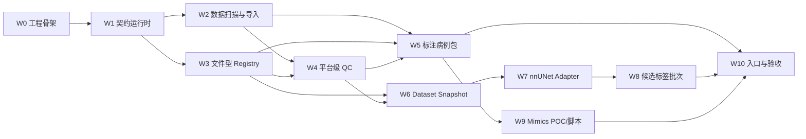

# 阶段 A 开发执行说明

> 日期：2026-06-13
> 范围：从当前仓库开始，实现可重复运行的离线闭环
> 说明：人日是单名熟悉 Python 和医学图像处理的开发者估算，不是交付承诺

## 1. 当前到底已有多少代码

| 能力 | 当前证据 | 判断 |
| --- | --- | --- |
| nnUNet 转换、预处理、训练、预测、评估 | `pipelines/nnunet/` | 可复用，但没有平台输入输出边界 |
| 病例包 v0.5 检查 | `scripts/check_case_package.py` | 已实现，代码较集中，需要后续拆分公共校验 |
| 目录传输摘要 | `scripts/hash_package.py` | 已实现，但不是 Image Artifact 文件组摘要 |
| 核心记录 Schema | `registry/schemas/` | 已有 Case、Image、Label、Snapshot；运行时校验器未实现 |
| 器官名称表 | `config/anatomy_vocabulary.yaml` | 已有基础数据，需要统一校验入口 |
| 标注工具适配器 | Mimics 双运行时、诊断、关键探针、打开/提交/收尾脚本已实现 | 真实 Mimics 21 工作站 Gate A/B/C 尚未验收 |
| nnUNet 工具适配器 | `adapters/nnunet/` 只有说明 | 未实现 |
| 候选标签生成适配器 | `adapters/label_generation/` 只有说明 | 未实现 |
| Data Registry | 只有 Schema | 未实现文件登记、查询和追加版本 |

当前不是“缺少少量胶水代码”，而是已有训练核心，平台外壳尚未实现。

## 2. 建议的代码结构

不要继续把所有逻辑堆入 `scripts/`。阶段 A 建议新增一个可安装 Python 包：

```text
pyproject.toml
src/segplatform/
  cli.py
  contracts/
    schema_loader.py
    ids.py
    hashes.py
  ingest/
    scan.py
    import_cases.py
    readers/
      dicom.py
      nifti.py
      metaimage.py
      raw.py
  registry/
    filesystem.py
    records.py
    queries.py
  qc/
    geometry.py
    labels.py
    leakage.py
    reports.py
  labeling/
    package_case.py
    submissions.py
    mask_conversion.py
  snapshots/
    create.py
    validate.py
  adapters/
    nnunet/
      export.py
      run.py
      collect.py
    label_generation/
      run_batch.py
      route.py
      candidate_to_draft.py
    mimics/
      doctor.py
      prepare.py
      launcher.py
      bridge.py
      finalize.py
tests/
  fixtures/
  unit/
  integration/
```

仓库顶层现有 `adapters/` 可以继续保存工具侧脚本和说明，例如必须在 Mimics 内部运行的 Python 3.5 脚本。平台主进程使用的现代 Python 代码放入 `src/segplatform/adapters/`，避免两个运行环境混在一起。

现有 `scripts/check_case_package.py` 第一阶段可以继续作为兼容入口，内部逐步改为调用 `segplatform.labeling` 和 `segplatform.qc`，不要求先整体重写。

## 3. 工作包、依赖和开发量

| 编号 | 工作包 | 主要代码 | 估算 | 前置 |
| --- | --- | --- | ---: | --- |
| W0 | 工程骨架 | `pyproject.toml`、CLI、日志、统一错误、测试目录 | 2-3 人日 | 无 |
| W1 | 契约运行时 | Schema 加载、ID、文件/文件组 hash、记录读写 | 3-5 人日 | W0 |
| W2 | 异构数据扫描与导入 | DICOM、NIfTI、MHD+RAW、RAW 图像及来源标签读取器和导入报告 | 7-12 人日 | W1 |
| W3 | 文件型 Data Registry | 追加记录、按 ID 查询、版本和反向引用索引 | 4-6 人日 | W1 |
| W4 | 平台级 QC | 几何、标签值、泄漏分组、可用性和结构化报告 | 6-9 人日 | W1、W2 |
| W5 | 标注病例包 | 生成病例包、mask 拆分合并、提交登记 | 5-8 人日 | W2、W3、W4 |
| W6 | Dataset Snapshot | 规则解析、标签选择、冻结划分、不可变写入 | 5-7 人日 | W3、W4 |
| W7 | nnUNet Adapter | Snapshot 导出、调用现有管线、收集模型和评估记录 | 7-11 人日 | W6 |
| W8 | 候选标签批次 | 批量推理、逐病例状态、重试、候选登记和草稿回流 | 6-9 人日 | W3、W7 |
| W9 | Mimics POC 与工具脚本 | 双运行时、能力探针、打开/提交脚本、桥接、日志和真实病例验收 | 16-29 人日 | W5 可并行 |
| W10 | 操作入口与验收 | 稳定命令、示例配置、运行手册、端到端测试 | 4-6 人日 | W5-W9 |

按表格逐项完整实现，W0-W8 加 W10、不含 Mimics 深度自动化，共约 **49-76 人日**。机械加入 W9 的区间是 **65-105 人日**，但其中病例包、QC 和真实病例验收与 W5/W10 有重叠，排期时不能重复计费。如果还需为 NIfTI/MHD 图像开发额外转换路径，再增加约 **3-8 人日**。

为了在 7 月先走通流程，3 至 5 例的最薄纵向闭环不需要一次完成每个工作包的全部通用能力。W2 先覆盖实际样例格式，W3/W4/W6-W8 先实现文件型窄版本，预计约 **24-35 人日**；闭环之后再补齐异常格式、批量恢复、完整查询和通用化。

粗略日历时间：

- 单名开发者：最薄闭环约 5-7 周，完整阶段 A 约 10-18 周；
- 两名开发者合理并行：最薄闭环约 3-5 周，完整阶段 A 约 7-12 周；
- Mimics 本机验证失败或 DICOM 异常较多时，按区间上限评估。

估算中的不确定性主要来自：

- DICOM 异常和来源目录复杂度；
- 现有 nnUNet 管线对固定目录与配置的耦合；
- Mimics 21.0 实测结果；
- 样例数据是否能及时覆盖异常情况。

## 4. 真正的执行顺序



### 第 1 步：先固定样例和验收，不先写适配器

准备：

- 3 至 5 个闭环病例；
- [数据导入契约](../architecture/data_ingestion_contract.md)中的 I01-I10 样例子集；
- 第一轮 nnUNet 任务和 `TaskLabelMap`；
- 一个完全独立的测试病例；
- 所有数据的允许用途和去标识状态。

完成标志：每个样例有预期 Case、Image Artifact、可用性和错误结果。

### 第 2 步：实现 W0 和 W1

先得到这些可运行命令：

```bash
sp --help
sp validate record path/to/record.json
sp hash file path/to/image.nii.gz
sp hash bundle path/to/dicom_or_mhd_bundle
```

完成标志：

- JSON Schema 可以真正被代码加载；
- Windows 和 Linux 对同一文件组生成相同摘要；
- 错误使用稳定错误码和可读信息，不只输出堆栈。

### 第 3 步：实现 W2 和 W3

先实现“扫描不落库”，确认后再导入：

```bash
sp ingest scan /data/source --output reports/source_scan.json
sp ingest plan /data/source package_requests/ --organs-file target_organs.txt --import-batch batch_001 --workers 8
sp package create-many package_requests/ dataset_package/ --registry registry/
sp registry rebuild-index registry/
```

完成标志：

- DICOM 多检查、多序列不会被错误合并；
- DICOM 扫描清单可以批量生成可审阅病例包请求；
- NIfTI、MHD+RAW、带 sidecar 的 RAW 及其来源标签可以登记；
- 元数据缺失被记录为 `partial` 或 `index_only`，而不是填假值；
- 重复导入同一文件不会静默创建冲突记录。

### 第 4 步：实现 W4

优先实现阻断错误：

1. 文件或文件组发生变化；
2. 图像和标签 shape 不一致；
3. spacing、origin、direction 差异无法解释；
4. 标签值不在映射中；
5. 患者级划分重叠；
6. 数据用途禁止当前操作。

完成标志：每项错误都有机器可读 `code`、对象 ID、证据和建议动作。

### 第 5 步：实现 W5，同时开展 W9

平台侧先支持 NIfTI 原生标注工具，不等待 Mimics：

```bash
sp labeling package --case case_001 --review review_001
sp labeling check package/path
sp labeling submit package/path/submissions/review_001
```

Mimics 按 [适配器设计与开发流程](../domains/labeling/mimics_adapter_design.md) 并行推进：先写工作站诊断和能力探针，Gate A 通过后再实现生产用 `prepare/open/submit/finalize`。双运行时是明确的代码隔离边界；逐器官文件桥只在初始标签或提交格式需要时启用。

完成标志：

- 保存进度不会创建 verified 标签；
- 提交完成、提交复查和阻塞可以区分；
- 提交结果通过 QC 后追加 Label Artifact；
- 旧标签不被覆盖。

### 第 6 步：实现 W6

```bash
sp snapshot create snapshot_request.yaml
sp snapshot validate registry/snapshots/snap_001.json
```

完成标志：

- 快照冻结 `image_id`、`label_id`、hash、split、leakage group、准入结果和预处理意图；
- 相同输入可生成内容等价的快照；
- 标签后续修订不改变旧快照；
- 低可信度患者关联不能进入正式独立测试集。

### 第 7 步：实现 W7

```bash
sp nnunet export snap_001 --output runs/export_001
sp nnunet train runs/export_001 --config config/CT5_Liver.toml
sp nnunet evaluate model_001 --snapshot snap_eval_001
```

完成标志：

- 不手工整理 `imagesTr`、`labelsTr`；
- 缺失标签不会静默变成背景；
- `dataset.json` 不再使用写死的名称和许可；
- Model Record 和 Evaluation Record 能反查快照、代码和配置。

### 第 8 步：实现 W8 和 W10

```bash
sp generate run generation_job.yaml
sp generate retry job_001 --failed-only
sp labeling draft --from-job job_001
sp demo run examples/first_loop.yaml
```

完成标志：

- 一个病例失败不丢失其他结果；
- 重试不覆盖已成功结果；
- 所有输出保持候选标签状态和生成血统；
- 新开发者能按文档完成一次闭环。

## 5. 可以并行的工作

| 工作线 | 可以何时开始 | 不能越过的边界 |
| --- | --- | --- |
| 数据导入与 Registry | W1 后 | 不能自行发明另一套记录字段 |
| nnUNet Adapter 预研 | Snapshot 固定一份测试 fixture 后 | 不能直接把临时目录当正式输入契约 |
| Mimics POC | 病例包和几何检查规则明确后 | 不能把未实测 API 写成既定能力 |
| 候选批次设计 | Model Record fixture 可用后 | 不能绕过来源和逐病例运行状态 |
| 文档与示例 | 每个命令稳定后立即更新 | 不能提前把待实现命令写成已存在 |

两名开发者的合理分工：

- 开发者 A：W0-W4、W6；
- 开发者 B：W5、W7、W9；
- W8 和 W10 在前面接口稳定后合并完成。

## 6. 每个工作包的完成证据

每个工作包必须同时具备：

1. 代码和命令入口；
2. 至少一个成功 fixture；
3. 至少一个失败 fixture；
4. 单元测试；
5. 与真实小病例的集成测试；
6. 结构化运行报告；
7. README 中的输入、输出和限制；
8. 不覆盖已有记录的重复运行测试。

只写类或函数、没有可重复命令和 fixture，不算完成。

## 7. 现在开始前仍缺什么

### 必须由项目提供的外部条件

| 缺项 | 不解决的影响 |
| --- | --- |
| 3 至 5 个完成去标识检查的真实小病例 | 只能证明脚本处理理想数据 |
| 至少一组多序列 DICOM | 无法验证 Case 和 Image Artifact 映射 |
| NIfTI、MHD+RAW 和不完整元数据样例 | 无法验证异构入口 |
| 第一轮 nnUNet 任务 | 无法固定 Snapshot 和 Adapter 验收 |
| Mimics 21.0 机器、edition、许可和 scripting 权限 | 只能继续设计，不能确认工具能力 |
| 训练环境和数据传输路径 | 无法完成真实闭环 |

### 已经可以在架构层直接确定

- 原始数据不覆盖；
- 不强制所有来源在导入时转为 NIfTI；
- 一个三维体素网格对应一个 Image Artifact；
- MHD+RAW 和 DICOM 作为文件组计算稳定摘要；
- 缺失元数据显式记录，不填假值；
- 标注、训练和评估分别判断可用性；
- 格式转换和重采样创建派生 Image Artifact；
- 患者关联可信度不足时阻止正式独立评估。

### 开工第一周需要固定的工程参数

1. 平台主 Python 版本和依赖锁定方式；
2. registry 文件目录和运行输出目录；
3. Windows 与 Linux 路径映射方式；
4. 文件组摘要算法版本；
5. 结构化错误报告格式；
6. 第一批命令名是否统一使用 `sp`。

这些是实现参数，不需要再改变总体架构。

## 8. 第一批提交建议

按提交顺序控制变更规模：

1. `build: add segplatform package and test skeleton`
2. `feat: validate registry records and stable hashes`
3. `feat: scan nifti and metaimage sources`
4. `feat: scan and group dicom series`
5. `feat: import cases and image artifacts`
6. `feat: add geometry and label qc reports`
7. `feat: generate and submit labeling packages`
8. `feat: create immutable dataset snapshots`
9. `feat: export snapshots to nnunet`
10. `feat: register models and batch candidate generation`

每个提交都应能独立运行测试，不把整个闭环压成一次不可审查的大改动。
