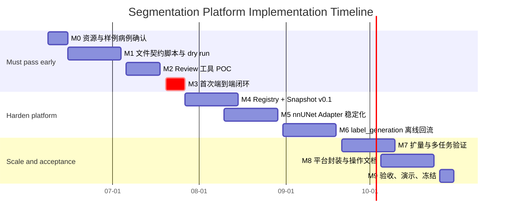

# 分割平台实施计划（截至 2026-10-30）

> 日期：2026-06-08  
> 范围：离线批量分割平台 v0.1 -> v1.0  
> 目标日期：2026-10-30  
> 状态：执行主计划。架构设计仍以 `docs/architecture/platform_blueprint.md` 为准；近期脚本清单见 `docs/plans/implementation_backlog.md`。

## 1. 总目标

2026-10-30 前要搭好的不是一个完整 Web 平台，而是一套可重复运行的离线分割平台：

1. 能把病例和标签打成 Case Package。
2. 能通过 Mimics 或兜底工具完成 review。
3. 能把导回标签登记为 `verified_label` 或其他明确状态。
4. 能按任务生成 Dataset Snapshot。
5. 能导出到现有 nnUNet 管线并完成训练、推理、评估。
6. 能把模型输出登记为 `candidate_label`，再进入下一轮 `draft_label` 或 `accepted_pseudo_label`。

最关键的原则：**流程首次走通不能等到 10 月 30 日。**

10 月 30 日是稳定交付日期；首次闭环必须在 2026-07-24 前完成，理想时间是 2026-07-17。

## 2. 交付物定义

### 2.1 10 月 30 日交付物

| 交付物 | 完成标准 |
| --- | --- |
| 文件阶段工具链 | `package_case`、`check_case_package`、`split`、`merge`、`check_geometry`、`hash` 可在 3-5 个样例和扩展病例上重复运行 |
| 标注适配 | Mimics Adapter 至少完成 POC；若 Mimics 不可控，必须完成 3D Slicer 或 ITK-SNAP 兜底路径 |
| 最小 Registry | 能记录 Case、Image Artifact、Label Artifact、provenance、QC 报告和 hash |
| Dataset Snapshot | 能按任务冻结病例、标签状态、任务 label map 和训练配置 |
| nnUNet Adapter | 能从 Dataset Snapshot 导出到现有 `pipelines/nnunet/` 可消费格式 |
| label_generation 离线流程 | 能跑批量推理，输出 `candidate_label`、QC 报告，并生成下一轮 `draft_label` |
| 运行文档 | 新人能按文档完成一次从病例包到训练再到候选标签回流的流程 |

### 2.2 不作为 10 月 30 日强制交付

| 暂不强制 | 原因 |
| --- | --- |
| 完整 Web UI | 数据契约和离线流程应先稳定 |
| 复杂任务队列和调度系统 | 第一阶段手动或脚本化批处理足够 |
| FewShot 正式生产 Adapter | 需要冻结评估集和生产级实验协议 |
| MONAI / SAM 正式接入 | nnUNet + review 闭环优先 |
| 正式模型发布评估体系 | 会议已确认现在讨论过早 |

## 3. 总体节奏



## 4. 里程碑计划

| 阶段 | 日期 | 目标 | 必须产出 | Check |
| --- | --- | --- | --- | --- |
| M0 | 2026-06-08 -> 2026-06-14 | 启动与阻塞项确认 | 3-5 个样例病例、Mimics 版本/许可证结论、训练服务器路径、第一版配置 | 没有样例病例或 Mimics 信息时，后续 POC 不启动 |
| M1 | 2026-06-15 -> 2026-07-03 | 文件契约 dry run | 通用脚本、Case Package v0.1、preflight report、geometry report。期间并行完成 3D Slicer 最小验证 | 不依赖 Mimics，也能把病例包生成和校验跑通 |
| M2 | 2026-07-06 -> 2026-07-17 | Review 工具 POC | Mimics 导入/导出记录，或兜底工具路径 | 2026-07-17 前如果 Mimics 仍不可控，切换兜底方案 |
| M3 | 2026-07-20 -> 2026-07-26 | 首次端到端闭环 | 3-5 病例完成 `Case Package -> Review -> verified_label -> Snapshot -> nnUNet train/predict -> draft_label` | 这是第一个硬验收点，不能后移到 8 月 |
| M4 | 2026-07-27 -> 2026-08-14 | Registry + Snapshot v0.1 | 最小 registry、snapshot manifest、label_policy 草案 | 任意训练结果可追溯到病例、标签、状态和任务 map |
| M5 | 2026-08-10 -> 2026-08-28 | nnUNet Adapter 稳定化 | Snapshot -> nnUNet 导出脚本、训练记录、评估记录 | 不手工改训练目录也能复现一次训练 |
| M6 | 2026-08-31 -> 2026-09-18 | label_generation 离线回流 | 批量推理入口、candidate package、QC routing | 模型输出能进入 `candidate_label -> draft_label / accepted_pseudo_label / rejected_label` |
| M7 | 2026-09-21 -> 2026-10-09 | 扩量与多任务验证 | 更多病例、多任务快照、失败案例记录 | 至少 2 个训练任务完成同一套数据的不同 Snapshot |
| M8 | 2026-10-05 -> 2026-10-23 | 平台封装与操作文档 | CLI 或脚本入口、运行手册、目录规范、错误处理说明 | 新人按文档能独立跑完一次流程 |
| M9 | 2026-10-26 -> 2026-10-30 | 验收冻结 | demo 数据、验收报告、未解决问题清单 | 10 月 30 日前冻结 v1.0 离线流程 |

## 5. 首次闭环的硬定义

首次闭环不是“脚本都写了”，而是下面 10 个检查全部通过：

| # | 检查项 | 通过标准 |
|:--:| --- | --- |
| 1 | 样例病例 | 至少 3 个病例，最好 5 个；包含无标签、有草稿、部分标签、空间边界不同的情况 |
| 2 | Case Package | 每个病例可生成包，manifest、image、label、config、reports、provenance 结构完整 |
| 3 | package preflight | `check_case_package.py` 无 Error；Warning 必须写入报告 |
| 4 | hash | 包级 hash 可生成，导回前后能识别文件变化 |
| 5 | review 导入 | Mimics 或兜底工具能打开 CT 和逐器官 mask |
| 6 | review 导出 | 修正后标签能导回 `verified_label.nii.gz` 或逐器官 masks |
| 7 | 几何检查 | shape 必须一致；spacing/origin/direction/affine 不一致必须有修复或拒绝记录 |
| 8 | Snapshot | 能冻结病例、标签状态、任务 label map 和训练配置 |
| 9 | nnUNet 小训练 | 至少一个小任务完成数据转换、训练或快速训练、推理 |
| 10 | 第二轮草稿 | 新模型预测能登记为 `candidate_label`，并生成下一轮 `draft_label` |

如果 2026-07-24 前第 9 或第 10 项无法完成，项目应判定为“流程未走通”，不能继续堆 UI 或更多 Adapter。

## 6. 分域实现步骤

### 6.1 labeling 域

实现目标：能把病例交给人 review，再安全导回平台。

| 顺序 | 步骤 | 实现位置 | Check |
|:--:| --- | --- | --- |
| L1 | 补齐 `package_case.py` | `scripts/` | 输入 CT、可选标签和 config 后生成 Case Package |
| L2 | 补齐 `split_multilabel_to_masks.py` | `scripts/` | 多标签 NIfTI 可拆为 `masks/{organ}.nii.gz` |
| L3 | 补齐 `merge_masks_to_multilabel.py` | `scripts/` | 逐器官 mask 可按 `review_label_map.yaml` 合并 |
| L4 | 补齐 `check_geometry.py` | `scripts/` | shape 不一致直接 Error；affine 类问题有 Warning/修复记录 |
| L5 | Mimics 手动 POC | `adapters/mimics/` | 能人工导入、修正、导出至少一个病例 |
| L6 | Mimics 脚本化 POC | `adapters/mimics/import_case_package.py` / `export_review_package.py` | 能减少重复 GUI 操作；若 API 受限，记录不能自动化的步骤 |
| L7 | 标注员操作说明 | `adapters/mimics/README_for_annotators.md` | 标注员知道打开什么、改什么、保存什么、不能改什么 |

### 6.2 training 域

实现目标：不重写 nnUNet 核心，但让平台能稳定生成训练输入。

| 顺序 | 步骤 | 实现位置 | Check |
|:--:| --- | --- | --- |
| T1 | 定义 Dataset Snapshot manifest | `docs/domains/training/` + 后续实现目录 | 包含病例、标签状态、task label map、split、hash |
| T2 | 实现 Snapshot -> nnUNet 导出 | `adapters/nnunet/` | 生成现有 `pipelines/nnunet/` 可消费目录 |
| T3 | 复用现有 nnUNet 五阶段 | `pipelines/nnunet/` | convert/preprocess/train/predict/evaluate 至少跑通一次 |
| T4 | 记录 Model Record | 后续 registry 目录 | 模型能追溯到 Snapshot、任务、配置、指标 |
| T5 | 多任务复用验证 | `adapters/nnunet/` | 同一病例可进入两个不同任务 Snapshot，label id 不冲突 |

### 6.3 label_generation 域

实现目标：把模型输出当作候选标签治理，而不是直接当真值。

| 顺序 | 步骤 | 实现位置 | Check |
|:--:| --- | --- | --- |
| G1 | 定义 candidate package | `docs/domains/label_generation/` | 包含来源模型、输入图像、预测标签、QC 报告 |
| G2 | 批量推理入口 | `adapters/label_generation/` | 可对病例列表生成 `candidate_label` |
| G3 | QC routing | `adapters/label_generation/` | 输出进入 `draft_label`、`accepted_pseudo_label` 或 `rejected_label` |
| G4 | 第二轮 Case Package | `scripts/` + `adapters/label_generation/` | candidate 可转成下一轮 review 的 draft |
| G5 | policy 记录 | 后续 registry 目录 | `allow_status`、`trusted_sources` 不丢失 |

## 7. 每周检查节奏

每周五做一次 30-60 分钟检查，不讨论新想法，先检查交付物。

| 检查问题 | 判断 |
| --- | --- |
| 本周有没有新增可运行命令？ | 没有则说明进度可能停在文档或讨论 |
| 有没有新增可以复现的输入和输出样例？ | 没有样例就无法判断流程是否真实 |
| 有没有新的 Error/Warning 报告？ | 没有报告通常意味着还没跑到失败边界 |
| 本周是否推进了首次闭环 10 项检查？ | 不推进闭环的工作要谨慎 |
| 是否出现 Mimics、服务器、数据权限阻塞？ | 阻塞超过一周必须降级或替代 |

每两周做一次里程碑检查：

1. 对照第 4 节里程碑表。
2. 更新完成、延迟、阻塞。
3. 给出下一阶段是否继续、降级或砍范围。

## 8. 风险和降级策略

| 风险 | 截止判断日期 | 降级策略 |
| --- | --- | --- |
| Mimics 许可证或脚本能力无法确认 | 2026-07-17 | 切换 3D Slicer / ITK-SNAP 作为 review 兜底工具 |
| Mimics 导出 shape 不一致 | 第一次导出当天 | 不修复，直接判定导出方式不可用，换导出路径或工具 |
| affine/spacing/origin 不一致 | 第一次导出当天 | shape 一致时尝试复制图像几何头并抽检；否则拒绝 |
| 训练服务器不可用 | 2026-07-10 | 用小病例和本地/临时 GPU 跑最小训练；服务器后补 |
| 样例病例迟迟不到位 | 2026-06-14 | 用公开或历史小样例先验证脚本结构，但不得替代真实验收 |
| 任务范围过大导致闭环延迟 | 2026-07-05 | 首次闭环只选一个小任务，不等待 v500 全范围 |
| 文档继续变但代码不动 | 任意周五检查 | 下周目标必须绑定一个可运行命令或样例输出 |

## 9. 最小运行命令清单

下面不是最终命令格式，而是 10 月 30 日前平台应具备的操作能力（标注了对应的里程碑阶段）：

```bash
# M1: 1. 生成病例包
python scripts/package_case.py --image case_001.nii.gz --label draft.nii.gz --out packages/case_001

# M1: 2. 预检查
python scripts/check_case_package.py packages/case_001
python scripts/check_geometry.py packages/case_001/images/image.nii.gz packages/case_001/labels/draft_label.nii.gz

# M1: 3. 拆分和合并
python scripts/split_multilabel_to_masks.py --label draft_label.nii.gz --map review_label_map.yaml --out masks/
python scripts/merge_masks_to_multilabel.py --masks masks/ --map review_label_map.yaml --out verified_label.nii.gz

# M4-M5: 4. 生成训练快照（M4+）
python scripts/create_dataset_snapshot.py --task CT5_Liver --cases registry/cases.json --out snapshots/CT5_Liver_001

# M5: 5. 导出 nnUNet 数据（M5）
python adapters/nnunet/export_snapshot.py --snapshot snapshots/CT5_Liver_001 --out nnunet_raw/DatasetXXX

# M3-M5: 6. 训练和推理（M3 手动复现现有管线，M5 适配器化）
python pipelines/nnunet/<existing_entry>.py --config Config_CT_v500.toml --task CT5_Liver

# M6: 7. 候选标签回流（M6）
python adapters/label_generation/run_batch_inference.py --model models/model_001 --cases cases_to_predict.txt --out candidates/
python adapters/label_generation/route_candidates.py --candidates candidates/ --policy label_policy.yaml --out review_queue/
```

如果一个命令暂时做不到，也要在对应阶段产出等价的手动步骤和记录文件。

## 10. 10 月 30 日验收清单

| # | 验收项 | 通过标准 |
|:--:| --- | --- |
| 1 | 端到端流程 | 至少一次完整闭环可从零复现 |
| 2 | 数据可追溯 | 任意训练标签能追溯来源、状态、hash、QC |
| 3 | 任务可复用 | 同一病例可进入至少两个任务 Snapshot |
| 4 | 模型可追溯 | 任意模型能追溯 Dataset Snapshot、训练配置和评估结果 |
| 5 | 候选标签可治理 | 模型输出不会直接混成真值，必须有状态和 policy |
| 6 | Review 工具有兜底 | Mimics 不可用时仍有可操作替代路径 |
| 7 | 新人可运行 | 按文档和样例命令能完成一次流程 |
| 8 | 风险清单明确 | 未完成项、技术债和后续范围清楚记录 |

## 11. 与近期 Backlog 的关系

`implementation_backlog.md` 继续作为近期任务清单使用，主要服务 M0-M3。本文负责从 2026-06-08 到 2026-10-30 的总体节奏、阶段验收和降级策略。

当两者冲突时：

1. 架构边界以 `platform_blueprint.md` 为准。
2. 日期和里程碑以本文为准。
3. 具体脚本任务以 `implementation_backlog.md` 为准，但不能突破本文的硬验收点。
