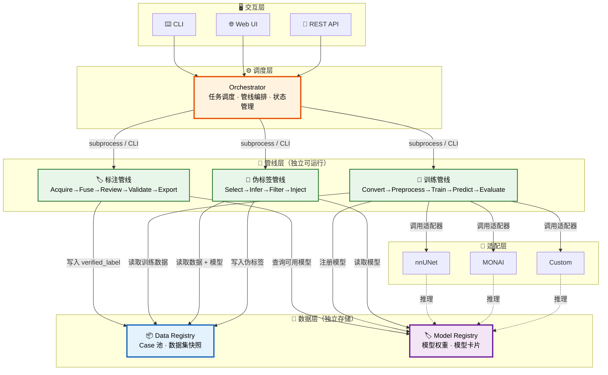
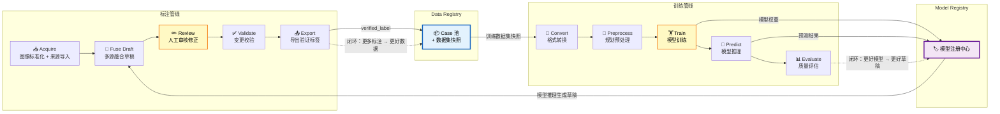
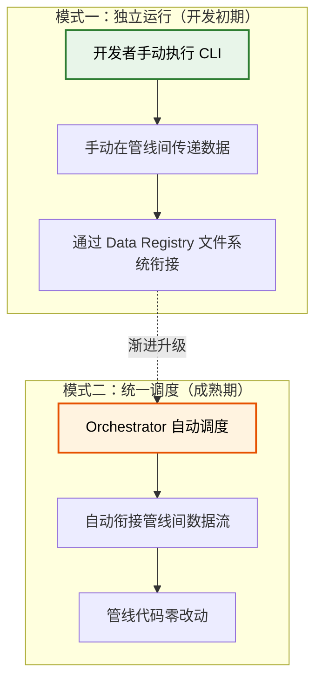
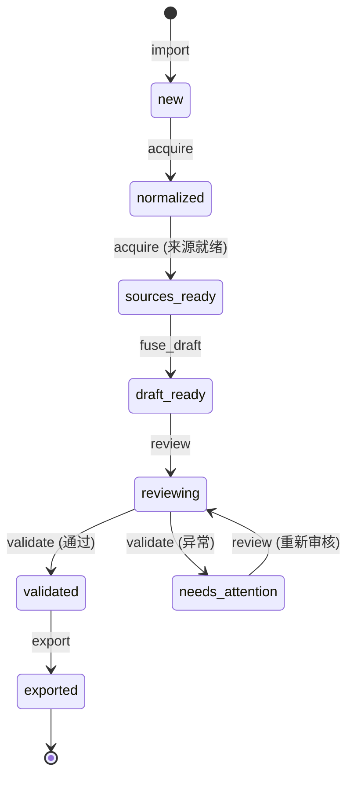
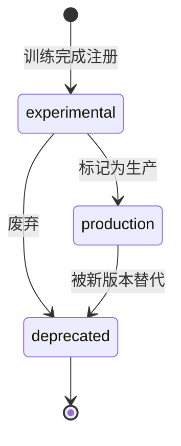
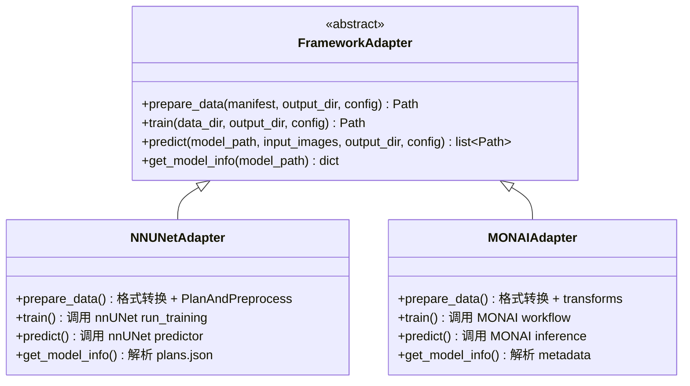
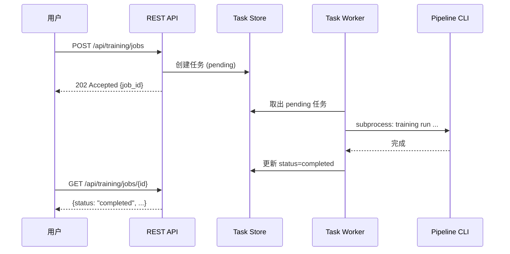
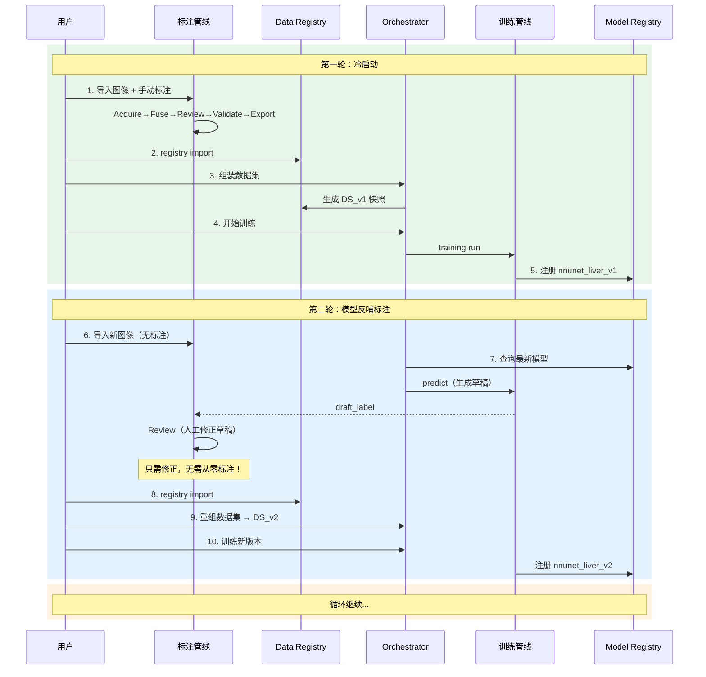
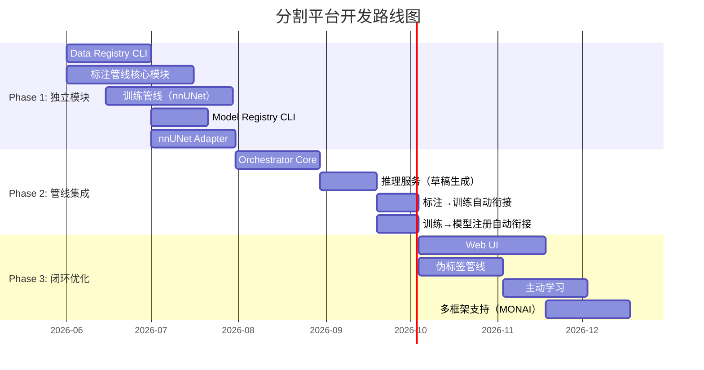

# 分割平台蓝图设计文档

> 版本：v0.2  
> 日期：2026-06-04  
> 状态：设计阶段

---

## 1. 愿景与目标

构建一个支持 **标注 → 训练 → 伪标签生成循环迭代** 的医学图像分割平台，实现"边标边训，越标越好，越训越好"。

### 1.1 核心目标

| 目标 | 说明 |
|---|---|
| 闭环迭代 | 标注结果驱动训练，训练模型反哺标注，形成正向循环 |
| 独立可运行 | 各模块可独立开发、独立运行，不依赖 Orchestrator |
| 统一可调度 | 成熟后通过 Orchestrator 实现自动化闭环调度 |
| 框架可替换 | 训练框架（nnUNet/MONAI/自定义）可插拔切换 |
| 数据可追溯 | 每条数据、每个模型有完整血缘记录 |

### 1.2 设计原则

1. **数据契约解耦**：管线之间通过文件系统 + 标准格式通信，不产生代码级依赖
2. **管线自包含**：每条管线是独立的 Python 包，有独立 CLI，可单独安装和运行
3. **注册中心为枢纽**：Data Registry 和 Model Registry 是管线间唯一的耦合点
4. **Orchestrator 是调度者，不是依赖**：Orchestrator 通过调用管线 CLI 实现调度，管线不依赖 Orchestrator
5. **Copy 语义保证不可变**：数据集快照使用 copy，确保实验可复现

---

## 2. 架构总览

### 2.1 分层架构

平台采用 **五层架构**，自上而下依次为交互层、调度层、管线层、适配层、数据层：



### 2.2 闭环数据流

平台的核心价值在于 **标注与训练的闭环**。下图展示数据如何在管线间流转：



**闭环核心**：
- **正向路径**：标注 → Data Registry → 训练 → Model Registry（更多标注数据 → 更好的模型）
- **反馈路径**：Model Registry → 标注管线 Fuse Draft（更好的模型 → 更好的草稿 → 减少标注工作量）

### 2.3 两种运行模式

平台支持渐进式集成——开发初期各管线独立运行，成熟后统一调度：



| 对比 | 独立运行 | 统一调度 |
|---|---|---|
| 触发方式 | 开发者手动执行 CLI | Orchestrator 自动调度 |
| 管线衔接 | 手动 import / register | 自动衔接 |
| 管线代码改动 | 无 | 无 |
| 适用阶段 | 开发初期、调试 | 生产环境、批量任务 |

### 2.4 管线独立性保证

| 机制 | 说明 |
|---|---|
| 独立 Python 包 | 每条管线有独立的 `pyproject.toml`，可单独 `pip install` |
| 独立 CLI | 每条管线有独立命令行入口（`annotation`、`training`、`pseudo`） |
| 数据契约 | 管线间通过 Data Registry 的文件格式通信，不 import 对方代码 |
| 配置自足 | 每条管线有独立配置文件，不依赖 Orchestrator 的配置 |
| 可被调度 | CLI 参数设计兼容 Orchestrator 的调用方式（支持 `--json-output` 等） |

---

## 3. 数据注册中心（Data Registry）

### 3.1 职责

- 存储所有 case 的图像、标签和元数据
- 支持按条件查询 case
- 生成不可变的数据集快照（copy 语义）
- 记录完整的数据血缘

### 3.2 存储结构

运行时数据与代码仓库分离，实际路径在 `platform.yaml` 中配置。

```text
${DATA_ROOT}/
├── cases/
│   └── {case_id}/
│       ├── ct.nii.gz                 # 标准化图像（RAS 方向）
│       ├── verified_label.nii.gz     # 人工验证标签（最高真值）
│       ├── draft_label.nii.gz        # 自动融合草稿
│       ├── metadata.json             # 状态、历史、来源记录
│       └── sources/                  # 各来源标签
│           ├── manual/
│           ├── totalsegmentator/
│           └── {model_id}/
│
├── datasets/                         # 数据集快照（copy，不可变）
│   └── {dataset_id}/
│       ├── manifest.json             # 数据集清单 + train/val/test 划分
│       ├── organ_config.yaml         # 器官配置快照
│       └── cases/                    # copy 的 case 数据
│
└── registry.db                       # SQLite 索引数据库
```

### 3.3 Case 状态机



### 3.4 核心数据结构

| 文件 | 作用 | 关键字段 |
|---|---|---|
| `metadata.json` | 记录 case 的状态、图像信息、处理历史和来源 | `case_id`, `status`, `image{spacing,shape,orientation}`, `history[]`, `organs_present` |
| `manifest.json` | 数据集快照的清单、查询条件、划分和统计 | `dataset_id`, `query`, `split{train,val,test}`, `split_method`, `statistics` |

**划分规则**：创建时按比例自动随机划分（固定 seed），结果记录在 manifest 中；用户可手动编辑 split 字段调整。

### 3.5 CLI 接口

```bash
registry import --source /path/to/export          # 导入标注结果
registry list --status exported --organ liver      # 查询 case
registry info --case case_001                      # case 详情
registry dataset create --name v1 --query "..."    # 创建数据集快照
registry dataset list                              # 列出数据集
registry dataset split --id DS_v1 ...              # 修改划分
```

---

## 4. 模型注册中心（Model Registry）

### 4.1 职责

- 管理所有训练产出的模型
- 记录模型的训练数据来源、评估指标、支持器官
- 提供模型查询接口（按器官、按框架、按版本）
- 支持模型状态管理

### 4.2 存储结构

```text
${MODEL_ROOT}/
├── models/
│   └── {model_id}/
│       ├── model_files/              # 框架特有的模型文件
│       └── model_card.json           # 模型元数据
│
└── registry.db                       # SQLite 索引数据库
```

### 4.3 模型状态流转



### 4.4 核心数据结构

| 文件 | 作用 | 关键字段 |
|---|---|---|
| `model_card.json` | 模型的元数据卡片，记录来源、能力、评估结果 | `model_id`, `framework`, `trained_on`, `organs[]`, `evaluation{metrics}`, `status`, `lineage` |

### 4.5 CLI 接口

```bash
model register --path /path/to/model --framework nnunet --dataset DS_v1
model list --organ liver --status production
model info --id nnunet_liver_v1
model update --id nnunet_liver_v1 --status production
model evaluate --id nnunet_liver_v1 --dataset DS_v2
```

---

## 5. 标注管线

### 5.1 管线阶段


| 阶段 | 输入 | 输出 | 人工参与 |
|---|---|---|---|
| Acquire | 原始图像 + 来源标签 | `ct.nii.gz` + `sources/` | 否 |
| Fuse Draft | `ct.nii.gz` + `sources/` + `organ_config.yaml` | `draft_label.nii.gz` | 否 |
| Review | `ct.nii.gz` + `draft_label.nii.gz` | `verified_label.nii.gz` | **是** |
| Validate | `draft_label` + `verified_label` | 校验报告 | 否 |
| Export | `verified_label.nii.gz` | 导出目录 | 否 |

### 5.2 与平台集成

**模型草稿生成**——标注管线需要调用模型生成 draft_label：

- **独立运行模式**：通过 `--draft-model` 参数手动指定模型路径
- **统一调度模式**：Orchestrator 自动查询 Model Registry，调用 Framework Adapter 推理，将结果传入标注管线

**标注结果注册**——标注管线 Export 后，通过 Data Registry CLI 注册：

- **独立运行模式**：手动执行 `registry import`
- **统一调度模式**：Orchestrator 自动调用

### 5.3 CLI 接口

```bash
annotation run --input /raw_data --output /export --organ-config abdomen.yaml
annotation acquire / fuse-draft / review / validate / export  # 单阶段
annotation batch --input list.csv --output /export             # 批量
```

---

## 6. 训练管线

### 6.1 管线阶段


| 阶段 | 对应原有模块 | 输入 | 输出 |
|---|---|---|---|
| Convert | Action1_ConvertLabeledToTrainData | 数据集快照 | 框架格式数据 |
| Preprocess | Action2_PlanAndPreprocess | 框架格式数据 | 预处理数据 + plans |
| Train | Action3_Train | 预处理数据 + 配置 | 模型 checkpoint |
| Predict | Action4_Predict | 模型 + 输入图像 | 预测结果 |
| Evaluate | Action5_Evaluation | 预测结果 + 真值 | 评估报告 |

### 6.2 与平台集成

- **数据获取**：从 Data Registry 数据集快照读取，通过 Framework Adapter 转换为框架格式
- **模型注册**：训练完成后注册到 Model Registry（手动或自动）
- **训练策略**：默认从头训练；增量训练作为高级选项，由用户显式指定

### 6.3 CLI 接口

```bash
training run --dataset DS_v1 --framework nnunet --config CT_default.toml
training convert / preprocess / train / predict / evaluate  # 单阶段
training run --dataset DS_v1 --framework nnunet --gpu 0,1   # 指定 GPU
```

---

## 7. 伪标签管线（预留）

### 7.1 管线阶段


| 阶段 | 职责 |
|---|---|
| Candidate Selection | 从 Data Registry 筛选无/弱标注 case |
| Inference | 调用 Framework Adapter 批量推理 |
| Quality Filter | 基于置信度/不确定性筛选高质量伪标签 |
| Label Injection | 高质量伪标签注册到 Data Registry；低质量伪标签作为 draft_label 进入标注管线 |

### 7.2 CLI 接口（预留）

```bash
pseudo generate --model nnunet_liver_v1 --cases case_021~050
pseudo filter --threshold 0.9
pseudo inject --registry
```

---

## 8. 框架适配层（Framework Adapters）

### 8.1 设计目标

- 统一不同训练框架的调用接口
- 框架相关逻辑隔离在各自目录中
- 新增框架只需实现接口，不修改已有代码

### 8.2 目录结构

```text
frameworks/
├── _base/
│   └── adapter_interface.py        # FrameworkAdapter 抽象基类
├── nnunet/
│   ├── adapter.py                  # 实现 FrameworkAdapter
│   ├── converter.py                # Data Registry → nnUNet 格式
│   └── config_schema.toml          # 框架特有配置模板
├── monai/
│   └── ...
└── custom/
    └── ...
```

### 8.3 FrameworkAdapter 接口



| 方法 | 职责 | 说明 |
|---|---|---|
| `prepare_data()` | 将数据集快照转为框架格式 | nnUNet 含 PlanAndPreprocess，其他框架可能只是格式转换 |
| `train()` | 执行训练 | 各框架训练逻辑不同，接口统一 |
| `predict()` | 执行推理 | 推理优化策略（TTA、sliding window）由适配器内部处理 |
| `get_model_info()` | 返回模型元数据 | 用于自动生成 model_card |

**关键设计决策**：接口统一，但内部实现深度不同。调用方不需要关心框架差异。

---

## 9. Orchestrator

### 9.1 职责

- 提供统一的交互入口（CLI / Web UI / REST API）
- 调度管线执行（通过 subprocess 调用管线 CLI）
- 管理异步任务（训练、推理等长时间运行任务）
- 自动衔接管线间的数据流

### 9.2 架构

```text
orchestrator/
├── core/           # FastAPI 应用、全局配置、任务调度
├── services/       # 业务逻辑：数据/模型/标注/训练/推理服务
├── api/routes/     # REST API 路由
├── cli/            # Typer CLI 入口
└── workers/        # 后台任务执行器
```

### 9.3 任务异步执行

训练和推理是长时间运行的任务，采用异步执行模式：



**MVP 实现**：`concurrent.futures` + JSON 文件持久化。后续可升级为 Celery + Redis。

### 9.4 管线调用方式

Orchestrator 通过 **subprocess 调用管线 CLI**，而非 import 管线代码：

```python
# Orchestrator 调度训练的伪代码
result = subprocess.run(["training", "run", "--dataset", "DS_v1", "--json-output"])
```

**优势**：
- 管线进程隔离，崩溃不影响 Orchestrator
- 管线可以有自己的 Python 环境（不同框架可能依赖不同版本）
- 管线代码零改动即可被调度

### 9.5 CLI 接口

```bash
# 数据管理
orchestrator registry import / list / dataset create

# 模型管理
orchestrator model list / evaluate

# 任务管理
orchestrator training submit / status / cancel
orchestrator inference submit / status
orchestrator annotation submit / status

# 服务启动
orchestrator serve --host 0.0.0.0 --port 8000
```

---

## 10. 闭环流程

### 10.1 完整闭环时序



### 10.2 数据血缘追踪

每一步操作都有完整的血缘记录，可追溯从原始图像到最终模型的完整链路：

```text
原始图像 → 标注 → verified_label → Data Registry → Dataset DS_v1
  → 训练 → nnunet_liver_v1 → Model Registry
  → 推理 → draft_label → Review → verified_label → Data Registry
  → Dataset DS_v2 → 训练 → nnunet_liver_v2 → ...
```

---

## 11. 项目目录结构

### 11.1 代码仓库

```text
SegmentationPlatform/
│
├── orchestrator/                        # 平台调度服务
│   ├── core/                            # FastAPI 应用、配置、调度
│   ├── services/                        # 业务逻辑封装
│   ├── api/routes/                      # REST API 路由
│   ├── cli/                             # Typer CLI 入口
│   └── workers/                         # 后台任务执行器
│
├── pipelines/                           # 三条管线（独立 Python 包）
│   ├── annotation/                      # 标注管线 segplat-annotation
│   │   └── segplat_annotation/          # acquire, fuse_draft, review, validate, export, cli
│   ├── training/                        # 训练管线 segplat-training
│   │   └── segplat_training/            # convert, preprocess, train, predict, evaluate, cli
│   └── pseudo_label/                    # 伪标签管线 segplat-pseudo（预留）
│       └── segplat_pseudo/              # candidate_selection, quality_filter, label_injection, cli
│
├── frameworks/                          # 框架适配器
│   ├── _base/                           # FrameworkAdapter 抽象基类
│   ├── nnunet/                          # nnUNet 适配器
│   ├── monai/                           # MONAI 适配器
│   └── custom/                          # 自定义框架
│
├── data_registry/                       # Data Registry 独立包
│   └── segplat_data_registry/           # registry, query, snapshot, cli, db
│
├── model_registry/                      # Model Registry 独立包
│   └── segplat_model_registry/          # registry, model_card, cli, db
│
├── configs/                             # 全局配置
│   ├── platform.yaml                    # 平台级配置
│   ├── organ_configs/                   # 器官配置
│   └── training_configs/               # 训练配置模板
│
├── docs/                                # 文档
└── scripts/                             # 运维脚本
```

### 11.2 运行时数据目录（独立于代码仓库）

```text
${DATA_ROOT}/                            # 在 platform.yaml 中配置
├── data_registry/
│   ├── cases/                           # Case 池
│   └── datasets/                        # 数据集快照
├── model_registry/
│   └── models/                          # 模型文件
└── workspace/                           # 各管线临时工作目录
```

### 11.3 platform.yaml 配置

```yaml
platform:
  name: SegmentationPlatform
  version: "0.1"

paths:
  data_root: "/data/segmentation_platform"
  model_root: "/data/segmentation_platform/model_registry"
  workspace: "/data/segmentation_platform/workspace"

server:
  host: "0.0.0.0"
  port: 8000

defaults:
  framework: nnunet

snapshot:
  method: copy
  split_ratio: {train: 0.7, val: 0.15, test: 0.15}
  split_seed: 42

training:
  default_strategy: from_scratch
```

---

## 12. 开发路线图



| Phase | 目标 | 核心交付 |
|---|---|---|
| **Phase 1** | 各模块独立可用 | Data Registry + 标注管线 + 训练管线 + Model Registry + nnUNet Adapter |
| **Phase 2** | Orchestrator 自动衔接 | 调度服务 + 推理服务 + 标注↔训练自动衔接 |
| **Phase 3** | 完整闭环 + 扩展 | Web UI + 伪标签管线 + 主动学习 + 多框架 |

---

## 13. 关键设计决策汇总

| # | 决策点 | 选择 | 理由 |
|---|---|---|---|
| 1 | Data Registry 粒度 | Case 池 + 动态查询 + 快照导出 | 兼顾灵活性和可复现性 |
| 2 | 伪标签质量控制 | 暂搁 | 先聚焦标注-训练闭环 |
| 3 | 框架组织方式 | 各自文件夹 + 统一 FrameworkAdapter 接口 | 隔离框架细节，统一调用方式 |
| 4 | 训练触发方式 | 用户触发 | 最简单可控，后续可扩展 |
| 5 | 快照存储方式 | Copy | 不可变、可复现 |
| 6 | 数据集划分 | 默认固定，允许手动修改 | 保证实验可比性，不失灵活性 |
| 7 | 标注→Registry 衔接 | 独立注册步骤 | 管线解耦，支持多来源导入 |
| 8 | 模型调用方式 | Orchestrator 调用 Adapter.predict() | 标注管线不需要知道模型调用细节 |
| 9 | Orchestrator 形态 | 服务化设计，支持 CLI / Web UI / 服务部署 | 业务逻辑与交互层分离 |
| 10 | 训练策略 | 默认从头训练 | 避免预处理不一致的隐蔽 bug |
| 11 | 管线独立性 | 独立 Python 包 + CLI，通过数据契约解耦 | 支持独立开发，渐进集成 |
| 12 | 运行时数据 | 独立于代码仓库 | 避免大文件污染 git，支持 NAS/对象存储 |
| 13 | 任务队列 | MVP: concurrent.futures + JSON 持久化 | 轻量，后续可升级 Celery |
| 14 | 管线调用方式 | subprocess 调用 CLI | 进程隔离，环境隔离，管线零改动 |
