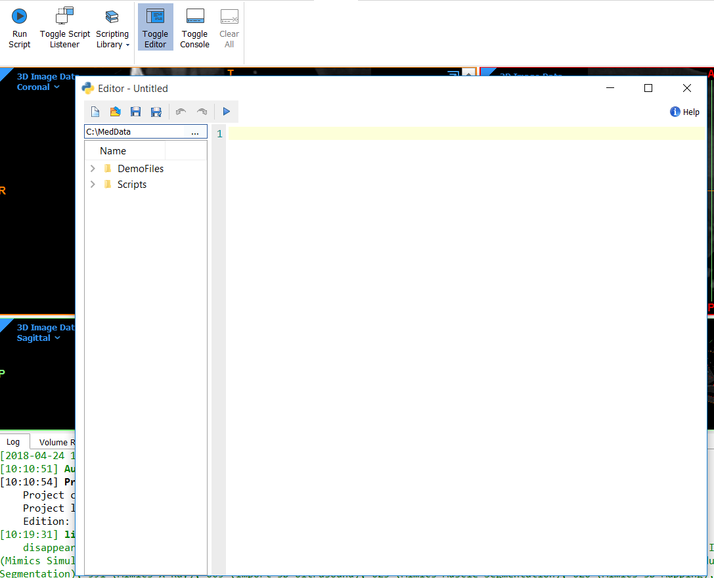
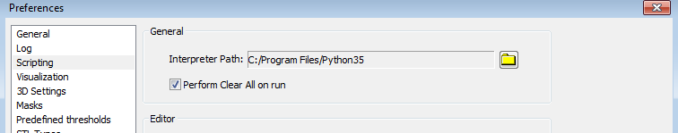
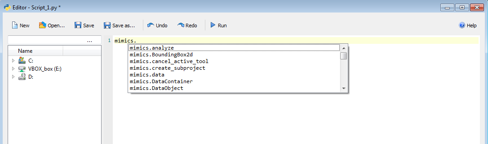
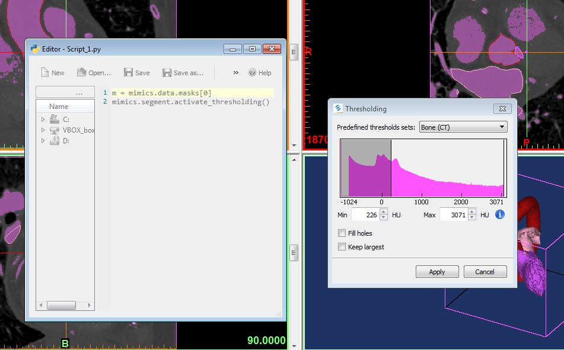
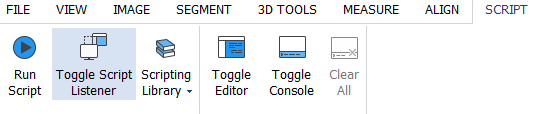

# Mimics Research 21.0 Scripting Guide
> 本文档由 HTML 帮助页面自动转换生成，内容与原始网页完全一致，仅格式从 HTML 变为 Markdown。

---
## 目录

### 基础说明

- 简介
- Python 安装
- Mimics IDE
- Mimics 脚本快速入门

### Mimics API

- mimics module
- mimics.analyze module
- mimics.cineloop module
- mimics.data module
- mimics.dialogs module
- mimics.dicom module
- mimics.events module
- mimics.fea module
- mimics.file module
- mimics.image module
- mimics.logging module
- mimics.measure module
- mimics.segment module
- mimics.simulate module
- mimics.tools module
- mimics.view module

### API 更新日志

- API Change Log

### 外部 IDE

- External IDE Introduction
- Using an External IDE
- Get Autocomplete in External IDEs
- Installation Guide for rpyc and PyQt5
- Eclipse and Pydev
- JetBrains PyCharm
- Microsoft Visual Studio

### 教程

- Automatic Import of DICOM Images
- Semi-automatic Import of Standard Images
- Skull Segmentation
- Femur Segmentation
- Landmarks and Measurements in the Shoulder
- Preparation for Fluoroscopy
- CT Heart Landmarking and Segmentation
- Access to Part Triangles and Points
- Switch between Mimics and 3-matic
- Working with Metadata
- 4D Heart Cineloop in Parts

---


---

# 1. Introduction


有关 Mimics 的总体介绍，请参阅 **Help** -> **Manual** 下的 Mimics Reference guide。


Mimics 支持 Python 脚本。当前，许多 Mimics 功能都已经提供了可在脚本中调用的 Python API。你可以编写自己的 Python 脚本，使用这些可脚本化的 Mimics 功能来实现工作流程自动化。Mimics 自带预装的 Python 解释器，并提供脚本编辑器与脚本控制台。


---

# 2. Python installation


若要在 Mimics 中使用脚本功能，需要安装 **Python 3.5**。Mimics 支持安装 Python 3.5.2。你也可以使用 NumPy、SciPy 等额外包和库，但它们默认不会预装，需要用户自行安装。


请按照以下步骤启用 Mimics 脚本功能。


## 2.1. Installing Python 3.5


如果你的系统中尚未安装 Python 3.5，推荐使用 Mimics 安装向导进行安装。这样 Python 会作为 Mimics 安装流程的一部分自动完成安装。


如果你已经安装了 Python 3.5，那么可以在 Mimics 中选择你偏好的 Python 解释器，例如 Anaconda 等，但必须确保使用的是 Python 3.5 版本。


## 2.2. Configuring Mimics for scripting


在 **File** -> **Preferences** -> **Scripting** 菜单中，确认 Python 解释器路径设置正确。如果你是通过 Mimics 安装向导安装 Python，路径通常会自动配置好。如果你是单独安装的 Python，则需要手动将路径设置到本地 Python 安装目录。


默认的脚本库路径为 `\..\MedData\Scripts`。在该目录中可以找到安装程序附带的所有教程脚本。你也可以将脚本目录改为自己希望使用的位置。指定文件夹中的任何脚本都会自动注册到 **Script** -> **Scripting Library** 菜单下。


## 2.3. Installing extra packages (optional)


如果需要，你可以安装额外的 Python 包或库，例如 NumPy 或 SciPy。如果你已经安装了包含所需第三方库的 Python 3.5 版本，请按照上文说明将该解释器设置为默认解释器。


如果你当前只能使用 Mimics 内置的 Python，建议另外安装完整版本的 Python 3.5，以便使用外部库。完整版本的 Python 3.5 可从这里获取：[https://www.python.org/downloads/](https://www.python.org/downloads/) 。安装外部 Python 包时可以使用 **pip**，这是 Python Packaging Authority (PyPA) 推荐的安装工具。若安装的是完整版本 Python 3.5，pip 会随安装一起提供。


下面给出一个安装 NumPy 和 PyQt 的简单示例。首先打开 Windows 命令行（**cmd**），使用 **cd** 命令切换到包含 **pip.exe** 的目录，该文件通常位于 Python 3.5 安装目录的某个子目录中。然后输入以下命令：


```bash
pip install numpy
pip install PyQt5

```


正常情况下，NumPy 和 PyQt5 现在已经安装到你的系统中。更多信息请参阅：[https://packaging.python.org/installing/](https://packaging.python.org/installing/) 。


---

# 3. Mimics IDE


Mimics IDE 是供 Mimics 用户进行脚本开发的集成环境。它由 **Editor**、**Console** 和 **Scripting Library** 三部分组成。


## 3.1. Editor


Mimics 内置了脚本编辑器。可通过 Mimics 菜单 **Script** -> **Toggle Editor** 打开，编辑器会在单独窗口中显示。





在编辑器中，你可以通过  按钮创建新项目。保存项目可点击  或  按钮。打开已有项目则点击  按钮。
在编辑器窗口左侧面板中，用户可以查看所选文件夹中的全部脚本。点击某个脚本后，它会在编辑器中打开。运行脚本可点击  按钮，或者按 F5 / CTRL-R。要打开 Mimics API 帮助页面，可点击  按钮。


## 3.2. Python console


执行 Python 命令的另一种方式，是使用 Mimics 内置的 Python 控制台。你可以通过 Mimics 菜单 **Script** -> **Toggle Console** 来显示或隐藏控制台。


## 3.3. Scripting Library


第三种执行 Python 脚本的方式，是通过 Mimics 菜单 **Script** -> **Scripting Library**。


如前所述，你可以在 Mimics 的 **File** -> **Preferences** -> **Scripting** 中指定某个脚本目录路径。该目录中的任何脚本都会自动注册到 Scripting Library 下。之后你就可以单击执行这些脚本。这种方式特别适合那些只需要运行脚本、而不需要查看或修改脚本内容的用户。（修改后需要重启 Mimics 才会生效。）


## 3.4. External IDE


Mimics 兼容外部集成开发环境（IDE）。你可以直接从外部 IDE 运行脚本。更多信息请参阅本指南中的 External IDE 章节。


---

# 4. Scripting in Mimics Quick Start Guide


## 4.1. Show/hide Editor and Console


要显示或隐藏 Mimics 的 Editor 或 Console，请点击 **Script** 菜单，并选择 **Toggle Editor** 或 **Toggle Console**。


## 4.2. Run a script


运行脚本有多种方式。


第一种方式是通过 Mimics Editor。点击 **Script** 菜单并选择 **Toggle Editor**。在编辑器窗口中，点击  按钮浏览并选择脚本。选中后，脚本会显示在 Editor 窗口中。点击  按钮，或按 F5 / CTRL-R，即可执行脚本。


第二种方式是使用 **Script** 菜单中的 **Run Script** 按钮。这样你可以选择一个脚本并直接运行。


第三种方式是通过 **Scripting Library** 运行脚本。请注意，你需要先配置脚本首选项，脚本才会显示在 **Scripting Library** 菜单中。具体可参见 Introduction 中的 2.2 节。完成配置后，脚本会出现在 **Scripting Library** 中，你可以一键运行。


## 4.3. Execute Mimics and scripts from Windows Command Prompt (CMD)


你可以从 Windows 命令提示符（cmd）中运行 Mimics 和脚本。可在 cmd 中将 **-h** 或 **-help** 作为参数输入，以查看可用选项（见下文）。下面展示的选项和示例来自 Mimics Medical 20.0，但只需将其中的 Medical 替换为 Research，同样适用于 Research 版本。


```bash
cd "C:\Program Files\Materialise\Mimics Medical 21.0"

MimicsMedical.exe - h

MimicsMedical.exe - help

```


可用选项及其说明如下：


```bash
MimicsMedical.exe [-help] [-background_mode] [-kill] [-save_log <filename.txt>] [-run_script <script_name.py [args]>]

-h, -help                Display this help
-b, -background_mode     Runs the application without GUI (in the background). Quits the application after task completion
-k, -kill                Quits the application after task completion
-save_log <filename.txt> Saves all logger messages to a file specified
-r, -run_script          Runs a python script.
script_name.py           Name of the python script to run
[args]                   Optional parameters to pass into the python script.  They can be accessed using sys.argv[n]

```


**Example:**


在 `\..\MedData\Scripts` 文件夹中包含一份教程脚本副本。若要从 Windows 命令提示符运行 import_dicom.py，请输入以下命令（本示例假设 Mimics 安装在 C 盘）：


```bash
cd "C:\Program Files\Materialise\Mimics Medical 21.0"

MimicsMedical.exe -b -run_script "C:\MedData\Scripts\import_dicom.py"

```


**注意：** 建议将完整路径放在英文双引号中。


## 4.4. Clean variables and workspace


通常来说，命名空间用于唯一标识一组名称，从而在不同来源但名称相同的对象同时存在时避免歧义。本质上，Python 中的命名空间就是你定义的每个名称与其对应对象之间的映射。不同命名空间可以同时存在，但彼此完全隔离。启动 Python 解释器时，会创建一个包含所有内建名称的命名空间，并在解释器退出前一直存在。


Mimics Editor 和 Mimics Console 共享同一个命名空间。因此，当你在 Editor 中运行脚本并创建某些 Python 变量后，这些变量在 Mimics Console 中同样可访问，反之亦然。这让脚本编写过程中的实验与调试更加方便。通过 Run Script 运行的脚本，也与 Console 和 Editor 共用这个命名空间。相对地，通过 Scripting Library 执行的脚本，每次运行都会使用各自独立的命名空间，不会与 Editor、Console 等命名空间共享，这样可以保证脚本执行更加干净。


如果需要，可以通过多种方式清理命名空间。你可以在 **Script** 菜单中点击 **Clear All**，清理 Editor 与 Console 共享的命名空间（见下图）。


另一种清理 Editor 和 Console 命名空间的方法，是在 Mimics 的 Console 中右键并选择 **Clear All**，如下图所示。


另外，你也可以在从任意执行入口运行脚本之前，隐式清理命名空间。这个选项只适用于通过 Editor、Console 或 Run Script 创建的命名空间。相关设置可在 **Preferences** 中的 **Edit** 菜单下找到（见下图）。





## 4.5. Getting started with the Mimics API


Python 与 Mimics 的交互是通过 Mimics Application Programming Interface（API）完成的。借助这个 API，你可以调用许多常规 Mimics 功能，例如分割、测量等，也可以访问 Mimics 项目中的对象。完整的 API 总览可在 “Mimics API” 章节中查看。下面通过一个简单示例来说明其基本概念。


所需模块名为 **mimics**。该模块是 Mimics 安装的一部分，在使用 Mimics 时会自动导入，因此在 Mimics 内执行 Python 脚本时通常不需要显式 `import mimics`。访问 Mimics API 就是通过这个模块完成的，如下图所示。





## 4.6. Using the Mimics API


和许多编程语言一样，Python 支持面向对象编程。这同样是 Mimics API 的基础：每个对象都是某个类的实例。点语法用于让实例调用其所属类的方法或属性。例如，可以调用 *create_mask* 方法来创建一个 *mimics.Mask* 类型的新对象，如下所示。


Mimics API 按子模块组织，其结构与常规 Mimics 菜单结构相对应。例如，有 *mimics.file*、*mimics.segment*、*mimics.analyze* 等子模块。此外，Mimics API 还包含多个其他实用模块和类，详见 “Mimics API” 章节。


你可以使用 *Ctrl* + *Space* 触发自动补全。自动补全适用于方法名、参数名、变量名等。要确认补全结果，例如模块名（如 mimics.segment）、功能调用（如 mimics.segment.threshold()）或参数（如 mimics.segment.threshold(mask=)），可以使用 *Tab* 或 *Enter*。


## 4.7. Working with Hounsfield and Grayvalues pixel units


在常规 Mimics 界面中，你可以选择使用 Hounsfield Units 或灰度值。这个设置可在 **File** 菜单下的 **Preferences**（**General** 选项卡）中修改。不过，Mimics API **仅** 使用灰度值工作，也就是说，所有与阈值等相关的 API 方法都默认输入的是灰度值，而不受你界面首选项设置影响。如果你需要使用 Hounsfield Units，可以借助两个 API：HU2GV 用于将 Hounsfield Units（HU）转换为 Gray Values（GV），GV2HU 则执行相反转换。示例如下。


```python
# Values in HU
low_hu = 240
high_hu = 3071

# Convert values to GV
low_gv = mimics.segment.HU2GV(low_hu)
high_gv = mimics.segment.HU2GV(high_hu)

# Use the tool with the converted values
mimics.segment.threshold(mask=m,threshold_min=low_gv,threshold_max=high_gv)

```


## 4.8. Access to Mimics objects


*mimics.data* 是一个非常常用的类，它允许你访问 Mimics 项目管理标签页中的大多数对象类型，例如 masks、parts、measurements、planes、points、reslice views 等。


下面给出一些示例，说明如何访问 Mimics 安装包（MedData 文件夹）中自带的 *Heart.mcs* 项目里的 parts 和 masks。该项目包含三个名为 LA、LV 和 Aorta 的 mask，以及各自对应的 part。


访问项目中的第一个 mask：


```python
# First mask of the project
mask1 = mimics.data.masks[0]
print(mask1.name)

```


访问名称为 LA 的 mask：


```python
# Mask LA
mask1 = mimics.data.masks.find("LA")
print(mask1.name)

```


上面的示例中只有一个匹配项，也就是唯一一个名为 “LA” 的 mask。当存在多个匹配结果时，*find* 只会返回其中一个，而 Mimics API 还提供了类似的 *filter* 方法，它会返回所有匹配项。需要注意的是，*find* 和 *filter* 都支持正则表达式。


将名称为 Aorta 的 part 赋值给变量：


```python
# Find part Aorta
mask1 = mimics.data.parts.find("Aorta")
print(mask1)

```


删除 LV mask：


```python
# Delete LV mask
lv = mimics.data.masks.find("LV")
mimics.data.masks.delete(lv)

```


复制所有 masks 和 parts：


```python
# Duplicate all the masks and parts of the opened project
for m in mimics.data.masks:
       mimics.data.masks.duplicate(m)

for p in mimics.data.parts:
       mimics.data.parts.duplicate(p)

```


如果你想查看有哪些 Mimics 对象可以通过 Mimics API 访问，可以在 Editor 或 Console 中输入 *mimics.data.*。自动补全会显示 data container 中所有可用对象类型的完整列表。


## 4.9. Access to the properties of Mimics objects


大多数 Mimics 对象都可以通过脚本访问，并在 Mimics API 中表示为类。在 Python 中，属性访问是最常见的操作方式。因此，要访问某个 Mimics 对象的属性，只需访问该对象所属类实例上的属性即可。示例如下：


```python
# The first mask that is included in the mask container is assigned to variable m
m = mimics.data.masks[0]

# To access the attributes of this instance of mimics.segment.Mask class use the dot notation.
# That way you can access properties of the Mimics mask that is assigned to variable m. See below:
print(m.average_value)
c = m.color
n = m.number_of_pixels
b = m.get_voxel_buffer()

# To get a list of the valid attributes(built-in and special) for that object, type the following:
print(dir(m))

```


## 4.10. Activate Mimics tools with Python


通过 Mimics API，你不仅可以以 API 调用方式完成大部分 Mimics 操作，也可以启动或“激活”某些带图形界面的常规 Mimics 工具。例如，阈值分割就可以通过以下两种方式执行。第一种是作为脚本的一部分、在不与用户交互的情况下直接完成阈值分割，所需参数全部在脚本中定义：


```python
# Thresholding without user interaction
m = mimics.data.masks[0]
l_t = 100
h_t = 3000
mimics.segment.threshold(mask=m,threshold_min=l_t, threshold_max=h_t)

```


第二种方式是激活 thresholding 工具。你可以通过交互方式为所选 mask 选择低阈值和高阈值（见下图）。确认之后，脚本会继续执行。


```python
# Thresholding with user interaction
m = mimics.data.masks[0]
mimics.segment.activate_thresholding(mask=m)

```





**注意：** 目前，只有少数选定工具提供这种 “activate” API。


## 4.11. Display and suppress dialog boxes


上一节中简单提到，有些可通过脚本激活的工具需要用户交互。借助 Mimics API，你不仅可以创建自己的对话框，还可以抑制那些在 Mimics 中自动弹出的对话框（例如修改 DICOM 图像方向时的弹窗）。下面给出一个示例，说明如何通过预设答案来抑制部分 Mimics 内置对话框。


```python
# Set predefined answers to suppress some of the built in dialog boxes
mimics.dialogs.set_predefined_answer("CannotConvertProject", "Yes")
mimics.dialogs.set_predefined_answer("ProjectHasNotValidCS", "Yes")
mimics.dialogs.set_predefined_answer("ChangeOrientation", "default")
mimics.dialogs.set_predefined_answer("FixImagesPositioning", "Yes")
mimics.dialogs.set_predefined_answer("SaveChangedProject", "No")


# Code that imports DICOM images
# ...
# ...

```


Mimics API 也支持创建你自己的对话框，以便为脚本提供定制化交互。下面给出一个示例，说明如何创建一个带有预定义候选答案列表的对话框。


```python
# Create customised dialog boxes with scripting
# ...
# Code that performs an operation
# ...
sel = mimics.dialogs.question_box(message="Please indicate the region to continue", buttons="LA;LV;Aorta", title= "Region Selection")
# ...

```


---

# mimics module


***class*`mimics.``BoundingBox2d`**

基类：`object`


用于屏幕坐标的 2D 包围盒。


**`height`**

| 类型： | typing.SupportsFloat |
| --- | --- |


**`origin`**

| 类型： | typing.Tuple[typing.SupportsFloat, typing.SupportsFloat] |
| --- | --- |


**`width`**

| 类型： | typing.SupportsFloat |
| --- | --- |


***class*`mimics.``BoundingBox3d`(*origin=[0, 0, 0], first_vector=[0, 0, 0], second_vector=[0, 0, 0], third_vector=[0, 0, 0]*)**

基类：`object`


用于空间坐标的 3D 包围盒。


**`first_vector`**

| 类型： | typing.Union[typing.Tuple[typing.SupportsFloat, typing.SupportsFloat, typing.SupportsFloat], mimics.analyze.Point] |
| --- | --- |


**`origin`**

| 类型： | typing.Union[typing.Tuple[typing.SupportsFloat, typing.SupportsFloat, typing.SupportsFloat], mimics.analyze.Point] |
| --- | --- |


**`second_vector`**

| 类型： | typing.Union[typing.Tuple[typing.SupportsFloat, typing.SupportsFloat, typing.SupportsFloat], mimics.analyze.Point] |
| --- | --- |


**`third_vector`**

| 类型： | typing.Union[typing.Tuple[typing.SupportsFloat, typing.SupportsFloat, typing.SupportsFloat], mimics.analyze.Point] |
| --- | --- |


***class*`mimics.``DataContainer`**

基类：`object`


包含所有应用对象的扁平容器。


**`delete`(*objects*)**

删除对象。


| 参数： | **objects** (*typing.Union**[**typing.Iterable**[**mimics.Object**]**,**mimics.Object**,**mimics.DataContainer**]*) – 要删除的对象。 |
| --- | --- |


**`duplicate`(*object*)**

复制对象。


| 参数： | **object** (*mimics.Object*) – 要复制的对象。 |
| --- | --- |
| 返回值： | 指定对象的副本。 |
| 返回类型： | mimics.Object |
| 异常： | RuntimeError |


**`filter`(*expression*, *regex=False*)**

筛选容器中的元素。


| 参数： | - **expression** (*str*) – 与对象名称匹配的表达式。
- **regex** (*bool*) – （可选）指定 expression 是否为正则表达式，默认值为 false。 |
| --- | --- |
| 返回值： | 返回名称与该表达式匹配的对象列表；如果不存在匹配对象，则返回空列表。 |
| 返回类型： | typing.List[mimics.Object] |
| 异常： | ValueError |


**`find`(*name*, *regex=False*)**

按名称查找对象。


| 参数： | - **name** (*str*) – 对象名称。
- **regex** (*bool*) – （可选）指定 name 是否为正则表达式，默认值为 false。 |
| --- | --- |
| 返回值： | 如果容器中恰好有一个对象使用该名称，则返回该对象；如果有多个对象使用该名称，则只返回其中第一个；如果不存在，则返回 Python 内置常量 None。 |
| 返回类型： | mimics.Object |
| 异常： | ValueError |


**`move_objects`(*target_index_position*, *objects*)**

改变原生对象的顺序。


| 参数： | - **target_index_position** (*int*) – 所提供对象中第一个对象的新容器位置。
- **objects** (*typing.Union**[**typing.Iterable**[**mimics.Object**]**,**mimics.Object**,**mimics.DataContainer**]*) – 需要重新排序的对象。 |
| --- | --- |


***class*`mimics.``DataContainerBase`**

基类：`object`


包含所有应用对象的扁平容器。


**`filter`(*expression*, *regex=False*)**

筛选容器中的元素。


| 参数： | - **expression** (*str*) – 与对象名称匹配的表达式。
- **regex** (*bool*) – （可选）指定 expression 是否为正则表达式，默认值为 false。 |
| --- | --- |
| 返回值： | 返回名称与表达式匹配的对象列表；如无匹配对象，则返回空列表。 |
| 返回类型： | typing.List[mimics.Object] |
| 异常： | ValueError |


**`find`(*name*, *regex=False*)**

按名称查找对象。


| 参数： | - **name** (*str*) – 对象名称。
- **regex** (*bool*) – （可选）指定 name 是否为正则表达式，默认值为 false。 |
| --- | --- |
| 返回值： | 如果容器中恰好有一个对象使用该名称，则返回该对象；如果有多个匹配，只返回第一个；如果不存在，则返回 Python 内置常量 None。 |
| 返回类型： | mimics.Object |
| 异常： | ValueError |


***class*`mimics.``DicomTag`**

基类：`object`


DICOM 标签类。


**`children`**

| 类型： | typing.Union[typing.Tuple[typing.Dict[typing.Tuple[int, int], mimics.DicomTag]], NoneType] |
| --- | --- |


**`description`**

| 类型： | <class ‘str’> |
| --- | --- |


**`length`**

| 类型： | <class ‘int’> |
| --- | --- |


**`value`**

| 类型： | <class ‘str’> |
| --- | --- |


**`vr`**

| 类型： | <class ‘str’> |
| --- | --- |


***class*`mimics.``ImageData`**

基类：`object`


图像数据是一个体素矩阵。


**`get_dicom_tags`(*image_index=None*)**

返回该图像数据的 DICOM 标签字典，但不包括图像像素信息相关标签。若要获取图像的像素信息，可使用 mimics.ImageData.get_voxel_buffer API。每次调用都会返回一个新的字典实例，因此为获得更好的 API 性能，建议先将结果赋值给变量进行缓存。


| 参数： | **image_index** (*int*) – （可选）图像集中的图像索引。 |
| --- | --- |
| 返回值： | 此图像数据的 DICOM 标签。 |
| 返回类型： | typing.Dict[typing.Tuple[int, int], mimics.DicomTag] |


**`get_grey_value`(*point_coordinates*)**

计算图像数据中指定坐标处的灰度值。


| 参数： | **point_coordinates** (*typing.Tuple**[**typing.SupportsFloat**,**typing.SupportsFloat**,**typing.SupportsFloat**]*) – 项目单位下的点坐标。 |
| --- | --- |
| 返回值： | 图像灰度值。 |
| 返回类型： | int |
| 示例： |  |


```python
active_image = mimics.data.images.get_active()

while True: #should be changed to any meaningful condition
    print("Click on the views (on the image on 2D or on the surface on 3D view")
    click = mimics.indicate_coordinate(show_message_box=False)
    print("You have clicked on {} in mm of the World Coordinate System".format(click))

    # get_grey_value method is good for low performance pixel buffer access
    gv = active_image.get_grey_value(click)
    print("Slow but convenient access via single purpose function: GV of the active image at this point: {}".format(gv))

```


**`get_image_information`()**

返回该图像数据的相关信息。


| 返回值： | 该图像数据的信息。 |
| --- | --- |
| 返回类型： | mimics.ImageInformation |


**`get_voxel_buffer`()**

以 16 位灰度值三维数组的形式，返回一份 3D 图像副本。


| 返回值： | 16 位灰度值 3D 数组。 |
| --- | --- |
| 返回类型： | memoryview |
| 示例： |  |


```python
active_image = mimics.data.images.get_active()
voxels = active_image.get_voxel_buffer()

while True: #should be changed to any meaningful condition
    print("Click on the views (on the image on 2D or on the surface on 3D view")
    click = mimics.indicate_coordinate(show_message_box=False)
    print("You have clicked on {} in mm of the World Coordinate System".format(click))

    # get_voxel_buffer method is useful to access a bunch of points in high-performance way
    try:
        index = active_image.get_voxel_indexes(click)
    except ValueError:
        print("You have clicked outside of the image!")
        continue
    print("Index of pixel of the active image at this point: {}".format(index))
    assert 0 <= index[0] < active_image.logical_dimensions[0]
    assert 0 <= index[1] < active_image.logical_dimensions[1]
    assert 0 <= index[2] < active_image.logical_dimensions[2]
    gv = voxels[index]
    print("High performance access via memory view: GV of active image at this point: {}".format(gv))

    # just as an exercise - let's take the next diagonal pixel in the same XY plane
    try:
        gv = voxels[index[0]+1, index[1]+1, index[2]]
        print("GV of the active image at the next XY diagonal point: {}".format(gv))
    except IndexError:
        print("The  next XY diagonal point is out of the image!")

```


**`get_voxel_center`(*index_of_voxel*)**

计算体素中心的坐标。


| 参数： | **index_of_voxel** (*typing.Tuple**[**int**,**int**,**int**]*) – 图像数据中的体素索引。 |
| --- | --- |
| 返回值： | 体素中心坐标。 |
| 返回类型： | typing.Tuple[float, float, float] |


**`get_voxel_indexes`(*point_coordinates*)**

计算图像数据中的体素索引。


| 参数： | **point_coordinates** (*typing.Tuple**[**typing.SupportsFloat**,**typing.SupportsFloat**,**typing.SupportsFloat**]*) – 位于体素内部的点。 |
| --- | --- |
| 返回值： | 体素坐标。 |
| 返回类型： | typing.Tuple[int, int, int] |


**`linked_objects`**

| 类型： | typing.List<~T>[mimics.Object] |
| --- | --- |


**`logical_dimensions`**

| 类型： | typing.Sequence[typing.SupportsInt] |
| --- | --- |


**`logical_slice_distance`**

| 类型： | typing.SupportsFloat |
| --- | --- |


**`physical_dimensions`**

| 类型： | typing.Sequence[typing.SupportsInt] |
| --- | --- |


**`pixel_size`**

| 类型： | typing.SupportsFloat |
| --- | --- |


***exception*`mimics.``ImageFileWritingError`(*message*)**

基类：`Exception`


***class*`mimics.``ImageInformation`**

基类：`object`


特定图像数据的信息。


***class*`mimics.``ImagesContainer`**

基类：`object`


包含所有图像数据对象的扁平容器。


**`delete`(*objects*)**

删除对象。


| 参数： | **objects** (*typing.Union**[**typing.Iterable**[**mimics.Object**]**,**mimics.Object**,**mimics.DataContainer**]*) – 要删除的对象。 |
| --- | --- |


**`filter`(*expression*, *regex=False*)**

筛选容器中的元素。


| 参数： | - **expression** (*str*) – 与对象名称匹配的表达式。
- **regex** (*bool*) – （可选）指定 expression 是否为正则表达式，默认值为 false。 |
| --- | --- |
| 返回值： | 返回名称与该表达式匹配的对象列表；如无匹配对象，则返回空列表。 |
| 返回类型： | typing.List[mimics.Object] |
| 异常： | ValueError |


**`find`(*name*, *regex=False*)**

按名称查找对象。


| 参数： | - **name** (*str*) – 对象名称。
- **regex** (*bool*) – （可选）指定 name 是否为正则表达式，默认值为 false。 |
| --- | --- |
| 返回值： | 如果容器中恰好存在一个使用该名称的对象，则返回该对象；如果存在多个，则只返回第一个；如果不存在，则返回 Python 内置常量 None。 |
| 返回类型： | mimics.Object |
| 异常： | ValueError |


**`get_active`()**

返回当前活动的图像数据。


| 返回值： | mimics.ImageData |
| --- | --- |
| 返回类型： | mimics.ImageData |


**`set_active`(*image*)**

切换当前活动图像数据。


| 参数： | **image** (*mimics.ImageData*) – 要设置为活动图像的图像对象。 |
| --- | --- |
| 返回值： | 如果操作成功则返回 true。 |
| 返回类型： | bool |
| 异常： | TypeError |


***exception*`mimics.``InvalidArgumentType`(*message*)**

基类：`mimics.UncheckedException`


***class*`mimics.``Layouts`**

基类：`object`


包含字符串属性的容器，这些属性可作为 mimics.view.set_layout API 的输入。


***class*`mimics.``LayoutsContainer`**

基类：`object`


可用布局列表。


***exception*`mimics.``LicenseError`(*message*)**

基类：`mimics.UncheckedException`


***class*`mimics.``Metadata`**

基类：`object`


包含特定对象 metadata 的容器。


**`create`(*name*, *value*)**

使用给定的名称和值创建新的 metadata 项。


| 参数： | - **name** (*str*) – metadata 项名称。
- **value** (*str*) – metadata 项的值。 |
| --- | --- |


**`delete`(*items*)**

如果存在，则删除第一个具有指定名称的 metadata 项。


| 参数： | **items** (*typing.Union**[**typing.Iterable**[**mimics.MetadataItem**]**,**mimics.Metadata**,**mimics.MetadataItem**,**str**]*) – 要删除的 metadata 项。 |
| --- | --- |


**`filter`(*expression*, *regex=False*)**

筛选容器中的元素。


| 参数： | - **expression** (*str*) – 与 metadata 项名称匹配的表达式。
- **regex** (*bool*) – （可选）指定 expression 是否为正则表达式，默认值为 false。 |
| --- | --- |
| 返回值： | 返回名称与表达式匹配的 metadata 项列表；如果没有匹配项，则返回空列表。 |
| 返回类型： | typing.List[mimics.MetadataItem] |
| 异常： | ValueError |


**`find`(*name*, *regex=False*)**

按名称查找 metadata 项。


| 参数： | - **name** (*str*) – metadata 项名称。
- **regex** (*bool*) – （可选）指定 name 是否为正则表达式，默认值为 false。 |
| --- | --- |
| 返回值： | 如果容器中恰好有一个 metadata 项使用该名称，则返回它；如果存在多个，则只返回第一个；如果不存在，则返回 Python 内置常量 None。 |
| 返回类型： | mimics.MetadataItem |
| 异常： | ValueError |


***class*`mimics.``MetadataItem`**

基类：`object`


Metadata 项包含名称和值。


***class*`mimics.``NotSpecifiedType`**

基类：`object`


某些方法将其用作默认参数。


***class*`mimics.``Object`**

基类：`object`


Object 是对 Mimics 中结构的一种通用描述，包含所有子类共有的属性。


**`color`**

| 类型： | typing.Tuple[typing.SupportsFloat, typing.SupportsFloat, typing.SupportsFloat] |
| --- | --- |


**`guid`**

| 类型： | <class ‘str’> |
| --- | --- |


**`image`**

| 类型： | typing.Union[mimics.ImageData, NoneType] |
| --- | --- |


**`metadata`**

| 类型： | <class ‘mimics.Metadata’> |
| --- | --- |


**`name`**

| 类型： | <class ‘str’> |
| --- | --- |


**`selected`**

| 类型： | <class ‘bool’> |
| --- | --- |


**`visible`**

| 类型： | <class ‘bool’> |
| --- | --- |


***class*`mimics.``Part`**

基类：`mimics.Object`


Part 是一个 3D 对象。


**`contours_visible`**

| 类型： | <class ‘bool’> |
| --- | --- |


**`dimension_delta`**

| 类型： | typing.Union[typing.Tuple[typing.SupportsFloat, typing.SupportsFloat, typing.SupportsFloat], mimics.analyze.Point] |
| --- | --- |


**`dimension_max`**

| 类型： | typing.Union[typing.Tuple[typing.SupportsFloat, typing.SupportsFloat, typing.SupportsFloat], mimics.analyze.Point] |
| --- | --- |


**`dimension_min`**

| 类型： | typing.Union[typing.Tuple[typing.SupportsFloat, typing.SupportsFloat, typing.SupportsFloat], mimics.analyze.Point] |
| --- | --- |


**`get_triangles`()**

返回三角面表面数据，即由顶点（3D 坐标）和三角形（用于构成表面的顶点组合）组成的元组。


| 返回值： | 两个 float 类型 memoryview 组成的元组。 |
| --- | --- |
| 返回类型： | typing.Tuple[memoryview, memoryview] |
| 异常： | ValueError |


**`number_of_points`**

| 类型： | <class ‘int’> |
| --- | --- |


**`number_of_triangles`**

| 类型： | <class ‘int’> |
| --- | --- |


**`photo_visible`**

| 类型： | <class ‘bool’> |
| --- | --- |


**`quality`**

| 类型： | <class ‘str’> |
| --- | --- |


**`surface_area`**

| 类型： | typing.SupportsFloat |
| --- | --- |


**`transparency`**

| 类型： | typing.SupportsFloat |
| --- | --- |


**`triangles_visible`**

| 类型： | <class ‘bool’> |
| --- | --- |


**`type`**

| 类型： | <class ‘str’> |
| --- | --- |


**`volume`**

| 类型： | typing.SupportsFloat |
| --- | --- |


***exception*`mimics.``ProjectNotLoaded`(*message*)**

基类：`Exception`


***class*`mimics.``Transaction`**

基类：`object`


Transaction 是一个上下文管理器，可将多个独立操作合并为一个事务。


**`commit`()**

提交其中包含的所有操作。


**`rollback`()**

回滚其中包含的所有操作。


***exception*`mimics.``UncheckedException`(*message*)**

基类：`Exception`


***exception*`mimics.``UserInterrupted`(*message*)**

基类：`Exception`


***class*`mimics.``ViewsContainer`**

基类：`object`


包含所有视图的扁平容器。


**`filter`(*expression=None*, *image_data=<mimics.NotSpecifiedType object>*, *reslice_plane=<mimics.NotSpecifiedType object>*, *regex=False*)**

筛选容器中的元素。


| 参数： | - **expression** (*typing.Union**[**str**,**mimics.NotSpecifiedType**]*) – （可选）与视图名称匹配的表达式。
- **image_data** (*typing.Union**[**mimics.ImageData**,**None**,**mimics.NotSpecifiedType**]*) – （可选）与该视图关联的图像数据。
- **reslice_plane** (*typing.Union**[**mimics.view.Reslice**,**None**,**mimics.NotSpecifiedType**]*) – （可选）与该视图关联的重切片平面。
- **regex** (*bool*) – （可选）指定 expression 是否为正则表达式，默认值为 false。 |
| --- | --- |
| 返回值： | 返回名称与该表达式匹配的视图对象列表；如果没有匹配项，则返回空列表。 |
| 返回类型： | typing.List[mimics.view.View] |
| 异常： | KeyError, ValueError |


**`find`(*name=<mimics.NotSpecifiedType object>*, *image_data=<mimics.NotSpecifiedType object>*, *reslice_plane=<mimics.NotSpecifiedType object>*, *regex=False*)**

按名称查找对象。


| 参数： | - **name** (*typing.Union**[**str**,**mimics.NotSpecifiedType**]*) – （可选）视图名称。
- **image_data** (*typing.Union**[**mimics.ImageData**,**None**,**mimics.NotSpecifiedType**]*) – （可选）与该视图关联的图像数据。
- **reslice_plane** (*typing.Union**[**mimics.view.Reslice**,**None**,**mimics.NotSpecifiedType**]*) – （可选）与该视图关联的重切片平面。
- **regex** (*bool*) – （可选）指定 name 是否为正则表达式，默认值为 false。 |
| --- | --- |
| 返回值： | 如果容器中恰好有一个对象使用该名称，则返回该对象；如果有多个，则只返回第一个；如果不存在，则返回 Python 内置常量 None。 |
| 返回类型： | mimics.view.View |
| 异常： | KeyError, ValueError |


**`mimics.``cancel_active_tool`()**

取消当前激活的工具或测量。


**`mimics.``disable_modules_reload`()**

禁用模块重新加载。


**`mimics.``disable_update_gui`()**

禁用 UI 更新。


**`mimics.``enable_modules_reload`()**

启用模块重新加载。


**`mimics.``enable_update_gui`()**

如果当前已启用 UI 更新则返回 true，否则返回 false。


**`mimics.``get_dicom_tags`()**

返回当前检查的 DICOM 标签字典，但不包括图像像素信息相关标签。若要获取图像像素信息，可使用 mimics.ImageData.get_voxel_buffer API。每次调用都会返回一个新的字典实例，因此为了获得更好的 API 性能，建议先将结果赋值给变量进行缓存。


| 返回值： | 当前打开项目中活动图像数据对应的 DICOM 标签。 |
| --- | --- |
| 返回类型： | typing.Dict[typing.Tuple[int, int], mimics.DicomTag] |
| 示例： |  |


```python
# Getting dicom tags in order to cache them in a variable (for speed)
tags = mimics.get_dicom_tags()

# Getting tag value by its group and id
t = tags[0x0028, 0x0010]
print("{}: {}".format(t.description, t.value))

# If you want to iterate over all tags (not accessing their child tags) you can use
# standard Python dict iteration
for k, v in tags.items():
    print(hex(k[0]), hex(k[1]), ":", v.value)


# If a tag contains a list of values you can iterate it like a list
lst = tags[0x0008, 0x1032]
for elem in lst:
    print(len(elem), type(elem), elem)

# As you will notice, some DICOM tag element are just plain tag/value pairs.
# Others though can contain nested tags, so in general DICOM is a tree-like structure.
# E.g. patients name usually lies in a single tag `(0x10, 0x10)`.
# Per-frame Functional Groups Sequence `(0x5200, 0x9230)`, on the other hand
# contains a sequence of nested DICOM Tag elements.
# To access them please use `.children` on the tag object
#(`.children` is set to `None` in case no nested tags are present)

child_tags = tags[0x5200, 0x9230].children
for k, v in child_tags.items():
    print(hex(k[0]), hex(k[1]), ":", v.value)

```


**`mimics.``get_version`()**

显示当前 Mimics 版本。


**`mimics.``indicate_coordinate`(*message='Please indicate coordinate'*, *show_message_box=True*, *confirm=True*, *title=None*)**

显示一个对话框，要求用户创建一个点。


| 参数： | - **message** (*str*) – （可选）对话框说明文字。
- **show_message_box** (*bool*) – （可选）指定是否显示消息框；如果为 false，则其余参数都会被忽略。
- **confirm** (*bool*) – （可选）如果为 true，则会显示 OK 按钮，并等待用户点击确认对象放置。
- **title** (*str*) – （可选）对话框标题。 |
| --- | --- |
| 返回值： | 可用于创建点的坐标。 |
| 返回类型： | typing.Tuple[float, float, float] |
| 示例： |  |


```python
tit = 'Point 1'
msg = 'Please indicate coordinates of Point 1'
coords = mimics.indicate_coordinate(title=tit,message=msg)

```


**`mimics.``is_update_gui_enabled`()**

如果当前启用了 UI 更新，则返回 true，否则返回 false。


| 返回值： | 状态值。 |
| --- | --- |
| 返回类型： | bool |


**`mimics.``move_object`(*entity*, *offset*)**

沿 x、y、z 方向平移对象。


| 参数： | - **entity** (*mimics.Object*) – 要移动的对象。
- **offset** (*typing.Tuple**[**typing.SupportsFloat**,**typing.SupportsFloat**,**typing.SupportsFloat**]*) – 相对于原始位置在 x、y、z 方向上的偏移量。 |
| --- | --- |
| 示例： |  |


```python
obj = mimics.data.parts[0]
vec = (0,0,10)
mimics.move_object(entity=obj ,offset=vec)

```


**`mimics.``not_reloading_modules`()**

提供对“不应重新加载的用户自定义模块列表”的访问。如果某个在脚本中导入的用户自定义模块在脚本执行期间不应被重新加载，则应将其名称（与 `import` 语句中的名称一致）追加到该列表中。


| 返回值： | 不应重新加载的用户自定义模块名称列表。 |
| --- | --- |
| 返回类型： | typing.Iterable[str] |


**`mimics.``rotate_object_around_axis`(*entity*, *axis*, *angle*, *rotation_origin*)**

围绕 X、Y 或 Z 轴旋转对象。


| 参数： | - **entity** (*mimics.Object*) – 要旋转的对象。
- **axis** (*typing.Tuple**[**typing.SupportsFloat**,**typing.SupportsFloat**,**typing.SupportsFloat**]*) – 旋转轴方向。
- **angle** (*typing.SupportsFloat*) – 旋转角度（单位：度）。
- **rotation_origin** (*typing.Tuple**[**typing.SupportsFloat**,**typing.SupportsFloat**,**typing.SupportsFloat**]*) – 旋转中心。 |
| --- | --- |
| 示例： |  |


```python
obj = mimics.data.parts[0]
vec = (0,0,1)
ang_deg = 180
origin = (0,0,0)
mimics.rotate_object_around_axis(entity = obj, axis = vec, angle = ang_deg , rotation_origin=origin)

```


**`mimics.``rotate_object_around_inertia_axis`(*entity*, *angles*, *rotation_origin*)**

围绕 part 的惯性轴旋转。


| 参数： | - **entity** (*mimics.Part*) – 要旋转的 Part。
- **angles** (*typing.Tuple**[**typing.SupportsFloat**,**typing.SupportsFloat**,**typing.SupportsFloat**]*) – 一个 (x,y,z) 元组，表示沿各主轴的旋转角度（单位：度）。
- **rotation_origin** (*typing.Tuple**[**typing.SupportsFloat**,**typing.SupportsFloat**,**typing.SupportsFloat**]*) – 旋转中心。 |
| --- | --- |
| 示例： |  |


```python
obj = mimics.data.parts[0]
ang_deg = 10
origin = (0,0,0)
mimics.rotate_object_around_inertia_axis(entity = obj, angles = (0,0,ang_deg), rotation_origin=origin)

```


**`mimics.``rotate_object_around_views`(*entity*, *angles*, *rotation_origin*)**

按照给定角度旋转对象。


| 参数： | - **entity** (*mimics.Object*) – 要旋转的对象。
- **angles** (*typing.Tuple**[**typing.SupportsFloat**,**typing.SupportsFloat**,**typing.SupportsFloat**]*) – 一个 (x,y,z) 元组，表示沿各主轴的旋转角度（单位：度）。
- **rotation_origin** (*typing.Tuple**[**typing.SupportsFloat**,**typing.SupportsFloat**,**typing.SupportsFloat**]*) – 旋转中心。 |
| --- | --- |
| 示例： |  |


```python
obj = mimics.data.parts[0]
ang_deg = 90
origin = (0,0,0)
mimics.rotate_object_around_views(entity=obj, angles=(0,0,ang_deg), rotation_origin=origin)

```


**`mimics.``toggle_script_listener`()**

切换供第三方 IDE 使用的脚本监听器状态。


| 异常： | RuntimeError |
| --- | --- |


**`mimics.``update_gui`()**

处理消息队列中所有已投递的消息。


---

# mimics.analyze module


***class*`mimics.analyze.``Centerline`**

基类：`mimics.Object`


Centerline 对象表示一个 Part 的中心线，它以样条曲线树状结构表示，这些样条曲线被拟合作为该 Part 的通道。


**`show_branching_points`**

| 类型： | <class ‘bool’> |
| --- | --- |


***class*`mimics.analyze.``Circle`**

基类：`mimics.Object`


Circle 是一种基于圆心、半径和方向的分析对象。


**`center`**

| 类型： | typing.Union[typing.Tuple[typing.SupportsFloat, typing.SupportsFloat, typing.SupportsFloat], mimics.analyze.Point] |
| --- | --- |


**`normal`**

| 类型： | typing.Union[typing.Tuple[typing.SupportsFloat, typing.SupportsFloat, typing.SupportsFloat], mimics.analyze.Point] |
| --- | --- |


**`radius`**

| 类型： | typing.SupportsFloat |
| --- | --- |


***class*`mimics.analyze.``Cylinder`**

基类：`mimics.Object`


Cylinder 是一种基于两个点、长度和半径的分析对象。


**`direction`**

| 类型： | typing.Union[typing.Tuple[typing.SupportsFloat, typing.SupportsFloat, typing.SupportsFloat], mimics.analyze.Point] |
| --- | --- |


**`height`**

| 类型： | typing.SupportsFloat |
| --- | --- |


**`point1`**

| 类型： | typing.Union[typing.Tuple[typing.SupportsFloat, typing.SupportsFloat, typing.SupportsFloat], mimics.analyze.Point] |
| --- | --- |


**`point2`**

| 类型： | typing.Union[typing.Tuple[typing.SupportsFloat, typing.SupportsFloat, typing.SupportsFloat], mimics.analyze.Point] |
| --- | --- |


**`radius`**

| 类型： | typing.SupportsFloat |
| --- | --- |


**`transparency`**

| 类型： | typing.SupportsFloat |
| --- | --- |


***class*`mimics.analyze.``Line`**

基类：`mimics.Object`


Line 是一种基于两个点的分析对象。


**`direction`**

| 类型： | typing.Union[typing.Tuple[typing.SupportsFloat, typing.SupportsFloat, typing.SupportsFloat], mimics.analyze.Point] |
| --- | --- |


**`length`**

| 类型： | typing.SupportsFloat |
| --- | --- |


**`point1`**

| 类型： | typing.Union[typing.Tuple[typing.SupportsFloat, typing.SupportsFloat, typing.SupportsFloat], mimics.analyze.Point] |
| --- | --- |


**`point2`**

| 类型： | typing.Union[typing.Tuple[typing.SupportsFloat, typing.SupportsFloat, typing.SupportsFloat], mimics.analyze.Point] |
| --- | --- |


***class*`mimics.analyze.``Plane`**

基类：`mimics.Object`


Plane 是一种基于指定原点和法向量的分析对象。


**`delta_x`**

| 类型： | typing.SupportsFloat |
| --- | --- |


**`delta_y`**

| 类型： | typing.SupportsFloat |
| --- | --- |


**`height`**

| 类型： | typing.SupportsFloat |
| --- | --- |


**`normal`**

| 类型： | typing.Union[typing.Tuple[typing.SupportsFloat, typing.SupportsFloat, typing.SupportsFloat], mimics.analyze.Point] |
| --- | --- |


**`origin`**

| 类型： | typing.Union[typing.Tuple[typing.SupportsFloat, typing.SupportsFloat, typing.SupportsFloat], mimics.analyze.Point] |
| --- | --- |


**`point1`**

| 类型： | typing.Union[typing.Tuple[typing.SupportsFloat, typing.SupportsFloat, typing.SupportsFloat], mimics.analyze.Point] |
| --- | --- |


**`point2`**

| 类型： | typing.Union[typing.Tuple[typing.SupportsFloat, typing.SupportsFloat, typing.SupportsFloat], mimics.analyze.Point] |
| --- | --- |


**`point3`**

| 类型： | typing.Union[typing.Tuple[typing.SupportsFloat, typing.SupportsFloat, typing.SupportsFloat], mimics.analyze.Point] |
| --- | --- |


**`transparency`**

| 类型： | typing.SupportsFloat |
| --- | --- |


**`width`**

| 类型： | typing.SupportsFloat |
| --- | --- |


**`x_axis`**

| 类型： | typing.Union[typing.Tuple[typing.SupportsFloat, typing.SupportsFloat, typing.SupportsFloat], mimics.analyze.Point] |
| --- | --- |


**`y_axis`**

| 类型： | typing.Union[typing.Tuple[typing.SupportsFloat, typing.SupportsFloat, typing.SupportsFloat], mimics.analyze.Point] |
| --- | --- |


**`z_axis`**

| 类型： | typing.Union[typing.Tuple[typing.SupportsFloat, typing.SupportsFloat, typing.SupportsFloat], mimics.analyze.Point] |
| --- | --- |


***class*`mimics.analyze.``Point`**

基类：`mimics.Object`


Point 是一种基于给定坐标的分析对象。


**`coordinates`**

| 类型： | typing.Union[typing.Tuple[typing.SupportsFloat, typing.SupportsFloat, typing.SupportsFloat], mimics.analyze.Point] |
| --- | --- |


**`x`**

| 类型： | <class ‘float’> |
| --- | --- |


**`y`**

| 类型： | <class ‘float’> |
| --- | --- |


**`z`**

| 类型： | <class ‘float’> |
| --- | --- |


***class*`mimics.analyze.``Sphere`**

基类：`mimics.Object`


Sphere 是一种基于中心点和半径的分析对象。


**`center`**

| 类型： | typing.Union[typing.Tuple[typing.SupportsFloat, typing.SupportsFloat, typing.SupportsFloat], mimics.analyze.Point] |
| --- | --- |


**`radius`**

| 类型： | typing.SupportsFloat |
| --- | --- |


**`transparency`**

| 类型： | typing.SupportsFloat |
| --- | --- |


***class*`mimics.analyze.``Spline`**

基类：`mimics.Object`


Spline 是一种由控制点定义的分析对象，可以是闭合的，也可以是开放的。


**`closed`**

| 类型： | <class ‘bool’> |
| --- | --- |


**`diameter`**

| 类型： | typing.SupportsFloat |
| --- | --- |


**`geometry_points`**

| 类型： | typing.Sequence[typing.Union[typing.Tuple[typing.SupportsFloat, typing.SupportsFloat, typing.SupportsFloat], mimics.analyze.Point]] |
| --- | --- |


**`length`**

| 类型： | typing.SupportsFloat |
| --- | --- |


**`opaque_on_images`**

| 类型： | <class ‘bool’> |
| --- | --- |


**`order`**

| 类型： | <class ‘int’> |
| --- | --- |


**`points`**

| 类型： | typing.Sequence[typing.Union[typing.Tuple[typing.SupportsFloat, typing.SupportsFloat, typing.SupportsFloat], mimics.analyze.Point]] |
| --- | --- |


**`project_on_slices`**

| 类型： | <class ‘bool’> |
| --- | --- |


**`mimics.analyze.``create_circle_center_normal_radius`(*center*, *normal*, *radius*, *name=None*, *color=None*)**

创建一个圆。需要提供圆心、法向量和半径。


| 参数： | - **center** (*typing.Tuple**[**typing.SupportsFloat**,**typing.SupportsFloat**,**typing.SupportsFloat**]*) – 圆心坐标。
- **normal** (*typing.Tuple**[**typing.SupportsFloat**,**typing.SupportsFloat**,**typing.SupportsFloat**]*) – 圆的法向量。
- **radius** (*typing.SupportsFloat*) – 圆的半径。
- **name** (*str*) – （可选）新圆的名称；如果未提供，则使用默认名称。
- **color** (*ThreeItemsIterable**[**typing.SupportsFloat**,**typing.SupportsFloat**,**typing.SupportsFloat**]*) – （可选）新圆的颜色；如果未提供，则使用默认颜色。 |
| --- | --- |
| 返回值： | 一个圆对象。 |
| 返回类型： | mimics.analyze.Circle |
| 异常： | ValueError |
| 示例： |  |


```python
c = (10,10,10)
n = (-1,0,0)
r = 5.0
mimics.analyze.create_circle_center_normal_radius(center=c, normal=n, radius=r)

```


**`mimics.analyze.``create_circle_points`(*point1*, *point2*, *point3*, *name=None*, *color=None*)**

创建一个圆。需要提供三个点。


| 参数： | - **point1** (*typing.Tuple**[**typing.SupportsFloat**,**typing.SupportsFloat**,**typing.SupportsFloat**]*) – 第一个点的坐标。
- **point2** (*typing.Tuple**[**typing.SupportsFloat**,**typing.SupportsFloat**,**typing.SupportsFloat**]*) – 第二个点的坐标。
- **point3** (*typing.Tuple**[**typing.SupportsFloat**,**typing.SupportsFloat**,**typing.SupportsFloat**]*) – 第三个点的坐标。
- **name** (*str*) – （可选）新圆的名称；如果未提供，则使用默认名称。
- **color** (*ThreeItemsIterable**[**typing.SupportsFloat**,**typing.SupportsFloat**,**typing.SupportsFloat**]*) – （可选）新圆的颜色；如果未提供，则使用默认颜色。 |
| --- | --- |
| 返回值： | 一个圆对象。 |
| 返回类型： | mimics.analyze.Circle |
| 异常： | ValueError |
| 示例： |  |


```python
p1 = (6,7,8)
p2 = (3.4,5,16)
p3 = (1,1,1)
mimics.analyze.create_circle_points(point1=p1, point2=p2, point3=p3)

```


**`mimics.analyze.``create_closest_point`(*point*, *object*, *name=None*, *color=None*)**

创建一个点，该点是给定点到指定对象（line、part 或 plane）的最近点。


| 参数： | - **point** (*typing.Tuple**[**typing.SupportsFloat**,**typing.SupportsFloat**,**typing.SupportsFloat**]*) – 点坐标。
- **object** (*typing.Union**[**mimics.Part**,**mimics.analyze.Line**,**mimics.analyze.Plane**]*) – 对象，可以是 line、part 或 plane。
- **name** (*str*) – （可选）新点的名称；如果未提供，则使用默认名称。
- **color** (*ThreeItemsIterable**[**typing.SupportsFloat**,**typing.SupportsFloat**,**typing.SupportsFloat**]*) – （可选）新点的颜色；如果未提供，则使用默认颜色。 |
| --- | --- |
| 返回值： | 一个点对象。 |
| 返回类型： | mimics.analyze.Point |
| 异常： | ValueError |
| 示例： |  |


```python
obj = mimics.data.parts[0]
p = mimics.data.points[0]
cl = mimics.analyze.create_closest_point(point=p, object=obj)

```


**`mimics.analyze.``create_cylinder_fit_to_surface`(*part*, *name=None*, *color=None*)**

创建一个与表面（part）拟合的圆柱体。


| 参数： | - **part** (*mimics.Part*) – 用于拟合圆柱体的 Part。
- **name** (*str*) – （可选）新圆柱体的名称；如果未提供，则使用默认名称。
- **color** (*ThreeItemsIterable**[**typing.SupportsFloat**,**typing.SupportsFloat**,**typing.SupportsFloat**]*) – （可选）新圆柱体的颜色；如果未提供，则使用默认颜色。 |
| --- | --- |
| 返回值： | 一个圆柱体对象。 |
| 返回类型： | mimics.analyze.Cylinder |
| 异常： | ValueError |
| 示例： |  |


```python
p = mimics.data.parts[0]
mimics.analyze.create_cylinder_fit_to_surface(part = p)

```


**`mimics.analyze.``create_cylinder_points`(*point1*, *point2*, *point3*, *name=None*, *color=None*)**

创建一个圆柱体。需要提供三个点。


| 参数： | - **point1** (*typing.Tuple**[**typing.SupportsFloat**,**typing.SupportsFloat**,**typing.SupportsFloat**]*) – 第一个点的坐标。
- **point2** (*typing.Tuple**[**typing.SupportsFloat**,**typing.SupportsFloat**,**typing.SupportsFloat**]*) – 第二个点的坐标。
- **point3** (*typing.Tuple**[**typing.SupportsFloat**,**typing.SupportsFloat**,**typing.SupportsFloat**]*) – 第三个点的坐标。
- **name** (*str*) – （可选）新圆柱体的名称；如果未提供，则使用默认名称。
- **color** (*ThreeItemsIterable**[**typing.SupportsFloat**,**typing.SupportsFloat**,**typing.SupportsFloat**]*) – （可选）新圆柱体的颜色；如果未提供，则使用默认颜色。 |
| --- | --- |
| 返回值： | 一个圆柱体对象。 |
| 返回类型： | mimics.analyze.Cylinder |
| 异常： | ValueError |
| 示例： |  |


```python
p1 = (0,0,0)
p2 = (0,0,50)
p3 = (400,0,0)
mimics.analyze.create_cylinder_points(point1=p1, point2=p2, point3=p3)

```


**`mimics.analyze.``create_cylinder_points_radius`(*point1*, *point2*, *radius*, *name=None*, *color=None*)**

创建一个圆柱体。需要提供两个点和半径。


| 参数： | - **point1** (*typing.Tuple**[**typing.SupportsFloat**,**typing.SupportsFloat**,**typing.SupportsFloat**]*) – 第一个点的坐标。
- **point2** (*typing.Tuple**[**typing.SupportsFloat**,**typing.SupportsFloat**,**typing.SupportsFloat**]*) – 第二个点的坐标。
- **radius** (*typing.SupportsFloat*) – 圆柱体半径。
- **name** (*str*) – （可选）新圆柱体的名称；如果未提供，则使用默认名称。
- **color** (*ThreeItemsIterable**[**typing.SupportsFloat**,**typing.SupportsFloat**,**typing.SupportsFloat**]*) – （可选）新圆柱体的颜色；如果未提供，则使用默认颜色。 |
| --- | --- |
| 返回值： | 一个圆柱体对象。 |
| 返回类型： | mimics.analyze.Cylinder |
| 异常： | ValueError |
| 示例： |  |


```python
p1 = (0,0,0)
p2 = (1,1,5)
r = 40.0
mimics.analyze.create_cylinder_points_radius(point1=p1, point2=p2 ,radius=r)

```


**`mimics.analyze.``create_line`(*point1*, *point2*, *name=None*, *color=None*)**

创建一条线。需要提供两个点。


| 参数： | - **point1** (*typing.Tuple**[**typing.SupportsFloat**,**typing.SupportsFloat**,**typing.SupportsFloat**]*) – 第一个点的坐标。
- **point2** (*typing.Tuple**[**typing.SupportsFloat**,**typing.SupportsFloat**,**typing.SupportsFloat**]*) – 第二个点的坐标。
- **name** (*str*) – （可选）新线对象的名称；如果未提供，则使用默认名称。
- **color** (*ThreeItemsIterable**[**typing.SupportsFloat**,**typing.SupportsFloat**,**typing.SupportsFloat**]*) – （可选）新线对象的颜色；如果未提供，则使用默认颜色。 |
| --- | --- |
| 返回值： | 一个线对象。 |
| 返回类型： | mimics.analyze.Line |
| 异常： | ValueError |
| 示例： |  |


```python
p1 = (1,2.4,36)
p2 = (8,8,98)
mimics.analyze.create_line(point1=p1, point2=p2)

```


**`mimics.analyze.``create_line_as_planes_intersection`(*plane1*, *plane2*, *name=None*, *color=None*)**

创建一条由两个平面相交得到的线。


| 参数： | - **plane1** (*mimics.analyze.Plane*) – 第一个平面。
- **plane2** (*mimics.analyze.Plane*) – 第二个平面。
- **name** (*str*) – （可选）新线对象的名称；如果未提供，则使用默认名称。
- **color** (*ThreeItemsIterable**[**typing.SupportsFloat**,**typing.SupportsFloat**,**typing.SupportsFloat**]*) – （可选）新线对象的颜色；如果未提供，则使用默认颜色。 |
| --- | --- |
| 返回值： | 一个线对象。 |
| 返回类型： | mimics.analyze.Line |
| 异常： | ValueError |
| 示例： |  |


```python
pl1 = mimics.data.planes[0]
pl2 = mimics.data.planes.duplicate(pl1)
pl2.origin = (0,0,0)
pl2.normal = (0,0,1)
mimics.analyze.create_line_as_planes_intersection(plane1 = pl1, plane2 = pl2)

```


**`mimics.analyze.``create_line_fit_to_surface`(*part*, *name=None*, *color=None*)**

通过拟合表面（part）来创建一条线。


| 参数： | - **part** (*mimics.Part*) – 目标 Part。
- **name** (*str*) – （可选）新线对象的名称；如果未提供，则使用默认名称。
- **color** (*ThreeItemsIterable**[**typing.SupportsFloat**,**typing.SupportsFloat**,**typing.SupportsFloat**]*) – （可选）新线对象的颜色；如果未提供，则使用默认颜色。 |
| --- | --- |
| 返回值： | 一个线对象。 |
| 返回类型： | mimics.analyze.Line |
| 异常： | ValueError |
| 示例： |  |


```python
p = mimics.data.parts[0]
mimics.analyze.create_line_fit_to_surface(part = p)

```


**`mimics.analyze.``create_line_origin_direction_length`(*origin*, *direction*, *length*, *name=None*, *color=None*)**

创建一条线。需要提供原点、方向和长度。


| 参数： | - **origin** (*typing.Tuple**[**typing.SupportsFloat**,**typing.SupportsFloat**,**typing.SupportsFloat**]*) – 线的原点坐标。
- **direction** (*typing.Tuple**[**typing.SupportsFloat**,**typing.SupportsFloat**,**typing.SupportsFloat**]*) – 线的方向。
- **length** (*typing.SupportsFloat*) – 线的长度。
- **name** (*str*) – （可选）新线对象的名称；如果未提供，则使用默认名称。
- **color** (*ThreeItemsIterable**[**typing.SupportsFloat**,**typing.SupportsFloat**,**typing.SupportsFloat**]*) – （可选）新线对象的颜色；如果未提供，则使用默认颜色。 |
| --- | --- |
| 返回值： | 一个线对象。 |
| 返回类型： | mimics.analyze.Line |
| 异常： | ValueError |
| 示例： |  |


```python
o = (10,10,10)
d = (-1,0,0)
l = 50.0
mimics.analyze.create_line_origin_direction_length(origin=o, direction=d, length=l)

```


**`mimics.analyze.``create_lines_inertia_axes`(*part*)**

创建穿过某个 part 惯性轴的三条线。


| 参数： | **part** (*mimics.Part*) – 目标 Part。 |
| --- | --- |
| 返回值： | X、Y、Z 三个惯性轴方向上的线。 |
| 返回类型： | typing.List[mimics.analyze.Line] |
| 示例： |  |


```python
p = mimics.data.parts[0]
mimics.analyze.create_lines_inertia_axes(part=p)

```


**`mimics.analyze.``create_midpoint`(*point1*, *point2*, *name=None*, *color=None*)**

创建一个点，作为两个点的中点。


| 参数： | - **point1** (*typing.Tuple**[**typing.SupportsFloat**,**typing.SupportsFloat**,**typing.SupportsFloat**]*) – 第一个点的坐标。
- **point2** (*typing.Tuple**[**typing.SupportsFloat**,**typing.SupportsFloat**,**typing.SupportsFloat**]*) – 第二个点的坐标。
- **name** (*str*) – （可选）新点的标签；如果未提供，则使用默认标签。
- **color** (*ThreeItemsIterable**[**typing.SupportsFloat**,**typing.SupportsFloat**,**typing.SupportsFloat**]*) – （可选）新点的颜色；如果未提供，则使用默认颜色。 |
| --- | --- |
| 返回值： | 一个点对象。 |
| 返回类型： | mimics.analyze.Point |
| 异常： | ValueError |
| 示例： |  |


```python
coordinates1 = (3,5,7)
coordinates2 = (5,9,11)
mimics.analyze.create_midpoint(point1=coordinates1, point2=coordinates2)

```


**`mimics.analyze.``create_plane_fit_to_surface`(*part*, *name=None*, *color=None*)**

通过拟合表面（part）创建一个平面。


| 参数： | - **part** (*mimics.Part*) – 目标 Part。
- **name** (*str*) – （可选）新平面的名称；如果未提供，则使用默认名称。
- **color** (*ThreeItemsIterable**[**typing.SupportsFloat**,**typing.SupportsFloat**,**typing.SupportsFloat**]*) – （可选）新平面的颜色；如果未提供，则使用默认颜色。 |
| --- | --- |
| 返回值： | 一个平面对象。 |
| 返回类型： | mimics.analyze.Plane |
| 异常： | ValueError |
| 示例： |  |


```python
p = mimics.data.parts[0]
mimics.analyze.create_plane_fit_to_surface(part = p)

```


**`mimics.analyze.``create_plane_origin_and_normal`(*origin*, *normal*, *name=None*, *color=None*)**

创建一个平面。需要提供原点和法向量。


| 参数： | - **origin** (*typing.Tuple**[**typing.SupportsFloat**,**typing.SupportsFloat**,**typing.SupportsFloat**]*) – 平面的原点。
- **normal** (*typing.Tuple**[**typing.SupportsFloat**,**typing.SupportsFloat**,**typing.SupportsFloat**]*) – 平面的法向量。
- **name** (*str*) – （可选）新平面的名称；如果未提供，则使用默认名称。
- **color** (*ThreeItemsIterable**[**typing.SupportsFloat**,**typing.SupportsFloat**,**typing.SupportsFloat**]*) – （可选）新平面的颜色；如果未提供，则使用默认颜色。 |
| --- | --- |
| 返回值： | 一个平面对象。 |
| 返回类型： | mimics.analyze.Plane |
| 异常： | ValueError |
| 示例： |  |


```python
o = (-108.75,7.08,9.45)
d = (-86.54,-17.59,9.45)
mimics.analyze.create_plane_origin_and_normal(origin=o, normal=d)

```


**`mimics.analyze.``create_plane_points`(*point1*, *point2*, *point3*, *name=None*, *color=None*)**

创建一个平面。需要提供三个点。


| 参数： | - **point1** (*typing.Tuple**[**typing.SupportsFloat**,**typing.SupportsFloat**,**typing.SupportsFloat**]*) – 第一个点的坐标。
- **point2** (*typing.Tuple**[**typing.SupportsFloat**,**typing.SupportsFloat**,**typing.SupportsFloat**]*) – 第二个点的坐标。
- **point3** (*typing.Tuple**[**typing.SupportsFloat**,**typing.SupportsFloat**,**typing.SupportsFloat**]*) – 第三个点的坐标。
- **name** (*str*) – （可选）新平面的名称；如果未提供，则使用默认名称。
- **color** (*ThreeItemsIterable**[**typing.SupportsFloat**,**typing.SupportsFloat**,**typing.SupportsFloat**]*) – （可选）新平面的颜色；如果未提供，则使用默认颜色。 |
| --- | --- |
| 返回值： | 一个平面对象。 |
| 返回类型： | mimics.analyze.Plane |
| 异常： | ValueError |
| 示例： |  |


```python
p1 = (-108.75,7.08,9.45)
p2 = (-86.54,-17.59,9.45)
p3 = (-28.32,-29.93,-8)
mimics.analyze.create_plane_points(point1=p1, point2=p2, point3=p3)

```


**`mimics.analyze.``create_point`(*point*, *name=None*, *color=None*)**

通过给定坐标创建一个点。


| 参数： | - **point** (*typing.Union**[**TMimicsPoint**,**typing.Dict**[**int**,**typing.SupportsFloat**]**]*) – 点的 x、y、z 坐标。
- **name** (*str*) – （可选）新点的名称；如果未提供，则使用默认名称。
- **color** (*ThreeItemsIterable**[**typing.SupportsFloat**,**typing.SupportsFloat**,**typing.SupportsFloat**]*) – （可选）新点的颜色；如果未提供，则使用默认颜色。 |
| --- | --- |
| 返回值： | 一个点对象。 |
| 返回类型： | mimics.analyze.Point |
| 异常： | ValueError |
| 示例： |  |


```python
coordinates = (3,5,7)
mimics.analyze.create_point(point=coordinates)

```


**`mimics.analyze.``create_point_as_line_and_plane_intersection`(*line*, *plane*, *name=None*, *color=None*)**

创建一个点，作为一条线与一个平面的交点。


| 参数： | - **line** (*mimics.analyze.Line*) – 线对象。
- **plane** (*mimics.analyze.Plane*) – 平面对象。
- **name** (*str*) – （可选）新点的名称；如果未提供，则使用默认名称。
- **color** (*ThreeItemsIterable**[**typing.SupportsFloat**,**typing.SupportsFloat**,**typing.SupportsFloat**]*) – （可选）新点的颜色；如果未提供，则使用默认颜色。 |
| --- | --- |
| 返回值： | 一个点对象。 |
| 返回类型： | mimics.analyze.Point |
| 异常： | ValueError |
| 示例： |  |


```python
ln = mimics.data.lines[0]
pl = mimics.data.planes[0]
mimics.analyze.create_point_as_line_and_plane_intersection(line=ln, plane=pl)

```


**`mimics.analyze.``create_point_as_lines_intersection`(*line1*, *line2*, *name=None*, *color=None*)**

创建一个点，作为两条线的交点。


| 参数： | - **line1** (*mimics.analyze.Line*) – 第一条线。
- **line2** (*mimics.analyze.Line*) – 第二条线。
- **name** (*str*) – （可选）新点的名称；如果未提供，则使用默认名称。
- **color** (*ThreeItemsIterable**[**typing.SupportsFloat**,**typing.SupportsFloat**,**typing.SupportsFloat**]*) – （可选）新点的颜色；如果未提供，则使用默认颜色。 |
| --- | --- |
| 返回值： | 一个点对象。 |
| 返回类型： | mimics.analyze.Point |
| 异常： | ValueError |
| 示例： |  |


```python
ln1 = mimics.data.lines[0]
mid = ((ln1.point1[0]+ln1.point2[0])/2,(ln1.point1[1]+ln1.point2[1])/2,(ln1.point1[2]+ln1.point2[2])/2)
ln2 = mimics.data.lines.duplicate(ln1)
ln2.point1 = (mid[0]-25,mid[1],mid[2])
ln2.point1 = (mid[0]+25,mid[1],mid[2])
mimics.analyze.create_point_as_lines_intersection(line1=ln1, line2=ln2)

```


**`mimics.analyze.``create_point_center_of_gravity`(*part*, *name=None*, *color=None*)**

创建一个点，作为某个 part 的重心点。


| 参数： | - **part** (*mimics.Part*) – 目标 Part。
- **name** (*str*) – （可选）新点的名称；如果未提供，则使用默认名称。
- **color** (*ThreeItemsIterable**[**typing.SupportsFloat**,**typing.SupportsFloat**,**typing.SupportsFloat**]*) – （可选）新点的颜色；如果未提供，则使用默认颜色。 |
| --- | --- |
| 返回值： | 一个点对象。 |
| 返回类型： | mimics.analyze.Point |
| 异常： | ValueError |
| 示例： |  |


```python
p = mimics.data.parts[0]
cof = mimics.analyze.create_point_center_of_gravity(part=p)

```


**`mimics.analyze.``create_projected_points`(*point*, *direction*, *object*, *project_through*, *color=None*)**

按给定方向在 Part 上创建投影点。


| 参数： | - **point** (*typing.Tuple**[**typing.SupportsFloat**,**typing.SupportsFloat**,**typing.SupportsFloat**]*) – 需要投影的点。
- **direction** (*typing.Tuple**[**typing.SupportsFloat**,**typing.SupportsFloat**,**typing.SupportsFloat**]*) – 投影方向（向量）。
- **object** (*mimics.Part*) – 点要投影到的对象。
- **project_through** (*bool*) – 指示投影是否穿过 Part 的标志位。
- **color** (*ThreeItemsIterable**[**typing.SupportsFloat**,**typing.SupportsFloat**,**typing.SupportsFloat**]*) – （可选）新点的颜色；如果未提供，则使用默认颜色。 |
| --- | --- |
| 返回值： | 投影点对象集合。 |
| 返回类型： | typing.Iterable[mimics.analyze.Point] |
| 异常： | ValueError |
| 示例： |  |


```python
pt = mimics.data.points[0]
d = (-0.185911, -0.948227, -0.257493)
part = mimics.data.parts[0]
mimics.analyze.create_projected_points(point=pt, direction=d, object=part, project_through=True)

```


**`mimics.analyze.``create_sphere_center_radius`(*center*, *radius*, *name=None*, *color=None*)**

创建一个球体。需要提供中心点和半径。


| 参数： | - **center** (*typing.Tuple**[**typing.SupportsFloat**,**typing.SupportsFloat**,**typing.SupportsFloat**]*) – 球体中心。
- **radius** (*typing.SupportsFloat*) – 球体半径。
- **name** (*str*) – （可选）新球体名称；如果未提供，则使用默认名称。
- **color** (*ThreeItemsIterable**[**typing.SupportsFloat**,**typing.SupportsFloat**,**typing.SupportsFloat**]*) – （可选）新球体颜色；如果未提供，则使用默认颜色。 |
| --- | --- |
| 返回值： | 一个球体对象。 |
| 返回类型： | mimics.analyze.Sphere |
| 异常： | ValueError |
| 示例： |  |


```python
c = (3,4,5)
r = 50.0
sph=mimics.analyze.create_sphere_center_radius(center=c, radius=r)

```


**`mimics.analyze.``create_sphere_fit_to_surface`(*part*, *name=None*, *color=None*)**

通过拟合表面（part）创建一个球体。


| 参数： | - **part** (*mimics.Part*) – 目标 Part。
- **name** (*str*) – （可选）新球体名称；如果未提供，则使用默认名称。
- **color** (*ThreeItemsIterable**[**typing.SupportsFloat**,**typing.SupportsFloat**,**typing.SupportsFloat**]*) – （可选）新球体颜色；如果未提供，则使用默认颜色。 |
| --- | --- |
| 返回值： | 一个球体对象。 |
| 返回类型： | mimics.analyze.Sphere |
| 异常： | ValueError |
| 示例： |  |


```python
p = mimics.data.parts[0]
mimics.analyze.create_sphere_fit_to_surface(part = p)

```


**`mimics.analyze.``create_sphere_points`(*point1*, *point2*, *point3*, *point4*, *name=None*, *color=None*)**

创建一个球体。需要提供四个点。


| 参数： | - **point1** (*typing.Tuple**[**typing.SupportsFloat**,**typing.SupportsFloat**,**typing.SupportsFloat**]*) – 第一个点坐标。
- **point2** (*typing.Tuple**[**typing.SupportsFloat**,**typing.SupportsFloat**,**typing.SupportsFloat**]*) – 第二个点坐标。
- **point3** (*typing.Tuple**[**typing.SupportsFloat**,**typing.SupportsFloat**,**typing.SupportsFloat**]*) – 第三个点坐标。
- **point4** (*typing.Tuple**[**typing.SupportsFloat**,**typing.SupportsFloat**,**typing.SupportsFloat**]*) – 第四个点坐标。
- **name** (*str*) – （可选）新球体名称；如果未提供，则使用默认名称。
- **color** (*ThreeItemsIterable**[**typing.SupportsFloat**,**typing.SupportsFloat**,**typing.SupportsFloat**]*) – （可选）新球体颜色；如果未提供，则使用默认颜色。 |
| --- | --- |
| 返回值： | 一个球体对象。 |
| 返回类型： | mimics.analyze.Sphere |
| 异常： | ValueError |
| 示例： |  |


```python
p1 = (2,5.7,3)
p2 = (3,4,5)
p3 = (0.8,3.45,7.62)
p4 = (9,10,14)
sph = mimics.analyze.create_sphere_points(point1=p1, point2=p2, point3=p3, point4=p4)

```


**`mimics.analyze.``create_spline`(*points*, *closed=False*, *diameter=None*, *name=None*, *color=None*)**

创建一条样条曲线。至少需要两个点。


| 参数： | - **points** (*typing.Sequence**[**TMimicsPoint**]*) – 点坐标序列。
- **closed** (*bool*) – （可选）样条曲线是否闭合。
- **diameter** (*typing.SupportsFloat*) – （可选）样条曲线直径；如果输入为 `None`，则根据项目像素尺寸自动选择直径。
- **name** (*str*) – （可选）新样条曲线名称；如果未提供，则使用默认名称。
- **color** (*ThreeItemsIterable**[**typing.SupportsFloat**,**typing.SupportsFloat**,**typing.SupportsFloat**]*) – （可选）新样条曲线颜色；如果未提供，则使用默认颜色。 |
| --- | --- |
| 返回值： | 一个样条曲线对象。 |
| 返回类型： | mimics.analyze.Spline |
| 异常： | ValueError |
| 示例： |  |


```python
point_1 = (-108.75,7.08,9.45)
point_2 = (-86.54,-17.59,9.45)
point_3 = (-28.32,-29.93,9.45)
point_4 = (12.14,-24.50,9.45)
point_5 = (35.82,14.48,9.45)
mimics.analyze.create_spline(points=[point_1,point_2,point_3,point_4,point_5], closed=False)

```


**`mimics.analyze.``create_spline_project_on_plane`(*spline*, *plane*, *name=None*, *color=None*)**

将样条曲线投影到平面并创建一条新的样条曲线。


| 参数： | - **spline** (*mimics.analyze.Spline*) – 要投影的样条曲线。
- **plane** (*mimics.analyze.Plane*) – 目标平面。
- **name** (*str*) – （可选）新样条曲线名称；如果未提供，则使用默认名称。
- **color** (*ThreeItemsIterable**[**typing.SupportsFloat**,**typing.SupportsFloat**,**typing.SupportsFloat**]*) – （可选）新样条曲线颜色；如果未提供，则使用默认颜色。 |
| --- | --- |
| 返回值： | 一个样条曲线对象。 |
| 返回类型： | mimics.analyze.Spline |
| 异常： | ValueError |
| 示例： |  |


```python
point_1 = (-108.75,7.08,9.45)
point_2 = (-86.54,-17.59,9.45)
point_3 = (-28.32,-29.93,9.45)
point_4 = (12.14,-24.50,9.45)
point_5 = (35.82,14.48,9.45)
spl = mimics.analyze.create_spline(points=[point_1,point_2,point_3,point_4,point_5], closed=False)
plane_pnt1 = (0,0,0)
plane_pnt2 = (200,0,0)
plane_pnt3 = (0,0,200)
pl = mimics.analyze.create_plane_points(plane_pnt1, plane_pnt2, plane_pnt3)
sp = mimics.analyze.create_spline_project_on_plane(spline=spl, plane=pl)

```


**`mimics.analyze.``edit_point`(*point*, *message='Please edit the point'*, *title=None*)**

显示一个对话框，要求用户编辑指定点。


| 参数： | - **point** (*mimics.analyze.Point*) – 需要编辑的点。
- **message** (*str*) – （可选）对话框说明。
- **title** (*str*) – （可选）对话框标题。 |
| --- | --- |
| 返回值： | 一个点对象。 |
| 返回类型： | mimics.analyze.Point |
| 示例： |  |


```python
p = mimics.data.points[0]
msg = "Please edit the point"
t = "Edit Point"
mimics.analyze.edit_point(point=p, message=msg, title=t)

```


**`mimics.analyze.``edit_spline`(*spline*, *message='Please edit the spline.'*, *title=None*)**

显示样条曲线编辑对话框，并激活用于编辑所选样条曲线的光标。


| 参数： | - **spline** (*mimics.analyze.Spline*) – 需要编辑的样条曲线。
- **message** (*str*) – （可选）对话框说明。
- **title** (*str*) – （可选）对话框标题。 |
| --- | --- |
| 返回值： | 样条曲线对象。 |
| 返回类型： | mimics.analyze.Spline |
| 示例： |  |


```python
p1 = (0,0,0)
p2 = (100,0,0)
p3 = (0,100,0)
sp = mimics.analyze.create_spline([p1,p2,p3],closed=True)
mimics.analyze.edit_spline(sp)

```


**`mimics.analyze.``find_closest_point`(*object*, *point*)**

查找从给定点到指定对象（part、spline、centerline）的最近点。


| 参数： | - **object** (*typing.Union**[**mimics.analyze.Centerline**,**mimics.Part**,**mimics.analyze.Spline**]*) – 对象：centerline、spline 或 part。
- **point** (*typing.Tuple**[**typing.SupportsFloat**,**typing.SupportsFloat**,**typing.SupportsFloat**]*) – 点坐标。 |
| --- | --- |
| 返回值： | 最近点坐标。 |
| 返回类型： | typing.Tuple[typing.SupportsFloat, typing.SupportsFloat, typing.SupportsFloat] |
| 示例： |  |


```python
obj = mimics.data.parts[0]
p = mimics.data.points[0]
cl = mimics.analyze.find_closest_point(object=obj, point=p)

```


**`mimics.analyze.``indicate_plane_origin_and_normal`(*message='Please indicate point on the curve that will define plane.'*, *show_message_box=True*, *confirm=True*, *title=None*)**

显示一个对话框，要求用户通过在曲线（spline 或 centerline）上选择原点来指定平面。法向量会基于曲线自动计算。可以通过移动原点来调整平面。


| 参数： | - **message** (*str*) – （可选）对话框说明。
- **show_message_box** (*bool*) – （可选）指定是否显示消息框；如果为 false，其余参数会被忽略。
- **confirm** (*bool*) – （可选）如果为 true，会显示 OK 按钮并等待用户点击确认对象放置。
- **title** (*str*) – （可选）对话框标题。 |
| --- | --- |
| 返回值： | 平面对象。 |
| 返回类型： | mimics.analyze.Plane |
| 示例： |  |


```python
mimics.analyze.indicate_plane_origin_and_normal(message='Please indicate point on the curve that will define plane.')

```


**`mimics.analyze.``indicate_plane_points`(*message='Please indicate three points that will define plane.'*, *show_message_box=True*, *confirm=True*, *title=None*)**

显示一个对话框，要求用户通过指定三个点来定义平面。可以通过移动控制点来调整平面。


| 参数： | - **message** (*str*) – （可选）对话框说明。
- **show_message_box** (*bool*) – （可选）指定是否显示消息框；如果为 false，其余参数会被忽略。
- **confirm** (*bool*) – （可选）如果为 true，会显示 OK 按钮并等待用户点击确认对象放置。
- **title** (*str*) – （可选）对话框标题。 |
| --- | --- |
| 返回值： | 平面对象。 |
| 返回类型： | mimics.analyze.Plane |
| 示例： |  |


```python
tit = 'Plane 1'
msg = 'Please indicate three points that will define plane.'
plane = mimics.analyze.indicate_plane_points(title=tit, message=msg)

```


**`mimics.analyze.``indicate_point`(*message='Please indicate point'*, *show_message_box=True*, *confirm=True*, *title=None*)**

显示一个对话框，要求用户指定一个点。


| 参数： | - **message** (*str*) – （可选）对话框说明。
- **show_message_box** (*bool*) – （可选）指定是否显示消息框；如果为 false，其余参数会被忽略。
- **confirm** (*bool*) – （可选）如果为 true，会显示 OK 按钮并等待用户点击确认对象放置。
- **title** (*str*) – （可选）对话框标题。 |
| --- | --- |
| 返回值： | 一个点对象。 |
| 返回类型： | mimics.analyze.Point |
| 示例： |  |


```python
msg = "Please indicate the point"
t = "Indicate Point"
pnt = mimics.analyze.indicate_point(message=msg, title=t, confirm=True, show_message_box=True)

```


**`mimics.analyze.``indicate_sphere`(*message='Please indicate four points that will define sphere.'*, *show_message_box=True*, *confirm=True*, *title=None*)**

显示一个对话框，要求用户通过指定四个点来定义球体。可以通过移动控制点来调整球体。


| 参数： | - **message** (*str*) – （可选）对话框说明。
- **show_message_box** (*bool*) – （可选）指定是否显示消息框；如果为 false，其余参数会被忽略。
- **confirm** (*bool*) – （可选）如果为 true，会显示 OK 按钮并等待用户点击确认对象放置。
- **title** (*str*) – （可选）对话框标题。 |
| --- | --- |
| 返回值： | 球体对象。 |
| 返回类型： | mimics.analyze.Sphere |
| 示例： |  |


```python
t = "Indicate sphere"
sph = mimics.analyze.indicate_sphere(title=t, confirm=False)

```


**`mimics.analyze.``indicate_spline`(*message='Please indicate points that will define the spline.'*, *show_message_box=True*, *confirm=True*, *title=None*)**

显示一个对话框，要求用户指定一条样条曲线。


| 参数： | - **message** (*str*) – （可选）对话框说明。
- **show_message_box** (*bool*) – （可选）指定是否显示消息框；如果为 false，其余参数会被忽略。
- **confirm** (*bool*) – （可选）如果为 true，会显示 OK 按钮并等待用户点击确认对象放置。
- **title** (*str*) – （可选）对话框标题。 |
| --- | --- |
| 返回值： | 样条曲线对象。 |
| 返回类型： | mimics.analyze.Spline |
| 示例： |  |


```python
t = 'Spline A'
sp = mimics.analyze.indicate_spline(title=t)

```


**`mimics.analyze.``project_point`(*object*, *point*, *direction*)**

将给定点沿指定方向向量投影到指定对象上，并返回按与投影点距离排序的投影点。


| 参数： | - **object** (*mimics.Part*) – 点要投影到的对象（mimics.Part）。
- **point** (*typing.Tuple**[**typing.SupportsFloat**,**typing.SupportsFloat**,**typing.SupportsFloat**]*) – 需要投影的点。
- **direction** (*typing.Tuple**[**typing.SupportsFloat**,**typing.SupportsFloat**,**typing.SupportsFloat**]*) – 点投影的方向（向量）。 |
| --- | --- |
| 返回值： | 在对象上的投影点坐标（按距离排序）。 |
| 返回类型： | typing.Iterable[TMimicsPoint] |
| 示例： |  |


```python
obj = mimics.data.parts[0]
p = mimics.data.points[0]
d = (0,0,1)
cl = mimics.analyze.project_point(object=obj, point=p, direction=d)

```


**`mimics.analyze.``set_plane_orientation_x`(*plane*, *direction*)**

旋转 Plane，使其 x_axis 与给定方向对齐。


| 参数： | - **plane** (*mimics.analyze.Plane*) – 要旋转的 Plane。
- **direction** (*typing.Tuple**[**typing.SupportsFloat**,**typing.SupportsFloat**,**typing.SupportsFloat**]*) – Plane 的 x_axis 需要对齐到的方向。 |
| --- | --- |
| 示例： |  |


```python
#create a plane on axial slice for this example
pl = mimics.data.planes[0]
d = (0,10,0)
mimics.analyze.set_plane_orientation_x(pl,d)

```


**`mimics.analyze.``set_plane_orientation_y`(*plane*, *direction*)**

旋转 Plane，使其 y_axis 与给定方向对齐。


| 参数： | - **plane** (*mimics.analyze.Plane*) – 要旋转的 Plane。
- **direction** (*typing.Tuple**[**typing.SupportsFloat**,**typing.SupportsFloat**,**typing.SupportsFloat**]*) – Plane 的 y_axis 需要对齐到的方向。 |
| --- | --- |
| 示例： |  |


```python
#create a plane on coronal slice for this example
pl = mimics.data.planes[0]
d = (10,0,0)
mimics.analyze.set_plane_orientation_y(pl,d)

```


---

# mimics.cineloop module


***class*`mimics.cineloop.``CineLoopPlayer`**

基类：`object`


cine_loop_control_panel 对象。


**`close`()**

关闭 cineloop 模式。


| 返回值： | 结果。 |
| --- | --- |
| 返回类型： | bool |


**`loop`**

| 类型： | <class ‘bool’> |
| --- | --- |


**`next`()**

切换到 cineloop 的下一帧图像。


| 返回值： | 结果。 |
| --- | --- |
| 返回类型： | bool |


**`pause`()**

暂停播放 cineloop。


| 返回值： | 结果。 |
| --- | --- |
| 返回类型： | bool |


**`play`(*play_for=0*)**

开始播放 cineloop。


| 参数： | **play_for** (*int*) – （可选）正整数表示播放秒数，否则持续播放直到停止。 |
| --- | --- |
| 返回值： | 结果。 |
| 返回类型： | bool |


**`previous`()**

切换到 cineloop 的上一帧图像。


| 返回值： | 结果。 |
| --- | --- |
| 返回类型： | bool |


**`speed`**

| 类型： | <class ‘int’> |
| --- | --- |


---

# mimics.data module


**`mimics.data.``analytical_primitives`**

所有分析几何体的容器（例如：mimics.analyze.Point、mimics.analyze.Sphere、mimics.analyze.Line 等）。


**`mimics.data.``angle_measurements`**

mimics.measure.Angle 对象容器。


**`mimics.data.``area_measurements`**

mimics.measure.Area 对象容器。


**`mimics.data.``centerline_measurements`**

所有中心线测量对象容器（例如：mimics.measure.CenterlineBestFitDiameter、mimics.measure.CenterlineCircumference、mimics.measure.CenterlineMaximalDiameter）。


**`mimics.data.``centerlines`**

mimics.analyze.Centerline 对象容器。


**`mimics.data.``circles`**

mimics.analyze.Circle 对象容器。


**`mimics.data.``cylinders`**

mimics.analyze.Cylinder 对象容器。


**`mimics.data.``diameter_measurements`**

mimics.measure.Diameter 对象容器。


**`mimics.data.``distance_measurements`**

mimics.measure.Distance 对象容器。


**`mimics.data.``fluoroscopy_views`**

mimics.view.Fluoroscopy 对象容器。


**`mimics.data.``images`**

mimics.ImageData 对象容器。


**`mimics.data.``lines`**

mimics.analyze.Line 对象容器。


**`mimics.data.``masks`**

mimics.segment.Mask 对象容器。


**`mimics.data.``measurements`**

所有测量对象容器（例如：mimics.measure.Area、mimics.measure.Distance 等）。


**`mimics.data.``meshes`**

mimics.fea.SubvolumeMesh 与 mimics.fea.VolumeMesh 对象容器。


**`mimics.data.``metadata`**

mimics.MetadataItem 对象容器。


**`mimics.data.``objects`**

所有 mimics.Object 对象容器，包括图像、part、测量对象、分析几何体、透视视图与重切平面等。


**`mimics.data.``parts`**

mimics.Part 对象容器。


**`mimics.data.``planes`**

mimics.analyze.Plane 对象容器。


**`mimics.data.``points`**

mimics.analyze.Point 对象容器。


**`mimics.data.``position_difference_measurements`**

mimics.measure.PositionDifference 对象容器。


**`mimics.data.``reslice_planes`**

mimics.view.Reslice 对象容器。


**`mimics.data.``spheres`**

mimics.analyze.Sphere 对象容器。


**`mimics.data.``splines`**

mimics.analyze.Spline 对象容器。


**`mimics.data.``view`**

当前激活的 mimics.view.View 对象容器。


---

# mimics.dialogs module


**`mimics.dialogs.``has_predefined_answer`(*dialog_id*)**

检查某个弹窗对话框是否存在预定义答案。


完整的 dialog ID 及可用答案列表，请参见 mimics.dialog.set_predefined_answer 函数帮助。


| 参数： | **dialog_id** (*str*) – 对话框 ID。 |
| --- | --- |
| 返回值： | 若指定对话框存在预定义答案则为 true，否则为 false。 |
| 返回类型： | bool |
| 示例： |  |


```python
d_id = "ProjectHasNotValidCS"
ans = "Yes"
mimics.dialogs.set_predefined_answer(dialog_id=d_id, answer=ans)

################################################################
d_id = mimics.dialogs.dialog_id.NOT_VALID_CS_IN_PROJECT
ans = mimics.dialogs.answer.Yes
mimics.dialogs.set_predefined_answer(dialog_id=d_id, answer=ans)

```


**`mimics.dialogs.``message_box`(*message*, *title=None*, *ui_blocking=True*)**

显示一个普通消息框。


| 参数： | - **message** (*str*) – 消息框中的文本。
- **title** (*str*) – （可选）对话框标题。
- **ui_blocking** (*bool*) – （可选）若为 true，消息框会阻塞 UI；否则不阻塞。 |
| --- | --- |
| 示例： |  |


```python
msg = "This is an example."
mimics.dialogs.message_box(msg,ui_blocking=True)

```


**`mimics.dialogs.``question_box`(*message*, *buttons='Yes; No'*, *title=None*, *ui_blocking=True*)**

显示一个可自定义的对话框。


| 参数： | - **message** (*str*) – 对话框中的问题文本。
- **buttons** (*str*) – （可选）按钮名称。
- **title** (*str*) – （可选）对话框标题。
- **ui_blocking** (*bool*) – （可选）若为 true，问题框会阻塞 UI；否则不阻塞。 |
| --- | --- |
| 示例： |  |


```python
msg = "Do you want to proceed?"
btns = "Yes;No"
t = "Question Box"
ans = mimics.dialogs.question_box(message=msg, buttons=btns, title=t)

```


**`mimics.dialogs.``reset_predefined_answer`(*dialog_id*)**

重置弹窗对话框的预定义答案。


完整 dialog ID 列表请参见 mimics.dialog.set_predefined_answer 函数帮助。


| 参数： | **dialog_id** (*str*) – 对话框 ID。 |
| --- | --- |
| 示例： |  |


```python
d_id = "ProjectHasNotValidCS"
ans = "Yes"
mimics.dialogs.set_predefined_answer(dialog_id=d_id, answer=ans)

################################################################
d_id = mimics.dialogs.dialog_id.NOT_VALID_CS_IN_PROJECT
ans = mimics.dialogs.answer.Yes
mimics.dialogs.set_predefined_answer(dialog_id=d_id, answer=ans)

```


**`mimics.dialogs.``set_predefined_answer`(*dialog_id*, *answer*)**

为弹窗对话框设置预定义答案。以下是可能的 dialog_id 与 answer 组合：


dialog_id: OpenAutosavedDocument, answers: Yes, No。在磁盘上找到该项目的备份。是否要加载该项目？


dialog_id: ProjectHasNotValidCS, answers: Yes, No。该项目由较旧版本 Mimics 创建。其坐标系与 DICOM 患者位置不一致。是否继续？


dialog_id: CannotConvertProject, answers: Yes, No。该项目由较旧版本 Mimics 创建。项目无法转换到 DICOM 患者坐标系，对象将保留在 Mimics DICOM 坐标系中。是否继续？


dialog_id: FixImagesPositioning, answers: Yes, No。图像位置不正确。是否修复？


dialog_id: DeleteCprDependentObjects, answers: Yes, No。修改重切对象属性时，其依赖对象将失效。是否删除这些对象？


dialog_id: RendererSwitchWarning, answers: Ok。Mimics 无法切换到所选 3D 渲染器。出于安全考虑，已切换为软件渲染。


dialog_id: ChangeOrientation, answers: ‘default’, ‘RAT’, ‘RAB’ 等。设置导入项目的方向。


dialog_id: ExcludedImagesWarning, answers: Ok。以下图像文件将从当前图像集中排除，原因是它们与同位置其他图像文件冲突，或因列表中列出的其他原因。你可以在 File / Organize Images 中为相应位置选择正确图像文件。


dialog_id: SaveDocumentBeforeReslice, answers: Yes, No。文档已被修改。是否在重切前保存？


dialog_id: SelectPixelSize, answers: ‘X’, ‘Y’。导入项目包含矩形像素。仅支持方形像素项目。请指定正确边。


dialog_id: EditionCompatibiltyMedicalDialog, answers: Ok, Cancel。由 Mimics Research 或 Unknown 修改的项目正在由 Mimics Medical 打开。是否继续？


dialog_id: EditionCompatibiltyResearchDialog, answers: Ok。Mimics Medical 项目正在由 Mimics Research 打开。


dialog_id: ContinueWithOutdatedDataModel, answers: Yes, No。当前打开项目由已不再支持的 Mimics 版本创建或修改。是否继续？


dialog_id: SaveChangedProjectWhenLicenseLost, answers: Yes, No。似乎许可证已丢失。应用将关闭。是否先保存项目？


dialog_id: LicenseLostInformationDialog, answers: Ok。似乎许可证已丢失。应用将关闭。


dialog_id: TryRecoverBaseLicenseWhenLost, answers: Yes, No。似乎许可证已丢失。是否尝试重新获取许可证。


dialog_id: EnablePromptUserAboutPotentialLosses


dialog_id: SaveChangedProject, answers: Yes, No。退出前是否保存项目？


dialog_id: LoadingErrorWarning


dialog_id: IncompatibleVersion


dialog_id: DiskSpaceWarning, answers: Yes, No


dialog_id: MGXPassword, answer: 提供 MGX 加密文件的密码。


dialog_id: ContinueWithOutdatedProject, answers: Yes, No


dialog_id: PBS.ProceedWithVariableSliceDistance, answers: Yes, No。该项目切片间距可变。PBS 可能运行更久并需要更多内存。建议先对项目进行重切。是否继续执行 PBS？


| 参数： | - **dialog_id** (*str*) – 对话框 ID。
- **answer** (*str*) – 对话框答案。 |
| --- | --- |
| 异常： | ValueError |
| 示例： |  |


```python
d_id = "ProjectHasNotValidCS"
ans = "Yes"
mimics.dialogs.set_predefined_answer(dialog_id=d_id, answer=ans)

################################################################
d_id = mimics.dialogs.dialog_id.NOT_VALID_CS_IN_PROJECT
ans = mimics.dialogs.answer.Yes
mimics.dialogs.set_predefined_answer(dialog_id=d_id, answer=ans)

```


---

# mimics.dicom module


**`mimics.dicom.``anonymize_file`(*filename*, *retain_attributes=[]*)**

从指定 DICOM 文件中移除患者信息。若某些 DICOM File Meta Element 标签 [0002, XXXX] 缺失，将会自动补齐，但 [0002, 0100] 和 [0002, 0102] 除外。


| 参数： | - **filename** (*str*) – 需要匿名化的 DICOM 文件完整路径。
- **retain_attributes** (*typing.Iterable**[**str**]*) – （可选）匿名化属性。 |
| --- | --- |
| 示例： |  |


```python
dicom = 'C:\MedData\DemoFiles\DICOM_Airway\J_50230713_0.dcm'
attrs = ["RETAIN_SAFE_PRIVATE_OPTION", "CLEAN_DESC_OPTION"]
mimics.dicom.anonymize_file(filename = dicom, retain_attributes = attrs)

```


**`mimics.dicom.``modify_tag`(*filename*, *tagpath*, *value*)**

修改指定 DICOM 文件中的标签值。Mimics 支持修改如下值表示（VR）的 DICOM 标签：CS、DA、DS、FD、FL、IS、LO、PN、SH、SL、SS、TM、UL、US。建议不要使用此 API 修改值表示为 OB 的标签、group ID 为 0002 的标签以及 tag ID 为 0000 的标签。修改值表示为 SQ 的标签时请谨慎，避免产生内部不一致。


| 参数： | - **filename** (*str*) – 文件完整路径。
- **tagpath** (*typing.Iterable*) – 要修改的标签路径。
- **value** (*str*) – 新值。 |
| --- | --- |
| 异常： | ValueError |
| 示例： |  |


```python
#It is highly recommended to copy the original DICOM before modifying it
f = r'C:\MedData\DemoFiles\DICOM_Heart\C_36052635_0000.dcm'

patient_name_tag = [(0x0010, 0x0010)] # hexadecimal
new_name = "Doe John"
mimics.dicom.modify_tag(filename=f, tagpath=patient_name_tag, value=new_name)

patient_birth_tag = [(16,48)] #decimal
new_birth_date = "19641128"
mimics.dicom.modify_tag(filename=f, tagpath=patient_birth_tag, value=new_birth_date)

```


---

# mimics.events module


***class*`mimics.events.``Subscription`(*notification_name*, *notification_type*, *callback*)**

基类：`object`


RAII 对象，在对象销毁时会自动取消通知订阅。


**`unsubscribe`()**

取消通知订阅。


**`mimics.events.``subscribe`(*notification_name*, *callback*, *notification_type='after'*)**

订阅通知。当前可用通知包括：‘doc_opened’、‘doc_closed’、‘obj_deleted’、‘obj_changed’、‘timer’。


| 参数： | - **notification_name** (*str*) – 通知名称。
- **callback** (*collections.abc.Callable*) – 通知触发时将被调用的回调函数。
- **notification_type** (*str*) – （可选）定义在操作前还是操作后触发回调。 |
| --- | --- |
| 返回值： | 一个 RAII 对象，删除时会移除订阅。 |
| 返回类型： | mimics.events.Subscription |
| 异常： | ValueError |
| 示例： |  |


```python
def on_object_deleted(obj):
    try:
        print("Object: {}:{}".format(type(obj), obj.name))
    except BaseException as ex:
        print("Exception occured: {}".format(ex))
    return obj.name


ch = mimics.events.subscribe("obj_deleted",on_object_deleted)

```


**`mimics.events.``unsubscribe_all`()**

取消所有通知订阅。


---

# mimics.fea module


***class*`mimics.fea.``AbaqusSingleOutputExportOptions`(*mesh*, *export_volume*, *export_surface*, *element_type=None*)**

基类：`object`


用于 abaqus 单输出文本格式的选项结构。


**`element_type`**

| 类型： | typing.Union[str, NoneType] |
| --- | --- |


**`export_surface`**

| 类型： | <class ‘bool’> |
| --- | --- |


**`export_volume`**

| 类型： | <class ‘bool’> |
| --- | --- |


**`mesh`**

| 类型： | <class ‘mimics.fea.VolumeMesh’> |
| --- | --- |


***class*`mimics.fea.``SubvolumeMesh`**

基类：`mimics.Object`


基于体素的体网格子部分。


**`contour_visible`**

| 类型： | <class ‘bool’> |
| --- | --- |


**`material_assigned`**

| 类型： | <class ‘bool’> |
| --- | --- |


**`material_visible`**

| 类型： | <class ‘bool’> |
| --- | --- |


**`number_of_elements`**

| 类型： | <class ‘int’> |
| --- | --- |


**`number_of_nodes`**

| 类型： | <class ‘int’> |
| --- | --- |


***class*`mimics.fea.``VolumeMesh`**

基类：`mimics.Object`


基于体素的体网格。


**`contour_visible`**

| 类型： | <class ‘bool’> |
| --- | --- |


**`material_assigned`**

| 类型： | <class ‘bool’> |
| --- | --- |


**`material_visible`**

| 类型： | <class ‘bool’> |
| --- | --- |


**`number_of_elements`**

| 类型： | <class ‘int’> |
| --- | --- |


**`number_of_nodes`**

| 类型： | <class ‘int’> |
| --- | --- |


**`number_of_subvolumes`**

| 类型： | <class ‘int’> |
| --- | --- |


**`subvolumes`**

| 类型： | typing.List<~T>[mimics.fea.SubvolumeMesh] |
| --- | --- |


**`mimics.fea.``assign_material_from_lookup`(*volume_mesh*, *lookup_file*)**

根据 lookup 文件参数为选定体网格或其子体分配材料。注意，多数 FEA 软件不允许输入负密度值。


| 参数： | - **volume_mesh** (*mimics.fea.VolumeMesh*) – 体网格对象。
- **lookup_file** (*str*) – 目标 lookup 文件路径。 |
| --- | --- |
| 示例： |  |


```python
vol_mesh = mimics.data.meshes[0]
look_up_file = r"C:\MedData\DemoFiles\Lookup_Tables\lookup_table.xml"
mimics.fea.assign_material_from_lookup(vol_mesh,look_up_file)
print(vol_mesh.material_assigned)

```


---

# mimics.file module


***class*`mimics.file.``ConfiguredImageFile`**

基类：`object`


已配置并可直接导入的图像文件对象。


**`filename`**

| 类型： | <class ‘str’> |
| --- | --- |


**`get_voxel_buffer`()**

以 float 形式返回图像缓冲区的内存视图。


**`height`**

| 类型： | <class ‘int’> |
| --- | --- |


**`origin`**

| 类型： | typing.Union[typing.Tuple[typing.SupportsFloat, typing.SupportsFloat, typing.SupportsFloat], mimics.analyze.Point] |
| --- | --- |


**`pixel_size`**

| 类型： | typing.Tuple[typing.SupportsFloat, typing.SupportsFloat] |
| --- | --- |


**`slice_thickness`**

| 类型： | <class ‘float’> |
| --- | --- |


**`type`**

| 类型： | <class ‘str’> |
| --- | --- |


**`width`**

| 类型： | <class ‘int’> |
| --- | --- |


***class*`mimics.file.``ImageFile`**

基类：`object`


具有已定义格式的图像文件对象。


**`filename`**

| 类型： | <class ‘str’> |
| --- | --- |


**`type`**

| 类型： | <class ‘str’> |
| --- | --- |


***class*`mimics.file.``ImageSetData`**

基类：`object`


ImageSetData 是描述一组图像的对象。


***class*`mimics.file.``Study`**

基类：`object`


Study 对象。


**`get_dicom_tags`(*i_image_index=None*)**

返回该 Study 的 DICOM 标签字典（不含图像像素信息标签）。若需图像像素信息，可使用 mimics.file.ConfiguredImageFile.get_voxel_buffer API。每次调用都会返回新的字典实例，因此建议先缓存到变量以提升性能。返回对象的使用方式与 mimics.get_dicom_tags() 的结果一致。


| 参数： | **i_image_index** (*int*) – （可选）图像集中的图像索引。 |
| --- | --- |
| 返回值： | 当前 Study 的 DICOM 标签字典。 |
| 返回类型： | typing.Dict[typing.Tuple[int, int], mimics.DicomTag] |


**`get_images`()**

获取该 Study 的图像，按 table position 标签升序排序。


| 返回值： | ConfiguredImageFile 对象。 |
| --- | --- |
| 返回类型： | typing.List[mimics.file.ConfiguredImageFile] |


**`get_scouts`()**

获取该 Study 的参考图像（scouts）。


| 返回值： | ConfiguredImageFile 对象。 |
| --- | --- |
| 返回类型： | typing.List[mimics.file.ConfiguredImageFile] |


**`get_study_str`(*include_id*)**

获取 Study 描述字符串。


| 参数： | **include_id** (*bool*) – 若为 True，Study ID 将包含在描述字符串中。 |
| --- | --- |
| 返回值： | Study 描述字符串。 |
| 返回类型： | str |


**`mimics.file.``activate_cineloop`(*play_for=0*, *blocking=True*)**

返回可执行 cineloop 操作的类实例。


| 参数： | - **play_for** (*int*) – （可选）正整数表示播放秒数，否则持续播放直到停止。
- **blocking** (*bool*) – （可选）强制 CineLoop 调用为同步（True）或异步（False）。 |
| --- | --- |
| 返回值： | Cineloop 控制器实例。 |
| 返回类型： | mimics.cineloop.CineLoopPlayer |


**`mimics.file.``add_images_to_project`(*imagedata*)**

将定义的图像集添加到已打开的 Mimics 项目中。


| 参数： | **imagedata** (*typing.List**[**mimics.file.ImageSetData**]*) – |
| --- | --- |
| 异常： | ValueError |
| 示例： |  |


```python
import os
input_dir = r"C:\MedData\DemoFiles\DICOM_Heart"
target_path = r"C:\MedData\DemoFiles"
input_path = []
for root, _, files in os.walk(input_dir):
    input_path.extend(os.path.join(root, f) for f in files)

image_objs = mimics.file.test_images(filenames=input_path, force_raw_import=False)
print(len(image_objs))

conf_images = mimics.file.configure_dicom_images(imagefiles=image_objs)
print(len(conf_images))

studies = mimics.file.split_images_into_studies(configured_imagefiles=conf_images,
                                                patient_name_grouping=True,
                                                series_description_grouping=True,
                                                study_description_grouping=True)
print(len(studies))

image_data = mimics.file.load_series_into_memory(studies=[studies[0]])

f = r"C:\MedData\DemoFiles\Mandible.mcs"
mimics.file.open_project(filename=f)

mimics.file.add_images_to_project(imagedata=image_data)

```


**`mimics.file.``anonymize_active_image`(*retain_attributes=[]*)**

Removes patient’s information from currently active image.


| 参数： | **retain_attributes** (*typing.Iterable**[**str**]*) – (optional) Attributes that define the anonymization. |
| --- | --- |
| 示例： |  |


```python
attrs = ["RETAIN_SAFE_PRIVATE_OPTION", "CLEAN_DESC_OPTION"]
mimics.file.anonymize_active_image(retain_attributes = attrs)

```


**`mimics.file.``close_project`()**

Closes currently open Mimics project.


| 异常： | mimics.UserInterrupted |
| --- | --- |


**`mimics.file.``configure_dicom_images`(*imagefiles*, *phillips_medium_type='Disk'*)**

应用 DICOM 图像所需的附加参数。


| 参数： | - **imagefiles** (*typing.List**[**mimics.file.ImageFile**]*) – The input mimics.file.ImageFile objects.
- **phillips_medium_type** (*str*) – (optional) Only images from specific Phillips scanners are applicable. The different medium types are Disk and Tape. |
| --- | --- |
| 返回值： | mimics.file.ConfiguredImageFile objects ready for import. Non-DICOM images are ignored. |
| 返回类型： | typing.List[mimics.file.ConfiguredImageFile] |
| 示例： |  |


```python
input_dir = r"C:\MedData\DemoFiles\DICOM_Heart"
target_path = r"C:\MedData\DemoFiles"
input_path = []
for root, _, files in os.walk(input_dir):
    input_path.extend(os.path.join(root, f) for f in files)

image_objs = mimics.file.test_images(filenames=input_path, force_raw_import=False)
print(len(image_objs))

conf_images = mimics.file.configure_dicom_images(imagefiles=image_objs)
print(len(conf_images))

```


**`mimics.file.``configure_standard_images`(*imagefiles*, *xy_resolution*, *z_resolution*, *units='mm'*, *patient_name='n/a'*, *institute='n/a'*)**

应用标准图像所需的附加参数。


| 参数： | - **imagefiles** (*typing.List**[**mimics.file.ImageFile**]*) – The input mimics.file.ImageFile objects. Order of images defines the order of slices in the project.
- **xy_resolution** (*typing.SupportsFloat*) – The scan resolution of the project along the x, y direction can be entered with a precision of 4 decimals
- **z_resolution** (*typing.SupportsFloat*) – The scan resolution of the project along the z direction can be entered with a precision of 4 decimals
- **units** (*str*) –

(optional) If a project is created with a pixel resolution of less than 0.01, some measurements might be rounded. Therefore it is recommended to select the optimal unit during import. A project will be created with the defined unit and will retain this unit after creation. To create a project with a different unit, import the images and select the desired unit. 3D models, CAD objects and masks will be appropriately rescaled when copied from one Mimics project to another project with different units.


**The different units are:**

- mm :: Project will be created in millimetres.
- um :: Project will be created in micrometres.
- nm :: Project will be created in nanometres.
- **patient_name** (*str*) – (optional) Patient Name that is relevant to the project.
- **institute** (*str*) – (optional) Institute Name that is relevant to the project. |
| --- | --- |
| 返回值： | mimics.file.ConfiguredImageFile objects ready for import. Non-standard images are ignored. |
| 返回类型： | typing.List[mimics.file.ConfiguredImageFile] |
| 示例： |  |


```python
input_dir = r"C:\MedData\DemoFiles\BMP_Leg"
target_path = r"C:\MedData\DemoFiles"
input_path = []
for root, _, files in os.walk(input_dir):
    input_path.extend(os.path.join(root, f) for f in files)

image_objs = mimics.file.test_images(filenames=input_path, force_raw_import=False)
print(len(image_objs))

conf_images = mimics.file.configure_standard_images(imagefiles=image_objs, xy_resolution=1, z_resolution=1)
print(len(conf_images))

```


**`mimics.file.``convert_dicom_images_to_mcs`(*source_folder*, *target_folder*, *image_center_grouping=False*, *patient_name_grouping=True*, *series_description_grouping=True*, *study_description_grouping=True*)**

根据 DICOM 图像创建项目。


| 参数： | - **source_folder** (*str*) – Full path of the input image files.
- **target_folder** (*str*) – Full path of the target folder. New projects are created in this location.
- ***** (*None*) – None
- **image_center_grouping** (*bool*) – (optional) Groups images into studies by Image Center.
- **patient_name_grouping** (*bool*) – (optional) Groups images into studies by Patient Name.
- **series_description_grouping** (*bool*) – (optional) Groups images into studies by Series Description.
- **study_description_grouping** (*bool*) – (optional) Groups images into studies by Study Description. |
| --- | --- |
| 返回值： | Full paths of the created projects. |
| 返回类型： | typing.List[str] |
| 异常： | RuntimeError, FileNotFoundError |
| 示例： |  |


```python
source = r"C:\MedData\DemoFiles\DICOM_Heart"
target = r"C:\MedData\DemoFiles"
projects = mimics.file.convert_dicom_images_to_mcs(source_folder=source, target_folder=target)

```


**`mimics.file.``delete_with_metadata`(*name*, *value=None*)**

Deletes all objects that contain a metadata item with the defined name and value.


| 参数： | - **name** (*str*) – Metadata item`s name.
- **value** (*str*) – (optional) Metadata item`s optional value. |
| --- | --- |
| 示例： |  |


```python
f = r"C:\MedData\DemoFiles\Heart.mcs"
mimics.file.open_project(filename=f)

p = mimics.analyze.create_point([0,0,0])
p.metadata.create(name="test",value="1")

d = mimics.measure.create_distance_measurement([1,1,1], [3,5,7])
d.metadata.create(name="test",value="2")

print(mimics.file.delete_with_metadata(name = "test"))

```


**`mimics.file.``exit`()**

Closes the Mimics application.


**`mimics.file.``export_dicom`(*path*, *filename_prefix*)**

将当前激活图像切片导出为 DICOM 格式，并叠加可见分割 mask 信息或可见对象轮廓。


| 参数： | - **path** (*str*) – Full path to the output directory.
- **filename_prefix** (*str*) – Exported DICOM file name will consist of the defined prefix and index. |
| --- | --- |
| 示例： |  |


```python
path = r"C:\MedData\DemoFiles"
prfx = "Mim"
mimics.file.export_dicom(path=path, filename_prefix=prfx)

```


**`mimics.file.``export_mesh_to_abaqus`(*volume_mesh*, *filename*, *scale_factor=1.0*, *create_assembly=False*, *export_surfaces=False*, *export_volumes=True*, *element_type=None*)**

将体网格导出为 Abaqus 文件格式（.inp）。


| 参数： | - **volume_mesh** (*mimics.fea.VolumeMesh*) – Volume mesh name.
- **filename** (*str*) – Path of the exported file.
- ***** (*None*) – None
- **scale_factor** (*typing.SupportsFloat*) – (optional) Scale in which volumetric mesh will be exported.
- **create_assembly** (*bool*) – (optional) If true, assembly and instances will be created to the exported parts and they will be visible under the “Assembly” and “Instances” tag in Abaqus.
- **export_surfaces** (*bool*) – (optional) If true, exports surfaces of volumetric mesh elements.
- **export_volumes** (*bool*) – (optional) If true, exports volumes of elements.
- **element_type** (*str*) – (optional) Abaqus element. Each Abaqus element is only applicable for particular type of volumetric mesh: C3D4 and its variations - 4-node linear tetrahedron, C3D6 - 6-node linear triangular prism, C3D8 - 8-node linear brick, C3D10 and its variations - 10-node quadratic tetrahedron. |
| --- | --- |
| 示例： |  |


```python
mesh = mimics.data.meshes[0]
path = r"C:\MedData\DemoFiles\my_mesh.inp"
mimics.file.export_mesh_to_abaqus(volume_mesh=mesh, filename=path)

```


**`mimics.file.``export_mesh_to_abaqus_as_single_output`(*export_options*, *filename*, *create_assembly=False*)**

将多个体网格导出为 Abaqus 文件格式（.inp）。


| 参数： | - **export_options** (*typing.Iterable**[**mimics.fea.AbaqusSingleOutputExportOptions**]*) – mimics.fea.AbaqusSingleOutputExportOptions structure that defines parameters for export.
- **filename** (*str*) – Path of the exported file.
- **create_assembly** (*bool*) – (optional) If true, assembly and instances will be created to the exported parts and they will be visible under the “Assembly” and “Instances” tag in Abaqus. |
| --- | --- |
| 示例： |  |


```python
exp_options = []
mesh = mimics.data.meshes[0]
eo = mimics.fea.AbaqusSingleOutputExportOptions(mesh, export_volume = True, export_surface = True, element_type = 'C3D4')
exp_options.append(eo)

path = r"C:\MedData\DemoFiles\my_mesh.inp"

mimics.file.export_mesh_to_abaqus_as_single_output(export_options=exp_options, filename=path, create_assembly=True)

```


**`mimics.file.``export_mesh_to_ansys`(*volume_mesh*, *filename*, *export_surfaces=False*, *export_volumes=True*, *element_type=None*)**

将体网格导出为 Ansys 预处理文件。


| 参数： | - **volume_mesh** (*mimics.fea.VolumeMesh*) – Volume mesh name.
- **filename** (*str*) – Path of the exported file.
- ***** (*None*) – None
- **export_surfaces** (*bool*) – (optional) If true, exports surfaces of volumetric mesh elements.
- **export_volumes** (*bool*) – (optional) If true, exports volumes of elements.
- **element_type** (*str*) – (optional) Ansys element. Each Ansys element is only applicable for particular type of volumetric mesh: SOLID72, SOLID185 - linear tetrahedron, SOLID187, SOLID92 - 10-node quadratic tetrahedron and SOLID185 - 8-node linear brick. |
| --- | --- |
| 示例： |  |


```python
mesh = mimics.data.meshes[0]
path = r"C:\MedData\DemoFiles\my_mesh.cdb"
mimics.file.export_mesh_to_ansys(volume_mesh=mesh, filename=path)

```


**`mimics.file.``export_mesh_to_colored_stl`(*volume_mesh*, *filename*)**

将体网格导出为彩色 STL 文件格式（.stl）。


| 参数： | - **volume_mesh** (*mimics.fea.VolumeMesh*) – Volume mesh name.
- **filename** (*str*) – Path of the exported file. |
| --- | --- |
| 示例： |  |


```python
mesh = mimics.data.meshes[0]
path = r"C:\MedData\DemoFiles\my_mesh.stl"
mimics.file.export_mesh_to_colored_stl(volume_mesh=mesh, filename=path)

```


**`mimics.file.``export_mesh_to_comsol`(*volume_mesh*, *filename*, *scale_factor=1.0*, *export_surfaces=False*, *export_volumes=True*)**

将体网格导出为 Comsol 文件格式（.mphtxt）。


| 参数： | - **volume_mesh** (*mimics.fea.VolumeMesh*) – Volume mesh name.
- **filename** (*str*) – Path of the exported file.
- ***** (*None*) – None
- **scale_factor** (*typing.SupportsFloat*) – (optional) Scale in which volumetric mesh will be exported.
- **export_surfaces** (*bool*) – (optional) If true, exports surfaces of volumetric mesh elements.
- **export_volumes** (*bool*) – (optional) If true, exports volumes of elements. |
| --- | --- |
| 示例： |  |


```python
mesh = mimics.data.meshes[3]
path = r"C:\MedData\DemoFiles\my_mesh.mphtxt"
mimics.file.export_mesh_to_comsol(volume_mesh=mesh, filename=path)

```


**`mimics.file.``export_mesh_to_fluent`(*volume_mesh*, *filename*, *export_surfaces=False*, *export_volumes=True*)**

将体网格导出为 Fluent 文件格式（.msh）。


| 参数： | - **volume_mesh** (*mimics.fea.VolumeMesh*) – Volume mesh name.
- **filename** (*str*) – Path of the exported file.
- ***** (*None*) – None
- **export_surfaces** (*bool*) – (optional) If true, exports surfaces of volumetric mesh elements.
- **export_volumes** (*bool*) – (optional) If true, exports volumes of elements. |
| --- | --- |
| 示例： |  |


```python
mesh = mimics.data.meshes[2]
path = r"C:\MedData\DemoFiles\my_mesh.msh"
mimics.file.export_mesh_to_fluent(volume_mesh=mesh, filename=path)

```


**`mimics.file.``export_mesh_to_material_properties_files`(*volume_mesh*, *filename*)**

将体网格导出为材料属性文件格式（.csv）。


| 参数： | - **volume_mesh** (*mimics.fea.VolumeMesh*) – Volume mesh name.
- **filename** (*str*) – Path of the exported file. |
| --- | --- |
| 示例： |  |


```python
mesh = mimics.data.meshes[0]
path = r"C:\MedData\DemoFiles\my_mesh.csv"
mimics.file.export_mesh_to_material_properties_files(volume_mesh=mesh, filename=path)

```


**`mimics.file.``export_mesh_to_nastran_bulk`(*volume_mesh*, *filename*, *export_surfaces=False*, *export_volumes=True*)**

将体网格导出为 Nastran Bulk 文件格式（.nas 或 .bdf）。


| 参数： | - **volume_mesh** (*mimics.fea.VolumeMesh*) – Volume mesh name.
- **filename** (*str*) – Path of the exported file.
- ***** (*None*) – None
- **export_surfaces** (*bool*) – (optional) If true, exports surfaces of volumetric mesh elements.
- **export_volumes** (*bool*) – (optional) If true, exports volumes of elements. |
| --- | --- |
| 示例： |  |


```python
mesh = mimics.data.meshes[1]
path = r"C:\MedData\DemoFiles\my_mesh.nas"
mimics.file.export_mesh_to_nastran_bulk(volume_mesh=mesh, filename=path)

```


**`mimics.file.``export_mesh_to_nastran_free_field`(*volume_mesh*, *filename*, *export_surfaces=False*, *export_volumes=True*)**

将体网格导出为 Nastran Free Field 文件格式（.nas）。


| 参数： | - **volume_mesh** (*mimics.fea.VolumeMesh*) – Volume mesh name.
- **filename** (*str*) – Path of the exported file.
- ***** (*None*) – None
- **export_surfaces** (*bool*) – (optional) If true, exports surfaces of volumetric mesh elements.
- **export_volumes** (*bool*) – (optional) If true, exports volumes of elements. |
| --- | --- |
| 示例： |  |


```python
mesh = mimics.data.meshes[0]
path = r"C:\MedData\DemoFiles\my_mesh.nas"
mimics.file.export_mesh_to_nastran_free_field(volume_mesh=mesh, filename=path)

```


**`mimics.file.``export_mesh_to_neutral`(*volume_mesh*, *filename*, *export_surfaces=False*, *export_volumes=True*)**

将体网格导出为 Neutral 文件格式（.out）。


| 参数： | - **volume_mesh** (*mimics.fea.VolumeMesh*) – Volume mesh name.
- **filename** (*str*) – Path of the exported file.
- ***** (*None*) – None
- **export_surfaces** (*bool*) – (optional) If true, exports surfaces of volumetric mesh elements.
- **export_volumes** (*bool*) – (optional) If true, exports volumes of elements. |
| --- | --- |
| 示例： |  |


```python
m = mimics.data.meshes[0]
f = r"C:\MedData\mymesh.out"
mimics.file.export_mesh_to_neutral(m,f)

```


**`mimics.file.``export_part`(*object_to_convert*, *file_name*, *output_format='STL'*, *scale_factor=1*)**

将 Part 导出为 Binary STL 或 ASCII STL 文件。


| 参数： | - **object_to_convert** (*mimics.Part*) – The Part to be exported.
- **file_name** (*str*) – Name and absolute path of the output STL file.
- **output_format** (*str*) – (optional) Format of the exported STL: Binary STL or ASCII STL File.
- **scale_factor** (*typing.SupportsFloat*) – (optional) The scale factor that is applied to the object that is exported. The default value is 1. |
| --- | --- |
| 异常： | PermissionError, ValueError |
| 示例： |  |


```python
obj = mimics.data.parts[0]
out_path = r"C:\MedData\DemoFiles\my_object.stl"
mimics.file.export_part(object_to_convert=obj, file_name=out_path)

```


**`mimics.file.``export_txt`(*filename*, *objects*)**

允许将多种 Mimics 对象导出为文本文件。


| 参数： | - **filename** (*str*) – Path to file you want to save.
- **objects** (*typing.Union**[**mimics.Object**,**GenericObjectIterable**]*) – Objects to be exported to txt. |
| --- | --- |
| 异常： | ValueError |
| 示例： |  |


```python
f1 = r"C:\MedData\DemoFiles\point.txt"
mimics.file.export_txt(filename=f1, objects = mimics.data.points)

f2 = r"C:\MedData\DemoFiles\measurements.txt"
angle = mimics.data.angle_measurements[0]
area = mimics.data.area_measurements[0]
mimics.file.export_txt(filename=f1, objects = [angle, area])

```


**`mimics.file.``export_view`(*filename*, *view*, *camera_settings=None*, *image_width=None*, *image_height=None*, *image_type='autodetect'*)**

若未指定宽高参数，则按当前屏幕分辨率导出视图。支持导出 2D 或 3D 视图。


| 参数： | - **filename** (*str*) – Path to file you want to save.
- **view** (*mimics.view.View*) – View that should be exported
- **camera_settings** (*mimics.view.CameraSettings*) – (optional) Camera settings that will be applied to the exported view
- **image_width** (*int*) – (optional) Image file width.
- **image_height** (*int*) – (optional) Image file height.
- **image_type** (*str*) – (optional) Image file extention. |
| --- | --- |
| 返回值： | Transformation from world CS to Image pixels CS |
| 返回类型： | mimics.view.ViewToImageTransform |
| 异常： | RuntimeError |
| 示例： |  |


```python
f = r"C:\MedData\DemoFiles\my_image.jpeg"
v_axial = mimics.data.views["Axial"]
i_t = 'jpeg'
mimics.file.export_view(filename=f, view=v_axial, image_type=i_t)

```


**`mimics.file.``filter_with_metadata`(*name*, *value=None*)**

返回所有包含指定名称和值元数据项的对象。


| 参数： | - **name** (*str*) – Metadata item`s name.
- **value** (*str*) – (optional) Metadata item`s optional value. |
| --- | --- |
| 返回值： | List of matching objects. |
| 返回类型： | typing.List[mimics.Object] |
| 示例： |  |


```python
f = r"C:\MedData\DemoFiles\Heart.mcs"
mimics.file.open_project(filename=f)

p = mimics.analyze.create_point([0,0,0])
p.metadata.create(name="test",value="1")

d = mimics.measure.create_distance_measurement([1,1,1], [3,5,7])
d.metadata.create(name="test",value="2")

print(mimics.file.filter_with_metadata(name = "test"))

```


**`mimics.file.``find_with_metadata`(*name*, *value=None*)**

查找第一个包含指定名称和值元数据项的对象。


| 参数： | - **name** (*str*) – Metadata item`s name.
- **value** (*str*) – (optional) Metadata item`s optional value. |
| --- | --- |
| 返回值： | Matching object. |
| 返回类型： | mimics.Object |
| 示例： |  |


```python
f = r"C:\MedData\DemoFiles\Heart.mcs"
mimics.file.open_project(filename=f)

p = mimics.analyze.create_point([0,0,0])
p.metadata.create(name="test",value="1")

d = mimics.measure.create_distance_measurement([1,1,1], [3,5,7])
d.metadata.create(name="test",value="2")

print(mimics.file.find_with_metadata(name = "test"))

```


**`mimics.file.``get_application_path`()**

返回应用程序可执行文件路径。


| 返回值： | The path to an .exe file |
| --- | --- |
| 返回类型： | TFilenameToRead |


**`mimics.file.``get_path_to_3matic`()**

返回 3-matic 安装目录路径。


| 返回值： | Path to 3-matic installation directory. |
| --- | --- |
| 返回类型： | str |
| 示例： |  |


```python
path = mimics.file.get_path_to_3matic()

```


**`mimics.file.``get_project_information`()**

返回包含图像数据信息的类实例。


| 返回值： | Information about currently active image data. |
| --- | --- |
| 返回类型： | mimics.ImageInformation |


**`mimics.file.``import_3matic_project`(*filename*)**

将 3-matic 项目导入当前项目，包括 Parts、体网格、折线和几何体。注意，仅在项目已打开时可导入。


| 参数： | **filename** (*str*) – Path of the desired 3-matic project. |
| --- | --- |
| 返回值： | Supported objects in Mimics. |
| 返回类型： | typing.List[mimics.Object] |
| 异常： | FileNotFoundError |
| 示例： |  |


```python
f = r"C:\Program Files\Materialise-matic Research 12.0 (x64)\DemoFiles\Aorta.mxp"
mimics.file.import_3matic_project(filename=f)

```


**`mimics.file.``import_dicom_images`(*source_folder*, *image_center_grouping=False*, *patient_name_grouping=True*, *series_description_grouping=True*, *study_description_grouping=True*)**

Reads the images applying the parameters set in the signature. Opens the images in the currect Mimics instance.


| 参数： | - **source_folder** (*str*) – Full path of the input image files.
- ***** (*None*) – None
- **image_center_grouping** (*bool*) – (optional) Groups images into studies by Image Center.
- **patient_name_grouping** (*bool*) – (optional) Groups images into studies by Patient Name.
- **series_description_grouping** (*bool*) – (optional) Groups images into studies by Series Description.
- **study_description_grouping** (*bool*) – (optional) Groups images into studies by Study Description. |
| --- | --- |
| 异常： | RuntimeError, FileNotFoundError |
| 示例： |  |


```python
source = r"C:\MedData\DemoFiles\DICOM_Heart"
mimics.file.import_dicom_images(source_folder=source)

```


**`mimics.file.``import_mesh_file`(*filename*)**

将体网格文件导入当前项目。注意，仅在项目已打开时可导入。


| 参数： | **filename** (*str*) – Path of the desired volumetric mesh. Following formats can be imported: patran Neutral File (.out), Anaqus File (.inp), Nastran File (.bdf, .nas), Ansys File (.cdb, .inp) |
| --- | --- |
| 返回值： | VolumeMesh or Part object. |
| 返回类型： | mimics.Object |
| 异常： | ValueError |
| 示例： |  |


```python
m = mimics.data.meshes[0]
f = r"C:\MedData\mymesh.out"
mimics.file.export_mesh_to_neutral(m,f)
mimics.file.import_mesh_file(f)

```


**`mimics.file.``import_mimics_project`(*filename*)**

将 Mimics 项目导入当前项目，包括 Parts、体网格、折线和几何体。注意，仅在项目已打开时可导入。


| 参数： | **filename** (*str*) – Path of the desired Mimics project. |
| --- | --- |
| 返回值： | Supported objects in Mimics. |
| 返回类型： | typing.List[mimics.Object] |
| 异常： | FileNotFoundError |
| 示例： |  |


```python
f = r"‪C:\MedData\DemoFiles\Femur.mcs"
mimics.file.import_mimics_project(filename=f)

```


**`mimics.file.``import_standard_images`(*source_folder*, *xy_resolution*, *z_resolution*, *units='mm'*, *patient_name='n/a'*, *institute='n/a'*)**

Reads BMP, TIFF or JPEG images and opens it in the current Mimics instance. The properties of these images are recognized automatically and only the information about the data set has to be filled (e.g. patient name, pixel size and slice increment).


| 参数： | - **source_folder** (*str*) – Full path of the input image files. Input files are sorted alphabetically using natural string comparison.
- **xy_resolution** (*typing.SupportsFloat*) – The scan resolution of the project along the x, y direction can be entered with a precision of 4 decimals
- **z_resolution** (*typing.SupportsFloat*) – The scan resolution of the project along the z direction can be entered with a precision of 4 decimals
- **units** (*str*) –

(optional) If a project is created with a pixel resolution of less than 0.01, some measurements might be rounded. Therefore it is recommended to select the optimal unit during import. A project will be created with the defined unit and will retain this unit after creation. To create a project with a different unit, import the images and select the desired unit. 3D models, CAD objects and masks will be appropriately rescaled when copied from one Mimics project to another project with different units.


**The different units are:**

- mm :: Project will be created in millimetres.
- um :: Project will be created in micrometres.
- nm :: Project will be created in nanometres.
- **patient_name** (*str*) – (optional) Patient Name that is relevant to the project.
- **institute** (*str*) – (optional) Institute Name that is relevant to the project. |
| --- | --- |
| 示例： |  |


```python
source = r"C:\MedData\DemoFiles\BMP_Leg"
xy_res = 1
z_res = 1
mimics.file.import_standard_images(source_folder=source, xy_resolution=xy_res, z_resolution=z_res)

```


**`mimics.file.``import_stl`(*filename*)**

将 STL 或 MGX 文件导入项目。注意，仅在项目已打开时可加载。


| 参数： | **filename** (*str*) – Path of the desired STL file. |
| --- | --- |
| 返回值： | The created object. |
| 返回类型： | mimics.Part |
| 异常： | RuntimeError, FileNotFoundError |
| 示例： |  |


```python
f = r"C:\MedData\DemoFiles\STL\Femoral_stem.stl"
mimics.file.import_stl(filename=f)

```


**`mimics.file.``is_project_loaded`()**

检查 Mimics 项目是否已加载。


| 返回值： | True if Mimics project is loaded or false otherwise. |
| --- | --- |
| 返回类型： | bool |


**`mimics.file.``is_project_modified`()**

检查 Mimics 项目在加载或保存后是否被修改。


| 返回值： | True if Mimics project was modified or false otherwise. |
| --- | --- |
| 返回类型： | bool |


**`mimics.file.``load_series_into_memory`(*studies*, *pixel_processing='RESLICE_MIN'*)**

根据 studies 创建项目。


| 参数： | - **studies** (*typing.List**[**mimics.file.Study**]*) – The input Study objects.
- **pixel_processing** (*str*) –

(optional) Defines how non-square pixels should be processed.


**The different pixel processing options are:**

- RESLICE_MIN :: The project will be resliced by using the minimum pixel dimension.
- RESIZE_MIN :: The project will not be resliced. The minimum pixel dimension is used to resize rectangular pixels to square.
- RESIZE_MAX :: The project will not be resliced. The maximum pixel dimension is used to resize rectangular pixels to square. |
| --- | --- |
| 返回值： | Full paths of the created projects. |
| 返回类型： | typing.List[mimics.file.ImageSetData] |
| 示例： |  |


```python
import os
input_dir = r"C:\MedData\DemoFiles\DICOM_Heart"
target_path = r"C:\MedData\DemoFiles"
input_path = []
for root, _, files in os.walk(input_dir):
    input_path.extend(os.path.join(root, f) for f in files)

image_objs = mimics.file.test_images(filenames=input_path, force_raw_import=False)
print(len(image_objs))

conf_images = mimics.file.configure_dicom_images(imagefiles=image_objs)
print(len(conf_images))

studies = mimics.file.split_images_into_studies(configured_imagefiles=conf_images,
                                                patient_name_grouping=True,
                                                series_description_grouping=True,
                                                study_description_grouping=True)
print(len(studies))

mimics.file.load_series_into_memory(studies=[studies[0]])

```


**`mimics.file.``merge_studies`(*studies*)**

Merges multiple studies if possible.


| 参数： | **studies** (*typing.List**[**mimics.file.Study**]*) – Study objects. |
| --- | --- |
| 返回值： | Merged studies. |
| 返回类型： | typing.List[mimics.file.Study] |
| 示例： |  |


```python
input_dir = r"C:\MedData\DemoFiles\DICOM_Heart"
target_path = r"C:\MedData\DemoFiles"
input_path = []
for root, _, files in os.walk(input_dir):
    input_path.extend(os.path.join(root, f) for f in files)

image_objs = mimics.file.test_images(filenames=input_path, force_raw_import=False)
print(len(image_objs))

conf_images = mimics.file.configure_dicom_images(imagefiles=image_objs)
print(len(conf_images))

studies = mimics.file.split_images_into_studies(configured_imagefiles=conf_images,
                                                patient_name_grouping=True,
                                                series_description_grouping=True,
                                                study_description_grouping=True)
print(len(studies))
print(studies)

if len(studies)>1:
    studies = mimics.file.merge_studies(studies=studies)


mimics.file.load_series_into_memory(studies=studies)

```


**`mimics.file.``modify_tag_in_active_image`(*tagpath*, *value*, *dicom_index=None*)**

Modifies tag value in loaded document. Mimics supports modification of DICOM tags with the following value representations (VR): CS, DA, DS, FD, FL, IS, LO, PN, SH, SL, SS, TM, UL, US. We recommend to not use this API to modify DICOM tags with value representation OB, tags with group ID 0002, and tags with tag ID 0000. Caution should be taken when modifying tags with value representation SQ, to not create internal inconsistencies.


| 参数： | - **tagpath** (*typing.Iterable*) – Tag to anonymize
- **value** (*str*) – New value
- **dicom_index** (*typing.Optional**[**int**]*) – (optional) DICOM index |
| --- | --- |
| 异常： | ValueError |
| 示例： |  |


```python
patient_name_tag = [(0x0010, 0x0010)] # hexadecimal
new_name = "John Doe"
mimics.file.modify_tag_in_active_image(tagpath=patient_name_tag, value=new_name)

patient_birth_tag = [(16,48)] #decimal
new_birth_date = "19641128"
mimics.file.modify_tag_in_active_image(tagpath=patient_birth_tag, value=new_birth_date)

#setting tag in exact dicom
new_birth_date = "20000101"
index = 3
mimics.file.modify_tag_in_active_image(tagpath=patient_name_tag, value=new_name, dicom_index=index)

```


**`mimics.file.``open_images_as_project`(*imagedata*)**

根据定义图像集创建新的 Mimics 项目。该项目不会自动保存。


| 参数： | **imagedata** (*typing.List**[**mimics.file.ImageSetData**]*) – |
| --- | --- |
| 异常： | ValueError |
| 示例： |  |


```python
import os
input_dir = r"C:\MedData\DemoFiles\DICOM_Heart"
target_path = r"C:\MedData\DemoFiles"
input_path = []
for root, _, files in os.walk(input_dir):
    input_path.extend(os.path.join(root, f) for f in files)

image_objs = mimics.file.test_images(filenames=input_path, force_raw_import=False)
print(len(image_objs))

conf_images = mimics.file.configure_dicom_images(imagefiles=image_objs)
print(len(conf_images))

studies = mimics.file.split_images_into_studies(configured_imagefiles=conf_images,
                                                patient_name_grouping=True,
                                                series_description_grouping=True,
                                                study_description_grouping=True)
print(len(studies))

image_data = mimics.file.load_series_into_memory(studies=[studies[0]])
mimics.file.open_images_as_project(imagedata=image_data)

```


**`mimics.file.``open_project`(*filename*)**

打开 Mimics 项目。


| 参数： | **filename** (*str*) – Name and path (absolute or relative to the current working directory) of the project file (*.mcs, *.mxp). |
| --- | --- |
| 示例： |  |


```python
f = r"C:\MedData\DemoFiles\Heart.mcs"
mimics.file.open_project(filename=f)

```


**`mimics.file.``save_project`(*filename=None*, *save_as_type=None*, *save_image_compression_as_jpeg=None*, *serialization_backend=None*)**

保存当前打开的 Mimics 项目。


| 参数： | - **filename** (*str*) – (optional) Name and path (absolute or relative to the current working directory) of the project file *.mcs
- **save_as_type** (*str*) – (optional) Allows to save the project in different types:
* Mimics Project Files :: Saves the project in the DICOM patient coordinate system. Starting from Mimics 18.0, the internal file format has been changed to facilitate creation of projects from large datasets. There is no longer a file size limitation as opposed to the 4GB limitation in previous versions of Mimics. Projects created in Mimics 18.0 and later will be saved in the new format and can contain multiple image sets.
* Mimics 14.0-15.0 Project File :: Mimics 14-15 Project File Save the project according to the old DICOM patient coordinate system. The images will be shifted with half a slice increment.
* Mimics 16.0-20.0 Project File :: Saves the project in the DICOM patient coordinate system. In case the Mimics file contains more than one image sets at the time of saving in this file format, only the currently active image set and the objects linked to it will be saved.
- **save_image_compression_as_jpeg** (*str*) –

(optional) When saving a project, it is possible to compress the images in the project with a lossy JPEG compression. This way the size of the project is reduced.


**It is possible to choose between three quality presets:**

- High Quality - Low Compression.
- Medium Quality - Medium compression.
- Low Quality - High compression.


压缩率越高，文件越小，但图像质量越差。
- **serialization_backend** (*str*) – (optional) Allows to save the project in different serialization backends:
* zip ::  .zip format that was used for serialization of previous (<18.0) versions of Mimics. Has techical 4GB file size limitation.
* sql_lite :: Modern database format without 4GB file size limitation of previous versions of Mimics. It is not possible to open such projects in old versions of Mimics. |
| --- | --- |
| 异常： | RuntimeError, PermissionError |
| 示例： |  |


```python
f = r"C:\MedData\my_project.mcs"
t = "Mimics Project Files"
mimics.file.save_project(filename=f, save_as_type=t)

```


**`mimics.file.``save_screenshot`(*filename*, *image_type='autodetect'*)**

保存整个窗口截图，屏幕上显示的信息都会包含在截图中。


| 参数： | - **filename** (*str*) – Name and path (absolute or relative to the current working directory) of the output screenshot file.
- **image_type** (*str*) – (optional) Image file extention. |
| --- | --- |
| 异常： | RuntimeError |
| 示例： |  |


```python
f = r"C:\MedData\DemoFiles\my_screenshot.bmp"
mimics.file.save_screenshot(filename=f)

```


**`mimics.file.``save_subproject`(*filename*, *images*)**

使用选定对象创建并保存新的 Mimics（子）项目，不包含图像。


| 参数： | - **filename** (*str*) – Path and name of the new Mimics (sub)project file.
- **images** (*typing.List**[**mimics.ImageData**]*) – Image sets to be included in the saved subproject. Mimics automatically includes all the objects that are linked to the selected ISs and all the objects that are not linked to any ISs in the saved file. |
| --- | --- |
| 异常： | RuntimeError, ValueError |
| 示例： |  |


```python
target = r"C:\MedData\DemoFiles\Subproject.mcs"
im = [mimics.data.images[0]]
mimics.file.save_subproject(filename=target, images=im)

```


**`mimics.file.``split_images_into_studies`(*configured_imagefiles*, *image_center_grouping=False*, *patient_name_grouping=True*, *phase_grouping=True*, *protocol_name_grouping=True*, *series_description_grouping=True*, *study_description_grouping=True*)**

将图像分组为 Studies。


| 参数： | - **configured_imagefiles** (*typing.List**[**mimics.file.ConfiguredImageFile**]*) – mimics.file.ConfiguredImageFile objects ready for import.
- ***** (*None*) – None
- **image_center_grouping** (*bool*) – (optional) Groups images into studies by Image Center.
- **patient_name_grouping** (*bool*) – (optional) Groups images into studies by Patient Name.
- **phase_grouping** (*bool*) – (optional) Groups images into studies by Phase.
- **protocol_name_grouping** (*bool*) – (optional) Groups images into studies by Protocol Name.
- **series_description_grouping** (*bool*) – (optional) Groups images into studies by Series Description.
- **study_description_grouping** (*bool*) – (optional) Groups images into studies by Study Description. |
| --- | --- |
| 返回值： | Studies grouped by the defined criteria. |
| 返回类型： | typing.List[mimics.file.Study] |
| 示例： |  |


```python
input_dir = r"C:\MedData\DemoFiles\DICOM_Heart"
target_path = r"C:\MedData\DemoFiles"
input_path = []
for root, _, files in os.walk(input_dir):
    input_path.extend(os.path.join(root, f) for f in files)

image_objs = mimics.file.test_images(filenames=input_path, force_raw_import=False)
print(len(image_objs))

conf_images = mimics.file.configure_dicom_images(imagefiles=image_objs)
print(len(conf_images))

studies = mimics.file.split_images_into_studies(configured_imagefiles=conf_images,
                                                patient_name_grouping=True,
                                                series_description_grouping=True,
                                                study_description_grouping=True)
print(len(studies))
print(studies)

```


**`mimics.file.``test_images`(*filenames*, *force_raw_import=False*)**

执行测试以识别输入文件格式。


| 参数： | - **filenames** (*typing.List**[**TFilenameToRead**]*) – Paths and names of input files.
- **force_raw_import** (*bool*) – (optional) Defines the rules of import method:
* False :: Import any images, including DICOM images that are not compatible with DICOM 3.0 standard.
* True :: Ignore any automatic format check. |
| --- | --- |
| 返回值： | mimics.file.ImageFile objects with file format defined by the strictness method. |
| 返回类型： | typing.List[mimics.file.ImageFile] |
| 示例： |  |


```python
input_dir = r"C:\MedData\DemoFiles\DICOM_Heart"
target_path = r"C:\MedData\DemoFiles"
input_path = []
for root, _, files in os.walk(input_dir):
    input_path.extend(os.path.join(root, f) for f in files)

image_objs=mimics.file.test_images(filenames=input_path, force_raw_import=False)
print(len(image_objs))

```


---

# mimics.image module


***class*`mimics.image.``BinomialBlurFilter`**

Bases: `mimics.image.Filter`


Blurring filters are traditionally used to remove noise from images, by attenuating high spatial frequencies. The Binomial blur filter computes a nearest neighbor average along each dimension.


**`number_of_iterations`**

| 类型： | <class ‘int’> |
| --- | --- |


***class*`mimics.image.``CurvatureFlowFilter`**

Bases: `mimics.image.Filter`


The Curvature flow filter performs an edge-preserving smoothing on the images. The iso-contours of the images are viewed as level sets, where the pixels with a particular gray value form one level set. The diffusion speed is proportional to the curvature of the contours. Therefore, areas of high curvature will diffuse faster than areas with low curvature. Hence, small jagged noise artifacts disappear quickly, while large scale artifacts evolve slowly, thereby preserving sharp boundaries between objects.


**`number_of_iterations`**

| 类型： | <class ‘int’> |
| --- | --- |


**`time_step`**

| 类型： | <class ‘float’> |
| --- | --- |


***class*`mimics.image.``DiscreteGaussianFilter`**

基类：`object`


The Discrete Gaussian filter computes the convolution of the image with a Gaussian kernel for calculating the transformation to apply to each voxel. This filter is used typically to smooth and reduce the image detail, preserving the edges for low variances..


**`gaussian_variance`**

| 类型： | <class ‘float’> |
| --- | --- |


**`max_kernel_width`**

| 类型： | <class ‘int’> |
| --- | --- |


***class*`mimics.image.``Filter`**

基类：`object`


Filter 是图像滤波器的通用对象。


***class*`mimics.image.``GradientMagnitudeFilter`**

Bases: `mimics.image.Filter`


The magnitude of the image gradient is extensively used in image analysis, mainly to help in the determination of object contours and the separation of homogenous regions. The gradient magnitude filter computes the magnitude of the image gradient at each pixel location. This filter does not apply any smoothing to the image before computing the gradients. The results can, therefore, be sensitive to noise.


***class*`mimics.image.``MeanFilter`**

Bases: `mimics.image.Filter`


The mean filter is commonly used for simple image noise reduction. Each output pixel is computed by finding the statistical mean of the gray-level values surrounding the corresponding input pixel. Note that this filter is sensitive to the presence of outliers in the neighborhood and does not preserve the image edges.


**`radius`**

| 类型： | <class ‘int’> |
| --- | --- |


***class*`mimics.image.``MedianFilter`**

Bases: `mimics.image.Filter`


The median filter is particularly useful to reduce speckle noise and salt and pepper noise. Its edge-preserve nature makes it useful in cases where edge blurring is undesirable. This filter computes the value of each output pixel as the statistical median of the neighborhood of values around the corresponding input pixel.


**`radius`**

| 类型： | <class ‘int’> |
| --- | --- |


**`mimics.image.``apply_filters`(*filters*)**

将滤波器应用于图像集并开启滤波后图像显示。


| 参数： | **filters** (*typing.List**[**mimics.image.Filter**]*) – List of filters which should be applied to the image set. |
| --- | --- |
| 示例： |  |


```python
f1 = mimics.image.BinomialBlurFilter()
f2 = mimics.image.MedianFilter()
mimics.image.apply_filters([f1,f2])

```


**`mimics.image.``hide_filtered_images`()**

关闭滤波后图像显示。


**`mimics.image.``reslice_project`(*start_point*, *end_point*, *rotation_angle*, *image_width*, *image_height*, *slice_distance*, *pixel_size*, *update_image_data_coordinate_system*)**

导出当前项目的重切版本。


| 参数： | - **start_point** (*typing.Tuple**[**typing.SupportsFloat**,**typing.SupportsFloat**,**typing.SupportsFloat**]*) – Start point of the reslicing.
- **end_point** (*typing.Tuple**[**typing.SupportsFloat**,**typing.SupportsFloat**,**typing.SupportsFloat**]*) – End point of the reslicing.
- **rotation_angle** (*int*) – Rotation angle of the bounding box around the axis defined by the start and end points.
- **image_width** (*typing.SupportsFloat*) – The width of the images in the resliced project.
- **image_height** (*typing.SupportsFloat*) – The height of the images in the resliced project.
- **slice_distance** (*typing.SupportsFloat*) – The slice increment of the resliced project.
- **pixel_size** (*typing.SupportsFloat*) – The pixel size of the resliced project.
- **update_image_data_coordinate_system** (*bool*) – If true, the origin of the coordinate system will be updated to the upper left corner of the first image in the stack, with the axes along the main directions of the image stack. |
| --- | --- |
| 示例： |  |


```python
sp = (1,1,1)
ep = (200,200,200)
ang = 90
i_w = 500
i_h = 500
sd = 0.5
ps = 0.1
mimics.image.reslice_project(start_point=sp,
                                  end_point=ep,
                                  rotation_angle=ang,
                                  image_width=i_w,
                                  image_height=i_h,
                                  slice_distance=sd,
                                  pixel_size=ps,
                                  update_image_data_coordinate_system=False
                                 )

```


**`mimics.image.``reslice_project_bbox`(*corner_point*, *x_axis*, *y_axis*, *z_axis*, *slice_distance*, *pixel_size*, *update_image_data_coordinate_system*)**

使用给定包围盒导出当前项目的重切版本。


| 参数： | - **corner_point** (*typing.Tuple**[**typing.SupportsFloat**,**typing.SupportsFloat**,**typing.SupportsFloat**]*) – Corner point of the bounding box.
- **x_axis** (*typing.Tuple**[**typing.SupportsFloat**,**typing.SupportsFloat**,**typing.SupportsFloat**]*) – Vector that defines the length and the direction of the cropping box in x-axis. E.g (5,0,0).
- **y_axis** (*typing.Tuple**[**typing.SupportsFloat**,**typing.SupportsFloat**,**typing.SupportsFloat**]*) – Vector that defines the length and the direction of the cropping box in y-axis. E.g (0,3.2,0).
- **z_axis** (*typing.Tuple**[**typing.SupportsFloat**,**typing.SupportsFloat**,**typing.SupportsFloat**]*) – Vector that defines the length and the direction of the cropping box in z-axis. E.g (0,0,7).
- **slice_distance** (*typing.SupportsFloat*) – The slice increment of the resliced project.
- **pixel_size** (*typing.SupportsFloat*) – The pixel size of the resliced project.
- **update_image_data_coordinate_system** (*bool*) – If true, the origin of the coordinate system will be updated to the upper left corner of the first image in the stack, with the axes along the main directions of the image stack. |
| --- | --- |
| 示例： |  |


```python
cp = (1,1,1)
x = (5,0,0)
y = (0,3.2,0)
z = (0,0,1)
sd = 0.5
ps = 0.1
mimics.image.reslice_project_bbox(corner_point=cp,
                                  x_axis=x,
                                  y_axis=y,
                                  z_axis=z,
                                  slice_distance=sd,
                                  pixel_size=ps,
                                  update_image_data_coordinate_system=False
                                 )

```


**`mimics.image.``show_filtered_images`()**

开启滤波后图像显示。滤波器会重新应用到图像集，因此该操作可能需要几分钟。


---

# mimics.logging module


**`mimics.logging.``get_logging_level`()**

返回 Mimics 日志级别。


| 返回值： | Logging level |
| --- | --- |
| 返回类型： | int |
| 异常： | ValueError |
| 示例： |  |


```python
import logging

level = mimics.logging.get_logging_level()
logging.getLogger().setLevel(level)

```


**`mimics.logging.``log_system_message`(*level*, *message*, *kwargs={}*)**

允许将日志消息重定向到 Mimics 系统日志。


It is possible to redirect all messages from any logging.Logger to Mimics system log via logging.Logger instance with name ‘mimics.system’.


| 参数： | - **level** (*int*) – Logging level.
- **message** (*str*) – Message to be logged.
- **kwargs** (*typing.Dict**[**str**,**str**]*) – (optional) kwargs |
| --- | --- |
| 异常： | ValueError |
| 示例： |  |


```python
import logging

# print single log message to Mimics system log
mimics.logging.log_system_message(level=logging.DEBUG, message="debug message")
mimics.logging.log_system_message(level=logging.INFO, message="info message")
mimics.logging.log_system_message(level=logging.WARNING, message="warning message")
mimics.logging.log_system_message(level=logging.ERROR, message="error message")

# redirect all log messages from example_logger to Mimics system log
ms_logger = logging.getLogger("mimics.system")

example_logger = logging.getLogger("example")
example_logger.setLevel(logging.DEBUG)
example_logger.addHandler(ms_logger)
example_logger.debug("test message")
example_logger.info("test message")
example_logger.warning("test message")
example_logger.error("test message")

```


**`mimics.logging.``log_user_message`(*level*, *message*, *kwargs={}*)**

允许将日志消息重定向到 Mimics 用户日志。


It is possible to redirect all messages from any logging.Logger to Mimics user log via logging.Logger instance with name ‘mimics.user’.


| 参数： | - **level** (*int*) – Logging level.
- **message** (*str*) – Message to be logged.
- **kwargs** (*typing.Dict**[**str**,**str**]*) – (optional) kwargs |
| --- | --- |
| 异常： | ValueError |
| 示例： |  |


```python
import logging

# print single log message to Mimics user log
mimics.logging.log_user_message(level=logging.DEBUG, message="debug message")
mimics.logging.log_user_message(level=logging.INFO, message="info message")
mimics.logging.log_user_message(level=logging.WARNING, message="warning message")
mimics.logging.log_user_message(level=logging.ERROR, message="error message")

# redirect all log messages from example_logger to Mimics user log
ms_logger = logging.getLogger("mimics.user")

example_logger = logging.getLogger("example")
example_logger.setLevel(logging.DEBUG)
example_logger.addHandler(ms_logger)
example_logger.debug("test message")
example_logger.info("test message")
example_logger.warning("test message")
example_logger.error("test message")

```


---

# mimics.measure module


***class*`mimics.measure.``Angle`**

基类：`mimics.Object`


Angle measurement.


**`center`**

| 类型： | typing.Union[typing.Tuple[typing.SupportsFloat, typing.SupportsFloat, typing.SupportsFloat], mimics.analyze.Point] |
| --- | --- |


**`get_reslice_object`()**

Reslice plane that measurement is attached to.


| 返回值： | Referenced reslice plane. |
| --- | --- |
| 返回类型： | mimics.view.Reslice |


**`part_of_center`**

| 类型： | typing.Union[mimics.Part, NoneType] |
| --- | --- |


**`part_of_point1`**

| 类型： | typing.Union[mimics.Part, NoneType] |
| --- | --- |


**`part_of_point2`**

| 类型： | typing.Union[mimics.Part, NoneType] |
| --- | --- |


**`point1`**

| 类型： | typing.Union[typing.Tuple[typing.SupportsFloat, typing.SupportsFloat, typing.SupportsFloat], mimics.analyze.Point] |
| --- | --- |


**`point2`**

| 类型： | typing.Union[typing.Tuple[typing.SupportsFloat, typing.SupportsFloat, typing.SupportsFloat], mimics.analyze.Point] |
| --- | --- |


**`set_reslice_object`(*reslice_object=None*)**

Measurement will be attached to the defined reslice plane.


| 参数： | **reslice_object** (*mimics.view.Reslice*) – (optional) Reslice plane for the measurement to be attached. |
| --- | --- |


**`value`**

| 类型： | typing.SupportsFloat |
| --- | --- |


***class*`mimics.measure.``Area`**

基类：`mimics.Object`


Area measurement.


**`area`**

| 类型： | typing.SupportsFloat |
| --- | --- |


**`centroid`**

| 类型： | typing.Union[typing.Tuple[typing.SupportsFloat, typing.SupportsFloat, typing.SupportsFloat], mimics.analyze.Point] |
| --- | --- |


**`da`**

| 类型： | typing.SupportsFloat |
| --- | --- |


**`dp`**

| 类型： | typing.SupportsFloat |
| --- | --- |


**`geometry_points`**

| 类型： | typing.Sequence[typing.Union[typing.Tuple[typing.SupportsFloat, typing.SupportsFloat, typing.SupportsFloat], mimics.analyze.Point]] |
| --- | --- |


**`get_reslice_object`()**

Reslice plane that measurement is attached to.


| 返回值： | Referenced reslice plane. |
| --- | --- |
| 返回类型： | mimics.view.Reslice |


**`l_perpendicular`**

| 类型： | typing.SupportsFloat |
| --- | --- |


**`lmax`**

| 类型： | typing.SupportsFloat |
| --- | --- |


**`perimeter`**

| 类型： | typing.SupportsFloat |
| --- | --- |


**`points`**

| 类型： | typing.Sequence[typing.Union[typing.Tuple[typing.SupportsFloat, typing.SupportsFloat, typing.SupportsFloat], mimics.analyze.Point]] |
| --- | --- |


**`set_reslice_object`(*reslice_object=None*)**

Measurement will be attached to the defined reslice plane.


| 参数： | **reslice_object** (*mimics.view.Reslice*) – (optional) Reslice plane for the measurement to be attached. |
| --- | --- |


***class*`mimics.measure.``CenterlineBestFitDiameter`**

基类：`mimics.Object`


The diameter of the circle that fits the best in a control point. The center of the circle lies on the centerline.


**`centerline`**

| 类型： | <class ‘mimics.analyze.Centerline’> |
| --- | --- |


**`point`**

| 类型： | typing.Union[typing.Tuple[typing.SupportsFloat, typing.SupportsFloat, typing.SupportsFloat], mimics.analyze.Point] |
| --- | --- |


**`value`**

| 类型： | typing.SupportsFloat |
| --- | --- |


***class*`mimics.measure.``CenterlineCircumference`**

基类：`mimics.Object`


The perimeter of a contour in a control point. The control point of the measurement lies on the centerline.


**`centerline`**

| 类型： | <class ‘mimics.analyze.Centerline’> |
| --- | --- |


**`point`**

| 类型： | typing.Union[typing.Tuple[typing.SupportsFloat, typing.SupportsFloat, typing.SupportsFloat], mimics.analyze.Point] |
| --- | --- |


**`value`**

| 类型： | typing.SupportsFloat |
| --- | --- |


***class*`mimics.measure.``CenterlineCurvature`**

基类：`mimics.Object`


The curvature measurement at the defined point.  The control point of the measurement lies on the centerline.


**`centerline`**

| 类型： | <class ‘mimics.analyze.Centerline’> |
| --- | --- |


**`point`**

| 类型： | typing.Union[typing.Tuple[typing.SupportsFloat, typing.SupportsFloat, typing.SupportsFloat], mimics.analyze.Point] |
| --- | --- |


**`value`**

| 类型： | typing.SupportsFloat |
| --- | --- |


***class*`mimics.measure.``CenterlineEllipticity`**

基类：`mimics.Object`


The ellipticity of the best fit ellipse in a contour in a control point. The control point of the measurement lies on the centerline. The center of the ellipse and the control point can be different.


**`centerline`**

| 类型： | <class ‘mimics.analyze.Centerline’> |
| --- | --- |


**`point`**

| 类型： | typing.Union[typing.Tuple[typing.SupportsFloat, typing.SupportsFloat, typing.SupportsFloat], mimics.analyze.Point] |
| --- | --- |


**`radius_major`**

| 类型： | typing.SupportsFloat |
| --- | --- |


**`radius_minor`**

| 类型： | typing.SupportsFloat |
| --- | --- |


**`value`**

| 类型： | typing.SupportsFloat |
| --- | --- |


***class*`mimics.measure.``CenterlineHydraulicDiameter`**

基类：`mimics.Object`


The hydraulic diameter of the contour in a control point. The hydraulic diameter is defined as : 4*(surface X-section area) / (circumference of the X-section). The control point of the measurement lies on the centerline.


**`centerline`**

| 类型： | <class ‘mimics.analyze.Centerline’> |
| --- | --- |


**`point`**

| 类型： | typing.Union[typing.Tuple[typing.SupportsFloat, typing.SupportsFloat, typing.SupportsFloat], mimics.analyze.Point] |
| --- | --- |


**`value`**

| 类型： | typing.SupportsFloat |
| --- | --- |


***class*`mimics.measure.``CenterlineHydraulicRatio`**

基类：`mimics.Object`


The hydraulic ratio of a contour in a control point. Hydraulic ratio is defined as the ratio of the hydraulic diameter to the subscribing diameter of the X-section. The control point of the measurement lies on the centerline.


**`centerline`**

| 类型： | <class ‘mimics.analyze.Centerline’> |
| --- | --- |


**`point`**

| 类型： | typing.Union[typing.Tuple[typing.SupportsFloat, typing.SupportsFloat, typing.SupportsFloat], mimics.analyze.Point] |
| --- | --- |


**`value`**

| 类型： | typing.SupportsFloat |
| --- | --- |


***class*`mimics.measure.``CenterlineMaximalDiameter`**

基类：`mimics.Object`


The diameter of the subscribing circle in a control point. The control point of the measurement lies on the centerline.


**`centerline`**

| 类型： | <class ‘mimics.analyze.Centerline’> |
| --- | --- |


**`point`**

| 类型： | typing.Union[typing.Tuple[typing.SupportsFloat, typing.SupportsFloat, typing.SupportsFloat], mimics.analyze.Point] |
| --- | --- |


**`value`**

| 类型： | typing.SupportsFloat |
| --- | --- |


***class*`mimics.measure.``CenterlineMinimalDiameter`**

基类：`mimics.Object`


The diameter of the inscribing circle in a control point. The control point of the measurement lies on the centerline.


**`centerline`**

| 类型： | <class ‘mimics.analyze.Centerline’> |
| --- | --- |


**`point`**

| 类型： | typing.Union[typing.Tuple[typing.SupportsFloat, typing.SupportsFloat, typing.SupportsFloat], mimics.analyze.Point] |
| --- | --- |


**`value`**

| 类型： | typing.SupportsFloat |
| --- | --- |


***class*`mimics.measure.``CenterlineSectionalArea`**

基类：`mimics.Object`


The area of the contour in a control point. The control point of the measurement lies on the centerline.


**`centerline`**

| 类型： | <class ‘mimics.analyze.Centerline’> |
| --- | --- |


**`point`**

| 类型： | typing.Union[typing.Tuple[typing.SupportsFloat, typing.SupportsFloat, typing.SupportsFloat], mimics.analyze.Point] |
| --- | --- |


**`value`**

| 类型： | typing.SupportsFloat |
| --- | --- |


***class*`mimics.measure.``CenterlineTortuosity`**

基类：`mimics.Object`


The tortuosity between two points on the centerline. The tortuosity is defined as: T= 1 - (linear distance / distance along the branch). The control points of the measurement lie on the centerline.


**`centerline`**

| 类型： | <class ‘mimics.analyze.Centerline’> |
| --- | --- |


**`point1`**

| 类型： | typing.Union[typing.Tuple[typing.SupportsFloat, typing.SupportsFloat, typing.SupportsFloat], mimics.analyze.Point] |
| --- | --- |


**`point2`**

| 类型： | typing.Union[typing.Tuple[typing.SupportsFloat, typing.SupportsFloat, typing.SupportsFloat], mimics.analyze.Point] |
| --- | --- |


**`value`**

| 类型： | typing.SupportsFloat |
| --- | --- |


***class*`mimics.measure.``Diameter`**

基类：`mimics.Object`


Diameter measurement.


**`center_point`**

| 类型： | typing.Union[typing.Tuple[typing.SupportsFloat, typing.SupportsFloat, typing.SupportsFloat], mimics.analyze.Point] |
| --- | --- |


**`normal`**

| 类型： | typing.Union[typing.Tuple[typing.SupportsFloat, typing.SupportsFloat, typing.SupportsFloat], mimics.analyze.Point] |
| --- | --- |


**`part_of_point1`**

| 类型： | <class ‘mimics.Part’> |
| --- | --- |


**`part_of_point2`**

| 类型： | <class ‘mimics.Part’> |
| --- | --- |


**`part_of_point3`**

| 类型： | <class ‘mimics.Part’> |
| --- | --- |


**`point1`**

| 类型： | typing.Union[typing.Tuple[typing.SupportsFloat, typing.SupportsFloat, typing.SupportsFloat], mimics.analyze.Point] |
| --- | --- |


**`point2`**

| 类型： | typing.Union[typing.Tuple[typing.SupportsFloat, typing.SupportsFloat, typing.SupportsFloat], mimics.analyze.Point] |
| --- | --- |


**`point3`**

| 类型： | typing.Union[typing.Tuple[typing.SupportsFloat, typing.SupportsFloat, typing.SupportsFloat], mimics.analyze.Point] |
| --- | --- |


**`value`**

| 类型： | typing.SupportsFloat |
| --- | --- |


***class*`mimics.measure.``Distance`**

基类：`mimics.Object`


Distance measurement.


**`get_reslice_object`()**

Reslice plane that measurement is attached to.


| 返回值： | Referenced reslice plane. |
| --- | --- |
| 返回类型： | typing.Optional[mimics.view.Reslice] |


**`part_of_point1`**

| 类型： | typing.Union[mimics.Part, NoneType] |
| --- | --- |


**`part_of_point2`**

| 类型： | typing.Union[mimics.Part, NoneType] |
| --- | --- |


**`point1`**

| 类型： | typing.Union[typing.Tuple[typing.SupportsFloat, typing.SupportsFloat, typing.SupportsFloat], mimics.analyze.Point] |
| --- | --- |


**`point2`**

| 类型： | typing.Union[typing.Tuple[typing.SupportsFloat, typing.SupportsFloat, typing.SupportsFloat], mimics.analyze.Point] |
| --- | --- |


**`set_reslice_object`(*reslice_object=None*)**

Measurement will be attached to the defined reslice plane.


| 参数： | **reslice_object** (*mimics.view.Reslice*) – (optional) Reslice plane for the measurement to be attached. |
| --- | --- |


**`value`**

| 类型： | typing.SupportsFloat |
| --- | --- |


***class*`mimics.measure.``DistanceOverCenterline`**

基类：`mimics.Object`


The shortest distance between two points along the centerline. The control points of the measurement lie on the centerline.


**`centerline`**

| 类型： | <class ‘mimics.analyze.Centerline’> |
| --- | --- |


**`point1`**

| 类型： | typing.Union[typing.Tuple[typing.SupportsFloat, typing.SupportsFloat, typing.SupportsFloat], mimics.analyze.Point] |
| --- | --- |


**`point2`**

| 类型： | typing.Union[typing.Tuple[typing.SupportsFloat, typing.SupportsFloat, typing.SupportsFloat], mimics.analyze.Point] |
| --- | --- |


**`value`**

| 类型： | typing.SupportsFloat |
| --- | --- |


***class*`mimics.measure.``MeasurementValue`**

基类：`object`


特定测量对象。


**`unit`**

| 类型： | <class ‘str’> |
| --- | --- |


**`value`**

| 类型： | typing.Union[typing.Tuple[typing.SupportsFloat, typing.SupportsFloat, typing.SupportsFloat], mimics.analyze.Point] |
| --- | --- |


**`value_name`**

| 类型： | <class ‘str’> |
| --- | --- |


***class*`mimics.measure.``PositionDifference`**

基类：`mimics.Object`


The spatial position difference between two geometrically identical Parts. The translation and rotation of the inertial coordinate systems are represented.


**`first_object`**

| 类型： | <class ‘mimics.Part’> |
| --- | --- |


**`rotation`**

| 类型： | typing.Union[typing.Tuple[typing.SupportsFloat, typing.SupportsFloat, typing.SupportsFloat], mimics.analyze.Point] |
| --- | --- |


**`second_object`**

| 类型： | <class ‘mimics.Part’> |
| --- | --- |


**`total_translation`**

| 类型： | typing.SupportsFloat |
| --- | --- |


**`translation`**

| 类型： | typing.Union[typing.Tuple[typing.SupportsFloat, typing.SupportsFloat, typing.SupportsFloat], mimics.analyze.Point] |
| --- | --- |


***class*`mimics.measure.``Triad`**

基类：`mimics.Object`


The tangent, normal and binormal vectors in a point that lies on the centerline. Color of the tangent, normal, and binormal vectors is yellow, green, and blue respectively.


**`binormal`**

| 类型： | typing.Union[typing.Tuple[typing.SupportsFloat, typing.SupportsFloat, typing.SupportsFloat], mimics.analyze.Point] |
| --- | --- |


**`centerline`**

| 类型： | <class ‘mimics.analyze.Centerline’> |
| --- | --- |


**`normal`**

| 类型： | typing.Union[typing.Tuple[typing.SupportsFloat, typing.SupportsFloat, typing.SupportsFloat], mimics.analyze.Point] |
| --- | --- |


**`point`**

| 类型： | typing.Union[typing.Tuple[typing.SupportsFloat, typing.SupportsFloat, typing.SupportsFloat], mimics.analyze.Point] |
| --- | --- |


**`tangent`**

| 类型： | typing.Union[typing.Tuple[typing.SupportsFloat, typing.SupportsFloat, typing.SupportsFloat], mimics.analyze.Point] |
| --- | --- |


**`mimics.measure.``calculate_position_difference`(*part1*, *part2*)**

Calculates the spatial position difference between two geometrically identical Parts.


| 参数： | - **part1** (*mimics.Part*) – The reference Part.
- **part2** (*mimics.Part*) – The target Part. |
| --- | --- |
| 返回值： | The position difference of two parts. |
| 返回类型： | mimics.measure.PositionDifference |
| 示例： |  |


```python
p1 = mimics.data.parts[0]
p2 = mimics.data.parts[1]

dif = mimics.measure.calculate_position_difference(part1=p1, part2=p2)
print(dif)

```


**`mimics.measure.``calculate_translation`(*part1*, *part2*)**

Calculates the translation of the inertial coordinate systems of two geometrically identical Parts.


| 参数： | - **part1** (*mimics.Part*) – The reference Part.
- **part2** (*mimics.Part*) – The target Part. |
| --- | --- |
| 返回值： | The translation between two parts. |
| 返回类型： | typing.Tuple[float, float, float] |
| 示例： |  |


```python
p1 = mimics.data.parts[0]
p2 = mimics.data.parts[1]

dif = mimics.measure.calculate_translation(part1=p1, part2=p2)
print(dif)

```


**`mimics.measure.``create_angle_measurement`(*point1*, *point2*, *point3*, *part_of_point1=None*, *part_of_point2=None*, *part_of_point3=None*)**

Creates an angle measurement. Three points are required.


| 参数： | - **point1** (*typing.Tuple**[**typing.SupportsFloat**,**typing.SupportsFloat**,**typing.SupportsFloat**]*) – Coordinates of the first point.
- **point2** (*typing.Tuple**[**typing.SupportsFloat**,**typing.SupportsFloat**,**typing.SupportsFloat**]*) – Coordinates of the second point.
- **point3** (*typing.Tuple**[**typing.SupportsFloat**,**typing.SupportsFloat**,**typing.SupportsFloat**]*) – Coordinates of the third point.
- **part_of_point1** (*mimics.Part*) – (optional) Part of the first point.
- **part_of_point2** (*mimics.Part*) – (optional) Part of the second point.
- **part_of_point3** (*mimics.Part*) – (optional) Part of the third point. |
| --- | --- |
| 返回值： | Angle Measurement object. |
| 返回类型： | mimics.measure.Angle |
| 异常： | ValueError |
| 示例： |  |


```python
p1 = (100,0,0)
p2 = (0,0,0)
p3 = (0,100,0)

ang = mimics.measure.create_angle_measurement(point1=p1, point2=p2, point3=p3)
print(ang)

```


**`mimics.measure.``create_area_measurement`(*points*, *normal=None*, *reslice_object=None*, *snap=True*)**

Creates an area measurement. At least three points are required.


| 参数： | - **points** (*typing.Sequence**[**TMimicsPoint**]*) – Coordinates of the points.
- **normal** (*typing.Tuple**[**typing.SupportsFloat**,**typing.SupportsFloat**,**typing.SupportsFloat**]*) – (optional) Normal to project the points on.
- **reslice_object** (*mimics.view.Reslice*) – (optional) Reslice plane that measurement is attached to.
- **snap** (*bool*) – (optional) Indicates whether the connecting lines should be snapped to the image gradient. |
| --- | --- |
| 返回值： | Area Measurement object. |
| 返回类型： | mimics.measure.Area |
| 异常： | ValueError |
| 示例： |  |


```python
p1 = (100,0,0)
p2 = (0,0,0)
p3 = (0,100,0)
p4 = (100,100,0)
l = [p1, p2, p3, p4]
area = mimics.measure.create_area_measurement(points=l)
print(area)

```


**`mimics.measure.``create_best_fit_diameter_measurement`(*centerline*, *point*)**

Creates a diameter of the circle that fits the best in a control point.


| 参数： | - **centerline** (*mimics.analyze.Centerline*) – The Centerline.
- **point** (*typing.Tuple**[**typing.SupportsFloat**,**typing.SupportsFloat**,**typing.SupportsFloat**]*) – A point of the centerline where the measurement is created. |
| --- | --- |
| 返回值： | Best Fit Diameter Centerline measurement |
| 返回类型： | mimics.measure.CenterlineBestFitDiameter |
| 示例： |  |


```python
cntrln = mimics.data.centerlines[0]
pnt = [27.177012, 8.756953, -28.053557]
mimics.measure.create_best_fit_diameter_measurement(centerline=cntrln, point=pnt)

```


**`mimics.measure.``create_circumference_measurement`(*centerline*, *point*)**

Creates a perimeter of a contour in a control point.


| 参数： | - **centerline** (*mimics.analyze.Centerline*) – The Centerline.
- **point** (*typing.Tuple**[**typing.SupportsFloat**,**typing.SupportsFloat**,**typing.SupportsFloat**]*) – A point of the centerline where the measurement is created. |
| --- | --- |
| 返回值： | Circumference measurement on Centerline |
| 返回类型： | mimics.measure.CenterlineCircumference |
| 示例： |  |


```python
cntrln = mimics.data.centerlines[0]
pnt = [27.177012, 8.756953, -28.053557]
mimics.measure.create_circumference_measurement(centerline=cntrln, point=pnt)

```


**`mimics.measure.``create_curvature_measurement`(*centerline*, *point*)**

Creates a curvature measurement in a control point.


| 参数： | - **centerline** (*mimics.analyze.Centerline*) – The Centerline.
- **point** (*typing.Tuple**[**typing.SupportsFloat**,**typing.SupportsFloat**,**typing.SupportsFloat**]*) – A point of the centerline where the measurement is created. |
| --- | --- |
| 返回值： | Curvature measurement on Centerline |
| 返回类型： | mimics.measure.CenterlineCurvature |
| 示例： |  |


```python
cntrln = mimics.data.centerlines[0]
pnt = [27.177012, 8.756953, -28.053557]
mimics.measure.create_curvature_measurement(centerline=cntrln, point=pnt)

```


**`mimics.measure.``create_diameter_measurement`(*point1*, *point2*, *point3*, *part_of_point1=None*, *part_of_point2=None*, *part_of_point3=None*)**

Creates a diameter measurement. Three points are required.


| 参数： | - **point1** (*typing.Tuple**[**typing.SupportsFloat**,**typing.SupportsFloat**,**typing.SupportsFloat**]*) – Coordinates of the first point.
- **point2** (*typing.Tuple**[**typing.SupportsFloat**,**typing.SupportsFloat**,**typing.SupportsFloat**]*) – Coordinates of the second point.
- **point3** (*typing.Tuple**[**typing.SupportsFloat**,**typing.SupportsFloat**,**typing.SupportsFloat**]*) – Coordinates of the third point.
- **part_of_point1** (*typing.Optional**[**mimics.Part**]*) – (optional) Part of the first point.
- **part_of_point2** (*typing.Optional**[**mimics.Part**]*) – (optional) Part of the second point.
- **part_of_point3** (*typing.Optional**[**mimics.Part**]*) – (optional) Part of the third point. |
| --- | --- |
| 返回值： | Diameter Measurement object. |
| 返回类型： | mimics.measure.Diameter |
| 示例： |  |


```python
p1 = (100,0,0)
p2 = (0,0,0)
p3 = (0,100,0)

ang = mimics.measure.create_diameter_measurement(point1=p1, point2=p2, point3=p3)
print(ang)

```


**`mimics.measure.``create_distance_measurement`(*point1*, *point2*, *part_of_point1=None*, *part_of_point2=None*)**

Creates a distance measurement. Two points are required.


| 参数： | - **point1** (*typing.Tuple**[**typing.SupportsFloat**,**typing.SupportsFloat**,**typing.SupportsFloat**]*) – Coordinates of the first point.
- **point2** (*typing.Tuple**[**typing.SupportsFloat**,**typing.SupportsFloat**,**typing.SupportsFloat**]*) – Coordinates of the second point.
- **part_of_point1** (*mimics.Part*) – (optional) Part of the first point.
- **part_of_point2** (*mimics.Part*) – (optional) Part of the second point. |
| --- | --- |
| 返回值： | Distance Measurement object. |
| 返回类型： | mimics.measure.Distance |
| 示例： |  |


```python
p1 = (100,0,0)
p2 = (0,0,0)
dis = mimics.measure.create_distance_measurement(point1=p1, point2=p2)
print(dis)

```


**`mimics.measure.``create_distance_over_centerline_measurement`(*centerline*, *point1*, *point2*)**

Creates a shortest distance between two points along the centerline.


| 参数： | - **centerline** (*mimics.analyze.Centerline*) – The Centerline.
- **point1** (*typing.Tuple**[**typing.SupportsFloat**,**typing.SupportsFloat**,**typing.SupportsFloat**]*) – Coordinates of the first point.
- **point2** (*typing.Tuple**[**typing.SupportsFloat**,**typing.SupportsFloat**,**typing.SupportsFloat**]*) – Coordinates of the second point. |
| --- | --- |
| 返回值： | Distance Over Centerline measurement on Centerline |
| 返回类型： | mimics.measure.DistanceOverCenterline |
| 示例： |  |


```python
cntrln = mimics.data.centerlines[0]
pnt1 = [27.449587, 9.486663, -27.842714]
pnt2 = [33.300992, 13.586411, -30.170290]

mimics.measure.create_distance_over_centerline_measurement(centerline=cntrln, point1=pnt1, point2=pnt2)

```


**`mimics.measure.``create_ellipticity_measurement`(*centerline*, *point*)**

Creates an ellipticity of the best fit ellipse in a contour in a control point.


| 参数： | - **centerline** (*mimics.analyze.Centerline*) – The Centerline.
- **point** (*typing.Tuple**[**typing.SupportsFloat**,**typing.SupportsFloat**,**typing.SupportsFloat**]*) – A point of the centerline where the measurement is created. |
| --- | --- |
| 返回值： | Ellipticity measurement on Centerline |
| 返回类型： | mimics.measure.CenterlineEllipticity |
| 示例： |  |


```python
cntrln = mimics.data.centerlines[0]
pnt = [27.177012, 8.756953, -28.053557]
mimics.measure.create_ellipticity_measurement(centerline=cntrln, point=pnt)

```


**`mimics.measure.``create_hydraulic_diameter_measurement`(*centerline*, *point*)**

Creates a hydraulic diameter of the contour in a control point.


| 参数： | - **centerline** (*mimics.analyze.Centerline*) – The Centerline.
- **point** (*typing.Tuple**[**typing.SupportsFloat**,**typing.SupportsFloat**,**typing.SupportsFloat**]*) – A point of the centerline where the measurement is created. |
| --- | --- |
| 返回值： | Hydraulic Diameter measurement on Centerline |
| 返回类型： | mimics.measure.CenterlineHydraulicDiameter |
| 示例： |  |


```python
cntrln = mimics.data.centerlines[0]
pnt = [27.177012, 8.756953, -28.053557]
mimics.measure.create_hydraulic_diameter_measurement(centerline=cntrln, point=pnt)

```


**`mimics.measure.``create_hydraulic_ratio_measurement`(*centerline*, *point*)**

Creates a hydraulic ratio of a contour in a control point.


| 参数： | - **centerline** (*mimics.analyze.Centerline*) – The Centerline.
- **point** (*typing.Tuple**[**typing.SupportsFloat**,**typing.SupportsFloat**,**typing.SupportsFloat**]*) – A point of the centerline where the measurement is created. |
| --- | --- |
| 返回值： | Hydraulic Ratio measurement on Centerline |
| 返回类型： | mimics.measure.CenterlineHydraulicRatio |
| 示例： |  |


```python
cntrln = mimics.data.centerlines[0]
pnt = [27.177012, 8.756953, -28.053557]
mimics.measure.create_hydraulic_ratio_measurement(centerline=cntrln, point=pnt)

```


**`mimics.measure.``create_maximal_diameter_measurement`(*centerline*, *point*)**

Creates a diameter of the subscribing circle in a control point.


| 参数： | - **centerline** (*mimics.analyze.Centerline*) – The Centerline.
- **point** (*typing.Tuple**[**typing.SupportsFloat**,**typing.SupportsFloat**,**typing.SupportsFloat**]*) – A point of the centerline where the measurement is created. |
| --- | --- |
| 返回值： | Maximal Diameter measurement on Centerline |
| 返回类型： | mimics.measure.CenterlineMaximalDiameter |
| 示例： |  |


```python
cntrln = mimics.data.centerlines[0]
pnt = [27.177012, 8.756953, -28.053557]
mimics.measure.create_maximal_diameter_measurement(centerline=cntrln, point=pnt)

```


**`mimics.measure.``create_minimal_diameter_measurement`(*centerline*, *point*)**

Creates a diameter of the inscribing circle in a control point.


| 参数： | - **centerline** (*mimics.analyze.Centerline*) – The Centerline.
- **point** (*typing.Tuple**[**typing.SupportsFloat**,**typing.SupportsFloat**,**typing.SupportsFloat**]*) – A point of the centerline where the measurement is created. |
| --- | --- |
| 返回值： | Minimal Diameter measurement on Centerline |
| 返回类型： | mimics.measure.CenterlineMinimalDiameter |
| 示例： |  |


```python
cntrln = mimics.data.centerlines[0]
pnt = [27.177012, 8.756953, -28.053557]
mimics.measure.create_minimal_diameter_measurement(centerline=cntrln, point=pnt)

```


**`mimics.measure.``create_sectional_area_measurement`(*centerline*, *point*)**

Creates an area of the contour in a control point.


| 参数： | - **centerline** (*mimics.analyze.Centerline*) – The Centerline.
- **point** (*typing.Tuple**[**typing.SupportsFloat**,**typing.SupportsFloat**,**typing.SupportsFloat**]*) – A point of the centerline where the measurement is created. |
| --- | --- |
| 返回值： | Sectional Area measurement on Centerline |
| 返回类型： | mimics.measure.CenterlineSectionalArea |
| 示例： |  |


```python
cntrln = mimics.data.centerlines[0]
pnt = [27.177012, 8.756953, -28.053557]
mimics.measure.create_sectional_area_measurement(centerline=cntrln, point=pnt)

```


**`mimics.measure.``create_tortuosity_measurement`(*centerline*, *point1*, *point2*)**

Creates a tortuosity between two points on the centerline.


| 参数： | - **centerline** (*mimics.analyze.Centerline*) – The Centerline.
- **point1** (*typing.Tuple**[**typing.SupportsFloat**,**typing.SupportsFloat**,**typing.SupportsFloat**]*) – Coordinates of the first point.
- **point2** (*typing.Tuple**[**typing.SupportsFloat**,**typing.SupportsFloat**,**typing.SupportsFloat**]*) – Coordinates of the second point. |
| --- | --- |
| 返回值： | Tortuosity measurement on Centerline |
| 返回类型： | mimics.measure.CenterlineTortuosity |
| 示例： |  |


```python
cntrln = mimics.data.centerlines[0]
pnt1 = [27.449587, 9.486663, -27.842714]
pnt2 = [33.300992, 13.586411, -30.170290]

mimics.measure.create_tortuosity_measurement(centerline=cntrln, point1=pnt1, point2=pnt2)

```


**`mimics.measure.``create_triad_measurement`(*centerline*, *point*)**

Creates a tangent, normal and binormal vectors in a point that lies on the centerline.


| 参数： | - **centerline** (*mimics.analyze.Centerline*) – The Centerline.
- **point** (*typing.Tuple**[**typing.SupportsFloat**,**typing.SupportsFloat**,**typing.SupportsFloat**]*) – A point of the centerline where the measurement is created. |
| --- | --- |
| 返回值： | Triad measurement on Centerline |
| 返回类型： | mimics.measure.Triad |
| 异常： | ValueError |
| 示例： |  |


```python
cntrln = mimics.data.centerlines[0]
pnt = [27.177012, 8.756953, -28.053557]
mimics.measure.create_triad_measurement(centerline=cntrln, point=pnt)

```


**`mimics.measure.``get_bounding_box`(*objects, first_axis=[1, 0, 0], second_axis=[0, 1, 0]*)**

Calculates a bounding box for the defined object(s).


| 参数： | - **objects** (*typing.Union**[**mimics.Object**,**GenericObjectIterable**]*) – Object(s) for which the common bounding box needs to be calculated.
- **first_axis** (*typing.Tuple**[**typing.SupportsFloat**,**typing.SupportsFloat**,**typing.SupportsFloat**]*) – (optional) First axis of the resulting bounding box.
- **second_axis** (*typing.Tuple**[**typing.SupportsFloat**,**typing.SupportsFloat**,**typing.SupportsFloat**]*) – (optional) Second axis of the resulting bounding box. |
| --- | --- |
| 返回值： | Bounding box object. |
| 返回类型： | mimics.BoundingBox3d |
| 异常： | ValueError |
| 示例： |  |


```python
obj = mimics.data.parts[0]
bbox = mimics.measure.get_bounding_box(obj)
print(bbox)

```


**`mimics.measure.``get_label_position`(*measurement*, *view*)**

返回指定视图中测量标签的位置。


| 参数： | - **measurement** (*mimics.Object*) – Measurement with the label.
- **view** (*mimics.view.View*) – View to work with. |
| --- | --- |
| 返回值： | Bounding box object that defines the placement. |
| 返回类型： | mimics.BoundingBox2d |
| 示例： |  |


```python
p1 = (100,0,0)
p2 = (0,0,0)
p3 = (0,100,0)
p4 = (100,100,0)
l = [p1, p2, p3, p4]
area = mimics.measure.create_area_measurement(points=l)
meas = mimics.data.area_measurements[0]
v = "3D"
mimics.measure.get_label_position(measurement=meas, view=mimics.data.views[v])
print(v)

```


**`mimics.measure.``indicate_angle_measurement`(*message='Please indicate three points for angle measurement.'*, *show_message_box=True*, *confirm=True*, *title=None*)**

Displays a dialog which asks the user to indicate points for the angle measurement.


| 参数： | - **message** (*str*) – (optional) Description of the dialog.
- **show_message_box** (*bool*) – (optional) Defines whether the message box should be shown or not. If false then all other parameters are ignored
- **confirm** (*bool*) – (optional) If true, it displays the OK button and waits for the user to click it to confirm object placement.
- **title** (*str*) – (optional) Title of the dialog. |
| --- | --- |
| 返回值： | Angle Measurement. |
| 返回类型： | mimics.measure.Angle |
| 示例： |  |


```python
tit = 'Point 1'
msg = 'Please indicate Angle 1'
cnfrm = False
ang = mimics.measure.indicate_angle_measurement(title=tit,message=msg, confirm=cnfrm)

```


**`mimics.measure.``indicate_area_measurement`(*message='Please indicate points for the area measurement.'*, *show_message_box=True*, *confirm=True*, *title=None*)**

Displays a dialog which asks the user to indicate points for the area measurement.


| 参数： | - **message** (*str*) – (optional) Description of the dialog.
- **show_message_box** (*bool*) – (optional) Defines whether the message box should be shown or not. If false then all other parameters are ignored
- **confirm** (*bool*) – (optional) If true, it displays the OK button and waits for the user to click it to confirm object placement.
- **title** (*str*) – (optional) Title of the dialog. |
| --- | --- |
| 返回值： | Area Measurement object. |
| 返回类型： | mimics.measure.Area |
| 示例： |  |


```python
tit = 'Point 1'
msg = 'Please indicate Area 1'
cnfrm = False
area = mimics.measure.indicate_area_measurement(title=tit,message=msg, confirm=cnfrm)

```


**`mimics.measure.``indicate_diameter_measurement`(*message='Please indicate three points for diameter measurement.'*, *show_message_box=True*, *confirm=True*, *title=None*)**

Displays a dialog which asks the user to indicate points for the diameter measurement.


| 参数： | - **message** (*str*) – (optional) Description of the dialog.
- **show_message_box** (*bool*) – (optional) Defines whether the message box should be shown or not. If false then all other parameters are ignored
- **confirm** (*bool*) – (optional) If true, it displays the OK button and waits for the user to click it to confirm object placement.
- **title** (*str*) – (optional) Title of the dialog. |
| --- | --- |
| 返回值： | Diameter Measurement. |
| 返回类型： | mimics.measure.Diameter |
| 示例： |  |


```python
tit = 'Point 1'
msg = 'Please indicate Diameter 1'
cnfrm = False
dm = mimics.measure.indicate_diameter_measurement(title=tit,message=msg, confirm=cnfrm)

```


**`mimics.measure.``indicate_distance_measurement`(*message='Please indicate two points for distance measurement.'*, *show_message_box=True*, *confirm=True*, *title=None*)**

Displays a dialog which asks the user to indicate points for the distance measurement.


| 参数： | - **message** (*str*) – (optional) Description of the dialog.
- **show_message_box** (*bool*) – (optional) Defines whether the message box should be shown or not. If false then all other parameters are ignored
- **confirm** (*bool*) – (optional) If true, it displays the OK button and waits for the user to click it to confirm object placement.
- **title** (*str*) – (optional) Title of the dialog. |
| --- | --- |
| 返回值： | Distance Measurement. |
| 返回类型： | mimics.measure.Distance |
| 示例： |  |


```python
tit = 'Point 1'
msg = 'Please indicate Distance 1'
cnfrm = False
dis = mimics.measure.indicate_distance_measurement(title=tit,message=msg, confirm=cnfrm)

```


**`mimics.measure.``set_label_position`(*measurement*, *view*, *origin*)**

修改指定视图中测量标签的位置。


| 参数： | - **measurement** (*mimics.Object*) – Measurement with the label.
- **view** (*mimics.view.View*) – View to work with.
- **origin** (*TMimicsPoint2d*) – 2D coordinates of the origin of the new position of the measurement label. |
| --- | --- |
| 示例： |  |


```python
p1 = (100,100,100)
p2 = (150,100,65)
m1 = mimics.measure.create_distance_measurement(p1,p2)
v = mimics.data.views[0]
mimics.measure.set_label_position(m1,v,(20,0))

```


---

# mimics.segment module


**`mimics.segment.``GV2HU`(*gv*)**

Converts value expressed in pixel gray values to value expressed in Hounsfield units.


| 参数： | **gv** (*int*) – Value expressed in pixel grey values. |
| --- | --- |
| 示例： |  |


```python
gv = 0
hu = mimics.segment.GV2HU(gv)
print(hu)

```


**`mimics.segment.``HU2GV`(*hv*)**

Converts value expressed in Hounsfield units to value expressed in pixel gray values.


| 参数： | **hv** (*int*) – Value expressed in Hounsfield units. |
| --- | --- |
| 示例： |  |


```python
hu = 3000
gv = mimics.segment.HU2GV(hu)
print(gv)

```


***class*`mimics.segment.``Mask`**

基类：`mimics.Object`


Mask 是像素集合，所有操作（编辑、区域生长等）与计算（3D 计算、Part 等）都基于它。


**`average_value`**

| 类型： | <class ‘float’> |
| --- | --- |


**`clear`()**

Clears the mask.


**`get_voxel_buffer`()**

以 bool 三维数组形式返回 mask 副本。


| 返回值： | Memoryview of bool |
| --- | --- |
| 返回类型： | memoryview |
| 示例： |  |


```python
mask = mimics.segment.create_mask()
mask.name = "Example"
mask.threshold_low = 0
mask.threshold_high = 1
mask.clear()

#Draw main diagonal
vp = mask.get_voxel_buffer()
for i in range(min(vp.shape)):
    vp[i, i, i] = True
mask.set_voxel_buffer(vp)

#Draw pixel on mask on click
while True: #should be changed to any meaningful condition
    click = mimics.indicate_coordinate(confirm=False)
    image3d = mimics.data.images[0]
    click = image3d.get_voxel_indexes(click)

    vb = mask.get_voxel_buffer()
    vb[click[0], click[1], click[2]] = True
    mask.set_voxel_buffer(vb)

```


**`maximum_value`**

| 类型： | <class ‘int’> |
| --- | --- |


**`minimum_value`**

Minimum grey value


| 类型： | <class ‘int’> |
| --- | --- |


**`number_of_pixels`**

| 类型： | <class ‘int’> |
| --- | --- |


**`set_voxel_buffer`(*pixels*)**

Sets mask pixels from memoryview of bool.


| 参数： | **pixels** (*memoryview*) – Memoryview object |
| --- | --- |
| 异常： | ValueError |
| 示例： |  |


```python
from PIL import Image, ImageDraw, ImageFont
import numpy as np

font=ImageFont.truetype("arialbd", 50)
mask = mimics.segment.create_mask();
mask.threshold_low = 0
mask.threshold_high = 1
mask.name = "Example"

vb = np.asarray(mask.get_voxel_buffer())
image3d = mimics.data.images[0]

while True: #should be changed to any meaningful condition
    click = mimics.indicate_coordinate(confirm=False)

    click = image3d.get_voxel_indexes(click)
    p = click[1], click[0]

    # create a PIL image on give slice from existing mask
    img_rgb = Image.fromarray(vb[:, :, click[2]].astype(int))

    # draw text
    draw = ImageDraw.Draw(img_rgb)
    draw.text(p, "☺", font=font, fill='red')
    del draw; import gc; gc.collect()

    img_data = np.asarray(img_rgb)
    thresholded = img_data != 0

    c = click[2]
    vb[:, :, c] = thresholded
    if c+1 < vb.shape[2]:
        vb[:, :, c+1] = thresholded
    if c >= 1:
        vb[:, :, c-1] = thresholded

mask.set_voxel_buffer(vb)

```


**`std`**

| 类型： | typing.SupportsFloat |
| --- | --- |


**`threshold_high`**

| 类型： | <class ‘int’> |
| --- | --- |


**`threshold_low`**

| 类型： | <class ‘int’> |
| --- | --- |


**`volume`**

| 类型： | typing.SupportsFloat |
| --- | --- |


***class*`mimics.segment.``PartCalculationParameters`**

基类：`object`


Provides access and stores all STL settings.


**`compensate_smooth_shrinkage`**

| 类型： | <class ‘bool’> |
| --- | --- |


**`first_slice_position`**

| 类型： | typing.SupportsFloat |
| --- | --- |


**`interpolation_method`**

| 类型： | <class ‘str’> |
| --- | --- |


**`last_slice_position`**

| 类型： | typing.SupportsFloat |
| --- | --- |


**`matrix_reduction_xy`**

| 类型： | <class ‘int’> |
| --- | --- |


**`matrix_reduction_z`**

| 类型： | <class ‘int’> |
| --- | --- |


**`number_of_largest_shells`**

| 类型： | <class ‘int’> |
| --- | --- |


**`prefer_continuity`**

| 类型： | <class ‘bool’> |
| --- | --- |


**`quality`**

| 类型： | <class ‘str’> |
| --- | --- |


**`shell_reduction`**

| 类型： | <class ‘bool’> |
| --- | --- |


**`smooth_factor`**

| 类型： | typing.SupportsFloat |
| --- | --- |


**`smooth_iterations`**

| 类型： | <class ‘int’> |
| --- | --- |


**`smoothing`**

| 类型： | <class ‘bool’> |
| --- | --- |


**`threshold_method`**

| 类型： | <class ‘str’> |
| --- | --- |


**`triangle_reduction`**

| 类型： | <class ‘bool’> |
| --- | --- |


**`triangle_reduction_angle`**

| 类型： | typing.SupportsFloat |
| --- | --- |


**`triangle_reduction_iterations`**

| 类型： | <class ‘int’> |
| --- | --- |


**`triangle_reduction_mode`**

| 类型： | <class ‘str’> |
| --- | --- |


**`triangle_reduction_tolerance`**

| 类型： | typing.SupportsFloat |
| --- | --- |


**`used_for_export`**

| 类型： | <class ‘bool’> |
| --- | --- |


**`mimics.segment.``activate_edit_mask`(*mask*, *edit_type=None*, *edit_mode=None*)**

Activates Edit Masks tool.


| 参数： | - **mask** (*mimics.segment.Mask*) – The input mask to be edited.
- **edit_type** (*str*) – (optional) Type of Mask edit. Allowed values: ‘Ellipse’, ‘Rectangle’, ‘Lasso’, ‘FloodFill’, ‘LiveWire’. If ‘None’ is given then the previous type is taken.
- **edit_mode** (*str*) – (optional) Mode of Mask edit. Allowed values: ‘Draw’, ‘Erase’, ‘Threshold’. If ‘None’ is given then the previous mode is taken. |
| --- | --- |
| 返回值： | The edited mask. |
| 返回类型： | mimics.segment.Mask |
| 示例： |  |


```python
m = mimics.data.masks[0]
mimics.segment.activate_edit_mask(m,"Lasso","Draw")

```


**`mimics.segment.``activate_interpolate3d`()**

Activates Interpolate 3D tool.


| 返回值： | Interpolated mask. |
| --- | --- |
| 返回类型： | mimics.segment.Mask |
| 示例： |  |


```python
m = mimics.data.masks[1]
m.selected = True
mimics.segment.activate_interpolate3d()

```


**`mimics.segment.``activate_region_grow`(*input_mask=None*, *target_mask=None*, *keep_original_mask=True*, *multiple_layer=True*, *connectivity='6-connectivity'*)**

Activates Region Grow tool.


| 参数： | - **input_mask** (*mimics.segment.Mask*) – (optional) The input mask.
- **target_mask** (*mimics.segment.Mask*) – (optional) The target mask.
- ***** (*None*) – None
- **keep_original_mask** (*bool*) – (optional) Determines if the original mask is preserved. If true, no changes are applied to the original mask.
- **multiple_layer** (*bool*) – (optional) Specifies if the operation is performed in single- or multi- slices. If true, the operation is performed as multi-slice 3D.
- **connectivity** (*typing.Optional**[**typing.Union**[**str**,**int**]**]*) –

(optional) Defines if the operation is performed slice by slice or in 3D.


If ‘6’ is selected, the operation investigates the neighbouring pixels slice by slice.


If ‘26’ is selected, the operation investigates the neighbouring pixels in the 3D space. The influence along Z-direction depends on the pixel size (XY) to slice increment (Z) ratio. |
| --- | --- |
| 返回值： | Returns a modified result mask. All points in the current segmentation that are connected to the defined point will be moved to the target mask. |
| 返回类型： | mimics.segment.Mask |
| 示例： |  |


```python
m = mimics.data.masks[0]
mimics.segment.activate_region_grow(m,connectivity="26-connectivity")

```


**`mimics.segment.``activate_thresholding`(*lower_threshold=None*, *upper_threshold=None*, *fill_holes=False*, *keep_largest=False*, *mask=None*)**

Activates Threshold mask tool.


| 参数： | - **lower_threshold** (*int*) – (optional) Lower threshold for the mask to be set.
- **upper_threshold** (*int*) – (optional) Upper threshold for the mask to be set.
- ***** (*None*) – None
- **fill_holes** (*bool*) – (optional) If true, it fills the holes in the mask.
- **keep_largest** (*bool*) – (optional) If true, it keeps the largest part of the mask if there are several disconnected parts.
- **mask** (*mimics.segment.Mask*) – (optional) The input mask. |
| --- | --- |
| 返回值： | Thresholded mask. |
| 返回类型： | mimics.segment.Mask |
| 示例： |  |


```python
mimics.segment.activate_thresholding(lower_threshold=350,fill_holes=True)

```


**`mimics.segment.``boolean_operations`(*mask_a*, *mask_b*, *operation='Minus'*)**

Subtracts, unites or intersects two input masks.


**The threshold limits of the resulting mask will be updated according to the values of the masks A and B and the operation applied:**

- Subtraction (Minus) :: Threshold value = Threshold value mask A.
- Unite :: Lower threshold = min (low mask A, low mask B)). Higher threshold = max (high mask A, high mask B))
- Intersect :: Lower threshold = max (low mask A, low mask B)). Higher threshold = min (high mask A, high mask B)).


| 参数： | - **mask_a** (*mimics.segment.Mask*) – The mask to be altered.
- **mask_b** (*mimics.segment.Mask*) – The mask to be used for mask_a modification.
- **operation** – (optional) The different boolean operations are: |
| --- | --- |


Minus :: mask_b area (pixels) will be subtracted from mask_a area.


Unite :: mask_a and mask_b areas will be added.


Intersect :: Only common area of mask_a and mask_b will be left.
:type operation: str


| 返回值： | Modified mask. |
| --- | --- |
| 返回类型： | mimics.segment.Mask |
| 示例： |  |


```python
m1 = mimics.data.masks[0]
m2 = mimics.data.masks[1]
op = "Unite"
m = mimics.segment.boolean_operations(mask_a=m1, mask_b=m2, operation=op)

```


**`mimics.segment.``calculate_ct_heart`(*threshold_min*, *threshold_max*, *bounding_box=None*, *seed_points=[]*)**

Segments masks of the heart chambers based on CT data. Threshold range and bounding box are required. Seed points can be additionally indicated.


| 参数： | - **threshold_min** (*int*) – The minimum value of the threshold. Value range: [1,65535]
- **threshold_max** (*int*) – The maximum value of the threshold. Value range: [1,65535]
- **bounding_box** (*mimics.BoundingBox3d*) – (optional) Cropping box that includes the region of interest (ROI).
- **seed_points** (*CustomObjectTypeIterable**[**mimics.analyze.Sphere**]*) – (optional) Seed points that define particular heart chamber: LA, LV, RA, RV, Aorta, PA, Other. Represented by the analysis sphere and its radius. Should be an iterable of mimics.analyze.Sphere objects. |
| --- | --- |
| 返回值： | Creates masks that cover the heart chambers according to the defined parameters. |
| 返回类型： | typing.Iterable[mimics.segment.Mask] |
| 示例： |  |


```python
thres = mimics.segment.activate_thresholding()
sph = mimics.data.spheres
mimics.segment.calculate_ct_heart(thres.threshold_low,thres.threshold_high,seed_points=sph)

```


**`mimics.segment.``calculate_ct_heart_from_mask`(*mask*, *seed_points*)**

Recalculates masks of the heart chambers based on CT data and defined seed points.


| 参数： | - **mask** (*mimics.segment.Mask*) – The mask to calculate the heart chambers from.
- **seed_points** (*CustomObjectTypeIterable**[**mimics.analyze.Sphere**]*) – Seed points that define particular heart chamber: LA, LV, RA, RV, Aorta, PA, Other. Represented by the analysis sphere and its radius. Should be an iterable of mimics.analyze.Sphere objects. |
| --- | --- |
| 返回值： | Creates masks that cover the heart chambers according to the defined parameters. |
| 返回类型： | typing.Iterable[mimics.segment.Mask] |
| 示例： |  |


```python
thres = mimics.segment.activate_thresholding()
sph = mimics.data.spheres
mimics.segment.calculate_ct_heart_from_mask(thres,seed_points=sph)

```


**`mimics.segment.``calculate_heterogeneity`(*percentage1*, *percentage2*)**

Calculates the heterogeneity between two percentages (the percentages typically indicate the percentage low attenuation):


Heterogenity(%) = abs(percentage1 - percentage2)


| 参数： | - **percentage1** (*typing.SupportsFloat*) – First percentage.
- **percentage2** (*typing.SupportsFloat*) – Second percentage. |
| --- | --- |
| 返回值： | Heterogeneity |
| 返回类型： | float |
| 示例： |  |


```python
p1 = 30
p2 = 45
het = mimics.segment.calculate_heterogeneity(p1,p2)

```


**`mimics.segment.``calculate_mask_from_part`(*part*, *target_mask=None*)**

Creates a mask from a Part. The area defined by the contours of the part on each slice of the project is filled to create a mask.


| 参数： | - **part** (*mimics.Part*) – The Part used to create the mask.
- **target_mask** (*mimics.segment.Mask*) – (optional) The output mask. If None, a new mask will be created. |
| --- | --- |
| 返回值： | Result mask. |
| 返回类型： | mimics.segment.Mask |
| 示例： |  |


```python
p = mimics.data.parts[0]
m = mimics.segment.calculate_mask_from_part(part=p)

```


**`mimics.segment.``calculate_part`(*mask*, *quality='Optimal'*)**

Calculate a Part with the defined quality. All quality aspects are grouped in the predefined Low, Medium and High settings. The Custom setting is user defined. Especially for technical CT applications (and all high resolution scans), it is recommended to study the 3D generation parameters and to define practical custom settings.


| 参数： | - **mask** (*mimics.segment.Mask*) – Defines the mask from which a Part should be calculated.
- **quality** – (optional) The different quality options are: |
| --- | --- |


Low :: shortest calculation time but really rough part representation.


Medium :: short calculation time, but the dimensions of the 3D will not be accurate because of the matrix reduction that is applied on the images!


High :: still do a matrix reduction in the XY plane but can give in some situations a smoother and better looking 3D.


Optimal :: most accurate result.
:type quality: str


| 返回值： | Part which corresponds to the input mask and generation quality. |
| --- | --- |
| 返回类型： | mimics.Part |
| 异常： | PermissionError, ValueError |
| 示例： |  |


```python
m = mimics.data.masks[0]
q = "High"
p = mimics.segment.calculate_part(mask=m, quality=q)

```


**`mimics.segment.``calculate_part_custom`(*mask*, *parameters*)**

Part which corresponds to the input mask and generation quality.


| 参数： | - **mask** (*mimics.segment.Mask*) – Defines the mask from which a Part should be calculated.
- **parameters** (*mimics.segment.PartCalculationParameters*) – The custom parameters needed for the part calculation. |
| --- | --- |
| 返回值： | A part which corresponds to input mask and to custom settings |
| 返回类型： | mimics.Part |
| 异常： | PermissionError, ValueError |
| 示例： |  |


```python
par = mimics.segment.create_part_calculation_parameters()

par.used_for_export = True
par.quality = 'Custom'
par.interpolation_method = 'Contour'
par.shell_reduction = True
par.triangle_reduction = False
par.smoothing = True
par.smooth_factor = 0.8
par.compensate_smooth_shrinkage = False
par.matrix_reduction_xy = 1
par.matrix_reduction_z = 1

m = mimics.data.masks[1]
p = mimics.segment.calculate_part_custom(mask=m, parameters=par)

```


**`mimics.segment.``calculate_percentage_low_attenuation`(*mask*, *threshold*)**

Calculates the percentage low attenuation of a mask with the defined threshold:


Percentage Low Attenuation (%) = (Vol_low/Vol_total) * 100%,


where Vol_total is the volume of the mask, and Vol_low is the volume of the mask below or equal to the given threshold.


| 参数： | - **mask** (*mimics.segment.Mask*) – Input mask for the calculation.
- **threshold** (*int*) – Gray value threshold. |
| --- | --- |
| 返回值： | Attenuation |
| 返回类型： | float |
| 示例： |  |


```python
mask = mimics.data.masks[0]
t = mask.minimum_value + 2
att = mimics.segment.calculate_percentage_low_attenuation(mask,t)

```


**`mimics.segment.``cavity_fill`(*fill_cavity_of*, *point*, *slice_type*, *multiple_layer=True*)**

Fills internal gaps of the selected mask.


| 参数： | - **fill_cavity_of** (*mimics.segment.Mask*) – Input mask.
- **point** (*typing.Tuple**[**typing.SupportsFloat**,**typing.SupportsFloat**,**typing.SupportsFloat**]*) – Point placed on the cavity to fill in the mask.
- **slice_type** (*str*) – Specifies the orientation of the slices (Axial, Coronal or Sagittal)
- **multiple_layer** (*bool*) – (optional) The operation can be performed on one single slice (multiple_layer is false) or in 3D on all slices (multiple_layer is true) |
| --- | --- |
| 返回值： | Mask with filled in cavities. |
| 返回类型： | mimics.segment.Mask |
| 异常： | ValueError |
| 示例： |  |


```python
m = mimics.data.masks[0]
p = (0, 0, 0)
st = "Axial"
mimics.segment.cavity_fill(fill_cavity_of=m, point=p, slice_type=st)

```


**`mimics.segment.``create_mask`(*buffer=None*)**

Creates an empty mask. Creates mask using mask data stored in the buffer if input buffer is given.


| 参数： | **buffer** (*memoryview*) – (optional) Memoryview object with the stored mask data inside. |
| --- | --- |
| 返回值： | New mask. |
| 返回类型： | mimics.segment.Mask |


**`mimics.segment.``create_part`(*vertices*, *triangles*)**

Creates a new Part using given vertices and triangles.


| 参数： | - **vertices** (*memoryview*) – Memoryview of floats with the stored vertices coordinates data inside.
- **triangles** (*memoryview*) – Memoryview of floats with the stored triangles (combination of vertices that creates it) data inside. |
| --- | --- |
| 返回值： | Part which corresponds to the defined parameters. |
| 返回类型： | mimics.Part |
| 示例： |  |


```python
import numpy as np
p = mimics.data.parts[0]
v,t = p.get_triangles()
v = np.array(v)
t = np.array(t)
for i in range(len(v)):
    v[i] = v[i]+100
mimics.segment.create_part(v,t)

```


**`mimics.segment.``create_part_calculation_parameters`()**

Creates the Part custom calculation parameters corresponding to ‘Optimal’ quality preset. Properties can be modified to adjust the Part calculation parameters.


| 返回值： | Part Calculation Parameters object. |
| --- | --- |
| 返回类型： | mimics.segment.PartCalculationParameters |
| 示例： |  |


```python
par = mimics.segment.create_part_calculation_parameters()

par.used_for_export = True
par.quality = 'Custom'
par.interpolation_method = 'Contour'
par.shell_reduction = True
par.triangle_reduction = False
par.smoothing = True
par.smooth_factor = 0.8
par.compensate_smooth_shrinkage = False
par.matrix_reduction_xy = 1
par.matrix_reduction_z = 1

```


**`mimics.segment.``crop_mask`(*mask*, *bounding_box*)**

Crops a mask. This tool allows the user to select a region of interest and restrict the segmentation to it. When cropping a mask, everything outside the region of interest is erased.


| 参数： | - **mask** (*mimics.segment.Mask*) – Mask to be cropped.
- **bounding_box** (*mimics.BoundingBox3d*) – Cropping box that includes the region of interest. |
| --- | --- |
| 返回值： | Cropped mask. |
| 返回类型： | mimics.segment.Mask |
| 异常： | ValueError |
| 示例： |  |


```python
m = mimics.data.masks[0]
bbox = mimics.measure.get_bounding_box(m)
bbox.first_vector = (bbox.first_vector[0]/2, 0, 0)
bbox.second_vector = (0, bbox.second_vector[1]/2, 0)
bbox.third_vector = (0, 0, bbox.third_vector[2] / 2)

mimics.segment.crop_mask(mask=m, bounding_box=bbox)

```


**`mimics.segment.``fill_holes`(*mask*)**

Fills the holes in a mask.


| 参数： | **mask** (*mimics.segment.Mask*) – Input mask with the holes to be filled. |
| --- | --- |
| 返回值： | Mask with filled holes. |
| 返回类型： | mimics.segment.Mask |
| 示例： |  |


```python
m = mimics.data.masks[0]
mimics.segment.fill_holes(mask=m)

```


**`mimics.segment.``keep_largest`(*mask*)**

Keeps the largest part of the mask if there are several disconnected parts.


| 参数： | **mask** (*mimics.segment.Mask*) – Input mask with several disconnected parts. |
| --- | --- |
| 返回值： | Mask with a single part. |
| 返回类型： | mimics.segment.Mask |
| 示例： |  |


```python
m = mimics.data.masks[0]
mimics.segment.keep_largest(mask=m)

```


**`mimics.segment.``locate_mask`(*mask*)**

Allows to find some (arbitrary) pixel which corresponds to the given mask.


| 参数： | **mask** (*mimics.segment.Mask*) – Mask which coordinates needs to be found. |
| --- | --- |
| 返回值： | Coordinates of some pixel which belongs to defined mask |
| 返回类型： | typing.Tuple[float, float, float] |
| 异常： | ValueError |
| 示例： |  |


```python
m = mimics.data.masks[0]
coo = mimics.segment.locate_mask(mask=m)

```


**`mimics.segment.``morphology_operations`(*input_mask*, *operation='Erode'*, *number_of_pixels=1*, *connectivity=8*, *target_mask_name=None*, *limited_to_mask=None*)**

Performs morphology operations on the mask. It operates the input mask and the result is copied to the target mask.


| 参数： | - **input_mask** (*mimics.segment.Mask*) – Mask to be altered.
- **operation** (*str*) – (optional) The different morphology operations are:
* Erode :: The operation removes pixels from the edges.
* Dilate :: The operation adds pixels to the edges.
* Open :: The operation performs first an erosion, followed by a dilation. Small edges will be removed or opened.
* Close :: The operation performs first a dilation, followed by an erosion. Small cavities will be closed.
- **number_of_pixels** (*int*) – (optional) The amount of the layers of pixels removed or added in one operation.
- **connectivity** (*typing.Optional**[**typing.Union**[**str**,**int**]**]*) –

(optional) Defines if the operation is performed slice by slice or in 3D.


If ‘8’ is selected, the operation investigates the neighbouring pixels slice by slice.


If ‘26’ is selected, the operation investigates the neighbouring pixels in the 3D space. The influence along Z-direction depends on the pixel size (XY) to slice increment (Z) ratio.
- **target_mask_name** (*str*) – (optional) The target mask name.
- **limited_to_mask** (*mimics.segment.Mask*) – (optional) Limits the effect of the operation based on another mask. This prevents an end-result from being larger or smaller than required. |
| --- | --- |
| 返回值： | Mask which lower and upper threshold boundaries are taken from the input mask. |
| 返回类型： | mimics.segment.Mask |
| 异常： | ValueError |
| 示例： |  |


```python
m = mimics.data.masks[0]
op = "Dilate"
px = 3
mimics.segment.morphology_operations(input_mask=m, operation=op, number_of_pixels=px)

```


**`mimics.segment.``region_grow`(*input_mask*, *target_mask*, *point*, *slice_type*, *keep_original_mask=True*, *multiple_layer=True*, *connectivity='6-connectivity'*)**

Makes it possible to split the mask and to remove floating pixels.


| 参数： | - **input_mask** (*mimics.segment.Mask*) – The input mask.
- **target_mask** (*typing.Optional**[**mimics.segment.Mask**]*) – The target_mask can be a new or an existing mask. If it is an existing mask, the selected region will be added to the mask.
- **point** (*typing.Tuple**[**typing.SupportsFloat**,**typing.SupportsFloat**,**typing.SupportsFloat**]*) – Point placed at the object to be kept in the target mask.
- **slice_type** (*str*) – Specifies the orientation of the slices (Axial, Coronal or Sagittal)
- **keep_original_mask** (*bool*) – (optional) Determines if the original mask is preserved. If true, no changes are applied to the original mask.
- **multiple_layer** (*bool*) – (optional) Specifies if the operation is performed in single- or multi- slices. If true, the operation is performed as multi-slice 3D.
- **connectivity** (*typing.Optional**[**typing.Union**[**str**,**int**]**]*) –

(optional) Defines if the operation is performed slice by slice or in 3D.


If ‘6’ is selected, the operation investigates the neighbouring pixels slice by slice.


If ‘26’ is selected, the operation investigates the neighbouring pixels in the 3D space. The influence along Z-direction depends on the pixel size (XY) to slice increment (Z) ratio. |
| --- | --- |
| 返回值： | All points in the current segmentation that are connected to the defined point will be moved to the target mask. |
| 返回类型： | mimics.segment.Mask |
| 异常： | ValueError |
| 示例： |  |


```python
mask1 = mimics.data.masks[0]
mimics.segment.region_grow(input_mask=mask1,
                            target_mask=None,
                            point=mimics.segment.locate_mask(mask1),
                            slice_type="Axial")

```


**`mimics.segment.``segment_airway`(*point_1*, *point_2*, *noise_filter=False*, *leakage_detection=2*, *post_processing=True*)**

Segments semi-automatically the airway track on inspiration or expiration scans. By indicating the start of the trachea the user initiates the airway segmentation process. The outputs of the tool are a mask and 3D model of the segmented airway.


During the segmentation process it is important to investigate the segmentation for leakages. Leakages occur in regions where the contrast between the airway and the airway wall decreases, in such regions the segmentation can leak into the pulmonary parenchyma and subsequently lung tissue gets erroneously marked as airway.


The segmentation process will preview the segmentation result in 2D and 3D. Leakages can be removed by placing a leakage indicator on the 3D preview or afterwards by post-processing the mask using edit mask tools.


The Segment Airways tool allows semi-automatically segmentation of the airway by indicating the trachea.


| 参数： | - **point_1** (*typing.Tuple**[**typing.SupportsFloat**,**typing.SupportsFloat**,**typing.SupportsFloat**]*) – Origin point of the trachea.
- **point_2** (*typing.Tuple**[**typing.SupportsFloat**,**typing.SupportsFloat**,**typing.SupportsFloat**]*) – Point that indicates the direction of the trachea.
- **noise_filter** (*bool*) – (optional) It is used if the operation fails to start or many branches are missing. If true, the noise filter is on.
- **leakage_detection** (*int*) –

(optional) Leakages occur in regions where the contrast between the airway and the airway wall decreases, in such regions the segmentation can leak into the pulmonary parenchyma and subsequently lung tissue gets erroneously marked as airway.


Weak detection (0 value) will result in most branches found, the result will contain most leakages. Strong detections (4 value) will result in a shorter airway and less leakages.
- **post_processing** (*bool*) – (optional) If true, it performs post-operation processing to the Part to improve the quality of the triangles while it maintains the essential characteristics of the airway. |
| --- | --- |
| 返回值： | Mask and 3D Model(Part) of the airway. |
| 返回类型： | typing.Tuple[mimics.segment.Mask, mimics.Part] |
| 异常： | RuntimeError, ValueError |
| 示例： |  |


```python
pnts=[]
pnts = [mimics.analyze.indicate_point() for i in range(2)]
p1 = pnts[0]
p2 = pnts[1]
mimics.segment.segment_airway(point_1=p1, point_2=p2)

```


**`mimics.segment.``segment_lung_lobes`(*right_lung*, *left_lung*)**

Detects fissures and cuts lungs into lobes.


| 参数： | - **right_lung** (*mimics.Part*) – Right lung Part.
- **left_lung** (*mimics.Part*) – Left lung Part. |
| --- | --- |
| 返回值： | Parts of the lung lobes in the following order: left upper, left lower, right upper, right middle, right lower. |
| 返回类型： | typing.Tuple[mimics.Part, mimics.Part, mimics.Part, mimics.Part, mimics.Part] |
| 示例： |  |


```python
lngs = mimics.segment.segment_lungs()
rl = lngs[0]
ll = lngs[1]
mimics.segment.segment_lung_lobes(right_lung=rl, left_lung=ll)

```


**`mimics.segment.``segment_lungs`()**

Detects the lungs.


| 返回值： | Parts of the lungs in the following order: right lung, left lung. |
| --- | --- |
| 返回类型： | typing.Tuple[mimics.Part, mimics.Part] |
| 示例： |  |


```python
lngs = mimics.segment.segment_lungs()
rl = lngs[0]
ll = lngs[1]

```


**`mimics.segment.``smart_fill_global`(*mask*, *hole_closing_distance=2*)**

Automatically fills the opened and closed holes. A new mask is created in the end of the operation.


| 参数： | - **mask** (*mimics.segment.Mask*) – Mask to be filled.
- **hole_closing_distance** (*int*) – (optional) Parameter that defines the size of the holes that will be closed. Defined in voxels. |
| --- | --- |
| 返回值： | Filled mask. |
| 返回类型： | mimics.segment.Mask |
| 异常： | ValueError |
| 示例： |  |


```python
m = mimics.data.masks[0]
hcd = 2
mimics.segment.smart_fill_global(mask = m, hole_closing_distance = hcd)

```


**`mimics.segment.``smooth_mask`(*mask*)**

Smooths a mask. It filters outliers resulting from manual segmentation while preserving important boundaries.


| 参数： | **mask** (*mimics.segment.Mask*) – Mask to be smoothed. |
| --- | --- |
| 返回值： | Smoothed mask. |
| 返回类型： | mimics.segment.Mask |
| 异常： | MemoryError, ValueError |
| 示例： |  |


```python
m = mimics.data.masks[0]
mimics.segment.smooth_mask(mask=m)

```


**`mimics.segment.``split_mask`(*selection*, *region_a_mask*, *region_b_mask*)**

Splits a single mask into two separate masks. This tool allows easy and quick separation of anatomical parts e.g. heart from the surrounding rib cage or separating talus and calcaneus in the foot. Two masks with the region of interest have to be created and used as an input for splitting the selected mask.


| 参数： | - **selection** (*mimics.segment.Mask*) – The original mask.
- **region_a_mask** (*mimics.segment.Mask*) – Existing mask that contains marked regions that need to be separated from others. region_a_mask has a priority over region_b_mask.
- **region_b_mask** (*mimics.segment.Mask*) – Existing mask that contains marked regions that need to be separated from others. region_a_mask has a priority over region_b_mask. |
| --- | --- |
| 返回值： | Two masks created from the selection mask. |
| 返回类型： | typing.Tuple[mimics.segment.Mask, mimics.segment.Mask] |
| 示例： |  |


```python
m_or = mimics.data.masks[0]
s_m = [mimics.segment.create_mask() for i in range(2)]
reg_m = [mimics.segment.activate_edit_mask(s_m[i],"Lasso","Draw") for i in range(2)]
mimics.segment.split_mask(selection=m_or, region_a_mask=reg_m[0], region_b_mask=reg_m[1])

```


**`mimics.segment.``threshold`(*mask*, *threshold_min*, *threshold_max*, *bounding_box=None*)**

Sets the threshold of the active mask. It can be defined based on a low and a high limit. The mask contains pixels  with a value between both threshold limits.


Note: The upper and lower threshold limits are limited to the maximum and minimum intensity in the project.


| 参数： | - **mask** (*mimics.segment.Mask*) – Mask to be thresholded.
- **threshold_min** (*int*) – The minimum value of the threshold. Value range: [1,65535]
- **threshold_max** (*int*) – The maximum value of the threshold. Value range: [1,65535]
- **bounding_box** (*mimics.BoundingBox3d*) – (optional) Bounding box that includes the region of interest. |
| --- | --- |
| 返回值： | Input mask updated according to defined limits. |
| 返回类型： | mimics.segment.Mask |
| 异常： | ValueError |
| 示例： |  |


```python
m = mimics.data.masks[0]
l_t = 100
h_t = 3000
mimics.segment.threshold(mask=m,threshold_min=l_t, threshold_max=h_t )

```


---

# mimics.simulate module


**`mimics.simulate.``boolean_3d`(*object_list1*, *object_list2*, *operation='Unite'*, *keep_originals=True*)**

Boolean operation between Parts, STLs or Analysis Spheres and Cylinders. Can be performed between two or more objects.


| 参数： | - **object_list1** (*GenericObjectIterable*) – Object(s) to be used first for the boolean operation.
- **object_list2** (*GenericObjectIterable*) – Object(s) to be used second for the boolean operation.
- **operation** (*str*) – (optional) Boolean operation name.
- **keep_originals** (*bool*) – (optional) If true, it keeps original Parts unchanged. |
| --- | --- |
| 返回值： | Part that is the result of boolean operation. |
| 返回类型： | mimics.Part |
| 异常： | ValueError |
| 示例： |  |


```python
p1 = mimics.data.parts[0]
p2 = mimics.data.parts[1]
p3 = mimics.data.parts[2]
mimics.simulate.boolean_3d([p1],[p2,p3],"Unite")

```


**`mimics.simulate.``boolean_3d_intersect`(*object1*, *object2*, *keep_originals=True*)**

Boolean intersect operation between Parts, STLs or Analysis Spheres and Cylinders. Can be performed between two or more objects.


| 参数： | - **object1** (*mimics.Object*) – Object of the first group to be used for the boolean operation.
- **object2** (*mimics.Object*) – Object of the second group to be used for the boolean operation.
- **keep_originals** (*bool*) – (optional) If true, it keeps original Parts unchanged. |
| --- | --- |
| 返回值： | Part that is the result of boolean intersect operation. |
| 返回类型： | mimics.Part |
| 异常： | ValueError |
| 示例： |  |


```python
p1 = mimics.data.parts[0]
p2 = mimics.data.parts[1]
res = mimics.simulate.boolean_3d_intersect(object1=p1, object2=p2)

```


**`mimics.simulate.``boolean_3d_minus`(*object1*, *object2*, *keep_originals=True*)**

Boolean minus operation between Parts, STLs or Analysis Spheres and Cylinders. Can be performed between two or more objects.


| 参数： | - **object1** (*mimics.Object*) – Object of the first group to be used for boolean operation.
- **object2** (*mimics.Object*) – Object of the second group to be used for boolean operation.
- **keep_originals** (*bool*) – (optional) If true, it keeps original Parts unchanged. |
| --- | --- |
| 返回值： | Part that is the result of boolean minus operation. |
| 返回类型： | mimics.Part |
| 异常： | ValueError |
| 示例： |  |


```python
p1 = mimics.data.parts[0]
p2 = mimics.data.parts[1]
res = mimics.simulate.boolean_3d_minus(object1=p1, object2=p2)

```


**`mimics.simulate.``boolean_3d_unite`(*object1*, *object2*, *keep_originals=True*)**

Boolean unite operation between Parts, STLs or Analysis Spheres and Cylinders. Can be performed between two or more objects.


| 参数： | - **object1** (*mimics.Object*) – Object to be used first for the boolean operation.
- **object2** (*mimics.Object*) – Object to be used second for the boolean operation.
- **keep_originals** (*bool*) – (optional) If true, it keeps original Parts unchanged. |
| --- | --- |
| 返回值： | Part that is the result of boolean unite operation. |
| 返回类型： | mimics.Part |
| 异常： | ValueError |
| 示例： |  |


```python
p1 = mimics.data.parts[0]
p2 = mimics.data.parts[1]
res = mimics.simulate.boolean_3d_unite(object1=p1, object2=p2)

```


---

# mimics.tools module


**`mimics.tools.``calculate_part_contours_on_plane`(*part*, *origin*, *normal*)**

Calculates countour points of the intersection between the defined Part and a plane defined by the given origin and normal.


| 参数： | - **part** (*mimics.Part*) – The Part.
- **origin** (*typing.Tuple**[**typing.SupportsFloat**,**typing.SupportsFloat**,**typing.SupportsFloat**]*) – Origin of the intersecting plane.
- **normal** (*typing.Tuple**[**typing.SupportsFloat**,**typing.SupportsFloat**,**typing.SupportsFloat**]*) – Normal of the intersecting plane. |
| --- | --- |
| 返回值： | Countour points. |
| 返回类型： | typing.List[typing.List[typing.Tuple[float, float, float]]] |
| 示例： |  |


```python
p = mimics.data.parts[0]
pl = mimics.data.planes[0]
cntr = mimics.tools.calculate_part_contours_on_plane(part=p,
                                                    origin=pl.origin,
                                                    normal=pl.normal)

```


**`mimics.tools.``cut_with_plane`(*parts*, *plane*, *plane_thickness=None*, *keep_originals=True*, *split_result=False*)**

Cuts one or more Parts with a plane.


| 参数： | - **parts** (*typing.Iterable**[**mimics.Part**]*) – Parts to cut.
- **plane** (*mimics.analyze.Plane*) – Plane that will be used for cutting.
- **plane_thickness** (*typing.SupportsFloat*) – (optional) Thickness of a cutting parallelepiped. If not specified, cutting will be performed with an infinite analytical plane.
- **keep_originals** (*bool*) – (optional) If true, hides the original Parts but does not delete them.
- **split_result** (*bool*) – (optional) If true, will split each of resulting Parts after cutting. |
| --- | --- |
| 返回值： | List of Parts that is the result of cutting and splitting operations. |
| 返回类型： | typing.List[mimics.Part] |
| 异常： | ValueError |
| 示例： |  |


```python
part0 = mimics.data.parts[0]
part1 = mimics.data.parts[1]
plane = mimics.data.planes[0]
mimics.tools.cut_with_plane([part0, part1], plane)

```


**`mimics.tools.``hollow`(*objects_to_hollow*, *hollow_inside=True*, *thickness=1.5*, *keep_originals=True*)**

Hollows parts.


| 参数： | - **objects_to_hollow** (*typing.Iterable**[**mimics.Part**]*) – Parts to hollow.
- **hollow_inside** (*bool*) – (optional) Hollowing direction: inside if True, outside if False.
- **thickness** (*typing.SupportsFloat*) – (optional) Wall thickness for hollowing operation.
- **keep_originals** (*bool*) – (optional) If True, hides the original Parts but does not delete them. |
| --- | --- |
| 返回值： | List of Parts that is the result of hollowing operation. |
| 返回类型： | typing.List[mimics.Part] |
| 异常： | ValueError |
| 示例： |  |


```python
part0 = mimics.data.parts[0]
part1 = mimics.data.parts[1]
mimics.tools.hollow([part0, part1], True, 2.0)

```


**`mimics.tools.``smooth`(*object_to_smooth*, *smooth_factor*, *iterations=1*, *compensate_shrinkage=False*, *keep_originals=False*)**

对 Part 执行平滑处理。平滑结果会放入 Part 列表中。


| 参数： | - **object_to_smooth** (*mimics.Part*) – Part to be smoothed.
- **smooth_factor** (*typing.SupportsFloat*) – Determines how much smoothing is performed. Value range: [0, 1].
- **iterations** (*int*) – (optional) Specifies the number of the iterations that are performed. Value range: [1, 500]
- **compensate_shrinkage** (*bool*) – (optional) Determines the shrinkage of the object due to the smoothing. If true, the shrinkage of the object is countered.
- **keep_originals** (*bool*) – (optional) Determines if the original objects are preserved. If true, the original objects are kept, otherwise they are deleted. |
| --- | --- |
| 返回值： | A smoothed Part. |
| 返回类型： | mimics.Part |
| 异常： | ValueError |
| 示例： |  |


```python
p = mimics.data.parts[0]
sf = 0.6
it = 10
mimics.tools.smooth(object_to_smooth=p, smooth_factor=sf, iterations=it)

```


**`mimics.tools.``wrap`(*object_to_wrap*, *smallest_detail=None*, *gap_closing_distance=None*, *dilate_result=False*, *protect_thin_walls=False*, *keep_originals=True*)**

为选定对象创建包裹曲面。


This tool is particularly useful for medical parts, to filter small inclusions or close small holes. Furthermore, the function is a useful tool towards Finite Element Analysis, where an enveloping surface is needed.


| 参数： | - **object_to_wrap** (*mimics.Part*) – Part to be wrapped.
- **smallest_detail** (*typing.SupportsFloat*) – (optional) Corresponds to the size of the triangles of the new surface. Value range: [0.01, 10000]. If None, the default value is project’s pixel size multiplied by 2.
- **gap_closing_distance** (*typing.SupportsFloat*) – (optional) Determines the size of gaps that will be wrapped away via the operation. Value range: [0.01, 10000]. If None, the default value is project’s pixel size.
- **dilate_result** (*bool*) – (optional) If true, the result after wrapping will be dilated such that the pixels around the extremities of the mask are included.
- **protect_thin_walls** (*bool*) – (optional) Specifies the protection of the thin walls. If true, thin walls are preserved resulting to a slightly thicker model than the original one. If false, thin walls are not protected. Depending on the smallest detail it is possible that the walls with a thickness within the same range are collapsed.
- **keep_originals** (*bool*) – (optional) Determines if the original objects are preserved. If true, the original objects are kept, otherwise they are deleted. |
| --- | --- |
| 返回值： | A wrapped Part. |
| 返回类型： | mimics.Part |
| 异常： | MemoryError, ValueError |
| 示例： |  |


```python
p = mimics.data.parts[0]
sd = 0.6
gcd = 0.6
mimics.tools.wrap(object_to_wrap=p, smallest_detail=sd, gap_closing_distance=gcd)

```


---

# mimics.view module


***class*`mimics.view.``Camera`**

基类：`object`


Camera object allows to operate with camera alignment, rotation and zooming. It can be received via mimics.views.View object.


Camera contains properties that defines current camera position (See mimics.views.CameraSetting object for more details, it can be obtained via get_settings function call). All properties can be modified to change the Camera’s position.

**`get_settings`()**

Allows to access current camera settings and modify them. Modifying returned object does not lead to mimics.views.View object change.


| 返回值： | Camera settings |
| --- | --- |
| 返回类型： | mimics.view.CameraSettings |


**`rotate`(*angles*)**

Calculates the rotation of the camera.


| 参数： | **angles** (*typing.Tuple**[**typing.SupportsFloat**,**typing.SupportsFloat**,**typing.SupportsFloat**]*) – Rotation angles. |
| --- | --- |


**`set_settings`(*camera_settings*)**

Applies passed settings to the camera that leads to mimics.views.View object change.


| 参数： | **camera_settings** (*mimics.view.CameraSettings*) – Camera settings to be applied. |
| --- | --- |
| 异常： | ValueError |


**`up_vector`**

| 类型： | typing.Union[typing.Tuple[typing.SupportsFloat, typing.SupportsFloat, typing.SupportsFloat], mimics.analyze.Point] |
| --- | --- |


**`view_center`**

| 类型： | typing.Union[typing.Tuple[typing.SupportsFloat, typing.SupportsFloat, typing.SupportsFloat], mimics.analyze.Point] |
| --- | --- |


**`view_vector`**

| 类型： | typing.Union[typing.Tuple[typing.SupportsFloat, typing.SupportsFloat, typing.SupportsFloat], mimics.analyze.Point] |
| --- | --- |


**`zoom_factor`**

| 类型： | typing.SupportsFloat |
| --- | --- |


**`zoom_point`**

| 类型： | typing.Union[typing.Tuple[typing.SupportsFloat, typing.SupportsFloat, typing.SupportsFloat], mimics.analyze.Point] |
| --- | --- |


**`zoom_to_bounding_box`(*bounding_box*)**

Zooms to the defined bounding box.


| 参数： | **bounding_box** (*mimics.BoundingBox3d*) – Bounding box |
| --- | --- |
| 异常： | ValueError |


***class*`mimics.view.``CameraSettings`**

基类：`object`


CameraSettings allows to operate with camera alignment, rotation and zooming. It can be modified via up_vector, view_vector, view_center and zoom_factor.


Properties:


up_vector and view_vector defines the rotation of the View. up_vector is aligned with Y-axis(top to bottom) of the window. view_vector is an eye vector, this vector is orthogonal to the screen and directed from the user. If passed vectors are not orthogonal, up_vector is set as orthogonal to view_vector in the plane determined by up and view vectors


view_center allows to set camera center - it is a 3D point that is moved to the center of the window.


zoom_factor is a ratio to default window zooming. Default zooming is selected as a bounding box of all visible objects inscribed in the window. Default zoom factor equals 1.


zoom_point is a 3D point that preserves its position after zooming.


**`up_vector`**

| 类型： | typing.Union[typing.Tuple[typing.SupportsFloat, typing.SupportsFloat, typing.SupportsFloat], mimics.analyze.Point] |
| --- | --- |


**`view_center`**

| 类型： | typing.Union[typing.Tuple[typing.SupportsFloat, typing.SupportsFloat, typing.SupportsFloat], mimics.analyze.Point] |
| --- | --- |


**`view_vector`**

| 类型： | typing.Union[typing.Tuple[typing.SupportsFloat, typing.SupportsFloat, typing.SupportsFloat], mimics.analyze.Point] |
| --- | --- |


**`zoom_factor`**

| 类型： | typing.SupportsFloat |
| --- | --- |


**`zoom_point`**

| 类型： | typing.Union[typing.Tuple[typing.SupportsFloat, typing.SupportsFloat, typing.SupportsFloat], mimics.analyze.Point] |
| --- | --- |


**`zoom_to_bounding_box`(*bbox*, *zoom_factor=1.0*, *zoom_center=None*)**

Zooming to the required zoom point in the required bounding box with the required zoom factor. This method updates view_center property according to the bounding box center.


| 参数： | - **bbox** (*mimics.BoundingBox3d*) – Bounding box.
- **zoom_factor** (*typing.SupportsFloat*) – (optional) Zoom factor with regard to bounding box. If the value is ‘1’ bounding box is fully inscribed into view.
- **zoom_center** (*typing.Tuple**[**typing.SupportsFloat**,**typing.SupportsFloat**,**typing.SupportsFloat**]*) – (optional) Point to zoom into. |
| --- | --- |
| 异常： | ValueError |


***class*`mimics.view.``Fluoroscopy`**

基类：`mimics.Object`


Fluoroscopy view visualizes the region of interest in different view angles.


**`attenuation_coefficient`**

| 类型： | typing.SupportsFloat |
| --- | --- |


**`cran_caud_angle`**

The Cranial & Caudal angle. Positive values correspond to Cranial angle, negative values correspond to Caudal angle.


| 类型： | typing.SupportsFloat |
| --- | --- |


**`distance_source_to_detector`**

| 类型： | typing.SupportsFloat |
| --- | --- |


**`distance_source_to_patient`**

| 类型： | typing.SupportsFloat |
| --- | --- |


**`lao_rao_angle`**

The LAO & RAO angle. Positive values correspond to RAO angle, negative values correspond to LAO angle.


| 类型： | typing.SupportsFloat |
| --- | --- |


**`normalize_contrast`**

| 类型： | <class ‘bool’> |
| --- | --- |


**`set_origin_to_projection_of`(*point*)**

| 参数： | **point** (*typing.Tuple**[**typing.SupportsFloat**,**typing.SupportsFloat**,**typing.SupportsFloat**]*) – |
| --- | --- |


**`simulate`(*objects_contrast*, *quality*)**

Simulates fluoroscopy of the given objects from the current position.


| 参数： | - **objects_contrast** (*typing.Iterable**[**typing.Tuple**[**mimics.Object**,**typing.SupportsFloat**]**]*) – Visible objects and their contrast.
- **quality** (*str*) – Quality (low or high) of the result image. |
| --- | --- |


***class*`mimics.view.``Reslice`**

基类：`mimics.Object`


Reslice view visualizes the images in a selected direction.


**`height`**

| 类型： | typing.SupportsFloat |
| --- | --- |


**`normal`**

| 类型： | typing.Union[typing.Tuple[typing.SupportsFloat, typing.SupportsFloat, typing.SupportsFloat], mimics.analyze.Point] |
| --- | --- |


**`origin`**

| 类型： | typing.Union[typing.Tuple[typing.SupportsFloat, typing.SupportsFloat, typing.SupportsFloat], mimics.analyze.Point] |
| --- | --- |


**`reslice_step`**

| 类型： | typing.SupportsFloat |
| --- | --- |


**`rotate_xyz`**

| 类型： | typing.Union[typing.Tuple[typing.SupportsFloat, typing.SupportsFloat, typing.SupportsFloat], mimics.analyze.Point] |
| --- | --- |


**`width`**

| 类型： | typing.SupportsFloat |
| --- | --- |


***class*`mimics.view.``View`**

基类：`object`


An object describing view in Mimics’s layouts. (Coronal, Axial, Sagittal, 3D etc.)


**`base_object`**

| 类型： | <class ‘mimics.Object’> |
| --- | --- |


**`get_camera`()**

Returns mimics.view.View object that allows to operate with camera alignment.


| 异常： | RuntimeError |
| --- | --- |


**`height`**

| 类型： | <class ‘int’> |
| --- | --- |


**`image_data`**

| 类型： | <class ‘mimics.ImageData’> |
| --- | --- |


**`type`**

| 类型： | <class ‘str’> |
| --- | --- |


**`width`**

| 类型： | <class ‘int’> |
| --- | --- |


***class*`mimics.view.``ViewToImageTransform`**

基类：`object`


**`transform`(*point*)**

Transforms the input 3d point to a point on the image.


| 参数： | **point** (*typing.Tuple**[**typing.SupportsFloat**,**typing.SupportsFloat**,**typing.SupportsFloat**]*) – Point to be transformed. |
| --- | --- |
| 返回值： | 2D point. |
| 返回类型： | typing.Tuple[typing.SupportsFloat, typing.SupportsFloat] |


**`mimics.view.``clear_log`()**

Clears the log.


**`mimics.view.``convert_3d_coordinates_to_2d`(*point*)**

Converts 3D coordinates to 2D in a Fluoroscopy simulation view. A Fluoroscopy view should be visible.


| 参数： | **point** (*typing.Tuple**[**typing.SupportsFloat**,**typing.SupportsFloat**,**typing.SupportsFloat**]*) – Coordinates of the point. |
| --- | --- |
| 返回值： | A converted point coordinates. |
| 返回类型： | mimics.analyze.Point |
| 异常： | RuntimeError |
| 示例： |  |


```python
fluoro = mimics.data.fluoroscopy_views[0]
fluoro.visible = True
sim = fluoro.simulate(objects_contrast=[],quality="High")
p = mimics.data.points[0]
conv_p = mimics.view.convert_3d_coordinates_to_2d(point=p)
fluoro.visible = False

```


**`mimics.view.``create_fluoroscopy_view_default`()**

创建 Fluoroscopy 视图。使用默认平面。


| 返回值： | A Fluoroscopy view. |
| --- | --- |
| 返回类型： | mimics.view.Fluoroscopy |


**`mimics.view.``create_fluoroscopy_view_with_analyze_plane`(*plane*)**

创建 Fluoroscopy 视图。需要分析平面。


| 参数： | **plane** (*mimics.analyze.Plane*) – A plane to generate a Fluoroscopy view from it. |
| --- | --- |
| 返回值： | A Fluoroscopy view. |
| 返回类型： | mimics.view.Fluoroscopy |
| 示例： |  |


```python
pln = mimics.data.planes[0]
fl = mimics.view.create_fluoroscopy_view_with_analyze_plane(plane=pln)

```


**`mimics.view.``create_fluoroscopy_view_with_reslice_plane`(*plane*)**

创建 fluoroscopy 视图。需要重切平面。


| 参数： | **plane** (*mimics.view.Reslice*) – A plane to generate a Fluoroscopy view from it. |
| --- | --- |
| 返回值： | A fluoroscopy view. |
| 返回类型： | mimics.view.Fluoroscopy |
| 示例： |  |


```python
pln = mimics.data.reslice_planes[0]
fl = mimics.view.create_fluoroscopy_view_with_reslice_plane(plane=pln)

```


**`mimics.view.``create_resliced_view_with_plane`(*plane*)**

Reslices the stack of images along a specified plane. As a result, three orthogonal views are obtained with original view parallel to the selected plane.


| 参数： | **plane** (*mimics.analyze.Plane*) – The reference plane. |
| --- | --- |
| 返回值： | Reslice plane. |
| 返回类型： | mimics.view.Reslice |
| 示例： |  |


```python
pln = mimics.data.planes[0]
fl = mimics.view.create_resliced_view_with_plane(plane=pln)

```


**`mimics.view.``create_view_to_image_transform`(*view*, *camera_settings=None*, *image_width=None*, *image_height=None*)**

Calculates the transformation of a view from the patient’s coordinate system to the screen coordinate system (image pixels). If image_width or image_height are None then width and height are taken as screen resolution size. The transformation can be used to transform a point from the patient’s coordinate system to the screen (image) coordinate system.


| 参数： | - **view** (*mimics.view.View*) – View for transform calculation.
- **camera_settings** (*mimics.view.CameraSettings*) – (optional) Camera settings for transform calculation.
- **image_width** (*int*) – (optional) View width.
- **image_height** (*int*) – (optional) View height. |
| --- | --- |
| 返回值： | Transformation of a view from the patient’s coordinate system to the image pixel coordinate system. |
| 返回类型： | mimics.view.ViewToImageTransform |
| 异常： | RuntimeError |
| 示例： |  |


```python
pnt = mimics.indicate_coordinate()
v = mimics.data.views.find("3D")
if v:
    tr = mimics.view.create_view_to_image_transform(v)
    tr_pnt = tr.transform(pnt)
    print("Coordinates of the clicked point:",pnt)
    print("Coordinates of the transformed point:",tr_pnt)

```


**`mimics.view.``disable_mask_3d_preview`()**

Disables the mask 3D preview.


**`mimics.view.``disable_overlay`()**

Disables overlay.


**`mimics.view.``disable_transparency`()**

关闭 Parts 透明显示。


**`mimics.view.``enable_mask_3d_preview`()**

Enables the mask 3D preview.


**`mimics.view.``enable_overlay`()**

Enables overlay.


**`mimics.view.``enable_transparency`()**

开启 Parts 透明显示。


**`mimics.view.``export_fluoroscopy_with_objects`(*filename*, *objects*, *image_type='autodetect'*)**

导出 Fluoroscopy Simulated 视图。定义对象将显示在所有对象之上。


| 参数： | - **filename** (*str*) – Path to the file to export the image.
- **objects** (*typing.Iterable**[**typing.Union**[**mimics.analyze.Point**,**mimics.analyze.Spline**]**]*) – Objects(mimics.analyze.Point and mimics.analyze.Spline) that should be shown above the other visible objects on Fluoroscopy Simulated image.
- **image_type** (*str*) – (optional) Image file extention. |
| --- | --- |
| 示例： |  |


```python
path = r"C:\MedData\my_file.png"
objs = [p for p in mimics.data.points]
f = mimics.view.create_fluoroscopy_view_default()
f.simulate(objects_contrast = [], quality = 'High')
mimics.view.export_fluoroscopy_with_objects(filename=path, objects=objs)

```


**`mimics.view.``get_camera`(*view*)**

获取所选视图的当前相机。


| 参数： | **view** (*mimics.view.View*) – View to get the camera for. |
| --- | --- |
| 返回值： | Camera of a selected view. |
| 返回类型： | mimics.view.Camera |
| 异常： | RuntimeError |
| 示例： |  |


```python
views = mimics.data.views
cmr = mimics.view.get_camera(views[0])
print(dir(cmr))

```


**`mimics.view.``hide_log_panel`()**

Hides the log panel.


**`mimics.view.``hide_reference_planes`()**

关闭参考平面可视化显示。


**`mimics.view.``is_maximized`(*view*)**

若定义视图已最大化到全屏则返回 true，否则返回 false。


| 参数： | **view** (*mimics.view.View*) – View that should be checked. |
| --- | --- |
| 示例： |  |


```python
v = mimics.data.views.find("Axial")
if v:
    maxmzed = mimics.view.is_maximized(v)
    print(maxmzed)

```


**`mimics.view.``is_overlay_enabled`()**

返回 overlay 是否启用。


| 返回值： | boolean |
| --- | --- |
| 返回类型： | bool |


**`mimics.view.``maximize_view`(*view_type*)**

Maximizes defined view to fullscreen.


| 参数： | **view_type** (*mimics.view.View*) – View that should be maximized. |
| --- | --- |
| 示例： |  |


```python
v = mimics.data.views
mimics.view.maximize_view(v[0])

```


**`mimics.view.``navigate_to`(*point*)**

Navigates to a certain position in the image dataset by defining a point. All images are immediately updated to show the defined point.


| 参数： | **point** (*typing.Tuple**[**typing.SupportsFloat**,**typing.SupportsFloat**,**typing.SupportsFloat**]*) – Coordinates of the point to which navigation should be done. |
| --- | --- |
| 示例： |  |


```python
p = mimics.data.points[0]
mimics.view.navigate_to(p)

```


**`mimics.view.``project_point_on_fluoroscopy_plane`(*point*)**

Projects a point on the active Fluoroscopy view (plane).


| 参数： | **point** (*typing.Tuple**[**typing.SupportsFloat**,**typing.SupportsFloat**,**typing.SupportsFloat**]*) – Coordinates of the point to be projected. |
| --- | --- |
| 返回值： | A projected point. |
| 返回类型： | mimics.analyze.Point |
| 示例： |  |


```python
p = mimics.data.points[0]
f = mimics.data.fluoroscopy_views[0]
f.visible = True
print(p.coordinates)
pp = mimics.view.project_point_on_fluoroscopy_plane(p)
print(pp)

```


**`mimics.view.``restore_view`()**

将视图恢复到用户默认视口设置。


**`mimics.view.``set_contrast`(*lower_point=None*, *upper_point=None*)**

Changes the contrast.


| 参数： | - **lower_point** (*typing.Tuple**[**typing.SupportsInt**,**typing.SupportsFloat**]*) – (optional) Lower contrast point.
- **upper_point** (*typing.Tuple**[**typing.SupportsInt**,**typing.SupportsFloat**]*) – (optional) Upper contrast point. |
| --- | --- |
| 示例： |  |


```python
low = mimics.indicate_coordinate(confirm=False)
upper = mimics.indicate_coordinate(confirm=False)
mimics.view.set_contrast(low,upper)

```


**`mimics.view.``set_layout`(*layout_name*, *images=None*, *reslices=None*)**

Changes the layout. If the defined value is equal to the current layout - it will be recalculated.


| 参数： | - **layout_name** (*str*) – Name of the layout. Attributes of mimics.Layouts can be passed as the layout_name argument, e.g. mimics.Layouts.Layout3D
- ***** (*None*) – None
- **images** (*typing.Union**[**mimics.Object**,**typing.Iterable**[**mimics.Object**]**,**None**]*) – (optional) Images. They depends on the layout
- **reslices** (*typing.Union**[**mimics.Object**,**typing.Iterable**[**mimics.Object**]**,**None**]*) – (optional) Reslices. They depends on the layout |
| --- | --- |
| 异常： | ValueError |
| 示例： |  |


```python
l = mimics.Layouts.Layout3D
im = images=mimics.data.images[0]
mimics.view.set_layout(layout_name=l, images=im)

```


**`mimics.view.``show_log_panel`()**

Shows the log panel.


**`mimics.view.``show_reference_planes`()**

开启参考平面可视化显示。


---

# API Change Log


显著变更记录，包括新增 API、移除的 API，以及相对于 Mimics 20 修改过的 API 列表，可在 `Mimics Change Log` 中查看。


---

# 1. 介绍


Mimics 兼容外部集成开发环境（IDE）。这一新功能使用户可以通过 PyCharm、Eclipse、Visual Studio 等外部 IDE 编写、运行并调试脚本。


外部 IDE 可以帮助用户：


- 管理由多个文件组成的复杂脚本
- 编辑并重构代码
- 管理包与运行环境


---

# 4. 使用外部 IDE


按照下面说明完成配置后，用户就可以通过外部 IDE 运行和调试脚本。
相关功能可通过 Script 菜单中的 Toggle Script Listener 访问。





启用后，会出现一条日志消息 “Mimics script listener is active”，如下图所示。这表示此前配置好的外部 IDE 连接已经生效，脚本现在可以运行和调试。


当你完成外部 IDE 中的工作后，可以再次切换 listener 为关闭状态，从而断开 IDE 与 Mimics 的连接。此时日志面板中会显示一条消息：“Mimics script listener is stopped”。


---

# 3. 在外部 IDE 中获取自动补全


如果你希望在外部编辑器中获得与 Mimics 控制台和编辑器类似的自动补全功能，可以根据你所使用的 Python 解释器，按照下面步骤操作。


**Step 1**:
Mimics 安装程序中附带了一个 .whl 文件。该文件位于安装目录：`\..\..\Materialise\Mimics Medical 21.0\Help\API`。请找到该文件并复制它的完整路径。


**Step 2**:
以管理员身份运行 Windows 命令提示符（CMD）。


- 如果你在外部编辑器中使用的是 Mimics 安装程序附带的 Python 3.5.2 解释器，请继续执行下面步骤：


**Step 3**:
将当前目录切换到 Mimics 预装解释器所在位置，例如：`C:\Program Files\Common Files\Materialise\Python\3.5.2`。切换目录命令如下：


```bash
cd "C:\Program Files\Common Files\Materialise\Python\3.5.2"

```


**Step 4**:
要安装该 .whl 文件中的内容，请在当前已打开的 cmd 窗口中执行以下命令：


```bash
python -m pip install <full path to the .whl file that is copied in Step 1>

```


- 如果你在外部编辑器中使用的是单独安装的完整 Python 3.5，请参阅本指南第 2.3 节的说明。要获取并安装 .whl 文件内容，你需要在 Windows 命令提示符（CMD）中输入以下命令：


**Step 3**:


```bash
pip install <full path to the .whl file that is copied in Step 1>

```


**注意：** 建议将完整路径放在双引号中。


完成后，外部编辑器中就可以使用自动补全功能了。请确保在外部编辑器中选择了正确的解释器，这样才能获得 Mimics 自动补全。


**已知问题**


- Materialise 不保证以上下文管理器方式使用的 API 函数都能正常工作。上下文管理器的一个例子是 `mimics.disabled_gui_update()`。上下文管理器可以让你在需要时精确分配和释放资源，最常见的写法是 `with()` 语句。在通过外部 IDE 使用 Mimics 时，你可以改用等价代码实现。


```python
try:
  # commands

except:

  # commands

finally:

  # commands

```


- Materialise 不保证返回类型为 memoryview 的相关功能一定完全正常。有关返回 memoryview 类型的函数，请参阅 Mimics API 文档（例如类 `mimics.segment.Mask()` 中的方法 `get_voxel_buffer()`）。


---

# 2. RPyC 安装指南


要在 Mimics 与外部 IDE 之间建立通信，第一步是安装 **RPyC** Python 包。
如果你使用的是内置 Python 解释器，这个包已经包含在安装程序中，因此环境默认已经准备好。
如果你想使用自己选择的兼容 Python 解释器，则需要为该解释器单独安装 RPyC。关于如何安装外部 Python 包，请参阅本指南介绍部分第 2.3 节。


在成功安装该包之后，你还需要正确配置外部 IDE 的设置。下面各节会给出一些常见外部 IDE 的连接示例，用于脚本开发。但这 **并不表示** 官方对这些 IDE 与 Mimics 的兼容性提供支持或背书。


---

# Eclipse & Pydev


若要将 Eclipse 配置为可与 Mimics 协同工作，请按以下步骤操作：


1. 确保你安装的是带脚本功能的 3-matic，并且 3-matic 安装目录中存在 **trimatic** 包子目录。
2. 安装 rpyc 和 PyQt5 包（参见第 3 节）。
3. **Install Eclipse:**

- 安装最新的 Java 运行环境（Windows x64 Offline）
[https://java.com/en/download/manual.jsp](https://java.com/en/download/manual.jsp)
- 安装 Eclipse IDE for Java Developers：
[https://www.eclipse.org/downloads/download.php?file=/oomph/epp/oxygen/R/eclipse-inst-win64.exe](https://www.eclipse.org/downloads/download.php?file=/oomph/epp/oxygen/R/eclipse-inst-win64.exe)
4. **Download PyDev Certificate**

- PyDev 安装说明见以下链接：
http://www.pydev.org/manual_101_install.html
- 下载证书：
[http://www.pydev.org/pydev_certificate.cer](http://www.pydev.org/pydev_certificate.cer)
- 将 “pydev_certificate” 复制到以下位置：C:\Program Files\Java\jre1.8.0_161
（说明：后面的 **161** 数字取决于你的 JRE 版本。）


- 确保以管理员身份运行命令提示符（按 Windows 键，在搜索中输入 cmd，右键 cmd.exe，选择“以管理员身份运行”）
- 执行：
cd C:\Program Files\Java\jre1.8.0_161


（说明：**161** 数字取决于版本）


- 执行：
bin\keytool.exe -import -file pydev_certificate.cer -keystore


5. Install PyDev Certificate


- 启动 Eclipse
- Help -> Install new software
- **点击右上角的 “Add…” 并输入以下站点信息：**

       Name: “Pydev”
       Location: [http://www.pydev.org/updates](http://www.pydev.org/updates)


- 点击 OK，并等待 Eclipse 获取相关信息。
- 勾选 PyDev 复选框。
- 取消勾选 “Contact all update sites during install to find required software”。
- 点击 Next >，再点击 Next。
- 安装过程中可能会提示你是否信任所安装的证书，请选择接受。
- 进入下一步之前请重启应用程序。
6. Add Python Interpreter


- 启动 Eclipse
- **Window > Preferences > PyDev > Interpreters > Python Interpreter**


1. 为项目选择 Python 解释器


- 启动 Eclipse
- 在 **File > New > Project > PyDev > PyDev Project : under “Interpreter”** 中，选择前面已经配置好的 Python 解释器。


1. 创建项目后，右键项目并进入属性。


- 选择 PyDev - PYTHONPATH
- 切换到 External Libraries 标签页。
- 添加一个 source folder，并浏览到 3-matic 的安装目录，例如：C:\Program Files\Materialise\3-matic Research 13.0(x64)Beta。


免责声明：本章提到的所有外部 IDE 均归其各自所有者所有。


---

# 5. JetBrains PyCharm and Mimics


本节展示了确保 Mimics 与外部 IDE 正确通信所需的主要步骤。这里以 PyCharm 为例，但总体步骤对其他 IDE 也具有参考意义。关于各个 IDE 的详细配置方法，请参阅对应 IDE 自带的官方文档。


对于 PyCharm，请按照以下步骤操作：


1. 如果你使用的是自选 Python 解释器，请先安装 RPyC 包。若使用内置 Python 解释器，则该包已默认安装。详情可见 External IDE 的第 2 节。
2. 安装最新版本的 PyCharm Community。


[https://www.jetbrains.com/pycharm/download/#section=windows](https://www.jetbrains.com/pycharm/download/#section=windows)
3. 启动 PyCharm，点击 **File** -> **Settings**。展开 “Project :” 部分，并确认在 “Project Interpreter” 子项中选择了目标解释器。
4. 重启或强制刷新 PyCharm。在 Mimics 中启用 “Toggle Script Listener”。确保你的脚本以 “import mimics” 开头，此后便可以直接从 PyCharm 运行和调试 Python 脚本。


免责声明：本节脚本指南中提到的所有外部 IDE 均归其各自所有者所有。


---

# Microsoft Visual Studio - PTVS


若要将 Microsoft Visual Studio 配置为可与 Mimics 一起使用，请按以下步骤操作：


1. 确保你安装的是带脚本功能的 3-matic，并且在其安装目录中存在 **trimatic** 包子目录。
2. 安装 rpyc 和 PyQt5 包（参见第 3 节）。
3. 启动 Visual Studio 并安装 Python Tools for Visual Studio (PTVS)。对于 Visual Studio 2015 及更高版本，通常可直接使用；若是 Visual Studio 2013 或更早版本，则需要手动下载并安装 PTVS。


- 点击 **Solution Explorer** –> **File** –> **New** –> **Project**
- 安装 Python Tools for Visual Studio (PVTS)


1. 点击 **Solution Explorer** –> **File** –> **New** –> **Project**，然后选择 Python Application。


1. 下一步是设置 Python 环境。可通过点击 **Tools** –> **Options** –> **Python Tools** –> **Environment Options** 完成。添加一个新的环境，并将路径设置为 python.exe 所在位置。这个路径应当对应已经安装 rpyc 和 PyQt5 的 Python 环境。


1. 点击 **Solution Explorer**，右键 **Search Paths**，选择 **Add Folder to Search Path...**。
2. 浏览到 3-matic 安装目录并点击 **Select Folder**，例如 “C:\Program Files\Materialise\3-matic Research 13.0 (x64) Beta”。
3. 建议重新启动应用程序。


免责声明：本章提到的所有外部 IDE 均归其各自所有者所有。


---

# 1. 自动导入 DICOM 图像


使用 Mimics API，用户可以自动化导入 DICOM 图像。这里假设输入是一个包含 DICOM 图像的目录（可以是一项检查，也可以包含多项检查）。使用默认参数调用 `mimics.file.import_dicom_images()` 后，这些 DICOM 文件就会被导入。


```python
input_dir=r"C:\MedData\DemoFiles\DICOM_Airway"
mimics.dialogs.set_predefined_answer("ChangeOrientation", "default")
mimics.file.import_dicom_images(source_folder=input_dir)

```


默认情况下，在打开项目时，Mimics 会弹出一个对话框，要求确认图像方向。如果需要，可以通过设置预定义答案来抑制该对话框。


最后一步是在 Mimics 中对当前活动图像集进行匿名化处理。可使用 `mimics.file.anonymize_project()` 对项目进行匿名化。


```python
mimics.file.anonymize_active_image()

```


---

# 2. 标准图像的半自动导入


用户也可以自动导入 Bitmap 或 JPEG 图像。这里假设输入是一个包含所有图像的目录。
为了确保体数据和三维对象尺寸正确，必须提供扫描在 x、y、z 三个方向上的分辨率。这些信息通常由执行扫描的放射科医生提供。可使用带有上述参数的 `mimics.file.import_standard_images()` 完成导入。


```python
      input_dir=r"C:\MedData\DemoFiles\BMP_Leg"
mimics.dialogs.set_predefined_answer(mimics.dialogs.dialog_id.CHANGE_ORIENTATION, "RAB")
mimics.file.import_standard_images(source_folder=input_dir,xy_resolution=1,z_resolution=1,patient_name="MimMat")

```


默认情况下，Mimics 会显示一个对话框，要求确认图像方向。如果需要，可以通过设置预定义答案来抑制该对话框。例如，这里可以像上面一样选择 RAB 方向。默认情况下，`mimics.file.import_standard_images()` 会打开 Mimics 并显示图像。请注意，此时 Mimics 项目并不会自动保存。


---

# 3. 颅骨分割


本教程使用 `C:\MedData\DemoFiles` 中的 Mimi.mcs 项目，演示 Mimics 的一些基础分割功能。第一步是使用 `mimics.file.open_project()` 打开项目。此前已打开的所有项目都会被关闭。


```python
      # Open the project
      input_dir = r'C:\MedData\DemoFiles\Mimi.mcs'
mimics.file.open_project(input_dir)

```


进行 thresholding 之前，先使用 `mimics.segment.create_mask()` 创建一个空 mask，并将其重命名为 *Bone*。


```python
# Create an empty mask
mask_a = mimics.segment.create_mask()
mask_a.name = "Bone"

```


下一步是使用 `mimics.segment.thresholding()` 执行阈值分割，并将结果保存到前面创建的 *Bone* mask 中。你需要提供最小阈值和最大阈值。注意，目前 Mimics Python API 始终使用 gray values，而不是 Hounsfield units。


```python
# Perform thresholding with selected min and max values
mimics.segment.threshold(mask=mask_a,threshold_min=1250,threshold_max=2800) # thresholds are set in gray values

```


接下来执行 Region Growing。首先，需要在目标解剖结构上创建一个新点，作为 Region Growing 的输入。在下面的示例中，会创建一个新的 mask，同时保留原始 mask。新的 mask 被重命名为 *Segmented Skull*。之后，这个点会被删除，因为它只在 Region Growing 操作中临时使用。如果你没有 Analyze 模块许可证，则无法创建 mimics.Point 对象。这种情况下，建议使用 `mimics.segment.activate_region_grow()`，而不是 `mimics.segment.region_grow()` API。


```python
# Create a point that will be used fot the region growing operation
point_1 = mimics.analyze.indicate_point(title="Region growing point",message= "Please indicate a point on the part of interest")
point_2 = point_1.coordinates
point_2 = tuple(point_2)
# Region growing. The original mask is preserved
mask_b = mimics.segment.region_grow(point=point_2,input_mask=mask_a,target_mask=None,slice_type="Axial",keep_original_mask=True)
mask_b.name = "Segmented skull"

```


下一步是计算 3D part 并将其导出为 STL。通过 `mimics.segment.calculate_part()` 和 `mimics.file.export_stl()`，可以按指定质量生成 part，并随后导出为 STL。你需要指定保存名称和保存位置。


```python
#Calculation of the 3D part
part_a = mimics.segment.calculate_part(mask=mimics.data.masks.find("Segmented skull"),quality="High")
# Export the STL
mimics.file.export_part(object_to_convert=part_a,file_name=r"C:\MedData\skull_of_Mimi.stl")

```


本教程的最后一步是保存项目并退出 Mimics。


```python
# Save the project and exit
mimics.file.save_project()
mimics.file.exit()

```


---

# 4. 股骨分割


本教程演示下肢相关的一些基础操作。内容包括对右侧股骨和骨盆进行分割，并对 masks 和 3D parts 执行一些基本处理。


首先，打开 `C:\MedData\DemoFiles` 中的 Hip.mcs 项目，并执行 thresholding。（关于分割功能的更基础说明，可参见 Skull segmentation 教程。）


```python
# Open the project
mimics.file.open_project(r'C:\MedData\DemoFiles\Hip.mcs')
 # Create an empty mask
mask_a = mimics.segment.create_mask()
mask_a.name = "Lower limb"
# Perform thresholding with selected min and max values
mimics.segment.threshold(mask=mask_a,threshold_min=1250,threshold_max=2650) # thresholds are set in gray values

```


如果要填充当前活动 mask 中的空洞，可使用 `mimics.segment.fill_holes()`。


```python
#Fill holes in the segmentation mask
mimics.segment.fill_holes(mask_a)

```


下一步是执行 Region Growing，以分割出右侧股骨。（关于 Region Growing 的基础说明可参见 Skull segmentation 教程。）


```python
# Create a point that will be used fot the region growing operation
point_1 = mimics.analyze.indicate_point(title="Region growing point",message= "Please indicate a point on the part of interest")
# Region growing. The original mask is preserved
mask_b = mimics.segment.region_grow(point=point_1,input_mask=mask_a,target_mask=None,slice_type="Axial",keep_original_mask=True)
#mimics.data.points.delete(point_1)
mask_b.name = "Segmented right femur"

```


分割得到的右侧股骨 mask 会被重命名为 *Segmented right femur*。如果希望将骨盆和左侧股骨单独放到另一个 mask 中，可以执行布尔操作 *Minus*。这样会创建一个新的 mask，并将其重命名为 *Pelvis and left femur*。


```python
# Perform the boolean operation ""Minus"" to take the anatomy of interest".
mask_c = mimics.segment.boolean_operations(mask_a=mimics.data.masks.find("Lower limb"), mask_b=mimics.data.masks.find("Segmented right femur"), operation="Minus")
mask_c.name ="Pelvis and left femur"

```


最后一步是平滑这些 parts，将它们导出为 STL 文件，然后保存项目并退出 Mimics。这里在平滑操作中选择 0.6 作为 smoothing factor，同时保留原始 parts。


```python
#Calculation of the 3D parts
part_a = mimics.segment.calculate_part(mask=mimics.data.masks.find("Segmented right femur"),quality="High")
part_b = mimics.segment.calculate_part(mask=mimics.data.masks.find("Pelvis and left femur"),quality="High")
# Smooth 3D parts
objects = mimics.data.parts
for part in objects:
    part.visible = False
    smoothed_part = mimics.tools.smooth(object_to_smooth=part,smooth_factor=0.6,keep_originals=True)
    smoothed_part.visible = True
    # Export the STL
    mimics.file.export_part(object_to_convert=smoothed_part,file_name="C:\MedData\\" + smoothed_part.name + ".stl")
# Save the project and exit
mimics.file.save_project()
mimics.file.exit()

```


---

# 5. 肩部中的标志点与测量


本教程基于 `C:\MedData\DemoFiles` 中的 Shoulder.mcs 项目，演示一些基础的分割、标志点定位和测量操作。第一步是打开项目，并执行 thresholding、region growing 以及 3D part 计算。（这些步骤的更详细解释可见 Skull segmentation 和 Femur segmentation 教程。）


```python
# Open the project
mimics.file.open_project(r'C:\MedData\DemoFiles\Shoulder.mcs')
 # Create an empty mask
mask_a = mimics.segment.create_mask()
# Perform thresholding with selected min and max values
mimics.segment.threshold(mask=mask_a,threshold_min=1250,threshold_max=2800) # thresholds are set in gray values
mask_a.name = "Shoulder"
# Create a point that will be used fot the region growing operation
point_1 = mimics.analyze.indicate_point(title="Region growing point",message= "Please indicate a point on the part of interest")
# Region growing. The original mask is preserved
mask_b = mimics.segment.region_grow(point=point_1,input_mask=mask_a,target_mask=None,slice_type="Axial",keep_original_mask=True)
mimics.data.points.delete(point_1)
mask_b.name = "Segmented shoulder"
#Calculation of the 3D part
part = mimics.segment.calculate_part(mask=mimics.data.masks.find("Segmented shoulder"),quality="High")

```


下一步是在肩部感兴趣区域标记解剖学标志点。这里会在肩胛骨上选取两个点，在肱骨上选取一个点。用户可以通过 `mimics.analyze.indicate_point()` 在目标位置指示这些点。本教程中先标记肩胛骨上的点，再标记肱骨上的点。


```python
# Set the anatomical landmarks of the shoulder
anatomical_landmarks = ["Acromion","Coracoid process","Humerus"]
for point in anatomical_landmarks:
    p = mimics.analyze.indicate_point(title=point,message= "Please indicate a point on the {}".format(point))
    p.name = point

```


随后，需要计算肩胛骨上的点与肱骨上的点之间的距离。对于每一个待测距离，脚本都会先在 data container 中找到对应点，再通过 `mimics.measure.create_distance()` 创建测量对象并重命名。


```python
# Create distance measurement between coracoid & acromion and humerus
m = mimics.measure.create_distance_measurement(point1=mimics.data.points.find("Acromion").coordinates,point2=mimics.data.points.find("Humerus").coordinates)
m.name = "Acromion-Humerus"
m = mimics.measure.create_distance_measurement(point1=mimics.data.points.find("Coracoid process").coordinates,point2=mimics.data.points.find("Humerus").coordinates)
m.name = "Coracoid process-Humerus"

```


最后，使用 `mimics.measure.create_angle()` 计算由这 3 个标志点定义的角度（其中位于肱骨上的点作为角度中心点）。完成后，保存项目并退出 Mimics。


```python
# Create Angle measurement between  the three landmarks in the shoulder area
mimics.measure.create_angle_measurement(point1=mimics.data.points.find("Acromion").coordinates,point2=mimics.data.points.find("Humerus").coordinates,point3=mimics.data.points.find("Coracoid process").coordinates)
# Save the project and exit
mimics.file.save_project()
mimics.file.exit()

```


---

# 6. 荧光透视准备


通过 Mimics API，你可以控制 Mimics view 模块中的一组功能。本教程演示如何控制项目中不同对象的可见性、如何在 3D 视口中启用/禁用 3D Mask preview，以及如何为荧光透视模拟做好准备。


本教程使用 `C:\MedData\DemoFiles` 中的 Heart.mcs 项目。第一步是先在 Mimics 中打开该项目。


```python
# Open Heart.mcs project
input_dir=r'C:\MedData\DemoFiles\Heart.mcs'
mimics.file.open_project(input_dir)

```


该项目默认包含以下解剖结构的 masks 和 3D parts：LA、LV 和 Aorta。下面这段代码会显示被隐藏的 masks，并选中所有 masks。


```python
# Show and select the masks
for m in mimics.data.masks:
    if not m.visible:
        m.visible = True
    m.selected = True

```


接下来的步骤会删除已经存在的 parts。随后立即启用 Mask 3D Preview，这样你就可以检查分割结果。


```python
# Delete the parts
for p in mimics.data.parts:
    mimics.data.parts.delete(p)

# Activate 3D preview
mimics.view.enable_mask_3d_preview()
mimics.dialogs.question_box(message="Please inspect the heart segmentation",buttons='OK')

```


接下来，会为每个 segmentation mask 计算对应的 part。手动编辑 masks 后的所有变化都会体现在这些 parts 中。所有 parts 都以 Optimal 质量进行计算，并设置为可见。同时，Mask 3D Preview 会被关闭。


```python
# Create 3D parts
for m in mimics.data.masks:
    p = mimics.segment.calculate_part(mask=m, quality='Optimal')
      p.name = m.name
    p.visible = True

# Step: Disable 3D preview
mimics.view.disable_mask_3d_preview()

```


下一步是为 fluoroscopy simulation 做准备。参与模拟显示的对象会设置自定义对比度，并创建一个 fluoroscopy view。


```python
# Preparation for fluoroscopy
visualised_objects = []
contrast = 0.7
for p in mimics.data.parts:
    visualised_objects.append((p,contrast))
# Activate fluoroscopy
f = mimics.view.create_fluoroscopy_view_default()

```


最后一步是启动 fluoroscopy simulation，并应用前面准备步骤中定义的所有设置。这里选择 High 质量进行模拟。


```python
# Activate simulation
sim_quality = "High"
f.simulate(objects_contrast=visualised_objects, quality=sim_quality)

```


---

# 7. CT 心脏标志点标定与分割


注意：运行以下教程之前，需要先安装 NumPy 库。外部 Python 库的安装方法见介绍部分第 2.3 节。


本教程使用 `C:\MedData\DemoFiles` 中的 Heart.mcs 项目。


本教程展示如何为使用 CT heart segmentation 工具做准备。脚本通过一系列函数调用来组织整个流程，每个主要操作对应一个函数。主要步骤包括 thresholding、landmarking、计算 CT heart segmentation masks，以及计算 3D parts。各函数名称都与其功能相对应。


```python
# Main part of code that controls the script
# Open Heart.mcs project
input_dir = r'C:\MedData\DemoFiles\Heart.mcs'
mimics.file.open_project(input_dir)
# Function for the thresholding
activate_thresholding()
for l in LANDMARKS:
      # Function for the landmarking
      indicate_landmark(LANDMARKS.index(l))
# Function for the ct heart
calc_ct_heart()
#Function for the creation of the 3d parts
create_3d_parts()

```


在脚本顶部，需要先导入所需库，并声明必要常量。


```python
      # Import the numpy library that is useful for some operations
try:
    import numpy as np
except ImportError as ie:
    print("================================================================")
    print("=== The 3rd party Python package 'numpy' is not installed! ===")
    print("=== To install it, use 'pip install numpy' in your cmd!    ===")
    print("================================================================")
    raise
      # Define a shortcut
      md = mimics.data
      # Constants declaration
      MASK = "Threshold"
      LANDMARKS = ("RA", "RA",
                   "LA", "LA",
                   "LV", "LV",
                   "RV", "RV",
                   "Aorta", "Aorta",
                   "Pulmonary Artery", "Pulmonary Artery",
                   )
      SEED_RADIUS = dict(RA=10.0,
                         LA=10.0,
                         LV=10.0,
                         RV=10.0,
                         Aorta=8.0,
                         Pulmonary=8.0,
                        )

      SEED_COLOR = dict(RA=(0, 255, 255),
                        LA=(255, 0, 255),
                        LV=(255, 205, 205),
                        RV=(145, 112, 255),
                        Aorta=(255, 0, 0),
                        Pulmonary=(0, 0, 255),
                        )

      MASKS = ("RA", "LA", "LV", "RV", "Aorta", "Pulmonary Artery")

```


打开 Heart.mcs 项目后，首先调用的函数是 activate_thresholding()。该函数会启动 thresholding 工具，你可以在其中选择所需阈值并调整 crop box。同时，新创建的 mask 也会被重命名。


```python
def activate_thresholding():
    m = mimics.segment.activate_thresholding()
    m.name  = MASK
    return

```


完成 thresholding 后，会通过一个 *for* 循环为每个标志点调用 indicate_landmark()，这些标志点都预先在常量中定义。每次调用这个函数时，用户需要点击并选择标志点的位置。交叉线指示器会导航到所选坐标位置，随后在该位置创建一个 sphere。每个 sphere 的名称、半径和颜色都由脚本顶部定义的常量控制。具体见下方的 indicate_landmark() 函数。


```python
def indicate_landmark(pid: int):
    pdef = LANDMARKS[pid]
    name = pdef
    try:
        coords = mimics.indicate_coordinate(message="Indicate {} ".format(pdef),confirm=False, show_message_box=True)
    except InterruptedError:
        return False

    mimics.view.navigate_to(coords)
    pnt = mimics.analyze.create_sphere_center_radius(coords, SEED_RADIUS[pdef.split()[0]])
    pnt.name = pdef
    pnt.color = tuple(np.array(SEED_COLOR[pdef.split()[0]]) / 255)
    return

```


接下来调用的函数是 calc_ct_heart()，它负责对心脏不同解剖结构进行分割。生成 segmentation masks 后，会将各个 spheres 的颜色分别赋给对应的 masks。其代码如下。


```python
def calc_ct_heart():
    thres = md.masks.find(MASK)
    seeds = []
    for p in md.spheres:
       if p.name in LANDMARKS:
           seeds.append(p)
    mimics.segment.calculate_ct_heart_from_mask(thres, seed_points=seeds)
    for p in md.masks:
       if p.name in MASKS:
                 p.color = tuple(np.array(SEED_COLOR[p.name.split()[0]])/255)
    return

```


最后调用的是 create_3d_parts()。该函数会根据分割结果中的 masks 创建对应的 parts，并赋予正确名称。


```python
def create_3d_parts():
      for p in md.masks:
            if p.name in LANDMARKS:
                  par = mimics.segment.calculate_part(p,"Medium")
                  par.name = p.name
      return

```


总结来说，这一组函数调用完成了从 CT 心脏数据集中分割解剖结构所需的主要操作，最终输出名称和颜色都正确的 masks 与 3D parts。


---

# 8. 访问 Part 的三角形和点


注意：运行以下教程前需要安装 NumPy 库。安装外部 Python 库的方法可参见介绍部分第 2.3 节。


Mimics API 还支持对 images、masks 和 3D parts（或 STL）进行底层数据访问。本教程展示如何访问一个 part 的 nodes（点）和 triangles（三角面）。这里使用 `C:\MedData\DemoFiles` 中的 Heart.mcs 项目。第一步是先在 Mimics 中加载该项目。


```python
      # Import the required libraries
try:
    import numpy as np  # First need to install numpy package for Python. Type pip install numpy in your cmd
except ImportError as ie:
    print("================================================================")
    print("=== The 3rd party Python package 'numpy' is not installed! ===")
    print("=== To install it, use 'pip install numpy' in your cmd!    ===")
    print("================================================================")
    raise
      # Open Heart.mcs project
      input_dir=r'C:\MedData\DemoFiles\Heart.mcs'
      mimics.file.open_project(input_dir)

```


接下来，获取目标 part。


```python
# Get the LV part
p = mimics.data.parts.find("LV")

```


若要访问该 part 的 nodes 和 triangles，并将它们读成 NumPy 数组，可参考下面的代码。


```python
if p is not None:
# Get a copy of nodes and triangles
        nodes,triangles = p.get_triangles()
# Read them with numpy
        nodes = np.asarray(nodes)
        print(len(nodes))
        triangles = np.asarray(triangles)

```


接着，我们尝试找到距离 World Coordinate System (WCS) 原点最远的节点。


```python
# Find the node that is the furthest from the WCS origin
        mx = []
        for m in nodes:
                mx.append(np.linalg.norm(m))
        i_mx = mx.index(max(mx))

```


下一步则计算距离 WCS 最近的节点。


```python
# Find the node that is the closest to the WCS
        mn = []
        for m in nodes:
                mn.append(np.linalg.norm(m))
        i_mn = mn.index(min(mn))

```


最后，计算这两个节点（点）之间的距离。


```python
# Calculate the distance
        d = mimics.measure.create_distance_measurement(list(nodes[i_mx]),list(nodes[i_mn]))
else:
        print("The part LV could not be found.")

```


---

# 9. 在 Mimics 与 3-matic 之间切换


很多工作流程需要同时使用 Mimics 和 3-matic 中的多个工具。借助脚本，可以将这类流程自动化，并在两个软件之间协同工作。本教程展示如何在 Mimics 中工作时，将流程切换到 3-matic，之后再把 3-matic 的结果返回给 Mimics 并继续执行脚本。你既可以把 Mimics 和 3-matic 的脚本分别写在不同的 *.py 文件中，也可以放在同一个文件里。本教程采用单文件脚本方案。使用的 Mimics 项目是 `C:\MedData\DemoFiles` 中的 Heart.mcs。由于 3-matic 仅用于执行一些 Mimics 中没有的高级操作，所以开始时并没有加载任何 3-matic 项目。


由于这里只使用一个同时包含 Mimics 和 3-matic 逻辑的脚本，因此第一步需要判断脚本当前运行在哪个软件中：


```python
# One script is used for both Mimics and 3-matic.
# For that reason we have to check if we are in Mimics or in 3-matic
try:
    import trimatic
except:
    in_3matic = False
else:
    in_3matic = True
SHARED_OBJ = "Union"

```


接下来进入 Mimics 部分。脚本会打开选定的 Mimics 项目，并查找感兴趣的 masks（LA、LV 和 Aorta）。


```python
#If True we are in Mimics
if not in_3matic:
    # import required modules
    import os
    import subprocess
    # Open Heart.mcs Mimics project
    path = r"C:\MedData\DemoFiles\Heart.mcs"
    mimics.file.open_project(path)
    # Find the masks of interest
    masks_names = ["LA","LV", "Aorta"]
    masks = []
    for m in masks_names:
        mask = mimics.data.masks.find(m)
        if mask:
            print("Mask "+ m +" is present.")
            masks.append(mask)

```


下一步中，这些 masks 会通过布尔运算合并成一个，并基于合并结果创建对应的 Part。该 Part 会被导出为 STL，保存到脚本所在的 *.py 文件目录中（这里使用了特殊属性 __file__）。此外，还会创建一个 *.txt 文件，用于保留基础日志信息，同时也用来在 Mimics 与 3-matic 之间传递必要数据。


```python
# Unite masks
if len(masks) == 3:
    un1 = mimics.segment.boolean_operations(masks[0],masks[1],"Unite")
    union = mimics.segment.boolean_operations(un1,masks[2],"Unite")
    union.name  = SHARED_OBJ
    # Create the Part of the Union mask
    union_part = mimics.segment.calculate_part(union)
    union_part.name = SHARED_OBJ
    #Export the Union Part in the location of the script
    root_path_of_script = os.path.split(os.path.abspath(__file__))[0]
    path_of_stl = os.path.join(root_path_of_script,union_part.name + ".stl")
    mimics.file.export_part(union_part,path_of_stl)
    with open(os.path.join(os.path.split(__file__)[0],"my_temp.txt"),"w") as f:
        f.write(path_of_stl)
        f.write("File is created!\n")

```


如本教程开头所述，3-matic 是从脚本中的 Mimics 部分启动的。为实现这一点，这里使用了 Python 内置模块 subprocess。该模块通常用于启动新进程、连接其输入/输出/错误流，以及获取返回码。本教程中使用的是 subprocess 模块的 Popen 构造方式。需要注意，这并不是完成该步骤的唯一方法。启动 3-matic 后，在 Mimics 中运行的脚本会一直等待，直到 3-matic 子进程返回结果码。


```python
#Prepare to run 3-matic
trimatic = mimics.file.get_path_to_3matic()
command = trimatic
args = ("-run_script", __file__, path_of_stl,f.name)
process = subprocess.Popen((command,) + args, shell=False, stdout=subprocess.PIPE)
process.wait()

```


当 3-matic 的子进程结束后，Mimics 脚本会继续执行。脚本会从 *.txt 文件中读取两个由 3-matic 导出的 STL 文件路径（见下方 3-matic 脚本部分），然后将它们导入 Mimics。同时，用于信息传递的 *.txt 文件也会被删除。


```python
    with open(f.name,"r")as f:
        lines = f.readlines()
    os.remove(f.name)
    for i in range(2):
        mimics.file.import_stl(lines[i+1].strip())
else:
    print("Please check if a mask is missing! Three masks are required.")

```


以上是脚本中 Mimics 部分的结束，下面进入 3-matic 部分。首先要读取通过 subprocess 从 Mimics 传给 3-matic 的参数。这些参数包括导出的 STL 文件（Union.stl）的路径，以及 *.txt 文件的完整路径。然后，脚本会对导入的 part（Union）拟合一个平面，并用该平面切割 part。结果会生成两个新的 parts，它们被导出到 *.py 文件所在目录中。导出 parts 的完整路径会写入 *.txt 文件，而 Mimics 端会再读取这些路径并将 STL 导入，如上所述。


```python
#If True we are in 3-matic
else:
    import sys
    path_of_stl = sys.argv[1]
    f = sys.argv[2]
    trimatic.import_part_stl(path_of_stl)
    part = trimatic.find_parts(SHARED_OBJ)
    if part:
        plane = trimatic.create_plane_fit(part[0])
        cut_parts = trimatic.cut(part[0],plane)
        exp = trimatic.export_stl_ascii(cut_parts,os.path.split(os.path.abspath(__file__))[0])
        with open(f,"a") as f:
            f.write(exp[0]+"\n")
            f.write(exp[1])
        print("To continue please close 3-matic!")

```


请注意，3-matic 完成操作后，你需要关闭 3-matic，子进程才会结束，脚本才能继续执行。


---

# 10. 使用 Metadata


很多工作流程既需要使用 Mimics，也需要使用 3-matic，并且要在两者之间传递数据。借助脚本，可以把这种流程自动化，同时调用两个软件中的功能。本教程展示如何在 Mimics 中工作时，将流程继续到 3-matic 中执行。重点在于：附加在 Mimics 对象上的 metadata 会在 3-matic 中保留，并且还会在 3-matic 中添加新的 metadata。本教程同样采用单文件脚本方案。使用的 Mimics 项目是 `C:\MedData\DemoFiles` 中的 Heart.mcs，同时使用一个空的 3-matic 项目，并将 Mimics 项目导入进去。


第一步是导入所需 Python 库，并定义将在 Mimics 和 3-matic 中使用的 metadata 模板。Mimics 的模板包含患者信息、检查信息以及备注字段。3-matic 的模板则用于记录 parts 的处理状态。教程中会用一个虚构患者的信息来填充这些模板。


```python
# import required modules
from collections import OrderedDict as od
import os
import sys
import subprocess
TEMPLATE = od([
            ("Patient" , ""),
            ("Study" , ""),
            ("Notes","")
            ])
TEMPLATE_3_MATIC = od([
            ("Processed" , "False")
            ])
################################
PATIENT_A = od([
            ("Patient" , "Mat patient"),
            ("Study" , "CT Heart scan"),
            ("Notes","")
            ])
################################
MIMICS_FILE_PATH = r"C:\MedData\DemoFiles"
MIMICS_FILE_NAME = "Heart.mcs"
PARTS_OF_INTEREST = ["LA", "LV", "Aorta"]
################################

```


由于这里采用的是同时包含 Mimics 和 3-matic 逻辑的单文件脚本方案，所以第一步仍然是判断脚本当前运行在哪个软件中：


```python
# One script is used for this tutorial for both Mimics and 3-matic.
# For that reason we have to check if we are in Mimics or in 3-matic
in_mimics = False
try:
    import mimics
    if mimics.get_version():
        in_mimics = True
except:
    pass

```


接下来是 Mimics 部分。脚本会打开选定的 Mimics 项目，并删除所有可能已经附加在 parts 上的 metadata。本教程关注的是加载后的 Mimics 项目中已有的 LA、LV 和 Aorta 这几个 parts。它们会被收集进一个列表，以便后续统一处理。


```python
if in_mimics:
    parts = []
    # Open Mimics project
    mimics.file.open_project(os.path.join(MIMICS_FILE_PATH, MIMICS_FILE_NAME))
    # For this exercise we will remove all the metadata from the Mimics project
    for p in mimics.data.parts:
        for md in p.metadata:
            p.metadata.delete(md.name)
    # Group the required parts
    mdp = mimics.data.parts
    for p in PARTS_OF_INTEREST:
        parts.append(mdp[p])

```


下一步，会将脚本开头定义好的 metadata 模板附加到前面列出的所有 parts 上。同时，再把脚本前面提供的患者信息填入这些模板中。


```python
# Assign the template as metadata to all the parts of interest
l = list(TEMPLATE.items())
for p in parts:
    for i in range(len(TEMPLATE)):
        p.metadata.create(l[i][0],l[i][1])
# Fill the metadata template
patient_a = list(PATIENT_A.items())
for p in parts:
    for i in range(len(PATIENT_A)):
        p.metadata[l[i][0]].value = patient_a[i][1]

```


在切换到 3-matic 之前，脚本会先保存 Mimics 项目。正如教程开头所述，3-matic 是从脚本中的 Mimics 部分启动的。为实现这一点，这里使用了 Python 内置模块 subprocess。该模块通常用于启动新进程、连接其输入输出以及获取返回码。本教程中使用的是 subprocess 的 Popen 构造方式。


```python
# Save Mimics project
mimics.file.save_project()
#Prepare to run 3-matic
trimatic = mimics.file.get_path_to_3matic()
command = trimatic
args = ("-run_script", __file__)
process = subprocess.Popen((command,) + args, shell=False, stdout=subprocess.PIPE)

```


至此，Mimics 部分结束，接下来进入 3-matic 部分。第一步是导入 Mimics 项目。与 Mimics 端类似，感兴趣的 parts 也会被收集起来，以便后续使用。


```python
else:
    parts = []

    trimatic.import_project(os.path.join(MIMICS_FILE_PATH, MIMICS_FILE_NAME))
    # Group the required parts
    tp = trimatic.get_parts()
    for p in tp:
        if p.name in PARTS_OF_INTEREST:
            parts.append(p)

```


下一步，会把用于 3-matic 的 metadata 模板附加到导入到 3-matic 的 Parts 上。然后对所有 parts 执行平滑操作。在平滑过程中，metadata 会被保留下来。


```python
# Assign the template as metadata elements to all the parts of interest
l3m = list(TEMPLATE_3_MATIC.items())
for p in parts:
    for i in range(len(TEMPLATE_3_MATIC)):
        mdata = p.get_metadata()
        mdata.create(l3m[i][0],l3m[i][1])
# Smooth all the imported parts
trimatic.smooth(entities = parts)

```


最后一步是更新 3-matic 中这些 Parts 的 metadata。更具体地说，会填写通过 Mimics 模板添加的 Notes 字段，以及在 3-matic 中新增的 Processed 字段。


```python
# Add the info that the parts are smoothed and processed
l = list(TEMPLATE.items())
for p in parts:
    mdata = p.get_metadata()
    notes = mdata.find(l[2][0],l[2][1])
    if notes:
        notes.value = "Part is smoothed with default values"
    processed = mdata.find(l3m[0][0],l3m[0][1])
    if processed:
        processed.value = "True"

```


---

# 11. 基于 Parts 的 4D 心脏 cineloop


心脏是一个持续运动的组织，因此常常会为心动周期的每个阶段生成一组图像。若要在 2D 切片中可视化心脏运动，可以使用 Mimics 的 Cineloop 工具。你可以通过 View 菜单 -> Cineloop 访问该功能。


这个脚本将帮助你为心动周期不同阶段中已分割出的解剖结构对应的 Parts 创建 cineloop。


在运行脚本之前，你需要先对心动周期各个阶段进行分割，并根据 masks 创建 parts。请确保表示同一解剖结构的 parts 在所有阶段中都使用相同名称。例如，如果某个 part 在不同阶段都表示 Aorta，那么它们必须统一命名为相同名称，这样脚本才能识别它们。如果你想在刚完成分割后立即运行脚本（此时还只有 masks），请将 CALCULATE_PARTS_FROM_MASKS 变量设为 True。这样脚本会自动根据 Masks 创建 Parts，并将它们关联到对应的图像集中，同时也会设置正确的名称和颜色。得到 Parts 之后，请保存项目，并将 CALCULATE_PARTS_FROM_MASKS 改回 False。之后你就可以从不同观察角度重复生成视频，而无需再次根据 Masks 计算 Parts。


该脚本的输出是一个视频，用于展示你所选定观察角度下，心脏在整个心动周期中的运动。


**运行脚本前：**


- 先对你希望在 4D Parts Cineloop 中显示的图像集完成分割。
- 确保已经安装运行该脚本所需的依赖包。要生成视频，需要额外安装 Open CV。更多信息请参考以下链接：
[https://pypi.org/project/opencv-python/](https://pypi.org/project/opencv-python/)


关于如何安装 Python 包，请参阅本指南介绍部分第 2.3 节。


- 检查下面脚本中的配置部分，并在需要时修改相关参数：


```python
# Here is the configuration area of the script.
# List the names of the anatomy of the Left Heart that you want to visualise in the video.
# In the provided script it is assumed that Left Atrium is LA, Left Ventricle is LV and Aorta is Aorta
LEFT_HEART = ["LA", "LV", "Aorta"]
# List the names of the anatomy of the Right Heart that you want to visualise in the video.
# In the provided script it is assumed that Right Atrium is RA, Right Ventricle is RV and Pulmonary Artery is PA
RIGHT_HEART = ["RA", "RV", "PA"]
# Here you select with part of the heart to visualise in the video.
HEART = LEFT_HEART + RIGHT_HEART
# The name (prefix) of the folder where the screenshots and the video will be saved. The suffix of the folder is the
# name of the Mimics file from where you run the script.
TARGET_FOLDER_NAME = "Output"
# Name of the file of the output video
VIDEO_NAME = "Cineloop_in_parts"
#Frames per second of the video. You can change this value to make the heart beating faster or slower.
FRAMES = 12
# If you want to visualise a logo in your video, the logo should be placed in the same folder as the script.
# If you do not want a logo to be visualised, just leave the script empty. Example: LOGO = ""
LOGO = "mat_logo.jpg"
# To calculate first the 3D Parts from the segmentation masks, set the value of the variable below to True.
# In case you have the Parts already calculated, you can leave it to False
CALCULATE_PARTS_FROM_MASKS = False

```


- 运行脚本前的最后一步，是设置好 3D 视图，因为这是本脚本关注的主要视图。请将属于某一个心动周期阶段的 parts 显示出来，并在 3D 视图中调整到你希望视频中展示的角度与位置。Mimics 会将同样的可视化位置应用到其他阶段对应的 parts 上。因此，在运行脚本前，并不需要手动显示某个特定的 part 组合。
- 最后，运行脚本并获取结果。要运行脚本，请点击 Script 菜单 -> Run Script，选择本地目录中的脚本文件并确认。


**脚本输出：**


脚本输出包括：


- 一个用于存放所有生成文件的文件夹。该文件夹会在脚本所在同级目录创建，名称为 Output。
- Output 文件夹中包含每个心动周期阶段所显示 parts 的截图，这些截图会被用来生成视频。
- 一个日志文件，其中记录了视频中显示了哪些心动周期阶段以及哪些 parts。该文件同样保存在脚本所在目录级别。


