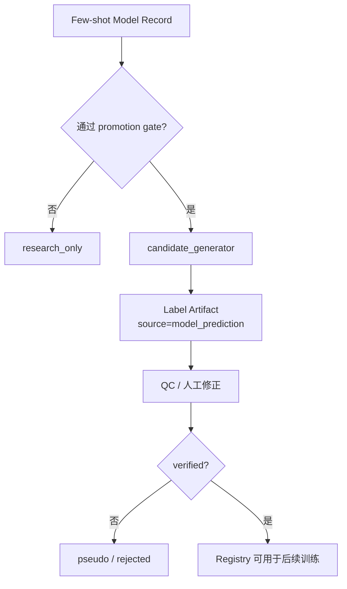

# Few-Shot Learning, In-Context Learning, TTA and Continual Learning for Medical Image Segmentation

> 本文由 `docs/research/originals/` 下三份原始调研文档合并优化而来：
>
> - `few_shot_learning_original.md`
> - `in_context_and_continual_learning_original.md`
> - `test_time_adaptation_continual_interactive_original.md`
>
> 写作目标：先形成一份便于快速理解的技术综述，再单独讨论这些技术如何进入当前分割平台。本文不把调研记录里的性能排名、GitHub star、会议状态等不稳定信息写成确定事实；涉及开源可尝试性时，以 2026-06-09 可核查结果或原文给出的代码链接为准。

## Key Points

- 少样本学习的核心不是“数据少也能训练”，而是围绕 support/query/test protocol、采样重复、跨域泛化和过拟合控制建立可复现实验。
- 经典 few-shot learning 可以分成数据生成/增强、度量学习、元学习和迁移学习四条线。医学分割落地时，迁移学习、强增强、原型/度量方法更容易先试；复杂元学习不应作为第一实现起点。
- 基础模型把少样本从“训练时少样本”推进到“推理时给上下文示例”。Painter、SegGPT、LISA、Medical Vision Generalist、SegICL、M3D、MedVerse 都值得理解，但 2D/自然图像方法不能直接等同于 3D 全身器官分割可用。
- TTA、continual learning、interactive learning 解决的是部署后域偏移、模型更新和人机协同问题。它们与 few-shot 有联系，但不应混成同一个实现模块。
- 对当前分割平台，建议先做 retrospective few-shot benchmark：用 verified labels 构建 Dataset Snapshot，跑 nnU-Net low-shot baseline，再把 foundation/ICL/TTA/continual 方法作为后续 Adapter 候选。

## Reading Guide

| 你想快速了解什么 | 建议阅读 |
| --- | --- |
| 少样本学习有哪些主流路线 | 第 1 到 3 节 |
| 三份原始文档里提到的权威论文和技术 | 第 3、4、5、10 节 |
| 哪些方法有代码可以尝试 | 第 6 节 |
| 哪些内容适合当前平台先做 | 第 7 到 9 节 |
| 实现时如何设计 Dataset Snapshot / Adapter / Model Record | 第 8、9 节 |

---

# Part I. 调研综述

## 1. Few-Shot Learning 的基本问题

Few-shot learning 研究的是模型如何用很少的标注样本学习新类别、新任务或新域。标准设定通常包含：

- **Support set**：少量可见标注，用于训练、微调、度量、prompt 或 in-context 示例。
- **Query set**：用于评价模型能否泛化到未见样本。
- **N-way K-shot**：N 个类别，每类 K 个支持样本。
- **Episode / task**：一次 few-shot 任务采样。许多 meta-learning 方法通过大量 episode 学习快速适配能力。

医学图像分割里的 few-shot 与自然图像分类不同。一个 3D CT 病例包含大量切片，但它们不是独立样本；器官 label 还会受扫描范围、标注策略、伪标签质量和空间分辨率影响。因此医学分割里更合理的 shot 单位通常是**病例级 label artifact**，而不是 slice 数。

几个常见混淆需要先拆开：

| 概念 | 解决的问题 | 与 few-shot 的关系 |
| --- | --- | --- |
| Few-shot supervised learning | 少量可靠标签训练新任务 | 主问题 |
| Transfer learning | 从预训练模型或相近任务迁移 | 最常用的 few-shot 落地手段 |
| Meta-learning | 学会如何快速适应新任务 | 经典 few-shot 研究主线，工程成本较高 |
| In-context learning | 推理时给示例图像/掩膜，让模型直接完成任务 | 基础模型时代的新路线 |
| Test-time adaptation | 推理时根据目标域数据调整模型或特征 | 部署适应问题，不等于 few-shot 训练 |
| Continual learning | 新任务/新域持续加入时减少遗忘 | 模型治理问题 |
| Interactive learning | 人机交互纠错、偏好对齐或主动学习 | 标注效率问题 |

## 2. Few-Shot Learning 在医学影像中的特殊难点

Pachetti and Colantonio 的医学影像 few-shot systematic review 总结了 few-shot 在医学影像中的主要动机：标注成本高、样本不平衡、疾病或器官类别稀缺、跨机构数据差异明显。对分割任务而言，困难还要更具体：

1. **病例级样本少，切片级样本虚高**。同一病例的相邻切片高度相关，切片级划分会高估泛化能力。
2. **小器官和边界结构更脆弱**。胰腺、肾上腺、血管等结构在 few-shot 下比肝脏、肺这类大结构更容易失败。
3. **缺失标签不等于背景**。许多公开数据集只标一个或少数几个器官，未标器官不能自动当作负样本。
4. **跨域偏移强**。厂家、协议、重建核、层厚、增强/非增强、病种分布都会改变强度和形态分布。
5. **评价不能只看平均 Dice**。必须按器官、病例、中心、协议和 support 采样重复报告，否则少样本结果不可解释。

医学 few-shot 的关键不是追求一个“万能少样本算法”，而是构建一个可复现 protocol：support 怎么选，query/test 是否患者级隔离，是否重复采样，标签状态是否可靠，预处理是否固定。

## 3. 经典 Few-Shot Learning 技术谱系

第一份 original 文档覆盖了大量经典 few-shot 文献。它们可以整理为四条主线：生成/增强、度量学习、元学习、迁移学习。下面按“技术理解 + 代表论文 + 对医学分割的价值”归纳。

### 3.1 早期生成式和样本合成方法

早期 one-shot / low-shot 研究常通过显式建模、共享变换、部件组合或特征生成来弥补样本不足。这些方法对当前 3D 医学分割不是直接可用工具，但它们奠定了两个思想：少样本学习需要可迁移的变形/变异知识；生成样本时不能只复制原图，而要学习类别内变化。

| 代表工作 | 原始文档记录的要点 | 对当前理解的价值 |
| --- | --- | --- |
| Learning from one example through shared densities on transforms | 利用变换共享密度从单样本学习 | 早期 one-shot 思路，强调变换先验 |
| Fei-Fei et al., Learning Generative Visual Models from Few Training Examples | 用概率生成模型估计少样本类别 | 代表早期生成式 few-shot |
| Lake et al., One-shot learning with hierarchical nonparametric Bayesian model / Bayesian Program Learning | 用层级贝叶斯或程序生成解释字符概念 | 说明强先验能显著降低样本需求 |
| Pattern recognition from one example by chopping | 随机划分和组合预测器 | 早期集成/组合思路 |
| One Shot Learning via Compositions of Meaningful Patches | 通过有意义 patch 组合做 one-shot | 对局部解剖部件建模有启发 |
| Towards a Neural Statistician | 用深度网络为数据集学习统计表示 | 与后来的 set encoder / context encoder 思路相关 |

在医学分割中，这条线的直接落点通常不是“生成整套可训练 CT 标签”，而是：

- 学习形状/变形先验。
- 做强数据增强。
- 在少样本设置中使用形态约束或边界约束。
- 对 support set 提取可迁移统计信息。

### 3.2 数据增强与特征增强

数据增强是 few-shot 里最朴素、也最容易先落地的方向。原始文档区分了监督增强和无监督/生成增强，代表方法包括 FFT、AGA、Dual TriNet、ABS-Net、Hariharan 的 feature hallucination、Delta-encoder、DAGAN、IDeMe-Net 等。

| 代表工作 | 核心思想 | 是否适合医学分割第一阶段 |
| --- | --- | --- |
| Feature Trajectory Transfer | 利用连续属性轨迹合成特征 | 作为思想参考 |
| Attribute Guided Augmentation / ABS-Net | 用属性或属性库引导增强 | 医学器官属性定义困难，暂不优先 |
| Low-shot Visual Recognition by Shrinking and Hallucinating Features | 学习类内变异并 hallucinate 特征 | 对特征级增强有启发 |
| Delta-encoder | 从辅助类提取可迁移类内变化 | 对跨器官/跨任务迁移有启发 |
| Low-Shot Learning from Imaginary Data | 生成器合成特征 | 可作为研究方向 |
| DAGAN | 条件 GAN 生成增强样本 | 医学分割风险较高，需强验证 |
| IDeMe-Net | 为支持样本生成形变图像 | 与医学形变增强有较近关系 |

对当前平台，增强策略应从简单可控的医学图像增强开始，例如强度扰动、spacing-aware crop、elastic deformation、左右翻转限制、器官区域 oversampling。复杂生成式增强只有在 baseline 稳定后才值得加入。

### 3.3 度量学习和原型方法

度量学习路线把 few-shot 转成“support 和 query 在 embedding 空间中如何匹配”的问题。Siamese Networks、Triplet Networks、Matching Networks、Prototypical Networks、Relation Networks 是这条线的核心文献。

| 代表工作 | 核心思想 | 对分割的启发 |
| --- | --- | --- |
| Siamese neural networks for one-shot image recognition | 用样本对学习相似度 | support/query 匹配的基本形式 |
| Deep Triplet Ranking Networks | 用 anchor-positive-negative 三元组学习距离 | 对 hard negative 和器官相似结构有启发 |
| Matching Networks | support set 条件下的 attention/nearest-neighbor 风格预测 | episodic few-shot 的经典方法 |
| Prototypical Networks | 每类 support embedding 平均形成 prototype | 很适合解释“器官原型” |
| Relation Networks | 学习 query-support 的非线性关系 | 比固定距离更灵活 |

医学分割中，原型/度量方法的典型做法是：用 support image 和 support mask 提取前景/背景或器官原型，再把 query pixel/voxel 映射到同一 embedding 空间进行分割。这条线比复杂 meta-learning 更容易解释，但要处理 3D patch、器官尺度差异和背景多样性。

### 3.4 元学习

元学习希望模型在大量训练任务上学到“如何快速学习”。原始文档按 L2M、L2F、L2P、L2A、L2R 做了归类。

| 类别 | 含义 | 代表工作 | 当前判断 |
| --- | --- | --- | --- |
| L2M | Learn to Measure，学习度量 | Matching Nets、ProtoNets、Relation Nets | 可作为原型分割思路 |
| L2F | Learn to Fine-tune，学习快速微调 | MAML、Meta-Learner LSTM | 工程复杂，第一阶段不优先 |
| L2P | Learn to Parameterize / Predict Parameters | Siamese Learnet、LGM-Net、Regression Nets | 更偏研究 |
| L2A | Learn to Adjust / Adapt | Meta Networks、CSNs | 与动态权重/适配器相关 |
| L2R | Learn to Remember / Regularize | MANN、Attentive Recurrent Comparators | 与记忆机制有关 |

MAML 是 L2F 的代表：它学习一个适合快速微调的初始化，使模型在新任务上通过少量梯度步适配。这个思想对医学分割有吸引力，但实际平台接入成本高：需要 episode 构造、任务分布定义、显存预算和大量实验。若目标是 10 月 30 日前搭平台流程，MAML 类方法不应作为第一条实现主线。

### 3.5 迁移学习和参数高效微调

迁移学习是医学影像 few-shot 最现实的路线。做法包括：

- 从大规模医学数据预训练模型，再在少量目标标签上 fine-tune。
- 从相近任务迁移，例如腹部多器官模型迁移到单器官任务。
- 冻结 backbone，只训练 decoder/head/adapter/LoRA。
- 使用 nnU-Net 这类强 baseline，在少样本条件下建立可复现上界/下界。

参数高效微调在基础模型时代更重要。Adapter、prompt tuning、LoRA 通过少量可训练参数适配新任务，降低显存和训练成本。原始文档提到 Adapter-Enhanced Semantic Prompting、Dual-Modality Guided Prompt、CL-LoRA、EWC-LoRA 等方向。需要注意：许多 PEFT/continual 方法来自分类或多模态任务，不能直接推断到 3D 医学分割。

## 4. Foundation Model 与 In-Context Visual Learning

第二份 original 文档的重点是基础模型时代的少样本：模型不一定在目标任务上重新训练，而是通过上下文示例、文本指令或多模态 prompt 完成分割。

Zhou et al. 的 *Image Segmentation in Foundation Model Era: A Survey* 可作为这部分的综述入口。它把 segmentation foundation models 放在更大的框架里讨论：通用分割、promptable segmentation、open-vocabulary segmentation、in-context segmentation 和医学影像适配。

### 4.1 Agent + SAM / VLM

原文记录了 “Few-Shot Classification & Segmentation Using Large Language Models Agent”。这类路线通常让 GPT-4V 或多模态大模型观察 support/query，再调用 SAM 或其他分割工具。它的价值在于工作流：LLM 负责推理和工具编排，分割模型负责 mask。

局限也很明确：

- 工具链复杂，稳定性依赖 LLM、prompt、SAM 和后处理。
- 医学 3D 场景里，LLM 直接判断解剖结构的可靠性不足。
- 自动化闭环必须记录每一步推理和调用，否则不可审计。

这类方法适合作为原型验证或 annotation assistant，不适合作为第一版训练主线。

### 4.2 LISA：语言推理分割

LISA (*Reasoning Segmentation via Large Language Model*) 定义了 reasoning segmentation：输入复杂或隐含的文本表达，输出对应区域的 mask。它把语言模型和分割模型连接起来，使模型能根据自然语言定位目标。

对医学分割的启发：

- 未来可以用自然语言指定器官、病灶或组合区域。
- 可以支持“分割左肾上极附近病灶”这类复杂请求。
- 对全身器官分割，LISA 本身不是直接可用医学模型，需要医学数据、3D 输入和安全验证。

开源状态：已核查到 [JIA-Lab-research/LISA](https://github.com/JIA-Lab-research/LISA) 仓库，可用于理解 reasoning segmentation 和 VLM-mask 连接方式。

### 4.3 Painter 与 SegGPT：纯视觉上下文学习

Painter (*Images Speak in Images*) 是视觉 in-context learning 的代表工作。它把不同视觉任务统一成 image-in image-out 格式：给模型一个示例输入和示例输出，再让模型对 query 生成输出。SegGPT 在 Painter 思路上更聚焦 segmentation，用上下文示例执行目标、语义、部件、轮廓和视频分割。

这条线对 few-shot segmentation 很关键，因为它把 support image + support mask 当成 prompt，而不是训练样本。

对医学分割的限制：

- 多数设置偏 2D，自然图像 benchmark 与 3D CT/MR 差异很大。
- 上下文示例选择会显著影响结果，必须记录 support selection。
- 输出需要和医学 label map、空间坐标、spacing 对齐。

开源状态：检索到 BAAI 的 [Painter / SegGPT series repository](https://github.com/baaivision/Painter)。可用于研究 2D ICL 分割范式，不应直接推断到 3D 全身分割可生产。

与 MAE 路线并行，Bai et al.（CVPR 2024）探索了一条更接近 LLM 的自回归视觉建模路线：用预训练 VQGAN 将图像离散化为视觉 token 序列，再用 decoder-only Transformer 做 next-token prediction。原始文档指出该方向仍处前沿，模型规模远小于 LLM，且任意粒度分割、对象幻觉和部署效率是未解决的挑战。

### 4.4 Medical Vision Generalist / Medical MIM

Medical Vision Generalist (*Unifying Medical Imaging Tasks in Context*) 将医学图像任务放入 in-context 统一框架。原始文档记录其使用 Medical MIM，即在医学图像数据上通过 MAE 思路预训练的 ViT，再把示例、查询和输出组织成统一任务。

事实边界：已核查到 [arXiv:2406.05565](https://arxiv.org/abs/2406.05565)。OpenReview 检索结果显示其 ICLR 2025 submission 状态不适合在本文中写成稳定接收事实，因此本文仅按 arXiv 候选方法记录。

对平台的启发：

- 支持多任务统一建模，和平台的 task label map 思路相近。
- 可能用于少量示例驱动的候选 mask 生成。
- 需要复核代码、数据格式、3D 支持程度和 license。

### 4.5 SegICL：医学分割 in-context learning

SegICL 直接面向医学图像分割，原文记录其支持 text-guided segmentation 和 image-mask pair in-context learning。已核查到 [arXiv:2403.16578](https://arxiv.org/abs/2403.16578)。

当前判断：

- 论文方向与平台需求高度相关。
- 未稳定检索到清晰官方代码仓库，因此不应作为“马上试跑”的第一选择。
- 如果后续复现，需要重点验证 3D 体数据、全分辨率、器官 label map、多器官输出和显存。

### 4.6 Diffusion-based In-Context Learning 与 DiffSS

原文记录了 diffusion in-context learning 和 DiffSS。扩散模型可以把条件生成、样本合成和分割掩膜生成连接起来。它的潜力在于：通过 support 示例和随机生成过程补充少样本下的分布覆盖。

当前不建议优先实现，原因是：

- 推理和训练成本通常较高。
- 医学分割更关注空间精度和拓扑结构，生成式方法需要严格 QC。
- 如果作为伪标签生成器，必须防止“看起来合理但解剖错误”的 mask 回流训练集。

### 4.7 FM-FSOD：目标检测方向的基础模型少样本

FM-FSOD 是少样本目标检测方向的基础模型方法。原文把它作为 few-shot object detection 的代表，强调视觉语言模型和 foundation model 在新类检测上的优势。

它对器官分割平台不是直接方法，但有两点参考价值：

- support/query + prototype 的结构可借鉴。
- open-vocabulary / vision-language 机制可启发未来“文本指定器官/结构”的能力。

由于它是 detection 而不是 3D segmentation，本文不把它列为当前分割平台候选实现主线。

### 4.8 M3D 与 MedVerse：3D 医学基础模型方向

M3D (*Advancing 3D Medical Image Analysis with Multi-Modal Large Language Models*) 面向 3D 医学多模态分析，包含 M3D-Data 和 M3D-LaMed 等工作。已核查到 [arXiv:2404.00578](https://arxiv.org/abs/2404.00578) 和 [BAAI-DCAI/M3D](https://github.com/BAAI-DCAI/M3D) 仓库。

MedVerse 面向全分辨率 3D 医学图像任务，原文强调它和 SegGPT 一样采用“上下文示例 + 查询图像”的 ICL 思路，但目标是 3D segmentation、transformation、enhancement 等任务。已核查到 [arXiv:2509.09232](https://arxiv.org/abs/2509.09232)、AAAI/OJS 论文页面和 [jiesihu/Medverse](https://github.com/jiesihu/Medverse) 仓库。

这两个方向比 2D ICL 更接近当前平台，但仍应按研究验证处理：

- 需要确认输入体数据尺寸、patch/window 策略和显存需求。
- 需要确认输出 mask 是否能稳定对齐平台 label map。
- 需要确认模型 license、预训练权重可用性、依赖版本和数据许可。
- 需要用平台 Snapshot 做本地小规模复现，而不是直接接入 label_generation。

## 5. TTA、Continual Learning 与 Interactive Learning

第三份 original 文档覆盖模型部署后的适应问题。它们和 few-shot 的关系是：当模型面对少量新域数据、新任务标签或用户交互时，如何在不大规模重训的情况下变得更适合当前场景。

### 5.1 Test-Time Adaptation

TTA 在测试阶段使用目标域数据调整模型或特征。代表思想包括：

- **AdaBN**：用目标域 batch/volume 的 BN 统计量替换或更新源域统计量，缓解特征分布偏移。已核查到 *Revisiting Batch Normalization For Practical Domain Adaptation*。
- **TENT**：测试时最小化预测熵，通常更新 BN affine 参数。已核查到 OpenReview 和 [DequanWang/TENT](https://github.com/DequanWang/TENT)。
- **On-the-Fly TTA for Medical Image Segmentation**：原文记录其通过 domain code 调整分割网络归一化层，给出 [On-The-Fly-Adaptation](https://github.com/jeya-maria-jose/On-The-Fly-Adaptation) 代码链接。
- **SicTTA**：单图像持续 TTA，用于医学图像分割，已核查到 ScienceDirect 页面和 [HiLab-git/SicTTA](https://github.com/HiLab-git/SicTTA)。
- **Progressive Test Time Energy Adaptation / PTTEA**：原文记录为能量模型 TTA，并给出代码链接。
- **Buffer TTA**：原文记录通过轻量 buffer layers 增加测试时可更新容量。
- **PBTTA**：原型库驱动的医学超声分割 TTA，原文记录为 Medical Physics 论文，代码未给出。

TTA 适合解决跨中心、跨协议、跨设备的推理域偏移。但 TTA 的风险是模型在没有标签监督时发生错误自适应。医学平台使用 TTA 时必须记录：

- 是否更新模型参数。
- 更新了哪些层。
- 是否保存 adapted model。
- 是否只对当前病例临时适应。
- 是否允许生成伪标签。

### 5.2 nnSAM：SAM 先验增强 nnU-Net

nnSAM 把 SAM 的视觉特征提取能力嵌入 nnU-Net，同时保留 nnU-Net 的数据中心自动配置能力。原始文档记录其在少样本训练下更突出，并描述了双编码器结构：nnU-Net encoder 与 SAM encoder 特征连接后进入 nnU-Net decoder；SAM encoder 可冻结，实际可用 Mobile-SAM 降低计算量。

已核查来源：

- [PubMed: Plug-and-play segment anything model improves nnUNet performance](https://pubmed.ncbi.nlm.nih.gov/39466578/)
- [Kent0n-Li/nnSAM](https://github.com/Kent0n-Li/nnSAM)

对当前平台，nnSAM 比许多 ICL 方法更容易成为第二阶段候选，因为它基于 nnU-Net 生态，和现有训练域更近。主要验证点是 3D 输入切片化、SAM 特征融合、训练显存和不同器官的收益差异。

### 5.3 Continual / Lifelong Learning

持续学习处理模型不断接收新任务、新域或新类别时的灾难性遗忘。原文把方法分为：

- **Regularization**：EWC、LWF 等，在 loss 中约束重要参数。
- **Replay**：保存旧样本、特征或生成样本，训练新任务时回放。
- **Dynamic Model**：为新任务扩展 Adapter、LoRA 或分支，通过门控选择。

代表条目：

| 方法 | 来源状态 | 核心思想 | 当前判断 |
| --- | --- | --- | --- |
| Lifelong nnU-Net | 已核查 Scientific Reports / PubMed，原文给出代码 | 标准化医学持续分割框架，包含 fine-tuning、EWC、MiB 等基线 | 值得后续作为 continual learning 基线 |
| CLMS | 原文给出 MIA DOI 和代码链接；搜索只间接确认引用 | source-free continual learning 处理医学分割域差异 | 实施前需复核一手页面 |
| CLMU-Net | 原文给出 arXiv 和代码链接 | 脑病灶分割的模态无关持续域增量 | 研究候选 |
| CL-LoRA | 已核查 CVPR 2025 和官方代码 | 用双 LoRA 结构处理类别增量学习 | 思路可借鉴，不是医学分割专用 |
| Foundation model + LoRA | 原文记录 | 冻结预训练骨干，为每个任务训练 LoRA 插件 | 适合未来多任务模型治理 |
| EWC-LoRA | 原文给出 arXiv 和代码链接 | 低秩持续学习中的权重正则 | 研究候选 |

持续学习进入平台前必须先有 Model Registry、评估基准、回滚机制和旧任务保留集。否则“持续更新”会变成不可审计的模型漂移。

### 5.4 Interactive Learning 与主动标注

Interactive learning 关注人机协同。原文涉及 MONAI Label、SPA、VerSe、多标注者个性化等方向。

| 方法/工具 | 来源状态 | 作用 |
| --- | --- | --- |
| MONAI Label | 已核查官方仓库和 PubMed | AI-assisted interactive labeling，适合连接 3D Slicer 等标注工具 |
| SPA | 已核查 ICCV 2025 Open Access 和代码仓库 | 针对医学分割不确定性做用户偏好对齐 |
| VerSe | 原文给出代码链接 | 多 query prompt 的心脏 MRI 分割 |
| D-Persona | 原文记录 CVPR 2024 和代码 | 多标注者差异和个性化分割 |
| ProSeg / ProSona | 原文记录 arXiv/代码 | 多专家或 prompt-guided personalization |

对平台而言，interactive learning 更接近 labeling 域，而不是 training 域。它的价值是减少人工标注成本，让模型输出先被人修正，再回流为高质量标签。

### 5.5 分布外检测与安全保障

原始文档指出 OOD 检测贯穿 TTA、持续学习和交互式学习三层：模型应对未知输入保持判断能力，避免对分布外数据给出错误且过度自信的预测。平台在设计任何自适应或持续更新机制时，都应考虑 OOD 门控（例如基于预测熵、特征距离或解剖合理性），在不确定时回退到安全模式而非静默输出错误结果。

## 6. 开源可尝试性与优先级

下表把三份 original 里出现的主要技术按“是否能尝试”和“当前优先级”整理。开源状态分三类：

- **已核查**：本次已通过论文页、官方仓库、PubMed 或出版社页面核对。
- **原文给出**：原始文档提供代码链接，但本文未逐一打开复核。
- **未确认**：未稳定检索到官方代码或状态不清。

| 技术/方法 | 类型 | 代码状态 | 当前可尝试性 | 优先级 |
| --- | --- | --- | --- | --- |
| nnU-Net | 医学分割强 baseline | 已核查论文；代码生态成熟 | 立即用于 low-shot baseline | P0 |
| MONAI Label | 交互式标注框架 | 已核查 | 可调研标注工具链 | P1 |
| nnSAM | SAM + nnU-Net | 已核查 | 可作为第二阶段 low-shot 增强 | P1 |
| Lifelong nnU-Net | 持续学习医学分割 | 已核查论文；原文给出代码 | 有模型治理后再试 | P2 |
| TENT | 通用 TTA | 已核查 | 可作为 TTA 基础理解和实验参考 | P2 |
| SicTTA | 医学分割 TTA | 已核查 | 可用于后续域偏移实验 | P2 |
| Painter / SegGPT | 视觉 ICL 分割 | 已核查代码线索 | 可研究 2D ICL，不作为 3D 主线 | P2 |
| LISA | 文本推理分割 | 已核查 | 可研究语言指定分割 | P2 |
| M3D | 3D 医学多模态基础模型 | 已核查 | 可做研究复现 | P2 |
| MedVerse | 3D 医学 ICL | 已核查 | 可做研究复现，需查 license/显存 | P2 |
| Medical Vision Generalist | 医学 ICL | 已核查 arXiv；会议状态不写死 | 候选研究 | P3 |
| SegICL | 医学 ICL 分割 | 论文已核查；代码未确认 | 先读论文，再决定复现 | P3 |
| On-the-Fly TTA | 医学分割 TTA | 原文给出代码 | 后续域适应实验 | P3 |
| PTTEA | TTA | 原文给出代码 | 实施前复核 | P3 |
| Buffer TTA | TTA | 原文给出代码 | 偏通用分类/TTA，暂缓 | P3 |
| PBTTA | 医学超声 TTA | 原文记录代码不可用 | 暂缓 | P4 |
| CLMS / CLMU-Net / EWC-LoRA | 持续学习 | 原文给出线索 | 实施前复核 | P4 |
| DiffSS / diffusion ICL | 生成式 few-shot 分割 | 原文记录 | 暂缓 | P4 |
| FM-FSOD | 少样本检测 | 方向相关但非分割 | 仅作为 detection 参考 | P4 |

---

# Part II. 与当前分割平台结合

## 7. 当前平台应该从哪里开始

在平台落地上，few-shot 不应从最复杂的基础模型开始。建议第一阶段目标是建立一个可复现的 retrospective benchmark：


第一阶段只需要回答四个问题：

1. 平台能否从 Data Registry 冻结一个任务级 Dataset Snapshot？
2. 平台能否按病例级 shot 采样 support/query/test？
3. 平台能否导出 nnU-Net 可训练数据，同时不把缺失标签误当背景？
4. 平台能否把训练结果、指标和失败病例写成 Model Record？

如果这四件事没有跑通，直接接 SegICL、MedVerse、TTA 或 continual learning 都会造成结果不可解释。

## 8. Dataset Snapshot、Few-shot Protocol 与 Model Record

### 8.1 Dataset Snapshot

Snapshot 是一次实验的数据冻结版本。它应该记录数据、标签、空间处理、任务 label map 和 split。

```yaml
snapshot_id: snap_abdomen_8organs_2026_06_09_v1
source_registry_version: registry_2026_06_09
task_id: abdomen_8organs
modality: CT
region: abdomen
label_map_version: anatomy_vocabulary_2026_06_09
label_policy:
  allowed_states_for_training: ["verified", "gold"]
  allowed_sources_for_training: ["manual", "manual_corrected_pseudo"]
  missing_label_policy: "unknown_not_background"
preprocessing:
  stage: snapshot_export
  orientation: RAS
  resample:
    enabled: true
    target_spacing: [1.5, 1.5, 3.0]
    interpolation_image: linear
    interpolation_label: nearest
splits:
  train_pool: splits/train_pool.txt
  validation: splits/validation.txt
  test: splits/test.txt
```

如果 coarse 任务需要低分辨率，resampling 策略就应该在 Snapshot 中记录，并在 export 阶段执行。否则后续 Model Record 无法解释模型到底学的是原始空间还是低分辨率空间。

### 8.2 Few-shot Protocol

Protocol 记录少样本实验如何构造：

```yaml
protocol_id: abdomen_8organs_5shot_r5
shot_unit: case
shots_per_anatomy:
  liver: 5
  spleen: 5
  pancreas: 5
  left_kidney: 5
  right_kidney: 5
repeat_count: 5
support_sampling:
  patient_level_unique: true
  balance_by_center: true
  random_seed_base: 20260609
query_policy:
  fixed_validation_set: true
  fixed_test_set: true
```

这里的关键是 shot 按病例定义，并且 support、validation、test 患者级隔离。

### 8.3 Model Record

Model Record 记录模型从哪里来、用什么数据、什么配置、什么指标、能不能进入下一步。

```yaml
model_id: model_abdomen_8organs_nnunet_lowshot_5shot_r1
method_id: nnunet_lowshot
snapshot_id: snap_abdomen_8organs_2026_06_09_v1
protocol_id: abdomen_8organs_5shot_r5
training_label_states: ["verified", "gold"]
metrics:
  dice_mean_by_anatomy:
    liver: null
    pancreas: null
  hd95_by_anatomy:
    liver: null
    pancreas: null
limitations:
  - "Only evaluated on abdomen CT validation/test split."
  - "Not approved for automatic verified label creation."
promotion_status: research_only
```

`null` 表示字段示例，不代表性能数值。

## 9. FewShot Adapter 设计

FewShot Adapter 应该属于 Training 域的一个实验适配层，而不是替代训练域。

它的职责：

1. 读取 Dataset Snapshot。
2. 根据 few-shot protocol 生成 support/query/test。
3. 调用具体算法后端，例如 nnU-Net、nnSAM、M3D、MedVerse 或其他自定义算法。
4. 输出 Model Record、评估报告和可审计预测。

建议目录：

```text
adapters/
  fewshot/
    README.md
    schemas/
      fewshot_protocol.schema.yaml
      method_config.schema.yaml
    samplers/
      case_level_sampler.py
      anatomy_balanced_sampler.py
    exporters/
      nnunet_lowshot_exporter.py
    runners/
      run_nnunet_lowshot.py
      run_foundation_candidate.py
    evaluators/
      metrics_by_anatomy.py
      failure_case_report.py
    records/
      model_record_writer.py
```

与 nnU-Net 的关系：


这意味着当前 nnU-Net 训练管线不需要立刻改造。需要新增的是上游 snapshot/protocol/export 逻辑和下游 evaluation/model-record 逻辑。

## 10. 实验和评估设计

第一轮实验建议：

| 实验 | 目的 |
| --- | --- |
| full-data nnU-Net | 建立任务上界 |
| 1-shot nnU-Net | 压力测试 |
| 3-shot nnU-Net | 极低样本测试 |
| 5-shot nnU-Net | 初始实用线 |
| 10/20-shot nnU-Net | 样本效率曲线 |
| nnSAM low-shot | 第二阶段增强候选 |
| foundation/ICL candidate | 研究候选，不影响主流程 |

评估必须至少包含：

- anatomy-level Dice、HD95、体积误差。
- case-level failure report。
- center/protocol/spacing 分层。
- support repeat mean、std、worst repeat。
- 与 full-data baseline 的相对性能。

候选进入 label_generation 前，应通过任务级 promotion gate：

```yaml
promotion_gate:
  min_repeats: 5
  require_test_set: true
  dice_relative_to_full_data_baseline:
    minimum_ratio: 0.90
  max_cross_center_dice_drop: 0.05
  max_failure_rate: 0.05
  require_manual_review_before_verified: true
```

这些阈值是工程建议，不是文献事实。不同器官和任务应调整。

## 11. 标签状态和缺失标签

Few-shot 对标签质量极敏感。一个错误 support mask 对模型的影响会被放大。

训练导出时必须区分：

| 状态 | 含义 | 是否可作为该器官训练标签 |
| --- | --- | --- |
| present_verified | 器官存在，人工确认 mask 可用 | 可以 |
| present_pseudo_high_quality | 器官存在，高质量伪标签 | 由任务规则决定 |
| present_corrected_pseudo | 伪标签经人工修正 | 通常可以 |
| missing_unlabeled | 没有标注，未知状态 | 不可当背景 |
| absent_verified | 人工确认器官不存在或不在范围内 | 可作为缺失/不存在证据 |
| out_of_fov | 器官不在扫描范围 | 不参与该器官训练 |

这不要求每个病例每个器官都人工填一张复杂表。平台可以分层维护：

1. Dataset 层记录理论覆盖区域。
2. Case 层记录扫描范围、模态和空间信息。
3. Label Artifact 层记录某个器官 mask 的来源、状态和 hash。
4. Task Export 层决定本次训练纳入哪些标签。

进入 support set 的 label artifact 必须状态明确。未进入训练的器官不需要强行补全。

## 12. 实施顺序

### Phase A：建立 low-shot baseline

目标：一条任务完整跑通。

1. 选择 `lung` 或 `abdomen_8organs`。
2. 冻结一个 verified-label Dataset Snapshot。
3. 构造 1/3/5/10-shot protocol。
4. 导出 nnU-Net 数据。
5. 训练并导回评估结果。
6. 生成 Model Record。

### Phase B：加入一个增强方法

候选优先级：

1. nnU-Net transfer/fine-tune。
2. nnSAM。
3. 原型/度量分割 baseline。
4. M3D/MedVerse 离线复现实验。

所有方法必须共享同一 Snapshot、同一 test set，否则不可比较。

### Phase C：进入标签生成闭环

只有 promotion gate 通过后，模型才能进入 label_generation：



TTA、continual learning、interactive learning 可以在这个闭环之后逐步加入，而不是第一阶段塞进主训练。

---

# Part III. 文献索引与事实边界

## 13. 本文已核查的关键来源

| 主题 | 来源 |
| --- | --- |
| 医学影像 few-shot systematic review | [ScienceDirect](https://www.sciencedirect.com/science/article/pii/S093336572400191X), [arXiv 2309.11433](https://arxiv.org/abs/2309.11433), [PubMed](https://pubmed.ncbi.nlm.nih.gov/39178621/) |
| Foundation-model segmentation survey | [arXiv 2408.12957](https://arxiv.org/abs/2408.12957) |
| nnU-Net | [Nature Methods](https://www.nature.com/articles/s41592-020-01008-z), [PubMed](https://pubmed.ncbi.nlm.nih.gov/33288961/) |
| Painter | [CVF Open Access](https://openaccess.thecvf.com/content/CVPR2023/papers/Wang_Images_Speak_in_Images_A_Generalist_Painter_for_In-Context_Visual_CVPR_2023_paper.pdf), [arXiv 2212.02499](https://arxiv.org/abs/2212.02499), [GitHub](https://github.com/baaivision/Painter) |
| SegGPT | [arXiv 2304.03284](https://arxiv.org/abs/2304.03284) |
| LISA | [arXiv 2308.00692](https://arxiv.org/abs/2308.00692), [GitHub](https://github.com/JIA-Lab-research/LISA) |
| Medical Vision Generalist | [arXiv 2406.05565](https://arxiv.org/abs/2406.05565), [OpenReview status page](https://openreview.net/forum?id=EtJWnTnqku) |
| SegICL | [arXiv 2403.16578](https://arxiv.org/abs/2403.16578) |
| M3D | [arXiv 2404.00578](https://arxiv.org/abs/2404.00578), [GitHub](https://github.com/BAAI-DCAI/M3D) |
| MedVerse | [arXiv 2509.09232](https://arxiv.org/abs/2509.09232), [AAAI/OJS](https://ojs.aaai.org/index.php/AAAI/article/view/42490/46451), [GitHub](https://github.com/jiesihu/Medverse) |
| AdaBN | [arXiv 1603.04779](https://arxiv.org/abs/1603.04779) |
| TENT | [OpenReview](https://openreview.net/forum?id=uXl3bZLkr3c), [arXiv 2006.10726](https://arxiv.org/abs/2006.10726), [GitHub](https://github.com/DequanWang/TENT) |
| On-the-Fly TTA | [arXiv 2203.05574](https://arxiv.org/abs/2203.05574) |
| SicTTA | [ScienceDirect](https://www.sciencedirect.com/science/article/abs/pii/S1361841525004050), [GitHub](https://github.com/HiLab-git/SicTTA) |
| nnSAM | [PubMed](https://pubmed.ncbi.nlm.nih.gov/39466578/), [Wiley](https://aapm.onlinelibrary.wiley.com/doi/10.1002/mp.17481), [GitHub](https://github.com/Kent0n-Li/nnSAM) |
| Lifelong nnU-Net | [Scientific Reports](https://www.nature.com/articles/s41598-023-34484-2), [PubMed](https://pubmed.ncbi.nlm.nih.gov/37296233/) |
| CL-LoRA | [CVF Open Access](https://openaccess.thecvf.com/content/CVPR2025/papers/He_CL-LoRA_Continual_Low-Rank_Adaptation_for_Rehearsal-Free_Class-Incremental_Learning_CVPR_2025_paper.pdf), [GitHub](https://github.com/JiangpengHe/CL-LoRA) |
| MONAI Label | [GitHub](https://github.com/project-monai/monailabel), [PubMed](https://pubmed.ncbi.nlm.nih.gov/38776843/) |
| SPA | [ICCV Open Access](https://openaccess.thecvf.com/content/ICCV2025/html/Zhu_SPA_Efficient_User-Preference_Alignment_against_Uncertainty_in_Medical_Image_Segmentation_ICCV_2025_paper.html), [GitHub](https://github.com/SuperMedIntel/SPA) |

## 14. 原始文档吸收的经典 Few-Shot 论文

这些论文来自第一份 original 的系统整理。本文按技术脉络吸收其思想；若要在正式论文或报告中精确引用页码、会议和年份，应再查原始出版信息。

| 类别 | 代表论文 |
| --- | --- |
| Few-shot survey | [A Survey on Machine Learning from Few Samples](https://arxiv.org/pdf/2009.02653) |
| 早期 one-shot / 生成式 | [Learning from one example through shared densities on transforms](https://ieeexplore.ieee.org/abstract/document/855856); [Learning Generative Visual Models from Few Training Examples](https://cs.nyu.edu/~fergus/papers/Fei-Fei_GMBV04.pdf); [One-shot learning with a hierarchical nonparametric Bayesian model](https://dl.acm.org/doi/10.5555/3045796.3045815); [One shot learning of simple visual concepts](https://utstat.toronto.edu/~rsalakhu/papers/LakeEtAl2011CogSci.pdf); [Pattern recognition from one example by chopping](https://proceedings.neurips.cc/paper/2005/file/d0bb8259d8fe3c7df4554dab9d7da3c9-Paper.pdf); [One Shot Learning via Compositions of Meaningful Patches](https://www.cs.jhu.edu/~ayuille/Pubs15/AlexWongOneShotCVPR2015.pdf); [Towards a Neural Statistician](https://arxiv.org/pdf/1606.02185) |
| 数据/特征增强 | [One-Shot Learning of Scene Locations via Feature Trajectory Transfer](https://openaccess.thecvf.com/content_cvpr_2016/papers/Kwitt_One-Shot_Learning_of_CVPR_2016_paper.pdf); [AGA: Attribute Guided Augmentation](https://arxiv.org/pdf/1612.02559); [Multi-level Semantic Feature Augmentation for One-shot Learning](https://arxiv.org/pdf/1804.05298); [Attribute-Based Synthetic Network](https://www.sciencedirect.com/science/article/pii/S0031320318300876); [Attribute-Based Transfer Learning for Object Categorization](https://link.springer.com/content/pdf/10.1007/978-3-642-15555-0_10.pdf); [Low-shot Visual Recognition by Shrinking and Hallucinating Features](https://openaccess.thecvf.com/content_ICCV_2017/papers/Hariharan_Low-Shot_Visual_Recognition_ICCV_2017_paper.pdf); [Delta-encoder](https://arxiv.org/pdf/1806.04734); [Low-Shot Learning from Imaginary Data](https://arxiv.org/pdf/1801.05401); [Low-shot Learning via Covariance-Preserving Adversarial Augmentation Networks](https://arxiv.org/abs/1810.11730); [Data Augmentation Generative Adversarial Networks](https://arxiv.org/abs/1711.04340); [Image Deformation Meta-Networks for One-Shot Learning](https://arxiv.org/abs/1905.11641) |
| 度量学习 | [Object classification from a single example utilizing class relevance metrics](https://proceedings.neurips.cc/paper/2004/file/ef1e491a766ce3127556063d49bc2f98-Paper.pdf); [Learning a kernel function for classification with small training samples](https://dl.acm.org/doi/10.1145/1143844.1143895); [Siamese neural networks for one-shot image recognition](https://www.cs.cmu.edu/~rsalakhu/papers/oneshot1.pdf); [Deep Triplet Ranking Networks for One-Shot Recognition](https://arxiv.org/abs/1804.07275) |
| 原型/关系/匹配 | [Prototypical Networks for Few-shot Learning](https://arxiv.org/pdf/1703.05175); [Matching Networks for One Shot Learning](https://arxiv.org/pdf/1606.04080); [Learning to Compare: Relation Network for Few-Shot Learning](https://arxiv.org/pdf/1711.06025) |
| 快速微调 / 元优化 | [Model-Agnostic Meta-Learning for Fast Adaptation of Deep Networks](https://arxiv.org/pdf/1703.03400); [Optimization as a model for few-shot learning](https://openreview.net/pdf?id=rJY0-Kcll) |
| 参数生成 / 动态权重 | [Learning feed-forward one-shot learners](https://arxiv.org/pdf/1606.05233); [LGM-Net](https://arxiv.org/pdf/1905.06331); [Learning to learn: Model regression networks for easy small sample learning](https://link.springer.com/content/pdf/10.1007/978-3-319-46466-4_37.pdf); [Meta Networks](https://arxiv.org/pdf/1703.00837); [Rapid Adaptation with Conditionally Shifted Neurons](https://arxiv.org/pdf/1712.09926) |
| 记忆增强 | [Meta-Learning with Memory-Augmented Neural Networks](https://proceedings.mlr.press/v48/santoro16.pdf); [Attentive Recurrent Comparators](https://arxiv.org/pdf/1703.00767) |

## 15. 原始文档吸收的 Foundation / TTA / Continual / Interactive 论文

这些条目来自第二、三份 original。本文已在正文中吸收其技术含义；下表用于保留文献线索和可尝试性判断。标注“原文记录”的条目不表示本文已经逐条复现实验或核查 license。

| 方向 | 文献/工具 | 原文要点 | 本文处理 |
| --- | --- | --- | --- |
| Foundation model survey | [Image Segmentation in Foundation Model Era: A Survey](https://arxiv.org/abs/2408.12957) | 基础模型时代图像分割综述 | 已核查，作为综述入口 |
| LLM agent + segmentation | [Few-Shot Classification & Segmentation Using Large Language Models Agent](https://arxiv.org/abs/2311.12065) | LLM agent 调用视觉/分割工具完成少样本任务 | 原文记录，作为工具编排参考 |
| Reasoning segmentation | [LISA: Reasoning Segmentation via Large Language Model](https://arxiv.org/abs/2308.00692) | 用语言推理定位并输出 mask | 已核查，研究候选 |
| Visual ICL | [Images Speak in Images: A Generalist Painter for In-Context Visual Learning](https://arxiv.org/abs/2212.02499) | image-in image-out 的视觉上下文学习 | 已核查，理解 ICL 范式 |
| Visual ICL segmentation | [SegGPT: Segmenting Everything In Context](https://arxiv.org/abs/2304.03284) | 用上下文示例做通用分割 | 已核查，2D ICL 参考 |
| Scalable visual modeling | Sequential modeling enables scalable learning for large vision models | 原文记录为 CVPR 2024 视觉序列建模方向 | 原文记录，作为基础模型训练范式参考 |
| Unified visual understanding | Towards More Unified In-context Visual Understanding | 原文记录为统一上下文视觉理解 | 原文记录，作为 ICL 扩展参考 |
| Medical ICL | [Medical Vision Generalist](https://arxiv.org/abs/2406.05565) | 医学图像任务 in-context 统一建模 | 已核查 arXiv；会议状态不写死 |
| Medical ICL segmentation | [SegICL](https://arxiv.org/abs/2403.16578) | 医学分割的多模态 in-context learning | 已核查论文；代码未确认 |
| Diffusion ICL | In-context learning unlocked for diffusion models | 原文记录为 NeurIPS 2023 diffusion ICL | 原文记录，暂不作为平台首选 |
| Few-shot semantic segmentation | [DiffSS](https://arxiv.org/abs/2307.00773) | diffusion model for few-shot semantic segmentation | 原文记录，暂缓 |
| Few-shot object detection survey | Beyond few-shot object detection: A detailed survey | 原文记录为 FSOD 综述 | 仅作检测方向参考 |
| Foundation FSOD | FM-FSOD | foundation model for few-shot object detection | 非分割主线，作为 vision-language/prototype 参考 |
| 3D medical MLLM | [M3D](https://arxiv.org/abs/2404.00578) | 3D 医学多模态大模型和数据集 | 已核查，研究复现候选 |
| 3D medical ICL | [MedVerse](https://arxiv.org/abs/2509.09232) | 全分辨率 3D 医学 ICL 模型 | 已核查，研究复现候选 |
| Interactive labeling | [MONAI Label](https://github.com/project-monai/monailabel) | AI-assisted 3D medical image labeling | 已核查，labeling 域工具参考 |
| Continual prompting | [Adapter-Enhanced Semantic Prompting for Continual Learning](https://arxiv.org/abs/2412.11074) | adapter + semantic prompt 持续学习 | 原文记录，PEFT 思路参考 |
| Multimodal continual learning | Dual-Modality Guided Prompt for Continual Learning | 原文记录为 ICLR 2025 方向 | 原文记录，实施前复核 |
| TTA index | [awesome-test-time-adaptation](https://github.com/tim-learn/awesome-test-time-adaptation/tree/main) | TTA 研究索引 | 原文记录，查方法入口 |
| AdaBN | [Revisiting Batch Normalization For Practical Domain Adaptation](https://arxiv.org/abs/1603.04779) | 用目标域 BN 统计量做域适应 | 已核查，TTA 基础 |
| TENT | [Tent: Fully Test-Time Adaptation by Entropy Minimization](https://openreview.net/forum?id=uXl3bZLkr3c) | 测试时最小化预测熵 | 已核查，TTA 基础 |
| Medical TTA | [On-the-Fly Test-time Adaptation for Medical Image Segmentation](https://arxiv.org/abs/2203.05574) | 用 domain code 调整归一化层 | 已核查论文；代码为原文给出 |
| Foundation-model TTA | Test-time Adaptation for Foundation Medical Segmentation Model without Parametric Updates | 原文记录为 ICCV 2025，无代码 | 原文记录，实施前复核 |
| Continual TTA | [SicTTA](https://www.sciencedirect.com/science/article/abs/pii/S1361841525004050) | 单图像持续 TTA，用于医学分割 | 已核查，后续域偏移候选 |
| Energy-based TTA | Progressive Test Time Energy Adaptation | 原文记录 PTTEA 和代码 | 原文记录，实施前复核 |
| Buffer TTA | [Buffer layers for Test-Time Adaptation](https://arxiv.org/abs/2510.21271) | 测试时插入轻量 buffer layers | 原文记录，偏通用 TTA |
| Prototype-bank TTA | Prototype bank-driven TTA for medical ultrasound segmentation | 原文记录 Medical Physics 论文，代码不可用 | 原文记录，超声方向参考 |
| SAM + nnU-Net | [nnSAM](https://github.com/Kent0n-Li/nnSAM) | SAM encoder + nnU-Net，小样本分割增强 | 已核查，第二阶段候选 |
| Continual survey | [Continual Learning in Medical Imaging: A Survey and Practical Analysis](https://doi.org/10.1145/3785663) | 医学影像持续学习综述 | 原文记录，背景参考 |
| Continual medicine review | [Continual Learning in Medicine: A Systematic Literature Review](https://doi.org/10.1007/s11063-024-11709-7) | 医学持续学习系统综述 | 原文记录，背景参考 |
| Lifelong segmentation | [Lifelong nnU-Net](https://www.nature.com/articles/s41598-023-34484-2) | 医学持续分割标准化框架 | 已核查，后续基线 |
| Source-free continual segmentation | CLMS | 医学分割 source-free continual learning | 原文记录，需复核一手页面 |
| Modality-incremental segmentation | [CLMU-Net](https://arxiv.org/abs/2601.13927) | 脑病灶分割的模态无关持续域增量 | 原文记录，研究候选 |
| Continual LoRA | [CL-LoRA](https://openaccess.thecvf.com/content/CVPR2025/papers/He_CL-LoRA_Continual_Low-Rank_Adaptation_for_Rehearsal-Free_Class-Incremental_Learning_CVPR_2025_paper.pdf) | 双 LoRA 结构处理类别增量学习 | 已核查，非医学分割专用 |
| Frozen FM + LoRA | Few-Shot Continual Learning for 3D Brain MRI with Frozen Foundation Models | 冻结基础模型并训练 LoRA 插件 | 原文记录，需复核 |
| Continual learning critique | [What is Wrong with Continual Learning in Medical Image Segmentation?](https://doi.org/10.1145/3746259.3760435) | 对医学分割持续学习设置的反思 | 原文记录，治理参考 |
| EWC-LoRA | [Revisiting Weight Regularization for Low-Rank Continual Learning](https://arxiv.org/abs/2602.17559) | 低秩持续学习中的权重正则 | 原文记录，研究候选 |
| Preference alignment | [SPA](https://openaccess.thecvf.com/content/ICCV2025/html/Zhu_SPA_Efficient_User-Preference_Alignment_against_Uncertainty_in_Medical_Image_Segmentation_ICCV_2025_paper.html) | 医学分割用户偏好对齐 | 已核查，interactive 候选 |
| Prompted cardiac segmentation | VerSe | 多 query prompt 的心脏 MRI 分割 | 原文记录，需复核 |
| Multi-rater personalization | D-Persona | 多标注者医学分割差异建模 | 原文记录，个性化参考 |
| Probabilistic multi-rater | ProSeg | 多标注者概率建模 | 原文记录，个性化参考 |
| Prompt-guided personalization | ProSona | 多专家 prompt-guided personalization | 原文记录，个性化参考 |

## 16. 实施前仍需二次复核的条目

| 条目 | 复核原因 |
| --- | --- |
| CLMS | 本次搜索未稳定返回一手 ScienceDirect/DOI 页面和官方仓库；原文给出 DOI 与代码线索 |
| CLMU-Net | 原文给出 arXiv 和代码，实施前需确认代码可运行性 |
| PTTEA | 原文给出代码，实施前需确认论文页、任务范围和 license |
| Buffer TTA | 原文给出 NeurIPS 2025/代码线索，实施前需确认是否适用于医学分割 |
| PBTTA | 原文记录代码不可用，若用于超声任务需先查一手论文 |
| EWC-LoRA | 原文给出 arXiv/代码，属于低秩持续学习，需确认和分割任务的关系 |
| VerSe / ProSeg / ProSona | 原文给出代码或 arXiv 线索，属于交互/个性化方向，实施前需确认任务、数据和 license |
| PapersWithCode leaderboard/SOTA | 排名会变化，不应写入稳定架构文档；实现当天重新查 |

## 17. 文档维护规则

1. 新增论文必须附一手来源，优先 arXiv、OpenReview、CVF、PubMed、出版社页面或官方 GitHub。
2. 引用性能数字时必须同时写数据集、shot 设置、评价指标、是否复现。
3. 开源状态必须区分“已核查”“原文给出”“未确认”。
4. 研究综述和平台实现建议分开写，避免读者误以为所有方法都要立即实现。
5. 与平台架构冲突时，以 `docs/architecture/platform_blueprint.md` 和各实现域文档为准。
