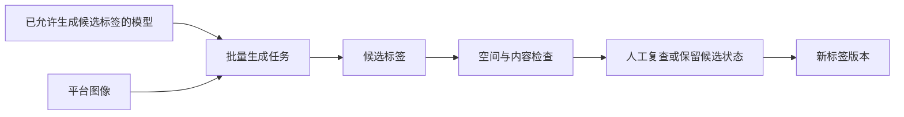

# 少样本实验如何接入平台

> 状态：研究接入设计，不属于阶段 A 的必需实现
> 更新日期：2026-06-13
> 方法背景见 [医学图像少样本学习调研](few_shot_learning_survey.md)

## 1. 先说结论

平台不需要建立一个笼统的“少样本适配器”。

少样本描述的是**用多少病例、如何选择病例、如何评价结果**，不是一种固定训练工具。例如：

- 用 5 个病例训练 nnUNet，仍然使用 nnUNet 适配器；
- 用相近任务权重微调 nnUNet，仍然使用 nnUNet 适配器；
- 使用 UniverSeg 根据 support set 直接推理，才需要 UniverSeg 自己的适配器；
- 某个研究模型通过独立评估后用于批量生成候选标签，应接入标签生成域。

平台只需要额外保存一份**少样本实验清单**，英文文件名可使用 `FewShotProtocol`。它记录本次实验用了哪些 support 病例、K 值、重复次数和随机种子。

这份清单是随实验保存的 YAML 文件，不是新的平台核心实体，也不要求阶段 A 立即实现。

## 2. 本文解决的问题

本文回答：

1. 如何用现有平台建立可信的少样本基线；
2. support、validation 和 test 病例记录在哪里；
3. 什么时候需要为某个方法新建适配器；
4. 研究模型如何在通过评估后进入候选标签生成流程。

本文不处理测试时适应、持续学习、主动学习、多人标注和在线服务编排。这些问题可能也使用少量数据，但它们不是同一套实验规则。

## 3. 一个具体例子

假设要研究“只有 1、3、5 个完整腹部 CT 病例时，能否训练肝、脾、双肾和胰腺分割模型”。

平台可以这样组织：

1. 创建一个训练数据快照，冻结可用训练病例、验证集、测试集、标签版本和预处理方式。
2. 从快照的训练候选池中选出三组 support：
   - 1-shot：`case_001`；
   - 3-shot：`case_001`、`case_014`、`case_027`；
   - 5-shot：再加入 `case_032`、`case_046`。
3. 把这些选择写入少样本实验清单。
4. nnUNet 适配器按清单导出指定病例。
5. 每个 K 值重复若干次，使用不同但固定的病例组合。
6. 所有模型使用同一个独立测试集评价。

这里没有新训练框架。平台只是在原有训练流程前增加了“固定本次到底使用哪些病例”的记录。

## 4. 现有平台记录如何分工

| 记录 | 在少样本实验中保存什么 | 不保存什么 |
|---|---|---|
| 数据登记 | 病例、图像、标签、患者关系、来源和检查结果 | 不随机选择 support |
| 训练数据快照 | 可用训练池、验证集、测试集、标签版本、任务标签映射和预处理方式 | 不为每次 1-shot 或 5-shot 重复复制全部数据 |
| 少样本实验清单 | 具体 support 病例、K 值、重复编号和随机种子 | 不复制影像和标签文件 |
| 训练适配器 | 按快照和实验清单导出数据并训练 | 不临时更换 support 病例 |
| 模型记录 | 模型使用的快照、实验清单、配置和训练结果 | 不代替独立测试记录 |
| 评估记录 | 独立测试集、指标、泄漏检查和失败病例 | 不修改训练事实 |

## 5. 两类不同实验

### 5.1 少量病例训练或微调

适用于 nnUNet、MONAI 或其他需要在目标任务上训练的方法。


实验清单只限制训练适配器可以使用哪些病例。

### 5.2 根据示例直接推理

适用于 UniverSeg、Tyche、Neuroverse3D 和 Medverse 等上下文分割方法。


这类方法的输入结构与 nnUNet 不同，因此只有在实际选择某个方法复现时，才为它建立具体适配器。

研究阶段的预测只用于评价。通过正式评估后，具体适配器才可以进入标签生成域，批量生成候选标签。

## 6. 训练数据快照与实验清单

### 6.1 训练数据快照继续冻结什么

- 任务及其任务标签映射；
- 可供训练选择的病例池；
- 固定的 validation 和 test 病例；
- 患者或泄漏分组；
- 使用的标签版本和文件哈希；
- 标签准入结果；
- 预处理方式；
- 数据使用限制。

同一个快照可以支持多组 1-shot、3-shot 和 5-shot 实验。

### 6.2 实验清单冻结什么

```yaml
schema_version: few_shot_protocol.v1
protocol_id: abdomen_5organ_case_shot_v1
snapshot_id: snap_abdomen_5organ_20260613_v1

objective: low_shot_supervised
shot_unit: case
shots: [1, 3, 5]
repeat_count: 5
seed_base: 20260613

support_episodes:
  - repeat_id: r01
    support_case_ids:
      1_shot: [case_001]
      3_shot: [case_001, case_014, case_027]
      5_shot: [case_001, case_014, case_027, case_032, case_046]

evaluation:
  validation_split_role: validation
  test_split_role: test
  patient_level_disjoint: true
  metrics: [dice, hd95, volume_error]

sampling_constraints:
  require_complete_target_labels: true
  balance_fields: [source_center]
```

关键规则：

1. support 只能从快照的可用训练池中选择；
2. support、validation 和 test 的患者或泄漏分组不能相交；
3. 必须保存实际病例标识，不能只保存随机种子；
4. 若 5-shot 包含 3-shot、3-shot 包含 1-shot，要明确这是嵌套采样；
5. 多器官任务必须说明 K 指“K 个完整多器官病例”还是“每个器官各 K 例”；
6. 清单创建后不覆盖修改，更换病例就创建新版本。

### 6.3 为什么不把每次 support 选择写进快照

训练数据快照描述一份稳定的数据视图。少样本实验清单描述在这份视图上进行的一次具体抽样。

分开保存可以：

- 用同一个测试集比较不同 K 值；
- 用同一个快照比较 nnUNet 和其他方法；
- 避免为每次随机抽样复制快照；
- 不让传统全数据训练被少样本字段干扰。

## 7. 第一批实验只做 low-shot nnUNet

第一批实验的目标不是证明新算法有效，而是确认平台可以进行可复现、无泄漏的少样本评价。

### 7.1 建议实验组

| 实验 | 回答的问题 |
|---|---|
| full-data nnUNet | 数据充分时的参考表现 |
| K-shot nnUNet from scratch | 普通监督模型在低样本下的表现 |
| K-shot nnUNet fine-tuning | 相近任务预训练是否有帮助 |
| 多组重复 K-shot | 结果对 support 选择有多敏感 |

K 可以从 1、3、5、10、20 中按实际数据规模选择，不写死在平台结构中。

### 7.2 nnUNet 适配器的额外检查

适配器接收：

```text
训练数据快照
+ 少样本实验清单
+ repeat_id
+ shot
```

并检查：

- 实际病例数是否等于声明的 shot；
- 每个病例是否具有当前任务需要的完整监督；
- support 是否与 validation 或 test 存在患者泄漏；
- 过滤后每个目标器官是否至少有一个非空标签；
- 未标器官是否被误当成背景；
- 实际导出的病例是否与实验清单完全一致。

现有任务标签映射、空间检查和 nnUNet 目录规则不需要改变。

### 7.3 模型记录

模型记录至少增加实验清单引用：

```yaml
model_id: model_abdomen_nnunet_5shot_r01
method_id: nnunet
training_mode: low_shot_from_scratch
snapshot_id: snap_abdomen_5organ_20260613_v1

few_shot_protocol:
  protocol_id: abdomen_5organ_case_shot_v1
  shot: 5
  repeat_id: r01

training:
  adapter: adapters/nnunet
  code_version: git:abc123
  config_ref: configs/nnunet_3d_fullres.yaml

operational_status: registered
```

只写“5-shot”不够，因为无法知道具体使用了哪些病例。正式测试指标保存在独立评估记录中。

## 8. 什么时候需要新适配器

只有出现以下情况，才为某个具体方法建立适配器：

1. 输入目录、张量结构或预处理与 nnUNet 不同；
2. 方法不在目标任务上训练，而是根据 support 直接推理；
3. 输出多个候选 Mask、概率图或其他特殊文件；
4. 需要独立权重、容器、运行环境或许可管理；
5. 已经确定要复现该方法，而不只是把它列为调研候选。

推荐：

```text
adapters/
  nnunet/
  universeg/
  neuroverse3d/
  label_generation/
```

不推荐：

```text
adapters/
  fewshot/
```

后者会把输入、运行方式和输出完全不同的方法塞进同一个抽象。

## 9. 研究模型如何进入标签生成流程

研究模型只有满足以下条件，才允许批量生成平台候选标签：

1. 使用独立的已验证测试集；
2. 完成多组 support 重复，而不是只报告最好一次；
3. 报告每个器官、病例和中心的失败情况；
4. 验证输出的 shape、spacing、origin、direction 和 affine；
5. 明确代码和模型权重许可；
6. 明确适用模态、扫描范围、输入尺寸和不支持场景；
7. 不在自身或祖先模型生成的标签上完成正式评估。

通过后，流程是：



模型输出始终先登记为候选标签。是否进入训练，由后续训练数据快照的准入规则决定。

## 10. 实现范围

### 10.1 真正开始少样本实验时需要

| 任务 | 产物 |
|---|---|
| 定义 `few_shot_protocol.v1` | YAML 结构和示例 |
| 编写清单校验 | 病例存在、shot 数量、泄漏和标签完整性检查 |
| 扩展 nnUNet 导出 | 接收清单、K 值和重复编号 |
| 扩展模型记录 | 保存清单、K 值和重复编号 |
| 统一评估记录 | 保存每器官、每病例和多次重复汇总 |

这些都可以使用文件和离线脚本完成，不需要数据库、Web 界面或任务队列。

### 10.2 明确延后

- 通用少样本适配器；
- 自动检索 support；
- 元学习 episode 在线生成器；
- 通用 LoRA 或 Adapter 训练框架；
- 测试时适应和持续学习；
- 3D 上下文模型的平台化；
- 自动决定模型是否晋级；
- Web 界面的少样本实验向导。

## 11. 完成标准

少样本实验基础能力成立，至少需要：

1. 一个任务完成 full-data 和至少两个 K 值的 nnUNet 对比；
2. 每个 K 值使用多组已经冻结的 support；
3. 可以从训练数据快照、实验清单和模型记录复现实验；
4. 校验程序能阻止患者泄漏、标签不完整和空类别；
5. 报告多次重复的波动和病例级失败，而不只报告平均 Dice；
6. 尚未验证的研究模型不会因为“有代码”就进入正式适配器目录。

达到这些标准后，再从调研候选中选择一个具体方法进行第二阶段复现。
